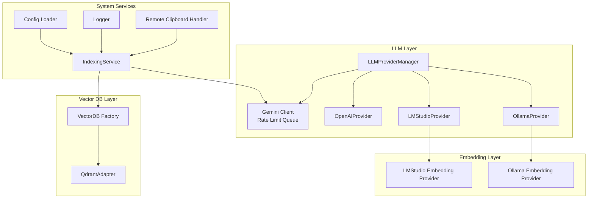
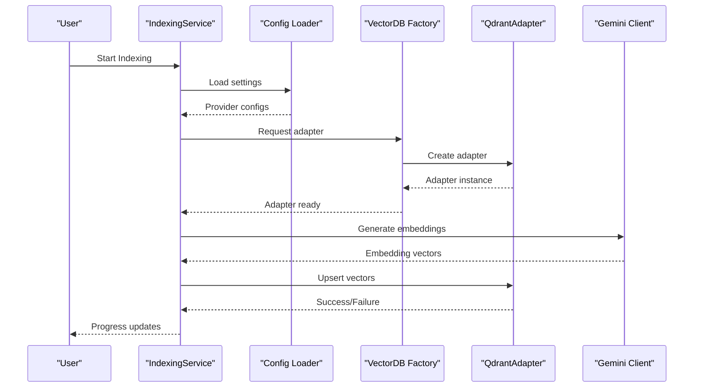
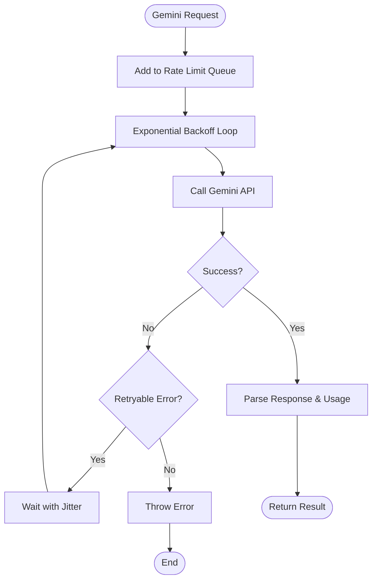
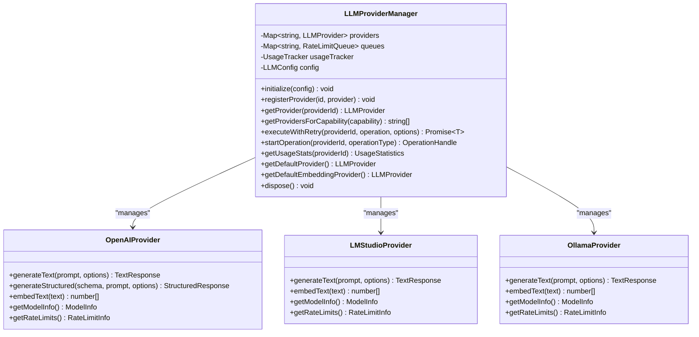
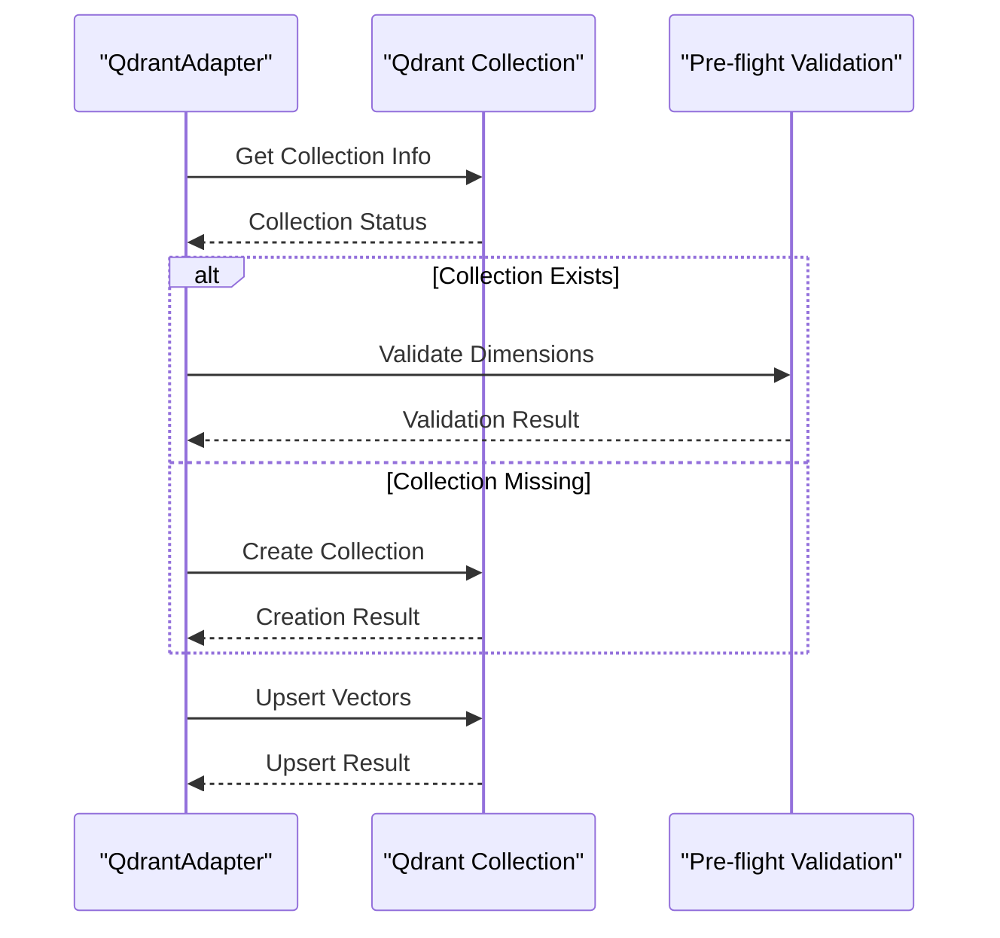
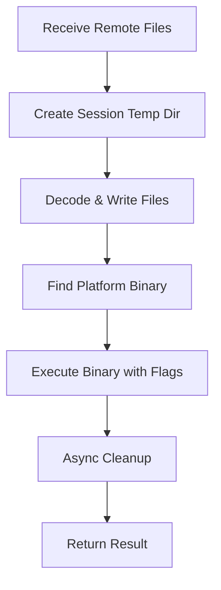
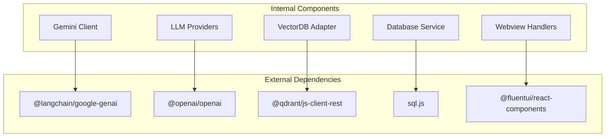

# External Service Integrations

<cite>
**Referenced Files in This Document**
- [llmClient.ts](file://src/agent/llmClient.ts)
- [OpenAIProvider.ts](file://src/core/llm/providers/OpenAIProvider.ts)
- [LMStudioProvider.ts](file://src/core/llm/providers/LMStudioProvider.ts)
- [OllamaProvider.ts](file://src/core/llm/providers/OllamaProvider.ts)
- [LMStudioProvider (embeddings)](file://src/core/indexing/embeddings/LMStudioProvider.ts)
- [OllamaProvider (embeddings)](file://src/core/indexing/embeddings/OllamaProvider.ts)
- [qdrantAdapter.ts](file://src/core/indexing/vectorDb/providers/qdrantAdapter.ts)
- [factory.ts](file://src/core/indexing/vectorDb/factory.ts)
- [IndexingService.ts](file://src/core/services/IndexingService.ts)
- [LLMProviderManager.ts](file://src/core/llm/LLMProviderManager.ts)
- [remoteClipboardHandler.ts](file://src/webview/handlers/remoteClipboardHandler.ts)
- [logger.ts](file://src/shared/logger.ts)
- [configLoader.ts](file://src/config/configLoader.ts)
- [package.json](file://package.json)
</cite>

## Table of Contents
1. [Introduction](#introduction)
2. [Project Structure](#project-structure)
3. [Core Components](#core-components)
4. [Architecture Overview](#architecture-overview)
5. [Detailed Component Analysis](#detailed-component-analysis)
6. [Dependency Analysis](#dependency-analysis)
7. [Performance Considerations](#performance-considerations)
8. [Troubleshooting Guide](#troubleshooting-guide)
9. [Conclusion](#conclusion)

## Introduction
This document provides a comprehensive analysis of external service integrations within the Repomix Runner Plus extension. It focuses on how the system interacts with external APIs and services, including Large Language Model (LLM) providers, local AI inference engines, vector databases, and cross-platform clipboard utilities. The goal is to help developers understand the integration architecture, configuration options, error handling, and operational characteristics of these external services.

## Project Structure
The external service integrations are organized across several key areas:
- LLM providers and client utilities for text generation and structured output
- Local AI inference providers for embeddings and text generation
- Vector database adapters for persistent vector storage and retrieval
- Indexing orchestration and configuration management
- Cross-platform clipboard handling for remote workflows

**Diagram sources**
- [LLMProviderManager.ts:13-187](file://src/core/llm/LLMProviderManager.ts#L13-L187)
- [llmClient.ts:20-25](file://src/agent/llmClient.ts#L20-L25)
- [OpenAIProvider.ts:26-60](file://src/core/llm/providers/OpenAIProvider.ts#L26-L60)
- [LMStudioProvider.ts:19-44](file://src/core/llm/providers/LMStudioProvider.ts#L19-L44)
- [OllamaProvider.ts:18-57](file://src/core/llm/providers/OllamaProvider.ts#L18-L57)
- [LMStudioProvider (embeddings):10-15](file://src/core/indexing/embeddings/LMStudioProvider.ts#L10-L15)
- [OllamaProvider (embeddings):9-10](file://src/core/indexing/embeddings/OllamaProvider.ts#L9-L10)
- [factory.ts:48-78](file://src/core/indexing/vectorDb/factory.ts#L48-L78)
- [qdrantAdapter.ts:12-43](file://src/core/indexing/vectorDb/providers/qdrantAdapter.ts#L12-L43)
- [IndexingService.ts:50-69](file://src/core/services/IndexingService.ts#L50-L69)
- [configLoader.ts:145-229](file://src/config/configLoader.ts#L145-L229)
- [remoteClipboardHandler.ts:10-17](file://src/webview/handlers/remoteClipboardHandler.ts#L10-L17)

**Section sources**
- [LLMProviderManager.ts:13-187](file://src/core/llm/LLMProviderManager.ts#L13-L187)
- [llmClient.ts:20-25](file://src/agent/llmClient.ts#L20-L25)
- [OpenAIProvider.ts:26-60](file://src/core/llm/providers/OpenAIProvider.ts#L26-L60)
- [LMStudioProvider.ts:19-44](file://src/core/llm/providers/LMStudioProvider.ts#L19-L44)
- [OllamaProvider.ts:18-57](file://src/core/llm/providers/OllamaProvider.ts#L18-L57)
- [LMStudioProvider (embeddings):10-15](file://src/core/indexing/embeddings/LMStudioProvider.ts#L10-L15)
- [OllamaProvider (embeddings):9-10](file://src/core/indexing/embeddings/OllamaProvider.ts#L9-L10)
- [factory.ts:48-78](file://src/core/indexing/vectorDb/factory.ts#L48-L78)
- [qdrantAdapter.ts:12-43](file://src/core/indexing/vectorDb/providers/qdrantAdapter.ts#L12-L43)
- [IndexingService.ts:50-69](file://src/core/services/IndexingService.ts#L50-L69)
- [configLoader.ts:145-229](file://src/config/configLoader.ts#L145-L229)
- [remoteClipboardHandler.ts:10-17](file://src/webview/handlers/remoteClipboardHandler.ts#L10-L17)

## Core Components
This section outlines the primary external service integration components and their responsibilities:

- **Gemini Client with Rate Limiting**: Provides rate-limited access to Google Gemini APIs with exponential backoff retry logic and token usage tracking.
- **LLM Provider Manager**: Central orchestrator managing multiple LLM providers (OpenAI-compatible, Ollama, LM Studio) with unified rate limiting and usage tracking.
- **Local AI Providers**: Implementations for Ollama and LM Studio for both text generation and embeddings, supporting local inference workflows.
- **Vector Database Adapter**: QdrantAdapter handles collection lifecycle, upsert operations, querying with grouping, and metadata retrieval.
- **VectorDB Factory**: Resolves provider configuration and creates appropriate adapters with auto-generated collection names.
- **Indexing Service**: Coordinates repository indexing, secret resolution, and integration with external services for embeddings and vector storage.
- **Remote Clipboard Handler**: Manages cross-platform clipboard workflows by invoking native binaries for file processing and clipboard updates.
- **Configuration Loader**: Merges configuration from VS Code settings, repomix.config.json, and overrides with clear precedence rules.

**Section sources**
- [llmClient.ts:20-25](file://src/agent/llmClient.ts#L20-L25)
- [LLMProviderManager.ts:13-52](file://src/core/llm/LLMProviderManager.ts#L13-L52)
- [OpenAIProvider.ts:26-60](file://src/core/llm/providers/OpenAIProvider.ts#L26-L60)
- [LMStudioProvider.ts:19-44](file://src/core/llm/providers/LMStudioProvider.ts#L19-L44)
- [OllamaProvider.ts:18-57](file://src/core/llm/providers/OllamaProvider.ts#L18-L57)
- [qdrantAdapter.ts:12-43](file://src/core/indexing/vectorDb/providers/qdrantAdapter.ts#L12-L43)
- [factory.ts:48-78](file://src/core/indexing/vectorDb/factory.ts#L48-L78)
- [IndexingService.ts:50-69](file://src/core/services/IndexingService.ts#L50-L69)
- [remoteClipboardHandler.ts:10-17](file://src/webview/handlers/remoteClipboardHandler.ts#L10-L17)
- [configLoader.ts:145-229](file://src/config/configLoader.ts#L145-L229)

## Architecture Overview
The system integrates external services through a layered architecture:
- Provider abstraction enables pluggable LLM and embedding backends
- Rate limiting and retry mechanisms ensure robust API interactions
- Vector database integration supports semantic search and retrieval
- Configuration management centralizes external service settings
- Cross-platform utilities enable seamless clipboard workflows

**Diagram sources**
- [IndexingService.ts:78-254](file://src/core/services/IndexingService.ts#L78-L254)
- [configLoader.ts:145-229](file://src/config/configLoader.ts#L145-L229)
- [factory.ts:48-78](file://src/core/indexing/vectorDb/factory.ts#L48-L78)
- [qdrantAdapter.ts:107-251](file://src/core/indexing/vectorDb/providers/qdrantAdapter.ts#L107-L251)
- [llmClient.ts:113-149](file://src/agent/llmClient.ts#L113-L149)

## Detailed Component Analysis

### Gemini Client Integration
The Gemini client implements rate limiting and retry logic for Google Gemini APIs:
- Uses a serial queue with configurable RPM limits
- Implements exponential backoff with jitter for transient errors
- Handles structured and text generation with token usage tracking
- Validates API responses and extracts usage metadata

**Diagram sources**
- [llmClient.ts:20-25](file://src/agent/llmClient.ts#L20-L25)
- [llmClient.ts:51-77](file://src/agent/llmClient.ts#L51-L77)
- [llmClient.ts:113-149](file://src/agent/llmClient.ts#L113-L149)

**Section sources**
- [llmClient.ts:20-25](file://src/agent/llmClient.ts#L20-L25)
- [llmClient.ts:32-42](file://src/agent/llmClient.ts#L32-L42)
- [llmClient.ts:51-77](file://src/agent/llmClient.ts#L51-L77)
- [llmClient.ts:113-149](file://src/agent/llmClient.ts#L113-L149)
- [llmClient.ts:158-209](file://src/agent/llmClient.ts#L158-L209)

### LLM Provider Manager
The LLMProviderManager coordinates multiple providers with unified rate limiting:
- Initializes providers based on configuration
- Creates provider-specific rate limit queues
- Provides capability-based provider selection
- Tracks usage statistics across providers

**Diagram sources**
- [LLMProviderManager.ts:13-187](file://src/core/llm/LLMProviderManager.ts#L13-L187)
- [OpenAIProvider.ts:26-60](file://src/core/llm/providers/OpenAIProvider.ts#L26-L60)
- [LMStudioProvider.ts:19-44](file://src/core/llm/providers/LMStudioProvider.ts#L19-L44)
- [OllamaProvider.ts:18-57](file://src/core/llm/providers/OllamaProvider.ts#L18-L57)

**Section sources**
- [LLMProviderManager.ts:13-52](file://src/core/llm/LLMProviderManager.ts#L13-L52)
- [LLMProviderManager.ts:77-88](file://src/core/llm/LLMProviderManager.ts#L77-L88)
- [LLMProviderManager.ts:93-105](file://src/core/llm/LLMProviderManager.ts#L93-L105)
- [LLMProviderManager.ts:110-122](file://src/core/llm/LLMProviderManager.ts#L110-L122)

### Vector Database Integration (Qdrant)
The QdrantAdapter provides comprehensive vector database operations:
- Automatic collection creation with dimension validation
- Upsert operations with pre-flight validation
- Semantic search with grouping capabilities
- Metadata retrieval and index maintenance

**Diagram sources**
- [qdrantAdapter.ts:53-105](file://src/core/indexing/vectorDb/providers/qdrantAdapter.ts#L53-L105)
- [qdrantAdapter.ts:107-251](file://src/core/indexing/vectorDb/providers/qdrantAdapter.ts#L107-L251)

**Section sources**
- [qdrantAdapter.ts:53-105](file://src/core/indexing/vectorDb/providers/qdrantAdapter.ts#L53-L105)
- [qdrantAdapter.ts:107-251](file://src/core/indexing/vectorDb/providers/qdrantAdapter.ts#L107-L251)
- [qdrantAdapter.ts:253-343](file://src/core/indexing/vectorDb/providers/qdrantAdapter.ts#L253-L343)
- [qdrantAdapter.ts:345-436](file://src/core/indexing/vectorDb/providers/qdrantAdapter.ts#L345-L436)

### Remote Clipboard Integration
The remote clipboard handler manages cross-platform clipboard workflows:
- Decodes base64-encoded files and writes to temporary directories
- Locates and executes platform-specific binaries
- Processes files with configurable copy modes
- Implements asynchronous cleanup

**Diagram sources**
- [remoteClipboardHandler.ts:22-67](file://src/webview/handlers/remoteClipboardHandler.ts#L22-L67)
- [remoteClipboardHandler.ts:137-159](file://src/webview/handlers/remoteClipboardHandler.ts#L137-L159)

**Section sources**
- [remoteClipboardHandler.ts:22-67](file://src/webview/handlers/remoteClipboardHandler.ts#L22-L67)
- [remoteClipboardHandler.ts:107-132](file://src/webview/handlers/remoteClipboardHandler.ts#L107-L132)
- [remoteClipboardHandler.ts:137-159](file://src/webview/handlers/remoteClipboardHandler.ts#L137-L159)
- [remoteClipboardHandler.ts:173-185](file://src/webview/handlers/remoteClipboardHandler.ts#L173-L185)

## Dependency Analysis
External service integrations rely on the following dependencies and their roles:

**Diagram sources**
- [package.json:744-771](file://package.json#L744-L771)
- [llmClient.ts:1-6](file://src/agent/llmClient.ts#L1-L6)
- [OpenAIProvider.ts:1-12](file://src/core/llm/providers/OpenAIProvider.ts#L1-L12)
- [qdrantAdapter.ts:1-4](file://src/core/indexing/vectorDb/providers/qdrantAdapter.ts#L1-L4)

**Section sources**
- [package.json:744-771](file://package.json#L744-L771)
- [llmClient.ts:1-6](file://src/agent/llmClient.ts#L1-L6)
- [OpenAIProvider.ts:1-12](file://src/core/llm/providers/OpenAIProvider.ts#L1-L12)
- [qdrantAdapter.ts:1-4](file://src/core/indexing/vectorDb/providers/qdrantAdapter.ts#L1-L4)

## Performance Considerations
- **Rate Limiting**: Gemini client enforces RPM limits with configurable intervals and carryover capacity
- **Batch Operations**: Vector upsert operations are optimized with pre-flight validation to minimize failed requests
- **Local Inference**: Ollama and LM Studio providers support local execution to reduce latency and bandwidth usage
- **Memory Management**: Temporary file handling in remote clipboard operations includes asynchronous cleanup
- **Connection Pooling**: Vector database operations leverage connection pooling and timeout configurations

## Troubleshooting Guide
Common integration issues and their resolutions:

### Gemini API Issues
- **Rate Limiting**: Monitor RPM configuration and adjust GEMINI_RPM environment variable
- **API Key Errors**: Verify Google API key availability in extension secrets
- **Transient Failures**: Leverage built-in exponential backoff retry mechanism

### Vector Database Issues
- **Collection Dimension Mismatch**: Ensure embedding provider dimension matches collection configuration
- **Hosted Instance Authentication**: Provide Qdrant API key for non-local instances
- **Connection Timeouts**: Adjust timeout settings and verify network connectivity

### Provider Configuration
- **Missing Provider Settings**: Validate VS Code configuration for selected providers
- **Model Availability**: Confirm model names and dimensions match provider capabilities
- **Local Service Connectivity**: Verify Ollama/LM Studio services are running and accessible

**Section sources**
- [llmClient.ts:32-42](file://src/agent/llmClient.ts#L32-L42)
- [qdrantAdapter.ts:28-35](file://src/core/indexing/vectorDb/providers/qdrantAdapter.ts#L28-L35)
- [qdrantAdapter.ts:178-185](file://src/core/indexing/vectorDb/providers/qdrantAdapter.ts#L178-L185)
- [configLoader.ts:145-229](file://src/config/configLoader.ts#L145-L229)

## Conclusion
The Repomix Runner Plus extension demonstrates robust external service integration through:
- Unified provider management with consistent rate limiting and usage tracking
- Flexible embedding and vector database support with automatic provisioning
- Cross-platform clipboard workflows enabling remote processing scenarios
- Comprehensive configuration management with clear precedence rules

The architecture balances reliability (retry logic, validation) with performance (batch operations, local inference) while maintaining extensibility for additional external services.