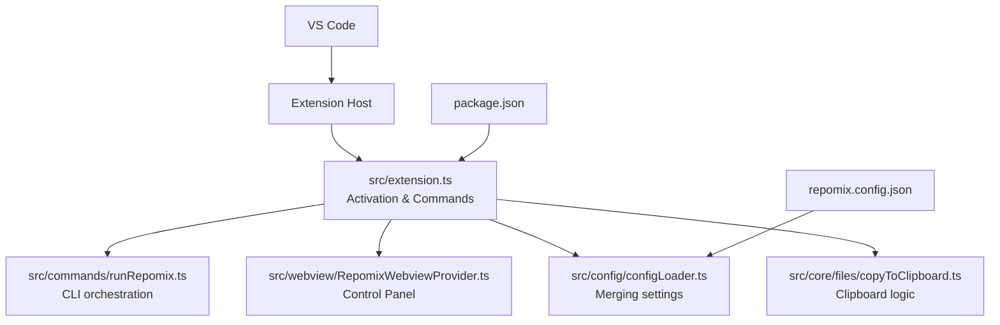
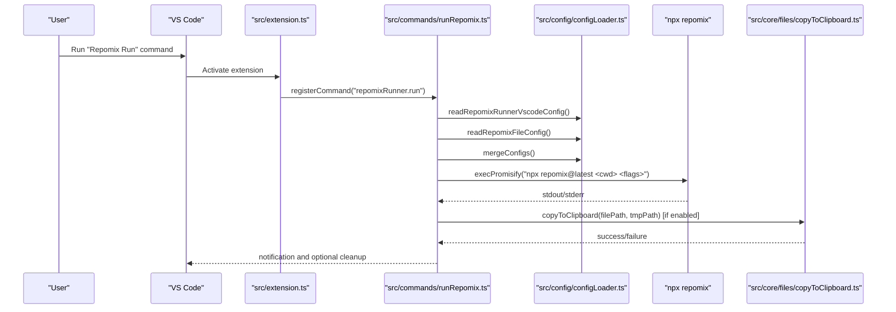
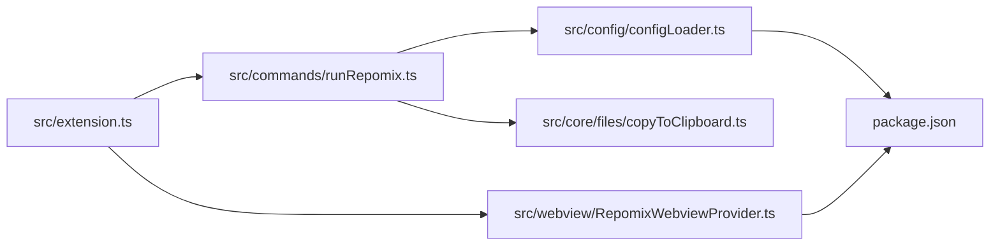

# Getting Started

<cite>
**Referenced Files in This Document**
- [package.json](file://package.json)
- [README.md](file://README.md)
- [repomix.config.json](file://repomix.config.json)
- [src/extension.ts](file://src/extension.ts)
- [src/config/configLoader.ts](file://src/config/configLoader.ts)
- [src/commands/runRepomix.ts](file://src/commands/runRepomix.ts)
- [src/commands/createBundle.ts](file://src/commands/createBundle.ts)
- [src/core/files/copyToClipboard.ts](file://src/core/files/copyToClipboard.ts)
- [src/webview/RepomixWebviewProvider.ts](file://src/webview/RepomixWebviewProvider.ts)
- [scripts/ensure-bin.mjs](file://scripts/ensure-bin.mjs)
- [scripts/package-local.mjs](file://scripts/package-local.mjs)
- [vsc-extension-quickstart.md](file://vsc-extension-quickstart.md)
- [src/test/commands/runRepomix.test.ts](file://src/test/commands/runRepomix.test.ts)
- [verification/verify_copy_button.py](file://verification/verify_copy_button.py)
- [verification/verify_settings.py](file://verification/verify_settings.py)
</cite>

## Table of Contents
1. [Introduction](#introduction)
2. [Project Structure](#project-structure)
3. [Core Components](#core-components)
4. [Architecture Overview](#architecture-overview)
5. [Detailed Component Analysis](#detailed-component-analysis)
6. [Dependency Analysis](#dependency-analysis)
7. [Performance Considerations](#performance-considerations)
8. [Troubleshooting Guide](#troubleshooting-guide)
9. [Conclusion](#conclusion)
10. [Appendices](#appendices)

## Introduction
Repomix Runner Plus is a VS Code extension that packages files into a single output for AI processing. It integrates with the Repomix toolchain and offers:
- A Control Panel for managing bundles and settings
- Cross-platform clipboard workflows (content or file object)
- Bundle management for reusable file groupings
- Optional background indexing for smarter file selection

It supports both local and remote (SSH) development environments with tailored clipboard handling.

## Project Structure
High-level layout relevant to installation and setup:
- package.json declares activation events, commands, views, and configuration contributions
- README.md provides usage, installation, and requirements
- repomix.config.json is the optional project-level configuration file
- src/ contains the extension entrypoint and core logic
- scripts/ contains packaging helpers for contributors
- verification/ contains automated checks for clipboard and UI

**Diagram sources**
- [src/extension.ts](file://src/extension.ts#L43-L742)
- [src/commands/runRepomix.ts](file://src/commands/runRepomix.ts#L48-L154)
- [src/webview/RepomixWebviewProvider.ts](file://src/webview/RepomixWebviewProvider.ts#L19-L288)
- [src/config/configLoader.ts](file://src/config/configLoader.ts#L99-L229)
- [src/core/files/copyToClipboard.ts](file://src/core/files/copyToClipboard.ts#L52-L159)
- [package.json](file://package.json#L1-L608)
- [repomix.config.json](file://repomix.config.json#L1-L43)

**Section sources**
- [package.json](file://package.json#L1-L608)
- [README.md](file://README.md#L1-L142)

## Core Components
- Extension entrypoint and lifecycle: registers commands, views, and background monitors
- Configuration loader: merges VS Code settings, repomix.config.json, and defaults
- CLI orchestration: constructs and executes the Repomix command via npx
- Clipboard manager: handles cross-platform copy modes (content or file object)
- Control Panel: a webview-based UI for bundles, settings, and diagnostics

Key responsibilities:
- Activation and subscriptions in the extension entrypoint
- Command registration for running Repomix on selections, open files, and bundles
- Webview provider for the Control Panel
- Configuration merging and validation
- Clipboard operations with platform-specific logic

**Section sources**
- [src/extension.ts](file://src/extension.ts#L43-L742)
- [src/commands/runRepomix.ts](file://src/commands/runRepomix.ts#L48-L154)
- [src/config/configLoader.ts](file://src/config/configLoader.ts#L99-L229)
- [src/core/files/copyToClipboard.ts](file://src/core/files/copyToClipboard.ts#L52-L159)
- [src/webview/RepomixWebviewProvider.ts](file://src/webview/RepomixWebviewProvider.ts#L19-L288)

## Architecture Overview
End-to-end flow for running Repomix and copying output to clipboard:

**Diagram sources**
- [src/extension.ts](file://src/extension.ts#L459-L461)
- [src/commands/runRepomix.ts](file://src/commands/runRepomix.ts#L48-L154)
- [src/config/configLoader.ts](file://src/config/configLoader.ts#L99-L229)
- [src/core/files/copyToClipboard.ts](file://src/core/files/copyToClipboard.ts#L52-L159)

## Detailed Component Analysis

### Installation and Setup

#### VS Code Marketplace Installation
- Open VS Code
- Open the Extensions view and search for the publisher and extension name
- Install the extension
- Restart VS Code if prompted

Verification:
- The extension contributes commands and views that become available after installation

**Section sources**
- [README.md](file://README.md#L69-L75)
- [package.json](file://package.json#L30-L540)

#### Manual Installation from VSIX (for contributors or offline)
- Build a VSIX locally using the provided packaging script
- Install the resulting VSIX in VS Code

Steps:
1. Ensure prerequisites (Node.js/npm) are installed
2. Run the packaging script to produce a VSIX
3. Install the VSIX in VS Code

Prerequisites:
- Node.js and npm available (for `npx`)
- Windows/macOS/Linux support for clipboard modes per platform requirements

**Section sources**
- [scripts/ensure-bin.mjs](file://scripts/ensure-bin.mjs#L1-L14)
- [scripts/package-local.mjs](file://scripts/package-local.mjs#L72-L93)
- [README.md](file://README.md#L120-L127)

#### Development Setup for Contributors
- Clone the repository
- Install dependencies
- Build the extension
- Launch the extension in a new VS Code window for debugging

Recommended tasks:
- Use the provided watch/watch:esbuild tasks to rebuild on changes
- Use the provided test tasks to run unit tests

**Section sources**
- [vsc-extension-quickstart.md](file://vsc-extension-quickstart.md#L12-L45)
- [package.json](file://package.json#L541-L558)

### System Requirements
- VS Code version compatibility: engine requirement is specified in package.json
- Node.js and npm: required for running npx-based commands
- Platform-specific clipboard dependencies:
  - Linux: requires xclip for file copy mode
  - Windows/macOS: built-in support for file copy mode

**Section sources**
- [package.json](file://package.json#L13-L15)
- [README.md](file://README.md#L120-L127)
- [src/core/files/copyToClipboard.ts](file://src/core/files/copyToClipboard.ts#L11-L18)

### Initial Configuration
Configure Repomix Runner Plus either via VS Code settings or a project-level repomix.config.json file. The extension merges these sources with defaults.

Key configuration areas:
- Runner settings: copy mode, output behavior, verbosity, and config path
- Output settings: file path, style, parsable style, headers, summaries, line numbers, compression, and clipboard behavior
- Include/Ignore patterns: control which files are processed
- Security and token counting settings
- Embedding provider configuration (for advanced features)

How to configure:
- Open the Control Panel from the Activity Bar and navigate to the Settings tab
- Or open VS Code settings and filter by Repomix Runner settings
- Optionally create a repomix.config.json in your project root

Notes:
- repomix.config.json overrides extension settings except for runner settings
- The extension reads and validates configuration at runtime

**Section sources**
- [package.json](file://package.json#L30-L284)
- [repomix.config.json](file://repomix.config.json#L1-L43)
- [src/config/configLoader.ts](file://src/config/configLoader.ts#L99-L229)

### Accessing the Control Panel
- Open the Activity Bar and locate the Repomix icon
- The Control Panel provides:
  - Bundle management
  - Settings access
  - Debug information
  - Agent and indexing controls

The Control Panel is registered as a webview view provider and becomes available after activation.

**Section sources**
- [package.json](file://package.json#L285-L308)
- [src/webview/RepomixWebviewProvider.ts](file://src/webview/RepomixWebviewProvider.ts#L19-L288)
- [src/extension.ts](file://src/extension.ts#L379-L388)

### Essential Commands
Common commands available via Command Palette:
- Repomix Run: run on the project root
- Repomix Run On Open Files: run on currently opened files
- Repomix Create New Bundle: create a new bundle
- Repomix Run Bundle: run a selected bundle
- Repomix Edit Bundle: modify bundle metadata
- Repomix Refresh Bundles: refresh bundle list
- Repomix Settings: open settings quickly
- Repomix Output: open the output channel

Context menu actions:
- Copy as Markdown to Clipboard
- Add/Remove files to/from active bundle
- Run on selection

**Section sources**
- [package.json](file://package.json#L309-L415)
- [README.md](file://README.md#L56-L68)

### Quick Start Examples

#### Create a Bundle
- Right-click files or folders in Explorer
- Choose “Create New Bundle with Selection”
- Name and confirm the bundle
- Add or remove files as needed

Verification:
- The bundle appears in the REPOMIX view
- You can run the bundle from the Control Panel

**Section sources**
- [src/commands/createBundle.ts](file://src/commands/createBundle.ts#L7-L31)
- [package.json](file://package.json#L475-L501)

#### Run Repomix on Selected Files
- Select files in Explorer
- Use the context menu action to run on selection
- Alternatively, use the “Repomix Run On Selection” command

Verification:
- Output file is generated according to settings
- Notification indicates success and whether content was copied to clipboard

**Section sources**
- [src/commands/runRepomix.ts](file://src/commands/runRepomix.ts#L48-L154)
- [package.json](file://package.json#L377-L386)

#### Verify Clipboard Operations
- Ensure copy mode is set appropriately in settings
- For Linux, verify xclip is installed if using file copy mode
- Use the Control Panel’s Debug tab to inspect environment and clipboard status
- Automated verification scripts exist for clipboard and UI checks

**Section sources**
- [src/core/files/copyToClipboard.ts](file://src/core/files/copyToClipboard.ts#L52-L159)
- [README.md](file://README.md#L80-L119)
- [verification/verify_copy_button.py](file://verification/verify_copy_button.py#L32-L147)
- [verification/verify_settings.py](file://verification/verify_settings.py#L24-L112)

## Dependency Analysis
Internal dependencies and relationships:
- The extension entrypoint registers commands and initializes the Control Panel
- The run command depends on configuration loading and clipboard handling
- Clipboard logic varies by platform and copy mode

**Diagram sources**
- [src/extension.ts](file://src/extension.ts#L43-L742)
- [src/commands/runRepomix.ts](file://src/commands/runRepomix.ts#L48-L154)
- [src/config/configLoader.ts](file://src/config/configLoader.ts#L99-L229)
- [src/core/files/copyToClipboard.ts](file://src/core/files/copyToClipboard.ts#L52-L159)
- [src/webview/RepomixWebviewProvider.ts](file://src/webview/RepomixWebviewProvider.ts#L19-L288)
- [package.json](file://package.json#L1-L608)

**Section sources**
- [src/extension.ts](file://src/extension.ts#L43-L742)
- [src/commands/runRepomix.ts](file://src/commands/runRepomix.ts#L48-L154)
- [src/config/configLoader.ts](file://src/config/configLoader.ts#L99-L229)
- [src/core/files/copyToClipboard.ts](file://src/core/files/copyToClipboard.ts#L52-L159)
- [src/webview/RepomixWebviewProvider.ts](file://src/webview/RepomixWebviewProvider.ts#L19-L288)
- [package.json](file://package.json#L1-L608)

## Performance Considerations
- Background indexing monitor batches file changes and re-embeds incrementally
- Debounce reduces frequent reprocessing during rapid saves
- Ignore patterns minimize unnecessary processing of build artifacts and caches

Recommendations:
- Keep .gitignore patterns accurate to avoid unnecessary indexing
- Limit include patterns to relevant subsets for faster runs
- Use compression and parsable styles judiciously to balance readability and token usage

**Section sources**
- [src/extension.ts](file://src/extension.ts#L62-L351)

## Troubleshooting Guide

Common installation issues:
- Linux file copy mode requires xclip
  - Symptom: failure to copy file to clipboard
  - Fix: install xclip and retry
- Remote clipboard on Windows via SSH requires the included binary
  - Symptom: clipboard operations fail in remote environments
  - Fix: ensure the remote environment is detected and the binary is available

Verification steps:
- Use the Control Panel’s Debug tab to check environment and binary status
- Confirm copy mode settings and output path resolution
- Review output channel for error messages

Automated verification:
- Clipboard verification script checks content and file copy modes
- Settings UI verification script validates Control Panel rendering

**Section sources**
- [src/core/files/copyToClipboard.ts](file://src/core/files/copyToClipboard.ts#L11-L18)
- [README.md](file://README.md#L96-L119)
- [src/webview/RepomixWebviewProvider.ts](file://src/webview/RepomixWebviewProvider.ts#L153-L177)
- [verification/verify_copy_button.py](file://verification/verify_copy_button.py#L32-L147)
- [verification/verify_settings.py](file://verification/verify_settings.py#L24-L112)

## Conclusion
Repomix Runner Plus streamlines bundling files for AI processing with a powerful Control Panel, flexible configuration, and robust clipboard workflows across platforms. By following the installation and setup steps, configuring repomix.config.json when needed, and using the provided commands and verification tools, you can quickly integrate Repomix into your workflow.

## Appendices

### Step-by-Step Setup Checklist
- Install the extension from the marketplace or VSIX
- Open the Control Panel from the Activity Bar
- Configure settings or repomix.config.json
- Create a bundle and add files
- Run Repomix on selected files or bundles
- Verify clipboard operations and output

**Section sources**
- [README.md](file://README.md#L69-L75)
- [package.json](file://package.json#L30-L540)
- [repomix.config.json](file://repomix.config.json#L1-L43)