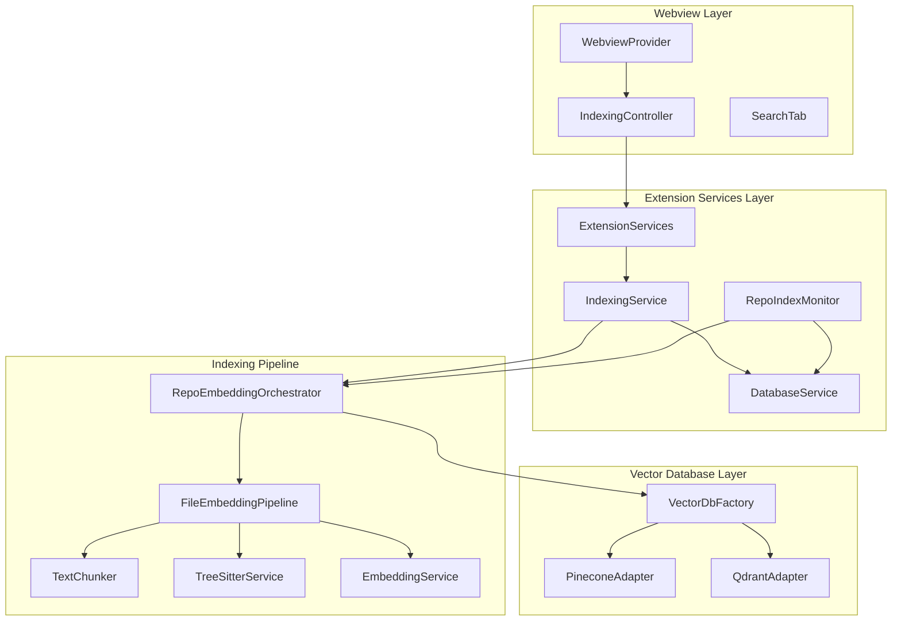
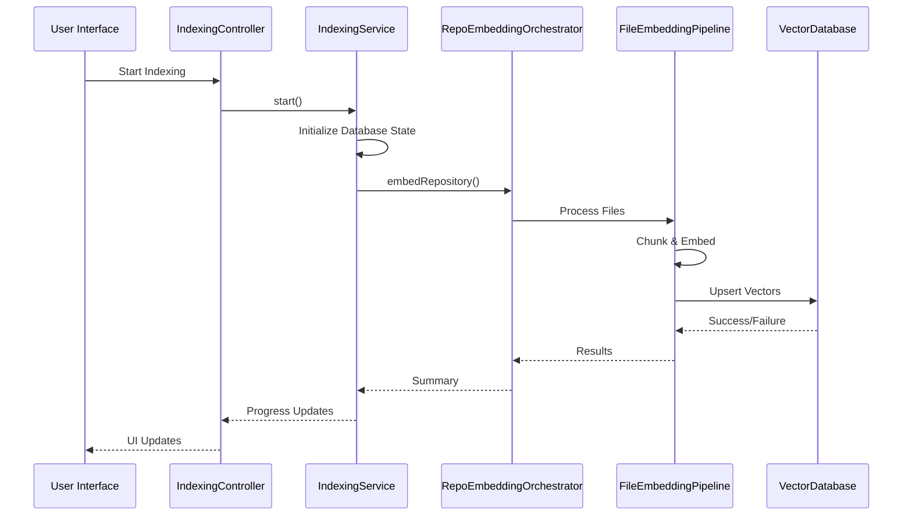
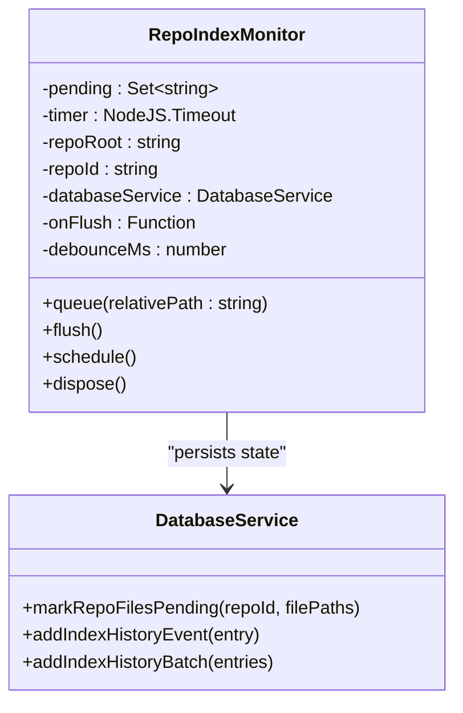
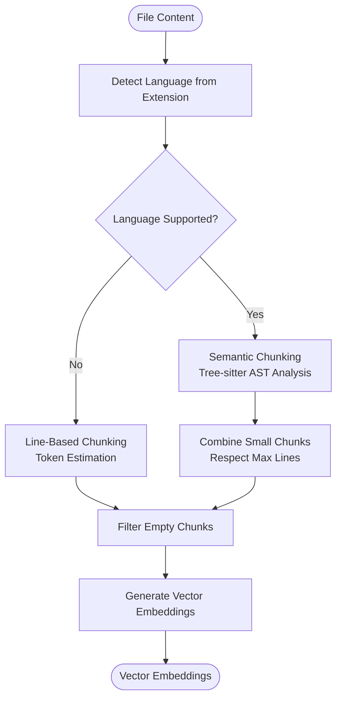
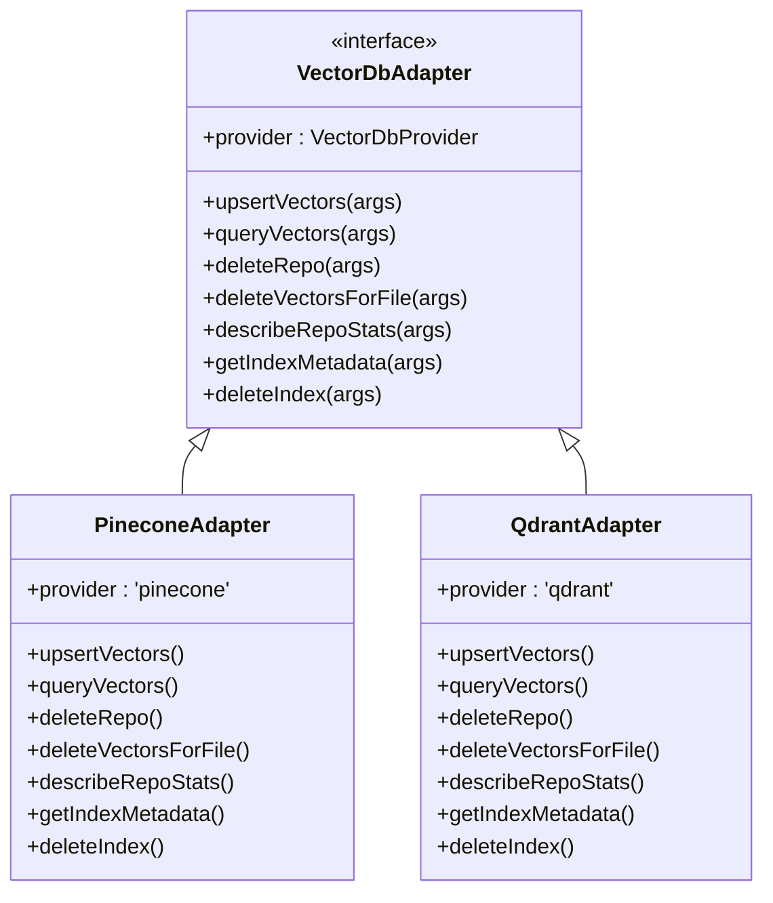

# Background Indexing Service

<cite>
**Referenced Files in This Document**
- [repoIndexer.ts](file://src/core/indexing/repoIndexer.ts)
- [IndexingService.ts](file://src/core/services/IndexingService.ts)
- [repoIndexMonitor.ts](file://src/core/indexing/repoIndexMonitor.ts)
- [repoEmbeddingOrchestrator.ts](file://src/core/indexing/repoEmbeddingOrchestrator.ts)
- [fileEmbeddingPipeline.ts](file://src/core/indexing/fileEmbeddingPipeline.ts)
- [textChunker.ts](file://src/core/indexing/textChunker.ts)
- [treeSitterService.ts](file://src/core/indexing/treeSitterService.ts)
- [embeddingService.ts](file://src/core/indexing/embeddingService.ts)
- [factory.ts](file://src/core/indexing/vectorDb/factory.ts)
- [types.ts](file://src/core/indexing/vectorDb/types.ts)
- [databaseService.ts](file://src/core/storage/databaseService.ts)
- [pineconeAdapter.ts](file://src/core/indexing/vectorDb/providers/pineconeAdapter.ts)
- [qdrantAdapter.ts](file://src/core/indexing/vectorDb/providers/qdrantAdapter.ts)
- [IndexingController.ts](file://src/webview/controllers/IndexingController.ts)
- [ExtensionServices.ts](file://src/core/services/ExtensionServices.ts)
- [RepomixWebviewProvider.ts](file://src/webview/RepomixWebviewProvider.ts)
- [SearchTab.tsx](file://src/webview/components/SearchTab.tsx)
- [SettingsTab.tsx](file://src/webview/components/SettingsTab.tsx)
</cite>

## Update Summary
**Changes Made**
- Updated architecture overview to reflect the new singleton IndexingService pattern
- Revised IndexingController documentation to reflect its role as a thin adapter
- Added ExtensionServices singleton pattern documentation
- Updated component interaction diagrams to show the new service architecture
- Enhanced troubleshooting section with new state management considerations

## Table of Contents
1. [Introduction](#introduction)
2. [Project Structure](#project-structure)
3. [Core Components](#core-components)
4. [Architecture Overview](#architecture-overview)
5. [Detailed Component Analysis](#detailed-component-analysis)
6. [Dependency Analysis](#dependency-analysis)
7. [Performance Considerations](#performance-considerations)
8. [Troubleshooting Guide](#troubleshooting-guide)
9. [Conclusion](#conclusion)

## Introduction
The Background Indexing Service is a sophisticated system designed to continuously maintain and update searchable embeddings for repositories. It provides real-time incremental indexing capabilities, allowing developers to search through their codebase with up-to-date results even as files change during development. The service supports multiple vector database providers (Pinecone and Qdrant), semantic chunking powered by Tree-sitter, and intelligent caching mechanisms for optimal performance.

**Updated** The system has undergone a major architectural refactoring that centralizes all repository indexing logic into a dedicated singleton IndexingService, which survives webview recreations and manages all long-running stateful operations.

## Project Structure
The indexing service follows a modular architecture with clear separation of concerns, now centered around a singleton IndexingService:



**Diagram sources**
- [IndexingController.ts](file://src/webview/controllers/IndexingController.ts#L32-L43)
- [ExtensionServices.ts](file://src/core/services/ExtensionServices.ts#L17-L32)
- [IndexingService.ts](file://src/core/services/IndexingService.ts#L49-L59)
- [repoEmbeddingOrchestrator.ts](file://src/core/indexing/repoEmbeddingOrchestrator.ts#L36-L42)
- [fileEmbeddingPipeline.ts](file://src/core/indexing/fileEmbeddingPipeline.ts#L186-L194)
- [factory.ts](file://src/core/indexing/vectorDb/factory.ts#L17-L20)

**Section sources**
- [repoIndexer.ts](file://src/core/indexing/repoIndexer.ts#L1-L121)
- [IndexingService.ts](file://src/core/services/IndexingService.ts#L1-L373)
- [repoIndexMonitor.ts](file://src/core/indexing/repoIndexMonitor.ts#L52-L104)

## Core Components

### ExtensionServices Singleton
The ExtensionServices class provides a centralized container for all extension-level services, ensuring they persist beyond webview recreations.

**Key Features:**
- **Singleton Pattern**: Ensures only one instance exists throughout extension lifecycle
- **Service Container**: Holds DatabaseService, BundleManager, and IndexingService instances
- **Lifecycle Management**: Created in activate() and disposed in deactivate()
- **State Preservation**: Maintains long-running operations across UI changes

**Section sources**
- [ExtensionServices.ts](file://src/core/services/ExtensionServices.ts#L17-L86)

### IndexingService (Singleton)
The central coordinator that manages the entire indexing lifecycle, handling state transitions, progress tracking, and integration with external services.

**Key Features:**
- **Singleton Pattern**: Survives webview recreations and maintains state continuity
- **State Management**: Tracks indexing state (IDLE, RUNNING, PAUSED, STOPPING)
- **Progress Tracking**: Provides real-time progress updates with file-level granularity
- **Checkpoint System**: Supports pause/resume functionality with database persistence
- **Event Emission**: Emits structured events for UI synchronization
- **Abort Control**: Manages graceful shutdown with AbortController signals

**Updated** The IndexingService now implements a singleton pattern that survives webview recreations, managing all long-running stateful operations previously handled by the IndexingController.

**Section sources**
- [IndexingService.ts](file://src/core/services/IndexingService.ts#L49-L373)

### IndexingController (Thin Adapter)
The IndexingController serves as a lightweight adapter between the webview and the singleton IndexingService.

**Key Features:**
- **Event Subscription**: Subscribes to IndexingService events and forwards them to webview
- **Message Delegation**: Delegates indexing commands to the singleton IndexingService
- **State Restoration**: Handles UI state restoration after webview recreation
- **Non-Indexing Operations**: Manages search operations and UI-specific tasks

**Updated** Reduced from 573 lines to 277 lines, now serving as a thin adapter that delegates all indexing logic to the singleton IndexingService.

**Section sources**
- [IndexingController.ts](file://src/webview/controllers/IndexingController.ts#L32-L117)

### RepoEmbeddingOrchestrator
Manages the complex process of embedding repository files into vector embeddings, supporting both full indexing and incremental updates.

**Key Features:**
- **Mutex Protection**: Prevents concurrent embedding operations
- **Concurrent Processing**: Supports configurable parallel file processing
- **Incremental Updates**: Handles background file change detection
- **Error Recovery**: Comprehensive error handling and reporting

**Section sources**
- [repoEmbeddingOrchestrator.ts](file://src/core/indexing/repoEmbeddingOrchestrator.ts#L36-L42)
- [repoEmbeddingOrchestrator.ts](file://src/core/indexing/repoEmbeddingOrchestrator.ts#L55-L241)

### FileEmbeddingPipeline
The core processing engine that transforms source code into vector embeddings with advanced chunking and semantic analysis.

**Key Features:**
- **Intelligent File Filtering**: Skips binary files and empty content
- **Semantic Chunking**: Uses Tree-sitter for language-aware code splitting
- **Batch Processing**: Optimizes embedding and upsert operations
- **Retry Mechanisms**: Robust error handling with exponential backoff

**Section sources**
- [fileEmbeddingPipeline.ts](file://src/core/indexing/fileEmbeddingPipeline.ts#L186-L469)

## Architecture Overview



**Updated** The architecture now centers around the singleton IndexingService, which manages the entire indexing lifecycle independently of webview state.

**Diagram sources**
- [IndexingController.ts](file://src/webview/controllers/IndexingController.ts#L190-L205)
- [IndexingService.ts](file://src/core/services/IndexingService.ts#L77-L247)
- [repoEmbeddingOrchestrator.ts](file://src/core/indexing/repoEmbeddingOrchestrator.ts#L55-L241)

## Detailed Component Analysis

### Background File Monitoring System

The RepoIndexMonitor implements a sophisticated collector pattern for handling file change events:



**Diagram sources**
- [repoIndexMonitor.ts](file://src/core/indexing/repoIndexMonitor.ts#L52-L104)
- [databaseService.ts](file://src/core/storage/databaseService.ts#L912-L952)

**Key Features:**
- **Debounce Mechanism**: Prevents excessive re-embedding during rapid file saves
- **State Persistence**: Maintains pending file state across extension restarts
- **Batch Processing**: Groups multiple file changes into single re-embedding operations

**Section sources**
- [repoIndexMonitor.ts](file://src/core/indexing/repoIndexMonitor.ts#L14-L246)
- [databaseService.ts](file://src/core/storage/databaseService.ts#L890-L1000)

### Semantic Code Chunking

The text chunking system intelligently splits source code based on language structure:



**Diagram sources**
- [textChunker.ts](file://src/core/indexing/textChunker.ts#L227-L251)
- [treeSitterService.ts](file://src/core/indexing/treeSitterService.ts#L454-L482)

**Section sources**
- [textChunker.ts](file://src/core/indexing/textChunker.ts#L58-L175)
- [treeSitterService.ts](file://src/core/indexing/treeSitterService.ts#L198-L374)

### Vector Database Abstraction

The system supports multiple vector database providers through a unified adapter interface:



**Diagram sources**
- [types.ts](file://src/core/indexing/vectorDb/types.ts#L19-L42)
- [pineconeAdapter.ts](file://src/core/indexing/vectorDb/providers/pineconeAdapter.ts#L5-L11)
- [qdrantAdapter.ts](file://src/core/indexing/vectorDb/providers/qdrantAdapter.ts#L12-L20)

**Section sources**
- [factory.ts](file://src/core/indexing/vectorDb/factory.ts#L17-L62)
- [pineconeAdapter.ts](file://src/core/indexing/vectorDb/providers/pineconeAdapter.ts#L1-L82)
- [qdrantAdapter.ts](file://src/core/indexing/vectorDb/providers/qdrantAdapter.ts#L1-L248)

## Dependency Analysis

```mermaid
graph TB
subgraph "External Dependencies"
TS[Tree-sitter]
PC[Pinecone SDK]
QD[Qdrant Client]
SQL[sql.js]
end
subgraph "Internal Dependencies"
ES[ExtensionServices]
IS[IndexingService]
REPO[RepoEmbeddingOrchestrator]
PIPE[FileEmbeddingPipeline]
DB[DatabaseService]
EMB[EmbeddingService]
END
ES --> IS
IS --> REPO
REPO --> PIPE
PIPE --> TS
PIPE --> EMB
REPO --> PC
REPO --> QD
IS --> DB
DB --> SQL
```

**Updated** The dependency structure now flows through the ExtensionServices singleton, which manages the IndexingService lifecycle.

**Diagram sources**
- [ExtensionServices.ts](file://src/core/services/ExtensionServices.ts#L20-L31)
- [treeSitterService.ts](file://src/core/indexing/treeSitterService.ts#L108-L116)
- [embeddingService.ts](file://src/core/indexing/embeddingService.ts#L28-L62)
- [databaseService.ts](file://src/core/storage/databaseService.ts#L124-L155)

**Section sources**
- [treeSitterService.ts](file://src/core/indexing/treeSitterService.ts#L103-L116)
- [databaseService.ts](file://src/core/storage/databaseService.ts#L111-L155)

## Performance Considerations

### Concurrency Control
The system implements multiple layers of concurrency control:

- **File Processing**: Configurable maximum concurrent files (default: 3)
- **Batch Operations**: Parallel embedding and upsert operations (default: 2 each)
- **API Rate Limiting**: Serialized embedding requests to prevent provider throttling

### Memory Management
- **Transaction Batching**: SQLite operations use transactions to minimize disk I/O
- **Memory-Efficient Chunking**: Text chunks are processed incrementally without loading entire files
- **Garbage Collection**: Proper cleanup of Tree-sitter parsers and language caches

### Storage Optimization
- **Deterministic Vector IDs**: UUID-based IDs ensure consistent vector references
- **Content Hashing**: SHA256 hashes enable efficient change detection
- **Index Statistics**: Regular metadata queries optimize query performance

### State Persistence
**Updated** The singleton IndexingService provides enhanced state persistence:
- **Checkpoint System**: Automatic pause/resume state preservation
- **Abort Control**: Graceful shutdown with AbortController signals
- **UI State Restoration**: Seamless recovery after webview recreations

## Troubleshooting Guide

### Common Issues and Solutions

**Indexing Blocked - Dimension Mismatch**
- **Symptoms**: Indexing shows "blocked" state with dimension mismatch message
- **Cause**: Embedding provider dimension differs from existing vector index
- **Solution**: Reset vector index from Settings tab, then reindex

**Missing API Keys**
- **Symptoms**: Indexing stops with "Missing API key" errors
- **Cause**: Required credentials not configured in extension settings
- **Solution**: Configure API keys in Settings tab under respective providers

**Slow Performance**
- **Symptoms**: Indexing takes longer than expected
- **Cause**: Large repository size or insufficient concurrency settings
- **Solution**: Adjust embedding provider settings and increase concurrency limits

**Webview Recreation Issues**
- **Symptoms**: Indexing state lost after closing and reopening webview
- **Cause**: Previous architecture tied indexing to webview lifecycle
- **Solution**: System now uses singleton IndexingService that survives recreations

**Updated** Added troubleshooting guidance for the new singleton architecture and state persistence features.

**Section sources**
- [IndexingService.ts](file://src/core/services/IndexingService.ts#L78-L84)
- [SettingsTab.tsx](file://src/webview/components/SettingsTab.tsx#L524-L570)

## Conclusion

The Background Indexing Service provides a robust, scalable solution for maintaining searchable code embeddings. Its modular architecture supports multiple vector database providers, intelligent semantic chunking, and real-time incremental updates. The recent architectural refactoring introduces a singleton IndexingService pattern that survives webview recreations, providing enhanced state persistence and improved reliability. The system's comprehensive error handling, progress tracking, and state management make it suitable for both small projects and large enterprise codebases. With proper configuration and monitoring, it delivers accurate search results while minimizing performance impact on development workflows.