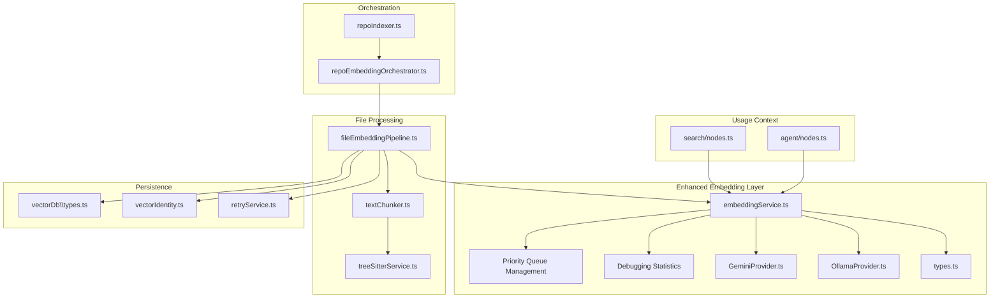
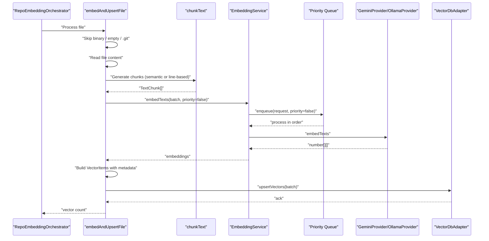
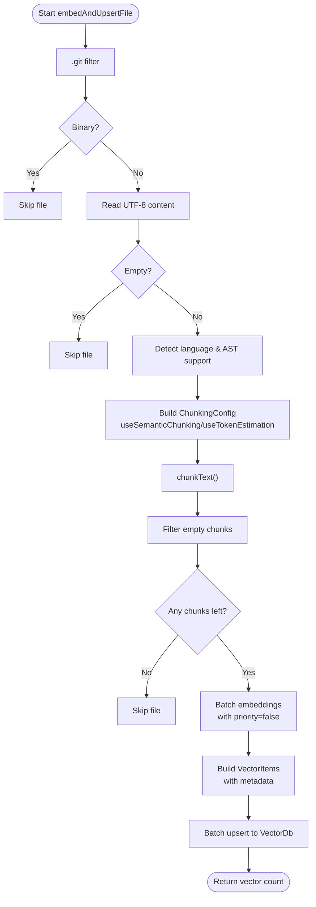
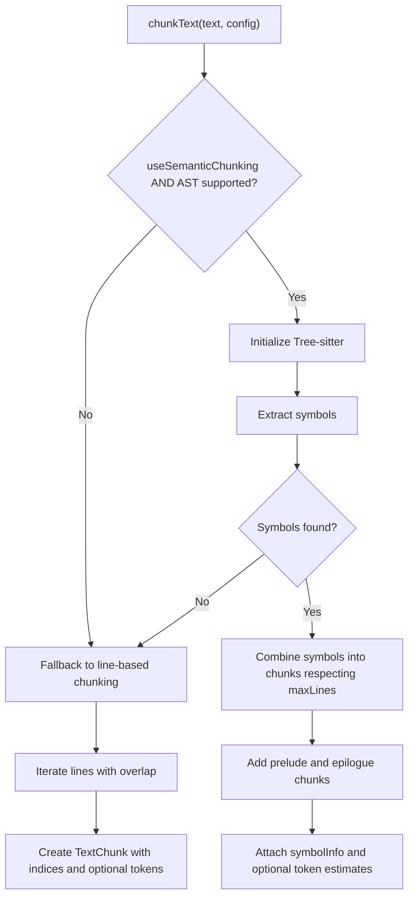
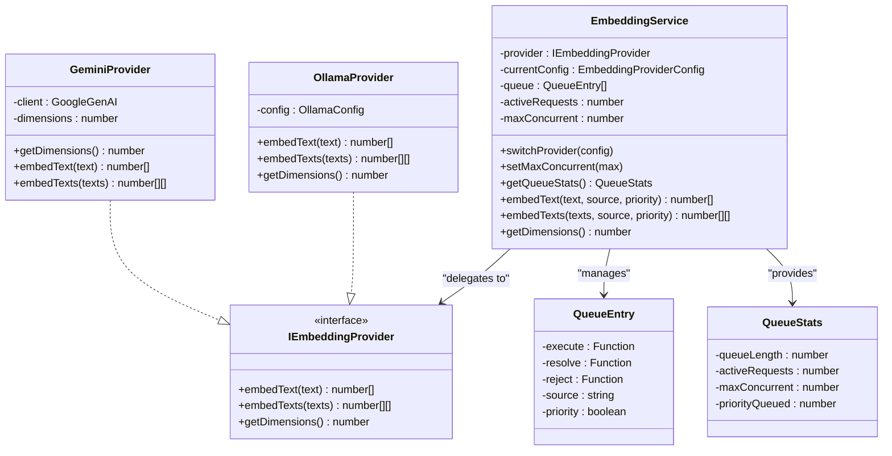
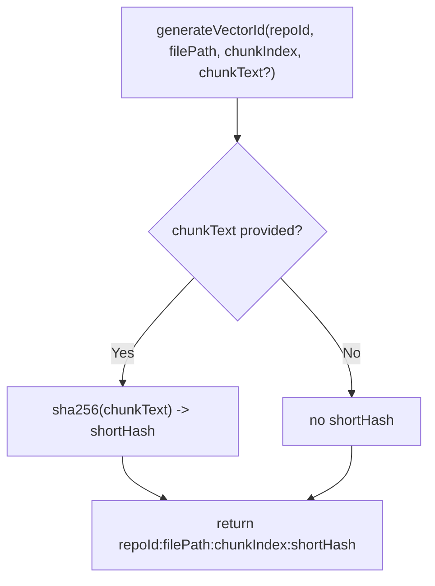
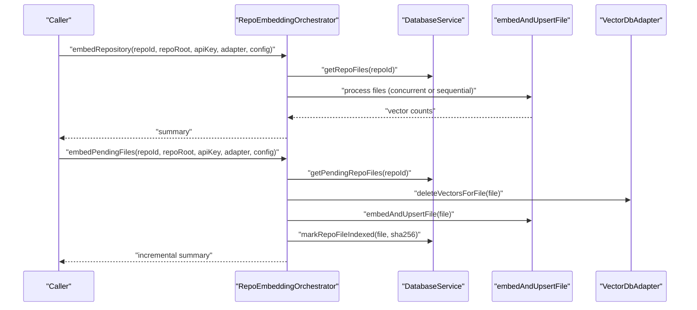
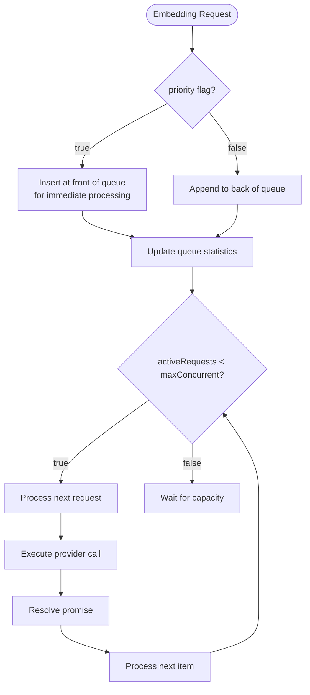
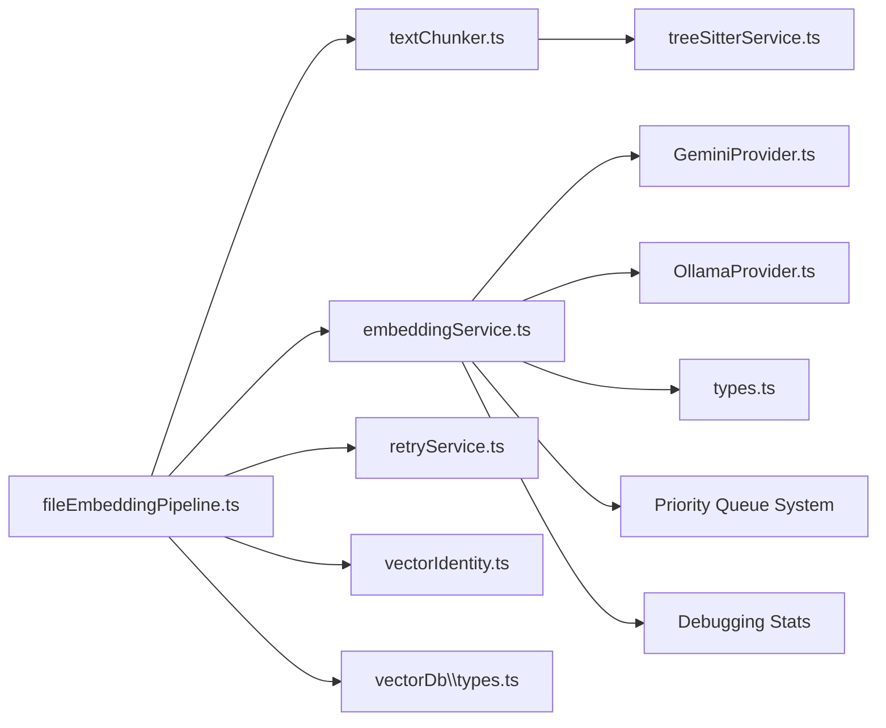

# File Embedding Pipeline

<cite>
**Referenced Files in This Document**
- [fileEmbeddingPipeline.ts](file://src/core/indexing/fileEmbeddingPipeline.ts)
- [textChunker.ts](file://src/core/indexing/textChunker.ts)
- [embeddingService.ts](file://src/core/indexing/embeddingService.ts)
- [GeminiProvider.ts](file://src/core/indexing/embeddings/GeminiProvider.ts)
- [OllamaProvider.ts](file://src/core/indexing/embeddings/OllamaProvider.ts)
- [types.ts](file://src/core/indexing/embeddings/types.ts)
- [treeSitterService.ts](file://src/core/indexing/treeSitterService.ts)
- [repoEmbeddingOrchestrator.ts](file://src/core/indexing/repoEmbeddingOrchestrator.ts)
- [repoIndexer.ts](file://src/core/indexing/repoIndexer.ts)
- [retryService.ts](file://src/core/indexing/retryService.ts)
- [vectorDb\types.ts](file://src/core/indexing/vectorDb/types.ts)
- [vectorIdentity.ts](file://src/core/indexing/vectorIdentity.ts)
- [fileEmbeddingPipeline.test.ts](file://src/test/core/indexing/fileEmbeddingPipeline.test.ts)
- [repomix.config.json](file://repomix.config.json)
- [README.md](file://README.md)
- [nodes.ts](file://src/search/nodes.ts)
</cite>

## Update Summary
**Changes Made**
- Enhanced EmbeddingService with priority queue system and request serialization
- Added comprehensive debugging statistics and queue monitoring capabilities
- Implemented priority-based embedding requests for user-facing operations
- Updated search functionality to utilize priority queuing for improved responsiveness
- Added queue management with configurable concurrency limits

## Table of Contents
1. [Introduction](#introduction)
2. [Project Structure](#project-structure)
3. [Core Components](#core-components)
4. [Architecture Overview](#architecture-overview)
5. [Detailed Component Analysis](#detailed-component-analysis)
6. [Priority Queue System](#priority-queue-system)
7. [Dependency Analysis](#dependency-analysis)
8. [Performance Considerations](#performance-considerations)
9. [Troubleshooting Guide](#troubleshooting-guide)
10. [Conclusion](#conclusion)
11. [Appendices](#appendices)

## Introduction
This document describes the File Embedding Pipeline, which transforms raw file content into vector embeddings suitable for similarity search and retrieval. The pipeline performs:
- Binary file filtering
- Text extraction and validation
- Semantic and line-based text chunking
- Preprocessing and metadata enrichment
- Provider-agnostic embedding generation with priority queue management
- Batched vector upsert into a vector database

It supports multiple embedding providers (Gemini and Ollama) and integrates with a repository orchestrator for full or incremental indexing. The enhanced embedding service now includes priority-based request queuing, comprehensive debugging statistics, and request serialization to prevent rate limiting.

## Project Structure
The embedding pipeline spans several modules:
- Orchestration and repository scanning
- File processing and chunking
- Enhanced embedding service with priority queue management
- Vector database adapter interface
- Utilities for retries, batching, and vector identity

**Diagram sources**
- [repoIndexer.ts](file://src/core/indexing/repoIndexer.ts#L28-L121)
- [repoEmbeddingOrchestrator.ts](file://src/core/indexing/repoEmbeddingOrchestrator.ts#L49-L217)
- [fileEmbeddingPipeline.ts](file://src/core/indexing/fileEmbeddingPipeline.ts#L186-L469)
- [textChunker.ts](file://src/core/indexing/textChunker.ts#L227-L251)
- [treeSitterService.ts](file://src/core/indexing/treeSitterService.ts#L30-L119)
- [embeddingService.ts](file://src/core/indexing/embeddingService.ts#L17-L68)
- [GeminiProvider.ts](file://src/core/indexing/embeddings/GeminiProvider.ts#L8-L77)
- [OllamaProvider.ts](file://src/core/indexing/embeddings/OllamaProvider.ts#L9-L45)
- [types.ts](file://src/core/indexing/embeddings/types.ts#L1-L6)
- [vectorDb\types.ts](file://src/core/indexing/vectorDb/types.ts#L19-L42)
- [vectorIdentity.ts](file://src/core/indexing/vectorIdentity.ts#L17-L32)
- [retryService.ts](file://src/core/indexing/retryService.ts#L22-L71)
- [nodes.ts](file://src/search/nodes.ts#L95-L105)

**Section sources**
- [repoIndexer.ts](file://src/core/indexing/repoIndexer.ts#L28-L121)
- [repoEmbeddingOrchestrator.ts](file://src/core/indexing/repoEmbeddingOrchestrator.ts#L49-L217)
- [fileEmbeddingPipeline.ts](file://src/core/indexing/fileEmbeddingPipeline.ts#L186-L469)
- [textChunker.ts](file://src/core/indexing/textChunker.ts#L227-L251)
- [embeddingService.ts](file://src/core/indexing/embeddingService.ts#L17-L68)
- [vectorDb\types.ts](file://src/core/indexing/vectorDb/types.ts#L19-L42)

## Core Components
- File Embedding Pipeline: Reads files, filters binaries, chunks text, generates embeddings, and upserts vectors with metadata.
- Enhanced Text Chunker: Implements semantic chunking (when AST is available) and line-based fallback with overlap.
- Priority-aware Embedding Service: Provider abstraction with request queuing, priority management, and comprehensive debugging statistics.
- Vector Identity: Deterministic vector ID generation and parsing for integrity and incremental updates.
- Retry and Batching: Robust retries with exponential backoff and batching utilities for throughput.
- Repository Orchestrator: Coordinates repository-wide indexing and incremental updates.

**Section sources**
- [fileEmbeddingPipeline.ts](file://src/core/indexing/fileEmbeddingPipeline.ts#L186-L469)
- [textChunker.ts](file://src/core/indexing/textChunker.ts#L227-L251)
- [embeddingService.ts](file://src/core/indexing/embeddingService.ts#L17-L68)
- [vectorIdentity.ts](file://src/core/indexing/vectorIdentity.ts#L17-L66)
- [retryService.ts](file://src/core/indexing/retryService.ts#L22-L71)
- [repoEmbeddingOrchestrator.ts](file://src/core/indexing/repoEmbeddingOrchestrator.ts#L49-L217)

## Architecture Overview
The pipeline follows a staged flow: repository orchestration feeds file paths to the embedding pipeline, which reads content, chunks it, embeds, and upserts vectors into the vector database. The enhanced embedding service now manages request priorities and provides comprehensive debugging capabilities.

**Diagram sources**
- [repoEmbeddingOrchestrator.ts](file://src/core/indexing/repoEmbeddingOrchestrator.ts#L144-L153)
- [fileEmbeddingPipeline.ts](file://src/core/indexing/fileEmbeddingPipeline.ts#L265-L389)
- [textChunker.ts](file://src/core/indexing/textChunker.ts#L227-L251)
- [embeddingService.ts](file://src/core/indexing/embeddingService.ts#L55-L60)
- [GeminiProvider.ts](file://src/core/indexing/embeddings/GeminiProvider.ts#L48-L76)
- [OllamaProvider.ts](file://src/core/indexing/embeddings/OllamaProvider.ts#L36-L44)
- [vectorDb\types.ts](file://src/core/indexing/vectorDb/types.ts#L22-L25)

## Detailed Component Analysis

### File Embedding Pipeline
Responsibilities:
- Binary detection and skip
- Empty content and directory checks
- Abort signal handling
- Chunking configuration selection (semantic vs token-based)
- Batched embedding with priority queuing and concurrency controls
- Metadata enrichment and vector ID generation
- Comprehensive logging and error wrapping

Key behaviors:
- Binary file filtering uses extension and basename whitelists.
- Chunking is chosen based on AST support and language detection.
- Embeddings are produced in batches with configurable concurrency.
- Vectors are upserted in batches with separate concurrency control.
- Vector IDs include repo, path, chunk index, and a short text hash.

**Diagram sources**
- [fileEmbeddingPipeline.ts](file://src/core/indexing/fileEmbeddingPipeline.ts#L186-L469)
- [textChunker.ts](file://src/core/indexing/textChunker.ts#L227-L251)
- [vectorIdentity.ts](file://src/core/indexing/vectorIdentity.ts#L17-L32)

**Section sources**
- [fileEmbeddingPipeline.ts](file://src/core/indexing/fileEmbeddingPipeline.ts#L186-L469)

### Enhanced Text Chunking Algorithm
Capabilities:
- Semantic chunking via Tree-sitter when AST is supported.
- Line-based chunking with configurable overlap and max lines.
- Token estimation for non-AST files.
- Symbol metadata propagation for semantic context.

Parameters:
- maxLines: default 60 lines per chunk
- overlapLines: default 10 lines between adjacent chunks
- useTokenEstimation: toggles token count estimation
- useSemanticChunking: enables AST-based chunking
- filePath: used for language detection

**Diagram sources**
- [textChunker.ts](file://src/core/indexing/textChunker.ts#L227-L251)
- [textChunker.ts](file://src/core/indexing/textChunker.ts#L58-L175)
- [textChunker.ts](file://src/core/indexing/textChunker.ts#L180-L217)
- [treeSitterService.ts](file://src/core/indexing/treeSitterService.ts#L30-L119)

**Section sources**
- [textChunker.ts](file://src/core/indexing/textChunker.ts#L24-L30)
- [textChunker.ts](file://src/core/indexing/textChunker.ts#L39-L47)
- [textChunker.ts](file://src/core/indexing/textChunker.ts#L58-L175)
- [textChunker.ts](file://src/core/indexing/textChunker.ts#L180-L217)
- [textChunker.ts](file://src/core/indexing/textChunker.ts#L227-L251)

### Priority-aware Embedding Service Abstraction
The EmbeddingService provides a unified interface to switch between providers and produce embeddings for single texts or batches. It now includes advanced queue management with priority-based request processing and comprehensive debugging capabilities.

**Updated** Enhanced with priority queue system, request serialization, and debugging statistics

Key Features:
- Priority-based request queuing with configurable concurrency limits
- Comprehensive queue statistics for debugging and monitoring
- Request serialization to prevent rate limiting
- Priority flag for user-facing operations (search, agent)
- Source tracking for request identification

**Diagram sources**
- [embeddingService.ts](file://src/core/indexing/embeddingService.ts#L17-L68)
- [embeddingService.ts](file://src/core/indexing/embeddingService.ts#L75-L83)
- [embeddingService.ts](file://src/core/indexing/embeddingService.ts#L89-L103)
- [types.ts](file://src/core/indexing/embeddings/types.ts#L1-L6)
- [GeminiProvider.ts](file://src/core/indexing/embeddings/GeminiProvider.ts#L8-L77)
- [OllamaProvider.ts](file://src/core/indexing/embeddings/OllamaProvider.ts#L9-L45)

**Section sources**
- [embeddingService.ts](file://src/core/indexing/embeddingService.ts#L5-L15)
- [embeddingService.ts](file://src/core/indexing/embeddingService.ts#L21-L46)
- [embeddingService.ts](file://src/core/indexing/embeddingService.ts#L68-L71)
- [embeddingService.ts](file://src/core/indexing/embeddingService.ts#L76-L83)
- [embeddingService.ts](file://src/core/indexing/embeddingService.ts#L132-L157)
- [GeminiProvider.ts](file://src/core/indexing/embeddings/GeminiProvider.ts#L16-L18)
- [OllamaProvider.ts](file://src/core/indexing/embeddings/OllamaProvider.ts#L42-L44)

### Vector Identity and Metadata
Vector IDs are deterministic and include repoId, file path, chunk index, and a short text hash. Metadata includes repoId, file path, chunk indices, source, text hash, and updated timestamp. This enables:
- Debugging and verification
- Incremental updates by detecting changed chunks
- Safe upsert/delete semantics

**Diagram sources**
- [vectorIdentity.ts](file://src/core/indexing/vectorIdentity.ts#L17-L32)

**Section sources**
- [vectorIdentity.ts](file://src/core/indexing/vectorIdentity.ts#L17-L66)

### Repository Orchestration and Incremental Updates
The orchestrator coordinates:
- Full repository embedding with concurrency control
- Incremental embedding for pending files (delete-then-upsert pattern)
- File synchronization with hash-based change detection
- Progress callbacks and graceful abort handling

**Diagram sources**
- [repoEmbeddingOrchestrator.ts](file://src/core/indexing/repoEmbeddingOrchestrator.ts#L49-L217)
- [repoEmbeddingOrchestrator.ts](file://src/core/indexing/repoEmbeddingOrchestrator.ts#L267-L454)
- [fileEmbeddingPipeline.ts](file://src/core/indexing/fileEmbeddingPipeline.ts#L186-L469)
- [vectorDb\types.ts](file://src/core/indexing/vectorDb/types.ts#L35-L35)

**Section sources**
- [repoEmbeddingOrchestrator.ts](file://src/core/indexing/repoEmbeddingOrchestrator.ts#L49-L217)
- [repoEmbeddingOrchestrator.ts](file://src/core/indexing/repoEmbeddingOrchestrator.ts#L267-L454)

## Priority Queue System

### Queue Management Architecture
The enhanced embedding service now implements a sophisticated priority queue system that ensures critical user-facing operations receive immediate processing while maintaining fairness for background indexing tasks.

**Updated** New priority queue system with comprehensive request management

**Diagram sources**
- [embeddingService.ts](file://src/core/indexing/embeddingService.ts#L89-L103)
- [embeddingService.ts](file://src/core/indexing/embeddingService.ts#L108-L127)

### Queue Statistics and Debugging
The service provides comprehensive debugging capabilities through queue statistics that help monitor and troubleshoot embedding operations.

**Updated** New debugging statistics and monitoring capabilities

Key Statistics:
- `queueLength`: Current number of queued requests
- `activeRequests`: Number of currently executing requests
- `maxConcurrent`: Maximum concurrent requests allowed
- `priorityQueued`: Number of priority requests in queue

Usage Examples:
- Search operations use `priority: true` to ensure immediate processing
- Indexing operations use `priority: false` for background processing
- Queue statistics logged for monitoring and debugging

**Section sources**
- [embeddingService.ts](file://src/core/indexing/embeddingService.ts#L76-L83)
- [nodes.ts](file://src/search/nodes.ts#L99-L105)

## Dependency Analysis
- File Embedding Pipeline depends on:
  - Enhanced Text chunker for segmentation
  - Priority-aware Embedding service for provider abstraction
  - Vector DB adapter for persistence
  - Retry service for robustness
  - Tree-sitter service for AST-based chunking
  - Vector identity for deterministic IDs

**Diagram sources**
- [fileEmbeddingPipeline.ts](file://src/core/indexing/fileEmbeddingPipeline.ts#L4-L10)
- [textChunker.ts](file://src/core/indexing/textChunker.ts#L17-L19)
- [embeddingService.ts](file://src/core/indexing/embeddingService.ts#L1-L3)
- [vectorDb\types.ts](file://src/core/indexing/vectorDb/types.ts#L1-L1)
- [treeSitterService.ts](file://src/core/indexing/treeSitterService.ts#L1-L1)
- [GeminiProvider.ts](file://src/core/indexing/embeddings/GeminiProvider.ts#L1-L2)
- [OllamaProvider.ts](file://src/core/indexing/embeddings/OllamaProvider.ts#L1-L1)
- [types.ts](file://src/core/indexing/embeddings/types.ts#L1-L6)

**Section sources**
- [fileEmbeddingPipeline.ts](file://src/core/indexing/fileEmbeddingPipeline.ts#L4-L10)
- [textChunker.ts](file://src/core/indexing/textChunker.ts#L17-L19)
- [embeddingService.ts](file://src/core/indexing/embeddingService.ts#L1-L3)
- [vectorDb\types.ts](file://src/core/indexing/vectorDb/types.ts#L1-L1)

## Performance Considerations
- Enhanced concurrency controls:
  - maxConcurrentFiles: controls parallel file processing
  - maxConcurrentBatches: parallel embedding batches
  - maxConcurrentUpserts: parallel upsert batches
  - maxConcurrent: new parameter controlling embedding request concurrency
- Priority-based processing:
  - User-facing operations (search, agent) use priority=true
  - Background indexing uses priority=false
  - Queue serialization prevents rate limiting
- Batching:
  - embeddingBatchSize and vectorDbBatchSize reduce API overhead
- Memory management:
  - Line-based chunking minimizes memory footprint
  - Token estimation avoids over-allocation for non-AST files
- Parallelization:
  - Concurrent file processing with graceful abort
  - Batched embeddings and upserts with backoff retries
  - Priority queue ensures responsive user operations
- Large repositories:
  - Incremental embedding reduces full re-index cost
  - Hash-based change detection skips unchanged files
  - Queue statistics enable performance monitoring

[No sources needed since this section provides general guidance]

## Troubleshooting Guide
Common issues and resolutions:
- Binary files not embedded:
  - Expected behavior; binary extensions and unknown extensions are skipped.
- Empty files:
  - Skipped automatically; ensure content is present.
- .git internals:
  - Explicitly filtered; ensure paths do not leak into processing.
- Provider configuration errors:
  - Missing API keys or invalid Ollama config cause initialization failures.
- Dimension mismatches:
  - Gemini provider specifies fixed dimensions; verify provider alignment.
- Network/API failures:
  - Exponential backoff is applied; check provider quotas and connectivity.
- Vector DB errors:
  - Ensure adapter supports required operations and credentials are valid.
- Queue congestion:
  - Monitor queue statistics using `embeddingService.getQueueStats()`
  - Adjust `maxConcurrent` setting to balance responsiveness and throughput
- Priority starvation:
  - Ensure user-facing operations use `priority: true`
  - Background tasks automatically use lower priority

**Section sources**
- [fileEmbeddingPipeline.ts](file://src/core/indexing/fileEmbeddingPipeline.ts#L200-L213)
- [fileEmbeddingPipeline.ts](file://src/core/indexing/fileEmbeddingPipeline.ts#L241-L249)
- [embeddingService.ts](file://src/core/indexing/embeddingService.ts#L31-L44)
- [GeminiProvider.ts](file://src/core/indexing/embeddings/GeminiProvider.ts#L41-L43)
- [retryService.ts](file://src/core/indexing/retryService.ts#L22-L58)
- [embeddingService.ts](file://src/core/indexing/embeddingService.ts#L76-L83)

## Conclusion
The File Embedding Pipeline provides a robust, extensible, and efficient mechanism to transform repository content into searchable vectors. Its enhanced priority queue system ensures responsive user operations while maintaining fair background processing. The modular design supports multiple providers, safe incremental updates, comprehensive debugging capabilities, and strong error handling, enabling reliable embeddings at scale.

[No sources needed since this section summarizes without analyzing specific files]

## Appendices

### Configuration Examples
Provider configuration examples for EmbeddingService:

- Enhanced EmbeddingService with Priority Queue
  - provider: "gemini" | "ollama"
  - gemini.apiKey: "<your-gemini-api-key>"
  - ollama.url: "<http://localhost:11434>"
  - ollama.model: "<model-name>"
  - ollama.dimension: <vector-dimension>
  - maxConcurrent: <number> (default: 1)
  - Example reference: [embeddingService.ts](file://src/core/indexing/embeddingService.ts#L5-L15)

- Pipeline configuration (EmbeddingPipelineConfig)
  - chunkingConfig: overrides for maxLines, overlapLines, useTokenEstimation, useSemanticChunking
  - embeddingBatchSize: default 10
  - vectorDbBatchSize: default 50
  - maxConcurrentFiles: default 3
  - maxConcurrentBatches: default 2
  - maxConcurrentUpserts: default 2
  - Example references:
    - [fileEmbeddingPipeline.ts](file://src/core/indexing/fileEmbeddingPipeline.ts#L130-L143)
    - [fileEmbeddingPipeline.ts](file://src/core/indexing/fileEmbeddingPipeline.ts#L289-L291)
    - [fileEmbeddingPipeline.ts](file://src/core/indexing/fileEmbeddingPipeline.ts#L397-L399)

- Priority Usage Examples
  - Search operations: `embeddingService.embedText(query, 'search', true)`
  - Indexing operations: `embeddingService.embedTexts(chunks, 'indexing', false)`
  - Example reference: [nodes.ts](file://src/search/nodes.ts#L101-L102)

- Repository indexing configuration (repomix.config.json)
  - maxFileSize: controls maximum file size considered
  - ignore patterns: .gitignore, dot-ignore, defaults, custom patterns
  - Example reference: [repomix.config.json](file://repomix.config.json#L1-L43)

- Repository indexing flow
  - Scans repository, applies ignore patterns, persists file list to database
  - Example reference: [repoIndexer.ts](file://src/core/indexing/repoIndexer.ts#L28-L121)

**Section sources**
- [embeddingService.ts](file://src/core/indexing/embeddingService.ts#L5-L15)
- [fileEmbeddingPipeline.ts](file://src/core/indexing/fileEmbeddingPipeline.ts#L130-L143)
- [nodes.ts](file://src/search/nodes.ts#L101-L102)
- [repomix.config.json](file://repomix.config.json#L1-L43)
- [repoIndexer.ts](file://src/core/indexing/repoIndexer.ts#L28-L121)

### Validation and Metadata Expectations
- Vector metadata fields verified by tests:
  - repoId, filePath, chunkIndex, source, textHash, updatedAt
  - Example reference: [fileEmbeddingPipeline.test.ts](file://src/test/core/indexing/fileEmbeddingPipeline.test.ts#L62-L82)

**Section sources**
- [fileEmbeddingPipeline.test.ts](file://src/test/core/indexing/fileEmbeddingPipeline.test.ts#L62-L82)

### Priority Queue Monitoring
- Queue statistics for debugging:
  - `embeddingService.getQueueStats()` returns current queue status
  - Monitor queueLength, activeRequests, maxConcurrent, priorityQueued
  - Example reference: [embeddingService.ts](file://src/core/indexing/embeddingService.ts#L76-L83)

**Section sources**
- [embeddingService.ts](file://src/core/indexing/embeddingService.ts#L76-L83)