# Indexing and Search System

<cite>
**Referenced Files in This Document**
- [repoIndexer.ts](file://src/core/indexing/repoIndexer.ts)
- [fileEmbeddingPipeline.ts](file://src/core/indexing/fileEmbeddingPipeline.ts)
- [textChunker.ts](file://src/core/indexing/textChunker.ts)
- [treeSitterService.ts](file://src/core/indexing/treeSitterService.ts)
- [embeddingService.ts](file://src/core/indexing/embeddingService.ts)
- [GeminiProvider.ts](file://src/core/indexing/embeddings/GeminiProvider.ts)
- [OllamaProvider.ts](file://src/core/indexing/embeddings/OllamaProvider.ts)
- [vectorDb/factory.ts](file://src/core/indexing/vectorDb/factory.ts)
- [pineconeAdapter.ts](file://src/core/indexing/vectorDb/providers/pineconeAdapter.ts)
- [qdrantAdapter.ts](file://src/core/indexing/vectorDb/providers/qdrantAdapter.ts)
- [repoEmbeddingOrchestrator.ts](file://src/core/indexing/repoEmbeddingOrchestrator.ts)
- [repoIndexMonitor.ts](file://src/core/indexing/repoIndexMonitor.ts)
- [retryService.ts](file://src/core/indexing/retryService.ts)
- [migrationService.ts](file://src/core/indexing/migrationService.ts)
- [queryExpansion.ts](file://src/core/indexing/queryExpansion.ts)
- [filteredFileExpander.ts](file://src/core/files/filteredFileExpander.ts)
- [gitignoreUtils.ts](file://src/core/files/gitignoreUtils.ts)
- [copySelectedFilesToClipboard.ts](file://src/commands/copySelectedFilesToClipboard.ts)
- [copySelectedFilesAsCompressed.ts](file://src/commands/copySelectedFilesAsCompressed.ts)
- [SearchTab.tsx](file://src/webview/components/SearchTab.tsx)
- [RepomixWebviewProvider.ts](file://src/webview/RepomixWebviewProvider.ts)
- [IndexingController.ts](file://src/webview/controllers/IndexingController.ts)
- [messageSchemas.ts](file://src/webview/messageSchemas.ts)
</cite>

## Update Summary
**Changes Made**
- Enhanced repository indexing with comprehensive gitignore filtering throughout the file expansion and indexing processes
- Added filteredFileExpander utility for accurate context selection with gitignore rule application
- Integrated gitignoreUtils for recursive .gitignore pattern discovery and proper path scoping
- Updated file expansion commands to respect gitignore filtering for clipboard operations
- Improved accuracy of context selection by applying gitignore rules consistently across the entire system

## Table of Contents
1. [Introduction](#introduction)
2. [Project Structure](#project-structure)
3. [Core Components](#core-components)
4. [Architecture Overview](#architecture-overview)
5. [Enhanced Gitignore Filtering System](#enhanced-gitignore-filtering-system)
6. [Detailed Component Analysis](#detailed-component-analysis)
7. [Dependency Analysis](#dependency-analysis)
8. [Performance Considerations](#performance-considerations)
9. [Troubleshooting Guide](#troubleshooting-guide)
10. [Conclusion](#conclusion)
11. [Appendices](#appendices)

## Introduction
This document describes the Indexing and Search System that powers semantic search over repositories. It covers the vector database integration architecture, the file embedding pipeline from text chunking through embedding generation to vector storage, repository indexing and incremental updates, monitoring mechanisms, provider abstractions for embeddings and vector databases, semantic search capabilities, query expansion, and operational concerns such as retries, migrations, and error handling in distributed indexing scenarios.

**Updated** Enhanced with comprehensive gitignore filtering system that ensures accurate context selection by applying .gitignore rules consistently throughout file expansion, indexing, and search processes.

## Project Structure
The indexing and search system is organized around a cohesive set of modules under the core indexing subsystem:
- Repository indexing: enumerating files and writing them to the local database with gitignore filtering
- File embedding pipeline: reading, chunking, embedding, batching, and upserting vectors
- Vector database adapters: provider-agnostic interfaces for Pinecone and Qdrant
- Embedding providers: abstraction for Gemini and Ollama
- Orchestration: coordinating repository-wide and incremental embedding
- Monitoring: collecting file changes and debouncing re-indexing
- Utilities: retry/backoff, migration, query expansion, and gitignore filtering
- **Enhanced Gitignore System**: comprehensive .gitignore pattern discovery and application

```mermaid
graph TB
subgraph "Indexing"
RI["repoIndexer.ts"]
REO["repoEmbeddingOrchestrator.ts"]
RP["repoIndexMonitor.ts"]
END
subgraph "Embedding Pipeline"
FEP["fileEmbeddingPipeline.ts"]
TC["textChunker.ts"]
TS["treeSitterService.ts"]
ES["embeddingService.ts"]
GP["GeminiProvider.ts"]
OP["OllamaProvider.ts"]
END
subgraph "Vector DB"
VF["vectorDb/factory.ts"]
PCA["pineconeAdapter.ts"]
QDA["qdrantAdapter.ts"]
END
subgraph "Gitignore System"
GIF["gitignoreUtils.ts"]
FFE["filteredFileExpander.ts"]
CMD["Command Integration"]
END
subgraph "Operations"
RS["retryService.ts"]
MS["migrationService.ts"]
QE["queryExpansion.ts"]
END
RI --> GIF
RI --> REO
REO --> FEP
FEP --> TC
FEP --> ES
ES --> GP
ES --> OP
FEP --> VF
VF --> PCA
VF --> QDA
RP --> REO
REO --> RS
MS --> VF
QE --> REO
FFE --> CMD
```

**Diagram sources**
- [repoIndexer.ts](file://src/core/indexing/repoIndexer.ts#L29-L114)
- [repoEmbeddingOrchestrator.ts](file://src/core/indexing/repoEmbeddingOrchestrator.ts#L49-L217)
- [repoIndexMonitor.ts](file://src/core/indexing/repoIndexMonitor.ts#L52-L224)
- [fileEmbeddingPipeline.ts](file://src/core/indexing/fileEmbeddingPipeline.ts#L186-L469)
- [textChunker.ts](file://src/core/indexing/textChunker.ts#L227-L253)
- [treeSitterService.ts](file://src/core/indexing/treeSitterService.ts#L30-L119)
- [embeddingService.ts](file://src/core/indexing/embeddingService.ts#L17-L70)
- [GeminiProvider.ts](file://src/core/indexing/embeddings/GeminiProvider.ts#L8-L78)
- [OllamaProvider.ts](file://src/core/indexing/embeddings/OllamaProvider.ts#L9-L46)
- [vectorDb/factory.ts](file://src/core/indexing/vectorDb/factory.ts#L17-L62)
- [pineconeAdapter.ts](file://src/core/indexing/vectorDb/providers/pineconeAdapter.ts#L5-L82)
- [qdrantAdapter.ts](file://src/core/indexing/vectorDb/providers/qdrantAdapter.ts#L12-L244)
- [gitignoreUtils.ts](file://src/core/files/gitignoreUtils.ts#L17-L100)
- [filteredFileExpander.ts](file://src/core/files/filteredFileExpander.ts#L29-L169)
- [copySelectedFilesToClipboard.ts](file://src/commands/copySelectedFilesToClipboard.ts#L84-L89)
- [copySelectedFilesAsCompressed.ts](file://src/commands/copySelectedFilesAsCompressed.ts#L75-L80)

**Section sources**
- [repoIndexer.ts](file://src/core/indexing/repoIndexer.ts#L1-L114)
- [repoEmbeddingOrchestrator.ts](file://src/core/indexing/repoEmbeddingOrchestrator.ts#L1-L655)
- [repoIndexMonitor.ts](file://src/core/indexing/repoIndexMonitor.ts#L1-L224)
- [fileEmbeddingPipeline.ts](file://src/core/indexing/fileEmbeddingPipeline.ts#L1-L469)
- [textChunker.ts](file://src/core/indexing/textChunker.ts#L1-L253)
- [treeSitterService.ts](file://src/core/indexing/treeSitterService.ts#L1-L119)
- [embeddingService.ts](file://src/core/indexing/embeddingService.ts#L1-L70)
- [GeminiProvider.ts](file://src/core/indexing/embeddings/GeminiProvider.ts#L1-L78)
- [OllamaProvider.ts](file://src/core/indexing/embeddings/OllamaProvider.ts#L1-L46)
- [vectorDb/factory.ts](file://src/core/indexing/vectorDb/factory.ts#L1-L62)
- [pineconeAdapter.ts](file://src/core/indexing/vectorDb/providers/pineconeAdapter.ts#L1-L82)
- [qdrantAdapter.ts](file://src/core/indexing/vectorDb/providers/qdrantAdapter.ts#L1-L244)
- [gitignoreUtils.ts](file://src/core/files/gitignoreUtils.ts#L1-L100)
- [filteredFileExpander.ts](file://src/core/files/filteredFileExpander.ts#L1-L169)
- [retryService.ts](file://src/core/indexing/retryService.ts#L1-L71)
- [migrationService.ts](file://src/core/indexing/migrationService.ts#L1-L63)
- [queryExpansion.ts](file://src/core/indexing/queryExpansion.ts#L1-L64)
- [copySelectedFilesToClipboard.ts](file://src/commands/copySelectedFilesToClipboard.ts#L1-L171)
- [copySelectedFilesAsCompressed.ts](file://src/commands/copySelectedFilesAsCompressed.ts#L1-L196)
- [SearchTab.tsx](file://src/webview/components/SearchTab.tsx#L1-L1217)
- [RepomixWebviewProvider.ts](file://src/webview/RepomixWebviewProvider.ts#L1-L308)

## Core Components
- Repository indexer: discovers files via globbing with comprehensive ignore patterns including .gitignore rules, writes them to the local database in batches, and logs timing metrics.
- Embedding pipeline: reads files, determines binary vs text, filters binaries, chunks text using semantic or line-based strategies, generates embeddings via a pluggable provider, batches and retries operations, and upserts vectors into the vector database.
- Vector database adapters: abstract Pinecone and Qdrant behind a common interface for upsert, query, delete, and metadata retrieval.
- Embedding providers: Gemini and Ollama implementations expose a uniform interface for single and batch embeddings with dimension guarantees.
- Orchestrator: coordinates full repository embedding and incremental updates, supports concurrency, progress callbacks, abort signals, and statistics.
- Monitor: collects file changes with a debounce mechanism, persists pending state, and triggers incremental embedding.
- Utilities: exponential backoff retry, batching helpers, migration service for switching providers safely, query expansion for semantic variants, and comprehensive gitignore filtering system.
- **Enhanced Gitignore System**: recursive .gitignore pattern discovery with proper path scoping, directory filtering for performance optimization, and accurate context selection.

**Section sources**
- [repoIndexer.ts](file://src/core/indexing/repoIndexer.ts#L29-L114)
- [fileEmbeddingPipeline.ts](file://src/core/indexing/fileEmbeddingPipeline.ts#L186-L469)
- [vectorDb/factory.ts](file://src/core/indexing/vectorDb/factory.ts#L17-L62)
- [pineconeAdapter.ts](file://src/core/indexing/vectorDb/providers/pineconeAdapter.ts#L5-L82)
- [qdrantAdapter.ts](file://src/core/indexing/vectorDb/providers/qdrantAdapter.ts#L12-L244)
- [embeddingService.ts](file://src/core/indexing/embeddingService.ts#L17-L70)
- [GeminiProvider.ts](file://src/core/indexing/embeddings/GeminiProvider.ts#L8-L78)
- [OllamaProvider.ts](file://src/core/indexing/embeddings/OllamaProvider.ts#L9-L46)
- [repoEmbeddingOrchestrator.ts](file://src/core/indexing/repoEmbeddingOrchestrator.ts#L49-L217)
- [repoIndexMonitor.ts](file://src/core/indexing/repoIndexMonitor.ts#L52-L224)
- [retryService.ts](file://src/core/indexing/retryService.ts#L22-L71)
- [migrationService.ts](file://src/core/indexing/migrationService.ts#L7-L63)
- [queryExpansion.ts](file://src/core/indexing/queryExpansion.ts#L23-L64)
- [gitignoreUtils.ts](file://src/core/files/gitignoreUtils.ts#L17-L100)
- [filteredFileExpander.ts](file://src/core/files/filteredFileExpander.ts#L29-L169)
- [SearchTab.tsx](file://src/webview/components/SearchTab.tsx#L169-L243)

## Architecture Overview
The system integrates file discovery, chunking, embedding, and vector storage with a focus on reliability and scalability. It supports two embedding providers and two vector database providers, with a factory selecting the appropriate adapter based on persisted extension state. Incremental updates are handled via a monitor that queues changes and triggers targeted re-embedding. **Updated** Enhanced with comprehensive gitignore filtering that ensures accurate context selection by applying .gitignore rules consistently throughout the entire system.

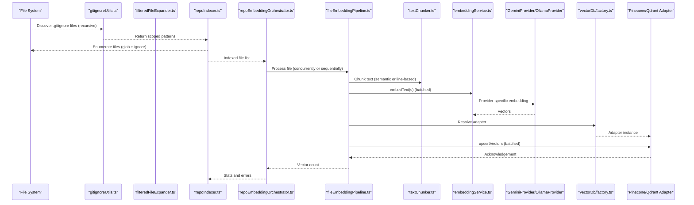

**Diagram sources**
- [repoIndexer.ts](file://src/core/indexing/repoIndexer.ts#L29-L114)
- [repoEmbeddingOrchestrator.ts](file://src/core/indexing/repoEmbeddingOrchestrator.ts#L49-L217)
- [fileEmbeddingPipeline.ts](file://src/core/indexing/fileEmbeddingPipeline.ts#L186-L469)
- [textChunker.ts](file://src/core/indexing/textChunker.ts#L227-L253)
- [embeddingService.ts](file://src/core/indexing/embeddingService.ts#L17-L70)
- [GeminiProvider.ts](file://src/core/indexing/embeddings/GeminiProvider.ts#L8-L78)
- [OllamaProvider.ts](file://src/core/indexing/embeddings/OllamaProvider.ts#L9-L46)
- [vectorDb/factory.ts](file://src/core/indexing/vectorDb/factory.ts#L17-L62)
- [pineconeAdapter.ts](file://src/core/indexing/vectorDb/providers/pineconeAdapter.ts#L5-L82)
- [qdrantAdapter.ts](file://src/core/indexing/vectorDb/providers/qdrantAdapter.ts#L12-L244)
- [gitignoreUtils.ts](file://src/core/files/gitignoreUtils.ts#L17-L100)
- [filteredFileExpander.ts](file://src/core/files/filteredFileExpander.ts#L29-L169)

## Enhanced Gitignore Filtering System

### Comprehensive .gitignore Pattern Discovery
The system now includes a sophisticated gitignore filtering mechanism that ensures accurate context selection by applying .gitignore rules consistently throughout the entire indexing and search process.

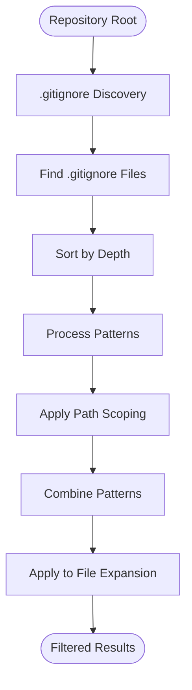

**Diagram sources**
- [gitignoreUtils.ts](file://src/core/files/gitignoreUtils.ts#L17-L100)

### Recursive .gitignore Pattern Collection
The gitignoreUtils module recursively discovers all .gitignore files in the directory tree and collects their patterns with proper path scoping according to git ignore specification.

- **Recursive Discovery**: Traverses the entire directory tree to find all .gitignore files
- **Depth-Based Processing**: Sorts .gitignore files by depth to ensure proper precedence
- **Pattern Scoping**: Applies proper path scoping rules for accurate matching
- **Performance Optimization**: Skips .git directory to avoid indexing git internals

### Filtered File Expansion Utility
The filteredFileExpander provides a comprehensive solution for expanding URIs while respecting .gitignore rules for accurate context selection.

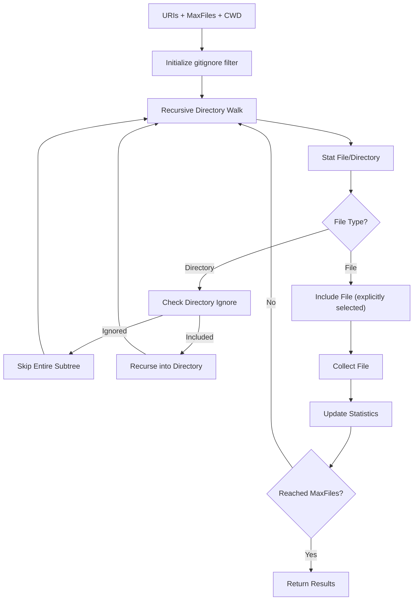

**Diagram sources**
- [filteredFileExpander.ts](file://src/core/files/filteredFileExpander.ts#L78-L125)

### Gitignore Pattern Application Rules
The system applies comprehensive .gitignore rules with proper path scoping:

- **Root Patterns**: Patterns without leading slash apply recursively to all subdirectories
- **Absolute Patterns**: Patterns starting with `/` are relative to the .gitignore location
- **Global Patterns**: Patterns starting with `**/` are preserved as-is for global matching
- **Directory Patterns**: Patterns ending with `/` apply to directories and their contents
- **Recursive Matching**: Non-root patterns also match recursively within their subdirectory tree

### Integration with File Expansion Commands
The gitignore filtering system is integrated into file expansion commands for clipboard operations:

- **copySelectedFilesToClipboard**: Respects .gitignore filtering based on configuration
- **copySelectedFilesAsCompressed**: Applies .gitignore filtering for compressed content generation
- **Statistics Tracking**: Provides ignored file counts and total file statistics
- **Performance Optimization**: Skips entire ignored directory subtrees for better performance

**Section sources**
- [gitignoreUtils.ts](file://src/core/files/gitignoreUtils.ts#L17-L100)
- [filteredFileExpander.ts](file://src/core/files/filteredFileExpander.ts#L29-L169)
- [copySelectedFilesToClipboard.ts](file://src/commands/copySelectedFilesToClipboard.ts#L84-L89)
- [copySelectedFilesAsCompressed.ts](file://src/commands/copySelectedFilesAsCompressed.ts#L75-L80)

## Detailed Component Analysis

### Repository Indexing with Gitignore Filtering
- Discovers files using globbing with comprehensive ignore patterns including .gitignore rules.
- Loads .gitignore patterns from all subdirectories with proper path scoping.
- Merges .gitignore patterns with default ignore patterns and binary exclusions.
- Writes file paths to the local database in chunks to avoid SQL limits.
- Generates a repository identifier and clears prior file records for deterministic reindexing.
- Emits timing metrics and structured logs for observability.

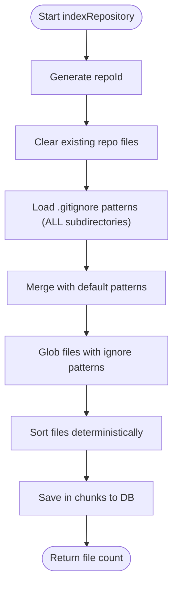

**Diagram sources**
- [repoIndexer.ts](file://src/core/indexing/repoIndexer.ts#L29-L114)

**Section sources**
- [repoIndexer.ts](file://src/core/indexing/repoIndexer.ts#L29-L114)

### File Embedding Pipeline
- Binary detection: skips files with known binary extensions and common text basenames without extensions.
- Content read with retry-on-failure and abort-signal support.
- Chunking: semantic chunking via tree-sitter when supported, otherwise line-based with overlap.
- Embedding: provider abstraction with batched embedding and dimension validation.
- Vector upsert: batches vectors and retries failures; metadata includes repoId, file path, chunk indices, and hashes.
- Concurrency: configurable concurrency for file processing, embedding batches, and upsert batches.

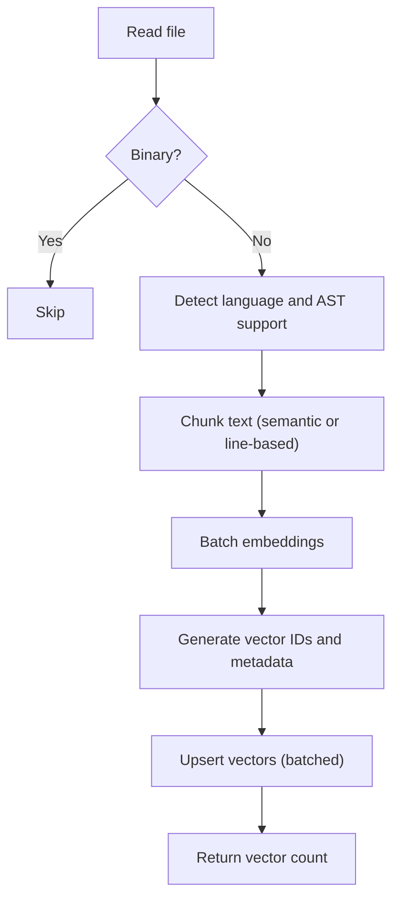

**Diagram sources**
- [fileEmbeddingPipeline.ts](file://src/core/indexing/fileEmbeddingPipeline.ts#L186-L469)
- [textChunker.ts](file://src/core/indexing/textChunker.ts#L227-L253)
- [treeSitterService.ts](file://src/core/indexing/treeSitterService.ts#L30-L119)

**Section sources**
- [fileEmbeddingPipeline.ts](file://src/core/indexing/fileEmbeddingPipeline.ts#L186-L469)
- [textChunker.ts](file://src/core/indexing/textChunker.ts#L227-L253)
- [treeSitterService.ts](file://src/core/indexing/treeSitterService.ts#L30-L119)

### Embedding Providers Abstraction
- EmbeddingService selects and initializes a provider based on configuration, ensuring dimensions match expectations.
- GeminiProvider: fixed dimension embedding for a specific model, validates output shape.
- OllamaProvider: HTTP client to a local or remote Ollama endpoint, supports batch via parallel requests.

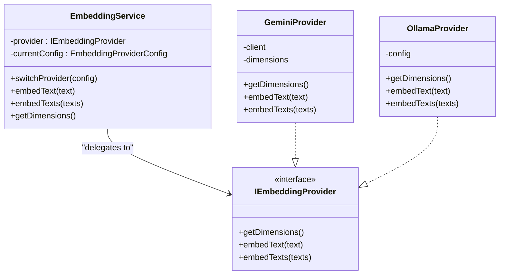

**Diagram sources**
- [embeddingService.ts](file://src/core/indexing/embeddingService.ts#L17-L70)
- [GeminiProvider.ts](file://src/core/indexing/embeddings/GeminiProvider.ts#L8-L78)
- [OllamaProvider.ts](file://src/core/indexing/embeddings/OllamaProvider.ts#L9-L46)

**Section sources**
- [embeddingService.ts](file://src/core/indexing/embeddingService.ts#L17-L70)
- [GeminiProvider.ts](file://src/core/indexing/embeddings/GeminiProvider.ts#L8-L78)
- [OllamaProvider.ts](file://src/core/indexing/embeddings/OllamaProvider.ts#L9-L46)

### Vector Database Adapters
- Factory resolves provider from extension state and secrets, returning a typed adapter.
- PineconeAdapter: delegates to a service wrapper for upsert, query, delete, and metadata retrieval.
- QdrantAdapter: deterministic vector IDs, upsert with payload, query with repoId filter, delete by repo or file, and metadata extraction.

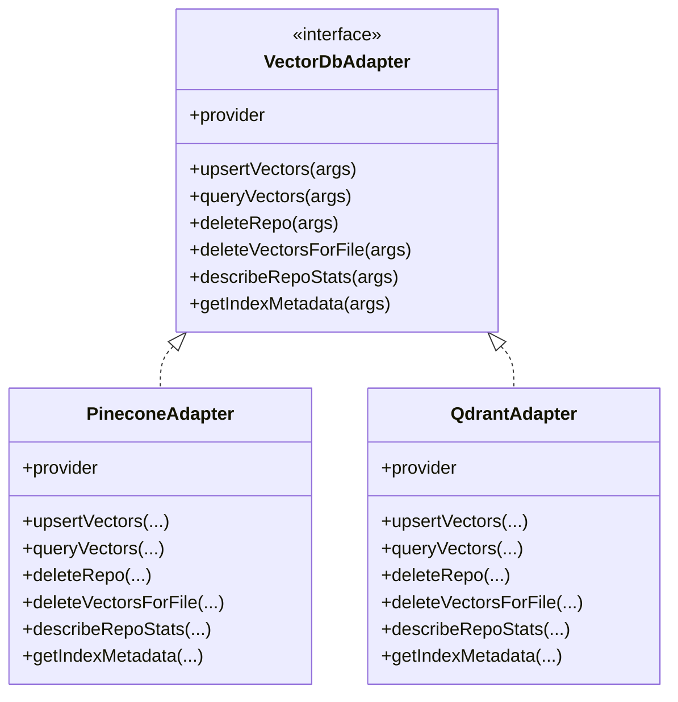

**Diagram sources**
- [vectorDb/factory.ts](file://src/core/indexing/vectorDb/factory.ts#L17-L62)
- [pineconeAdapter.ts](file://src/core/indexing/vectorDb/providers/pineconeAdapter.ts#L5-L82)
- [qdrantAdapter.ts](file://src/core/indexing/vectorDb/providers/qdrantAdapter.ts#L12-L244)

**Section sources**
- [vectorDb/factory.ts](file://src/core/indexing/vectorDb/factory.ts#L17-L62)
- [pineconeAdapter.ts](file://src/core/indexing/vectorDb/providers/pineconeAdapter.ts#L5-L82)
- [qdrantAdapter.ts](file://src/core/indexing/vectorDb/providers/qdrantAdapter.ts#L12-L244)

### Repository Embedding Orchestration
- Full repository embedding: fetches files from DB, processes concurrently or sequentially, aggregates statistics, and reports errors.
- Incremental embedding: processes only pending files, deletes old vectors before re-upserting, marks files indexed with content hash, and cleans up missing files.
- Synchronization: compares DB state with filesystem to detect added, modified, and deleted files and updates pending sets accordingly.

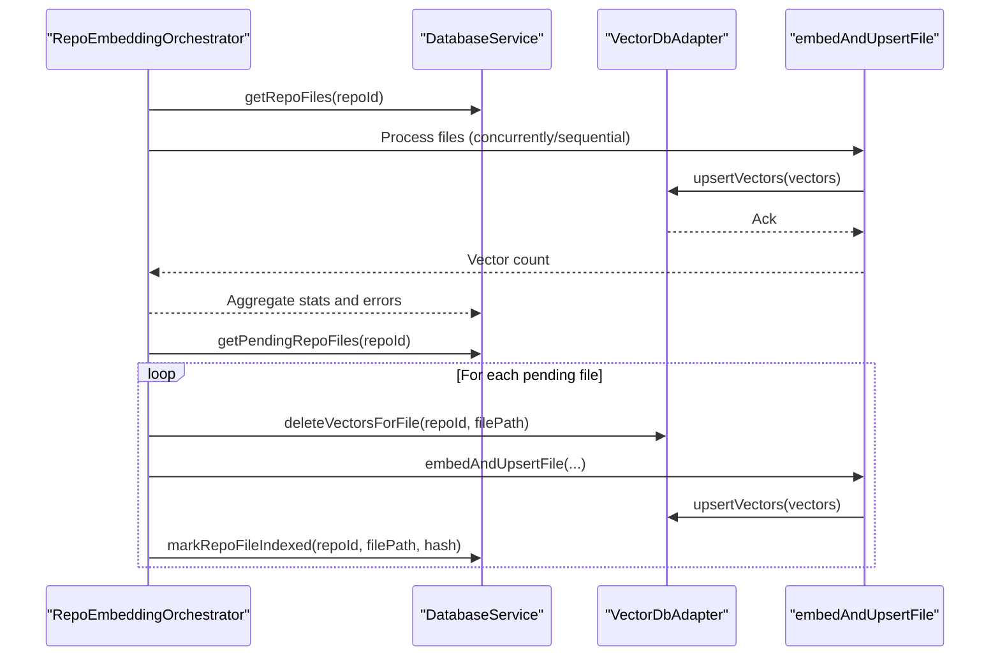

**Diagram sources**
- [repoEmbeddingOrchestrator.ts](file://src/core/indexing/repoEmbeddingOrchestrator.ts#L49-L217)
- [fileEmbeddingPipeline.ts](file://src/core/indexing/fileEmbeddingPipeline.ts#L186-L469)
- [pineconeAdapter.ts](file://src/core/indexing/vectorDb/providers/pineconeAdapter.ts#L39-L41)
- [qdrantAdapter.ts](file://src/core/indexing/vectorDb/providers/qdrantAdapter.ts#L144-L174)

**Section sources**
- [repoEmbeddingOrchestrator.ts](file://src/core/indexing/repoEmbeddingOrchestrator.ts#L49-L217)
- [repoEmbeddingOrchestrator.ts](file://src/core/indexing/repoEmbeddingOrchestrator.ts#L267-L454)

### Repository Index Monitor
- Collects file changes and debounces them to reduce churn.
- Persists pending files to the database and triggers incremental embedding.
- Provides graceful shutdown and logging.

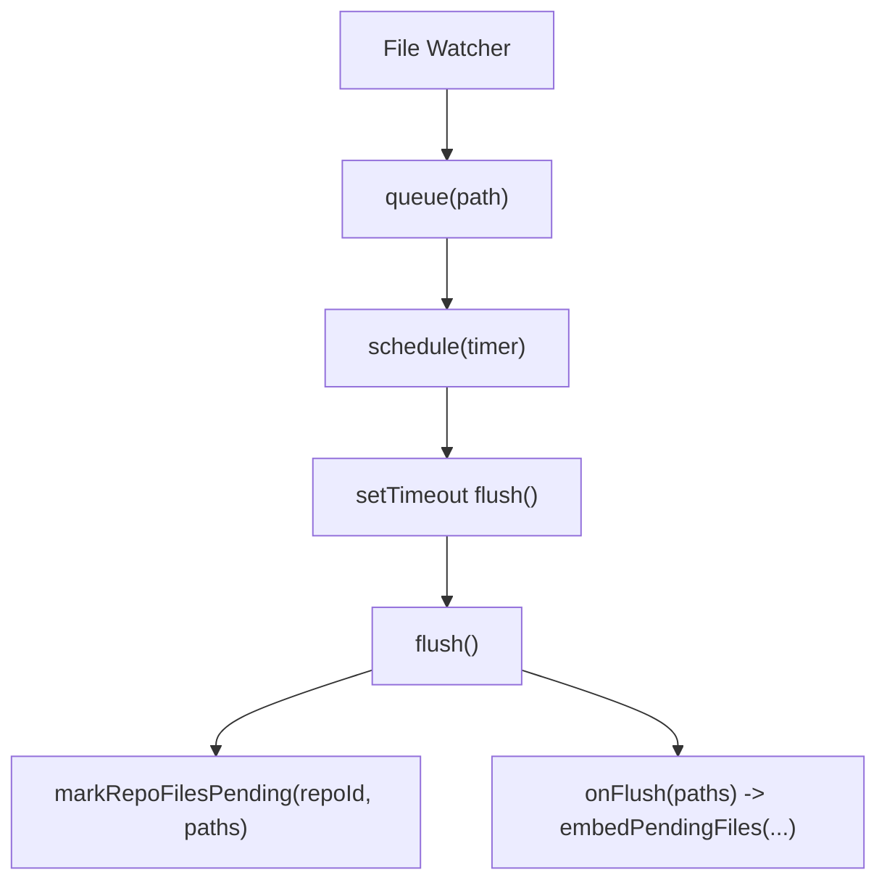

**Diagram sources**
- [repoIndexMonitor.ts](file://src/core/indexing/repoIndexMonitor.ts#L52-L224)

**Section sources**
- [repoIndexMonitor.ts](file://src/core/indexing/repoIndexMonitor.ts#L52-L224)

### Query Expansion and Semantic Search
- Query expansion: generates semantic variants of a user query using a generative model and returns the original plus variants.
- Search pipeline: use expanded queries to improve recall, then rank results using vector similarity scores.

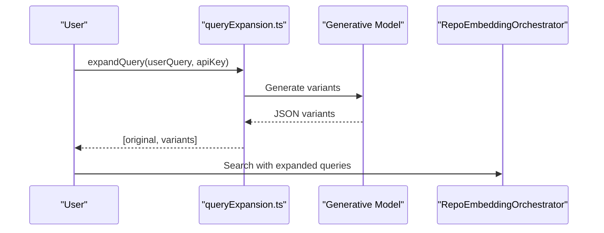

**Diagram sources**
- [queryExpansion.ts](file://src/core/indexing/queryExpansion.ts#L23-L64)
- [repoEmbeddingOrchestrator.ts](file://src/core/indexing/repoEmbeddingOrchestrator.ts#L49-L217)

**Section sources**
- [queryExpansion.ts](file://src/core/indexing/queryExpansion.ts#L23-L64)

### Retry Service and Backoff
- Exponential backoff with configurable max retries, initial delay, max delay, and multiplier.
- Batching helper for arrays to split workloads into manageable chunks.


**Diagram sources**
- [retryService.ts](file://src/core/indexing/retryService.ts#L22-L71)

**Section sources**
- [retryService.ts](file://src/core/indexing/retryService.ts#L22-L71)

### Migration Management
- Safely switches vector database providers by validating credentials, updating state, and resetting local indexing state for the current repository.
- Does not delete vectors from the previous provider, enabling rollback.

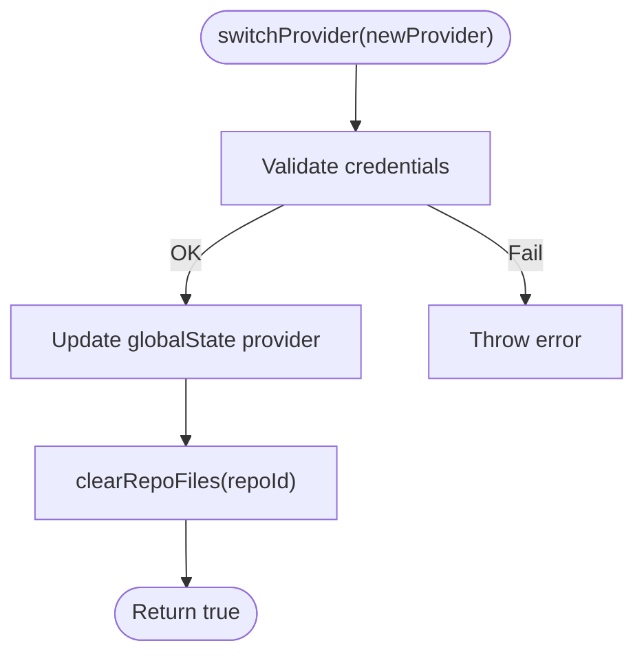

**Diagram sources**
- [migrationService.ts](file://src/core/indexing/migrationService.ts#L17-L46)

**Section sources**
- [migrationService.ts](file://src/core/indexing/migrationService.ts#L17-L46)

## Dependency Analysis
- Cohesion: Each module has a focused responsibility—indexing, embedding, orchestration, monitoring, adapters, utilities, and gitignore filtering.
- Coupling: Embedding pipeline depends on chunking, embedding service, and vector adapters; orchestrator depends on database service and adapters; monitor depends on database service and orchestrator; gitignore system depends on file utilities and command integrations.
- External dependencies: Pinecone SDK, Qdrant client, Google Generative AI, js-tiktoken, tree-sitter WASM (planned), and VS Code APIs for persistence and secrets.

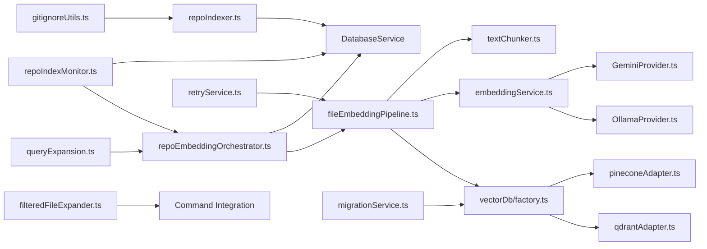

**Diagram sources**
- [repoIndexer.ts](file://src/core/indexing/repoIndexer.ts#L1-L114)
- [repoEmbeddingOrchestrator.ts](file://src/core/indexing/repoEmbeddingOrchestrator.ts#L1-L655)
- [repoIndexMonitor.ts](file://src/core/indexing/repoIndexMonitor.ts#L1-L224)
- [fileEmbeddingPipeline.ts](file://src/core/indexing/fileEmbeddingPipeline.ts#L1-L469)
- [textChunker.ts](file://src/core/indexing/textChunker.ts#L1-L253)
- [embeddingService.ts](file://src/core/indexing/embeddingService.ts#L1-L70)
- [GeminiProvider.ts](file://src/core/indexing/embeddings/GeminiProvider.ts#L1-L78)
- [OllamaProvider.ts](file://src/core/indexing/embeddings/OllamaProvider.ts#L1-L46)
- [vectorDb/factory.ts](file://src/core/indexing/vectorDb/factory.ts#L1-L62)
- [pineconeAdapter.ts](file://src/core/indexing/vectorDb/providers/pineconeAdapter.ts#L1-L82)
- [qdrantAdapter.ts](file://src/core/indexing/vectorDb/providers/qdrantAdapter.ts#L1-L244)
- [retryService.ts](file://src/core/indexing/retryService.ts#L1-L71)
- [migrationService.ts](file://src/core/indexing/migrationService.ts#L1-L63)
- [queryExpansion.ts](file://src/core/indexing/queryExpansion.ts#L1-L64)
- [gitignoreUtils.ts](file://src/core/files/gitignoreUtils.ts#L1-L100)
- [filteredFileExpander.ts](file://src/core/files/filteredFileExpander.ts#L1-L169)

**Section sources**
- [repoEmbeddingOrchestrator.ts](file://src/core/indexing/repoEmbeddingOrchestrator.ts#L1-L655)
- [fileEmbeddingPipeline.ts](file://src/core/indexing/fileEmbeddingPipeline.ts#L1-L469)
- [vectorDb/factory.ts](file://src/core/indexing/vectorDb/factory.ts#L1-L62)
- [gitignoreUtils.ts](file://src/core/files/gitignoreUtils.ts#L1-L100)
- [filteredFileExpander.ts](file://src/core/files/filteredFileExpander.ts#L1-L169)

## Performance Considerations
- Concurrency controls: tune max concurrent files, embedding batches, and upsert batches to balance throughput and provider rate limits.
- Batching: leverage batchArray to split large workloads; adjust batch sizes for embedding and vector upsert based on provider constraints.
- Chunking strategy: semantic chunking improves retrieval quality but adds overhead; fallback to line-based chunking for unsupported languages.
- Retry backoff: exponential backoff reduces thundering herds and improves resilience under transient failures.
- Hash-based deduplication: vector IDs incorporate content hashes to prevent duplicates when content changes; ensure consistent hashing and metadata updates.
- Monitoring: use RepoIndexMonitor's debounce to avoid frequent re-indexing during rapid saves.
- **Gitignore Optimization**: The enhanced gitignore filtering system optimizes performance by skipping entire ignored directory subtrees and applying path scoping rules for accurate matching.
- **State Restoration**: The enhanced state restoration system minimizes UI flicker and maintains user context across application restarts through consolidated hydration.

## Troubleshooting Guide
- Indexing fails early: inspect repository indexing logs for globbing and database write errors; verify ignore patterns and permissions.
- Embedding errors: check provider credentials and dimensions; confirm embedding provider initialization and batch sizes; review retry logs for transient failures.
- Vector upsert failures: validate adapter configuration (API keys, index/collection names); ensure repoId filtering and deterministic IDs; check provider quotas.
- Incremental updates not applied: verify pending file state in the database and that the monitor is flushing; confirm orchestrator is invoked after debounce.
- Migration issues: ensure new provider credentials are present; remember that local indexing state is reset but vectors remain in the previous provider.
- **Gitignore Issues**: If files are unexpectedly included or excluded, check .gitignore patterns and ensure proper path scoping; verify that the gitignore filtering is enabled in configuration.
- **File Expansion Problems**: If clipboard operations don't respect .gitignore rules, verify the respectGitignoreInMarkdown setting and check filteredFileExpander logs for pattern loading errors.
- **Performance Degradation**: Monitor gitignore pattern loading time and consider reducing the number of .gitignore files or simplifying complex patterns.

**Section sources**
- [repoIndexer.ts](file://src/core/indexing/repoIndexer.ts#L105-L114)
- [fileEmbeddingPipeline.ts](file://src/core/indexing/fileEmbeddingPipeline.ts#L460-L469)
- [vectorDb/factory.ts](file://src/core/indexing/vectorDb/factory.ts#L21-L62)
- [pineconeAdapter.ts](file://src/core/indexing/vectorDb/providers/pineconeAdapter.ts#L55-L82)
- [qdrantAdapter.ts](file://src/core/indexing/vectorDb/providers/qdrantAdapter.ts#L202-L244)
- [repoEmbeddingOrchestrator.ts](file://src/core/indexing/repoEmbeddingOrchestrator.ts#L267-L454)
- [repoIndexMonitor.ts](file://src/core/indexing/repoIndexMonitor.ts#L161-L208)
- [migrationService.ts](file://src/core/indexing/migrationService.ts#L17-L46)
- [gitignoreUtils.ts](file://src/core/files/gitignoreUtils.ts#L40-L43)
- [filteredFileExpander.ts](file://src/core/files/filteredFileExpander.ts#L46-L49)
- [copySelectedFilesToClipboard.ts](file://src/commands/copySelectedFilesToClipboard.ts#L108-L118)
- [copySelectedFilesAsCompressed.ts](file://src/commands/copySelectedFilesAsCompressed.ts#L99-L109)

## Conclusion
The Indexing and Search System provides a robust, extensible framework for repository-wide semantic search. Its modular design separates concerns across indexing, embedding, orchestration, and vector storage, while offering provider abstraction and operational safeguards such as retries, migrations, and incremental updates. **Updated** The enhanced gitignore filtering system ensures accurate context selection by applying .gitignore rules consistently throughout the entire indexing and search process, improving the relevance and quality of search results. The comprehensive state restoration functionality ensures seamless continuity of indexing operations through comprehensive state hydration and persistence mechanisms. By tuning concurrency, chunking, and batching parameters, teams can achieve scalable and responsive search experiences tailored to their environments.

## Appendices

### Configuration and Setup Guidance
- Embedding providers:
  - Gemini: configure API key; the provider uses a fixed dimension and validates output shape.
  - Ollama: configure URL, model, and dimension; ensure the endpoint is reachable.
- Vector database adapters:
  - Pinecone: configure API key, index name, and optional host; ensure the index dimension matches embedding dimensions.
  - Qdrant: configure base URL, optional API key for hosted instances, and collection name; ensure deterministic vector IDs align with pipeline.
- Query expansion:
  - Configure a valid Google API key for query expansion; the system uses a lightweight model to generate semantic variants.
- **Gitignore Filtering**:
  - Enable respectGitignoreInMarkdown in VS Code settings for clipboard operations.
  - The system automatically discovers and applies .gitignore patterns from all subdirectories.
  - Supports comprehensive gitignore rule syntax including absolute patterns, global patterns, and directory patterns.
- **State Restoration**:
  - The system automatically handles state persistence through `vscode.getState()` and `vscode.setState()`.
  - The `hydrate` message command provides consolidated state restoration for seamless UI continuity.

**Section sources**
- [embeddingService.ts](file://src/core/indexing/embeddingService.ts#L5-L15)
- [GeminiProvider.ts](file://src/core/indexing/embeddings/GeminiProvider.ts#L4-L14)
- [OllamaProvider.ts](file://src/core/indexing/embeddings/OllamaProvider.ts#L3-L7)
- [vectorDb/factory.ts](file://src/core/indexing/vectorDb/factory.ts#L17-L62)
- [pineconeAdapter.ts](file://src/core/indexing/vectorDb/providers/pineconeAdapter.ts#L8-L11)
- [qdrantAdapter.ts](file://src/core/indexing/vectorDb/providers/qdrantAdapter.ts#L16-L40)
- [queryExpansion.ts](file://src/core/indexing/queryExpansion.ts#L23-L41)
- [gitignoreUtils.ts](file://src/core/files/gitignoreUtils.ts#L17-L100)
- [filteredFileExpander.ts](file://src/core/files/filteredFileExpander.ts#L29-L169)
- [copySelectedFilesToClipboard.ts](file://src/commands/copySelectedFilesToClipboard.ts#L78-L89)
- [copySelectedFilesAsCompressed.ts](file://src/commands/copySelectedFilesAsCompressed.ts#L69-L80)
- [SearchTab.tsx](file://src/webview/components/SearchTab.tsx#L226-L243)
- [RepomixWebviewProvider.ts](file://src/webview/RepomixWebviewProvider.ts#L157-L173)