# Indexing and Search System

<cite>
**Referenced Files in This Document**
- [repoIndexer.ts](file://src/core/indexing/repoIndexer.ts)
- [fileEmbeddingPipeline.ts](file://src/core/indexing/fileEmbeddingPipeline.ts)
- [textChunker.ts](file://src/core/indexing/textChunker.ts)
- [treeSitterService.ts](file://src/core/indexing/treeSitterService.ts)
- [embeddingService.ts](file://src/core/indexing/embeddingService.ts)
- [GeminiProvider.ts](file://src/core/indexing/embeddings/GeminiProvider.ts)
- [OllamaProvider.ts](file://src/core/indexing/embeddings/OllamaProvider.ts)
- [vectorDb/factory.ts](file://src/core/indexing/vectorDb/factory.ts)
- [pineconeAdapter.ts](file://src/core/indexing/vectorDb/providers/pineconeAdapter.ts)
- [qdrantAdapter.ts](file://src/core/indexing/vectorDb/providers/qdrantAdapter.ts)
- [repoEmbeddingOrchestrator.ts](file://src/core/indexing/repoEmbeddingOrchestrator.ts)
- [repoIndexMonitor.ts](file://src/core/indexing/repoIndexMonitor.ts)
- [retryService.ts](file://src/core/indexing/retryService.ts)
- [migrationService.ts](file://src/core/indexing/migrationService.ts)
- [queryExpansion.ts](file://src/core/indexing/queryExpansion.ts)
- [SearchTab.tsx](file://src/webview/components/SearchTab.tsx)
- [RepomixWebviewProvider.ts](file://src/webview/RepomixWebviewProvider.ts)
- [IndexingController.ts](file://src/webview/controllers/IndexingController.ts)
- [messageSchemas.ts](file://src/webview/messageSchemas.ts)
</cite>

## Update Summary
**Changes Made**
- Added comprehensive documentation for the enhanced state restoration functionality
- Documented the new `hydrate` message command for indexing state hydration
- Updated SearchTab.tsx analysis to include state persistence and restoration mechanisms
- Enhanced architecture overview to reflect improved state management patterns
- Added new sections covering state restoration and UI continuity features

## Table of Contents
1. [Introduction](#introduction)
2. [Project Structure](#project-structure)
3. [Core Components](#core-components)
4. [Architecture Overview](#architecture-overview)
5. [Enhanced State Restoration System](#enhanced-state-restoration-system)
6. [Detailed Component Analysis](#detailed-component-analysis)
7. [Dependency Analysis](#dependency-analysis)
8. [Performance Considerations](#performance-considerations)
9. [Troubleshooting Guide](#troubleshooting-guide)
10. [Conclusion](#conclusion)
11. [Appendices](#appendices)

## Introduction
This document describes the Indexing and Search System that powers semantic search over repositories. It covers the vector database integration architecture, the file embedding pipeline from text chunking through embedding generation to vector storage, repository indexing and incremental updates, monitoring mechanisms, provider abstractions for embeddings and vector databases, semantic search capabilities, query expansion, and operational concerns such as retries, migrations, and error handling in distributed indexing scenarios.

**Updated** Enhanced with comprehensive state restoration functionality that ensures seamless continuity of indexing operations even after application restarts through the `hydrate` message command and advanced state persistence mechanisms.

## Project Structure
The indexing and search system is organized around a cohesive set of modules under the core indexing subsystem:
- Repository indexing: enumerating files and writing them to the local database
- File embedding pipeline: reading, chunking, embedding, batching, and upserting vectors
- Vector database adapters: provider-agnostic interfaces for Pinecone and Qdrant
- Embedding providers: abstraction for Gemini and Ollama
- Orchestration: coordinating repository-wide and incremental embedding
- Monitoring: collecting file changes and debouncing re-indexing
- Utilities: retry/backoff, migration, query expansion
- **State Management**: comprehensive state persistence and restoration for UI continuity

```mermaid
graph TB
subgraph "Indexing"
RI["repoIndexer.ts"]
REO["repoEmbeddingOrchestrator.ts"]
RP["repoIndexMonitor.ts"]
END
subgraph "Embedding Pipeline"
FEP["fileEmbeddingPipeline.ts"]
TC["textChunker.ts"]
TS["treeSitterService.ts"]
ES["embeddingService.ts"]
GP["GeminiProvider.ts"]
OP["OllamaProvider.ts"]
END
subgraph "Vector DB"
VF["vectorDb/factory.ts"]
PCA["pineconeAdapter.ts"]
QDA["qdrantAdapter.ts"]
END
subgraph "State Management"
ST["SearchTab.tsx State"]
HW["Hydrate Command"]
RS["State Restoration"]
END
subgraph "Operations"
RS["retryService.ts"]
MS["migrationService.ts"]
QE["queryExpansion.ts"]
END
RI --> REO
REO --> FEP
FEP --> TC
FEP --> ES
ES --> GP
ES --> OP
FEP --> VF
VF --> PCA
VF --> QDA
RP --> REO
REO --> RS
MS --> VF
QE --> REO
ST --> HW
HW --> RS
```

**Diagram sources**
- [repoIndexer.ts](file://src/core/indexing/repoIndexer.ts#L28-L121)
- [repoEmbeddingOrchestrator.ts](file://src/core/indexing/repoEmbeddingOrchestrator.ts#L49-L217)
- [repoIndexMonitor.ts](file://src/core/indexing/repoIndexMonitor.ts#L52-L224)
- [fileEmbeddingPipeline.ts](file://src/core/indexing/fileEmbeddingPipeline.ts#L186-L469)
- [textChunker.ts](file://src/core/indexing/textChunker.ts#L227-L253)
- [treeSitterService.ts](file://src/core/indexing/treeSitterService.ts#L30-L119)
- [embeddingService.ts](file://src/core/indexing/embeddingService.ts#L17-L70)
- [GeminiProvider.ts](file://src/core/indexing/embeddings/GeminiProvider.ts#L8-L78)
- [OllamaProvider.ts](file://src/core/indexing/embeddings/OllamaProvider.ts#L9-L46)
- [vectorDb/factory.ts](file://src/core/indexing/vectorDb/factory.ts#L17-L62)
- [pineconeAdapter.ts](file://src/core/indexing/vectorDb/providers/pineconeAdapter.ts#L5-L82)
- [qdrantAdapter.ts](file://src/core/indexing/vectorDb/providers/qdrantAdapter.ts#L12-L244)
- [retryService.ts](file://src/core/indexing/retryService.ts#L22-L71)
- [migrationService.ts](file://src/core/indexing/migrationService.ts#L7-L63)
- [queryExpansion.ts](file://src/core/indexing/queryExpansion.ts#L23-L64)
- [SearchTab.tsx](file://src/webview/components/SearchTab.tsx#L169-L243)
- [RepomixWebviewProvider.ts](file://src/webview/RepomixWebviewProvider.ts#L28-L48)

**Section sources**
- [repoIndexer.ts](file://src/core/indexing/repoIndexer.ts#L1-L121)
- [repoEmbeddingOrchestrator.ts](file://src/core/indexing/repoEmbeddingOrchestrator.ts#L1-L655)
- [repoIndexMonitor.ts](file://src/core/indexing/repoIndexMonitor.ts#L1-L224)
- [fileEmbeddingPipeline.ts](file://src/core/indexing/fileEmbeddingPipeline.ts#L1-L469)
- [textChunker.ts](file://src/core/indexing/textChunker.ts#L1-L253)
- [treeSitterService.ts](file://src/core/indexing/treeSitterService.ts#L1-L119)
- [embeddingService.ts](file://src/core/indexing/embeddingService.ts#L1-L70)
- [GeminiProvider.ts](file://src/core/indexing/embeddings/GeminiProvider.ts#L1-L78)
- [OllamaProvider.ts](file://src/core/indexing/embeddings/OllamaProvider.ts#L1-L46)
- [vectorDb/factory.ts](file://src/core/indexing/vectorDb/factory.ts#L1-L62)
- [pineconeAdapter.ts](file://src/core/indexing/vectorDb/providers/pineconeAdapter.ts#L1-L82)
- [qdrantAdapter.ts](file://src/core/indexing/vectorDb/providers/qdrantAdapter.ts#L1-L244)
- [retryService.ts](file://src/core/indexing/retryService.ts#L1-L71)
- [migrationService.ts](file://src/core/indexing/migrationService.ts#L1-L63)
- [queryExpansion.ts](file://src/core/indexing/queryExpansion.ts#L1-L64)
- [SearchTab.tsx](file://src/webview/components/SearchTab.tsx#L1-L1217)
- [RepomixWebviewProvider.ts](file://src/webview/RepomixWebviewProvider.ts#L1-L308)

## Core Components
- Repository indexer: discovers files via globbing with ignore patterns, writes them to the local database in batches, and logs timing metrics.
- Embedding pipeline: reads files, determines binary vs text, filters binaries, chunks text using semantic or line-based strategies, generates embeddings via a pluggable provider, batches and retries operations, and upserts vectors into the vector database.
- Vector database adapters: abstract Pinecone and Qdrant behind a common interface for upsert, query, delete, and metadata retrieval.
- Embedding providers: Gemini and Ollama implementations expose a uniform interface for single and batch embeddings with dimension guarantees.
- Orchestrator: coordinates full repository embedding and incremental updates, supports concurrency, progress callbacks, abort signals, and statistics.
- Monitor: collects file changes with a debounce mechanism, persists pending state, and triggers incremental embedding.
- Utilities: exponential backoff retry, batching helpers, migration service for switching providers safely, and query expansion for semantic variants.
- **State Management**: comprehensive state persistence and restoration system ensuring UI continuity across application restarts.

**Section sources**
- [repoIndexer.ts](file://src/core/indexing/repoIndexer.ts#L28-L121)
- [fileEmbeddingPipeline.ts](file://src/core/indexing/fileEmbeddingPipeline.ts#L186-L469)
- [vectorDb/factory.ts](file://src/core/indexing/vectorDb/factory.ts#L17-L62)
- [pineconeAdapter.ts](file://src/core/indexing/vectorDb/providers/pineconeAdapter.ts#L5-L82)
- [qdrantAdapter.ts](file://src/core/indexing/vectorDb/providers/qdrantAdapter.ts#L12-L244)
- [embeddingService.ts](file://src/core/indexing/embeddingService.ts#L17-L70)
- [GeminiProvider.ts](file://src/core/indexing/embeddings/GeminiProvider.ts#L8-L78)
- [OllamaProvider.ts](file://src/core/indexing/embeddings/OllamaProvider.ts#L9-L46)
- [repoEmbeddingOrchestrator.ts](file://src/core/indexing/repoEmbeddingOrchestrator.ts#L49-L217)
- [repoIndexMonitor.ts](file://src/core/indexing/repoIndexMonitor.ts#L52-L224)
- [retryService.ts](file://src/core/indexing/retryService.ts#L22-L71)
- [migrationService.ts](file://src/core/indexing/migrationService.ts#L7-L63)
- [queryExpansion.ts](file://src/core/indexing/queryExpansion.ts#L23-L64)
- [SearchTab.tsx](file://src/webview/components/SearchTab.tsx#L169-L243)

## Architecture Overview
The system integrates file discovery, chunking, embedding, and vector storage with a focus on reliability and scalability. It supports two embedding providers and two vector database providers, with a factory selecting the appropriate adapter based on persisted extension state. Incremental updates are handled via a monitor that queues changes and triggers targeted re-embedding.

**Updated** Enhanced with comprehensive state restoration architecture that ensures seamless continuity of indexing operations through the `hydrate` message command and advanced state persistence mechanisms.

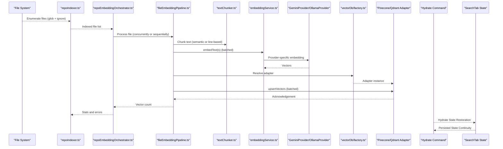

**Diagram sources**
- [repoIndexer.ts](file://src/core/indexing/repoIndexer.ts#L28-L121)
- [repoEmbeddingOrchestrator.ts](file://src/core/indexing/repoEmbeddingOrchestrator.ts#L49-L217)
- [fileEmbeddingPipeline.ts](file://src/core/indexing/fileEmbeddingPipeline.ts#L186-L469)
- [textChunker.ts](file://src/core/indexing/textChunker.ts#L227-L253)
- [embeddingService.ts](file://src/core/indexing/embeddingService.ts#L17-L70)
- [GeminiProvider.ts](file://src/core/indexing/embeddings/GeminiProvider.ts#L8-L78)
- [OllamaProvider.ts](file://src/core/indexing/embeddings/OllamaProvider.ts#L9-L46)
- [vectorDb/factory.ts](file://src/core/indexing/vectorDb/factory.ts#L17-L62)
- [pineconeAdapter.ts](file://src/core/indexing/vectorDb/providers/pineconeAdapter.ts#L5-L82)
- [qdrantAdapter.ts](file://src/core/indexing/vectorDb/providers/qdrantAdapter.ts#L12-L244)
- [RepomixWebviewProvider.ts](file://src/webview/RepomixWebviewProvider.ts#L157-L173)
- [SearchTab.tsx](file://src/webview/components/SearchTab.tsx#L462-L486)

## Enhanced State Restoration System

### Hydrate Message Command
The system introduces a comprehensive `hydrate` message command that provides consolidated state restoration for seamless continuity of indexing operations after application restarts.

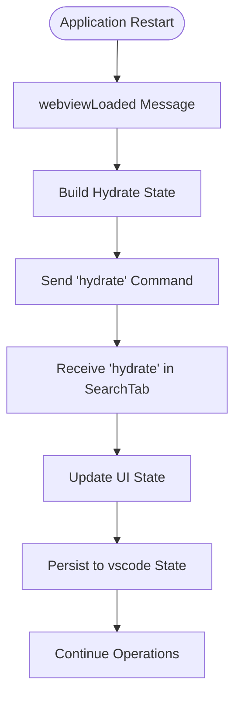

**Diagram sources**
- [RepomixWebviewProvider.ts](file://src/webview/RepomixWebviewProvider.ts#L157-L173)
- [SearchTab.tsx](file://src/webview/components/SearchTab.tsx#L462-L486)

### State Restoration Mechanisms
The enhanced state restoration system handles multiple aspects of UI continuity:

- **Indexing State**: Restores indexing state (idle, running, paused, stopping) with progress tracking
- **Repository Counts**: Maintains file and vector counts across sessions
- **Indexing Block Status**: Preserves indexing blocked state due to dimension mismatches
- **UI Configuration**: Restores user preferences including filters, thresholds, and accordion states

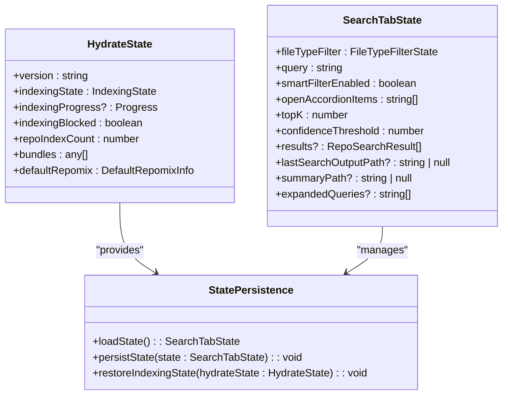

**Diagram sources**
- [RepomixWebviewProvider.ts](file://src/webview/RepomixWebviewProvider.ts#L28-L48)
- [SearchTab.tsx](file://src/webview/components/SearchTab.tsx#L61-L72)
- [SearchTab.tsx](file://src/webview/components/SearchTab.tsx#L226-L243)

**Section sources**
- [RepomixWebviewProvider.ts](file://src/webview/RepomixWebviewProvider.ts#L28-L48)
- [RepomixWebviewProvider.ts](file://src/webview/RepomixWebviewProvider.ts#L157-L173)
- [SearchTab.tsx](file://src/webview/components/SearchTab.tsx#L462-L486)
- [SearchTab.tsx](file://src/webview/components/SearchTab.tsx#L226-L243)

## Detailed Component Analysis

### Repository Indexing
- Discovers files using a glob pattern with explicit ignore lists for binary artifacts and dotfiles.
- Writes file paths to the local database in chunks to avoid SQL limits.
- Generates a repository identifier and clears prior file records for deterministic reindexing.
- Emits timing metrics and structured logs for observability.

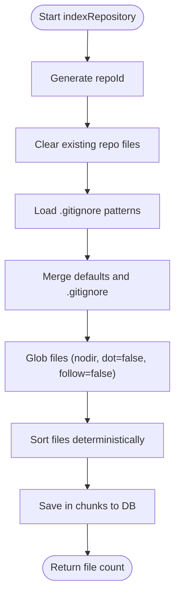

**Diagram sources**
- [repoIndexer.ts](file://src/core/indexing/repoIndexer.ts#L28-L121)

**Section sources**
- [repoIndexer.ts](file://src/core/indexing/repoIndexer.ts#L28-L121)

### File Embedding Pipeline
- Binary detection: skips files with known binary extensions and common text basenames without extensions.
- Content read with retry-on-failure and abort-signal support.
- Chunking: semantic chunking via tree-sitter when supported, otherwise line-based with overlap.
- Embedding: provider abstraction with batched embedding and dimension validation.
- Vector upsert: batches vectors and retries failures; metadata includes repoId, file path, chunk indices, and hashes.
- Concurrency: configurable concurrency for file processing, embedding batches, and upsert batches.

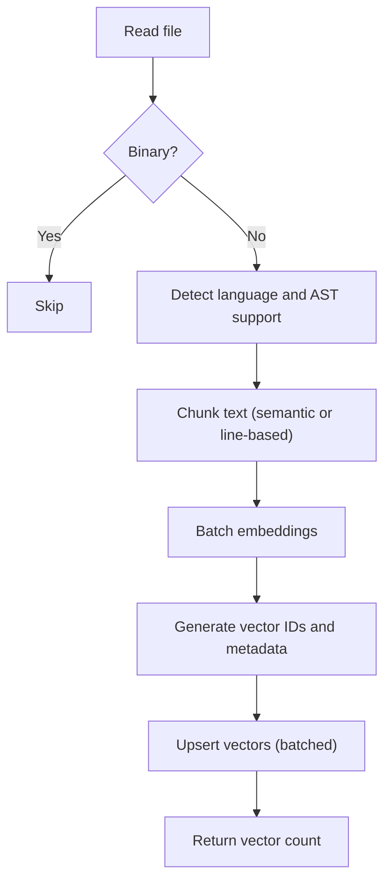

**Diagram sources**
- [fileEmbeddingPipeline.ts](file://src/core/indexing/fileEmbeddingPipeline.ts#L186-L469)
- [textChunker.ts](file://src/core/indexing/textChunker.ts#L227-L253)
- [treeSitterService.ts](file://src/core/indexing/treeSitterService.ts#L30-L119)

**Section sources**
- [fileEmbeddingPipeline.ts](file://src/core/indexing/fileEmbeddingPipeline.ts#L186-L469)
- [textChunker.ts](file://src/core/indexing/textChunker.ts#L227-L253)
- [treeSitterService.ts](file://src/core/indexing/treeSitterService.ts#L30-L119)

### Embedding Providers Abstraction
- EmbeddingService selects and initializes a provider based on configuration, ensuring dimensions match expectations.
- GeminiProvider: fixed dimension embedding for a specific model, validates output shape.
- OllamaProvider: HTTP client to a local or remote Ollama endpoint, supports batch via parallel requests.

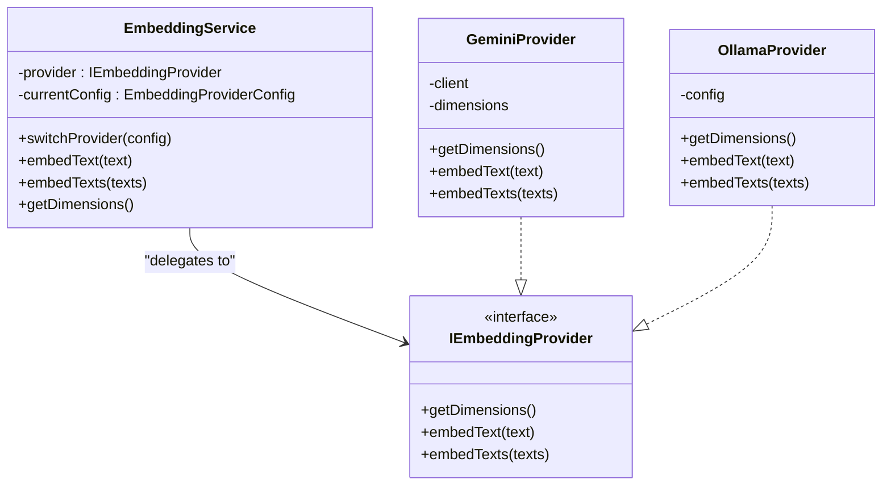

**Diagram sources**
- [embeddingService.ts](file://src/core/indexing/embeddingService.ts#L17-L70)
- [GeminiProvider.ts](file://src/core/indexing/embeddings/GeminiProvider.ts#L8-L78)
- [OllamaProvider.ts](file://src/core/indexing/embeddings/OllamaProvider.ts#L9-L46)

**Section sources**
- [embeddingService.ts](file://src/core/indexing/embeddingService.ts#L17-L70)
- [GeminiProvider.ts](file://src/core/indexing/embeddings/GeminiProvider.ts#L8-L78)
- [OllamaProvider.ts](file://src/core/indexing/embeddings/OllamaProvider.ts#L9-L46)

### Vector Database Adapters
- Factory resolves provider from extension state and secrets, returning a typed adapter.
- PineconeAdapter: delegates to a service wrapper for upsert, query, delete, and metadata retrieval.
- QdrantAdapter: deterministic vector IDs, upsert with payload, query with repoId filter, delete by repo or file, and metadata extraction.

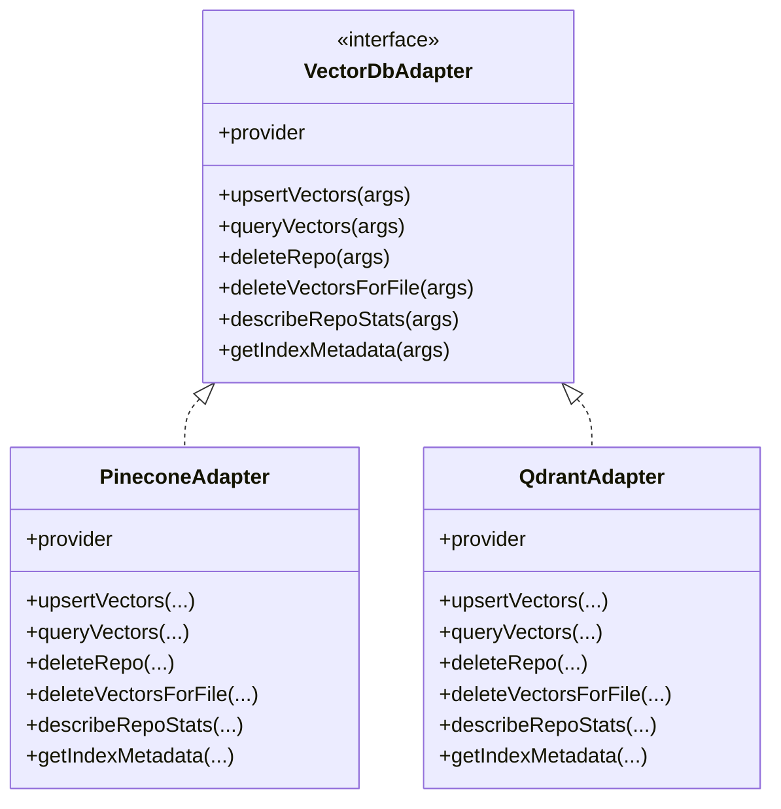

**Diagram sources**
- [vectorDb/factory.ts](file://src/core/indexing/vectorDb/factory.ts#L17-L62)
- [pineconeAdapter.ts](file://src/core/indexing/vectorDb/providers/pineconeAdapter.ts#L5-L82)
- [qdrantAdapter.ts](file://src/core/indexing/vectorDb/providers/qdrantAdapter.ts#L12-L244)

**Section sources**
- [vectorDb/factory.ts](file://src/core/indexing/vectorDb/factory.ts#L17-L62)
- [pineconeAdapter.ts](file://src/core/indexing/vectorDb/providers/pineconeAdapter.ts#L5-L82)
- [qdrantAdapter.ts](file://src/core/indexing/vectorDb/providers/qdrantAdapter.ts#L12-L244)

### Repository Embedding Orchestration
- Full repository embedding: fetches files from DB, processes concurrently or sequentially, aggregates statistics, and reports errors.
- Incremental embedding: processes only pending files, deletes old vectors before re-upserting, marks files indexed with content hash, and cleans up missing files.
- Synchronization: compares DB state with filesystem to detect added, modified, and deleted files and updates pending sets accordingly.

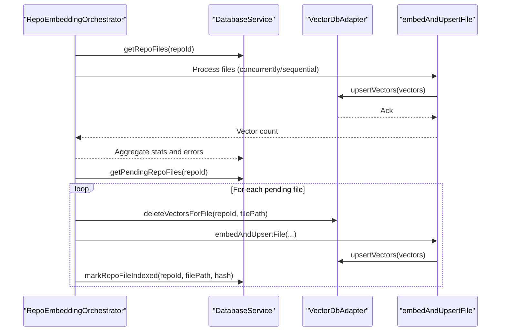

**Diagram sources**
- [repoEmbeddingOrchestrator.ts](file://src/core/indexing/repoEmbeddingOrchestrator.ts#L49-L217)
- [fileEmbeddingPipeline.ts](file://src/core/indexing/fileEmbeddingPipeline.ts#L186-L469)
- [pineconeAdapter.ts](file://src/core/indexing/vectorDb/providers/pineconeAdapter.ts#L39-L41)
- [qdrantAdapter.ts](file://src/core/indexing/vectorDb/providers/qdrantAdapter.ts#L144-L174)

**Section sources**
- [repoEmbeddingOrchestrator.ts](file://src/core/indexing/repoEmbeddingOrchestrator.ts#L49-L217)
- [repoEmbeddingOrchestrator.ts](file://src/core/indexing/repoEmbeddingOrchestrator.ts#L267-L454)

### Repository Index Monitor
- Collects file changes and debounces them to reduce churn.
- Persists pending files to the database and triggers incremental embedding.
- Provides graceful shutdown and logging.

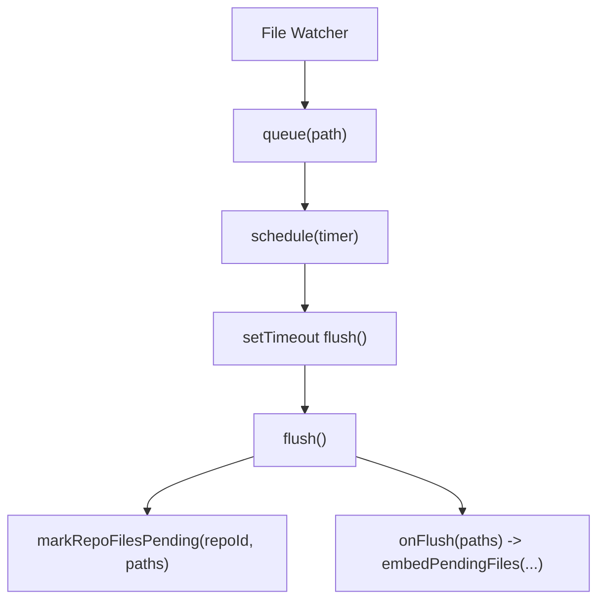

**Diagram sources**
- [repoIndexMonitor.ts](file://src/core/indexing/repoIndexMonitor.ts#L52-L224)

**Section sources**
- [repoIndexMonitor.ts](file://src/core/indexing/repoIndexMonitor.ts#L52-L224)

### Query Expansion and Semantic Search
- Query expansion: generates semantic variants of a user query using a generative model and returns the original plus variants.
- Search pipeline: use expanded queries to improve recall, then rank results using vector similarity scores.

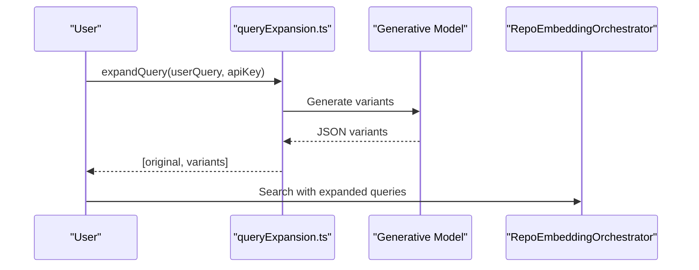

**Diagram sources**
- [queryExpansion.ts](file://src/core/indexing/queryExpansion.ts#L23-L64)
- [repoEmbeddingOrchestrator.ts](file://src/core/indexing/repoEmbeddingOrchestrator.ts#L49-L217)

**Section sources**
- [queryExpansion.ts](file://src/core/indexing/queryExpansion.ts#L23-L64)

### Retry Service and Backoff
- Exponential backoff with configurable max retries, initial delay, max delay, and multiplier.
- Batching helper for arrays to split workloads into manageable chunks.

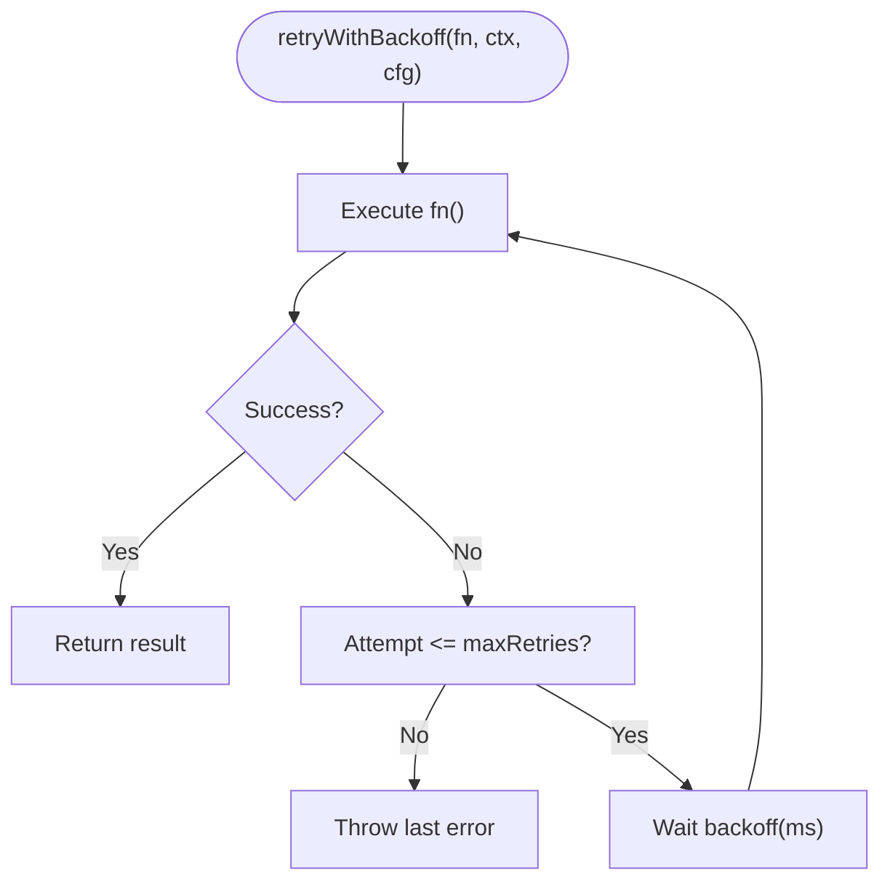

**Diagram sources**
- [retryService.ts](file://src/core/indexing/retryService.ts#L22-L71)

**Section sources**
- [retryService.ts](file://src/core/indexing/retryService.ts#L22-L71)

### Migration Management
- Safely switches vector database providers by validating credentials, updating state, and resetting local indexing state for the current repository.
- Does not delete vectors from the previous provider, enabling rollback.


**Diagram sources**
- [migrationService.ts](file://src/core/indexing/migrationService.ts#L17-L46)

**Section sources**
- [migrationService.ts](file://src/core/indexing/migrationService.ts#L17-L46)

### Enhanced State Restoration in SearchTab
**Updated** The SearchTab component now includes comprehensive state restoration functionality through the `hydrate` message command and advanced state persistence mechanisms.

#### State Persistence and Loading
- Loads saved state from `vscode.getState()` on component initialization
- Initializes UI state with persisted values or defaults
- Persists state changes automatically using `vscode.setState()`

#### Hydration Logic
- Handles `hydrate` message command for consolidated state restoration
- Restores indexing state, counts, and UI preferences
- Manages indexing progress and pause state restoration

#### State Restoration Flow
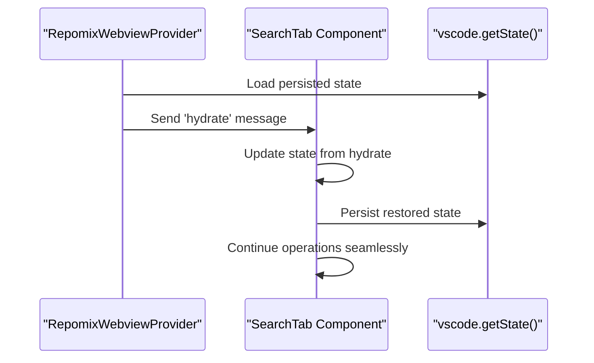

**Diagram sources**
- [RepomixWebviewProvider.ts](file://src/webview/RepomixWebviewProvider.ts#L157-L173)
- [SearchTab.tsx](file://src/webview/components/SearchTab.tsx#L169-L243)
- [SearchTab.tsx](file://src/webview/components/SearchTab.tsx#L462-L486)

**Section sources**
- [SearchTab.tsx](file://src/webview/components/SearchTab.tsx#L169-L243)
- [SearchTab.tsx](file://src/webview/components/SearchTab.tsx#L462-L486)
- [RepomixWebviewProvider.ts](file://src/webview/RepomixWebviewProvider.ts#L157-L173)

## Dependency Analysis
- Cohesion: Each module has a focused responsibility—indexing, embedding, orchestration, monitoring, adapters, utilities, and state management.
- Coupling: Embedding pipeline depends on chunking, embedding service, and vector adapters; orchestrator depends on database service and adapters; monitor depends on database service and orchestrator; state management depends on SearchTab and webview provider.
- External dependencies: Pinecone SDK, Qdrant client, Google Generative AI, js-tiktoken, tree-sitter WASM (planned), and VS Code APIs for persistence and secrets.

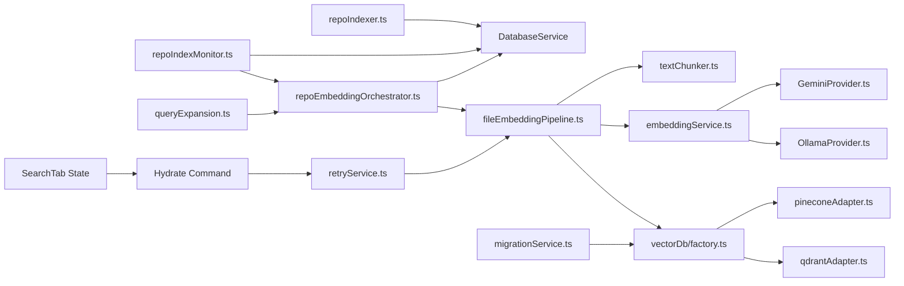

**Diagram sources**
- [repoIndexer.ts](file://src/core/indexing/repoIndexer.ts#L1-L121)
- [repoEmbeddingOrchestrator.ts](file://src/core/indexing/repoEmbeddingOrchestrator.ts#L1-L655)
- [repoIndexMonitor.ts](file://src/core/indexing/repoIndexMonitor.ts#L1-L224)
- [fileEmbeddingPipeline.ts](file://src/core/indexing/fileEmbeddingPipeline.ts#L1-L469)
- [textChunker.ts](file://src/core/indexing/textChunker.ts#L1-L253)
- [embeddingService.ts](file://src/core/indexing/embeddingService.ts#L1-L70)
- [GeminiProvider.ts](file://src/core/indexing/embeddings/GeminiProvider.ts#L1-L78)
- [OllamaProvider.ts](file://src/core/indexing/embeddings/OllamaProvider.ts#L1-L46)
- [vectorDb/factory.ts](file://src/core/indexing/vectorDb/factory.ts#L1-L62)
- [pineconeAdapter.ts](file://src/core/indexing/vectorDb/providers/pineconeAdapter.ts#L1-L82)
- [qdrantAdapter.ts](file://src/core/indexing/vectorDb/providers/qdrantAdapter.ts#L1-L244)
- [retryService.ts](file://src/core/indexing/retryService.ts#L1-L71)
- [migrationService.ts](file://src/core/indexing/migrationService.ts#L1-L63)
- [queryExpansion.ts](file://src/core/indexing/queryExpansion.ts#L1-L64)
- [SearchTab.tsx](file://src/webview/components/SearchTab.tsx#L1-L1217)
- [RepomixWebviewProvider.ts](file://src/webview/RepomixWebviewProvider.ts#L1-L308)

**Section sources**
- [repoEmbeddingOrchestrator.ts](file://src/core/indexing/repoEmbeddingOrchestrator.ts#L1-L655)
- [fileEmbeddingPipeline.ts](file://src/core/indexing/fileEmbeddingPipeline.ts#L1-L469)
- [vectorDb/factory.ts](file://src/core/indexing/vectorDb/factory.ts#L1-L62)
- [SearchTab.tsx](file://src/webview/components/SearchTab.tsx#L1-L1217)
- [RepomixWebviewProvider.ts](file://src/webview/RepomixWebviewProvider.ts#L1-L308)

## Performance Considerations
- Concurrency controls: tune max concurrent files, embedding batches, and upsert batches to balance throughput and provider rate limits.
- Batching: leverage batchArray to split large workloads; adjust batch sizes for embedding and vector upsert based on provider constraints.
- Chunking strategy: semantic chunking improves retrieval quality but adds overhead; fallback to line-based chunking for unsupported languages.
- Retry backoff: exponential backoff reduces thundering herds and improves resilience under transient failures.
- Hash-based deduplication: vector IDs incorporate content hashes to prevent duplicates when content changes; ensure consistent hashing and metadata updates.
- Monitoring: use RepoIndexMonitor's debounce to avoid frequent re-indexing during rapid saves.
- **State Restoration**: The enhanced state restoration system minimizes UI flicker and maintains user context across application restarts through consolidated hydration.

## Troubleshooting Guide
- Indexing fails early: inspect repository indexing logs for globbing and database write errors; verify ignore patterns and permissions.
- Embedding errors: check provider credentials and dimensions; confirm embedding provider initialization and batch sizes; review retry logs for transient failures.
- Vector upsert failures: validate adapter configuration (API keys, index/collection names); ensure repoId filtering and deterministic IDs; check provider quotas.
- Incremental updates not applied: verify pending file state in the database and that the monitor is flushing; confirm orchestrator is invoked after debounce.
- Migration issues: ensure new provider credentials are present; remember that local indexing state is reset but vectors remain in the previous provider.
- **State Restoration Issues**: If UI state is not persisting correctly, check that `vscode.getState()` and `vscode.setState()` are functioning properly; verify the `hydrate` message command is being processed in SearchTab.tsx.
- **Indexing State Continuity**: If indexing state appears inconsistent after restart, ensure the `indexingStateRestored` message is being sent from the controller and properly handled in the SearchTab component.

**Section sources**
- [repoIndexer.ts](file://src/core/indexing/repoIndexer.ts#L112-L121)
- [fileEmbeddingPipeline.ts](file://src/core/indexing/fileEmbeddingPipeline.ts#L460-L469)
- [vectorDb/factory.ts](file://src/core/indexing/vectorDb/factory.ts#L21-L62)
- [pineconeAdapter.ts](file://src/core/indexing/vectorDb/providers/pineconeAdapter.ts#L55-L82)
- [qdrantAdapter.ts](file://src/core/indexing/vectorDb/providers/qdrantAdapter.ts#L202-L244)
- [repoEmbeddingOrchestrator.ts](file://src/core/indexing/repoEmbeddingOrchestrator.ts#L267-L454)
- [repoIndexMonitor.ts](file://src/core/indexing/repoIndexMonitor.ts#L161-L208)
- [migrationService.ts](file://src/core/indexing/migrationService.ts#L17-L46)
- [SearchTab.tsx](file://src/webview/components/SearchTab.tsx#L462-L486)
- [IndexingController.ts](file://src/webview/controllers/IndexingController.ts#L207-L222)

## Conclusion
The Indexing and Search System provides a robust, extensible framework for repository-wide semantic search. Its modular design separates concerns across indexing, embedding, orchestration, and vector storage, while offering provider abstraction and operational safeguards such as retries, migrations, and incremental updates. The enhanced state restoration functionality ensures seamless continuity of indexing operations through comprehensive state hydration and persistence mechanisms. By tuning concurrency, chunking, and batching parameters, teams can achieve scalable and responsive search experiences tailored to their environments.

## Appendices

### Configuration and Setup Guidance
- Embedding providers:
  - Gemini: configure API key; the provider uses a fixed dimension and validates output shape.
  - Ollama: configure URL, model, and dimension; ensure the endpoint is reachable.
- Vector database adapters:
  - Pinecone: configure API key, index name, and optional host; ensure the index dimension matches embedding dimensions.
  - Qdrant: configure base URL, optional API key for hosted instances, and collection name; ensure deterministic vector IDs align with pipeline.
- Query expansion:
  - Configure a valid Google API key for query expansion; the system uses a lightweight model to generate semantic variants.
- **State Restoration**:
  - The system automatically handles state persistence through `vscode.getState()` and `vscode.setState()`.
  - The `hydrate` message command provides consolidated state restoration for seamless UI continuity.

**Section sources**
- [embeddingService.ts](file://src/core/indexing/embeddingService.ts#L5-L15)
- [GeminiProvider.ts](file://src/core/indexing/embeddings/GeminiProvider.ts#L4-L14)
- [OllamaProvider.ts](file://src/core/indexing/embeddings/OllamaProvider.ts#L3-L7)
- [vectorDb/factory.ts](file://src/core/indexing/vectorDb/factory.ts#L17-L62)
- [pineconeAdapter.ts](file://src/core/indexing/vectorDb/providers/pineconeAdapter.ts#L8-L11)
- [qdrantAdapter.ts](file://src/core/indexing/vectorDb/providers/qdrantAdapter.ts#L16-L40)
- [queryExpansion.ts](file://src/core/indexing/queryExpansion.ts#L23-L41)
- [SearchTab.tsx](file://src/webview/components/SearchTab.tsx#L226-L243)
- [RepomixWebviewProvider.ts](file://src/webview/RepomixWebviewProvider.ts#L157-L173)