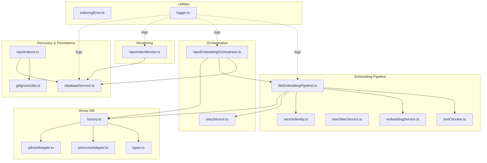
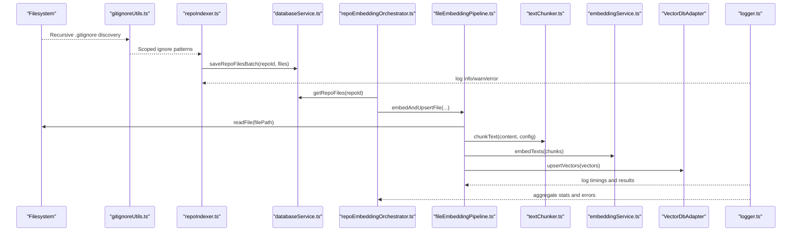
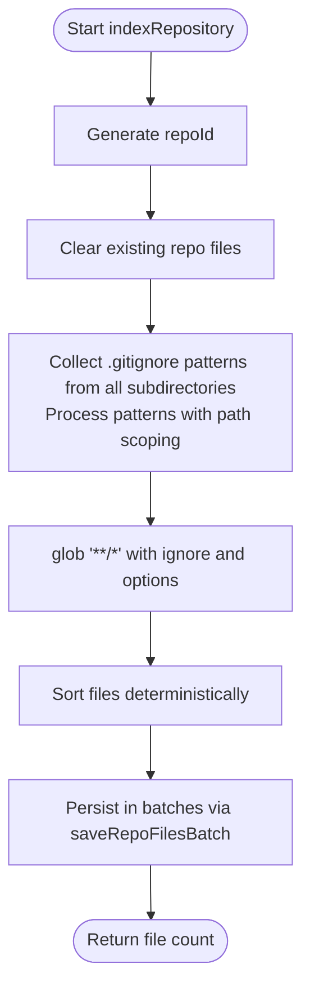
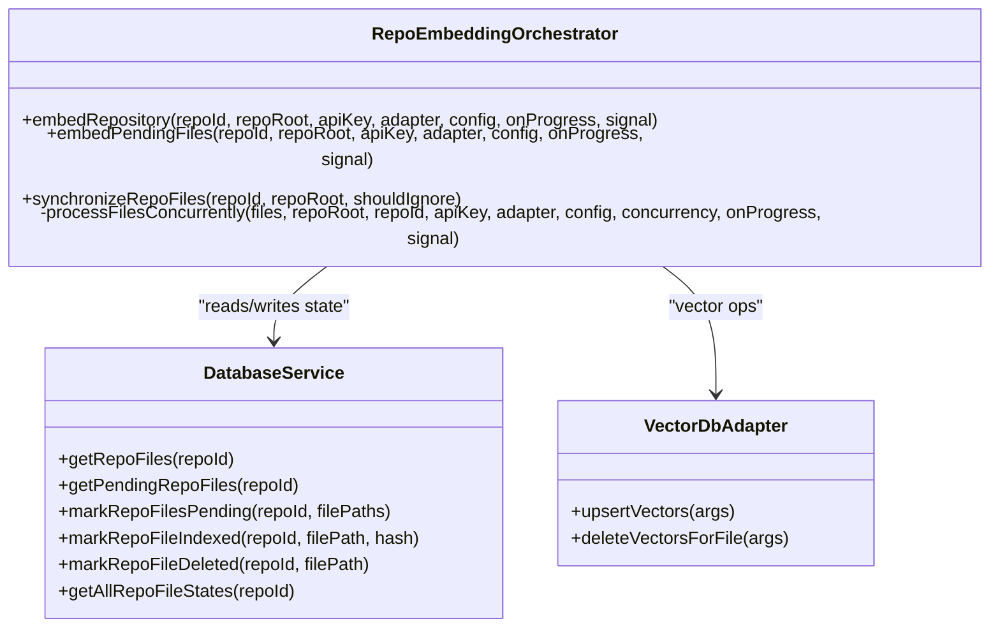
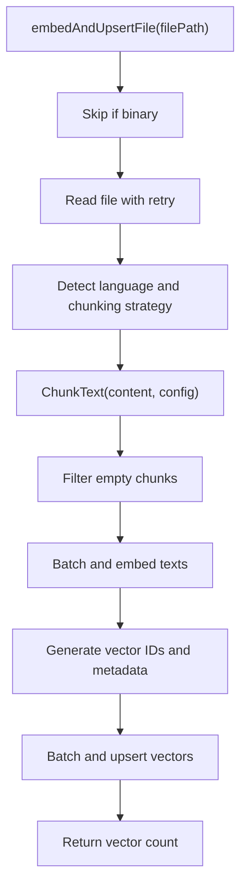
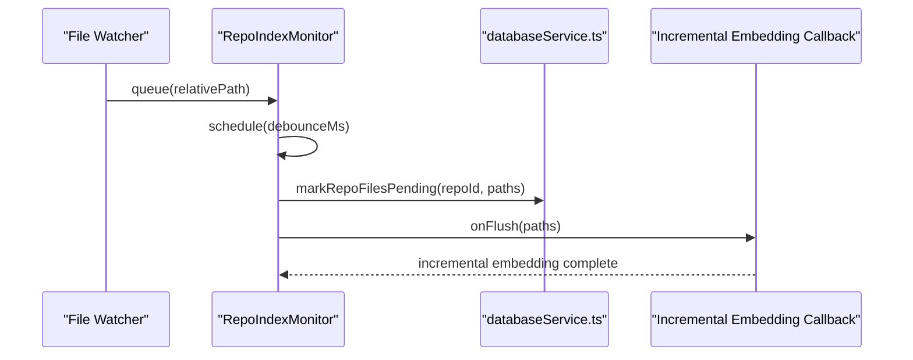
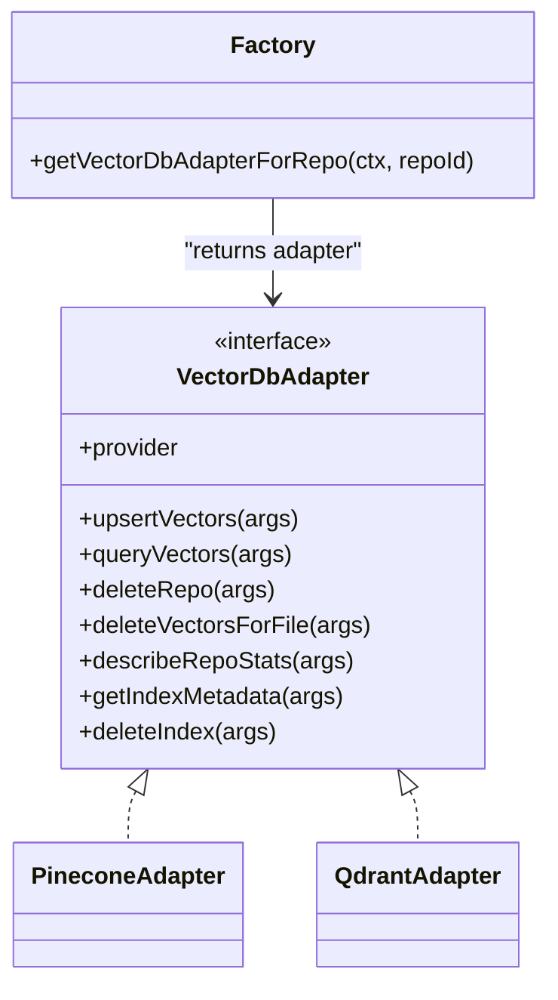
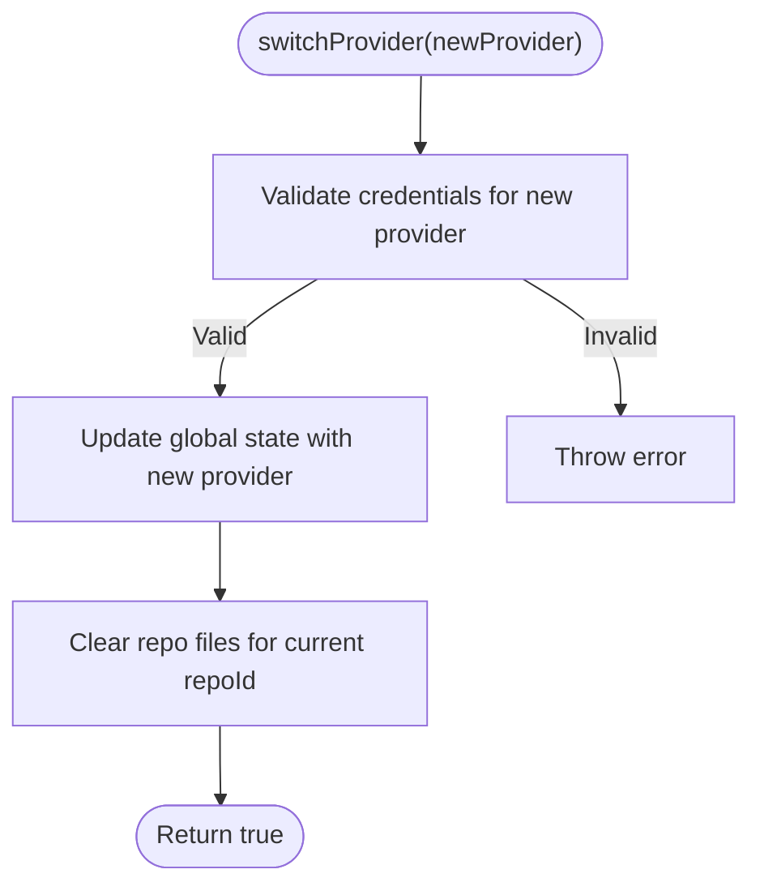
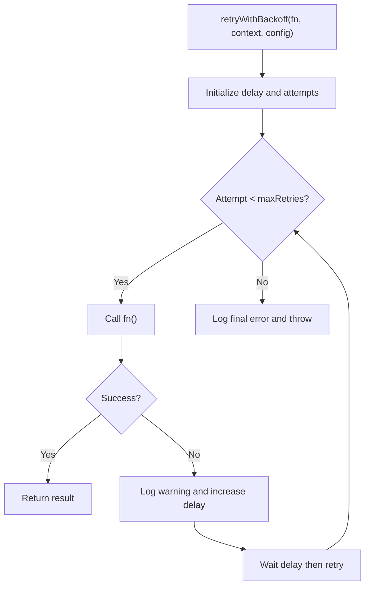
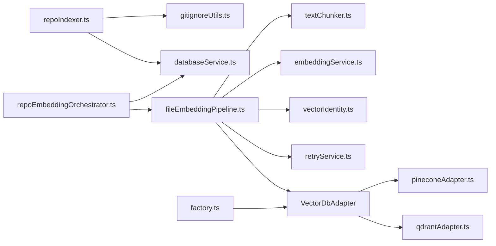

# Repository Indexing and Monitoring

<cite>
**Referenced Files in This Document**
- [repoIndexer.ts](file://src/core/indexing/repoIndexer.ts)
- [repoEmbeddingOrchestrator.ts](file://src/core/indexing/repoEmbeddingOrchestrator.ts)
- [repoIndexMonitor.ts](file://src/core/indexing/repoIndexMonitor.ts)
- [migrationService.ts](file://src/core/indexing/migrationService.ts)
- [retryService.ts](file://src/core/indexing/retryService.ts)
- [embeddingService.ts](file://src/core/indexing/embeddingService.ts)
- [fileEmbeddingPipeline.ts](file://src/core/indexing/fileEmbeddingPipeline.ts)
- [textChunker.ts](file://src/core/indexing/textChunker.ts)
- [treeSitterService.ts](file://src/core/indexing/treeSitterService.ts)
- [vectorIdentity.ts](file://src/core/indexing/vectorIdentity.ts)
- [databaseService.ts](file://src/core/storage/databaseService.ts)
- [factory.ts](file://src/core/indexing/vectorDb/factory.ts)
- [types.ts](file://src/core/indexing/vectorDb/types.ts)
- [pineconeAdapter.ts](file://src/core/indexing/vectorDb/providers/pineconeAdapter.ts)
- [qdrantAdapter.ts](file://src/core/indexing/vectorDb/providers/qdrantAdapter.ts)
- [gitignoreUtils.ts](file://src/core/files/gitignoreUtils.ts)
- [indexingError.ts](file://src/shared/indexingError.ts)
- [logger.ts](file://src/shared/logger.ts)
</cite>

## Update Summary
**Changes Made**
- Updated Repository Indexer section to document the new comprehensive gitignore pattern collection system
- Added new Gitignore Pattern Collection System section documenting the recursive .gitignore discovery
- Updated Ignore Pattern Handling section to explain how subdirectory patterns are processed
- Enhanced File Discovery section with details about comprehensive pattern application
- Added comprehensive testing coverage for the new gitignore collection functionality

## Table of Contents
1. [Introduction](#introduction)
2. [Project Structure](#project-structure)
3. [Core Components](#core-components)
4. [Architecture Overview](#architecture-overview)
5. [Detailed Component Analysis](#detailed-component-analysis)
6. [Dependency Analysis](#dependency-analysis)
7. [Performance Considerations](#performance-considerations)
8. [Troubleshooting Guide](#troubleshooting-guide)
9. [Conclusion](#conclusion)
10. [Appendices](#appendices)

## Introduction
This document explains the end-to-end repository indexing and monitoring system. It covers the complete workflow from file discovery and comprehensive ignore pattern handling across all subdirectories, through batching and error recovery, to the embedding orchestrator's coordination of multi-file operations, resource allocation, and concurrent processing. It also documents the repository index monitor that tracks indexing status, detects changes, and triggers incremental updates. Additionally, it details the migration service for database schema updates and provider switching, the retry service with exponential backoff, and logging and monitoring best practices.

## Project Structure
The indexing subsystem is organized around a clear separation of concerns:
- Discovery and persistence: repository scanning, comprehensive ignore patterns from all subdirectories, and database storage
- Embedding pipeline: chunking, embeddings, and vector upsert
- Orchestration: coordinating file-level operations, concurrency, and incremental updates
- Monitoring: collecting and persisting indexing progress and reacting to file changes
- Vector database abstraction: adapters for Pinecone and Qdrant
- Utilities: retry logic, identity generation, and comprehensive gitignore pattern collection

**Diagram sources**
- [repoIndexer.ts](file://src/core/indexing/repoIndexer.ts#L28-L121)
- [gitignoreUtils.ts](file://src/core/files/gitignoreUtils.ts#L17-L100)
- [repoEmbeddingOrchestrator.ts](file://src/core/indexing/repoEmbeddingOrchestrator.ts#L33-L655)
- [repoIndexMonitor.ts](file://src/core/indexing/repoIndexMonitor.ts#L52-L224)
- [fileEmbeddingPipeline.ts](file://src/core/indexing/fileEmbeddingPipeline.ts#L186-L469)
- [textChunker.ts](file://src/core/indexing/textChunker.ts#L227-L253)
- [treeSitterService.ts](file://src/core/indexing/treeSitterService.ts#L30-L119)
- [embeddingService.ts](file://src/core/indexing/embeddingService.ts#L17-L70)
- [vectorIdentity.ts](file://src/core/indexing/vectorIdentity.ts#L17-L68)
- [databaseService.ts](file://src/core/storage/databaseService.ts#L27-L800)
- [factory.ts](file://src/core/indexing/vectorDb/factory.ts#L17-L62)
- [types.ts](file://src/core/indexing/vectorDb/types.ts#L1-L44)
- [pineconeAdapter.ts](file://src/core/indexing/vectorDb/providers/pineconeAdapter.ts#L5-L82)
- [qdrantAdapter.ts](file://src/core/indexing/vectorDb/providers/qdrantAdapter.ts#L12-L244)
- [retryService.ts](file://src/core/indexing/retryService.ts#L22-L71)
- [indexingError.ts](file://src/shared/indexingError.ts#L2-L25)
- [logger.ts](file://src/shared/logger.ts#L7-L132)

**Section sources**
- [repoIndexer.ts](file://src/core/indexing/repoIndexer.ts#L28-L121)
- [gitignoreUtils.ts](file://src/core/files/gitignoreUtils.ts#L17-L100)
- [repoEmbeddingOrchestrator.ts](file://src/core/indexing/repoEmbeddingOrchestrator.ts#L33-L655)
- [repoIndexMonitor.ts](file://src/core/indexing/repoIndexMonitor.ts#L52-L224)
- [fileEmbeddingPipeline.ts](file://src/core/indexing/fileEmbeddingPipeline.ts#L186-L469)
- [databaseService.ts](file://src/core/storage/databaseService.ts#L27-L800)
- [factory.ts](file://src/core/indexing/vectorDb/factory.ts#L17-L62)
- [types.ts](file://src/core/indexing/vectorDb/types.ts#L1-L44)
- [pineconeAdapter.ts](file://src/core/indexing/vectorDb/providers/pineconeAdapter.ts#L5-L82)
- [qdrantAdapter.ts](file://src/core/indexing/vectorDb/providers/qdrantAdapter.ts#L12-L244)
- [retryService.ts](file://src/core/indexing/retryService.ts#L22-L71)
- [indexingError.ts](file://src/shared/indexingError.ts#L2-L25)
- [logger.ts](file://src/shared/logger.ts#L7-L132)

## Core Components
- Repository indexer: discovers files with comprehensive ignore patterns from all subdirectories, sorts deterministically, and persists file lists to the database in batches.
- Gitignore pattern collection system: recursively discovers .gitignore files throughout the repository tree, processes patterns with proper path scoping, and converts them to glob-compatible ignore patterns.
- Embedding orchestrator: enumerates files, controls concurrency, coordinates retries, and performs incremental re-embedding for changed files.
- File embedding pipeline: reads content, detects binary files, chunks text (semantic or line-based), generates embeddings, batches and upserts vectors, and handles abort signals.
- Repository index monitor: collects file change events, debounces updates, persists pending state, and triggers incremental embedding.
- Vector database abstraction: factory selects provider, adapters implement upsert/query/delete operations, and expose index metadata.
- Migration service: safely switches vector database providers and resets local indexing state.
- Retry service: exponential backoff with configurable caps and batching helpers.
- Logging and error handling: structured logging and IndexingError wrapping for consistent diagnostics.

**Section sources**
- [repoIndexer.ts](file://src/core/indexing/repoIndexer.ts#L28-L121)
- [gitignoreUtils.ts](file://src/core/files/gitignoreUtils.ts#L17-L100)
- [repoEmbeddingOrchestrator.ts](file://src/core/indexing/repoEmbeddingOrchestrator.ts#L33-L655)
- [fileEmbeddingPipeline.ts](file://src/core/indexing/fileEmbeddingPipeline.ts#L186-L469)
- [repoIndexMonitor.ts](file://src/core/indexing/repoIndexMonitor.ts#L52-L224)
- [factory.ts](file://src/core/indexing/vectorDb/factory.ts#L17-L62)
- [pineconeAdapter.ts](file://src/core/indexing/vectorDb/providers/pineconeAdapter.ts#L5-L82)
- [qdrantAdapter.ts](file://src/core/indexing/vectorDb/providers/qdrantAdapter.ts#L12-L244)
- [migrationService.ts](file://src/core/indexing/migrationService.ts#L7-L63)
- [retryService.ts](file://src/core/indexing/retryService.ts#L22-L71)
- [indexingError.ts](file://src/shared/indexingError.ts#L2-L25)
- [logger.ts](file://src/shared/logger.ts#L7-L132)

## Architecture Overview
The system integrates file discovery, comprehensive ignore pattern handling, embedding, and vector storage with robust error handling and incremental updates.

**Diagram sources**
- [gitignoreUtils.ts](file://src/core/files/gitignoreUtils.ts#L17-L100)
- [repoIndexer.ts](file://src/core/indexing/repoIndexer.ts#L28-L121)
- [databaseService.ts](file://src/core/storage/databaseService.ts#L357-L431)
- [repoEmbeddingOrchestrator.ts](file://src/core/indexing/repoEmbeddingOrchestrator.ts#L49-L217)
- [fileEmbeddingPipeline.ts](file://src/core/indexing/fileEmbeddingPipeline.ts#L186-L469)
- [textChunker.ts](file://src/core/indexing/textChunker.ts#L227-L253)
- [embeddingService.ts](file://src/core/indexing/embeddingService.ts#L17-L70)
- [types.ts](file://src/core/indexing/vectorDb/types.ts#L19-L42)
- [logger.ts](file://src/shared/logger.ts#L7-L132)

## Detailed Component Analysis

### Repository Indexer
Responsibilities:
- Generate repository ID
- Clear existing files for the repo
- Build comprehensive ignore patterns from all .gitignore files throughout the repository tree
- Discover files with glob and deterministic sort
- Persist files in batches to the database

Key behaviors:
- **Updated**: Now uses comprehensive gitignore pattern collection system that processes .gitignore files from all subdirectories
- Binary pattern list excludes images, archives, executables, databases, and OS artifacts
- Uses glob options to exclude directories, include dotfiles, and avoid symlinks
- Saves in chunks to avoid SQL limits

**Diagram sources**
- [repoIndexer.ts](file://src/core/indexing/repoIndexer.ts#L28-L121)
- [gitignoreUtils.ts](file://src/core/files/gitignoreUtils.ts#L17-L100)
- [databaseService.ts](file://src/core/storage/databaseService.ts#L357-L380)

**Section sources**
- [repoIndexer.ts](file://src/core/indexing/repoIndexer.ts#L28-L121)
- [gitignoreUtils.ts](file://src/core/files/gitignoreUtils.ts#L17-L100)
- [databaseService.ts](file://src/core/storage/databaseService.ts#L357-L380)

### Gitignore Pattern Collection System
**New Component** - Comprehensive system for discovering and processing .gitignore patterns from all subdirectories

Responsibilities:
- Recursively discover all .gitignore files in the repository tree
- Process patterns with proper path scoping according to git ignore specification
- Convert patterns to glob-compatible format for use with glob-gitignore
- Handle various pattern types: relative, absolute, global, and directory patterns
- Sort patterns by directory depth to ensure proper precedence

Pattern Processing Rules:
- **Relative patterns** (`pattern`): Applied recursively to all subdirectories, converted to `subdir/pattern` and `subdir/**/pattern`
- **Absolute patterns** (`/pattern`): Converted to relative patterns based on .gitignore location
- **Global patterns** (`**/pattern`): Preserved as-is for matching anywhere in the tree
- **Directory patterns** (`dir/`): Added both as directory-only and recursive versions
- **Comments and empty lines**: Skipped during processing

Depth-based Ordering:
- Root .gitignore patterns processed first (depth 1)
- Level 1 subdirectory patterns processed next (depth 2)
- And so on, ensuring proper precedence in ignore pattern evaluation

**Section sources**
- [gitignoreUtils.ts](file://src/core/files/gitignoreUtils.ts#L17-L100)

### Ignore Pattern Handling
**Updated** - Enhanced ignore pattern processing that now comprehensively handles patterns from all subdirectories

The ignore pattern system now operates at multiple levels:
1. **Root .gitignore patterns**: Applied globally to the entire repository
2. **Subdirectory .gitignore patterns**: Scoped to their respective directories and subdirectories
3. **Default patterns**: Standard exclusions like `.git`, `node_modules`, and binary files
4. **Binary pattern exclusions**: Comprehensive list of file types to exclude from indexing

Pattern Scoping Logic:
- Patterns from parent directories automatically apply to child directories
- Subdirectory patterns are prefixed with their relative path for proper scoping
- Global patterns (`**/`) are preserved for cross-directory matching
- Directory patterns receive both directory-only and recursive treatment

**Section sources**
- [repoIndexer.ts](file://src/core/indexing/repoIndexer.ts#L43-L59)
- [gitignoreUtils.ts](file://src/core/files/gitignoreUtils.ts#L65-L90)

### Embedding Orchestrator
Responsibilities:
- Enumerate files to embed from the database
- Control concurrency and process files sequentially or concurrently
- Coordinate incremental re-embedding for pending files
- Synchronize filesystem state with database and mark pending/changed/deleted
- Aggregate statistics and errors

Concurrency model:
- Uses a worker pool to process files up to a concurrency limit
- Emits progress callbacks and respects AbortSignal
- Implements a delete-then-upsert pattern for incremental updates to prevent orphan vectors

**Diagram sources**
- [repoEmbeddingOrchestrator.ts](file://src/core/indexing/repoEmbeddingOrchestrator.ts#L33-L655)
- [databaseService.ts](file://src/core/storage/databaseService.ts#L666-L800)
- [types.ts](file://src/core/indexing/vectorDb/types.ts#L19-L42)

**Section sources**
- [repoEmbeddingOrchestrator.ts](file://src/core/indexing/repoEmbeddingOrchestrator.ts#L33-L655)
- [databaseService.ts](file://src/core/storage/databaseService.ts#L666-L800)

### File Embedding Pipeline
Responsibilities:
- Detect binary files and skip them
- Read file content with retries
- Chunk text using semantic or line-based strategies
- Generate embeddings with batching and concurrency
- Upsert vectors with batching and concurrency
- Handle abort signals and wrap failures in IndexingError

**Diagram sources**
- [fileEmbeddingPipeline.ts](file://src/core/indexing/fileEmbeddingPipeline.ts#L186-L469)
- [textChunker.ts](file://src/core/indexing/textChunker.ts#L227-L253)
- [vectorIdentity.ts](file://src/core/indexing/vectorIdentity.ts#L17-L32)
- [retryService.ts](file://src/core/indexing/retryService.ts#L22-L58)

**Section sources**
- [fileEmbeddingPipeline.ts](file://src/core/indexing/fileEmbeddingPipeline.ts#L186-L469)
- [textChunker.ts](file://src/core/indexing/textChunker.ts#L227-L253)
- [vectorIdentity.ts](file://src/core/indexing/vectorIdentity.ts#L17-L32)
- [retryService.ts](file://src/core/indexing/retryService.ts#L22-L58)

### Repository Index Monitor
Responsibilities:
- Collect file change events and debounce them
- Persist pending state to the database
- Trigger incremental embedding callback after debounce
- Dispose and cleanup timers

**Diagram sources**
- [repoIndexMonitor.ts](file://src/core/indexing/repoIndexMonitor.ts#L52-L224)
- [databaseService.ts](file://src/core/storage/databaseService.ts#L666-L706)

**Section sources**
- [repoIndexMonitor.ts](file://src/core/indexing/repoIndexMonitor.ts#L52-L224)
- [databaseService.ts](file://src/core/storage/databaseService.ts#L666-L706)

### Vector Database Abstraction
Responsibilities:
- Factory resolves provider and credentials from global state/secrets
- Adapters implement upsert, query, deleteRepo, deleteVectorsForFile, and metadata retrieval
- Support both Pinecone and Qdrant

**Diagram sources**
- [types.ts](file://src/core/indexing/vectorDb/types.ts#L19-L42)
- [pineconeAdapter.ts](file://src/core/indexing/vectorDb/providers/pineconeAdapter.ts#L5-L82)
- [qdrantAdapter.ts](file://src/core/indexing/vectorDb/providers/qdrantAdapter.ts#L12-L244)
- [factory.ts](file://src/core/indexing/vectorDb/factory.ts#L17-L62)

**Section sources**
- [types.ts](file://src/core/indexing/vectorDb/types.ts#L1-L44)
- [pineconeAdapter.ts](file://src/core/indexing/vectorDb/providers/pineconeAdapter.ts#L5-L82)
- [qdrantAdapter.ts](file://src/core/indexing/vectorDb/providers/qdrantAdapter.ts#L12-L244)
- [factory.ts](file://src/core/indexing/vectorDb/factory.ts#L17-L62)

### Migration Service
Responsibilities:
- Switch vector database provider atomically
- Validate credentials for the new provider
- Reset local indexing state for the current repository

**Diagram sources**
- [migrationService.ts](file://src/core/indexing/migrationService.ts#L7-L63)

**Section sources**
- [migrationService.ts](file://src/core/indexing/migrationService.ts#L7-L63)

### Retry Service
Responsibilities:
- Execute functions with exponential backoff and jitter-like caps
- Batch arrays for downstream operations
- Log warnings and final errors with context

**Diagram sources**
- [retryService.ts](file://src/core/indexing/retryService.ts#L22-L58)

**Section sources**
- [retryService.ts](file://src/core/indexing/retryService.ts#L22-L71)

### Logging and Error Handling
- Centralized logger supports console, output channel, and both targets with emoji prefixes
- IndexingError wraps failures with context (file path, stage, original error) and provides a user-friendly message formatter

**Section sources**
- [logger.ts](file://src/shared/logger.ts#L7-L132)
- [indexingError.ts](file://src/shared/indexingError.ts#L2-L25)

## Dependency Analysis
High-level dependencies:
- repoIndexer.ts depends on comprehensive gitignore pattern collection system and databaseService.ts
- gitignoreUtils.ts provides pattern processing capabilities for the entire repository tree
- repoEmbeddingOrchestrator.ts depends on databaseService.ts and fileEmbeddingPipeline.ts
- fileEmbeddingPipeline.ts depends on textChunker.ts, embeddingService.ts, vectorIdentity.ts, and retryService.ts
- Vector database adapters depend on external clients and the VectorDbAdapter interface
- factory.ts resolves provider-specific configuration and secrets

**Diagram sources**
- [repoIndexer.ts](file://src/core/indexing/repoIndexer.ts#L28-L121)
- [gitignoreUtils.ts](file://src/core/files/gitignoreUtils.ts#L17-L100)
- [repoEmbeddingOrchestrator.ts](file://src/core/indexing/repoEmbeddingOrchestrator.ts#L33-L655)
- [fileEmbeddingPipeline.ts](file://src/core/indexing/fileEmbeddingPipeline.ts#L186-L469)
- [textChunker.ts](file://src/core/indexing/textChunker.ts#L227-L253)
- [embeddingService.ts](file://src/core/indexing/embeddingService.ts#L17-L70)
- [vectorIdentity.ts](file://src/core/indexing/vectorIdentity.ts#L17-L32)
- [retryService.ts](file://src/core/indexing/retryService.ts#L22-L71)
- [pineconeAdapter.ts](file://src/core/indexing/vectorDb/providers/pineconeAdapter.ts#L5-L82)
- [qdrantAdapter.ts](file://src/core/indexing/vectorDb/providers/qdrantAdapter.ts#L12-L244)
- [factory.ts](file://src/core/indexing/vectorDb/factory.ts#L17-L62)

**Section sources**
- [repoIndexer.ts](file://src/core/indexing/repoIndexer.ts#L28-L121)
- [gitignoreUtils.ts](file://src/core/files/gitignoreUtils.ts#L17-L100)
- [repoEmbeddingOrchestrator.ts](file://src/core/indexing/repoEmbeddingOrchestrator.ts#L33-L655)
- [fileEmbeddingPipeline.ts](file://src/core/indexing/fileEmbeddingPipeline.ts#L186-L469)
- [factory.ts](file://src/core/indexing/vectorDb/factory.ts#L17-L62)

## Performance Considerations
- Concurrency tuning:
  - Adjust maxConcurrentFiles, maxConcurrentBatches, and maxConcurrentUpserts to balance throughput and resource usage
  - Use AbortSignal to gracefully stop long-running operations
- Batching:
  - Use batchArray to split large payloads for embeddings and upserts
  - Tune batch sizes to fit provider limits and network constraints
- Chunking:
  - Prefer semantic chunking for supported languages when available; otherwise fall back to line-based chunking
  - Use token estimation for non-AST files to manage chunk sizes
- Storage:
  - Persist file lists in batches to reduce transaction overhead
  - Use database indices on repo_id and status fields for efficient queries
- Vector operations:
  - Implement delete-then-upsert for incremental updates to avoid orphan vectors
  - Use deterministic vector IDs to simplify deduplication and debugging
- **Updated** Gitignore pattern processing:
  - Comprehensive pattern collection occurs once per indexing operation
  - Pattern processing is optimized with depth-based sorting to minimize conflicts
  - Directory traversal skips unreadable directories to avoid blocking operations

[No sources needed since this section provides general guidance]

## Troubleshooting Guide
Common issues and resolutions:
- Missing API keys or provider configuration:
  - Validate credentials before switching providers or performing upserts
  - Pinecone requires an API key and a selected index; Qdrant requires URL and collection
- Excessive re-embedding:
  - Increase debounce interval in RepoIndexMonitor to reduce churn during rapid saves
  - Ensure incremental embedding is triggered only for changed files
- Stale or orphan vectors:
  - Confirm delete-then-upsert pattern is executed for incremental updates
  - Use adapter.deleteVectorsForFile to remove stale vectors before re-upserting
- Large repositories:
  - Increase chunk sizes and concurrency gradually; monitor memory and network usage
  - Use AbortSignal to cancel long operations when necessary
- Binary files:
  - Ensure binary detection logic excludes large or unsupported files to save compute
- **Updated** Gitignore pattern issues:
  - Verify that .gitignore files are readable and accessible
  - Check that pattern scoping is working correctly (root patterns vs subdirectory patterns)
  - Ensure depth-based ordering is preserving expected precedence
  - Validate that absolute patterns are being converted to relative paths correctly
- Logging:
  - Enable verbose logging to capture timing and error details
  - Use IndexingError context to surface actionable messages to users

**Section sources**
- [migrationService.ts](file://src/core/indexing/migrationService.ts#L48-L62)
- [repoIndexMonitor.ts](file://src/core/indexing/repoIndexMonitor.ts#L99-L100)
- [repoEmbeddingOrchestrator.ts](file://src/core/indexing/repoEmbeddingOrchestrator.ts#L360-L367)
- [fileEmbeddingPipeline.ts](file://src/core/indexing/fileEmbeddingPipeline.ts#L200-L206)
- [gitignoreUtils.ts](file://src/core/files/gitignoreUtils.ts#L48-L53)
- [retryService.ts](file://src/core/indexing/retryService.ts#L22-L58)
- [logger.ts](file://src/shared/logger.ts#L7-L132)
- [indexingError.ts](file://src/shared/indexingError.ts#L2-L25)

## Conclusion
The repository indexing and monitoring system combines robust file discovery with comprehensive ignore pattern handling across all subdirectories, intelligent pattern processing, and a highly configurable embedding pipeline. The orchestrator coordinates multi-file operations with concurrency control and graceful cancellation, while the monitor ensures incremental updates are efficient and reliable. The new gitignore pattern collection system provides precise control over which files are indexed by respecting .gitignore rules from the entire repository hierarchy. The vector database abstraction supports multiple providers, and the retry service adds resilience with exponential backoff. Together, these components deliver a scalable, observable, and maintainable indexing solution that respects repository structure and user-defined ignore patterns.

[No sources needed since this section summarizes without analyzing specific files]

## Appendices

### Monitoring and Logging Best Practices
- Use logger.both for production visibility; separate console and output channel targets for different audiences
- Include timing logs for file read, chunking, embedding, and upsert phases
- Emit progress callbacks for long-running operations to keep users informed
- Capture and propagate IndexingError with context for precise diagnostics
- **Updated** Monitor gitignore pattern processing with verbose logging to track pattern discovery and scoping

**Section sources**
- [logger.ts](file://src/shared/logger.ts#L7-L132)
- [fileEmbeddingPipeline.ts](file://src/core/indexing/fileEmbeddingPipeline.ts#L232-L237)
- [repoEmbeddingOrchestrator.ts](file://src/core/indexing/repoEmbeddingOrchestrator.ts#L137-L142)
- [gitignoreUtils.ts](file://src/core/files/gitignoreUtils.ts#L92-L99)

### Alerting and Metrics
- Track indexing status counts (pending/completed/failed) via databaseService methods
- Monitor vector upsert latency and error rates per provider
- Alert on repeated failures, provider credential issues, or missing indices/collections
- **Updated** Monitor gitignore pattern collection performance and error rates

**Section sources**
- [databaseService.ts](file://src/core/storage/databaseService.ts#L586-L612)
- [pineconeAdapter.ts](file://src/core/indexing/vectorDb/providers/pineconeAdapter.ts#L55-L76)
- [qdrantAdapter.ts](file://src/core/indexing/vectorDb/providers/qdrantAdapter.ts#L202-L237)
- [gitignoreUtils.ts](file://src/core/files/gitignoreUtils.ts#L98-L99)

### Comprehensive Gitignore Pattern Testing
The gitignore pattern collection system includes comprehensive test coverage demonstrating:
- Root .gitignore pattern discovery and processing
- Subdirectory .gitignore pattern discovery with proper path prefixing
- Nested subfolder pattern handling with correct depth-based ordering
- Global pattern preservation across the entire repository tree
- Absolute pattern conversion to relative paths based on .gitignore location
- Directory pattern expansion to both directory-only and recursive forms
- Comment and empty line filtering
- Depth-based pattern precedence enforcement

**Section sources**
- [gitignoreUtils.test.ts](file://src/test/core/files/gitignoreUtils.test.ts#L1-L150)