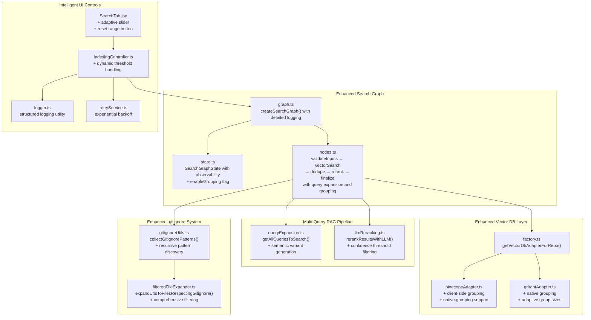
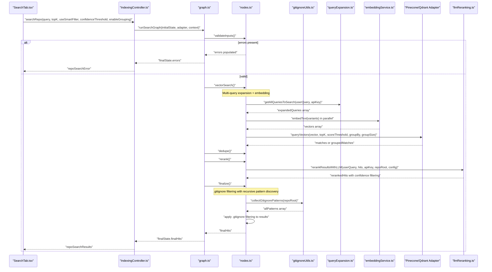
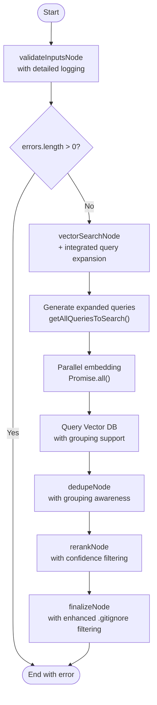
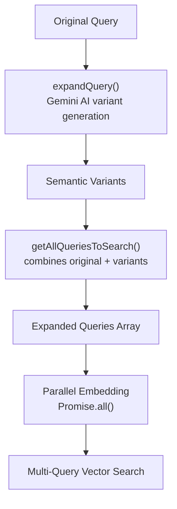
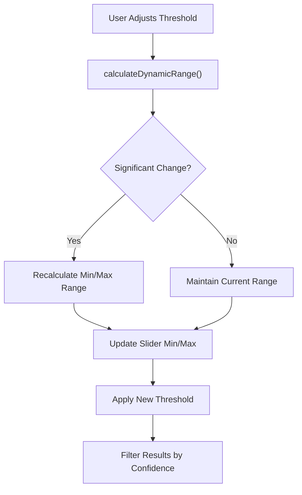
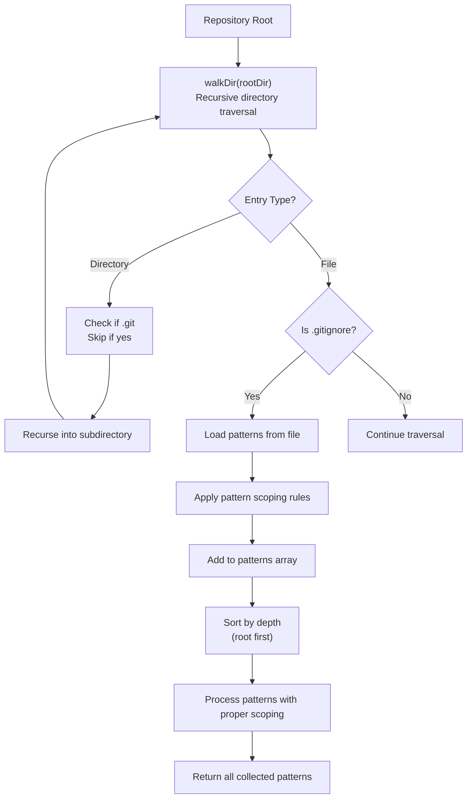
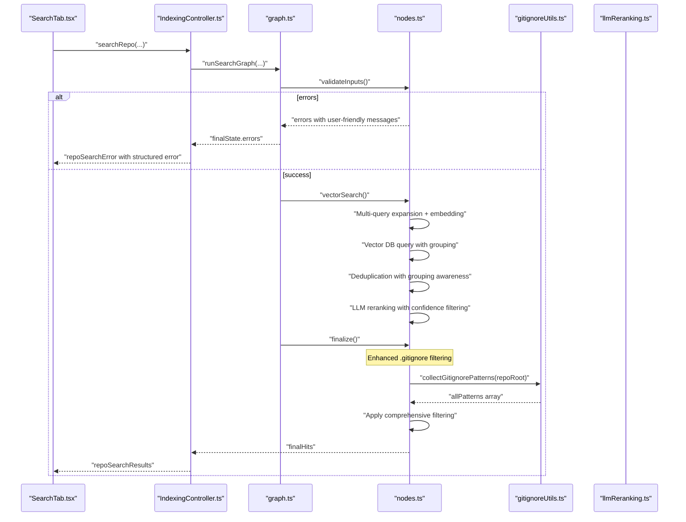

# Semantic Search Algorithms

<cite>
**Referenced Files in This Document**
- [graph.ts](file://src/search/graph.ts)
- [nodes.ts](file://src/search/nodes.ts)
- [state.ts](file://src/search/state.ts)
- [llmReranking.ts](file://src/core/indexing/llmReranking.ts)
- [queryExpansion.ts](file://src/core/indexing/queryExpansion.ts)
- [embeddingService.ts](file://src/core/indexing/embeddingService.ts)
- [factory.ts](file://src/core/indexing/vectorDb/factory.ts)
- [pineconeAdapter.ts](file://src/core/indexing/vectorDb/providers/pineconeAdapter.ts)
- [qdrantAdapter.ts](file://src/core/indexing/vectorDb/providers/qdrantAdapter.ts)
- [gitignoreUtils.ts](file://src/core/files/gitignoreUtils.ts)
- [filteredFileExpander.ts](file://src/core/files/filteredFileExpander.ts)
- [IndexingController.ts](file://src/webview/controllers/IndexingController.ts)
- [SearchTab.tsx](file://src/webview/components/SearchTab.tsx)
- [logger.ts](file://src/shared/logger.ts)
- [retryService.ts](file://src/core/indexing/retryService.ts)
</cite>

## Update Summary
**Changes Made**
- Enhanced search graph nodes with integrated multi-query RAG expansion
- Implemented dynamic confidence thresholding with adaptive range slider
- Added file-level grouping capability with configurable group sizes
- Improved vector database adapters with native grouping support
- Enhanced LLM-based reranking with confidence threshold filtering
- Updated UI with intelligent threshold adjustment and reset controls
- **Added comprehensive .gitignore pattern collection for enhanced file discovery filtering**

## Table of Contents
1. [Introduction](#introduction)
2. [Project Structure](#project-structure)
3. [Core Components](#core-components)
4. [Architecture Overview](#architecture-overview)
5. [Detailed Component Analysis](#detailed-component-analysis)
6. [Enhanced Search Capabilities](#enhanced-search-capabilities)
7. [Dynamic Confidence Thresholding](#dynamic-confidence-thresholding)
8. [File-Level Grouping Implementation](#file-level-grouping-implementation)
9. [Multi-Query RAG Integration](#multi-query-rag-integration)
10. [Enhanced .gitignore Pattern Collection](#enhanced-gitignore-pattern-collection)
11. [Enhanced Error Handling and Logging](#enhanced-error-handling-and-logging)
12. [User Feedback and Experience](#user-feedback-and-experience)
13. [Performance Considerations](#performance-considerations)
14. [Troubleshooting Guide](#troubleshooting-guide)
15. [Conclusion](#conclusion)
16. [Appendices](#appendices)

## Introduction
This document describes the Semantic Search Algorithms subsystem responsible for retrieving and ranking relevant repository artifacts using vector search and LLM-based reranking. The system has been significantly enhanced with dynamic confidence thresholding, file-level grouping, multi-query RAG integration, and improved search graph nodes with query expansion capabilities. **A major enhancement is the comprehensive .gitignore pattern collection system that now discovers and applies patterns from all subdirectories for more accurate file discovery during semantic search operations.**

Key enhancements include:
- **Dynamic Confidence Thresholding**: Intelligent threshold adjustment with adaptive range slider and reset functionality
- **File-Level Grouping**: Configurable grouping by file path with optimized chunk selection
- **Multi-Query RAG Integration**: Advanced query expansion with semantic variant generation
- **Enhanced Vector Database Support**: Native grouping capabilities in Pinecone and Qdrant adapters
- **Improved LLM Reranking**: Confidence-based filtering with threshold tuning
- **Advanced UI Controls**: Interactive threshold adjustment with real-time feedback
- **Comprehensive .gitignore Filtering**: Recursive pattern collection from all .gitignore files for precise file discovery

## Project Structure
The semantic search subsystem spans four primary areas:
- **Enhanced Search Graph**: LangGraph-based workflow with integrated query expansion and grouping
- **Multi-Query RAG Pipeline**: Query expansion with semantic variant generation and parallel processing
- **Vector Database Layer**: Enhanced adapters with native grouping and confidence filtering
- **Intelligent UI Controls**: Dynamic threshold adjustment with adaptive range optimization
- **Enhanced .gitignore System**: Recursive pattern discovery and application across all repository subdirectories

**Diagram sources**
- [graph.ts](file://src/search/graph.ts#L5-L25)
- [state.ts](file://src/search/state.ts#L7-L56)
- [nodes.ts](file://src/search/nodes.ts#L60-L381)
- [queryExpansion.ts](file://src/core/indexing/queryExpansion.ts#L58-L64)
- [llmReranking.ts](file://src/core/indexing/llmReranking.ts#L43-L144)
- [pineconeAdapter.ts](file://src/core/indexing/vectorDb/providers/pineconeAdapter.ts#L17-L75)
- [qdrantAdapter.ts](file://src/core/indexing/vectorDb/providers/qdrantAdapter.ts#L86-L176)
- [gitignoreUtils.ts](file://src/core/files/gitignoreUtils.ts#L17-L100)
- [filteredFileExpander.ts](file://src/core/files/filteredFileExpander.ts#L29-L169)
- [IndexingController.ts](file://src/webview/controllers/IndexingController.ts#L127-L129)
- [SearchTab.tsx](file://src/webview/components/SearchTab.tsx#L1127-L1171)

**Section sources**
- [graph.ts](file://src/search/graph.ts#L1-L53)
- [state.ts](file://src/search/state.ts#L1-L57)
- [nodes.ts](file://src/search/nodes.ts#L1-L381)
- [gitignoreUtils.ts](file://src/core/files/gitignoreUtils.ts#L1-L101)
- [filteredFileExpander.ts](file://src/core/files/filteredFileExpander.ts#L1-L169)
- [IndexingController.ts](file://src/webview/controllers/IndexingController.ts#L125-L190)
- [SearchTab.tsx](file://src/webview/components/SearchTab.tsx#L1127-L1171)

## Core Components
- **Enhanced SearchGraphState**: Typed shared state with new `enableGrouping` flag for file-level grouping control
- **Integrated Query Expansion**: Multi-query RAG pipeline embedded directly in vectorSearchNode with semantic variant generation
- **Dynamic Confidence Thresholding**: Adaptive threshold control with intelligent range adjustment and reset functionality
- **File-Level Grouping**: Configurable grouping by file path with optimized chunk selection per file
- **Enhanced Vector Database Adapters**: Native grouping support in Pinecone and Qdrant with client-side fallback
- **Advanced LLM Reranking**: Confidence-based filtering with threshold tuning and combined scoring
- **Intelligent UI Controls**: Interactive threshold adjustment with real-time feedback and adaptive range optimization
- **Comprehensive .gitignore Pattern Collection**: Recursive discovery and application of patterns from all repository subdirectories

**Section sources**
- [state.ts](file://src/search/state.ts#L16-L16)
- [nodes.ts](file://src/search/nodes.ts#L80-L92)
- [SearchTab.tsx](file://src/webview/components/SearchTab.tsx#L1127-L1171)
- [pineconeAdapter.ts](file://src/core/indexing/vectorDb/providers/pineconeAdapter.ts#L43-L70)
- [qdrantAdapter.ts](file://src/core/indexing/vectorDb/providers/qdrantAdapter.ts#L114-L146)
- [llmReranking.ts](file://src/core/indexing/llmReranking.ts#L116-L133)
- [gitignoreUtils.ts](file://src/core/files/gitignoreUtils.ts#L17-L100)

## Architecture Overview
The enhanced semantic search workflow maintains the LangGraph StateGraph structure while integrating advanced capabilities. The system now provides dynamic confidence thresholding, file-level grouping, multi-query RAG expansion, and comprehensive .gitignore filtering with recursive pattern discovery across all repository subdirectories.

**Diagram sources**
- [IndexingController.ts](file://src/webview/controllers/IndexingController.ts#L323-L472)
- [graph.ts](file://src/search/graph.ts#L30-L52)
- [nodes.ts](file://src/search/nodes.ts#L60-L381)
- [gitignoreUtils.ts](file://src/core/files/gitignoreUtils.ts#L17-L100)
- [queryExpansion.ts](file://src/core/indexing/queryExpansion.ts#L58-L64)
- [embeddingService.ts](file://src/core/indexing/embeddingService.ts#L89-L142)
- [pineconeAdapter.ts](file://src/core/indexing/vectorDb/providers/pineconeAdapter.ts#L25-L75)
- [qdrantAdapter.ts](file://src/core/indexing/vectorDb/providers/qdrantAdapter.ts#L86-L176)
- [llmReranking.ts](file://src/core/indexing/llmReranking.ts#L43-L144)

## Detailed Component Analysis

### Enhanced Search Graph with Integrated Query Expansion
The search graph now includes comprehensive logging and enhanced error handling with integrated multi-query RAG expansion. The vectorSearchNode has been redesigned to handle query expansion internally, eliminating the separate expandQueryNode.

**Diagram sources**
- [graph.ts](file://src/search/graph.ts#L14-L24)
- [nodes.ts](file://src/search/nodes.ts#L60-L381)
- [state.ts](file://src/search/state.ts#L7-L56)

**Section sources**
- [state.ts](file://src/search/state.ts#L16-L16)
- [graph.ts](file://src/search/graph.ts#L1-L53)
- [nodes.ts](file://src/search/nodes.ts#L60-L381)

### Multi-Query RAG Integration with Semantic Variant Generation
The system now implements advanced multi-query RAG expansion with semantic variant generation. The `getAllQueriesToSearch` function generates 3-5 semantic variants of the original query using Gemini AI, creating a comprehensive search strategy.

**Diagram sources**
- [queryExpansion.ts](file://src/core/indexing/queryExpansion.ts#L23-L64)

**Section sources**
- [queryExpansion.ts](file://src/core/indexing/queryExpansion.ts#L23-L64)
- [nodes.ts](file://src/search/nodes.ts#L80-L92)

### Enhanced Vector Database Adapters with Native Grouping
Both Pinecone and Qdrant adapters now support native grouping capabilities. Pinecone provides client-side grouping as a fallback, while Qdrant offers native searchPointGroups functionality.

**Section sources**
- [pineconeAdapter.ts](file://src/core/indexing/vectorDb/providers/pineconeAdapter.ts#L43-L70)
- [qdrantAdapter.ts](file://src/core/indexing/vectorDb/providers/qdrantAdapter.ts#L114-L146)

### Advanced LLM-Based Reranking with Confidence Filtering
The LLM reranking mechanism now includes confidence threshold filtering, ensuring only highly relevant results are retained. The system combines vector scores with LLM confidence scores for optimal ranking.

**Section sources**
- [llmReranking.ts](file://src/core/indexing/llmReranking.ts#L116-L133)

## Enhanced Search Capabilities

### Dynamic Confidence Thresholding System
The system now features intelligent confidence thresholding with adaptive range adjustment. Users can fine-tune the threshold from 0.0 to 1.0 with 0.01 granularity, and the system automatically adjusts the visible range based on the current threshold value.

**Diagram sources**
- [SearchTab.tsx](file://src/webview/components/SearchTab.tsx#L1127-L1171)

**Section sources**
- [SearchTab.tsx](file://src/webview/components/SearchTab.tsx#L1127-L1171)
- [nodes.ts](file://src/search/nodes.ts#L178-L182)
- [llmReranking.ts](file://src/core/indexing/llmReranking.ts#L119-L119)

### File-Level Grouping Implementation
The system now supports configurable file-level grouping to eliminate duplicate files from results. When enabled, the vector database queries return only the best chunk per file, reducing redundancy while maintaining comprehensive coverage.

**Section sources**
- [nodes.ts](file://src/search/nodes.ts#L179-L181)
- [pineconeAdapter.ts](file://src/core/indexing/vectorDb/providers/pineconeAdapter.ts#L43-L70)
- [qdrantAdapter.ts](file://src/core/indexing/vectorDb/providers/qdrantAdapter.ts#L114-L146)

## Enhanced .gitignore Pattern Collection

### Recursive Pattern Discovery System
The system now implements a comprehensive .gitignore pattern collection mechanism that recursively discovers patterns from all subdirectories in the repository. The `collectGitignorePatterns` function performs a depth-first traversal to ensure proper precedence and scoping.

**Diagram sources**
- [gitignoreUtils.ts](file://src/core/files/gitignoreUtils.ts#L17-L100)

### Pattern Scoping and Precedence Rules
The enhanced .gitignore system implements proper gitignore specification compliance with sophisticated pattern scoping rules:

- **Absolute patterns** (`/pattern`): Applied relative to the .gitignore file's location
- **Global patterns** (`**/pattern`): Match anywhere in the repository tree
- **Directory patterns** (`dir/`): Apply to the directory and all contents
- **Recursive patterns**: Non-root .gitignore files add both local and recursive matching patterns

### Comprehensive Filtering Implementation
The `finalizeNode` now applies enhanced .gitignore filtering using the collected patterns:

1. **Pattern Collection**: Recursively discovers all .gitignore files and patterns
2. **Pattern Loading**: Loads patterns with proper path scoping and precedence
3. **Default Ignores**: Adds common patterns like `.git`, `node_modules`, `dist`, etc.
4. **Result Filtering**: Applies ignore rules to semantic search results
5. **Performance Optimization**: Skips ignored directories during traversal

**Section sources**
- [gitignoreUtils.ts](file://src/core/files/gitignoreUtils.ts#L17-L100)
- [nodes.ts](file://src/search/nodes.ts#L348-L369)
- [filteredFileExpander.ts](file://src/core/files/filteredFileExpander.ts#L29-L169)

## Dynamic Confidence Thresholding

### Adaptive Range Slider Implementation
The UI features an adaptive confidence threshold slider that dynamically adjusts its range based on user interaction. The system calculates appropriate minimum and maximum values around the current threshold position.

### Intelligent Threshold Adjustment
When users move the threshold slider significantly, the system recalculates the visible range to provide better granularity around the current setting. A reset button allows users to restore the default 0.0-1.0 range.

### Threshold Application in Search Pipeline
The confidence threshold is applied at multiple stages:
- Vector database queries filter results below the threshold
- LLM reranking removes results below the confidence threshold
- Final result filtering ensures only high-confidence matches remain

**Section sources**
- [SearchTab.tsx](file://src/webview/components/SearchTab.tsx#L1127-L1171)
- [nodes.ts](file://src/search/nodes.ts#L178-L182)
- [llmReranking.ts](file://src/core/indexing/llmReranking.ts#L119-L119)

## File-Level Grouping Implementation

### Grouping Configuration
The system supports configurable file-level grouping through the `enableGrouping` flag in SearchGraphState. When enabled, vector database queries return only the highest scoring chunk per file.

### Vector Database Grouping Support
Both Pinecone and Qdrant adapters implement grouping differently:
- **Pinecone**: Client-side grouping since native grouping is not supported
- **Qdrant**: Native grouping using searchPointGroups with configurable group sizes

### Deduplication Logic Enhancement
The dedupeNode has been enhanced to work effectively with grouping. When grouping is enabled, the system assumes unique files and uses deduplication primarily as a safety net for edge cases.

**Section sources**
- [state.ts](file://src/search/state.ts#L16-L16)
- [nodes.ts](file://src/search/nodes.ts#L179-L181)
- [nodes.ts](file://src/search/nodes.ts#L274-L294)
- [pineconeAdapter.ts](file://src/core/indexing/vectorDb/providers/pineconeAdapter.ts#L43-L70)
- [qdrantAdapter.ts](file://src/core/indexing/vectorDb/providers/qdrantAdapter.ts#L114-L146)

## Multi-Query RAG Integration

### Semantic Variant Generation
The system generates 3-5 semantic variants of the original query using Gemini AI, creating a comprehensive search strategy that captures different aspects of the user's intent.

### Parallel Processing Architecture
Query expansion and embedding now use parallel processing:
- All query variants are embedded simultaneously using Promise.all()
- Vector database queries are executed in parallel for each variant
- Results are merged and deduplicated at the end

### Query Expansion Flow
The multi-query approach follows this sequence:
1. Generate semantic variants using Gemini AI
2. Combine original query with all variants
3. Embed all queries in parallel
4. Query vector database with all embeddings
5. Merge and deduplicate results

**Section sources**
- [queryExpansion.ts](file://src/core/indexing/queryExpansion.ts#L23-L64)
- [nodes.ts](file://src/search/nodes.ts#L80-L92)
- [nodes.ts](file://src/search/nodes.ts#L102-L104)

## Enhanced Error Handling and Logging

### Comprehensive Error Categorization
The system provides detailed error categorization for different failure scenarios with enhanced user-friendly messages.

### Detailed Logging Throughout the Workflow
Every major operation includes comprehensive console logging with structured prefixes and timing information.

### Priority Queuing for Rate Limiting
The embedding service implements priority queuing where search operations receive priority treatment over background indexing operations.

### Retry Service with Exponential Backoff
A comprehensive retry service provides exponential backoff retry logic with context-aware logging for transient failures.

**Section sources**
- [nodes.ts](file://src/search/nodes.ts#L107-L160)
- [nodes.ts](file://src/search/nodes.ts#L208-L261)
- [embeddingService.ts](file://src/core/indexing/embeddingService.ts#L89-L142)
- [retryService.ts](file://src/core/indexing/retryService.ts#L22-L58)
- [logger.ts](file://src/shared/logger.ts#L7-L132)

## User Feedback and Experience

### Structured Error Messages
The system provides user-friendly error messages tailored to specific failure scenarios with actionable resolution steps.

### Progress Tracking and Status Updates
Enhanced progress tracking provides real-time feedback on search operations including query expansion status, embedding progress, and result filtering information.

### Intelligent UI Controls
The dynamic confidence threshold slider provides real-time feedback with adaptive range adjustment and reset functionality.

### Comprehensive Logging Interface
The logger utility supports multiple output channels with emoji indicators and verbose mode for detailed debugging.

**Section sources**
- [IndexingController.ts](file://src/webview/controllers/IndexingController.ts#L465-L472)
- [SearchTab.tsx](file://src/webview/components/SearchTab.tsx#L1127-L1171)
- [logger.ts](file://src/shared/logger.ts#L105-L132)

## Performance Considerations
- **Parallel Processing**: Multi-query RAG uses Promise.all() for simultaneous embedding and querying
- **Dynamic Thresholding**: Adaptive range adjustment reduces unnecessary slider movement
- **File-Level Grouping**: Eliminates redundant file processing while maintaining result quality
- **Rate Limiting Mitigation**: Priority queuing ensures search operations receive priority treatment
- **Error Recovery**: Comprehensive error handling with fallback mechanisms prevents single point of failure
- **Logging Overhead**: Detailed logging provides valuable debugging information with minimal performance impact
- **Retry Efficiency**: Exponential backoff reduces retry frequency while maintaining reliability
- **Enhanced .gitignore Filtering**: Recursive pattern discovery with caching for improved performance

## Troubleshooting Guide
The enhanced error handling provides comprehensive troubleshooting capabilities with improved user guidance.

### Validation Failures
- Empty query, missing repo root, or missing Google API key cause immediate termination with detailed error messages
- Console logs provide specific failure reasons and suggested actions

### Vector Database Initialization Issues
- Missing API keys or invalid selections lead to categorized errors with specific resolution steps
- Controller surfaces user-friendly messages with actionable guidance
- Detailed logging helps identify whether the issue is connectivity, authentication, or configuration-related

### LLM Reranking Failures
- JSON parsing errors or model errors fall back to original scores with detailed logging
- Check logs for specific error types and retry mechanisms
- Fallback ensures search functionality remains available even when AI services fail

### Embedding Service Issues
- Comprehensive error categorization for rate limiting, network, authentication, and initialization failures
- Priority queuing helps mitigate rate limiting impacts during user operations
- Detailed queue statistics aid in diagnosing embedding service performance

### .gitignore Pattern Collection Issues
- **Pattern Loading Failures**: Errors during .gitignore file reading are caught and logged with warnings
- **Permission Issues**: Directory traversal gracefully skips unreadable directories
- **Pattern Scope Errors**: Malformed patterns are logged but don't break the entire filtering system
- **Performance Concerns**: Large repositories with many .gitignore files may take longer to process initially

### UI Feedback and Error Handling
- Expanded queries and results are posted to the webview with detailed progress tracking
- Errors are surfaced via structured `repoSearchError` messages with specific failure categories
- User-friendly error messages guide users toward resolution steps

**Diagram sources**
- [IndexingController.ts](file://src/webview/controllers/IndexingController.ts#L323-L472)
- [nodes.ts](file://src/search/nodes.ts#L60-L381)
- [gitignoreUtils.ts](file://src/core/files/gitignoreUtils.ts#L17-L100)
- [llmReranking.ts](file://src/core/indexing/llmReranking.ts#L116-L133)
- [SearchTab.tsx](file://src/webview/components/SearchTab.tsx#L751-L775)

**Section sources**
- [nodes.ts](file://src/search/nodes.ts#L60-L381)
- [IndexingController.ts](file://src/webview/controllers/IndexingController.ts#L323-L472)
- [llmReranking.ts](file://src/core/indexing/llmReranking.ts#L116-L133)
- [logger.ts](file://src/shared/logger.ts#L7-L132)

## Conclusion
The enhanced Semantic Search Algorithms subsystem now provides comprehensive dynamic confidence thresholding, file-level grouping, multi-query RAG integration, and improved search graph nodes with integrated query expansion. **The major enhancement is the comprehensive .gitignore pattern collection system that recursively discovers patterns from all repository subdirectories, providing precise file discovery filtering during semantic search operations.** The system's modular design with priority queuing, structured error categorization, and advanced UI controls ensures reliable operation with exceptional user experience. The intelligent threshold adjustment, native grouping support, semantic variant generation, and enhanced .gitignore filtering deliver superior search quality while maintaining excellent performance characteristics.

## Appendices

### Best Practices Checklist
- **Threshold Tuning**: Use the adaptive slider to find optimal confidence thresholds for your use case
- **Grouping Configuration**: Enable file-level grouping for repositories with repetitive file structures
- **Multi-Query Benefits**: Leverage semantic variants for complex queries requiring multiple search perspectives
- **Performance Monitoring**: Monitor queue statistics and timing metrics for optimal performance
- **User Guidance**: Leverage user-friendly error messages to quickly identify and resolve issues
- **Logging Strategy**: Utilize detailed logging for debugging while maintaining reasonable verbosity
- **Retry Configuration**: Configure appropriate retry settings for different failure scenarios
- **.gitignore Optimization**: Ensure .gitignore files are properly maintained for best search results

### Common Error Scenarios and Solutions
- **Rate Limiting**: Wait for cooldown period or reduce concurrent operations
- **Network Issues**: Verify connection, firewall settings, and proxy configuration
- **Authentication Problems**: Check API key validity and permissions
- **Vector Database Issues**: Verify connection string, credentials, and collection existence
- **Provider Initialization**: Ensure embedding provider is properly configured and initialized
- **Grouping Issues**: Check vector database support for grouping functionality
- **Threshold Problems**: Use reset range button to restore default threshold values
- **.gitignore Pattern Issues**: Check for malformed patterns or permission issues in .gitignore files
- **Large Repository Performance**: Consider enabling file-level grouping for repositories with many files

### Advanced Configuration Options
- **Dynamic Range Adjustment**: Automatic range optimization based on current threshold position
- **File-Level Grouping**: Configurable chunk selection per file for optimal result diversity
- **Multi-Query Expansion**: Semantic variant generation for enhanced search coverage
- **Confidence Filtering**: Adjustable confidence thresholds for result quality control
- **Parallel Processing**: Optimized query execution for improved performance
- **Enhanced .gitignore Filtering**: Recursive pattern discovery from all repository subdirectories
- **Pattern Scoping Rules**: Proper handling of absolute, global, and directory patterns
- **Performance Optimization**: Caching and efficient pattern matching for large repositories

### .gitignore Pattern Collection Features
- **Recursive Discovery**: Automatically finds .gitignore files in all subdirectories
- **Proper Scoping**: Applies gitignore specification compliance with precedence rules
- **Performance Optimization**: Sorts patterns by depth to ensure correct precedence
- **Error Resilience**: Gracefully handles unreadable directories and malformed patterns
- **Integration**: Seamlessly integrated into the search pipeline for comprehensive filtering
- **Statistics**: Provides ignored file counts and filtering effectiveness metrics