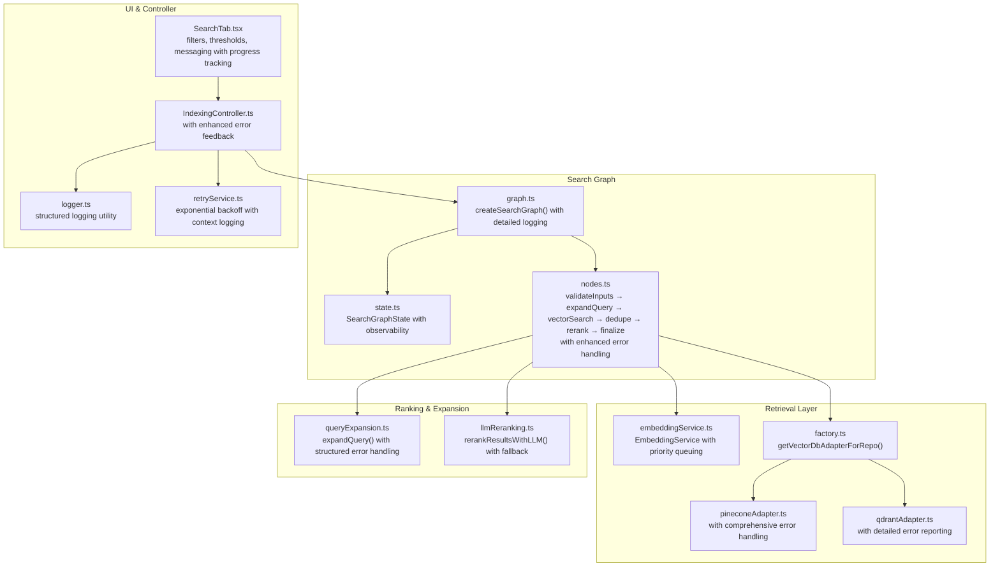
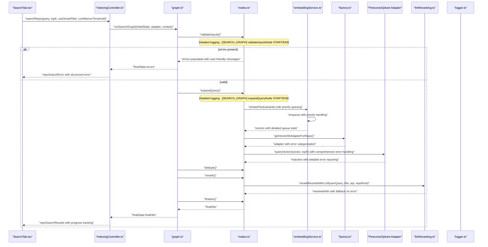
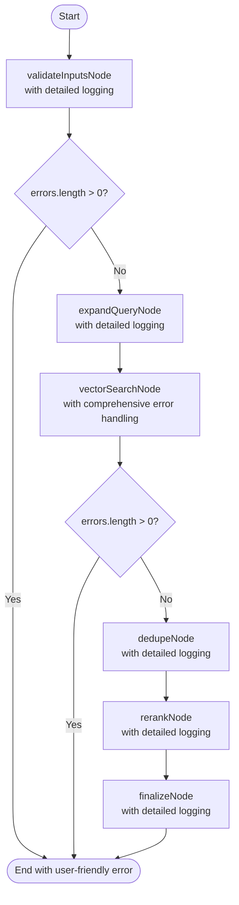
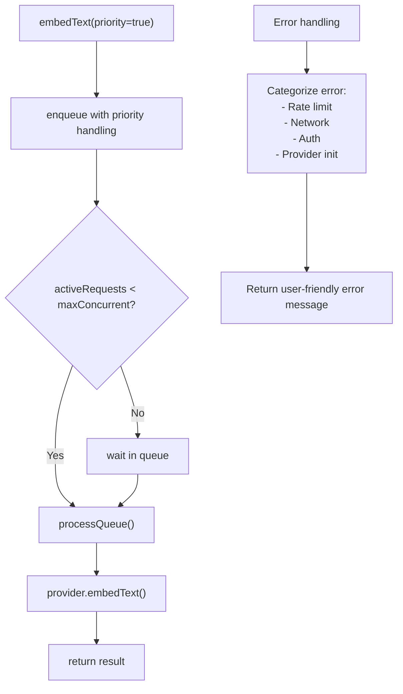
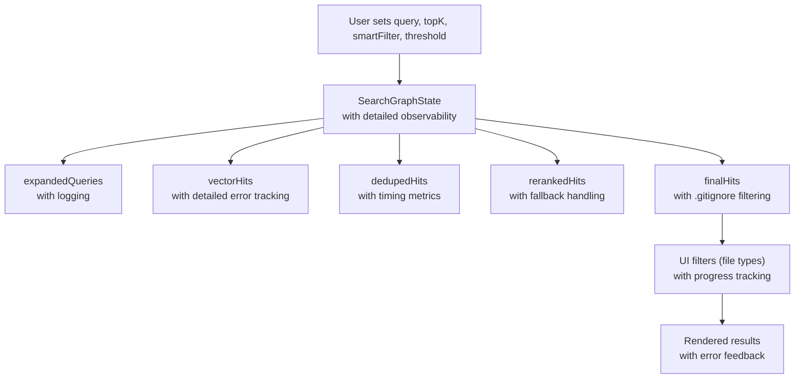
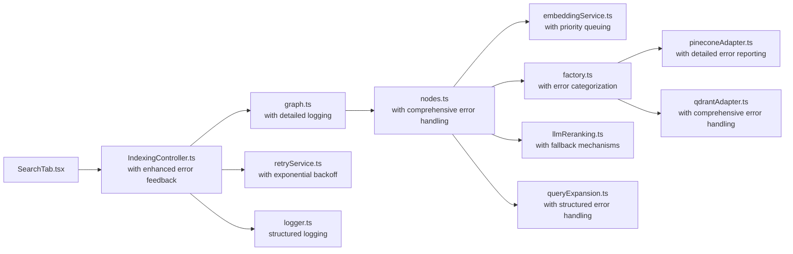
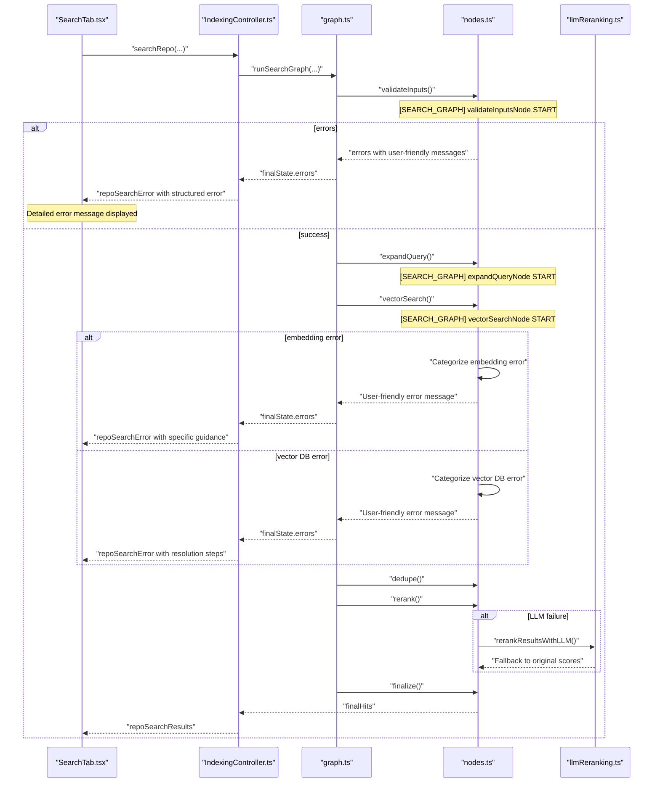

# Semantic Search Algorithms

<cite>
**Referenced Files in This Document**
- [graph.ts](file://src/search/graph.ts)
- [nodes.ts](file://src/search/nodes.ts)
- [state.ts](file://src/search/state.ts)
- [llmReranking.ts](file://src/core/indexing/llmReranking.ts)
- [queryExpansion.ts](file://src/core/indexing/queryExpansion.ts)
- [embeddingService.ts](file://src/core/indexing/embeddingService.ts)
- [factory.ts](file://src/core/indexing/vectorDb/factory.ts)
- [pineconeAdapter.ts](file://src/core/indexing/vectorDb/providers/pineconeAdapter.ts)
- [qdrantAdapter.ts](file://src/core/indexing/vectorDb/providers/qdrantAdapter.ts)
- [IndexingController.ts](file://src/webview/controllers/IndexingController.ts)
- [SearchTab.tsx](file://src/webview/components/SearchTab.tsx)
- [logger.ts](file://src/shared/logger.ts)
- [retryService.ts](file://src/core/indexing/retryService.ts)
</cite>

## Update Summary
**Changes Made**
- Enhanced detailed logging throughout the search workflow with comprehensive console logging
- Implemented comprehensive error handling with user-friendly error messages for rate limiting, network connectivity, authentication, and vector database problems
- Added improved user feedback mechanisms through structured error reporting and progress tracking
- Integrated robust retry service with exponential backoff for transient failures
- Enhanced embedding service with priority queuing and detailed error categorization
- Improved vector database adapters with comprehensive error handling and metadata validation

## Table of Contents
1. [Introduction](#introduction)
2. [Project Structure](#project-structure)
3. [Core Components](#core-components)
4. [Architecture Overview](#architecture-overview)
5. [Detailed Component Analysis](#detailed-component-analysis)
6. [Enhanced Error Handling and Logging](#enhanced-error-handling-and-logging)
7. [User Feedback and Experience](#user-feedback-and-experience)
8. [Dependency Analysis](#dependency-analysis)
9. [Performance Considerations](#performance-considerations)
10. [Troubleshooting Guide](#troubleshooting-guide)
11. [Conclusion](#conclusion)
12. [Appendices](#appendices)

## Introduction
This document describes the Semantic Search Algorithms subsystem responsible for retrieving and ranking relevant repository artifacts using vector search and LLM-based reranking. The system has been significantly enhanced with detailed logging, comprehensive error handling, and improved user feedback mechanisms for rate limiting, network connectivity, authentication, and vector database problems.

Key enhancements include:
- Comprehensive console logging at every stage of the search workflow
- Structured error categorization with user-friendly messages for different failure types
- Priority queuing for embedding operations to handle rate limiting gracefully
- Robust retry mechanisms with exponential backoff for transient failures
- Enhanced vector database adapters with detailed error reporting
- Improved user feedback through structured error messages and progress tracking

## Project Structure
The semantic search subsystem spans three primary areas:
- Search graph orchestration and state: LangGraph-based workflow with typed state and comprehensive logging
- Retrieval and reranking: Vector DB adapters, embedding service with priority queuing, query expansion, and LLM reranking
- Web UI and controller: User-driven search, filters, result presentation, and enhanced error feedback

**Diagram sources**
- [graph.ts](file://src/search/graph.ts#L5-L27)
- [state.ts](file://src/search/state.ts#L7-L56)
- [nodes.ts](file://src/search/nodes.ts#L12-L187)
- [embeddingService.ts](file://src/core/indexing/embeddingService.ts#L17-L68)
- [factory.ts](file://src/core/indexing/vectorDb/factory.ts#L17-L61)
- [pineconeAdapter.ts](file://src/core/indexing/vectorDb/providers/pineconeAdapter.ts#L5-L82)
- [qdrantAdapter.ts](file://src/core/indexing/vectorDb/providers/qdrantAdapter.ts#L12-L200)
- [queryExpansion.ts](file://src/core/indexing/queryExpansion.ts#L23-L64)
- [llmReranking.ts](file://src/core/indexing/llmReranking.ts#L43-L143)
- [IndexingController.ts](file://src/webview/controllers/IndexingController.ts#L52-L157)
- [SearchTab.tsx](file://src/webview/components/SearchTab.tsx#L619-L636)
- [logger.ts](file://src/shared/logger.ts#L7-L132)
- [retryService.ts](file://src/core/indexing/retryService.ts#L1-L71)

**Section sources**
- [graph.ts](file://src/search/graph.ts#L1-L55)
- [state.ts](file://src/search/state.ts#L1-L59)
- [nodes.ts](file://src/search/nodes.ts#L1-L370)
- [IndexingController.ts](file://src/webview/controllers/IndexingController.ts#L52-L157)
- [SearchTab.tsx](file://src/webview/components/SearchTab.tsx#L619-L636)

## Core Components
- **SearchGraphState**: Typed shared state across nodes with comprehensive observability including inputs, derived fields, timing, logs, errors, and token counters.
- **Enhanced Nodes**: Five-stage pipeline with detailed logging and comprehensive error handling for validation, query expansion, vector search, deduplication, LLM reranking, and finalization.
- **Priority Embedding Service**: Embedding service with queue management, priority queuing for user-facing operations, and detailed error categorization.
- **Structured Error Handling**: Comprehensive error classification for rate limiting, network connectivity, authentication, and vector database problems with user-friendly messages.
- **Retry Service**: Exponential backoff retry mechanism with context-aware logging for transient failures.
- **Enhanced Vector DB Adapters**: Pinecone and Qdrant adapters with detailed error reporting, metadata validation, and comprehensive failure handling.
- **Logger Utility**: Structured logging with emoji indicators, console and output channel support, and verbose mode for debugging.
- **Controller and UI**: Enhanced orchestration with detailed error feedback, progress tracking, and comprehensive user notifications.

**Section sources**
- [state.ts](file://src/search/state.ts#L7-L56)
- [nodes.ts](file://src/search/nodes.ts#L12-L370)
- [embeddingService.ts](file://src/core/indexing/embeddingService.ts#L28-L167)
- [retryService.ts](file://src/core/indexing/retryService.ts#L22-L58)
- [pineconeAdapter.ts](file://src/core/indexing/vectorDb/providers/pineconeAdapter.ts#L5-L82)
- [qdrantAdapter.ts](file://src/core/indexing/vectorDb/providers/qdrantAdapter.ts#L12-L248)
- [logger.ts](file://src/shared/logger.ts#L7-L132)
- [IndexingController.ts](file://src/webview/controllers/IndexingController.ts#L52-L157)
- [SearchTab.tsx](file://src/webview/components/SearchTab.tsx#L438-L460)

## Architecture Overview
The semantic search workflow is a LangGraph StateGraph with five nodes, each enhanced with comprehensive logging and error handling. The system now provides detailed observability and user feedback throughout the entire search process.

**Diagram sources**
- [IndexingController.ts](file://src/webview/controllers/IndexingController.ts#L52-L157)
- [graph.ts](file://src/search/graph.ts#L32-L54)
- [nodes.ts](file://src/search/nodes.ts#L12-L370)
- [embeddingService.ts](file://src/core/indexing/embeddingService.ts#L89-L142)
- [factory.ts](file://src/core/indexing/vectorDb/factory.ts#L17-L61)
- [pineconeAdapter.ts](file://src/core/indexing/vectorDb/providers/pineconeAdapter.ts#L17-L33)
- [qdrantAdapter.ts](file://src/core/indexing/vectorDb/providers/qdrantAdapter.ts#L85-L119)
- [llmReranking.ts](file://src/core/indexing/llmReranking.ts#L43-L143)
- [SearchTab.tsx](file://src/webview/components/SearchTab.tsx#L619-L636)

## Detailed Component Analysis

### Enhanced Search Graph and State Management
The search graph now includes comprehensive logging at every stage and enhanced error handling with user-friendly messages. The state management captures detailed observability including timing metrics, comprehensive logs, structured errors, and token usage tracking.

**Diagram sources**
- [graph.ts](file://src/search/graph.ts#L14-L24)
- [nodes.ts](file://src/search/nodes.ts#L12-L370)
- [state.ts](file://src/search/state.ts#L7-L56)

**Section sources**
- [state.ts](file://src/search/state.ts#L7-L56)
- [graph.ts](file://src/search/graph.ts#L1-L55)
- [nodes.ts](file://src/search/nodes.ts#L12-L370)

### Priority Embedding Service with Enhanced Error Handling
The embedding service now includes priority queuing for user-facing operations, detailed queue statistics, and comprehensive error categorization. This ensures that search operations receive priority treatment during rate limiting scenarios.

**Diagram sources**
- [embeddingService.ts](file://src/core/indexing/embeddingService.ts#L89-L142)

**Section sources**
- [embeddingService.ts](file://src/core/indexing/embeddingService.ts#L28-L167)

### Enhanced Vector Database Adapters with Comprehensive Error Reporting
Both Pinecone and Qdrant adapters now include comprehensive error handling with detailed logging, metadata validation, and structured error messages for different failure scenarios.

**Section sources**
- [pineconeAdapter.ts](file://src/core/indexing/vectorDb/providers/pineconeAdapter.ts#L5-L82)
- [qdrantAdapter.ts](file://src/core/indexing/vectorDb/providers/qdrantAdapter.ts#L12-L248)

### LLM-Based Reranking with Fallback Mechanisms
The LLM reranking mechanism includes comprehensive error handling with fallback to original scores when LLM operations fail, ensuring search reliability even when AI services encounter issues.

**Section sources**
- [llmReranking.ts](file://src/core/indexing/llmReranking.ts#L43-L143)

### Query Expansion with Structured Error Handling
Query expansion now includes structured error handling with fallback to original query when expansion fails, ensuring search functionality remains available even when AI services encounter issues.

**Section sources**
- [queryExpansion.ts](file://src/core/indexing/queryExpansion.ts#L23-L64)

### Enhanced Search State Management and User Interaction Tracking
The search state now captures comprehensive observability including detailed timing metrics, structured logs, categorized errors, and token usage tracking. The UI provides enhanced user feedback through progress tracking and detailed error messages.

**Diagram sources**
- [state.ts](file://src/search/state.ts#L17-L56)
- [SearchTab.tsx](file://src/webview/components/SearchTab.tsx#L438-L460)

**Section sources**
- [state.ts](file://src/search/state.ts#L7-L56)
- [SearchTab.tsx](file://src/webview/components/SearchTab.tsx#L438-L460)
- [SearchTab.tsx](file://src/webview/components/SearchTab.tsx#L538-L540)

## Enhanced Error Handling and Logging

### Comprehensive Error Categorization
The system now provides detailed error categorization for different failure scenarios:

**Rate Limiting Errors**: Detected through HTTP 429, "rate limit", "quota", or "too many requests" in error messages, with user-friendly messages suggesting waiting periods and indexing completion.

**Network Connectivity Errors**: Identified by "fetch failed", "econnrefused", "enotfound", "etimedout", or "network" keywords, with suggestions for connection checks and firewall configuration.

**Authentication Errors**: Recognized by "api key", "unauthorized", "401", "403", or "invalid" in error messages, directing users to verify API key settings.

**Provider Initialization Errors**: Detected through "not initialized" or "switchprovider" messages, guiding users to check embedding provider configurations.

**Vector Database Connection Errors**: Comprehensive error handling for Pinecone and Qdrant adapters with specific messages for connectivity, authentication, collection/index not found, and timeout scenarios.

### Detailed Logging Throughout the Workflow
Every major operation now includes comprehensive console logging with structured prefixes:
- `[SEARCH_GRAPH]` for graph-level operations
- `[EMBEDDING_SERVICE]` for embedding operations
- `[LLM_RERANKING]` for LLM operations
- `[INDEXING_CONTROLLER]` for controller-level operations

Each log entry includes operation start/end markers, parameter information, timing metrics, and result summaries.

### Priority Queuing for Rate Limiting
The embedding service implements priority queuing where search operations receive priority treatment over background indexing operations, helping to mitigate rate limiting issues during user interactions.

### Retry Service with Exponential Backoff
A comprehensive retry service provides exponential backoff retry logic with context-aware logging for transient failures, reducing the impact of temporary service unavailability.

**Section sources**
- [nodes.ts](file://src/search/nodes.ts#L114-L253)
- [embeddingService.ts](file://src/core/indexing/embeddingService.ts#L89-L142)
- [retryService.ts](file://src/core/indexing/retryService.ts#L22-L58)
- [logger.ts](file://src/shared/logger.ts#L7-L132)

## User Feedback and Experience

### Structured Error Messages
The system provides user-friendly error messages tailored to specific failure scenarios, including actionable steps for resolution and detailed technical information for debugging.

### Progress Tracking and Status Updates
Enhanced progress tracking provides real-time feedback on search operations, including query expansion status, embedding progress, and result filtering information.

### Comprehensive Logging Interface
The logger utility provides multiple output channels (console, VS Code output panel) with emoji indicators and verbose mode support for detailed debugging.

### Summary Generation Integration
When smart filtering is enabled, the system automatically generates markdown summaries for search results, providing users with context about the relevance decisions made by the AI.

**Section sources**
- [IndexingController.ts](file://src/webview/controllers/IndexingController.ts#L190-L268)
- [SearchTab.tsx](file://src/webview/components/SearchTab.tsx#L558-L576)
- [logger.ts](file://src/shared/logger.ts#L105-L132)

## Dependency Analysis
The enhanced search subsystem maintains clear layering with additional error handling and logging dependencies:
- UI and controller depend on the search graph with enhanced error feedback
- The graph depends on nodes with comprehensive logging
- Nodes depend on embedding service with priority queuing, vector DB factory, and LLM reranking with fallback
- Vector DB adapters depend on external SDKs with comprehensive error handling
- Retry service provides exponential backoff for transient failures
- Logger utility supports structured logging across all components

**Diagram sources**
- [SearchTab.tsx](file://src/webview/components/SearchTab.tsx#L619-L636)
- [IndexingController.ts](file://src/webview/controllers/IndexingController.ts#L78-L88)
- [graph.ts](file://src/search/graph.ts#L5-L27)
- [nodes.ts](file://src/search/nodes.ts#L1-L11)
- [embeddingService.ts](file://src/core/indexing/embeddingService.ts#L1-L6)
- [factory.ts](file://src/core/indexing/vectorDb/factory.ts#L1-L6)
- [pineconeAdapter.ts](file://src/core/indexing/vectorDb/providers/pineconeAdapter.ts#L1-L4)
- [qdrantAdapter.ts](file://src/core/indexing/vectorDb/providers/qdrantAdapter.ts#L1-L4)
- [llmReranking.ts](file://src/core/indexing/llmReranking.ts#L1-L5)
- [queryExpansion.ts](file://src/core/indexing/queryExpansion.ts#L1-L2)
- [retryService.ts](file://src/core/indexing/retryService.ts#L1-L2)
- [logger.ts](file://src/shared/logger.ts#L1-L2)

**Section sources**
- [graph.ts](file://src/search/graph.ts#L1-L55)
- [nodes.ts](file://src/search/nodes.ts#L1-L370)
- [factory.ts](file://src/core/indexing/vectorDb/factory.ts#L1-L61)

## Performance Considerations
- **Rate Limiting Mitigation**: Priority queuing ensures search operations receive priority treatment during embedding service rate limiting
- **Error Recovery**: Comprehensive error handling with fallback mechanisms prevents single point of failure
- **Logging Overhead**: Detailed logging provides valuable debugging information with minimal performance impact
- **Retry Efficiency**: Exponential backoff reduces retry frequency while maintaining reliability
- **Queue Management**: Priority queuing prevents starvation of user-facing operations during high load

## Troubleshooting Guide
The enhanced error handling provides comprehensive troubleshooting capabilities:

### Validation Failures
- Empty query, missing repo root, or missing Google API key cause immediate termination with detailed error messages
- Console logs provide specific failure reasons and suggested actions

### Vector Database Initialization Issues
- Missing API keys or invalid selections lead to categorized errors with specific resolution steps
- Controller surfaces user-friendly messages with actionable guidance
- Detailed logging helps identify whether the issue is connectivity, authentication, or configuration-related

### LLM Reranking Failures
- JSON parsing errors or model errors fall back to original scores with detailed logging
- Check logs for specific error types and retry mechanisms
- Fallback ensures search functionality remains available even when AI services fail

### Embedding Service Issues
- Comprehensive error categorization for rate limiting, network, authentication, and initialization failures
- Priority queuing helps mitigate rate limiting impacts during user operations
- Detailed queue statistics aid in diagnosing embedding service performance

### UI Feedback and Error Handling
- Expanded queries and results are posted to the webview with detailed progress tracking
- Errors are surfaced via structured `repoSearchError` messages with specific failure categories
- User-friendly error messages guide users toward resolution steps

**Diagram sources**
- [IndexingController.ts](file://src/webview/controllers/IndexingController.ts#L90-L107)
- [nodes.ts](file://src/search/nodes.ts#L12-L370)
- [llmReranking.ts](file://src/core/indexing/llmReranking.ts#L139-L143)
- [SearchTab.tsx](file://src/webview/components/SearchTab.tsx#L551-L554)

**Section sources**
- [nodes.ts](file://src/search/nodes.ts#L12-L370)
- [IndexingController.ts](file://src/webview/controllers/IndexingController.ts#L62-L75)
- [llmReranking.ts](file://src/core/indexing/llmReranking.ts#L139-L143)
- [logger.ts](file://src/shared/logger.ts#L7-L132)

## Conclusion
The enhanced Semantic Search Algorithms subsystem now provides comprehensive error handling, detailed logging, and improved user feedback mechanisms. The system's modular design with priority queuing, structured error categorization, and fallback mechanisms ensures reliable operation even under challenging conditions. The detailed observability and user-friendly error messages enable effective troubleshooting and provide excellent user experience across rate limiting, network connectivity, authentication, and vector database problems.

## Appendices

### Best Practices Checklist
- **Error Resolution**: Use structured error messages to quickly identify and resolve issues
- **Performance Monitoring**: Monitor queue statistics and timing metrics for optimal performance
- **User Guidance**: Leverage user-friendly error messages to guide users through resolution steps
- **Logging Strategy**: Utilize detailed logging for debugging while maintaining reasonable verbosity
- **Retry Configuration**: Configure appropriate retry settings for different failure scenarios
- **Priority Management**: Understand how priority queuing affects embedding service performance during concurrent operations

### Common Error Scenarios and Solutions
- **Rate Limiting**: Wait for cooldown period or reduce concurrent operations
- **Network Issues**: Verify connection, firewall settings, and proxy configuration
- **Authentication Problems**: Check API key validity and permissions
- **Vector Database Issues**: Verify connection string, credentials, and collection existence
- **Provider Initialization**: Ensure embedding provider is properly configured and initialized