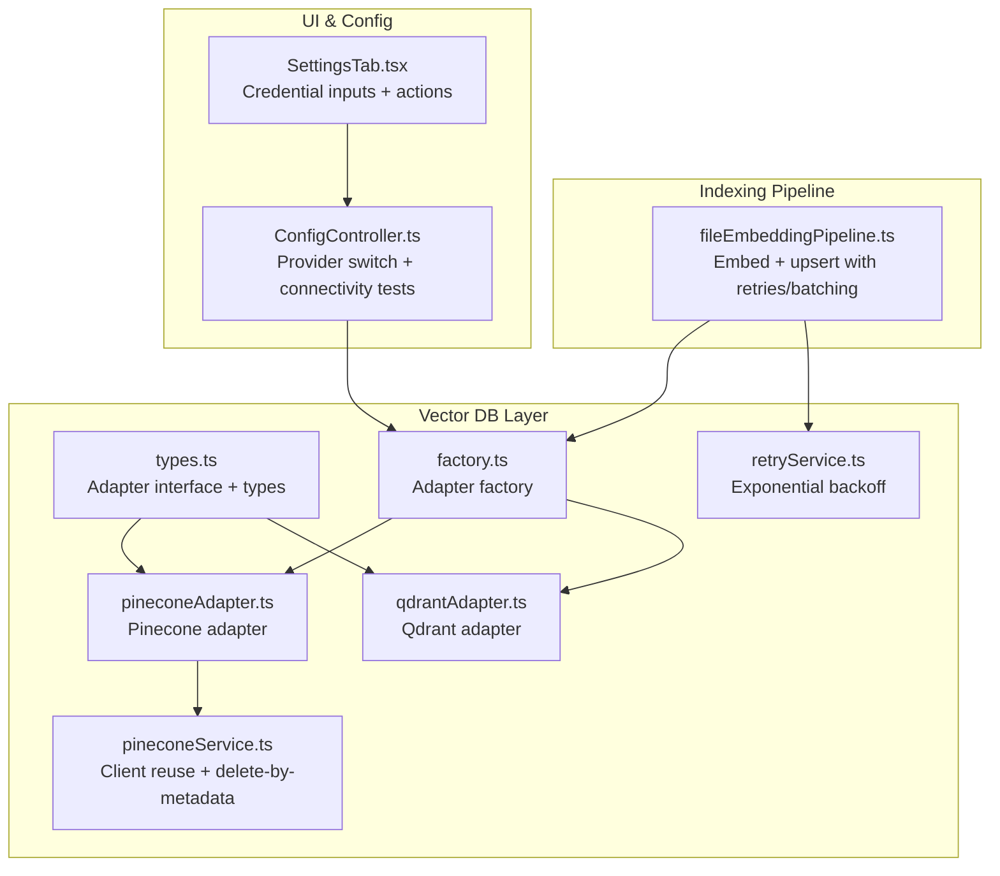
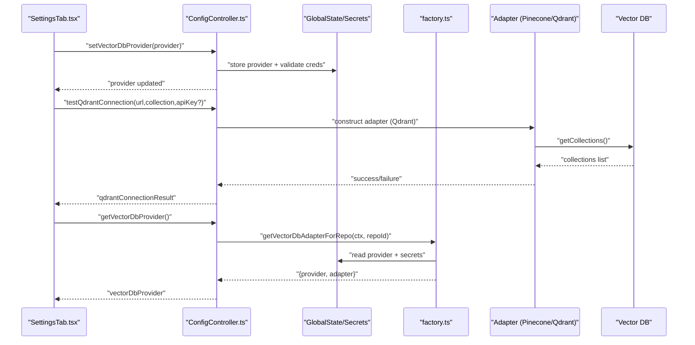
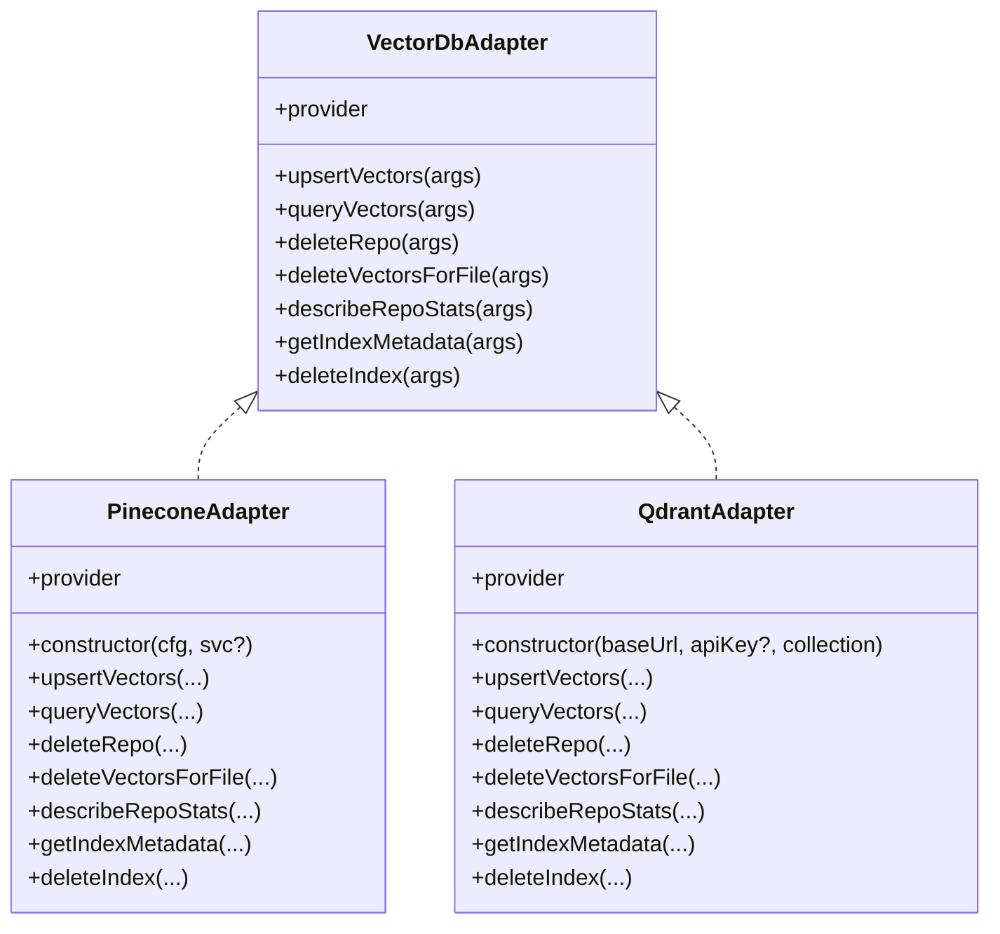
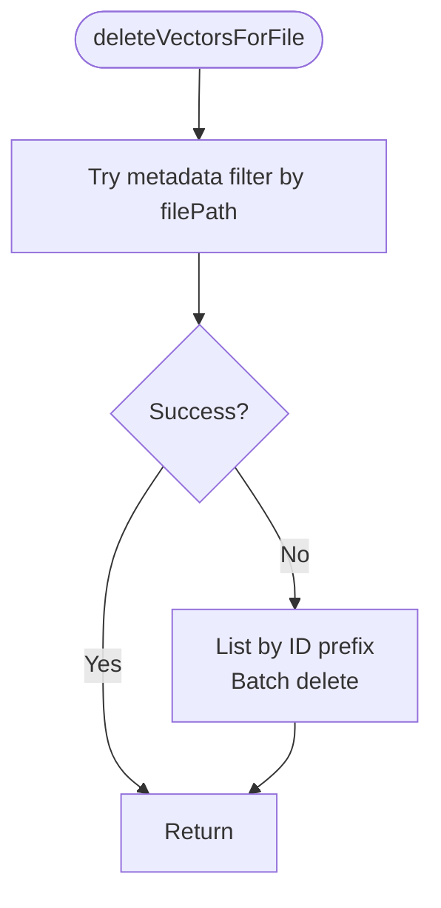
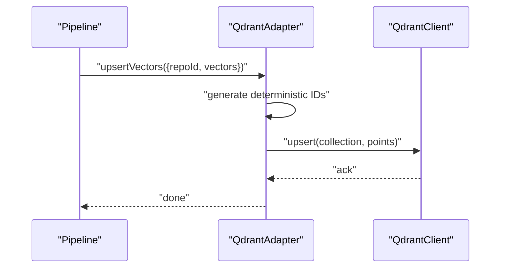
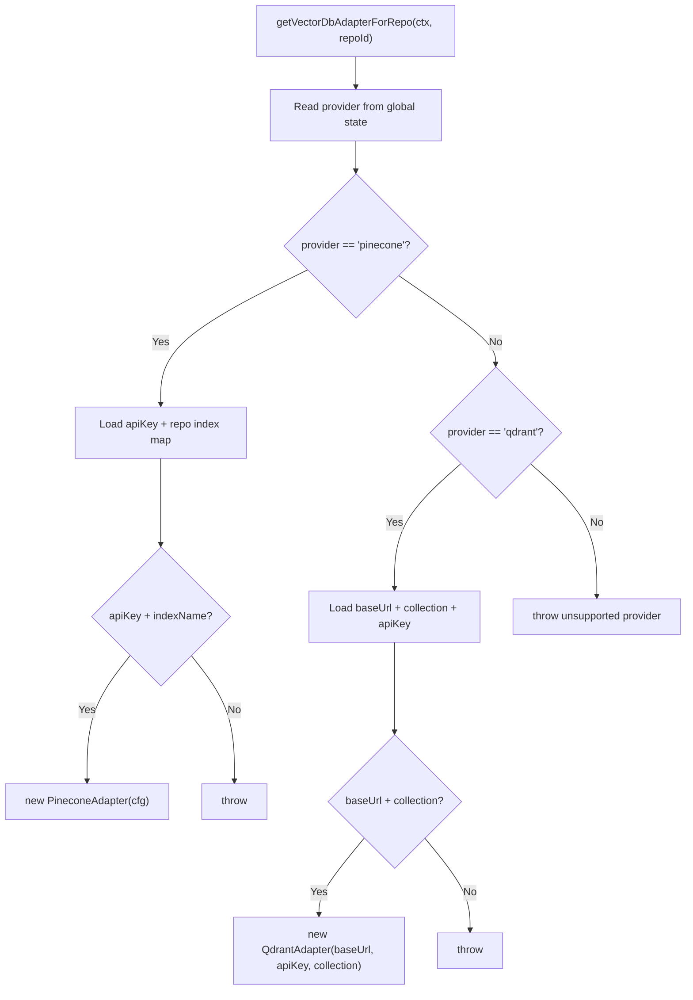
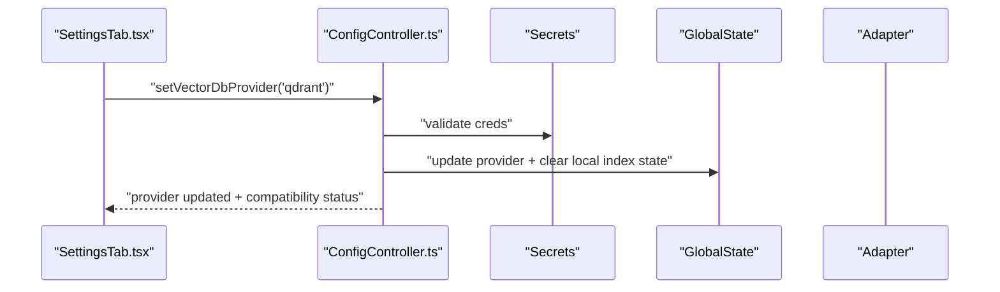
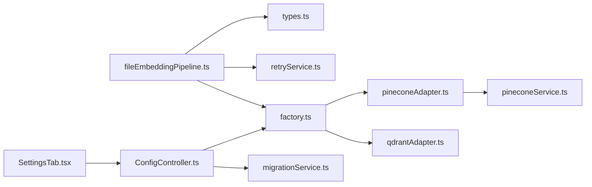

# Vector Database Adapters

<cite>
**Referenced Files in This Document**
- [pineconeAdapter.ts](file://src/core/indexing/vectorDb/providers/pineconeAdapter.ts)
- [qdrantAdapter.ts](file://src/core/indexing/vectorDb/providers/qdrantAdapter.ts)
- [factory.ts](file://src/core/indexing/vectorDb/factory.ts)
- [types.ts](file://src/core/indexing/vectorDb/types.ts)
- [pineconeService.ts](file://src/core/indexing/pineconeService.ts)
- [retryService.ts](file://src/core/indexing/retryService.ts)
- [fileEmbeddingPipeline.ts](file://src/core/indexing/fileEmbeddingPipeline.ts)
- [ConfigController.ts](file://src/webview/controllers/ConfigController.ts)
- [SettingsTab.tsx](file://src/webview/components/SettingsTab.tsx)
- [migrationService.ts](file://src/core/indexing/migrationService.ts)
</cite>

## Table of Contents
1. [Introduction](#introduction)
2. [Project Structure](#project-structure)
3. [Core Components](#core-components)
4. [Architecture Overview](#architecture-overview)
5. [Detailed Component Analysis](#detailed-component-analysis)
6. [Dependency Analysis](#dependency-analysis)
7. [Performance Considerations](#performance-considerations)
8. [Troubleshooting Guide](#troubleshooting-guide)
9. [Conclusion](#conclusion)
10. [Appendices](#appendices)

## Introduction
This document explains the Vector Database Adapters system that enables pluggable backends for vector storage and retrieval. It covers the adapter pattern implementation, Pinecone and Qdrant adapters, the factory that selects adapters based on configuration, connection and credential management, retry and error handling, and operational guidance for scaling, cost control, and monitoring.

## Project Structure
The vector database subsystem is organized around a small set of cohesive modules:
- An adapter interface and types define the contract for pluggable backends.
- Two concrete adapters implement the interface for Pinecone and Qdrant.
- A factory resolves the appropriate adapter per repository based on persisted settings and secrets.
- A shared service encapsulates Pinecone client reuse and advanced deletion semantics.
- A retry utility provides exponential backoff for transient failures.
- The embedding pipeline integrates adapters with batching, concurrency, and retries.
- The UI controller and settings manage provider selection, credentials, and connectivity testing.

**Diagram sources**
- [types.ts](file://src/core/indexing/vectorDb/types.ts#L1-L44)
- [factory.ts](file://src/core/indexing/vectorDb/factory.ts#L1-L62)
- [pineconeAdapter.ts](file://src/core/indexing/vectorDb/providers/pineconeAdapter.ts#L1-L82)
- [qdrantAdapter.ts](file://src/core/indexing/vectorDb/providers/qdrantAdapter.ts#L1-L244)
- [pineconeService.ts](file://src/core/indexing/pineconeService.ts#L1-L285)
- [retryService.ts](file://src/core/indexing/retryService.ts#L1-L71)
- [fileEmbeddingPipeline.ts](file://src/core/indexing/fileEmbeddingPipeline.ts#L1-L200)
- [ConfigController.ts](file://src/webview/controllers/ConfigController.ts#L1-L800)
- [SettingsTab.tsx](file://src/webview/components/SettingsTab.tsx#L1-L200)

**Section sources**
- [types.ts](file://src/core/indexing/vectorDb/types.ts#L1-L44)
- [factory.ts](file://src/core/indexing/vectorDb/factory.ts#L1-L62)
- [pineconeAdapter.ts](file://src/core/indexing/vectorDb/providers/pineconeAdapter.ts#L1-L82)
- [qdrantAdapter.ts](file://src/core/indexing/vectorDb/providers/qdrantAdapter.ts#L1-L244)
- [pineconeService.ts](file://src/core/indexing/pineconeService.ts#L1-L285)
- [retryService.ts](file://src/core/indexing/retryService.ts#L1-L71)
- [fileEmbeddingPipeline.ts](file://src/core/indexing/fileEmbeddingPipeline.ts#L1-L200)
- [ConfigController.ts](file://src/webview/controllers/ConfigController.ts#L1-L800)
- [SettingsTab.tsx](file://src/webview/components/SettingsTab.tsx#L1-L200)

## Core Components
- Adapter interface and types: Defines the contract for upsert, query, delete, and metadata operations, plus shared types for vectors and results.
- Pinecone adapter: Wraps a service that manages a Pinecone client instance and implements namespace-scoped upsert, query, and deletions.
- Qdrant adapter: Implements deterministic vector IDs, payload-based filtering, and collection metadata extraction.
- Factory: Selects provider and constructs the adapter using persisted settings and secrets.
- Retry utility: Provides exponential backoff with configurable parameters.
- Embedding pipeline: Orchestrates chunking, embedding, batching, and upsert with retries and concurrency controls.

**Section sources**
- [types.ts](file://src/core/indexing/vectorDb/types.ts#L1-L44)
- [pineconeAdapter.ts](file://src/core/indexing/vectorDb/providers/pineconeAdapter.ts#L1-L82)
- [qdrantAdapter.ts](file://src/core/indexing/vectorDb/providers/qdrantAdapter.ts#L1-L244)
- [factory.ts](file://src/core/indexing/vectorDb/factory.ts#L1-L62)
- [retryService.ts](file://src/core/indexing/retryService.ts#L1-L71)
- [fileEmbeddingPipeline.ts](file://src/core/indexing/fileEmbeddingPipeline.ts#L1-L200)

## Architecture Overview
The system separates concerns across layers:
- UI layer persists provider and credentials and triggers connectivity checks.
- Factory layer resolves the adapter based on current configuration.
- Adapter layer abstracts backend-specific operations.
- Shared services encapsulate provider-specific logic (e.g., Pinecone client reuse and advanced deletion).
- Pipeline layer coordinates embedding and upsert with retries and concurrency.

**Diagram sources**
- [SettingsTab.tsx](file://src/webview/components/SettingsTab.tsx#L1-L200)
- [ConfigController.ts](file://src/webview/controllers/ConfigController.ts#L1-L800)
- [factory.ts](file://src/core/indexing/vectorDb/factory.ts#L1-L62)
- [pineconeAdapter.ts](file://src/core/indexing/vectorDb/providers/pineconeAdapter.ts#L1-L82)
- [qdrantAdapter.ts](file://src/core/indexing/vectorDb/providers/qdrantAdapter.ts#L1-L244)

## Detailed Component Analysis

### Adapter Pattern and Types
- The adapter interface defines the operations that all backends must implement: upsert, query, deleteRepo, deleteVectorsForFile, describeRepoStats (optional), getIndexMetadata (optional), and deleteIndex.
- Vectors carry id, numeric values, and arbitrary metadata; query results include id, score, and optional metadata.
- IndexMetadata exposes dimension, count, and metric.

**Diagram sources**
- [types.ts](file://src/core/indexing/vectorDb/types.ts#L1-L44)
- [pineconeAdapter.ts](file://src/core/indexing/vectorDb/providers/pineconeAdapter.ts#L1-L82)
- [qdrantAdapter.ts](file://src/core/indexing/vectorDb/providers/qdrantAdapter.ts#L1-L244)

**Section sources**
- [types.ts](file://src/core/indexing/vectorDb/types.ts#L1-L44)

### Pinecone Adapter
- Constructor accepts API key, index name, and optional host; uses a shared service for client reuse and namespace-scoped operations.
- Upsert enforces repoId in metadata and writes under a namespace equal to repoId.
- Query scopes by namespace and returns matches with id, score, and metadata.
- Deletion supports two strategies:
  - Metadata-based deletion by filePath when supported.
  - Fallback to ID prefix listing and batch deletion when metadata filtering is unavailable.
- Stats and metadata extraction rely on index stats and describeIndex.

**Diagram sources**
- [pineconeAdapter.ts](file://src/core/indexing/vectorDb/providers/pineconeAdapter.ts#L1-L82)
- [pineconeService.ts](file://src/core/indexing/pineconeService.ts#L1-L285)

**Section sources**
- [pineconeAdapter.ts](file://src/core/indexing/vectorDb/providers/pineconeAdapter.ts#L1-L82)
- [pineconeService.ts](file://src/core/indexing/pineconeService.ts#L1-L285)

### Qdrant Adapter
- Validates base URL and collection presence; for hosted instances, requires an API key.
- Generates deterministic vector IDs using a fixed namespace and a hash of identifying parts.
- Upserts vectors with payload containing repoId and metadata; waits for write completion.
- Query filters by repoId and returns matches with scores and payloads.
- Deletions use filter expressions for repoId and optionally filePath.
- Metadata extraction reads collection config for dimension and distance metric.

**Diagram sources**
- [qdrantAdapter.ts](file://src/core/indexing/vectorDb/providers/qdrantAdapter.ts#L1-L244)

**Section sources**
- [qdrantAdapter.ts](file://src/core/indexing/vectorDb/providers/qdrantAdapter.ts#L1-L244)

### Factory Pattern
- Reads provider from global state and selects Pinecone or Qdrant.
- Pinecone:
  - Retrieves API key from secrets.
  - Resolves index name and optional host per repo from a map stored in global state.
- Qdrant:
  - Reads base URL and collection from global state.
  - Validates API key presence for hosted instances.
- Throws descriptive errors when required configuration is missing.

**Diagram sources**
- [factory.ts](file://src/core/indexing/vectorDb/factory.ts#L1-L62)

**Section sources**
- [factory.ts](file://src/core/indexing/vectorDb/factory.ts#L1-L62)

### Connection Pooling, Retry, and Error Handling
- Pinecone client reuse: The Pinecone service caches a client keyed by API key to avoid repeated initialization.
- Exponential backoff: The retry utility implements capped exponential backoff with configurable max retries, initial delay, max delay, and multiplier.
- Pipeline integration: The embedding pipeline applies retries around upsert batches and uses concurrency controls to balance throughput and stability.
- Adapter error handling: Adapters log structured context and rethrow with normalized messages; some stats calls return null to fail-safe when unavailable.

**Diagram sources**
- [retryService.ts](file://src/core/indexing/retryService.ts#L1-L71)
- [fileEmbeddingPipeline.ts](file://src/core/indexing/fileEmbeddingPipeline.ts#L407-L438)
- [pineconeService.ts](file://src/core/indexing/pineconeService.ts#L51-L59)

**Section sources**
- [pineconeService.ts](file://src/core/indexing/pineconeService.ts#L51-L59)
- [retryService.ts](file://src/core/indexing/retryService.ts#L1-L71)
- [fileEmbeddingPipeline.ts](file://src/core/indexing/fileEmbeddingPipeline.ts#L407-L438)

### Configuration and UI Integration
- UI settings collect provider, credentials, and backend-specific parameters.
- Connectivity tests:
  - Pinecone: Lists indexes using the provided key.
  - Qdrant: Creates a client, lists collections, and optionally creates the configured collection with a default vector config.
- Provider switching:
  - Validates prerequisites, updates provider, resets local index state, and triggers compatibility checks.

**Diagram sources**
- [SettingsTab.tsx](file://src/webview/components/SettingsTab.tsx#L1-L200)
- [ConfigController.ts](file://src/webview/controllers/ConfigController.ts#L251-L286)
- [migrationService.ts](file://src/core/indexing/migrationService.ts#L1-L63)

**Section sources**
- [SettingsTab.tsx](file://src/webview/components/SettingsTab.tsx#L1-L200)
- [ConfigController.ts](file://src/webview/controllers/ConfigController.ts#L251-L286)
- [migrationService.ts](file://src/core/indexing/migrationService.ts#L1-L63)

## Dependency Analysis
- Cohesion: Each adapter encapsulates backend specifics; the factory centralizes selection logic; the service isolates Pinecone client reuse.
- Coupling: The pipeline depends on the adapter interface; adapters depend on third-party SDKs; the factory depends on secrets/global state.
- External dependencies: Pinecone SDK and Qdrant REST client.
- Potential circularities: None observed among the analyzed modules.

**Diagram sources**
- [fileEmbeddingPipeline.ts](file://src/core/indexing/fileEmbeddingPipeline.ts#L1-L200)
- [types.ts](file://src/core/indexing/vectorDb/types.ts#L1-L44)
- [retryService.ts](file://src/core/indexing/retryService.ts#L1-L71)
- [factory.ts](file://src/core/indexing/vectorDb/factory.ts#L1-L62)
- [pineconeAdapter.ts](file://src/core/indexing/vectorDb/providers/pineconeAdapter.ts#L1-L82)
- [qdrantAdapter.ts](file://src/core/indexing/vectorDb/providers/qdrantAdapter.ts#L1-L244)
- [pineconeService.ts](file://src/core/indexing/pineconeService.ts#L1-L285)
- [ConfigController.ts](file://src/webview/controllers/ConfigController.ts#L1-L800)
- [migrationService.ts](file://src/core/indexing/migrationService.ts#L1-L63)
- [SettingsTab.tsx](file://src/webview/components/SettingsTab.tsx#L1-L200)

**Section sources**
- [factory.ts](file://src/core/indexing/vectorDb/factory.ts#L1-L62)
- [pineconeAdapter.ts](file://src/core/indexing/vectorDb/providers/pineconeAdapter.ts#L1-L82)
- [qdrantAdapter.ts](file://src/core/indexing/vectorDb/providers/qdrantAdapter.ts#L1-L244)
- [pineconeService.ts](file://src/core/indexing/pineconeService.ts#L1-L285)
- [retryService.ts](file://src/core/indexing/retryService.ts#L1-L71)
- [fileEmbeddingPipeline.ts](file://src/core/indexing/fileEmbeddingPipeline.ts#L1-L200)
- [ConfigController.ts](file://src/webview/controllers/ConfigController.ts#L1-L800)
- [migrationService.ts](file://src/core/indexing/migrationService.ts#L1-L63)
- [SettingsTab.tsx](file://src/webview/components/SettingsTab.tsx#L1-L200)

## Performance Considerations
- Batching and concurrency:
  - Use vectorDbBatchSize and maxConcurrentUpserts to tune throughput and reduce per-request overhead.
  - Keep embeddingBatchSize aligned with provider limits and latency targets.
- Retry strategy:
  - Increase maxRetries moderately; ensure backoff caps prevent thundering herds.
- Pinecone:
  - Prefer metadata-based deletion when supported to minimize round trips; fall back gracefully.
  - Use namespaces to isolate repositories and simplify cleanup.
- Qdrant:
  - Ensure collection vector config (size and distance) matches embedding dimensions.
  - Use filter expressions to constrain queries and reduce payload sizes.
- Monitoring:
  - Track upsert durations, query latencies, and error rates per provider.
  - Observe vector counts and growth trends to right-size clusters.

[No sources needed since this section provides general guidance]

## Troubleshooting Guide
- Missing credentials:
  - Pinecone: Ensure API key is saved; provider selection requires a key.
  - Qdrant: For hosted instances, API key is mandatory; local instances may omit it.
- Provider switching:
  - Use the migration service to validate credentials and reset local index state.
  - After switching, compatibility checks will block indexing if dimensions mismatch.
- Connectivity tests:
  - Pinecone: Verify API key and index availability.
  - Qdrant: Confirm URL format, server accessibility, and collection existence.
- Error handling:
  - Adapters log structured context and rethrow with normalized messages.
  - Pipeline wraps concurrent failures as indexing errors for better diagnostics.

**Section sources**
- [ConfigController.ts](file://src/webview/controllers/ConfigController.ts#L251-L286)
- [ConfigController.ts](file://src/webview/controllers/ConfigController.ts#L321-L445)
- [migrationService.ts](file://src/core/indexing/migrationService.ts#L1-L63)
- [pineconeAdapter.ts](file://src/core/indexing/vectorDb/providers/pineconeAdapter.ts#L1-L82)
- [qdrantAdapter.ts](file://src/core/indexing/vectorDb/providers/qdrantAdapter.ts#L1-L244)
- [fileEmbeddingPipeline.ts](file://src/core/indexing/fileEmbeddingPipeline.ts#L145-L184)

## Conclusion
The Vector Database Adapters system cleanly separates backend concerns behind a unified interface, enabling seamless switching between Pinecone and Qdrant. Robust configuration management, connectivity testing, and retry/backoff strategies improve reliability. The embedding pipeline integrates these components with batching and concurrency controls, while migration and compatibility checks support safe provider transitions.

[No sources needed since this section summarizes without analyzing specific files]

## Appendices

### Configuration Examples
- Pinecone
  - Provider: pinecone
  - Credentials: stored as a secret
  - Selection: per-repo index/host mapping in global state
- Qdrant
  - Provider: qdrant
  - Credentials: stored as a secret (required for hosted)
  - Selection: global base URL and collection

**Section sources**
- [factory.ts](file://src/core/indexing/vectorDb/factory.ts#L1-L62)
- [ConfigController.ts](file://src/webview/controllers/ConfigController.ts#L288-L309)
- [SettingsTab.tsx](file://src/webview/components/SettingsTab.tsx#L120-L200)

### Migration Procedures
- Switch provider:
  - Validate credentials and update provider in global state.
  - Reset local index state for the current repository to trigger re-indexing.
  - Run compatibility checks to ensure embedding and index dimensions match.

**Section sources**
- [migrationService.ts](file://src/core/indexing/migrationService.ts#L1-L63)
- [ConfigController.ts](file://src/webview/controllers/ConfigController.ts#L251-L286)

### Scalability and Cost Optimization
- Horizontal scaling:
  - Use provider-native sharding or multiple collections/namespaces.
- Index sizing:
  - Match vector dimensions to embedding model outputs.
- Query optimization:
  - Filter early and narrow payloads.
- Cost control:
  - Monitor vector counts and query volume; adjust cluster sizes accordingly.
  - Prefer metadata filtering and targeted deletions to avoid unnecessary storage churn.

[No sources needed since this section provides general guidance]

### Monitoring Approaches
- Metrics to track:
  - Upsert rate and latency
  - Query latency and recall
  - Vector counts and growth rate
  - Error rates and retry counts
- Alerts:
  - High error rates, timeouts, and dimension mismatches

[No sources needed since this section provides general guidance]