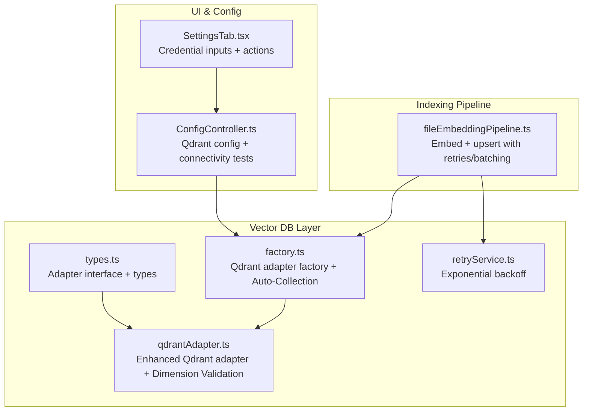
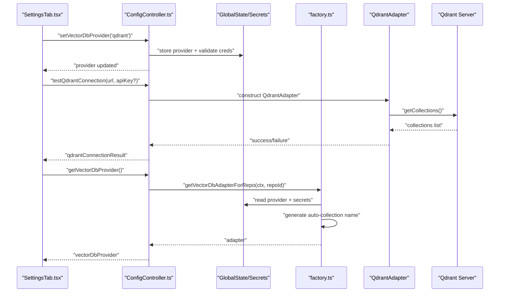
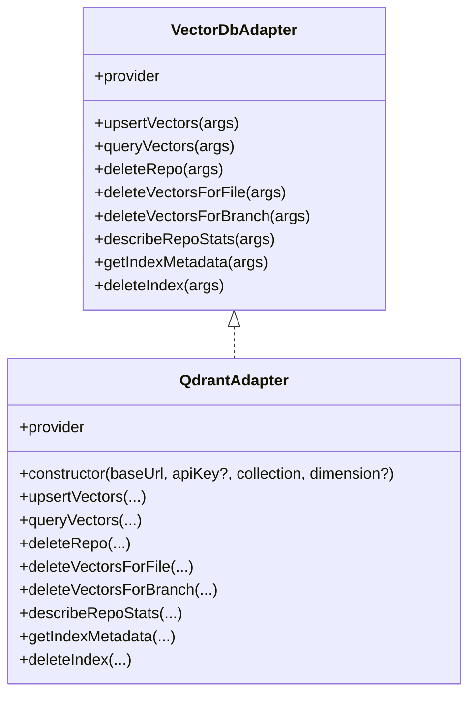
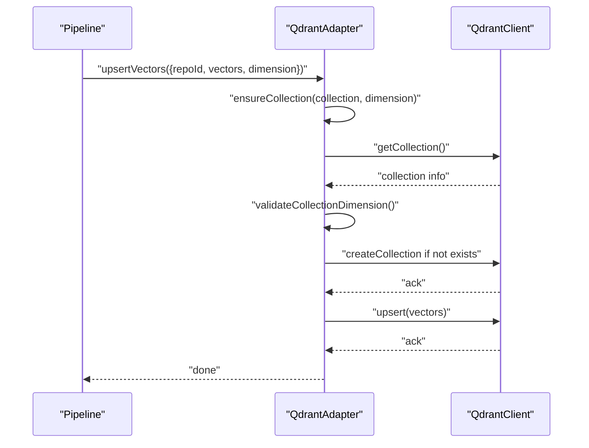
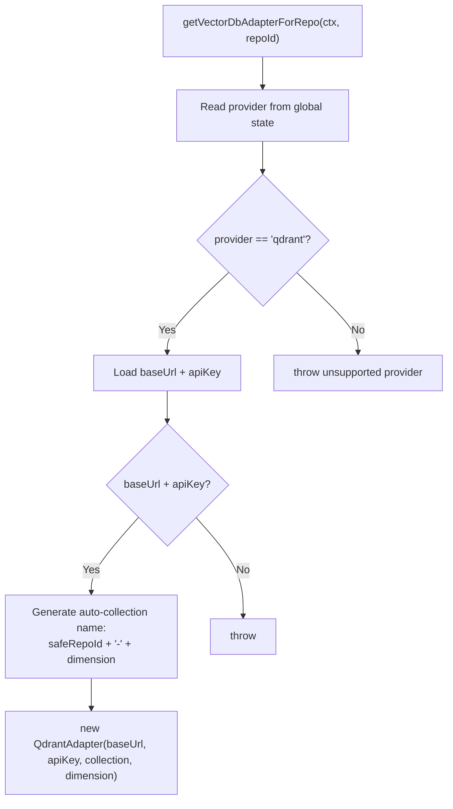
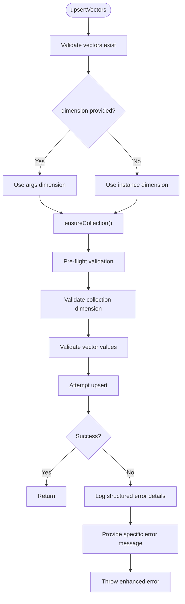
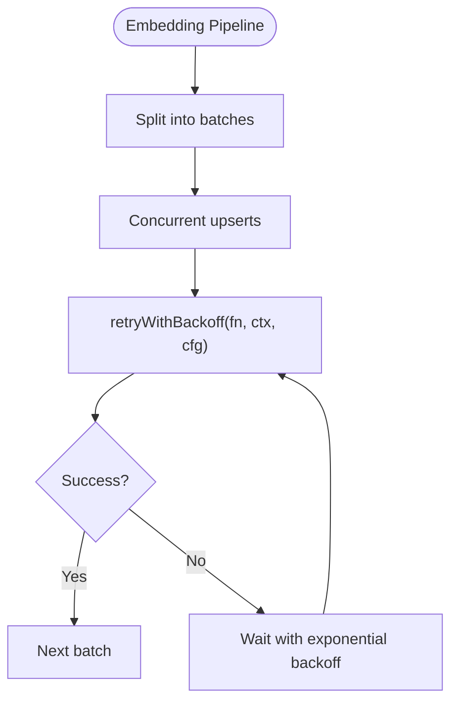
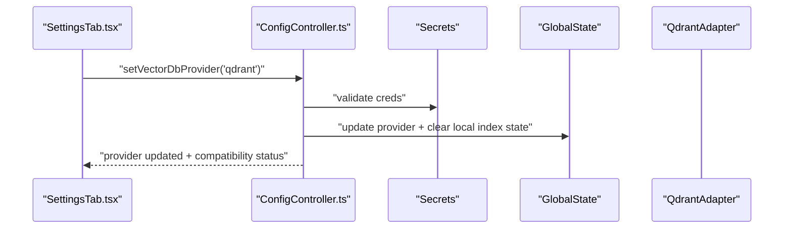
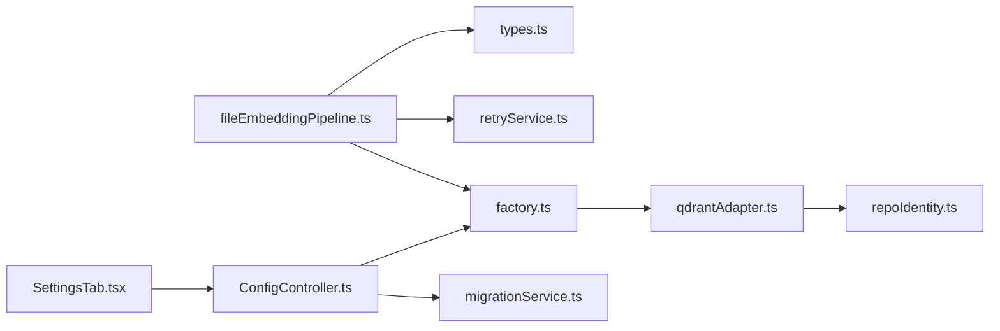

# Vector Database Adapters

<cite>
**Referenced Files in This Document**
- [qdrantAdapter.ts](file://src/core/indexing/vectorDb/providers/qdrantAdapter.ts)
- [factory.ts](file://src/core/indexing/vectorDb/factory.ts)
- [types.ts](file://src/core/indexing/vectorDb/types.ts)
- [retryService.ts](file://src/core/indexing/retryService.ts)
- [fileEmbeddingPipeline.ts](file://src/core/indexing/fileEmbeddingPipeline.ts)
- [ConfigController.ts](file://src/webview/controllers/ConfigController.ts)
- [SettingsTab.tsx](file://src/webview/components/SettingsTab.tsx)
- [migrationService.ts](file://src/core/indexing/migrationService.ts)
- [repoIdentity.ts](file://src/utils/repoIdentity.ts)
</cite>

## Update Summary
**Changes Made**
- Removed Pinecone adapter support and documentation - system now focuses exclusively on Qdrant
- Enhanced Qdrant adapter with comprehensive dimension validation and improved error handling
- Updated factory pattern to streamline provider selection to Qdrant only
- Added new section on enhanced dimension validation and error handling
- Updated configuration examples to reflect Qdrant-only setup
- Revised troubleshooting guide to focus on Qdrant-specific issues

## Table of Contents
1. [Introduction](#introduction)
2. [Project Structure](#project-structure)
3. [Core Components](#core-components)
4. [Architecture Overview](#architecture-overview)
5. [Detailed Component Analysis](#detailed-component-analysis)
6. [Dependency Analysis](#dependency-analysis)
7. [Performance Considerations](#performance-considerations)
8. [Troubleshooting Guide](#troubleshooting-guide)
9. [Conclusion](#conclusion)
10. [Appendices](#appendices)

## Introduction
This document explains the Vector Database Adapters system that enables pluggable backends for vector storage and retrieval. The system now focuses exclusively on Qdrant as the primary vector database provider, featuring enhanced dimension validation, comprehensive error handling, and streamlined configuration management for reliable vector storage operations.

**Updated** The system has been streamlined to focus on Qdrant as the sole supported provider, with enhanced dimension validation and improved error handling for reliable vector storage operations.

## Project Structure
The vector database subsystem is organized around a focused set of cohesive modules:
- An adapter interface and types define the contract for the Qdrant backend.
- A single Qdrant adapter implementation provides comprehensive vector storage and retrieval capabilities.
- A factory resolves the Qdrant adapter based on configuration with intelligent collection management.
- A shared service provides exponential backoff for transient failures.
- The embedding pipeline integrates the adapter with batching, concurrency, and robust error handling.
- The UI controller and settings manage provider configuration, credentials, and connectivity testing.

**Diagram sources**
- [types.ts:1-55](file://src/core/indexing/vectorDb/types.ts#L1-L55)
- [factory.ts:1-78](file://src/core/indexing/vectorDb/factory.ts#L1-L78)
- [qdrantAdapter.ts:1-524](file://src/core/indexing/vectorDb/providers/qdrantAdapter.ts#L1-L524)
- [retryService.ts:1-71](file://src/core/indexing/retryService.ts#L1-L71)
- [fileEmbeddingPipeline.ts:1-485](file://src/core/indexing/fileEmbeddingPipeline.ts#L1-L485)
- [ConfigController.ts:1-800](file://src/webview/controllers/ConfigController.ts#L1-L800)
- [SettingsTab.tsx:1-800](file://src/webview/components/SettingsTab.tsx#L1-L800)

**Section sources**
- [types.ts:1-55](file://src/core/indexing/vectorDb/types.ts#L1-L55)
- [factory.ts:1-78](file://src/core/indexing/vectorDb/factory.ts#L1-L78)
- [qdrantAdapter.ts:1-524](file://src/core/indexing/vectorDb/providers/qdrantAdapter.ts#L1-L524)
- [retryService.ts:1-71](file://src/core/indexing/retryService.ts#L1-L71)
- [fileEmbeddingPipeline.ts:1-485](file://src/core/indexing/fileEmbeddingPipeline.ts#L1-L485)
- [ConfigController.ts:1-800](file://src/webview/controllers/ConfigController.ts#L1-L800)
- [SettingsTab.tsx:1-800](file://src/webview/components/SettingsTab.tsx#L1-L800)

## Core Components
- Adapter interface and types: Defines the contract for upsert, query, delete, and metadata operations, plus shared types for vectors and results.
- Qdrant adapter: Implements comprehensive dimension validation, enhanced error handling, deterministic vector IDs, payload-based filtering, and auto-generated collection management.
- Factory: Selects Qdrant provider and constructs the adapter using persisted settings and secrets, with intelligent collection naming based on repository identity and embedding dimensions.
- Retry utility: Provides exponential backoff with configurable parameters.
- Embedding pipeline: Orchestrates chunking, embedding, batching, and upsert with retries and concurrency controls.

**Section sources**
- [types.ts:1-55](file://src/core/indexing/vectorDb/types.ts#L1-L55)
- [qdrantAdapter.ts:1-524](file://src/core/indexing/vectorDb/providers/qdrantAdapter.ts#L1-L524)
- [factory.ts:1-78](file://src/core/indexing/vectorDb/factory.ts#L1-L78)
- [retryService.ts:1-71](file://src/core/indexing/retryService.ts#L1-L71)
- [fileEmbeddingPipeline.ts:1-485](file://src/core/indexing/fileEmbeddingPipeline.ts#L1-L485)

## Architecture Overview
The system separates concerns across layers with Qdrant as the sole provider:
- UI layer persists Qdrant configuration and triggers connectivity checks.
- Factory layer resolves the Qdrant adapter based on current configuration, with intelligent collection management.
- Adapter layer abstracts Qdrant-specific operations, including comprehensive dimension validation and enhanced error handling.
- Pipeline layer coordinates embedding and upsert with retries and concurrency.

**Diagram sources**
- [SettingsTab.tsx:1-800](file://src/webview/components/SettingsTab.tsx#L1-L800)
- [ConfigController.ts:1-800](file://src/webview/controllers/ConfigController.ts#L1-L800)
- [factory.ts:1-78](file://src/core/indexing/vectorDb/factory.ts#L1-L78)
- [qdrantAdapter.ts:1-524](file://src/core/indexing/vectorDb/providers/qdrantAdapter.ts#L1-L524)

## Detailed Component Analysis

### Adapter Pattern and Types
- The adapter interface defines the operations that Qdrant must implement: upsert, query, deleteRepo, deleteVectorsForFile, deleteVectorsForBranch, describeRepoStats, getIndexMetadata, and deleteIndex.
- Vectors carry id, numeric values, and arbitrary metadata; query results include id, score, and optional metadata.
- IndexMetadata exposes dimension, count, and metric.

**Diagram sources**
- [types.ts:1-55](file://src/core/indexing/vectorDb/types.ts#L1-L55)
- [qdrantAdapter.ts:1-524](file://src/core/indexing/vectorDb/providers/qdrantAdapter.ts#L1-L524)

**Section sources**
- [types.ts:1-55](file://src/core/indexing/vectorDb/types.ts#L1-L55)

### Enhanced Qdrant Adapter
- Validates base URL and collection presence; for hosted instances, requires an API key.
- Generates deterministic vector IDs using a fixed namespace and a hash of identifying parts.
- Implements comprehensive dimension validation with pre-flight checks and runtime validation.
- Upserts vectors with payload containing repoId and metadata; waits for write completion.
- Query filters by repoId and returns matches with scores and payloads.
- Deletions use filter expressions for repoId, filePath, and branchName.
- Metadata extraction reads collection config for dimension and distance metric.
- **Enhanced error handling**: Comprehensive error logging with structured context and specific error messages.
- **Auto-collection management**: Automatically creates collections with names derived from repository identity and embedding dimensions.

**Diagram sources**
- [qdrantAdapter.ts:53-105](file://src/core/indexing/vectorDb/providers/qdrantAdapter.ts#L53-L105)

**Section sources**
- [qdrantAdapter.ts:1-524](file://src/core/indexing/vectorDb/providers/qdrantAdapter.ts#L1-L524)

### Factory Pattern
- Reads provider from global state and selects Qdrant (now the only supported provider).
- Loads base URL, API key, and auto-generates collection name from repository identity and embedding dimensions.
- Validates API key presence for hosted instances.
- **Streamlined**: Removed Pinecone provider support and simplified to focus on Qdrant-only configuration.

**Diagram sources**
- [factory.ts:48-78](file://src/core/indexing/vectorDb/factory.ts#L48-L78)

**Section sources**
- [factory.ts:1-78](file://src/core/indexing/vectorDb/factory.ts#L1-L78)

### Enhanced Dimension Validation and Error Handling
**New Section** The Qdrant adapter now includes comprehensive dimension validation and improved error handling for reliable vector storage operations.

- **Pre-flight validation**: Before upserting, validates collection exists and checks expected dimension from collection config.
- **Runtime validation**: Validates each vector has correct dimension and contains valid numeric values.
- **Structured error logging**: Enhanced error logging with full API response details, sample vector information, and HTTP status codes.
- **Specific error messages**: Provides clear error messages based on error type (dimension mismatch, invalid values, connection issues).
- **Dimension enforcement**: Throws descriptive errors when vector dimension doesn't match collection configuration.

**Diagram sources**
- [qdrantAdapter.ts:107-251](file://src/core/indexing/vectorDb/providers/qdrantAdapter.ts#L107-L251)

**Section sources**
- [qdrantAdapter.ts:107-251](file://src/core/indexing/vectorDb/providers/qdrantAdapter.ts#L107-L251)

### Connection Pooling, Retry, and Error Handling
- Exponential backoff: The retry utility implements capped exponential backoff with configurable max retries, initial delay, max delay, and multiplier.
- Pipeline integration: The embedding pipeline applies retries around upsert batches and uses concurrency controls to balance throughput and stability.
- Enhanced adapter error handling: Adapters log structured context with detailed error information and rethrow with normalized messages.

**Diagram sources**
- [retryService.ts:1-71](file://src/core/indexing/retryService.ts#L1-L71)
- [fileEmbeddingPipeline.ts:420-460](file://src/core/indexing/fileEmbeddingPipeline.ts#L420-L460)

**Section sources**
- [retryService.ts:1-71](file://src/core/indexing/retryService.ts#L1-L71)
- [fileEmbeddingPipeline.ts:420-460](file://src/core/indexing/fileEmbeddingPipeline.ts#L420-L460)

### Configuration and UI Integration
- UI settings collect Qdrant URL and API key configuration.
- Connectivity tests:
  - Qdrant: Creates a client, lists collections, and validates server accessibility.
- Provider switching:
  - Simplified to Qdrant-only with automatic collection name generation.

**Diagram sources**
- [SettingsTab.tsx:1-800](file://src/webview/components/SettingsTab.tsx#L1-L800)
- [ConfigController.ts:268-303](file://src/webview/controllers/ConfigController.ts#L268-L303)

**Section sources**
- [SettingsTab.tsx:1-800](file://src/webview/components/SettingsTab.tsx#L1-L800)
- [ConfigController.ts:268-303](file://src/webview/controllers/ConfigController.ts#L268-L303)

## Dependency Analysis
- Cohesion: The Qdrant adapter encapsulates all backend specifics; the factory centralizes selection logic with intelligent collection management; the service isolates retry logic.
- Coupling: The pipeline depends on the adapter interface; adapters depend on Qdrant SDK; the factory depends on secrets/global state and repository identity utilities.
- External dependencies: Qdrant REST client.
- Potential circularities: None observed among the analyzed modules.

**Diagram sources**
- [fileEmbeddingPipeline.ts:1-485](file://src/core/indexing/fileEmbeddingPipeline.ts#L1-L485)
- [types.ts:1-55](file://src/core/indexing/vectorDb/types.ts#L1-L55)
- [retryService.ts:1-71](file://src/core/indexing/retryService.ts#L1-L71)
- [factory.ts:1-78](file://src/core/indexing/vectorDb/factory.ts#L1-L78)
- [qdrantAdapter.ts:1-524](file://src/core/indexing/vectorDb/providers/qdrantAdapter.ts#L1-L524)
- [repoIdentity.ts:1-59](file://src/utils/repoIdentity.ts#L1-L59)
- [ConfigController.ts:1-800](file://src/webview/controllers/ConfigController.ts#L1-L800)
- [migrationService.ts:1-63](file://src/core/indexing/migrationService.ts#L1-L63)
- [SettingsTab.tsx:1-800](file://src/webview/components/SettingsTab.tsx#L1-L800)

**Section sources**
- [factory.ts:1-78](file://src/core/indexing/vectorDb/factory.ts#L1-L78)
- [qdrantAdapter.ts:1-524](file://src/core/indexing/vectorDb/providers/qdrantAdapter.ts#L1-L524)
- [repoIdentity.ts:1-59](file://src/utils/repoIdentity.ts#L1-L59)
- [retryService.ts:1-71](file://src/core/indexing/retryService.ts#L1-L71)
- [fileEmbeddingPipeline.ts:1-485](file://src/core/indexing/fileEmbeddingPipeline.ts#L1-L485)
- [ConfigController.ts:1-800](file://src/webview/controllers/ConfigController.ts#L1-L800)
- [migrationService.ts:1-63](file://src/core/indexing/migrationService.ts#L1-L63)
- [SettingsTab.tsx:1-800](file://src/webview/components/SettingsTab.tsx#L1-L800)

## Performance Considerations
- Batching and concurrency:
  - Use vectorDbBatchSize and maxConcurrentUpserts to tune throughput and reduce per-request overhead.
  - Keep embeddingBatchSize aligned with provider limits and latency targets.
- Retry strategy:
  - Increase maxRetries moderately; ensure backoff caps prevent thundering herds.
- Qdrant:
  - Ensure collection vector config (size and distance) matches embedding dimensions.
  - Use filter expressions to constrain queries and reduce payload sizes.
  - **Enhanced validation**: Comprehensive dimension validation prevents costly re-indexing and improves reliability.
- Monitoring:
  - Track upsert durations, query latencies, and error rates.
  - Observe vector counts and growth trends to right-size clusters.

## Troubleshooting Guide
- Missing credentials:
  - Qdrant: API key is mandatory for hosted instances; URL must be valid.
- Provider switching:
  - Simplified to Qdrant-only with automatic collection management.
- Connectivity tests:
  - Qdrant: Confirm URL format, server accessibility, and API key permissions.
- **Enhanced dimension issues**:
  - **Dimension mismatches**: System now provides clear error messages when embedding dimension doesn't match collection configuration.
  - **Invalid vector values**: Errors specify vectors with NaN or Infinity values and embedding provider issues.
  - **Collection creation conflicts**: Handles race conditions when multiple processes create collections simultaneously.
- Error handling:
  - Adapters log structured context with detailed error information and specific error messages.
  - Pipeline wraps concurrent failures as indexing errors for better diagnostics.

**Section sources**
- [ConfigController.ts:268-303](file://src/webview/controllers/ConfigController.ts#L268-L303)
- [ConfigController.ts:333-403](file://src/webview/controllers/ConfigController.ts#L333-L403)
- [qdrantAdapter.ts:141-196](file://src/core/indexing/vectorDb/providers/qdrantAdapter.ts#L141-L196)
- [qdrantAdapter.ts:203-250](file://src/core/indexing/vectorDb/providers/qdrantAdapter.ts#L203-L250)
- [fileEmbeddingPipeline.ts:420-460](file://src/core/indexing/fileEmbeddingPipeline.ts#L420-L460)

## Conclusion
The Vector Database Adapters system has been streamlined to focus exclusively on Qdrant as the primary provider, featuring enhanced dimension validation, comprehensive error handling, and improved reliability. The simplified architecture reduces complexity while maintaining robust configuration management, connectivity testing, and retry/backoff strategies. The embedding pipeline integrates seamlessly with the Qdrant adapter using batching and concurrency controls.

**Updated** The system now provides a focused, reliable solution with comprehensive dimension validation and enhanced error handling, eliminating the complexity of supporting multiple providers while maintaining all essential vector database functionality.

## Appendices

### Configuration Examples
- Qdrant
  - Provider: qdrant (only supported provider)
  - Credentials: stored as a secret (required for hosted)
  - Selection: auto-generated collection names based on repository identity and embedding dimensions
  - **Collection naming**: `{safeRepoId}-{dimension}` format with comprehensive validation

**Section sources**
- [factory.ts:69-78](file://src/core/indexing/vectorDb/factory.ts#L69-L78)
- [ConfigController.ts:310-321](file://src/webview/controllers/ConfigController.ts#L310-L321)
- [SettingsTab.tsx:707-711](file://src/webview/components/SettingsTab.tsx#L707-L711)

### Migration Procedures
- Switch provider:
  - System now defaults to Qdrant; migration service handles provider switching to Qdrant.
  - Reset local index state for the current repository to trigger re-indexing.
  - Run compatibility checks to ensure embedding and index dimensions match.
- **Auto-collection migration**:
  - New installations automatically use auto-generated collection names.
  - Enhanced dimension validation ensures compatibility with existing collections.

**Section sources**
- [migrationService.ts:1-63](file://src/core/indexing/migrationService.ts#L1-L63)
- [ConfigController.ts:268-303](file://src/webview/controllers/ConfigController.ts#L268-L303)

### Scalability and Cost Optimization
- Horizontal scaling:
  - Use multiple collections for different embedding configurations.
  - **Auto-collection benefits**: Intelligent naming supports horizontal scaling by creating separate collections for different embedding models.
- Index sizing:
  - Match vector dimensions to embedding model outputs.
  - **Enhanced validation**: Prevents dimension mismatches that could cause costly re-indexing.
- Query optimization:
  - Filter early and narrow payloads.
  - **Collection isolation**: Auto-generated names help organize collections by repository and dimension for efficient querying.
- Cost control:
  - Monitor vector counts and query volume; adjust cluster sizes accordingly.
  - Prefer metadata filtering and targeted deletions to avoid unnecessary storage churn.
  - **Reduced maintenance**: Auto-collection management reduces administrative overhead and potential errors.

### Monitoring Approaches
- Metrics to track:
  - Upsert rate and latency
  - Query latency and recall
  - Vector counts and growth rate
  - Error rates and retry counts
  - **Collection metrics**: Monitor auto-generated collection usage and dimension consistency
- Alerts:
  - High error rates, timeouts, and dimension mismatches
  - **Collection creation failures**: Monitor auto-collection creation attempts and permission issues
  - **Enhanced error reporting**: System provides detailed error context for better troubleshooting