# Legacy Multi Provider Architecture

<cite>
**Referenced Files in This Document**
- [BaseProvider.ts](file://src/core/llm/providers/BaseProvider.ts)
- [LMStudioProvider.ts](file://src/core/llm/providers/LMStudioProvider.ts)
- [OllamaProvider.ts](file://src/core/llm/providers/OllamaProvider.ts)
- [OpenAIProvider.ts](file://src/core/llm/providers/OpenAIProvider.ts)
- [LLMProviderManager.ts](file://src/core/llm/LLMProviderManager.ts)
- [types.ts](file://src/core/llm/types.ts)
- [index.ts](file://src/core/llm/index.ts)
- [RateLimitQueue.ts](file://src/core/llm/queue/RateLimitQueue.ts)
- [UsageTracker.ts](file://src/core/llm/queue/UsageTracker.ts)
- [errorHandling.ts](file://src/core/llm/utils/errorHandling.ts)
- [TextGenerationService.ts](file://src/core/llm/services/TextGenerationService.ts)
- [EmbeddingService.ts](file://src/core/llm/services/EmbeddingService.ts)
- [EnrichmentService.ts](file://src/core/llm/services/EnrichmentService.ts)
- [switchLLMProvider.ts](file://src/commands/switchLLMProvider.ts)
- [configSchema.ts](file://src/config/configSchema.ts)
</cite>

## Table of Contents
1. [Introduction](#introduction)
2. [Architecture Overview](#architecture-overview)
3. [Core Components](#core-components)
4. [Provider Implementation Details](#provider-implementation-details)
5. [Management and Orchestration](#management-and-orchestration)
6. [Service Layer](#service-layer)
7. [Rate Limiting and Usage Tracking](#rate-limiting-and-usage-tracking)
8. [Configuration Management](#configuration-management)
9. [Integration Points](#integration-points)
10. [Error Handling Strategy](#error-handling-strategy)
11. [Performance Considerations](#performance-considerations)
12. [Migration Path](#migration-path)
13. [Conclusion](#conclusion)

## Introduction

The Legacy Multi Provider Architecture represents a comprehensive framework for managing multiple Large Language Model (LLM) providers within the Repomix Runner ecosystem. This architecture was designed to provide seamless integration and switching between different LLM providers including OpenRouter/OpenAI, Ollama, LM Studio, and Gemini, while maintaining a unified interface and robust error handling mechanisms.

The system operates on a provider abstraction pattern where each LLM provider implements a common interface defined by the BaseProvider class. This design enables developers to add new providers without modifying existing code, while ensuring consistent behavior across all supported platforms.

## Architecture Overview

The Legacy Multi Provider Architecture follows a layered design pattern with clear separation of concerns:

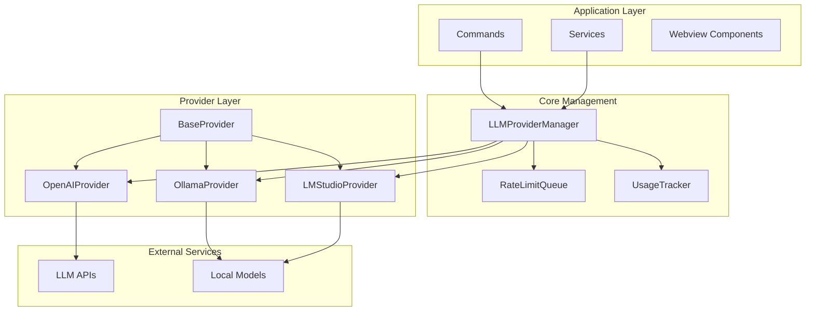

**Diagram sources**
- [LLMProviderManager.ts:13-187](file://src/core/llm/LLMProviderManager.ts#L13-L187)
- [BaseProvider.ts:16-145](file://src/core/llm/providers/BaseProvider.ts#L16-L145)

The architecture consists of four primary layers:

1. **Application Layer**: Contains user-facing commands and services
2. **Core Management**: Orchestrates provider lifecycle and operations
3. **Provider Layer**: Implements specific LLM provider integrations
4. **External Services**: Handles communication with external APIs and local models

## Core Components

### Base Provider Abstraction

The BaseProvider serves as the foundation for all LLM provider implementations, establishing a common contract and shared functionality:

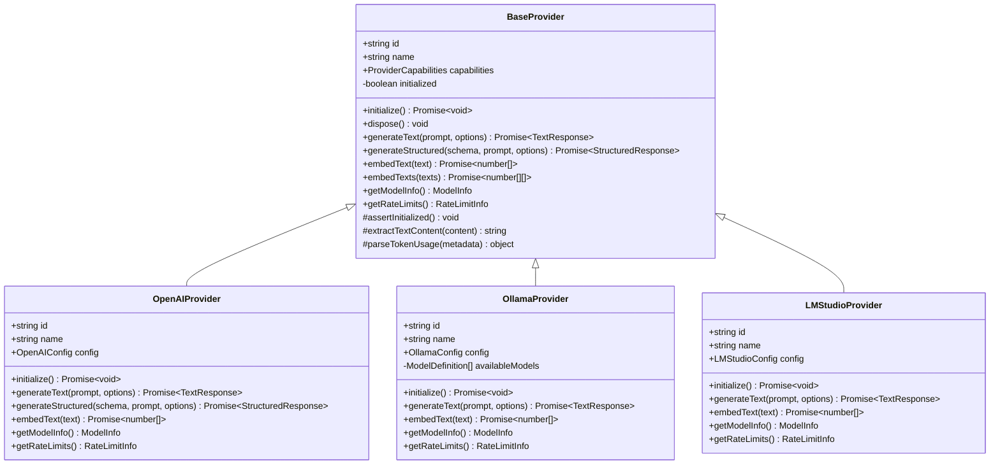

**Diagram sources**
- [BaseProvider.ts:16-145](file://src/core/llm/providers/BaseProvider.ts#L16-L145)
- [OpenAIProvider.ts:26-284](file://src/core/llm/providers/OpenAIProvider.ts#L26-L284)
- [OllamaProvider.ts:18-194](file://src/core/llm/providers/OllamaProvider.ts#L18-L194)
- [LMStudioProvider.ts:19-172](file://src/core/llm/providers/LMStudioProvider.ts#L19-L172)

**Section sources**
- [BaseProvider.ts:16-145](file://src/core/llm/providers/BaseProvider.ts#L16-L145)
- [types.ts:85-103](file://src/core/llm/types.ts#L85-L103)

### Provider Capability Matrix

Each provider implements specific capabilities defined by the ProviderCapabilities interface:

| Provider | Text Generation | Embeddings | Structured Output | Max Context Tokens |
|----------|----------------|------------|-------------------|-------------------|
| OpenAIProvider | ✅ | ✅ | ✅ | 128,000 |
| OllamaProvider | ✅ | ✅ | ❌ | 8,192 |
| LMStudioProvider | ✅ | ✅ | ❌ | 8,192 |

**Section sources**
- [OpenAIProvider.ts:49-55](file://src/core/llm/providers/OpenAIProvider.ts#L49-L55)
- [OllamaProvider.ts:25-31](file://src/core/llm/providers/OllamaProvider.ts#L25-L31)
- [LMStudioProvider.ts:25-31](file://src/core/llm/providers/LMStudioProvider.ts#L25-L31)

## Provider Implementation Details

### OpenAIProvider (OpenRouter/OpenAI)

The OpenAIProvider implements advanced features including structured output generation and comprehensive error handling:

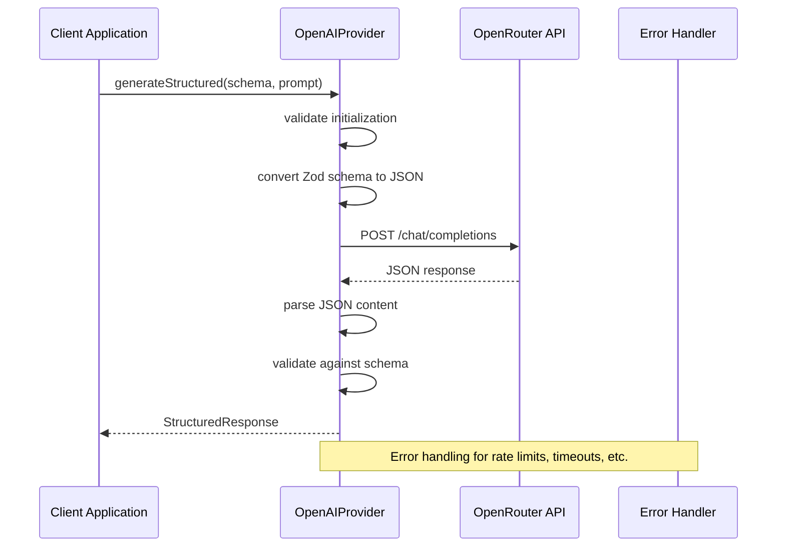

**Diagram sources**
- [OpenAIProvider.ts:122-187](file://src/core/llm/providers/OpenAIProvider.ts#L122-L187)
- [errorHandling.ts:29-41](file://src/core/llm/utils/errorHandling.ts#L29-L41)

**Section sources**
- [OpenAIProvider.ts:26-284](file://src/core/llm/providers/OpenAIProvider.ts#L26-L284)

### OllamaProvider (Local Models)

The OllamaProvider handles local model inference with automatic model discovery:

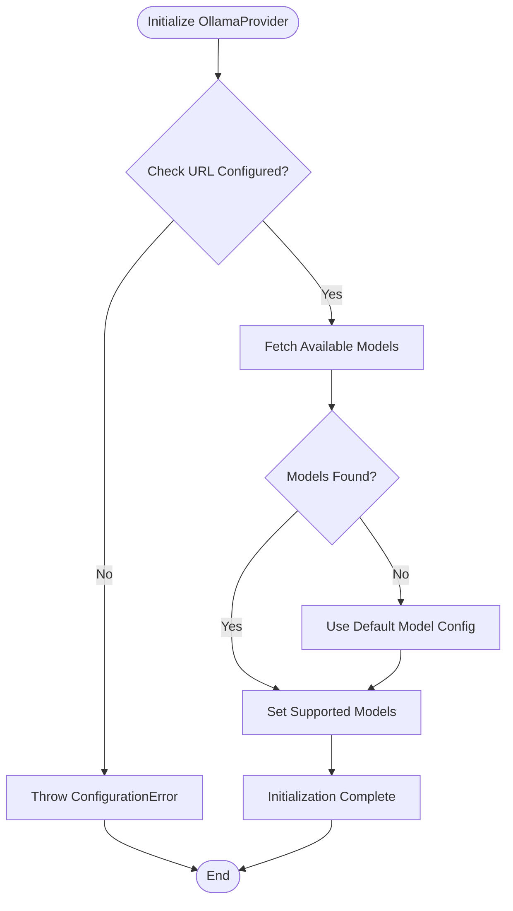

**Diagram sources**
- [OllamaProvider.ts:38-57](file://src/core/llm/providers/OllamaProvider.ts#L38-L57)

**Section sources**
- [OllamaProvider.ts:18-194](file://src/core/llm/providers/OllamaProvider.ts#L18-L194)

### LMStudioProvider (Local Development)

The LMStudioProvider enables local development and testing with flexible configuration:

**Section sources**
- [LMStudioProvider.ts:19-172](file://src/core/llm/providers/LMStudioProvider.ts#L19-L172)

## Management and Orchestration

### LLMProviderManager

The LLMProviderManager serves as the central orchestrator for all provider operations:

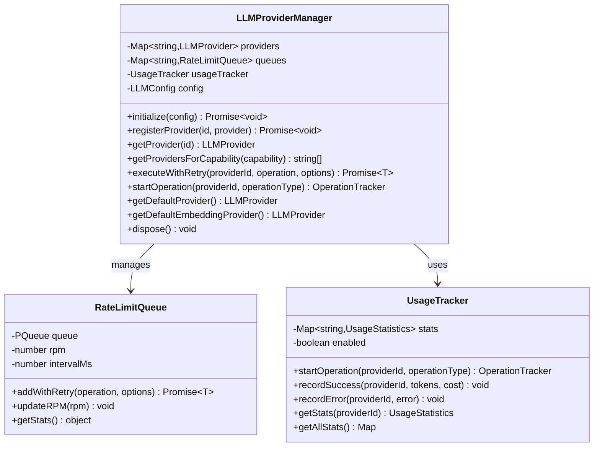

**Diagram sources**
- [LLMProviderManager.ts:13-187](file://src/core/llm/LLMProviderManager.ts#L13-L187)
- [RateLimitQueue.ts:8-116](file://src/core/llm/queue/RateLimitQueue.ts#L8-L116)
- [UsageTracker.ts:6-153](file://src/core/llm/queue/UsageTracker.ts#L6-L153)

**Section sources**
- [LLMProviderManager.ts:13-187](file://src/core/llm/LLMProviderManager.ts#L13-L187)

### Provider Registration Process

The manager follows a standardized registration process for each provider:

1. **Configuration Validation**: Verify provider configuration exists
2. **Provider Instantiation**: Create provider instance with configuration
3. **Initialization**: Call provider.initialize() for setup
4. **Queue Creation**: Establish rate limit queue for the provider
5. **Registration**: Store provider in internal registry

**Section sources**
- [LLMProviderManager.ts:26-72](file://src/core/llm/LLMProviderManager.ts#L26-L72)

## Service Layer

### Text Generation Service

The TextGenerationService provides a unified interface for text generation operations:

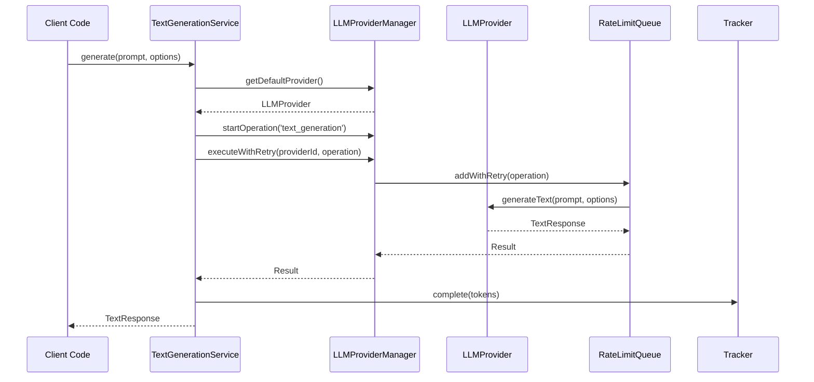

**Diagram sources**
- [TextGenerationService.ts:21-46](file://src/core/llm/services/TextGenerationService.ts#L21-L46)
- [LLMProviderManager.ts:110-122](file://src/core/llm/LLMProviderManager.ts#L110-L122)

**Section sources**
- [TextGenerationService.ts:15-79](file://src/core/llm/services/TextGenerationService.ts#L15-L79)

### Embedding Service

The EmbeddingService handles vector embeddings with batch processing capabilities:

**Section sources**
- [EmbeddingService.ts:16-82](file://src/core/llm/services/EmbeddingService.ts#L16-L82)

### Enrichment Service

The EnrichmentService provides specialized code summarization capabilities:

**Section sources**
- [EnrichmentService.ts:14-61](file://src/core/llm/services/EnrichmentService.ts#L14-L61)

## Rate Limiting and Usage Tracking

### Rate Limit Queue Implementation

The RateLimitQueue implements sophisticated rate limiting with exponential backoff:

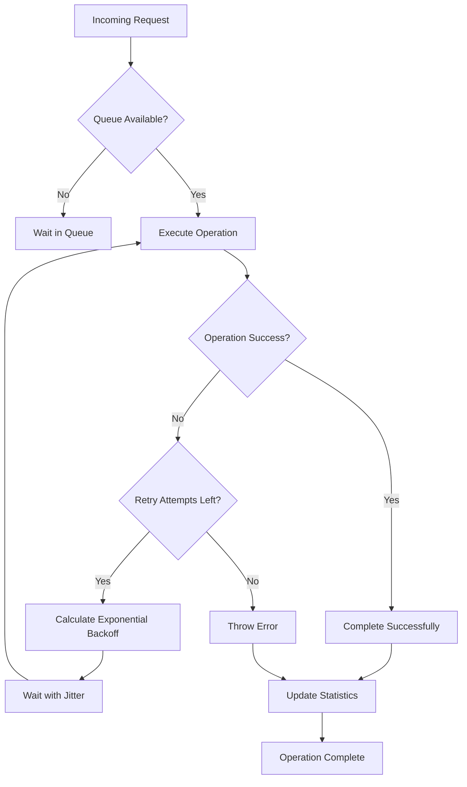

**Diagram sources**
- [RateLimitQueue.ts:27-66](file://src/core/llm/queue/RateLimitQueue.ts#L27-L66)

**Section sources**
- [RateLimitQueue.ts:8-116](file://src/core/llm/queue/RateLimitQueue.ts#L8-L116)

### Usage Tracking System

The UsageTracker maintains comprehensive metrics across all providers:

| Metric Type | Description | Collection Frequency |
|-------------|-------------|---------------------|
| Request Count | Total number of API calls | After each operation |
| Token Usage | Prompt, completion, and total tokens | After successful operations |
| Error Tracking | Error counts and last error details | On operation failures |
| Cost Estimation | Estimated USD costs | Optional, based on provider |

**Section sources**
- [UsageTracker.ts:6-153](file://src/core/llm/queue/UsageTracker.ts#L6-L153)

## Configuration Management

### Provider Configuration Schema

The system supports multiple configuration approaches:

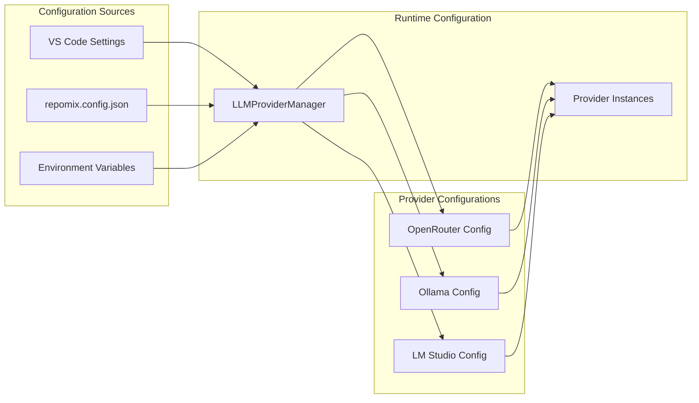

**Diagram sources**
- [configSchema.ts:165-171](file://src/config/configSchema.ts#L165-L171)
- [LLMProviderManager.ts:26-52](file://src/core/llm/LLMProviderManager.ts#L26-L52)

**Section sources**
- [configSchema.ts:165-190](file://src/config/configSchema.ts#L165-L190)

### Dynamic Provider Switching

The system supports runtime provider switching through user commands:

**Section sources**
- [switchLLMProvider.ts:8-70](file://src/commands/switchLLMProvider.ts#L8-L70)

## Integration Points

### VS Code Extension Integration

The architecture integrates seamlessly with the VS Code extension ecosystem:

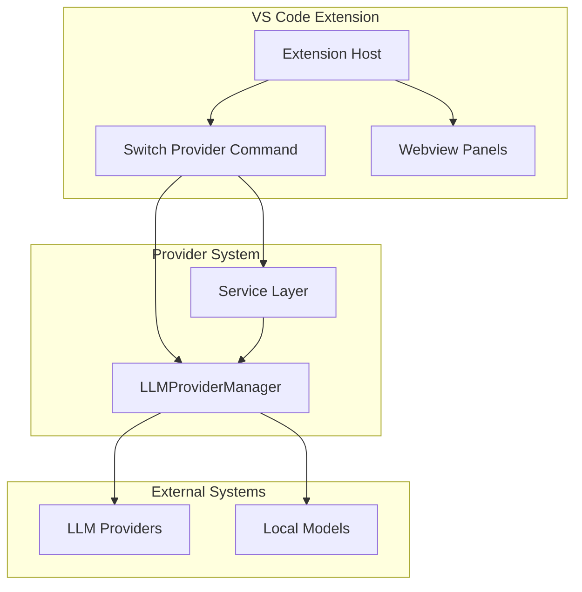

**Diagram sources**
- [switchLLMProvider.ts:8-70](file://src/commands/switchLLMProvider.ts#L8-L70)
- [index.ts:8-20](file://src/core/llm/index.ts#L8-L20)

**Section sources**
- [index.ts:8-20](file://src/core/llm/index.ts#L8-L20)

## Error Handling Strategy

### Hierarchical Error Types

The system implements a comprehensive error hierarchy:

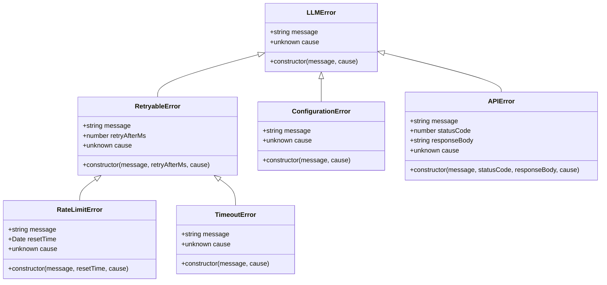

**Diagram sources**
- [errorHandling.ts:4-123](file://src/core/llm/utils/errorHandling.ts#L4-L123)

**Section sources**
- [errorHandling.ts:4-123](file://src/core/llm/utils/errorHandling.ts#L4-L123)

### Automatic Retry Logic

The system implements intelligent retry mechanisms with exponential backoff:

**Section sources**
- [RateLimitQueue.ts:35-66](file://src/core/llm/queue/RateLimitQueue.ts#L35-L66)

## Performance Considerations

### Concurrency Control

The architecture implements several performance optimization strategies:

1. **Rate Limiting**: Per-provider rate limiting prevents API saturation
2. **Batch Processing**: Support for batch embedding operations
3. **Connection Pooling**: Efficient reuse of provider connections
4. **Caching**: Response caching for repeated queries
5. **Resource Monitoring**: Real-time tracking of provider utilization

### Memory Management

The system includes comprehensive memory management:

- **Automatic Cleanup**: Providers dispose resources on shutdown
- **Queue Management**: Controlled memory usage through queuing
- **Statistics Tracking**: Monitor memory usage patterns
- **Graceful Degradation**: Continue operations with fallback providers

## Migration Path

### From Legacy to Modern Architecture

The Legacy Multi Provider Architecture provides a foundation for future modernization:

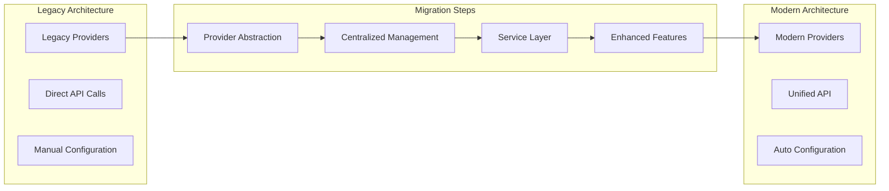

**Diagram sources**
- [BaseProvider.ts:16-145](file://src/core/llm/providers/BaseProvider.ts#L16-L145)
- [LLMProviderManager.ts:13-187](file://src/core/llm/LLMProviderManager.ts#L13-L187)

### Key Migration Benefits

1. **Consistent Interface**: Unified provider interface across all implementations
2. **Enhanced Reliability**: Built-in error handling and retry mechanisms
3. **Scalability**: Support for multiple concurrent providers
4. **Maintainability**: Clear separation of concerns and modular design
5. **Extensibility**: Easy addition of new provider types

## Conclusion

The Legacy Multi Provider Architecture represents a mature and robust solution for managing multiple LLM providers within the Repomix Runner ecosystem. The architecture successfully balances flexibility, reliability, and maintainability while providing a solid foundation for future enhancements.

Key strengths of the architecture include:

- **Provider Abstraction**: Clean separation between provider implementations and usage logic
- **Centralized Management**: Single point of control for provider lifecycle and operations
- **Robust Error Handling**: Comprehensive error types and automatic retry mechanisms
- **Performance Optimization**: Intelligent rate limiting and resource management
- **Extensible Design**: Easy integration of new providers and features

The architecture's modular design ensures that future enhancements can be implemented with minimal disruption to existing functionality, while the comprehensive error handling and monitoring systems provide confidence in production deployments.

This legacy architecture serves as an excellent foundation for continued evolution toward more sophisticated multi-provider orchestration systems, with clear migration paths to modern patterns and technologies.