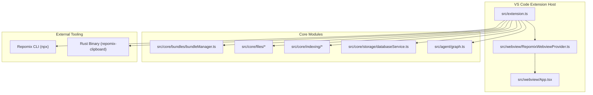
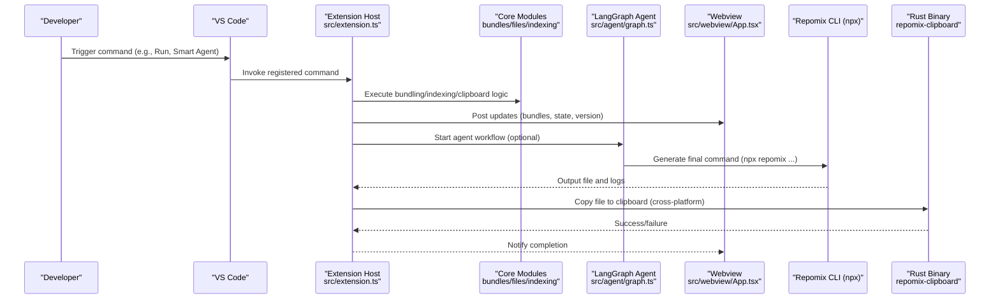
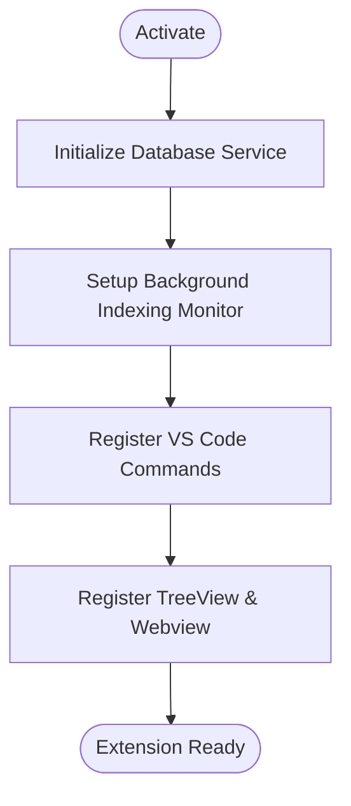
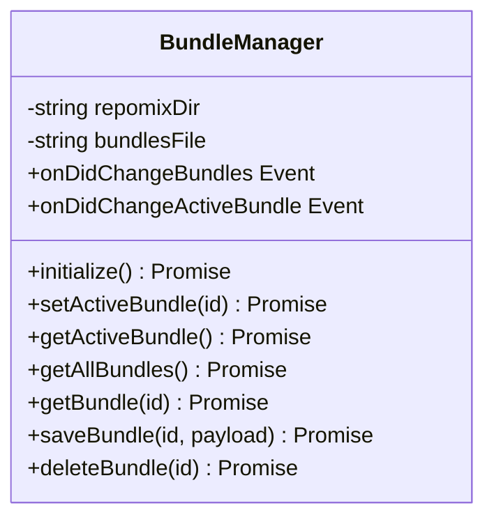
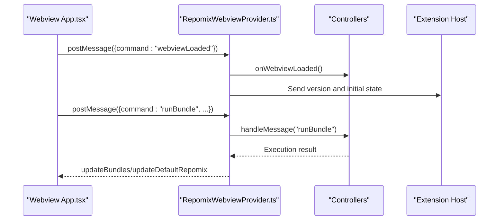
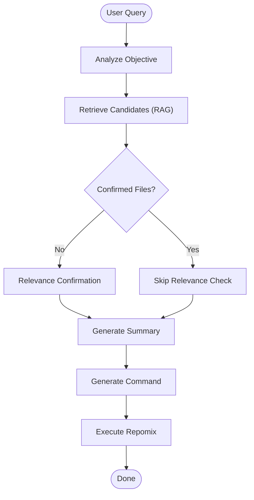
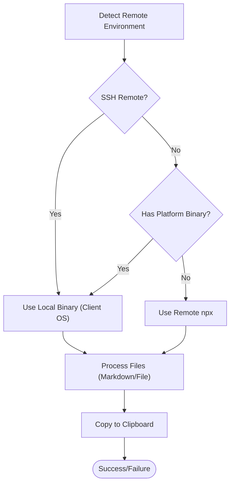
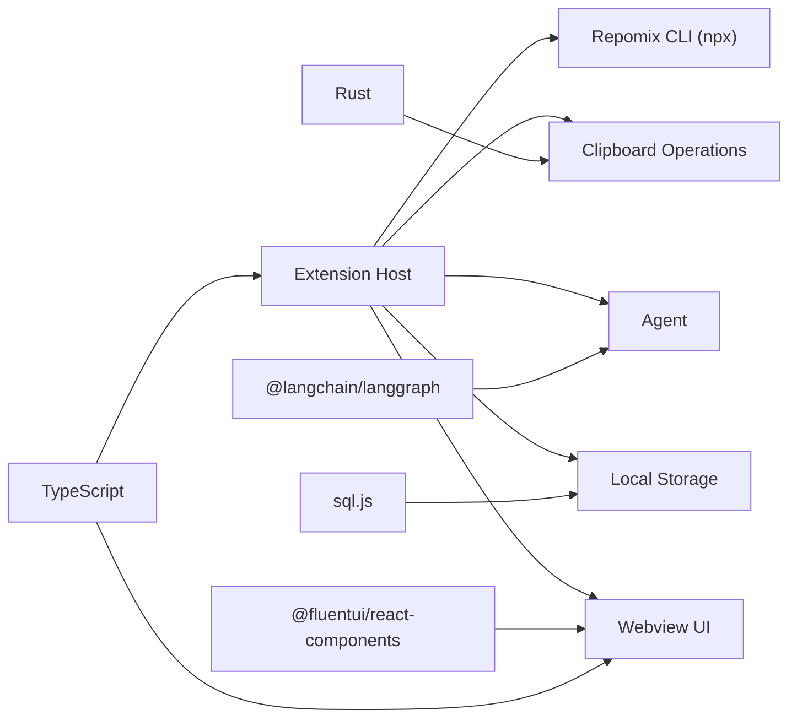

# Project Overview

<cite>
**Referenced Files in This Document**
- [README.md](file://README.md)
- [package.json](file://package.json)
- [architecture.md](file://architecture.md)
- [src/extension.ts](file://src/extension.ts)
- [src/webview/App.tsx](file://src/webview/App.tsx)
- [src/webview/RepomixWebviewProvider.ts](file://src/webview/RepomixWebviewProvider.ts)
- [src/agent/graph.ts](file://src/agent/graph.ts)
- [src/core/bundles/bundleManager.ts](file://src/core/bundles/bundleManager.ts)
- [src/core/files/remoteDetection.ts](file://src/core/files/remoteDetection.ts)
- [rust/src/main.rs](file://rust/src/main.rs)
- [scripts/build-rust.mjs](file://scripts/build-rust.mjs)
- [esbuild.js](file://esbuild.js)
- [LICENSE.md](file://LICENSE.md)
</cite>

## Table of Contents
1. [Introduction](#introduction)
2. [Project Structure](#project-structure)
3. [Core Components](#core-components)
4. [Architecture Overview](#architecture-overview)
5. [Detailed Component Analysis](#detailed-component-analysis)
6. [Dependency Analysis](#dependency-analysis)
7. [Performance Considerations](#performance-considerations)
8. [Troubleshooting Guide](#troubleshooting-guide)
9. [Conclusion](#conclusion)
10. [Appendices](#appendices)

## Introduction
Repomix Runner Plus is a VS Code extension that streamlines bundling files for AI processing by bridging the Repomix CLI tool with VS Code’s ecosystem. Its core mission is to simplify file selection, bundle management, and cross-platform clipboard operations so developers can quickly prepare cohesive code contexts for AI tools. The extension targets developers who integrate AI assistants into their workflows, offering both manual and AI-driven file selection, persistent bundles, and robust clipboard workflows across local and remote environments.

Key benefits:
- Intelligent bundling for AI-ready outputs
- Reusable bundles to accelerate repetitive tasks
- Cross-platform clipboard support (file object and text content modes)
- Remote development support with hybrid workflows
- AI-powered file selection via a LangGraph agent
- Background indexing for semantic search and faster retrieval

Positioning:
- Available in the VS Code Marketplace as “Repomix Runner Plus”
- Categorized under AI and Other extensions
- Designed for VS Code 1.93.0+ with Node.js and npm for CLI operations

**Section sources**
- [README.md](file://README.md#L13-L23)
- [package.json](file://package.json#L1-L20)
- [README.md](file://README.md#L69-L75)

## Project Structure
The extension is organized into a layered architecture:
- Extension entry and lifecycle management
- Core modules for bundles, CLI flags, file operations, indexing, patching, and storage
- Webview UI with React and Fluent UI
- Rust component for cross-platform clipboard operations
- Build and packaging scripts

**Diagram sources**
- [src/extension.ts](file://src/extension.ts#L43-L742)
- [src/webview/RepomixWebviewProvider.ts](file://src/webview/RepomixWebviewProvider.ts#L19-L288)
- [src/webview/App.tsx](file://src/webview/App.tsx#L47-L258)
- [src/core/bundles/bundleManager.ts](file://src/core/bundles/bundleManager.ts#L6-L117)
- [src/agent/graph.ts](file://src/agent/graph.ts#L8-L67)
- [architecture.md](file://architecture.md#L15-L44)

**Section sources**
- [architecture.md](file://architecture.md#L15-L44)
- [package.json](file://package.json#L30-L540)

## Core Components
- Extension entry and activation: Registers commands, views, and background services; initializes database and indexing monitor.
- Bundle management: CRUD operations for reusable file bundles with VS Code TreeView integration.
- Webview UI: React-based panel with tabs for bundles, search, settings, apply, and debug; communicates with extension via typed messages.
- AI agent: LangGraph workflow orchestrating file selection and packaging based on natural language queries.
- Clipboard and remote support: Cross-platform clipboard operations via a Rust binary; detection and hybrid workflows for SSH/WSL/Dev Containers.
- Build pipeline: TypeScript/React bundling via esbuild; Rust binary compilation; WASM asset handling.

**Section sources**
- [src/extension.ts](file://src/extension.ts#L43-L742)
- [src/core/bundles/bundleManager.ts](file://src/core/bundles/bundleManager.ts#L6-L117)
- [src/webview/App.tsx](file://src/webview/App.tsx#L47-L258)
- [src/webview/RepomixWebviewProvider.ts](file://src/webview/RepomixWebviewProvider.ts#L19-L288)
- [src/agent/graph.ts](file://src/agent/graph.ts#L8-L67)
- [src/core/files/remoteDetection.ts](file://src/core/files/remoteDetection.ts#L31-L108)
- [rust/src/main.rs](file://rust/src/main.rs#L10-L42)
- [esbuild.js](file://esbuild.js#L94-L150)

## Architecture Overview
High-level integration:
- VS Code commands trigger core logic in src/extension.ts
- Core modules execute Repomix CLI or call the Rust binary for clipboard operations
- Webview UI renders state and user interactions, communicating via postMessage
- AI agent uses LangGraph to intelligently select files based on user intent
- Background indexing continuously updates embeddings for semantic search

**Diagram sources**
- [src/extension.ts](file://src/extension.ts#L459-L626)
- [src/agent/graph.ts](file://src/agent/graph.ts#L8-L67)
- [src/webview/App.tsx](file://src/webview/App.tsx#L147-L169)
- [src/core/files/remoteDetection.ts](file://src/core/files/remoteDetection.ts#L61-L108)
- [rust/src/main.rs](file://rust/src/main.rs#L10-L42)

## Detailed Component Analysis

### Extension Activation and Lifecycle
Responsibilities:
- Initialize database and background indexing monitor
- Register commands for running Repomix, managing bundles, and clipboard operations
- Set up TreeView, Webview provider, and file decorations
- Manage scheduled cleanup and secret storage for API keys

**Diagram sources**
- [src/extension.ts](file://src/extension.ts#L43-L360)

**Section sources**
- [src/extension.ts](file://src/extension.ts#L43-L360)

### Bundle Management
Responsibilities:
- Persist bundles in .repomix/bundles.json
- Manage active bundle state and emit change events
- CRUD operations for bundle metadata and files

**Diagram sources**
- [src/core/bundles/bundleManager.ts](file://src/core/bundles/bundleManager.ts#L6-L117)

**Section sources**
- [src/core/bundles/bundleManager.ts](file://src/core/bundles/bundleManager.ts#L6-L117)

### Webview UI and Messaging
Responsibilities:
- Render tabs for bundles, search, settings, apply, and debug
- Handle bidirectional messaging with extension host
- Report client OS info for clipboard decisions

**Diagram sources**
- [src/webview/App.tsx](file://src/webview/App.tsx#L75-L145)
- [src/webview/RepomixWebviewProvider.ts](file://src/webview/RepomixWebviewProvider.ts#L92-L195)

**Section sources**
- [src/webview/App.tsx](file://src/webview/App.tsx#L47-L258)
- [src/webview/RepomixWebviewProvider.ts](file://src/webview/RepomixWebviewProvider.ts#L19-L288)

### AI Agent Orchestration
Responsibilities:
- Parse user intent and retrieve relevant files using embeddings
- Generate final Repomix command and execute it
- Summarize and report outcomes

**Diagram sources**
- [src/agent/graph.ts](file://src/agent/graph.ts#L8-L67)

**Section sources**
- [src/agent/graph.ts](file://src/agent/graph.ts#L8-L67)

### Clipboard and Remote Clipboard Workflow
Responsibilities:
- Detect remote environments and client OS
- Choose between local binary execution and remote npx approach
- Generate markdown bundles and copy to clipboard

**Diagram sources**
- [src/core/files/remoteDetection.ts](file://src/core/files/remoteDetection.ts#L31-L108)
- [rust/src/main.rs](file://rust/src/main.rs#L44-L134)

**Section sources**
- [src/core/files/remoteDetection.ts](file://src/core/files/remoteDetection.ts#L31-L108)
- [rust/src/main.rs](file://rust/src/main.rs#L10-L42)

## Dependency Analysis
Technology stack:
- TypeScript for extension source
- React + Fluent UI for webview UI
- LangGraph for AI workflow orchestration
- Rust for cross-platform clipboard operations
- SQLite (sql.js) for local persistence
- Repomix CLI via npx

Build and packaging:
- esbuild for bundling extension and webview
- scripts/build-rust.mjs for Rust binary generation
- VSCE for .vsix packaging

**Diagram sources**
- [architecture.md](file://architecture.md#L7-L14)
- [package.json](file://package.json#L583-L603)
- [esbuild.js](file://esbuild.js#L94-L150)
- [scripts/build-rust.mjs](file://scripts/build-rust.mjs#L1-L50)

**Section sources**
- [architecture.md](file://architecture.md#L7-L14)
- [package.json](file://package.json#L583-L603)
- [esbuild.js](file://esbuild.js#L94-L150)
- [scripts/build-rust.mjs](file://scripts/build-rust.mjs#L1-L50)

## Performance Considerations
- Background indexing uses a 2.5-second debounce to batch file changes and reduce redundant embeddings.
- Ignore filters respect .gitignore and additional patterns to avoid indexing build artifacts and temporary files.
- Incremental embedding updates only changed files rather than reprocessing the entire repository.
- Clipboard operations leverage Rust for efficient file copy semantics across platforms.

[No sources needed since this section provides general guidance]

## Troubleshooting Guide
Common issues and resolutions:
- Linux clipboard mode requires xclip; install it to enable file copy mode.
- macOS/Linux currently support content copy mode only for remote clipboard scenarios.
- Missing Google API key prevents Smart Agent from running; configure it in settings.
- Remote clipboard hybrid workflow relies on platform-specific binaries; ensure the client OS is supported.

**Section sources**
- [README.md](file://README.md#L120-L132)
- [src/core/files/remoteDetection.ts](file://src/core/files/remoteDetection.ts#L61-L108)

## Conclusion
Repomix Runner Plus delivers a seamless developer experience for preparing AI-ready code bundles within VS Code. By combining Repomix CLI integration, intelligent file selection via LangGraph, robust bundle management, and cross-platform clipboard workflows—especially for remote development—it empowers developers to efficiently curate and share code contexts for AI tools. The modular architecture, strong typing, and clear separation of concerns make it maintainable and extensible for future enhancements.

[No sources needed since this section summarizes without analyzing specific files]

## Appendices

### Installation and Marketplace
- Install from the VS Code Marketplace using the extension identifier
- Requires VS Code 1.93.0+, Node.js/npm for CLI operations
- Categories: AI, Other

**Section sources**
- [README.md](file://README.md#L69-L75)
- [package.json](file://package.json#L13-L19)

### Licensing
- Licensed under MIT License
- Copyright holders: Dorian Massoulier, Bhavesh Ramburn

**Section sources**
- [LICENSE.md](file://LICENSE.md#L1-L23)

### Technology Stack Summary
- TypeScript, React, Fluent UI, LangGraph, Rust, sql.js, esbuild, VSCE

**Section sources**
- [architecture.md](file://architecture.md#L7-L14)
- [package.json](file://package.json#L583-L603)