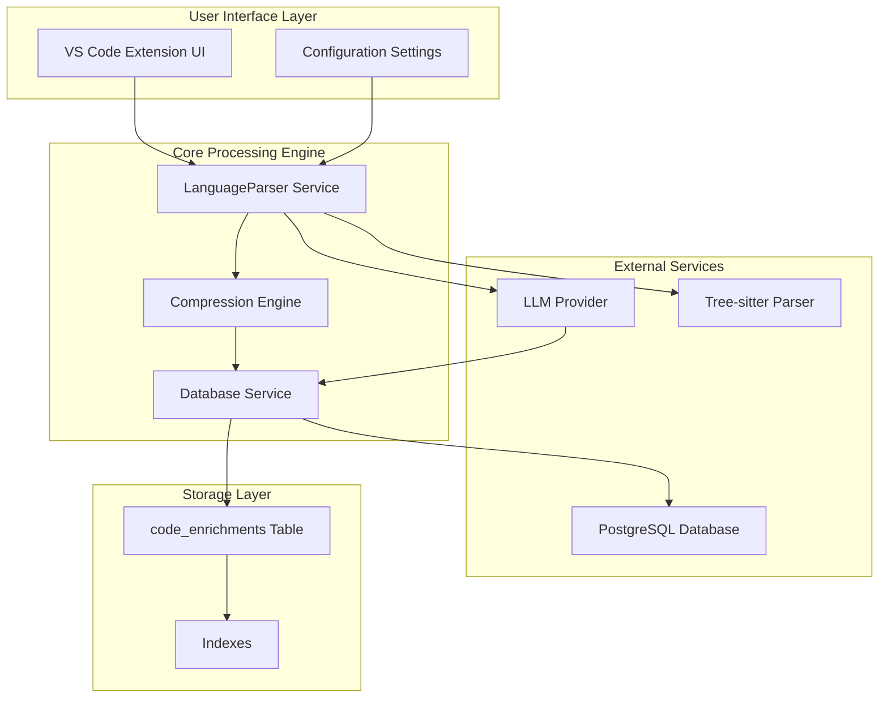
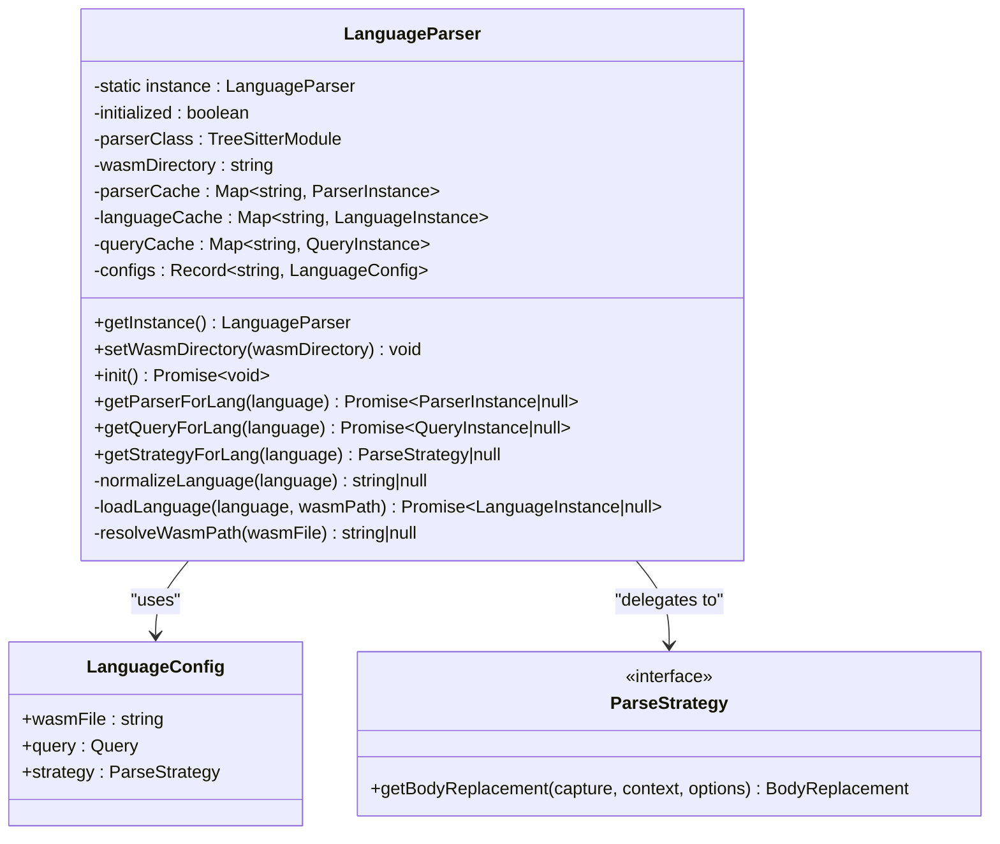
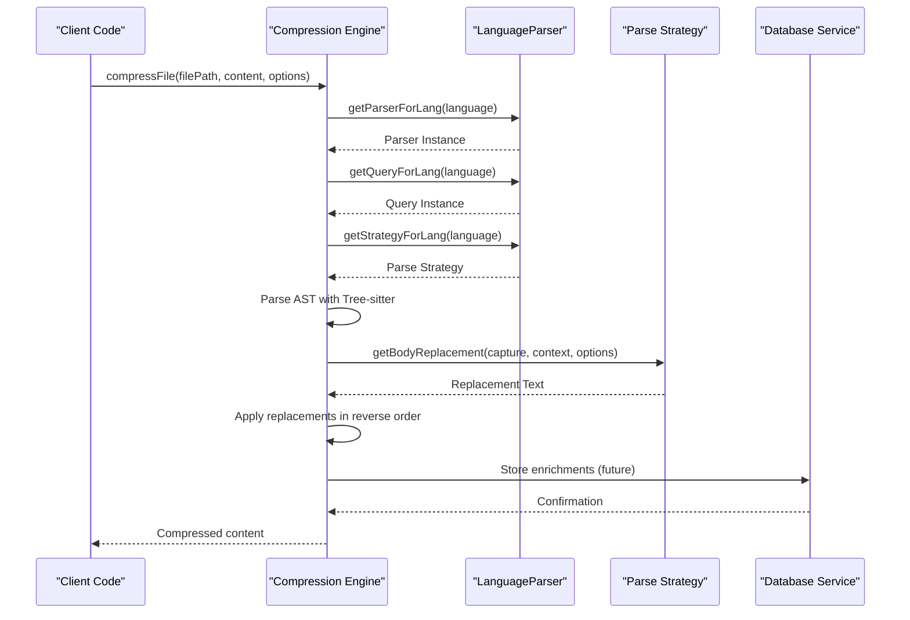
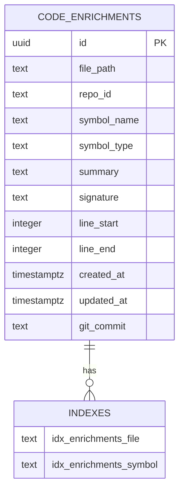
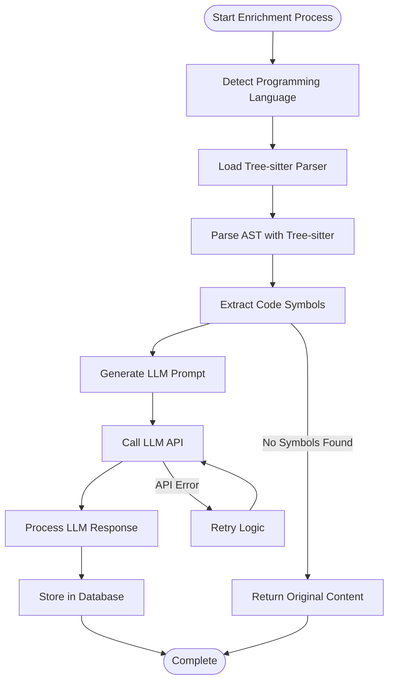
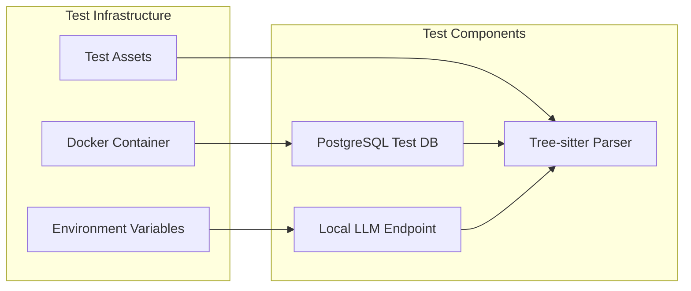

# Code Enrichment System

<cite>
**Referenced Files in This Document**
- [README.md](file://README.md)
- [enrichment-readme.md](file://enrichment-readme.md)
- [src/test-enrichment.ts](file://src/test-enrichment.ts)
- [src/test-enrichment-indexing.ts](file://src/test-enrichment-indexing.ts)
- [src/test-enrichment-retrieval.ts](file://src/test-enrichment-retrieval.ts)
- [src/chat/db/migrations/003_code_enrichment.sql](file://src/chat/db/migrations/003_code_enrichment.sql)
- [src/core/compression/compressFile.ts](file://src/core/compression/compressFile.ts)
- [src/core/compression/LanguageParser.ts](file://src/core/compression/LanguageParser.ts)
- [src/core/storage/databaseService.ts](file://src/core/storage/databaseService.ts)
- [src/types/chat.ts](file://src/types/chat.ts)
</cite>

## Table of Contents
1. [Introduction](#introduction)
2. [System Architecture](#system-architecture)
3. [Core Components](#core-components)
4. [Database Schema](#database-schema)
5. [Language Parsing System](#language-parsing-system)
6. [Enrichment Workflow](#enrichment-workflow)
7. [Integration Points](#integration-points)
8. [Testing Framework](#testing-framework)
9. [Implementation Status](#implementation-status)
10. [Future Enhancements](#future-enhancements)

## Introduction

The Code Enrichment System is a sophisticated feature within the Repomix Runner Plus extension that leverages Large Language Models (LLMs) to generate contextual summaries for code symbols (functions, methods, classes, interfaces, and types). This system enhances code comprehension by automatically extracting meaningful metadata from source code and storing it in a structured database for later retrieval and injection during compression processes.

The system integrates Tree-sitter parsing technology with LLM-powered summarization to create a comprehensive code understanding pipeline. It supports multiple programming languages including TypeScript, JavaScript, Dart, Python, C#, and Rust, making it versatile for modern development environments.

## System Architecture

The Code Enrichment System follows a modular architecture designed for scalability and maintainability:

**Diagram sources**
- [src/core/compression/LanguageParser.ts](file://src/core/compression/LanguageParser.ts#L26-L77)
- [src/core/compression/compressFile.ts](file://src/core/compression/compressFile.ts#L52-L125)
- [src/chat/db/migrations/003_code_enrichment.sql](file://src/chat/db/migrations/003_code_enrichment.sql#L4-L21)

## Core Components

### LanguageParser Service

The LanguageParser serves as the central orchestrator for code symbol extraction and language-specific processing. It implements a singleton pattern to ensure efficient resource utilization and maintains caches for parsers, languages, and queries.

**Diagram sources**
- [src/core/compression/LanguageParser.ts](file://src/core/compression/LanguageParser.ts#L26-L173)

**Section sources**
- [src/core/compression/LanguageParser.ts](file://src/core/compression/LanguageParser.ts#L26-L218)

### Compression Engine

The compression engine processes source code files to extract meaningful symbols and generate compressed representations. It handles multiple programming languages and applies language-specific parsing strategies.

**Diagram sources**
- [src/core/compression/compressFile.ts](file://src/core/compression/compressFile.ts#L52-L125)

**Section sources**
- [src/core/compression/compressFile.ts](file://src/core/compression/compressFile.ts#L52-L171)

## Database Schema

The system utilizes a PostgreSQL database to store generated code enrichments with comprehensive indexing for optimal query performance.

**Diagram sources**
- [src/chat/db/migrations/003_code_enrichment.sql](file://src/chat/db/migrations/003_code_enrichment.sql#L4-L32)

The database schema includes several key design decisions:

- **UUID Primary Key**: Ensures globally unique identifiers across distributed systems
- **Multi-column Unique Constraint**: Prevents duplicate enrichments for the same symbol in the same file
- **Comprehensive Indexing**: Optimizes both file-based and symbol-based queries
- **Timestamp Tracking**: Maintains audit trails and cache invalidation capabilities
- **Git Integration**: Supports version-aware enrichment management

**Section sources**
- [src/chat/db/migrations/003_code_enrichment.sql](file://src/chat/db/migrations/003_code_enrichment.sql#L1-L32)

## Language Parsing System

The system supports six major programming languages through specialized parsing strategies and Tree-sitter grammars:

| Language | File Extensions | Tree-sitter Grammar | Parse Strategy |
|----------|----------------|-------------------|----------------|
| TypeScript | ts, tsx, mts, cts | typescript.wasm | TypeScriptParseStrategy |
| JavaScript | js, jsx, mjs, cjs | typescript.wasm | TypeScriptParseStrategy |
| Dart | dart | dart.wasm | DartParseStrategy |
| Python | py | python.wasm | PythonParseStrategy |
| C# | cs | csharp.wasm | CsharpParseStrategy |
| Rust | rs | rust.wasm | RustParseStrategy |

Each language configuration includes:
- **WASM Grammar File**: Compiled Tree-sitter grammar for fast parsing
- **Language-Specific Queries**: AST capture patterns for symbol extraction
- **Custom Parse Strategies**: Language-specific replacement logic

**Section sources**
- [src/core/compression/LanguageParser.ts](file://src/core/compression/LanguageParser.ts#L37-L69)

## Enrichment Workflow

The enrichment process follows a multi-stage pipeline that transforms raw source code into structured, LLM-generated summaries:

**Diagram sources**
- [src/test-enrichment.ts](file://src/test-enrichment.ts#L62-L185)
- [src/test-enrichment-indexing.ts](file://src/test-enrichment-indexing.ts#L12-L304)

The workflow includes robust error handling and fallback mechanisms to ensure reliability in production environments.

**Section sources**
- [src/test-enrichment.ts](file://src/test-enrichment.ts#L62-L191)
- [src/test-enrichment-indexing.ts](file://src/test-enrichment-indexing.ts#L12-L310)

## Integration Points

### Database Service Integration

The system integrates with the existing DatabaseService infrastructure, leveraging SQLite for local development and PostgreSQL for production environments. The database service manages connection pooling, transaction handling, and schema migrations.

### Compression Pipeline Integration

The enrichment system is designed to integrate seamlessly with the existing compression pipeline. Future implementations will inject enriched metadata directly into compressed code output, enhancing AI understanding of the bundled code.

### Configuration Management

Settings are managed through VS Code's configuration system, allowing users to enable/disable enrichment features, configure LLM providers, and customize symbol extraction behavior.

**Section sources**
- [src/core/storage/databaseService.ts](file://src/core/storage/databaseService.ts#L112-L181)

## Testing Framework

The system includes comprehensive testing infrastructure covering all major components:

### Test Categories

1. **Main Enrichment Test**: Validates database schema, symbol extraction, and LLM integration
2. **Indexing Workflow Test**: Tests database CRUD operations and LangGraph workflow preparation  
3. **Retrieval & Injection Test**: Verifies enrichment loading and compression integration

### Test Environment Setup

**Diagram sources**
- [enrichment-readme.md](file://enrichment-readme.md#L7-L26)

**Section sources**
- [src/test-enrichment.ts](file://src/test-enrichment.ts#L1-L191)
- [src/test-enrichment-indexing.ts](file://src/test-enrichment-indexing.ts#L1-L310)
- [src/test-enrichment-retrieval.ts](file://src/test-enrichment-retrieval.ts#L1-L230)

## Implementation Status

The Code Enrichment System is currently in an advanced development phase with partial implementation:

### Completed Features
- ✅ Database schema design and migration
- ✅ Symbol extraction using Tree-sitter
- ✅ LLM summary generation integration
- ✅ Comprehensive testing framework
- ✅ Multi-language support

### In-Progress Features
- ✅ Enrichment injection during compression
- ✅ LangGraph workflow for batch generation
- ✅ VS Code UI configuration settings
- ✅ Background indexing service integration

### Planned Features
- ✅ Cache invalidation based on git commits
- ✅ Batch processing for large repositories
- ✅ Advanced query expansion for better retrieval
- ✅ Integration with vector databases for semantic search

**Section sources**
- [enrichment-readme.md](file://enrichment-readme.md#L179-L187)

## Future Enhancements

### Performance Optimizations
- **Batch Processing**: Implement concurrent enrichment generation for large codebases
- **Caching Layer**: Add Redis caching for frequently accessed enrichments
- **Lazy Loading**: Load enrichments only when needed during compression

### Advanced Features
- **Semantic Versioning**: Track changes in code structure using git history
- **Multi-Model Support**: Support for various LLM providers and models
- **Custom Prompts**: Allow users to define custom enrichment prompts
- **Quality Metrics**: Evaluate and filter low-quality enrichments

### Integration Improvements
- **IDE Plugins**: Extend support to other development environments
- **CI/CD Integration**: Automated enrichment in continuous integration pipelines
- **Real-time Updates**: Live enrichment updates as code evolves

The Code Enrichment System represents a significant advancement in code comprehension technology, providing developers with powerful tools to enhance AI understanding of their codebases while maintaining flexibility and extensibility for future enhancements.