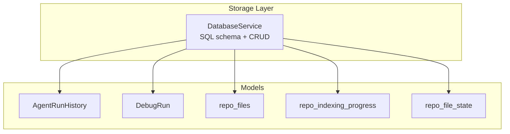
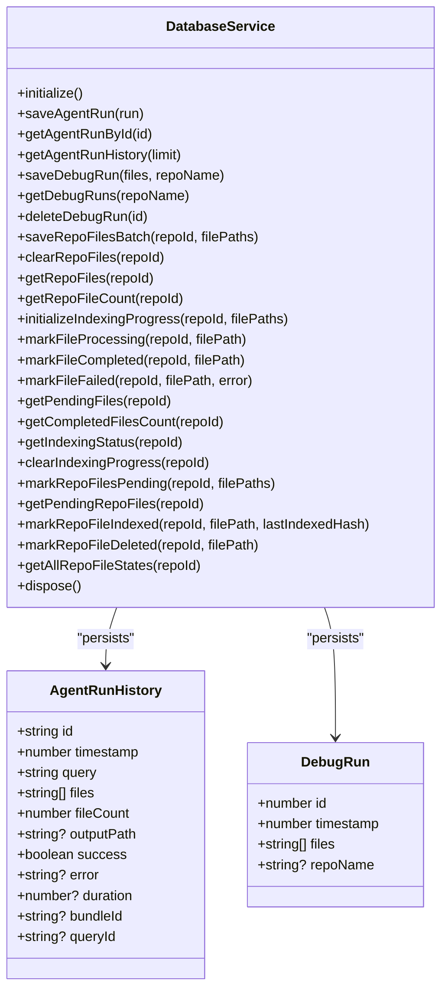
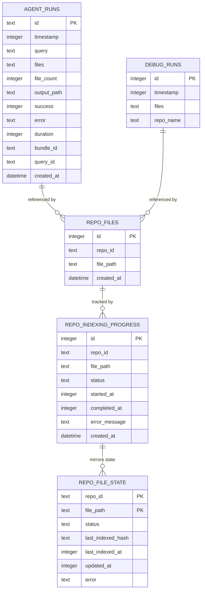
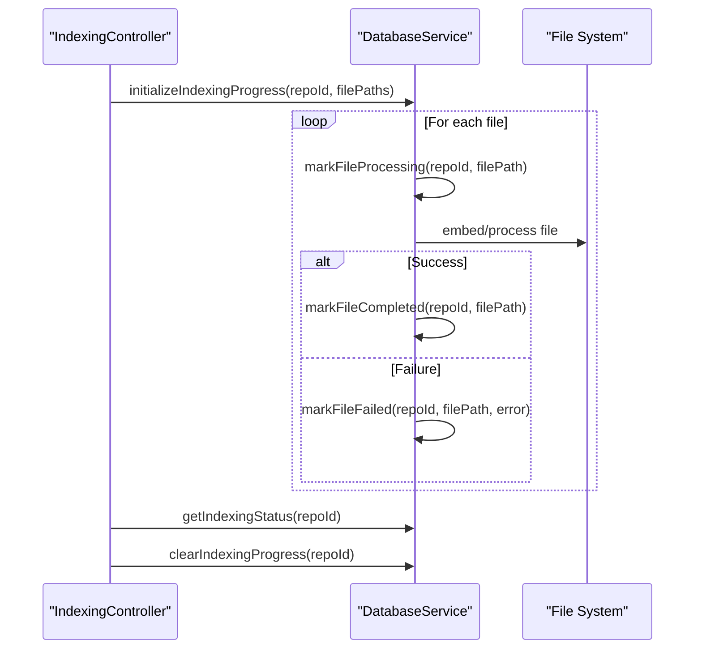
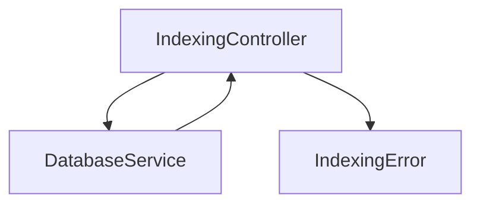

# Data Models and Schemas

<cite>
**Referenced Files in This Document**
- [databaseService.ts](file://src/core/storage/databaseService.ts)
- [indexingError.ts](file://src/shared/indexingError.ts)
- [IndexingController.ts](file://src/webview/controllers/IndexingController.ts)
- [repoIndexer.test.ts](file://src/test/core/indexing/repoIndexer.test.ts)
- [verify_indexing_logic.js](file://verification/verify_indexing_logic.js)
</cite>

## Table of Contents
1. [Introduction](#introduction)
2. [Project Structure](#project-structure)
3. [Core Components](#core-components)
4. [Architecture Overview](#architecture-overview)
5. [Detailed Component Analysis](#detailed-component-analysis)
6. [Dependency Analysis](#dependency-analysis)
7. [Performance Considerations](#performance-considerations)
8. [Troubleshooting Guide](#troubleshooting-guide)
9. [Conclusion](#conclusion)
10. [Appendices](#appendices)

## Introduction
This document describes the data models and database schemas used by the storage system. It focuses on:
- AgentRunHistory for tracking AI agent operations
- DebugRun for development and debugging scenarios
- Repository file tracking schema for managing file collections
- Indexing progress tracking tables for status management and completion metrics
- Incremental indexing state model with file change detection, content hashing, and background monitoring support
It also covers validation rules, constraints, relationships, and practical examples for insertion, querying, and schema evolution.

## Project Structure
The storage layer is implemented as a single module that encapsulates schema creation, migrations, and CRUD operations for all models. The module uses an embedded SQL engine to persist data locally within the extension’s storage area.

**Diagram sources**
- [databaseService.ts](file://src/core/storage/databaseService.ts#L27-L151)

**Section sources**
- [databaseService.ts](file://src/core/storage/databaseService.ts#L27-L151)

## Core Components
- AgentRunHistory: Tracks agent executions with timestamps, selected files, success/error outcomes, durations, and optional metadata.
- DebugRun: Captures developer-focused runs with file lists and repository association.
- repo_files: Maintains a repository’s file inventory with counts and ordering.
- repo_indexing_progress: Tracks indexing progress per file with status, timing, and error details.
- repo_file_state: Supports incremental indexing with status, hashes, timestamps, and error tracking.

**Section sources**
- [databaseService.ts](file://src/core/storage/databaseService.ts#L6-L25)
- [databaseService.ts](file://src/core/storage/databaseService.ts#L73-L151)

## Architecture Overview
The DatabaseService initializes the embedded database, creates tables, applies migrations, and exposes typed methods to manage each model. Indexing workflows use progress and state tables to coordinate batch operations and background monitoring.

**Diagram sources**
- [databaseService.ts](file://src/core/storage/databaseService.ts#L27-L151)
- [databaseService.ts](file://src/core/storage/databaseService.ts#L6-L25)

## Detailed Component Analysis

### AgentRunHistory Model
Purpose: Persist agent run metadata for auditing, analytics, and UI history.

Schema definition:
- Table: agent_runs
- Columns:
  - id: TEXT PRIMARY KEY
  - timestamp: INTEGER NOT NULL
  - query: TEXT NOT NULL
  - files: TEXT NOT NULL (JSON array)
  - file_count: INTEGER NOT NULL
  - output_path: TEXT
  - success: INTEGER NOT NULL (boolean flag)
  - error: TEXT
  - duration: INTEGER
  - bundle_id: TEXT
  - query_id: TEXT
  - created_at: DATETIME DEFAULT CURRENT_TIMESTAMP

Constraints and indexes:
- Primary key: id
- Index: idx_agent_timestamp on timestamp

Usage patterns:
- Insertion: saveAgentRun(...)
- Retrieval: getAgentRunById(id), getAgentRunHistory(limit)

Validation rules:
- Non-empty id and timestamp
- Boolean encoded as integer (success)
- JSON serialization of files array

**Section sources**
- [databaseService.ts](file://src/core/storage/databaseService.ts#L76-L91)
- [databaseService.ts](file://src/core/storage/databaseService.ts#L139-L139)
- [databaseService.ts](file://src/core/storage/databaseService.ts#L254-L280)
- [databaseService.ts](file://src/core/storage/databaseService.ts#L282-L313)
- [databaseService.ts](file://src/core/storage/databaseService.ts#L315-L355)

### DebugRun Model
Purpose: Capture developer-focused runs with file lists and optional repository association.

Schema definition:
- Table: debug_runs
- Columns:
  - id: INTEGER PRIMARY KEY AUTOINCREMENT
  - timestamp: INTEGER NOT NULL
  - files: TEXT NOT NULL (JSON array)
  - repo_name: TEXT

Constraints and indexes:
- Indexes: idx_debug_timestamp on timestamp, idx_debug_repo_name on repo_name

Migration:
- repo_name column is added via migration if missing

Usage patterns:
- Insertion: saveDebugRun(files, repoName?)
- Retrieval: getDebugRuns(repoName?), deleteDebugRun(id)

Validation rules:
- Non-empty timestamp
- JSON serialization of files array
- Optional repo_name

**Section sources**
- [databaseService.ts](file://src/core/storage/databaseService.ts#L93-L100)
- [databaseService.ts](file://src/core/storage/databaseService.ts#L153-L175)
- [databaseService.ts](file://src/core/storage/databaseService.ts#L177-L252)

### Repository File Tracking Schema (repo_files)
Purpose: Maintain a repository’s file inventory for quick access and counting.

Schema definition:
- Table: repo_files
- Columns:
  - id: INTEGER PRIMARY KEY AUTOINCREMENT
  - repo_id: TEXT NOT NULL
  - file_path: TEXT NOT NULL
  - created_at: DATETIME DEFAULT CURRENT_TIMESTAMP

Constraints and indexes:
- Index: idx_repo_files_repo_id on repo_id

Usage patterns:
- Batch insert: saveRepoFilesBatch(repoId, filePaths[])
- Clear: clearRepoFiles(repoId)
- Query: getRepoFiles(repoId), getRepoFileCount(repoId)

Validation rules:
- Non-empty repo_id and file_path
- Unique per repo_id + file_path enforced implicitly by application logic

**Section sources**
- [databaseService.ts](file://src/core/storage/databaseService.ts#L102-L109)
- [databaseService.ts](file://src/core/storage/databaseService.ts#L142-L142)
- [databaseService.ts](file://src/core/storage/databaseService.ts#L357-L431)

### Indexing Progress Tracking Tables
Purpose: Track indexing progress per file with status transitions and error handling.

Schema definition:
- Table: repo_indexing_progress
- Columns:
  - id: INTEGER PRIMARY KEY AUTOINCREMENT
  - repo_id: TEXT NOT NULL
  - file_path: TEXT NOT NULL
  - status: TEXT NOT NULL
  - started_at: INTEGER
  - completed_at: INTEGER
  - error_message: TEXT
  - created_at: DATETIME DEFAULT CURRENT_TIMESTAMP
  - UNIQUE(repo_id, file_path)

Constraints and indexes:
- Unique composite key: (repo_id, file_path)
- Indexes: idx_repo_indexing_progress_repo_id on repo_id, idx_repo_indexing_progress_status on status

Status lifecycle:
- pending → processing → completed or failed
- Error state stores error_message with completion timestamp

Usage patterns:
- Initialization: initializeIndexingProgress(repoId, filePaths[])
- Status updates: markFileProcessing, markFileCompleted, markFileFailed
- Queries: getPendingFiles, getCompletedFilesCount, getIndexingStatus, clearIndexingProgress

**Section sources**
- [databaseService.ts](file://src/core/storage/databaseService.ts#L111-L123)
- [databaseService.ts](file://src/core/storage/databaseService.ts#L143-L145)
- [databaseService.ts](file://src/core/storage/databaseService.ts#L447-L629)

### Incremental Indexing State Model (repo_file_state)
Purpose: Support background monitoring and incremental re-embedding with change detection and persistence across restarts.

Schema definition:
- Table: repo_file_state
- Columns:
  - repo_id: TEXT NOT NULL
  - file_path: TEXT NOT NULL
  - status: TEXT NOT NULL
  - last_indexed_hash: TEXT
  - last_indexed_at: INTEGER
  - updated_at: INTEGER NOT NULL
  - error: TEXT
  - PRIMARY KEY (repo_id, file_path)

Constraints and indexes:
- Composite primary key: (repo_id, file_path)
- Index: idx_repo_file_state_repo_id_status on (repo_id, status)

State lifecycle:
- pending → indexed (on successful re-embedding)
- pending → deleted (if file is removed)
- any → pending (when file watcher detects change)

Usage patterns:
- Pending marking: markRepoFilesPending(repoId, filePaths[])
- Query pending: getPendingRepoFiles(repoId)
- Mark indexed: markRepoFileIndexed(repoId, filePath, lastIndexedHash)
- Mark deleted: markRepoFileDeleted(repoId, filePath)
- Snapshot: getAllRepoFileStates(repoId)

**Section sources**
- [databaseService.ts](file://src/core/storage/databaseService.ts#L125-L137)
- [databaseService.ts](file://src/core/storage/databaseService.ts#L666-L754)
- [databaseService.ts](file://src/core/storage/databaseService.ts#L773-L802)
- [databaseService.ts](file://src/core/storage/databaseService.ts#L820-L845)
- [databaseService.ts](file://src/core/storage/databaseService.ts#L856-L881)

### Data Validation Rules and Constraints
- AgentRunHistory
  - id must be unique and non-empty
  - timestamp must be a positive integer
  - files serialized as JSON array
  - success stored as integer flag
- DebugRun
  - timestamp must be a positive integer
  - files serialized as JSON array
  - repo_name optional
- repo_files
  - repo_id and file_path must be non-empty
  - created_at defaults to current timestamp
- repo_indexing_progress
  - (repo_id, file_path) unique
  - status must be one of pending/processing/completed/failed
  - started_at/completed_at optional integers
  - error_message optional
- repo_file_state
  - (repo_id, file_path) primary key
  - status must be one of pending/indexed/deleted
  - last_indexed_hash optional (SHA-256 preview in logs)
  - updated_at required integer

**Section sources**
- [databaseService.ts](file://src/core/storage/databaseService.ts#L76-L137)

### Relationship Mappings Between Tables
- agent_runs: Independent audit/history table
- debug_runs: Independent developer-run table
- repo_files: One-to-many mapping per repo_id
- repo_indexing_progress: One-to-one per (repo_id, file_path)
- repo_file_state: One-to-one per (repo_id, file_path)

**Diagram sources**
- [databaseService.ts](file://src/core/storage/databaseService.ts#L76-L137)

## Architecture Overview

**Diagram sources**
- [databaseService.ts](file://src/core/storage/databaseService.ts#L447-L629)
- [IndexingController.ts](file://src/webview/controllers/IndexingController.ts#L524-L613)

## Detailed Component Analysis

### AgentRunHistory: Insertion and Querying
- Insertion: saveAgentRun(run) serializes files and writes all fields including optional metadata.
- Querying: getAgentRunById(id) and getAgentRunHistory(limit) deserialize files and convert success flag.

Example paths:
- [saveAgentRun](file://src/core/storage/databaseService.ts#L254-L280)
- [getAgentRunById](file://src/core/storage/databaseService.ts#L282-L313)
- [getAgentRunHistory](file://src/core/storage/databaseService.ts#L315-L355)

**Section sources**
- [databaseService.ts](file://src/core/storage/databaseService.ts#L254-L355)

### DebugRun: Development and Debugging Scenarios
- Insertion: saveDebugRun(files, repoName?) persists timestamp, JSON files, and optional repository name.
- Querying: getDebugRuns(repoName?) supports filtering and pagination.
- Migration: Adds repo_name column if missing.

Example paths:
- [saveDebugRun](file://src/core/storage/databaseService.ts#L177-L199)
- [getDebugRuns](file://src/core/storage/databaseService.ts#L201-L241)
- [Migration](file://src/core/storage/databaseService.ts#L153-L175)

**Section sources**
- [databaseService.ts](file://src/core/storage/databaseService.ts#L177-L241)
- [databaseService.ts](file://src/core/storage/databaseService.ts#L153-L175)

### Repository File Tracking: Batch Operations
- Batch insert: saveRepoFilesBatch(repoId, filePaths[]) uses transactions for atomicity.
- Clear and count: clearRepoFiles(repoId), getRepoFileCount(repoId), getRepoFiles(repoId).

Example paths:
- [saveRepoFilesBatch](file://src/core/storage/databaseService.ts#L357-L380)
- [clearRepoFiles](file://src/core/storage/databaseService.ts#L382-L394)
- [getRepoFileCount](file://src/core/storage/databaseService.ts#L396-L412)
- [getRepoFiles](file://src/core/storage/databaseService.ts#L414-L431)

**Section sources**
- [databaseService.ts](file://src/core/storage/databaseService.ts#L357-L431)

### Indexing Progress Tracking: Status Management and Completion Metrics
- Initialization: initializeIndexingProgress(repoId, filePaths[]) clears prior progress and marks all as pending.
- Status transitions: markFileProcessing, markFileCompleted, markFileFailed.
- Metrics: getPendingFiles, getCompletedFilesCount, getIndexingStatus, clearIndexingProgress.

Example paths:
- [initializeIndexingProgress](file://src/core/storage/databaseService.ts#L447-L478)
- [markFileProcessing](file://src/core/storage/databaseService.ts#L483-L497)
- [markFileCompleted](file://src/core/storage/databaseService.ts#L502-L516)
- [markFileFailed](file://src/core/storage/databaseService.ts#L521-L535)
- [getPendingFiles](file://src/core/storage/databaseService.ts#L540-L559)
- [getCompletedFilesCount](file://src/core/storage/databaseService.ts#L564-L581)
- [getIndexingStatus](file://src/core/storage/databaseService.ts#L586-L612)
- [clearIndexingProgress](file://src/core/storage/databaseService.ts#L617-L629)

**Section sources**
- [databaseService.ts](file://src/core/storage/databaseService.ts#L447-L629)

### Incremental Indexing State: Change Detection and Background Monitoring
- Pending marking: markRepoFilesPending(repoId, filePaths[]) uses UPSERT to reset state and clear errors.
- Pending retrieval: getPendingRepoFiles(repoId) orders by updated_at ascending.
- Indexed marking: markRepoFileIndexed(repoId, filePath, lastIndexedHash) stores hash and timestamps.
- Deleted marking: markRepoFileDeleted(repoId, filePath) sets status to deleted.
- State snapshot: getAllRepoFileStates(repoId) returns statuses and hashes.

Example paths:
- [markRepoFilesPending](file://src/core/storage/databaseService.ts#L666-L706)
- [getPendingRepoFiles](file://src/core/storage/databaseService.ts#L722-L754)
- [markRepoFileIndexed](file://src/core/storage/databaseService.ts#L773-L802)
- [markRepoFileDeleted](file://src/core/storage/databaseService.ts#L820-L845)
- [getAllRepoFileStates](file://src/core/storage/databaseService.ts#L856-L881)

**Section sources**
- [databaseService.ts](file://src/core/storage/databaseService.ts#L666-L881)

### Schema Evolution Patterns
- Column addition: MigrationService adds repo_name to debug_runs if missing.
- Transactional DDL: createTables wraps statements in transaction-like semantics via BEGIN/COMMIT.
- Non-fatal migrations: Migration errors are caught and logged to avoid blocking initialization.

Example paths:
- [MigrationService.switchProvider](file://src/core/indexing/migrationService.ts#L17-L37)
- [runMigrations](file://src/core/storage/databaseService.ts#L153-L175)

**Section sources**
- [databaseService.ts](file://src/core/storage/databaseService.ts#L153-L175)

## Dependency Analysis

**Diagram sources**
- [IndexingController.ts](file://src/webview/controllers/IndexingController.ts#L38-L45)
- [databaseService.ts](file://src/core/storage/databaseService.ts#L27-L71)
- [indexingError.ts](file://src/shared/indexingError.ts#L2-L24)

**Section sources**
- [IndexingController.ts](file://src/webview/controllers/IndexingController.ts#L38-L45)
- [databaseService.ts](file://src/core/storage/databaseService.ts#L27-L71)
- [indexingError.ts](file://src/shared/indexingError.ts#L2-L24)

## Performance Considerations
- Indexes: Timestamp and composite indexes enable fast queries for recent runs, repository-scoped lookups, and status filtering.
- Transactions: Batch operations (e.g., saveRepoFilesBatch, progress initialization) wrap multiple inserts in a single transaction to reduce overhead.
- JSON fields: Files arrays are stored as JSON; consider limiting array sizes for UI responsiveness.
- Upsert patterns: repo_file_state uses ON CONFLICT to minimize round-trips for pending marking.
- Logging: Verbose logging around incremental state updates aids debugging without impacting core schema.

[No sources needed since this section provides general guidance]

## Troubleshooting Guide
Common issues and resolutions:
- Database not initialized: Ensure initialize() is awaited before any operation.
- Migration failures: Non-fatal migrations log and continue; verify column presence via PRAGMA.
- JSON parsing errors: Verify files array serialization/deserialization paths.
- Indexing stuck in pending: Check getPendingRepoFiles ordering and markRepoFilesPending behavior.
- Dimension mismatch blocking indexing: Controller checks a global flag and posts UI messages accordingly.

Example paths:
- [IndexingController pause/stop handling](file://src/webview/controllers/IndexingController.ts#L524-L613)
- [IndexingError.toUserString](file://src/shared/indexingError.ts#L9-L23)

**Section sources**
- [IndexingController.ts](file://src/webview/controllers/IndexingController.ts#L524-L613)
- [indexingError.ts](file://src/shared/indexingError.ts#L9-L23)

## Conclusion
The storage system provides a compact, embedded schema supporting agent run history, developer debugging, repository file tracking, and robust indexing progress/state management. The design emphasizes simplicity, transactional integrity, and extensibility through non-fatal migrations and clear status lifecycles.

[No sources needed since this section summarizes without analyzing specific files]

## Appendices

### Example Workflows

#### Insert Agent Run
- Path: [saveAgentRun](file://src/core/storage/databaseService.ts#L254-L280)
- Notes: Serializes files array and writes all fields including optional metadata.

#### Query Agent History
- Paths: [getAgentRunById](file://src/core/storage/databaseService.ts#L282-L313), [getAgentRunHistory](file://src/core/storage/databaseService.ts#L315-L355)
- Notes: Deserializes files and converts success flag.

#### Save Debug Run
- Path: [saveDebugRun](file://src/core/storage/databaseService.ts#L177-L199)
- Notes: Persists timestamp, JSON files, and optional repository name.

#### Manage Repository Files
- Paths: [saveRepoFilesBatch](file://src/core/storage/databaseService.ts#L357-L380), [getRepoFiles](file://src/core/storage/databaseService.ts#L414-L431), [getRepoFileCount](file://src/core/storage/databaseService.ts#L396-L412)

#### Initialize and Track Indexing Progress
- Paths: [initializeIndexingProgress](file://src/core/storage/databaseService.ts#L447-L478), [markFileProcessing](file://src/core/storage/databaseService.ts#L483-L497), [markFileCompleted](file://src/core/storage/databaseService.ts#L502-L516), [markFileFailed](file://src/core/storage/databaseService.ts#L521-L535), [getIndexingStatus](file://src/core/storage/databaseService.ts#L586-L612)

#### Incremental Indexing State
- Paths: [markRepoFilesPending](file://src/core/storage/databaseService.ts#L666-L706), [getPendingRepoFiles](file://src/core/storage/databaseService.ts#L722-L754), [markRepoFileIndexed](file://src/core/storage/databaseService.ts#L773-L802), [markRepoFileDeleted](file://src/core/storage/databaseService.ts#L820-L845), [getAllRepoFileStates](file://src/core/storage/databaseService.ts#L856-L881)

#### Schema Evolution
- Paths: [runMigrations](file://src/core/storage/databaseService.ts#L153-L175), [MigrationService.switchProvider](file://src/core/indexing/migrationService.ts#L17-L37)

**Section sources**
- [databaseService.ts](file://src/core/storage/databaseService.ts#L153-L881)
- [repoIndexer.test.ts](file://src/test/core/indexing/repoIndexer.test.ts#L44-L76)
- [verify_indexing_logic.js](file://verification/verify_indexing_logic.js#L42-L57)