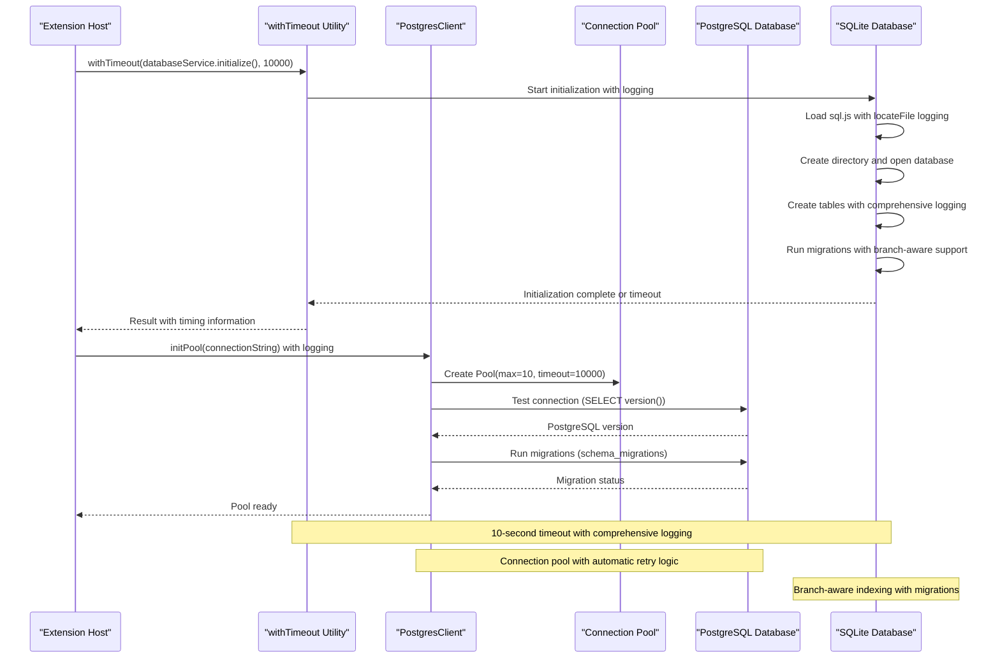
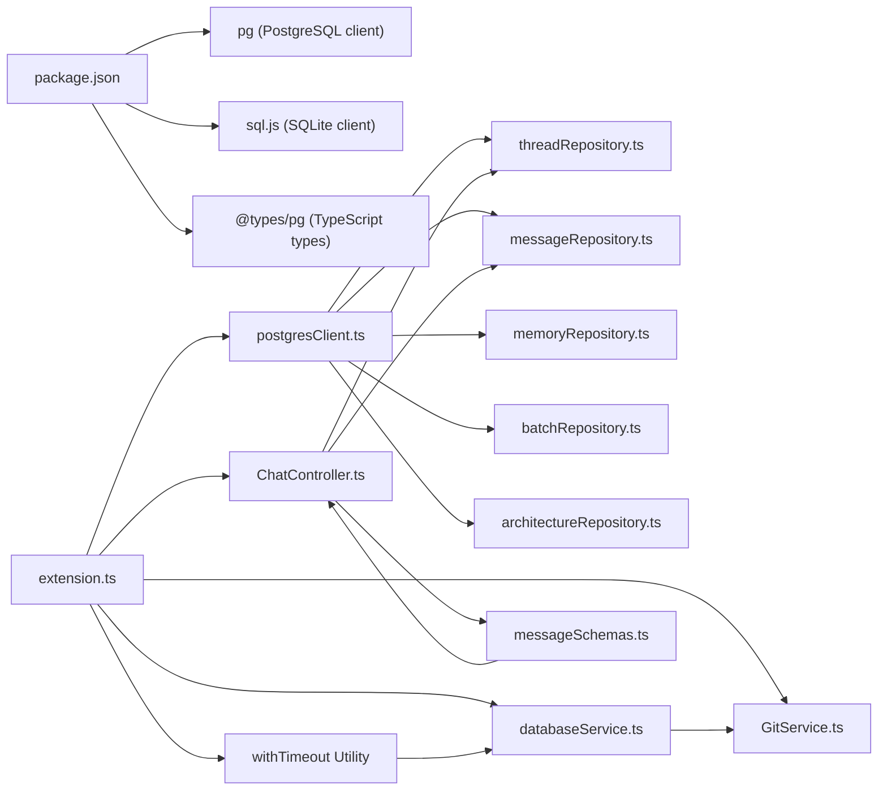

# Database Service

<cite>
**Referenced Files in This Document**
- [postgresClient.ts](file://src/chat/db/postgresClient.ts)
- [threadRepository.ts](file://src/chat/db/threadRepository.ts)
- [messageRepository.ts](file://src/chat/db/messageRepository.ts)
- [memoryRepository.ts](file://src/chat/db/memoryRepository.ts)
- [batchRepository.ts](file://src/chat/db/batchRepository.ts)
- [architectureRepository.ts](file://src/chat/db/architectureRepository.ts)
- [001_initial_schema.sql](file://src/chat/db/migrations/001_initial_schema.sql)
- [002_compression_schema.sql](file://src/chat/db/migrations/002_compression_schema.sql)
- [extension.ts](file://src/extension.ts)
- [ConfigController.ts](file://src/webview/controllers/ConfigController.ts)
- [databaseService.ts](file://src/core/storage/databaseService.ts)
- [ChatController.ts](file://src/webview/controllers/ChatController.ts)
- [messageSchemas.ts](file://src/webview/messageSchemas.ts)
- [ChatHistoryTab.test.ts](file://src/test/webview/ChatHistoryTab.test.ts)
- [GitService.ts](file://src/git/GitService.ts)
- [001_postgresql_chat_storage.md](file://PRDs/001_postgresql_chat_storage.md)
- [003_context_compression_strategy.md](file://PRDs/003_context_compression_strategy.md)
- [004_memory_manager_crud.md](file://PRDs/004_memory_manager_crud.md)
- [005_batch_llm_pipeline.md](file://PRDs/005_batch_llm_pipeline.md)
- [008_repo_architecture_generator.md](file://PRDs/008_repo_architecture_generator.md)
</cite>

## Update Summary
**Changes Made**
- Enhanced database initialization with comprehensive logging and improved error handling
- Implemented 10-second timeout protection for SQLite database initialization
- Streamlined initialization process with non-blocking extension activation
- Added comprehensive timing information and diagnostic logging throughout initialization
- Enhanced error handling with graceful degradation when database initialization fails
- Improved timeout mechanism with meaningful error messages and fallback behavior

## Table of Contents
1. [Introduction](#introduction)
2. [Project Structure](#project-structure)
3. [Core Components](#core-components)
4. [Architecture Overview](#architecture-overview)
5. [Detailed Component Analysis](#detailed-component-analysis)
6. [Dependency Analysis](#dependency-analysis)
7. [Performance Considerations](#performance-considerations)
8. [Troubleshooting Guide](#troubleshooting-guide)
9. [Conclusion](#conclusion)

## Introduction
This document explains the Database Service implementation that provides PostgreSQL-backed chat storage for the VS Code extension along with comprehensive SQLite-based storage for agent runs, debug runs, repository files, and indexing progress tracking. The system has been enhanced with enterprise-grade PostgreSQL integration, secure credential storage, sophisticated thread validation, and branch-aware indexing capabilities. The service manages database initialization, connection lifecycle, transaction management, and provides CRUD operations for chat threads, messages, memory entries, batch jobs, repository architecture data, and indexing progress tracking across multiple branches.

**Updated** Complete enhancement with comprehensive input validation utilities, branch-aware indexing capabilities, sophisticated thread management with strict data validation, and robust initialization with timeout protection and comprehensive logging.

## Project Structure
The Database Service is organized around specialized repository classes that encapsulate database operations for different data types. The system includes both PostgreSQL-backed chat storage and SQLite-based agent/run storage with branch-aware indexing capabilities.

```mermaid
graph TB
subgraph "Extension Host"
EXT["extension.ts"]
PG["PostgresClient<br/>src/chat/db/postgresClient.ts"]
CC["ConfigController<br/>src/webview/controllers/ConfigController.ts"]
DBS["DatabaseService<br/>src/core/storage/databaseService.ts"]
CHAT["ChatController<br/>src/webview/controllers/ChatController.ts"]
MS["MessageSchemas<br/>src/webview/messageSchemas.ts"]
GS["GitService<br/>src/git/GitService.ts"]
END
subgraph "PostgreSQL Repository Layer"
TR["ThreadRepository<br/>validation utilities, search, archive"]
MR["MessageRepository<br/>compression tracking, COUNT() optimization"]
MEMR["MemoryRepository<br/>source tracking"]
BR["BatchRepository"]
AR["ArchitectureRepository"]
END
subgraph "SQLite Repository Layer"
ARS["Agent Runs<br/>agent_runs table"]
DRS["Debug Runs<br/>debug_runs table"]
RFS["Repository Files<br/>repo_files table"]
RIP["Indexing Progress<br/>repo_indexing_progress<br/>branch-aware"]
RFS2["File State<br/>repo_file_state<br/>branch-aware"]
IH["Index History<br/>index_history table"]
RB["Repository Blueprints<br/>repo_blueprints table"]
ICP["Index Checkpoints<br/>indexing_pause_checkpoint table"]
END
subgraph "Database Schema"
THREADS["chat_threads<br/>status: active/archived/deleted"]
MESSAGES["chat_messages<br/>compression tracking columns"]
MEMORY["chat_memory<br/>source: user/auto"]
BATCH["batch_jobs"]
ARCH["repo_architecture"]
INDEX_PROGRESS["repo_indexing_progress<br/>branch_name column"]
FILE_STATE["repo_file_state<br/>branch_name, commit_sha"]
END
EXT --> PG
EXT --> DBS
EXT --> GS
PG --> TR
PG --> MR
PG --> MEMR
PG --> BR
PG --> AR
DBS --> ARS
DBS --> DRS
DBS --> RFS
DBS --> RIP
DBS --> RFS2
DBS --> IH
DBS --> RB
DBS --> ICP
TR --> THREADS
MR --> MESSAGES
MEMR --> MEMORY
BR --> BATCH
AR --> ARCH
RIP --> INDEX_PROGRESS
RFS2 --> FILE_STATE
CHAT --> TR
CHAT --> MR
MS --> CHAT
CC --> PG
DBS -. Legacy SQLite .-> DBS
```

**Diagram sources**
- [extension.ts](file://src/extension.ts#L79-L106)
- [postgresClient.ts](file://src/chat/db/postgresClient.ts#L282-L312)
- [threadRepository.ts](file://src/chat/db/threadRepository.ts#L46-L58)
- [databaseService.ts](file://src/core/storage/databaseService.ts#L196-L224)
- [GitService.ts](file://src/git/GitService.ts#L6-L6)
- [ChatController.ts](file://src/webview/controllers/ChatController.ts#L378-L396)
- [messageSchemas.ts](file://src/webview/messageSchemas.ts#L1109-L1142)

**Section sources**
- [extension.ts](file://src/extension.ts#L79-L106)
- [postgresClient.ts](file://src/chat/db/postgresClient.ts#L282-L312)
- [databaseService.ts](file://src/core/storage/databaseService.ts#L196-L224)

## Core Components
- **PostgresClient**: Connection pool singleton that manages PostgreSQL connections, runs migrations, and provides query utilities with retry logic
- **ThreadRepository**: Handles CRUD operations for chat threads with comprehensive input validation, including new assertNonNegativeInteger and assertNonNegativeNumber utilities
- **MessageRepository**: Manages message persistence with transaction support, pagination, compression tracking, and efficient COUNT() operations
- **MemoryRepository**: Provides memory entry CRUD operations with scope-based organization, source tracking, and expiration handling
- **BatchRepository**: Manages batch job records for the HITL workflow with status tracking and metadata storage
- **ArchitectureRepository**: Handles repository architecture snapshots with upsert operations and expiration management
- **DatabaseService**: **Enhanced** SQLite-based service managing agent runs, debug runs, repository files, and branch-aware indexing progress tracking with comprehensive logging and timeout protection
- **Migration System**: Version-controlled schema evolution with rollback support and comprehensive branch-aware migrations
- **VS Code Secrets Integration**: Secure credential storage using VS Code's secret storage API
- **GitService Integration**: Branch detection and default branch handling for indexing operations
- **withTimeout Utility**: **New** Non-blocking timeout mechanism for database initialization with comprehensive logging

**Updated** Enhanced with comprehensive input validation utilities, branch-aware indexing capabilities, sophisticated thread management with strict data validation, robust initialization with timeout protection, and comprehensive logging throughout the initialization process.

Key responsibilities:
- Initialize PostgreSQL connection pool with configurable parameters (max connections, timeouts)
- Execute schema migrations automatically on first connection
- Provide transaction-safe CRUD operations through specialized repositories
- Implement retry logic for transient connection errors
- Manage database lifecycle with proper cleanup on extension deactivation
- Store connection credentials securely using VS Code secrets
- Support concurrent access through connection pooling
- **New**: Sophisticated thread search with ILIKE operations and status filtering
- **New**: Thread lifecycle management with archive/unarchive status transitions
- **New**: Optimized message counting using PostgreSQL's COUNT() function
- **New**: Compression tracking for context management with original content preservation
- **New**: Source tracking for memory entries distinguishing user vs auto-generated content
- **New**: Comprehensive input validation utilities (assertNonNegativeInteger, assertNonNegativeNumber)
- **New**: Branch-aware indexing with SQLite migrations and transaction-safe operations
- **New**: Git integration for branch detection and default branch handling
- **New**: Comprehensive logging with timing information for all initialization steps
- **New**: 10-second timeout protection with graceful fallback when initialization fails
- **New**: Non-blocking extension activation with background database initialization

**Section sources**
- [postgresClient.ts](file://src/chat/db/postgresClient.ts#L282-L351)
- [threadRepository.ts](file://src/chat/db/threadRepository.ts#L46-L58)
- [threadRepository.ts](file://src/chat/db/threadRepository.ts#L121-L127)
- [databaseService.ts](file://src/core/storage/databaseService.ts#L383-L507)
- [GitService.ts](file://src/git/GitService.ts#L6-L6)
- [extension.ts](file://src/extension.ts#L55-L82)

## Architecture Overview
The Database Service uses a dual-database approach: PostgreSQL for chat storage and SQLite for agent/run data. The system initializes the PostgreSQL pool on extension activation, runs automatic migrations, and provides specialized repositories for different data types. All database operations are transaction-safe and include proper error handling with retry logic. The SQLite service has been enhanced with branch-aware indexing capabilities and comprehensive timeout protection.



**Diagram sources**
- [extension.ts](file://src/extension.ts#L55-L82)
- [extension.ts](file://src/extension.ts#L125-L139)
- [postgresClient.ts](file://src/chat/db/postgresClient.ts#L295-L312)
- [postgresClient.ts](file://src/chat/db/postgresClient.ts#L461-L485)
- [databaseService.ts](file://src/core/storage/databaseService.ts#L383-L507)

**Section sources**
- [extension.ts](file://src/extension.ts#L55-L82)
- [extension.ts](file://src/extension.ts#L125-L139)
- [postgresClient.ts](file://src/chat/db/postgresClient.ts#L295-L312)
- [postgresClient.ts](file://src/chat/db/postgresClient.ts#L461-L485)
- [databaseService.ts](file://src/core/storage/databaseService.ts#L383-L507)

## Detailed Component Analysis

### Enhanced Database Initialization with Timeout Protection

#### withTimeout Utility - Non-Blocking Initialization
The extension now uses a sophisticated timeout mechanism for database initialization that ensures non-blocking extension activation:

**Timeout Mechanism**:
- **10-second timeout**: Database initialization is wrapped in withTimeout with 10-second deadline
- **Comprehensive logging**: Every step logs start, completion, and failure with timing information
- **Graceful fallback**: Returns null on timeout instead of blocking extension activation
- **Meaningful error messages**: Provides specific timeout error messages with operation names

**Initialization Flow**:
```typescript
const dbInitResult = await withTimeout(
  databaseService.initialize(),
  10000, // 10 second timeout
  'SQLite database initialization'
);

if (dbInitResult === null) {
  console.warn('[quick-repomix] Database initialization timed out - continuing without database');
  // DatabaseService will handle null db internally
} else {
  console.log('[quick-repomix] Database service initialized successfully');
}
```

**Logging Enhancements**:
- **Start logging**: "[quick-repomix] Starting SQLite database initialization..."
- **Completion logging**: "[quick-repomix] SQLite database initialization completed in Xms"
- **Failure logging**: "[quick-repomix] SQLite database initialization failed after Xms: [error]"
- **Step-by-step timing**: Individual step timing for sql.js loading, directory creation, database opening, and table creation

**Section sources**
- [extension.ts](file://src/extension.ts#L55-L82)
- [extension.ts](file://src/extension.ts#L125-L139)

### DatabaseService - Enhanced SQLite Storage with Comprehensive Logging

#### Enhanced Initialization Process
The DatabaseService has been significantly enhanced with comprehensive logging and improved error handling:

**Comprehensive Logging**:
- **Initialization start**: "[DatabaseService] Starting initialization..." with timestamp
- **sql.js loading**: Detailed locateFile resolution with candidate paths logging
- **Directory creation**: "[DatabaseService] Creating directory: [path]" with existence checks
- **Database opening**: "[DatabaseService] Opening database at: [path]" with load/save attempts
- **Table creation**: "[DatabaseService] Creating tables..." with individual table logging
- **Migration execution**: "[DatabaseService] Running migrations..." with branch-aware progress
- **Success completion**: "[DatabaseService] Initialization complete in Xms" with total timing
- **Failure handling**: "[DatabaseService] Initialization failed after Xms: [error]" with stack trace

**Enhanced Error Handling**:
- **Graceful database loading**: Attempts to load existing database, falls back to new database on failure
- **Migration safety**: Transaction-based migrations with rollback on errors
- **Non-blocking behavior**: Initialization continues even if some operations fail
- **Comprehensive error propagation**: Errors are logged with timing context and re-thrown

**Section sources**
- [databaseService.ts](file://src/core/storage/databaseService.ts#L125-L181)

#### Branch-Aware Indexing System
The DatabaseService has been significantly enhanced with comprehensive branch-aware indexing capabilities:

**Migration System**:
- **Branch Column Addition**: Automatically adds branch_name column to existing tables
- **Unique Constraint Updates**: Updates unique constraints to include branch_name
- **Data Preservation**: Migrates existing data while preserving branch context
- **Transaction Safety**: Uses BEGIN/COMMIT/ROLLBACK for atomic schema changes

**Enhanced Tables**:
- **repo_indexing_progress**: Now includes branch_name column with default value
- **repo_file_state**: Enhanced with branch_name, commit_sha, is_merged, and last_synced_at columns
- **Index Creation**: Branch-aware indexes for improved query performance

**Branch-Specific Operations**:
- **Progress Tracking**: Separate indexing progress per branch per file
- **File State Management**: Track file indexing state per branch
- **Clear Branch Data**: Transaction-safe clearing of branch-specific data
- **Branch Enumeration**: List all branches for a repository with proper sorting

**Migration Implementation**:
```sql
-- Migration from legacy schema to branch-aware
ALTER TABLE repo_indexing_progress RENAME TO repo_indexing_progress_legacy_{timestamp};
CREATE TABLE repo_indexing_progress (
  id INTEGER PRIMARY KEY AUTOINCREMENT,
  repo_id TEXT NOT NULL,
  branch_name TEXT NOT NULL DEFAULT '{DEFAULT_BRANCH_NAME}',
  file_path TEXT NOT NULL,
  status TEXT NOT NULL,
  started_at INTEGER,
  completed_at INTEGER,
  error_message TEXT,
  created_at DATETIME DEFAULT CURRENT_TIMESTAMP,
  UNIQUE(repo_id, branch_name, file_path)
);
INSERT INTO repo_indexing_progress (repo_id, branch_name, file_path, status, started_at, completed_at, error_message, created_at)
SELECT repo_id, COALESCE(branch_name, '{DEFAULT_BRANCH_NAME}'), file_path, status, started_at, completed_at, error_message, created_at
FROM repo_indexing_progress_legacy_{timestamp};
```

**Section sources**
- [databaseService.ts](file://src/core/storage/databaseService.ts#L383-L507)
- [databaseService.ts](file://src/core/storage/databaseService.ts#L321-L327)
- [databaseService.ts](file://src/core/storage/databaseService.ts#L196-L224)
- [databaseService.ts](file://src/core/storage/databaseService.ts#L437-L507)

#### Enhanced Branch Operations
The DatabaseService now provides comprehensive branch-aware operations:

**Branch Detection**:
- **Current Branch**: Retrieves current branch from GitService with fallback to DEFAULT_BRANCH_NAME
- **Branch Enumeration**: Lists all local and remote branches for a repository
- **Branch Change Events**: Monitors Git repository for branch changes

**Branch-Specific Queries**:
- **Indexing Progress**: Filter progress by repository and branch
- **File State**: Query file state per branch
- **Clear Operations**: Clear data for specific branches only

**Integration with GitService**:
- **DEFAULT_BRANCH_NAME**: Constant for default branch handling
- **Branch Fallback**: Graceful fallback when Git API is unavailable
- **CLI Fallback**: Uses git command-line when API fails

**Section sources**
- [databaseService.ts](file://src/core/storage/databaseService.ts#L1847-L1871)
- [GitService.ts](file://src/git/GitService.ts#L6-L6)
- [GitService.ts](file://src/git/GitService.ts#L51-L55)

### Enhanced Input Validation Utilities

#### Numeric Validation Functions
The ThreadRepository now includes sophisticated input validation utilities for ensuring data integrity:

**assertNonNegativeInteger**: Validates that numeric values are integers and non-negative
- **Purpose**: Ensures thread metrics like totalTokens are valid integers
- **Implementation**: Checks Number.isInteger() and value >= 0
- **Error Handling**: Throws descriptive error for invalid values
- **Usage**: Applied to totalTokens in thread updates

**assertNonNegativeNumber**: Validates that numeric values are finite numbers and non-negative  
- **Purpose**: Ensures thread costs like totalCostUsd are valid numbers
- **Implementation**: Checks Number.isFinite() and value >= 0
- **Error Handling**: Throws descriptive error for invalid values
- **Usage**: Applied to totalCostUsd in thread updates

**Validation Flow**:
```typescript
// Example usage in updateThread method
if (patch.totalTokens !== undefined) {
  sets.push(`total_tokens = $${paramIndex++}`);
  values.push(assertNonNegativeInteger(patch.totalTokens, 'totalTokens'));
}
if (patch.totalCostUsd !== undefined) {
  sets.push(`total_cost_usd = $${paramIndex++}`);
  values.push(assertNonNegativeNumber(patch.totalCostUsd, 'totalCostUsd'));
}
```

**Section sources**
- [threadRepository.ts](file://src/chat/db/threadRepository.ts#L46-L58)
- [threadRepository.ts](file://src/chat/db/threadRepository.ts#L98-L140)

### PostgresClient - Connection Pool Management
Responsibilities:
- **Connection Pool Initialization**: Creates a PostgreSQL connection pool with configurable parameters including max connections (10), idle timeout (30000ms), and connection timeout (10000ms)
- **Automatic Migration**: Runs schema migrations on first connection, checking for existing tables and applying necessary changes
- **Retry Logic**: Implements retry mechanism for transient connection errors with exponential backoff
- **Pool Management**: Provides getPool(), closePool(), and queryWithRetry() utilities for consistent database access
- **Verification**: Includes verifyMigration() and testConnection() methods for health checks and debugging

**Updated** Enterprise-grade connection pool with comprehensive error handling and automatic migration support.

Initialization flow:
- Validates connection string from VS Code secrets
- Creates Pool instance with security-conscious defaults
- Tests connection with SELECT version()
- Executes migration system to ensure schema consistency
- Registers error handlers for pool lifecycle management

**Section sources**
- [postgresClient.ts](file://src/chat/db/postgresClient.ts#L282-L351)
- [postgresClient.ts](file://src/chat/db/postgresClient.ts#L353-L368)
- [postgresClient.ts](file://src/chat/db/postgresClient.ts#L373-L459)

### ThreadRepository - Enhanced Chat Thread Management
Responsibilities:
- **Thread Creation**: Creates new chat threads with validation for repo_id and title
- **Thread Retrieval**: Fetches threads by repository with proper ordering and status filtering
- **Thread Updates**: Supports partial updates to thread properties including title, preview, and metrics with comprehensive validation
- **Thread Lifecycle**: Handles archiving, unarchiving, and deletion with status transitions
- **Enhanced Search**: **New** Filters threads by title or preview content using ILIKE operations
- **Data Validation**: Implements comprehensive input sanitization and length validation for thread properties
- **Numeric Validation**: **New** Uses assertNonNegativeInteger for totalTokens and assertNonNegativeNumber for totalCostUsd

**Updated** Comprehensive thread management with enhanced search functionality, archive/unarchive capabilities, improved status management, and strict numeric validation.

**Section sources**
- [threadRepository.ts](file://src/chat/db/threadRepository.ts#L46-L58)
- [threadRepository.ts](file://src/chat/db/threadRepository.ts#L98-L140)
- [threadRepository.ts](file://src/chat/db/threadRepository.ts#L121-L127)

### MessageRepository - Enhanced Message Persistence
Responsibilities:
- **Transactional Message Saving**: Ensures atomic operations combining message insertion and thread updates
- **Pagination Support**: Implements cursor-based pagination for efficient message loading
- **Compression Tracking**: **New** Manages message compression state with metadata preservation
- **Summary Messages**: Handles system-generated summary messages for compressed content
- **Content Validation**: Validates message roles, content, and timestamp formats
- **Efficient Counting**: **New** Uses PostgreSQL's COUNT() function for fast message count retrieval

**Updated** Advanced message management with transaction support, compression tracking, and optimized counting operations.

**Section sources**
- [messageRepository.ts](file://src/chat/db/messageRepository.ts#L85-L145)
- [messageRepository.ts](file://src/chat/db/messageRepository.ts#L152-L199)
- [messageRepository.ts](file://src/chat/db/messageRepository.ts#L165-L172)
- [messageRepository.ts](file://src/chat/db/messageRepository.ts#L225-L290)

### MemoryRepository - Enhanced Memory Entry Management
Responsibilities:
- **Scope-Based Organization**: Manages memory entries across session, repository, and global scopes
- **Source Tracking**: **New** Distinguishes between user-created and auto-generated memory entries
- **Expiration Handling**: Supports time-based expiration with automatic cleanup
- **Unique Constraints**: Enforces uniqueness per scope and key combination
- **Search Capabilities**: Provides keyword search across memory entries
- **Vector Support**: Includes optional embedding vector storage for semantic retrieval

**Updated** Comprehensive memory management with scope-based organization, source tracking, and expiration support.

**Section sources**
- [memoryRepository.ts](file://src/chat/db/memoryRepository.ts#L48-L86)
- [memoryRepository.ts](file://src/chat/db/memoryRepository.ts#L108-L126)
- [memoryRepository.ts](file://src/chat/db/memoryRepository.ts#L199-L241)

### BatchRepository - Batch Job Management
Responsibilities:
- **Job Lifecycle**: Manages batch job creation, status updates, and completion tracking
- **Package Types**: Supports different package types (plan, code_change, code_review)
- **Status Tracking**: Provides comprehensive status management from draft to completed/failed
- **Metadata Storage**: Handles complex payload storage with JSONB serialization
- **Polling Support**: Enables external polling for job status updates

**Updated** Enterprise batch job management with comprehensive status tracking and metadata support.

**Section sources**
- [batchRepository.ts](file://src/chat/db/batchRepository.ts#L51-L64)
- [batchRepository.ts](file://src/chat/db/batchRepository.ts#L103-L182)
- [batchRepository.ts](file://src/chat/db/batchRepository.ts#L187-L205)

### ArchitectureRepository - Repository Architecture Management
Responsibilities:
- **Upsert Operations**: Handles both creation and updates of architecture snapshots
- **Expiration Management**: Tracks generation and expiration timestamps
- **Git Integration**: Stores associated git commit information
- **Token Tracking**: Monitors token usage for cost management
- **Unique Constraints**: Ensures single architecture snapshot per repository

**Updated** Advanced architecture management with upsert operations and comprehensive metadata tracking.

**Section sources**
- [architectureRepository.ts](file://src/chat/db/architectureRepository.ts#L29-L60)
- [architectureRepository.ts](file://src/chat/db/architectureRepository.ts#L62-L94)

### Migration System - Schema Evolution
The migration system provides version-controlled schema evolution with rollback support and comprehensive branch-aware migrations:

**Migration Versions:**
- **001_initial_schema**: Creates core chat tables (threads, messages, memory, batch, architecture)
- **002_memory_source**: **New** Adds source column to chat_memory table for user vs auto-generated distinction
- **Branch Migration**: **New** Migrates SQLite tables to branch-aware schema with transaction safety

**Migration Features:**
- **Version Tracking**: Uses schema_migrations table to track applied versions
- **Rollback Support**: Implements transaction-based migrations with ROLLBACK on errors
- **Idempotent Operations**: Ensures migrations can be safely re-applied
- **Verification**: Provides migration status verification and error reporting
- **Branch-Aware Migrations**: **New** Handles branch-specific schema changes

**Section sources**
- [postgresClient.ts](file://src/chat/db/postgresClient.ts#L7-L15)
- [postgresClient.ts](file://src/chat/db/postgresClient.ts#L198-L280)
- [001_initial_schema.sql](file://src/chat/db/migrations/001_initial_schema.sql#L1-L87)
- [002_compression_schema.sql](file://src/chat/db/migrations/002_compression_schema.sql#L1-L21)
- [databaseService.ts](file://src/core/storage/databaseService.ts#L383-L507)

### Database Schema Design
The PostgreSQL schema provides comprehensive chat functionality with proper relationships and indexing:

**Core Tables:**
- **chat_threads**: Thread metadata with UUID primary key, repository association, and status tracking (active/archived/deleted)
- **chat_messages**: Message content with role-based validation, JSONB metadata, and **New** compression tracking columns
- **chat_memory**: Scope-based memory entries with **New** source tracking and expiration
- **batch_jobs**: External job tracking with comprehensive status management
- **repo_architecture**: Repository structure snapshots with expiration

**Indexes and Constraints:**
- **chat_threads**: Composite index on (repo_id, updated_at DESC) for efficient querying, status filtering
- **chat_messages**: Index on (thread_id, timestamp) and **New** compression tracking indexes
- **chat_memory**: Unique constraint on (scope, scope_id, key) with scope_id index
- **batch_jobs**: indexes on thread_id and status for filtering

**Foreign Key Relationships:**
- chat_messages.compressed_into references chat_messages.id with ON DELETE SET NULL
- chat_messages.thread_id references chat_threads.id with ON DELETE CASCADE
- batch_jobs.thread_id references chat_threads.id

**Updated** Enterprise-grade schema design with proper relationships, constraints, and performance optimizations including status management for threads and compression tracking for messages.

**Section sources**
- [001_initial_schema.sql](file://src/chat/db/migrations/001_initial_schema.sql#L5-L86)
- [postgresClient.ts](file://src/chat/db/postgresClient.ts#L18-L113)

### Enhanced Thread Management Features

#### Thread Search Functionality
The ThreadRepository now provides sophisticated search capabilities:

**Search Implementation:**
- **ILIKE Operations**: Uses PostgreSQL's ILIKE operator for case-insensitive pattern matching
- **Dual Field Matching**: Searches both title and preview fields simultaneously
- **Status Filtering**: Excludes deleted threads and optionally includes archived threads
- **Parameter Binding**: Uses prepared statements to prevent SQL injection
- **Performance Optimization**: Leverages indexes on title and preview fields

**Search Query Breakdown:**
```sql
SELECT * FROM chat_threads
WHERE repo_id = $1
  AND status != 'deleted'
  AND ($2 = '' OR title ILIKE $3 OR preview ILIKE $3)
  AND ($4::boolean OR status = 'active')
ORDER BY updated_at DESC
```

**Section sources**
- [threadRepository.ts](file://src/chat/db/threadRepository.ts#L167-L190)

#### Thread Lifecycle Management
Enhanced thread status management with comprehensive lifecycle support:

**Status States:**
- **active**: Default state for currently visible threads
- **archived**: Hidden state for threads not currently displayed
- **deleted**: Permanent deletion state

**Lifecycle Operations:**
- **archiveThread**: Moves threads from active to archived state
- **unarchiveThread**: Restores archived threads to active state
- **deleteThread**: Permanently removes threads from database

**Status Transitions:**
- Active threads can be archived or deleted
- Archived threads can be unarchived to active
- Deleted threads cannot be restored

**Section sources**
- [threadRepository.ts](file://src/chat/db/threadRepository.ts#L151-L165)
- [threadRepository.ts](file://src/chat/db/threadRepository.ts#L192-L198)

#### Efficient Message Counting
Optimized message counting using PostgreSQL's built-in COUNT() function:

**Implementation Details:**
- **Database-Level Aggregation**: COUNT() function executed server-side for optimal performance
- **Direct Query**: Simple SELECT COUNT(*) query without additional processing
- **Type Conversion**: Returns count as string then converts to number
- **Null Safety**: Handles empty results gracefully with default value of 0

**Performance Benefits:**
- Reduces network overhead by returning only aggregated data
- Leverages database engine optimizations for counting operations
- Minimizes memory usage compared to fetching all messages

**Section sources**
- [messageRepository.ts](file://src/chat/db/messageRepository.ts#L165-L172)

### Compression Tracking System

#### Compression Schema Enhancements
The chat_messages table now includes comprehensive compression tracking:

**New Columns:**
- **is_compressed**: Boolean flag indicating if message has been compressed
- **original_content**: Preserved original content for recovery purposes
- **compressed_into**: UUID reference to summary message this message was compressed into
- **compression_metadata**: JSONB containing compression statistics and timestamps

**Indexes for Performance:**
- **idx_messages_compressed**: Composite index for efficient compressed/uncompressed filtering
- **idx_messages_compressed_into**: Partial index for finding messages that were compressed into summaries

**Query Examples:**
```sql
-- Get uncompressed messages for prompt building
SELECT * FROM chat_messages 
WHERE thread_id = $1 
  AND (is_compressed IS NULL OR is_compressed = false)
ORDER BY timestamp ASC;

-- Mark messages as compressed
UPDATE chat_messages
SET is_compressed = true,
    original_content = CASE WHEN original_content IS NULL THEN content ELSE original_content END,
    compressed_into = $1,
    compression_metadata = $2
WHERE id = $3;
```

**Section sources**
- [002_compression_schema.sql](file://src/chat/db/migrations/002_compression_schema.sql#L4-L15)
- [messageRepository.ts](file://src/chat/db/messageRepository.ts#L232-L279)

### Memory Source Tracking
Enhanced memory management with source distinction:

**Source Column:**
- **source**: Enum with values 'user' or 'auto' to distinguish content origin
- **Default Value**: 'user' for backward compatibility
- **Validation**: CHECK constraint ensures only valid values

**Usage Scenarios:**
- User-created memories: source = 'user'
- Auto-generated memories: source = 'auto'
- UI can filter by source for better organization

**Section sources**
- [postgresClient.ts](file://src/chat/db/postgresClient.ts#L12-L15)
- [memoryRepository.ts](file://src/chat/db/memoryRepository.ts#L48-L86)

### Integration with Extension Lifecycle
The PostgreSQL system integrates seamlessly with the extension lifecycle:

**Activation Process:**
- Reads connection string from VS Code secrets using SECRET_POSTGRES_CONNECTION
- Initializes connection pool with error handling and user notifications
- Sets up cleanup hooks for proper pool termination
- Configures batch poller for background job monitoring

**Security Integration:**
- Uses VS Code secrets API for secure credential storage
- Provides connection testing and verification utilities
- Handles configuration changes dynamically

**Enhanced Initialization with Timeout Protection**:
- **Non-blocking activation**: Database initialization runs with 10-second timeout
- **Comprehensive logging**: Every step logs timing and progress information
- **Graceful fallback**: Extension continues even if database initialization fails
- **Background processing**: PostgreSQL initialization runs asynchronously

**Section sources**
- [extension.ts](file://src/extension.ts#L79-L106)
- [extension.ts](file://src/extension.ts#L108-L115)
- [extension.ts](file://src/extension.ts#L125-L139)
- [extension.ts](file://src/extension.ts#L141-L170)
- [ConfigController.ts](file://src/webview/controllers/ConfigController.ts)

### Legacy SQLite Database Service
The system maintains a separate SQLite-based DatabaseService for agent runs, debug runs, repository files, and indexing progress tracking with comprehensive branch-aware enhancements:

**Legacy Tables:**
- **agent_runs**: Agent execution history with timestamps and success metrics
- **debug_runs**: Debug session tracking with file lists
- **repo_files**: Repository file tracking for indexing
- **repo_indexing_progress**: **Enhanced** Indexing progress with branch-aware tracking
- **repo_file_state**: **Enhanced** File state tracking with branch, commit, and merge information
- **index_history**: Debugging history for indexing operations
- **repo_blueprints**: Repository architecture blueprints
- **indexing_pause_checkpoint**: Pause checkpoints for resumable indexing

**Enhanced Branch-Aware Features:**
- **Branch Tracking**: Separate indexing progress per branch
- **Commit Information**: Track commit SHA for file state
- **Merge Status**: Track is_merged flag for file state
- **Last Synced**: Track last_synced_at timestamp
- **Transaction Safety**: All branch operations use transactions

**Section sources**
- [databaseService.ts](file://src/core/storage/databaseService.ts#L112-L293)
- [databaseService.ts](file://src/core/storage/databaseService.ts#L383-L507)

### Webview Integration and Message Schemas

#### Thread Management Commands
The webview layer now supports comprehensive thread management through typed message schemas:

**Available Commands:**
- **searchThreads**: Initiates thread search with query and archived visibility options
- **unarchiveThread**: Restores archived threads to active state
- **archiveThread**: Moves active threads to archived state
- **showArchivedThreads**: Toggles display of archived threads

**Message Schema Definitions:**
- **SearchThreadsSchema**: Validates search queries with minimum length requirement
- **UnarchiveThreadSchema**: Ensures proper thread ID formatting
- **ArchiveThreadSchema**: Validates thread archive operations
- **ShowArchivedThreadsSchema**: Controls archived thread visibility

**Section sources**
- [ChatController.ts](file://src/webview/controllers/ChatController.ts#L378-L396)
- [ChatController.ts](file://src/webview/controllers/ChatController.ts#L1097-L1138)
- [messageSchemas.ts](file://src/webview/messageSchemas.ts#L1109-L1142)

## Dependency Analysis
External dependencies:
- **pg**: PostgreSQL client library for Node.js with connection pooling and transaction support
- **@types/pg**: TypeScript definitions for PostgreSQL client
- **sql.js**: SQLite database library for browser-based storage with comprehensive logging
- **VS Code Secrets API**: Secure credential storage integration
- **Git API**: Branch detection and repository management

**Updated** New dependencies on sql.js for SQLite storage and Git API for branch awareness.

Internal dependencies:
- **Repository classes**: Specialized classes for different data types (threads, messages, memory, batch, architecture)
- **Migration system**: Version-controlled schema evolution
- **Extension lifecycle**: Integration with extension activation and deactivation
- **ChatController**: High-level interface for chat functionality
- **Message schemas**: Type-safe communication between webview and extension
- **GitService**: Branch detection and default branch handling
- **withTimeout Utility**: **New** Non-blocking timeout mechanism for database initialization

**Updated** Enhanced internal dependencies with GitService integration, branch-aware operations, and the new withTimeout utility for robust initialization.



**Diagram sources**
- [extension.ts](file://src/extension.ts#L79-L81)
- [extension.ts](file://src/extension.ts#L55-L82)
- [postgresClient.ts](file://src/chat/db/postgresClient.ts#L1-L2)
- [threadRepository.ts](file://src/chat/db/threadRepository.ts#L1-L2)
- [messageRepository.ts](file://src/chat/db/messageRepository.ts#L1-L2)
- [memoryRepository.ts](file://src/chat/db/memoryRepository.ts#L1-L3)
- [batchRepository.ts](file://src/chat/db/batchRepository.ts#L1-L2)
- [architectureRepository.ts](file://src/chat/db/architectureRepository.ts#L1-L2)
- [databaseService.ts](file://src/core/storage/databaseService.ts#L1-L5)
- [GitService.ts](file://src/git/GitService.ts#L1-L6)
- [ChatController.ts](file://src/webview/controllers/ChatController.ts#L378-L396)
- [messageSchemas.ts](file://src/webview/messageSchemas.ts#L1109-L1142)

**Section sources**
- [extension.ts](file://src/extension.ts#L79-L81)
- [extension.ts](file://src/extension.ts#L55-L82)
- [postgresClient.ts](file://src/chat/db/postgresClient.ts#L1-L2)
- [databaseService.ts](file://src/core/storage/databaseService.ts#L1-L5)

## Performance Considerations
- **Connection Pooling**: Maximum 10 concurrent connections with 30-second idle timeout and 10-second connection timeout
- **Index Optimization**: Strategic indexing on frequently queried columns (repo_id, thread_id, status, timestamps)
- **Transaction Efficiency**: Batch operations wrapped in transactions to minimize database round trips
- **Pagination**: Cursor-based pagination prevents memory issues with large message histories
- **Compression Support**: Built-in compression tracking reduces storage requirements for long conversations
- **Async Operations**: Non-blocking operations with proper error handling and retry logic
- **Branch-Aware Queries**: **New** Optimized queries with branch filtering and composite indexes
- **Transaction Safety**: **New** All branch operations use BEGIN/COMMIT/ROLLBACK for atomicity
- **Data Migration**: **New** Efficient migrations with legacy table preservation and atomic schema changes
- **Git Integration**: **New** Minimal Git API calls with fallback mechanisms for performance
- **Enhanced Initialization**: **New** Comprehensive logging with timing information for all initialization steps
- **Timeout Protection**: **New** 10-second timeout mechanism prevents extension activation blocking
- **Graceful Degradation**: **New** Database initialization failures don't block extension functionality
- **Background Processing**: **New** PostgreSQL initialization runs asynchronously after database initialization
- ****New** Efficient COUNT() Operations**: Database-level aggregation eliminates network overhead for message counts
- ****New** ILIKE Optimization**: Proper indexing and query planning for text search operations
- ****New** Status Filtering**: Efficient state-based queries with appropriate index utilization
- ****New** Compression Indexing**: Strategic indexes for compressed message filtering and recovery operations
- ****New** Source Tracking**: Efficient filtering of user vs auto-generated content

**Updated** Enterprise-grade performance optimizations with connection pooling, strategic indexing, optimized counting/search operations, comprehensive branch-aware enhancements, robust initialization with timeout protection, and non-blocking extension activation.

## Troubleshooting Guide
Common issues and resolutions:

**Connection Issues:**
- **Connection string not configured**: Extension shows warning and disables chat features
- **Invalid connection string**: Error notification with option to open settings
- **Network connectivity**: Retry logic handles transient connection failures automatically

**Migration Problems:**
- **Migration failures**: Automatic rollback with detailed error logging
- **Schema conflicts**: Verification utilities help diagnose migration issues
- **Permission errors**: Ensure database user has CREATE TABLE and INSERT permissions
- **Branch Migration Issues**: **New** Check legacy table preservation and unique constraint updates

**Performance Issues:**
- **Slow queries**: Check index utilization and query patterns
- **Connection exhaustion**: Monitor pool usage and adjust max connections
- **Large message loads**: Use pagination and cursor-based navigation
- **Branch Query Performance**: **New** Verify branch-aware indexes are being utilized
- **Migration Performance**: **New** Large table migrations may take time, monitor progress
- **Git API Issues**: **New** Check Git extension availability and fallback mechanisms
- **Initialization Timeouts**: **New** Check sql.js WASM file loading and database file accessibility

**Data Integrity:**
- **Transaction failures**: Automatic rollback preserves data consistency
- **Duplicate entries**: Unique constraints prevent data duplication
- **Expired data**: Automatic cleanup of expired memory entries
- **Branch Data Conflicts**: **New** Ensure proper branch filtering in queries
- **Migration Data Loss**: **New** Legacy tables preserved during branch migrations

**Enhanced Thread Management Issues:**
- **Search not returning results**: Check query syntax and ILIKE patterns
- **Archive/unarchive failures**: Verify status field updates are successful
- **Message count discrepancies**: Ensure COUNT() queries are targeting correct thread IDs
- **Compression recovery issues**: Verify original_content preservation and compressed_into references
- **Numeric validation errors**: **New** Check assertNonNegativeInteger and assertNonNegativeNumber constraints
- **Branch indexing issues**: **New** Verify branch_name column and unique constraints

**Database Initialization Issues**:
- **Timeout failures**: Check sql.js WASM file accessibility and database directory permissions
- **Logging gaps**: Verify console logging is enabled and no error suppression
- **Graceful degradation**: **New** Extension continues functioning even with database initialization failures
- **Timing issues**: **New** Check 10-second timeout configuration and system performance

**Updated** Comprehensive troubleshooting for PostgreSQL-specific issues, migration problems, branch-aware operations, new thread validation features, and enhanced database initialization with timeout protection.

**Section sources**
- [extension.ts](file://src/extension.ts#L83-L106)
- [extension.ts](file://src/extension.ts#L125-L139)
- [extension.ts](file://src/extension.ts#L141-L170)
- [postgresClient.ts](file://src/chat/db/postgresClient.ts#L314-L333)
- [postgresClient.ts](file://src/chat/db/postgresClient.ts#L461-L485)
- [databaseService.ts](file://src/core/storage/databaseService.ts#L383-L507)

## Conclusion
The Database Service has been completely transformed from an SQLite-based embedded solution to a robust dual-database system designed for enterprise-scale functionality. The new implementation provides secure credential storage via VS Code secrets, comprehensive connection pooling with automatic retry logic, and sophisticated migration management with version control. Specialized repository classes encapsulate domain-specific operations while maintaining transaction safety and data integrity.

**Enhanced Features**: The system now includes comprehensive thread search functionality with ILIKE operations, efficient message counting using PostgreSQL's COUNT() function, and complete thread lifecycle management with archive/unarchive capabilities. These enhancements provide users with powerful tools for organizing and managing their chat history while maintaining optimal database performance.

**New Input Validation**: The addition of assertNonNegativeInteger and assertNonNegativeNumber utilities ensures data integrity for thread metrics and costs, preventing invalid numeric values from entering the system.

**Branch-Aware Indexing**: The SQLite DatabaseService has been comprehensively enhanced with branch-aware indexing capabilities, including automatic migrations, transaction-safe operations, and sophisticated branch-specific data management. This enables proper indexing of multiple branches within the same repository.

**Enhanced Memory Management**: Source tracking distinguishes between user-created and auto-generated content, enabling better organization and filtering of memory entries.

**Architecture Repository**: New repository architecture management provides comprehensive documentation and analysis of repository structure with expiration handling.

**Git Integration**: Seamless integration with GitService provides branch detection, default branch handling, and event-driven branch change notifications.

**Robust Initialization**: **New** The system now includes comprehensive logging with timing information, 10-second timeout protection, and graceful fallback when database initialization fails. This ensures non-blocking extension activation while maintaining database functionality when initialization succeeds.

**Background Processing**: **New** PostgreSQL initialization runs asynchronously after database initialization, allowing the extension to continue activation even if database operations are slow or fail.

The system supports advanced features like semantic memory, batch job management, repository architecture analysis, and branch-aware indexing while providing excellent performance through strategic indexing, connection pooling, and comprehensive branch-aware operations. The new thread management capabilities enable users to efficiently organize their conversations, search through historical chats, and manage thread visibility according to their workflow needs.

This foundation enables scalable chat functionality that can grow with user needs and organizational requirements, providing a solid platform for future enhancements and feature development.

**Updated** Enhanced conclusion reflecting the complete transformation to dual-database architecture with enterprise-grade features, comprehensive migration support, advanced thread management capabilities, input validation utilities, sophisticated branch-aware indexing operations, robust initialization with timeout protection, and non-blocking extension activation.