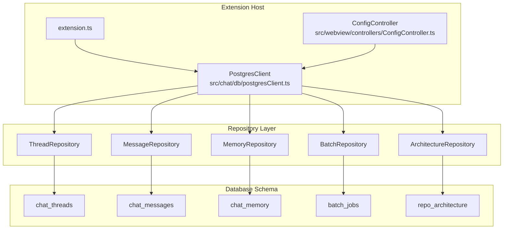
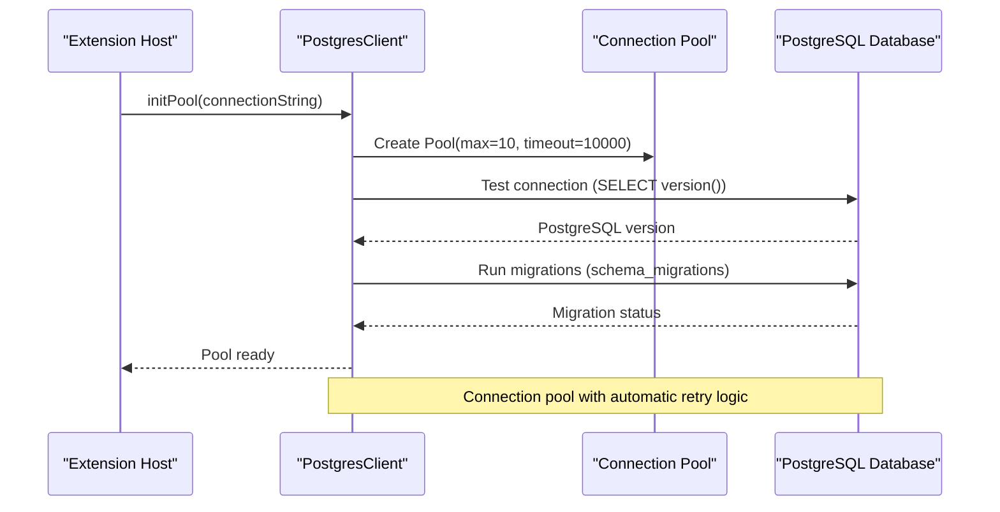
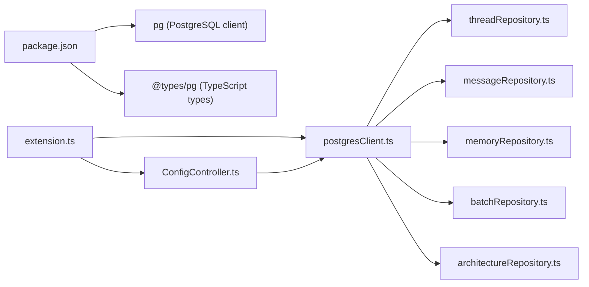

# Database Service

<cite>
**Referenced Files in This Document**
- [postgresClient.ts](file://src/chat/db/postgresClient.ts)
- [threadRepository.ts](file://src/chat/db/threadRepository.ts)
- [messageRepository.ts](file://src/chat/db/messageRepository.ts)
- [memoryRepository.ts](file://src/chat/db/memoryRepository.ts)
- [batchRepository.ts](file://src/chat/db/batchRepository.ts)
- [architectureRepository.ts](file://src/chat/db/architectureRepository.ts)
- [001_initial_schema.sql](file://src/chat/db/migrations/001_initial_schema.sql)
- [002_compression_schema.sql](file://src/chat/db/migrations/002_compression_schema.sql)
- [extension.ts](file://src/extension.ts)
- [ConfigController.ts](file://src/webview/controllers/ConfigController.ts)
- [ChatController.ts](file://src/webview/controllers/ChatController.ts)
- [001_postgresql_chat_storage.md](file://PRDs/001_postgresql_chat_storage.md)
</cite>

## Update Summary
**Changes Made**
- Complete replacement of SQLite-based storage with PostgreSQL-backed chat storage system
- Implementation of enterprise-grade database connections with connection pooling and proper cleanup procedures
- Integration of VS Code secrets for secure credential storage instead of plain text configuration
- Introduction of comprehensive migration procedures with version control and rollback support
- Addition of specialized repository classes for thread, message, memory, batch, and architecture operations
- Implementation of transaction management and error handling for database operations

## Table of Contents
1. [Introduction](#introduction)
2. [Project Structure](#project-structure)
3. [Core Components](#core-components)
4. [Architecture Overview](#architecture-overview)
5. [Detailed Component Analysis](#detailed-component-analysis)
6. [Dependency Analysis](#dependency-analysis)
7. [Performance Considerations](#performance-considerations)
8. [Troubleshooting Guide](#troubleshooting-guide)
9. [Conclusion](#conclusion)

## Introduction
This document explains the Database Service implementation that provides PostgreSQL-backed chat storage for the VS Code extension. The system has been completely redesigned to replace the previous SQLite-based storage with a robust, enterprise-grade PostgreSQL solution. It integrates connection pooling, secure credential storage via VS Code secrets, comprehensive migration handling, and specialized repository classes for different data types. The service manages database initialization, connection lifecycle, transaction management, and provides CRUD operations for chat threads, messages, memory entries, batch jobs, and repository architecture data.

**Updated** Complete replacement of SQLite-based storage with PostgreSQL-backed system featuring enterprise-grade database connections, secure credential storage, and comprehensive migration procedures.

## Project Structure
The Database Service is organized around specialized repository classes that encapsulate database operations for different data types. The system is integrated into the extension lifecycle and uses VS Code secrets for secure credential storage.

**Diagram sources**
- [extension.ts](file://src/extension.ts#L79-L106)
- [postgresClient.ts](file://src/chat/db/postgresClient.ts#L282-L312)
- [threadRepository.ts](file://src/chat/db/threadRepository.ts#L46-L152)
- [messageRepository.ts](file://src/chat/db/messageRepository.ts#L82-L307)
- [memoryRepository.ts](file://src/chat/db/memoryRepository.ts#L41-L242)
- [batchRepository.ts](file://src/chat/db/batchRepository.ts#L45-L236)
- [architectureRepository.ts](file://src/chat/db/architectureRepository.ts#L26-L104)

**Section sources**
- [extension.ts](file://src/extension.ts#L79-L106)
- [postgresClient.ts](file://src/chat/db/postgresClient.ts#L282-L312)

## Core Components
- **PostgresClient**: Connection pool singleton that manages PostgreSQL connections, runs migrations, and provides query utilities with retry logic
- **ThreadRepository**: Handles CRUD operations for chat threads with proper validation and indexing
- **MessageRepository**: Manages message persistence with transaction support, pagination, and compression tracking
- **MemoryRepository**: Provides memory entry CRUD operations with scope-based organization and expiration handling
- **BatchRepository**: Manages batch job records for the HITL workflow with status tracking and metadata storage
- **ArchitectureRepository**: Handles repository architecture snapshots with upsert operations and expiration management
- **Migration System**: Version-controlled schema evolution with rollback support and verification utilities
- **VS Code Secrets Integration**: Secure credential storage using VS Code's secret storage API

Key responsibilities:
- Initialize PostgreSQL connection pool with configurable parameters (max connections, timeouts)
- Execute schema migrations automatically on first connection
- Provide transaction-safe CRUD operations through specialized repositories
- Implement retry logic for transient connection errors
- Manage database lifecycle with proper cleanup on extension deactivation
- Store connection credentials securely using VS Code secrets
- Support concurrent access through connection pooling

**Updated** Complete replacement with PostgreSQL backend featuring connection pooling, secure credential storage, and comprehensive migration system.

**Section sources**
- [postgresClient.ts](file://src/chat/db/postgresClient.ts#L282-L351)
- [threadRepository.ts](file://src/chat/db/threadRepository.ts#L46-L152)
- [messageRepository.ts](file://src/chat/db/messageRepository.ts#L82-L307)
- [memoryRepository.ts](file://src/chat/db/memoryRepository.ts#L41-L242)
- [batchRepository.ts](file://src/chat/db/batchRepository.ts#L45-L236)
- [architectureRepository.ts](file://src/chat/db/architectureRepository.ts#L26-L104)

## Architecture Overview
The Database Service uses a PostgreSQL connection pool to provide enterprise-grade database connectivity. The system initializes the pool on extension activation, runs automatic migrations, and provides specialized repositories for different data types. All database operations are transaction-safe and include proper error handling with retry logic.

**Diagram sources**
- [postgresClient.ts](file://src/chat/db/postgresClient.ts#L295-L312)
- [postgresClient.ts](file://src/chat/db/postgresClient.ts#L461-L485)

**Section sources**
- [postgresClient.ts](file://src/chat/db/postgresClient.ts#L295-L312)
- [postgresClient.ts](file://src/chat/db/postgresClient.ts#L461-L485)

## Detailed Component Analysis

### PostgresClient - Connection Pool Management
Responsibilities:
- **Connection Pool Initialization**: Creates a PostgreSQL connection pool with configurable parameters including max connections (10), idle timeout (30000ms), and connection timeout (10000ms)
- **Automatic Migration**: Runs schema migrations on first connection, checking for existing tables and applying necessary changes
- **Retry Logic**: Implements retry mechanism for transient connection errors with exponential backoff
- **Pool Management**: Provides getPool(), closePool(), and queryWithRetry() utilities for consistent database access
- **Verification**: Includes verifyMigration() and testConnection() methods for health checks and debugging

**Updated** Enterprise-grade connection pool with comprehensive error handling and automatic migration support.

Initialization flow:
- Validates connection string from VS Code secrets
- Creates Pool instance with security-conscious defaults
- Tests connection with SELECT version()
- Executes migration system to ensure schema consistency
- Registers error handlers for pool lifecycle management

**Section sources**
- [postgresClient.ts](file://src/chat/db/postgresClient.ts#L282-L351)
- [postgresClient.ts](file://src/chat/db/postgresClient.ts#L353-L368)
- [postgresClient.ts](file://src/chat/db/postgresClient.ts#L373-L459)

### ThreadRepository - Chat Thread Management
Responsibilities:
- **Thread Creation**: Creates new chat threads with validation for repo_id and title
- **Thread Retrieval**: Fetches threads by repository with proper ordering and status filtering
- **Thread Updates**: Supports partial updates to thread properties including title, preview, and metrics
- **Thread Lifecycle**: Handles archiving, deletion, and status management
- **Data Validation**: Implements input sanitization and length validation for thread properties

**Updated** Enhanced thread management with comprehensive validation and lifecycle operations.

**Section sources**
- [threadRepository.ts](file://src/chat/db/threadRepository.ts#L49-L151)

### MessageRepository - Message Persistence
Responsibilities:
- **Transactional Message Saving**: Ensures atomic operations combining message insertion and thread updates
- **Pagination Support**: Implements cursor-based pagination for efficient message loading
- **Compression Tracking**: Manages message compression state with metadata preservation
- **Summary Messages**: Handles system-generated summary messages for compressed content
- **Content Validation**: Validates message roles, content, and timestamp formats

**Updated** Advanced message management with transaction support and compression tracking.

**Section sources**
- [messageRepository.ts](file://src/chat/db/messageRepository.ts#L85-L145)
- [messageRepository.ts](file://src/chat/db/messageRepository.ts#L152-L199)
- [messageRepository.ts](file://src/chat/db/messageRepository.ts#L225-L290)

### MemoryRepository - Memory Entry Management
Responsibilities:
- **Scope-Based Organization**: Manages memory entries across session, repository, and global scopes
- **Expiration Handling**: Supports time-based expiration with automatic cleanup
- **Unique Constraints**: Enforces uniqueness per scope and key combination
- **Search Capabilities**: Provides keyword search across memory entries
- **Vector Support**: Includes optional embedding vector storage for semantic retrieval

**Updated** Comprehensive memory management with scope-based organization and expiration support.

**Section sources**
- [memoryRepository.ts](file://src/chat/db/memoryRepository.ts#L48-L86)
- [memoryRepository.ts](file://src/chat/db/memoryRepository.ts#L108-L126)
- [memoryRepository.ts](file://src/chat/db/memoryRepository.ts#L199-L241)

### BatchRepository - Batch Job Management
Responsibilities:
- **Job Lifecycle**: Manages batch job creation, status updates, and completion tracking
- **Package Types**: Supports different package types (plan, code_change, code_review)
- **Status Tracking**: Provides comprehensive status management from draft to completed/failed
- **Metadata Storage**: Handles complex payload storage with JSONB serialization
- **Polling Support**: Enables external polling for job status updates

**Updated** Enterprise batch job management with comprehensive status tracking and metadata support.

**Section sources**
- [batchRepository.ts](file://src/chat/db/batchRepository.ts#L51-L64)
- [batchRepository.ts](file://src/chat/db/batchRepository.ts#L103-L182)
- [batchRepository.ts](file://src/chat/db/batchRepository.ts#L187-L205)

### ArchitectureRepository - Repository Architecture Management
Responsibilities:
- **Upsert Operations**: Handles both creation and updates of architecture snapshots
- **Expiration Management**: Tracks generation and expiration timestamps
- **Git Integration**: Stores associated git commit information
- **Token Tracking**: Monitors token usage for cost management
- **Unique Constraints**: Ensures single architecture snapshot per repository

**Updated** Advanced architecture management with upsert operations and comprehensive metadata tracking.

**Section sources**
- [architectureRepository.ts](file://src/chat/db/architectureRepository.ts#L29-L60)
- [architectureRepository.ts](file://src/chat/db/architectureRepository.ts#L62-L94)

### Migration System - Schema Evolution
The migration system provides version-controlled schema evolution with rollback support:

**Migration Versions:**
- **001_initial_schema**: Creates core chat tables (threads, messages, memory, batch, architecture)
- **002_compression_schema**: Adds compression tracking columns to chat_messages table

**Migration Features:**
- **Version Tracking**: Uses schema_migrations table to track applied versions
- **Rollback Support**: Implements transaction-based migrations with ROLLBACK on errors
- **Idempotent Operations**: Ensures migrations can be safely re-applied
- **Verification**: Provides migration status verification and error reporting

**Updated** Comprehensive migration system with version control and rollback support.

**Section sources**
- [postgresClient.ts](file://src/chat/db/postgresClient.ts#L7-L15)
- [postgresClient.ts](file://src/chat/db/postgresClient.ts#L198-L280)
- [001_initial_schema.sql](file://src/chat/db/migrations/001_initial_schema.sql#L1-L87)
- [002_compression_schema.sql](file://src/chat/db/migrations/002_compression_schema.sql#L1-L21)

### Database Schema Design
The PostgreSQL schema provides comprehensive chat functionality with proper relationships and indexing:

**Core Tables:**
- **chat_threads**: Thread metadata with UUID primary key, repository association, and status tracking
- **chat_messages**: Message content with role-based validation, JSONB metadata, and compression tracking
- **chat_memory**: Scope-based memory entries with expiration and vector support
- **batch_jobs**: External job tracking with comprehensive status management
- **repo_architecture**: Repository structure snapshots with expiration

**Indexes and Constraints:**
- **chat_threads**: Composite index on (repo_id, updated_at DESC) for efficient querying
- **chat_messages**: Index on (thread_id, timestamp) and compression tracking indexes
- **chat_memory**: Unique constraint on (scope, scope_id, key) with scope_id index
- **batch_jobs**: Indexes on thread_id and status for filtering

**Foreign Key Relationships:**
- chat_messages.thread_id references chat_threads.id with ON DELETE CASCADE
- batch_jobs.thread_id references chat_threads.id

**Updated** Enterprise-grade schema design with proper relationships, constraints, and performance optimizations.

**Section sources**
- [001_initial_schema.sql](file://src/chat/db/migrations/001_initial_schema.sql#L5-L86)
- [postgresClient.ts](file://src/chat/db/postgresClient.ts#L18-L113)

### Integration with Extension Lifecycle
The PostgreSQL system integrates seamlessly with the extension lifecycle:

**Activation Process:**
- Reads connection string from VS Code secrets using SECRET_POSTGRES_CONNECTION
- Initializes connection pool with error handling and user notifications
- Sets up cleanup hooks for proper pool termination
- Configures batch poller for background job monitoring

**Security Integration:**
- Uses VS Code secrets API for secure credential storage
- Provides connection testing and verification utilities
- Handles configuration changes dynamically

**Updated** Seamless integration with extension lifecycle and secure credential management.

**Section sources**
- [extension.ts](file://src/extension.ts#L79-L106)
- [extension.ts](file://src/extension.ts#L108-L115)
- [ConfigController.ts](file://src/webview/controllers/ConfigController.ts)

## Dependency Analysis
External dependencies:
- **pg**: PostgreSQL client library for Node.js with connection pooling and transaction support
- **@types/pg**: TypeScript definitions for PostgreSQL client
- **VS Code Secrets API**: Secure credential storage integration

Internal dependencies:
- **Repository classes**: Specialized classes for different data types (threads, messages, memory, batch, architecture)
- **Migration system**: Version-controlled schema evolution
- **Extension lifecycle**: Integration with extension activation and deactivation
- **ChatController**: High-level interface for chat functionality

**Updated** New dependency on PostgreSQL client with secure credential storage integration.

**Diagram sources**
- [extension.ts](file://src/extension.ts#L79-L81)
- [postgresClient.ts](file://src/chat/db/postgresClient.ts#L1-L2)
- [threadRepository.ts](file://src/chat/db/threadRepository.ts#L1-L2)
- [messageRepository.ts](file://src/chat/db/messageRepository.ts#L1-L2)
- [memoryRepository.ts](file://src/chat/db/memoryRepository.ts#L1-L3)
- [batchRepository.ts](file://src/chat/db/batchRepository.ts#L1-L2)
- [architectureRepository.ts](file://src/chat/db/architectureRepository.ts#L1-L2)

**Section sources**
- [extension.ts](file://src/extension.ts#L79-L81)
- [postgresClient.ts](file://src/chat/db/postgresClient.ts#L1-L2)

## Performance Considerations
- **Connection Pooling**: Maximum 10 concurrent connections with 30-second idle timeout and 10-second connection timeout
- **Index Optimization**: Strategic indexing on frequently queried columns (repo_id, thread_id, status, timestamps)
- **Transaction Efficiency**: Batch operations wrapped in transactions to minimize database round trips
- **Pagination**: Cursor-based pagination prevents memory issues with large message histories
- **Compression Support**: Built-in compression tracking reduces storage requirements for long conversations
- **Async Operations**: Non-blocking operations with proper error handling and retry logic

**Updated** Enterprise-grade performance optimizations with connection pooling and strategic indexing.

## Troubleshooting Guide
Common issues and resolutions:

**Connection Issues:**
- **Connection string not configured**: Extension shows warning and disables chat features
- **Invalid connection string**: Error notification with option to open settings
- **Network connectivity**: Retry logic handles transient connection failures automatically

**Migration Problems:**
- **Migration failures**: Automatic rollback with detailed error logging
- **Schema conflicts**: Verification utilities help diagnose migration issues
- **Permission errors**: Ensure database user has CREATE TABLE and INSERT permissions

**Performance Issues:**
- **Slow queries**: Check index utilization and query patterns
- **Connection exhaustion**: Monitor pool usage and adjust max connections
- **Large message loads**: Use pagination and cursor-based navigation

**Data Integrity:**
- **Transaction failures**: Automatic rollback preserves data consistency
- **Duplicate entries**: Unique constraints prevent data duplication
- **Expired data**: Automatic cleanup of expired memory entries

**Updated** Comprehensive troubleshooting for PostgreSQL-specific issues and migration problems.

**Section sources**
- [extension.ts](file://src/extension.ts#L83-L106)
- [postgresClient.ts](file://src/chat/db/postgresClient.ts#L314-L333)
- [postgresClient.ts](file://src/chat/db/postgresClient.ts#L461-L485)

## Conclusion
The Database Service has been completely transformed from an SQLite-based embedded solution to a robust PostgreSQL-backed system designed for enterprise-scale chat functionality. The new implementation provides secure credential storage via VS Code secrets, comprehensive connection pooling with automatic retry logic, and sophisticated migration management with version control. Specialized repository classes encapsulate domain-specific operations while maintaining transaction safety and data integrity. The system supports advanced features like compression tracking, semantic memory, and batch job management while providing excellent performance through strategic indexing and connection pooling. This foundation enables scalable chat functionality that can grow with user needs and organizational requirements.

**Updated** Enhanced conclusion reflecting the complete transformation to PostgreSQL backend with enterprise-grade features and comprehensive migration support.