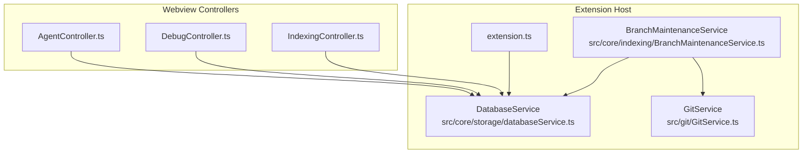
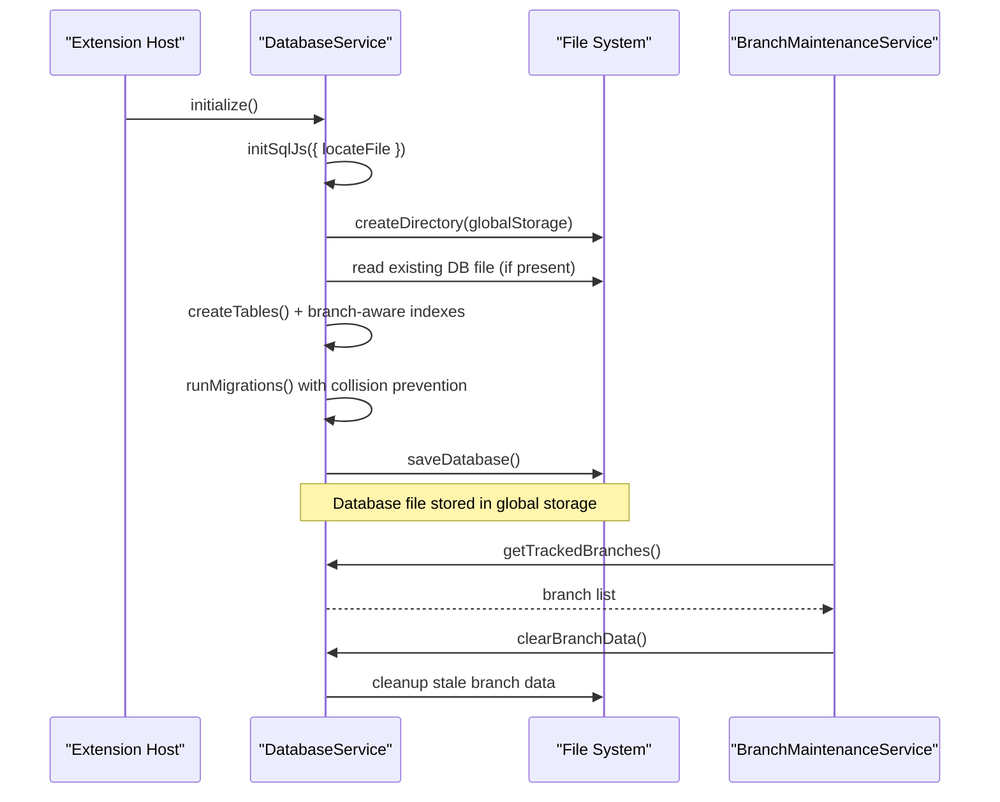
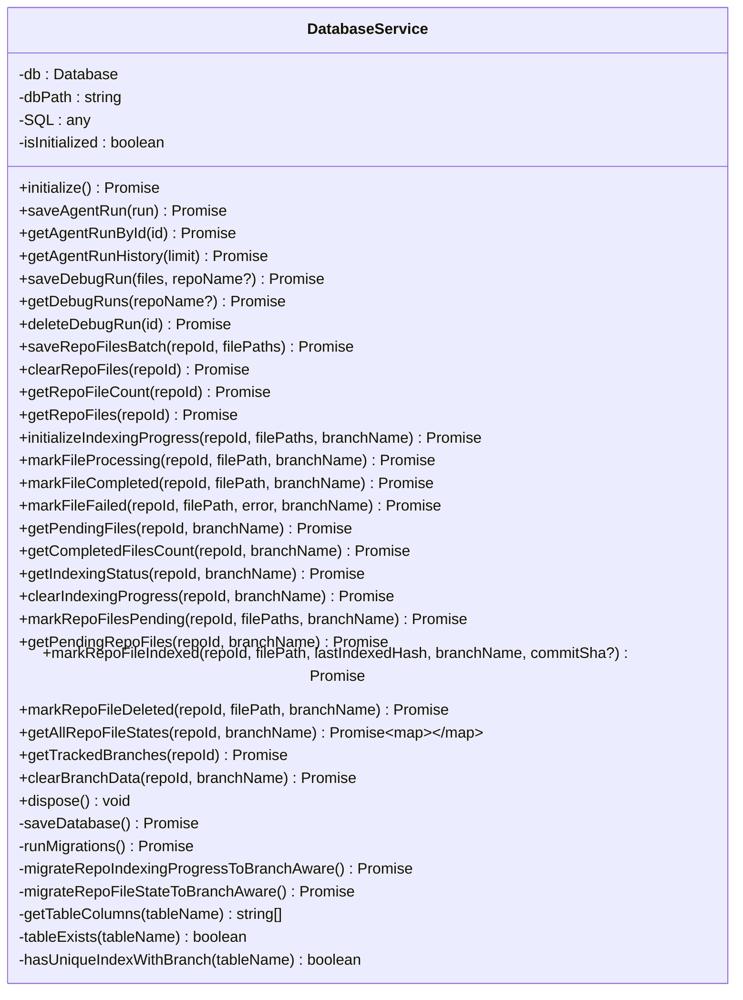
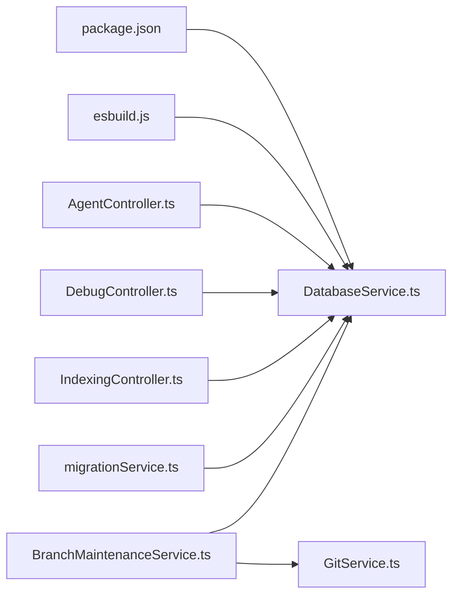

# Database Service

<cite>
**Referenced Files in This Document**
- [databaseService.ts](file://src/core/storage/databaseService.ts)
- [extension.ts](file://src/extension.ts)
- [AgentController.ts](file://src/webview/controllers/AgentController.ts)
- [DebugController.ts](file://src/webview/controllers/DebugController.ts)
- [IndexingController.ts](file://src/webview/controllers/IndexingController.ts)
- [migrationService.ts](file://src/core/indexing/migrationService.ts)
- [BranchMaintenanceService.ts](file://src/core/indexing/BranchMaintenanceService.ts)
- [GitService.ts](file://src/git/GitService.ts)
- [esbuild.js](file://esbuild.js)
- [package.json](file://package.json)
</cite>

## Update Summary
**Changes Made**
- Enhanced migration collision prevention with timestamped legacy table naming
- Improved backward compatibility with schema-aware branch detection system
- Added comprehensive branch management capabilities with `getTrackedBranches()` and `clearBranchData()`
- Enhanced database reliability with better error handling and transaction management
- Updated schema design to support branch-aware indexing and file state tracking

## Table of Contents
1. [Introduction](#introduction)
2. [Project Structure](#project-structure)
3. [Core Components](#core-components)
4. [Architecture Overview](#architecture-overview)
5. [Detailed Component Analysis](#detailed-component-analysis)
6. [Dependency Analysis](#dependency-analysis)
7. [Performance Considerations](#performance-considerations)
8. [Troubleshooting Guide](#troubleshooting-guide)
9. [Conclusion](#conclusion)

## Introduction
This document explains the Database Service implementation that powers persistent storage for the VS Code extension. It integrates sql.js to provide SQLite-like functionality in the extension host, enabling robust local data persistence for agent runs, debug runs, repository file tracking, and indexing progress. The service manages initialization, connection lifecycle, transactions, batch operations, schema design, migrations, and persistence to disk. It also documents usage patterns across controllers and provides guidance for maintenance, backups, and recovery.

**Updated** Enhanced with improved migration collision prevention, timestamped legacy table naming, better backward compatibility, and enhanced schema-aware branch detection system for improved database reliability.

## Project Structure
The Database Service resides under the core storage module and is wired into the extension lifecycle. Controllers consume the service to persist and retrieve data for UI surfaces.

**Diagram sources**
- [extension.ts](file://src/extension.ts#L45-L73)
- [databaseService.ts](file://src/core/storage/databaseService.ts#L27-L71)
- [BranchMaintenanceService.ts](file://src/core/indexing/BranchMaintenanceService.ts#L1-L33)
- [GitService.ts](file://src/git/GitService.ts#L1-L138)
- [AgentController.ts](file://src/webview/controllers/AgentController.ts#L11-L18)
- [DebugController.ts](file://src/webview/controllers/DebugController.ts#L16-L22)
- [IndexingController.ts](file://src/webview/controllers/IndexingController.ts#L79-L87)

**Section sources**
- [extension.ts](file://src/extension.ts#L45-L73)
- [databaseService.ts](file://src/core/storage/databaseService.ts#L27-L71)

## Core Components
- DatabaseService: Central class managing sql.js initialization, schema creation, CRUD operations, transactions, and persistence.
- Controllers: AgentController, DebugController, and IndexingController depend on DatabaseService for data persistence and retrieval.
- BranchMaintenanceService: Manages cleanup of stale branches and maintains vector database consistency.
- GitService: Provides branch detection and repository information for schema-aware operations.
- Build pipeline: esbuild copies sql-wasm assets to ensure runtime availability.

Key responsibilities:
- Initialize sql.js with locateFile resolution for sql-wasm.wasm.
- Create tables and indexes on first run with enhanced branch-aware schema.
- Provide CRUD APIs for agent runs, debug runs, repository files, and indexing progress.
- Support batch inserts and transactions for reliability with improved error handling.
- Persist database to a file in global storage and restore on startup.
- Run lightweight migrations for backward compatibility with collision prevention.
- Manage branch-aware indexing with comprehensive branch detection and cleanup capabilities.

**Updated** Enhanced with branch-aware schema design, improved migration collision prevention, and comprehensive branch management functionality.

**Section sources**
- [databaseService.ts](file://src/core/storage/databaseService.ts#L27-L151)
- [BranchMaintenanceService.ts](file://src/core/indexing/BranchMaintenanceService.ts#L1-L33)
- [GitService.ts](file://src/git/GitService.ts#L1-L138)
- [AgentController.ts](file://src/webview/controllers/AgentController.ts#L180-L188)
- [DebugController.ts](file://src/webview/controllers/DebugController.ts#L49-L60)
- [IndexingController.ts](file://src/webview/controllers/IndexingController.ts#L524-L543)
- [esbuild.js](file://esbuild.js#L41-L71)

## Architecture Overview
The Database Service uses sql.js to emulate SQLite in-process. It initializes the engine, creates tables and indexes, and persists the in-memory database to disk. Controllers call into the service to store and retrieve data. The service now includes enhanced branch-aware functionality for multi-branch repository indexing.

**Diagram sources**
- [databaseService.ts](file://src/core/storage/databaseService.ts#L40-L71)
- [databaseService.ts](file://src/core/storage/databaseService.ts#L73-L151)
- [databaseService.ts](file://src/core/storage/databaseService.ts#L433-L439)
- [BranchMaintenanceService.ts](file://src/core/indexing/BranchMaintenanceService.ts#L12-L32)

**Section sources**
- [databaseService.ts](file://src/core/storage/databaseService.ts#L40-L71)
- [databaseService.ts](file://src/core/storage/databaseService.ts#L73-L151)
- [databaseService.ts](file://src/core/storage/databaseService.ts#L433-L439)

## Detailed Component Analysis

### DatabaseService Class
Responsibilities:
- Engine initialization with locateFile resolution for sql-wasm.wasm.
- Table creation and index creation with enhanced branch-aware schema design.
- CRUD for agent runs and debug runs.
- Repository file tracking with batch operations.
- Indexing progress tracking and incremental state management with branch awareness.
- Transactions for batch writes and atomicity with improved error handling.
- Persistence to a SQLite-compatible file in global storage.
- Lightweight migration handling for schema evolution with collision prevention.
- Comprehensive branch management with detection and cleanup capabilities.

**Updated** Enhanced with branch-aware schema design, improved migration collision prevention, and comprehensive branch management functionality.

Initialization flow:
- Creates global storage directory.
- Attempts to load an existing database file; falls back to a new in-memory database on failure.
- Builds schema and indexes with branch-aware unique constraints, runs migrations with timestamped legacy table naming, then persists.

Persistence pattern:
- Exports the in-memory database to a buffer and writes to the database file path.
- Reads the file back on subsequent starts.

Transactions:
- Uses BEGIN/COMMIT/ROLLBACK around batch operations to maintain consistency.
- Applies UPSERT semantics for incremental state using ON CONFLICT clauses.
- Implements improved error handling with automatic rollback on exceptions.

Indexes:
- Timestamp-based indexes for efficient queries.
- Composite indexes for frequent filter patterns including branch-aware unique constraints.
- Enhanced indexing for branch detection and cleanup operations.

Migrations:
- Checks for presence of optional columns and adds them if missing.
- Uses timestamped legacy table naming to prevent migration collisions.
- Implements comprehensive branch-aware migration with schema detection and fallback mechanisms.

**Updated** Enhanced migration system with timestamped legacy table naming and improved backward compatibility.

**Section sources**
- [databaseService.ts](file://src/core/storage/databaseService.ts#L27-L71)
- [databaseService.ts](file://src/core/storage/databaseService.ts#L73-L151)
- [databaseService.ts](file://src/core/storage/databaseService.ts#L153-L175)
- [databaseService.ts](file://src/core/storage/databaseService.ts#L376-L428)
- [databaseService.ts](file://src/core/storage/databaseService.ts#L430-L500)
- [databaseService.ts](file://src/core/storage/databaseService.ts#L433-L439)

#### Class Diagram

**Diagram sources**
- [databaseService.ts](file://src/core/storage/databaseService.ts#L27-L1865)

### CRUD Operations

- Agent Runs
  - Save: Inserts a structured record with JSON-serialized file list and metadata.
  - Retrieve by ID: Loads and parses the stored file list.
  - History: Paginates recent runs by timestamp.

- Debug Runs
  - Save: Inserts a new debug run with timestamp, JSON-serialized files, and optional repository name.
  - List: Optionally filters by repository name and limits results.
  - Delete: Removes a specific run.

- Repository Files
  - Batch insert: Efficiently inserts many file paths within a transaction.
  - Count and list: Aggregates tracked files per repository.
  - Clear: Removes all tracked files for a repository.

- Indexing Progress Tracking
  - Initialize progress: Resets and seeds progress for all files as pending with branch awareness.
  - Update states: Marks files as processing/completed/failed with timestamps and branch context.
  - Query counts and summaries: Computes pending/completed/failed counts per branch.
  - Cleanup: Clears progress for a repository with branch-specific filtering.

- Incremental Indexing State
  - Pending: Marks files as pending with UPSERT semantics and branch-aware conflict resolution.
  - Indexed: Records successful indexing with content hash, commit SHA, and timestamps.
  - Deleted: Records deletions for cleanup and analytics with branch context.
  - Enumeration: Retrieves all states for synchronization with branch filtering.

**Updated** Enhanced with branch-aware operations and improved state management.

**Section sources**
- [databaseService.ts](file://src/core/storage/databaseService.ts#L177-L252)
- [databaseService.ts](file://src/core/storage/databaseService.ts#L254-L355)
- [databaseService.ts](file://src/core/storage/databaseService.ts#L357-L431)
- [databaseService.ts](file://src/core/storage/databaseService.ts#L447-L629)
- [databaseService.ts](file://src/core/storage/databaseService.ts#L666-L881)
- [databaseService.ts](file://src/core/storage/databaseService.ts#L1080-L1190)
- [databaseService.ts](file://src/core/storage/databaseService.ts#L1260-L1341)

### Transaction Management and Batch Operations
- Batch repository file insertion uses a transaction to ensure atomicity across many inserts.
- Indexing progress initialization wraps deletions and inserts in a transaction.
- Incremental state updates leverage UPSERT with ON CONFLICT to avoid separate reads/writes.
- Rollback is executed on exceptions to preserve consistency.
- Branch cleanup operations use transactions to ensure data integrity during cleanup.

**Updated** Enhanced with branch-aware transaction management for cleanup operations.

**Section sources**
- [databaseService.ts](file://src/core/storage/databaseService.ts#L362-L379)
- [databaseService.ts](file://src/core/storage/databaseService.ts#L452-L477)
- [databaseService.ts](file://src/core/storage/databaseService.ts#L680-L705)
- [databaseService.ts](file://src/core/storage/databaseService.ts#L1115-L1142)
- [databaseService.ts](file://src/core/storage/databaseService.ts#L1840-L1854)

### Data Persistence and Lifecycle
- Persistence: The database is exported to a buffer and written to a file in global storage.
- Restoration: On initialization, the service attempts to read an existing file; on failure, it falls back to a new in-memory database.
- Disposal: Saves and closes the database on shutdown.

**Section sources**
- [databaseService.ts](file://src/core/storage/databaseService.ts#L433-L439)
- [databaseService.ts](file://src/core/storage/databaseService.ts#L1856-L1863)

### Schema Design
Tables and indexes:
- agent_runs: Primary key id, timestamp, query, files (JSON), file_count, output_path, success flag, error, duration, bundle_id, query_id, created_at.
- debug_runs: Auto-increment id, timestamp, files (JSON), repo_name.
- repo_files: Auto-increment id, repo_id, file_path, created_at.
- repo_indexing_progress: Auto-increment id, repo_id, branch_name (NEW), file_path, status, timestamps, error_message, created_at; unique constraint on (repo_id, branch_name, file_path).
- repo_file_state: Composite primary key (repo_id, branch_name, file_path), status, last_indexed_hash, last_indexed_at, commit_sha (NEW), is_merged (NEW), last_synced_at (NEW), updated_at, error.
- index_history: Auto-increment id, timestamp, repo_id, file_path, event_type, status, details, created_at.
- repo_blueprints: Auto-increment id, repo_id (unique), package_info, config_files, directory_structure, architectural_patterns, development_guides, critical_file_hashes, last_git_commit, generated_at, expires_at, analysis_version, tokens_used, created_at.
- indexing_pause_checkpoint: Auto-increment id, repo_id (unique), paused_at, completed_count, total_count, created_at.

Indexes:
- Timestamp indexes for agent_runs and debug_runs.
- Repository name index for debug_runs.
- repo_id indexes for repo_files and repo_indexing_progress.
- Branch-aware composite index on repo_indexing_progress(repo_id, branch_name) and repo_file_state(repo_id, branch_name, status).
- Unique constraints on branch-aware composite keys for data integrity.
- Index history with timestamp and repo_id filtering.
- Repository blueprints with expiration and repo_id indexing.

**Updated** Enhanced schema with branch-aware tables and indexes for improved multi-branch repository support.

Foreign keys: None. The design relies on application-level integrity via unique constraints and composite primary keys.

**Section sources**
- [databaseService.ts](file://src/core/storage/databaseService.ts#L158-L293)

### Migration Handling
- Checks for optional columns and adds them if missing.
- Uses timestamped legacy table naming to prevent migration collisions (`repo_indexing_progress_legacy_${Date.now()}` and `repo_file_state_legacy_${Date.now()}`).
- Implements comprehensive branch-aware migration with schema detection and fallback mechanisms.
- Non-fatal migration errors are handled to preserve backward compatibility.
- Enhanced schema-aware branch detection system with improved fallback logic.

**Updated** Enhanced with timestamped legacy table naming and improved backward compatibility.

**Section sources**
- [databaseService.ts](file://src/core/storage/databaseService.ts#L295-L320)
- [databaseService.ts](file://src/core/storage/databaseService.ts#L376-L428)
- [databaseService.ts](file://src/core/storage/databaseService.ts#L430-L500)

### Branch Management System
- **getTrackedBranches()**: Detects all branches with tracked data using schema-aware detection with fallback mechanisms.
- **clearBranchData()**: Cleans up stale branch data with transactional safety.
- **Branch-aware operations**: All indexing and state operations now support branch-specific contexts.
- **Schema detection**: Automatically detects branch column presence and adapts behavior accordingly.

**New** Comprehensive branch management system for multi-branch repository support.

**Section sources**
- [databaseService.ts](file://src/core/storage/databaseService.ts#L1779-L1838)
- [databaseService.ts](file://src/core/storage/databaseService.ts#L1840-L1854)

### Integration Points
- Extension initialization: DatabaseService is constructed and initialized early in the extension lifecycle.
- Controllers: AgentController, DebugController, and IndexingController depend on DatabaseService for persistence and retrieval.
- MigrationService: Coordinates provider switching and clears local indexing state via DatabaseService.
- BranchMaintenanceService: Manages cleanup of stale branches and maintains vector database consistency.
- GitService: Provides branch detection and repository information for schema-aware operations.

**Updated** Enhanced integration with BranchMaintenanceService and GitService for comprehensive branch management.

**Section sources**
- [extension.ts](file://src/extension.ts#L45-L73)
- [AgentController.ts](file://src/webview/controllers/AgentController.ts#L180-L188)
- [DebugController.ts](file://src/webview/controllers/DebugController.ts#L49-L60)
- [IndexingController.ts](file://src/webview/controllers/IndexingController.ts#L524-L543)
- [migrationService.ts](file://src/core/indexing/migrationService.ts#L34-L46)
- [BranchMaintenanceService.ts](file://src/core/indexing/BranchMaintenanceService.ts#L12-L32)

## Dependency Analysis
External dependencies:
- sql.js: Provides SQLite engine in the browser/WASM context.
- Build tooling: esbuild copies sql-wasm.wasm to dist for runtime availability.

Internal dependencies:
- Controllers depend on DatabaseService for data operations.
- MigrationService depends on DatabaseService to reset local indexing state.
- BranchMaintenanceService depends on DatabaseService for branch cleanup operations.
- GitService provides branch detection for schema-aware operations.

**Updated** Enhanced with BranchMaintenanceService and GitService dependencies.

**Diagram sources**
- [package.json](file://package.json#L583-L602)
- [esbuild.js](file://esbuild.js#L41-L71)
- [databaseService.ts](file://src/core/storage/databaseService.ts#L1-L4)
- [AgentController.ts](file://src/webview/controllers/AgentController.ts#L4-L5)
- [DebugController.ts](file://src/webview/controllers/DebugController.ts#L4-L5)
- [IndexingController.ts](file://src/webview/controllers/IndexingController.ts#L79-L80)
- [migrationService.ts](file://src/core/indexing/migrationService.ts#L1-L2)
- [BranchMaintenanceService.ts](file://src/core/indexing/BranchMaintenanceService.ts#L1-L10)
- [GitService.ts](file://src/git/GitService.ts#L1-L6)

**Section sources**
- [package.json](file://package.json#L583-L602)
- [esbuild.js](file://esbuild.js#L41-L71)
- [databaseService.ts](file://src/core/storage/databaseService.ts#L1-L4)

## Performance Considerations
- Use transactions for batch operations to minimize disk writes and improve throughput.
- Prefer UPSERT with ON CONFLICT for idempotent state updates to avoid extra SELECT statements.
- Leverage indexes on frequently filtered columns (timestamps, repo_id, status, branch_name).
- Limit result sets with pagination (e.g., history limit) to control memory usage.
- Export and persist the database after significant write bursts to reduce fragmentation and improve durability.
- Use branch-aware queries to optimize performance for multi-branch repositories.
- Implement cleanup operations to prevent database bloat from stale branch data.

**Updated** Enhanced with branch-aware performance considerations and cleanup recommendations.

## Troubleshooting Guide
Common issues and resolutions:
- Database file corruption or load failures
  - Cause: Corrupted or incompatible database file.
  - Resolution: Delete the database file from global storage; the service will recreate tables and indexes on next start.
  - Location: The database file path is derived from the extension's global storage URI and named consistently.

- Missing sql-wasm.wasm at runtime
  - Cause: Asset not bundled/copied during build.
  - Resolution: Ensure esbuild copies sql-wasm.wasm to dist; verify the asset exists in the built output.

- Migration errors with collision prevention
  - Behavior: Non-fatal; the service uses timestamped legacy table naming to prevent collisions.
  - Action: Verify schema changes; if unexpected, clear the database file to regenerate schema.

- Transaction failures with branch cleanup
  - Behavior: Automatic rollback on exceptions during branch cleanup operations.
  - Action: Wrap critical sequences in try/catch and inspect logs; ensure branch cleanup operations are transactional.

- Large repository indexing with branch awareness
  - Symptom: Slow progress or memory pressure with multi-branch repositories.
  - Action: Use batched operations and periodic saves; monitor pending/completed counts per branch; implement branch cleanup for stale branches.

- Branch detection issues
  - Symptom: Incorrect branch tracking or cleanup failures.
  - Action: Verify GitService integration; check branch-aware queries; ensure proper branch naming conventions.

**Updated** Enhanced with branch-aware troubleshooting scenarios and collision prevention guidance.

**Section sources**
- [databaseService.ts](file://src/core/storage/databaseService.ts#L59-L67)
- [databaseService.ts](file://src/core/storage/databaseService.ts#L295-L320)
- [databaseService.ts](file://src/core/storage/databaseService.ts#L376-L428)
- [databaseService.ts](file://src/core/storage/databaseService.ts#L430-L500)
- [databaseService.ts](file://src/core/storage/databaseService.ts#L1779-L1838)
- [esbuild.js](file://esbuild.js#L41-L71)

## Conclusion
The Database Service provides a robust, embedded persistence layer powered by sql.js with enhanced branch-aware capabilities. It supports the extension's core workflows—agent runs, debug runs, repository file tracking, and indexing progress—through a well-designed schema, careful transaction management, and pragmatic migrations with collision prevention. The enhanced branch management system enables reliable multi-branch repository support with comprehensive cleanup and detection capabilities. Its integration with controllers and specialized services enables a responsive UI while maintaining data integrity, performance, and backward compatibility across schema evolution.

**Updated** Enhanced conclusion reflecting improved database reliability, branch-aware functionality, and comprehensive migration collision prevention.