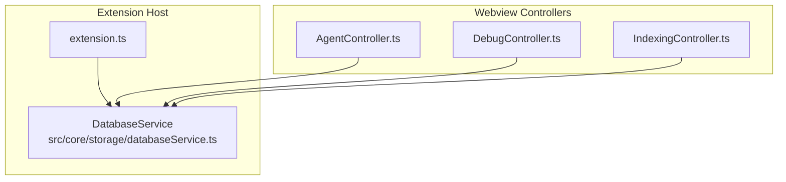
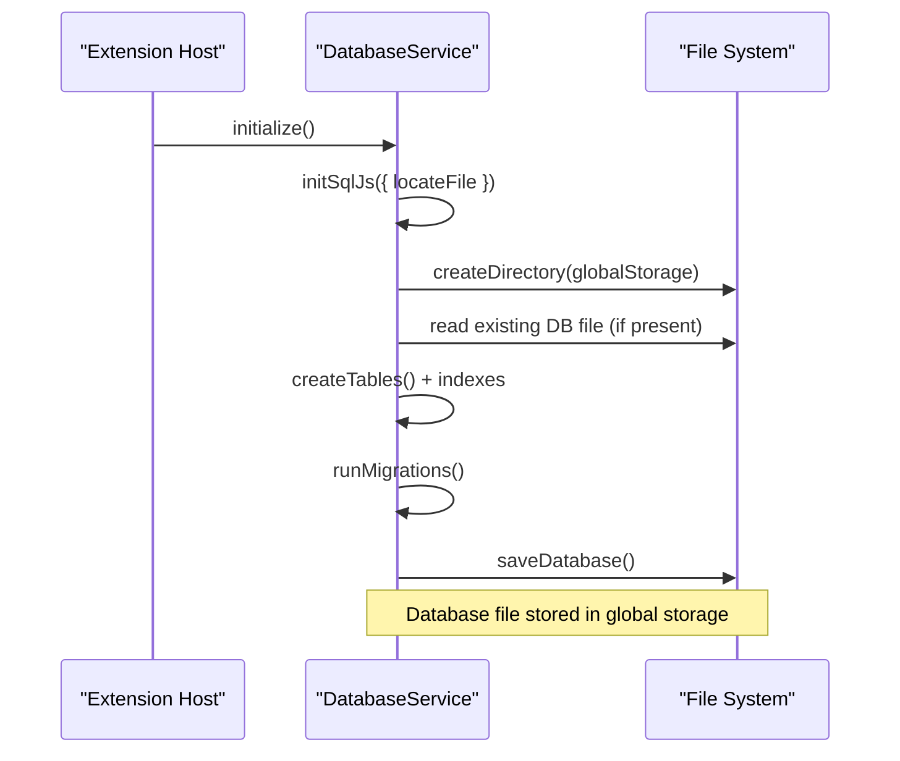
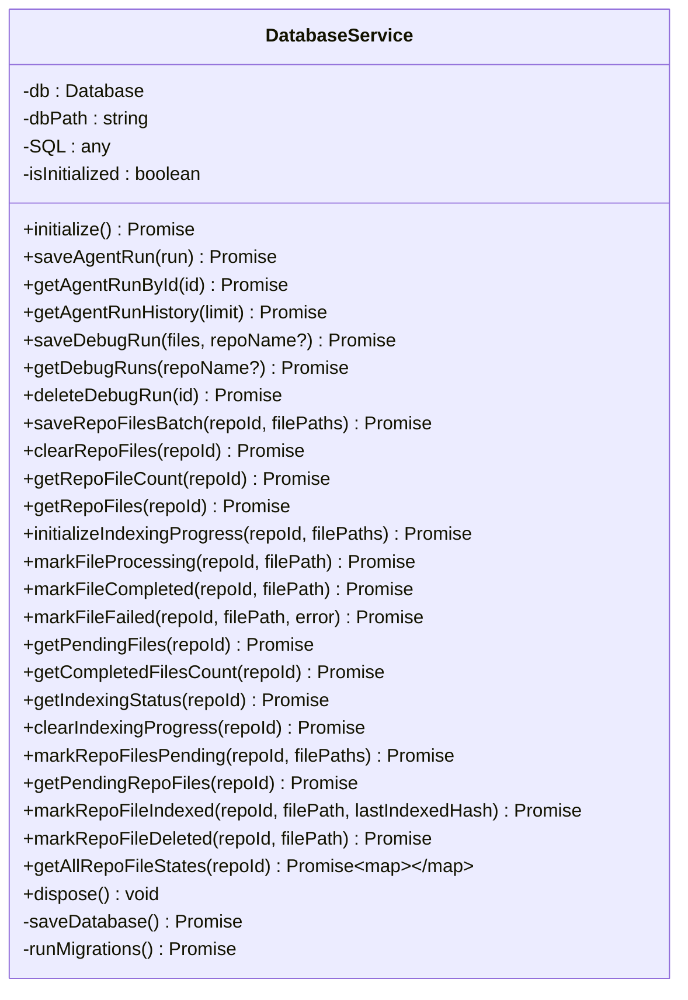
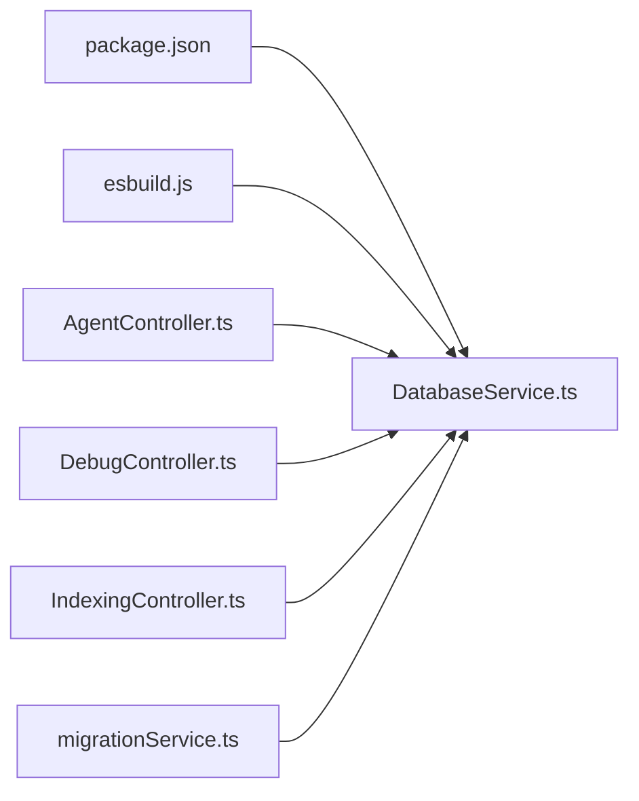

# Database Service

<cite>
**Referenced Files in This Document**
- [databaseService.ts](file://src/core/storage/databaseService.ts)
- [extension.ts](file://src/extension.ts)
- [AgentController.ts](file://src/webview/controllers/AgentController.ts)
- [DebugController.ts](file://src/webview/controllers/DebugController.ts)
- [IndexingController.ts](file://src/webview/controllers/IndexingController.ts)
- [migrationService.ts](file://src/core/indexing/migrationService.ts)
- [esbuild.js](file://esbuild.js)
- [package.json](file://package.json)
</cite>

## Table of Contents
1. [Introduction](#introduction)
2. [Project Structure](#project-structure)
3. [Core Components](#core-components)
4. [Architecture Overview](#architecture-overview)
5. [Detailed Component Analysis](#detailed-component-analysis)
6. [Dependency Analysis](#dependency-analysis)
7. [Performance Considerations](#performance-considerations)
8. [Troubleshooting Guide](#troubleshooting-guide)
9. [Conclusion](#conclusion)

## Introduction
This document explains the Database Service implementation that powers persistent storage for the VS Code extension. It integrates sql.js to provide SQLite-like functionality in the extension host, enabling robust local data persistence for agent runs, debug runs, repository file tracking, and indexing progress. The service manages initialization, connection lifecycle, transactions, batch operations, schema design, migrations, and persistence to disk. It also documents usage patterns across controllers and provides guidance for maintenance, backups, and recovery.

## Project Structure
The Database Service resides under the core storage module and is wired into the extension lifecycle. Controllers consume the service to persist and retrieve data for UI surfaces.

**Diagram sources**
- [extension.ts](file://src/extension.ts#L45-L73)
- [databaseService.ts](file://src/core/storage/databaseService.ts#L27-L71)
- [AgentController.ts](file://src/webview/controllers/AgentController.ts#L11-L18)
- [DebugController.ts](file://src/webview/controllers/DebugController.ts#L16-L22)
- [IndexingController.ts](file://src/webview/controllers/IndexingController.ts#L79-L87)

**Section sources**
- [extension.ts](file://src/extension.ts#L45-L73)
- [databaseService.ts](file://src/core/storage/databaseService.ts#L27-L71)

## Core Components
- DatabaseService: Central class managing sql.js initialization, schema creation, CRUD operations, transactions, and persistence.
- Controllers: AgentController, DebugController, and IndexingController depend on DatabaseService for data persistence and retrieval.
- Build pipeline: esbuild copies sql-wasm assets to ensure runtime availability.

Key responsibilities:
- Initialize sql.js with locateFile resolution for sql-wasm.wasm.
- Create tables and indexes on first run.
- Provide CRUD APIs for agent runs, debug runs, repository files, and indexing progress.
- Support batch inserts and transactions for reliability.
- Persist database to a file in global storage and restore on startup.
- Run lightweight migrations for backward compatibility.

**Section sources**
- [databaseService.ts](file://src/core/storage/databaseService.ts#L27-L151)
- [AgentController.ts](file://src/webview/controllers/AgentController.ts#L180-L188)
- [DebugController.ts](file://src/webview/controllers/DebugController.ts#L49-L60)
- [IndexingController.ts](file://src/webview/controllers/IndexingController.ts#L524-L543)
- [esbuild.js](file://esbuild.js#L41-L71)

## Architecture Overview
The Database Service uses sql.js to emulate SQLite in-process. It initializes the engine, creates tables and indexes, and persists the in-memory database to disk. Controllers call into the service to store and retrieve data.

**Diagram sources**
- [databaseService.ts](file://src/core/storage/databaseService.ts#L40-L71)
- [databaseService.ts](file://src/core/storage/databaseService.ts#L73-L151)
- [databaseService.ts](file://src/core/storage/databaseService.ts#L433-L439)

**Section sources**
- [databaseService.ts](file://src/core/storage/databaseService.ts#L40-L71)
- [databaseService.ts](file://src/core/storage/databaseService.ts#L73-L151)
- [databaseService.ts](file://src/core/storage/databaseService.ts#L433-L439)

## Detailed Component Analysis

### DatabaseService Class
Responsibilities:
- Engine initialization with locateFile resolution for sql-wasm.wasm.
- Table creation and index creation.
- CRUD for agent runs and debug runs.
- Repository file tracking with batch operations.
- Indexing progress tracking and incremental state management.
- Transactions for batch writes and atomicity.
- Persistence to a SQLite-compatible file in global storage.
- Lightweight migration handling for schema evolution.

Initialization flow:
- Creates global storage directory.
- Attempts to load an existing database file; falls back to a new in-memory database on failure.
- Builds schema and indexes, runs migrations, then persists.

Persistence pattern:
- Exports the in-memory database to a buffer and writes to the database file path.
- Reads the file back on subsequent starts.

Transactions:
- Uses BEGIN/COMMIT/ROLLBACK around batch operations to maintain consistency.
- Applies UPSERT semantics for incremental state using ON CONFLICT clauses.

Indexes:
- Timestamp-based indexes for efficient queries.
- Composite indexes for frequent filter patterns.

Migrations:
- Checks for presence of optional columns and adds them if missing.

**Section sources**
- [databaseService.ts](file://src/core/storage/databaseService.ts#L27-L71)
- [databaseService.ts](file://src/core/storage/databaseService.ts#L73-L151)
- [databaseService.ts](file://src/core/storage/databaseService.ts#L153-L175)
- [databaseService.ts](file://src/core/storage/databaseService.ts#L433-L439)

#### Class Diagram

**Diagram sources**
- [databaseService.ts](file://src/core/storage/databaseService.ts#L27-L892)

### CRUD Operations

- Agent Runs
  - Save: Inserts a structured record with JSON-serialized file list and metadata.
  - Retrieve by ID: Loads and parses the stored file list.
  - History: Paginates recent runs by timestamp.

- Debug Runs
  - Save: Inserts a new debug run with timestamp, JSON-serialized files, and optional repository name.
  - List: Optionally filters by repository name and limits results.
  - Delete: Removes a specific run.

- Repository Files
  - Batch insert: Efficiently inserts many file paths within a transaction.
  - Count and list: Aggregates tracked files per repository.
  - Clear: Removes all tracked files for a repository.

- Indexing Progress Tracking
  - Initialize progress: Resets and seeds progress for all files as pending.
  - Update states: Marks files as processing/completed/failed with timestamps.
  - Query counts and summaries: Computes pending/completed/failed counts.
  - Cleanup: Clears progress for a repository.

- Incremental Indexing State
  - Pending: Marks files as pending with UPSERT semantics.
  - Indexed: Records successful indexing with content hash and timestamps.
  - Deleted: Records deletions for cleanup and analytics.
  - Enumeration: Retrieves all states for synchronization.

**Section sources**
- [databaseService.ts](file://src/core/storage/databaseService.ts#L177-L252)
- [databaseService.ts](file://src/core/storage/databaseService.ts#L254-L355)
- [databaseService.ts](file://src/core/storage/databaseService.ts#L357-L431)
- [databaseService.ts](file://src/core/storage/databaseService.ts#L447-L629)
- [databaseService.ts](file://src/core/storage/databaseService.ts#L666-L881)

### Transaction Management and Batch Operations
- Batch repository file insertion uses a transaction to ensure atomicity across many inserts.
- Indexing progress initialization wraps deletions and inserts in a transaction.
- Incremental state updates leverage UPSERT with ON CONFLICT to avoid separate reads/writes.
- Rollback is executed on exceptions to preserve consistency.

**Section sources**
- [databaseService.ts](file://src/core/storage/databaseService.ts#L362-L379)
- [databaseService.ts](file://src/core/storage/databaseService.ts#L452-L477)
- [databaseService.ts](file://src/core/storage/databaseService.ts#L680-L705)

### Data Persistence and Lifecycle
- Persistence: The database is exported to a buffer and written to a file in global storage.
- Restoration: On initialization, the service attempts to read an existing file; on failure, it falls back to a new in-memory database.
- Disposal: Saves and closes the database on shutdown.

**Section sources**
- [databaseService.ts](file://src/core/storage/databaseService.ts#L433-L439)
- [databaseService.ts](file://src/core/storage/databaseService.ts#L883-L890)

### Schema Design
Tables and indexes:
- agent_runs: Primary key id, timestamp, query, files (JSON), file_count, output_path, success flag, error, duration, bundle_id, query_id, created_at.
- debug_runs: Auto-increment id, timestamp, files (JSON), repo_name.
- repo_files: Auto-increment id, repo_id, file_path, created_at.
- repo_indexing_progress: Auto-increment id, repo_id, file_path, status, timestamps, error_message, created_at; unique constraint on (repo_id, file_path).
- repo_file_state: Composite primary key (repo_id, file_path), status, last_indexed_hash, last_indexed_at, updated_at, error.

Indexes:
- Timestamp indexes for agent_runs and debug_runs.
- Repository name index for debug_runs.
- repo_id indexes for repo_files and repo_indexing_progress.
- Composite index on repo_file_state(repo_id, status).

Foreign keys: None. The design relies on application-level integrity via unique constraints and composite primary keys.

**Section sources**
- [databaseService.ts](file://src/core/storage/databaseService.ts#L76-L146)

### Migration Handling
- Checks for optional columns and adds them if missing.
- Non-fatal migration errors are handled to preserve backward compatibility.

**Section sources**
- [databaseService.ts](file://src/core/storage/databaseService.ts#L153-L175)

### Integration Points
- Extension initialization: DatabaseService is constructed and initialized early in the extension lifecycle.
- Controllers: AgentController, DebugController, and IndexingController depend on DatabaseService for persistence and retrieval.
- MigrationService: Coordinates provider switching and clears local indexing state via DatabaseService.

**Section sources**
- [extension.ts](file://src/extension.ts#L45-L73)
- [AgentController.ts](file://src/webview/controllers/AgentController.ts#L180-L188)
- [DebugController.ts](file://src/webview/controllers/DebugController.ts#L49-L60)
- [IndexingController.ts](file://src/webview/controllers/IndexingController.ts#L524-L543)
- [migrationService.ts](file://src/core/indexing/migrationService.ts#L34-L46)

## Dependency Analysis
External dependencies:
- sql.js: Provides SQLite engine in the browser/WASM context.
- Build tooling: esbuild copies sql-wasm.wasm to dist for runtime availability.

Internal dependencies:
- Controllers depend on DatabaseService for data operations.
- MigrationService depends on DatabaseService to reset local indexing state.

**Diagram sources**
- [package.json](file://package.json#L583-L602)
- [esbuild.js](file://esbuild.js#L41-L71)
- [databaseService.ts](file://src/core/storage/databaseService.ts#L1-L4)
- [AgentController.ts](file://src/webview/controllers/AgentController.ts#L4-L5)
- [DebugController.ts](file://src/webview/controllers/DebugController.ts#L4-L5)
- [IndexingController.ts](file://src/webview/controllers/IndexingController.ts#L79-L80)
- [migrationService.ts](file://src/core/indexing/migrationService.ts#L1-L2)

**Section sources**
- [package.json](file://package.json#L583-L602)
- [esbuild.js](file://esbuild.js#L41-L71)
- [databaseService.ts](file://src/core/storage/databaseService.ts#L1-L4)

## Performance Considerations
- Use transactions for batch operations to minimize disk writes and improve throughput.
- Prefer UPSERT with ON CONFLICT for idempotent state updates to avoid extra SELECT statements.
- Leverage indexes on frequently filtered columns (timestamps, repo_id, status).
- Limit result sets with pagination (e.g., history limit) to control memory usage.
- Export and persist the database after significant write bursts to reduce fragmentation and improve durability.

[No sources needed since this section provides general guidance]

## Troubleshooting Guide
Common issues and resolutions:
- Database file corruption or load failures
  - Cause: Corrupted or incompatible database file.
  - Resolution: Delete the database file from global storage; the service will recreate tables and indexes on next start.
  - Location: The database file path is derived from the extension’s global storage URI and named consistently.

- Missing sql-wasm.wasm at runtime
  - Cause: Asset not bundled/copied during build.
  - Resolution: Ensure esbuild copies sql-wasm.wasm to dist; verify the asset exists in the built output.

- Migration errors
  - Behavior: Non-fatal; the service logs and continues.
  - Action: Verify schema changes; if unexpected, clear the database file to regenerate schema.

- Transaction failures
  - Behavior: Automatic rollback on exceptions.
  - Action: Wrap critical sequences in try/catch and inspect logs; ensure batch sizes are reasonable.

- Large repository indexing
  - Symptom: Slow progress or memory pressure.
  - Action: Use batched operations and periodic saves; monitor pending/completed counts.

**Section sources**
- [databaseService.ts](file://src/core/storage/databaseService.ts#L59-L67)
- [databaseService.ts](file://src/core/storage/databaseService.ts#L153-L175)
- [databaseService.ts](file://src/core/storage/databaseService.ts#L362-L379)
- [databaseService.ts](file://src/core/storage/databaseService.ts#L452-L477)
- [esbuild.js](file://esbuild.js#L41-L71)

## Conclusion
The Database Service provides a robust, embedded persistence layer powered by sql.js. It supports the extension’s core workflows—agent runs, debug runs, repository file tracking, and indexing progress—through a well-designed schema, careful transaction management, and pragmatic migrations. Its integration with controllers enables a responsive UI while maintaining data integrity and performance.