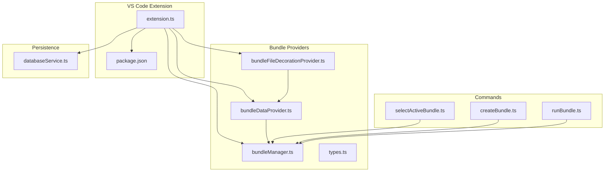
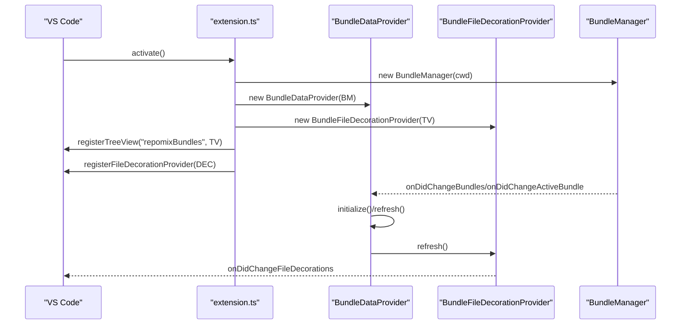
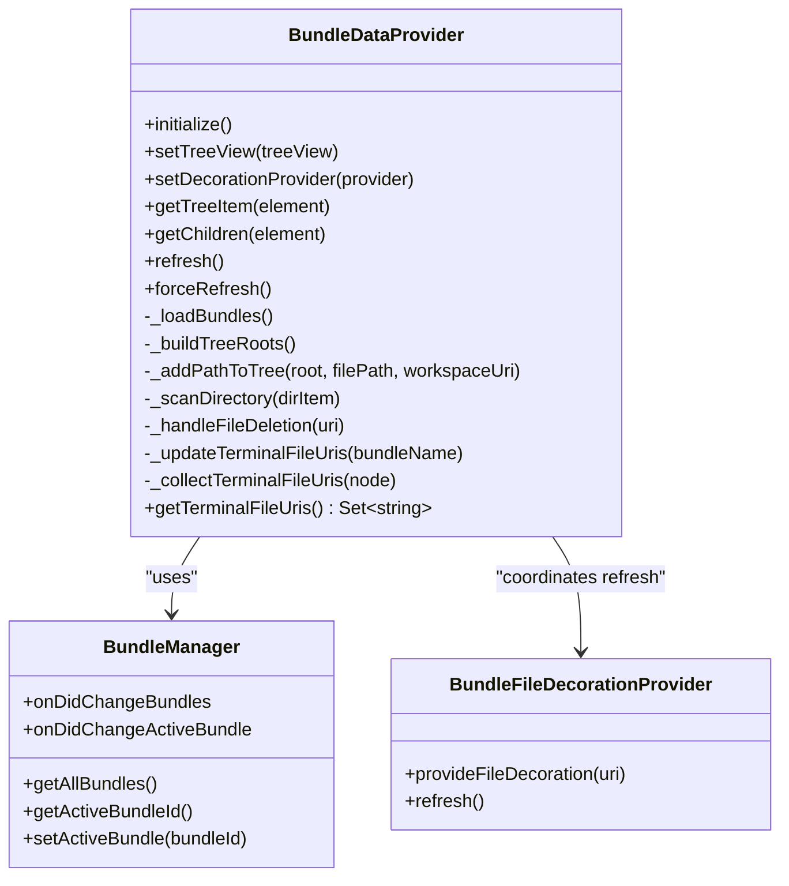
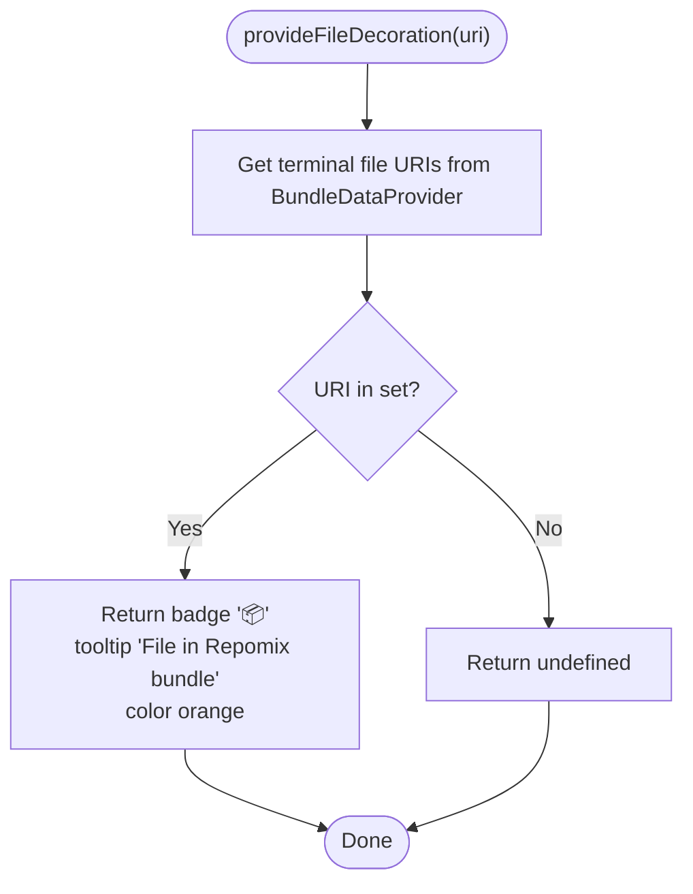
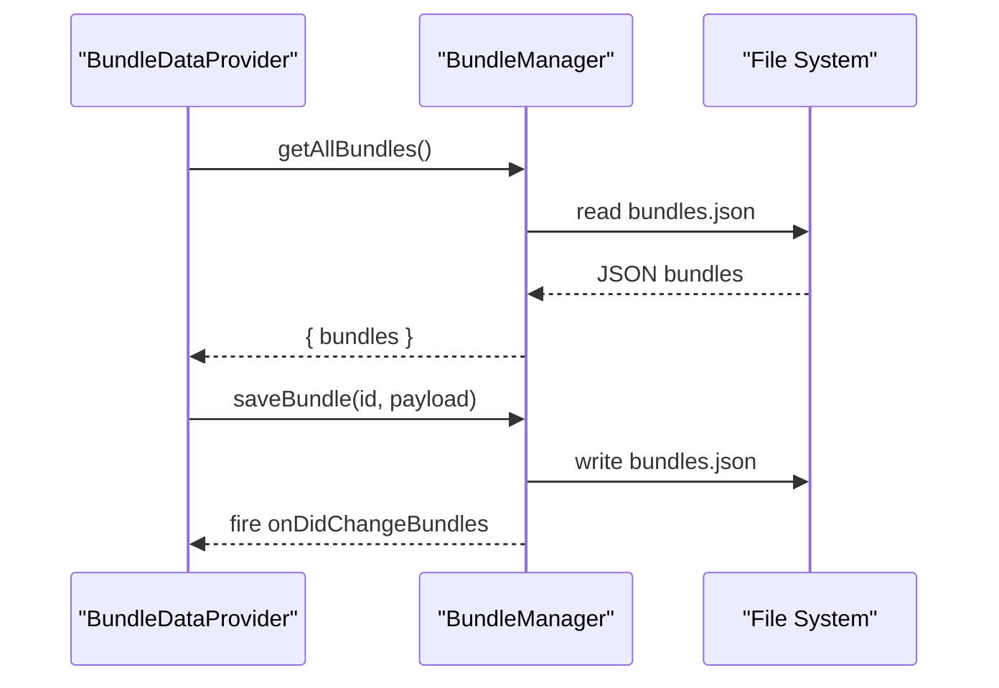
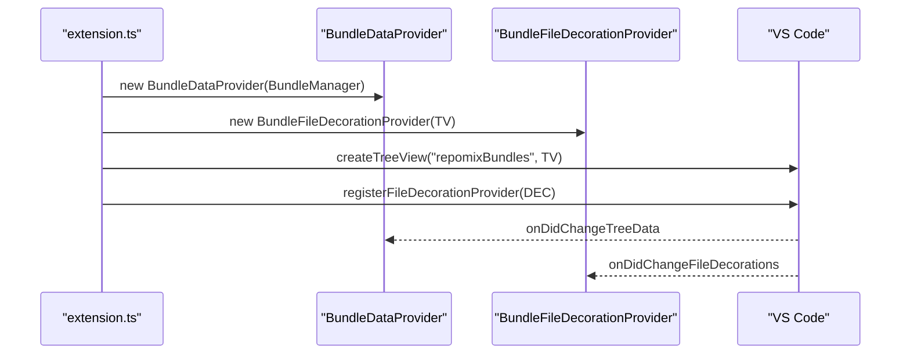
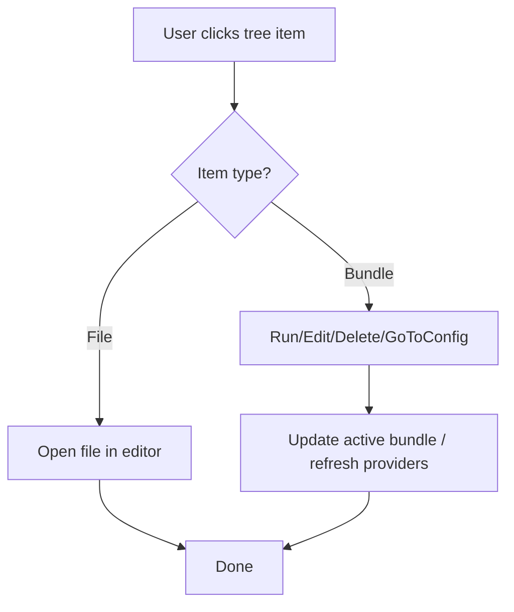
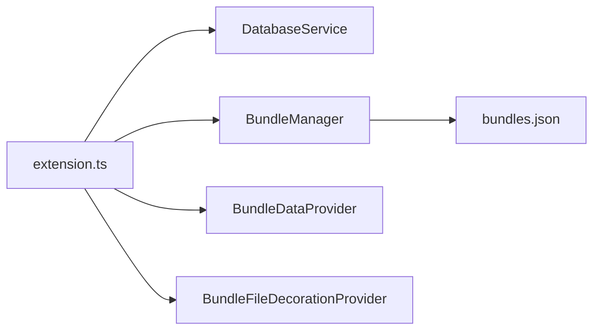
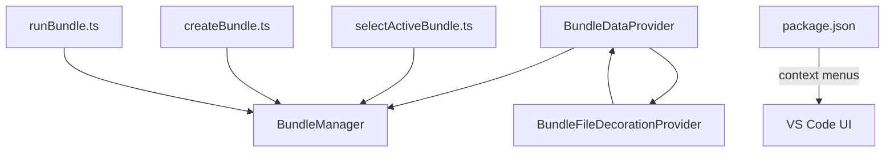

# Provider Patterns and Integration

<cite>
**Referenced Files in This Document**
- [extension.ts](file://src/extension.ts)
- [bundleDataProvider.ts](file://src/core/bundles/bundleDataProvider.ts)
- [bundleFileDecorationProvider.ts](file://src/core/bundles/bundleFileDecorationProvider.ts)
- [bundleManager.ts](file://src/core/bundles/bundleManager.ts)
- [types.ts](file://src/core/bundles/types.ts)
- [bundleDataProviders.test.ts](file://src/test/core/bundles/bundleDataProviders.test.ts)
- [package.json](file://package.json)
- [databaseService.ts](file://src/core/storage/databaseService.ts)
- [selectActiveBundle.ts](file://src/commands/selectActiveBundle.ts)
- [createBundle.ts](file://src/commands/createBundle.ts)
- [runBundle.ts](file://src/commands/runBundle.ts)
</cite>

## Table of Contents
1. [Introduction](#introduction)
2. [Project Structure](#project-structure)
3. [Core Components](#core-components)
4. [Architecture Overview](#architecture-overview)
5. [Detailed Component Analysis](#detailed-component-analysis)
6. [Dependency Analysis](#dependency-analysis)
7. [Performance Considerations](#performance-considerations)
8. [Troubleshooting Guide](#troubleshooting-guide)
9. [Conclusion](#conclusion)
10. [Appendices](#appendices)

## Introduction
This document explains the provider patterns used in the VS Code integration for managing and visualizing “bundles” of files. It focuses on:
- The bundle data provider that extends VS Code’s tree view with hierarchical nodes and dynamic loading
- The bundle file decoration provider that annotates files included in a bundle with visual indicators
- Provider registration, lifecycle, and event handling
- Integration with VS Code extension APIs (tree view refresh, context menus, file system watchers)
- Data flow between providers and the underlying bundle manager and database service
- Examples of provider implementation, custom node rendering, and user interaction handling
- Performance considerations for large repositories, lazy loading, and memory management
- Guidance for extending providers and maintaining compatibility with VS Code updates

## Project Structure
The relevant parts of the codebase for provider patterns are organized under:
- Core bundle providers and types
- Extension activation and registration
- Commands that drive provider state
- Package.json context menu contributions
- Database service for persistence and history

**Diagram sources**
- [extension.ts](file://src/extension.ts#L403-L417)
- [bundleDataProvider.ts](file://src/core/bundles/bundleDataProvider.ts#L18-L46)
- [bundleFileDecorationProvider.ts](file://src/core/bundles/bundleFileDecorationProvider.ts#L4-L10)
- [bundleManager.ts](file://src/core/bundles/bundleManager.ts#L6-L16)
- [types.ts](file://src/core/bundles/types.ts#L3-L12)
- [package.json](file://package.json#L440-L495)
- [databaseService.ts](file://src/core/storage/databaseService.ts#L27-L38)

**Section sources**
- [extension.ts](file://src/extension.ts#L403-L417)
- [package.json](file://package.json#L440-L495)

## Core Components
- BundleDataProvider: Implements VS Code’s TreeDataProvider to render a hierarchical tree of bundles and files, with lazy directory scanning and dynamic refresh.
- BundleFileDecorationProvider: Implements VS Code’s FileDecorationProvider to decorate files that belong to the active bundle.
- BundleManager: Manages bundle metadata persisted in a JSON file and emits events for changes and active bundle selection.
- Types: Defines the shape of bundle data and related metadata.

Key responsibilities:
- Tree construction from bundle file lists
- Lazy loading of directory contents
- File existence checks and missing node markers
- Active bundle state propagation via context variables
- Decoration refresh coordination with tree refresh

**Section sources**
- [bundleDataProvider.ts](file://src/core/bundles/bundleDataProvider.ts#L18-L46)
- [bundleFileDecorationProvider.ts](file://src/core/bundles/bundleFileDecorationProvider.ts#L4-L28)
- [bundleManager.ts](file://src/core/bundles/bundleManager.ts#L6-L45)
- [types.ts](file://src/core/bundles/types.ts#L3-L12)

## Architecture Overview
The providers integrate with VS Code through explicit registration and event-driven updates. The flow below maps the primary interactions.

**Diagram sources**
- [extension.ts](file://src/extension.ts#L403-L417)
- [bundleDataProvider.ts](file://src/core/bundles/bundleDataProvider.ts#L31-L40)
- [bundleFileDecorationProvider.ts](file://src/core/bundles/bundleFileDecorationProvider.ts#L26-L28)
- [bundleManager.ts](file://src/core/bundles/bundleManager.ts#L9-L11)

## Detailed Component Analysis

### BundleDataProvider
Responsibilities:
- Builds a tree per bundle from file paths
- Lazily scans directories when expanded
- Handles missing files and updates terminal file URIs for decoration
- Reacts to file system deletions and refreshes accordingly
- Emits tree changes and coordinates decoration refresh

Implementation highlights:
- Tree building and path normalization
- Directory scanning with deduplication
- Checkbox state binding for active bundle selection
- Open-on-click for files
- Terminal file URI collection for decorations

**Diagram sources**
- [bundleDataProvider.ts](file://src/core/bundles/bundleDataProvider.ts#L18-L324)
- [bundleManager.ts](file://src/core/bundles/bundleManager.ts#L6-L116)
- [bundleFileDecorationProvider.ts](file://src/core/bundles/bundleFileDecorationProvider.ts#L4-L28)

**Section sources**
- [bundleDataProvider.ts](file://src/core/bundles/bundleDataProvider.ts#L48-L165)
- [bundleDataProvider.ts](file://src/core/bundles/bundleDataProvider.ts#L167-L192)
- [bundleDataProvider.ts](file://src/core/bundles/bundleDataProvider.ts#L240-L283)
- [bundleDataProvider.ts](file://src/core/bundles/bundleDataProvider.ts#L285-L312)
- [bundleDataProvider.ts](file://src/core/bundles/bundleDataProvider.ts#L314-L324)

### BundleFileDecorationProvider
Responsibilities:
- Provides file decorations for URIs included in the active bundle
- Uses terminal file URIs computed by the data provider
- Emits change events to refresh decorations

**Diagram sources**
- [bundleFileDecorationProvider.ts](file://src/core/bundles/bundleFileDecorationProvider.ts#L12-L24)
- [bundleDataProvider.ts](file://src/core/bundles/bundleDataProvider.ts#L309-L312)

**Section sources**
- [bundleFileDecorationProvider.ts](file://src/core/bundles/bundleFileDecorationProvider.ts#L12-L28)

### BundleManager
Responsibilities:
- Persists bundles to a JSON file under the workspace’s hidden directory
- Emits events when bundles change or active bundle changes
- Exposes CRUD operations for bundles and active selection

**Diagram sources**
- [bundleManager.ts](file://src/core/bundles/bundleManager.ts#L55-L90)
- [bundleDataProvider.ts](file://src/core/bundles/bundleDataProvider.ts#L31-L40)

**Section sources**
- [bundleManager.ts](file://src/core/bundles/bundleManager.ts#L55-L115)

### Provider Registration and Lifecycle
- Tree view registration with collapse-all support
- File decoration provider registration
- Event subscriptions for bundle changes and active bundle changes
- File system watcher for deletions to trigger refresh
- Command registration for refresh and bundle operations

**Diagram sources**
- [extension.ts](file://src/extension.ts#L403-L417)
- [bundleDataProvider.ts](file://src/core/bundles/bundleDataProvider.ts#L18-L46)
- [bundleFileDecorationProvider.ts](file://src/core/bundles/bundleFileDecorationProvider.ts#L4-L8)

**Section sources**
- [extension.ts](file://src/extension.ts#L403-L417)
- [bundleDataProvider.ts](file://src/core/bundles/bundleDataProvider.ts#L18-L46)

### Context Menus and User Interactions
- Context menu contributions for bundle items and explorer context
- Commands wired to provider-driven actions (run, edit, delete, add/remove files)
- Active bundle selection via quick pick and checkbox toggling in tree view

**Diagram sources**
- [package.json](file://package.json#L448-L474)
- [extension.ts](file://src/extension.ts#L487-L570)
- [bundleDataProvider.ts](file://src/core/bundles/bundleDataProvider.ts#L54-L63)

**Section sources**
- [package.json](file://package.json#L448-L474)
- [extension.ts](file://src/extension.ts#L487-L570)
- [bundleDataProvider.ts](file://src/core/bundles/bundleDataProvider.ts#L54-L63)

### Data Flow Between Providers and Database Service
- The extension initializes a database service for agent run history and indexing state
- While the bundle providers primarily use the bundle manager’s JSON store, the database service supports broader lifecycle and history needs
- The providers themselves do not directly depend on the database service; however, the extension orchestrates both

**Diagram sources**
- [extension.ts](file://src/extension.ts#L47-L51)
- [databaseService.ts](file://src/core/storage/databaseService.ts#L27-L71)
- [bundleManager.ts](file://src/core/bundles/bundleManager.ts#L13-L16)

**Section sources**
- [extension.ts](file://src/extension.ts#L47-L51)
- [databaseService.ts](file://src/core/storage/databaseService.ts#L27-L71)
- [bundleManager.ts](file://src/core/bundles/bundleManager.ts#L13-L16)

## Dependency Analysis
- BundleDataProvider depends on BundleManager for bundle metadata and on BundleFileDecorationProvider for coordinated refresh
- BundleFileDecorationProvider depends on BundleDataProvider for terminal file URIs
- Commands depend on BundleManager to mutate state and trigger provider refresh
- Package.json contributes context menus and command visibility based on view and active bundle context

**Diagram sources**
- [bundleDataProvider.ts](file://src/core/bundles/bundleDataProvider.ts#L25-L67)
- [bundleFileDecorationProvider.ts](file://src/core/bundles/bundleFileDecorationProvider.ts#L10-L10)
- [selectActiveBundle.ts](file://src/commands/selectActiveBundle.ts#L6-L54)
- [createBundle.ts](file://src/commands/createBundle.ts#L7-L31)
- [runBundle.ts](file://src/commands/runBundle.ts#L15-L156)
- [package.json](file://package.json#L448-L474)

**Section sources**
- [bundleDataProvider.ts](file://src/core/bundles/bundleDataProvider.ts#L25-L67)
- [bundleFileDecorationProvider.ts](file://src/core/bundles/bundleFileDecorationProvider.ts#L10-L10)
- [selectActiveBundle.ts](file://src/commands/selectActiveBundle.ts#L6-L54)
- [createBundle.ts](file://src/commands/createBundle.ts#L7-L31)
- [runBundle.ts](file://src/commands/runBundle.ts#L15-L156)
- [package.json](file://package.json#L448-L474)

## Performance Considerations
- Lazy directory scanning: Directories are scanned only when expanded, reducing initial load time.
- File existence checks: Missing files are represented as missing nodes to prevent unnecessary IO.
- Debouncing and batching: While not directly in the providers, the extension registers a file system watcher that batches changes for background indexing; similar patterns can be considered for heavy refresh operations.
- Memory management: Avoid retaining large intermediate structures; the terminal file URI set is recomputed on demand.
- Large repositories: Prefer incremental refresh and avoid full rebuilds on minor changes; leverage file system watchers to trigger targeted updates.

[No sources needed since this section provides general guidance]

## Troubleshooting Guide
Common issues and remedies:
- Tree not updating after bundle changes
  - Ensure refresh is called after bundle save and that decoration provider refresh is invoked
  - Verify event subscriptions for bundle changes are firing
- Decorations not appearing
  - Confirm the active bundle is set and terminal file URIs are populated
  - Check that the decoration provider is registered
- Missing files in tree
  - Missing nodes are intentionally marked; verify file paths and workspace root
- Refresh command not visible
  - Confirm context menu contribution for the refresh command is enabled for the bundle view

**Section sources**
- [bundleDataProvider.ts](file://src/core/bundles/bundleDataProvider.ts#L31-L40)
- [bundleDataProvider.ts](file://src/core/bundles/bundleDataProvider.ts#L314-L324)
- [bundleFileDecorationProvider.ts](file://src/core/bundles/bundleFileDecorationProvider.ts#L26-L28)
- [package.json](file://package.json#L440-L446)

## Conclusion
The provider pattern in this extension cleanly separates concerns:
- BundleDataProvider constructs and renders the tree, handles lazy loading, and reacts to file system changes
- BundleFileDecorationProvider decorates files belonging to the active bundle
- BundleManager persists and emits state changes
- Commands and context menus integrate user actions with provider-driven updates
This separation enables maintainability, testability, and scalability for large repositories.

[No sources needed since this section summarizes without analyzing specific files]

## Appendices

### Provider Implementation Examples
- Tree node rendering and commands
  - See [bundleDataProvider.ts](file://src/core/bundles/bundleDataProvider.ts#L240-L260) for TreeItem creation and open-file command
- Dynamic content loading
  - See [bundleDataProvider.ts](file://src/core/bundles/bundleDataProvider.ts#L262-L283) for getChildren and lazy directory scanning
- Decoration provider refresh
  - See [bundleFileDecorationProvider.ts](file://src/core/bundles/bundleFileDecorationProvider.ts#L26-L28) for refresh emission

**Section sources**
- [bundleDataProvider.ts](file://src/core/bundles/bundleDataProvider.ts#L240-L260)
- [bundleDataProvider.ts](file://src/core/bundles/bundleDataProvider.ts#L262-L283)
- [bundleFileDecorationProvider.ts](file://src/core/bundles/bundleFileDecorationProvider.ts#L26-L28)

### Extending Providers
- Adding new context menu actions
  - Contribute commands in package.json under view/item/context and wire them to commands in extension.ts
- Customizing decorations
  - Extend BundleFileDecorationProvider to add icons, tooltips, or colors based on bundle metadata
- Enhancing tree nodes
  - Add new fields to TreeNode and update getTreeItem to render additional information

**Section sources**
- [package.json](file://package.json#L448-L474)
- [bundleFileDecorationProvider.ts](file://src/core/bundles/bundleFileDecorationProvider.ts#L12-L24)
- [bundleDataProvider.ts](file://src/core/bundles/bundleDataProvider.ts#L8-L16)

### Compatibility and Updates
- Keep TreeDataProvider contract intact: onDidChangeTreeData, getTreeItem, getChildren
- Use VS Code’s event emitters consistently for refresh signals
- Respect context keys and command visibility conditions in package.json
- Test with various workspace sizes and ignore patterns to ensure responsiveness

[No sources needed since this section provides general guidance]