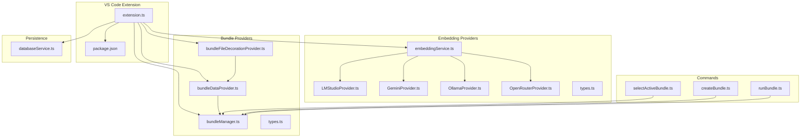
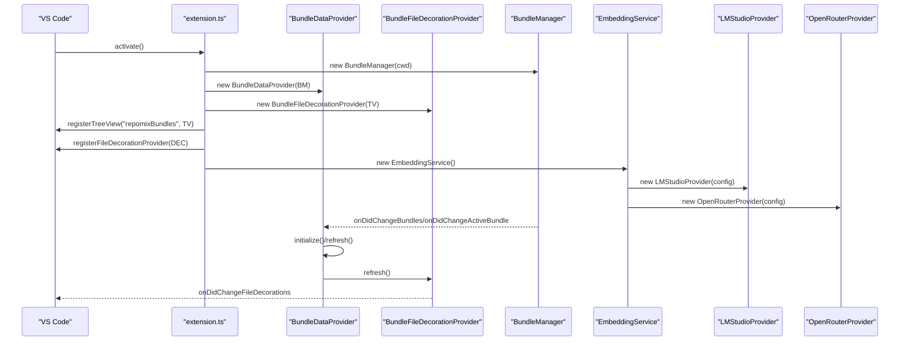
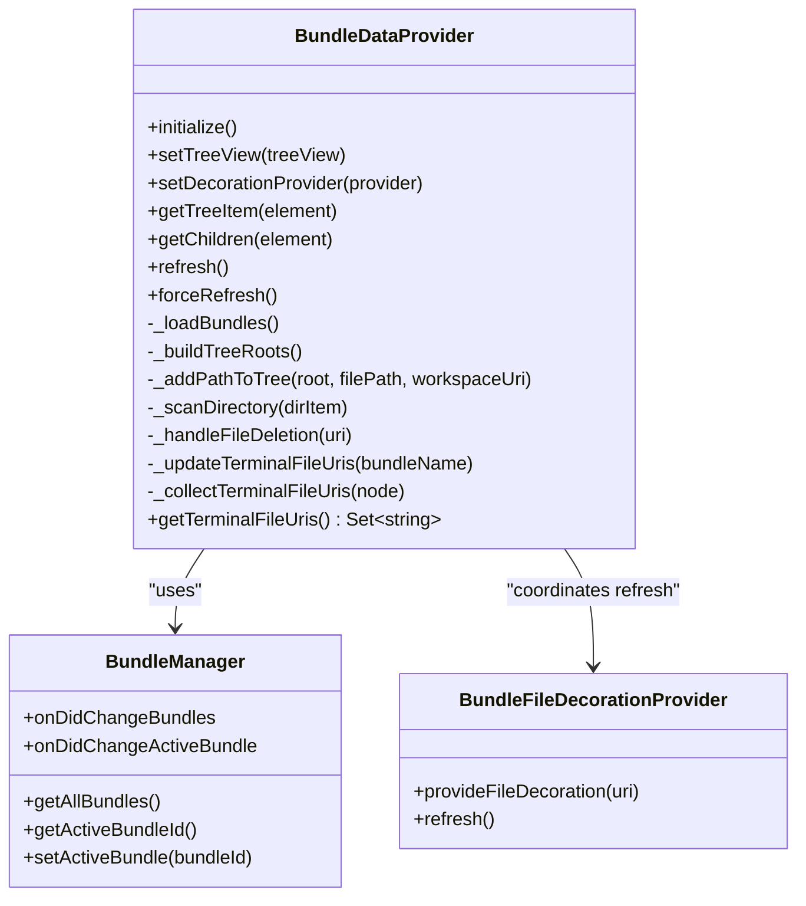
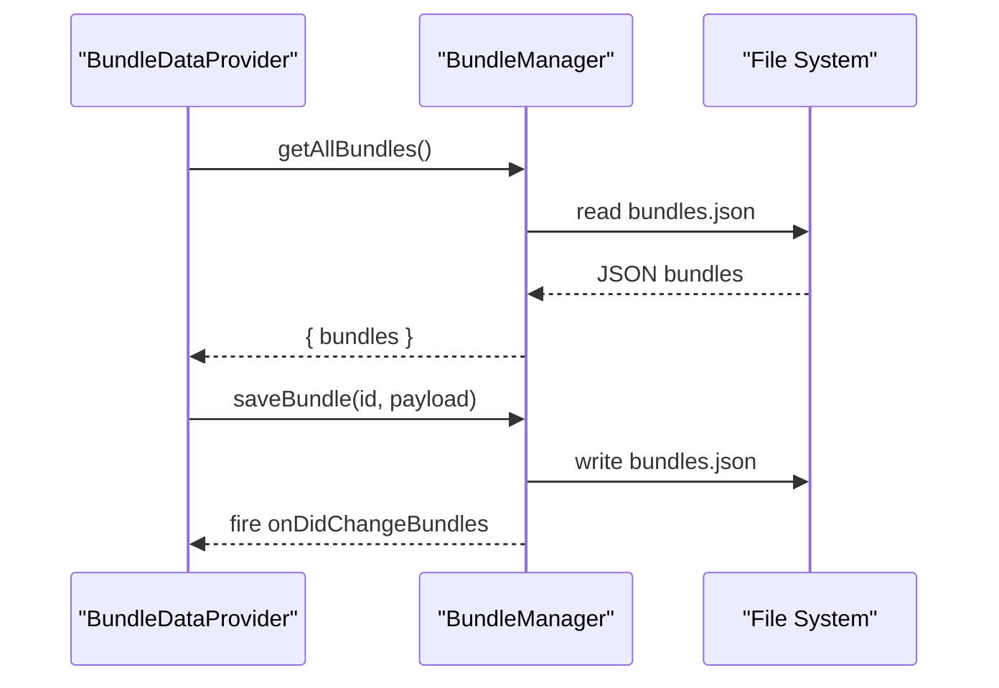
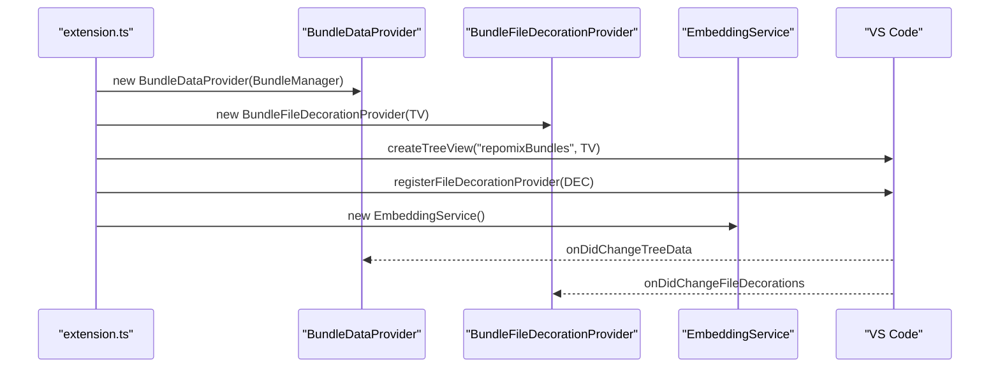
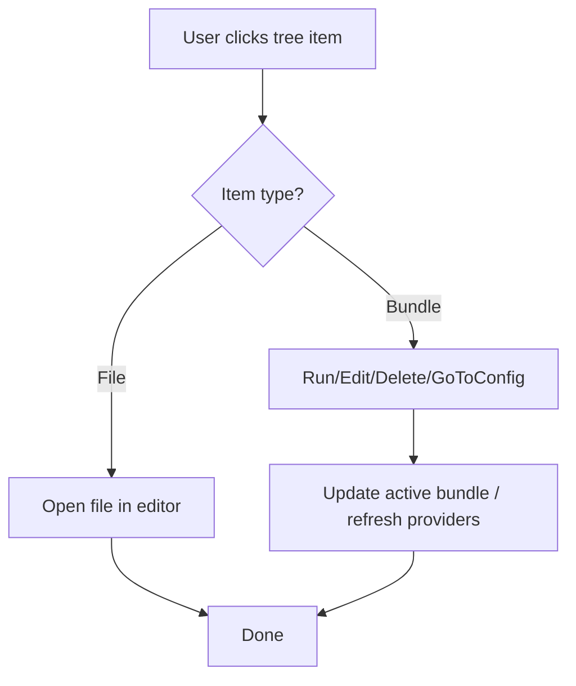
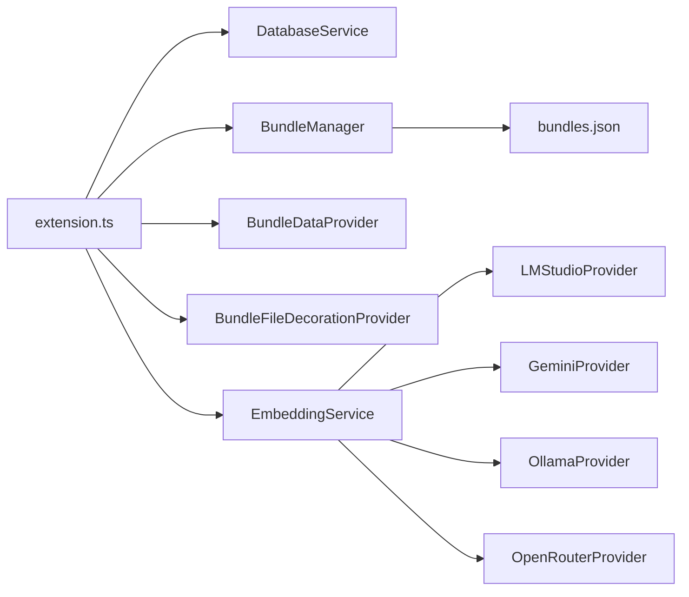
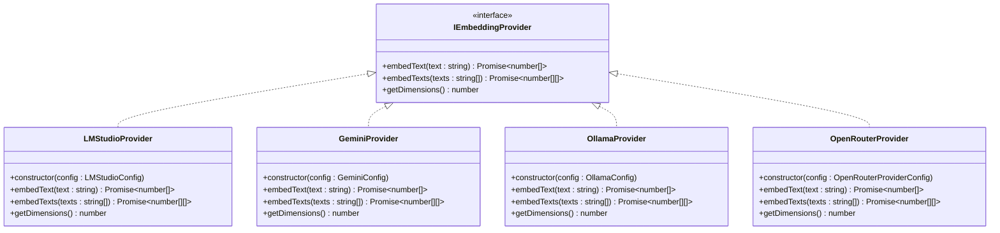
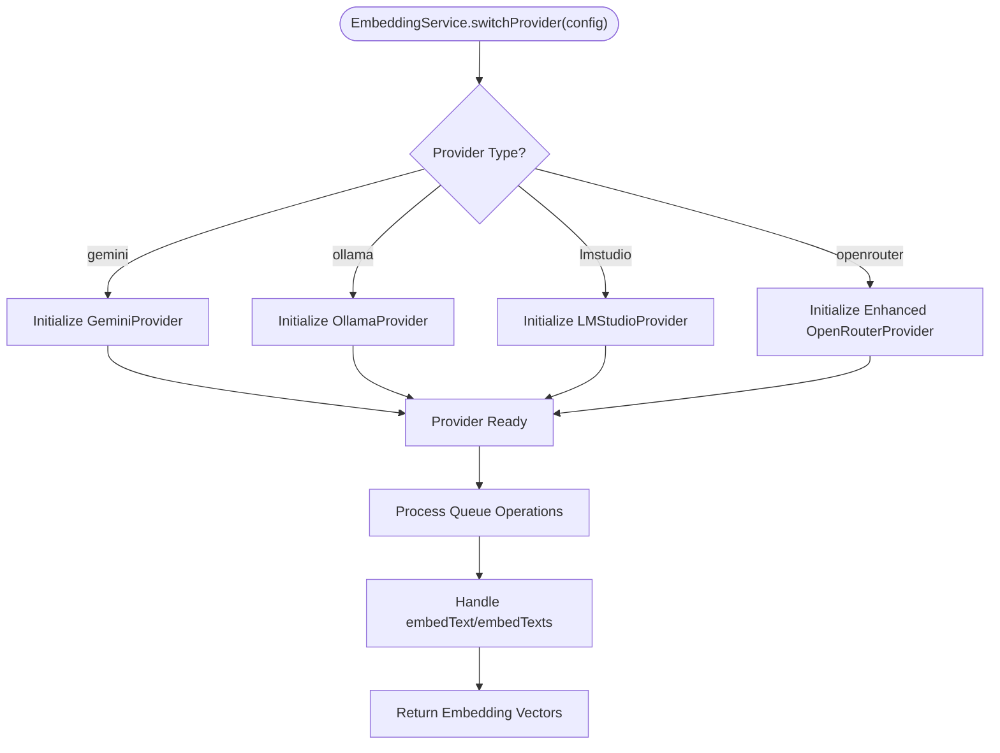
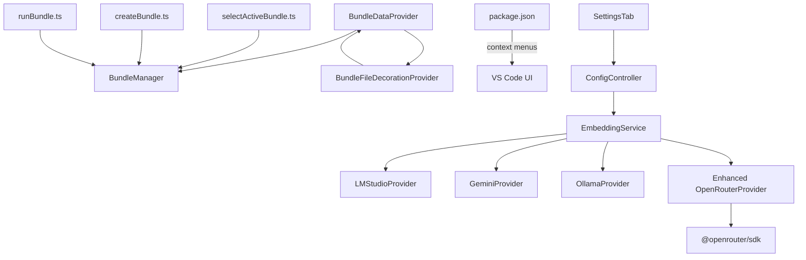

# Provider Patterns and Integration

<cite>
**Referenced Files in This Document**
- [extension.ts](file://src/extension.ts)
- [bundleDataProvider.ts](file://src/core/bundles/bundleDataProvider.ts)
- [bundleFileDecorationProvider.ts](file://src/core/bundles/bundleFileDecorationProvider.ts)
- [bundleManager.ts](file://src/core/bundles/bundleManager.ts)
- [types.ts](file://src/core/bundles/types.ts)
- [bundleDataProviders.test.ts](file://src/test/core/bundles/bundleDataProviders.test.ts)
- [package.json](file://package.json)
- [databaseService.ts](file://src/core/storage/databaseService.ts)
- [selectActiveBundle.ts](file://src/commands/selectActiveBundle.ts)
- [createBundle.ts](file://src/commands/createBundle.ts)
- [runBundle.ts](file://src/commands/runBundle.ts)
- [LMStudioProvider.ts](file://src/core/indexing/embeddings/LMStudioProvider.ts)
- [GeminiProvider.ts](file://src/core/indexing/embeddings/GeminiProvider.ts)
- [OllamaProvider.ts](file://src/core/indexing/embeddings/OllamaProvider.ts)
- [OpenRouterProvider.ts](file://src/core/indexing/embeddings/OpenRouterProvider.ts)
- [types.ts](file://src/core/indexing/embeddings/types.ts)
- [embeddingService.ts](file://src/core/indexing/embeddingService.ts)
- [ConfigController.ts](file://src/webview/controllers/ConfigController.ts)
- [SettingsTab.tsx](file://src/webview/components/SettingsTab.tsx)
- [openRouterEmbedding.test.ts](file://src/test/core/indexing/openRouterEmbedding.test.ts)
</cite>

## Update Summary
**Changes Made**
- Enhanced OpenRouter provider implementation with new default model 'openai/text-embedding-3-small' (dimension 1536)
- Improved fallback mechanisms with allowFallbacks defaulting to true for better reliability
- Enhanced quantization support with fp8 as default quantization level
- Updated configuration defaults including provider.order default to ['nebius'] and quantizations default to ['fp8']
- Enhanced error handling and dimension validation capabilities
- Added comprehensive SDK-based integration with @openrouter/sdk
- Updated webview settings integration with improved connection testing and model discovery

## Table of Contents
1. [Introduction](#introduction)
2. [Project Structure](#project-structure)
3. [Core Components](#core-components)
4. [Architecture Overview](#architecture-overview)
5. [Detailed Component Analysis](#detailed-component-analysis)
6. [Embedding Provider Patterns](#embedding-provider-patterns)
7. [OpenRouter Provider Integration](#openrouter-provider-integration)
8. [Dependency Analysis](#dependency-analysis)
9. [Performance Considerations](#performance-considerations)
10. [Troubleshooting Guide](#troubleshooting-guide)
11. [Conclusion](#conclusion)
12. [Appendices](#appendices)

## Introduction
This document explains the provider patterns used in the VS Code integration for managing and visualizing "bundles" of files, as well as the embedding provider architecture for vector embeddings. It focuses on:
- The bundle data provider that extends VS Code's tree view with hierarchical nodes and dynamic loading
- The bundle file decoration provider that annotates files included in a bundle with visual indicators
- Provider registration, lifecycle, and event handling
- Integration with VS Code extension APIs (tree view refresh, context menus, file system watchers)
- Data flow between providers and the underlying bundle manager and database service
- **New**: Embedding provider patterns including LM Studio, Gemini, Ollama, and OpenRouter implementations
- **New**: Enhanced OpenRouter provider integration with advanced provider routing, fallback mechanisms, quantization support, and SDK-based integration
- Examples of provider implementation, custom node rendering, and user interaction handling
- Performance considerations for large repositories, lazy loading, and memory management
- Guidance for extending providers and maintaining compatibility with VS Code updates

## Project Structure
The relevant parts of the codebase for provider patterns are organized under:
- Core bundle providers and types
- Embedding provider implementations and service
- Extension activation and registration
- Commands that drive provider state
- Package.json context menu contributions
- Database service for persistence and history



**Diagram sources**
- [extension.ts](file://src/extension.ts#L403-L417)
- [bundleDataProvider.ts](file://src/core/bundles/bundleDataProvider.ts#L18-L46)
- [bundleFileDecorationProvider.ts](file://src/core/bundles/bundleFileDecorationProvider.ts#L4-L10)
- [bundleManager.ts](file://src/core/bundles/bundleManager.ts#L6-L16)
- [types.ts](file://src/core/bundles/types.ts#L3-L12)
- [LMStudioProvider.ts](file://src/core/indexing/embeddings/LMStudioProvider.ts#L10-L90)
- [GeminiProvider.ts](file://src/core/indexing/embeddings/GeminiProvider.ts#L8-L78)
- [OllamaProvider.ts](file://src/core/indexing/embeddings/OllamaProvider.ts#L9-L46)
- [OpenRouterProvider.ts](file://src/core/indexing/embeddings/OpenRouterProvider.ts#L16-L137)
- [embeddingService.ts](file://src/core/indexing/embeddingService.ts#L35-L198)
- [package.json](file://package.json#L440-L495)
- [databaseService.ts](file://src/core/storage/databaseService.ts#L27-L38)

**Section sources**
- [extension.ts](file://src/extension.ts#L403-L417)
- [package.json](file://package.json#L440-L495)

## Core Components
- BundleDataProvider: Implements VS Code's TreeDataProvider to render a hierarchical tree of bundles and files, with lazy directory scanning and dynamic refresh.
- BundleFileDecorationProvider: Implements VS Code's FileDecorationProvider to decorate files that belong to the active bundle.
- BundleManager: Manages bundle metadata persisted in a JSON file and emits events for changes and active bundle selection.
- Types: Defines the shape of bundle data and related metadata.
- **New**: EmbeddingService: Centralized service managing multiple embedding providers (LM Studio, Gemini, Ollama, OpenRouter) with request queuing and dimension management.
- **New**: IEmbeddingProvider interface: Standardized contract for embedding providers with consistent methods across all implementations.
- **New**: Enhanced OpenRouterProvider: Cloud-based embedding provider with advanced provider routing, fallback mechanisms, quantization support, and SDK-based integration.

Key responsibilities:
- Tree construction from bundle file lists
- Lazy loading of directory contents
- File existence checks and missing node markers
- Active bundle state propagation via context variables
- Decoration refresh coordination with tree refresh
- **New**: Provider switching and configuration management across four embedding providers
- **New**: Request queuing and rate limiting for embedding operations
- **New**: Dimension validation and error handling across all providers
- **New**: Advanced OpenRouter configuration including provider routing, quantization, and enhanced fallback mechanisms

**Section sources**
- [bundleDataProvider.ts](file://src/core/bundles/bundleDataProvider.ts#L18-L46)
- [bundleFileDecorationProvider.ts](file://src/core/bundles/bundleFileDecorationProvider.ts#L4-L28)
- [bundleManager.ts](file://src/core/bundles/bundleManager.ts#L6-L45)
- [types.ts](file://src/core/bundles/types.ts#L3-L12)
- [embeddingService.ts](file://src/core/indexing/embeddingService.ts#L35-L198)
- [LMStudioProvider.ts](file://src/core/indexing/embeddings/LMStudioProvider.ts#L10-L90)
- [OpenRouterProvider.ts](file://src/core/indexing/embeddings/OpenRouterProvider.ts#L16-L137)

## Architecture Overview
The providers integrate with VS Code through explicit registration and event-driven updates. The flow below maps the primary interactions, including the new enhanced embedding provider architecture with OpenRouter support.



**Diagram sources**
- [extension.ts](file://src/extension.ts#L403-L417)
- [bundleDataProvider.ts](file://src/core/bundles/bundleDataProvider.ts#L31-L40)
- [bundleFileDecorationProvider.ts](file://src/core/bundles/bundleFileDecorationProvider.ts#L26-L28)
- [bundleManager.ts](file://src/core/bundles/bundleManager.ts#L9-L11)
- [embeddingService.ts](file://src/core/indexing/embeddingService.ts#L35-L75)
- [LMStudioProvider.ts](file://src/core/indexing/embeddings/LMStudioProvider.ts#L10-L15)
- [OpenRouterProvider.ts](file://src/core/indexing/embeddings/OpenRouterProvider.ts#L20-L26)

## Detailed Component Analysis

### BundleDataProvider
Responsibilities:
- Builds a tree per bundle from file paths
- Lazily scans directories when expanded
- Handles missing files and updates terminal file URIs for decoration
- Reacts to file system deletions and refreshes accordingly
- Emits tree changes and coordinates decoration refresh

Implementation highlights:
- Tree building and path normalization
- Directory scanning with deduplication
- Checkbox state binding for active bundle selection
- Open-on-click for files
- Terminal file URI collection for decorations



**Diagram sources**
- [bundleDataProvider.ts](file://src/core/bundles/bundleDataProvider.ts#L18-L324)
- [bundleManager.ts](file://src/core/bundles/bundleManager.ts#L6-L116)
- [bundleFileDecorationProvider.ts](file://src/core/bundles/bundleFileDecorationProvider.ts#L4-L28)

**Section sources**
- [bundleDataProvider.ts](file://src/core/bundles/bundleDataProvider.ts#L48-L165)
- [bundleDataProvider.ts](file://src/core/bundles/bundleDataProvider.ts#L167-L192)
- [bundleDataProvider.ts](file://src/core/bundles/bundleDataProvider.ts#L240-L283)
- [bundleDataProvider.ts](file://src/core/bundles/bundleDataProvider.ts#L285-L312)
- [bundleDataProvider.ts](file://src/core/bundles/bundleDataProvider.ts#L314-L324)

### BundleFileDecorationProvider
Responsibilities:
- Provides file decorations for URIs included in the active bundle
- Uses terminal file URIs computed by the data provider
- Emits change events to refresh decorations


**Diagram sources**
- [bundleFileDecorationProvider.ts](file://src/core/bundles/bundleFileDecorationProvider.ts#L12-L24)
- [bundleDataProvider.ts](file://src/core/bundles/bundleDataProvider.ts#L309-L312)

**Section sources**
- [bundleFileDecorationProvider.ts](file://src/core/bundles/bundleFileDecorationProvider.ts#L12-L28)

### BundleManager
Responsibilities:
- Persists bundles to a JSON file under the workspace's hidden directory
- Emits events when bundles change or active bundle changes
- Exposes CRUD operations for bundles and active selection



**Diagram sources**
- [bundleManager.ts](file://src/core/bundles/bundleManager.ts#L55-L90)
- [bundleDataProvider.ts](file://src/core/bundles/bundleDataProvider.ts#L31-L40)

**Section sources**
- [bundleManager.ts](file://src/core/bundles/bundleManager.ts#L55-L115)

### Provider Registration and Lifecycle
- Tree view registration with collapse-all support
- File decoration provider registration
- Event subscriptions for bundle changes and active bundle changes
- File system watcher for deletions to trigger refresh
- Command registration for refresh and bundle operations
- **New**: Embedding service initialization and provider switching across four providers with enhanced OpenRouter support



**Diagram sources**
- [extension.ts](file://src/extension.ts#L403-L417)
- [bundleDataProvider.ts](file://src/core/bundles/bundleDataProvider.ts#L18-L46)
- [bundleFileDecorationProvider.ts](file://src/core/bundles/bundleFileDecorationProvider.ts#L4-L8)
- [embeddingService.ts](file://src/core/indexing/embeddingService.ts#L35-L43)

**Section sources**
- [extension.ts](file://src/extension.ts#L403-L417)
- [bundleDataProvider.ts](file://src/core/bundles/bundleDataProvider.ts#L18-L46)

### Context Menus and User Interactions
- Context menu contributions for bundle items and explorer context
- Commands wired to provider-driven actions (run, edit, delete, add/remove files)
- Active bundle selection via quick pick and checkbox toggling in tree view
- **New**: Enhanced embedding provider configuration through VS Code settings UI with OpenRouter support including improved model discovery and connection testing



**Diagram sources**
- [package.json](file://package.json#L448-L474)
- [extension.ts](file://src/extension.ts#L487-L570)
- [bundleDataProvider.ts](file://src/core/bundles/bundleDataProvider.ts#L54-L63)

**Section sources**
- [package.json](file://package.json#L448-L474)
- [extension.ts](file://src/extension.ts#L487-L570)
- [bundleDataProvider.ts](file://src/core/bundles/bundleDataProvider.ts#L54-L63)

### Data Flow Between Providers and Database Service
- The extension initializes a database service for agent run history and indexing state
- While the bundle providers primarily use the bundle manager's JSON store, the database service supports broader lifecycle and history needs
- The providers themselves do not directly depend on the database service; however, the extension orchestrates both
- **New**: Embedding service coordinates with database service for index history and state management across all four providers with enhanced OpenRouter integration



**Diagram sources**
- [extension.ts](file://src/extension.ts#L47-L51)
- [databaseService.ts](file://src/core/storage/databaseService.ts#L27-L71)
- [bundleManager.ts](file://src/core/bundles/bundleManager.ts#L13-L16)
- [embeddingService.ts](file://src/core/indexing/embeddingService.ts#L35-L75)

**Section sources**
- [extension.ts](file://src/extension.ts#L47-L51)
- [databaseService.ts](file://src/core/storage/databaseService.ts#L27-L71)
- [bundleManager.ts](file://src/core/bundles/bundleManager.ts#L13-L16)

## Embedding Provider Patterns

### IEmbeddingProvider Interface Pattern
All embedding providers implement a standardized interface that ensures consistent behavior across different providers:



**Diagram sources**
- [types.ts](file://src/core/indexing/embeddings/types.ts#L1-L6)
- [LMStudioProvider.ts](file://src/core/indexing/embeddings/LMStudioProvider.ts#L10-L90)
- [GeminiProvider.ts](file://src/core/indexing/embeddings/GeminiProvider.ts#L8-L78)
- [OllamaProvider.ts](file://src/core/indexing/embeddings/OllamaProvider.ts#L9-L46)
- [OpenRouterProvider.ts](file://src/core/indexing/embeddings/OpenRouterProvider.ts#L16-L137)

### LM Studio Provider Implementation
The LM Studio provider demonstrates comprehensive authentication, response handling, and error management:

**Key Features:**
- **Authentication**: Supports optional Bearer token authentication
- **Response Handling**: Handles both OpenAI-style and direct embedding responses
- **Error Management**: Comprehensive error handling with detailed logging
- **Dimension Validation**: Validates embedding dimensions match configuration
- **Logging**: Extensive console logging for debugging and monitoring

**Configuration Options:**
- `baseUrl`: LM Studio API endpoint (default: `http://localhost:1234/v1`)
- `apiKey`: Optional API key for authentication
- `model`: Embedding model name
- `dimension`: Expected embedding vector dimension

**Section sources**
- [LMStudioProvider.ts](file://src/core/indexing/embeddings/LMStudioProvider.ts#L10-L90)

### Gemini Provider Implementation
The Gemini provider showcases Google's official SDK integration:

**Key Features:**
- **Official SDK**: Uses Google's `@google/genai` package
- **Dimension Control**: Fixed 768-dimensional embeddings
- **Batch Processing**: Supports batch embedding operations
- **Strict Validation**: Validates embedding dimensions and content format

**Section sources**
- [GeminiProvider.ts](file://src/core/indexing/embeddings/GeminiProvider.ts#L8-L78)

### Ollama Provider Implementation
The Ollama provider demonstrates local model serving integration:

**Key Features:**
- **Local Serving**: Connects to locally running Ollama instances
- **Simple API**: Minimal configuration requirements
- **Parallel Processing**: Supports parallel embedding requests
- **Direct Response**: Expects straightforward embedding responses

**Section sources**
- [OllamaProvider.ts](file://src/core/indexing/embeddings/OllamaProvider.ts#L9-L46)

### Enhanced OpenRouter Provider Implementation
The OpenRouter provider introduces cloud-based embedding with advanced routing capabilities and comprehensive enhancements:

**Key Features:**
- **Cloud Provider**: Connects to OpenRouter's distributed inference network
- **Enhanced Provider Routing**: Advanced routing through multiple cloud providers with `["nebius"]` as default
- **Improved Fallback Mechanisms**: Automatic fallback to alternative providers with `allowFallbacks` defaulting to `true`
- **Comprehensive Quantization Support**: Multiple quantization levels for performance optimization with `["fp8"]` as default
- **SDK-Based Integration**: Proper integration with `@openrouter/sdk` package
- **Flexible Configuration**: Comprehensive provider preference management
- **Enhanced Dimension Validation**: Validates embedding dimensions match configuration
- **Improved Error Handling**: Better error messages and dimension validation

**Configuration Options:**
- `baseUrl`: OpenRouter API endpoint (default: `https://openrouter.ai/api/v1`)
- `apiKey`: Required API key for authentication
- `model`: Embedding model name (default: `openai/text-embedding-3-small`)
- `dimension`: Expected embedding vector dimension (default: `1536` for text-embedding-3-small)
- `provider.order`: Ordered list of preferred cloud providers (default: `["nebius"]`)
- `provider.allow_fallbacks`: Enable fallback to alternative providers (default: `true`)
- `provider.quantizations`: Preferred quantization levels (default: `["fp8"]`)

**Advanced Features:**
- **Provider Preferences**: Build complex provider routing configurations
- **Quantization Control**: Optimize for speed vs. accuracy trade-offs
- **Enhanced Error Resilience**: Graceful handling of provider-specific failures with improved error messages
- **Dimension Monitoring**: Real-time dimension validation and logging
- **SDK Integration**: Proper integration with `@openrouter/sdk` for reliable cloud-based embeddings

**Section sources**
- [OpenRouterProvider.ts](file://src/core/indexing/embeddings/OpenRouterProvider.ts#L4-L137)

### EmbeddingService Architecture
The EmbeddingService provides centralized management of all embedding providers with advanced features:

**Core Responsibilities:**
- **Provider Switching**: Dynamically switches between different embedding providers
- **Request Queuing**: Serializes embedding requests to prevent rate limiting
- **Dimension Management**: Validates and manages embedding dimensions
- **Priority Handling**: Supports priority-based request processing

**Advanced Features:**
- **Request Queue**: Manages concurrent embedding operations
- **Rate Limiting**: Prevents overwhelming external APIs
- **Error Recovery**: Handles provider failures gracefully
- **Statistics**: Provides queue monitoring and debugging capabilities



**Diagram sources**
- [embeddingService.ts](file://src/core/indexing/embeddingService.ts#L56-L93)
- [embeddingService.ts](file://src/core/indexing/embeddingService.ts#L163-L188)

**Section sources**
- [embeddingService.ts](file://src/core/indexing/embeddingService.ts#L35-L198)

### Enhanced VS Code Integration for OpenRouter
The OpenRouter provider integrates seamlessly with VS Code's settings system with comprehensive enhancements:

**Configuration UI:**
- **Settings Tab**: Dedicated accordion for OpenRouter configuration with improved model discovery
- **Model Discovery**: Automatic model fetching from OpenRouter API with better error handling
- **Provider Routing**: Advanced provider ordering and fallback configuration with `["nebius"]` as default
- **Quantization Settings**: Fine-grained control over model quantization with `["fp8"]` as default
- **Dimension Detection**: Automatic embedding dimension detection with enhanced validation
- **Connection Testing**: Built-in connection and model validation with improved error messages

**Key Features:**
- **Base URL Configuration**: Configurable OpenRouter endpoint
- **API Key Management**: Secure optional authentication
- **Model Selection**: Dropdown with auto-discovered embedding models including `openai/text-embedding-3-small`
- **Provider Ordering**: Comma-separated list of preferred providers with `["nebius"]` default
- **Quantization Controls**: Multiple quantization level preferences with `["fp8"]` default
- **Enhanced Fallback Configuration**: Toggle for automatic provider fallback with `true` default
- **Dimension Validation**: Real-time dimension testing with improved error handling
- **Better Error Messages**: Comprehensive error messages for common issues including provider routing failures

**Section sources**
- [ConfigController.ts](file://src/webview/controllers/ConfigController.ts#L135-L147)
- [SettingsTab.tsx](file://src/webview/components/SettingsTab.tsx#L1199-L1339)

## OpenRouter Provider Integration

### Enhanced OpenRouterProvider Configuration Pattern
The OpenRouter provider implements a sophisticated configuration system with comprehensive enhancements:

**Configuration Structure:**
```typescript
interface OpenRouterProviderConfig {
  baseUrl: string;
  apiKey: string;
  model: string;
  dimension: number;
  provider?: {
    order?: string[];           // Preferred provider order (default: ["nebius"])
    allow_fallbacks?: boolean;  // Enable fallback to alternatives (default: true)
    quantizations?: string[];   // Preferred quantization levels (default: ["fp8"])
  };
}
```

**Enhanced Provider Preference Building:**
The provider automatically constructs routing preferences with improved defaults:
- Only includes provider order if explicitly specified
- Defaults to `allow_fallbacks: true` for better reliability and improved error handling
- Conditionally includes quantizations only when specified and non-empty
- Enhanced error messages for provider routing failures

**Section sources**
- [OpenRouterProvider.ts](file://src/core/indexing/embeddings/OpenRouterProvider.ts#L4-L51)

### Enhanced Webview Settings Integration
The OpenRouter configuration integrates deeply with the VS Code settings UI with comprehensive improvements:

**Settings Components:**
- **Base URL Input**: Configurable OpenRouter endpoint
- **API Key Field**: Secure credential storage
- **Model Manager**: Dynamic model discovery and selection with `openai/text-embedding-3-small` as default
- **Provider Order**: Comma-separated provider routing configuration with `["nebius"]` default
- **Enhanced Quantization Controls**: Multiple quantization level preferences with `["fp8"]` default
- **Dimension Input**: Manual dimension override with validation and improved error handling
- **Enhanced Connection Testing**: Built-in connectivity verification with better error messages

**Integration Features:**
- **Auto-detection**: Automatically detects model dimensions with improved accuracy
- **Real-time Validation**: Immediate feedback on configuration changes with enhanced error handling
- **Better Error Handling**: Comprehensive error messages for common issues including provider routing failures
- **Improved Fallback Logic**: Intelligent handling of provider routing failures with `allowFallbacks: true` default
- **Enhanced Testing**: Better connection and model validation with improved error reporting

**Section sources**
- [SettingsTab.tsx](file://src/webview/components/SettingsTab.tsx#L1199-L1339)
- [ConfigController.ts](file://src/webview/controllers/ConfigController.ts#L135-L147)

### Enhanced Package.json Configuration Schema
OpenRouter integration adds comprehensive configuration options with improved defaults to VS Code settings:

**Configuration Properties:**
- `repomix.openrouter.baseUrl`: API endpoint URL (default: `https://openrouter.ai/api/v1`)
- `repomix.openrouter.model`: Default embedding model (`openai/text-embedding-3-small`) with 1536 dimensions
- `repomix.openrouter.dimension`: Expected embedding dimension (default: `1536` for text-embedding-3-small)
- `repomix.openrouter.providerOrder`: Provider routing order (default: `["nebius"]`)
- `repomix.openrouter.allowFallbacks`: Enable fallback mechanisms (default: `true`)
- `repomix.openrouter.quantizations`: Quantization preferences (default: `["fp8"]`)

**Enhanced Defaults:**
- **Default Model**: Changed from `text-embedding-ada-002` to `openai/text-embedding-3-small` (1536 dimensions)
- **Default Provider Order**: `["nebius"]` for optimal reliability
- **Default Fallback**: `true` for improved error resilience
- **Default Quantization**: `["fp8"]` for balanced performance and accuracy

**Section sources**
- [package.json](file://package.json#L307-L348)

## Dependency Analysis
- BundleDataProvider depends on BundleManager for bundle metadata and on BundleFileDecorationProvider for coordinated refresh
- BundleFileDecorationProvider depends on BundleDataProvider for terminal file URIs
- Commands depend on BundleManager to mutate state and trigger provider refresh
- Package.json contributes context menus and command visibility based on view and active bundle context
- **New**: EmbeddingService depends on all four embedding providers (LM Studio, Gemini, Ollama, Enhanced OpenRouter)
- **New**: ConfigController manages OpenRouter configuration and provider switching with enhanced error handling
- **New**: SettingsTab provides UI for OpenRouter configuration and model management with improved user experience
- **New**: Enhanced OpenRouterProvider integrates with @openrouter/sdk for cloud-based embeddings with comprehensive error handling



**Diagram sources**
- [bundleDataProvider.ts](file://src/core/bundles/bundleDataProvider.ts#L25-L67)
- [bundleFileDecorationProvider.ts](file://src/core/bundles/bundleFileDecorationProvider.ts#L10-L10)
- [selectActiveBundle.ts](file://src/commands/selectActiveBundle.ts#L6-L54)
- [createBundle.ts](file://src/commands/createBundle.ts#L7-L31)
- [runBundle.ts](file://src/commands/runBundle.ts#L15-L156)
- [package.json](file://package.json#L448-L474)
- [embeddingService.ts](file://src/core/indexing/embeddingService.ts#L35-L75)
- [LMStudioProvider.ts](file://src/core/indexing/embeddings/LMStudioProvider.ts#L10-L15)
- [OpenRouterProvider.ts](file://src/core/indexing/embeddings/OpenRouterProvider.ts#L1-L2)
- [ConfigController.ts](file://src/webview/controllers/ConfigController.ts#L756-L786)
- [SettingsTab.tsx](file://src/webview/components/SettingsTab.tsx#L871-L984)

**Section sources**
- [bundleDataProvider.ts](file://src/core/bundles/bundleDataProvider.ts#L25-L67)
- [bundleFileDecorationProvider.ts](file://src/core/bundles/bundleFileDecorationProvider.ts#L10-L10)
- [selectActiveBundle.ts](file://src/commands/selectActiveBundle.ts#L6-L54)
- [createBundle.ts](file://src/commands/createBundle.ts#L7-L31)
- [runBundle.ts](file://src/commands/runBundle.ts#L15-L156)
- [package.json](file://package.json#L448-L474)
- [embeddingService.ts](file://src/core/indexing/embeddingService.ts#L35-L75)
- [ConfigController.ts](file://src/webview/controllers/ConfigController.ts#L756-L786)
- [SettingsTab.tsx](file://src/webview/components/SettingsTab.tsx#L871-L984)
- [OpenRouterProvider.ts](file://src/core/indexing/embeddings/OpenRouterProvider.ts#L1-L2)

## Performance Considerations
- Lazy directory scanning: Directories are scanned only when expanded, reducing initial load time.
- File existence checks: Missing files are represented as missing nodes to prevent unnecessary IO.
- Debouncing and batching: While not directly in the providers, the extension registers a file system watcher that batches changes for background indexing; similar patterns can be considered for heavy refresh operations.
- Memory management: Avoid retaining large intermediate structures; the terminal file URI set is recomputed on demand.
- Large repositories: Prefer incremental refresh and avoid full rebuilds on minor changes; leverage file system watchers to trigger targeted updates.
- **New**: Embedding request queuing: EmbeddingService serializes requests to prevent rate limiting and API failures across all four providers.
- **New**: Enhanced dimension validation: Ensures embedding vectors match expected dimensions before processing for all providers with improved error handling.
- **New**: Improved error recovery: Provider implementations handle network failures and malformed responses gracefully with better error messages.
- **New**: Enhanced OpenRouter provider routing: Advanced provider selection with `["nebius"]` default reduces latency through intelligent routing decisions and improved fallback mechanisms.

## Troubleshooting Guide
Common issues and remedies:
- Tree not updating after bundle changes
  - Ensure refresh is called after bundle save and that decoration provider refresh is invoked
  - Verify event subscriptions for bundle changes are firing
- Decorations not appearing
  - Confirm the active bundle is set and terminal file URIs are populated
  - Check that the decoration provider is registered
- Missing files in tree
  - Missing nodes are intentionally marked; verify file paths and workspace root
- Refresh command not visible
  - Confirm context menu contribution for the refresh command is enabled for the bundle view
- **New**: Enhanced OpenRouter provider not working
  - Verify provider configuration in VS Code settings with improved defaults
  - Check OpenRouter API connectivity and model availability with better error messages
  - Ensure embedding dimensions match between provider and vector database
  - Validate provider routing configuration for OpenRouter with `["nebius"]` default
  - Check enhanced fallback mechanisms with `allowFallbacks: true` default
- **New**: Provider switching failures
  - Confirm all required configuration fields are filled with improved validation
  - Check for API key validity and authentication requirements
  - Verify embedding service queue is not blocked by previous errors
  - Test OpenRouter connection using built-in connection tester with enhanced error reporting
- **New**: Enhanced OpenRouter provider routing issues
  - Verify provider order settings are correct with `["nebius"]` default
  - Check allow_fallbacks configuration for improved resilience with `true` default
  - Validate quantization preferences are supported by the selected model with `["fp8"]` default
  - Review enhanced error messages for specific provider routing failures
- **New**: Dimension validation errors
  - Use enhanced dimension testing with improved error handling
  - Verify model supports embeddings with better error messages
  - Check quantization compatibility with `["fp8"]` default

**Section sources**
- [bundleDataProvider.ts](file://src/core/bundles/bundleDataProvider.ts#L31-L40)
- [bundleDataProvider.ts](file://src/core/bundles/bundleDataProvider.ts#L314-L324)
- [bundleFileDecorationProvider.ts](file://src/core/bundles/bundleFileDecorationProvider.ts#L26-L28)
- [package.json](file://package.json#L440-L446)
- [LMStudioProvider.ts](file://src/core/indexing/embeddings/LMStudioProvider.ts#L22-L45)
- [OpenRouterProvider.ts](file://src/core/indexing/embeddings/OpenRouterProvider.ts#L84-L92)
- [embeddingService.ts](file://src/core/indexing/embeddingService.ts#L102-L140)

## Conclusion
The provider pattern in this extension cleanly separates concerns:
- BundleDataProvider constructs and renders the tree, handles lazy loading, and reacts to file system changes
- BundleFileDecorationProvider decorates files belonging to the active bundle
- BundleManager persists and emits state changes
- Commands and context menus integrate user actions with provider-driven updates
- **New**: EmbeddingService provides centralized management of multiple embedding providers with advanced features
- **New**: IEmbeddingProvider interface ensures consistent behavior across LM Studio, Gemini, Ollama, and Enhanced OpenRouter providers
- **New**: VS Code integration provides comprehensive configuration and management of embedding providers including advanced OpenRouter routing with improved defaults
- **New**: Enhanced OpenRouter provider delivers cloud-based embeddings with sophisticated provider routing, fallback mechanisms, quantization support, and SDK-based integration

This separation enables maintainability, testability, and scalability for large repositories while supporting multiple embedding provider options for different deployment scenarios, from local development to cloud-based inference with advanced routing capabilities and comprehensive error handling.

## Appendices

### Provider Implementation Examples
- Tree node rendering and commands
  - See [bundleDataProvider.ts](file://src/core/bundles/bundleDataProvider.ts#L240-L260) for TreeItem creation and open-file command
- Dynamic content loading
  - See [bundleDataProvider.ts](file://src/core/bundles/bundleDataProvider.ts#L262-L283) for getChildren and lazy directory scanning
- Decoration provider refresh
  - See [bundleFileDecorationProvider.ts](file://src/core/bundles/bundleFileDecorationProvider.ts#L26-L28) for refresh emission
- **New**: Enhanced embedding provider implementation
  - See [LMStudioProvider.ts](file://src/core/indexing/embeddings/LMStudioProvider.ts#L17-L78) for comprehensive embedding implementation
  - See [OpenRouterProvider.ts](file://src/core/indexing/embeddings/OpenRouterProvider.ts#L57-L135) for advanced cloud provider integration with enhanced features
- **New**: Provider switching and configuration
  - See [embeddingService.ts](file://src/core/indexing/embeddingService.ts#L56-L93) for provider switching logic across four providers
  - See [ConfigController.ts](file://src/webview/controllers/ConfigController.ts#L135-L147) for OpenRouter configuration handling with improved error handling

**Section sources**
- [bundleDataProvider.ts](file://src/core/bundles/bundleDataProvider.ts#L240-L260)
- [bundleDataProvider.ts](file://src/core/bundles/bundleDataProvider.ts#L262-L283)
- [bundleFileDecorationProvider.ts](file://src/core/bundles/bundleFileDecorationProvider.ts#L26-L28)
- [LMStudioProvider.ts](file://src/core/indexing/embeddings/LMStudioProvider.ts#L17-L78)
- [OpenRouterProvider.ts](file://src/core/indexing/embeddings/OpenRouterProvider.ts#L57-L135)
- [embeddingService.ts](file://src/core/indexing/embeddingService.ts#L56-L93)
- [ConfigController.ts](file://src/webview/controllers/ConfigController.ts#L135-L147)

### Extending Providers
- Adding new context menu actions
  - Contribute commands in package.json under view/item/context and wire them to commands in extension.ts
- Customizing decorations
  - Extend BundleFileDecorationProvider to add icons, tooltips, or colors based on bundle metadata
- Enhancing tree nodes
  - Add new fields to TreeNode and update getTreeItem to render additional information
- **New**: Adding new embedding providers
  - Implement IEmbeddingProvider interface with embedText, embedTexts, and getDimensions methods
  - Register provider in EmbeddingService.switchProvider method
  - Add configuration options in package.json and VS Code settings UI
  - Implement webview components for provider configuration and testing
  - Integrate with @openrouter/sdk for cloud-based providers with enhanced error handling
- **New**: Extending OpenRouter capabilities
  - Add new provider routing configurations with improved defaults
  - Implement custom quantization strategies with `["fp8"]` default
  - Extend error handling for provider-specific failures with better error messages
  - Enhance fallback mechanisms with `true` default for improved resilience

**Section sources**
- [package.json](file://package.json#L448-L474)
- [bundleFileDecorationProvider.ts](file://src/core/bundles/bundleFileDecorationProvider.ts#L12-L24)
- [bundleDataProvider.ts](file://src/core/bundles/bundleDataProvider.ts#L8-L16)
- [LMStudioProvider.ts](file://src/core/indexing/embeddings/LMStudioProvider.ts#L10-L90)
- [OpenRouterProvider.ts](file://src/core/indexing/embeddings/OpenRouterProvider.ts#L16-L137)
- [embeddingService.ts](file://src/core/indexing/embeddingService.ts#L56-L93)
- [ConfigController.ts](file://src/webview/controllers/ConfigController.ts#L135-L147)

### Compatibility and Updates
- Keep TreeDataProvider contract intact: onDidChangeTreeData, getTreeItem, getChildren
- Use VS Code's event emitters consistently for refresh signals
- Respect context keys and command visibility conditions in package.json
- Test with various workspace sizes and ignore patterns to ensure responsiveness
- **New**: Maintain IEmbeddingProvider interface consistency across all providers
- **New**: Ensure embedding dimensions are validated and compatible with vector database with enhanced error handling
- **New**: Test provider switching and configuration changes thoroughly with improved defaults
- **New**: Validate OpenRouter provider routing configurations with `["nebius"]` default
- **New**: Test fallback mechanisms for improved resilience with `true` default
- **New**: Verify quantization compatibility across different embedding models with `["fp8"]` default
- **New**: Test enhanced error handling and dimension validation capabilities