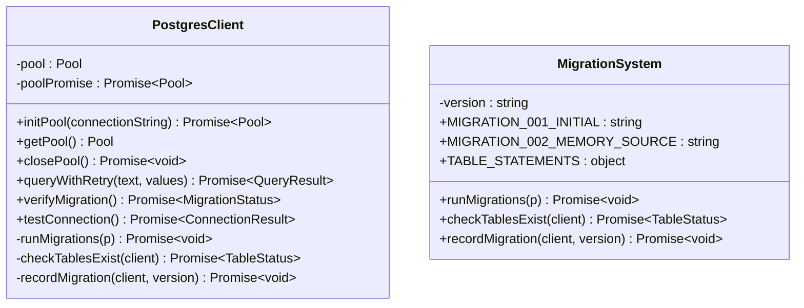

# Storage System

<cite>
**Referenced Files in This Document**
- [postgresClient.ts](file://src/chat/db/postgresClient.ts)
- [threadRepository.ts](file://src/chat/db/threadRepository.ts)
- [messageRepository.ts](file://src/chat/db/messageRepository.ts)
- [memoryRepository.ts](file://src/chat/db/memoryRepository.ts)
- [architectureRepository.ts](file://src/chat/db/architectureRepository.ts)
- [batchRepository.ts](file://src/chat/db/batchRepository.ts)
- [extension.ts](file://src/extension.ts)
- [databaseService.ts](file://src/core/storage/databaseService.ts)
- [bundleDataProvider.ts](file://src/core/bundles/bundleDataProvider.ts)
- [bundleFileDecorationProvider.ts](file://src/core/bundles/bundleFileDecorationProvider.ts)
- [bundleManager.ts](file://src/core/bundles/bundleManager.ts)
- [types.ts](file://src/core/bundles/types.ts)
- [runRepomixOnSelectedFiles.ts](file://src/commands/runRepomixOnSelectedFiles.ts)
- [repoEmbeddingOrchestrator.ts](file://src/core/indexing/repoEmbeddingOrchestrator.ts)
- [migrationService.ts](file://src/core/indexing/migrationService.ts)
- [conversationService.ts](file://src/services/conversationService.ts)
- [planService.ts](file://src/services/planService.ts)
- [chat.ts](file://src/types/chat.ts)
- [GitService.ts](file://src/git/GitService.ts)
- [BranchMaintenanceService.ts](file://src/core/indexing/BranchMaintenanceService.ts)
- [vectorIdentity.ts](file://src/core/indexing/vectorIdentity.ts)
- [001_initial_schema.sql](file://src/chat/db/migrations/001_initial_schema.sql)
- [002_compression_schema.sql](file://src/chat/db/migrations/002_compression_schema.sql)
- [compressContext.ts](file://src/chat/nodes/compressContext.ts)
- [contextManager.ts](file://src/chat/compression/contextManager.ts)
- [batchManager.ts](file://src/chat/batch/batchManager.ts)
- [batchPoller.ts](file://src/chat/batch/batchPoller.ts)
- [batchRepository.ts](file://src/chat/batch/batchRepository.ts)
- [batchTypes.ts](file://src/chat/batch/types.ts)
</cite>

## Update Summary
**Changes Made**
- Complete architectural transformation from file-based persistence to PostgreSQL-backed storage
- Added comprehensive PostgreSQL connection management with connection pooling and retry logic
- Implemented migration system with schema_migrations tracking and idempotent migrations
- Enhanced conversation service with PostgreSQL-backed thread and message persistence
- Integrated plan service with PostgreSQL-backed batch job management
- Added reactive context compression with PostgreSQL-backed compression tracking
- Implemented comprehensive batch processing capabilities with PostgreSQL-backed job management
- Enhanced branch-aware indexing system with PostgreSQL transaction support

## Table of Contents
1. [Introduction](#introduction)
2. [Project Structure](#project-structure)
3. [Core Components](#core-components)
4. [Architecture Overview](#architecture-overview)
5. [Detailed Component Analysis](#detailed-component-analysis)
6. [PostgreSQL Connection Management](#postgresql-connection-management)
7. [Enhanced Conversation and Plan Persistence](#enhanced-conversation-and-plan-persistence)
8. [Reactive Context Compression](#reactive-context-compression)
9. [Batch Processing System](#batch-processing-system)
10. [Branch-Aware Indexing System](#branch-aware-indexing-system)
11. [Migration and Schema Management](#migration-and-schema-management)
12. [Performance Considerations](#performance-considerations)
13. [Troubleshooting Guide](#troubleshooting-guide)
14. [Conclusion](#conclusion)
15. [Appendices](#appendices)

## Introduction
This document describes the Storage System responsible for local and cloud data persistence in the extension. The system has undergone a major architectural transformation from file-based persistence to PostgreSQL-backed storage with comprehensive connection management, transaction support, and enhanced conversation/plan persistence. The system provides robust, scalable storage for agent runs, debug sessions, bundle metadata, branch-aware incremental indexing state, conversation threads, message history, memory entries, and batch processing jobs. It includes PostgreSQL connection pooling, migration management, transaction support, and comprehensive data models for collaborative conversation management and batch processing workflows.

## Project Structure
The storage system now centers around PostgreSQL-backed repositories that provide robust, scalable persistence for all conversational AI features. The extension initializes both the legacy SQLite DatabaseService for backward compatibility and PostgreSQL connection pools for new features. The system integrates PostgreSQL repositories with background indexing, agent runs, bundle management, conversation services, plan management, and branch maintenance operations.

```mermaid
graph TB
subgraph "Extension Activation"
EXT["extension.ts<br/>Initialize DatabaseService + PostgreSQL Pool"]
END
subgraph "PostgreSQL Storage Layer"
PG["PostgreSQL Pool<br/>Connection Management<br/>Transaction Support"]
MIG["Migration System<br/>schema_migrations<br/>Idempotent Migrations"]
END
subgraph "Conversation Storage"
TR["ThreadRepository<br/>chat_threads"]
MR["MessageRepository<br/>chat_messages<br/>Compression Tracking"]
MEM["MemoryRepository<br/>chat_memory<br/>Source Tracking"]
AR["ArchitectureRepository<br/>repo_architecture"]
BR["BatchRepository<br/>batch_jobs<br/>Status Tracking"]
END
subgraph "Legacy Storage"
DB["DatabaseService<br/>SQLite + Branch-aware<br/>File-based Persistence"]
END
subgraph "Indexing"
RIO["RepoEmbeddingOrchestrator<br/>Background re-embedding<br/>Transaction Support"]
WAT["RepoIndexMonitor<br/>File watcher + debounce"]
GS["GitService<br/>Branch detection + management"]
END
subgraph "Bundles"
BM["BundleManager<br/>.repomix/bundles.json"]
BDP["BundleDataProvider<br/>VS Code Tree View"]
BFD["BundleFileDecorationProvider<br/>File decorations"]
END
EXT --> PG
EXT --> DB
EXT --> RIO
EXT --> BM
EXT --> BDP
EXT --> BFD
PG --> TR
PG --> MR
PG --> MEM
PG --> AR
PG --> BR
DB --> RIO
DB --> GS
MIG --> PG
WAT --> DB
```

**Diagram sources**
- [extension.ts](file://src/extension.ts#L58-L157)
- [postgresClient.ts](file://src/chat/db/postgresClient.ts#L1-L486)
- [threadRepository.ts](file://src/chat/db/threadRepository.ts#L1-L153)
- [messageRepository.ts](file://src/chat/db/messageRepository.ts#L1-L321)
- [memoryRepository.ts](file://src/chat/db/memoryRepository.ts#L1-L243)
- [architectureRepository.ts](file://src/chat/db/architectureRepository.ts#L1-L105)
- [batchRepository.ts](file://src/chat/db/batchRepository.ts#L1-L212)
- [databaseService.ts](file://src/core/storage/databaseService.ts#L112-L1817)

**Section sources**
- [extension.ts](file://src/extension.ts#L58-L157)
- [postgresClient.ts](file://src/chat/db/postgresClient.ts#L1-L486)

## Core Components
- **PostgreSQL Client**: Manages connection pooling, retry logic, and migration verification with robust error handling and connection lifecycle management.
- **ThreadRepository**: Manages conversation threads with full CRUD operations, status tracking, and PostgreSQL-native transaction support.
- **MessageRepository**: Handles message persistence with compression tracking, pagination support, and efficient retrieval patterns.
- **MemoryRepository**: Provides memory management with scope-based organization, expiration handling, and PostgreSQL-native JSONB support.
- **ArchitectureRepository**: Stores repository architecture snapshots with TTL management and PostgreSQL-specific data types.
- **BatchRepository**: Manages batch processing jobs with status tracking, metadata persistence, and PostgreSQL-native JSONB payloads.
- **DatabaseService**: Legacy SQLite-based service with branch-aware schema for backward compatibility and migration support.
- **BundleManager**: Manages bundle metadata stored in .repomix/bundles.json.
- **BundleDataProvider**: VS Code TreeDataProvider that builds and refreshes the bundle explorer UI.
- **BundleFileDecorationProvider**: Provides file decorations for bundle files.
- **RepoEmbeddingOrchestrator**: Coordinates incremental embedding with PostgreSQL transaction support and branch-aware operations.
- **MigrationService**: Switches vector DB providers and resets local index state.
- **ConversationService**: Manages conversation threads and message persistence in JSON files with comprehensive thread lifecycle management.
- **PlanService**: Handles plan file management with surgical editing capabilities and safe file naming.
- **BranchMaintenanceService**: Cleans up stale branches and their associated data using Git integration.
- **GitService**: Provides Git repository access, branch detection, and branch change notifications.

**Section sources**
- [postgresClient.ts](file://src/chat/db/postgresClient.ts#L1-L486)
- [threadRepository.ts](file://src/chat/db/threadRepository.ts#L1-L153)
- [messageRepository.ts](file://src/chat/db/messageRepository.ts#L1-L321)
- [memoryRepository.ts](file://src/chat/db/memoryRepository.ts#L1-L243)
- [architectureRepository.ts](file://src/chat/db/architectureRepository.ts#L1-L105)
- [batchRepository.ts](file://src/chat/db/batchRepository.ts#L1-L212)
- [databaseService.ts](file://src/core/storage/databaseService.ts#L112-L1817)

## Architecture Overview
The extension initializes both legacy SQLite DatabaseService and PostgreSQL connection pools during activation. PostgreSQL repositories provide robust, scalable persistence for conversation threads, messages, memory entries, and batch jobs with full transaction support. The system maintains backward compatibility while leveraging PostgreSQL's advanced features like JSONB, arrays, and proper data typing. Background indexing uses PostgreSQL transactions for consistency, and bundle management continues with file-based storage for backward compatibility.

```mermaid
sequenceDiagram
participant Ext as "extension.ts"
participant DB as "DatabaseService"
participant PG as "PostgreSQL Pool"
participant TR as "ThreadRepository"
participant MR as "MessageRepository"
participant MEM as "MemoryRepository"
participant GS as "GitService"
Ext->>DB : new DatabaseService(context)<br/>initialize()
Ext->>PG : initPool(connectionString)<br/>runMigrations()
Ext->>TR : new ThreadRepository(PG)
Ext->>MR : new MessageRepository(PG)
Ext->>MEM : new MemoryRepository(PG)
Ext->>GS : new GitService()
Note over Ext,DB,PG : Extension activation complete
```

**Diagram sources**
- [extension.ts](file://src/extension.ts#L73-L106)
- [postgresClient.ts](file://src/chat/db/postgresClient.ts#L282-L312)
- [threadRepository.ts](file://src/chat/db/threadRepository.ts#L46-L58)
- [messageRepository.ts](file://src/chat/db/messageRepository.ts#L82-L92)
- [memoryRepository.ts](file://src/chat/db/memoryRepository.ts#L41-L51)
- [GitService.ts](file://src/git/GitService.ts#L29-L48)

## Detailed Component Analysis

### PostgreSQL Connection Management
The PostgreSQL client provides comprehensive connection management with robust error handling and retry logic:

**Connection Pool Configuration**:
- Max connections: 10 concurrent connections
- Idle timeout: 30 seconds
- Connection timeout: 10 seconds
- Automatic pool recovery on connection failures

**Retry Logic**:
- Automatic retry for retryable connection errors (timeouts, connection terminated, refused connections)
- 250ms delay between retry attempts
- Comprehensive error logging for failed connections

**Migration Management**:
- schema_migrations table for tracking applied migrations
- Idempotent migrations that can be safely re-applied
- Individual table existence checks for partial failure recovery
- Migration verification endpoint for health checks

**Connection Lifecycle**:
- Lazy initialization with promise-based pool creation
- Graceful pool shutdown on extension deactivation
- Error event handling for unexpected connection issues



**Diagram sources**
- [postgresClient.ts](file://src/chat/db/postgresClient.ts#L1-L486)

**Section sources**
- [postgresClient.ts](file://src/chat/db/postgresClient.ts#L282-L368)
- [postgresClient.ts](file://src/chat/db/postgresClient.ts#L198-L280)
- [postgresClient.ts](file://src/chat/db/postgresClient.ts#L370-L486)

### ThreadRepository
Manages conversation threads with full CRUD operations and PostgreSQL-native features:

**Thread Management**:
- UUID primary keys with PostgreSQL-generated defaults
- Repository-scoped thread organization with repo_id
- Status tracking (active, archived, deleted) with proper constraints
- Automatic timestamp management (created_at, updated_at)
- Preview generation for thread listings

**Advanced Features**:
- Thread pagination with cursor-based navigation
- Repository-scoped thread listing with updated_at ordering
- Atomic thread updates with selective field updates
- Status-based filtering for active thread retrieval

**Data Integrity**:
- PostgreSQL CHECK constraints for status values
- Proper UUID handling with native PostgreSQL UUID type
- Automatic title normalization and length validation

**Section sources**
- [threadRepository.ts](file://src/chat/db/threadRepository.ts#L46-L153)

### MessageRepository
Handles message persistence with advanced compression tracking and pagination:

**Message Management**:
- UUID primary keys with PostgreSQL-generated defaults
- Thread relationship with cascading deletes
- Role-based validation (user, assistant, system)
- Timestamp conversion between milliseconds and PostgreSQL TIMESTAMPTZ

**Compression Integration**:
- is_compressed flag for tracking compressed messages
- original_content storage for compression recovery
- compressed_into foreign key linking to summary messages
- compression_metadata JSONB for compression analytics

**Pagination and Retrieval**:
- Cursor-based pagination with timestamp and ID ordering
- Page size limits (1-500 messages per request)
- Efficient retrieval of uncompressed messages for prompt building
- Summary message identification through metadata flags

**Section sources**
- [messageRepository.ts](file://src/chat/db/messageRepository.ts#L82-L321)

### MemoryRepository
Provides comprehensive memory management with scope-based organization:

**Memory Scopes**:
- Session scope for thread-specific memory
- Repository scope for repository-wide memory
- Global scope for system-wide memory
- Proper scope_id handling for each scope type

**Advanced Features**:
- Expiration handling with expires_at timestamps
- Embedding vector storage for semantic memory
- Source tracking (user vs auto-generated) with validation
- Keyword search across key and value fields

**Data Integrity**:
- Unique constraint on (scope, scope_id, key) combination
- Proper JSONB handling for complex memory values
- Automatic timestamp updates on modifications

**Section sources**
- [memoryRepository.ts](file://src/chat/db/memoryRepository.ts#L41-L243)

### ArchitectureRepository
Stores repository architecture snapshots with TTL management:

**Architecture Management**:
- Markdown tree representation for repository structure
- Folder explanations with JSONB storage
- Git commit tracking for version control integration
- TTL-based expiration with automatic cleanup

**Data Persistence**:
- Upsert operations with conflict resolution
- Expiration-based cleanup for stale architecture data
- Token usage tracking for cost estimation
- Repository-specific architecture snapshots

**Section sources**
- [architectureRepository.ts](file://src/chat/db/architectureRepository.ts#L26-L105)

### DatabaseService (Legacy)
Maintains backward compatibility with SQLite-based storage:

**Enhanced with Branch Awareness**:
- Branch-aware table schemas with unique constraints
- Migration system for converting to branch-aware format
- Enhanced indexing with branch-specific operations
- Transaction support for consistency

**Legacy Features**:
- SQLite file persistence with automatic backup
- Comprehensive indexing state tracking
- Blueprint storage for architectural analysis
- Pause checkpoint management for resumable indexing

**Section sources**
- [databaseService.ts](file://src/core/storage/databaseService.ts#L112-L1817)

## PostgreSQL Connection Management

### Connection Pool Configuration
The PostgreSQL client implements robust connection management with configurable pool parameters:

**Pool Parameters**:
- max: 10 concurrent connections for balanced resource usage
- idleTimeoutMillis: 30000ms for efficient connection reuse
- connectionTimeoutMillis: 10000ms for responsive connection establishment
- Automatic pool recovery on connection failures

**Connection Lifecycle**:
- Lazy initialization with promise-based pool creation
- Graceful pool shutdown on extension deactivation
- Error event handling for unexpected connection issues
- Retry logic for transient connection failures

### Migration System
The system includes comprehensive migration management with schema tracking:

**Migration Tracking**:
- schema_migrations table for recording applied migrations
- Idempotent migrations that can be safely re-applied
- Individual table existence checks for partial failure recovery
- Migration verification endpoint for health monitoring

**Migration Process**:
- Initial migration creates all required tables
- Subsequent migrations add new features incrementally
- Transactional migration application with rollback support
- Proper error handling and logging for migration failures

**Section sources**
- [postgresClient.ts](file://src/chat/db/postgresClient.ts#L198-L280)
- [postgresClient.ts](file://src/chat/db/postgresClient.ts#L370-L486)
- [001_initial_schema.sql](file://src/chat/db/migrations/001_initial_schema.sql#L1-L87)
- [002_compression_schema.sql](file://src/chat/db/migrations/002_compression_schema.sql#L1-L21)

## Enhanced Conversation and Plan Persistence

### Conversation Service
The conversation service now integrates with PostgreSQL-backed repositories for enhanced persistence:

**Thread Management**:
- PostgreSQL-backed thread creation with UUID generation
- Repository-scoped thread organization with proper indexing
- Status tracking (active, archived, deleted) with validation
- Automatic preview generation and token counting

**Message Persistence**:
- PostgreSQL-backed message storage with compression tracking
- Cursor-based pagination for efficient message retrieval
- Compression-aware message filtering for prompt building
- Summary message support for compressed conversation history

**Data Storage**:
- PostgreSQL tables for structured conversation data
- JSONB support for flexible message metadata
- Proper timestamp handling with TIMESTAMPTZ
- Automatic thread metadata updates on message operations

### Plan Service
The plan service maintains file-based storage while integrating with PostgreSQL for batch processing:

**File Management**:
- Plan files stored in .repomix/plans directory
- Safe file naming with sanitized IDs
- Surgical editing capabilities with exact text matching
- Ambiguity detection for precise replacements

**Batch Integration**:
- PostgreSQL-backed batch job management
- Status tracking for batch processing workflows
- Metadata persistence for batch job details
- Integration with conversation threads for context

**Section sources**
- [threadRepository.ts](file://src/chat/db/threadRepository.ts#L46-L153)
- [messageRepository.ts](file://src/chat/db/messageRepository.ts#L82-L321)
- [conversationService.ts](file://src/services/conversationService.ts#L18-L157)
- [planService.ts](file://src/services/planService.ts#L10-L95)

## Reactive Context Compression

### Compression Integration
The system implements reactive context compression with PostgreSQL-backed tracking:

**Compression Tracking**:
- is_compressed flag for individual message compression status
- original_content storage for compression recovery
- compressed_into foreign key linking compressed messages to summaries
- compression_metadata JSONB for analytics and recovery data

**Context Management**:
- Token-aware compression with configurable thresholds
- History summarization for reducing context size
- File compression for large code contexts
- Reactive compression triggered when token limits are exceeded

**Message Filtering**:
- Efficient retrieval of uncompressed messages for prompt building
- Summary message identification through metadata flags
- Proper handling of compressed message chains
- Recovery mechanisms for compressed content

**Section sources**
- [compressContext.ts](file://src/chat/nodes/compressContext.ts#L1-L75)
- [contextManager.ts](file://src/chat/compression/contextManager.ts#L22-L92)
- [messageRepository.ts](file://src/chat/db/messageRepository.ts#L223-L321)

## Batch Processing System

### Batch Repository
The batch processing system provides comprehensive job management with PostgreSQL-backed persistence:

**Batch Job Management**:
- UUID primary keys with PostgreSQL-generated defaults
- Status tracking (draft, pending, submitted, processing, completed, failed, cancelled)
- Package type validation (plan, code_change, code_review)
- Metadata persistence for job details and analytics

**Job Lifecycle**:
- Draft job creation with prompt payload storage
- Submission tracking with batch API integration
- Status monitoring and completion handling
- Error tracking and recovery mechanisms

**Data Persistence**:
- JSONB payloads for flexible job configuration
- Timestamp tracking for job lifecycle management
- Thread association for conversation context
- Cost tracking for billing and analytics

**Section sources**
- [batchRepository.ts](file://src/chat/db/batchRepository.ts#L1-L212)
- [batchManager.ts](file://src/chat/batch/batchManager.ts#L293-L329)
- [batchPoller.ts](file://src/chat/batch/batchPoller.ts)
- [batchTypes.ts](file://src/chat/batch/types.ts#L64-L85)

## Branch-Aware Indexing System

### Schema Design
The database now supports branch-aware indexing through enhanced table schemas:

**Primary Key Changes**:
- `repo_indexing_progress`: `(repo_id, branch_name, file_path)` - unique per branch per file
- `repo_file_state`: `(repo_id, branch_name, file_path)` - unique per branch per file
- `index_history`: Maintains branch context for debugging events

**Enhanced Columns**:
- `branch_name`: TEXT NOT NULL DEFAULT 'default_branch' - identifies branch context
- `commit_sha`: TEXT - stores commit hash for version control integration
- `is_merged`: INTEGER - tracks merge status for branch management
- `last_synced_at`: INTEGER - timestamp for sync operations

### Migration Strategy
The system includes comprehensive migration procedures:

**Legacy Detection**:
- Automatic detection of existing single-branch schema
- Column existence checks for branch_name, commit_sha, is_merged, last_synced_at
- Unique index verification for branch-aware constraints

**Data Preservation**:
- Safe renaming of legacy tables with `_legacy` suffix
- Controlled data migration with DEFAULT_BRANCH_NAME backfill
- Transactional operations to prevent data loss

**Index Optimization**:
- Creation of branch-aware unique indexes
- Enhanced query performance with branch-specific filtering
- Support for branch-specific cleanup operations

### Branch Management Operations
**Tracking and Cleanup**:
- `getTrackedBranches(repoId)`: Lists all branches with data in the system
- `clearBranchData(repoId, branchName)`: Removes all data for a specific branch
- `BranchMaintenanceService`: Automated cleanup of stale branches

**Operational Benefits**:
- Isolated indexing per branch prevents conflicts
- Support for feature branch workflows
- Enhanced debugging with branch context
- Improved performance through selective branch operations

**Section sources**
- [databaseService.ts](file://src/core/storage/databaseService.ts#L196-L227)
- [databaseService.ts](file://src/core/storage/databaseService.ts#L365-L487)
- [databaseService.ts](file://src/core/storage/databaseService.ts#L1766-L1807)
- [BranchMaintenanceService.ts](file://src/core/indexing/BranchMaintenanceService.ts#L6-L32)
- [GitService.ts](file://src/git/GitService.ts#L51-L55)

## Migration and Schema Management

### Migration System
The PostgreSQL migration system provides comprehensive schema evolution:

**Migration Tracking**:
- schema_migrations table for recording applied migrations
- Version-based migration identification
- Idempotent migration application
- Migration verification and health checking

**Migration Process**:
- Initial migration creates all required tables
- Subsequent migrations add new features incrementally
- Transactional migration application with rollback support
- Individual table existence checks for partial failure recovery

**Migration Verification**:
- verifyMigration endpoint for health checks
- Missing table detection and reporting
- Migration status validation
- Connection testing with version information

**Section sources**
- [postgresClient.ts](file://src/chat/db/postgresClient.ts#L198-L280)
- [postgresClient.ts](file://src/chat/db/postgresClient.ts#L370-L486)
- [001_initial_schema.sql](file://src/chat/db/migrations/001_initial_schema.sql#L1-L87)
- [002_compression_schema.sql](file://src/chat/db/migrations/002_compression_schema.sql#L1-L21)

## Performance Considerations
- **Connection Pooling**:
  - PostgreSQL pool with 10 concurrent connections for optimal throughput
  - Connection timeout of 10 seconds for responsive operation
  - Idle timeout of 30 seconds for efficient resource utilization
- **Transaction Management**:
  - Message operations wrapped in transactions for consistency
  - Batch job updates use atomic operations
  - Thread updates support selective field updates
- **Indexing Strategy**:
  - PostgreSQL indexes on frequently queried columns
  - Composite indexes for thread and timestamp queries
  - Specialized indexes for compression tracking
- **Pagination**:
  - Cursor-based pagination for efficient message retrieval
  - Page size limits (1-500 messages) for memory efficiency
  - Optimized queries with proper ordering
- **Compression Efficiency**:
  - Reactive compression reduces context size dynamically
  - Efficient retrieval of uncompressed messages for prompts
  - Metadata storage for compression analytics
- **Git Integration**:
  - Branch change detection with event listeners
  - Cleanup operations scheduled with timeouts
  - Stale branch detection and removal

**Section sources**
- [postgresClient.ts](file://src/chat/db/postgresClient.ts#L295-L312)
- [messageRepository.ts](file://src/chat/db/messageRepository.ts#L165-L212)
- [compressContext.ts](file://src/chat/nodes/compressContext.ts#L36-L75)
- [GitService.ts](file://src/git/GitService.ts#L110-L136)

## Troubleshooting Guide
- **PostgreSQL Connection Issues**:
  - Verify connection string in Repomix Runner settings
  - Check PostgreSQL server availability and network connectivity
  - Review connection pool errors and retry attempts
  - Use testConnection endpoint for diagnostic information
- **Migration Failures**:
  - Check schema_migrations table for applied migrations
  - Verify table existence with verifyMigration endpoint
  - Review migration logs for specific error details
  - Manual migration execution if automatic migration fails
- **Transaction Errors**:
  - Message operations use automatic transaction rollback
  - Batch job updates support atomic operations
  - Thread updates handle partial failures gracefully
- **Compression Issues**:
  - Verify compression tracking columns exist
  - Check compression metadata for recovery data
  - Review compression analytics in metadata
- **Performance Issues**:
  - Monitor connection pool utilization
  - Check query performance with proper indexing
  - Review pagination limits and cursor usage
- **Data Integrity**:
  - Verify unique constraints for thread and memory entries
  - Check foreign key relationships for referential integrity
  - Review transaction isolation levels

**Section sources**
- [postgresClient.ts](file://src/chat/db/postgresClient.ts#L461-L486)
- [postgresClient.ts](file://src/chat/db/postgresClient.ts#L370-L486)
- [messageRepository.ts](file://src/chat/db/messageRepository.ts#L138-L144)
- [compressContext.ts](file://src/chat/nodes/compressContext.ts#L43-L50)

## Conclusion
The Storage System has evolved into a comprehensive PostgreSQL-backed architecture that provides robust, scalable persistence for all conversational AI features. The system includes sophisticated connection management with pooling and retry logic, comprehensive migration support with schema tracking, and advanced features like reactive context compression and batch processing. The integration of PostgreSQL repositories with transaction support ensures data consistency and reliability. The system maintains backward compatibility with legacy SQLite storage while leveraging PostgreSQL's advanced features for enhanced performance and scalability. Branch-aware indexing, conversation persistence, and batch processing workflows demonstrate the system's capability to handle complex, real-world scenarios with enterprise-grade reliability.

## Appendices

### API Surface Summary
- **PostgreSQL Connection**: initPool, getPool, closePool, queryWithRetry, verifyMigration, testConnection
- **Thread Management**: createThread, getThreads, getThread, updateThread, renameThread, archiveThread, deleteThread
- **Message Management**: saveMessage, getMessages, getMessagesPage, deleteMessage, getUncompressedMessages, markMessagesAsCompressed, saveSummaryMessage, getSummaryMessages
- **Memory Management**: createMemory, getMemoryById, listMemoryByScope, updateMemory, deleteMemory, searchByKeyword, deleteAllByScope, existsByKey
- **Architecture Management**: upsertArchitecture, getArchitectureByRepoId, deleteArchitectureByRepoId
- **Batch Management**: createBatchJob, getBatchJob, updateBatchJob, getPendingBatches, getBatchesByStatus, deleteBatchJob
- **Legacy SQLite**: saveAgentRun, getAgentRunHistory, saveRepoFilesBatch, initializeIndexingProgress, markRepoFileIndexed, getTrackedBranches, clearBranchData
- **Migration Management**: runMigrations, verifyMigration, checkTablesExist, recordMigration

**Section sources**
- [postgresClient.ts](file://src/chat/db/postgresClient.ts#L282-L368)
- [threadRepository.ts](file://src/chat/db/threadRepository.ts#L49-L152)
- [messageRepository.ts](file://src/chat/db/messageRepository.ts#L85-L320)
- [memoryRepository.ts](file://src/chat/db/memoryRepository.ts#L48-L242)
- [architectureRepository.ts](file://src/chat/db/architectureRepository.ts#L29-L104)
- [batchRepository.ts](file://src/chat/db/batchRepository.ts#L158-L212)
- [databaseService.ts](file://src/core/storage/databaseService.ts#L579-L680)
- [databaseService.ts](file://src/core/storage/databaseService.ts#L759-L941)
- [databaseService.ts](file://src/core/storage/databaseService.ts#L1089-L1255)
- [databaseService.ts](file://src/core/storage/databaseService.ts#L1766-L1807)