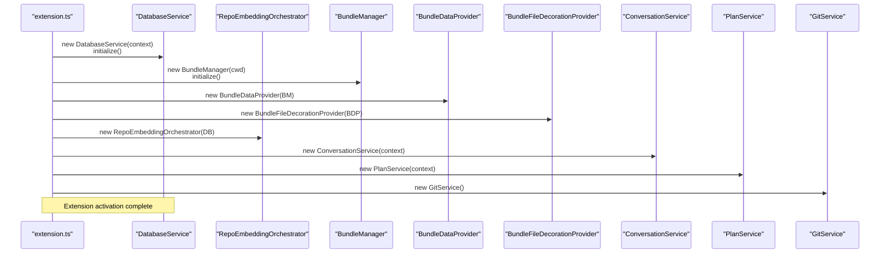
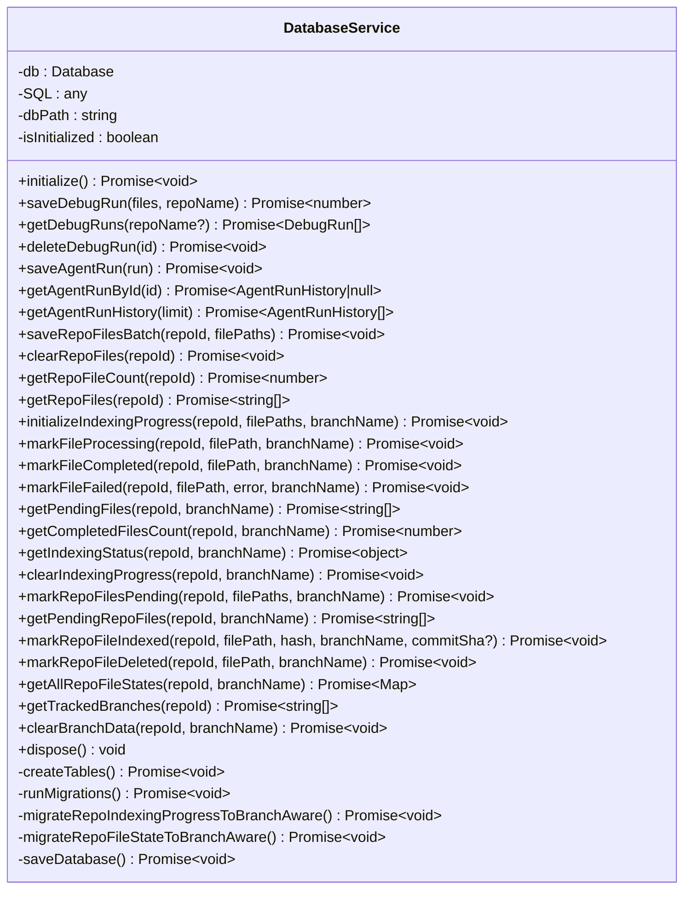
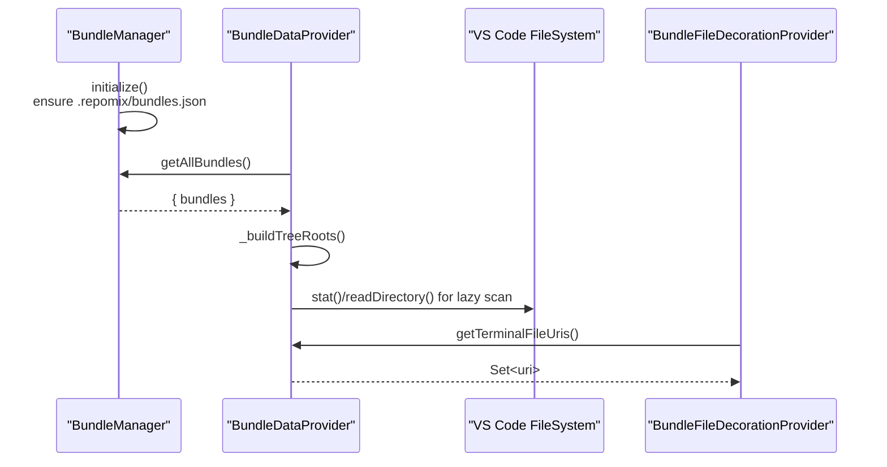
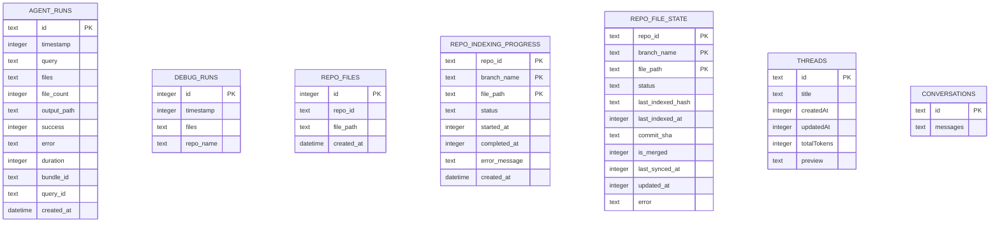
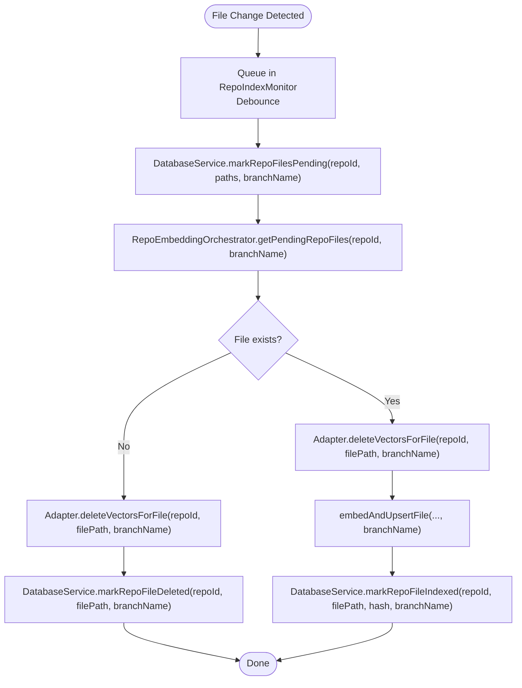

# Storage System

<cite>
**Referenced Files in This Document**
- [databaseService.ts](file://src/core/storage/databaseService.ts)
- [extension.ts](file://src/extension.ts)
- [bundleDataProvider.ts](file://src/core/bundles/bundleDataProvider.ts)
- [bundleFileDecorationProvider.ts](file://src/core/bundles/bundleFileDecorationProvider.ts)
- [bundleManager.ts](file://src/core/bundles/bundleManager.ts)
- [types.ts](file://src/core/bundles/types.ts)
- [runRepomixOnSelectedFiles.ts](file://src/commands/runRepomixOnSelectedFiles.ts)
- [repoEmbeddingOrchestrator.ts](file://src/core/indexing/repoEmbeddingOrchestrator.ts)
- [migrationService.ts](file://src/core/indexing/migrationService.ts)
- [conversationService.ts](file://src/services/conversationService.ts)
- [planService.ts](file://src/services/planService.ts)
- [chat.ts](file://src/types/chat.ts)
- [GitService.ts](file://src/git/GitService.ts)
- [BranchMaintenanceService.ts](file://src/core/indexing/BranchMaintenanceService.ts)
- [vectorIdentity.ts](file://src/core/indexing/vectorIdentity.ts)
</cite>

## Update Summary
**Changes Made**
- Enhanced database schema with comprehensive branch-aware indexing support
- Added comprehensive conversation service for thread persistence and message management
- Integrated plan service for plan file management with surgical editing capabilities
- Implemented Git integration for branch management and automatic branch detection
- Added BranchMaintenanceService for automated cleanup of stale branches
- Enhanced migration procedures to support branch-aware schema transformations
- Updated indexing state tracking with branch-specific data management and Git integration

## Table of Contents
1. [Introduction](#introduction)
2. [Project Structure](#project-structure)
3. [Core Components](#core-components)
4. [Architecture Overview](#architecture-overview)
5. [Detailed Component Analysis](#detailed-component-analysis)
6. [Branch-Aware Indexing System](#branch-aware-indexing-system)
7. [Enhanced Conversation and Plan Persistence](#enhanced-conversation-and-plan-persistence)
8. [Git Integration and Branch Management](#git-integration-and-branch-management)
9. [Dependency Analysis](#dependency-analysis)
10. [Performance Considerations](#performance-considerations)
11. [Troubleshooting Guide](#troubleshooting-guide)
12. [Conclusion](#conclusion)
13. [Appendices](#appendices)

## Introduction
This document describes the Storage System responsible for local data persistence in the extension. It covers the SQLite database implementation powered by sql.js, the database schema for bundles, file decorations, application state, and branch-aware indexing with enhanced conversation/plan persistence. The system provides CRUD operations, transactions, migrations, and comprehensive data models for bundles, indexing state, and collaborative conversation management. It also documents synchronization patterns, caching strategies, performance optimizations, backup and restore procedures, data export capabilities, migration between versions, maintenance procedures, troubleshooting, and privacy considerations.

## Project Structure
The storage system centers around a comprehensive DatabaseService that encapsulates initialization, schema creation, migrations, and persistence of the SQLite database file. The extension activates the service early and integrates it with background indexing, agent runs, bundle management, conversation services, plan management, and branch maintenance operations with Git integration.

```mermaid
graph TB
subgraph "Extension Activation"
EXT["extension.ts<br/>Initialize DatabaseService + Services"]
END
subgraph "Storage Layer"
DB["DatabaseService<br/>sql.js + SQLite file<br/>Branch-aware Schema"]
MIG["MigrationService<br/>Switch provider + reset state"]
BMS["BranchMaintenanceService<br/>Clean stale branches<br/>Git integration"]
END
subgraph "Indexing"
RIO["RepoEmbeddingOrchestrator<br/>Background re-embedding<br/>Branch-aware"]
WAT["RepoIndexMonitor<br/>File watcher + debounce"]
GS["GitService<br/>Branch detection + management"]
END
subgraph "Bundles"
BM["BundleManager<br/>.repomix/bundles.json"]
BDP["BundleDataProvider<br/>VS Code Tree View"]
BFD["BundleFileDecorationProvider<br/>File decorations"]
END
subgraph "Conversations & Plans"
CS["ConversationService<br/>JSON file storage<br/>Thread persistence"]
PS["PlanService<br/>.repomix/plans directory<br/>Surgical editing"]
END
EXT --> DB
EXT --> RIO
EXT --> BM
EXT --> BDP
EXT --> BFD
EXT --> CS
EXT --> PS
EXT --> BMS
EXT --> GS
RIO --> DB
RIO --> GS
MIG --> DB
WAT --> DB
BMS --> DB
BMS --> GS
```

**Diagram sources**
- [extension.ts](file://src/extension.ts#L50-L200)
- [databaseService.ts](file://src/core/storage/databaseService.ts#L112-L293)
- [repoEmbeddingOrchestrator.ts](file://src/core/indexing/repoEmbeddingOrchestrator.ts#L36-L64)
- [migrationService.ts](file://src/core/indexing/migrationService.ts#L7-L46)
- [bundleManager.ts](file://src/core/bundles/bundleManager.ts#L6-L30)
- [bundleDataProvider.ts](file://src/core/bundles/bundleDataProvider.ts#L18-L46)
- [bundleFileDecorationProvider.ts](file://src/core/bundles/bundleFileDecorationProvider.ts#L4-L29)
- [conversationService.ts](file://src/services/conversationService.ts#L18-L37)
- [planService.ts](file://src/services/planService.ts#L10-L24)
- [BranchMaintenanceService.ts](file://src/core/indexing/BranchMaintenanceService.ts#L6-L32)
- [GitService.ts](file://src/git/GitService.ts#L29-L48)

**Section sources**
- [extension.ts](file://src/extension.ts#L50-L200)
- [databaseService.ts](file://src/core/storage/databaseService.ts#L112-L293)

## Core Components
- **DatabaseService**: Initializes sql.js, manages branch-aware schema creation and migrations, persists the SQLite file, and exposes CRUD and indexing APIs with branch-specific operations.
- **BundleManager**: Manages bundle metadata stored in .repomix/bundles.json.
- **BundleDataProvider**: VS Code TreeDataProvider that builds and refreshes the bundle explorer UI.
- **BundleFileDecorationProvider**: Provides file decorations for bundle files.
- **RepoEmbeddingOrchestrator**: Coordinates incremental embedding with branch-aware operations and interacts with DatabaseService for state.
- **MigrationService**: Switches vector DB providers and resets local index state.
- **ConversationService**: Manages conversation threads and message persistence in JSON files with comprehensive thread lifecycle management.
- **PlanService**: Handles plan file management with surgical editing capabilities and safe file naming.
- **BranchMaintenanceService**: Cleans up stale branches and their associated data using Git integration.
- **GitService**: Provides Git repository access, branch detection, and branch change notifications.

**Section sources**
- [databaseService.ts](file://src/core/storage/databaseService.ts#L112-L1817)
- [bundleManager.ts](file://src/core/bundles/bundleManager.ts#L6-L116)
- [bundleDataProvider.ts](file://src/core/bundles/bundleDataProvider.ts#L18-L324)
- [bundleFileDecorationProvider.ts](file://src/core/bundles/bundleFileDecorationProvider.ts#L4-L29)
- [repoEmbeddingOrchestrator.ts](file://src/core/indexing/repoEmbeddingOrchestrator.ts#L36-L64)
- [migrationService.ts](file://src/core/indexing/migrationService.ts#L7-L46)
- [conversationService.ts](file://src/services/conversationService.ts#L18-L157)
- [planService.ts](file://src/services/planService.ts#L10-L95)
- [BranchMaintenanceService.ts](file://src/core/indexing/BranchMaintenanceService.ts#L6-L32)
- [GitService.ts](file://src/git/GitService.ts#L29-L48)

## Architecture Overview
The extension initializes DatabaseService during activation. Background indexing uses a file watcher and RepoEmbeddingOrchestrator to maintain an incremental index per branch with Git integration. Bundles are stored in a JSON file under the workspace's .repomix directory. The bundle tree view and file decorations are provided via dedicated providers. Enhanced conversation and plan services provide collaborative persistence with separate file-based storage systems. Branch maintenance services coordinate with Git to clean up stale branches and their data.



**Diagram sources**
- [extension.ts](file://src/extension.ts#L50-L200)
- [databaseService.ts](file://src/core/storage/databaseService.ts#L112-L293)
- [bundleManager.ts](file://src/core/bundles/bundleManager.ts#L13-L30)
- [bundleDataProvider.ts](file://src/core/bundles/bundleDataProvider.ts#L28-L46)
- [bundleFileDecorationProvider.ts](file://src/core/bundles/bundleFileDecorationProvider.ts#L10-L29)
- [repoEmbeddingOrchestrator.ts](file://src/core/indexing/repoEmbeddingOrchestrator.ts#L36-L64)
- [conversationService.ts](file://src/services/conversationService.ts#L18-L37)
- [planService.ts](file://src/services/planService.ts#L10-L24)
- [GitService.ts](file://src/git/GitService.ts#L29-L48)

## Detailed Component Analysis

### DatabaseService
Responsibilities:
- Initialize sql.js with dynamic WASM resolution.
- Ensure storage directory exists and load/create the SQLite file.
- Create branch-aware tables and indexes, run migrations.
- Persist the database to disk after writes.
- Provide CRUD and indexing APIs for agent runs, debug runs, repo files, and branch-aware incremental indexing state.

Enhanced with branch-aware schema design supporting multiple branches per repository with comprehensive migration support.

Key branch-aware tables and indexes:
- **agent_runs**: stores agent run history with JSON-serialized files and timestamps.
- **debug_runs**: stores recent runs for debugging with optional repo_name.
- **repo_files**: stores repository file lists for batch embedding.
- **repo_indexing_progress**: tracks indexing progress per file with status, timestamps, and branch-specific entries.
- **repo_file_state**: tracks incremental indexing state with status, hashes, commit information, and branch-specific entries.
- **index_history**: stores indexing events for debugging with branch awareness.
- **repo_blueprints**: stores architectural analysis data with branch context.
- **indexing_pause_checkpoint**: tracks pause/resume state per repository.
- **Indexes**: optimized queries on timestamps, repo_id, status, branch_name, and composite keys.

Branch-aware operations:
- All primary keys now include `(repo_id, branch_name, file_path)` for uniqueness.
- Migration system automatically converts existing data to branch-aware schema.
- New methods support branch-specific filtering and operations.
- Enhanced cleanup procedures for stale branches.

Transactions and batching:
- Batch inserts for repo_files use explicit transactions.
- UPSERTs for repo_file_state ensure idempotent state updates with branch context.

Migrations:
- Adds branch_name to existing tables with automatic data conversion.
- Creates branch-aware unique indexes for repo_indexing_progress and repo_file_state.
- Adds new columns for commit_sha, is_merged, and last_synced_at in repo_file_state.

Persistence:
- Export/import via Buffer and writeFileSync to a SQLite file in global storage.



**Diagram sources**
- [databaseService.ts](file://src/core/storage/databaseService.ts#L112-L1817)

**Section sources**
- [databaseService.ts](file://src/core/storage/databaseService.ts#L112-L293)
- [databaseService.ts](file://src/core/storage/databaseService.ts#L295-L487)
- [databaseService.ts](file://src/core/storage/databaseService.ts#L489-L667)
- [databaseService.ts](file://src/core/storage/databaseService.ts#L759-L941)
- [databaseService.ts](file://src/core/storage/databaseService.ts#L1089-L1255)
- [databaseService.ts](file://src/core/storage/databaseService.ts#L1766-L1807)

### Bundle Data Provider Pattern
The bundle system uses a classic VS Code TreeDataProvider pattern:
- BundleManager reads/writes .repomix/bundles.json.
- BundleDataProvider constructs a hierarchical tree from bundle file lists, resolves file existence, and lazily scans directories.
- BundleFileDecorationProvider decorates files that belong to the active bundle.



**Diagram sources**
- [bundleManager.ts](file://src/core/bundles/bundleManager.ts#L13-L63)
- [bundleDataProvider.ts](file://src/core/bundles/bundleDataProvider.ts#L69-L98)
- [bundleDataProvider.ts](file://src/core/bundles/bundleDataProvider.ts#L167-L192)
- [bundleFileDecorationProvider.ts](file://src/core/bundles/bundleFileDecorationProvider.ts#L12-L24)

**Section sources**
- [bundleManager.ts](file://src/core/bundles/bundleManager.ts#L13-L116)
- [bundleDataProvider.ts](file://src/core/bundles/bundleDataProvider.ts#L18-L324)
- [bundleFileDecorationProvider.ts](file://src/core/bundles/bundleFileDecorationProvider.ts#L4-L29)
- [types.ts](file://src/core/bundles/types.ts#L3-L37)

### Data Models
- **AgentRunHistory**: structured record of agent runs with JSON-serialized file lists and optional bundle/query identifiers.
- **DebugRun**: lightweight record of recent runs for debugging.
- **Bundle**: metadata for a user-defined bundle including files, tags, and timestamps.
- **BundleMetadata**: container for bundles keyed by id.
- **WebviewBundle**: extended bundle model for webview presentation.
- **Thread**: conversation thread metadata with timestamps and token counts.
- **ThreadMessage**: individual message with role, content, and optional tool calls.
- **Conversation**: complete conversation thread with message history.

Enhanced with conversation and plan data models for collaborative features.



**Diagram sources**
- [databaseService.ts](file://src/core/storage/databaseService.ts#L161-L261)
- [chat.ts](file://src/types/chat.ts#L1-L35)

**Section sources**
- [databaseService.ts](file://src/core/storage/databaseService.ts#L7-L110)
- [databaseService.ts](file://src/core/storage/databaseService.ts#L161-L261)
- [chat.ts](file://src/types/chat.ts#L1-L35)

### Synchronization and Caching Strategies
- **Background indexing pipeline**:
  - File watcher detects changes and queues them with a debounce.
  - DatabaseService marks files as pending for re-indexing with branch context.
  - RepoEmbeddingOrchestrator fetches pending files and performs delete-then-upsert to keep vector DB consistent.
  - Indexed state is recorded with content hash to optimize future re-indexing.
- **Startup synchronization**:
  - On activation, orchestrator compares disk state with repo_file_state and queues changes for reprocessing.
- **Branch-aware operations**:
  - All indexing operations respect current branch context.
  - Branch maintenance service cleans up stale branches and their data.
- **Caching**:
  - In-memory maps for pending files and terminal file URIs in providers.
  - Database-backed caches for indexing progress and state.
  - Conversation service maintains in-memory thread cache for performance.

Enhanced with branch-aware synchronization and maintenance procedures.



**Diagram sources**
- [repoEmbeddingOrchestrator.ts](file://src/core/indexing/repoEmbeddingOrchestrator.ts#L168-L177)
- [databaseService.ts](file://src/core/storage/databaseService.ts#L1089-L1255)

**Section sources**
- [extension.ts](file://src/extension.ts#L145-L200)
- [repoEmbeddingOrchestrator.ts](file://src/core/indexing/repoEmbeddingOrchestrator.ts#L168-L177)
- [databaseService.ts](file://src/core/storage/databaseService.ts#L1089-L1255)
- [BranchMaintenanceService.ts](file://src/core/indexing/BranchMaintenanceService.ts#L12-L32)

### Backup and Restore Procedures
- **Backup**:
  - Copy the SQLite file from the extension's global storage directory to a safe location.
  - The database file path is resolved from the extension context's global storage URI.
- **Restore**:
  - Stop the extension.
  - Replace the existing SQLite file with the backed-up file.
  - Restart the extension.
- **Data export**:
  - Export agent runs and debug runs via the database service methods.
  - Export bundle metadata from .repomix/bundles.json.
  - Export conversation threads and messages from JSON files.
  - Export plan files from .repomix/plans directory.

Enhanced with conversation and plan export capabilities.

**Section sources**
- [databaseService.ts](file://src/core/storage/databaseService.ts#L118-L123)
- [databaseService.ts](file://src/core/storage/databaseService.ts#L745-L751)
- [bundleManager.ts](file://src/core/bundles/bundleManager.ts#L55-L63)
- [conversationService.ts](file://src/services/conversationService.ts#L114-L120)
- [planService.ts](file://src/services/planService.ts#L43-L53)

### Migration Between Versions
- **Schema migrations**:
  - DatabaseService checks and adds missing columns (e.g., repo_name in debug_runs).
  - Automatic migration from legacy schema to branch-aware schema with data preservation.
  - Creation of branch-aware unique indexes for repo_indexing_progress and repo_file_state.
- **Provider migration**:
  - MigrationService switches vector DB providers and resets local index state by clearing repo_files for the current repo.
- **Branch migration**:
  - Automatic conversion of existing single-branch data to branch-aware format.
  - Backfill of DEFAULT_BRANCH_NAME for existing records.

Enhanced with comprehensive branch-aware migration support.

**Section sources**
- [databaseService.ts](file://src/core/storage/databaseService.ts#L295-L487)
- [migrationService.ts](file://src/core/indexing/migrationService.ts#L17-L46)
- [GitService.ts](file://src/git/GitService.ts#L6)

### Data Privacy and Security
- **Secrets**:
  - API keys are retrieved from VS Code SecretStorage and not persisted in the database.
- **Sensitive fields**:
  - No sensitive fields are stored in the SQLite tables.
  - Conversation and plan data is stored in separate JSON files for better isolation.
- **Data retention**:
  - Old agent output files older than seven days are cleaned up automatically.
  - Conversation threads are managed with automatic cleanup policies.

Enhanced privacy controls for conversation and plan data.

**Section sources**
- [extension.ts](file://src/extension.ts#L170-L176)
- [extension.ts](file://src/extension.ts#L750-L771)
- [conversationService.ts](file://src/services/conversationService.ts#L18-L37)

## Branch-Aware Indexing System

### Schema Design
The database now supports branch-aware indexing through enhanced table schemas:

**Primary Key Changes**:
- `repo_indexing_progress`: `(repo_id, branch_name, file_path)` - unique per branch per file
- `repo_file_state`: `(repo_id, branch_name, file_path)` - unique per branch per file
- `index_history`: Maintains branch context for debugging events

**Enhanced Columns**:
- `branch_name`: TEXT NOT NULL DEFAULT 'default_branch' - identifies branch context
- `commit_sha`: TEXT - stores commit hash for version control integration
- `is_merged`: INTEGER - tracks merge status for branch management
- `last_synced_at`: INTEGER - timestamp for sync operations

### Migration Strategy
The system includes comprehensive migration procedures:

**Legacy Detection**:
- Automatic detection of existing single-branch schema
- Column existence checks for branch_name, commit_sha, is_merged, last_synced_at
- Unique index verification for branch-aware constraints

**Data Preservation**:
- Safe renaming of legacy tables with `_legacy` suffix
- Controlled data migration with DEFAULT_BRANCH_NAME backfill
- Transactional operations to prevent data loss

**Index Optimization**:
- Creation of branch-aware unique indexes
- Enhanced query performance with branch-specific filtering
- Support for branch-specific cleanup operations

### Branch Management Operations
**Tracking and Cleanup**:
- `getTrackedBranches(repoId)`: Lists all branches with data in the system
- `clearBranchData(repoId, branchName)`: Removes all data for a specific branch
- `BranchMaintenanceService`: Automated cleanup of stale branches

**Operational Benefits**:
- Isolated indexing per branch prevents conflicts
- Support for feature branch workflows
- Enhanced debugging with branch context
- Improved performance through selective branch operations

**Section sources**
- [databaseService.ts](file://src/core/storage/databaseService.ts#L196-L227)
- [databaseService.ts](file://src/core/storage/databaseService.ts#L365-L487)
- [databaseService.ts](file://src/core/storage/databaseService.ts#L1766-L1807)
- [BranchMaintenanceService.ts](file://src/core/indexing/BranchMaintenanceService.ts#L6-L32)
- [GitService.ts](file://src/git/GitService.ts#L51-L55)

## Enhanced Conversation and Plan Persistence

### Conversation Service
Provides comprehensive conversation management with the following capabilities:

**Thread Management**:
- `getThreads()`: Retrieves all conversation threads with sorting by update time
- `createThread(initialTitle)`: Creates new conversation threads with automatic message storage
- `renameThread(threadId, title)`: Updates thread titles and timestamps
- `deleteThread(threadId)`: Removes threads and associated message files

**Message Persistence**:
- `saveMessage(threadId, message)`: Appends messages to conversation files
- Automatic thread metadata updates (preview, timestamps, token counts)
- Support for user and assistant roles with tool call integration

**Data Storage**:
- Threads index stored in `threads.json` with JSON serialization
- Individual conversations stored as separate `.json` files in `conversations/` directory
- Automatic directory creation and file management

### Plan Service
Handles plan file management with advanced editing capabilities:

**File Management**:
- `loadPlan(threadId)`: Reads plan content from `.repomix/plans/` directory
- `updatePlan(threadId, content)`: Writes plan content with sanitization
- `getPlanPath(threadId)`: Generates safe file paths with sanitized IDs

**Advanced Editing**:
- `updatePlanPart(threadId, targetText, replacementText)`: Surgical replacement with exact matching
- Whitespace-sensitive editing with validation
- Ambiguity detection and error reporting for precise replacements

**Data Storage**:
- Plans stored as Markdown files in `.repomix/plans/` directory
- Automatic workspace root detection and directory creation
- Sanitized file naming to prevent security issues

### Integration Benefits
**Collaborative Features**:
- Separate storage layers prevent data conflicts
- Conversation threads support team collaboration
- Plan editing enables precise project planning updates
- File-based storage provides version control compatibility

**Performance Optimizations**:
- Lightweight JSON serialization for conversations
- Efficient file I/O for plan operations
- Minimal memory footprint for large conversation histories
- Direct file access reduces database overhead

**Section sources**
- [conversationService.ts](file://src/services/conversationService.ts#L18-L157)
- [planService.ts](file://src/services/planService.ts#L10-L95)
- [chat.ts](file://src/types/chat.ts#L1-L35)

## Git Integration and Branch Management

### GitService Integration
The system provides comprehensive Git integration for branch management:

**Branch Detection**:
- `getCurrentBranch(repoRoot)`: Detects current Git branch with fallback to DEFAULT_BRANCH_NAME
- `getCurrentCommitSha(repoRoot)`: Retrieves current commit SHA for version tracking
- `getLocalBranches(repoRoot)`: Lists all local branches with API fallback to CLI
- `getAllBranches(repoRoot)`: Combines local and remote branches with error handling

**Event Handling**:
- `onBranchChange(repoRoot, callback)`: Monitors branch changes with disposable subscriptions
- Automatic branch change notifications trigger synchronization and cleanup

**Integration Benefits**:
- Real-time branch detection prevents indexing conflicts
- Commit SHA tracking enables version-aware operations
- Branch change events trigger automatic synchronization
- Fallback mechanisms ensure reliability across VS Code versions

### Branch Maintenance Service
Coordinates cleanup of stale branches and their associated data:

**Stale Branch Detection**:
- Compares tracked branches with actual Git branches
- Identifies branches that no longer exist in the repository
- Triggers cleanup for orphaned branch data

**Cleanup Operations**:
- Vector DB cleanup for deleted branches (when supported)
- Database cleanup using `clearBranchData` method
- Error handling for failed cleanup attempts

**Section sources**
- [GitService.ts](file://src/git/GitService.ts#L29-L48)
- [GitService.ts](file://src/git/GitService.ts#L51-L55)
- [GitService.ts](file://src/git/GitService.ts#L110-L136)
- [BranchMaintenanceService.ts](file://src/core/indexing/BranchMaintenanceService.ts#L12-L32)

## Dependency Analysis
- DatabaseService depends on sql.js and VS Code workspace/secrets APIs.
- RepoEmbeddingOrchestrator depends on DatabaseService and vector DB adapters.
- MigrationService depends on DatabaseService and global state/secrets.
- BundleManager depends on file system APIs.
- Providers depend on managers and VS Code Tree/FileDecoration APIs.
- ConversationService and PlanService depend on file system APIs and VS Code context.
- BranchMaintenanceService coordinates between DatabaseService and GitService.
- GitService provides repository access and branch change notifications.

Enhanced with new service dependencies for enhanced persistence and branch management.

```mermaid
graph LR
DB["DatabaseService"] <- --> EXT["extension.ts"]
RIO["RepoEmbeddingOrchestrator"] --> DB
RIO --> GS["GitService"]
MIG["MigrationService"] --> DB
BM["BundleManager"] --> BDP["BundleDataProvider"]
BDP --> BFD["BundleFileDecorationProvider"]
CMD["runRepomixOnSelectedFiles.ts"] --> DB
CS["ConversationService"] --> FS["File System"]
PS["PlanService"] --> FS
BMS["BranchMaintenanceService"] --> DB
BMS --> GS
GS --> EXT
```

**Diagram sources**
- [extension.ts](file://src/extension.ts#L50-L200)
- [databaseService.ts](file://src/core/storage/databaseService.ts#L112-L293)
- [repoEmbeddingOrchestrator.ts](file://src/core/indexing/repoEmbeddingOrchestrator.ts#L36-L64)
- [migrationService.ts](file://src/core/indexing/migrationService.ts#L7-L12)
- [bundleManager.ts](file://src/core/bundles/bundleManager.ts#L6-L16)
- [bundleDataProvider.ts](file://src/core/bundles/bundleDataProvider.ts#L18-L29)
- [bundleFileDecorationProvider.ts](file://src/core/bundles/bundleFileDecorationProvider.ts#L4-L10)
- [runRepomixOnSelectedFiles.ts](file://src/commands/runRepomixOnSelectedFiles.ts#L30-L87)
- [conversationService.ts](file://src/services/conversationService.ts#L18-L37)
- [planService.ts](file://src/services/planService.ts#L10-L24)
- [BranchMaintenanceService.ts](file://src/core/indexing/BranchMaintenanceService.ts#L6-L32)
- [GitService.ts](file://src/git/GitService.ts#L29-L48)

**Section sources**
- [extension.ts](file://src/extension.ts#L50-L200)
- [runRepomixOnSelectedFiles.ts](file://src/commands/runRepomixOnSelectedFiles.ts#L30-L87)
- [conversationService.ts](file://src/services/conversationService.ts#L18-L37)
- [planService.ts](file://src/services/planService.ts#L10-L24)
- [BranchMaintenanceService.ts](file://src/core/indexing/BranchMaintenanceService.ts#L6-L32)

## Performance Considerations
- **Transactions**:
  - Batch inserts for repo_files are wrapped in BEGIN/COMMIT to reduce overhead.
  - Branch-aware operations use transactional migrations to prevent data loss.
- **Indexes**:
  - Timestamp and composite indexes improve query performance for history and progress tracking.
  - Branch-aware indexes optimize queries with repo_id, branch_name, and file_path filters.
- **Concurrency**:
  - Background embedding uses conservative concurrency to balance responsiveness.
  - Branch maintenance operations are designed to minimize performance impact.
- **Debounce**:
  - File watcher debounces rapid saves to batch re-indexing work.
  - Conversation and plan operations use efficient file I/O patterns.
- **Hash-based optimization**:
  - Content hash stored per file enables skipping unchanged files in future re-indexing.
  - Branch-specific hash tracking prevents unnecessary re-processing across branches.
- **Git Integration**:
  - Branch change detection uses efficient event listeners with disposable subscriptions.
  - Cleanup operations are scheduled with timeouts to avoid blocking extension activation.

Enhanced with branch-aware performance optimizations and conversation/plan efficiency considerations.

**Section sources**
- [databaseService.ts](file://src/core/storage/databaseService.ts#L674-L691)
- [databaseService.ts](file://src/core/storage/databaseService.ts#L275-L287)
- [repoEmbeddingOrchestrator.ts](file://src/core/indexing/repoEmbeddingOrchestrator.ts#L113-L115)
- [conversationService.ts](file://src/services/conversationService.ts#L18-L37)
- [planService.ts](file://src/services/planService.ts#L19-L24)
- [GitService.ts](file://src/git/GitService.ts#L110-L136)

## Troubleshooting Guide
- **Database initialization failures**:
  - If loading the SQLite file fails, the service falls back to a new in-memory database and persists a fresh file.
- **Migration errors**:
  - Non-fatal migration checks log and continue if table/column checks fail.
  - Branch-aware migrations use transactional rollback to prevent partial conversions.
- **Corruption**:
  - If corruption occurs, back up the database file, then delete it so a new one is created on next initialization.
- **Provider switch issues**:
  - Use MigrationService to switch providers; it resets local index state for the current repo.
- **Branch conflicts**:
  - Use BranchMaintenanceService to clean up stale branches and their data.
  - Check `getTrackedBranches()` to identify orphaned branch data.
- **Conversation/plan issues**:
  - Verify file permissions in global storage and workspace directories.
  - Check JSON file integrity for corrupted conversation data.
- **Git integration issues**:
  - Verify VS Code Git extension is installed and activated.
  - Check branch change notifications with manual branch detection fallback.
- **Cleanup**:
  - Old agent output files older than seven days are cleaned up automatically.
  - Conversation threads are managed with automatic cleanup policies.

Enhanced with troubleshooting procedures for branch-aware operations and enhanced persistence services.

**Section sources**
- [databaseService.ts](file://src/core/storage/databaseService.ts#L144-L152)
- [databaseService.ts](file://src/core/storage/databaseService.ts#L316-L320)
- [migrationService.ts](file://src/core/indexing/migrationService.ts#L33-L46)
- [BranchMaintenanceService.ts](file://src/core/indexing/BranchMaintenanceService.ts#L12-L32)
- [extension.ts](file://src/extension.ts#L750-L771)

## Conclusion
The Storage System leverages sql.js to provide robust, local persistence for agent runs, debug sessions, bundle metadata, and branch-aware incremental indexing state. The DatabaseService abstracts schema, migrations, transactions, and persistence with comprehensive branch support. Enhanced conversation and plan services provide collaborative features with separate file-based storage. The bundle data provider pattern integrates seamlessly with VS Code's UI. Background indexing and startup synchronization ensure efficient, accurate search results with strong privacy controls and straightforward backup/restore procedures. Branch maintenance services provide automated cleanup of stale data, while conversation and plan services enable collaborative development workflows. Git integration ensures reliable branch management and automatic cleanup of stale branches.

## Appendices

### API Surface Summary
- **Agent runs**: saveAgentRun, getAgentRunById, getAgentRunHistory
- **Debug runs**: saveDebugRun, getDebugRuns, deleteDebugRun
- **Repo files**: saveRepoFilesBatch, clearRepoFiles, getRepoFileCount, getRepoFiles
- **Indexing progress**: initializeIndexingProgress, markFileProcessing, markFileCompleted, markFileFailed, getPendingFiles, getCompletedFilesCount, getIndexingStatus, clearIndexingProgress
- **Incremental state**: markRepoFilesPending, getPendingRepoFiles, markRepoFileIndexed, markRepoFileDeleted, getAllRepoFileStates
- **Branch operations**: getTrackedBranches, clearBranchData
- **Lifecycle**: initialize, saveDatabase, dispose
- **Conversation management**: getThreads, createThread, saveMessage, renameThread, deleteThread, exportThread
- **Plan management**: loadPlan, updatePlan, updatePlanPart, getPlanPath
- **Git integration**: getCurrentBranch, getCurrentCommitSha, getLocalBranches, getAllBranches, onBranchChange
- **Branch maintenance**: cleanupStaleBranches

Enhanced with comprehensive API surface for branch-aware operations and enhanced persistence services.

**Section sources**
- [databaseService.ts](file://src/core/storage/databaseService.ts#L489-L667)
- [databaseService.ts](file://src/core/storage/databaseService.ts#L759-L941)
- [databaseService.ts](file://src/core/storage/databaseService.ts#L1089-L1255)
- [databaseService.ts](file://src/core/storage/databaseService.ts#L1766-L1807)
- [conversationService.ts](file://src/services/conversationService.ts#L39-L157)
- [planService.ts](file://src/services/planService.ts#L31-L95)
- [GitService.ts](file://src/git/GitService.ts#L51-L55)
- [BranchMaintenanceService.ts](file://src/core/indexing/BranchMaintenanceService.ts#L12-L32)