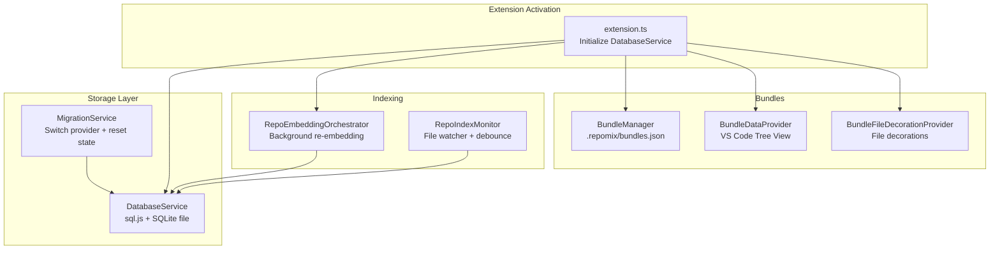
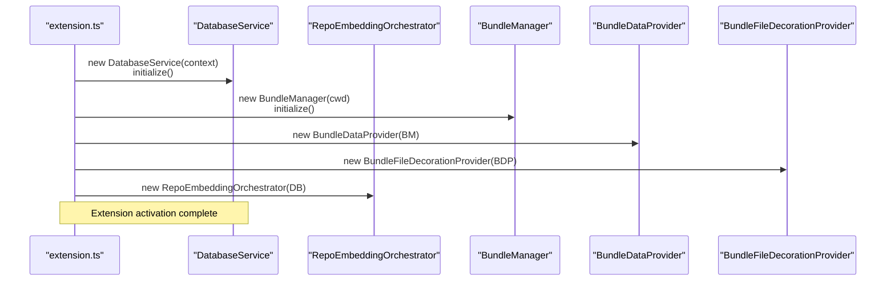
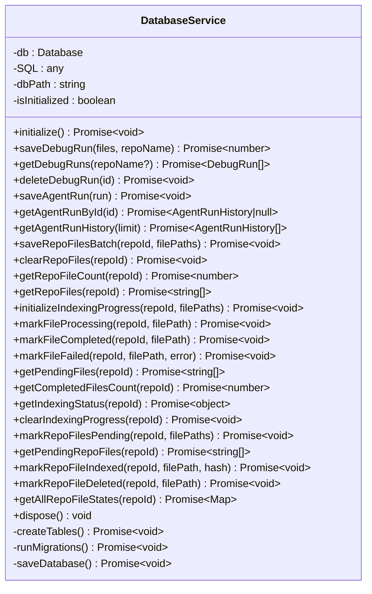
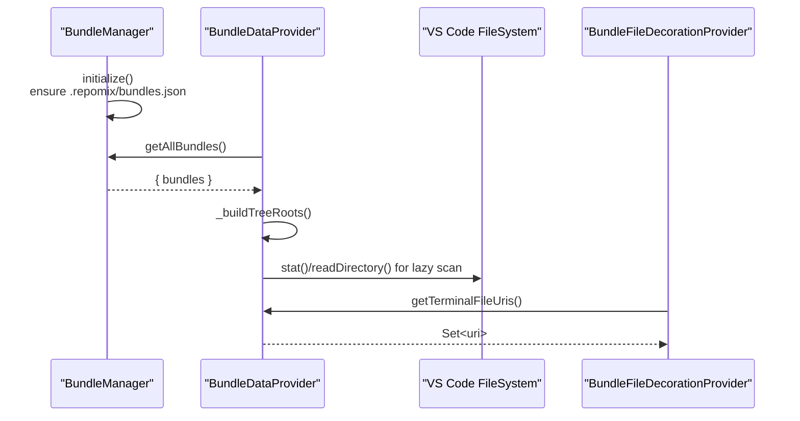
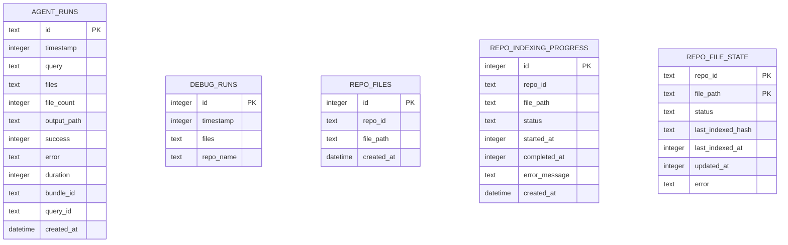
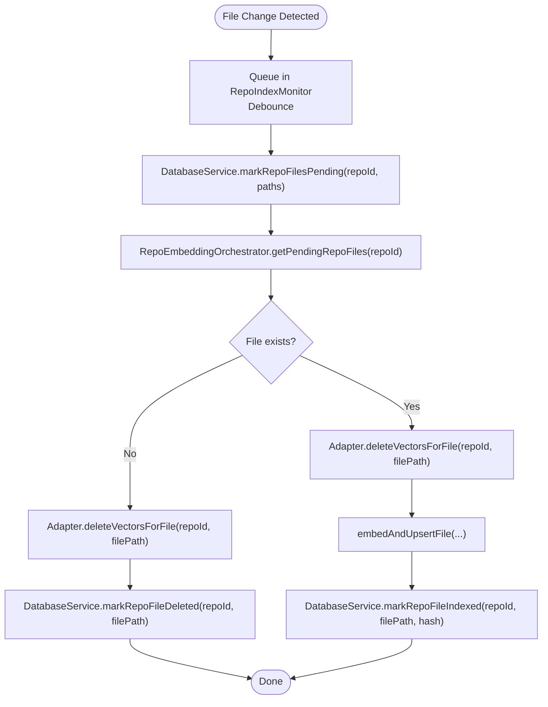

# Storage System

<cite>
**Referenced Files in This Document**
- [databaseService.ts](file://src/core/storage/databaseService.ts)
- [extension.ts](file://src/extension.ts)
- [bundleDataProvider.ts](file://src/core/bundles/bundleDataProvider.ts)
- [bundleFileDecorationProvider.ts](file://src/core/bundles/bundleFileDecorationProvider.ts)
- [bundleManager.ts](file://src/core/bundles/bundleManager.ts)
- [types.ts](file://src/core/bundles/types.ts)
- [runRepomixOnSelectedFiles.ts](file://src/commands/runRepomixOnSelectedFiles.ts)
- [repoEmbeddingOrchestrator.ts](file://src/core/indexing/repoEmbeddingOrchestrator.ts)
- [migrationService.ts](file://src/core/indexing/migrationService.ts)
</cite>

## Table of Contents
1. [Introduction](#introduction)
2. [Project Structure](#project-structure)
3. [Core Components](#core-components)
4. [Architecture Overview](#architecture-overview)
5. [Detailed Component Analysis](#detailed-component-analysis)
6. [Dependency Analysis](#dependency-analysis)
7. [Performance Considerations](#performance-considerations)
8. [Troubleshooting Guide](#troubleshooting-guide)
9. [Conclusion](#conclusion)
10. [Appendices](#appendices)

## Introduction
This document describes the Storage System responsible for local data persistence in the extension. It covers the SQLite database implementation powered by sql.js, the database schema for bundles, file decorations, and application state, the database service abstraction providing CRUD operations, transactions, and migrations, the data models for bundles and indexing state, and the bundle data provider pattern for VS Code tree views and file decoration services. It also documents synchronization patterns, caching strategies, performance optimizations, backup and restore procedures, data export capabilities, migration between versions, maintenance, troubleshooting, and privacy considerations.

## Project Structure
The storage system centers around a single DatabaseService that encapsulates initialization, schema creation, migrations, and persistence of the SQLite database file. The extension activates the service early and integrates it with background indexing, agent runs, and bundle management.



**Diagram sources**
- [extension.ts](file://src/extension.ts#L43-L120)
- [databaseService.ts](file://src/core/storage/databaseService.ts#L27-L71)
- [repoEmbeddingOrchestrator.ts](file://src/core/indexing/repoEmbeddingOrchestrator.ts#L33-L36)
- [migrationService.ts](file://src/core/indexing/migrationService.ts#L7-L46)
- [bundleManager.ts](file://src/core/bundles/bundleManager.ts#L6-L30)
- [bundleDataProvider.ts](file://src/core/bundles/bundleDataProvider.ts#L18-L46)
- [bundleFileDecorationProvider.ts](file://src/core/bundles/bundleFileDecorationProvider.ts#L4-L29)

**Section sources**
- [extension.ts](file://src/extension.ts#L43-L120)
- [databaseService.ts](file://src/core/storage/databaseService.ts#L27-L71)

## Core Components
- DatabaseService: Initializes sql.js, manages schema creation and migrations, persists the SQLite file, and exposes CRUD and indexing APIs.
- BundleManager: Manages bundle metadata stored in .repomix/bundles.json.
- BundleDataProvider: VS Code TreeDataProvider that builds and refreshes the bundle explorer UI.
- BundleFileDecorationProvider: Provides file decorations for bundle files.
- RepoEmbeddingOrchestrator: Coordinates incremental embedding and interacts with DatabaseService for state.
- MigrationService: Switches vector DB providers and resets local index state.

**Section sources**
- [databaseService.ts](file://src/core/storage/databaseService.ts#L27-L175)
- [bundleManager.ts](file://src/core/bundles/bundleManager.ts#L6-L116)
- [bundleDataProvider.ts](file://src/core/bundles/bundleDataProvider.ts#L18-L324)
- [bundleFileDecorationProvider.ts](file://src/core/bundles/bundleFileDecorationProvider.ts#L4-L29)
- [repoEmbeddingOrchestrator.ts](file://src/core/indexing/repoEmbeddingOrchestrator.ts#L33-L36)
- [migrationService.ts](file://src/core/indexing/migrationService.ts#L7-L46)

## Architecture Overview
The extension initializes DatabaseService during activation. Background indexing uses a file watcher and RepoEmbeddingOrchestrator to maintain an incremental index. Bundles are stored in a JSON file under the workspace’s .repomix directory. The bundle tree view and file decorations are provided via dedicated providers.



**Diagram sources**
- [extension.ts](file://src/extension.ts#L43-L120)
- [databaseService.ts](file://src/core/storage/databaseService.ts#L33-L71)
- [bundleManager.ts](file://src/core/bundles/bundleManager.ts#L13-L30)
- [bundleDataProvider.ts](file://src/core/bundles/bundleDataProvider.ts#L28-L46)
- [bundleFileDecorationProvider.ts](file://src/core/bundles/bundleFileDecorationProvider.ts#L10-L29)
- [repoEmbeddingOrchestrator.ts](file://src/core/indexing/repoEmbeddingOrchestrator.ts#L33-L36)

## Detailed Component Analysis

### DatabaseService
Responsibilities:
- Initialize sql.js with dynamic WASM resolution.
- Ensure storage directory exists and load/create the SQLite file.
- Create tables and indexes, run migrations.
- Persist the database to disk after writes.
- Provide CRUD and indexing APIs for agent runs, debug runs, repo files, and incremental indexing state.

Key tables and indexes:
- agent_runs: stores agent run history with JSON-serialized files and timestamps.
- debug_runs: stores recent runs for debugging with optional repo_name.
- repo_files: stores repository file lists for batch embedding.
- repo_indexing_progress: tracks indexing progress per file with status and timestamps.
- repo_file_state: tracks incremental indexing state with status, hashes, and timestamps.
- Indexes: optimized queries on timestamps, repo_id, status, and composite keys.

Transactions and batching:
- Batch inserts for repo_files use explicit transactions.
- UPSERTs for repo_file_state ensure idempotent state updates.

Migrations:
- Adds repo_name to debug_runs if missing.

Persistence:
- Export/import via Buffer and writeFileSync to a SQLite file in global storage.



**Diagram sources**
- [databaseService.ts](file://src/core/storage/databaseService.ts#L27-L891)

**Section sources**
- [databaseService.ts](file://src/core/storage/databaseService.ts#L27-L175)
- [databaseService.ts](file://src/core/storage/databaseService.ts#L176-L355)
- [databaseService.ts](file://src/core/storage/databaseService.ts#L356-L431)
- [databaseService.ts](file://src/core/storage/databaseService.ts#L441-L630)
- [databaseService.ts](file://src/core/storage/databaseService.ts#L631-L891)

### Bundle Data Provider Pattern
The bundle system uses a classic VS Code TreeDataProvider pattern:
- BundleManager reads/writes .repomix/bundles.json.
- BundleDataProvider constructs a hierarchical tree from bundle file lists, resolves file existence, and lazily scans directories.
- BundleFileDecorationProvider decorates files that belong to the active bundle.



**Diagram sources**
- [bundleManager.ts](file://src/core/bundles/bundleManager.ts#L13-L63)
- [bundleDataProvider.ts](file://src/core/bundles/bundleDataProvider.ts#L69-L98)
- [bundleDataProvider.ts](file://src/core/bundles/bundleDataProvider.ts#L167-L192)
- [bundleFileDecorationProvider.ts](file://src/core/bundles/bundleFileDecorationProvider.ts#L12-L24)

**Section sources**
- [bundleManager.ts](file://src/core/bundles/bundleManager.ts#L13-L116)
- [bundleDataProvider.ts](file://src/core/bundles/bundleDataProvider.ts#L18-L324)
- [bundleFileDecorationProvider.ts](file://src/core/bundles/bundleFileDecorationProvider.ts#L4-L29)
- [types.ts](file://src/core/bundles/types.ts#L3-L37)

### Data Models
- AgentRunHistory: structured record of agent runs with JSON-serialized file lists and optional bundle/query identifiers.
- DebugRun: lightweight record of recent runs for debugging.
- Bundle: metadata for a user-defined bundle including files, tags, and timestamps.
- BundleMetadata: container for bundles keyed by id.
- WebviewBundle: extended bundle model for webview presentation.



**Diagram sources**
- [databaseService.ts](file://src/core/storage/databaseService.ts#L76-L137)

**Section sources**
- [databaseService.ts](file://src/core/storage/databaseService.ts#L6-L18)
- [databaseService.ts](file://src/core/storage/databaseService.ts#L19-L25)
- [types.ts](file://src/core/bundles/types.ts#L3-L37)

### Synchronization and Caching Strategies
- Background indexing pipeline:
  - File watcher detects changes and queues them with a debounce.
  - DatabaseService marks files as pending for re-indexing.
  - RepoEmbeddingOrchestrator fetches pending files and performs delete-then-upsert to keep vector DB consistent.
  - Indexed state is recorded with content hash to optimize future re-indexing.
- Startup synchronization:
  - On activation, orchestrator compares disk state with repo_file_state and queues changes for reprocessing.
- Caching:
  - In-memory maps for pending files and terminal file URIs in providers.
  - Database-backed caches for indexing progress and state.



**Diagram sources**
- [repoEmbeddingOrchestrator.ts](file://src/core/indexing/repoEmbeddingOrchestrator.ts#L267-L403)
- [databaseService.ts](file://src/core/storage/databaseService.ts#L666-L802)

**Section sources**
- [extension.ts](file://src/extension.ts#L222-L300)
- [repoEmbeddingOrchestrator.ts](file://src/core/indexing/repoEmbeddingOrchestrator.ts#L267-L403)
- [databaseService.ts](file://src/core/storage/databaseService.ts#L666-L802)

### Backup and Restore Procedures
- Backup:
  - Copy the SQLite file from the extension’s global storage directory to a safe location.
  - The database file path is resolved from the extension context’s global storage URI.
- Restore:
  - Stop the extension.
  - Replace the existing SQLite file with the backed-up file.
  - Restart the extension.
- Data export:
  - Export agent runs and debug runs via the database service methods.
  - Export bundle metadata from .repomix/bundles.json.

**Section sources**
- [databaseService.ts](file://src/core/storage/databaseService.ts#L33-L38)
- [databaseService.ts](file://src/core/storage/databaseService.ts#L433-L439)
- [bundleManager.ts](file://src/core/bundles/bundleManager.ts#L55-L63)

### Migration Between Versions
- Schema migrations:
  - DatabaseService checks and adds missing columns (e.g., repo_name in debug_runs).
- Provider migration:
  - MigrationService switches vector DB providers and resets local index state by clearing repo_files for the current repo.

**Section sources**
- [databaseService.ts](file://src/core/storage/databaseService.ts#L153-L175)
- [migrationService.ts](file://src/core/indexing/migrationService.ts#L17-L46)

### Data Privacy and Security
- Secrets:
  - API keys are retrieved from VS Code SecretStorage and not persisted in the database.
- Sensitive fields:
  - No sensitive fields are stored in the SQLite tables.
- Data retention:
  - Old agent output files are cleaned up automatically after a retention period.

**Section sources**
- [extension.ts](file://src/extension.ts#L91-L122)
- [extension.ts](file://src/extension.ts#L750-L771)

## Dependency Analysis
- DatabaseService depends on sql.js and VS Code workspace/secrets APIs.
- RepoEmbeddingOrchestrator depends on DatabaseService and vector DB adapters.
- MigrationService depends on DatabaseService and global state/secrets.
- BundleManager depends on file system APIs.
- Providers depend on managers and VS Code Tree/FileDecoration APIs.

```mermaid
graph LR
DB["DatabaseService"] <- --> EXT["extension.ts"]
RIO["RepoEmbeddingOrchestrator"] --> DB
MIG["MigrationService"] --> DB
BM["BundleManager"] --> BDP["BundleDataProvider"]
BDP --> BFD["BundleFileDecorationProvider"]
CMD["runRepomixOnSelectedFiles.ts"] --> DB
```

**Diagram sources**
- [extension.ts](file://src/extension.ts#L43-L120)
- [databaseService.ts](file://src/core/storage/databaseService.ts#L27-L71)
- [repoEmbeddingOrchestrator.ts](file://src/core/indexing/repoEmbeddingOrchestrator.ts#L33-L36)
- [migrationService.ts](file://src/core/indexing/migrationService.ts#L7-L12)
- [bundleManager.ts](file://src/core/bundles/bundleManager.ts#L6-L16)
- [bundleDataProvider.ts](file://src/core/bundles/bundleDataProvider.ts#L18-L29)
- [bundleFileDecorationProvider.ts](file://src/core/bundles/bundleFileDecorationProvider.ts#L4-L10)
- [runRepomixOnSelectedFiles.ts](file://src/commands/runRepomixOnSelectedFiles.ts#L30-L87)

**Section sources**
- [extension.ts](file://src/extension.ts#L43-L120)
- [runRepomixOnSelectedFiles.ts](file://src/commands/runRepomixOnSelectedFiles.ts#L30-L87)

## Performance Considerations
- Transactions:
  - Batch inserts for repo_files are wrapped in BEGIN/COMMIT to reduce overhead.
- Indexes:
  - Timestamp and composite indexes improve query performance for history and progress tracking.
- Concurrency:
  - Background embedding uses conservative concurrency to balance responsiveness.
- Debounce:
  - File watcher debounces rapid saves to batch re-indexing work.
- Hash-based optimization:
  - Content hash stored per file enables skipping unchanged files in future re-indexing.

**Section sources**
- [databaseService.ts](file://src/core/storage/databaseService.ts#L362-L380)
- [databaseService.ts](file://src/core/storage/databaseService.ts#L139-L145)
- [repoEmbeddingOrchestrator.ts](file://src/core/indexing/repoEmbeddingOrchestrator.ts#L90-L94)
- [extension.ts](file://src/extension.ts#L241-L242)

## Troubleshooting Guide
- Database initialization failures:
  - If loading the SQLite file fails, the service falls back to a new in-memory database and persists a fresh file.
- Migration errors:
  - Non-fatal migration checks log and continue if table/column checks fail.
- Corruption:
  - If corruption occurs, back up the database file, then delete it so a new one is created on next initialization.
- Provider switch issues:
  - Use MigrationService to switch providers; it resets local index state for the current repo.
- Cleanup:
  - Old agent output files older than seven days are cleaned up automatically.

**Section sources**
- [databaseService.ts](file://src/core/storage/databaseService.ts#L59-L67)
- [databaseService.ts](file://src/core/storage/databaseService.ts#L171-L174)
- [migrationService.ts](file://src/core/indexing/migrationService.ts#L33-L46)
- [extension.ts](file://src/extension.ts#L750-L771)

## Conclusion
The Storage System leverages sql.js to provide robust, local persistence for agent runs, debug sessions, bundle metadata, and incremental indexing state. The DatabaseService abstracts schema, migrations, transactions, and persistence, while the bundle data provider pattern integrates seamlessly with VS Code’s UI. Background indexing and startup synchronization ensure efficient, accurate search results with strong privacy controls and straightforward backup/restore procedures.

## Appendices

### API Surface Summary
- Agent runs: saveAgentRun, getAgentRunById, getAgentRunHistory
- Debug runs: saveDebugRun, getDebugRuns, deleteDebugRun
- Repo files: saveRepoFilesBatch, clearRepoFiles, getRepoFileCount, getRepoFiles
- Indexing progress: initializeIndexingProgress, markFileProcessing, markFileCompleted, markFileFailed, getPendingFiles, getCompletedFilesCount, getIndexingStatus, clearIndexingProgress
- Incremental state: markRepoFilesPending, getPendingRepoFiles, markRepoFileIndexed, markRepoFileDeleted, getAllRepoFileStates
- Lifecycle: initialize, saveDatabase, dispose

**Section sources**
- [databaseService.ts](file://src/core/storage/databaseService.ts#L177-L355)
- [databaseService.ts](file://src/core/storage/databaseService.ts#L441-L630)
- [databaseService.ts](file://src/core/storage/databaseService.ts#L666-L891)