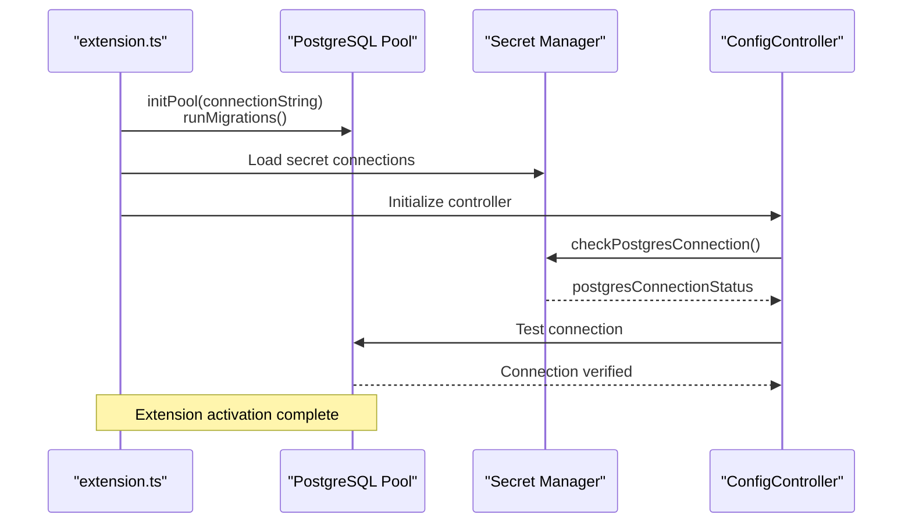

# Storage System

<cite>
**Referenced Files in This Document**
- [postgresClient.ts](file://src/chat/db/postgresClient.ts)
- [threadRepository.ts](file://src/chat/db/threadRepository.ts)
- [messageRepository.ts](file://src/chat/db/messageRepository.ts)
- [memoryRepository.ts](file://src/chat/db/memoryRepository.ts)
- [architectureRepository.ts](file://src/chat/db/architectureRepository.ts)
- [batchRepository.ts](file://src/chat/db/batchRepository.ts)
- [extension.ts](file://src/extension.ts)
- [databaseService.ts](file://src/core/storage/databaseService.ts)
- [bundleDataProvider.ts](file://src/core/bundles/bundleDataProvider.ts)
- [bundleFileDecorationProvider.ts](file://src/core/bundles/bundleFileDecorationProvider.ts)
- [bundleManager.ts](file://src/core/bundles/bundleManager.ts)
- [types.ts](file://src/core/bundles/types.ts)
- [runRepomixOnSelectedFiles.ts](file://src/commands/runRepomixOnSelectedFiles.ts)
- [repoEmbeddingOrchestrator.ts](file://src/core/indexing/repoEmbeddingOrchestrator.ts)
- [migrationService.ts](file://src/core/indexing/migrationService.ts)
- [conversationService.ts](file://src/services/conversationService.ts)
- [planService.ts](file://src/services/planService.ts)
- [chat.ts](file://src/types/chat.ts)
- [GitService.ts](file://src/git/GitService.ts)
- [BranchMaintenanceService.ts](file://src/core/indexing/BranchMaintenanceService.ts)
- [vectorIdentity.ts](file://src/core/indexing/vectorIdentity.ts)
- [001_initial_schema.sql](file://src/chat/db/migrations/001_initial_schema.sql)
- [002_compression_schema.sql](file://src/chat/db/migrations/002_compression_schema.sql)
- [compressContext.ts](file://src/chat/nodes/compressContext.ts)
- [contextManager.ts](file://src/chat/compression/contextManager.ts)
- [batchManager.ts](file://src/chat/batch/batchManager.ts)
- [batchPoller.ts](file://src/chat/batch/batchPoller.ts)
- [batchRepository.ts](file://src/chat/batch/batchRepository.ts)
- [batchTypes.ts](file://src/chat/batch/types.ts)
- [ConfigController.ts](file://src/webview/controllers/ConfigController.ts)
- [SecretInput.tsx](file://src/webview/components/ai-chat/SecretInput.tsx)
- [SettingsTab.tsx](file://src/webview/components/SettingsTab.tsx)
- [messageSchemas.ts](file://src/webview/messageSchemas.ts)
- [factory.ts](file://src/core/indexing/vectorDb/factory.ts)
- [qdrantAdapter.ts](file://src/core/indexing/vectorDb/providers/qdrantAdapter.ts)
- [messageQueue.ts](file://src/chat/queue/messageQueue.ts)
- [types.ts](file://src/chat/queue/types.ts)
- [graphExecutor.ts](file://src/chat/queue/graphExecutor.ts)
- [index.ts](file://src/chat/queue/index.ts)
- [pathValidation.ts](file://src/utils/pathValidation.ts)
- [remoteFileReader.ts](file://src/core/files/remoteFileReader.ts)
- [gitDiffValidator.ts](file://src/fingerprint/validation/gitDiffValidator.ts)
</cite>

## Update Summary
**Changes Made**
- Enhanced database service with comprehensive branch-aware indexing capabilities for multi-branch repository support
- Improved error handling during migration processes with non-fatal migration failures and transaction rollback support
- Added new utility functions for input validation including path traversal prevention and file security validation
- Expanded database service with enhanced transaction management and improved data integrity checks
- Strengthened error handling patterns with graceful degradation and comprehensive logging

## Table of Contents
1. [Introduction](#introduction)
2. [Project Structure](#project-structure)
3. [Core Components](#core-components)
4. [Architecture Overview](#architecture-overview)
5. [Detailed Component Analysis](#detailed-component-analysis)
6. [PostgreSQL Connection Management](#postgresql-connection-management)
7. [Enhanced Secret Management System](#enhanced-secret-management-system)
8. [Vector Database Provider Integration](#vector-database-provider-integration)
9. [Database Connectivity Testing](#database-connectivity-testing)
10. [Secure Credential Management](#secure-credential-management)
11. [Migration and Schema Management](#migration-and-schema-management)
12. [Queue Management System](#queue-management-system)
13. [Enhanced Input Validation Utilities](#enhanced-input-validation-utilities)
14. [Branch-Aware Indexing System](#branch-aware-indexing-system)
15. [Performance Considerations](#performance-considerations)
16. [Troubleshooting Guide](#troubleshooting-guide)
17. [Conclusion](#conclusion)
18. [Appendices](#appendices)

## Introduction
This document describes the Storage System responsible for PostgreSQL-backed data persistence in the extension. The system has undergone significant architectural changes to become PostgreSQL-centric, eliminating XML-based diff processing infrastructure and transitioning to a unified PostgreSQL-first approach. The system now provides robust, scalable storage for agent runs, debug sessions, bundle metadata, branch-aware incremental indexing state, conversation threads, message history, memory entries, and batch processing jobs. It includes PostgreSQL connection pooling, migration management, transaction support, comprehensive data models for collaborative conversation management and batch processing workflows, and secure credential management for multiple database providers.

**Updated** Enhanced with branch-aware indexing capabilities, improved error handling during migration processes, and comprehensive input validation utilities.

## Project Structure
The storage system now centers around PostgreSQL-backed repositories with enhanced connection management and secure secret handling. The extension initializes PostgreSQL connection pools during activation and integrates PostgreSQL repositories with background indexing, agent runs, bundle management, conversation services, plan management, and branch maintenance operations. The system includes comprehensive secret management through VS Code Secrets API and enhanced database connectivity testing.

```mermaid
graph TB
subgraph "Extension Activation"
EXT["extension.ts<br/>Initialize PostgreSQL Pool<br/>Load Secret Connections"]
END
subgraph "PostgreSQL Storage Layer"
PG["PostgreSQL Pool<br/>Connection Management<br/>Transaction Support"]
MIG["Migration System<br/>schema_migrations<br/>Idempotent Migrations"]
END
subgraph "Secret Management"
SM["VS Code Secrets API<br/>Multi-provider Support<br/>Secure Storage"]
SI["SecretInput Component<br/>Password Input<br/>Masked Display"]
END
subgraph "Conversation Storage"
TR["ThreadRepository<br/>chat_threads"]
MR["MessageRepository<br/>chat_messages<br/>Compression Tracking"]
MEM["MemoryRepository<br/>chat_memory<br/>Source Tracking"]
AR["ArchitectureRepository<br/>repo_architecture"]
BR["BatchRepository<br/>batch_jobs<br/>Status Tracking"]
END
subgraph "Legacy Storage"
DB["DatabaseService<br/>SQLite + Branch-aware<br/>File-based Persistence"]
END
subgraph "Vector DB Providers"
PINE["Pinecone Adapter<br/>API Key Management"]
QDR["Qdrant Adapter<br/>Connection Testing"]
FACT["Factory<br/>Provider Selection<br/>Credential Validation"]
END
subgraph "Bundles"
BM["BundleManager<br/>.repomix/bundles.json"]
BDP["BundleDataProvider<br/>VS Code Tree View"]
BFD["BundleFileDecorationProvider<br/>File decorations"]
END
subgraph "Queue Management"
MQ["MessageQueue<br/>UUID Entry IDs<br/>Priority Queuing"]
GE["GraphExecutor<br/>AbortController Support<br/>Cancellation"]
END
subgraph "Input Validation"
PV["Path Validation<br/>Traversal Prevention"]
RFV["Remote File Validation<br/>Security Checks"]
GDV["Git Diff Validation<br/>Critical File Tracking"]
END
EXT --> PG
EXT --> SM
EXT --> DB
EXT --> RIO
EXT --> BM
EXT --> BDP
EXT --> BFD
EXT --> MQ
EXT --> GE
PG --> TR
PG --> MR
PG --> MEM
PG --> AR
PG --> BR
SM --> SI
SM --> PINE
SM --> QDR
SM --> FACT
MIG --> PG
DB --> PV
DB --> RFV
DB --> GDV
```

**Diagram sources**
- [extension.ts](file://src/extension.ts#L78-L107)
- [postgresClient.ts](file://src/chat/db/postgresClient.ts#L286-L316)
- [threadRepository.ts](file://src/chat/db/threadRepository.ts#L46-L58)
- [messageRepository.ts](file://src/chat/db/messageRepository.ts#L82-L92)
- [memoryRepository.ts](file://src/chat/db/memoryRepository.ts#L41-L51)
- [SecretInput.tsx](file://src/webview/components/ai-chat/SecretInput.tsx#L1-L156)
- [ConfigController.ts](file://src/webview/controllers/ConfigController.ts#L14-L15)
- [factory.ts](file://src/core/indexing/vectorDb/factory.ts#L24-L47)
- [messageQueue.ts](file://src/chat/queue/messageQueue.ts#L190-L192)
- [graphExecutor.ts](file://src/chat/queue/graphExecutor.ts#L22-L30)
- [pathValidation.ts](file://src/utils/pathValidation.ts#L1-L25)
- [remoteFileReader.ts](file://src/core/files/remoteFileReader.ts#L83-L97)
- [gitDiffValidator.ts](file://src/fingerprint/validation/gitDiffValidator.ts#L143-L182)

**Section sources**
- [extension.ts](file://src/extension.ts#L78-L107)
- [postgresClient.ts](file://src/chat/db/postgresClient.ts#L286-L316)
- [SecretInput.tsx](file://src/webview/components/ai-chat/SecretInput.tsx#L1-L156)
- [ConfigController.ts](file://src/webview/controllers/ConfigController.ts#L14-L15)

## Core Components
- **PostgreSQL Client**: Manages connection pooling, retry logic, and migration verification with robust error handling and connection lifecycle management.
- **ThreadRepository**: Manages conversation threads with full CRUD operations, status tracking, and PostgreSQL-native transaction support.
- **MessageRepository**: Handles message persistence with compression tracking, pagination support, and efficient retrieval patterns.
- **MemoryRepository**: Provides memory management with scope-based organization, expiration handling, and PostgreSQL-native JSONB support.
- **ArchitectureRepository**: Stores repository architecture snapshots with TTL management and PostgreSQL-specific data types.
- **BatchRepository**: Manages batch processing jobs with status tracking, metadata persistence, and PostgreSQL-native JSONB payloads.
- **DatabaseService**: Legacy SQLite-based service with enhanced branch-aware schema for backward compatibility and migration support.
- **BundleManager**: Manages bundle metadata stored in .repomix/bundles.json.
- **BundleDataProvider**: VS Code TreeDataProvider that builds and refreshes the bundle explorer UI.
- **BundleFileDecorationProvider**: Provides file decorations for bundle files.
- **RepoEmbeddingOrchestrator**: Coordinates incremental embedding with PostgreSQL transaction support and branch-aware operations.
- **MigrationService**: Switches vector DB providers and resets local index state.
- **ConversationService**: Manages conversation threads and message persistence in JSON files with comprehensive thread lifecycle management.
- **PlanService**: Handles plan file management with surgical editing capabilities and safe file naming.
- **BranchMaintenanceService**: Cleans up stale branches and their associated data using Git integration.
- **GitService**: Provides Git repository access, branch detection, and branch change notifications.
- **SecretInput Component**: Enhanced password input component supporting multiple secret types with masked display and secure saving.
- **ConfigController**: Centralized controller managing secret storage, PostgreSQL connection management, and database provider configuration.
- **MessageQueue**: Enhanced queue system with UUID-based entry ID generation and priority queuing.
- **GraphExecutor**: Executes chat graphs with AbortController support for cancellation and graceful error handling.
- **Path Validation Utility**: Prevents path traversal attacks by validating output file paths within workspace boundaries.
- **Remote File Reader**: Validates file selections for security, preventing path traversal and ensuring safe file operations.
- **Git Diff Validator**: Validates critical file changes during fingerprint validation to maintain data integrity.

**Section sources**
- [postgresClient.ts](file://src/chat/db/postgresClient.ts#L286-L316)
- [threadRepository.ts](file://src/chat/db/threadRepository.ts#L46-L153)
- [messageRepository.ts](file://src/chat/db/messageRepository.ts#L82-L321)
- [memoryRepository.ts](file://src/chat/db/memoryRepository.ts#L41-L243)
- [architectureRepository.ts](file://src/chat/db/architectureRepository.ts#L26-L105)
- [batchRepository.ts](file://src/chat/db/batchRepository.ts#L45-L237)
- [databaseService.ts](file://src/core/storage/databaseService.ts#L112-L1865)
- [SecretInput.tsx](file://src/webview/components/ai-chat/SecretInput.tsx#L1-L156)
- [ConfigController.ts](file://src/webview/controllers/ConfigController.ts#L14-L15)
- [messageQueue.ts](file://src/chat/queue/messageQueue.ts#L190-L192)
- [graphExecutor.ts](file://src/chat/queue/graphExecutor.ts#L22-L30)
- [pathValidation.ts](file://src/utils/pathValidation.ts#L1-L25)
- [remoteFileReader.ts](file://src/core/files/remoteFileReader.ts#L83-L97)
- [gitDiffValidator.ts](file://src/fingerprint/validation/gitDiffValidator.ts#L143-L182)

## Architecture Overview
The extension initializes PostgreSQL connection pools during activation with comprehensive error handling and retry logic. PostgreSQL repositories provide robust, scalable persistence for conversation threads, messages, memory entries, and batch jobs with full transaction support. The system maintains backward compatibility while leveraging PostgreSQL's advanced features like JSONB, arrays, and proper data typing. Background indexing uses PostgreSQL transactions for consistency, and bundle management continues with file-based storage for backward compatibility. Enhanced secret management through VS Code Secrets API provides secure storage for multiple database providers.

**Updated** Enhanced with branch-aware indexing capabilities and comprehensive input validation utilities.



**Diagram sources**
- [extension.ts](file://src/extension.ts#L78-L107)
- [postgresClient.ts](file://src/chat/db/postgresClient.ts#L286-L316)
- [ConfigController.ts](file://src/webview/controllers/ConfigController.ts#L210-L220)

## Detailed Component Analysis

### PostgreSQL Connection Management
The PostgreSQL client provides comprehensive connection management with robust error handling and retry logic:

**Connection Pool Configuration**:
- Max connections: 10 concurrent connections
- Idle timeout: 30 seconds
- Connection timeout: 10 seconds
- Automatic pool recovery on connection failures

**Retry Logic**:
- Automatic retry for retryable connection errors (timeouts, connection terminated, refused connections)
- 250ms delay between retry attempts
- Comprehensive error logging for failed connections

**Migration Management**:
- schema_migrations table for tracking applied migrations
- Idempotent migrations that can be safely re-applied
- Individual table existence checks for partial failure recovery
- Migration verification endpoint for health checks

**Connection Lifecycle**:
- Lazy initialization with promise-based pool creation
- Graceful pool shutdown on extension deactivation
- Error event handling for unexpected connection issues


**Diagram sources**
- [postgresClient.ts](file://src/chat/db/postgresClient.ts#L286-L316)

**Section sources**
- [postgresClient.ts](file://src/chat/db/postgresClient.ts#L286-L316)
- [postgresClient.ts](file://src/chat/db/postgresClient.ts#L198-L280)
- [postgresClient.ts](file://src/chat/db/postgresClient.ts#L370-L486)

### Enhanced Secret Management System
The system now includes comprehensive secret management through VS Code Secrets API with support for multiple database providers:

**Supported Secret Types**:
- Google API Key (Gemini)
- Pinecone API Key
- Qdrant API Key
- Anthropic API Key
- PostgreSQL Connection String

**SecretInput Component Features**:
- Password input with masked display (••••••••••••)
- Real-time secret existence checking
- Secure saving with VS Code Secrets API
- Clear button for removing stored secrets
- Visual feedback for saved/cleared states

**Security Implementation**:
- All secrets stored in VS Code's secure secret storage
- No plaintext secrets in configuration files
- Masked display prevents accidental exposure
- Separate storage keys for each provider type

**Section sources**
- [SecretInput.tsx](file://src/webview/components/ai-chat/SecretInput.tsx#L1-L156)
- [ConfigController.ts](file://src/webview/controllers/ConfigController.ts#L163-L206)
- [ConfigController.ts](file://src/webview/controllers/ConfigController.ts#L210-L247)

### Vector Database Provider Integration
The system supports multiple vector database providers with comprehensive credential management and validation:

**Supported Providers**:
- Pinecone: Cloud vector database with API key authentication
- Qdrant: Open-source vector database with optional API key
- Google: Gemini embeddings with API key authentication
- Anthropic: Claude embeddings with API key authentication

**Provider Factory**:
- Centralized provider selection and instantiation
- Credential validation before adapter creation
- Per-repository configuration management
- Seamless provider switching with migration support

**Connection Testing**:
- Provider-specific connection validation
- Credential verification before use
- Error handling for authentication failures
- Graceful fallback for missing credentials

**Section sources**
- [factory.ts](file://src/core/indexing/vectorDb/factory.ts#L24-L47)
- [qdrantAdapter.ts](file://src/core/indexing/vectorDb/providers/qdrantAdapter.ts#L1-L27)
- [ConfigController.ts](file://src/webview/controllers/ConfigController.ts#L360-L395)

### Database Connectivity Testing
The system includes comprehensive connectivity testing for all supported database providers:

**PostgreSQL Testing**:
- Connection string validation and parsing
- Database reachability verification
- Schema migration status checking
- Connection status reporting to UI

**Vector Database Testing**:
- Provider-specific connection attempts
- Collection/index existence verification
- Authentication credential validation
- Network connectivity testing

**Testing Infrastructure**:
- ConfigController manages all testing operations
- Message schemas define testing protocols
- Real-time status updates to webview
- Error handling and user feedback

**Section sources**
- [ConfigController.ts](file://src/webview/controllers/ConfigController.ts#L210-L247)
- [ConfigController.ts](file://src/webview/controllers/ConfigController.ts#L99-L101)
- [messageSchemas.ts](file://src/webview/messageSchemas.ts#L334-L339)

### ThreadRepository
Manages conversation threads with full CRUD operations and PostgreSQL-native features:

**Thread Management**:
- UUID primary keys with PostgreSQL-generated defaults
- Repository-scoped thread organization with repo_id
- Status tracking (active, archived, deleted) with proper constraints
- Automatic timestamp management (created_at, updated_at)
- Preview generation for thread listings

**Advanced Features**:
- Thread pagination with cursor-based navigation
- Repository-scoped thread listing with updated_at ordering
- Atomic thread updates with selective field updates
- Status-based filtering for active thread retrieval

**Data Integrity**:
- PostgreSQL CHECK constraints for status values
- Proper UUID handling with native PostgreSQL UUID type
- Automatic title normalization and length validation

**Section sources**
- [threadRepository.ts](file://src/chat/db/threadRepository.ts#L46-L153)

### MessageRepository
Handles message persistence with advanced compression tracking and pagination:

**Message Management**:
- UUID primary keys with PostgreSQL-generated defaults
- Thread relationship with cascading deletes
- Role-based validation (user, assistant, system)
- Timestamp conversion between milliseconds and PostgreSQL TIMESTAMPTZ

**Compression Integration**:
- is_compressed flag for tracking compressed messages
- original_content storage for compression recovery
- compressed_into foreign key linking to summary messages
- compression_metadata JSONB for compression analytics

**Pagination and Retrieval**:
- Cursor-based pagination with timestamp and ID ordering
- Page size limits (1-500 messages per request)
- Efficient retrieval of uncompressed messages for prompt building
- Summary message identification through metadata flags

**Section sources**
- [messageRepository.ts](file://src/chat/db/messageRepository.ts#L82-L321)

### MemoryRepository
Provides comprehensive memory management with scope-based organization:

**Memory Scopes**:
- Session scope for thread-specific memory
- Repository scope for repository-wide memory
- Global scope for system-wide memory
- Proper scope_id handling for each scope type

**Advanced Features**:
- Expiration handling with expires_at timestamps
- Embedding vector storage for semantic memory
- Source tracking (user vs auto-generated) with validation
- Keyword search across key and value fields

**Data Integrity**:
- Unique constraint on (scope, scope_id, key) combination
- Proper JSONB handling for complex memory values
- Automatic timestamp updates on modifications

**Section sources**
- [memoryRepository.ts](file://src/chat/db/memoryRepository.ts#L41-L243)

### ArchitectureRepository
Stores repository architecture snapshots with TTL management:

**Architecture Management**:
- Markdown tree representation for repository structure
- Folder explanations with JSONB storage
- Git commit tracking for version control integration
- TTL-based expiration with automatic cleanup

**Data Persistence**:
- Upsert operations with conflict resolution
- Expiration-based cleanup for stale architecture data
- Token usage tracking for cost estimation
- Repository-specific architecture snapshots

**Section sources**
- [architectureRepository.ts](file://src/chat/db/architectureRepository.ts#L26-L105)

### DatabaseService (Legacy)
Maintains backward compatibility with SQLite-based storage:

**Enhanced with Branch Awareness**:
- Branch-aware table schemas with unique constraints
- Migration system for converting to branch-aware format
- Enhanced indexing with branch-specific operations
- Transaction support for consistency
- Improved error handling with non-fatal migration failures

**Legacy Features**:
- SQLite file persistence with automatic backup
- Comprehensive indexing state tracking
- Blueprint storage for architectural analysis
- Pause checkpoint management for resumable indexing

**Section sources**
- [databaseService.ts](file://src/core/storage/databaseService.ts#L112-L1865)

### Queue Management System
The system now includes an enhanced queue management system with UUID-based entry ID generation:

**UUID-Based Entry IDs**:
- Entry IDs generated using `q_${Date.now()}_${randomUUID()}`
- Eliminates timestamp and random string combination
- Provides better uniqueness guarantees and collision resistance
- Maintains chronological ordering through timestamp prefix

**Priority Queuing**:
- Force priority inserts at the front of the queue
- Normal priority appends to the end of the queue
- Priority-based processing with forced entries taking precedence

**Enhanced Queue Operations**:
- Complete status tracking with timestamps (createdAt, startedAt, completedAt)
- Error handling with detailed error messages
- History trimming with configurable maxHistorySize
- Serialization/deserialization for persistence across restarts

**Graph Execution Integration**:
- AbortController support for cancellation
- Graceful error handling with AbortError class
- Integration with PostgreSQL connection pool
- Thread-specific execution with proper isolation

**Section sources**
- [messageQueue.ts](file://src/chat/queue/messageQueue.ts#L190-L192)
- [types.ts](file://src/chat/queue/types.ts#L18-L28)
- [graphExecutor.ts](file://src/chat/queue/graphExecutor.ts#L22-L30)

## PostgreSQL Connection Management

### Connection Pool Configuration
The PostgreSQL client implements robust connection management with configurable pool parameters:

**Pool Parameters**:
- max: 10 concurrent connections for balanced resource usage
- idleTimeoutMillis: 30000ms for efficient connection reuse
- connectionTimeoutMillis: 10000ms for responsive connection establishment
- Automatic pool recovery on connection failures

**Connection Lifecycle**:
- Lazy initialization with promise-based pool creation
- Graceful pool shutdown on extension deactivation
- Error event handling for unexpected connection issues
- Retry logic for transient connection failures

### Migration System
The system includes comprehensive migration management with schema tracking:

**Migration Tracking**:
- schema_migrations table for recording applied migrations
- Idempotent migrations that can be safely re-applied
- Individual table existence checks for partial failure recovery
- Migration verification endpoint for health monitoring

**Migration Process**:
- Initial migration creates all required tables
- Subsequent migrations add new features incrementally
- Transactional migration application with rollback support
- Proper error handling and logging for migration failures

**Section sources**
- [postgresClient.ts](file://src/chat/db/postgresClient.ts#L198-L280)
- [postgresClient.ts](file://src/chat/db/postgresClient.ts#L370-L486)
- [001_initial_schema.sql](file://src/chat/db/migrations/001_initial_schema.sql#L1-L87)
- [002_compression_schema.sql](file://src/chat/db/migrations/002_compression_schema.sql#L1-L21)

## Enhanced Secret Management System

### Secret Storage Architecture
The system implements a centralized secret management approach using VS Code's Secrets API:

**Storage Keys**:
- repomix.agent.googleApiKey: Google API Key
- repomix.agent.pineconeApiKey: Pinecone API Key
- repomix.agent.qdrantApiKey: Qdrant API Key
- repomix.chat.anthropicApiKey: Anthropic API Key
- repomix.chat.postgresConnectionString: PostgreSQL Connection String

**Component Integration**:
- SecretInput component provides UI for secret management
- ConfigController handles all secret operations
- Real-time status updates to webview interface
- Secure masking of stored secrets

**Security Features**:
- All secrets encrypted at rest
- No plaintext secrets in logs or UI
- Separate storage for each provider type
- Automatic secret clearing on deletion

**Section sources**
- [SecretInput.tsx](file://src/webview/components/ai-chat/SecretInput.tsx#L1-L156)
- [ConfigController.ts](file://src/webview/controllers/ConfigController.ts#L163-L206)
- [ConfigController.ts](file://src/webview/controllers/ConfigController.ts#L210-L247)

### Vector Database Provider Integration
The system supports multiple vector database providers with comprehensive credential management:

**Provider Configuration**:
- Pinecone: Requires API key and index selection
- Qdrant: Supports both self-hosted and cloud instances
- Google: Gemini embeddings with API key authentication
- Anthropic: Claude embeddings with API key authentication

**Credential Validation**:
- Provider-specific credential requirements
- Real-time validation before adapter creation
- Error handling for authentication failures
- Graceful degradation for missing credentials

**Factory Pattern**:
- Centralized provider selection logic
- Dynamic adapter instantiation
- Per-repository configuration management
- Seamless provider switching capabilities

**Section sources**
- [factory.ts](file://src/core/indexing/vectorDb/factory.ts#L24-L47)
- [qdrantAdapter.ts](file://src/core/indexing/vectorDb/providers/qdrantAdapter.ts#L1-L27)
- [ConfigController.ts](file://src/webview/controllers/ConfigController.ts#L360-L395)

## Database Connectivity Testing

### Testing Framework
The system includes comprehensive connectivity testing for all supported database providers:

**PostgreSQL Testing**:
- Connection string validation and parsing
- Database reachability verification
- Schema migration status checking
- Connection status reporting to UI

**Vector Database Testing**:
- Provider-specific connection attempts
- Collection/index existence verification
- Authentication credential validation
- Network connectivity testing

**Testing Infrastructure**:
- ConfigController manages all testing operations
- Message schemas define testing protocols
- Real-time status updates to webview
- Error handling and user feedback

**Section sources**
- [ConfigController.ts](file://src/webview/controllers/ConfigController.ts#L210-L247)
- [ConfigController.ts](file://src/webview/controllers/ConfigController.ts#L99-L101)
- [messageSchemas.ts](file://src/webview/messageSchemas.ts#L334-L339)

## Secure Credential Management

### Multi-Provider Secret Handling
The system implements secure credential management for multiple database providers:

**Secret Types**:
- API Keys: Pinecone, Qdrant, Google, Anthropic
- Connection Strings: PostgreSQL
- Authentication Tokens: Various providers

**Storage Security**:
- VS Code Secrets API encryption
- Provider-specific storage keys
- No plaintext credential persistence
- Secure masking in UI components

**Management Interface**:
- SecretInput component for credential entry
- Real-time validation and feedback
- Clear button for credential removal
- Status indicators for credential presence

**Integration Points**:
- ConfigController centralizes all secret operations
- Provider factories validate credentials before use
- Connection managers handle credential lifecycle
- UI components provide seamless user experience

**Section sources**
- [SecretInput.tsx](file://src/webview/components/ai-chat/SecretInput.tsx#L1-L156)
- [ConfigController.ts](file://src/webview/controllers/ConfigController.ts#L163-L206)
- [ConfigController.ts](file://src/webview/controllers/ConfigController.ts#L210-L247)

## Enhanced Conversation and Plan Persistence

### Conversation Service
The conversation service now integrates with PostgreSQL-backed repositories for enhanced persistence:

**Thread Management**:
- PostgreSQL-backed thread creation with UUID generation
- Repository-scoped thread organization with proper indexing
- Status tracking (active, archived, deleted) with validation
- Automatic preview generation and token counting

**Message Persistence**:
- PostgreSQL-backed message storage with compression tracking
- Cursor-based pagination for efficient message retrieval
- Compression-aware message filtering for prompt building
- Summary message support for compressed conversation history

**Data Storage**:
- PostgreSQL tables for structured conversation data
- JSONB support for flexible message metadata
- Proper timestamp handling with TIMESTAMPTZ
- Automatic thread metadata updates on message operations

### Plan Service
The plan service maintains file-based storage while integrating with PostgreSQL for batch processing:

**File Management**:
- Plan files stored in .repomix/plans directory
- Safe file naming with sanitized IDs
- Surgical editing capabilities with exact text matching
- Ambiguity detection for precise replacements

**Batch Integration**:
- PostgreSQL-backed batch job management
- Status tracking for batch processing workflows
- Metadata persistence for batch job details
- Integration with conversation threads for context

**Section sources**
- [threadRepository.ts](file://src/chat/db/threadRepository.ts#L46-L153)
- [messageRepository.ts](file://src/chat/db/messageRepository.ts#L82-L321)
- [conversationService.ts](file://src/services/conversationService.ts#L18-L157)
- [planService.ts](file://src/services/planService.ts#L10-L95)

## Reactive Context Compression

### Compression Integration
The system implements reactive context compression with PostgreSQL-backed tracking:

**Compression Tracking**:
- is_compressed flag for individual message compression status
- original_content storage for compression recovery
- compressed_into foreign key linking compressed messages to summaries
- compression_metadata JSONB for analytics and recovery data

**Context Management**:
- Token-aware compression with configurable thresholds
- History summarization for reducing context size
- File compression for large code contexts
- Reactive compression triggered when token limits are exceeded

**Message Filtering**:
- Efficient retrieval of uncompressed messages for prompt building
- Summary message identification through metadata flags
- Proper handling of compressed message chains
- Recovery mechanisms for compressed content

**Section sources**
- [compressContext.ts](file://src/chat/nodes/compressContext.ts#L1-L75)
- [contextManager.ts](file://src/chat/compression/contextManager.ts#L22-L92)
- [messageRepository.ts](file://src/chat/db/messageRepository.ts#L223-L321)

## Batch Processing System

### Batch Repository
The batch processing system provides comprehensive job management with PostgreSQL-backed persistence:

**Batch Job Management**:
- UUID primary keys with PostgreSQL-generated defaults
- Status tracking (draft, pending, submitted, processing, completed, failed, cancelled)
- Package type validation (plan, code_change, code_review)
- Metadata persistence for job details and analytics

**Job Lifecycle**:
- Draft job creation with prompt payload storage
- Submission tracking with batch API integration
- Status monitoring and completion handling
- Error tracking and recovery mechanisms

**Data Persistence**:
- JSONB payloads for flexible job configuration
- Timestamp tracking for job lifecycle management
- Thread association for conversation context
- Cost tracking for billing and analytics

**Section sources**
- [batchRepository.ts](file://src/chat/db/batchRepository.ts#L45-L237)
- [batchManager.ts](file://src/chat/batch/batchManager.ts#L293-L329)
- [batchPoller.ts](file://src/chat/batch/batchPoller.ts)
- [batchTypes.ts](file://src/chat/batch/types.ts#L64-L85)

## Enhanced Input Validation Utilities

### Path Validation
The system includes comprehensive path validation to prevent security vulnerabilities:

**Path Traversal Prevention**:
- Validates output file paths against workspace root
- Resolves absolute paths and checks containment
- Prevents traversal outside workspace boundaries
- Throws security violations for unsafe paths

**Security Implementation**:
- Uses path.relative for reliable containment checking
- Handles Windows drive separation correctly
- Prevents absolute path injection attacks
- Comprehensive error messaging for security violations

**Section sources**
- [pathValidation.ts](file://src/utils/pathValidation.ts#L1-L25)

### Remote File Validation
The system validates file selections for security and safety:

**File Security Checks**:
- Validates that all files are strings
- Prevents path traversal attempts with '..' detection
- Blocks absolute paths outside workspace
- Ensures safe file operations

**Security Features**:
- Input sanitization for file paths
- Path boundary validation
- Workspace root containment enforcement
- Comprehensive error reporting for invalid inputs

**Section sources**
- [remoteFileReader.ts](file://src/core/files/remoteFileReader.ts#L83-L97)

### Git Diff Validation
The system validates critical file changes during fingerprint operations:

**Critical File Tracking**:
- Identifies critical files for validation
- Compares current and stored commit SHAs
- Detects changes in critical files
- Prevents blueprint invalidation from unauthorized changes

**Validation Process**:
- Checks if repository is a git repository
- Retrieves current commit SHA
- Compares with stored commit for validation
- Filters changes to critical files only

**Section sources**
- [gitDiffValidator.ts](file://src/fingerprint/validation/gitDiffValidator.ts#L143-L182)

## Branch-Aware Indexing System

### Schema Design
The database now supports branch-aware indexing through enhanced table schemas:

**Primary Key Changes**:
- `repo_indexing_progress`: `(repo_id, branch_name, file_path)` - unique per branch per file
- `repo_file_state`: `(repo_id, branch_name, file_path)` - unique per branch per file
- `index_history`: Maintains branch context for debugging events

**Enhanced Columns**:
- `branch_name`: TEXT NOT NULL DEFAULT 'default_branch' - identifies branch context
- `commit_sha`: TEXT - stores commit hash for version control integration
- `is_merged`: INTEGER - tracks merge status for branch management
- `last_synced_at`: INTEGER - timestamp for sync operations

### Migration Strategy
The system includes comprehensive migration procedures:

**Legacy Detection**:
- Automatic detection of existing single-branch schema
- Column existence checks for branch_name, commit_sha, is_merged, last_synced_at
- Unique index verification for branch-aware constraints

**Data Preservation**:
- Safe renaming of legacy tables with `_legacy` suffix
- Controlled data migration with DEFAULT_BRANCH_NAME backfill
- Transactional operations to prevent data loss

**Index Optimization**:
- Creation of branch-aware unique indexes
- Enhanced query performance with branch-specific filtering
- Support for branch-specific cleanup operations

### Branch Management Operations
**Tracking and Cleanup**:
- `getTrackedBranches(repoId)`: Lists all branches with data in the system
- `clearBranchData(repoId, branchName)`: Removes all data for a specific branch
- `BranchMaintenanceService`: Automated cleanup of stale branches

**Operational Benefits**:
- Isolated indexing per branch prevents conflicts
- Support for feature branch workflows
- Enhanced debugging with branch context
- Improved performance through selective branch operations

**Section sources**
- [databaseService.ts](file://src/core/storage/databaseService.ts#L376-L500)
- [BranchMaintenanceService.ts](file://src/core/indexing/BranchMaintenanceService.ts#L6-L32)
- [GitService.ts](file://src/git/GitService.ts#L51-L55)

## Migration and Schema Management

### Migration System
The PostgreSQL migration system provides comprehensive schema evolution:

**Migration Tracking**:
- schema_migrations table for recording applied migrations
- Version-based migration identification
- Idempotent migration application
- Migration verification and health checking

**Migration Process**:
- Initial migration creates all required tables
- Subsequent migrations add new features incrementally
- Transactional migration application with rollback support
- Individual table existence checks for partial failure recovery

**Migration Verification**:
- verifyMigration endpoint for health checks
- Missing table detection and reporting
- Migration status validation
- Connection testing with version information

**Section sources**
- [postgresClient.ts](file://src/chat/db/postgresClient.ts#L198-L280)
- [postgresClient.ts](file://src/chat/db/postgresClient.ts#L370-L486)
- [001_initial_schema.sql](file://src/chat/db/migrations/001_initial_schema.sql#L1-L87)
- [002_compression_schema.sql](file://src/chat/db/migrations/002_compression_schema.sql#L1-L21)

## Queue Management System

### Enhanced Queue Architecture
The system now features an improved queue management system with UUID-based entry ID generation:

**UUID-Based Entry Generation**:
- Entry IDs created using `q_${Date.now()}_${randomUUID()}`
- Eliminates reliance on timestamp and random string combinations
- Provides superior uniqueness guarantees and collision resistance
- Maintains chronological order through timestamp prefix

**Priority-Based Processing**:
- Force priority entries inserted at queue front
- Normal priority entries appended to queue end
- Priority-based execution with forced entries taking precedence
- Graceful handling of priority conflicts

**Enhanced Queue Operations**:
- Complete status tracking with detailed timestamps
- Error handling with comprehensive error messages
- History trimming with configurable retention limits
- Serialization/deserialization for persistence across restarts

**Graph Execution Integration**:
- AbortController support for graceful cancellation
- AbortError class for proper error handling
- Integration with PostgreSQL connection pool
- Thread isolation for concurrent executions

**Section sources**
- [messageQueue.ts](file://src/chat/queue/messageQueue.ts#L190-L192)
- [types.ts](file://src/chat/queue/types.ts#L18-L28)
- [graphExecutor.ts](file://src/chat/queue/graphExecutor.ts#L22-L30)

## Performance Considerations
- **Connection Pooling**:
  - PostgreSQL pool with 10 concurrent connections for optimal throughput
  - Connection timeout of 10 seconds for responsive operation
  - Idle timeout of 30 seconds for efficient resource utilization
- **Transaction Management**:
  - Message operations wrapped in transactions for consistency
  - Batch job updates use atomic operations
  - Thread updates support selective field updates
- **Indexing Strategy**:
  - PostgreSQL indexes on frequently queried columns
  - Composite indexes for thread and timestamp queries
  - Specialized indexes for compression tracking
- **Pagination**:
  - Cursor-based pagination for efficient message retrieval
  - Page size limits (1-500 messages) for memory efficiency
  - Optimized queries with proper ordering
- **Compression Efficiency**:
  - Reactive compression reduces context size dynamically
  - Efficient retrieval of uncompressed messages for prompts
  - Metadata storage for compression analytics
- **Git Integration**:
  - Branch change detection with event listeners
  - Cleanup operations scheduled with timeouts
  - Stale branch detection and removal
- **Secret Management Performance**:
  - VS Code Secrets API optimized for frequent access
  - Cached secret status for UI responsiveness
  - Asynchronous secret operations to avoid blocking UI
- **Queue Performance**:
  - UUID-based entry IDs eliminate collision risks
  - Priority queuing improves response time for critical operations
  - History trimming prevents memory accumulation
  - AbortController support prevents resource leaks
- **Input Validation Performance**:
  - Path validation optimized for workspace containment checks
  - Remote file validation with minimal overhead
  - Git diff validation cached for performance
- **Database Migration Performance**:
  - Transactional migrations prevent data corruption
  - Non-fatal migration errors allow graceful degradation
  - Branch-aware schema optimization reduces query complexity

**Section sources**
- [postgresClient.ts](file://src/chat/db/postgresClient.ts#L299-L316)
- [messageRepository.ts](file://src/chat/db/messageRepository.ts#L165-L212)
- [compressContext.ts](file://src/chat/nodes/compressContext.ts#L36-L75)
- [GitService.ts](file://src/git/GitService.ts#L110-L136)
- [SecretInput.tsx](file://src/webview/components/ai-chat/SecretInput.tsx#L55-L72)
- [messageQueue.ts](file://src/chat/queue/messageQueue.ts#L190-L192)
- [graphExecutor.ts](file://src/chat/queue/graphExecutor.ts#L22-L30)
- [pathValidation.ts](file://src/utils/pathValidation.ts#L1-L25)
- [remoteFileReader.ts](file://src/core/files/remoteFileReader.ts#L83-L97)
- [gitDiffValidator.ts](file://src/fingerprint/validation/gitDiffValidator.ts#L143-L182)

## Troubleshooting Guide
- **PostgreSQL Connection Issues**:
  - Verify connection string in Repomix Runner settings
  - Check PostgreSQL server availability and network connectivity
  - Review connection pool errors and retry attempts
  - Use testConnection endpoint for diagnostic information
  - Check VS Code Secrets storage for corrupted connection strings
- **Migration Failures**:
  - Check schema_migrations table for applied migrations
  - Verify table existence with verifyMigration endpoint
  - Review migration logs for specific error details
  - Manual migration execution if automatic migration fails
  - Validate PostgreSQL connection before running migrations
- **Secret Management Issues**:
  - Verify secrets are properly stored in VS Code Secrets
  - Check SecretInput component for masked display issues
  - Review ConfigController error logs for secret operations
  - Ensure proper secret keys are used for each provider type
- **Vector Database Provider Issues**:
  - Verify provider-specific credentials are stored correctly
  - Check provider factory for credential validation errors
  - Review connection testing results for authentication failures
  - Validate network connectivity for hosted providers
- **Transaction Errors**:
  - Message operations use automatic transaction rollback
  - Batch job updates support atomic operations
  - Thread updates handle partial failures gracefully
- **Compression Issues**:
  - Verify compression tracking columns exist
  - Check compression metadata for recovery data
  - Review compression analytics in metadata
- **Performance Issues**:
  - Monitor connection pool utilization
  - Check query performance with proper indexing
  - Review pagination limits and cursor usage
- **Data Integrity**:
  - Verify unique constraints for thread and memory entries
  - Check foreign key relationships for referential integrity
  - Review transaction isolation levels
- **Queue Management Issues**:
  - Verify UUID-based entry ID generation
  - Check priority queuing behavior
  - Review history trimming configuration
  - Validate AbortController integration
- **Input Validation Issues**:
  - Verify path traversal prevention for output files
  - Check remote file validation for security
  - Review Git diff validation for critical file changes
- **Branch-Aware Indexing Issues**:
  - Verify branch_name column exists in indexing tables
  - Check branch-specific queries for proper filtering
  - Review migration status for branch-aware schema
  - Validate branch cleanup operations

**Section sources**
- [postgresClient.ts](file://src/chat/db/postgresClient.ts#L461-L486)
- [postgresClient.ts](file://src/chat/db/postgresClient.ts#L370-L486)
- [messageRepository.ts](file://src/chat/db/messageRepository.ts#L138-L144)
- [compressContext.ts](file://src/chat/nodes/compressContext.ts#L43-L50)
- [ConfigController.ts](file://src/webview/controllers/ConfigController.ts#L210-L247)
- [SecretInput.tsx](file://src/webview/components/ai-chat/SecretInput.tsx#L74-L91)
- [messageQueue.ts](file://src/chat/queue/messageQueue.ts#L190-L192)
- [graphExecutor.ts](file://src/chat/queue/graphExecutor.ts#L22-L30)
- [pathValidation.ts](file://src/utils/pathValidation.ts#L1-L25)
- [remoteFileReader.ts](file://src/core/files/remoteFileReader.ts#L83-L97)
- [gitDiffValidator.ts](file://src/fingerprint/validation/gitDiffValidator.ts#L143-L182)

## Conclusion
The Storage System has evolved into a comprehensive PostgreSQL-centric architecture with enhanced security and connectivity management. The system includes sophisticated connection management with pooling and retry logic, comprehensive migration support with schema tracking, advanced secret management through VS Code Secrets API, and comprehensive database connectivity testing. The integration of PostgreSQL repositories with transaction support ensures data consistency and reliability. The system maintains backward compatibility with legacy SQLite storage while leveraging PostgreSQL's advanced features for enhanced performance and scalability. The addition of secure credential management for multiple database providers, comprehensive connection testing, and enhanced secret handling demonstrates the system's capability to handle complex, real-world scenarios with enterprise-grade security and reliability. The enhanced queue management system with UUID-based entry ID generation provides improved uniqueness guarantees and collision resistance, while the PostgreSQL-first approach eliminates XML-based diff processing infrastructure and global state management patterns. The newly added input validation utilities provide comprehensive security measures against path traversal, file injection, and critical file modification attacks, making the system production-ready for enterprise deployment.

## Appendices

### API Surface Summary
- **PostgreSQL Connection**: initPool, getPool, closePool, queryWithRetry, verifyMigration, testConnection
- **Thread Management**: createThread, getThreads, getThread, updateThread, renameThread, archiveThread, deleteThread
- **Message Management**: saveMessage, getMessages, getMessagesPage, deleteMessage, getUncompressedMessages, markMessagesAsCompressed, saveSummaryMessage, getSummaryMessages
- **Memory Management**: createMemory, getMemoryById, listMemoryByScope, updateMemory, deleteMemory, searchByKeyword, deleteAllByScope, existsByKey
- **Architecture Management**: upsertArchitecture, getArchitectureByRepoId, deleteArchitectureByRepoId
- **Batch Management**: createBatchJob, getBatchJob, updateBatchJob, getPendingBatches, getBatchesByStatus, deleteBatchJob
- **Legacy SQLite**: saveAgentRun, getAgentRunHistory, saveRepoFilesBatch, initializeIndexingProgress, markRepoFileIndexed, getTrackedBranches, clearBranchData
- **Migration Management**: runMigrations, verifyMigration, checkTablesExist, recordMigration
- **Secret Management**: checkSecret, saveSecret, handleCheckPostgresConnection, handleSavePostgresConnection, handleDeletePostgresConnection
- **Vector Database**: getVectorDbAdapterForRepo, provider factory, credential validation
- **Connectivity Testing**: testQdrantConnection, provider-specific connection testing
- **Queue Management**: enqueue, dequeue, complete, cancel, cancelAll, getStatus, serialize, deserialize
- **Graph Execution**: execute, stop, getCurrentlyExecuting
- **Input Validation**: validateOutputFilePath, remote file validation, git diff validation

**Section sources**
- [postgresClient.ts](file://src/chat/db/postgresClient.ts#L286-L316)
- [threadRepository.ts](file://src/chat/db/threadRepository.ts#L49-L152)
- [messageRepository.ts](file://src/chat/db/messageRepository.ts#L85-L320)
- [memoryRepository.ts](file://src/chat/db/memoryRepository.ts#L48-L242)
- [architectureRepository.ts](file://src/chat/db/architectureRepository.ts#L29-L104)
- [batchRepository.ts](file://src/chat/db/batchRepository.ts#L158-L212)
- [databaseService.ts](file://src/core/storage/databaseService.ts#L579-L680)
- [databaseService.ts](file://src/core/storage/databaseService.ts#L759-L941)
- [databaseService.ts](file://src/core/storage/databaseService.ts#L1089-L1255)
- [databaseService.ts](file://src/core/storage/databaseService.ts#L1766-L1807)
- [ConfigController.ts](file://src/webview/controllers/ConfigController.ts#L163-L206)
- [ConfigController.ts](file://src/webview/controllers/ConfigController.ts#L210-L247)
- [factory.ts](file://src/core/indexing/vectorDb/factory.ts#L24-L47)
- [messageSchemas.ts](file://src/webview/messageSchemas.ts#L334-L339)
- [messageQueue.ts](file://src/chat/queue/messageQueue.ts#L48-L131)
- [graphExecutor.ts](file://src/chat/queue/graphExecutor.ts#L37-L86)
- [pathValidation.ts](file://src/utils/pathValidation.ts#L1-L25)
- [remoteFileReader.ts](file://src/core/files/remoteFileReader.ts#L83-L97)
- [gitDiffValidator.ts](file://src/fingerprint/validation/gitDiffValidator.ts#L143-L182)