# Testing Framework

<cite>
**Referenced Files in This Document**
- [extension.test.ts](file://src/test/extension.test.ts)
- [integration.test.ts](file://src/test/test-workspace/integration.test.ts)
- [.vscode-test.mjs](file://.vscode-test.mjs)
- [package.json](file://package.json)
- [bundleManager.test.ts](file://src/test/core/bundles/bundleManager.test.ts)
- [copyToClipboard.test.ts](file://src/test/core/files/copyToClipboard.test.ts)
- [runRepomix.test.ts](file://src/test/commands/runRepomix.test.ts)
- [nodes.test.ts](file://src/test/search/nodes.test.ts)
- [messageSchemas.test.ts](file://src/test/webview/messageSchemas.test.ts)
- [deepMerge.test.ts](file://src/test/utils/deepMerge.test.ts)
- [generateOutputFilename.test.ts](file://src/test/utils/generateOutputFilename.test.ts)
- [utilsTest.ts](file://src/test/utilsTest.ts)
- [repomix.config.json](file://src/test/test-workspace/root/repomix.config.json)
</cite>

## Table of Contents
1. [Introduction](#introduction)
2. [Project Structure](#project-structure)
3. [Core Components](#core-components)
4. [Architecture Overview](#architecture-overview)
5. [Detailed Component Analysis](#detailed-component-analysis)
6. [Dependency Analysis](#dependency-analysis)
7. [Performance Considerations](#performance-considerations)
8. [Troubleshooting Guide](#troubleshooting-guide)
9. [Conclusion](#conclusion)
10. [Appendices](#appendices)

## Introduction
This document describes the Testing Framework for the project, covering unit tests, integration tests, and end-to-end workflows. It explains the test structure organized by feature areas, the test workspace setup, mock data generation, and environment configuration. It documents testing utilities, helper functions, and assertion patterns used across the suite. It also outlines integration testing approaches for external tool interactions, guidance for writing new tests, running test suites, interpreting results, continuous integration setup, coverage reporting, and quality assurance processes. Examples include bundle creation workflows, AI agent message validation, and clipboard operations.

## Project Structure
The test suite is organized under src/test with dedicated folders per major module and feature area:
- Commands: Command-level tests for user-triggered actions
- Core: Core subsystems (bundles, files, indexing, patching, storage)
- Search: Search pipeline utilities
- Webview: WebView message schema validation
- Utils: General-purpose utilities
- Test workspace: Integration tests and fixture data

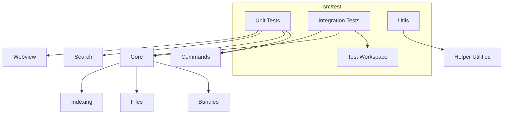

**Diagram sources**
- [extension.test.ts](file://src/test/extension.test.ts#L1-L31)
- [integration.test.ts](file://src/test/test-workspace/integration.test.ts#L1-L380)

**Section sources**
- [extension.test.ts](file://src/test/extension.test.ts#L1-L31)
- [integration.test.ts](file://src/test/test-workspace/integration.test.ts#L1-L380)

## Core Components
- Extension activation and workspace detection
- Bundle manager behavior and persistence
- Clipboard copy operations across platforms
- Command orchestration and configuration wiring
- Search pipeline deduplication and filtering
- WebView message schema validation
- Utility functions for merging configs and generating filenames
- Test workspace fixtures and integration helpers

Key testing utilities:
- waitForFile: Polling-based file readiness with timeouts
- deleteFiles: Robust file deletion supporting glob patterns and Windows compatibility
- execPromisify: Promisified child process execution for CLI interactions

**Section sources**
- [utilsTest.ts](file://src/test/utilsTest.ts#L1-L67)
- [copyToClipboard.test.ts](file://src/test/core/files/copyToClipboard.test.ts#L1-L142)
- [bundleManager.test.ts](file://src/test/core/bundles/bundleManager.test.ts#L1-L300)
- [runRepomix.test.ts](file://src/test/commands/runRepomix.test.ts#L1-L141)
- [nodes.test.ts](file://src/test/search/nodes.test.ts#L1-L52)
- [messageSchemas.test.ts](file://src/test/webview/messageSchemas.test.ts#L1-L93)
- [deepMerge.test.ts](file://src/test/utils/deepMerge.test.ts#L1-L69)
- [generateOutputFilename.test.ts](file://src/test/utils/generateOutputFilename.test.ts#L1-L61)

## Architecture Overview
The test architecture combines unit isolation with integration checks against the real extension and external tools. Unit tests stub or mock filesystem and external dependencies. Integration tests activate the extension, manipulate VS Code commands, and compare outputs against native CLI behavior.

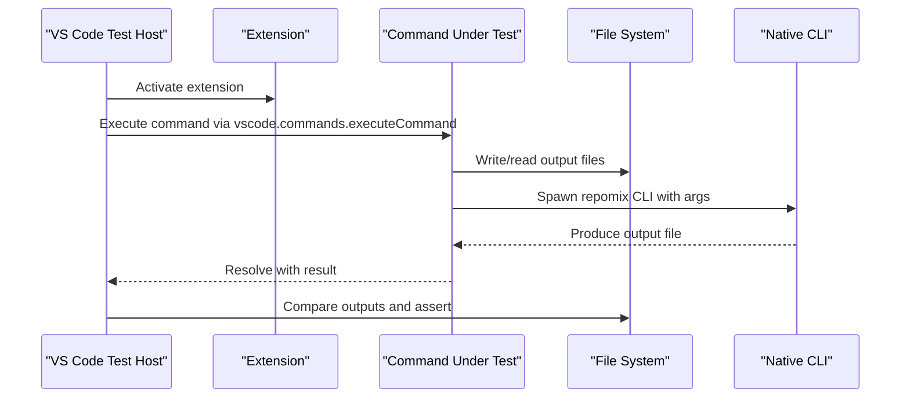

**Diagram sources**
- [integration.test.ts](file://src/test/test-workspace/integration.test.ts#L304-L378)

## Detailed Component Analysis

### Extension Activation and Workspace Detection
- Validates extension activation lifecycle
- Confirms test workspace path resolution

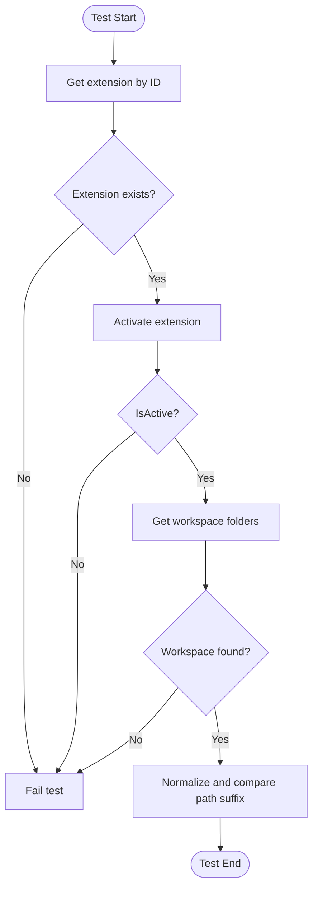

**Diagram sources**
- [extension.test.ts](file://src/test/extension.test.ts#L5-L30)

**Section sources**
- [extension.test.ts](file://src/test/extension.test.ts#L1-L31)

### Bundle Manager Behavior
- Constructor initializes paths
- setActiveBundle updates active bundle and fires events
- getAllBundles reads without initialization
- saveBundle writes updated bundles and fires events
- deleteBundle removes bundle, resets active, and fires events

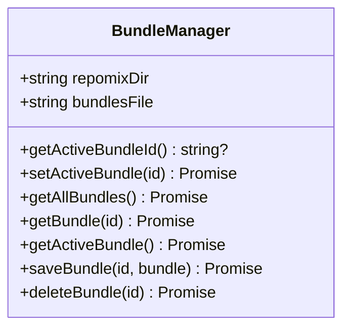

**Diagram sources**
- [bundleManager.test.ts](file://src/test/core/bundles/bundleManager.test.ts#L9-L299)

**Section sources**
- [bundleManager.test.ts](file://src/test/core/bundles/bundleManager.test.ts#L1-L300)

### Clipboard Operations Across Platforms
- Copies output to a temporary location
- Executes platform-specific clipboard commands
- Recreates temp directory if deleted mid-session
- Handles failures with user-visible error messages

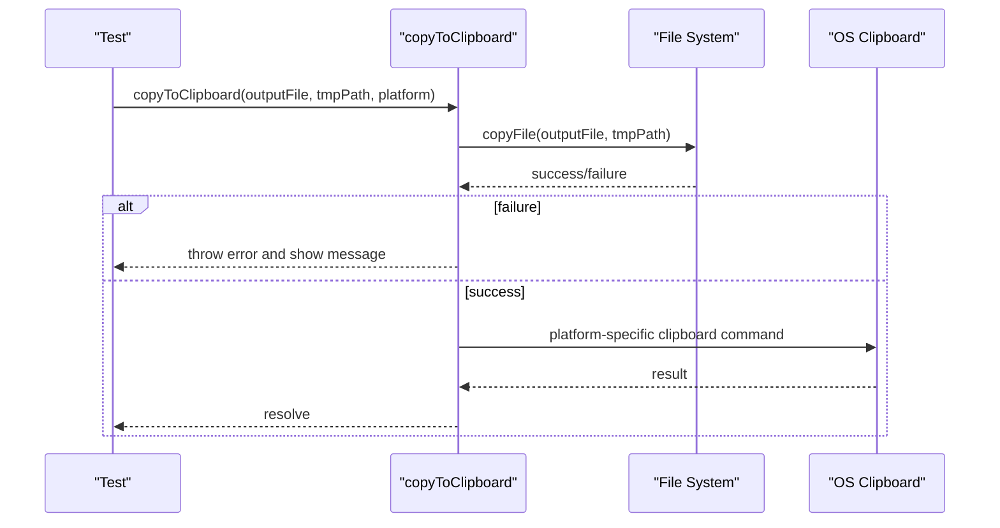

**Diagram sources**
- [copyToClipboard.test.ts](file://src/test/core/files/copyToClipboard.test.ts#L67-L120)

**Section sources**
- [copyToClipboard.test.ts](file://src/test/core/files/copyToClipboard.test.ts#L1-L142)

### Command Orchestration and Configuration Wiring
- Validates conditional behavior based on configuration flags
- Ensures proper cleanup and clipboard actions depending on settings

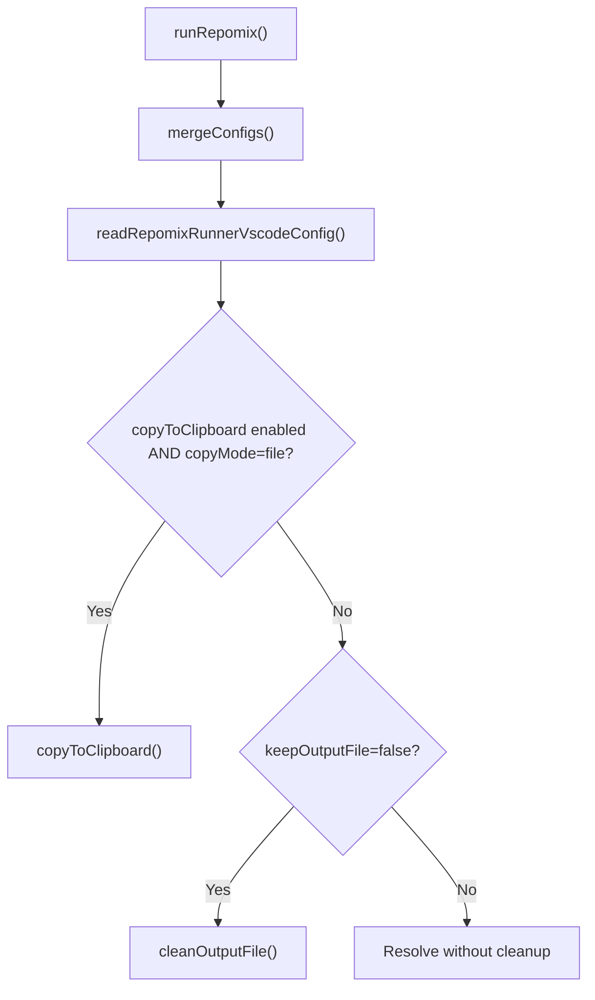

**Diagram sources**
- [runRepomix.test.ts](file://src/test/commands/runRepomix.test.ts#L51-L97)

**Section sources**
- [runRepomix.test.ts](file://src/test/commands/runRepomix.test.ts#L1-L141)

### Search Pipeline Deduplication and Filtering
- Deduplicates hits by file path, keeping the highest score
- Filters ignored files using .gitignore when present

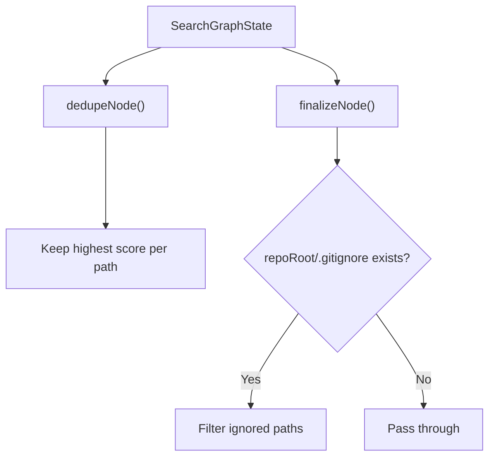

**Diagram sources**
- [nodes.test.ts](file://src/test/search/nodes.test.ts#L8-L24)
- [nodes.test.ts](file://src/test/search/nodes.test.ts#L26-L50)

**Section sources**
- [nodes.test.ts](file://src/test/search/nodes.test.ts#L1-L52)

### WebView Message Schema Validation
- Uses Zod-like schema parsing to validate inbound messages
- Enforces presence and shape of required fields

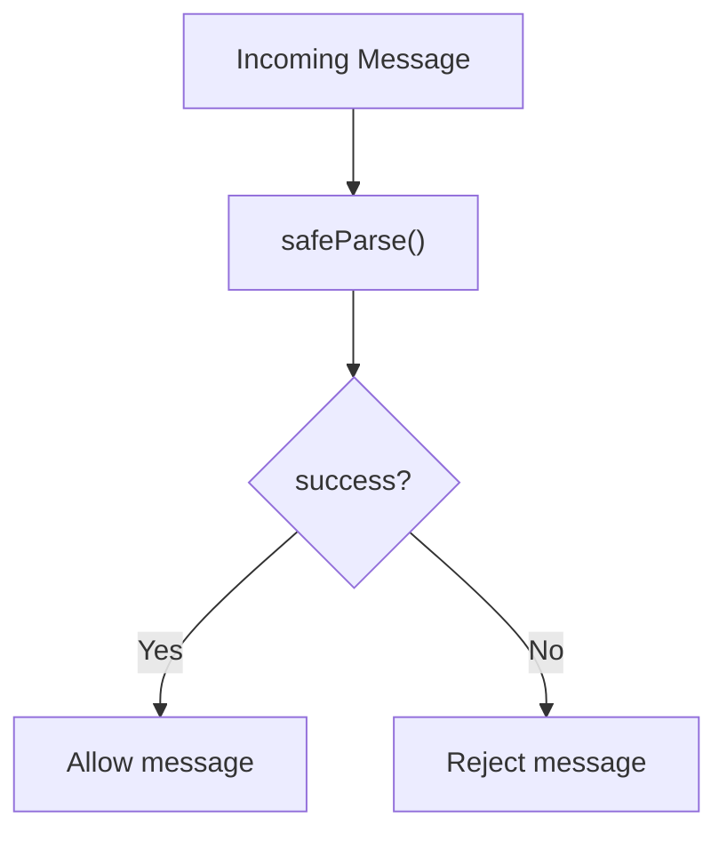

**Diagram sources**
- [messageSchemas.test.ts](file://src/test/webview/messageSchemas.test.ts#L5-L22)
- [messageSchemas.test.ts](file://src/test/webview/messageSchemas.test.ts#L24-L40)

**Section sources**
- [messageSchemas.test.ts](file://src/test/webview/messageSchemas.test.ts#L1-L93)

### Utility Functions
- deepMerge: Deeply merges objects, modifies target in place, preserves immutability of source
- generateOutputFilename: Applies bundle name sanitization and optional bundle name injection into output filename

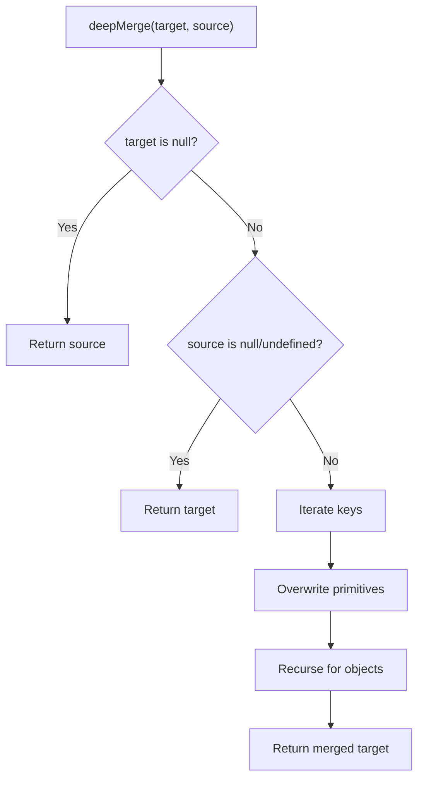

**Diagram sources**
- [deepMerge.test.ts](file://src/test/utils/deepMerge.test.ts#L4-L68)

**Section sources**
- [deepMerge.test.ts](file://src/test/utils/deepMerge.test.ts#L1-L69)
- [generateOutputFilename.test.ts](file://src/test/utils/generateOutputFilename.test.ts#L1-L61)

### Integration Testing: End-to-End Workflows and External Tool Interactions
- Activates extension and validates workspace
- Compares extension output with native CLI output for equivalence
- Parameterized tests for bundle selection and removal scenarios
- Robust file cleanup and bundle reset between tests

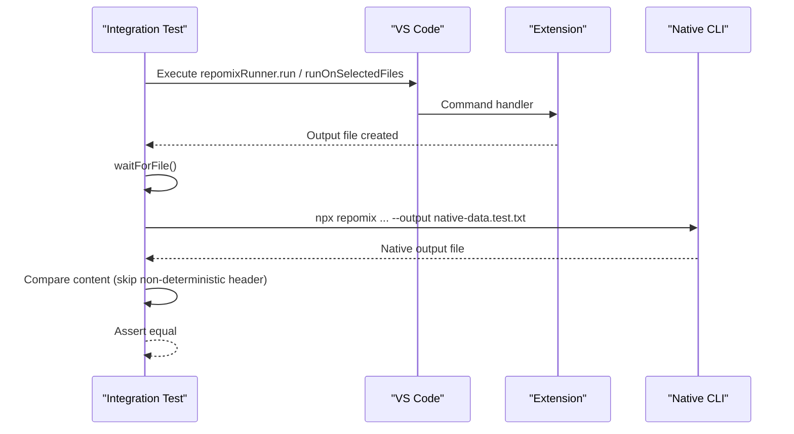

**Diagram sources**
- [integration.test.ts](file://src/test/test-workspace/integration.test.ts#L304-L378)

**Section sources**
- [integration.test.ts](file://src/test/test-workspace/integration.test.ts#L1-L380)

## Dependency Analysis
- Test runner configuration defines workspace and test file pattern
- Scripts orchestrate compilation, type checking, linting, and test execution
- Test workspace configuration drives output file naming and behavior

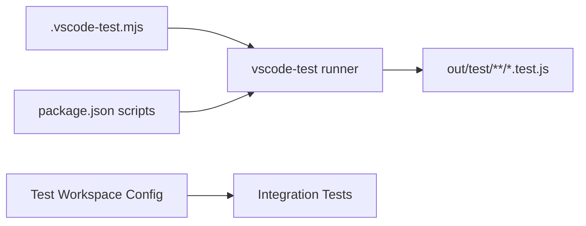

**Diagram sources**
- [.vscode-test.mjs](file://.vscode-test.mjs#L3-L7)
- [package.json](file://package.json#L541-L559)
- [repomix.config.json](file://src/test/test-workspace/root/repomix.config.json#L1-L26)

**Section sources**
- [.vscode-test.mjs](file://.vscode-test.mjs#L1-L8)
- [package.json](file://package.json#L541-L559)
- [repomix.config.json](file://src/test/test-workspace/root/repomix.config.json#L1-L26)

## Performance Considerations
- Prefer stubbing expensive filesystem or network operations in unit tests
- Use targeted timeouts and polling helpers for asynchronous file readiness
- Minimize repeated external CLI invocations by reusing outputs when feasible
- Keep integration tests focused and isolated to reduce flakiness

## Troubleshooting Guide
Common issues and resolutions:
- File not found during integration tests: Use waitForFile to poll for file creation; ensure output paths are correct and normalized
- Windows-specific failures: Use deleteFiles with normalized patterns and absolute paths; prefer globby for robust deletion
- Clipboard failures: Validate platform-specific commands and temp directory recreation logic
- Bundle state inconsistencies: Reset bundles.json to empty bundles after teardown to avoid cross-test contamination

**Section sources**
- [utilsTest.ts](file://src/test/utilsTest.ts#L1-L67)
- [integration.test.ts](file://src/test/test-workspace/integration.test.ts#L45-L68)

## Conclusion
The testing framework balances unit isolation with meaningful integration checks against the extension and external CLI. It leverages VS Code’s test host, robust file utilities, and parameterized scenarios to validate complex workflows. By following the patterns and guidelines outlined here, contributors can confidently add, maintain, and debug tests across the codebase.

## Appendices

### Writing New Tests
- Place unit tests alongside the code under src/test/<module>/<feature>.test.ts
- For integration tests, use src/test/test-workspace/integration.test.ts and add fixtures under src/test/test-workspace/root
- Use assert for assertions and sinon for stubs/spies
- Leverage waitForFile and deleteFiles for deterministic file operations

### Running Test Suites
- Pre-test compilation and linting are handled by scripts
- Run all tests with the VS Code test runner configured by .vscode-test.mjs
- Use npm scripts to compile tests, compile the extension, and execute the test runner

**Section sources**
- [package.json](file://package.json#L541-L559)
- [.vscode-test.mjs](file://.vscode-test.mjs#L1-L8)

### Interpreting Results
- Unit tests: Expect clear pass/fail outcomes for isolated behaviors
- Integration tests: Expect deterministic comparisons between extension and CLI outputs; failures often indicate path normalization or configuration mismatches

### Continuous Integration and Coverage
- CI setup: Configure the VS Code test runner with the provided configuration
- Coverage: No explicit coverage reporting configuration is present in the repository; consider adding a coverage tool if needed

**Section sources**
- [.vscode-test.mjs](file://.vscode-test.mjs#L1-L8)
- [package.json](file://package.json#L541-L559)

### Example Scenarios

#### Bundle Creation and Selection
- Validate setActiveBundle updates active bundle and fires events
- Validate saveBundle persists bundles and triggers change notifications
- Validate deleteBundle removes entries and resets active bundle

**Section sources**
- [bundleManager.test.ts](file://src/test/core/bundles/bundleManager.test.ts#L43-L85)
- [bundleManager.test.ts](file://src/test/core/bundles/bundleManager.test.ts#L182-L233)
- [bundleManager.test.ts](file://src/test/core/bundles/bundleManager.test.ts#L235-L298)

#### AI Agent Message Validation
- Validate schema enforcement for runBundle, runSmartAgent, webviewLoaded, and saveApiKey
- Ensure missing or invalid fields cause parsing to fail

**Section sources**
- [messageSchemas.test.ts](file://src/test/webview/messageSchemas.test.ts#L5-L22)
- [messageSchemas.test.ts](file://src/test/webview/messageSchemas.test.ts#L24-L40)
- [messageSchemas.test.ts](file://src/test/webview/messageSchemas.test.ts#L58-L91)

#### Clipboard Operations
- Validate platform-specific commands and temp directory recreation
- Ensure error paths surface user-facing messages

**Section sources**
- [copyToClipboard.test.ts](file://src/test/core/files/copyToClipboard.test.ts#L67-L120)
- [copyToClipboard.test.ts](file://src/test/core/files/copyToClipboard.test.ts#L122-L140)