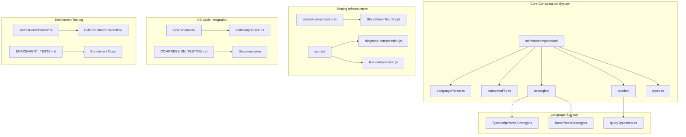
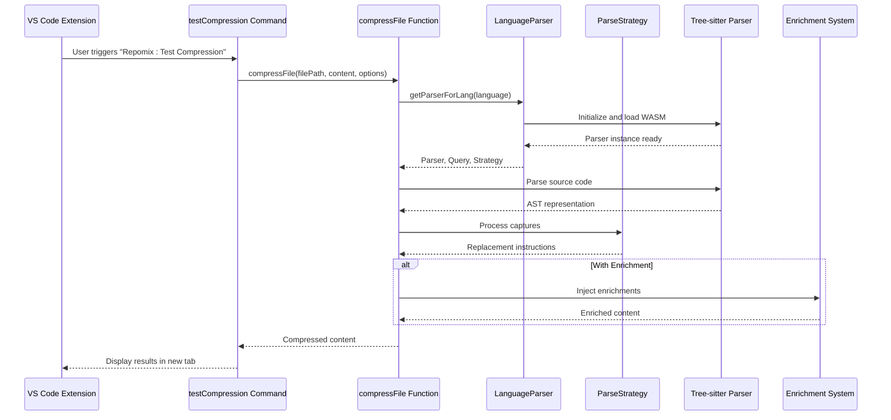
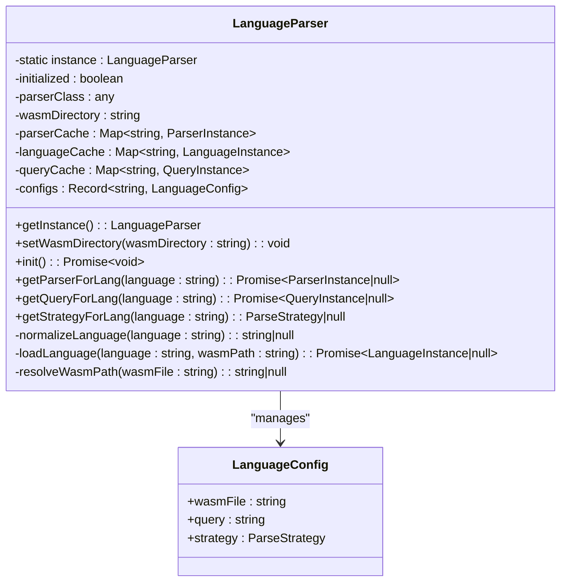
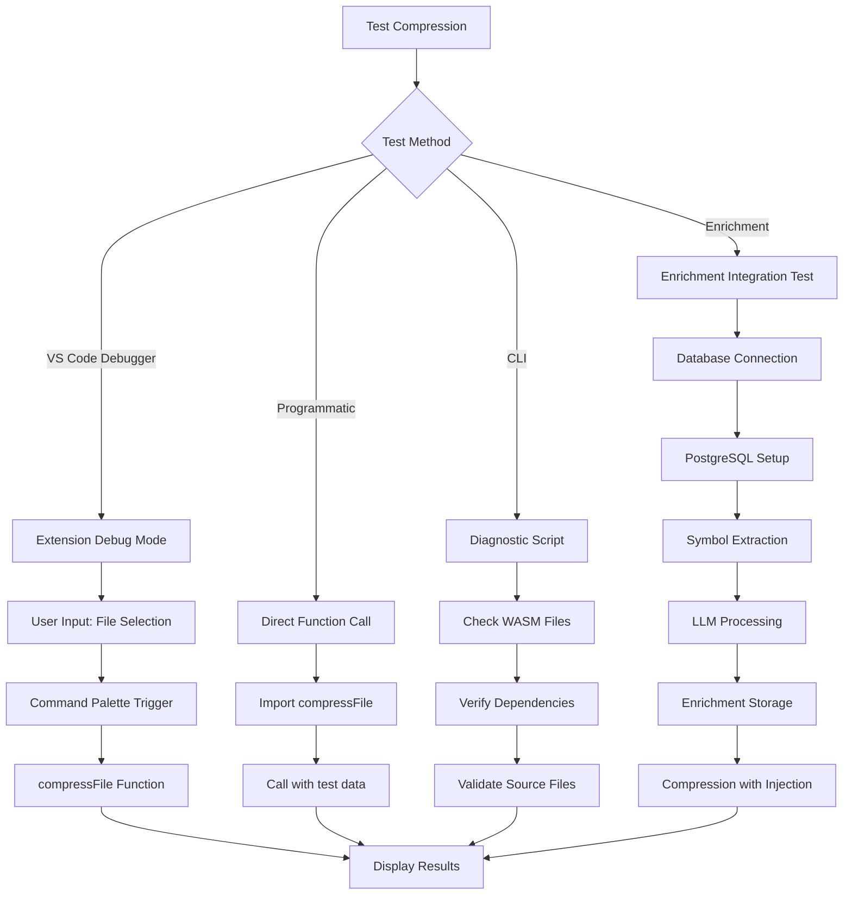
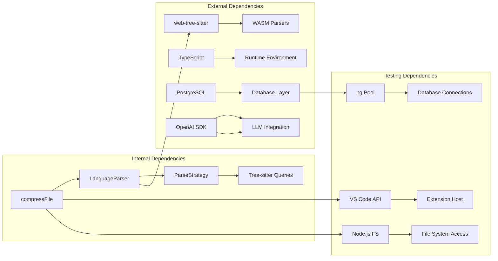

# Compression Testing Framework

<cite>
**Referenced Files in This Document**
- [COMPRESSION_TESTING.md](file://COMPRESSION_TESTING.md)
- [ENRICHMENT_TESTS.md](file://ENRICHMENT_TESTS.md)
- [src/test-compression.ts](file://src/test-compression.ts)
- [src/test-enrichment.ts](file://src/test-enrichment.ts)
- [src/test-enrichment-indexing.ts](file://src/test-enrichment-indexing.ts)
- [src/test-enrichment-retrieval.ts](file://src/test-enrichment-retrieval.ts)
- [scripts/test-compression.js](file://scripts/test-compression.js)
- [scripts/diagnose-compression.js](file://scripts/diagnose-compression.js)
- [src/core/compression/index.ts](file://src/core/compression/index.ts)
- [src/core/compression/compressFile.ts](file://src/core/compression/compressFile.ts)
- [src/core/compression/LanguageParser.ts](file://src/core/compression/LanguageParser.ts)
- [src/core/compression/types.ts](file://src/core/compression/types.ts)
- [src/core/compression/strategies/BaseParseStrategy.ts](file://src/core/compression/strategies/BaseParseStrategy.ts)
- [src/core/compression/strategies/TypeScriptParseStrategy.ts](file://src/core/compression/strategies/TypeScriptParseStrategy.ts)
- [src/core/compression/queries/queryTypescript.ts](file://src/core/compression/queries/queryTypescript.ts)
- [src/commands/testCompression.ts](file://src/commands/testCompression.ts)
</cite>

## Update Summary
**Changes Made**
- Added comprehensive enrichment injection testing framework documentation
- Updated compression testing methodology to include enrichment-enabled compression
- Enhanced compression options with enrichment-related configurations
- Added new testing scripts for enrichment workflow validation
- Integrated enrichment testing with existing compression testing infrastructure

## Table of Contents
1. [Introduction](#introduction)
2. [Project Structure](#project-structure)
3. [Core Components](#core-components)
4. [Architecture Overview](#architecture-overview)
5. [Detailed Component Analysis](#detailed-component-analysis)
6. [Testing Framework](#testing-framework)
7. [Enrichment Integration Testing](#enrichment-integration-testing)
8. [Dependency Analysis](#dependency-analysis)
9. [Performance Considerations](#performance-considerations)
10. [Troubleshooting Guide](#troubleshooting-guide)
11. [Conclusion](#conclusion)

## Introduction

The Compression Testing Framework is a comprehensive system designed to test and validate the code compression capabilities of the Repomix extension. This framework provides multiple testing methodologies including VS Code extension debugging, programmatic usage, and command-line verification. The system leverages Tree-sitter parsers to analyze and compress code while maintaining semantic meaning and structure.

**Updated** The framework now includes enhanced enrichment injection testing capabilities, allowing developers to validate compression with and without enrichment data integration. This provides a complete testing solution for both baseline compression functionality and enriched compression scenarios.

The framework supports six programming languages: TypeScript, JavaScript, Python, Rust, C#, and Dart. It employs advanced parsing techniques using Web Tree-Sitter technology to identify code constructs and apply intelligent compression strategies that preserve functionality while significantly reducing file sizes.

## Project Structure

The compression testing framework is organized into several key directories and components:



**Diagram sources**
- [src/core/compression/index.ts](file://src/core/compression/index.ts#L1-L3)
- [src/test-compression.ts](file://src/test-compression.ts#L1-L515)
- [src/test-enrichment.ts](file://src/test-enrichment.ts#L1-L191)
- [scripts/diagnose-compression.js](file://scripts/diagnose-compression.js#L1-L116)

The framework follows a modular architecture with clear separation of concerns between parsing, compression strategies, testing infrastructure, and enrichment integration.

**Section sources**
- [src/core/compression/index.ts](file://src/core/compression/index.ts#L1-L3)
- [src/test-compression.ts](file://src/test-compression.ts#L1-L515)
- [src/test-enrichment.ts](file://src/test-enrichment.ts#L1-L191)
- [scripts/diagnose-compression.js](file://scripts/diagnose-compression.js#L1-L116)

## Core Components

The compression testing framework consists of several interconnected components that work together to provide comprehensive testing capabilities:

### LanguageParser System
The LanguageParser serves as the central coordinator for all compression operations. It manages Tree-sitter parser instances, caches language configurations, and handles WASM file resolution for different programming languages.

### Compression Strategies
Each programming language has a specialized compression strategy that understands the syntax and semantics of that language. The strategies handle different code constructs like classes, functions, imports, and exports.

### Test Infrastructure
The framework provides multiple testing approaches including standalone scripts, VS Code extension debugging, and automated diagnostics to ensure the compression system works correctly across all supported languages.

### Enrichment Integration
**New** The framework now includes comprehensive enrichment integration testing that validates compression with and without enrichment data injection, providing complete coverage of the enrichment workflow.

**Section sources**
- [src/core/compression/LanguageParser.ts](file://src/core/compression/LanguageParser.ts#L1-L218)
- [src/core/compression/compressFile.ts](file://src/core/compression/compressFile.ts#L1-L85)
- [src/core/compression/types.ts](file://src/core/compression/types.ts#L1-L66)

## Architecture Overview

The compression testing framework implements a sophisticated multi-layered architecture that combines language-specific parsing with intelligent compression strategies and enrichment integration:



**Diagram sources**
- [src/commands/testCompression.ts](file://src/commands/testCompression.ts#L1-L39)
- [src/core/compression/compressFile.ts](file://src/core/compression/compressFile.ts#L25-L84)
- [src/core/compression/LanguageParser.ts](file://src/core/compression/LanguageParser.ts#L95-L129)

The architecture ensures thread-safe initialization of Tree-sitter parsers and efficient caching mechanisms to minimize overhead during repeated compression operations, with optional enrichment integration support.

## Detailed Component Analysis

### LanguageParser Implementation

The LanguageParser implements a singleton pattern with comprehensive caching mechanisms to optimize performance and resource usage:



**Diagram sources**
- [src/core/compression/LanguageParser.ts](file://src/core/compression/LanguageParser.ts#L26-L77)
- [src/core/compression/types.ts](file://src/core/compression/types.ts#L61-L65)

The parser supports lazy initialization and maintains separate caches for parsers, languages, and queries to ensure optimal performance during concurrent operations.

**Section sources**
- [src/core/compression/LanguageParser.ts](file://src/core/compression/LanguageParser.ts#L1-L218)
- [src/core/compression/types.ts](file://src/core/compression/types.ts#L1-L66)

### Compression Strategy System

The compression strategy system provides language-specific implementations that handle different code constructs appropriately:

```mermaid
classDiagram
class BaseParseStrategy {
<<abstract>>
+parseCapture(capture, context, options) : ParsedChunk|null
+getBodyReplacement(capture, context, options) : BodyReplacement|null
#getNodeText(node, sourceCode) : string
#collapseWhitespace(text) : string
#findSignatureEnd(text) : number
#ensureTerminal(text) : string
#cleanFunctionSignature(text) : string
}
class TypeScriptParseStrategy {
+parseCapture(capture, context, options) : ParsedChunk|null
+getBodyReplacement(capture, context, options) : BodyReplacement|null
-findBodyRange(node, nodeText) : {start, end}|null
-extractNodeName(node) : string|null
-parseExport(text, startIndex, endIndex) : ParsedChunk|null
-createClassSkeleton(text) : string
-buildChunk(type, startIndex, endIndex, text) : ParsedChunk
}
BaseParseStrategy <|-- TypeScriptParseStrategy
```

**Diagram sources**
- [src/core/compression/strategies/BaseParseStrategy.ts](file://src/core/compression/strategies/BaseParseStrategy.ts#L11-L74)
- [src/core/compression/strategies/TypeScriptParseStrategy.ts](file://src/core/compression/strategies/TypeScriptParseStrategy.ts#L12-L207)

The strategy system implements intelligent compression that preserves function signatures, class skeletons, and essential declarations while removing implementation details.

**Section sources**
- [src/core/compression/strategies/BaseParseStrategy.ts](file://src/core/compression/strategies/BaseParseStrategy.ts#L1-L75)
- [src/core/compression/strategies/TypeScriptParseStrategy.ts](file://src/core/compression/strategies/TypeScriptParseStrategy.ts#L1-L208)

### Test Framework Components

The testing framework provides multiple approaches for validating compression functionality:



**Diagram sources**
- [src/commands/testCompression.ts](file://src/commands/testCompression.ts#L5-L38)
- [src/test-compression.ts](file://src/test-compression.ts#L447-L514)
- [src/test-enrichment.ts](file://src/test-enrichment.ts#L62-L108)
- [scripts/diagnose-compression.js](file://scripts/diagnose-compression.js#L17-L91)

**Section sources**
- [src/commands/testCompression.ts](file://src/commands/testCompression.ts#L1-L39)
- [src/test-compression.ts](file://src/test-compression.ts#L1-L515)
- [src/test-enrichment.ts](file://src/test-enrichment.ts#L1-L191)
- [scripts/test-compression.js](file://scripts/test-compression.js#L1-L190)

## Testing Framework

The compression testing framework offers four distinct testing methodologies to ensure comprehensive validation:

### Method 1: VS Code Extension Debugger
The recommended approach involves launching the extension in debug mode and using the built-in "Repomix: Test Compression" command. This method provides real-time feedback and integrates seamlessly with the development environment.

### Method 2: Programmatic Usage
For automated testing and integration scenarios, the framework supports direct function calls with customizable options including selective preservation of specific functions or classes.

### Method 3: Command Line Verification
The diagnostic script provides comprehensive system health checks, verifying WASM file availability, dependency installations, and source file integrity.

### Method 4: Enrichment Integration Testing
**New** The framework now includes comprehensive enrichment integration testing that validates compression with and without enrichment data injection, providing complete coverage of the enrichment workflow.

**Section sources**
- [COMPRESSION_TESTING.md](file://COMPRESSION_TESTING.md#L7-L68)
- [ENRICHMENT_TESTS.md](file://ENRICHMENT_TESTS.md#L45-L55)
- [src/test-compression.ts](file://src/test-compression.ts#L36-L60)

## Enrichment Integration Testing

**New Section** The compression testing framework now includes comprehensive enrichment integration testing capabilities:

### Enrichment Testing Workflow
The framework provides three dedicated test scripts for complete enrichment workflow validation:

1. **Main Enrichment Test** (`src/test-enrichment.ts`): Tests database schema, symbol extraction, and LLM summary generation
2. **Indexing Workflow Test** (`src/test-enrichment-indexing.ts`): Tests enrichment storage and LangGraph workflow preparation  
3. **Retrieval & Injection Test** (`src/test-enrichment-retrieval.ts`): Tests loading enrichments and injecting during compression

### Database Integration
The testing framework validates PostgreSQL database connectivity and schema verification for the `code_enrichments` table with proper indexing and constraints.

### Symbol Extraction Testing
Tests symbol extraction using Tree-sitter parsers with comprehensive coverage of different code constructs including classes, methods, functions, and interfaces.

### LLM Integration Testing
Validates LLM summary generation using local endpoints with configurable models and API keys for testing without external dependencies.

### Compression with Enrichment Injection
**New** The framework tests compression with enrichment injection, comparing baseline compression results with enriched compression outputs that include contextual information.

**Section sources**
- [src/test-enrichment.ts](file://src/test-enrichment.ts#L1-L191)
- [src/test-enrichment-indexing.ts](file://src/test-enrichment-indexing.ts#L1-L268)
- [src/test-enrichment-retrieval.ts](file://src/test-enrichment-retrieval.ts#L1-L229)
- [ENRICHMENT_TESTS.md](file://ENRICHMENT_TESTS.md#L1-L163)

## Dependency Analysis

The compression testing framework maintains minimal external dependencies while leveraging powerful parsing capabilities:



**Diagram sources**
- [src/core/compression/compressFile.ts](file://src/core/compression/compressFile.ts#L1-L3)
- [src/core/compression/LanguageParser.ts](file://src/core/compression/LanguageParser.ts#L88-L93)
- [src/commands/testCompression.ts](file://src/commands/testCompression.ts#L1-L3)

The framework demonstrates excellent modularity with clear dependency boundaries and minimal coupling between components, with optional enrichment dependencies for advanced testing scenarios.

**Section sources**
- [src/core/compression/compressFile.ts](file://src/core/compression/compressFile.ts#L1-L85)
- [src/core/compression/LanguageParser.ts](file://src/core/compression/LanguageParser.ts#L1-L218)

## Performance Considerations

The compression testing framework implements several optimization strategies to ensure efficient operation:

### Caching Mechanisms
- Parser instances are cached to avoid repeated initialization costs
- Language configurations and query objects are stored in memory for quick access
- WASM file paths are resolved once and reused across operations

### Memory Management
- Tree-sitter parsers are designed to be lightweight and efficient
- AST traversal operations are optimized for minimal memory footprint
- String manipulation operations use efficient slice operations

### Concurrency Handling
- Asynchronous operations prevent blocking the main thread
- Promise-based APIs enable non-blocking compression operations
- Error handling prevents cascading failures during concurrent operations

### Enrichment Performance Optimization
**New** The framework includes performance considerations for enrichment integration:
- Database connection pooling for efficient enrichment retrieval
- Symbol extraction caching for repeated enrichment lookups
- LLM request batching for multiple symbol enrichment

## Troubleshooting Guide

Common issues and their solutions when working with the compression testing framework:

### WASM Parser Issues
- **Problem**: Compression returns null due to WASM loading failures
- **Solution**: Verify WASM files exist in the `dist/tree-sitter-wasm/` directory and run the diagnostic script to check system health

### Language Support Problems
- **Problem**: Unsupported file extensions return null compression results
- **Solution**: Ensure file extensions match supported languages (`.ts`, `.js`, `.py`, `.rs`, `.cs`, `.dart`)

### Tree-sitter Integration Issues
- **Problem**: Parser initialization failures or missing web-tree-sitter dependency
- **Solution**: Install web-tree-sitter using npm and verify proper installation with `npm list web-tree-sitter`

### Memory and Performance Issues
- **Problem**: Large files cause memory pressure or slow compression
- **Solution**: Consider implementing chunk-based processing for very large files or adjust compression options

### Enrichment Testing Issues
**New** Additional troubleshooting for enrichment testing:

- **Database Connection Failed**: Ensure PostgreSQL is running and TEST_DATABASE_URL is properly configured
- **Symbol Extraction Failed**: Verify Tree-sitter WASM files are in the correct directory
- **LLM Test Skipped**: Set OPENROUTER_API_KEY or use local LLM endpoint for testing
- **Enrichment Injection Failed**: Check that enrichment data exists in the database and compression options are properly configured

**Section sources**
- [COMPRESSION_TESTING.md](file://COMPRESSION_TESTING.md#L154-L171)
- [ENRICHMENT_TESTS.md](file://ENRICHMENT_TESTS.md#L94-L113)
- [scripts/diagnose-compression.js](file://scripts/diagnose-compression.js#L17-L114)

## Conclusion

The Compression Testing Framework provides a robust, multi-faceted approach to validating code compression functionality. Its modular architecture, comprehensive language support, and flexible testing methodologies make it an essential tool for ensuring the reliability and effectiveness of the compression system.

**Updated** The framework now includes comprehensive enrichment integration testing capabilities, providing complete coverage of both baseline compression functionality and enriched compression scenarios with contextual information injection. This enhancement ensures thorough validation of the complete compression pipeline, from symbol extraction through enrichment injection to final compressed output.

The framework successfully balances performance optimization with comprehensive testing capabilities, providing developers with multiple pathways to validate compression behavior across different scenarios and use cases. The integration with VS Code, combined with standalone testing scripts, diagnostic tools, and enrichment testing infrastructure, ensures thorough validation in various development environments.

Future enhancements could include expanded language support, performance benchmarking capabilities, integration with continuous integration pipelines for automated quality assurance, and advanced enrichment workflow testing scenarios.