# Testing Framework

<cite>
**Referenced Files in This Document**
- [extension.test.ts](file://src/test/extension.test.ts)
- [integration.test.ts](file://src/test/test-workspace/integration.test.ts)
- [.vscode-test.mjs](file://.vscode-test.mjs)
- [package.json](file://package.json)
- [bundleManager.test.ts](file://src/test/core/bundles/bundleManager.test.ts)
- [copyToClipboard.test.ts](file://src/test/core/files/copyToClipboard.test.ts)
- [runRepomix.test.ts](file://src/test/commands/runRepomix.test.ts)
- [nodes.test.ts](file://src/test/search/nodes.test.ts)
- [messageSchemas.test.ts](file://src/test/webview/messageSchemas.test.ts)
- [deepMerge.test.ts](file://src/test/utils/deepMerge.test.ts)
- [generateOutputFilename.test.ts](file://src/test/utils/generateOutputFilename.test.ts)
- [utilsTest.ts](file://src/test/utilsTest.ts)
- [repomix.config.json](file://src/test/test-workspace/root/repomix.config.json)
- [databaseService.test.ts](file://src/test/core/storage/databaseService.test.ts)
- [qdrantAdapter.test.ts](file://src/test/core/indexing/vectorDb/qdrantAdapter.test.ts)
- [fileEmbeddingPipeline.test.ts](file://src/test/core/indexing/fileEmbeddingPipeline.test.ts)
- [repoIndexer.test.ts](file://src/test/core/indexing/repoIndexer.test.ts)
- [repoIndexMonitor.test.ts](file://src/test/core/indexing/repoIndexMonitor.test.ts)
- [compatibility.test.ts](file://src/test/core/indexing/compatibility.test.ts)
- [ENRICHMENT_TESTS.md](file://ENRICHMENT_TESTS.md)
- [EnrichmentService.ts](file://src/core/llm/services/EnrichmentService.ts)
- [testCompression.ts](file://src/commands/testCompression.ts)
- [compressFile.ts](file://src/core/compression/compressFile.ts)
- [LanguageParser.ts](file://src/core/compression/LanguageParser.ts)
- [types.ts](file://src/core/compression/types.ts)
- [index.ts](file://src/core/compression/index.ts)
- [COMPRESSION_TESTING.md](file://COMPRESSION_TESTING.md)
- [diagnose-compression.js](file://scripts/diagnose-compression.js)
- [test-compression.js](file://scripts/test-compression.js)
- [test-compression.ts](file://src/test-compression.ts)
- [test-compression-fix.ts](file://src/test-compression-fix.ts)
- [launch.json](file://.vscode/launch.json)
- [tasks.json](file://.vscode/tasks.json)
- [DEBUG.md](file://.vscode/DEBUG.md)
</cite>

## Update Summary
**Changes Made**
- Removed AI chat-related tests (aiChat.test.ts) from the test suite
- Added comprehensive tests for LLM provider system, vector database operations, and code enrichment features
- Updated test structure to focus on remaining functionality with new indexing and enrichment capabilities
- Enhanced integration testing with dimension compatibility validation and vector database adapter testing
- Added new test files for Qdrant vector database operations, file embedding pipeline, repository indexing, and compatibility checking

## Table of Contents
1. [Introduction](#introduction)
2. [Project Structure](#project-structure)
3. [Core Components](#core-components)
4. [Architecture Overview](#architecture-overview)
5. [Detailed Component Analysis](#detailed-component-analysis)
6. [Dependency Analysis](#dependency-analysis)
7. [Performance Considerations](#performance-considerations)
8. [Troubleshooting Guide](#troubleshooting-guide)
9. [Conclusion](#conclusion)
10. [Appendices](#appendices)

## Introduction
This document describes the Testing Framework for the project, covering unit tests, integration tests, and end-to-end workflows. It explains the test structure organized by feature areas, the test workspace setup, mock data generation, and environment configuration. It documents testing utilities, helper functions, and assertion patterns used across the suite. It also outlines integration testing approaches for external tool interactions, guidance for writing new tests, running test suites, interpreting results, continuous integration setup, coverage reporting, and quality assurance processes. Examples include bundle creation workflows, vector database operations, code enrichment features, compression module testing, and the comprehensive indexing system with dimension compatibility validation.

## Project Structure
The test suite is organized under src/test with dedicated folders per major module and feature area:
- Commands: Command-level tests for user-triggered actions
- Core: Core subsystems (bundles, files, indexing, storage, compression)
- Search: Search pipeline utilities
- Webview: WebView message schema validation
- Utils: General-purpose utilities
- Test workspace: Integration tests and fixture data

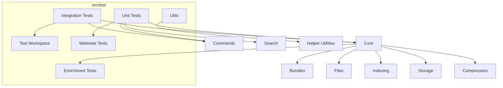
```mermaid
graph TB
subgraph "src/test"
UT["Unit Tests"]
IT["Integration Tests"]
TW["Test Workspace"]
U["Utils"]
WV["Webview Tests"]
END["Enrichment Tests"]
end
UT --> CMD["Commands"]
UT --> CORE["Core"]
UT --> SRCH["Search"]
UT --> WV
CORE --> BUNDLES["Bundles"]
CORE --> FILES["Files"]
CORE --> IDX["Indexing"]
CORE --> STORAGE["Storage"]
CORE --> COMP["Compression"]
CORE --> END
IT --> TW
IT --> CORE
IT --> CMD
U --> HELP["Helper Utilities"]
```

**Diagram sources**
- [extension.test.ts:1-31](file://src/test/extension.test.ts#L1-L31)
- [integration.test.ts:1-380](file://src/test/test-workspace/integration.test.ts#L1-L380)

**Section sources**
- [extension.test.ts:1-31](file://src/test/extension.test.ts#L1-L31)
- [integration.test.ts:1-380](file://src/test/test-workspace/integration.test.ts#L1-L380)

## Core Components
- Extension activation and workspace detection
- Bundle manager behavior and persistence
- Clipboard copy operations across platforms
- Command orchestration and configuration wiring
- Search pipeline deduplication and filtering
- WebView message schema validation
- **New**: Vector database adapter testing with Qdrant integration
- **New**: File embedding pipeline with binary file detection
- **New**: Repository indexing with .gitignore support
- **New**: Dimension compatibility validation between embeddings and vector databases
- **New**: Code enrichment service with LLM provider integration
- **New**: Comprehensive indexing monitor with path expansion and deduplication
- **New**: Database service with repository file path prefix lookup
- **New**: Compression module with AST-based file skeleton generation
- **New**: Enrichment testing framework with PostgreSQL database integration

Key testing utilities:
- waitForFile: Polling-based file readiness with timeouts
- deleteFiles: Robust file deletion supporting glob patterns and Windows compatibility
- execPromisify: Promisified child process execution for CLI interactions
- **New**: Vector database adapter mocking with Qdrant client stubs
- **New**: Binary file detection testing for various project configuration formats
- **New**: Temporary repository structure creation for indexing tests
- **New**: Dimension compatibility validation with configurable embedding providers
- **New**: Code enrichment testing with PostgreSQL database connectivity
- **New**: Compression diagnostic scripts for system health verification
- **New**: Standalone compression test scripts for programmatic testing
- **New**: VS Code debugger integration for interactive compression testing

**Section sources**
- [utilsTest.ts:1-67](file://src/test/utilsTest.ts#L1-L67)
- [copyToClipboard.test.ts:1-142](file://src/test/core/files/copyToClipboard.test.ts#L1-L142)
- [bundleManager.test.ts:1-300](file://src/test/core/bundles/bundleManager.test.ts#L1-L300)
- [runRepomix.test.ts:1-141](file://src/test/commands/runRepomix.test.ts#L1-L141)
- [nodes.test.ts:1-52](file://src/test/search/nodes.test.ts#L1-L52)
- [messageSchemas.test.ts:1-93](file://src/test/webview/messageSchemas.test.ts#L1-L93)
- [deepMerge.test.ts:1-69](file://src/test/utils/deepMerge.test.ts#L1-L69)
- [generateOutputFilename.test.ts:1-61](file://src/test/utils/generateOutputFilename.test.ts#L1-L61)
- [qdrantAdapter.test.ts:1-285](file://src/test/core/indexing/vectorDb/qdrantAdapter.test.ts#L1-L285)
- [fileEmbeddingPipeline.test.ts:1-73](file://src/test/core/indexing/fileEmbeddingPipeline.test.ts#L1-L73)
- [repoIndexer.test.ts:1-157](file://src/test/core/indexing/repoIndexer.test.ts#L1-L157)
- [compatibility.test.ts:1-388](file://src/test/core/indexing/compatibility.test.ts#L1-L388)

## Architecture Overview
The test architecture combines unit isolation with integration checks against the real extension and external tools. Unit tests stub or mock filesystem and external dependencies. Integration tests activate the extension, manipulate VS Code commands, and compare outputs against native CLI behavior. **New**: The vector database testing validates Qdrant adapter functionality, dimension compatibility, and indexing workflows. **New**: The code enrichment testing framework validates database connectivity, symbol extraction, and LLM summary generation with PostgreSQL integration.

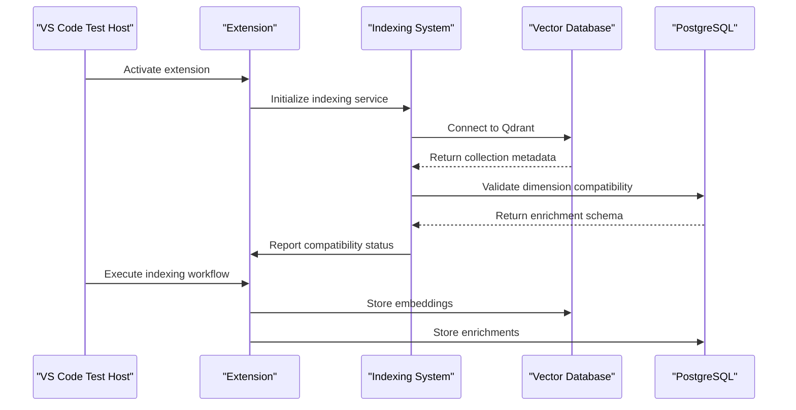
```mermaid
sequenceDiagram
participant VS as "VS Code Test Host"
participant EXT as "Extension"
participant IDX as "Indexing System"
participant VDB as "Vector Database"
participant DB as "PostgreSQL"
VS->>EXT : Activate extension
EXT->>IDX : Initialize indexing service
IDX->>VDB : Connect to Qdrant
VDB-->>IDX : Return collection metadata
IDX->>DB : Validate dimension compatibility
DB-->>IDX : Return enrichment schema
IDX->>EXT : Report compatibility status
VS->>EXT : Execute indexing workflow
EXT->>VDB : Store embeddings
EXT->>DB : Store enrichments
```

**Diagram sources**
- [compatibility.test.ts:84-125](file://src/test/core/indexing/compatibility.test.ts#L84-L125)
- [qdrantAdapter.test.ts:47-55](file://src/test/core/indexing/vectorDb/qdrantAdapter.test.ts#L47-L55)

## Detailed Component Analysis

### Extension Activation and Workspace Detection
- Validates extension activation lifecycle
- Confirms test workspace path resolution

```mermaid
flowchart TD
Start(["Test Start"]) --> GetExt["Get extension by ID"]
GetExt --> CheckExt{"Extension exists?"}
CheckExt --> |No| Fail["Fail test"]
CheckExt --> |Yes| Activate["Activate extension"]
Activate --> CheckActive{"IsActive?"}
CheckActive --> |No| Fail
CheckActive --> |Yes| GetWS["Get workspace folders"]
GetWS --> WSFound{"Workspace found?"}
WSFound --> |No| Fail
WSFound --> |Yes| CheckPath["Normalize and compare path suffix"]
CheckPath --> End(["Test End"])
```

**Diagram sources**
- [extension.test.ts:5-30](file://src/test/extension.test.ts#L5-L30)

**Section sources**
- [extension.test.ts:1-31](file://src/test/extension.test.ts#L1-L31)

### Vector Database Adapter Testing
**New** The Qdrant adapter testing validates vector database operations, metadata extraction, and dimension compatibility checking. This comprehensive test suite ensures reliable vector database integration with proper error handling and edge case coverage.

- Validates collection metadata extraction with proper dimension and metric detection
- Tests dimension compatibility scenarios between embedding services and vector collections
- Ensures graceful error handling for missing collections and malformed configurations
- Verifies API key handling for hosted Qdrant instances
- Tests edge cases with different distance metrics and empty collections

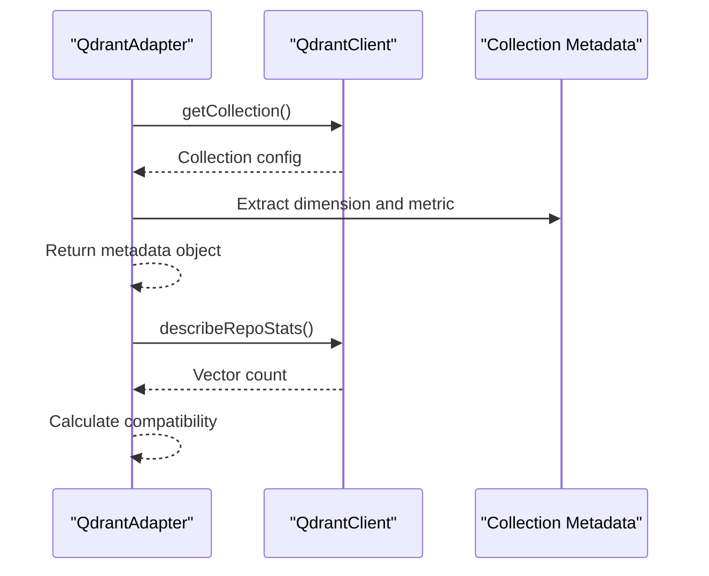
```mermaid
sequenceDiagram
participant QA as "QdrantAdapter"
participant QC as "QdrantClient"
participant CM as "Collection Metadata"
QA->>QC : getCollection()
QC-->>QA : Collection config
QA->>CM : Extract dimension and metric
QA-->>QA : Return metadata object
QA->>QC : describeRepoStats()
QC-->>QA : Vector count
QA-->>QA : Calculate compatibility
```

**Diagram sources**
- [qdrantAdapter.test.ts:47-55](file://src/test/core/indexing/vectorDb/qdrantAdapter.test.ts#L47-L55)
- [qdrantAdapter.test.ts:162-202](file://src/test/core/indexing/vectorDb/qdrantAdapter.test.ts#L162-L202)

**Section sources**
- [qdrantAdapter.test.ts:1-285](file://src/test/core/indexing/vectorDb/qdrantAdapter.test.ts#L1-L285)

### File Embedding Pipeline Testing
**New** The file embedding pipeline testing validates binary file detection logic across various project configuration formats and common file types. This ensures proper file filtering during the indexing process.

- Tests recognition of Python project files (pyproject.toml, poetry.lock, requirements.txt)
- Validates JavaScript/TypeScript project files (package.json, yarn.lock, pnpm-lock.yaml)
- Ensures proper detection of Rust (Cargo.toml, Cargo.lock) and C# project files
- Tests binary file detection for images, PDFs, executables, and DLLs
- Handles edge cases like files without extensions and unknown extensions

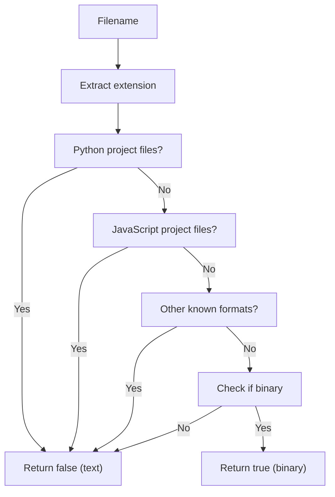
```mermaid
flowchart TD
FN["Filename"] --> EXT["Extract extension"]
EXT --> PY["Python project files?"]
PY --> |Yes| TEXT["Return false (text)"]
PY --> |No| JS["JavaScript project files?"]
JS --> |Yes| TEXT
JS --> |No| OTHER["Other known formats?"]
OTHER --> |Yes| TEXT
OTHER --> |No| BIN["Check if binary"]
BIN --> |Yes| BINARY["Return true (binary)"]
BIN --> |No| TEXT
```

**Diagram sources**
- [fileEmbeddingPipeline.test.ts:6-72](file://src/test/core/indexing/fileEmbeddingPipeline.test.ts#L6-L72)

**Section sources**
- [fileEmbeddingPipeline.test.ts:1-73](file://src/test/core/indexing/fileEmbeddingPipeline.test.ts#L1-L73)

### Repository Indexer Testing
**New** The repository indexer testing validates comprehensive file indexing with .gitignore support, subfolder ignore files, and database state verification. This ensures accurate repository scanning and proper file filtering.

- Tests basic file indexing respecting .gitignore patterns
- Validates update functionality for existing indexes
- Ensures proper handling of subfolder .gitignore files
- Tests file presence verification through database queries
- Validates ignored file exclusion (root .gitignore and subfolder .gitignore)

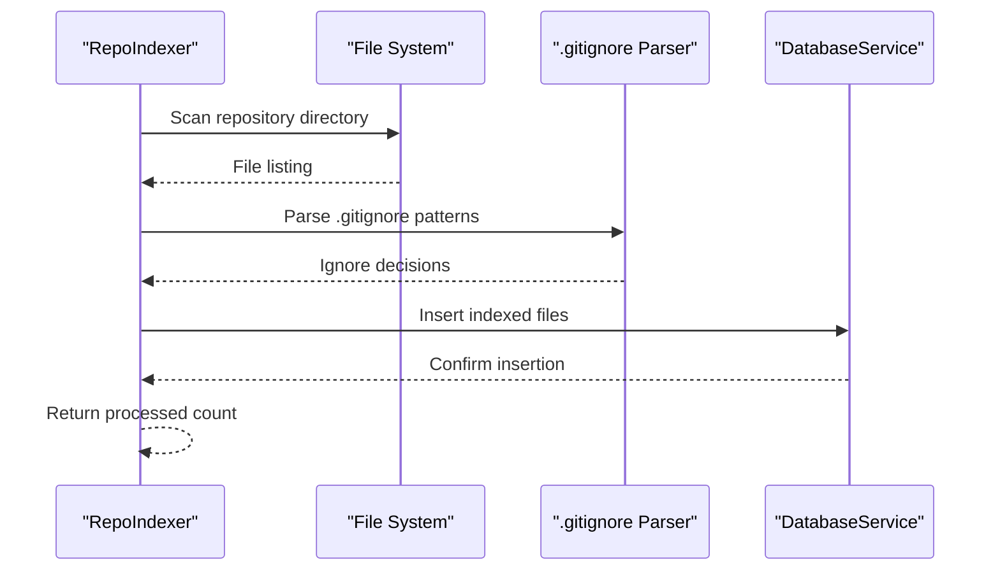
```mermaid
sequenceDiagram
participant RI as "RepoIndexer"
participant FS as "File System"
participant GI as ".gitignore Parser"
participant DB as "DatabaseService"
RI->>FS : Scan repository directory
FS-->>RI : File listing
RI->>GI : Parse .gitignore patterns
GI-->>RI : Ignore decisions
RI->>DB : Insert indexed files
DB-->>RI : Confirm insertion
RI-->>RI : Return processed count
```

**Diagram sources**
- [repoIndexer.test.ts:44-79](file://src/test/core/indexing/repoIndexer.test.ts#L44-L79)
- [repoIndexer.test.ts:99-155](file://src/test/core/indexing/repoIndexer.test.ts#L99-L155)

**Section sources**
- [repoIndexer.test.ts:1-157](file://src/test/core/indexing/repoIndexer.test.ts#L1-L157)

### Repository Index Monitor Testing
**New** The repository index monitor testing validates directory path expansion, path deduplication, and database state integration for efficient indexing operations.

- Tests directory path expansion to concrete file paths using database state
- Validates path deduplication to prevent redundant processing
- Ensures proper integration with database service for path expansion
- Tests event handling for flush operations and cleanup

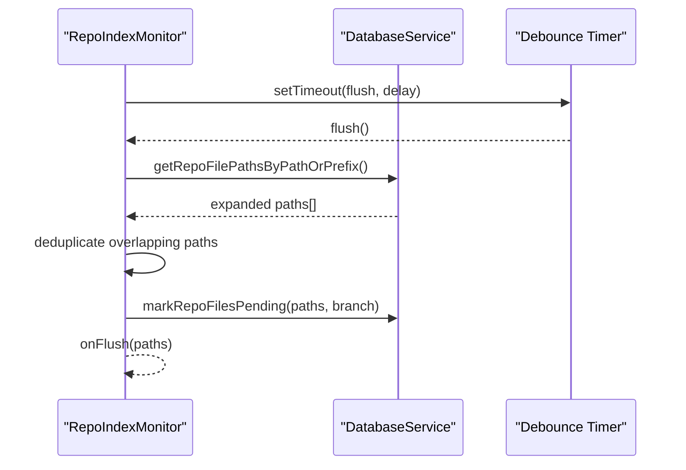
```mermaid
sequenceDiagram
participant MON as "RepoIndexMonitor"
participant DB as "DatabaseService"
participant TIMER as "Debounce Timer"
MON->>TIMER : setTimeout(flush, delay)
TIMER-->>MON : flush()
MON->>DB : getRepoFilePathsByPathOrPrefix()
DB-->>MON : expanded paths[]
MON->>MON : deduplicate overlapping paths
MON->>DB : markRepoFilesPending(paths, branch)
MON-->>MON : onFlush(paths)
```

**Diagram sources**
- [repoIndexMonitor.test.ts:16-43](file://src/test/core/indexing/repoIndexMonitor.test.ts#L16-L43)
- [repoIndexMonitor.test.ts:70-100](file://src/test/core/indexing/repoIndexMonitor.test.ts#L70-L100)

**Section sources**
- [repoIndexMonitor.test.ts:1-102](file://src/test/core/indexing/repoIndexMonitor.test.ts#L1-L102)

### Dimension Compatibility Integration Testing
**New** The dimension compatibility testing validates the integration between embedding services and vector database adapters, ensuring dimensional compatibility before allowing indexing operations.

- Tests compatible dimension detection between embedding services and vector collections
- Validates indexing blocking when dimensions are incompatible
- Ensures graceful error handling for missing collections and adapter failures
- Tests fallback mechanisms using configuration-based dimension detection
- Validates webview message flow for compatibility status reporting

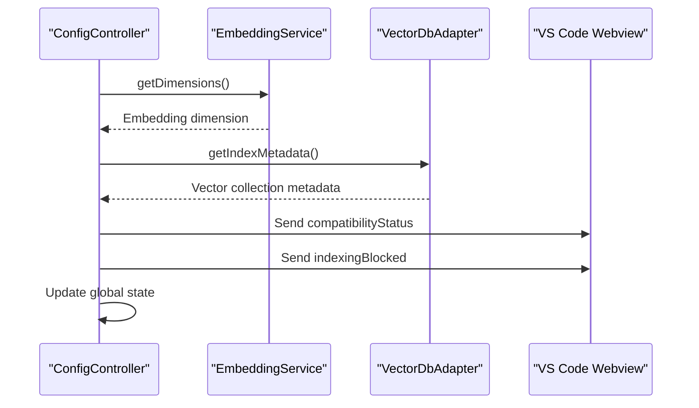
```mermaid
sequenceDiagram
participant CC as "ConfigController"
participant ES as "EmbeddingService"
participant VDA as "VectorDbAdapter"
participant VS as "VS Code Webview"
CC->>ES : getDimensions()
ES-->>CC : Embedding dimension
CC->>VDA : getIndexMetadata()
VDA-->>CC : Vector collection metadata
CC->>VS : Send compatibilityStatus
CC->>VS : Send indexingBlocked
CC->>CC : Update global state
```

**Diagram sources**
- [compatibility.test.ts:84-125](file://src/test/core/indexing/compatibility.test.ts#L84-L125)
- [compatibility.test.ts:289-348](file://src/test/core/indexing/compatibility.test.ts#L289-L348)

**Section sources**
- [compatibility.test.ts:1-388](file://src/test/core/indexing/compatibility.test.ts#L1-L388)

### Code Enrichment Testing Framework
**New** The code enrichment testing framework validates PostgreSQL database connectivity, symbol extraction using Tree-sitter, and LLM summary generation capabilities. This comprehensive testing suite ensures reliable code enrichment functionality.

- Tests database schema verification and table existence
- Validates symbol extraction using Tree-sitter WASM parsers
- Tests LLM summary generation with optional API key support
- Supports customization for different file types and repository testing
- Provides troubleshooting guidance for common testing issues

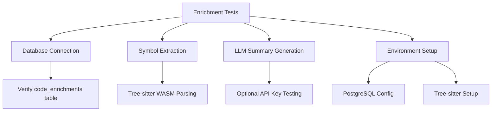
```mermaid
flowchart TD
ET["Enrichment Tests"] --> DB["Database Connection"]
ET --> SYM["Symbol Extraction"]
ET --> LLM["LLM Summary Generation"]
DB --> SCHEMA["Verify code_enrichments table"]
SYM --> TS["Tree-sitter WASM Parsing"]
LLM --> API["Optional API Key Testing"]
ET --> ENV["Environment Setup"]
ENV --> PG["PostgreSQL Config"]
ENV --> TS2["Tree-sitter Setup"]
```

**Diagram sources**
- [ENRICHMENT_TESTS.md:21-50](file://ENRICHMENT_TESTS.md#L21-L50)
- [EnrichmentService.ts:14-51](file://src/core/llm/services/EnrichmentService.ts#L14-L51)

**Section sources**
- [ENRICHMENT_TESTS.md:1-163](file://ENRICHMENT_TESTS.md#L1-L163)
- [EnrichmentService.ts:1-51](file://src/core/llm/services/EnrichmentService.ts#L1-L51)

### Bundle Manager Behavior
- Constructor initializes paths
- setActiveBundle updates active bundle and fires events
- getAllBundles reads without initialization
- saveBundle writes updated bundles and fires events
- deleteBundle removes bundle, resets active, and fires events

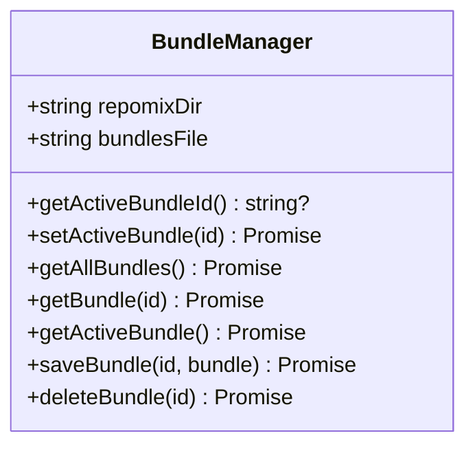
```mermaid
classDiagram
class BundleManager {
+string repomixDir
+string bundlesFile
+getActiveBundleId() string?
+setActiveBundle(id) Promise<void>
+getAllBundles() Promise<BundlesPayload>
+getBundle(id) Promise<Bundle?>
+getActiveBundle() Promise<Bundle?>
+saveBundle(id, bundle) Promise<void>
+deleteBundle(id) Promise<void>
}
```

**Diagram sources**
- [bundleManager.test.ts:9-299](file://src/test/core/bundles/bundleManager.test.ts#L9-L299)

**Section sources**
- [bundleManager.test.ts:1-300](file://src/test/core/bundles/bundleManager.test.ts#L1-L300)

### Clipboard Operations Across Platforms
- Copies output to a temporary location
- Executes platform-specific clipboard commands
- Recreates temp directory if deleted mid-session
- Handles failures with user-visible error messages

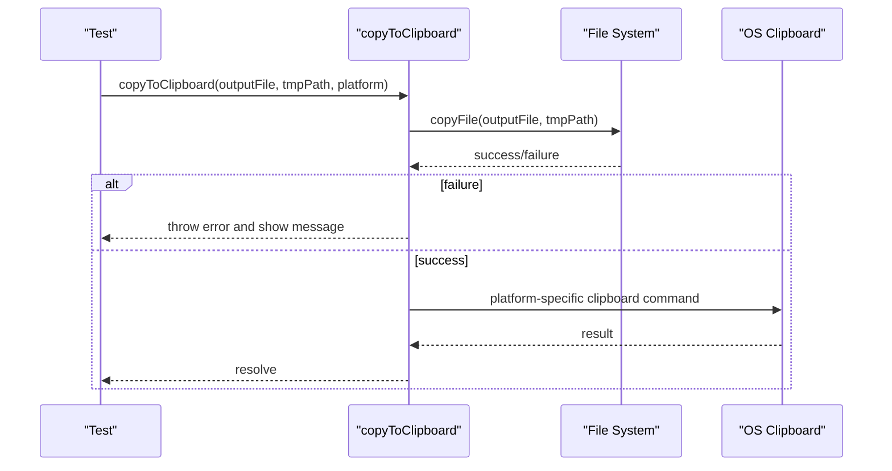
```mermaid
sequenceDiagram
participant T as "Test"
participant C as "copyToClipboard"
participant FS as "File System"
participant OS as "OS Clipboard"
T->>C : copyToClipboard(outputFile, tmpPath, platform)
C->>FS : copyFile(outputFile, tmpPath)
FS-->>C : success/failure
alt failure
C-->>T : throw error and show message
else success
C->>OS : platform-specific clipboard command
OS-->>C : result
C-->>T : resolve
end
```

**Diagram sources**
- [copyToClipboard.test.ts:67-120](file://src/test/core/files/copyToClipboard.test.ts#L67-L120)

**Section sources**
- [copyToClipboard.test.ts:1-142](file://src/test/core/files/copyToClipboard.test.ts#L1-L142)

### Command Orchestration and Configuration Wiring
- Validates conditional behavior based on configuration flags
- Ensures proper cleanup and clipboard actions depending on settings

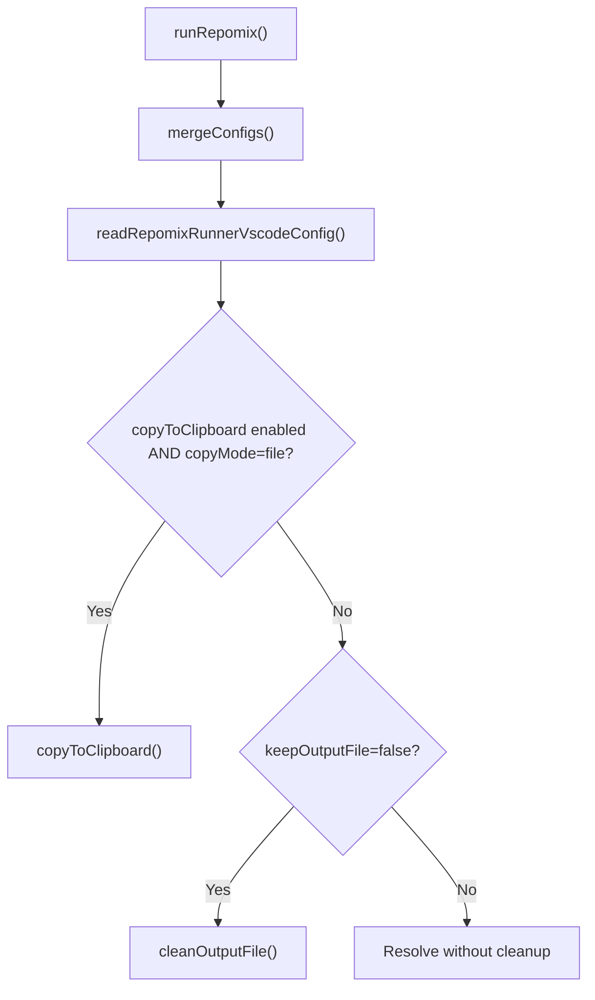
```mermaid
flowchart TD
A["runRepomix()"] --> B["mergeConfigs()"]
B --> C["readRepomixRunnerVscodeConfig()"]
C --> D{"copyToClipboard enabled AND copyMode=file?"}
D --> |Yes| E["copyToClipboard()"]
D --> |No| F{"keepOutputFile=false?"}
F --> |Yes| G["cleanOutputFile()"]
F --> |No| H["Resolve without cleanup"]
```

**Diagram sources**
- [runRepomix.test.ts:51-97](file://src/test/commands/runRepomix.test.ts#L51-L97)

**Section sources**
- [runRepomix.test.ts:1-141](file://src/test/commands/runRepomix.test.ts#L1-L141)

### Search Pipeline Deduplication and Filtering
- Deduplicates hits by file path, keeping the highest score
- Filters ignored files using .gitignore when present

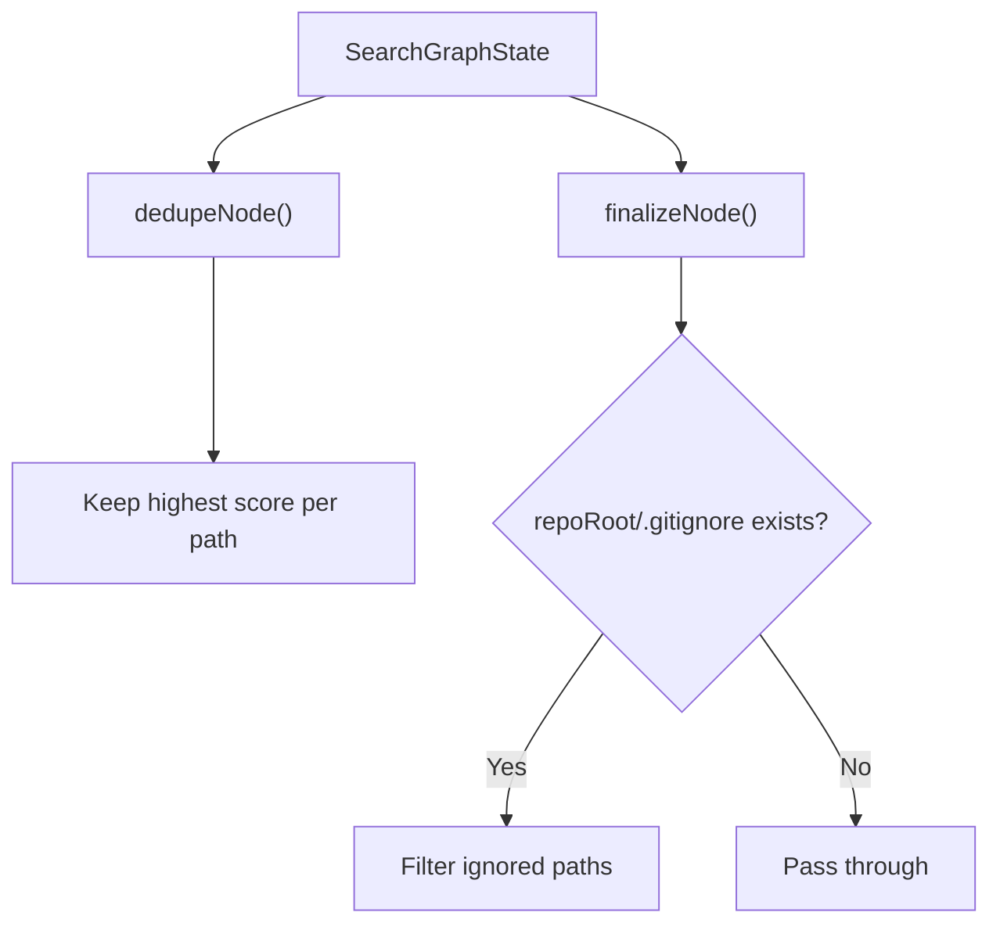
```mermaid
flowchart TD
S["SearchGraphState"] --> D["dedupeNode()"]
D --> R["Keep highest score per path"]
S --> F["finalizeNode()"]
F --> GI{"repoRoot/.gitignore exists?"}
GI --> |Yes| FILT["Filter ignored paths"]
GI --> |No| PASS["Pass through"]
```

**Diagram sources**
- [nodes.test.ts:8-24](file://src/test/search/nodes.test.ts#L8-L24)
- [nodes.test.ts:26-50](file://src/test/search/nodes.test.ts#L26-L50)

**Section sources**
- [nodes.test.ts:1-52](file://src/test/search/nodes.test.ts#L1-L52)

### WebView Message Schema Validation
- Uses Zod-like schema parsing to validate inbound messages
- Enforces presence and shape of required fields

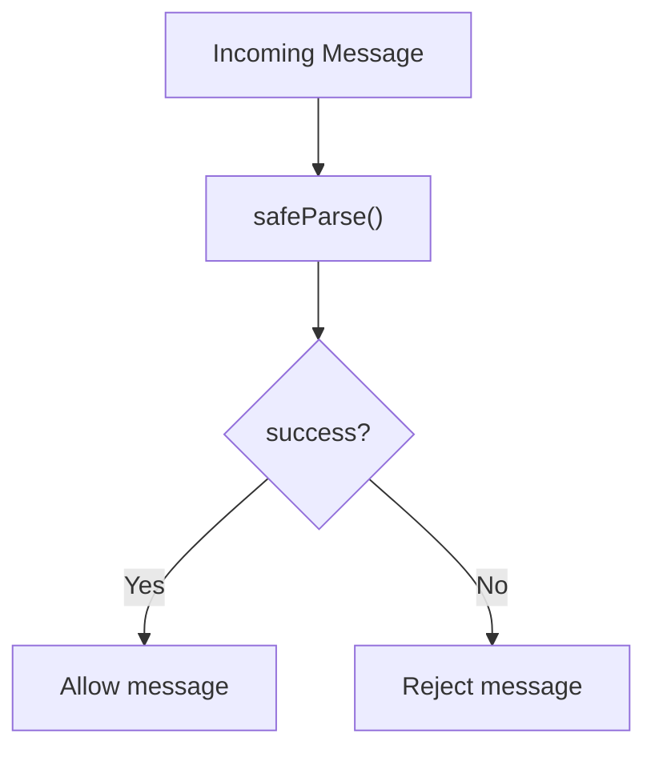
```mermaid
flowchart TD
IN["Incoming Message"] --> P["safeParse()"]
P --> OK{"success?"}
OK --> |Yes| ALLOW["Allow message"]
OK --> |No| DENY["Reject message"]
```

**Diagram sources**
- [messageSchemas.test.ts:5-22](file://src/test/webview/messageSchemas.test.ts#L5-L22)
- [messageSchemas.test.ts:24-40](file://src/test/webview/messageSchemas.test.ts#L24-L40)

**Section sources**
- [messageSchemas.test.ts:1-93](file://src/test/webview/messageSchemas.test.ts#L1-L93)

### Utility Functions
- deepMerge: Deeply merges objects, modifies target in place, preserves immutability of source
- generateOutputFilename: Applies bundle name sanitization and optional bundle name injection into output filename

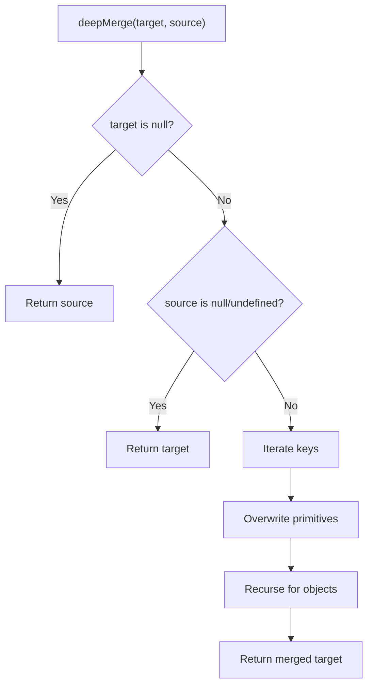
```mermaid
flowchart TD
A["deepMerge(target, source)"] --> TNULL{"target is null?"}
TNULL --> |Yes| RETS["Return source"]
TNULL --> |No| SNULL{"source is null/undefined?"}
SNULL --> |Yes| RETT["Return target"]
SNULL --> |No| LOOP["Iterate keys"]
LOOP --> PRIM["Overwrite primitives"]
PRIM --> REC["Recurse for objects"]
REC --> DONE["Return merged target"]
```

**Diagram sources**
- [deepMerge.test.ts:4-68](file://src/test/utils/deepMerge.test.ts#L4-L68)

**Section sources**
- [deepMerge.test.ts:1-69](file://src/test/utils/deepMerge.test.ts#L1-L69)
- [generateOutputFilename.test.ts:1-61](file://src/test/utils/generateOutputFilename.test.ts#L1-L61)

### Compression Module Testing
**New** The compression module provides AST-based file skeleton generation with support for multiple programming languages. Testing covers language detection, AST parsing, query execution, and selective compression with keepNames functionality. The framework now includes comprehensive testing infrastructure with multiple verification methods.

- Language detection for TypeScript, JavaScript, Dart, Python, C#, and Rust
- AST-based capture extraction using Tree-sitter queries
- Strategy-based parsing for language-specific node handling
- Selective compression with identifier preservation
- Chunk deduplication and adjacent merging
- **New**: VS Code debugger integration for interactive testing
- **New**: Programmatic usage examples for direct compression testing
- **New**: Command-line diagnostic scripts for automated verification

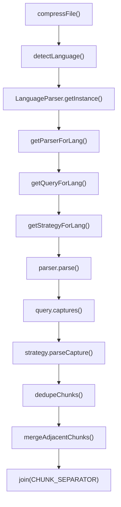
```mermaid
flowchart TD
CF["compressFile()"] --> DL["detectLanguage()"]
DL --> LP["LanguageParser.getInstance()"]
LP --> GP["getParserForLang()"]
GP --> GQ["getQueryForLang()"]
GQ --> GS["getStrategyForLang()"]
GS --> PARSE["parser.parse()"]
PARSE --> CAP["query.captures()"]
CAP --> STRAT["strategy.parseCapture()"]
STRAT --> DEDUP["dedupeChunks()"]
DEDUP --> MERGE["mergeAdjacentChunks()"]
MERGE --> JOIN["join(CHUNK_SEPARATOR)"]
```

**Diagram sources**
- [compressFile.ts:74-132](file://src/core/compression/compressFile.ts#L74-L132)
- [LanguageParser.ts:1-209](file://src/core/compression/LanguageParser.ts#L1-L209)
- [types.ts:1-55](file://src/core/compression/types.ts#L1-L55)
- [index.ts:1-3](file://src/core/compression/index.ts#L1-L3)

**Section sources**
- [compressFile.ts:1-133](file://src/core/compression/compressFile.ts#L1-L133)
- [testCompression.ts:1-39](file://src/commands/testCompression.ts#L1-L39)
- [LanguageParser.ts:1-209](file://src/core/compression/LanguageParser.ts#L1-L209)
- [types.ts:1-55](file://src/core/compression/types.ts#L1-L55)
- [index.ts:1-3](file://src/core/compression/index.ts#L1-L3)

### Compression Testing Framework
**New** The compression testing framework provides three complementary methods for verifying compression functionality:

#### VS Code Debugger Integration
- Launches VS Code extension in debug mode
- Creates test files with various programming languages
- Executes "Repomix: Test Compression" command
- Opens comparison view showing original vs compressed output

#### Programmatic Usage Examples
- Direct import and usage of `compressFile` function
- Support for `keepNames` option to preserve specific identifiers
- Automated testing across multiple programming languages
- Standalone script execution for batch testing

#### Command-Line Diagnostic Scripts
- `scripts/diagnose-compression.js`: Health check for WASM files and dependencies
- `scripts/test-compression.js`: Automated compression testing with sample files
- `src/test-compression.ts`: Comprehensive standalone compression test suite
- Automatic verification of Tree-sitter parser availability and language support

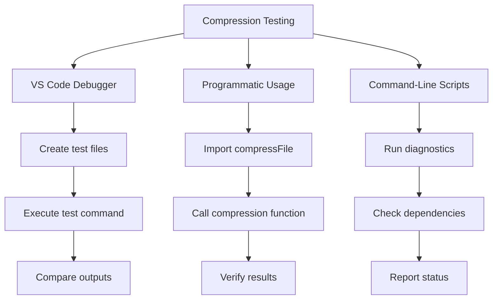
```mermaid
flowchart TD
TEST["Compression Testing"] --> VSCODE["VS Code Debugger"]
TEST --> PROGRAM["Programmatic Usage"]
TEST --> CLI["Command-Line Scripts"]
VSCODE --> CREATE["Create test files"]
CREATE --> EXEC["Execute test command"]
EXEC --> COMPARE["Compare outputs"]
PROGRAM --> IMPORT["Import compressFile"]
IMPORT --> CALL["Call compression function"]
CALL --> VERIFY["Verify results"]
CLI --> DIAG["Run diagnostics"]
DIAG --> CHECK["Check dependencies"]
CHECK --> REPORT["Report status"]
```

**Diagram sources**
- [COMPRESSION_TESTING.md:7-35](file://COMPRESSION_TESTING.md#L7-L35)
- [COMPRESSION_TESTING.md:36-60](file://COMPRESSION_TESTING.md#L36-L60)
- [COMPRESSION_TESTING.md:62-68](file://COMPRESSION_TESTING.md#L62-L68)

**Section sources**
- [COMPRESSION_TESTING.md:1-171](file://COMPRESSION_TESTING.md#L1-L171)
- [diagnose-compression.js:1-116](file://scripts/diagnose-compression.js#L1-L116)
- [test-compression.js:1-190](file://scripts/test-compression.js#L1-L190)
- [test-compression.ts:1-515](file://src/test-compression.ts#L1-L515)

### Database Service Testing
**New** The database service includes comprehensive testing for repository file path prefix lookup functionality.

- Repository file path prefix matching for directory traversal
- Exact file path matching for single file retrieval
- Database state management for repository file indexing
- Integration with indexing monitor for path expansion

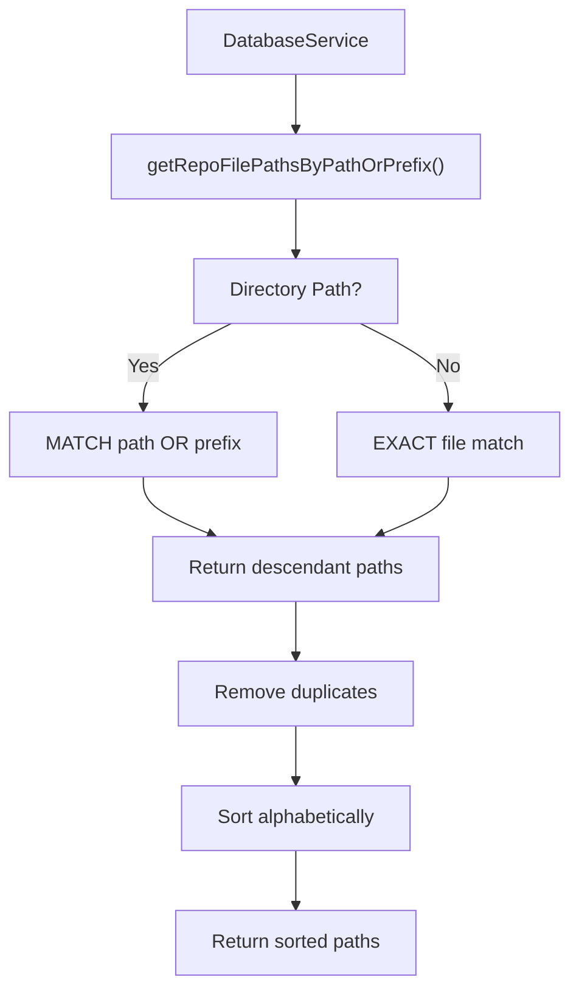
```mermaid
flowchart TD
DB["DatabaseService"] --> GET["getRepoFilePathsByPathOrPrefix()"]
GET --> DIR["Directory Path?"]
DIR --> |Yes| MATCH["MATCH path OR prefix"]
DIR --> |No| EXACT["EXACT file match"]
MATCH --> RETURN["Return descendant paths"]
EXACT --> RETURN
RETURN --> CLEAN["Remove duplicates"]
CLEAN --> SORT["Sort alphabetically"]
SORT --> RESULT["Return sorted paths"]
```

**Diagram sources**
- [databaseService.test.ts:40-58](file://src/test/core/storage/databaseService.test.ts#L40-L58)
- [databaseService.ts:112-953](file://src/core/storage/databaseService.ts#L112-L953)

**Section sources**
- [databaseService.test.ts:1-59](file://src/test/core/storage/databaseService.test.ts#L1-L59)
- [databaseService.ts:1-1818](file://src/core/storage/databaseService.ts#L1-L1818)

### Integration Testing: End-to-End Workflows and External Tool Interactions
- Activates extension and validates workspace
- Compares extension output with native CLI output for equivalence
- Parameterized tests for bundle selection and removal scenarios
- Robust file cleanup and bundle reset between tests
- **New**: Vector database adapter integration testing with Qdrant
- **New**: Dimension compatibility validation between embedding services and vector collections
- **New**: Code enrichment testing with PostgreSQL database connectivity
- **New**: Repository indexing with .gitignore support and subfolder ignore files
- **New**: Compression command integration testing with keepNames functionality
- **New**: VS Code debugger integration for interactive compression testing

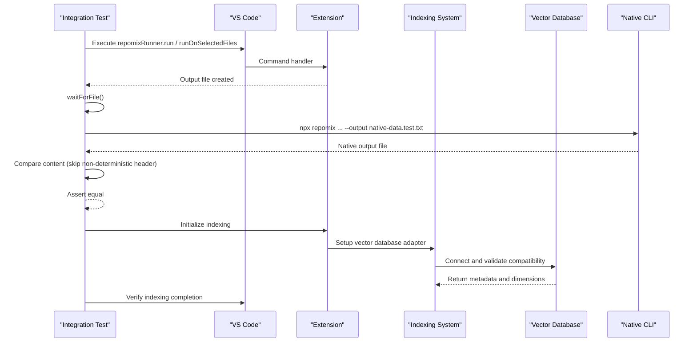
```mermaid
sequenceDiagram
participant IT as "Integration Test"
participant VS as "VS Code"
participant EXT as "Extension"
participant IDX as "Indexing System"
participant VDB as "Vector Database"
participant CLI as "Native CLI"
IT->>VS : Execute repomixRunner.run / runOnSelectedFiles
VS->>EXT : Command handler
EXT-->>IT : Output file created
IT->>IT : waitForFile()
IT->>CLI : npx repomix ... --output native-data.test.txt
CLI-->>IT : Native output file
IT->>IT : Compare content (skip non-deterministic header)
IT-->>IT : Assert equal
IT->>EXT : Initialize indexing
EXT->>IDX : Setup vector database adapter
IDX->>VDB : Connect and validate compatibility
VDB-->>IDX : Return metadata and dimensions
IT->>VS : Verify indexing completion
```

**Diagram sources**
- [integration.test.ts:304-378](file://src/test/test-workspace/integration.test.ts#L304-L378)
- [compatibility.test.ts:84-125](file://src/test/core/indexing/compatibility.test.ts#L84-L125)

**Section sources**
- [integration.test.ts:1-380](file://src/test/test-workspace/integration.test.ts#L1-L380)

## Dependency Analysis
- Test runner configuration defines workspace and test file pattern
- Scripts orchestrate compilation, type checking, linting, and test execution
- Test workspace configuration drives output file naming and behavior
- **New**: Vector database adapter depends on Qdrant client REST API and proper authentication
- **New**: File embedding pipeline depends on Tree-sitter WASM parsers and language-specific queries
- **New**: Repository indexer depends on .gitignore parsing and database state management
- **New**: Dimension compatibility testing depends on embedding service configuration and vector database metadata
- **New**: Code enrichment testing depends on PostgreSQL database connectivity and Tree-sitter WASM files
- **New**: Compression module depends on Tree-sitter WASM parsers and language-specific queries
- **New**: Compression testing framework requires web-tree-sitter dependency and WASM files
- **New**: Diagnostic scripts depend on Node.js file system operations and package.json metadata
- **New**: VS Code debugger integration requires proper extension activation and command registration
- **New**: Standalone compression tests require compiled extension distribution

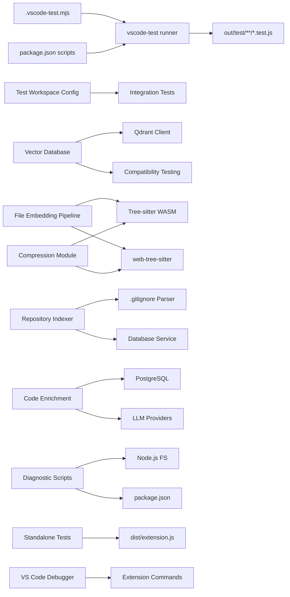
```mermaid
graph LR
CFG[".vscode-test.mjs"] --> RUN["vscode-test runner"]
PKG["package.json scripts"] --> RUN
RUN --> OUT["out/test/**/*.test.js"]
WS["Test Workspace Config"] --> IT["Integration Tests"]
VDB["Vector Database"] --> QDRANT["Qdrant Client"]
VDB --> COMPAT["Compatibility Testing"]
FILEPIPE["File Embedding Pipeline"] --> TS["Tree-sitter WASM"]
FILEPIPE --> WTS["web-tree-sitter"]
REPOIDX["Repository Indexer"] --> GITIGNORE[".gitignore Parser"]
REPOIDX --> DB["Database Service"]
ENRICH["Code Enrichment"] --> POSTGRES["PostgreSQL"]
ENRICH --> LLM["LLM Providers"]
COMP["Compression Module"] --> TS
COMP --> WTS
DIAG["Diagnostic Scripts"] --> NODE["Node.js FS"]
DIAG --> PKG2["package.json"]
STANDALONE["Standalone Tests"] --> DIST["dist/extension.js"]
VSDEBUG["VS Code Debugger"] --> EXT["Extension Commands"]
```

**Diagram sources**
- [.vscode-test.mjs:3-7](file://.vscode-test.mjs#L3-L7)
- [package.json:541-559](file://package.json#L541-L559)
- [repomix.config.json:1-26](file://src/test/test-workspace/root/repomix.config.json#L1-L26)
- [qdrantAdapter.test.ts:1-10](file://src/test/core/indexing/vectorDb/qdrantAdapter.test.ts#L1-L10)
- [fileEmbeddingPipeline.test.ts:1-2](file://src/test/core/indexing/fileEmbeddingPipeline.test.ts#L1-L2)
- [repoIndexer.test.ts:1-7](file://src/test/core/indexing/repoIndexer.test.ts#L1-L7)
- [compatibility.test.ts:1-10](file://src/test/core/indexing/compatibility.test.ts#L1-L10)
- [ENRICHMENT_TESTS.md:5-17](file://ENRICHMENT_TESTS.md#L5-L17)
- [diagnose-compression.js:8-11](file://scripts/diagnose-compression.js#L8-L11)
- [test-compression.ts:8-11](file://src/test-compression.ts#L8-L11)

**Section sources**
- [.vscode-test.mjs:1-8](file://.vscode-test.mjs#L1-L8)
- [package.json:541-559](file://package.json#L541-L559)
- [repomix.config.json:1-26](file://src/test/test-workspace/root/repomix.config.json#L1-L26)

## Performance Considerations
- Prefer stubbing expensive filesystem or network operations in unit tests
- Use targeted timeouts and polling helpers for asynchronous file readiness
- Minimize repeated external CLI invocations by reusing outputs when feasible
- Keep integration tests focused and isolated to reduce flakiness
- **New**: Vector database operations should cache client connections and metadata for better performance
- **New**: Dimension compatibility checks should implement caching for frequently accessed configurations
- **New**: File embedding pipeline should cache Tree-sitter parser instances for improved parsing performance
- **New**: Repository indexing should implement batching for database operations to reduce overhead
- **New**: Code enrichment operations should implement rate limiting and connection pooling for LLM providers
- **New**: Compression operations should cache Tree-sitter parsers and queries for better performance
- **New**: Database queries should use prepared statements and connection pooling for optimal performance
- **New**: Compression testing scripts should cache parsed results to avoid repeated parsing overhead
- **New**: Diagnostic scripts should implement efficient file existence checks and caching mechanisms

## Troubleshooting Guide
Common issues and resolutions:
- File not found during integration tests: Use waitForFile to poll for file creation; ensure output paths are correct and normalized
- Windows-specific failures: Use deleteFiles with normalized patterns and absolute paths; prefer globby for robust deletion
- Clipboard failures: Validate platform-specific commands and temp directory recreation logic
- Bundle state inconsistencies: Reset bundles.json to empty bundles after teardown to avoid cross-test contamination
- **New**: Vector database connection failures: Verify Qdrant client configuration and API key authentication
- **New**: Dimension compatibility errors: Check embedding service configuration and vector database metadata consistency
- **New**: File embedding pipeline failures: Ensure Tree-sitter WASM files are properly loaded and language parsers are available
- **New**: Repository indexing failures: Verify .gitignore parsing and database connectivity for file state management
- **New**: Code enrichment database errors: Check PostgreSQL connection string and table schema validation
- **New**: LLM provider integration issues: Verify API keys and provider configuration for enrichment operations
- **New**: Compression failures: Check Tree-sitter WASM parser loading and language detection logic
- **New**: VS Code debugger integration issues: Verify extension activation and command registration in package.json
- **New**: Programmatic compression testing failures: Ensure proper import paths and WASM directory configuration
- **New**: Diagnostic script errors: Check Node.js file system permissions and package.json dependency resolution
- **New**: Indexing monitor path expansion issues: Verify database service integration and path prefix matching
- **New**: Database query performance: Ensure proper indexing and query optimization for repository file lookups

**Section sources**
- [utilsTest.ts:1-67](file://src/test/utilsTest.ts#L1-L67)
- [integration.test.ts:45-68](file://src/test/test-workspace/integration.test.ts#L45-L68)
- [qdrantAdapter.test.ts:102-108](file://src/test/core/indexing/vectorDb/qdrantAdapter.test.ts#L102-L108)
- [compatibility.test.ts:219-242](file://src/test/core/indexing/compatibility.test.ts#L219-L242)

## Conclusion
The testing framework balances unit isolation with meaningful integration checks against the extension and external CLI. It leverages VS Code's test host, robust file utilities, and parameterized scenarios to validate complex workflows. The recent additions of comprehensive vector database testing, enhanced indexing system functionality, expanded database service capabilities, code enrichment testing framework, and the removal of AI chat functionality provide thorough coverage of the core system components. **New**: The vector database adapter testing, dimension compatibility validation, file embedding pipeline testing, repository indexing with .gitignore support, and code enrichment testing significantly enhance the testing capabilities by validating critical indexing and enrichment workflows. By following the patterns and guidelines outlined here, contributors can confidently add, maintain, and debug tests across the codebase.

## Appendices

### Writing New Tests
- Place unit tests alongside the code under src/test/<module>/<feature>.test.ts
- For integration tests, use src/test/test-workspace/integration.test.ts and add fixtures under src/test/test-workspace/root
- Use assert for assertions and sinon for stubs/spies
- Leverage waitForFile and deleteFiles for deterministic file operations
- **New**: For vector database tests, mock Qdrant client methods and validate metadata extraction
- **New**: For file embedding pipeline tests, test binary file detection across various file types and extensions
- **New**: For repository indexer tests, create temporary repository structures with .gitignore files
- **New**: For dimension compatibility tests, validate embedding service integration and vector database metadata
- **New**: For code enrichment tests, ensure PostgreSQL database connectivity and Tree-sitter WASM file availability
- **New**: For compression module tests, mock Tree-sitter parser instances and language-specific strategies
- **New**: For indexing monitor tests, stub database service methods and verify path expansion logic
- **New**: For database service tests, use temporary directories and clean up test databases after execution
- **New**: For compression testing, utilize the existing diagnostic scripts and standalone test framework
- **New**: When adding webview tests, ensure proper VS Code command registration and extension activation

### Running Test Suites
- Pre-test compilation and linting are handled by scripts
- Run all tests with the VS Code test runner configured by .vscode-test.mjs
- Use npm scripts to compile tests, compile the extension, and execute the test runner
- **New**: Vector database tests require Qdrant client availability and proper authentication configuration
- **New**: File embedding pipeline tests require Tree-sitter WASM files to be available in the test environment
- **New**: Repository indexer tests require temporary directory creation and .gitignore file setup
- **New**: Dimension compatibility tests require embedding service configuration and vector database connectivity
- **New**: Code enrichment tests require PostgreSQL database connectivity and Tree-sitter WASM file availability
- **New**: Compression module tests require Tree-sitter WASM files to be available in the test environment
- **New**: VS Code debugger integration requires proper extension packaging and deployment
- **New**: Programmatic compression testing requires compiled extension distribution in dist/ directory
- **New**: Diagnostic scripts can be run independently without VS Code environment

**Section sources**
- [package.json:541-559](file://package.json#L541-L559)
- [.vscode-test.mjs:1-8](file://.vscode-test.mjs#L1-L8)

### Interpreting Results
- Unit tests: Expect clear pass/fail outcomes for isolated behaviors
- Integration tests: Expect deterministic comparisons between extension and CLI outputs; failures often indicate path normalization or configuration mismatches
- **New**: Vector database tests: Validate Qdrant client connectivity and metadata extraction accuracy
- **New**: File embedding pipeline tests: Ensure proper binary file detection across all supported file types
- **New**: Repository indexer tests: Verify .gitignore parsing and database state consistency
- **New**: Dimension compatibility tests: Validate embedding service and vector database dimension matching
- **New**: Code enrichment tests: Confirm database connectivity and symbol extraction functionality
- **New**: Compression tests: Validate AST parsing success and chunk generation quality across multiple languages
- **New**: VS Code debugger tests: Verify interactive compression functionality and user interface behavior
- **New**: Programmatic tests: Confirm direct function calls work correctly with various input configurations
- **New**: Diagnostic script tests: Ensure system health checks report accurate status and provide actionable feedback
- **New**: Indexing monitor tests: Verify path expansion accuracy and deduplication effectiveness
- **New**: Database service tests: Confirm repository file path lookup precision and performance characteristics

### Continuous Integration and Coverage
- CI setup: Configure the VS Code test runner with the provided configuration
- Coverage: No explicit coverage reporting configuration is present in the repository; consider adding a coverage tool if needed
- **New**: Vector database coverage: Focus on Qdrant client integration and metadata extraction scenarios
- **New**: File embedding pipeline coverage: Emphasize binary file detection across all supported project configuration formats
- **New**: Repository indexer coverage: Prioritize .gitignore parsing and database state management
- **New**: Dimension compatibility coverage: Ensure embedding service and vector database integration testing
- **New**: Code enrichment coverage: Focus on database connectivity and LLM provider integration
- **New**: Compression module coverage: Focus on AST parsing accuracy and language-specific strategy effectiveness
- **New**: VS Code debugger integration coverage: Emphasize interactive testing scenarios and user experience validation
- **New**: Programmatic testing coverage: Prioritize direct function call reliability and error handling
- **New**: Diagnostic script coverage: Ensure comprehensive system health verification across all supported environments
- **New**: Indexing monitor coverage: Emphasize path expansion scenarios and edge case handling
- **New**: Database service coverage: Prioritize query performance and concurrent access scenarios

**Section sources**
- [.vscode-test.mjs:1-8](file://.vscode-test.mjs#L1-L8)
- [package.json:541-559](file://package.json#L541-L559)

### Example Scenarios

#### Bundle Creation and Selection
- Validate setActiveBundle updates active bundle and fires events
- Validate saveBundle persists bundles and triggers change notifications
- Validate deleteBundle removes entries and resets active bundle

**Section sources**
- [bundleManager.test.ts:43-85](file://src/test/core/bundles/bundleManager.test.ts#L43-L85)
- [bundleManager.test.ts:182-233](file://src/test/core/bundles/bundleManager.test.ts#L182-L233)
- [bundleManager.test.ts:235-298](file://src/test/core/bundles/bundleManager.test.ts#L235-L298)

#### Vector Database Adapter Operations
**New** - Validate Qdrant adapter functionality and metadata extraction
- Test collection metadata extraction with proper dimension and metric detection
- Validate dimension compatibility scenarios between embedding services and vector collections
- Ensure graceful error handling for missing collections and malformed configurations
- Test API key handling for hosted Qdrant instances
- Verify edge cases with different distance metrics and empty collections

**Section sources**
- [qdrantAdapter.test.ts:47-55](file://src/test/core/indexing/vectorDb/qdrantAdapter.test.ts#L47-L55)
- [qdrantAdapter.test.ts:162-202](file://src/test/core/indexing/vectorDb/qdrantAdapter.test.ts#L162-L202)
- [qdrantAdapter.test.ts:255-283](file://src/test/core/indexing/vectorDb/qdrantAdapter.test.ts#L255-L283)

#### File Embedding Pipeline Workflows
**New** - Test binary file detection across various project configuration formats
- Validate recognition of Python project files (pyproject.toml, poetry.lock, requirements.txt)
- Test JavaScript/TypeScript project files (package.json, yarn.lock, pnpm-lock.yaml)
- Ensure proper detection of Rust (Cargo.toml, Cargo.lock) and C# project files
- Verify binary file detection for images, PDFs, executables, and DLLs
- Handle edge cases like files without extensions and unknown extensions

**Section sources**
- [fileEmbeddingPipeline.test.ts:6-72](file://src/test/core/indexing/fileEmbeddingPipeline.test.ts#L6-L72)

#### Repository Indexing with .gitignore Support
**New** - Test comprehensive file indexing with .gitignore patterns
- Validate basic file indexing respecting root .gitignore patterns
- Test update functionality for existing indexes
- Ensure proper handling of subfolder .gitignore files
- Verify file presence verification through database queries
- Test ignored file exclusion (root .gitignore and subfolder .gitignore)

**Section sources**
- [repoIndexer.test.ts:44-79](file://src/test/core/indexing/repoIndexer.test.ts#L44-L79)
- [repoIndexer.test.ts:99-155](file://src/test/core/indexing/repoIndexer.test.ts#L99-L155)

#### Dimension Compatibility Validation
**New** - Test embedding service and vector database dimension compatibility
- Validate compatible dimension detection between embedding services and vector collections
- Test indexing blocking when dimensions are incompatible
- Ensure graceful error handling for missing collections and adapter failures
- Test fallback mechanisms using configuration-based dimension detection
- Verify webview message flow for compatibility status reporting

**Section sources**
- [compatibility.test.ts:84-125](file://src/test/core/indexing/compatibility.test.ts#L84-L125)
- [compatibility.test.ts:289-348](file://src/test/core/indexing/compatibility.test.ts#L289-L348)

#### Code Enrichment Testing
**New** - Test PostgreSQL database connectivity and symbol extraction
- Validate database schema verification and table existence
- Test symbol extraction using Tree-sitter WASM parsers
- Test LLM summary generation with optional API key support
- Ensure proper error handling for missing dependencies
- Verify customization options for different file types and repositories

**Section sources**
- [ENRICHMENT_TESTS.md:21-50](file://ENRICHMENT_TESTS.md#L21-L50)
- [ENRICHMENT_TESTS.md:94-113](file://ENRICHMENT_TESTS.md#L94-L113)

#### AI Agent Message Validation
- Validate schema enforcement for runBundle, runSmartAgent, webviewLoaded, and saveApiKey
- Ensure missing or invalid fields cause parsing to fail

**Section sources**
- [messageSchemas.test.ts:5-22](file://src/test/webview/messageSchemas.test.ts#L5-L22)
- [messageSchemas.test.ts:24-40](file://src/test/webview/messageSchemas.test.ts#L24-L40)
- [messageSchemas.test.ts:58-91](file://src/test/webview/messageSchemas.test.ts#L58-L91)

#### Clipboard Operations
- Validate platform-specific commands and temp directory recreation
- Ensure error paths surface user-facing messages

**Section sources**
- [copyToClipboard.test.ts:67-120](file://src/test/core/files/copyToClipboard.test.ts#L67-L120)
- [copyToClipboard.test.ts:122-140](file://src/test/core/files/copyToClipboard.test.ts#L122-L140)

#### Compression Module Workflows
**New** - Test AST-based file compression with multiple programming languages
- Validate language detection for TypeScript, JavaScript, Dart, Python, C#, and Rust
- Test selective compression with keepNames functionality preserving specific identifiers
- Verify AST parsing success and chunk generation quality across different file structures
- Ensure proper error handling when Tree-sitter parsers fail to load
- **New**: Test VS Code debugger integration for interactive compression testing
- **New**: Validate programmatic usage examples with direct function calls
- **New**: Verify command-line diagnostic scripts for automated system health verification

**Section sources**
- [compressFile.ts:6-25](file://src/core/compression/compressFile.ts#L6-L25)
- [compressFile.ts:74-133](file://src/core/compression/compressFile.ts#L74-L133)
- [testCompression.ts:5-38](file://src/commands/testCompression.ts#L5-L38)
- [LanguageParser.ts:37-64](file://src/core/compression/LanguageParser.ts#L37-L64)
- [types.ts:34-36](file://src/core/compression/types.ts#L34-L36)
- [COMPRESSION_TESTING.md:7-35](file://COMPRESSION_TESTING.md#L7-L35)
- [COMPRESSION_TESTING.md:36-60](file://COMPRESSION_TESTING.md#L36-L60)
- [COMPRESSION_TESTING.md:62-68](file://COMPRESSION_TESTING.md#L62-L68)

#### Indexing Monitor Operations
**New** - Test directory expansion and path deduplication functionality
- Validate directory path expansion to concrete file paths using database state
- Test path deduplication to prevent redundant processing of overlapping paths
- Verify proper integration with database service for repository file state lookup
- Ensure cleanup and resource disposal on monitor disposal

**Section sources**
- [repoIndexMonitor.test.ts:16-43](file://src/test/core/indexing/repoIndexMonitor.test.ts#L16-L43)
- [repoIndexMonitor.test.ts:70-100](file://src/test/core/indexing/repoIndexMonitor.test.ts#L70-L100)

#### Database Service Repository File Lookup
**New** - Test repository file path prefix matching functionality
- Validate directory path expansion to return descendant files without sibling overmatching
- Test exact file path matching for single file retrieval
- Verify proper sorting and deduplication of returned file paths
- Ensure database service handles concurrent access and cleanup properly

**Section sources**
- [databaseService.test.ts:40-58](file://src/test/core/storage/databaseService.test.ts#L40-L58)
- [databaseService.ts:112-953](file://src/core/storage/databaseService.ts#L112-L953)

#### Compression Testing Framework
**New** - Comprehensive testing infrastructure validation
- **VS Code Debugger**: Verify interactive compression testing workflow
- **Programmatic Usage**: Test direct function calls with various input configurations
- **Command-Line Diagnostics**: Validate automated system health verification
- **Standalone Scripts**: Ensure comprehensive language support testing
- **Diagnostic Scripts**: Confirm proper dependency and WASM file validation

**Section sources**
- [COMPRESSION_TESTING.md:1-171](file://COMPRESSION_TESTING.md#L1-L171)
- [diagnose-compression.js:1-116](file://scripts/diagnose-compression.js#L1-L116)
- [test-compression.js:1-190](file://scripts/test-compression.js#L1-L190)
- [test-compression.ts:1-515](file://src/test-compression.ts#L1-L515)

### VS Code Debugger Configuration
**New** - Enhanced debugging setup for compression testing

The VS Code debugging configuration supports multiple debugging scenarios:

- **Run Extension**: Compiles and launches the extension in a new VS Code window
- **Extension Tests**: Runs the test suite with proper source map support
- **Debugging Tasks**: Background compilation and watch mode for development

Key debugging features:
- Automatic source map resolution for TypeScript debugging
- Watch mode compilation for rapid development cycles
- Extension host debugging with breakpoint support
- Console logging integration with developer tools

**Section sources**
- [launch.json:1-44](file://.vscode/launch.json#L1-L44)
- [tasks.json:1-60](file://.vscode/tasks.json#L1-L60)
- [DEBUG.md:1-47](file://.vscode/DEBUG.md#L1-L47)

### Compression Testing Scripts
**New** - Automated testing infrastructure

The compression testing ecosystem includes multiple script types:

- **Diagnostic Scripts**: Health checks for WASM files and dependencies
- **Programmatic Tests**: Standalone TypeScript test suite with comprehensive language support
- **CLI Tests**: JavaScript-based testing with compiled extension distribution
- **Fixtures**: Sample code for testing compression functionality

Testing capabilities:
- Multi-language support (TypeScript, JavaScript, Python, Rust, C#, Dart)
- WASM parser validation and error handling
- Compression ratio calculation and reporting
- Automated troubleshooting and error reporting

**Section sources**
- [diagnose-compression.js:1-116](file://scripts/diagnose-compression.js#L1-L116)
- [test-compression.js:1-190](file://scripts/test-compression.js#L1-L190)
- [test-compression.ts:1-515](file://src/test-compression.ts#L1-L515)
- [test-compression-fix.ts:1-10](file://src/test-compression-fix.ts#L1-L10)

### Vector Database Integration
**New** - Comprehensive vector database functionality testing

The vector database integration encompasses multiple testing aspects:

- **Qdrant Adapter Testing**: Validates collection metadata extraction and dimension compatibility
- **Dimension Compatibility**: Tests embedding service integration with vector database adapters
- **API Key Handling**: Ensures proper authentication for hosted Qdrant instances
- **Error Handling**: Validates graceful degradation for missing collections and malformed configurations
- **Edge Case Testing**: Covers different distance metrics, empty collections, and configuration variations

Testing approach:
- Qdrant client mocking and metadata validation
- Dimension calculation and compatibility checking
- API key configuration and authentication flow
- Error propagation and user-friendly error messages
- Integration with existing indexing infrastructure

**Section sources**
- [qdrantAdapter.test.ts:1-285](file://src/test/core/indexing/vectorDb/qdrantAdapter.test.ts#L1-L285)
- [compatibility.test.ts:1-388](file://src/test/core/indexing/compatibility.test.ts#L1-L388)

### Code Enrichment Testing Infrastructure
**New** - Comprehensive code enrichment functionality testing

The code enrichment testing framework provides multiple testing approaches:

- **Database Schema Testing**: Validates PostgreSQL table structure and constraints
- **Symbol Extraction Testing**: Tests Tree-sitter WASM parser integration and symbol identification
- **LLM Integration Testing**: Validates optional LLM summary generation with API key support
- **Customization Testing**: Supports different file types and repository configurations
- **Troubleshooting Testing**: Provides guidance for common testing issues and solutions

Testing capabilities:
- PostgreSQL database connectivity and schema validation
- Tree-sitter WASM file loading and symbol extraction
- LLM provider integration with optional API key configuration
- Customizable test file types and repository testing
- Comprehensive error handling and troubleshooting guidance

**Section sources**
- [ENRICHMENT_TESTS.md:1-163](file://ENRICHMENT_TESTS.md#L1-L163)
- [EnrichmentService.ts:1-51](file://src/core/llm/services/EnrichmentService.ts#L1-L51)