# Testing Framework

<cite>
**Referenced Files in This Document**
- [extension.test.ts](file://src/test/extension.test.ts)
- [integration.test.ts](file://src/test/test-workspace/integration.test.ts)
- [.vscode-test.mjs](file://.vscode-test.mjs)
- [package.json](file://package.json)
- [bundleManager.test.ts](file://src/test/core/bundles/bundleManager.test.ts)
- [copyToClipboard.test.ts](file://src/test/core/files/copyToClipboard.test.ts)
- [runRepomix.test.ts](file://src/test/commands/runRepomix.test.ts)
- [nodes.test.ts](file://src/test/search/nodes.test.ts)
- [messageSchemas.test.ts](file://src/test/webview/messageSchemas.test.ts)
- [deepMerge.test.ts](file://src/test/utils/deepMerge.test.ts)
- [generateOutputFilename.test.ts](file://src/test/utils/generateOutputFilename.test.ts)
- [utilsTest.ts](file://src/test/utilsTest.ts)
- [repomix.config.json](file://src/test/test-workspace/root/repomix.config.json)
- [repoIndexMonitor.test.ts](file://src/test/core/indexing/repoIndexMonitor.test.ts)
- [databaseService.test.ts](file://src/test/core/storage/databaseService.test.ts)
- [testCompression.ts](file://src/commands/testCompression.ts)
- [compressFile.ts](file://src/core/compression/compressFile.ts)
- [LanguageParser.ts](file://src/core/compression/LanguageParser.ts)
- [types.ts](file://src/core/compression/types.ts)
- [index.ts](file://src/core/compression/index.ts)
- [COMPRESSION_TESTING.md](file://COMPRESSION_TESTING.md)
- [diagnose-compression.js](file://scripts/diagnose-compression.js)
- [test-compression.js](file://scripts/test-compression.js)
- [test-compression.ts](file://src/test-compression.ts)
- [test-compression-fix.ts](file://src/test-compression-fix.ts)
- [launch.json](file://.vscode/launch.json)
- [tasks.json](file://.vscode/tasks.json)
- [DEBUG.md](file://.vscode/DEBUG.md)
- [aiChat.test.ts](file://src/test/aiChat.test.ts)
- [AiChatWebviewProvider.ts](file://src/webview/AiChatWebviewProvider.ts)
- [AiChatRoot.tsx](file://src/webview/AiChatRoot.tsx)
- [extension.ts](file://src/extension.ts)
</cite>

## Update Summary
**Changes Made**
- Added new AI Chat webview test suite (aiChat.test.ts) that validates webview registration and extension activation
- Updated webview testing section to include AI chat functionality alongside existing message schema validation
- Enhanced extension activation testing to cover new AI chat webview provider registration
- Updated project structure diagram to reflect new AI chat webview test file

## Table of Contents
1. [Introduction](#introduction)
2. [Project Structure](#project-structure)
3. [Core Components](#core-components)
4. [Architecture Overview](#architecture-overview)
5. [Detailed Component Analysis](#detailed-component-analysis)
6. [Dependency Analysis](#dependency-analysis)
7. [Performance Considerations](#performance-considerations)
8. [Troubleshooting Guide](#troubleshooting-guide)
9. [Conclusion](#conclusion)
10. [Appendices](#appendices)

## Introduction
This document describes the Testing Framework for the project, covering unit tests, integration tests, and end-to-end workflows. It explains the test structure organized by feature areas, the test workspace setup, mock data generation, and environment configuration. It documents testing utilities, helper functions, and assertion patterns used across the suite. It also outlines integration testing approaches for external tool interactions, guidance for writing new tests, running test suites, interpreting results, continuous integration setup, coverage reporting, and quality assurance processes. Examples include bundle creation workflows, AI agent message validation, clipboard operations, compression module testing, and the newly enhanced AI chat webview functionality with comprehensive webview registration validation.

## Project Structure
The test suite is organized under src/test with dedicated folders per major module and feature area:
- Commands: Command-level tests for user-triggered actions
- Core: Core subsystems (bundles, files, indexing, patching, storage, compression)
- Search: Search pipeline utilities
- Webview: WebView message schema validation and AI chat functionality
- Utils: General-purpose utilities
- Test workspace: Integration tests and fixture data
- **New**: AI Chat webview test suite: Validates webview registration and extension activation

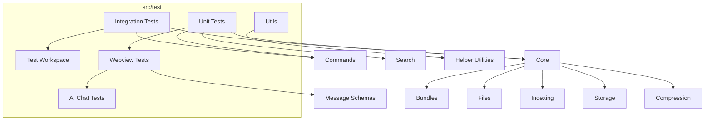

**Diagram sources**
- [extension.test.ts](file://src/test/extension.test.ts#L1-L31)
- [integration.test.ts](file://src/test/test-workspace/integration.test.ts#L1-L380)
- [aiChat.test.ts](file://src/test/aiChat.test.ts#L1-L24)

**Section sources**
- [extension.test.ts](file://src/test/extension.test.ts#L1-L31)
- [integration.test.ts](file://src/test/test-workspace/integration.test.ts#L1-L380)

## Core Components
- Extension activation and workspace detection
- Bundle manager behavior and persistence
- Clipboard copy operations across platforms
- Command orchestration and configuration wiring
- Search pipeline deduplication and filtering
- WebView message schema validation
- **New**: AI chat webview provider registration and activation
- Utility functions for merging configs and generating filenames
- Test workspace fixtures and integration helpers
- **New**: Compression module with AST-based file skeleton generation
- **New**: Indexing monitor with directory expansion and deduplication
- **New**: Database service with repository file path prefix lookup
- **New**: Comprehensive compression testing framework with multiple verification methods

Key testing utilities:
- waitForFile: Polling-based file readiness with timeouts
- deleteFiles: Robust file deletion supporting glob patterns and Windows compatibility
- execPromisify: Promisified child process execution for CLI interactions
- **New**: Compression diagnostic scripts for system health verification
- **New**: Standalone compression test scripts for programmatic testing
- **New**: VS Code debugger integration for interactive compression testing

**Section sources**
- [utilsTest.ts](file://src/test/utilsTest.ts#L1-L67)
- [copyToClipboard.test.ts](file://src/test/core/files/copyToClipboard.test.ts#L1-L142)
- [bundleManager.test.ts](file://src/test/core/bundles/bundleManager.test.ts#L1-L300)
- [runRepomix.test.ts](file://src/test/commands/runRepomix.test.ts#L1-L141)
- [nodes.test.ts](file://src/test/search/nodes.test.ts#L1-L52)
- [messageSchemas.test.ts](file://src/test/webview/messageSchemas.test.ts#L1-L93)
- [deepMerge.test.ts](file://src/test/utils/deepMerge.test.ts#L1-L69)
- [generateOutputFilename.test.ts](file://src/test/utils/generateOutputFilename.test.ts#L1-L61)

## Architecture Overview
The test architecture combines unit isolation with integration checks against the real extension and external tools. Unit tests stub or mock filesystem and external dependencies. Integration tests activate the extension, manipulate VS Code commands, and compare outputs against native CLI behavior. **New**: The AI chat webview test suite validates webview registration and extension activation, ensuring the new AI chat functionality integrates properly with the extension lifecycle.

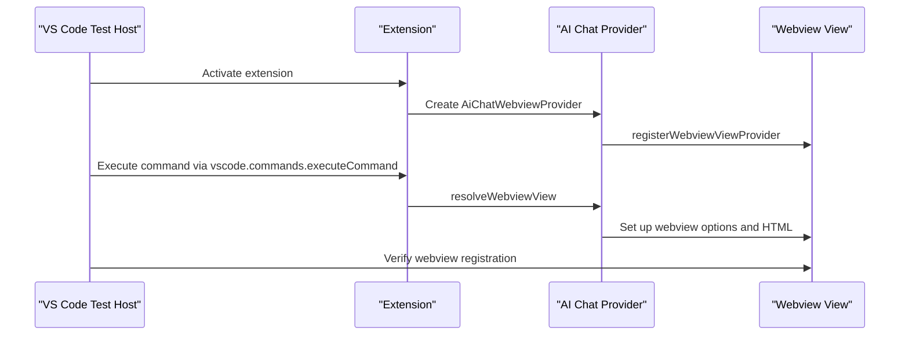

**Diagram sources**
- [aiChat.test.ts](file://src/test/aiChat.test.ts#L5-L23)
- [extension.ts](file://src/extension.ts#L505-L518)

## Detailed Component Analysis

### Extension Activation and Workspace Detection
- Validates extension activation lifecycle
- Confirms test workspace path resolution

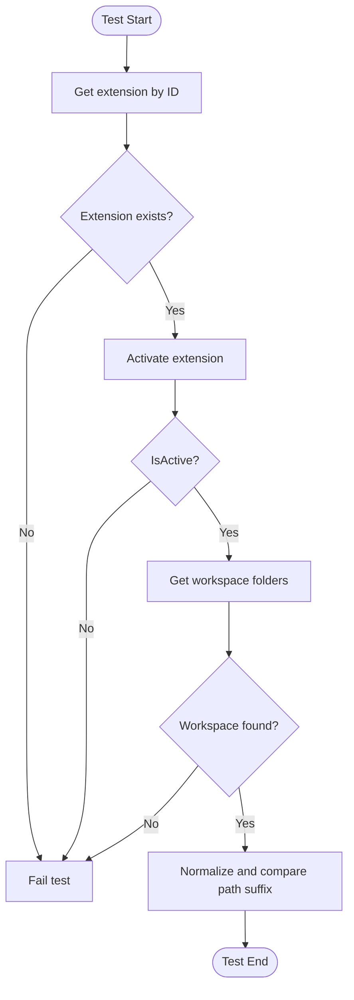

**Diagram sources**
- [extension.test.ts](file://src/test/extension.test.ts#L5-L30)

**Section sources**
- [extension.test.ts](file://src/test/extension.test.ts#L1-L31)

### AI Chat Webview Registration and Activation
**New** The AI chat webview test suite validates the new AI chat functionality integration with the extension. This test ensures proper webview registration and extension activation for the AI chat feature.

- Validates extension activation and webview provider registration
- Confirms AI chat webview provider is properly instantiated
- Tests webview view registration through VS Code API
- Verifies extension lifecycle integration with new webview functionality

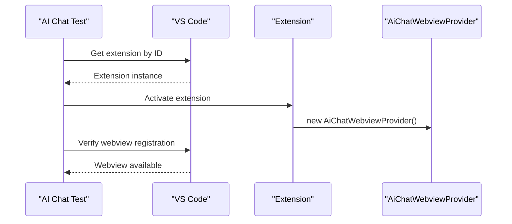

**Diagram sources**
- [aiChat.test.ts](file://src/test/aiChat.test.ts#L5-L23)
- [extension.ts](file://src/extension.ts#L505-L518)

**Section sources**
- [aiChat.test.ts](file://src/test/aiChat.test.ts#L1-L24)

### Bundle Manager Behavior
- Constructor initializes paths
- setActiveBundle updates active bundle and fires events
- getAllBundles reads without initialization
- saveBundle writes updated bundles and fires events
- deleteBundle removes bundle, resets active, and fires events

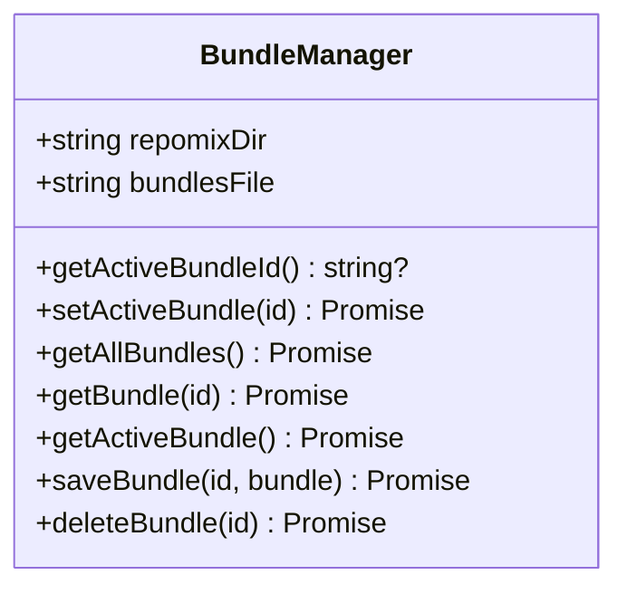

**Diagram sources**
- [bundleManager.test.ts](file://src/test/core/bundles/bundleManager.test.ts#L9-L299)

**Section sources**
- [bundleManager.test.ts](file://src/test/core/bundles/bundleManager.test.ts#L1-L300)

### Clipboard Operations Across Platforms
- Copies output to a temporary location
- Executes platform-specific clipboard commands
- Recreates temp directory if deleted mid-session
- Handles failures with user-visible error messages

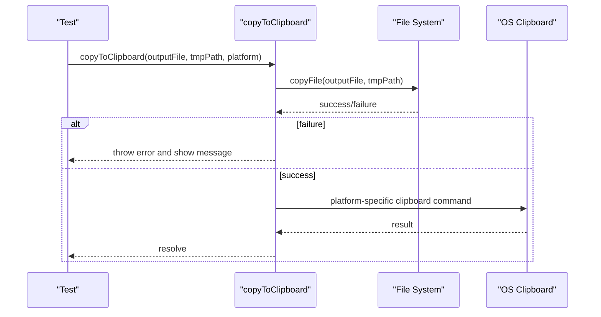

**Diagram sources**
- [copyToClipboard.test.ts](file://src/test/core/files/copyToClipboard.test.ts#L67-L120)

**Section sources**
- [copyToClipboard.test.ts](file://src/test/core/files/copyToClipboard.test.ts#L1-L142)

### Command Orchestration and Configuration Wiring
- Validates conditional behavior based on configuration flags
- Ensures proper cleanup and clipboard actions depending on settings

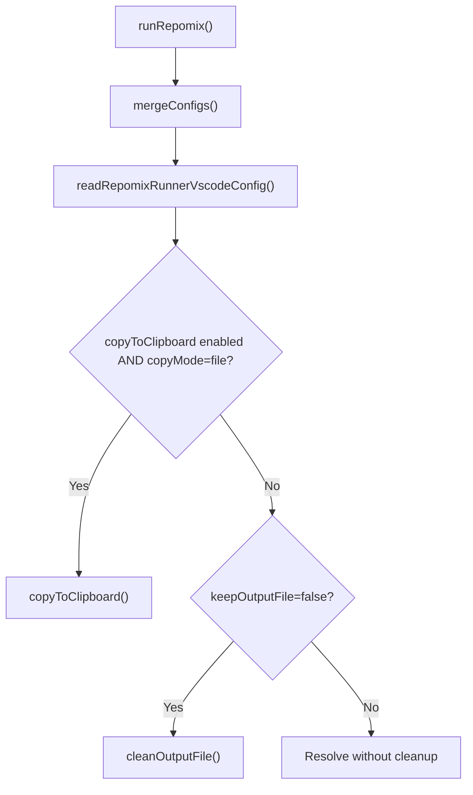

**Diagram sources**
- [runRepomix.test.ts](file://src/test/commands/runRepomix.test.ts#L51-L97)

**Section sources**
- [runRepomix.test.ts](file://src/test/commands/runRepomix.test.ts#L1-L141)

### Search Pipeline Deduplication and Filtering
- Deduplicates hits by file path, keeping the highest score
- Filters ignored files using .gitignore when present

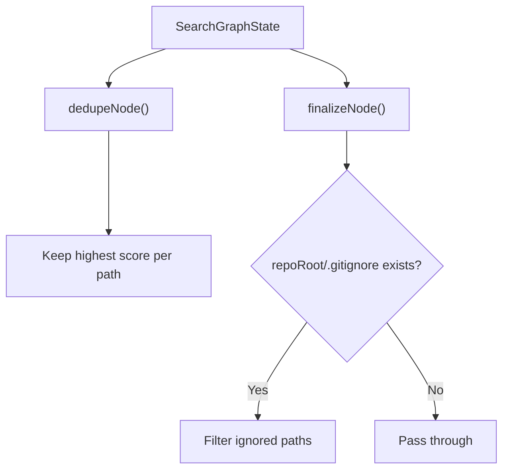

**Diagram sources**
- [nodes.test.ts](file://src/test/search/nodes.test.ts#L8-L24)
- [nodes.test.ts](file://src/test/search/nodes.test.ts#L26-L50)

**Section sources**
- [nodes.test.ts](file://src/test/search/nodes.test.ts#L1-L52)

### WebView Message Schema Validation
- Uses Zod-like schema parsing to validate inbound messages
- Enforces presence and shape of required fields

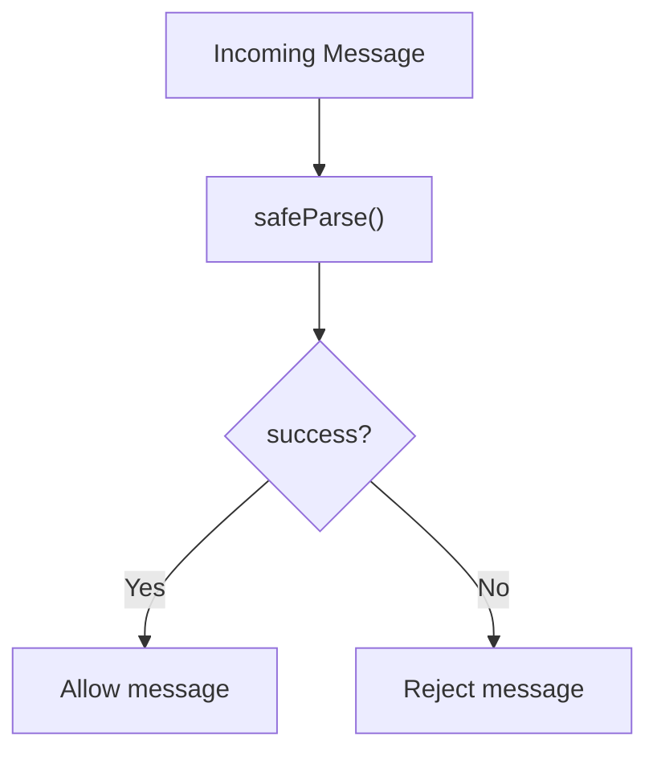

**Diagram sources**
- [messageSchemas.test.ts](file://src/test/webview/messageSchemas.test.ts#L5-L22)
- [messageSchemas.test.ts](file://src/test/webview/messageSchemas.test.ts#L24-L40)

**Section sources**
- [messageSchemas.test.ts](file://src/test/webview/messageSchemas.test.ts#L1-L93)

### AI Chat Webview Provider Implementation
**New** The AI chat webview provider implements VS Code's WebviewViewProvider interface to create the AI chat functionality. This provider manages the webview lifecycle and renders the AI chat interface.

- Implements WebviewViewProvider interface with static viewType constant
- Manages webview options including script enabling and local resource roots
- Generates CSP-compliant HTML with nonce-based security
- Sets up message handling for future AI chat interactions
- Integrates with React-based AI chat root component

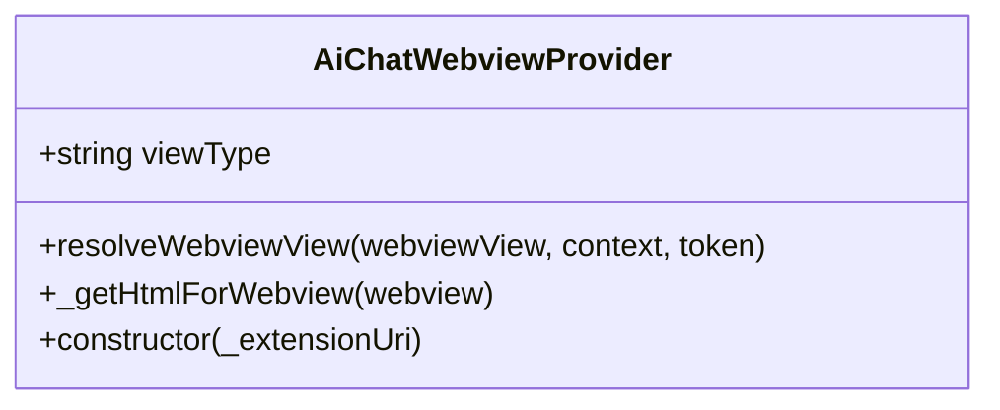

**Diagram sources**
- [AiChatWebviewProvider.ts](file://src/webview/AiChatWebviewProvider.ts#L3-L58)

**Section sources**
- [AiChatWebviewProvider.ts](file://src/webview/AiChatWebviewProvider.ts#L1-L67)

### AI Chat Root Component
**New** The AI chat root component serves as the main React component for the AI chat interface. It provides tabbed navigation between chat, settings, and history views.

- Uses Fluent UI React components for consistent styling
- Implements tab-based navigation with state management
- Provides placeholder interfaces for settings and history tabs
- Renders AI chat interface with dark theme support
- Manages component lifecycle with React hooks

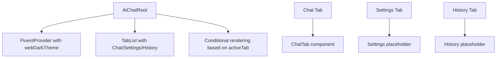

**Diagram sources**
- [AiChatRoot.tsx](file://src/webview/AiChatRoot.tsx#L11-L78)

**Section sources**
- [AiChatRoot.tsx](file://src/webview/AiChatRoot.tsx#L1-L78)

### Utility Functions
- deepMerge: Deeply merges objects, modifies target in place, preserves immutability of source
- generateOutputFilename: Applies bundle name sanitization and optional bundle name injection into output filename

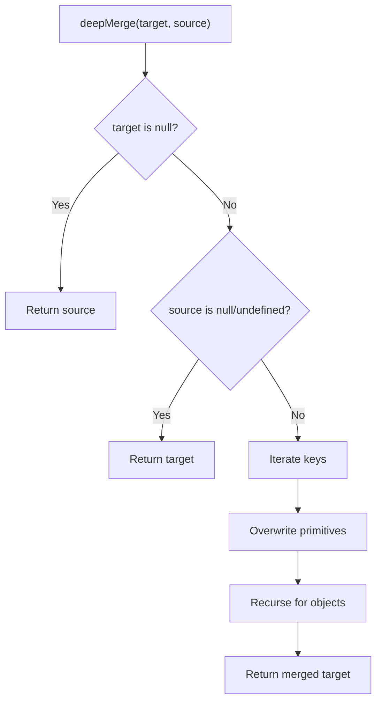

**Diagram sources**
- [deepMerge.test.ts](file://src/test/utils/deepMerge.test.ts#L4-L68)

**Section sources**
- [deepMerge.test.ts](file://src/test/utils/deepMerge.test.ts#L1-L69)
- [generateOutputFilename.test.ts](file://src/test/utils/generateOutputFilename.test.ts#L1-L61)

### Compression Module Testing
**New** The compression module provides AST-based file skeleton generation with support for multiple programming languages. Testing covers language detection, AST parsing, query execution, and selective compression with keepNames functionality. The framework now includes comprehensive testing infrastructure with multiple verification methods.

- Language detection for TypeScript, JavaScript, Dart, Python, C#, and Rust
- AST-based capture extraction using Tree-sitter queries
- Strategy-based parsing for language-specific node handling
- Selective compression with identifier preservation
- Chunk deduplication and adjacent merging
- **New**: VS Code debugger integration for interactive testing
- **New**: Programmatic usage examples for direct compression testing
- **New**: Command-line diagnostic scripts for automated verification

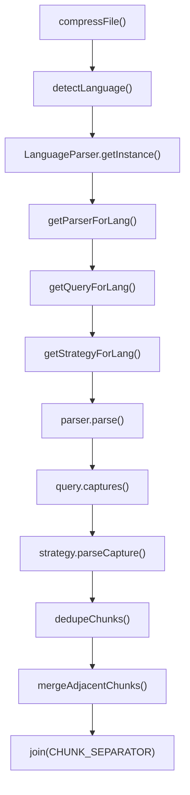

**Diagram sources**
- [compressFile.ts](file://src/core/compression/compressFile.ts#L74-L132)
- [LanguageParser.ts](file://src/core/compression/LanguageParser.ts#L1-L209)
- [types.ts](file://src/core/compression/types.ts#L1-L55)
- [index.ts](file://src/core/compression/index.ts#L1-L3)

**Section sources**
- [compressFile.ts](file://src/core/compression/compressFile.ts#L1-L133)
- [testCompression.ts](file://src/commands/testCompression.ts#L1-L39)
- [LanguageParser.ts](file://src/core/compression/LanguageParser.ts#L1-L209)
- [types.ts](file://src/core/compression/types.ts#L1-L55)
- [index.ts](file://src/core/compression/index.ts#L1-L3)

### Compression Testing Framework
**New** The compression testing framework provides three complementary methods for verifying compression functionality:

#### VS Code Debugger Integration
- Launches VS Code extension in debug mode
- Creates test files with various programming languages
- Executes "Repomix: Test Compression" command
- Opens comparison view showing original vs compressed output

#### Programmatic Usage Examples
- Direct import and usage of `compressFile` function
- Support for `keepNames` option to preserve specific identifiers
- Automated testing across multiple programming languages
- Standalone script execution for batch testing

#### Command-Line Diagnostic Scripts
- `scripts/diagnose-compression.js`: Health check for WASM files and dependencies
- `scripts/test-compression.js`: Automated compression testing with sample files
- `src/test-compression.ts`: Comprehensive standalone compression test suite
- Automatic verification of Tree-sitter parser availability and language support

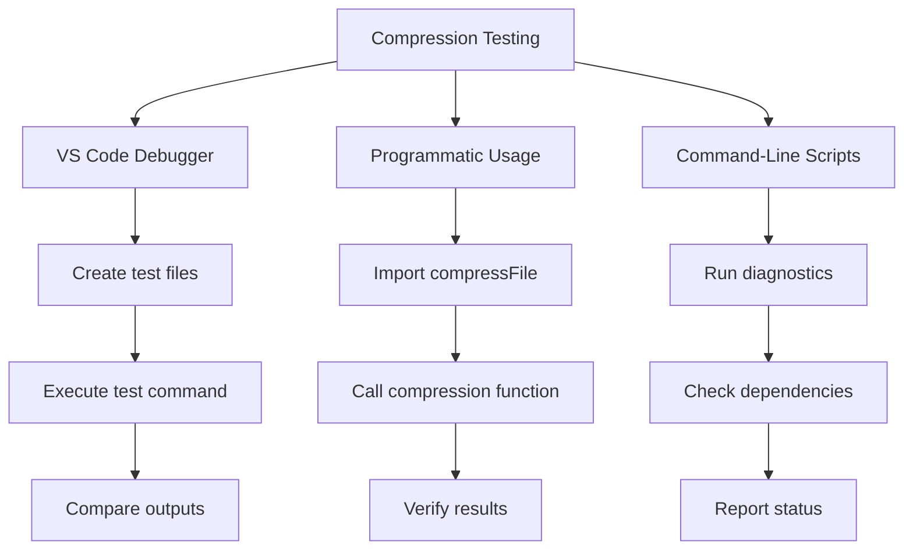

**Diagram sources**
- [COMPRESSION_TESTING.md](file://COMPRESSION_TESTING.md#L7-L35)
- [COMPRESSION_TESTING.md](file://COMPRESSION_TESTING.md#L36-L60)
- [COMPRESSION_TESTING.md](file://COMPRESSION_TESTING.md#L62-L68)

**Section sources**
- [COMPRESSION_TESTING.md](file://COMPRESSION_TESTING.md#L1-L171)
- [diagnose-compression.js](file://scripts/diagnose-compression.js#L1-L116)
- [test-compression.js](file://scripts/test-compression.js#L1-L190)
- [test-compression.ts](file://src/test-compression.ts#L1-L515)

### Indexing Monitor Testing
**Enhanced** The indexing monitor now includes comprehensive testing for directory expansion, path deduplication, and database state integration.

- Directory path expansion to concrete file paths using database state
- Path deduplication to prevent redundant processing
- Database service integration for repository file state lookup
- Event handling for flush operations and cleanup

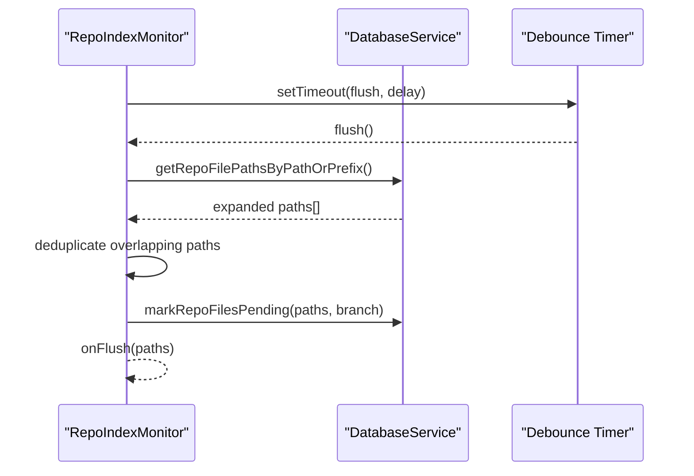

**Diagram sources**
- [repoIndexMonitor.test.ts](file://src/test/core/indexing/repoIndexMonitor.test.ts#L16-L43)
- [repoIndexMonitor.ts](file://src/core/indexing/repoIndexMonitor.ts#L258-L283)

**Section sources**
- [repoIndexMonitor.test.ts](file://src/test/core/indexing/repoIndexMonitor.test.ts#L1-L102)
- [repoIndexMonitor.ts](file://src/core/indexing/repoIndexMonitor.ts#L1-L284)

### Database Service Testing
**Enhanced** The database service includes comprehensive testing for repository file path prefix lookup functionality.

- Repository file path prefix matching for directory traversal
- Exact file path matching for single file retrieval
- Database state management for repository file indexing
- Integration with indexing monitor for path expansion

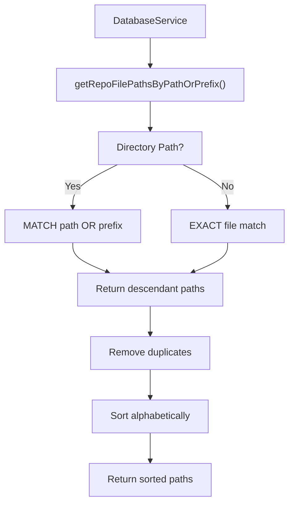

**Diagram sources**
- [databaseService.test.ts](file://src/test/core/storage/databaseService.test.ts#L40-L58)
- [databaseService.ts](file://src/core/storage/databaseService.ts#L112-L953)

**Section sources**
- [databaseService.test.ts](file://src/test/core/storage/databaseService.test.ts#L1-L59)
- [databaseService.ts](file://src/core/storage/databaseService.ts#L1-L1818)

### Integration Testing: End-to-End Workflows and External Tool Interactions
- Activates extension and validates workspace
- Compares extension output with native CLI output for equivalence
- Parameterized tests for bundle selection and removal scenarios
- Robust file cleanup and bundle reset between tests
- **New**: Compression command integration testing with keepNames functionality
- **New**: VS Code debugger integration for interactive compression testing
- **New**: AI chat webview registration validation through extension activation

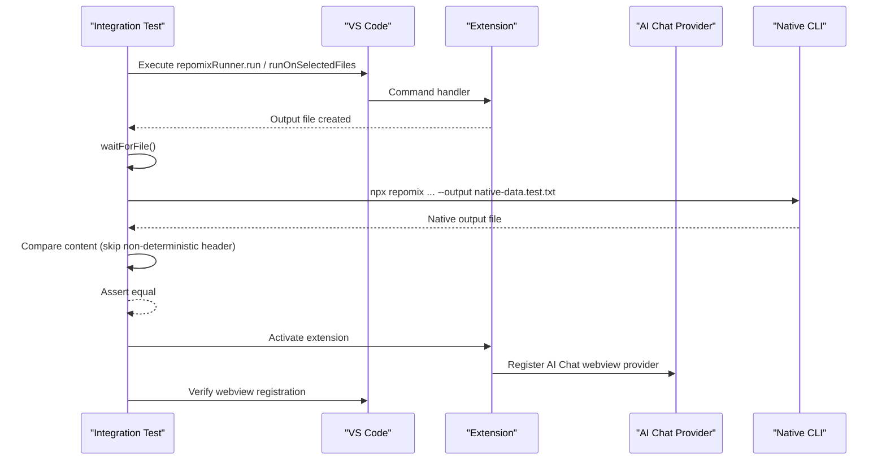

**Diagram sources**
- [integration.test.ts](file://src/test/test-workspace/integration.test.ts#L304-L378)
- [aiChat.test.ts](file://src/test/aiChat.test.ts#L5-L23)

**Section sources**
- [integration.test.ts](file://src/test/test-workspace/integration.test.ts#L1-L380)

## Dependency Analysis
- Test runner configuration defines workspace and test file pattern
- Scripts orchestrate compilation, type checking, linting, and test execution
- Test workspace configuration drives output file naming and behavior
- **New**: Compression module depends on Tree-sitter WASM parsers and language-specific queries
- **New**: Compression testing framework requires web-tree-sitter dependency and WASM files
- **New**: AI chat webview provider depends on VS Code webview APIs and React components
- **New**: AI chat test suite validates extension activation and webview registration
- **New**: Diagnostic scripts depend on Node.js file system operations and package.json metadata
- **New**: VS Code debugger integration requires proper extension activation and command registration
- **New**: Standalone compression tests require compiled extension distribution

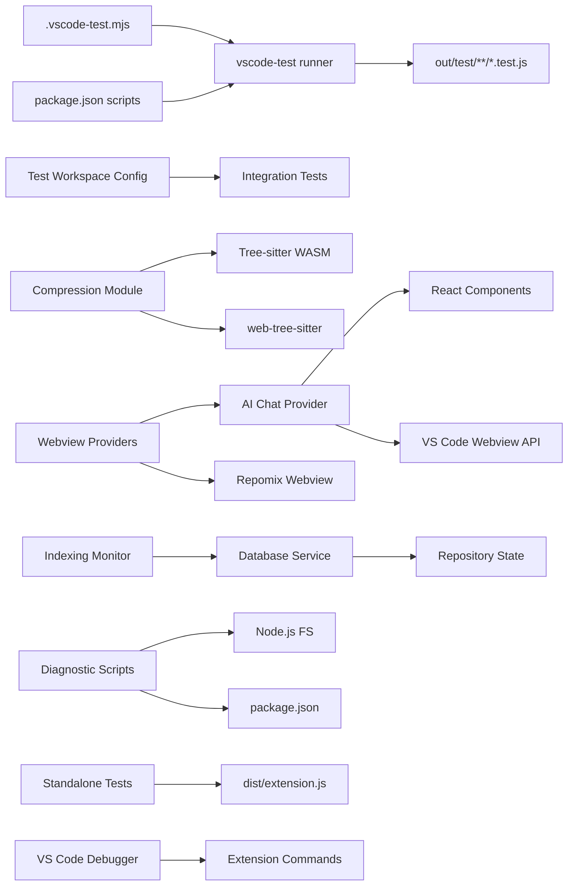

**Diagram sources**
- [.vscode-test.mjs](file://.vscode-test.mjs#L3-L7)
- [package.json](file://package.json#L541-L559)
- [repomix.config.json](file://src/test/test-workspace/root/repomix.config.json#L1-L26)
- [AiChatWebviewProvider.ts](file://src/webview/AiChatWebviewProvider.ts#L1-L67)
- [AiChatRoot.tsx](file://src/webview/AiChatRoot.tsx#L1-L78)
- [diagnose-compression.js](file://scripts/diagnose-compression.js#L8-L11)
- [test-compression.ts](file://src/test-compression.ts#L8-L11)

**Section sources**
- [.vscode-test.mjs](file://.vscode-test.mjs#L1-L8)
- [package.json](file://package.json#L541-L559)
- [repomix.config.json](file://src/test/test-workspace/root/repomix.config.json#L1-L26)

## Performance Considerations
- Prefer stubbing expensive filesystem or network operations in unit tests
- Use targeted timeouts and polling helpers for asynchronous file readiness
- Minimize repeated external CLI invocations by reusing outputs when feasible
- Keep integration tests focused and isolated to reduce flakiness
- **New**: Compression operations should cache Tree-sitter parsers and queries for better performance
- **New**: Database queries should use prepared statements and connection pooling for optimal performance
- **New**: Compression testing scripts should cache parsed results to avoid repeated parsing overhead
- **New**: Diagnostic scripts should implement efficient file existence checks and caching mechanisms
- **New**: AI chat webview provider should cache webview options and HTML generation for improved response times

## Troubleshooting Guide
Common issues and resolutions:
- File not found during integration tests: Use waitForFile to poll for file creation; ensure output paths are correct and normalized
- Windows-specific failures: Use deleteFiles with normalized patterns and absolute paths; prefer globby for robust deletion
- Clipboard failures: Validate platform-specific commands and temp directory recreation logic
- Bundle state inconsistencies: Reset bundles.json to empty bundles after teardown to avoid cross-test contamination
- **New**: Compression failures: Check Tree-sitter WASM parser loading and language detection logic
- **New**: VS Code debugger integration issues: Verify extension activation and command registration in package.json
- **New**: Programmatic compression testing failures: Ensure proper import paths and WASM directory configuration
- **New**: Diagnostic script errors: Check Node.js file system permissions and package.json dependency resolution
- **New**: Indexing monitor path expansion issues: Verify database service integration and path prefix matching
- **New**: Database query performance: Ensure proper indexing and query optimization for repository file lookups
- **New**: AI chat webview registration failures: Verify webview provider instantiation and VS Code API compatibility
- **New**: Extension activation issues with AI chat: Check webview provider registration in extension activation flow

**Section sources**
- [utilsTest.ts](file://src/test/utilsTest.ts#L1-L67)
- [integration.test.ts](file://src/test/test-workspace/integration.test.ts#L45-L68)

## Conclusion
The testing framework balances unit isolation with meaningful integration checks against the extension and external CLI. It leverages VS Code's test host, robust file utilities, and parameterized scenarios to validate complex workflows. The recent additions of comprehensive compression module testing, enhanced indexing monitor functionality, expanded database service capabilities, and the new AI chat webview functionality provide thorough coverage of the core system components. **New**: The AI chat webview test suite significantly enhances the testing capabilities by validating webview registration and extension activation for the new AI chat functionality. By following the patterns and guidelines outlined here, contributors can confidently add, maintain, and debug tests across the codebase.

## Appendices

### Writing New Tests
- Place unit tests alongside the code under src/test/<module>/<feature>.test.ts
- For integration tests, use src/test/test-workspace/integration.test.ts and add fixtures under src/test/test-workspace/root
- Use assert for assertions and sinon for stubs/spies
- Leverage waitForFile and deleteFiles for deterministic file operations
- **New**: For compression module tests, mock Tree-sitter parser instances and language-specific strategies
- **New**: For indexing monitor tests, stub database service methods and verify path expansion logic
- **New**: For database service tests, use temporary directories and clean up test databases after execution
- **New**: For AI chat webview tests, validate webview provider registration and extension activation
- **New**: For AI chat root component tests, verify React component rendering and tab navigation
- **New**: For compression testing, utilize the existing diagnostic scripts and standalone test framework
- **New**: When adding webview tests, ensure proper VS Code command registration and extension activation

### Running Test Suites
- Pre-test compilation and linting are handled by scripts
- Run all tests with the VS Code test runner configured by .vscode-test.mjs
- Use npm scripts to compile tests, compile the extension, and execute the test runner
- **New**: Compression module tests require Tree-sitter WASM files to be available in the test environment
- **New**: VS Code debugger integration requires proper extension packaging and deployment
- **New**: Programmatic compression testing requires compiled extension distribution in dist/ directory
- **New**: Diagnostic scripts can be run independently without VS Code environment
- **New**: AI chat webview tests require extension activation and webview provider registration

**Section sources**
- [package.json](file://package.json#L541-L559)
- [.vscode-test.mjs](file://.vscode-test.mjs#L1-L8)

### Interpreting Results
- Unit tests: Expect clear pass/fail outcomes for isolated behaviors
- Integration tests: Expect deterministic comparisons between extension and CLI outputs; failures often indicate path normalization or configuration mismatches
- **New**: Compression tests: Validate AST parsing success and chunk generation quality across multiple languages
- **New**: VS Code debugger tests: Verify interactive compression functionality and user interface behavior
- **New**: Programmatic tests: Confirm direct function calls work correctly with various input configurations
- **New**: Diagnostic script tests: Ensure system health checks report accurate status and provide actionable feedback
- **New**: Indexing monitor tests: Verify path expansion accuracy and deduplication effectiveness
- **New**: Database service tests: Confirm repository file path lookup precision and performance characteristics
- **New**: AI chat webview tests: Validate webview registration and extension activation lifecycle
- **New**: AI chat provider tests: Confirm proper webview options and HTML generation

### Continuous Integration and Coverage
- CI setup: Configure the VS Code test runner with the provided configuration
- Coverage: No explicit coverage reporting configuration is present in the repository; consider adding a coverage tool if needed
- **New**: Compression module coverage: Focus on AST parsing accuracy and language-specific strategy effectiveness
- **New**: VS Code debugger integration coverage: Emphasize interactive testing scenarios and user experience validation
- **New**: Programmatic testing coverage: Prioritize direct function call reliability and error handling
- **New**: Diagnostic script coverage: Ensure comprehensive system health verification across all supported environments
- **New**: Indexing monitor coverage: Emphasize path expansion scenarios and edge case handling
- **New**: Database service coverage: Prioritize query performance and concurrent access scenarios
- **New**: AI chat webview coverage: Focus on webview registration validation and extension lifecycle integration
- **New**: AI chat provider coverage: Emphasize React component rendering and webview lifecycle management

**Section sources**
- [.vscode-test.mjs](file://.vscode-test.mjs#L1-L8)
- [package.json](file://package.json#L541-L559)

### Example Scenarios

#### Bundle Creation and Selection
- Validate setActiveBundle updates active bundle and fires events
- Validate saveBundle persists bundles and triggers change notifications
- Validate deleteBundle removes entries and resets active bundle

**Section sources**
- [bundleManager.test.ts](file://src/test/core/bundles/bundleManager.test.ts#L43-L85)
- [bundleManager.test.ts](file://src/test/core/bundles/bundleManager.test.ts#L182-L233)
- [bundleManager.test.ts](file://src/test/core/bundles/bundleManager.test.ts#L235-L298)

#### AI Agent Message Validation
- Validate schema enforcement for runBundle, runSmartAgent, webviewLoaded, and saveApiKey
- Ensure missing or invalid fields cause parsing to fail

**Section sources**
- [messageSchemas.test.ts](file://src/test/webview/messageSchemas.test.ts#L5-L22)
- [messageSchemas.test.ts](file://src/test/webview/messageSchemas.test.ts#L24-L40)
- [messageSchemas.test.ts](file://src/test/webview/messageSchemas.test.ts#L58-L91)

#### Clipboard Operations
- Validate platform-specific commands and temp directory recreation
- Ensure error paths surface user-facing messages

**Section sources**
- [copyToClipboard.test.ts](file://src/test/core/files/copyToClipboard.test.ts#L67-L120)
- [copyToClipboard.test.ts](file://src/test/core/files/copyToClipboard.test.ts#L122-L140)

#### AI Chat Webview Registration
**New** - Validate AI chat webview provider registration and extension activation
- Test extension activation and webview provider instantiation
- Verify AI chat webview view registration through VS Code API
- Ensure proper webview options and HTML generation
- Validate extension lifecycle integration with new webview functionality

**Section sources**
- [aiChat.test.ts](file://src/test/aiChat.test.ts#L1-L24)
- [AiChatWebviewProvider.ts](file://src/webview/AiChatWebviewProvider.ts#L1-L67)
- [extension.ts](file://src/extension.ts#L505-L518)

#### AI Chat Root Component Rendering
**New** - Validate React component rendering and tab navigation
- Test Fluent UI provider integration with dark theme
- Verify tab-based navigation between chat, settings, and history
- Ensure proper component state management and rendering
- Validate placeholder interfaces for future functionality

**Section sources**
- [AiChatRoot.tsx](file://src/webview/AiChatRoot.tsx#L1-L78)

#### Compression Module Workflows
**New** - Test AST-based file compression with multiple programming languages
- Validate language detection for TypeScript, JavaScript, Dart, Python, C#, and Rust
- Test selective compression with keepNames functionality preserving specific identifiers
- Verify AST parsing success and chunk generation quality across different file structures
- Ensure proper error handling when Tree-sitter parsers fail to load
- **New**: Test VS Code debugger integration for interactive compression testing
- **New**: Validate programmatic usage examples with direct function calls
- **New**: Verify command-line diagnostic scripts for automated system health verification

**Section sources**
- [compressFile.ts](file://src/core/compression/compressFile.ts#L6-L25)
- [compressFile.ts](file://src/core/compression/compressFile.ts#L74-L133)
- [testCompression.ts](file://src/commands/testCompression.ts#L5-L38)
- [LanguageParser.ts](file://src/core/compression/LanguageParser.ts#L37-L64)
- [types.ts](file://src/core/compression/types.ts#L34-L36)
- [COMPRESSION_TESTING.md](file://COMPRESSION_TESTING.md#L7-L35)
- [COMPRESSION_TESTING.md](file://COMPRESSION_TESTING.md#L36-L60)
- [COMPRESSION_TESTING.md](file://COMPRESSION_TESTING.md#L62-L68)

#### Indexing Monitor Operations
**New** - Test directory expansion and path deduplication functionality
- Validate directory path expansion to concrete file paths using database state
- Test path deduplication to prevent redundant processing of overlapping paths
- Verify proper integration with database service for repository file state lookup
- Ensure cleanup and resource disposal on monitor disposal

**Section sources**
- [repoIndexMonitor.test.ts](file://src/test/core/indexing/repoIndexMonitor.test.ts#L16-L43)
- [repoIndexMonitor.test.ts](file://src/test/core/indexing/repoIndexMonitor.test.ts#L70-L100)
- [repoIndexMonitor.ts](file://src/core/indexing/repoIndexMonitor.ts#L276-L283)

#### Database Service Repository File Lookup
**New** - Test repository file path prefix matching functionality
- Validate directory path expansion to return descendant files without sibling overmatching
- Test exact file path matching for single file retrieval
- Verify proper sorting and deduplication of returned file paths
- Ensure database service handles concurrent access and cleanup properly

**Section sources**
- [databaseService.test.ts](file://src/test/core/storage/databaseService.test.ts#L40-L58)
- [databaseService.ts](file://src/core/storage/databaseService.ts#L112-L953)

#### Compression Testing Framework
**New** - Comprehensive testing infrastructure validation
- **VS Code Debugger**: Verify interactive compression testing workflow
- **Programmatic Usage**: Test direct function calls with various input configurations
- **Command-Line Diagnostics**: Validate automated system health verification
- **Standalone Scripts**: Ensure comprehensive language support testing
- **Diagnostic Scripts**: Confirm proper dependency and WASM file validation

**Section sources**
- [COMPRESSION_TESTING.md](file://COMPRESSION_TESTING.md#L1-L171)
- [diagnose-compression.js](file://scripts/diagnose-compression.js#L1-L116)
- [test-compression.js](file://scripts/test-compression.js#L1-L190)
- [test-compression.ts](file://src/test-compression.ts#L1-L515)

### VS Code Debugger Configuration
**New** - Enhanced debugging setup for compression testing

The VS Code debugging configuration supports multiple debugging scenarios:

- **Run Extension**: Compiles and launches the extension in a new VS Code window
- **Extension Tests**: Runs the test suite with proper source map support
- **Debugging Tasks**: Background compilation and watch mode for development

Key debugging features:
- Automatic source map resolution for TypeScript debugging
- Watch mode compilation for rapid development cycles
- Extension host debugging with breakpoint support
- Console logging integration with developer tools

**Section sources**
- [launch.json](file://.vscode/launch.json#L1-L44)
- [tasks.json](file://.vscode/tasks.json#L1-L60)
- [DEBUG.md](file://.vscode/DEBUG.md#L1-L47)

### Compression Testing Scripts
**New** - Automated testing infrastructure

The compression testing ecosystem includes multiple script types:

- **Diagnostic Scripts**: Health checks for WASM files and dependencies
- **Programmatic Tests**: Standalone TypeScript test suite with comprehensive language support
- **CLI Tests**: JavaScript-based testing with compiled extension distribution
- **Fixtures**: Sample code for testing compression functionality

Testing capabilities:
- Multi-language support (TypeScript, JavaScript, Python, Rust, C#, Dart)
- WASM parser validation and error handling
- Compression ratio calculation and reporting
- Automated troubleshooting and error reporting

**Section sources**
- [diagnose-compression.js](file://scripts/diagnose-compression.js#L1-L116)
- [test-compression.js](file://scripts/test-compression.js#L1-L190)
- [test-compression.ts](file://src/test-compression.ts#L1-L515)
- [test-compression-fix.ts](file://src/test-compression-fix.ts#L1-L10)

### AI Chat Webview Integration
**New** - Comprehensive AI chat functionality testing

The AI chat webview integration encompasses multiple testing aspects:

- **Webview Provider Registration**: Validates AiChatWebviewProvider instantiation and registration
- **Extension Activation**: Tests extension lifecycle with new webview functionality
- **React Component Rendering**: Ensures proper AI chat root component rendering
- **Tab Navigation**: Validates tab-based interface for chat, settings, and history
- **VS Code API Integration**: Confirms compatibility with VS Code webview APIs

Testing approach:
- Extension activation and webview provider creation
- Webview options configuration and HTML generation
- React component mounting and state management
- Tab navigation and interface responsiveness
- Integration with existing extension infrastructure

**Section sources**
- [aiChat.test.ts](file://src/test/aiChat.test.ts#L1-L24)
- [AiChatWebviewProvider.ts](file://src/webview/AiChatWebviewProvider.ts#L1-L67)
- [AiChatRoot.tsx](file://src/webview/AiChatRoot.tsx#L1-L78)
- [extension.ts](file://src/extension.ts#L505-L518)