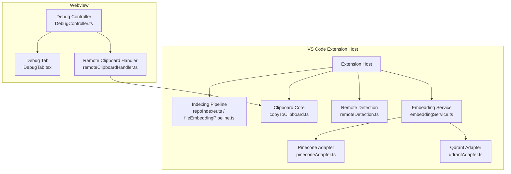
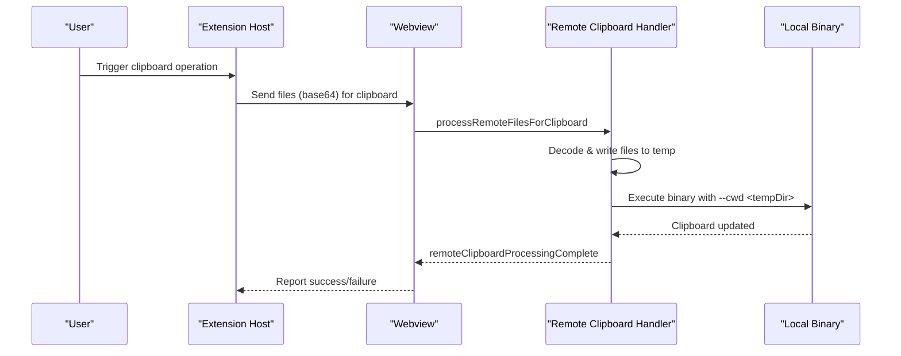
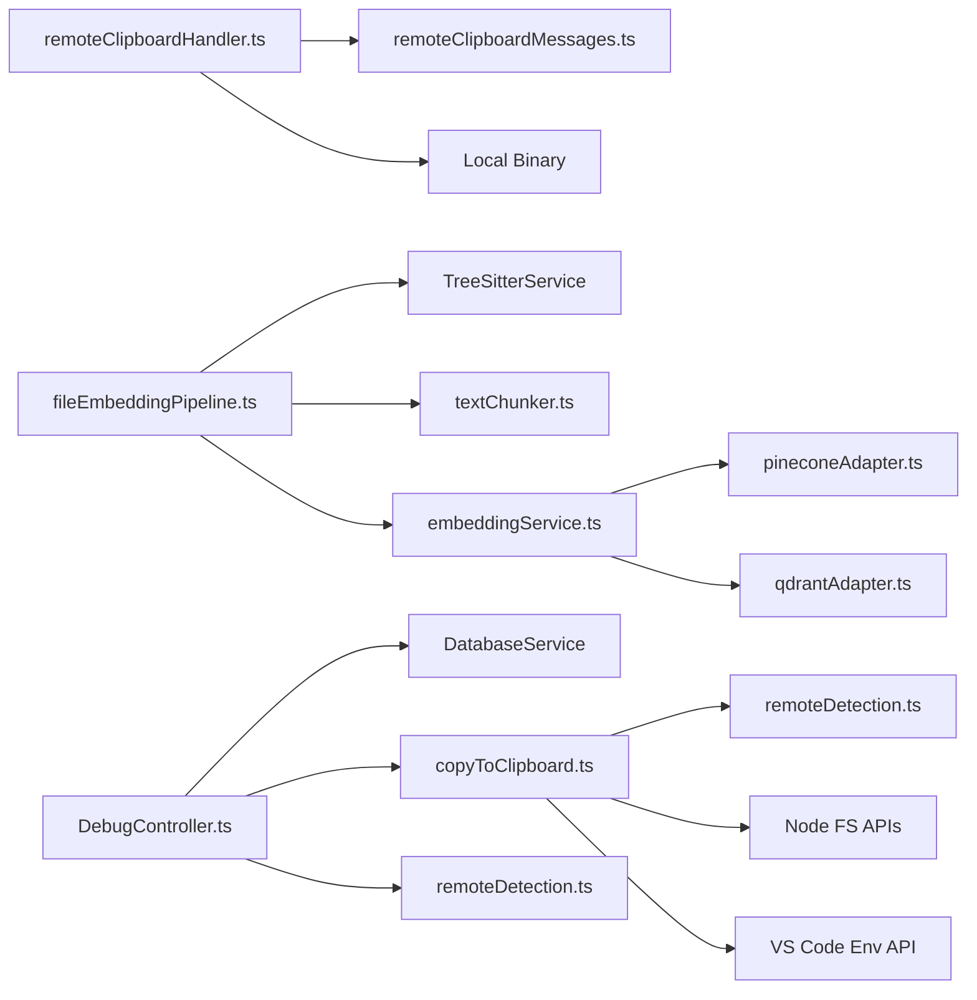

# Troubleshooting and FAQ

<cite>
**Referenced Files in This Document**
- [README.md](file://README.md)
- [package.json](file://package.json)
- [logger.ts](file://src/shared/logger.ts)
- [DebugTab.tsx](file://src/webview/components/DebugTab.tsx)
- [DebugController.ts](file://src/webview/controllers/DebugController.ts)
- [copyToClipboard.ts](file://src/core/files/copyToClipboard.ts)
- [remoteDetection.ts](file://src/core/files/remoteDetection.ts)
- [remoteClipboardHandler.ts](file://src/webview/handlers/remoteClipboardHandler.ts)
- [remoteClipboardMessages.ts](file://src/webview/types/remoteClipboardMessages.ts)
- [repoIndexer.ts](file://src/core/indexing/repoIndexer.ts)
- [fileEmbeddingPipeline.ts](file://src/core/indexing/fileEmbeddingPipeline.ts)
- [embeddingService.ts](file://src/core/indexing/embeddingService.ts)
- [pineconeAdapter.ts](file://src/core/indexing/vectorDb/providers/pineconeAdapter.ts)
- [qdrantAdapter.ts](file://src/core/indexing/vectorDb/providers/qdrantAdapter.ts)
- [indexingError.ts](file://src/shared/indexingError.ts)
</cite>

## Table of Contents
1. [Introduction](#introduction)
2. [Project Structure](#project-structure)
3. [Core Components](#core-components)
4. [Architecture Overview](#architecture-overview)
5. [Detailed Component Analysis](#detailed-component-analysis)
6. [Dependency Analysis](#dependency-analysis)
7. [Performance Considerations](#performance-considerations)
8. [Troubleshooting Guide](#troubleshooting-guide)
9. [Conclusion](#conclusion)
10. [Appendices](#appendices)

## Introduction
This document provides comprehensive troubleshooting and FAQ guidance for Repomix Runner Plus. It covers installation prerequisites, clipboard operation issues across platforms, debugging techniques using the Debug tab and logs, performance tuning for large repositories, and network connectivity issues for vector database services. It also includes step-by-step resolution guides, diagnostic commands, environment verification procedures, known limitations, workarounds, escalation procedures, and community resources.

## Project Structure
Repomix Runner Plus is a VS Code extension with a hybrid architecture:
- Extension host runs indexing, file operations, and vector database interactions.
- Webview provides a user interface for configuration, debugging, and clipboard workflows.
- Remote clipboard handler executes a bundled binary locally for Windows clients when using SSH remotes.

**Diagram sources**
- [repoIndexer.ts](file://src/core/indexing/repoIndexer.ts#L28-L121)
- [fileEmbeddingPipeline.ts](file://src/core/indexing/fileEmbeddingPipeline.ts#L186-L469)
- [copyToClipboard.ts](file://src/core/files/copyToClipboard.ts#L52-L160)
- [remoteDetection.ts](file://src/core/files/remoteDetection.ts#L31-L100)
- [embeddingService.ts](file://src/core/indexing/embeddingService.ts#L17-L68)
- [pineconeAdapter.ts](file://src/core/indexing/vectorDb/providers/pineconeAdapter.ts#L5-L82)
- [qdrantAdapter.ts](file://src/core/indexing/vectorDb/providers/qdrantAdapter.ts#L12-L244)
- [DebugTab.tsx](file://src/webview/components/DebugTab.tsx#L7-L267)
- [DebugController.ts](file://src/webview/controllers/DebugController.ts#L16-L230)
- [remoteClipboardHandler.ts](file://src/webview/handlers/remoteClipboardHandler.ts#L10-L190)

**Section sources**
- [README.md](file://README.md#L69-L142)
- [package.json](file://package.json#L1-L608)

## Core Components
- Clipboard subsystem: Handles content and file-mode copying across Windows, macOS, and Linux, with special logic for SSH remotes and bundled binaries.
- Indexing pipeline: Scans repository files, applies ignore patterns, chunks content, generates embeddings, and upserts vectors to vector databases.
- Debug tab and controller: Expose recent runs, environment info, and actions to re-run selections or copy outputs.
- Vector database adapters: Support Pinecone and Qdrant with provider-specific configuration and metadata retrieval.

**Section sources**
- [copyToClipboard.ts](file://src/core/files/copyToClipboard.ts#L52-L160)
- [repoIndexer.ts](file://src/core/indexing/repoIndexer.ts#L28-L121)
- [fileEmbeddingPipeline.ts](file://src/core/indexing/fileEmbeddingPipeline.ts#L186-L469)
- [DebugTab.tsx](file://src/webview/components/DebugTab.tsx#L7-L267)
- [DebugController.ts](file://src/webview/controllers/DebugController.ts#L16-L230)
- [pineconeAdapter.ts](file://src/core/indexing/vectorDb/providers/pineconeAdapter.ts#L5-L82)
- [qdrantAdapter.ts](file://src/core/indexing/vectorDb/providers/qdrantAdapter.ts#L12-L244)

## Architecture Overview
The clipboard workflow differs by platform and remote mode. For SSH remotes on Windows, the extension transfers base64-encoded files to the webview, which writes them to a temp directory and invokes a bundled binary to populate the Windows clipboard.

**Diagram sources**
- [remoteClipboardHandler.ts](file://src/webview/handlers/remoteClipboardHandler.ts#L22-L67)
- [remoteClipboardMessages.ts](file://src/webview/types/remoteClipboardMessages.ts#L5-L40)
- [copyToClipboard.ts](file://src/core/files/copyToClipboard.ts#L52-L160)

## Detailed Component Analysis

### Clipboard Operations
Common issues:
- Linux requires xclip for file copy mode.
- SSH remote on Windows needs the bundled binary; webview sandbox limitations currently disable local binary execution in webview.
- Content mode uses VS Code’s clipboard API and is cross-platform.

Resolution steps:
- Install xclip on Linux for file copy mode.
- Verify binary path and existence for local development.
- Prefer content mode on macOS/Linux until binary execution is enabled.

**Section sources**
- [README.md](file://README.md#L107-L127)
- [copyToClipboard.ts](file://src/core/files/copyToClipboard.ts#L11-L18)
- [copyToClipboard.ts](file://src/core/files/copyToClipboard.ts#L109-L119)
- [remoteDetection.ts](file://src/core/files/remoteDetection.ts#L61-L100)
- [remoteClipboardHandler.ts](file://src/webview/handlers/remoteClipboardHandler.ts#L107-L132)

### Debugging Techniques
Use the Debug tab to inspect recent runs and environment information:
- View runs, copy outputs, re-run selections, and delete runs.
- Inspect environment info: client OS/arch, remote status, SSH detection, and local binary availability.

Diagnostic commands:
- Open the Repomix Runner output channel from VS Code.
- Enable verbose logging in settings if needed.

**Section sources**
- [DebugTab.tsx](file://src/webview/components/DebugTab.tsx#L7-L267)
- [DebugController.ts](file://src/webview/controllers/DebugController.ts#L16-L230)
- [logger.ts](file://src/shared/logger.ts#L1-L132)

### Indexing and Embedding Pipeline
Key stages:
- Repository scanning with ignore patterns and binary exclusions.
- File chunking with semantic-aware options.
- Embedding generation and vector upsert batching.
- Vector database metadata retrieval and error handling.

Performance tips:
- Reduce embedding batch sizes and concurrency for constrained environments.
- Use smaller chunk sizes to lower memory spikes.
- Limit ignored patterns to speed up globbing.

**Section sources**
- [repoIndexer.ts](file://src/core/indexing/repoIndexer.ts#L28-L121)
- [fileEmbeddingPipeline.ts](file://src/core/indexing/fileEmbeddingPipeline.ts#L186-L469)
- [embeddingService.ts](file://src/core/indexing/embeddingService.ts#L17-L68)

### Vector Database Connectivity
Pinecone:
- Requires API key and index name; metadata retrieval reads index dimension and counts.

Qdrant:
- Requires base URL and collection; hosted instances require API key.
- Validates configuration early and throws descriptive errors.

Authentication and proxy:
- Configure credentials in extension settings.
- For proxies, ensure outbound HTTPS access to provider endpoints.

**Section sources**
- [pineconeAdapter.ts](file://src/core/indexing/vectorDb/providers/pineconeAdapter.ts#L5-L82)
- [qdrantAdapter.ts](file://src/core/indexing/vectorDb/providers/qdrantAdapter.ts#L12-L40)
- [qdrantAdapter.ts](file://src/core/indexing/vectorDb/providers/qdrantAdapter.ts#L202-L244)

## Dependency Analysis

**Diagram sources**
- [copyToClipboard.ts](file://src/core/files/copyToClipboard.ts#L52-L160)
- [remoteDetection.ts](file://src/core/files/remoteDetection.ts#L31-L100)
- [remoteClipboardHandler.ts](file://src/webview/handlers/remoteClipboardHandler.ts#L10-L190)
- [remoteClipboardMessages.ts](file://src/webview/types/remoteClipboardMessages.ts#L5-L52)
- [fileEmbeddingPipeline.ts](file://src/core/indexing/fileEmbeddingPipeline.ts#L186-L469)
- [embeddingService.ts](file://src/core/indexing/embeddingService.ts#L17-L68)
- [pineconeAdapter.ts](file://src/core/indexing/vectorDb/providers/pineconeAdapter.ts#L5-L82)
- [qdrantAdapter.ts](file://src/core/indexing/vectorDb/providers/qdrantAdapter.ts#L12-L244)
- [DebugController.ts](file://src/webview/controllers/DebugController.ts#L16-L230)

**Section sources**
- [copyToClipboard.ts](file://src/core/files/copyToClipboard.ts#L52-L160)
- [remoteDetection.ts](file://src/core/files/remoteDetection.ts#L31-L100)
- [remoteClipboardHandler.ts](file://src/webview/handlers/remoteClipboardHandler.ts#L10-L190)
- [fileEmbeddingPipeline.ts](file://src/core/indexing/fileEmbeddingPipeline.ts#L186-L469)
- [embeddingService.ts](file://src/core/indexing/embeddingService.ts#L17-L68)
- [pineconeAdapter.ts](file://src/core/indexing/vectorDb/providers/pineconeAdapter.ts#L5-L82)
- [qdrantAdapter.ts](file://src/core/indexing/vectorDb/providers/qdrantAdapter.ts#L12-L244)
- [DebugController.ts](file://src/webview/controllers/DebugController.ts#L16-L230)

## Performance Considerations
- Large repositories:
  - Increase chunk size cautiously; tune embedding batch size and vector DB batch size.
  - Reduce concurrency for files, batches, and upserts to avoid memory pressure.
  - Exclude unnecessary binary files and directories via ignore patterns.
- Memory usage:
  - Monitor embedding and upsert durations; adjust batch sizes and concurrency.
  - Use smaller chunk sizes to reduce peak memory during chunking and embedding.
- Network:
  - For vector DBs, ensure stable connectivity and consider retry/backoff behavior.

[No sources needed since this section provides general guidance]

## Troubleshooting Guide

### Installation and Compatibility
- VS Code version: Ensure version meets the minimum requirement.
- Node.js/npm: Required for npx-based flows; confirm availability in PATH.
- Platform-specific:
  - Windows/macOS: Built-in file copy mode support.
  - Linux: Install xclip for file copy mode.

Verification steps:
- Confirm VS Code version and extension activation events.
- Check Node.js and npm presence in terminal.

**Section sources**
- [README.md](file://README.md#L120-L127)
- [package.json](file://package.json#L13-L15)

### Clipboard Problems
Symptoms and fixes:
- Linux file copy fails due to missing xclip:
  - Install xclip and retry.
- SSH remote on Windows:
  - Local binary execution is currently disabled in webview due to sandbox limitations; rely on remote npx approach.
- Cross-platform:
  - Use content mode for macOS/Linux until binary execution is enabled.

Diagnostic steps:
- Use the Debug tab to review environment info (client OS, remote status, SSH flag).
- Verify binary path and existence for local development.

**Section sources**
- [README.md](file://README.md#L107-L127)
- [copyToClipboard.ts](file://src/core/files/copyToClipboard.ts#L11-L18)
- [copyToClipboard.ts](file://src/core/files/copyToClipboard.ts#L109-L119)
- [remoteDetection.ts](file://src/core/files/remoteDetection.ts#L61-L100)
- [DebugTab.tsx](file://src/webview/components/DebugTab.tsx#L178-L263)
- [DebugController.ts](file://src/webview/controllers/DebugController.ts#L160-L230)

### Debugging Techniques
- Use the Debug tab:
  - View recent runs, copy outputs, re-run selections, and delete runs.
- Logs:
  - Open the Repomix Runner output channel.
  - Enable verbose logging if needed.
- Environment verification:
  - Review environment info: client OS/arch, remote status, SSH detection, and local binary availability.

**Section sources**
- [DebugTab.tsx](file://src/webview/components/DebugTab.tsx#L7-L267)
- [DebugController.ts](file://src/webview/controllers/DebugController.ts#L16-L230)
- [logger.ts](file://src/shared/logger.ts#L1-L132)

### Performance Issues
- Slow indexing:
  - Reduce ignore patterns, exclude large binaries, and tune chunking.
- Memory spikes:
  - Lower embedding and upsert batch sizes; reduce concurrency.
- Large repositories:
  - Use targeted inclusion/exclusions and smaller chunk sizes.

**Section sources**
- [repoIndexer.ts](file://src/core/indexing/repoIndexer.ts#L28-L121)
- [fileEmbeddingPipeline.ts](file://src/core/indexing/fileEmbeddingPipeline.ts#L130-L144)
- [fileEmbeddingPipeline.ts](file://src/core/indexing/fileEmbeddingPipeline.ts#L289-L348)
- [fileEmbeddingPipeline.ts](file://src/core/indexing/fileEmbeddingPipeline.ts#L397-L447)

### Network and Vector Database Connectivity
- Pinecone:
  - Ensure API key and index name are configured; verify index dimension and counts.
- Qdrant:
  - Configure base URL and collection; hosted instances require API key.
  - Validate endpoint reachability and credentials.
- Authentication:
  - Set API keys in extension settings.
- Proxy:
  - Ensure outbound HTTPS access to provider endpoints.

**Section sources**
- [pineconeAdapter.ts](file://src/core/indexing/vectorDb/providers/pineconeAdapter.ts#L5-L82)
- [qdrantAdapter.ts](file://src/core/indexing/vectorDb/providers/qdrantAdapter.ts#L12-L40)
- [qdrantAdapter.ts](file://src/core/indexing/vectorDb/providers/qdrantAdapter.ts#L202-L244)

### Step-by-Step Resolution Guides
- Clipboard on Linux (file mode):
  - Install xclip, switch to file mode, and retry.
- SSH remote on Windows:
  - Use content mode or wait for future local binary execution support.
- Slow indexing:
  - Narrow ignore patterns, reduce chunk size, and lower concurrency.
- Vector DB errors:
  - Verify credentials and endpoint reachability; check index metadata.

**Section sources**
- [copyToClipboard.ts](file://src/core/files/copyToClipboard.ts#L109-L119)
- [remoteDetection.ts](file://src/core/files/remoteDetection.ts#L61-L100)
- [repoIndexer.ts](file://src/core/indexing/repoIndexer.ts#L46-L66)
- [fileEmbeddingPipeline.ts](file://src/core/indexing/fileEmbeddingPipeline.ts#L130-L144)
- [pineconeAdapter.ts](file://src/core/indexing/vectorDb/providers/pineconeAdapter.ts#L55-L76)
- [qdrantAdapter.ts](file://src/core/indexing/vectorDb/providers/qdrantAdapter.ts#L202-L244)

### Known Limitations and Workarounds
- Linux file copy mode requires xclip.
- macOS/Linux support content copy mode for now.
- SSH remote on Windows: local binary execution is disabled in webview due to sandbox limitations; fallback to remote npx approach.

**Section sources**
- [README.md](file://README.md#L128-L132)
- [README.md](file://README.md#L107-L111)
- [remoteDetection.ts](file://src/core/files/remoteDetection.ts#L79-L94)

### Escalation Procedures
- Collect:
  - Recent runs from the Debug tab.
  - Environment info (client OS, remote status, SSH flag, binary path).
  - Output logs from the Repomix Runner output channel.
- Provide:
  - Vector DB metadata (index dimension/count) and error messages.
  - Steps to reproduce and configuration settings.

**Section sources**
- [DebugTab.tsx](file://src/webview/components/DebugTab.tsx#L178-L263)
- [DebugController.ts](file://src/webview/controllers/DebugController.ts#L160-L230)
- [logger.ts](file://src/shared/logger.ts#L1-L132)
- [pineconeAdapter.ts](file://src/core/indexing/vectorDb/providers/pineconeAdapter.ts#L55-L76)
- [qdrantAdapter.ts](file://src/core/indexing/vectorDb/providers/qdrantAdapter.ts#L202-L244)

### Community Resources and Contribution Guidelines
- Support and feedback are encouraged.
- Report issues and request features via the repository.

**Section sources**
- [README.md](file://README.md#L133-L142)

## Conclusion
By leveraging the Debug tab, logs, and environment verification, most clipboard, indexing, and vector database issues can be diagnosed and resolved. Follow the step-by-step guides, adjust performance parameters for large repositories, and adhere to platform-specific requirements for clipboard operations.

[No sources needed since this section summarizes without analyzing specific files]

## Appendices

### Diagnostic Commands
- Open Repomix Runner output channel in VS Code.
- Use the Debug tab to fetch environment info and recent runs.
- Re-run selections directly from the Debug tab.

**Section sources**
- [logger.ts](file://src/shared/logger.ts#L1-L132)
- [DebugTab.tsx](file://src/webview/components/DebugTab.tsx#L7-L267)
- [DebugController.ts](file://src/webview/controllers/DebugController.ts#L24-L43)

### Environment Verification Checklist
- VS Code version meets minimum requirement.
- Node.js and npm available.
- Platform clipboard dependencies installed (xclip on Linux).
- Vector DB credentials and endpoints configured.
- Remote environment detected correctly (SSH, WSL, dev-container).

**Section sources**
- [package.json](file://package.json#L13-L15)
- [README.md](file://README.md#L120-L127)
- [pineconeAdapter.ts](file://src/core/indexing/vectorDb/providers/pineconeAdapter.ts#L5-L82)
- [qdrantAdapter.ts](file://src/core/indexing/vectorDb/providers/qdrantAdapter.ts#L12-L40)
- [remoteDetection.ts](file://src/core/files/remoteDetection.ts#L31-L55)