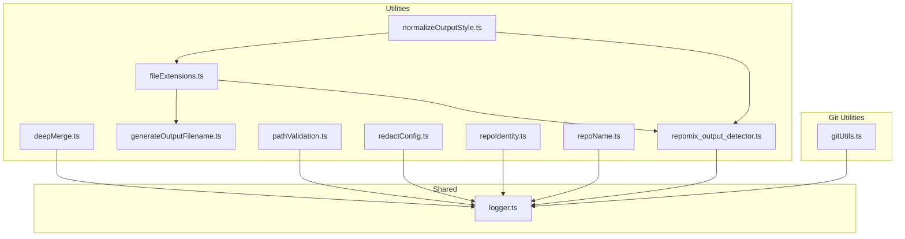
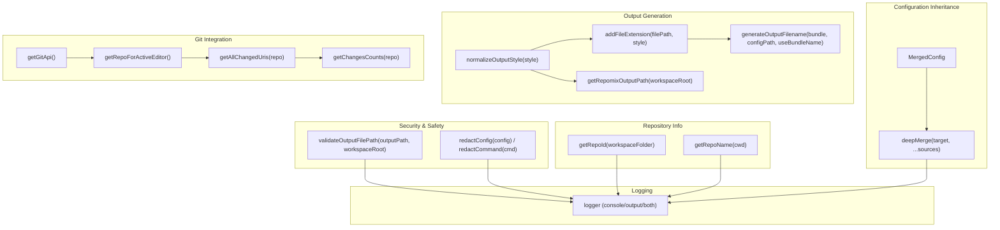
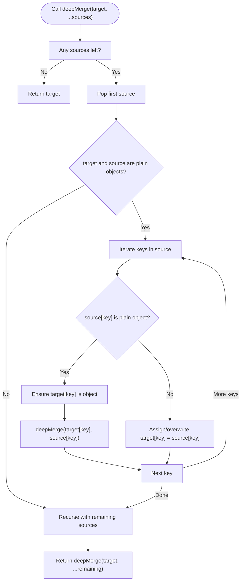
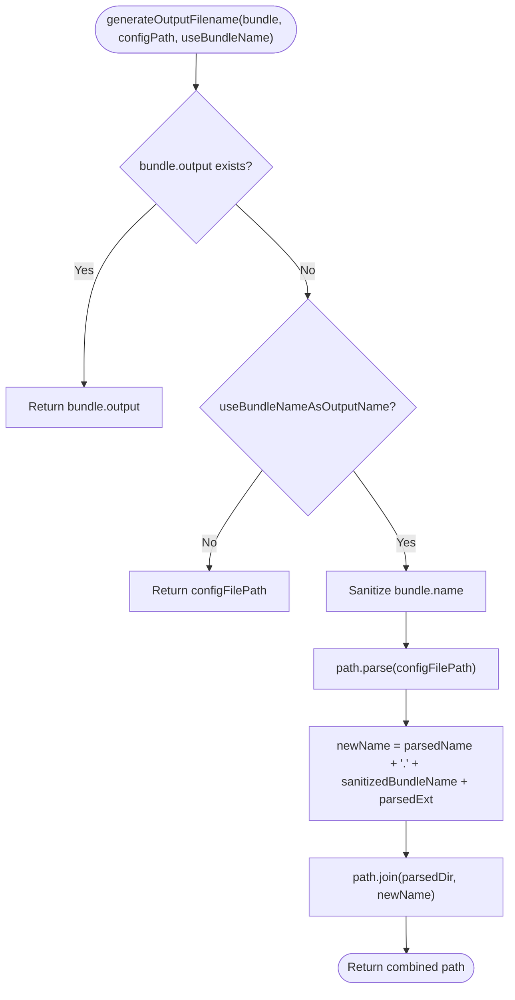
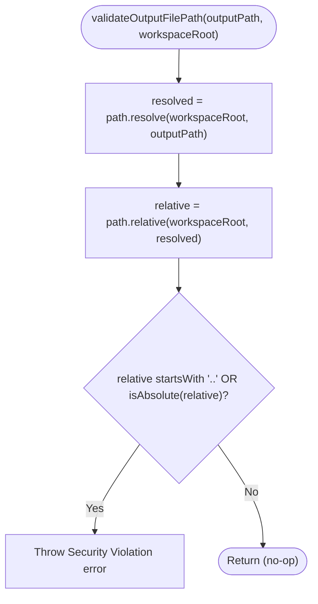
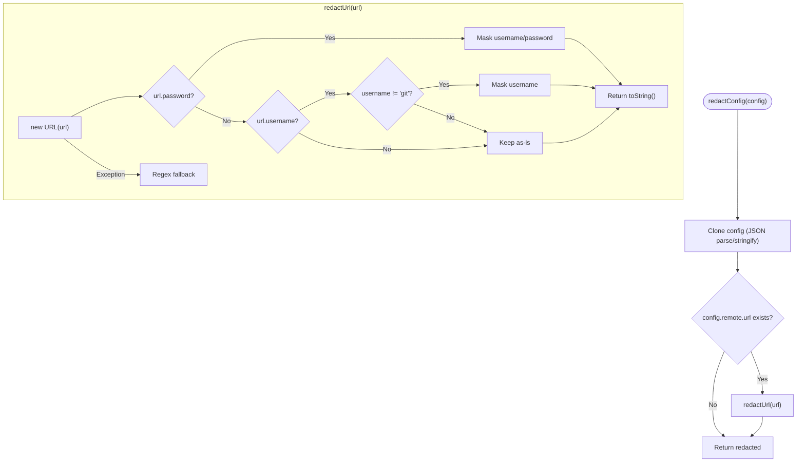
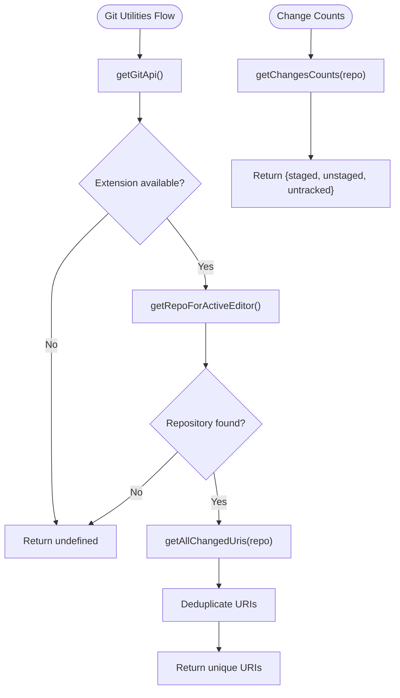
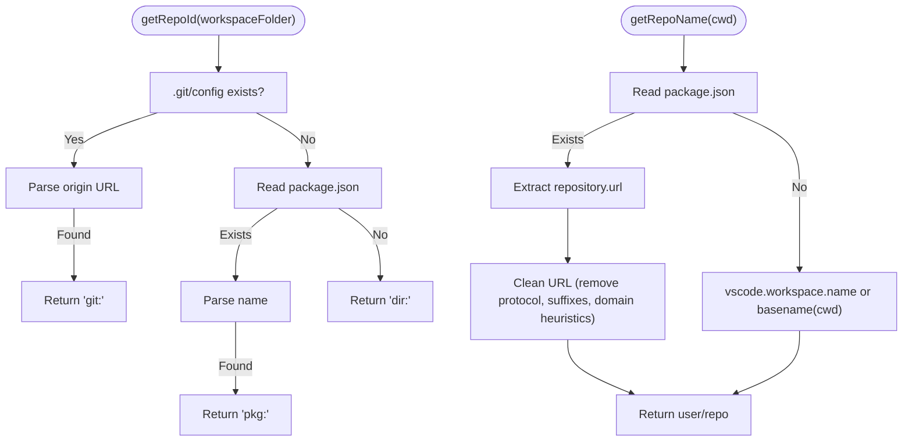
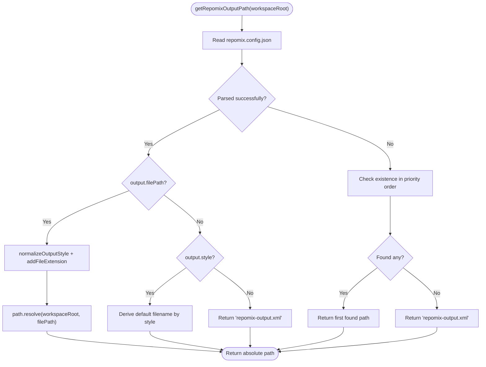
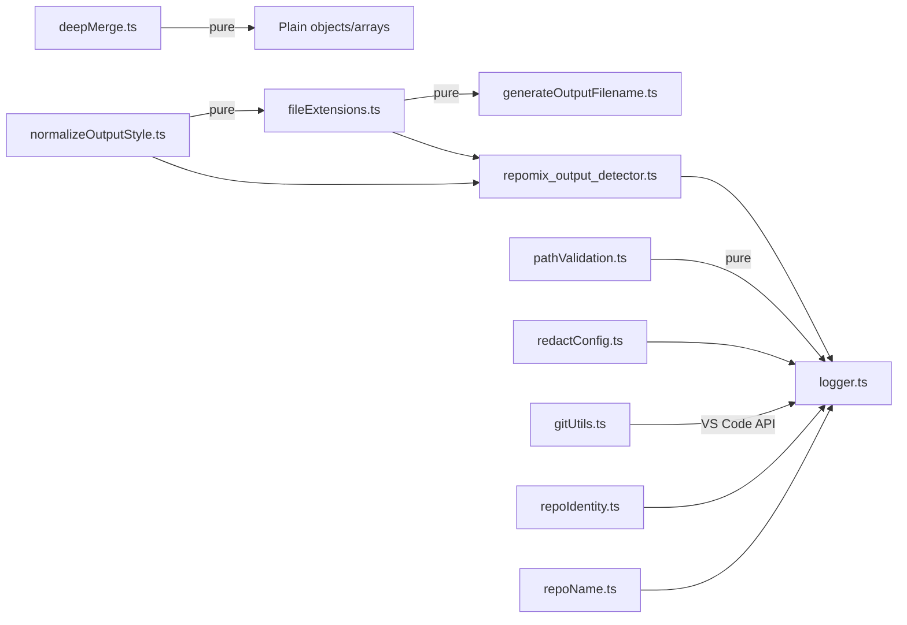

# Utilities and Helpers

<cite>
**Referenced Files in This Document**
- [deepMerge.ts](file://src/utils/deepMerge.ts)
- [fileExtensions.ts](file://src/utils/fileExtensions.ts)
- [generateOutputFilename.ts](file://src/utils/generateOutputFilename.ts)
- [normalizeOutputStyle.ts](file://src/utils/normalizeOutputStyle.ts)
- [pathValidation.ts](file://src/utils/pathValidation.ts)
- [redactConfig.ts](file://src/utils/redactConfig.ts)
- [repoIdentity.ts](file://src/utils/repoIdentity.ts)
- [repoName.ts](file://src/utils/repoName.ts)
- [repomix_output_detector.ts](file://src/utils/repomix_output_detector.ts)
- [gitUtils.ts](file://src/git/gitUtils.ts)
- [logger.ts](file://src/shared/logger.ts)
- [deepMerge.test.ts](file://src/test/utils/deepMerge.test.ts)
- [generateOutputFilename.test.ts](file://src/test/utils/generateOutputFilename.test.ts)
- [pathValidation.test.ts](file://src/test/utils/pathValidation.test.ts)
- [redactConfig.test.ts](file://src/test/utils/redactConfig.test.ts)
- [repomix_output_detector.test.ts](file://src/test/utils/repomix_output_detector.test.ts)
- [gitUtils.test.ts](file://src/test/git/gitUtils.test.ts)
</cite>

## Update Summary
**Changes Made**
- Enhanced Git utilities documentation with new getChangesCounts function that provides change statistics for UI feedback
- Updated package.json configuration details for SCM integration and activation events
- Added comprehensive coverage of change counting utilities for UI feedback
- Updated architecture diagrams to include Git integration layer with change statistics

## Table of Contents
1. [Introduction](#introduction)
2. [Project Structure](#project-structure)
3. [Core Components](#core-components)
4. [Architecture Overview](#architecture-overview)
5. [Detailed Component Analysis](#detailed-component-analysis)
6. [Dependency Analysis](#dependency-analysis)
7. [Performance Considerations](#performance-considerations)
8. [Troubleshooting Guide](#troubleshooting-guide)
9. [Conclusion](#conclusion)
10. [Appendices](#appendices)

## Introduction
This document describes the Utilities and Helpers library that underpins shared functionality across the extension. It covers:
- File extension handling and output filename generation
- Path validation for security
- Deep merge for configuration inheritance
- Redaction utilities for secure logging
- Git integration utilities for repository detection and change tracking
- Logging system with configurable levels and destinations
- Path manipulation utilities, repository identification helpers, and output detection mechanisms
- Patterns, error handling strategies, and testing approaches
- Guidance for extending utilities and maintaining consistency

## Project Structure
The utilities reside primarily under src/utils and are consumed by core modules such as bundles, CLI, files, and indexing. Shared logging is centralized under src/shared. Git utilities are located under src/git and provide comprehensive Git integration capabilities.



**Diagram sources**
- [deepMerge.ts](file://src/utils/deepMerge.ts#L1-L45)
- [fileExtensions.ts](file://src/utils/fileExtensions.ts#L1-L33)
- [generateOutputFilename.ts](file://src/utils/generateOutputFilename.ts#L1-L39)
- [normalizeOutputStyle.ts](file://src/utils/normalizeOutputStyle.ts#L1-L25)
- [pathValidation.ts](file://src/utils/pathValidation.ts#L1-L25)
- [redactConfig.ts](file://src/utils/redactConfig.ts#L1-L79)
- [repoIdentity.ts](file://src/utils/repoIdentity.ts#L1-L45)
- [repoName.ts](file://src/utils/repoName.ts#L1-L60)
- [repomix_output_detector.ts](file://src/utils/repomix_output_detector.ts#L1-L103)
- [gitUtils.ts](file://src/git/gitUtils.ts#L1-L122)
- [logger.ts](file://src/shared/logger.ts#L1-L132)

**Section sources**
- [deepMerge.ts](file://src/utils/deepMerge.ts#L1-L45)
- [fileExtensions.ts](file://src/utils/fileExtensions.ts#L1-L33)
- [generateOutputFilename.ts](file://src/utils/generateOutputFilename.ts#L1-L39)
- [normalizeOutputStyle.ts](file://src/utils/normalizeOutputStyle.ts#L1-L25)
- [pathValidation.ts](file://src/utils/pathValidation.ts#L1-L25)
- [redactConfig.ts](file://src/utils/redactConfig.ts#L1-L79)
- [repoIdentity.ts](file://src/utils/repoIdentity.ts#L1-L45)
- [repoName.ts](file://src/utils/repoName.ts#L1-L60)
- [repomix_output_detector.ts](file://src/utils/repomix_output_detector.ts#L1-L103)
- [gitUtils.ts](file://src/git/gitUtils.ts#L1-L122)
- [logger.ts](file://src/shared/logger.ts#L1-L132)

## Core Components
- Deep merge: Recursive object merger that mutates the target while preserving sources. Arrays are overwritten; nested objects are merged.
- Output style normalization: Converts user-provided style strings to canonical values.
- File extensions: Applies or swaps extensions based on normalized style, respecting custom extensions.
- Output filename generator: Produces deterministic filenames combining bundle metadata and config path.
- Path validator: Ensures output paths remain within the workspace root to prevent traversal.
- Redaction utilities: Securely redacts credentials from configuration URLs and command strings.
- Git utilities: Comprehensive Git integration including API access, repository detection, change tracking, URI deduplication, and change counting for UI feedback.
- Repository helpers: Derives stable repository identifiers and human-friendly names.
- Output detector: Resolves the Repomix output file path from configuration or filesystem defaults.
- Logging: Centralized logger with levels, emoji, formatting, and dual console/output-channel targets.

**Section sources**
- [deepMerge.ts](file://src/utils/deepMerge.ts#L1-L45)
- [normalizeOutputStyle.ts](file://src/utils/normalizeOutputStyle.ts#L1-L25)
- [fileExtensions.ts](file://src/utils/fileExtensions.ts#L1-L33)
- [generateOutputFilename.ts](file://src/utils/generateOutputFilename.ts#L1-L39)
- [pathValidation.ts](file://src/utils/pathValidation.ts#L1-L25)
- [redactConfig.ts](file://src/utils/redactConfig.ts#L1-L79)
- [gitUtils.ts](file://src/git/gitUtils.ts#L1-L122)
- [repoIdentity.ts](file://src/utils/repoIdentity.ts#L1-L45)
- [repoName.ts](file://src/utils/repoName.ts#L1-L60)
- [repomix_output_detector.ts](file://src/utils/repomix_output_detector.ts#L1-L103)
- [logger.ts](file://src/shared/logger.ts#L1-L132)

## Architecture Overview
The utilities form a cohesive layer that:
- Normalizes configuration inputs (styles, paths)
- Enforces security (path validation)
- Generates deterministic outputs (filenames, output paths)
- Protects sensitive data (redaction)
- Provides Git integration for repository detection and change tracking
- Provides consistent logging across the app



**Diagram sources**
- [deepMerge.ts](file://src/utils/deepMerge.ts#L1-L45)
- [normalizeOutputStyle.ts](file://src/utils/normalizeOutputStyle.ts#L1-L25)
- [fileExtensions.ts](file://src/utils/fileExtensions.ts#L1-L33)
- [generateOutputFilename.ts](file://src/utils/generateOutputFilename.ts#L1-L39)
- [repomix_output_detector.ts](file://src/utils/repomix_output_detector.ts#L1-L103)
- [pathValidation.ts](file://src/utils/pathValidation.ts#L1-L25)
- [redactConfig.ts](file://src/utils/redactConfig.ts#L1-L79)
- [gitUtils.ts](file://src/git/gitUtils.ts#L1-L122)
- [repoIdentity.ts](file://src/utils/repoIdentity.ts#L1-L45)
- [repoName.ts](file://src/utils/repoName.ts#L1-L60)
- [logger.ts](file://src/shared/logger.ts#L1-L132)

## Detailed Component Analysis

### Deep Merge
Purpose: Merge multiple objects into a target, mutating it in place. Nested plain objects are merged recursively; arrays are overwritten. Non-object scalars overwrite existing values.

Key behaviors:
- Mutates target; returns the mutated object
- Skips non-plain-object values
- Overwrites arrays (last-writer wins)
- Uses recursion for nested objects



**Diagram sources**
- [deepMerge.ts](file://src/utils/deepMerge.ts#L1-L45)

**Section sources**
- [deepMerge.ts](file://src/utils/deepMerge.ts#L1-L45)
- [deepMerge.test.ts](file://src/test/utils/deepMerge.test.ts#L1-L69)

### Output Style Normalization
Purpose: Convert user-provided style strings into canonical values.

Behavior:
- Accepts aliases (e.g., md, txt, text) and maps them to canonical forms
- Returns xml by default for unrecognized values

**Section sources**
- [normalizeOutputStyle.ts](file://src/utils/normalizeOutputStyle.ts#L1-L25)

### File Extension Handling
Purpose: Apply or swap file extensions based on normalized style.

Behavior:
- Uses a style-to-extension map
- If current extension is managed or absent, swaps to expected extension
- Preserves custom extensions (e.g., .myext)
- Uses path utilities to manipulate base and extension

**Section sources**
- [fileExtensions.ts](file://src/utils/fileExtensions.ts#L1-L33)
- [normalizeOutputStyle.ts](file://src/utils/normalizeOutputStyle.ts#L1-L25)

### Output Filename Generation
Purpose: Produce a deterministic output filename for bundles.

Behavior:
- If bundle defines output, use it directly
- If disabled, return the config file path
- Sanitizes bundle name (removes unsafe characters, collapses separators, trims edges)
- Preserves directory structure by parsing and rejoining path segments
- Joins sanitized bundle name with original filename and extension



**Diagram sources**
- [generateOutputFilename.ts](file://src/utils/generateOutputFilename.ts#L1-L39)

**Section sources**
- [generateOutputFilename.ts](file://src/utils/generateOutputFilename.ts#L1-L39)
- [generateOutputFilename.test.ts](file://src/test/utils/generateOutputFilename.test.ts#L1-L61)

### Path Validation
Purpose: Prevent path traversal by ensuring the resolved output path remains within the workspace root.

Behavior:
- Resolves the absolute path using the workspace root
- Computes relative path from root to resolved path
- Throws if relative path indicates traversal or cross-drive resolution



**Diagram sources**
- [pathValidation.ts](file://src/utils/pathValidation.ts#L1-L25)

**Section sources**
- [pathValidation.ts](file://src/utils/pathValidation.ts#L1-L25)
- [pathValidation.test.ts](file://src/test/utils/pathValidation.test.ts#L1-L56)

### Redaction Utilities
Purpose: Safely redact credentials from configuration and command strings.

Behavior:
- Deep clone configuration before redaction to avoid mutating originals
- For URLs:
  - If password present, mask both username and password
  - If username present but no password, mask username unless it is "git"
- For command strings:
  - Detects URL-like substrings with credentials
  - Masks user and/or password depending on presence and user value
- Falls back to regex-based masking for malformed or unusual URL structures



**Diagram sources**
- [redactConfig.ts](file://src/utils/redactConfig.ts#L1-L79)

**Section sources**
- [redactConfig.ts](file://src/utils/redactConfig.ts#L1-L79)
- [redactConfig.test.ts](file://src/test/utils/redactConfig.test.ts#L1-L138)

### Git Utilities
Purpose: Provide comprehensive Git integration capabilities including API access, repository detection, change tracking, intelligent deduplication, and change counting for UI feedback.

#### Git API Access
The `getGitApi()` function safely accesses the VS Code Git extension API:
- Checks for extension availability and activation
- Handles version mismatches gracefully
- Returns undefined with warnings on failure
- Provides user-friendly error messages

#### Repository Detection
The `getRepoForActiveEditor()` function identifies the Git repository for the currently active editor:
- Uses the active text editor's URI to find matching repository
- Falls back to the first available repository if no match found
- Handles file scheme validation
- Returns undefined when no repositories exist

#### Change Tracking
The `getAllChangedUris()` function aggregates all file changes from a repository:
- Combines staged changes (index), unstaged changes (working tree), and untracked files
- Performs intelligent deduplication using URI string keys
- Returns unique URIs to avoid processing duplicates
- Supports efficient change enumeration for bulk operations

#### Change Counting
The `getChangesCounts()` function provides UI feedback with change statistics:
- Returns counts for staged, unstaged, and untracked changes
- Enables progress indicators and status reporting
- Supports user interface updates based on repository state
- Used for logging and user feedback in the extension



**Diagram sources**
- [gitUtils.ts](file://src/git/gitUtils.ts#L32-L121)

**Section sources**
- [gitUtils.ts](file://src/git/gitUtils.ts#L1-L122)
- [gitUtils.test.ts](file://src/test/git/gitUtils.test.ts#L1-L50)

### Repository Identification and Naming
Purpose: Provide stable identifiers and friendly names for repositories.

Behavior:
- getRepoId:
  - Prefers Git remote origin URL from .git/config
  - Falls back to package.json name
  - Final fallback to workspace folder basename
- getRepoName:
  - Prefers cleaned repository URL from package.json
  - Falls back to VS Code workspace name
  - Final fallback to folder basename



**Diagram sources**
- [repoIdentity.ts](file://src/utils/repoIdentity.ts#L1-L45)
- [repoName.ts](file://src/utils/repoName.ts#L1-L60)

**Section sources**
- [repoIdentity.ts](file://src/utils/repoIdentity.ts#L1-L45)
- [repoName.ts](file://src/utils/repoName.ts#L1-L60)

### Output Detection Mechanism
Purpose: Resolve the Repomix output file path from configuration or filesystem defaults.

Behavior:
- Reads repomix.config.json
  - If output.filePath is set, applies style-based extension and resolves absolute path
  - If only output.style is set, derives default filename per style
- On parse failure or absence, checks file existence in priority order (md → txt → json → xml)
- Defaults to repomix-output.xml if nothing else matches



**Diagram sources**
- [repomix_output_detector.ts](file://src/utils/repomix_output_detector.ts#L1-L103)
- [fileExtensions.ts](file://src/utils/fileExtensions.ts#L1-L33)
- [normalizeOutputStyle.ts](file://src/utils/normalizeOutputStyle.ts#L1-L25)

**Section sources**
- [repomix_output_detector.ts](file://src/utils/repomix_output_detector.ts#L1-L103)
- [repomix_output_detector.test.ts](file://src/test/utils/repomix_output_detector.test.ts#L1-L165)

### Logging System
Purpose: Unified logging across console and VS Code output channel with configurable verbosity and formatting.

Features:
- Levels: debug, info, warn, error, success, trace, log
- Targets: console, output channel, both
- Formatting: emoji indicators, structured object inspection
- Verbosity: enable/disable debug/trace logs
- Methods: logger.console.*, logger.output.*, logger.both.*, logger.success()

```mermaid
classDiagram
class Logger {
-boolean isVerbose
-OutputChannel outputChannel
+show() void
+console
+output
+both
+success(...args) void
+setVerbose(value) void
-createLogMethods(target) object
-log(level, target, ...args) void
-addEmoji(level, message) string
-logToConsole(level, message) void
-logToOutputChannel(message) void
-formatArgs(args) string
}
class LogTargets {
<<enumeration>>
"console"
"output"
"both"
}
class LogLevels {
<<enumeration>>
"debug"
"info"
"warn"
"error"
"success"
"trace"
"log"
}
Logger --> LogTargets : "uses"
Logger --> LogLevels : "uses"
```

**Diagram sources**
- [logger.ts](file://src/shared/logger.ts#L1-L132)

**Section sources**
- [logger.ts](file://src/shared/logger.ts#L1-L132)

## Dependency Analysis
- deepMerge depends on no external modules; it operates purely on plain objects and arrays.
- normalizeOutputStyle is a pure function with no side effects.
- fileExtensions depends on normalizeOutputStyle and path utilities; it is pure aside from IO in higher-level consumers.
- generateOutputFilename depends on path utilities and bundle metadata; it is pure aside from path operations.
- pathValidation depends on path utilities; it is pure aside from IO in higher-level consumers.
- redactConfig depends on URL parsing and regex fallback; it clones input to avoid mutation.
- gitUtils depends on VS Code extension APIs and provides Git integration; it handles graceful degradation when Git is unavailable.
- repoIdentity and repoName depend on filesystem and VS Code APIs; they are asynchronous and IO-bound.
- repomix_output_detector depends on filesystem, path utilities, fileExtensions, and normalizeOutputStyle; it orchestrates IO and path decisions.
- logger is a singleton with VS Code integration and Node utilities.



**Diagram sources**
- [deepMerge.ts](file://src/utils/deepMerge.ts#L1-L45)
- [normalizeOutputStyle.ts](file://src/utils/normalizeOutputStyle.ts#L1-L25)
- [fileExtensions.ts](file://src/utils/fileExtensions.ts#L1-L33)
- [generateOutputFilename.ts](file://src/utils/generateOutputFilename.ts#L1-L39)
- [pathValidation.ts](file://src/utils/pathValidation.ts#L1-L25)
- [redactConfig.ts](file://src/utils/redactConfig.ts#L1-L79)
- [gitUtils.ts](file://src/git/gitUtils.ts#L1-L122)
- [repoIdentity.ts](file://src/utils/repoIdentity.ts#L1-L45)
- [repoName.ts](file://src/utils/repoName.ts#L1-L60)
- [repomix_output_detector.ts](file://src/utils/repomix_output_detector.ts#L1-L103)
- [logger.ts](file://src/shared/logger.ts#L1-L132)

**Section sources**
- [deepMerge.ts](file://src/utils/deepMerge.ts#L1-L45)
- [normalizeOutputStyle.ts](file://src/utils/normalizeOutputStyle.ts#L1-L25)
- [fileExtensions.ts](file://src/utils/fileExtensions.ts#L1-L33)
- [generateOutputFilename.ts](file://src/utils/generateOutputFilename.ts#L1-L39)
- [pathValidation.ts](file://src/utils/pathValidation.ts#L1-L25)
- [redactConfig.ts](file://src/utils/redactConfig.ts#L1-L79)
- [gitUtils.ts](file://src/git/gitUtils.ts#L1-L122)
- [repoIdentity.ts](file://src/utils/repoIdentity.ts#L1-L45)
- [repoName.ts](file://src/utils/repoName.ts#L1-L60)
- [repomix_output_detector.ts](file://src/utils/repomix_output_detector.ts#L1-L103)
- [logger.ts](file://src/shared/logger.ts#L1-L132)

## Performance Considerations
- deepMerge:
  - Time complexity proportional to total number of properties across nested structures; avoid extremely deep or wide structures when merging large configs.
  - Mutates target to reduce allocations; if immutability is required, clone target beforehand.
- normalizeOutputStyle:
  - O(1) string mapping; negligible cost.
- fileExtensions:
  - O(1) map lookup and string manipulation; negligible cost.
- generateOutputFilename:
  - O(n) for sanitization and path parsing; negligible for typical bundle names.
- pathValidation:
  - O(1) path operations; negligible cost.
- redactConfig/redactCommand:
  - URL parsing is O(n) in string length; regex fallback is also linear.
  - JSON cloning is O(n) in serialized config size; consider avoiding on very large configs.
- gitUtils:
  - getGitApi: O(1) with potential async activation; handles graceful failure when Git extension is unavailable.
  - getRepoForActiveEditor: O(r) where r is number of repositories; typically very fast with single repository setups.
  - getAllChangedUris: O(c) where c is total number of changes; deduplication uses Map for O(1) lookups.
  - getChangesCounts: O(1) constant time operation for retrieving change statistics.
- repoIdentity/repoName:
  - Filesystem reads are O(1) per file; ensure caching if called frequently.
- repomix_output_detector:
  - Filesystem checks are O(k) for k candidate files; minimal overhead.
- logger:
  - Formatting uses inspect; avoid logging very large objects frequently.
  - Emoji and channel append are lightweight; channel creation happens once.

## Troubleshooting Guide
Common issues and resolutions:
- Security Violation on output path:
  - Cause: Path traversal or cross-drive resolution detected.
  - Resolution: Ensure output path is relative to workspace root and does not contain traversal sequences.
  - Reference: [pathValidation.ts](file://src/utils/pathValidation.ts#L1-L25)
- Unexpected extension on output file:
  - Cause: Style mismatch or custom extension not managed.
  - Resolution: Use normalized style or rely on automatic extension application.
  - References: [normalizeOutputStyle.ts](file://src/utils/normalizeOutputStyle.ts#L1-L25), [fileExtensions.ts](file://src/utils/fileExtensions.ts#L1-L33)
- Output filename not as expected:
  - Cause: Unsafe characters in bundle name or unexpected directory structure.
  - Resolution: Verify bundle name sanitization and config file path parsing.
  - Reference: [generateOutputFilename.ts](file://src/utils/generateOutputFilename.ts#L1-L39)
- Sensitive data exposure in logs:
  - Cause: Unredacted credentials in configuration or commands.
  - Resolution: Use redaction utilities before logging.
  - References: [redactConfig.ts](file://src/utils/redactConfig.ts#L1-L79)
- Git extension not available:
  - Cause: VS Code Git extension not installed or disabled.
  - Resolution: Install/enable VS Code Git extension or use alternative file selection methods.
  - Reference: [gitUtils.ts](file://src/git/gitUtils.ts#L32-L52)
- No repository detected for active editor:
  - Cause: Active file not within any Git repository.
  - Resolution: Open file within a Git repository or manually select files.
  - Reference: [gitUtils.ts](file://src/git/gitUtils.ts#L61-L79)
- Duplicate file URIs in change tracking:
  - Cause: Same file appearing in multiple change categories.
  - Resolution: Deduplication is automatic; verify repository state and Git configuration.
  - Reference: [gitUtils.ts](file://src/git/gitUtils.ts#L95-L106)
- Output file not found:
  - Cause: repomix.config.json misconfiguration or missing files.
  - Resolution: Validate config or rely on existence fallback.
  - References: [repomix_output_detector.ts](file://src/utils/repomix_output_detector.ts#L1-L103)
- Logging not visible:
  - Cause: Verbose disabled or wrong target.
  - Resolution: Enable verbose mode and choose appropriate target.
  - Reference: [logger.ts](file://src/shared/logger.ts#L1-L132)
- Change counting not working:
  - Cause: Repository state not properly initialized or Git extension issues.
  - Resolution: Verify Git extension availability and repository state.
  - Reference: [gitUtils.ts](file://src/git/gitUtils.ts#L115-L121)

**Section sources**
- [pathValidation.ts](file://src/utils/pathValidation.ts#L1-L25)
- [normalizeOutputStyle.ts](file://src/utils/normalizeOutputStyle.ts#L1-L25)
- [fileExtensions.ts](file://src/utils/fileExtensions.ts#L1-L33)
- [generateOutputFilename.ts](file://src/utils/generateOutputFilename.ts#L1-L39)
- [redactConfig.ts](file://src/utils/redactConfig.ts#L1-L79)
- [gitUtils.ts](file://src/git/gitUtils.ts#L1-L122)
- [repomix_output_detector.ts](file://src/utils/repomix_output_detector.ts#L1-L103)
- [logger.ts](file://src/shared/logger.ts#L1-L132)

## Conclusion
The Utilities and Helpers library provides robust, reusable building blocks for configuration inheritance, output generation, security validation, credential redaction, Git integration, repository identification, and logging. Its design emphasizes:
- Pure functions where possible
- Clear separation of concerns
- Strong security defaults
- Comprehensive Git integration with graceful fallbacks
- Consistent logging and error handling
- Extensibility through small, focused modules

The addition of Git utilities significantly enhances the extension's capability to integrate with version control systems, enabling features like automated change detection, bulk file operations based on repository state, and UI feedback through change counting utilities. The new getChangesCounts function provides essential statistics for user interface updates and progress reporting.

## Appendices

### Testing Approaches
- Unit tests validate behavior for each utility:
  - deepMerge: mutation semantics, primitive overwrites, null/undefined handling
  - generateOutputFilename: bundle output override, sanitization, directory preservation
  - pathValidation: traversal detection, absolute path safety
  - redactConfig/redactCommand: URL parsing, token masking, regex fallback
  - gitUtils: API access, repository detection, change tracking, deduplication, change counting
  - repomix_output_detector: config precedence, style-based extension, existence fallback
- Test fixtures use temporary directories and controlled filesystem states.

**Section sources**
- [deepMerge.test.ts](file://src/test/utils/deepMerge.test.ts#L1-L69)
- [generateOutputFilename.test.ts](file://src/test/utils/generateOutputFilename.test.ts#L1-L61)
- [pathValidation.test.ts](file://src/test/utils/pathValidation.test.ts#L1-L56)
- [redactConfig.test.ts](file://src/test/utils/redactConfig.test.ts#L1-L138)
- [gitUtils.test.ts](file://src/test/git/gitUtils.test.ts#L1-L50)
- [repomix_output_detector.test.ts](file://src/test/utils/repomix_output_detector.test.ts#L1-L165)

### Extending Utilities and Maintaining Consistency
Guidelines:
- Keep functions pure when feasible; isolate side effects (IO, logging) behind explicit boundaries.
- Add comprehensive unit tests covering edge cases (nulls, empty strings, invalid inputs).
- Prefer defensive cloning for mutable inputs (e.g., redaction) to avoid unintended mutations.
- Use central logging for diagnostics; avoid ad-hoc console usage.
- Normalize inputs early (e.g., styles) to minimize branching later.
- Document cross-platform considerations (paths, drives) explicitly in comments and tests.
- For Git integration, handle extension availability gracefully and provide fallback behavior.
- Maintain backward compatibility when extending existing utility functions.
- Follow the established patterns for error handling and logging across all utility modules.
- When adding new Git utilities, ensure they integrate with the existing change tracking infrastructure and provide meaningful UI feedback.

### Package.json Configuration Details
The extension includes comprehensive SCM integration through package.json configuration:

**Activation Events:**
- `onCommand:repomixRunner.copyAllGitChanges` - Triggers when users want to copy all Git changes
- `onStartupFinished` - Activates after VS Code startup completes
- Standard commands for bundle management and file operations

**SCM Menu Contributions:**
- Resource state context menu for Git changes with "Copy as Markdown to Clipboard" action
- SCM title menu with "Copy All Changed Files to Clipboard" button
- Conditional visibility based on Git provider status

**Section sources**
- [package.json](file://package.json#L20-L30)
- [package.json](file://package.json#L529-L542)