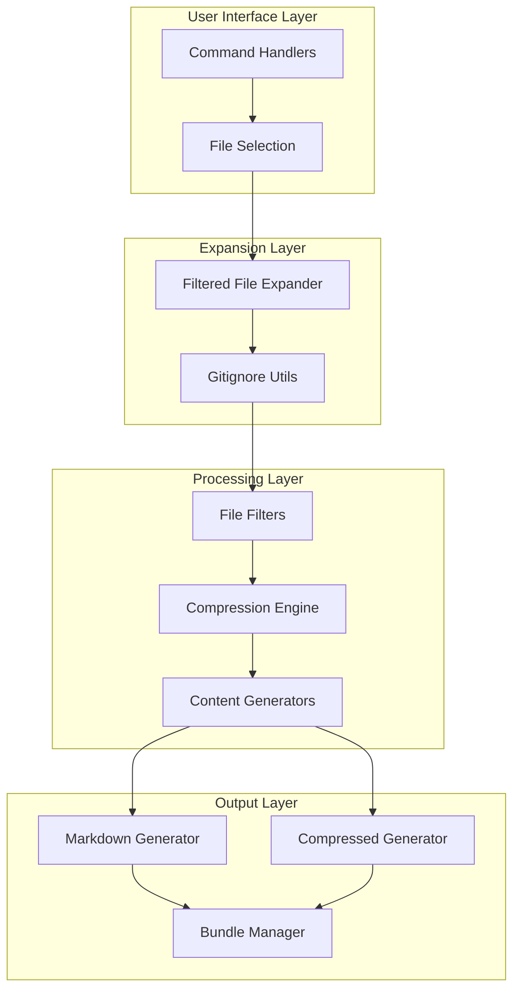
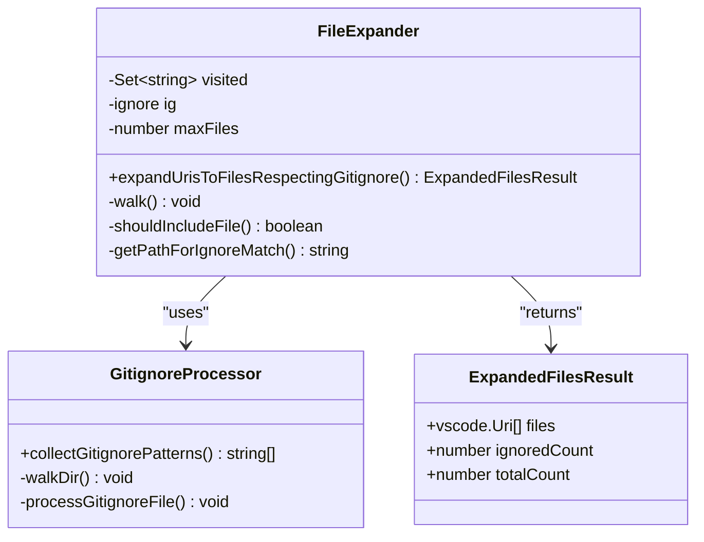
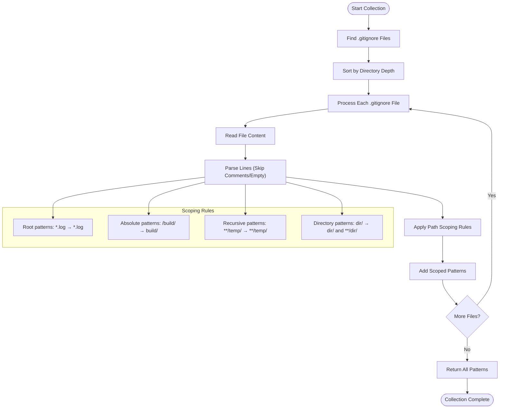
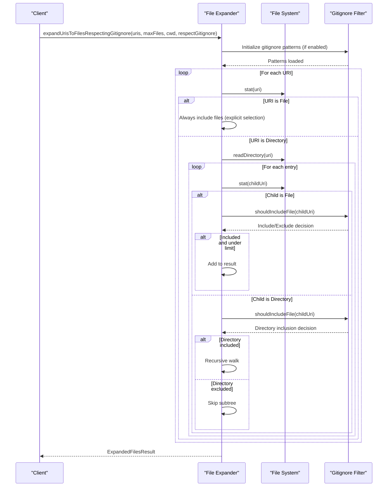
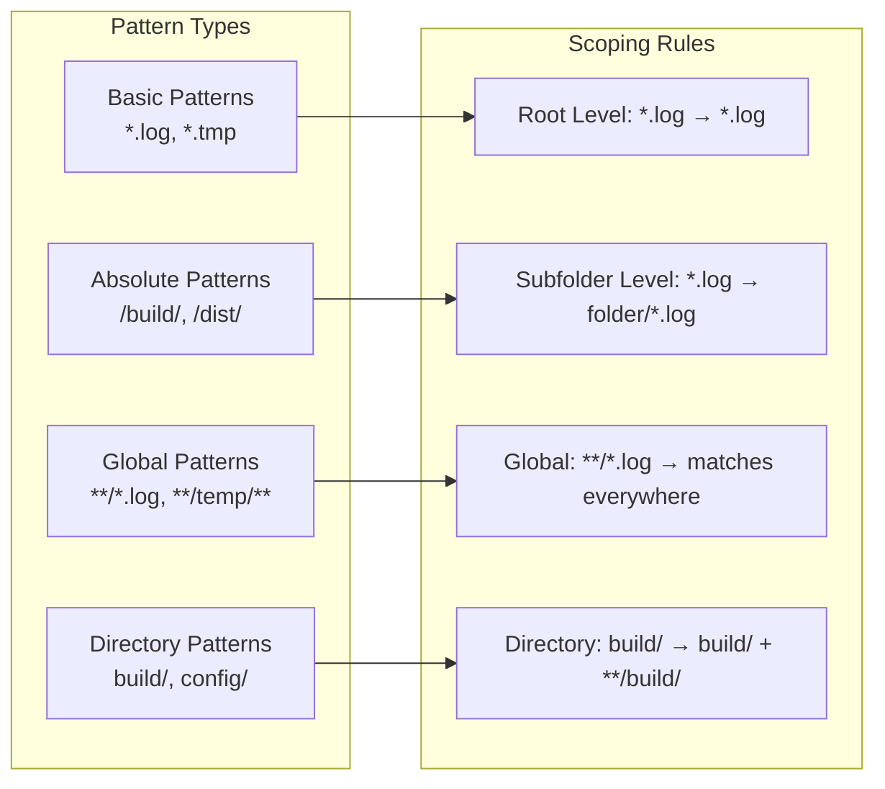
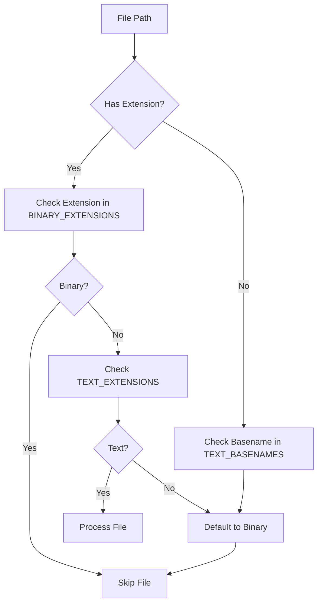
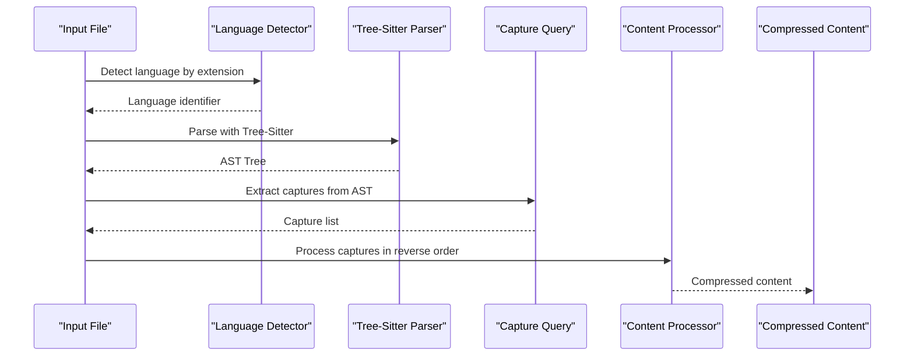
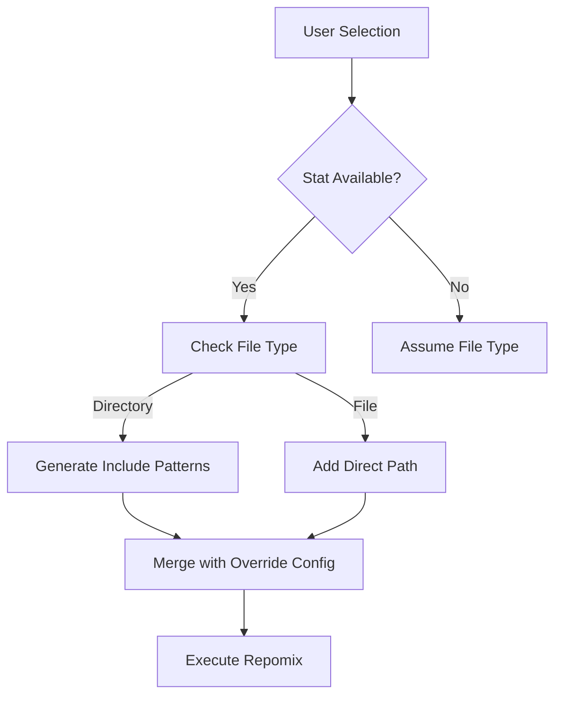

# File Expansion and Filtering

<cite>
**Referenced Files in This Document**
- [filteredFileExpander.ts](file://src/core/files/filteredFileExpander.ts)
- [gitignoreUtils.ts](file://src/core/files/gitignoreUtils.ts)
- [markdownGenerator.ts](file://src/core/files/markdownGenerator.ts)
- [compressedMarkdownGenerator.ts](file://src/core/compressedMarkdownGenerator.ts)
- [compressFile.ts](file://src/core/compression/compressFile.ts)
- [runRepomixOnSelectedFiles.ts](file://src/commands/runRepomixOnSelectedFiles.ts)
- [runRepomixOnOpenFiles.ts](file://src/commands/runRepomixOnOpenFiles.ts)
- [runRepomix.ts](file://src/commands/runRepomix.ts)
- [configSchema.ts](file://src/config/configSchema.ts)
- [filteredFileExpander.test.ts](file://src/test/core/files/filteredFileExpander.test.ts)
</cite>

## Table of Contents
1. [Introduction](#introduction)
2. [System Architecture](#system-architecture)
3. [Core Components](#core-components)
4. [File Expansion Engine](#file-expansion-engine)
5. [Gitignore Processing System](#gitignore-processing-system)
6. [File Filtering Pipeline](#file-filtering-pipeline)
7. [Compression and Content Generation](#compression-and-content-generation)
8. [Command Integration](#command-integration)
9. [Testing and Validation](#testing-and-validation)
10. [Performance Considerations](#performance-considerations)
11. [Troubleshooting Guide](#troubleshooting-guide)
12. [Conclusion](#conclusion)

## Introduction

The File Expansion and Filtering system is a sophisticated mechanism within the Repomix Runner that handles the discovery, filtering, and processing of files from a codebase. This system intelligently expands URI references (files and folders) while respecting `.gitignore` rules, manages file limits, and prepares content for AI processing through various compression and filtering strategies.

The system operates as a multi-layered pipeline that transforms user-selected files and folders into optimized content suitable for AI analysis, ensuring that only relevant files are processed while maintaining performance and respecting repository configuration.

## System Architecture

The File Expansion and Filtering system follows a layered architecture pattern with clear separation of concerns:

**Diagram sources**
- [filteredFileExpander.ts](file://src/core/files/filteredFileExpander.ts#L29-L169)
- [gitignoreUtils.ts](file://src/core/files/gitignoreUtils.ts#L17-L101)
- [markdownGenerator.ts](file://src/core/files/markdownGenerator.ts#L105-L219)

## Core Components

### File Expansion Engine

The core expansion engine is built around the `expandUrisToFilesRespectingGitignore` function, which serves as the primary orchestrator for file discovery and filtering.

**Diagram sources**
- [filteredFileExpander.ts](file://src/core/files/filteredFileExpander.ts#L9-L16)
- [filteredFileExpander.ts](file://src/core/files/filteredFileExpander.ts#L29-L169)
- [gitignoreUtils.ts](file://src/core/files/gitignoreUtils.ts#L17-L101)

**Section sources**
- [filteredFileExpander.ts](file://src/core/files/filteredFileExpander.ts#L29-L169)

### Gitignore Processing System

The gitignore processing system implements comprehensive pattern collection and scoping according to Git's specification:

**Diagram sources**
- [gitignoreUtils.ts](file://src/core/files/gitignoreUtils.ts#L17-L101)

**Section sources**
- [gitignoreUtils.ts](file://src/core/files/gitignoreUtils.ts#L17-L101)

## File Expansion Engine

The file expansion engine implements a sophisticated recursive traversal algorithm that respects various constraints and optimization strategies:

### Core Expansion Algorithm

**Diagram sources**
- [filteredFileExpander.ts](file://src/core/files/filteredFileExpander.ts#L78-L125)

### Key Features

1. **Explicit File Selection Preservation**: Files explicitly selected by users are always included, regardless of gitignore rules
2. **Directory Tree Optimization**: Entire directory subtrees are skipped when the directory itself is ignored
3. **Maximum File Limit Enforcement**: Prevents memory issues with large repositories
4. **Visited Node Tracking**: Prevents infinite loops in case of symbolic links or circular references
5. **Comprehensive Error Handling**: Graceful degradation when encountering unreadable files or directories

**Section sources**
- [filteredFileExpander.ts](file://src/core/files/filteredFileExpander.ts#L78-L125)

## Gitignore Processing System

The gitignore processing system implements Git's pattern matching specification with advanced scoping rules:

### Pattern Collection Process

**Diagram sources**
- [gitignoreUtils.ts](file://src/core/files/gitignoreUtils.ts#L65-L90)

### Pattern Processing Logic

The system processes patterns according to Git's specification:

1. **Basic Patterns**: Applied recursively to all subdirectories
2. **Absolute Patterns**: Relative to the directory containing the `.gitignore` file
3. **Global Patterns**: Use `**/` for matching anywhere in the tree
4. **Directory Patterns**: Match both the directory and all its contents

**Section sources**
- [gitignoreUtils.ts](file://src/core/files/gitignoreUtils.ts#L65-L90)

## File Filtering Pipeline

The file filtering pipeline implements multiple layers of content filtering and processing:

### Binary File Detection

**Diagram sources**
- [markdownGenerator.ts](file://src/core/files/markdownGenerator.ts#L78-L88)

### Content Processing Strategies

The system supports multiple content processing strategies:

1. **Plain Text Processing**: Direct file reading with binary detection
2. **AST-Based Compression**: Language-aware content reduction using Tree-Sitter parsers
3. **Structured Output Generation**: Tiered content organization for AI processing

**Section sources**
- [markdownGenerator.ts](file://src/core/files/markdownGenerator.ts#L78-L147)
- [compressedMarkdownGenerator.ts](file://src/core/compressedMarkdownGenerator.ts#L11-L59)

## Compression and Content Generation

The compression system provides intelligent content reduction while preserving semantic meaning:

### Compression Pipeline

**Diagram sources**
- [compressFile.ts](file://src/core/compression/compressFile.ts#L25-L84)

### Compression Capabilities

The compression system supports multiple programming languages with language-specific strategies:

- **JavaScript/TypeScript**: Function bodies, class structures, import/export statements
- **Python**: Function definitions, class hierarchies, module imports
- **Java/C#**: Method bodies, class definitions, namespace declarations
- **Rust**: Function bodies, struct definitions, module boundaries
- **Dart**: Function bodies, class structures, import statements

**Section sources**
- [compressFile.ts](file://src/core/compression/compressFile.ts#L25-L84)

## Command Integration

The file expansion system integrates seamlessly with various command handlers:

### Selected Files Command

The `runRepomixOnSelectedFiles` command processes user-selected files with intelligent pattern generation:

**Diagram sources**
- [runRepomixOnSelectedFiles.ts](file://src/commands/runRepomixOnSelectedFiles.ts#L44-L92)

### Open Files Command

The `runRepomixOnOpenFiles` command automatically detects and processes currently open files:

**Section sources**
- [runRepomixOnSelectedFiles.ts](file://src/commands/runRepomixOnSelectedFiles.ts#L26-L101)
- [runRepomixOnOpenFiles.ts](file://src/commands/runRepomixOnOpenFiles.ts#L8-L29)

## Testing and Validation

The system includes comprehensive test coverage validating critical functionality:

### Test Coverage Areas

1. **Gitignore Respect**: Verifies `.gitignore` patterns are properly applied
2. **Directory Filtering**: Ensures ignored directories are skipped entirely
3. **Explicit Selection**: Confirms explicitly selected files bypass filtering
4. **Max File Limits**: Validates performance constraints are enforced
5. **Malformed Patterns**: Tests graceful handling of invalid patterns
6. **Nested Structures**: Handles complex directory hierarchies

### Test Validation Examples

The test suite validates scenarios including:
- Root `.gitignore` pattern application
- Subfolder `.gitignore` pattern scoping
- Nested directory structure handling
- Mixed file types processing
- Error condition handling

**Section sources**
- [filteredFileExpander.test.ts](file://src/test/core/files/filteredFileExpander.test.ts#L24-L212)

## Performance Considerations

The system implements several optimization strategies:

### Memory Management
- **Visited Node Tracking**: Prevents redundant processing of files
- **Maximum File Limits**: Controls memory usage for large repositories
- **Lazy Loading**: Gitignore patterns are loaded only when needed

### I/O Optimization
- **Directory Tree Skipping**: Entire subtrees are bypassed when ignored
- **Early Termination**: Processing stops when file limits are reached
- **Efficient Pattern Matching**: Optimized gitignore pattern application

### Concurrency Considerations
- **Sequential Processing**: Maintains deterministic behavior
- **Error Containment**: Individual file failures don't affect overall processing
- **Resource Cleanup**: Proper resource deallocation on completion

## Troubleshooting Guide

### Common Issues and Solutions

**Issue**: Files not appearing in output despite being selected
- **Cause**: Gitignore patterns excluding files
- **Solution**: Check `.gitignore` rules or disable gitignore filtering

**Issue**: Performance problems with large repositories
- **Cause**: Excessive file count or deep directory structures
- **Solution**: Adjust `maxFiles` limit or use more specific include patterns

**Issue**: Binary files causing processing failures
- **Cause**: Unsupported file formats
- **Solution**: Binary files are automatically skipped; verify file extensions

**Issue**: Permission errors accessing certain directories
- **Cause**: Insufficient filesystem permissions
- **Solution**: Check directory permissions or exclude problematic paths

### Debug Information

The system provides comprehensive logging:
- File expansion statistics
- Gitignore pattern loading information
- Processing errors and warnings
- Performance metrics

**Section sources**
- [filteredFileExpander.ts](file://src/core/files/filteredFileExpander.ts#L46-L48)
- [gitignoreUtils.ts](file://src/core/files/gitignoreUtils.ts#L40-L43)

## Conclusion

The File Expansion and Filtering system provides a robust, efficient, and intelligent solution for processing files in codebases. Through its multi-layered approach combining gitignore-aware expansion, comprehensive filtering, and intelligent compression, it ensures that only relevant content reaches AI processing systems while maintaining performance and reliability.

The system's design emphasizes:
- **Accuracy**: Comprehensive gitignore compliance with proper scoping rules
- **Performance**: Optimized traversal and filtering mechanisms
- **Reliability**: Graceful error handling and fallback strategies
- **Flexibility**: Support for multiple processing modes and output formats

This foundation enables effective AI-assisted code analysis while respecting repository configuration and maintaining optimal performance characteristics.