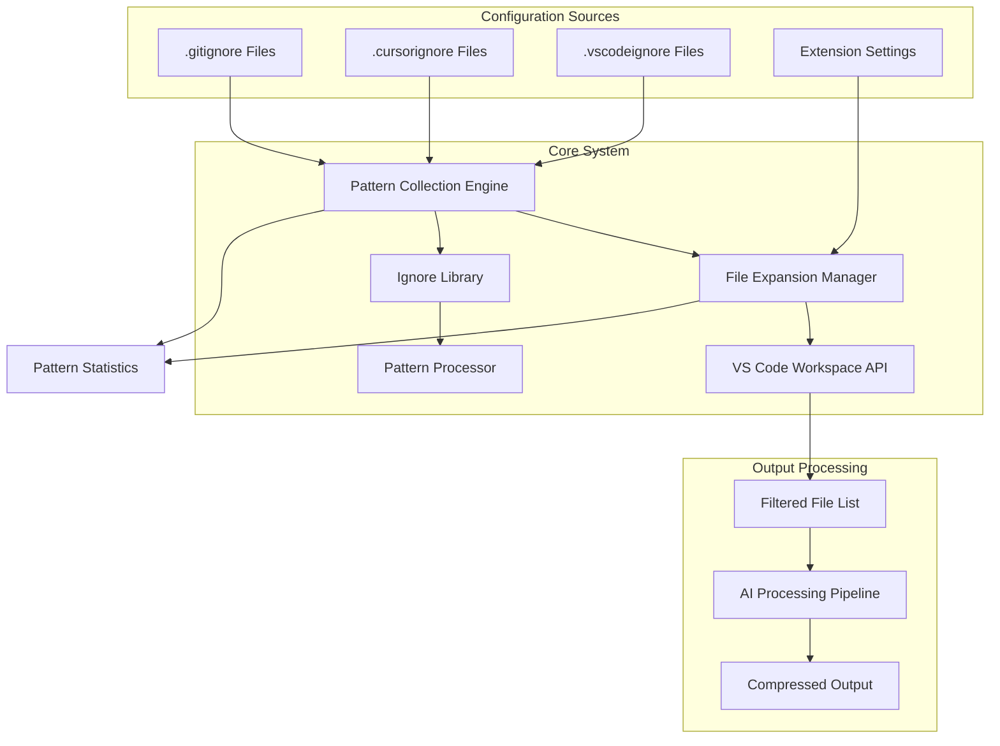
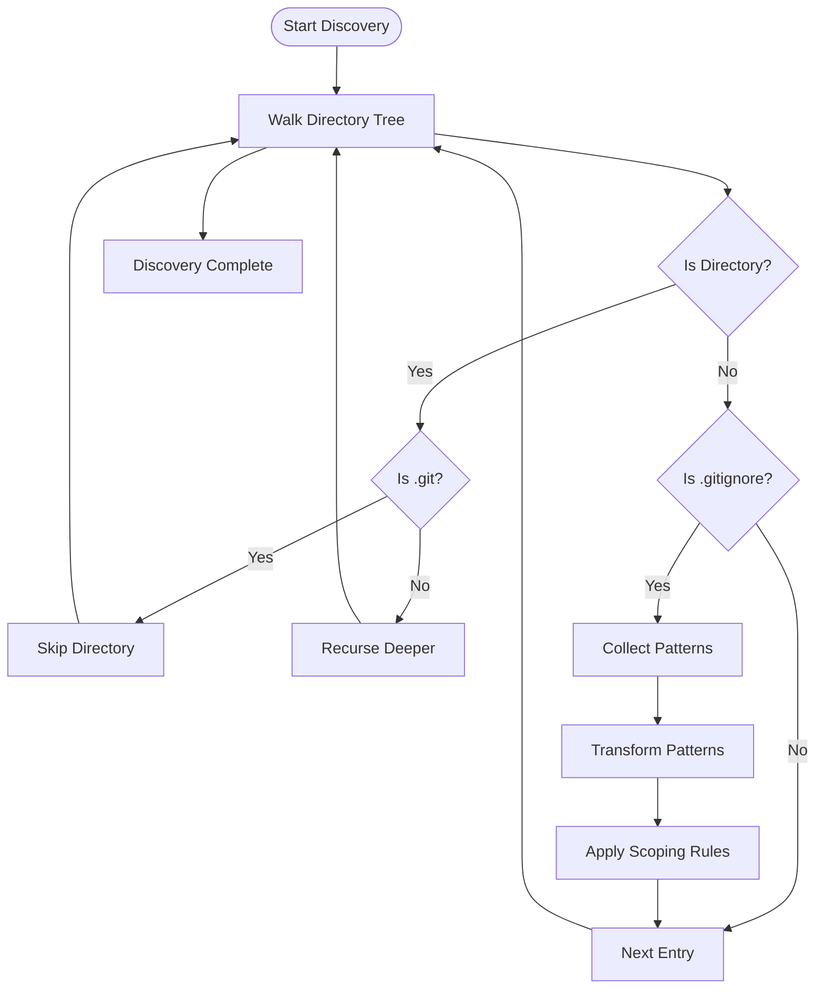
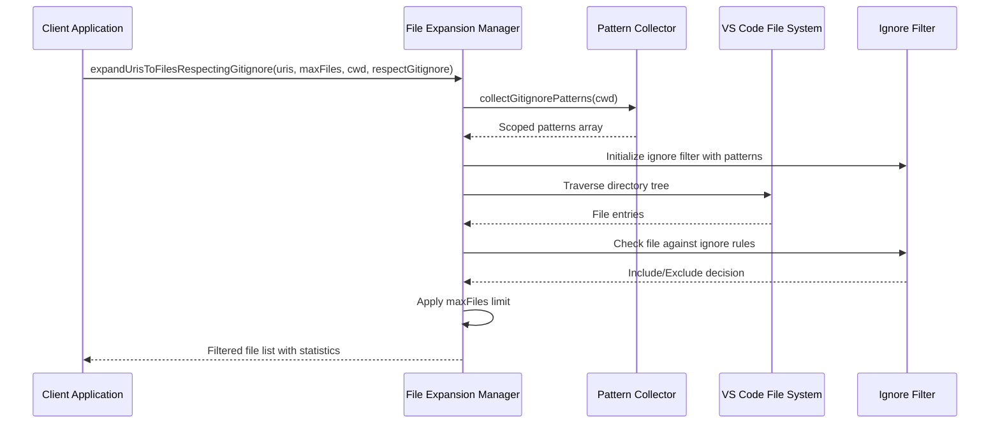

# Gitignore Pattern Collection System

<cite>
**Referenced Files in This Document**
- [gitignoreUtils.ts](file://src/core/files/gitignoreUtils.ts)
- [filteredFileExpander.ts](file://src/core/files/filteredFileExpander.ts)
- [tools.ts](file://src/agent/tools.ts)
- [gitignoreUtils.test.ts](file://src/test/core/files/gitignoreUtils.test.ts)
- [filteredFileExpander.test.ts](file://src/test/core/files/filteredFileExpander.test.ts)
- [.gitignore](file://.gitignore)
- [.cursorignore](file://.cursorignore)
- [.vscodeignore](file://.vscodeignore)
- [package.json](file://package.json)
- [logger.ts](file://src/shared/logger.ts)
- [glob-gitignore.d.ts](file://src/types/glob-gitignore.d.ts)
</cite>

## Table of Contents
1. [Introduction](#introduction)
2. [System Architecture](#system-architecture)
3. [Core Components](#core-components)
4. [Pattern Collection Engine](#pattern-collection-engine)
5. [File Expansion System](#file-expansion-system)
6. [Integration Points](#integration-points)
7. [Testing Framework](#testing-framework)
8. [Configuration Management](#configuration-management)
9. [Performance Analysis](#performance-analysis)
10. [Troubleshooting Guide](#troubleshooting-guide)
11. [Conclusion](#conclusion)

## Introduction

The Gitignore Pattern Collection System is a sophisticated file filtering mechanism designed to intelligently discover, process, and apply .gitignore patterns across large codebases. This system serves as a critical component in the Repomix Runner Plus extension, enabling precise control over which files are included or excluded during AI-powered code processing operations.

The system operates on three primary principles: comprehensive pattern discovery, intelligent scoping, and efficient filtering. It recursively traverses directory trees to locate all .gitignore files, transforms their patterns into a unified format, and applies them to filter file selections while maintaining proper precedence and scope rules.

## System Architecture

The Gitignore Pattern Collection System is built around a modular architecture that separates concerns between pattern discovery, processing, and application. The system integrates seamlessly with VS Code's native file APIs while providing enhanced filtering capabilities beyond what the standard workspace.findFiles API offers.

**Diagram sources**
- [gitignoreUtils.ts](file://src/core/files/gitignoreUtils.ts#L17-L100)
- [filteredFileExpander.ts](file://src/core/files/filteredFileExpander.ts#L29-L169)

## Core Components

### Pattern Collection Engine

The heart of the system lies in the `collectGitignorePatterns` function, which performs recursive discovery and processing of .gitignore files throughout the repository structure. This engine implements sophisticated pattern transformation logic that ensures proper scoping and precedence according to git's ignore specification.

**Key Features:**
- Recursive directory traversal with depth-based sorting
- Intelligent pattern transformation and scoping
- Support for absolute, relative, and global patterns
- Comprehensive error handling and logging

### File Expansion Manager

The `expandUrisToFilesRespectingGitignore` function orchestrates the file expansion process, combining pattern collection with VS Code's native file system operations. This component maintains file statistics, handles explicit selection overrides, and optimizes performance through directory-level filtering.

**Primary Responsibilities:**
- Coordinate between pattern collection and file system operations
- Maintain accurate file statistics and filtering metrics
- Handle edge cases like explicitly selected files and permission errors
- Optimize traversal performance by skipping ignored directories

### Integration Layer

The system integrates with multiple components including the agent tools for workspace file retrieval and the broader extension configuration system. This layer ensures seamless operation across different user workflows and command contexts.

**Section sources**
- [gitignoreUtils.ts](file://src/core/files/gitignoreUtils.ts#L17-L100)
- [filteredFileExpander.ts](file://src/core/files/filteredFileExpander.ts#L29-L169)

## Pattern Collection Engine

The pattern collection engine implements a comprehensive algorithm for discovering and processing .gitignore patterns across nested directory structures. The system follows git's official ignore specification while adding intelligent scoping mechanisms.

### Discovery Algorithm

The engine employs a depth-first recursive traversal to locate all .gitignore files in the repository. The discovery process prioritizes files based on their directory depth, ensuring that root-level patterns take precedence over nested patterns.

**Diagram sources**
- [gitignoreUtils.ts](file://src/core/files/gitignoreUtils.ts#L23-L46)

### Pattern Transformation Logic

The system implements sophisticated pattern transformation rules that ensure proper scoping and precedence:

**Pattern Types and Transformations:**
- **Absolute Patterns** (`/pattern`): Converted to relative paths based on .gitignore location
- **Global Patterns** (`**/pattern`): Preserved as-is for cross-directory matching
- **Directory Patterns** (`pattern/`): Added both as directory-specific and recursive variants
- **Relative Patterns** (`pattern`): Added with both local and recursive scopes

**Section sources**
- [gitignoreUtils.ts](file://src/core/files/gitignoreUtils.ts#L65-L90)

## File Expansion System

The file expansion system provides a sophisticated mechanism for converting URI collections into filtered file lists while respecting .gitignore rules. This system maintains performance optimization through intelligent directory traversal and selective filtering.

### Expansion Workflow

The expansion process follows a carefully orchestrated sequence that balances accuracy with performance:

**Diagram sources**
- [filteredFileExpander.ts](file://src/core/files/filteredFileExpander.ts#L29-L169)

### Performance Optimizations

The system implements several performance optimizations to handle large repositories efficiently:

**Directory-Level Filtering:** When a directory matches .gitignore patterns, the entire subtree is skipped to minimize file system operations.

**Explicit Selection Override:** Files explicitly selected by users are always included, regardless of .gitignore rules, preserving user intent.

**Statistical Tracking:** The system maintains accurate counts of total files, included files, and ignored files for reporting and debugging purposes.

**Section sources**
- [filteredFileExpander.ts](file://src/core/files/filteredFileExpander.ts#L78-L125)

## Integration Points

The Gitignore Pattern Collection System integrates with multiple extension components to provide comprehensive file filtering capabilities across different user workflows.

### Agent Tools Integration

The system integrates with the agent tools to provide enhanced workspace file retrieval. When .gitignore patterns are detected, the system switches from VS Code's native filtering to custom ignore-based filtering for greater precision.

### Configuration System Integration

The system respects extension configuration settings that control whether .gitignore patterns are applied during file processing operations.

### Logging and Monitoring

Comprehensive logging is implemented throughout the system to provide visibility into pattern loading, filtering decisions, and performance metrics.

**Section sources**
- [tools.ts](file://src/agent/tools.ts#L11-L104)
- [logger.ts](file://src/shared/logger.ts#L44-L103)

## Testing Framework

The system includes comprehensive test coverage that validates pattern collection, transformation, and filtering behavior across various scenarios.

### Test Categories

**Pattern Collection Tests:** Validate discovery and transformation of .gitignore patterns in various directory structures and configurations.

**File Expansion Tests:** Verify filtering behavior, performance optimizations, and edge case handling in file expansion operations.

**Integration Tests:** Ensure proper coordination between pattern collection and file expansion components.

### Test Scenarios

The testing framework covers critical scenarios including nested directory structures, pattern precedence, explicit file selection overrides, and error condition handling.

**Section sources**
- [gitignoreUtils.test.ts](file://src/test/core/files/gitignoreUtils.test.ts#L1-L150)
- [filteredFileExpander.test.ts](file://src/test/core/files/filteredFileExpander.test.ts#L35-L212)

## Configuration Management

The system supports multiple configuration sources that influence file filtering behavior:

### Supported Configuration Files

**.gitignore:** Standard git ignore patterns for repository-wide filtering
**.cursorignore:** Cursor editor-specific ignore patterns  
**.vscodeignore:** VS Code-specific ignore patterns

Each configuration type contributes to the overall filtering strategy while maintaining appropriate precedence and scope rules.

### Extension Settings Integration

The system respects extension configuration settings that control .gitignore usage, default pattern application, and custom pattern inclusion.

**Section sources**
- [.gitignore](file://.gitignore#L1-L26)
- [.cursorignore](file://.cursorignore#L1-L74)
- [.vscodeignore](file://.vscodeignore#L1-L62)
- [package.json](file://package.json#L194-L213)

## Performance Analysis

The Gitignore Pattern Collection System is optimized for performance in large-scale repository environments through several key strategies:

### Memory Efficiency

Pattern collection uses streaming file reading and incremental processing to minimize memory footprint during large repository traversal.

### Computational Complexity

The system achieves O(n log n) complexity for pattern processing, where n is the number of discovered patterns, primarily due to the sorting operation for depth-based precedence.

### I/O Optimization

Intelligent directory traversal minimizes file system calls by leveraging ignore patterns to skip entire directory subtrees when possible.

## Troubleshooting Guide

### Common Issues and Solutions

**Pattern Not Applied:** Verify that .gitignore files are located in the correct directory structure and that the respectGitignore setting is enabled.

**Performance Degradation:** Check for malformed .gitignore patterns that may cause processing errors and trigger fallback behavior.

**Permission Errors:** The system gracefully handles unreadable directories and files, logging warnings and continuing operation.

### Diagnostic Information

The system provides comprehensive logging throughout the pattern collection and filtering process, including pattern counts, processing statistics, and error conditions.

**Section sources**
- [gitignoreUtils.ts](file://src/core/files/gitignoreUtils.ts#L40-L43)
- [filteredFileExpander.ts](file://src/core/files/filteredFileExpander.ts#L122-L124)

## Conclusion

The Gitignore Pattern Collection System represents a sophisticated solution for intelligent file filtering in large-scale development environments. By combining comprehensive pattern discovery, intelligent transformation logic, and performance-optimized processing, the system provides reliable and efficient file filtering capabilities that enhance the overall user experience in AI-powered code processing workflows.

The modular architecture ensures maintainability and extensibility, while comprehensive testing and logging provide confidence in system reliability across diverse repository configurations and user scenarios.