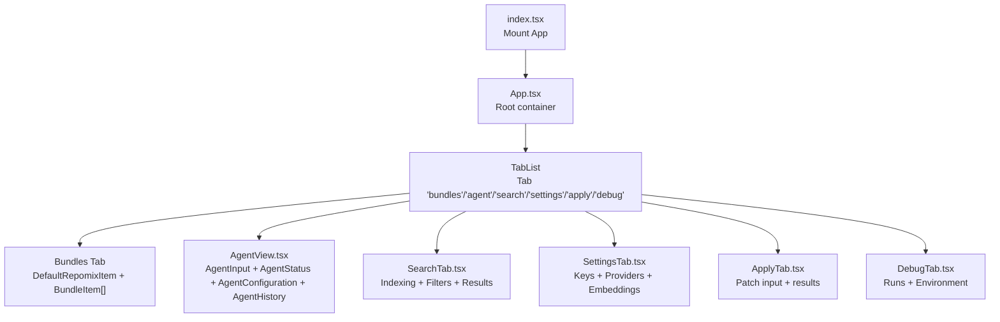
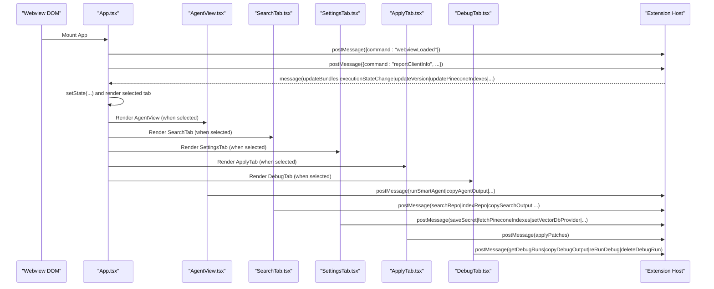
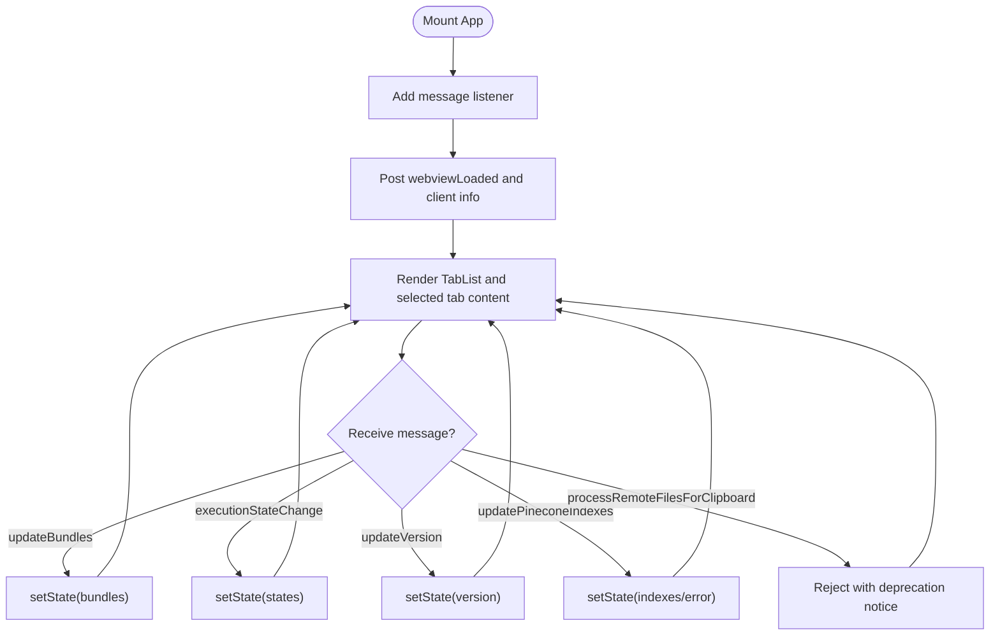
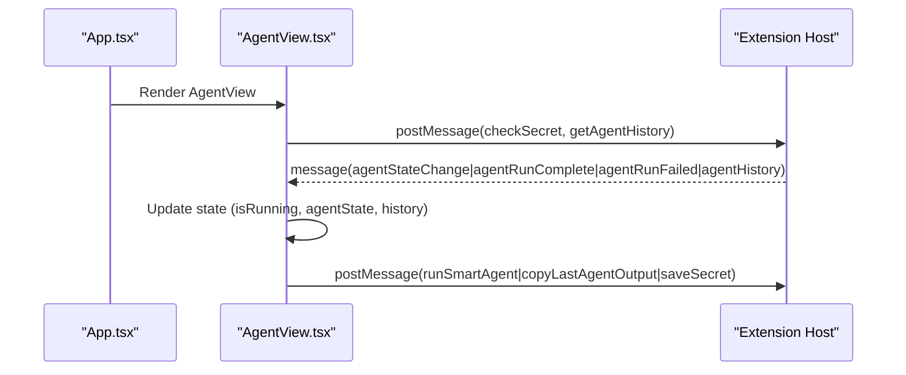
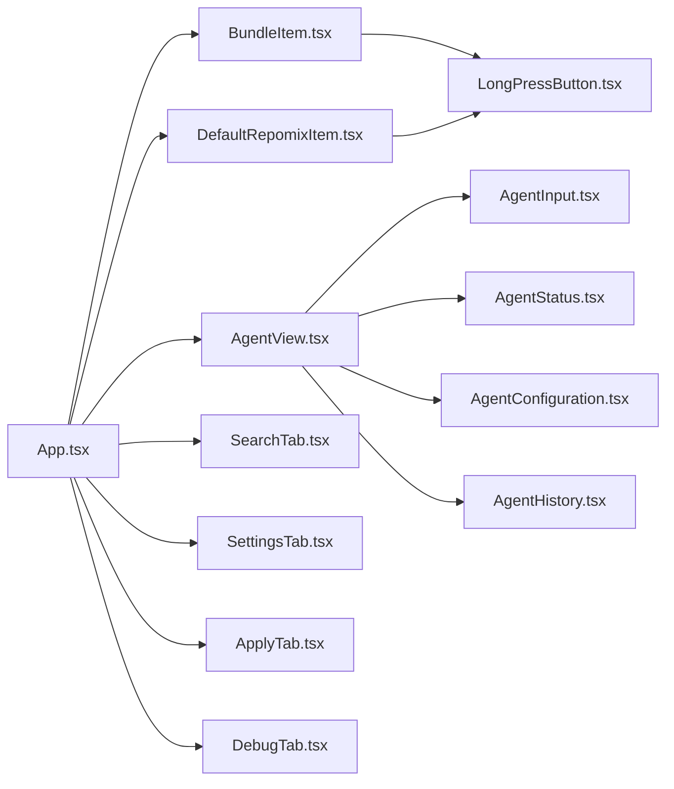

# Component Hierarchy

<cite>
**Referenced Files in This Document**
- [App.tsx](file://src/webview/App.tsx)
- [index.tsx](file://src/webview/index.tsx)
- [AgentView.tsx](file://src/webview/components/AgentView.tsx)
- [BundleItem.tsx](file://src/webview/components/BundleItem.tsx)
- [DefaultRepomixItem.tsx](file://src/webview/components/DefaultRepomixItem.tsx)
- [SettingsTab.tsx](file://src/webview/components/SettingsTab.tsx)
- [SearchTab.tsx](file://src/webview/components/SearchTab.tsx)
- [ApplyTab.tsx](file://src/webview/components/ApplyTab.tsx)
- [DebugTab.tsx](file://src/webview/components/DebugTab.tsx)
- [LongPressButton.tsx](file://src/webview/components/LongPressButton.tsx)
- [AgentInput.tsx](file://src/webview/components/agent/AgentInput.tsx)
- [AgentStatus.tsx](file://src/webview/components/agent/AgentStatus.tsx)
- [AgentConfiguration.tsx](file://src/webview/components/agent/AgentConfiguration.tsx)
- [AgentHistory.tsx](file://src/webview/components/agent/AgentHistory.tsx)
- [types.ts](file://src/webview/types.ts)
</cite>

## Table of Contents
1. [Introduction](#introduction)
2. [Project Structure](#project-structure)
3. [Core Components](#core-components)
4. [Architecture Overview](#architecture-overview)
5. [Detailed Component Analysis](#detailed-component-analysis)
6. [Dependency Analysis](#dependency-analysis)
7. [Performance Considerations](#performance-considerations)
8. [Troubleshooting Guide](#troubleshooting-guide)
9. [Conclusion](#conclusion)

## Introduction
This document describes the React component hierarchy in the Webview Interface. It focuses on the main App component as the root container that manages tab navigation and global state, and explains how it composes child components per tab. It documents the responsibilities and props of AgentView, BundleItem, SettingsTab, SearchTab, ApplyTab, and DebugTab, along with the component lifecycle, rendering patterns, and communication mechanisms. It also covers component reusability, styling approaches, and integration with the Fluent UI design system.

## Project Structure
The Webview app is bootstrapped by a simple entry point that mounts the App component into the DOM. App orchestrates tab rendering and maintains shared state. Each tab is implemented as a dedicated component under src/webview/components/, with specialized subcomponents for AgentView.

**Diagram sources**
- [index.tsx](file://src/webview/index.tsx#L1-L18)
- [App.tsx](file://src/webview/App.tsx#L171-L256)

**Section sources**
- [index.tsx](file://src/webview/index.tsx#L1-L18)
- [App.tsx](file://src/webview/App.tsx#L47-L256)

## Core Components
- App: Root container that manages selected tab, bundles, execution states, and Pinecone-related state. It listens to postMessage events from the extension host and dispatches actions via message passing. It renders the active tab’s content and passes down props to child components.
- AgentView: Renders the Smart Agent UI (deprecated as a standalone tab). Composed of AgentInput, AgentStatus, AgentConfiguration, and AgentHistory.
- BundleItem: Renders a single bundle row with run/cancel/copy controls and a LongPressButton for compression.
- DefaultRepomixItem: Renders the “Run Default Repomix” row with similar controls.
- SettingsTab: Manages secrets, vector DB provider selection, embedding provider configuration, and compatibility checks.
- SearchTab: Handles repository indexing, search queries, filtering, and result presentation.
- ApplyTab: Accepts LLM-generated patches and applies them to the workspace.
- DebugTab: Displays recent runs, allows re-running, copying outputs, and shows environment information.

**Section sources**
- [App.tsx](file://src/webview/App.tsx#L47-L256)
- [AgentView.tsx](file://src/webview/components/AgentView.tsx#L16-L164)
- [BundleItem.tsx](file://src/webview/components/BundleItem.tsx#L7-L120)
- [DefaultRepomixItem.tsx](file://src/webview/components/DefaultRepomixItem.tsx#L7-L90)
- [SettingsTab.tsx](file://src/webview/components/SettingsTab.tsx#L120-L800)
- [SearchTab.tsx](file://src/webview/components/SearchTab.tsx#L169-L1161)
- [ApplyTab.tsx](file://src/webview/components/ApplyTab.tsx#L26-L149)
- [DebugTab.tsx](file://src/webview/components/DebugTab.tsx#L7-L266)

## Architecture Overview
The Webview communicates with the extension host via a bidirectional message channel. App initializes listeners on mount and posts initial handshake messages. Child components also post messages for actions (run, cancel, copy, search, index, apply, debug). Messages update component state and drive UI changes.

**Diagram sources**
- [App.tsx](file://src/webview/App.tsx#L75-L145)
- [AgentView.tsx](file://src/webview/components/AgentView.tsx#L79-L108)
- [SearchTab.tsx](file://src/webview/components/SearchTab.tsx#L599-L636)
- [SettingsTab.tsx](file://src/webview/components/SettingsTab.tsx#L320-L333)
- [ApplyTab.tsx](file://src/webview/components/ApplyTab.tsx#L52-L57)
- [DebugTab.tsx](file://src/webview/components/DebugTab.tsx#L31-L42)

## Detailed Component Analysis

### App Component
- Role: Root container managing tab selection, bundles, execution states, and Pinecone state. Lifts state up for cross-tab sharing.
- Props: None (manages internal state).
- Lifecycle:
  - On mount: registers message listener, posts webviewLoaded and client info.
  - On unmount: removes message listener.
- Rendering pattern: Uses TabList to switch content; renders the active tab’s component.
- Communication:
  - Receives messages to update bundles, execution states, version, and Pinecone indexes.
  - Dispatches actions via postMessage for run/cancel/copy operations.
- State management:
  - selectedTab: persisted via updateVsState.
  - bundles, bundleStates: from extension messages.
  - defaultRepomixState/info: from extension messages.
  - pineconeIndexes, selectedPineconeIndex, pineconeIndexError: lifted state.
- Composition:
  - Renders DefaultRepomixItem and a list of BundleItem when bundles tab is selected.
  - Renders AgentView, SearchTab, SettingsTab, ApplyTab, DebugTab based on selected tab.

**Diagram sources**
- [App.tsx](file://src/webview/App.tsx#L75-L145)

**Section sources**
- [App.tsx](file://src/webview/App.tsx#L47-L256)

### AgentView
- Role: Deprecated Smart Agent UI (temporarily retained). Composed of AgentInput, AgentStatus, AgentConfiguration, AgentHistory.
- Props: None (uses vscode.getState and message handlers).
- Lifecycle:
  - On mount: sets up message handlers, requests agent history and secret status.
  - On unmount: cleans up listeners.
- Rendering pattern: Stacked vertical layout with divider separators.
- Communication:
  - Sends runSmartAgent, rerunAgent, copyAgentOutput, copyLastAgentOutput, regenerateAgentRun, openFile, saveSecret.
  - Updates local state on agentStateChange, agentRunComplete, agentRunFailed, agentHistory.

**Diagram sources**
- [AgentView.tsx](file://src/webview/components/AgentView.tsx#L17-L77)
- [AgentView.tsx](file://src/webview/components/AgentView.tsx#L79-L108)

**Section sources**
- [AgentView.tsx](file://src/webview/components/AgentView.tsx#L16-L164)

#### AgentView Subcomponents
- AgentInput: Text area for query, run button, optional copy button after successful run.
- AgentStatus: Displays success/warning messages and token usage badge.
- AgentConfiguration: API key input with save button and status indicator.
- AgentHistory: Scrollable list of runs with action buttons (fresh scan, re-pack, copy output, regenerate).

**Section sources**
- [AgentInput.tsx](file://src/webview/components/agent/AgentInput.tsx#L15-L56)
- [AgentStatus.tsx](file://src/webview/components/agent/AgentStatus.tsx#L14-L77)
- [AgentConfiguration.tsx](file://src/webview/components/agent/AgentConfiguration.tsx#L12-L59)
- [AgentHistory.tsx](file://src/webview/components/agent/AgentHistory.tsx#L14-L175)

### BundleItem
- Role: Renders a single bundle row with metadata and action controls.
- Props: bundle, state, onRun(id, compress?), onCancel(id), onCopy(id).
- Rendering pattern: Flex row with name, description, counts, and action buttons.
- Controls:
  - Copy button: copies output to clipboard.
  - Cancel button: cancels execution when running/queued.
  - LongPressButton: normal run vs compressed run (hold-to-compress).
- State mapping: maps 'running'/'queued' to disabled state and UI labels.

**Section sources**
- [BundleItem.tsx](file://src/webview/components/BundleItem.tsx#L7-L120)
- [LongPressButton.tsx](file://src/webview/components/LongPressButton.tsx#L5-L157)

### DefaultRepomixItem
- Role: Dedicated row for running the default Repomix on the entire repository.
- Props: state, info, onRun(compress?), onCancel(), onCopy().
- Rendering pattern: Similar to BundleItem with a secondary style and output filename display.

**Section sources**
- [DefaultRepomixItem.tsx](file://src/webview/components/DefaultRepomixItem.tsx#L7-L90)

### SettingsTab
- Role: Central configuration hub for secrets, vector DB provider, embedding provider, and compatibility checks.
- Props: pineconeIndexes, selectedPineconeIndex, indexError.
- Rendering pattern: Collapsible sections (ConfigSection) for each configuration block.
- Key features:
  - Secret management (Google, Pinecone, Qdrant) with save and status indicators.
  - Vector DB provider selection (Pinecone or Qdrant).
  - Embedding provider selection (Gemini or Ollama) with model discovery and dimension testing.
  - Compatibility status alert with reset option.
  - General settings like copy mode.
- Communication:
  - Posts messages for saving secrets, fetching indexes/collections, setting providers, saving embedding config, resetting index, etc.
  - Listens for secretStatus, vectorDbProvider, qdrantConnectionResult, updateQdrantCollections, embeddingConfig, ollamaModelsResult, ollamaDimensionResult, compatibilityStatus, vectorIndexReset.

**Section sources**
- [SettingsTab.tsx](file://src/webview/components/SettingsTab.tsx#L120-L800)

### SearchTab
- Role: Provides repository indexing, search, and result management.
- Props: None (uses vscode.getState and message handlers).
- Rendering pattern: Accordion-based sections for indexing and filters.
- Key features:
  - Indexing controls: start/pause/resume/stop/destroy with progress and statistics.
  - Filters: extensive file-type filter configuration with custom inclusion/exclusion.
  - Search: query input with smart filter toggle and confidence threshold.
  - Results: deduplicated list with copy options (markdown, file paths, smart decisions).
- State management:
  - Loads/saves state to/from vscode state (query, filters, accordion items, topK, thresholds, results, last output paths).
  - Tracks indexing state, progress, stats, and vector DB info.
- Communication:
  - Posts messages for indexRepo, pause/resume/stop/delete, searchRepo, copy operations.
  - Listens for repoIndexCount, indexRepoProgress/Complete, repoVectorCount, vectorDbProvider, vectorDbCollectionInfo, searchQueryExpanded, repoSearchResults/Error, searchOutputReady, searchSummaryReady, copySuccess/Error, indexingBlocked.

**Section sources**
- [SearchTab.tsx](file://src/webview/components/SearchTab.tsx#L169-L1161)

### ApplyTab
- Role: Applies LLM-generated patches to the workspace.
- Props: None.
- Rendering pattern: Text area for paste input, apply/clear buttons, and results cards.
- Behavior:
  - Parses input for patch blocks and posts applyPatches.
  - Displays per-file results with success/error and optional error context copy.

**Section sources**
- [ApplyTab.tsx](file://src/webview/components/ApplyTab.tsx#L26-L149)

### DebugTab
- Role: Shows recent runs, allows re-running, copying outputs, and displays environment info.
- Props: None.
- Rendering pattern: List of runs with expandable output/error panels and environment info card.
- Communication:
  - Posts messages to reRunDebug, copyDebugOutput, deleteDebugRun.
  - Listens for updateDebugRuns, updateEnvironmentInfo.

**Section sources**
- [DebugTab.tsx](file://src/webview/components/DebugTab.tsx#L7-L266)

## Dependency Analysis
- Component dependencies:
  - App depends on all tab components and reusable UI primitives (Fluent UI).
  - AgentView composes AgentInput, AgentStatus, AgentConfiguration, AgentHistory.
  - BundleItem and DefaultRepomixItem depend on LongPressButton.
  - SearchTab depends on numerous Fluent UI components and uses memoization for performance.
  - SettingsTab composes ConfigSection and multiple form controls.
- Message flow dependencies:
  - All tabs rely on postMessage to the extension host and on message handlers to update state.
- Prop drilling:
  - App drills props to child components (e.g., bundles, states, Pinecone state).
  - AgentView drills props to subcomponents (query, onRun, etc.).

**Diagram sources**
- [App.tsx](file://src/webview/App.tsx#L16-L24)
- [AgentView.tsx](file://src/webview/components/AgentView.tsx#L11-L14)
- [BundleItem.tsx](file://src/webview/components/BundleItem.tsx#L4-L5)
- [DefaultRepomixItem.tsx](file://src/webview/components/DefaultRepomixItem.tsx#L3-L4)
- [LongPressButton.tsx](file://src/webview/components/LongPressButton.tsx#L1-L3)

**Section sources**
- [App.tsx](file://src/webview/App.tsx#L16-L24)
- [AgentView.tsx](file://src/webview/components/AgentView.tsx#L11-L14)
- [BundleItem.tsx](file://src/webview/components/BundleItem.tsx#L4-L5)
- [DefaultRepomixItem.tsx](file://src/webview/components/DefaultRepomixItem.tsx#L3-L4)
- [LongPressButton.tsx](file://src/webview/components/LongPressButton.tsx#L1-L3)

## Performance Considerations
- Memoization: SearchTab uses useMemo for derived computations (e.g., deduped results, canGenerate) to avoid unnecessary re-renders.
- Debouncing: SettingsTab debounces Pinecone key entry and Qdrant collection fetches to reduce network chatter.
- Conditional rendering: App conditionally renders only the selected tab and related lists to minimize DOM.
- State persistence: App persists selectedTab and other states via updateVsState to maintain continuity across reloads.

[No sources needed since this section provides general guidance]

## Troubleshooting Guide
- No root element found: The entry point logs an error if the DOM container is missing. Verify the HTML template includes an element with the expected ID.
- Extension messages not received: Ensure the message listener is registered on mount and that the extension posts the expected commands.
- Agent deprecation: The Smart Agent tab is temporarily disabled. Expect deprecation warnings when attempting to use remote clipboard processing in the webview.
- Pinecone/Qdrant connectivity: Use SettingsTab’s connection testing and collection fetching to diagnose provider issues. Check for error messages and compatibility status alerts.

**Section sources**
- [index.tsx](file://src/webview/index.tsx#L15-L17)
- [App.tsx](file://src/webview/App.tsx#L115-L124)
- [SettingsTab.tsx](file://src/webview/components/SettingsTab.tsx#L236-L254)

## Conclusion
The Webview component hierarchy centers around App as the orchestrator, delegating responsibilities to focused tab components. App manages global state and message handling, while child components encapsulate UI concerns and user interactions. The design leverages Fluent UI for consistent styling and accessibility, with reusable primitives like LongPressButton. Communication is primarily message-driven, enabling a clean separation between UI and extension-host logic.