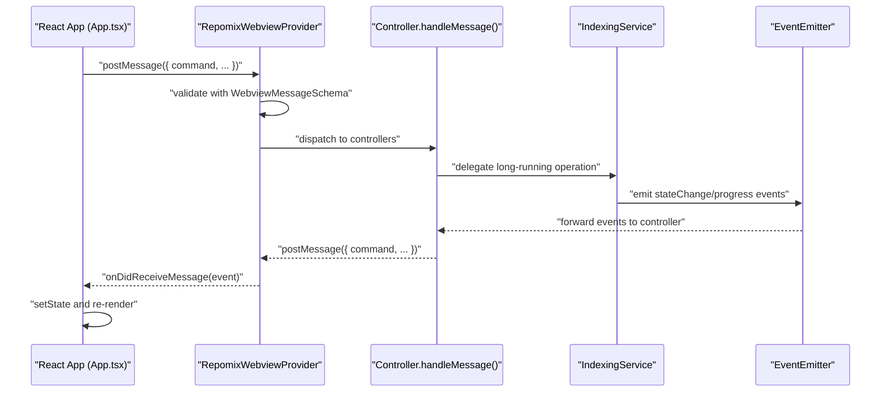
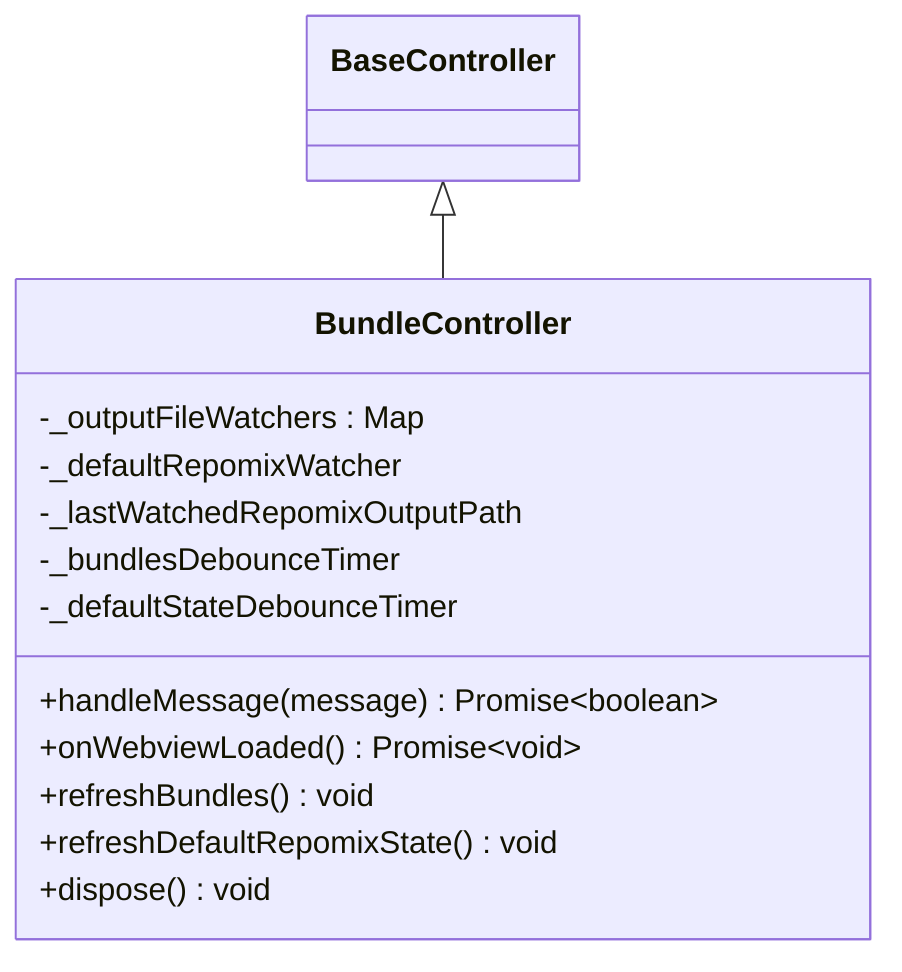
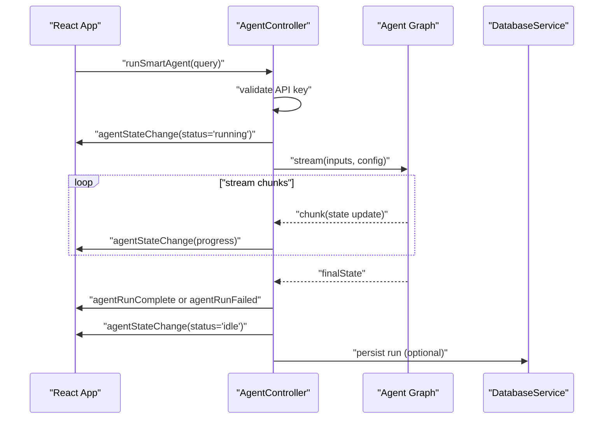
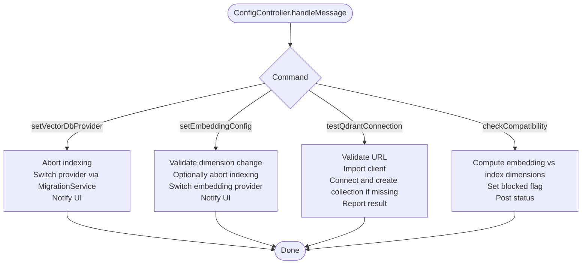
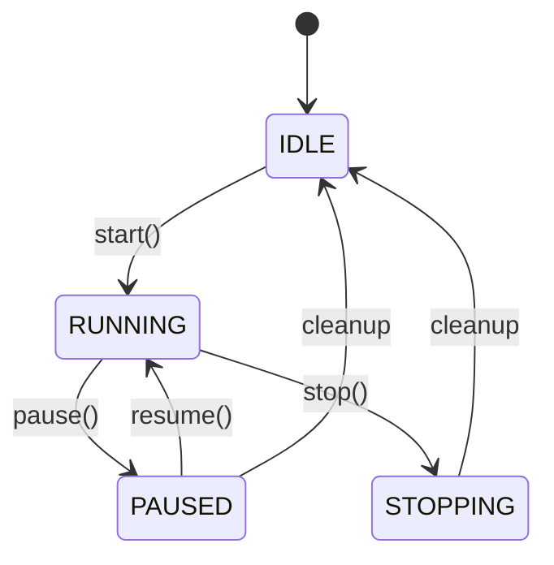
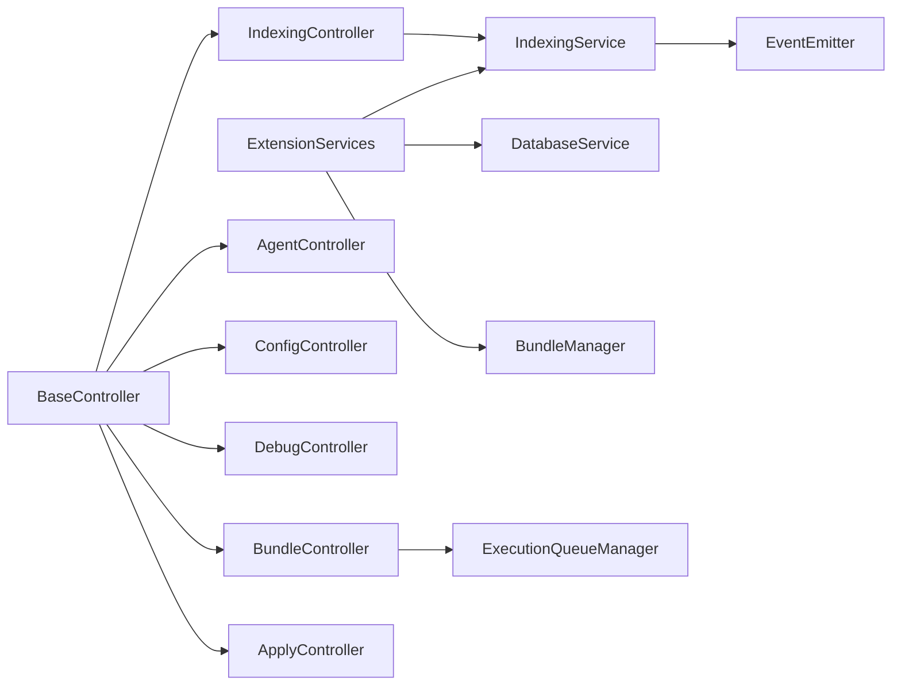

# Controller Pattern

<cite>
**Referenced Files in This Document**
- [BaseController.ts](file://src/webview/controllers/BaseController.ts)
- [BundleController.ts](file://src/webview/controllers/BundleController.ts)
- [AgentController.ts](file://src/webview/controllers/AgentController.ts)
- [ConfigController.ts](file://src/webview/controllers/ConfigController.ts)
- [DebugController.ts](file://src/webview/controllers/DebugController.ts)
- [IndexingController.ts](file://src/webview/controllers/IndexingController.ts)
- [ApplyController.ts](file://src/webview/controllers/ApplyController.ts)
- [IndexingService.ts](file://src/core/services/IndexingService.ts)
- [ExtensionServices.ts](file://src/core/services/ExtensionServices.ts)
- [ExecutionQueueManager.ts](file://src/webview/services/ExecutionQueueManager.ts)
- [RepomixWebviewProvider.ts](file://src/webview/RepomixWebviewProvider.ts)
- [App.tsx](file://src/webview/App.tsx)
- [messageSchemas.ts](file://src/webview/messageSchemas.ts)
</cite>

## Update Summary
**Changes Made**
- Updated IndexingController documentation to reflect its new role as a thin adapter delegating to IndexingService
- Added documentation for the new IndexingService singleton that manages long-running operations independently of webview lifecycle
- Updated architecture diagrams to show the separation between UI coordination (controllers) and long-running operations (services)
- Enhanced explanation of event-driven architecture and state preservation across webview recreations
- Added documentation for ExtensionServices singleton pattern that manages service lifecycle

## Table of Contents
1. [Introduction](#introduction)
2. [Project Structure](#project-structure)
3. [Core Components](#core-components)
4. [Architecture Overview](#architecture-overview)
5. [Detailed Component Analysis](#detailed-component-analysis)
6. [Dependency Analysis](#dependency-analysis)
7. [Performance Considerations](#performance-considerations)
8. [Troubleshooting Guide](#troubleshooting-guide)
9. [Conclusion](#conclusion)

## Introduction
This document explains the Controller Pattern implementation in the Webview Interface of the Repomix Runner extension. The system now follows an event-driven architecture where controllers act as thin adapters delegating long-running operations to dedicated services, while preserving state across webview recreations. Controllers manage application state, coordinate between the React-based UI and backend services, and integrate with external systems such as vector databases, AI providers, and the file system.

## Project Structure
The webview subsystem is organized around a provider that hosts the React app and instantiates controllers. Controllers communicate via a strict message schema validated on both ends. The new architecture introduces a separation of concerns where long-running operations are handled by services that survive webview lifecycle changes.

```mermaid
graph TB
subgraph "Extension-Level Services"
ES["ExtensionServices (Singleton)"]
IS["IndexingService (Singleton)"]
DB["DatabaseService"]
BM["BundleManager"]
end
subgraph "Webview Host"
RP["RepomixWebviewProvider"]
APP["React App (App.tsx)"]
end
subgraph "Controllers"
BC["BaseController"]
BCTRL["BundleController"]
ACTRL["AgentController"]
CCTRL["ConfigController"]
DCTRL["DebugController"]
ICTRL["IndexingController"]
ACTRL2["ApplyController"]
end
subgraph "Event System"
EVT["EventEmitter"]
END
ES --> IS
ES --> DB
ES --> BM
RP --> BC
RP --> BCTRL
RP --> ACTRL
RP --> CCTRL
RP --> DCTRL
RP --> ICTRL
RP --> ACTRL2
RP --> ES
APP --> RP
BCTRL --> BM
ICTRL --> IS
IS --> EVT
```

**Diagram sources**
- [ExtensionServices.ts](file://src/core/services/ExtensionServices.ts#L17-L32)
- [IndexingService.ts](file://src/core/services/IndexingService.ts#L49-L59)
- [RepomixWebviewProvider.ts](file://src/webview/RepomixWebviewProvider.ts#L116-L125)
- [IndexingController.ts](file://src/webview/controllers/IndexingController.ts#L34-L42)

**Section sources**
- [RepomixWebviewProvider.ts](file://src/webview/RepomixWebviewProvider.ts#L19-L88)
- [App.tsx](file://src/webview/App.tsx#L47-L257)

## Core Components
- **BaseController**: Defines the contract for all controllers, including message handling, lifecycle hooks, and disposal.
- **IndexingService**: Singleton service that manages repository indexing operations independently of webview lifecycle, emitting state changes and progress events.
- **ExtensionServices**: Singleton container that creates and manages all extension-level services, ensuring they persist across webview recreations.
- **ExecutionQueueManager**: Manages asynchronous execution of bundles with cancellation and progress signaling.
- **RepomixWebviewProvider**: Hosts the webview, initializes controllers with service references, dispatches messages, and manages lifecycle.

**Section sources**
- [BaseController.ts](file://src/webview/controllers/BaseController.ts#L8-L19)
- [IndexingService.ts](file://src/core/services/IndexingService.ts#L35-L48)
- [ExtensionServices.ts](file://src/core/services/ExtensionServices.ts#L6-L16)
- [ExecutionQueueManager.ts](file://src/webview/services/ExecutionQueueManager.ts#L15-L24)
- [RepomixWebviewProvider.ts](file://src/webview/RepomixWebviewProvider.ts#L19-L88)

## Architecture Overview
The system follows a message-driven architecture with a clear separation between UI coordination and long-running operations:

- **Controllers** (thin adapters): Handle UI-specific operations, validate inputs, and delegate long-running tasks to services
- **Services** (singleton): Manage long-running operations independently of webview lifecycle, emitting events for UI updates
- **Event System**: Controllers subscribe to service events to update the UI regardless of webview recreations
- **ExtensionServices**: Singleton container that creates and manages all extension-level services



**Diagram sources**
- [RepomixWebviewProvider.ts](file://src/webview/RepomixWebviewProvider.ts#L92-L195)
- [messageSchemas.ts](file://src/webview/messageSchemas.ts#L443-L515)
- [App.tsx](file://src/webview/App.tsx#L78-L145)
- [IndexingController.ts](file://src/webview/controllers/IndexingController.ts#L48-L108)
- [IndexingService.ts](file://src/core/services/IndexingService.ts#L69-L72)

## Detailed Component Analysis

### BaseController
- **Purpose**: Abstract base class defining the controller contract.
- **Responsibilities**:
  - handleMessage(message): route and handle commands; return true if handled.
  - onWebviewLoaded(): optional initialization hook invoked when the webview signals readiness.
  - dispose(): cleanup resources.

**Section sources**
- [BaseController.ts](file://src/webview/controllers/BaseController.ts#L8-L19)

### BundleController
- **Role**: Manages bundle lifecycle, execution queue, and output file state.
- **Key behaviors**:
  - Handles run/cancel/copy commands for named bundles and the default Repomix run.
  - Debounces bundle refresh and default state refresh to avoid thrashing.
  - Watches output files for changes and updates UI state.
  - Copies outputs to clipboard via a temporary file strategy.
- **State management**:
  - Tracks watchers for bundle outputs and the default output.
  - Uses debounced timers to batch updates.
- **Integration**:
  - Depends on BundleManager and ExecutionQueueManager.
  - Uses file system watchers and output path resolution.



**Diagram sources**
- [BaseController.ts](file://src/webview/controllers/BaseController.ts#L8-L19)
- [BundleController.ts](file://src/webview/controllers/BundleController.ts#L17-L36)

**Section sources**
- [BundleController.ts](file://src/webview/controllers/BundleController.ts#L38-L257)

### AgentController
- **Role**: Orchestrates AI-powered agent runs using a streaming graph.
- **Key behaviors**:
  - Validates and retrieves API keys from secrets or configuration.
  - Streams graph updates to update progress and state in the UI.
  - Supports rerun and regeneration of agent runs.
  - Copies outputs to clipboard via a temporary file strategy.
- **State management**:
  - Uses VS Code progress notifications and state messages to reflect agent status.
- **Integration**:
  - Uses DatabaseService for history and run persistence.
  - Imports dynamic graph modules for streaming execution.



**Diagram sources**
- [AgentController.ts](file://src/webview/controllers/AgentController.ts#L20-L178)
- [App.tsx](file://src/webview/App.tsx#L78-L145)

**Section sources**
- [AgentController.ts](file://src/webview/controllers/AgentController.ts#L20-L314)

### ConfigController
- **Role**: Centralizes configuration management for secrets, vector DB providers, embedding providers, and compatibility checks.
- **Key behaviors**:
  - Secret management (Google, Pinecone, Qdrant) via VS Code secrets.
  - Vector DB provider switching with migration and validation.
  - Qdrant connection testing with URL validation and collection creation.
  - Embedding provider configuration and dimension compatibility checks.
  - Index reset and compatibility status reporting.
- **State management**:
  - Uses ExtensionContext globalState for persistent settings.
  - Coordinates with IndexingController to abort in-flight indexing during provider switches.
- **Integration**:
  - Uses DatabaseService and MigrationService.
  - Interacts with vector DB adapters via factory.



**Diagram sources**
- [ConfigController.ts](file://src/webview/controllers/ConfigController.ts#L26-L111)
- [ConfigController.ts](file://src/webview/controllers/ConfigController.ts#L251-L286)
- [ConfigController.ts](file://src/webview/controllers/ConfigController.ts#L631-L738)
- [ConfigController.ts](file://src/webview/controllers/ConfigController.ts#L321-L445)
- [ConfigController.ts](file://src/webview/controllers/ConfigController.ts#L742-L800)

**Section sources**
- [ConfigController.ts](file://src/webview/controllers/ConfigController.ts#L26-L880)

### DebugController
- **Role**: Manages debug runs, environment diagnostics, and copying debug outputs.
- **Key behaviors**:
  - Retrieves and deletes debug runs from the database.
  - Re-runs selected files with safety checks.
  - Copies debug outputs to clipboard via a temporary file strategy.
  - Detects environment and binary availability for remote scenarios.
- **State management**:
  - Uses repository name and database service for run persistence.
- **Integration**:
  - Uses DatabaseService, file system utilities, and remote detection helpers.

**Section sources**
- [DebugController.ts](file://src/webview/controllers/DebugController.ts#L24-L230)

### IndexingController
- **Role**: Thin adapter between webview and IndexingService, managing UI coordination while delegating long-running operations to the service.
- **Key behaviors**:
  - **Thin Adapter Pattern**: Delegates all indexing operations (start, pause, resume, stop) to IndexingService
  - **Event Subscription**: Subscribes to IndexingService events and forwards them to the webview
  - **State Restoration**: Handles webview recreation by querying IndexingService for current state
  - **Non-Indexing Operations**: Handles search, copy, and utility operations that are not long-running
  - **Provider Coordination**: Aborts indexing during provider switching to prevent race conditions
- **State management**:
  - Tracks event listeners for proper cleanup
  - Maintains UI state based on service events
  - Preserves state across webview recreations through service subscription
- **Integration**:
  - Depends on DatabaseService for metadata operations
  - Uses ExtensionContext for secret management and configuration
  - Subscribes to IndexingService events for real-time updates

**Updated** The IndexingController now acts as a thin adapter that delegates all long-running indexing operations to IndexingService, while handling UI-specific operations and event forwarding.

```mermaid
classDiagram
class BaseController
class IndexingController {
- _eventListeners : () => void[]
+constructor(context, databaseService, extensionContext, indexingService)
-private _subscribeToIndexingEvents() void
+handleMessage(message) Promise~boolean~
+onWebviewLoaded() Promise~void~
+dispose() void
+abortIndexing() Promise~void~
-private handleIndexRepo() Promise~void~
-private handlePauseRepoIndexing() Promise~void~
-private handleResumeRepoIndexing() Promise~void~
-private handleStopRepoIndexing() Promise~void~
-private handleGetIndexingState() Promise~void~
}
class IndexingService {
+start(resumeFromCheckpoint) Promise~void~
+pause() Promise~void~
+resume() Promise~void~
+stop() Promise~void~
+getState() Promise~{state, progress}~
+abort() Promise~void~
}
BaseController <|-- IndexingController
IndexingController --> IndexingService : delegates to
```

**Diagram sources**
- [IndexingController.ts](file://src/webview/controllers/IndexingController.ts#L32-L42)
- [IndexingService.ts](file://src/core/services/IndexingService.ts#L49-L59)

**Section sources**
- [IndexingController.ts](file://src/webview/controllers/IndexingController.ts#L21-L230)

### ApplyController
- **Role**: Applies patches extracted from AI-generated diffs to files in the workspace.
- **Key behaviors**:
  - Parses patches, resolves target files, locates matching code blocks, repairs indentation, and applies edits.
  - Provides contextual error prompts to help regenerate correct patches.
- **State management**:
  - Uses VS Code progress and cancellation tokens.
- **Integration**:
  - Uses patching utilities and VS Code workspace APIs.

**Section sources**
- [ApplyController.ts](file://src/webview/controllers/ApplyController.ts#L23-L149)

### IndexingService
- **Role**: Singleton service that manages repository indexing operations independently of webview lifecycle.
- **Key behaviors**:
  - **Long-running Operations**: Handles database indexing, secret resolution, embedding, and vector upsert operations
  - **State Management**: Tracks indexing state (IDLE, RUNNING, PAUSED, STOPPING) and progress
  - **Event Emission**: Emits stateChange, progress, complete, paused, stopped, and error events
  - **Checkpoint Management**: Saves and restores pause checkpoints for interrupted operations
  - **Graceful Abort**: Supports clean abortion of operations with proper cleanup
  - **Provider Validation**: Checks for embedding dimension compatibility before starting
- **State management**:
  - Maintains internal state and current repository ID
  - Uses AbortController for operation cancellation
  - Persists progress and checkpoint information in DatabaseService
- **Integration**:
  - Uses DatabaseService for file metadata and progress tracking
  - Integrates with vector DB adapters via factory
  - Manages embedding providers and secret resolution

**New** The IndexingService is a singleton service that manages all long-running indexing operations independently of webview lifecycle, emitting events for UI updates.



**Diagram sources**
- [IndexingService.ts](file://src/core/services/IndexingService.ts#L12-L17)
- [IndexingService.ts](file://src/core/services/IndexingService.ts#L69-L72)

**Section sources**
- [IndexingService.ts](file://src/core/services/IndexingService.ts#L35-L373)

### ExtensionServices
- **Role**: Singleton container that creates and manages all extension-level services.
- **Key behaviors**:
  - Creates and holds references to DatabaseService, BundleManager, and IndexingService
  - Ensures services persist across webview recreations
  - Provides centralized access to all extension-level services
  - Manages service lifecycle and cleanup
- **Integration**:
  - Passed to controllers during initialization
  - Allows controllers to access services without tight coupling

**New** The ExtensionServices singleton pattern ensures that long-running services survive webview lifecycle changes and can communicate with controllers through events.

**Section sources**
- [ExtensionServices.ts](file://src/core/services/ExtensionServices.ts#L6-L86)

### ExecutionQueueManager
- **Role**: Coordinates bundle execution with queuing, cancellation, and progress signaling.
- **Key behaviors**:
  - Maintains a queue of items and processes them sequentially.
  - Notifies UI of state transitions (queued, running, idle).
  - Supports cancellation via AbortController.
- **Integration**:
  - Communicates with BundleManager and run commands.

**Section sources**
- [ExecutionQueueManager.ts](file://src/webview/services/ExecutionQueueManager.ts#L26-L133)

### RepomixWebviewProvider
- **Role**: Hosts the webview, initializes controllers with service references, validates messages, and routes events.
- **Key behaviors**:
  - Creates IWebviewContext and instantiates controllers with ExtensionServices reference.
  - Validates incoming messages with WebviewMessageSchema and dispatches to controllers.
  - Handles special commands (webviewLoaded, openFile, showNotification, reportClientInfo).
  - Refreshes controllers on visibility and focus changes.
  - Builds consolidated hydration state including indexing state and counts.
- **Integration**:
  - Uses ExtensionServices for service references.
  - Initializes controllers with proper service dependencies.

**Updated** The RepomixWebviewProvider now injects the ExtensionServices singleton into controllers, enabling them to access the IndexingService and other persistent services.

**Section sources**
- [RepomixWebviewProvider.ts](file://src/webview/RepomixWebviewProvider.ts#L63-L218)

### App.tsx (UI)
- **Role**: React application that renders tabs and binds user actions to webview messages.
- **Key behaviors**:
  - Subscribes to webview messages and updates state for bundles, default Repomix, and settings.
  - Posts webviewLoaded and client info on mount.
  - Maps UI actions to controller commands (run, cancel, copy, search, etc.).

**Section sources**
- [App.tsx](file://src/webview/App.tsx#L75-L145)

## Dependency Analysis
- **Controllers depend on services and managers**:
  - BundleController depends on BundleManager and ExecutionQueueManager.
  - AgentController depends on DatabaseService and imports graph modules dynamically.
  - ConfigController depends on DatabaseService, MigrationService, and IndexingController.
  - DebugController depends on DatabaseService.
  - IndexingController depends on DatabaseService, ExtensionContext, and IndexingService.
  - ApplyController depends on patching utilities and VS Code workspace APIs.
- **Services are managed by ExtensionServices singleton**:
  - DatabaseService, BundleManager, and IndexingService are created once and reused.
  - Services persist across webview lifecycle changes.
- **Event-driven communication**:
  - Controllers subscribe to service events for real-time updates.
  - Services emit events that controllers forward to the UI.

**Updated** The dependency structure now shows controllers delegating long-running operations to services while maintaining event subscriptions for UI updates.



**Diagram sources**
- [ExtensionServices.ts](file://src/core/services/ExtensionServices.ts#L17-L32)
- [IndexingController.ts](file://src/webview/controllers/IndexingController.ts#L34-L39)
- [IndexingService.ts](file://src/core/services/IndexingService.ts#L49-L59)

**Section sources**
- [RepomixWebviewProvider.ts](file://src/webview/RepomixWebviewProvider.ts#L79-L87)
- [messageSchemas.ts](file://src/webview/messageSchemas.ts#L443-L515)

## Performance Considerations
- **Event-driven architecture**: Controllers subscribe to service events rather than polling, reducing unnecessary computations.
- **State preservation**: Services survive webview recreations, eliminating redundant initialization costs.
- **Delegation pattern**: Long-running operations are delegated to services, keeping controllers lightweight and responsive.
- **Graceful aborts**: IndexingService uses AbortController to stop work cleanly, preventing resource leaks.
- **Checkpoint management**: IndexingService saves and restores progress, enabling efficient resume operations.
- **Message validation**: Strict message schemas prevent malformed messages from reaching controllers, reducing error handling overhead.

**Updated** The performance improvements now include event-driven communication, state preservation across webview recreations, and delegation of long-running operations to services.

## Troubleshooting Guide
- **API key errors**:
  - AgentController handles missing keys and offers navigation to settings.
  - ConfigController validates and stores secrets; missing keys block indexing or provider switching.
- **Vector DB connectivity**:
  - ConfigController's Qdrant test connection reports detailed errors and suggests fixes.
  - IndexingController surfaces adapter errors and logs timing for diagnostics.
- **Indexing blocked**:
  - ConfigController sets a global flag when embedding dimension mismatches are detected; IndexingController respects this flag.
  - IndexingService checks for blocking conditions before starting operations.
- **Webview recreation issues**:
  - IndexingController subscribes to IndexingService events, ensuring UI updates even after webview recreation.
  - ExtensionServices ensures services persist across webview lifecycle changes.
- **Provider switching conflicts**:
  - ConfigController coordinates with IndexingController to abort in-flight indexing during provider switches.
  - IndexingController provides abortIndexing() method for explicit cleanup.

**Updated** The troubleshooting guide now includes issues related to webview recreation, service persistence, and provider switching conflicts.

**Section sources**
- [AgentController.ts](file://src/webview/controllers/AgentController.ts#L151-L177)
- [ConfigController.ts](file://src/webview/controllers/ConfigController.ts#L417-L444)
- [IndexingController.ts](file://src/webview/controllers/IndexingController.ts#L377-L453)
- [DebugController.ts](file://src/webview/controllers/DebugController.ts#L160-L229)

## Conclusion
The Controller Pattern in the Webview Interface now follows a sophisticated event-driven architecture that cleanly separates UI concerns from business logic. Controllers act as thin adapters that delegate long-running operations to dedicated services while maintaining UI responsiveness through event subscriptions. The introduction of IndexingService as a singleton service ensures that long-running operations persist across webview lifecycle changes, providing seamless user experience. The ExtensionServices singleton pattern guarantees that services are created once and reused throughout the extension lifecycle. This architecture maintains modularity and reliability while enabling complex operations like repository indexing to continue uninterrupted by UI changes.