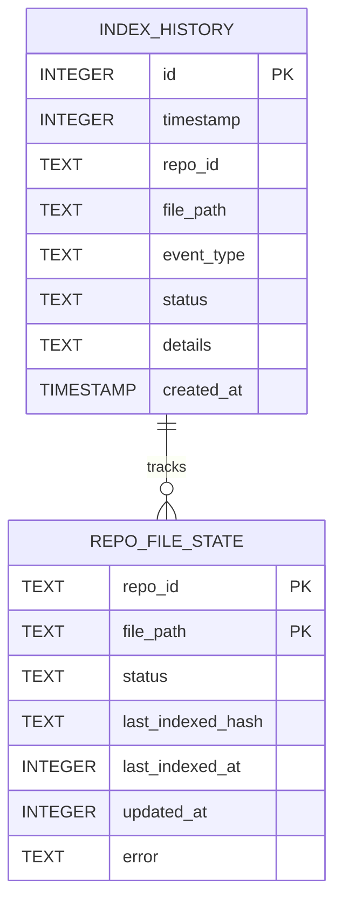
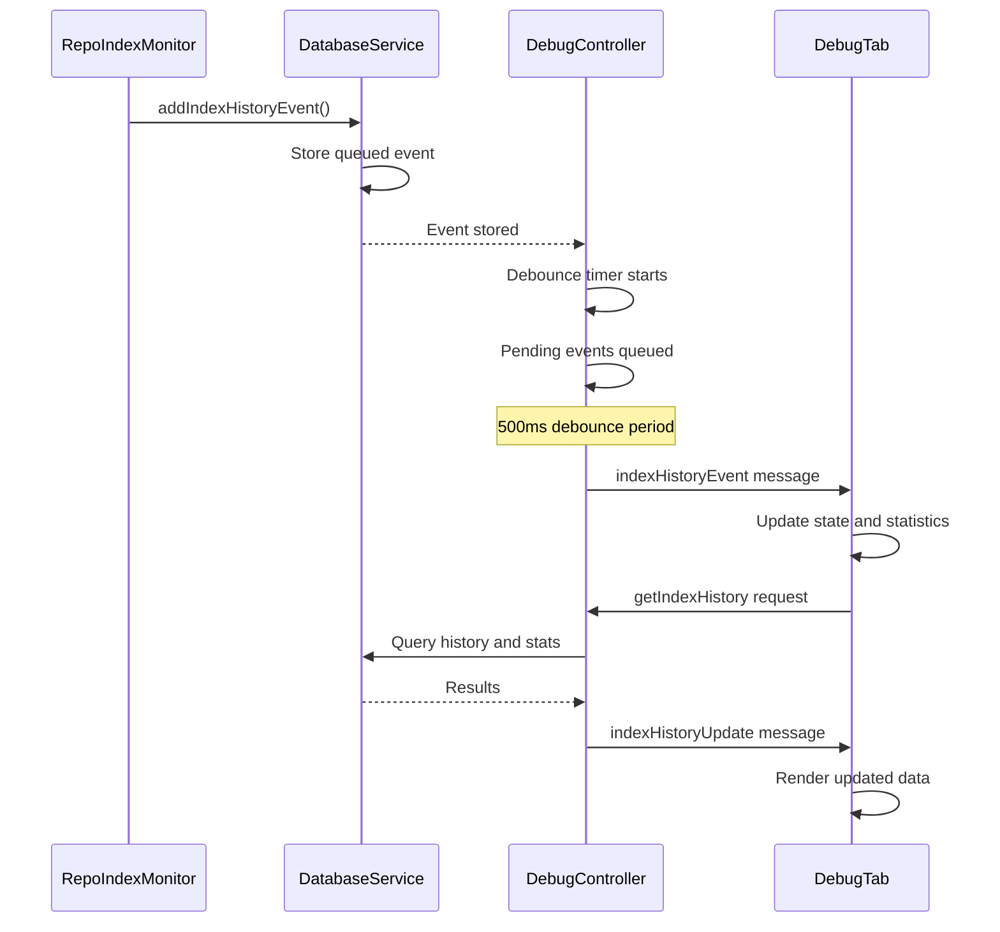
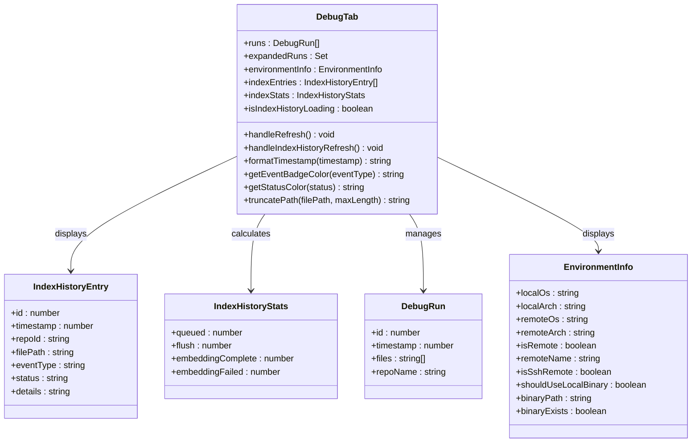

# Index History Tracking System

<cite>
**Referenced Files in This Document**
- [DebugTab.tsx](file://src/webview/components/DebugTab.tsx)
- [DebugController.ts](file://src/webview/controllers/DebugController.ts)
- [IndexHistoryController.ts](file://src/webview/controllers/IndexHistoryController.ts)
- [BaseController.ts](file://src/webview/controllers/BaseController.ts)
- [databaseService.ts](file://src/core/storage/databaseService.ts)
- [repoIndexMonitor.ts](file://src/core/indexing/repoIndexMonitor.ts)
- [messageSchemas.ts](file://src/webview/messageSchemas.ts)
</cite>

## Update Summary
**Changes Made**
- Updated architecture to reflect consolidation of Index History functionality into the Debug tab
- Removed separate Index History tab component documentation
- Updated UI implementation section to reflect integrated Debug tab interface
- Revised system architecture diagrams to show unified Debug tab approach
- Updated troubleshooting guidance to reflect single integrated interface

## Table of Contents
1. [Introduction](#introduction)
2. [System Architecture](#system-architecture)
3. [Core Components](#core-components)
4. [Data Model](#data-model)
5. [Real-time Event Flow](#real-time-event-flow)
6. [Database Operations](#database-operations)
7. [UI Implementation](#ui-implementation)
8. [Performance Considerations](#performance-considerations)
9. [Troubleshooting Guide](#troubleshooting-guide)
10. [Conclusion](#conclusion)

## Introduction

The Index History Tracking System is a comprehensive debugging and monitoring solution designed to track and visualize indexing activities in the Repomix system. This system provides real-time visibility into repository indexing operations, allowing developers and users to understand the indexing pipeline, monitor progress, and troubleshoot issues effectively.

**Updated** The system has been consolidated into the Debug tab, providing integrated debugging and monitoring capabilities within a single, streamlined interface. The separate Index History tab component has been eliminated in favor of embedded functionality within the Debug tab.

The system consists of three primary layers: a frontend React component for user interface, a controller layer for message handling and data management, and a backend database service for persistent storage and retrieval of indexing events. The architecture follows a unidirectional data flow pattern with real-time event streaming capabilities.

## System Architecture

The Index History Tracking System is built on a layered architecture that separates concerns between presentation, business logic, and data persistence:

```mermaid
graph TB
subgraph "Frontend Layer"
DebugTab[DebugTab.tsx<br/>Integrated Debug Interface]
Controller[DebugController.ts<br/>Unified Controller]
IndexHistoryController[IndexHistoryController.ts<br/>Legacy Controller (Maintained) ]
end
subgraph "Communication Layer"
Schema[messageSchemas.ts<br/>Message Validation]
Base[BaseController.ts<br/>Base Controller]
end
subgraph "Backend Layer"
DB[databaseService.ts<br/>Database Service]
Monitor[repoIndexMonitor.ts<br/>Index Monitor]
end
subgraph "Data Storage"
SQLite[(SQLite Database)]
Table[index_history Table]
end
DebugTab --> Controller
Controller --> Base
Controller --> Schema
Controller --> DB
IndexHistoryController --> DB
Monitor --> DB
DB --> SQLite
SQLite --> Table
```

**Diagram sources**
- [DebugTab.tsx](file://src/webview/components/DebugTab.tsx#L1-L472)
- [DebugController.ts](file://src/webview/controllers/DebugController.ts#L1-L230)
- [IndexHistoryController.ts](file://src/webview/controllers/IndexHistoryController.ts#L1-L115)
- [BaseController.ts](file://src/webview/controllers/BaseController.ts#L1-L19)
- [databaseService.ts](file://src/core/storage/databaseService.ts#L111-L286)
- [repoIndexMonitor.ts](file://src/core/indexing/repoIndexMonitor.ts#L1-L246)

**Updated** The architecture now reflects the consolidation where Index History functionality is embedded within the Debug tab rather than existing as a separate component. The IndexHistoryController remains for backward compatibility and legacy support.

## Core Components

### Integrated Debug Tab Interface

The [`DebugTab.tsx`](file://src/webview/components/DebugTab.tsx#L1-L472) component serves as the primary user interface for displaying indexing history alongside other debugging capabilities. It implements a sophisticated real-time monitoring system with the following key features:

- **Embedded Index History**: Index history is now integrated directly into the Debug tab interface
- **Real-time Event Streaming**: Receives live updates via WebSocket-like message passing
- **Debounced Updates**: Prevents UI thrashing through intelligent batching mechanisms
- **Responsive Design**: Adapts to various screen sizes and VS Code theme configurations
- **Interactive Controls**: Provides refresh functionality and visual indicators
- **Multi-functional Interface**: Combines debugging runs, environment information, and index history in one cohesive interface

### Unified Controller Layer

The [`DebugController.ts`](file://src/webview/controllers/DebugController.ts#L1-L230) acts as the intermediary between the frontend and backend, implementing several critical patterns:

- **Message Delegation**: Handles incoming messages and routes them to appropriate handlers
- **Repository Scoping**: Automatically determines current repository context
- **Asynchronous Operations**: Manages concurrent database queries efficiently
- **Environment Information**: Provides comprehensive system environment details

### Legacy Index History Controller

The [`IndexHistoryController.ts`](file://src/webview/controllers/IndexHistoryController.ts#L1-L115) continues to exist for backward compatibility but now operates as a supporting component within the unified Debug interface:

- **Event Batching**: Implements debounced event pushing to optimize performance
- **Message Handling**: Processes getIndexHistory commands for external requests
- **Repository Scoping**: Automatically determines current repository context
- **Asynchronous Operations**: Manages concurrent database queries efficiently

### Database Service

The [`databaseService.ts`](file://src/core/storage/databaseService.ts#L111-L286) provides comprehensive database operations for index history management, featuring:

- **Transaction Support**: Ensures data consistency through proper transaction handling
- **Automatic Cleanup**: Maintains optimal database size through intelligent pruning
- **Statistical Queries**: Provides aggregated statistics for UI rendering
- **Index Management**: Optimizes query performance through strategic indexing

**Section sources**
- [DebugTab.tsx](file://src/webview/components/DebugTab.tsx#L1-L472)
- [DebugController.ts](file://src/webview/controllers/DebugController.ts#L1-L230)
- [IndexHistoryController.ts](file://src/webview/controllers/IndexHistoryController.ts#L1-L115)
- [databaseService.ts](file://src/core/storage/databaseService.ts#L111-L286)

## Data Model

The system uses a structured approach to data modeling with clear separation of concerns:



**Diagram sources**
- [databaseService.ts](file://src/core/storage/databaseService.ts#L223-L235)
- [databaseService.ts](file://src/core/storage/databaseService.ts#L210-L221)

The index history table maintains a comprehensive audit trail of all indexing operations with the following event types:
- **queued**: Files queued for re-indexing
- **flush**: Batch operations containing multiple files
- **embedding_complete**: Successful embedding completion
- **embedding_failed**: Failed embedding attempts

**Section sources**
- [databaseService.ts](file://src/core/storage/databaseService.ts#L223-L235)
- [repoIndexMonitor.ts](file://src/core/indexing/repoIndexMonitor.ts#L133-L140)

## Real-time Event Flow

The system implements a sophisticated real-time event streaming mechanism that ensures efficient communication between components:



**Diagram sources**
- [repoIndexMonitor.ts](file://src/core/indexing/repoIndexMonitor.ts#L133-L140)
- [DebugController.ts](file://src/webview/controllers/DebugController.ts#L24-L43)
- [DebugTab.tsx](file://src/webview/components/DebugTab.tsx#L25-L89)

**Updated** The event flow now flows through the DebugController instead of the dedicated IndexHistoryController, with the Debug tab handling both the display and the refresh functionality.

The event flow follows these key principles:
1. **Immediate Recording**: Events are recorded as soon as they occur
2. **Debounced Delivery**: Multiple events are batched before UI updates
3. **Real-time Updates**: New events appear instantly in the Debug tab
4. **Historical Queries**: Users can refresh to see complete history through the integrated interface

**Section sources**
- [repoIndexMonitor.ts](file://src/core/indexing/repoIndexMonitor.ts#L133-L140)
- [DebugController.ts](file://src/webview/controllers/DebugController.ts#L24-L43)
- [DebugTab.tsx](file://src/webview/components/DebugTab.tsx#L25-L89)

## Database Operations

The database service implements several optimized operations for managing index history data:

### Event Insertion Strategies

The system employs two distinct insertion strategies based on operation type:


**Diagram sources**
- [databaseService.ts](file://src/core/storage/databaseService.ts#L1139-L1168)
- [databaseService.ts](file://src/core/storage/databaseService.ts#L1174-L1209)

### Automatic Cleanup Mechanism

The system implements an intelligent cleanup mechanism that maintains optimal database performance:

- **Threshold-based Cleanup**: Triggers cleanup every 50 insertions
- **Size Limit Enforcement**: Maintains maximum 500 historical records
- **Efficient Pruning**: Removes oldest records while preserving newest
- **Transaction Safety**: Ensures cleanup operations don't corrupt data

**Section sources**
- [databaseService.ts](file://src/core/storage/databaseService.ts#L1139-L1168)
- [databaseService.ts](file://src/core/storage/databaseService.ts#L1174-L1209)
- [databaseService.ts](file://src/core/storage/databaseService.ts#L1313-L1322)

## UI Implementation

The frontend component provides a comprehensive user interface with advanced features:

### Integrated Debug Tab Architecture

The [`DebugTab.tsx`](file://src/webview/components/DebugTab.tsx#L1-L472) implements a sophisticated React component with the following structure:



**Diagram sources**
- [DebugTab.tsx](file://src/webview/components/DebugTab.tsx#L6-L21)
- [DebugTab.tsx](file://src/webview/components/DebugTab.tsx#L304-L381)

**Updated** The UI architecture now reflects the consolidation where index history is embedded within the Debug tab rather than existing as a separate component. The Debug tab now includes dedicated sections for recent runs, index history, and environment information.

### Visual Design Features

The component implements a clean, professional design optimized for debugging scenarios:

- **Color-coded Event Types**: Different visual treatments for various event categories
- **Status Indicators**: Color-coded status displays for quick scanning
- **Responsive Layout**: Adapts to different screen sizes and VS Code themes
- **Performance Optimizations**: Efficient rendering with virtualization concepts
- **Integrated Sections**: Combines debugging runs, index history, and environment information in one cohesive interface

**Section sources**
- [DebugTab.tsx](file://src/webview/components/DebugTab.tsx#L304-L381)
- [DebugTab.tsx](file://src/webview/components/DebugTab.tsx#L382-L472)

## Performance Considerations

The system is designed with several performance optimizations:

### Memory Management
- **Event Batching**: Reduces UI update frequency through intelligent batching
- **Automatic Cleanup**: Prevents memory bloat through threshold-based pruning
- **State Optimization**: Minimizes state updates to essential changes only
- **Integrated Loading**: Single loading timeout for index history section

### Database Efficiency
- **Index Utilization**: Strategic indexing on frequently queried columns
- **Transaction Batching**: Groups related operations for better performance
- **Size Limits**: Prevents database growth through automatic pruning

### Network Optimization
- **Debounced Updates**: Reduces message traffic during rapid event sequences
- **Selective Loading**: Loads only recent history by default
- **Efficient Serialization**: Optimized data transfer between layers

## Troubleshooting Guide

Common issues and their solutions:

### Event Not Appearing in Debug Tab
1. **Verify Database Connection**: Ensure database initialization succeeds
2. **Check Event Types**: Confirm events are being recorded with valid types
3. **Monitor Debounce Timer**: Wait for 500ms batch processing to complete
4. **Refresh Debug Tab**: Use the Refresh button in the Index History section

### Performance Issues
1. **Database Size**: Check if cleanup is functioning properly
2. **UI Updates**: Verify that batching is preventing excessive re-renders
3. **Memory Usage**: Monitor for potential memory leaks in event handling
4. **Integrated Loading**: Check if the 5-second timeout is triggering

### Data Integrity Problems
1. **Transaction Failures**: Check rollback mechanisms for failed operations
2. **Index Consistency**: Verify that cleanup operations maintain referential integrity
3. **Event Ordering**: Ensure timestamp-based ordering remains consistent

### Debug Tab Specific Issues
1. **Index History Not Loading**: Check if the 5-second timeout is preventing loading indicators
2. **Environment Information Missing**: Verify that environment detection is working correctly
3. **Recent Runs Section Empty**: Confirm that debug runs are being recorded properly

**Section sources**
- [DebugController.ts](file://src/webview/controllers/DebugController.ts#L49-L60)
- [databaseService.ts](file://src/core/storage/databaseService.ts#L1205-L1208)
- [DebugTab.tsx](file://src/webview/components/DebugTab.tsx#L70-L89)

## Conclusion

The Index History Tracking System provides a robust, scalable solution for monitoring and debugging repository indexing operations. The recent consolidation into the Debug tab creates a more streamlined and user-friendly experience while maintaining all functionality.

**Updated** Key strengths of the consolidated system include:
- **Comprehensive Event Coverage**: Captures all significant indexing operations
- **Real-time Visibility**: Provides instant feedback on indexing activities within the Debug tab
- **Performance Optimization**: Implements multiple strategies to maintain responsiveness
- **Scalable Design**: Handles large volumes of events through intelligent cleanup
- **Developer-Friendly Interface**: Offers clear visual indicators and statistics in an integrated layout
- **Streamlined User Experience**: Eliminates navigation complexity by consolidating functionality

The system successfully balances functionality with performance, making it suitable for both development and production environments. The modular design allows for easy extension and modification as requirements evolve, while the integrated approach reduces cognitive load for users who previously had to navigate between separate tabs.

**Legacy Support**: The IndexHistoryController remains available for backward compatibility, ensuring that external systems relying on the previous architecture continue to function properly during the transition period.