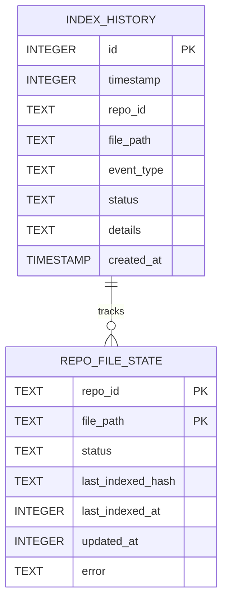
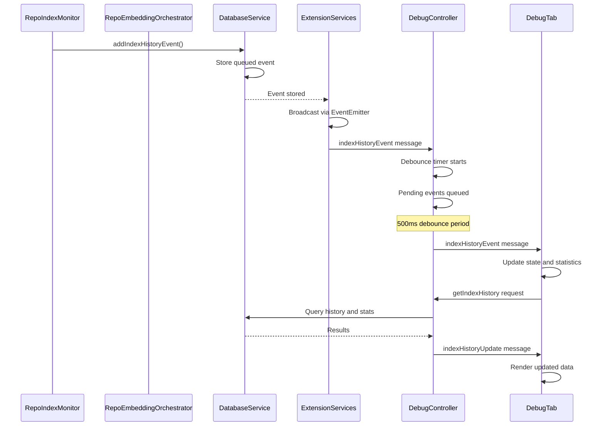
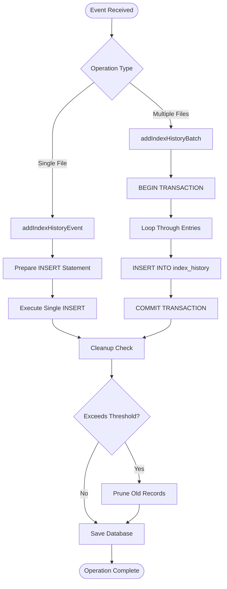
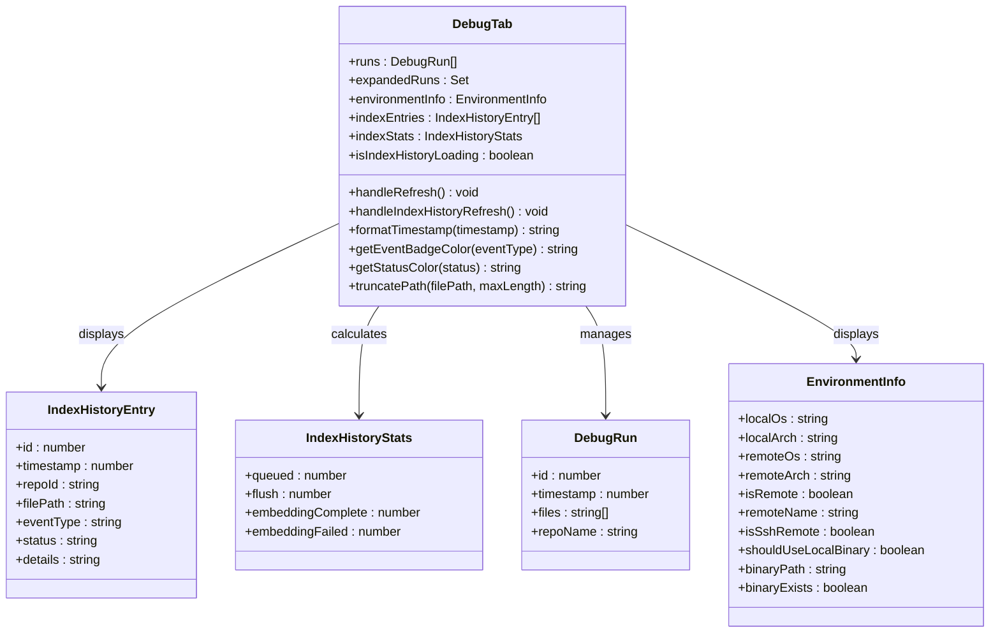

# Index History Tracking System

<cite>
**Referenced Files in This Document**
- [DebugTab.tsx](file://src/webview/components/DebugTab.tsx)
- [DebugController.ts](file://src/webview/controllers/DebugController.ts)
- [IndexHistoryController.ts](file://src/webview/controllers/IndexHistoryController.ts)
- [BaseController.ts](file://src/webview/controllers/BaseController.ts)
- [databaseService.ts](file://src/core/storage/databaseService.ts)
- [repoIndexMonitor.ts](file://src/core/indexing/repoIndexMonitor.ts)
- [repoEmbeddingOrchestrator.ts](file://src/core/indexing/repoEmbeddingOrchestrator.ts)
- [ExtensionServices.ts](file://src/core/services/ExtensionServices.ts)
- [messageSchemas.ts](file://src/webview/messageSchemas.ts)
</cite>

## Update Summary
**Changes Made**
- Updated architecture to reflect the new bidirectional communication system with ExtensionServices singleton
- Enhanced real-time event streaming with indexHistoryEventEmitter for immediate webview updates
- Improved event processing in RepoEmbeddingOrchestrator and RepoIndexMonitor with individual event emission
- Optimized addIndexHistoryBatch method for efficient batch operations
- Updated UI implementation to leverage the new real-time event system
- Revised system architecture diagrams to show the centralized ExtensionServices approach

## Table of Contents
1. [Introduction](#introduction)
2. [System Architecture](#system-architecture)
3. [Core Components](#core-components)
4. [Data Model](#data-model)
5. [Real-time Event Flow](#real-time-event-flow)
6. [Database Operations](#database-operations)
7. [UI Implementation](#ui-implementation)
8. [Performance Considerations](#performance-considerations)
9. [Troubleshooting Guide](#troubleshooting-guide)
10. [Conclusion](#conclusion)

## Introduction

The Index History Tracking System is a comprehensive debugging and monitoring solution designed to track and visualize indexing activities in the Repomix system. This system provides real-time visibility into repository indexing operations, allowing developers and users to understand the indexing pipeline, monitor progress, and troubleshoot issues effectively.

**Updated** The system has been enhanced with a sophisticated bidirectional communication architecture centered around the ExtensionServices singleton, providing real-time event streaming capabilities and improved performance through optimized event processing.

The system consists of three primary layers: a frontend React component for user interface, a controller layer for message handling and data management, and a backend database service for persistent storage and retrieval of indexing events. The architecture now features a centralized ExtensionServices singleton that manages real-time event broadcasting to all connected webview components.

## System Architecture

The Index History Tracking System is built on a layered architecture with a centralized ExtensionServices singleton that coordinates real-time communication between backend components and webview interfaces:

```mermaid
graph TB
subgraph "Centralized Extension Services"
ExtensionServices[ExtensionServices.ts<br/>Singleton Event Hub]
EventEmitter[EventEmitter<Omit<IndexHistoryEntry, 'id'>>]
end
subgraph "Frontend Layer"
DebugTab[DebugTab.tsx<br/>Integrated Debug Interface]
Controller[DebugController.ts<br/>Unified Controller]
IndexHistoryController[IndexHistoryController.ts<br/>Legacy Controller (Maintained) ]
end
subgraph "Communication Layer"
Schema[messageSchemas.ts<br/>Message Validation]
Base[BaseController.ts<br/>Base Controller]
end
subgraph "Backend Layer"
DB[databaseService.ts<br/>Database Service]
Monitor[repoIndexMonitor.ts<br/>Index Monitor]
Orchestrator[repoEmbeddingOrchestrator.ts<br/>Embedding Orchestrator]
end
subgraph "Data Storage"
SQLite[(SQLite Database)]
Table[index_history Table]
end
ExtensionServices --> EventEmitter
EventEmitter --> Controller
EventEmitter --> IndexHistoryController
Controller --> Base
Controller --> Schema
Controller --> DB
IndexHistoryController --> DB
Monitor --> DB
Orchestrator --> DB
Monitor --> ExtensionServices
Orchestrator --> ExtensionServices
DB --> SQLite
SQLite --> Table
```

**Diagram sources**
- [ExtensionServices.ts:18-89](file://src/core/services/ExtensionServices.ts#L18-L89)
- [DebugTab.tsx:1-472](file://src/webview/components/DebugTab.tsx#L1-L472)
- [DebugController.ts:1-230](file://src/webview/controllers/DebugController.ts#L1-L230)
- [IndexHistoryController.ts:1-115](file://src/webview/controllers/IndexHistoryController.ts#L1-L115)
- [BaseController.ts:1-19](file://src/webview/controllers/BaseController.ts#L1-L19)
- [databaseService.ts:111-286](file://src/core/storage/databaseService.ts#L111-L286)
- [repoIndexMonitor.ts:1-292](file://src/core/indexing/repoIndexMonitor.ts#L1-L292)
- [repoEmbeddingOrchestrator.ts:1-731](file://src/core/indexing/repoEmbeddingOrchestrator.ts#L1-L731)

**Updated** The architecture now centers around the ExtensionServices singleton, which provides a unified event broadcasting mechanism through the indexHistoryEventEmitter. This eliminates the need for complex message routing and enables real-time updates across all connected webview components.

## Core Components

### Centralized Extension Services Singleton

The [`ExtensionServices.ts`:18-89](file://src/core/services/ExtensionServices.ts#L18-L89) provides a singleton container for all extension-level services, featuring a dedicated event emitter for real-time communication:

- **Singleton Pattern**: Ensures long-running services persist across webview recreations
- **Event Broadcasting**: Centralized indexHistoryEventEmitter broadcasts events to all subscribers
- **Service Coordination**: Coordinates between indexing services and webview components
- **Lifecycle Management**: Proper initialization and disposal of all services

### Enhanced Real-time Event Streaming

The system now implements sophisticated real-time event streaming through the ExtensionServices singleton:

- **Immediate Event Delivery**: Events are broadcast immediately upon creation
- **Individual Event Emission**: Each event triggers a separate broadcast for granular updates
- **Event Aggregation**: Multiple events can be batched and delivered efficiently
- **Subscriber Management**: Automatic subscription and unsubscription of webview components

### Improved Event Processing

Both [`RepoIndexMonitor`:139-153](file://src/core/indexing/repoIndexMonitor.ts#L139-L153) and [`RepoEmbeddingOrchestrator`:454-465](file://src/core/indexing/repoEmbeddingOrchestrator.ts#L454-L465) now implement enhanced event processing:

- **Queued Events**: Individual file queuing triggers immediate event emission
- **Flush Events**: Batch operations emit multiple events for each processed file
- **Completion Events**: Successful embedding operations emit completion events
- **Failure Events**: Failed embedding operations emit error events

### Optimized Database Operations

The [`databaseService.ts`:1456-1491](file://src/core/storage/databaseService.ts#L1456-L1491) provides optimized batch operations for efficient event storage:

- **Transaction Batching**: Multiple events are inserted within a single transaction
- **Efficient Cleanup**: Automatic cleanup maintains optimal database performance
- **Individual Event Support**: addIndexHistoryEvent supports single event insertion
- **Batch Event Support**: addIndexHistoryBatch optimizes bulk operations

**Section sources**
- [ExtensionServices.ts:18-89](file://src/core/services/ExtensionServices.ts#L18-L89)
- [repoIndexMonitor.ts:139-153](file://src/core/indexing/repoIndexMonitor.ts#L139-L153)
- [repoEmbeddingOrchestrator.ts:454-465](file://src/core/indexing/repoEmbeddingOrchestrator.ts#L454-L465)
- [databaseService.ts:1456-1491](file://src/core/storage/databaseService.ts#L1456-L1491)

## Data Model

The system uses a structured approach to data modeling with clear separation of concerns:



**Diagram sources**
- [databaseService.ts:223-235](file://src/core/storage/databaseService.ts#L223-L235)
- [databaseService.ts:210-221](file://src/core/storage/databaseService.ts#L210-L221)

The index history table maintains a comprehensive audit trail of all indexing operations with the following event types:
- **queued**: Files queued for re-indexing
- **flush**: Batch operations containing multiple files
- **embedding_complete**: Successful embedding completion
- **embedding_failed**: Failed embedding attempts

**Section sources**
- [databaseService.ts:223-235](file://src/core/storage/databaseService.ts#L223-L235)
- [repoIndexMonitor.ts:133-140](file://src/core/indexing/repoIndexMonitor.ts#L133-L140)

## Real-time Event Flow

The system implements a sophisticated real-time event streaming mechanism through the ExtensionServices singleton that ensures efficient communication between components:



**Diagram sources**
- [repoIndexMonitor.ts:139-153](file://src/core/indexing/repoIndexMonitor.ts#L139-L153)
- [repoEmbeddingOrchestrator.ts:454-465](file://src/core/indexing/repoEmbeddingOrchestrator.ts#L454-L465)
- [ExtensionServices.ts](file://src/core/services/ExtensionServices.ts#L24)
- [DebugController.ts:24-43](file://src/webview/controllers/DebugController.ts#L24-L43)
- [DebugTab.tsx:25-89](file://src/webview/components/DebugTab.tsx#L25-L89)

**Updated** The event flow now flows through the ExtensionServices singleton, which provides centralized event broadcasting. Each event is immediately emitted to all subscribed controllers, enabling real-time updates across all webview components.

The event flow follows these key principles:
1. **Immediate Recording**: Events are recorded as soon as they occur
2. **Centralized Broadcasting**: ExtensionServices singleton broadcasts events to all subscribers
3. **Debounced Delivery**: Multiple events are batched before UI updates
4. **Real-time Updates**: New events appear instantly in the Debug tab
5. **Historical Queries**: Users can refresh to see complete history through the integrated interface

**Section sources**
- [repoIndexMonitor.ts:139-153](file://src/core/indexing/repoIndexMonitor.ts#L139-L153)
- [repoEmbeddingOrchestrator.ts:454-465](file://src/core/indexing/repoEmbeddingOrchestrator.ts#L454-L465)
- [ExtensionServices.ts](file://src/core/services/ExtensionServices.ts#L24)
- [DebugController.ts:24-43](file://src/webview/controllers/DebugController.ts#L24-L43)
- [DebugTab.tsx:25-89](file://src/webview/components/DebugTab.tsx#L25-L89)

## Database Operations

The database service implements several optimized operations for managing index history data:

### Event Insertion Strategies

The system employs two distinct insertion strategies based on operation type:



**Diagram sources**
- [databaseService.ts:1456-1491](file://src/core/storage/databaseService.ts#L1456-L1491)
- [databaseService.ts:1492-1539](file://src/core/storage/databaseService.ts#L1492-L1539)

### Automatic Cleanup Mechanism

The system implements an intelligent cleanup mechanism that maintains optimal database performance:

- **Threshold-based Cleanup**: Triggers cleanup every 50 insertions
- **Size Limit Enforcement**: Maintains maximum 500 historical records
- **Efficient Pruning**: Removes oldest records while preserving newest
- **Transaction Safety**: Ensures cleanup operations don't corrupt data

**Section sources**
- [databaseService.ts:1456-1491](file://src/core/storage/databaseService.ts#L1456-L1491)
- [databaseService.ts:1492-1539](file://src/core/storage/databaseService.ts#L1492-L1539)
- [databaseService.ts:1595-1604](file://src/core/storage/databaseService.ts#L1595-L1604)

## UI Implementation

The frontend component provides a comprehensive user interface with advanced features:

### Integrated Debug Tab Architecture

The [`DebugTab.tsx`:1-472](file://src/webview/components/DebugTab.tsx#L1-L472) implements a sophisticated React component with the following structure:



**Diagram sources**
- [DebugTab.tsx:6-21](file://src/webview/components/DebugTab.tsx#L6-L21)
- [DebugTab.tsx:304-381](file://src/webview/components/DebugTab.tsx#L304-L381)

**Updated** The UI architecture now leverages the new real-time event system, providing instant updates through the centralized ExtensionServices event broadcasting mechanism.

### Visual Design Features

The component implements a clean, professional design optimized for debugging scenarios:

- **Color-coded Event Types**: Different visual treatments for various event categories
- **Status Indicators**: Color-coded status displays for quick scanning
- **Responsive Layout**: Adapts to different screen sizes and VS Code themes
- **Performance Optimizations**: Efficient rendering with virtualization concepts
- **Integrated Sections**: Combines debugging runs, index history, and environment information in one cohesive interface
- **Real-time Updates**: Instant visual feedback through event-driven architecture

**Section sources**
- [DebugTab.tsx:304-381](file://src/webview/components/DebugTab.tsx#L304-L381)
- [DebugTab.tsx:382-472](file://src/webview/components/DebugTab.tsx#L382-L472)

## Performance Considerations

The system is designed with several performance optimizations:

### Memory Management
- **Event Batching**: Reduces UI update frequency through intelligent batching
- **Automatic Cleanup**: Prevents memory bloat through threshold-based pruning
- **State Optimization**: Minimizes state updates to essential changes only
- **Integrated Loading**: Single loading timeout for index history section
- **Centralized Event Management**: Reduces memory overhead through singleton pattern

### Database Efficiency
- **Index Utilization**: Strategic indexing on frequently queried columns
- **Transaction Batching**: Groups related operations for better performance
- **Size Limits**: Prevents database growth through automatic pruning
- **Efficient Batch Operations**: Optimized addIndexHistoryBatch for bulk inserts

### Network Optimization
- **Debounced Updates**: Reduces message traffic during rapid event sequences
- **Selective Loading**: Loads only recent history by default
- **Efficient Serialization**: Optimized data transfer between layers
- **Centralized Communication**: Single point of contact for event broadcasting

### Real-time Event System
- **Immediate Delivery**: Events bypass traditional message queues for instant updates
- **Event Aggregation**: Multiple events can be efficiently batched and delivered
- **Subscriber Management**: Automatic handling of webview component subscriptions
- **Memory Efficiency**: Centralized event management reduces memory overhead

## Troubleshooting Guide

Common issues and their solutions:

### Event Not Appearing in Debug Tab
1. **Verify ExtensionServices Initialization**: Ensure the singleton is properly initialized
2. **Check Event Types**: Confirm events are being recorded with valid types
3. **Monitor Debounce Timer**: Wait for 500ms batch processing to complete
4. **Refresh Debug Tab**: Use the Refresh button in the Index History section
5. **Validate Event Emitter**: Check that indexHistoryEventEmitter is properly broadcasting

### Performance Issues
1. **Database Size**: Check if cleanup is functioning properly
2. **UI Updates**: Verify that batching is preventing excessive re-renders
3. **Memory Usage**: Monitor for potential memory leaks in event handling
4. **Integrated Loading**: Check if the 5-second timeout is triggering
5. **Event Frequency**: Monitor event rate to ensure it's not overwhelming the system

### Data Integrity Problems
1. **Transaction Failures**: Check rollback mechanisms for failed operations
2. **Index Consistency**: Verify that cleanup operations maintain referential integrity
3. **Event Ordering**: Ensure timestamp-based ordering remains consistent
4. **Event Duplication**: Check for duplicate event emissions in the system

### Debug Tab Specific Issues
1. **Index History Not Loading**: Check if the 5-second timeout is preventing loading indicators
2. **Environment Information Missing**: Verify that environment detection is working correctly
3. **Recent Runs Section Empty**: Confirm that debug runs are being recorded properly
4. **Event Streaming Issues**: Verify that the ExtensionServices event emitter is functioning

### Extension Services Issues
1. **Singleton Not Initialized**: Ensure ExtensionServices.initialize() is called during activation
2. **Event Emitter Problems**: Check that indexHistoryEventEmitter is properly instantiated
3. **Service Lifecycle**: Verify that services are properly disposed during deactivation
4. **Event Subscription**: Confirm that webview components are properly subscribing to events

**Section sources**
- [ExtensionServices.ts:64-69](file://src/core/services/ExtensionServices.ts#L64-L69)
- [DebugController.ts:49-60](file://src/webview/controllers/DebugController.ts#L49-L60)
- [databaseService.ts:1205-1208](file://src/core/storage/databaseService.ts#L1205-L1208)
- [DebugTab.tsx:70-89](file://src/webview/components/DebugTab.tsx#L70-L89)

## Conclusion

The Index History Tracking System provides a robust, scalable solution for monitoring and debugging repository indexing operations. The recent enhancements with the ExtensionServices singleton and real-time event streaming create a more responsive and efficient system while maintaining all functionality.

**Updated** Key strengths of the enhanced system include:
- **Centralized Event Management**: ExtensionServices singleton provides unified event broadcasting
- **Real-time Visibility**: Immediate event delivery through indexHistoryEventEmitter
- **Enhanced Performance**: Optimized batch operations and efficient memory management
- **Scalable Architecture**: Supports multiple webview components through centralized communication
- **Developer-Friendly Interface**: Offers clear visual indicators and statistics in an integrated layout
- **Robust Event System**: Reliable event processing with proper error handling and cleanup

The system successfully balances functionality with performance, making it suitable for both development and production environments. The modular design allows for easy extension and modification as requirements evolve, while the centralized approach reduces complexity and improves maintainability.

**Legacy Support**: The IndexHistoryController remains available for backward compatibility, ensuring that external systems relying on the previous architecture continue to function properly during the transition period.

**Centralized Communication**: The new bidirectional communication architecture eliminates the need for complex message routing and provides a more reliable and efficient way to manage real-time updates across all webview components.