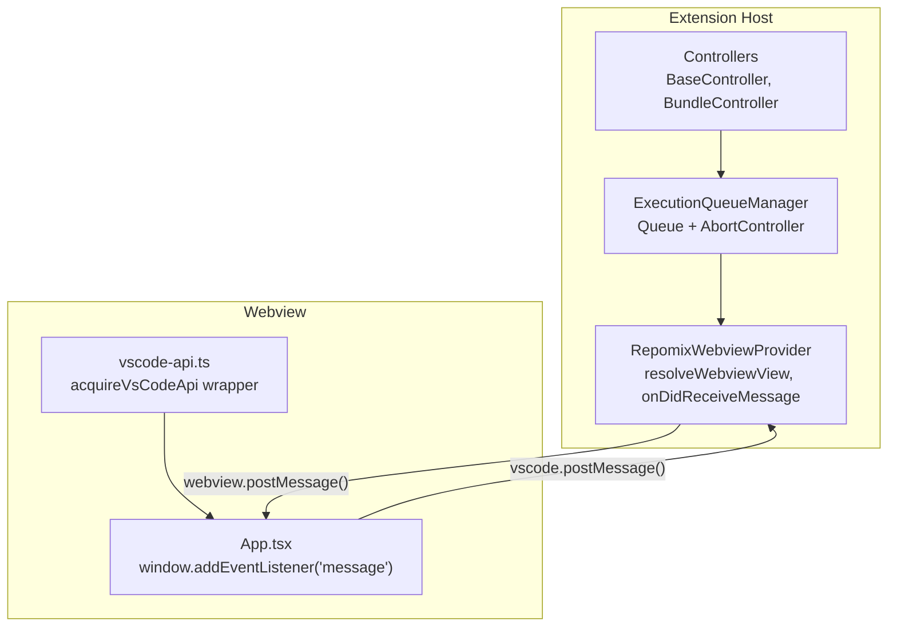
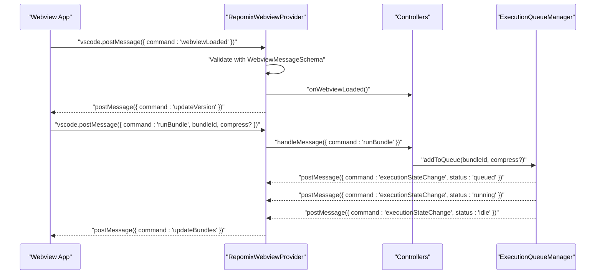
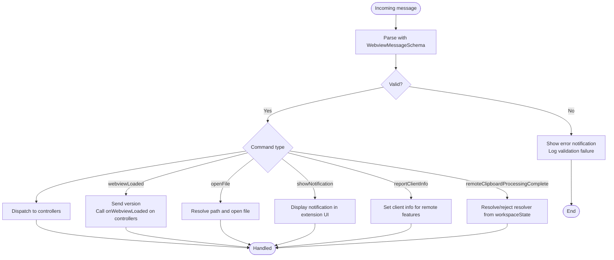
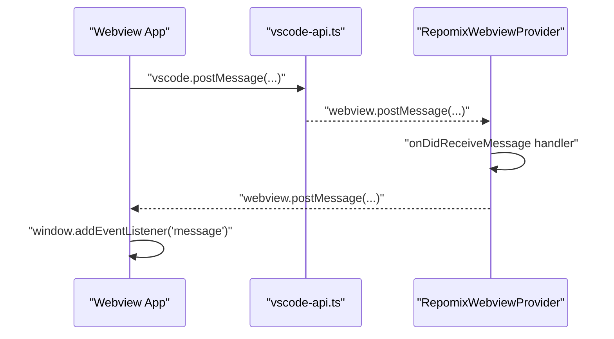
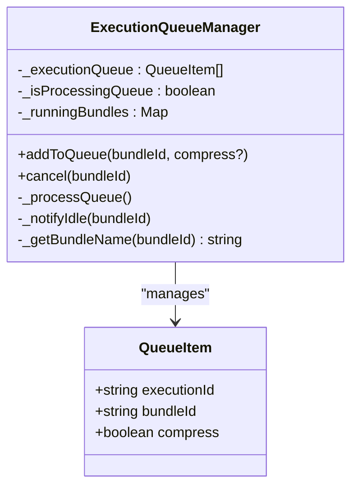
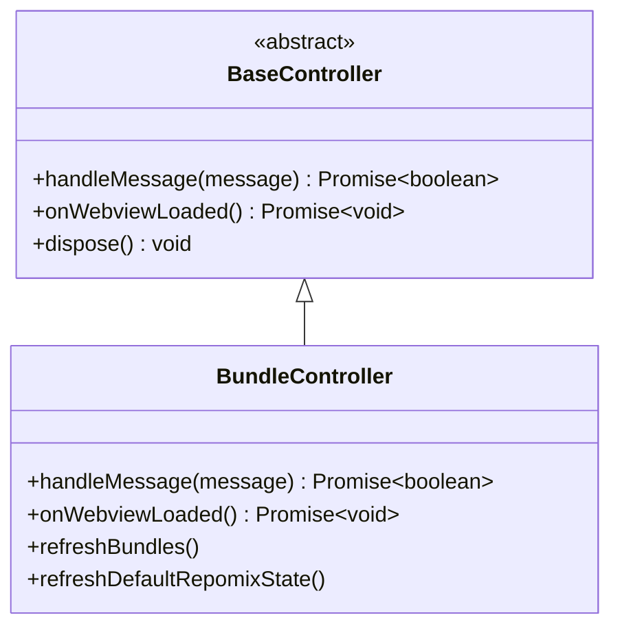
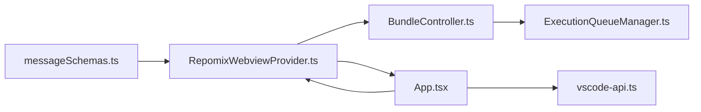

# Message Handling System

<cite>
**Referenced Files in This Document**
- [messageSchemas.ts](file://src/webview/messageSchemas.ts)
- [RepomixWebviewProvider.ts](file://src/webview/RepomixWebviewProvider.ts)
- [App.tsx](file://src/webview/App.tsx)
- [vscode-api.ts](file://src/webview/vscode-api.ts)
- [ExecutionQueueManager.ts](file://src/webview/services/ExecutionQueueManager.ts)
- [BaseController.ts](file://src/webview/controllers/BaseController.ts)
- [BundleController.ts](file://src/webview/controllers/BundleController.ts)
- [types.ts](file://src/webview/types.ts)
- [messageSchemas.test.ts](file://src/test/webview/messageSchemas.test.ts)
</cite>

## Table of Contents
1. [Introduction](#introduction)
2. [Project Structure](#project-structure)
3. [Core Components](#core-components)
4. [Architecture Overview](#architecture-overview)
5. [Detailed Component Analysis](#detailed-component-analysis)
6. [Dependency Analysis](#dependency-analysis)
7. [Performance Considerations](#performance-considerations)
8. [Troubleshooting Guide](#troubleshooting-guide)
9. [Conclusion](#conclusion)
10. [Appendices](#appendices)

## Introduction
This document describes the bidirectional message handling system between the VS Code extension and the webview. It explains the message schema definitions, communication protocols, and event-driven patterns used for data exchange. It also documents the ExecutionQueueManager service responsible for orchestrating asynchronous operations and command execution, along with serialization/deserialization and error handling strategies. Security considerations, validation, and debugging techniques are covered, including how the system manages concurrency, queues, and state synchronization across the webview-extension boundary.

## Project Structure
The messaging system spans three primary areas:
- Message schema definitions and validation
- Extension-side webview provider and message dispatch
- Webview-side React app and message listeners

**Diagram sources**
- [RepomixWebviewProvider.ts](file://src/webview/RepomixWebviewProvider.ts#L43-L195)
- [App.tsx](file://src/webview/App.tsx#L75-L145)
- [vscode-api.ts](file://src/webview/vscode-api.ts#L1-L24)
- [ExecutionQueueManager.ts](file://src/webview/services/ExecutionQueueManager.ts#L15-L133)
- [BaseController.ts](file://src/webview/controllers/BaseController.ts#L1-L19)
- [BundleController.ts](file://src/webview/controllers/BundleController.ts#L1-L257)

**Section sources**
- [RepomixWebviewProvider.ts](file://src/webview/RepomixWebviewProvider.ts#L1-L288)
- [App.tsx](file://src/webview/App.tsx#L1-L258)
- [vscode-api.ts](file://src/webview/vscode-api.ts#L1-L24)

## Core Components
- Message schemas: A single discriminated union schema validates inbound messages from the webview.
- Extension provider: Receives messages, validates them, routes to controllers, and posts updates back to the webview.
- Webview app: Registers a message listener, sends lifecycle and action messages, and updates UI state.
- ExecutionQueueManager: Manages asynchronous execution queues, cancellation via AbortController, and state transitions.
- Controllers: Handle domain-specific commands and maintain UI state synchronization.

**Section sources**
- [messageSchemas.ts](file://src/webview/messageSchemas.ts#L443-L515)
- [RepomixWebviewProvider.ts](file://src/webview/RepomixWebviewProvider.ts#L90-L195)
- [App.tsx](file://src/webview/App.tsx#L75-L145)
- [ExecutionQueueManager.ts](file://src/webview/services/ExecutionQueueManager.ts#L15-L133)
- [BaseController.ts](file://src/webview/controllers/BaseController.ts#L1-L19)
- [BundleController.ts](file://src/webview/controllers/BundleController.ts#L1-L257)

## Architecture Overview
The system follows a strict event-driven protocol:
- The webview posts messages to the extension using a VS Code API wrapper.
- The extension validates messages against a central Zod schema, then dispatches to controllers.
- Controllers orchestrate work (including queueing), and post structured updates back to the webview.
- The webview updates UI state and reflects execution progress.

**Diagram sources**
- [App.tsx](file://src/webview/App.tsx#L129-L132)
- [RepomixWebviewProvider.ts](file://src/webview/RepomixWebviewProvider.ts#L92-L133)
- [BundleController.ts](file://src/webview/controllers/BundleController.ts#L38-L60)
- [ExecutionQueueManager.ts](file://src/webview/services/ExecutionQueueManager.ts#L26-L118)
- [RepomixWebviewProvider.ts](file://src/webview/RepomixWebviewProvider.ts#L37-L41)

## Detailed Component Analysis

### Message Schema Definitions and Validation
- A discriminated union schema defines all supported inbound commands and their typed payloads.
- Validation occurs before routing to controllers. Certain commands require refined validation (e.g., secret saving).
- Tests confirm valid and invalid shapes for representative commands.

**Diagram sources**
- [RepomixWebviewProvider.ts](file://src/webview/RepomixWebviewProvider.ts#L92-L195)
- [messageSchemas.ts](file://src/webview/messageSchemas.ts#L443-L515)

**Section sources**
- [messageSchemas.ts](file://src/webview/messageSchemas.ts#L1-L517)
- [RepomixWebviewProvider.ts](file://src/webview/RepomixWebviewProvider.ts#L92-L195)
- [messageSchemas.test.ts](file://src/test/webview/messageSchemas.test.ts#L1-L93)

### Communication Protocols: vscode.postMessage() and window.addEventListener('message')
- Webview-to-extension:
  - The webview posts messages using a singleton VS Code API wrapper.
  - Typical lifecycle and action messages include loading, running bundles, copying outputs, and reporting client info.
- Extension-to-webview:
  - The extension posts updates such as bundle lists, execution state changes, version info, and notifications.
- Event-driven pattern:
  - The webview registers a single message listener and switches on the command field to update state.

**Diagram sources**
- [App.tsx](file://src/webview/App.tsx#L78-L128)
- [vscode-api.ts](file://src/webview/vscode-api.ts#L12-L23)
- [RepomixWebviewProvider.ts](file://src/webview/RepomixWebviewProvider.ts#L37-L41)

**Section sources**
- [App.tsx](file://src/webview/App.tsx#L75-L145)
- [vscode-api.ts](file://src/webview/vscode-api.ts#L1-L24)
- [RepomixWebviewProvider.ts](file://src/webview/RepomixWebviewProvider.ts#L92-L195)

### ExecutionQueueManager: Asynchronous Operations and Command Execution
- Purpose:
  - Enqueues execution requests, tracks running jobs, supports cancellation, and notifies state changes.
- Concurrency and cancellation:
  - Uses AbortController per running bundle to support cooperative cancellation.
  - Prevents concurrent processing by guarding the processing loop with an internal flag.
- State transitions:
  - Emits 'executionStateChange' with statuses: queued, running, idle.
- Integration:
  - Emits UI refresh callbacks after successful runs.

**Diagram sources**
- [ExecutionQueueManager.ts](file://src/webview/services/ExecutionQueueManager.ts#L7-L24)
- [ExecutionQueueManager.ts](file://src/webview/services/ExecutionQueueManager.ts#L15-L133)

**Section sources**
- [ExecutionQueueManager.ts](file://src/webview/services/ExecutionQueueManager.ts#L15-L133)

### Controllers: Routing and State Synchronization
- BaseController:
  - Defines the IWebviewContext contract and the abstract handleMessage method.
- BundleController:
  - Handles bundle run/cancel/copy commands.
  - Refreshes bundle metadata and default Repomix state with debouncing and file watchers.
  - Emits 'updateBundles' and 'updateDefaultRepomix' messages.

**Diagram sources**
- [BaseController.ts](file://src/webview/controllers/BaseController.ts#L3-L19)
- [BundleController.ts](file://src/webview/controllers/BundleController.ts#L17-L65)

**Section sources**
- [BaseController.ts](file://src/webview/controllers/BaseController.ts#L1-L19)
- [BundleController.ts](file://src/webview/controllers/BundleController.ts#L1-L257)

### Webview State Types and UI Synchronization
- WebView state includes tabs, agent history, Pinecone indexes, and default Repomix info.
- The webview persists selected tab and other UI state via the VS Code API state mechanism.
- The webview listens for messages to update UI state and reflect execution progress.

**Section sources**
- [types.ts](file://src/webview/types.ts#L105-L113)
- [App.tsx](file://src/webview/App.tsx#L47-L145)

## Dependency Analysis
- Message schemas are consumed by the extension provider for validation and by tests for verification.
- The provider depends on controllers and the queue manager to handle commands.
- The webview depends on the VS Code API wrapper and reacts to messages posted by the extension.

**Diagram sources**
- [messageSchemas.ts](file://src/webview/messageSchemas.ts#L443-L515)
- [RepomixWebviewProvider.ts](file://src/webview/RepomixWebviewProvider.ts#L1-L288)
- [BundleController.ts](file://src/webview/controllers/BundleController.ts#L1-L257)
- [ExecutionQueueManager.ts](file://src/webview/services/ExecutionQueueManager.ts#L1-L133)
- [App.tsx](file://src/webview/App.tsx#L1-L258)
- [vscode-api.ts](file://src/webview/vscode-api.ts#L1-L24)

**Section sources**
- [messageSchemas.ts](file://src/webview/messageSchemas.ts#L443-L515)
- [RepomixWebviewProvider.ts](file://src/webview/RepomixWebviewProvider.ts#L1-L288)
- [App.tsx](file://src/webview/App.tsx#L1-L258)

## Performance Considerations
- Debouncing:
  - Bundle and default Repomix state refreshes are debounced to avoid excessive updates.
- Watchers:
  - File system watchers are created per output path and cleaned up when no longer needed.
- Queue processing:
  - The queue manager prevents concurrent processing and serializes execution to reduce contention.
- UI updates:
  - Initial state is sent quickly with cached stats, followed by a second pass to enrich with computed stats.

**Section sources**
- [BundleController.ts](file://src/webview/controllers/BundleController.ts#L67-L134)
- [ExecutionQueueManager.ts](file://src/webview/services/ExecutionQueueManager.ts#L62-L118)

## Troubleshooting Guide
- Message validation failures:
  - The extension logs validation errors and displays a user-visible error notification. Inspect the logged command and payload shape.
- Unhandled commands:
  - If no controller handles a command, a warning is logged. Verify the command name and controller registration.
- Cancellation:
  - If cancellation is not effective, ensure the AbortController is used consistently during execution and that the queue removes the job after completion.
- Remote clipboard:
  - The webview disables remote clipboard processing and immediately rejects such requests to prevent hangs.

**Section sources**
- [RepomixWebviewProvider.ts](file://src/webview/RepomixWebviewProvider.ts#L110-L116)
- [App.tsx](file://src/webview/App.tsx#L115-L124)
- [ExecutionQueueManager.ts](file://src/webview/services/ExecutionQueueManager.ts#L100-L115)

## Conclusion
The message handling system provides a robust, validated, and event-driven bridge between the extension and the webview. Centralized schema validation ensures reliable message parsing, while controllers and the queue manager coordinate asynchronous operations safely. The webview’s message listener and state persistence mechanisms keep the UI synchronized with extension-side state. Together, these components deliver a secure, maintainable, and extensible communication framework.

## Appendices

### Common Message Patterns
- Lifecycle
  - webviewLoaded: Sent by the webview on mount; triggers version and controller initialization.
  - updateVersion: Sent by the extension to inform the webview of the current version.
- Execution
  - runBundle, cancelBundle, copyBundleOutput: Control individual bundle execution and output handling.
  - runDefaultRepomix, cancelDefaultRepomix, copyDefaultRepomixOutput: Control default Repomix execution and output handling.
  - executionStateChange: Emitted by the queue manager to indicate queued, running, or idle states.
- Data Updates
  - updateBundles: Sent by the bundle controller to update bundle metadata and stats.
  - updateDefaultRepomix: Sent by the bundle controller to update default Repomix state.
- Diagnostics
  - showNotification: Used by controllers to surface notifications to the user.
  - reportClientInfo: Sent by the webview to report client OS/arch for remote feature support.

**Section sources**
- [App.tsx](file://src/webview/App.tsx#L88-L100)
- [BundleController.ts](file://src/webview/controllers/BundleController.ts#L118-L133)
- [RepomixWebviewProvider.ts](file://src/webview/RepomixWebviewProvider.ts#L119-L133)
- [ExecutionQueueManager.ts](file://src/webview/services/ExecutionQueueManager.ts#L30-L34)