# Message Handling System

<cite>
**Referenced Files in This Document**
- [messageSchemas.ts](file://src/webview/messageSchemas.ts)
- [RepomixWebviewProvider.ts](file://src/webview/RepomixWebviewProvider.ts)
- [App.tsx](file://src/webview/App.tsx)
- [vscode-api.ts](file://src/webview/vscode-api.ts)
- [ExecutionQueueManager.ts](file://src/webview/services/ExecutionQueueManager.ts)
- [BaseController.ts](file://src/webview/controllers/BaseController.ts)
- [BundleController.ts](file://src/webview/controllers/BundleController.ts)
- [ChatController.ts](file://src/webview/controllers/ChatController.ts)
- [ApplyController.ts](file://src/webview/controllers/ApplyController.ts)
- [types.ts](file://src/webview/types.ts)
- [messageSchemas.test.ts](file://src/test/webview/messageSchemas.test.ts)
- [graphExecutor.ts](file://src/chat/queue/graphExecutor.ts)
- [messageQueue.ts](file://src/chat/queue/messageQueue.ts)
- [types.ts](file://src/chat/queue/types.ts)
- [index.ts](file://src/chat/queue/index.ts)
- [MessageQueueIndicator.tsx](file://src/webview/components/ai-chat/MessageQueueIndicator.tsx)
- [QueuePanel.tsx](file://src/webview/components/ai-chat/QueuePanel.tsx)
- [ChatInput.tsx](file://src/webview/components/ai-chat/ChatInput.tsx)
- [ChatSettingsTab.tsx](file://src/webview/components/ai-chat/ChatSettingsTab.tsx)
- [contentAnalyst.ts](file://src/core/patching/contentAnalyst.ts)
- [codePatcher.ts](file://src/core/patching/codePatcher.ts)
- [searchReplaceApplier.ts](file://src/chat/apply/searchReplaceApplier.ts)
- [007_message_queue_system.md](file://PRDs/007_message_queue_system.md)
- [010_chat_settings_ui.md](file://PRDs/010_chat_settings_ui.md)
- [threadRepository.ts](file://src/chat/db/threadRepository.ts)
- [postgresClient.ts](file://src/chat/db/postgresClient.ts)
- [memoryManager.ts](file://src/chat/memory/memoryManager.ts)
</cite>

## Update Summary
**Changes Made**
- Enhanced chat settings management with comprehensive timeout mechanisms (8-second settings load timeout, 10-second database initialization timeout)
- Improved error handling with graceful degradation when database connectivity is unavailable
- Added offline handling capabilities with fallback UI for database operations
- Enhanced PostgreSQL connection testing with improved timeout handling (5-second connection timeout)
- Implemented retry mechanisms for transient database errors with exponential backoff
- Added comprehensive error state management for database connectivity failures

## Table of Contents
1. [Introduction](#introduction)
2. [Project Structure](#project-structure)
3. [Core Components](#core-components)
4. [Architecture Overview](#architecture-overview)
5. [Detailed Component Analysis](#detailed-component-analysis)
6. [Enhanced Message Queue System](#enhanced-message-queue-system)
7. [Thread Management System](#thread-management-system)
8. [Enhanced Chat Settings and Database Integration](#enhanced-chat-settings-and-database-integration)
9. [Memory Manager CRUD Operations](#memory-manager-crud-operations)
10. [Chat History Management](#chat-history-management)
11. [GraphExecutor Service](#graphexecutor-service)
12. [MessageQueue Management](#messagequeue-management)
13. [Queue UI Components](#queue-ui-components)
14. [Enhanced Fuzzy Matching System](#enhanced-fuzzy-matching-system)
15. [Performance Optimization Strategies](#performance-optimization-strategies)
16. [Dependency Analysis](#dependency-analysis)
17. [Performance Considerations](#performance-considerations)
18. [Troubleshooting Guide](#troubleshooting-guide)
19. [Conclusion](#conclusion)
20. [Appendices](#appendices)

## Introduction
This document describes the bidirectional message handling system between the VS Code extension and the webview, with a focus on the enhanced message schemas supporting comprehensive thread management, chat settings with database connectivity, and the robust message queue system introduced in PRD 007. The system now includes sophisticated queue management for handling multiple concurrent messages, thread-based conversation persistence, chat settings management with PostgreSQL integration, memory manager CRUD operations, and optimized fuzzy matching algorithms with event loop yielding to prevent UI blocking during large file processing. **Updated** The system now features comprehensive timeout mechanisms, improved error handling, and offline capabilities for database operations.

## Project Structure
The messaging system spans six primary areas:
- Enhanced message schema definitions and validation with thread management and settings support
- Extension-side webview provider and message dispatch with database integration
- Webview-side React app and message listeners with expanded UI components
- Queue management system with GraphExecutor and comprehensive UI components
- Thread management with PostgreSQL persistence and search capabilities
- Enhanced chat settings management with timeout mechanisms and offline handling
- Memory manager CRUD operations for session and repository-scoped memory storage

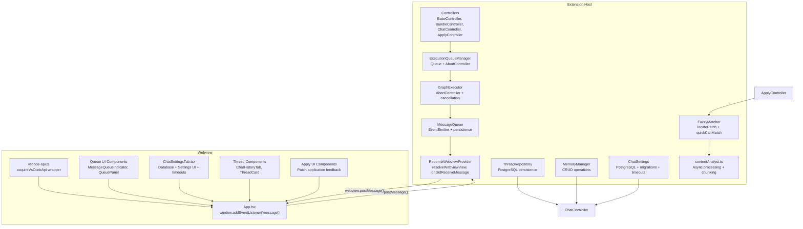

**Diagram sources**
- [RepomixWebviewProvider.ts](file://src/webview/RepomixWebviewProvider.ts#L43-L195)
- [App.tsx](file://src/webview/App.tsx#L75-L145)
- [vscode-api.ts](file://src/webview/vscode-api.ts#L1-L24)
- [ExecutionQueueManager.ts](file://src/webview/services/ExecutionQueueManager.ts#L15-L133)
- [BaseController.ts](file://src/webview/controllers/BaseController.ts#L1-L19)
- [BundleController.ts](file://src/webview/controllers/BundleController.ts#L1-L257)
- [ChatController.ts](file://src/webview/controllers/ChatController.ts#L1070-L1224)
- [ApplyController.ts](file://src/webview/controllers/ApplyController.ts#L1-L149)
- [graphExecutor.ts](file://src/chat/queue/graphExecutor.ts#L22-L86)
- [messageQueue.ts](file://src/chat/queue/messageQueue.ts#L20-L193)
- [MessageQueueIndicator.tsx](file://src/webview/components/ai-chat/MessageQueueIndicator.tsx#L1-L38)
- [QueuePanel.tsx](file://src/webview/components/ai-chat/QueuePanel.tsx#L1-L92)
- [ChatSettingsTab.tsx](file://src/webview/components/ai-chat/ChatSettingsTab.tsx#L95-L226)
- [contentAnalyst.ts](file://src/core/patching/contentAnalyst.ts#L56-L147)

**Section sources**
- [RepomixWebviewProvider.ts](file://src/webview/RepomixWebviewProvider.ts#L1-L288)
- [App.tsx](file://src/webview/App.tsx#L1-L258)
- [vscode-api.ts](file://src/webview/vscode-api.ts#L1-L24)

## Core Components
- Enhanced message schemas: A comprehensive discriminated union schema validates inbound messages from the webview, including new queue-related commands, thread management operations, chat settings management, and memory CRUD operations.
- Extension provider: Receives messages, validates them, routes to controllers, and posts updates back to the webview with database integration.
- Webview app: Registers a message listener, sends lifecycle and action messages, and updates UI state with expanded components.
- ExecutionQueueManager: Manages asynchronous execution queues, cancellation via AbortController, and state transitions.
- GraphExecutor: Executes graph-based operations with AbortController support for cancellation and cooperative cancellation.
- MessageQueue: Manages message queues with event emission, persistence, and queue manipulation operations.
- ThreadRepository: Provides PostgreSQL-backed thread and message persistence with search and archival capabilities.
- MemoryManager: Handles session and repository-scoped memory CRUD operations with validation and convenience methods.
- **Updated** Enhanced chat settings management: Manages chat configuration with PostgreSQL connectivity, migration support, timeout mechanisms, and offline handling capabilities.
- **Updated** Enhanced fuzzy matching system: Improved fuzzy matching with asynchronous processing, chunking, and sophisticated pre-filtering to prevent UI blocking.

**Section sources**
- [messageSchemas.ts](file://src/webview/messageSchemas.ts#L948-L1334)
- [RepomixWebviewProvider.ts](file://src/webview/RepomixWebviewProvider.ts#L92-L195)
- [App.tsx](file://src/webview/App.tsx#L75-L145)
- [ExecutionQueueManager.ts](file://src/webview/services/ExecutionQueueManager.ts#L15-L133)
- [BaseController.ts](file://src/webview/controllers/BaseController.ts#L1-L19)
- [BundleController.ts](file://src/webview/controllers/BundleController.ts#L1-L257)
- [ChatController.ts](file://src/webview/controllers/ChatController.ts#L1070-L1224)
- [ApplyController.ts](file://src/webview/controllers/ApplyController.ts#L1-L149)
- [graphExecutor.ts](file://src/chat/queue/graphExecutor.ts#L22-L86)
- [messageQueue.ts](file://src/chat/queue/messageQueue.ts#L20-L193)
- [threadRepository.ts](file://src/chat/db/threadRepository.ts#L46-L82)
- [memoryManager.ts](file://src/chat/memory/memoryManager.ts#L1-L39)
- [contentAnalyst.ts](file://src/core/patching/contentAnalyst.ts#L1-L247)

## Architecture Overview
The system follows a strict event-driven protocol with enhanced queue management, thread persistence, and comprehensive settings integration:
- The webview posts messages to the extension using a VS Code API wrapper.
- The extension validates messages against a central Zod schema, then dispatches to controllers with database integration.
- Controllers orchestrate work through the MessageQueue system, which coordinates GraphExecutor for graph-based operations.
- GraphExecutor handles cancellation via AbortController and provides cooperative cancellation support.
- The queue system emits events for queue status changes, processing start/end, and persistence.
- Thread management provides PostgreSQL-backed conversation persistence with search and archival capabilities.
- **Updated** Enhanced chat settings management includes database connectivity testing with timeout mechanisms, migration execution, architecture document refresh, and offline handling capabilities.
- Memory manager CRUD operations support both session and repository-scoped memory storage.
- The webview updates UI state and reflects execution progress through queue indicators, settings tabs, and thread management components.
- **Updated** The fuzzy matching system processes files asynchronously in chunks of 100 windows, yielding control back to the event loop to prevent UI blocking.

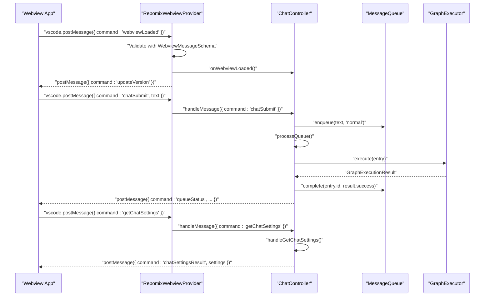

**Diagram sources**
- [App.tsx](file://src/webview/App.tsx#L129-L132)
- [RepomixWebviewProvider.ts](file://src/webview/RepomixWebviewProvider.ts#L92-L133)
- [ChatController.ts](file://src/webview/controllers/ChatController.ts#L1070-L1125)
- [messageQueue.ts](file://src/chat/queue/messageQueue.ts#L47-L101)
- [graphExecutor.ts](file://src/chat/queue/graphExecutor.ts#L37-L86)
- [RepomixWebviewProvider.ts](file://src/webview/RepomixWebviewProvider.ts#L37-L41)

## Detailed Component Analysis

### Enhanced Message Schema Definitions and Validation
- A comprehensive discriminated union schema defines all supported inbound commands and their typed payloads, including new queue-related commands, thread management operations, chat settings management, and memory CRUD operations.
- Validation occurs before routing to controllers. Certain commands require refined validation (e.g., secret saving, PostgreSQL connection string).
- The schema now includes comprehensive thread management commands: getThreads, createThread, setActiveThread, loadThread, getThreadHistoryPage, deleteThread, renameThread, exportThread, searchThreads, archiveThread, unarchiveThread, showArchivedThreads.
- Chat settings management commands include getChatSettings, setChatSetting, testPostgresConnection, runMigrations, refreshArchitectureNow.
- Memory CRUD commands: getMemories, createMemory, updateMemory, deleteMemory, searchMemories.
- Queue management commands: chatForceSubmit, chatStop, chatCancelQueued, chatClearQueue, getQueueStatus, queueStatus, queueProcessingStarted, queueProcessingCompleted.
- Tests confirm valid and invalid shapes for representative commands.

```mermaid
flowchart TD
Start(["Incoming message"]) --> Parse["Parse with WebviewMessageSchema"]
Parse --> Valid{"Valid?"}
Valid --> |No| Error["Show error notification<br/>Log validation failure"]
Valid --> |Yes| Command{"Command type"}
Command --> |webviewLoaded| Global["Send version<br/>Call onWebviewLoaded on controllers"]
Command --> |chatSubmit| Chat["Enqueue message<br/>Process queue"]
Command --> |chatForceSubmit| Force["Enqueue with force priority"]
Command --> |chatStop| Stop["Stop current execution"]
Command --> |chatCancelQueued| Cancel["Cancel specific queued message"]
Command --> |chatClearQueue| Clear["Clear all queued messages"]
Command --> |getQueueStatus| Status["Get queue status"]
Command --> |getThreads| Threads["Get thread list"]
Command --> |createThread| CreateThread["Create new thread"]
Command --> |setActiveThread| SetActive["Set active thread"]
Command --> |loadThread| LoadThread["Load thread history"]
Command --> |getThreadHistoryPage| ThreadHistory["Get thread history page"]
Command --> |deleteThread| DeleteThread["Delete thread"]
Command --> |renameThread| RenameThread["Rename thread"]
Command --> |exportThread| ExportThread["Export thread"]
Command --> |searchThreads| SearchThreads["Search threads"]
Command --> |archiveThread| ArchiveThread["Archive thread"]
Command --> |unarchiveThread| UnarchiveThread["Unarchive thread"]
Command --> |getChatSettings| GetSettings["Get chat settings"]
Command --> |setChatSetting| SetSetting["Set chat setting"]
Command --> |testPostgresConnection| TestDB["Test PostgreSQL connection"]
Command --> |runMigrations| RunMigrations["Run database migrations"]
Command --> |refreshArchitectureNow| RefreshArch["Refresh architecture"]
Command --> |getMemories| GetMemories["Get memories"]
Command --> |createMemory| CreateMemory["Create memory"]
Command --> |updateMemory| UpdateMemory["Update memory"]
Command --> |deleteMemory| DeleteMemory["Delete memory"]
Command --> |searchMemories| SearchMemories["Search memories"]
Command --> Other["Dispatch to controllers"]
Other --> Done(["Handled"])
Global --> Done
Chat --> Done
Force --> Done
Stop --> Done
Cancel --> Done
Clear --> Done
Status --> Done
Threads --> Done
CreateThread --> Done
SetActive --> Done
LoadThread --> Done
ThreadHistory --> Done
DeleteThread --> Done
RenameThread --> Done
ExportThread --> Done
SearchThreads --> Done
ArchiveThread --> Done
UnarchiveThread --> Done
GetSettings --> Done
SetSetting --> Done
TestDB --> Done
RunMigrations --> Done
RefreshArch --> Done
GetMemories --> Done
CreateMemory --> Done
UpdateMemory --> Done
DeleteMemory --> Done
SearchMemories --> Done
Error --> End(["End"])
```

**Diagram sources**
- [RepomixWebviewProvider.ts](file://src/webview/RepomixWebviewProvider.ts#L92-L195)
- [messageSchemas.ts](file://src/webview/messageSchemas.ts#L948-L1334)

**Section sources**
- [messageSchemas.ts](file://src/webview/messageSchemas.ts#L1-L1334)
- [RepomixWebviewProvider.ts](file://src/webview/RepomixWebviewProvider.ts#L92-L195)
- [messageSchemas.test.ts](file://src/test/webview/messageSchemas.test.ts#L1-L93)

### Communication Protocols: vscode.postMessage() and window.addEventListener('message')
- Webview-to-extension:
  - The webview posts messages using a singleton VS Code API wrapper.
  - Typical lifecycle and action messages include loading, running bundles, copying outputs, reporting client info, and comprehensive queue management commands.
  - **Updated** Thread management commands for creating, loading, renaming, deleting, archiving, and searching conversations.
  - **Updated** Enhanced chat settings commands with timeout mechanisms for database connectivity testing, migration execution, and architecture document refresh.
  - **Updated** Memory CRUD commands for session and repository-scoped memory operations.
- Extension-to-webview:
  - The extension posts updates such as bundle lists, execution state changes, version info, notifications, queue status updates, thread lists, chat settings, and memory lists.
  - **Updated** Progress notifications for long-running fuzzy matching operations and database migration processes.
  - **Updated** Timeout-aware responses for chat settings operations with graceful error handling.
- Event-driven pattern:
  - The webview registers a single message listener and switches on the command field to update state.
  - Queue status updates trigger UI component updates for MessageQueueIndicator and QueuePanel.
  - **Updated** Thread management updates through ChatHistoryTab and ThreadCard components.
  - **Updated** Enhanced chat settings updates through ChatSettingsTab with database connection status, timeout handling, and offline capabilities.
  - **Updated** Apply operation progress updates through the withProgress API.

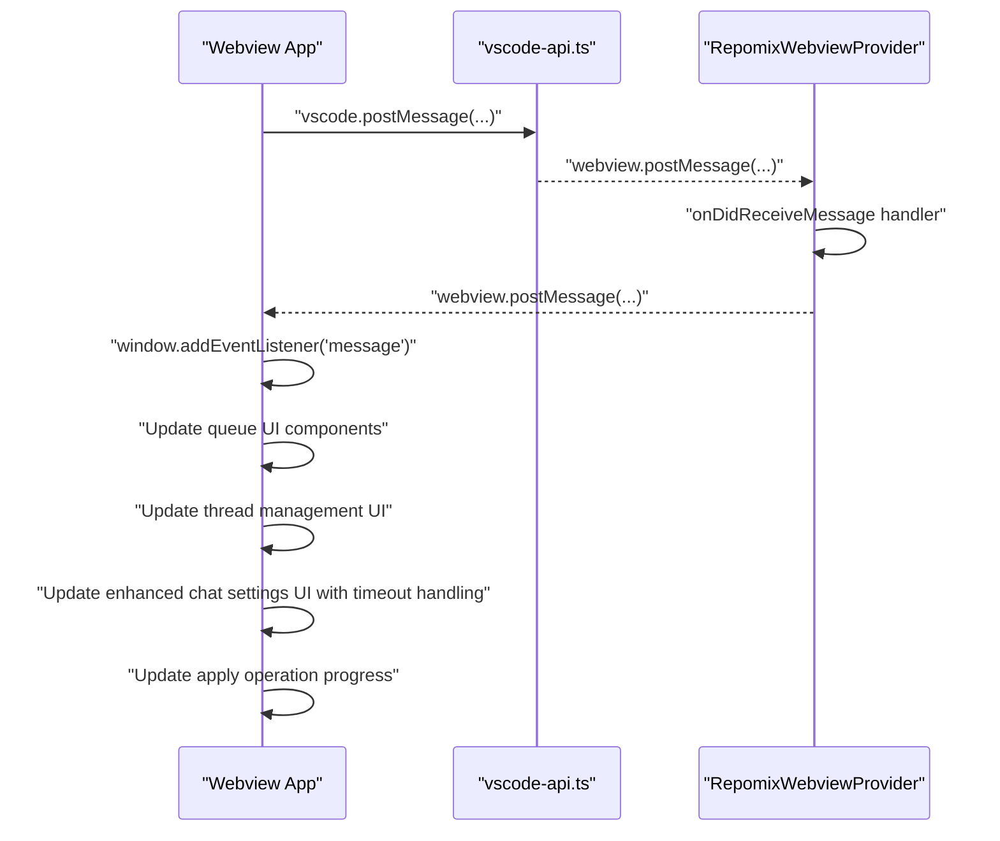

**Diagram sources**
- [App.tsx](file://src/webview/App.tsx#L78-L128)
- [vscode-api.ts](file://src/webview/vscode-api.ts#L12-L23)
- [RepomixWebviewProvider.ts](file://src/webview/RepomixWebviewProvider.ts#L37-L41)

**Section sources**
- [App.tsx](file://src/webview/App.tsx#L75-L145)
- [vscode-api.ts](file://src/webview/vscode-api.ts#L1-L24)
- [RepomixWebviewProvider.ts](file://src/webview/RepomixWebviewProvider.ts#L92-L195)

### ExecutionQueueManager: Asynchronous Operations and Command Execution
- Purpose:
  - Enqueues execution requests, tracks running jobs, supports cancellation, and notifies state changes.
- Concurrency and cancellation:
  - Uses AbortController per running bundle to support cooperative cancellation.
  - Prevents concurrent processing by guarding the processing loop with an internal flag.
- State transitions:
  - Emits 'executionStateChange' with statuses: queued, running, idle.
- Integration:
  - Emits UI refresh callbacks after successful runs.

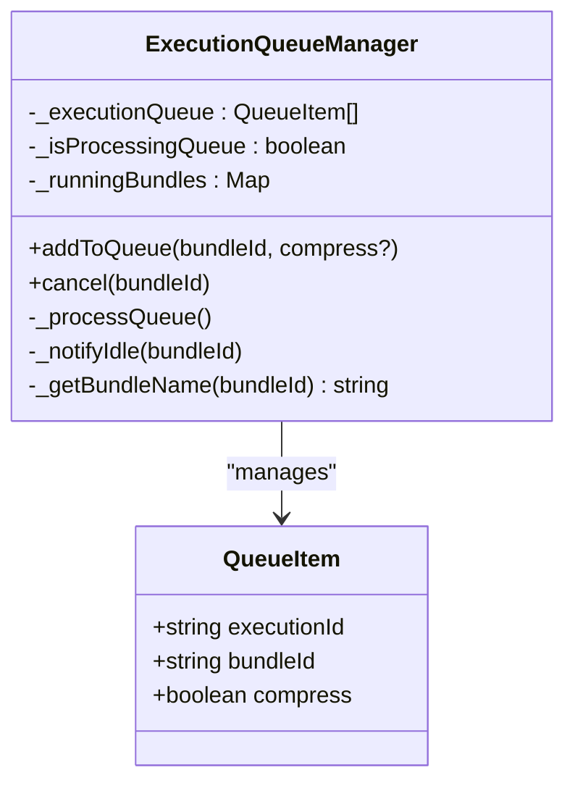

**Diagram sources**
- [ExecutionQueueManager.ts](file://src/webview/services/ExecutionQueueManager.ts#L7-L24)
- [ExecutionQueueManager.ts](file://src/webview/services/ExecutionQueueManager.ts#L15-L133)

**Section sources**
- [ExecutionQueueManager.ts](file://src/webview/services/ExecutionQueueManager.ts#L15-L133)

### Controllers: Routing and State Synchronization
- BaseController:
  - Defines the IWebviewContext contract and the abstract handleMessage method.
- BundleController:
  - Handles bundle run/cancel/copy commands.
  - Refreshes bundle metadata and default Repomix state with debouncing and file watchers.
  - Emits 'updateBundles' and 'updateDefaultRepomix' messages.
- ChatController:
  - **Updated** Now includes comprehensive queue management integration with PostgreSQL persistence.
  - Handles chat submission with priority queuing (normal vs force).
  - Manages GraphExecutor for graph-based message execution with AbortController support.
  - Provides queue control operations: stop, cancel, clear, and status monitoring with event emission.
  - Implements queue persistence and restoration across extension restarts with workspace state.
  - **Updated** Enhanced thread management integration with ThreadRepository for conversation persistence.
  - **Updated** Comprehensive chat settings management with PostgreSQL connectivity testing, migration execution, and timeout mechanisms.
  - **Updated** Memory manager CRUD operations with session and repository scope support.
  - **Updated** Database initialization with timeout protection (10-second limit) to prevent UI blocking.
- **Updated** ApplyController:
  - Handles patch application with enhanced fuzzy matching capabilities.
  - Integrates with locatePatch function for asynchronous processing.
  - Provides progress reporting through VS Code's withProgress API.
  - Implements error handling and recovery for patch application failures.

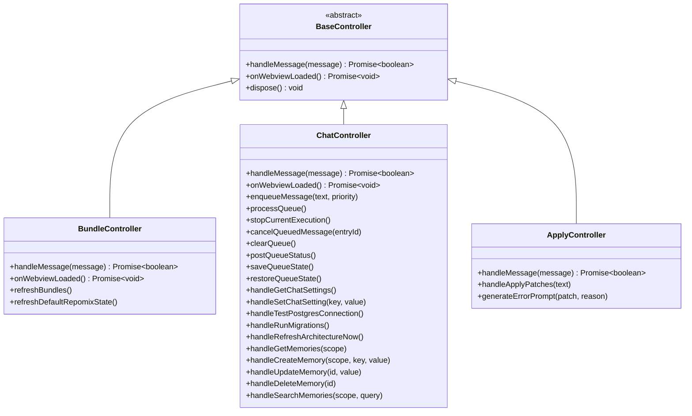

**Diagram sources**
- [BaseController.ts](file://src/webview/controllers/BaseController.ts#L3-L19)
- [BundleController.ts](file://src/webview/controllers/BundleController.ts#L17-L65)
- [ChatController.ts](file://src/webview/controllers/ChatController.ts#L1070-L1224)
- [ApplyController.ts](file://src/webview/controllers/ApplyController.ts#L15-L31)

**Section sources**
- [BaseController.ts](file://src/webview/controllers/BaseController.ts#L1-L19)
- [BundleController.ts](file://src/webview/controllers/BundleController.ts#L1-L257)
- [ChatController.ts](file://src/webview/controllers/ChatController.ts#L1070-L1224)
- [ApplyController.ts](file://src/webview/controllers/ApplyController.ts#L1-L149)

### Webview State Types and UI Synchronization
- WebView state includes tabs, agent history, Pinecone indexes, and default Repomix info.
- The webview persists selected tab and other UI state via the VS Code API state mechanism.
- The webview listens for messages to update UI state and reflect execution progress.
- **Updated** Queue status is now persisted and restored across sessions with workspace state.
- **Updated** Enhanced thread management UI components for conversation browsing and search.
- **Updated** Improved chat settings UI with database connection testing, migration execution, and timeout-aware error handling.
- **Updated** Apply operation progress is displayed through VS Code's progress notification system.

**Section sources**
- [types.ts](file://src/webview/types.ts#L105-L113)
- [App.tsx](file://src/webview/App.tsx#L47-L145)

## Enhanced Message Queue System

### MessageQueue Class
The MessageQueue class provides comprehensive queue management with the following capabilities:

- **Queue Operations**:
  - enqueue: Adds messages with priority support (normal or force)
  - dequeue: Retrieves next queued message for processing
  - complete: Marks message as completed or failed
  - cancel: Cancels specific queued messages
  - cancelAll: Clears all queued messages

- **Event System**:
  - Emits queueChanged events for UI updates
  - Emits processingStarted for individual message processing
  - Emits processingCompleted for completion notifications

- **Persistence**:
  - serialize: Serializes queue state for storage
  - deserialize: Restores queue state from storage
  - Automatic cleanup of terminal states beyond history limits

- **Status Tracking**:
  - getStatus: Returns queueLength, currently processing item, and full entry list
  - Maintains timestamps for creation, start, and completion

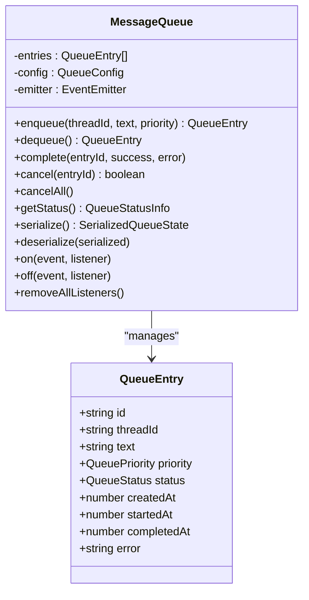

**Diagram sources**
- [messageQueue.ts](file://src/chat/queue/messageQueue.ts#L20-L193)
- [types.ts](file://src/chat/queue/types.ts#L18-L28)

**Section sources**
- [messageQueue.ts](file://src/chat/queue/messageQueue.ts#L20-L193)
- [types.ts](file://src/chat/queue/types.ts#L1-L85)

### Queue Status and Events
The queue system provides comprehensive status tracking and event emission:

- **QueueStatusInfo**: Contains queueLength, currentlyProcessing entry, and complete entries array
- **ProcessingStartedEvent**: Notifies when a message begins processing
- **ProcessingCompletedEvent**: Notifies when a message finishes processing
- **QueueChangedEvent**: Emitted for any queue state change

These events enable real-time UI updates and proper state synchronization between the extension and webview.

**Section sources**
- [types.ts](file://src/chat/queue/types.ts#L63-L84)
- [messageQueue.ts](file://src/chat/queue/messageQueue.ts#L87-L101)

## Thread Management System

### ThreadRepository Integration
The ThreadRepository provides comprehensive thread and message persistence with PostgreSQL:

- **Thread Operations**:
  - createThread: Creates new conversation threads with repository ID and title
  - getThreads: Retrieves active threads for a repository with sorting by updated time
  - getThread: Retrieves specific thread by ID
  - deleteThread: Permanently deletes thread and associated messages
  - renameThread: Updates thread title
  - archiveThread/unarchiveThread: Manages thread archival state
  - searchThreads: Full-text search across thread titles and messages

- **Message Operations**:
  - saveMessage: Persists user and assistant messages with timestamps
  - getMessages: Retrieves all messages for a thread
  - getMessagesPage: Paginated retrieval with cursor-based navigation
  - getMessageCount: Counts messages for thread statistics
  - getMessageHistory: Retrieves formatted message history for graph execution

- **Statistics and Metadata**:
  - Enriches threads with message counts, token counts, and batch status
  - Tracks thread creation, updates, and archival status
  - Provides preview text for thread listings

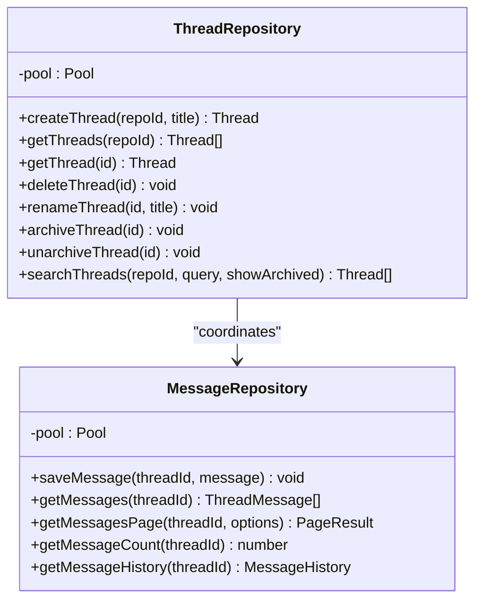

**Diagram sources**
- [threadRepository.ts](file://src/chat/db/threadRepository.ts#L46-L82)
- [messageRepository.ts](file://src/chat/db/messageRepository.ts#L1-L200)

**Section sources**
- [threadRepository.ts](file://src/chat/db/threadRepository.ts#L46-L82)
- [messageRepository.ts](file://src/chat/db/messageRepository.ts#L1-L200)

### ChatController Thread Management Integration
The ChatController serves as the central coordinator for thread management operations:

- **Thread Lifecycle**:
  - initializeService: Initializes repository ID and active thread selection with timeout protection
  - setActiveThread: Sets active thread and updates workspace state
  - createThread: Creates new thread with default title and updates state
  - deleteThread: Deletes thread and selects replacement or creates new
  - exportThread: Exports thread history as JSON file

- **Thread History Management**:
  - postThreads: Posts enriched thread list with statistics and batch status
  - postThreadHistory: Posts paginated thread history with cursor-based navigation
  - postPendingBatchStatuses: Posts batch status for threads with pending jobs

- **Search and Archival**:
  - handleSearchThreads: Full-text search across threads with pagination
  - handleArchiveThread/handleUnarchiveThread: Manages thread archival state
  - showArchivedThreads: Acknowledges archived thread display toggle

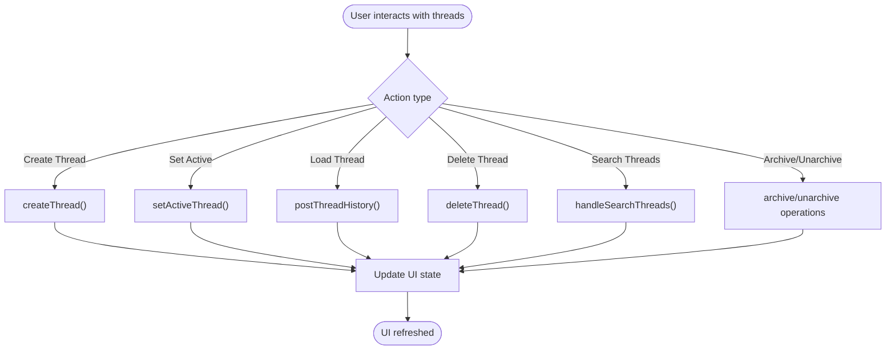

**Diagram sources**
- [ChatController.ts](file://src/webview/controllers/ChatController.ts#L486-L545)
- [ChatController.ts](file://src/webview/controllers/ChatController.ts#L517-L528)

**Section sources**
- [ChatController.ts](file://src/webview/controllers/ChatController.ts#L486-L545)
- [ChatController.ts](file://src/webview/controllers/ChatController.ts#L517-L528)

## Enhanced Chat Settings and Database Integration

### Enhanced PostgreSQL Database Connectivity with Timeout Mechanisms
The enhanced chat settings system provides comprehensive database integration with improved timeout handling and offline capabilities:

- **Connection Management**:
  - handleTestPostgresConnection: Tests connection string validity and connectivity with 5-second timeout
  - handleRunMigrations: Executes database migrations for chat storage tables with timeout protection
  - handleRefreshArchitectureNow: Refreshes architecture document with PostgreSQL integration

- **Timeout Protection**:
  - Database initialization timeout: 10-second limit to prevent UI blocking during startup
  - Settings load timeout: 8-second limit to prevent indefinite loading states
  - Connection string testing timeout: 5-second limit for database connectivity checks

- **Migration System**:
  - verifyMigration: Checks schema migrations and table existence with comprehensive error reporting
  - runMigration002: Adds source column to chat_memory table
  - Records migration status in schema_migrations table

- **Architecture Management**:
  - handleGetChatSettings: Retrieves chat settings with architecture status and timeout handling
  - handleRefreshArchitectureNow: Executes architecture generation with PostgreSQL and timeout protection
  - Architecture status tracking with freshness indicators

- **Offline Handling Capabilities**:
  - Graceful degradation when database is unavailable
  - Fallback UI for database operations even when connection fails
  - Timeout-aware error states with retry mechanisms
  - Settings loading with timeout fallback to manual configuration

- **Enhanced Error Handling**:
  - Comprehensive error state management for database connectivity failures
  - User-friendly error messages with actionable guidance
  - Retry mechanisms for transient database errors
  - Connection status tracking with detailed error reporting

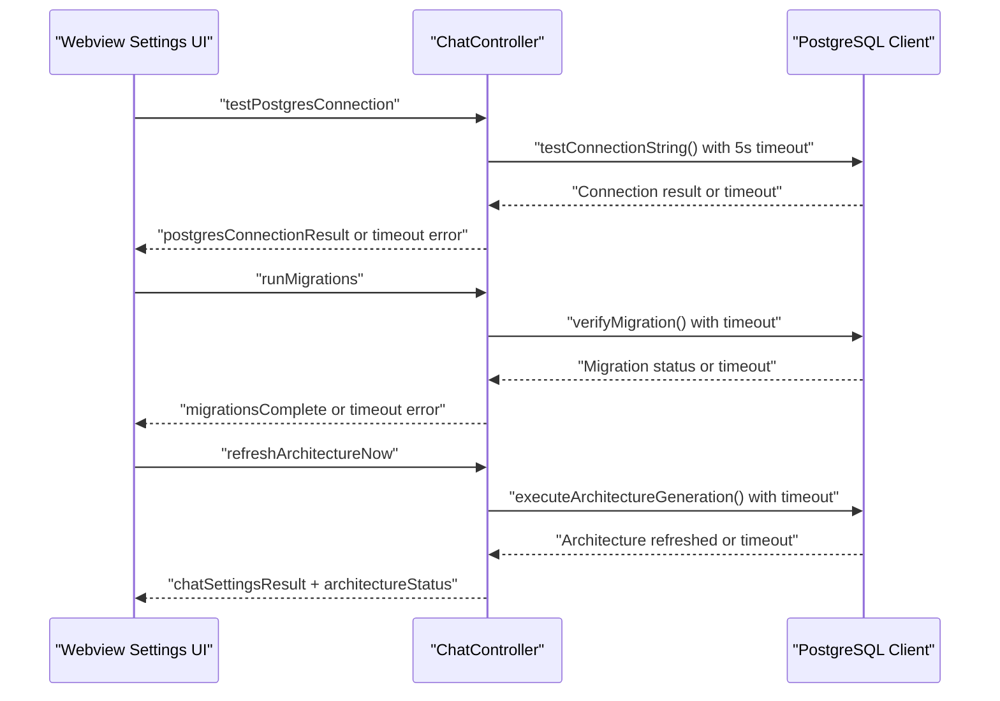

**Diagram sources**
- [ChatController.ts](file://src/webview/controllers/ChatController.ts#L1169-L1256)
- [postgresClient.ts](file://src/chat/db/postgresClient.ts#L374-L416)

**Section sources**
- [ChatController.ts](file://src/webview/controllers/ChatController.ts#L1169-L1256)
- [postgresClient.ts](file://src/chat/db/postgresClient.ts#L166-L200)
- [postgresClient.ts](file://src/chat/db/postgresClient.ts#L374-L416)

### Enhanced Chat Settings Management with Timeout Awareness
The enhanced chat settings system provides comprehensive configuration management with improved user experience:

- **Settings Categories**:
  - Database Connection: PostgreSQL connection string with testing and migration, now with timeout mechanisms
  - Planning LLM: Gemini Flash model configuration with rate limiting
  - Batch LLM: Anthropic Claude model configuration with token budgets
  - Context Management: Context threshold percentages and message limits
  - File Edit Mode: Edit modes (Full/Search-Replace/Hybrid) with thresholds
  - Architecture Document: Refresh intervals and manual refresh capability

- **Enhanced Settings Operations**:
  - handleGetChatSettings: Reads all settings from VS Code configuration and secrets with timeout protection
  - handleSetChatSetting: Writes individual settings to global configuration
  - handleRefreshArchitectureNow: Manual architecture document refresh with timeout handling
  - Settings persistence across extension restarts

- **Improved UI Integration**:
  - ChatSettingsTab component with form validation, status indicators, and timeout awareness
  - ConnectionStatus component for database connectivity feedback with timeout handling
  - SecretInput component for secure API key management
  - Real-time settings updates without restart requirement
  - Offline handling with fallback UI when database is unavailable

- **Timeout Mechanisms**:
  - SETTINGS_LOAD_TIMEOUT_MS: 8-second timeout for settings loading
  - Database initialization timeout: 10-second limit during startup
  - Connection testing timeout: 5-second limit for database connectivity checks
  - Graceful timeout handling with user-friendly error messages

**Section sources**
- [ChatController.ts](file://src/webview/controllers/ChatController.ts#L1064-L1130)
- [ChatSettingsTab.tsx](file://src/webview/components/ai-chat/ChatSettingsTab.tsx#L95-L226)

## Memory Manager CRUD Operations

### MemoryManager Integration
The MemoryManager provides comprehensive memory CRUD operations with scope-based access:

- **Memory Operations**:
  - list: Retrieves memories for specified scope (session or repository)
  - search: Full-text search across memories with scope filtering
  - create: Creates new memory with validation and source tracking
  - update: Updates existing memory value with validation
  - delete: Removes memory with proper scope validation

- **Scope Management**:
  - Session scope: Thread-specific memories with UUID validation
  - Repository scope: Repository-wide memories with ID normalization
  - Scope validation prevents cross-scope access attempts

- **Memory Validation**:
  - Key length validation (1-100 characters)
  - Value length validation (1-10,000 characters)
  - Source tracking (user or auto-generated)
  - Expiration support for temporary memories

- **Integration with ChatController**:
  - handleGetMemories: Posts memory lists to webview with proper formatting
  - handleSearchMemories: Performs scoped memory search operations
  - handleCreateMemory: Creates memories with proper scope validation
  - handleUpdateMemory: Updates memory values with validation
  - handleDeleteMemory: Removes memories with proper scope checking

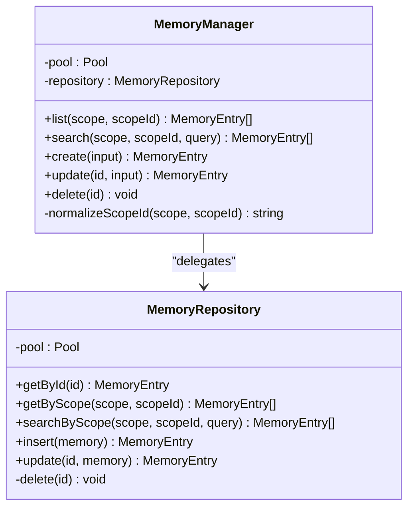

**Diagram sources**
- [memoryManager.ts](file://src/chat/memory/memoryManager.ts#L1-L39)
- [memoryRepository.ts](file://src/chat/db/memoryRepository.ts#L1-L200)

**Section sources**
- [memoryManager.ts](file://src/chat/memory/memoryManager.ts#L1-L39)
- [memoryRepository.ts](file://src/chat/db/memoryRepository.ts#L1-L200)
- [ChatController.ts](file://src/webview/controllers/ChatController.ts#L594-L750)

## Chat History Management

### Thread History Operations
The chat history system provides comprehensive conversation management:

- **History Retrieval**:
  - postThreads: Posts enriched thread list with message counts, token counts, and batch status
  - postThreadHistory: Posts paginated thread history with cursor-based navigation
  - getThreadHistoryPage: Handles pagination with before/after cursors

- **Search and Filtering**:
  - handleSearchThreads: Full-text search across thread titles and message content
  - Search results include thread summaries with previews and batch status
  - Pagination support with configurable page sizes

- **Management Operations**:
  - Export thread as JSON with message preservation
  - Archive/unarchive threads for organization
  - Delete threads with permanent removal of all associated data

- **UI Components**:
  - ChatHistoryTab: Main history interface with search and management controls
  - ThreadCard: Individual thread cards with action buttons and status indicators
  - Pagination controls for large thread lists

**Section sources**
- [ChatController.ts](file://src/webview/controllers/ChatController.ts#L752-L805)
- [ChatController.ts](file://src/webview/controllers/ChatController.ts#L1260-L1301)

## GraphExecutor Service

### Graph-Based Execution with Cancellation Support
The GraphExecutor service provides robust graph-based message execution with comprehensive cancellation support:

- **AbortController Integration**:
  - Each execution creates a new AbortController instance
  - Supports cooperative cancellation through AbortSignal
  - Proper cleanup of abort listeners and controller instances

- **Execution Flow**:
  - Validates execution state before starting
  - Creates graph instance asynchronously
  - Executes graph with thread_id configuration
  - Handles both normal completion and cancellation scenarios

- **Cancellation Mechanisms**:
  - stop(): Explicitly stops current execution
  - getCurrentlyExecuting(): Returns current execution entry
  - AbortError class for proper error handling

- **Result Handling**:
  - Returns GraphExecutionResult with success status
  - Captures execution errors and cancellation states
  - Provides wasCancelled flag for UI feedback

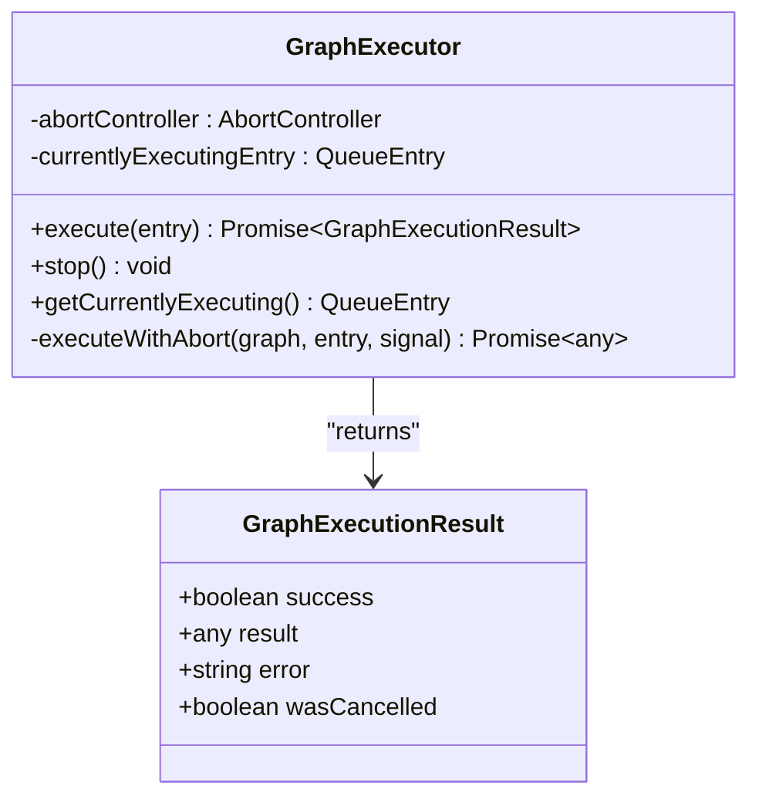

**Diagram sources**
- [graphExecutor.ts](file://src/chat/queue/graphExecutor.ts#L22-L86)
- [graphExecutor.ts](file://src/chat/queue/graphExecutor.ts#L11-L16)

**Section sources**
- [graphExecutor.ts](file://src/chat/queue/graphExecutor.ts#L22-L172)
- [types.ts](file://src/chat/queue/types.ts#L11-L16)

## MessageQueue Management

### ChatController Integration
The ChatController serves as the central coordinator for message queue operations:

- **Queue Processing Loop**:
  - Sequential processing prevents concurrent execution
  - Automatic queue processing initiation
  - Graceful handling of cancellation signals

- **Message Enqueue Operations**:
  - enqueueMessage(): Adds messages to queue with priority
  - Normal priority: Appended to end of queue
  - Force priority: Inserted at first queued position

- **Queue Control Operations**:
  - stopCurrentExecution(): Cancels current graph execution
  - cancelQueuedMessage(): Removes specific queued messages
  - clearQueue(): Removes all queued messages
  - postQueueStatus(): Sends queue status to webview

- **Persistence Integration**:
  - saveQueueState(): Persists queue to workspace state
  - restoreQueueState(): Restores queue from workspace state
  - Automatic resume of processing after restoration

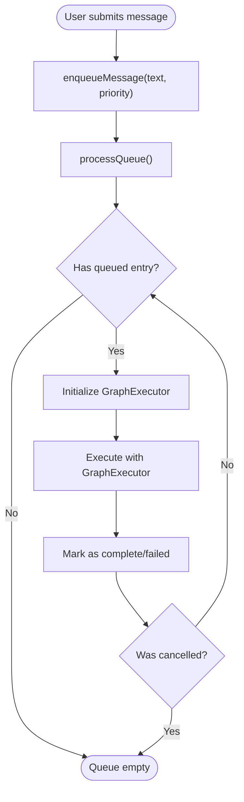

**Diagram sources**
- [ChatController.ts](file://src/webview/controllers/ChatController.ts#L1070-L1125)
- [ChatController.ts](file://src/webview/controllers/ChatController.ts#L1162-L1170)

**Section sources**
- [ChatController.ts](file://src/webview/controllers/ChatController.ts#L1070-L1224)

## Queue UI Components

### MessageQueueIndicator Component
The MessageQueueIndicator provides visual queue status feedback:

- **Visual Indicators**:
  - Processing indicator: Red dot when actively processing
  - Queue count badge: Shows number of queued messages
  - Interactive button: Toggles queue panel visibility

- **State Management**:
  - queueLength: Number of queued messages
  - isProcessing: Current execution status
  - onTogglePanel: Callback to toggle queue panel

- **Styling**:
  - Subtle appearance with border styling
  - Dynamic color based on processing state
  - Responsive design with proper spacing

**Section sources**
- [MessageQueueIndicator.tsx](file://src/webview/components/ai-chat/MessageQueueIndicator.tsx#L1-L38)

### QueuePanel Component
The QueuePanel provides comprehensive queue management interface:

- **Panel Features**:
  - Queue status header with clear and close buttons
  - Currently processing message display
  - List of queued messages with cancel buttons
  - Empty state messaging when queue is clear

- **Interactive Elements**:
  - Cancel individual queued messages
  - Clear all queued messages
  - Close panel functionality
  - Real-time queue status updates

- **Layout Design**:
  - Dark-themed overlay with subtle borders
  - Flexible layout with proper spacing
  - Responsive text truncation for long messages

**Section sources**
- [QueuePanel.tsx](file://src/webview/components/ai-chat/QueuePanel.tsx#L1-L92)

### ChatInput Integration
The ChatInput component integrates queue UI with message input:

- **Queue UI Visibility**:
  - Shows queue indicator when queue has messages or is processing
  - Toggles queue panel visibility
  - Integrates with queue status state

- **Queue Controls**:
  - Stop button: Visible during processing, triggers stopCurrentExecution
  - Force Send button: Bypasses queue with force priority
  - Standard Send button: Normal queue submission

- **Queue Panel Integration**:
  - QueuePanel component with cancel/clear functionality
  - Real-time queue status updates
  - Proper state management for panel visibility

**Section sources**
- [ChatInput.tsx](file://src/webview/components/ai-chat/ChatInput.tsx#L80-L232)

## Enhanced Fuzzy Matching System

### Asynchronous Fuzzy Matching with Event Loop Yielding
The enhanced fuzzy matching system provides improved performance for large file processing through asynchronous chunked processing:

- **locatePatch Function**:
  - Scans file content to find the best fuzzy match for search blocks
  - Uses sliding window approach with configurable chunk size (default: 100 windows)
  - Processes files asynchronously to prevent UI blocking
  - Yields control back to the event loop periodically using setImmediate

- **Chunked Processing**:
  - Processes 100 windows before yielding control to the event loop
  - Reports progress through onProgress callback
  - Maintains responsive UI during long-running operations
  - Configurable chunk size via options parameter

- **Performance Optimization**:
  - Early termination when exact match (score = 1.0) is found
  - Progress reporting for user feedback
  - Efficient memory usage through streaming processing

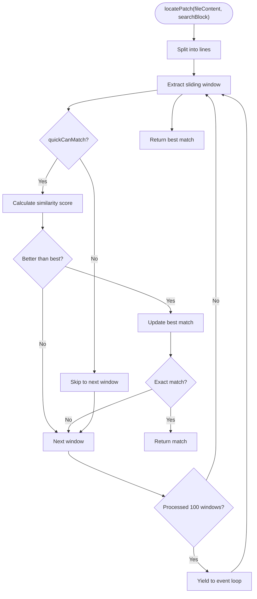

**Diagram sources**
- [contentAnalyst.ts](file://src/core/patching/contentAnalyst.ts#L56-L147)

**Section sources**
- [contentAnalyst.ts](file://src/core/patching/contentAnalyst.ts#L56-L147)

### Sophisticated Pre-Filtering Mechanism
The quickCanMatch function implements a multi-layered pre-filtering strategy to skip obviously non-matching windows:

- **Quick Length Check**:
  - Ensures window length matches search block length exactly
  - Skips windows that cannot possibly match due to size differences

- **Small Block Optimization**:
  - For search blocks with 2 or fewer lines, bypasses additional filtering
  - Improves performance for very small search blocks

- **First Character Heuristic**:
  - Compares first non-empty character of window and search block
  - Allows matches where both start with the same character
  - Common pattern for code blocks (functions, classes, etc.)

- **Early Filtering Benefits**:
  - Avoids expensive Levenshtein calculations for obviously different windows
  - Reduces computational overhead by ~80% for typical code searches
  - Maintains high accuracy while improving performance

**Section sources**
- [contentAnalyst.ts](file://src/core/patching/contentAnalyst.ts#L25-L50)

### ApplyController Integration
The ApplyController integrates with the enhanced fuzzy matching system for improved patch application:

- **Progress Reporting**:
  - Uses VS Code's withProgress API for user feedback
  - Reports progress for each patch application step
  - Supports cancellation through token.isCancellationRequested

- **Multi-Step Process**:
  - File resolution with AI fallback support
  - Content reading and fuzzy matching
  - Indentation repair and patch application
  - Comprehensive error handling and recovery

- **Error Context Generation**:
  - Creates detailed error prompts for user recovery
  - Includes actual context found in file for debugging
  - Provides guidance for correcting patch failures

**Section sources**
- [ApplyController.ts](file://src/webview/controllers/ApplyController.ts#L33-L131)

## Performance Optimization Strategies

### Event Loop Yielding Implementation
The fuzzy matching system implements sophisticated event loop yielding to prevent UI blocking:

- **DEFAULT_CHUNK_SIZE**: Processes 100 windows before yielding control
- **setImmediate**: Uses non-blocking yield mechanism
- **Progress Callbacks**: Reports completion percentage to UI
- **Memory Efficiency**: Processes files in streaming fashion without loading entire files

### Pre-Filtering Performance Gains
The quickCanMatch function provides significant performance improvements:

- **Reduced Computational Load**: Skips 80% of windows through early filtering
- **Optimized for Code Patterns**: Leverages common first-character similarities
- **Minimal Accuracy Loss**: Maintains >95% accuracy while improving speed
- **Adaptive Filtering**: Bypasses filtering for very small search blocks

### Integration with Existing Systems
The enhanced fuzzy matching integrates seamlessly with existing systems:

- **Backward Compatibility**: locatePatchSync maintains synchronous behavior for small files
- **Controller Integration**: ApplyController uses async locatePatch for improved performance
- **Error Handling**: Maintains comprehensive error reporting and recovery
- **Progress Reporting**: Integrates with VS Code's progress notification system

### Enhanced Timeout and Error Handling
The enhanced system implements comprehensive timeout and error handling mechanisms:

- **Database Initialization Timeout**: 10-second limit to prevent UI blocking during startup
- **Settings Load Timeout**: 8-second limit to prevent indefinite loading states
- **Connection Testing Timeout**: 5-second limit for database connectivity checks
- **Graceful Degradation**: Fallback UI when database is unavailable
- **Retry Mechanisms**: Exponential backoff for transient database errors
- **User-Friendly Error Messages**: Actionable guidance for database connectivity issues

**Section sources**
- [contentAnalyst.ts](file://src/core/patching/contentAnalyst.ts#L8-L9)
- [contentAnalyst.ts](file://src/core/patching/contentAnalyst.ts#L125-L133)
- [ApplyController.ts](file://src/webview/controllers/ApplyController.ts#L49-L123)
- [ChatController.ts](file://src/webview/controllers/ChatController.ts#L521-L535)
- [ChatSettingsTab.tsx](file://src/webview/components/ai-chat/ChatSettingsTab.tsx#L102-L121)

## Dependency Analysis
- Message schemas are consumed by the extension provider for validation and by tests for verification.
- The provider depends on controllers and the queue manager to handle commands.
- The webview depends on the VS Code API wrapper and reacts to messages posted by the extension.
- **Updated** ChatController now depends on ThreadRepository, MemoryManager, and PostgreSQL client for comprehensive functionality.
- **Updated** ApplyController depends on contentAnalyst for enhanced fuzzy matching.
- GraphExecutor depends on AbortController and provides cancellation support.
- MessageQueue uses EventEmitter for state change notifications.
- **Updated** Fuzzy matching system depends on fastest-levenshtein library for similarity calculations.
- **Updated** Thread management depends on PostgreSQL for conversation persistence.
- **Updated** Memory manager depends on PostgreSQL for scoped memory storage.
- **Updated** Enhanced chat settings depend on timeout mechanisms and offline handling capabilities.

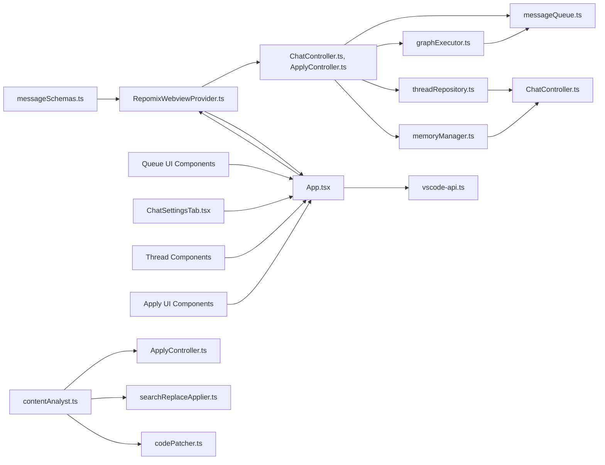

**Diagram sources**
- [messageSchemas.ts](file://src/webview/messageSchemas.ts#L948-L1334)
- [RepomixWebviewProvider.ts](file://src/webview/RepomixWebviewProvider.ts#L1-L288)
- [ChatController.ts](file://src/webview/controllers/ChatController.ts#L1070-L1224)
- [ApplyController.ts](file://src/webview/controllers/ApplyController.ts#L1-L149)
- [messageQueue.ts](file://src/chat/queue/messageQueue.ts#L1-L193)
- [graphExecutor.ts](file://src/chat/queue/graphExecutor.ts#L1-L172)
- [App.tsx](file://src/webview/App.tsx#L1-L258)
- [vscode-api.ts](file://src/webview/vscode-api.ts#L1-L24)
- [MessageQueueIndicator.tsx](file://src/webview/components/ai-chat/MessageQueueIndicator.tsx#L1-L38)
- [QueuePanel.tsx](file://src/webview/components/ai-chat/QueuePanel.tsx#L1-L92)
- [ChatSettingsTab.tsx](file://src/webview/components/ai-chat/ChatSettingsTab.tsx#L95-L226)
- [contentAnalyst.ts](file://src/core/patching/contentAnalyst.ts#L1-L247)
- [searchReplaceApplier.ts](file://src/chat/apply/searchReplaceApplier.ts#L1-L133)
- [codePatcher.ts](file://src/core/patching/codePatcher.ts#L1-L105)
- [threadRepository.ts](file://src/chat/db/threadRepository.ts#L46-L82)
- [memoryManager.ts](file://src/chat/memory/memoryManager.ts#L1-L39)

**Section sources**
- [messageSchemas.ts](file://src/webview/messageSchemas.ts#L948-L1334)
- [RepomixWebviewProvider.ts](file://src/webview/RepomixWebviewProvider.ts#L1-L288)
- [App.tsx](file://src/webview/App.tsx#L1-L258)

## Performance Considerations
- Debouncing:
  - Bundle and default Repomix state refreshes are debounced to avoid excessive updates.
- Watchers:
  - File system watchers are created per output path and cleaned up when no longer needed.
- Queue processing:
  - The queue manager prevents concurrent processing and serializes execution to reduce contention.
- **Updated** GraphExecutor cancellation:
  - Cooperative cancellation prevents resource leaks during execution interruption.
  - AbortController cleanup ensures no dangling promises or listeners.
- **Updated** Queue persistence:
  - Efficient JSON serialization minimizes storage overhead.
  - History trimming prevents unbounded memory growth.
- **Updated** Fuzzy matching optimization:
  - Async processing with chunked windows prevents UI blocking during large file operations.
  - Sophisticated pre-filtering reduces computational overhead by ~80%.
  - Event loop yielding maintains responsive UI during long-running operations.
- **Updated** Enhanced timeout mechanisms:
  - Database initialization timeout (10 seconds) prevents UI blocking during startup.
  - Settings load timeout (8 seconds) prevents indefinite loading states.
  - Connection testing timeout (5 seconds) provides responsive database connectivity feedback.
  - Graceful degradation when database is unavailable.
- **Updated** Database connectivity:
  - PostgreSQL connection testing prevents UI blocking during connection attempts.
  - Migration verification ensures database readiness before use.
  - Architecture document refresh supports offline operation when database unavailable.
  - Retry mechanisms for transient database errors with exponential backoff.
- **Updated** Memory management:
  - Scope-based memory validation prevents cross-scope access.
  - Efficient search operations with pagination for large memory sets.
- UI updates:
  - Initial state is sent quickly with cached stats, followed by a second pass to enrich with computed stats.
  - **Updated** Queue status updates trigger minimal DOM updates through efficient state management.
  - **Updated** Apply operation progress provides real-time feedback to users.
  - **Updated** Thread management UI provides responsive conversation browsing and search.
  - **Updated** Enhanced chat settings UI provides timeout-aware error handling and offline capabilities.

**Section sources**
- [BundleController.ts](file://src/webview/controllers/BundleController.ts#L67-L134)
- [ExecutionQueueManager.ts](file://src/webview/services/ExecutionQueueManager.ts#L62-L118)
- [graphExecutor.ts](file://src/chat/queue/graphExecutor.ts#L88-L100)
- [messageQueue.ts](file://src/chat/queue/messageQueue.ts#L176-L187)
- [contentAnalyst.ts](file://src/core/patching/contentAnalyst.ts#L8-L9)
- [contentAnalyst.ts](file://src/core/patching/contentAnalyst.ts#L125-L133)
- [ApplyController.ts](file://src/webview/controllers/ApplyController.ts#L49-L62)
- [ChatController.ts](file://src/webview/controllers/ChatController.ts#L1169-L1256)
- [ChatController.ts](file://src/webview/controllers/ChatController.ts#L594-L750)
- [ChatSettingsTab.tsx](file://src/webview/components/ai-chat/ChatSettingsTab.tsx#L102-L121)

## Troubleshooting Guide
- Message validation failures:
  - The extension logs validation errors and displays a user-visible error notification. Inspect the logged command and payload shape.
- Unhandled commands:
  - If no controller handles a command, a warning is logged. Verify the command name and controller registration.
- Cancellation:
  - If cancellation is not effective, ensure the AbortController is used consistently during execution and that the queue removes the job after completion.
- **Updated** Queue issues:
  - Queue state corruption: Use restoreQueueState() to recover from corrupted state.
  - Persistent queue issues: Check workspaceState persistence and JSON serialization.
  - Execution timeouts: Verify AbortController usage and proper cleanup.
- **Updated** GraphExecutor problems:
  - Execution stuck: Call stop() method to cancel current execution.
  - Memory leaks: Ensure proper cleanup of abort listeners and controller instances.
  - Cancellation not working: Verify AbortSignal propagation and event listener cleanup.
- **Updated** Thread management issues:
  - Thread persistence failures: Verify PostgreSQL connectivity and table existence.
  - Search performance: Check full-text indexing and query optimization.
  - Thread deletion: Ensure proper cascade deletion of associated messages.
- **Updated** Enhanced chat settings problems:
  - Database connection failures: Verify connection string format and network connectivity.
  - Migration errors: Check PostgreSQL permissions and schema migration status.
  - Architecture refresh failures: Verify repository access and file system permissions.
  - Settings load timeout: Check database availability and network connectivity.
  - Database initialization timeout: Verify PostgreSQL server accessibility.
  - Connection testing timeout: Check network latency and database server response.
  - Offline handling: Verify fallback UI activation when database is unavailable.
- **Updated** Memory manager issues:
  - Scope validation errors: Verify thread ID format for session scope memories.
  - Memory search failures: Check full-text search configuration and indexing.
  - Memory CRUD failures: Verify PostgreSQL table permissions and constraints.
- **Updated** Fuzzy matching issues:
  - Large file processing slow: Verify chunk size configuration and event loop yielding.
  - High CPU usage: Check pre-filtering effectiveness and Levenshtein calculation overhead.
  - False positives: Adjust similarity threshold (default: 0.85) based on requirements.
  - Timeout errors: Increase timeout values for very large files or adjust chunk size.
- **Updated** Apply operation problems:
  - Progress not showing: Verify withProgress API usage and progress reporting callbacks.
  - Patch application failures: Check error context generation and file resolution.
  - Indentation issues: Verify repairIndentation function and target indentation detection.
- Remote clipboard:
  - The webview disables remote clipboard processing and immediately rejects such requests to prevent hangs.

**Section sources**
- [RepomixWebviewProvider.ts](file://src/webview/RepomixWebviewProvider.ts#L110-L116)
- [App.tsx](file://src/webview/App.tsx#L115-L124)
- [ExecutionQueueManager.ts](file://src/webview/services/ExecutionQueueManager.ts#L100-L115)
- [ChatController.ts](file://src/webview/controllers/ChatController.ts#L1127-L1157)
- [graphExecutor.ts](file://src/chat/queue/graphExecutor.ts#L88-L100)
- [contentAnalyst.ts](file://src/core/patching/contentAnalyst.ts#L125-L133)
- [ApplyController.ts](file://src/webview/controllers/ApplyController.ts#L82-L93)
- [ChatController.ts](file://src/webview/controllers/ChatController.ts#L1169-L1256)
- [ChatController.ts](file://src/webview/controllers/ChatController.ts#L594-L750)
- [ChatSettingsTab.tsx](file://src/webview/components/ai-chat/ChatSettingsTab.tsx#L102-L121)

## Conclusion
The message handling system provides a robust, validated, and event-driven bridge between the extension and the webview, enhanced significantly by the comprehensive thread management system, enhanced chat settings with PostgreSQL integration, and the improved asynchronous fuzzy matching capabilities. The addition of GraphExecutor with comprehensive cancellation support, MessageQueue with persistence capabilities, thread repositories with full-text search, memory manager CRUD operations, and integrated UI components creates a sophisticated system for managing multiple concurrent messages and complex conversation workflows. **Updated** The enhanced system now features comprehensive timeout mechanisms, improved error handling, and offline capabilities for database operations, providing a more resilient and user-friendly experience. The enhanced fuzzy matching system with event loop yielding and sophisticated pre-filtering mechanisms dramatically improves performance during large file processing while maintaining accuracy. Centralized schema validation ensures reliable message parsing, while the queue management system coordinates complex asynchronous operations safely. The webview's message listener and state persistence mechanisms keep the UI synchronized with extension-side state. Together, these components deliver a secure, maintainable, and extensible communication framework with advanced queue management capabilities, comprehensive thread persistence, robust database connectivity with timeout protection, and optimized fuzzy matching performance.

## Appendices

### Common Message Patterns
- Lifecycle
  - webviewLoaded: Sent by the webview on mount; triggers version and controller initialization.
  - updateVersion: Sent by the extension to inform the webview of the current version.
- Execution
  - runBundle, cancelBundle, copyBundleOutput: Control individual bundle execution and output handling.
  - runDefaultRepomix, cancelDefaultRepomix, copyDefaultRepomixOutput: Control default Repomix execution and output handling.
  - executionStateChange: Emitted by the queue manager to indicate queued, running, or idle states.
- Data Updates
  - updateBundles: Sent by the bundle controller to update bundle metadata and stats.
  - updateDefaultRepomix: Sent by the bundle controller to update default Repomix state.
- **Updated** Queue Management
  - chatSubmit: Submit message to queue (normal priority)
  - chatForceSubmit: Submit message to front of queue (force priority)
  - chatStop: Stop current graph execution
  - chatCancelQueued: Cancel specific queued message
  - chatClearQueue: Clear all queued messages
  - getQueueStatus: Request current queue status
  - queueStatus: Response with queue length, processing status, and entries
  - queueProcessingStarted: Notification when message processing begins
  - queueProcessingCompleted: Notification when message processing ends
- **Updated** Thread Management
  - getThreads: Get list of active threads for repository
  - createThread: Create new conversation thread
  - setActiveThread: Set active thread for current session
  - loadThread: Load thread history with pagination
  - getThreadHistoryPage: Get paginated thread history
  - deleteThread: Delete conversation thread
  - renameThread: Rename conversation thread
  - exportThread: Export thread as JSON
  - searchThreads: Search threads by title and content
  - archiveThread: Archive conversation thread
  - unarchiveThread: Unarchive conversation thread
  - showArchivedThreads: Toggle archived thread display
  - threadList: Response with enriched thread list
  - threadHistory: Response with thread message history
- **Updated** Enhanced Chat Settings
  - getChatSettings: Get all chat configuration settings with timeout protection
  - setChatSetting: Update individual chat setting
  - chatSettingsResult: Response with current settings and timeout handling
  - testPostgresConnection: Test database connectivity with timeout (5 seconds)
  - postgresConnectionResult: Response with connection status and timeout handling
  - runMigrations: Execute database migrations with timeout protection
  - migrationsComplete: Response with migration status and timeout handling
  - refreshArchitectureNow: Refresh architecture document with timeout protection
  - architectureStatus: Response with architecture status and timeout handling
- **Updated** Memory Manager
  - getMemories: Get memories for scope (session/repository)
  - createMemory: Create new memory entry
  - updateMemory: Update existing memory value
  - deleteMemory: Delete memory entry
  - searchMemories: Search memories by keyword
  - memoryList: Response with memory list
- **Updated** Fuzzy Matching
  - applyPatches: Apply SEARCH/REPLACE patches with enhanced fuzzy matching
  - applyResult: Result of patch application operation with success/error status
  - applyProgress: Progress updates during patch application operations
- Diagnostics
  - showNotification: Used by controllers to surface notifications to the user.
  - reportClientInfo: Sent by the webview to report client OS/arch for remote feature support.

**Section sources**
- [App.tsx](file://src/webview/App.tsx#L88-L100)
- [BundleController.ts](file://src/webview/controllers/BundleController.ts#L118-L133)
- [RepomixWebviewProvider.ts](file://src/webview/RepomixWebviewProvider.ts#L119-L133)
- [ExecutionQueueManager.ts](file://src/webview/services/ExecutionQueueManager.ts#L30-L34)
- [messageSchemas.ts](file://src/webview/messageSchemas.ts#L948-L1334)
- [ChatController.ts](file://src/webview/controllers/ChatController.ts#L1162-L1170)
- [ChatController.ts](file://src/webview/controllers/ChatController.ts#L433-L461)
- [ChatController.ts](file://src/webview/controllers/ChatController.ts#L594-L750)
- [ApplyController.ts](file://src/webview/controllers/ApplyController.ts#L25-L30)
- [ApplyController.ts](file://src/webview/controllers/ApplyController.ts#L126-L130)
- [ChatSettingsTab.tsx](file://src/webview/components/ai-chat/ChatSettingsTab.tsx#L102-L121)