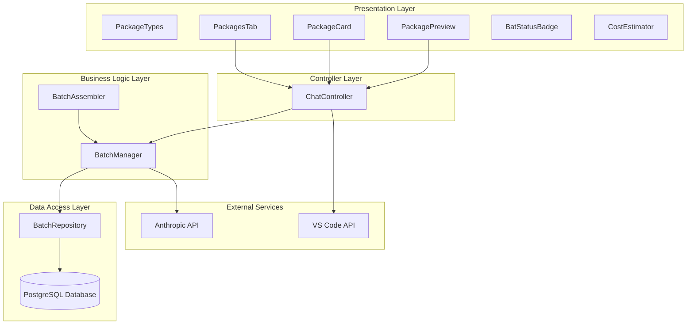
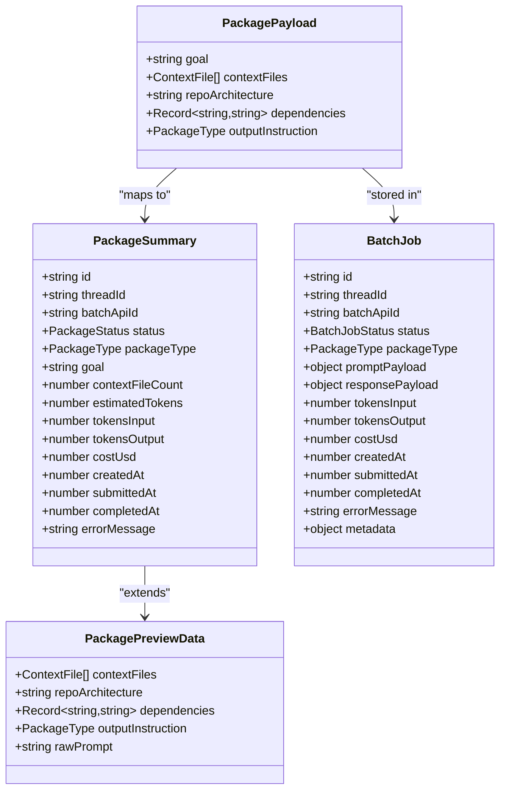
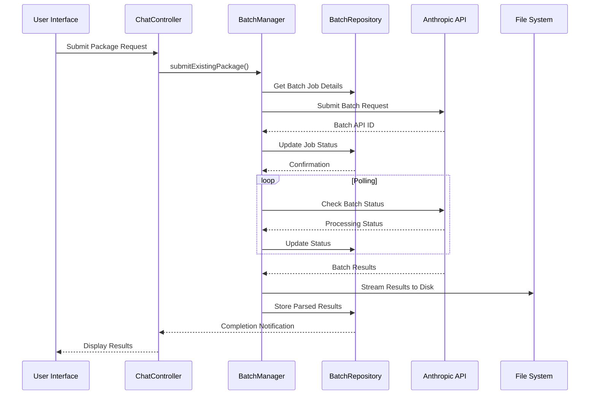
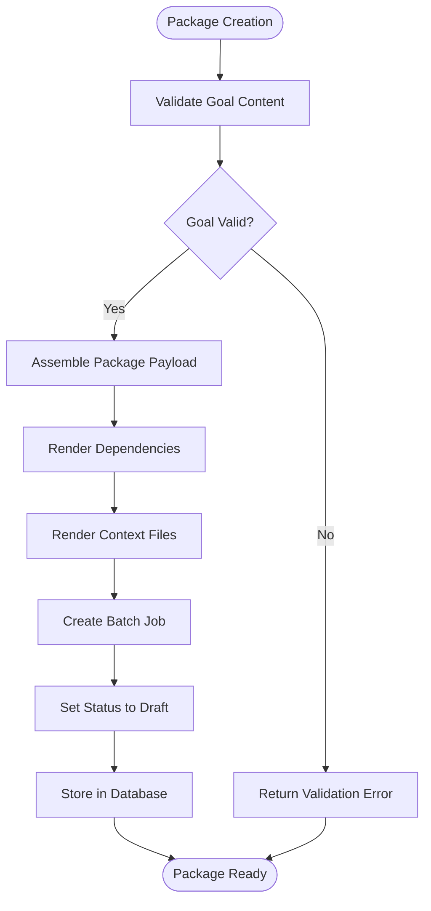
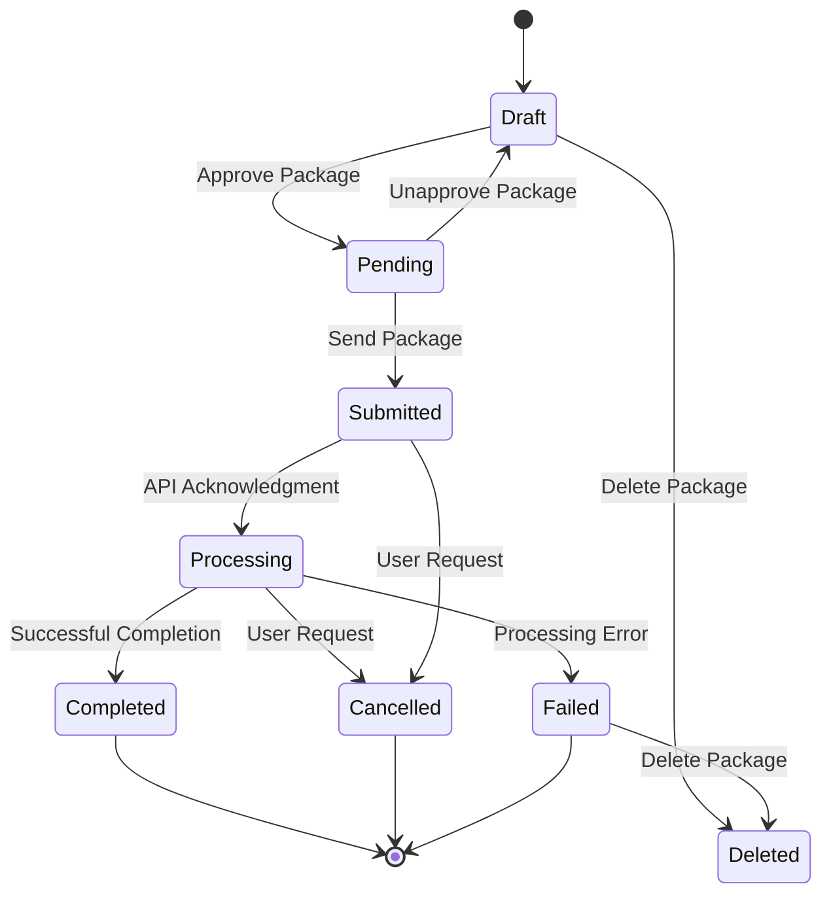
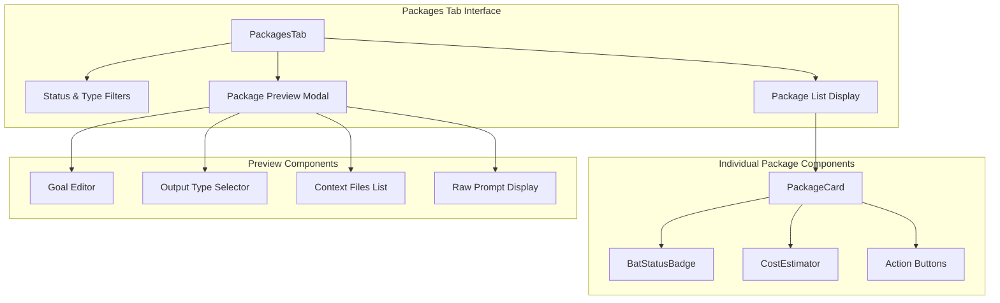
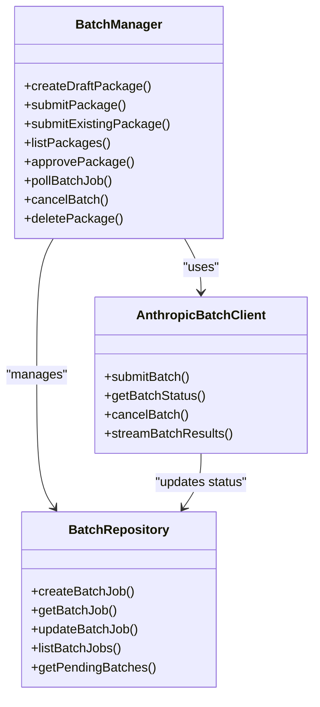
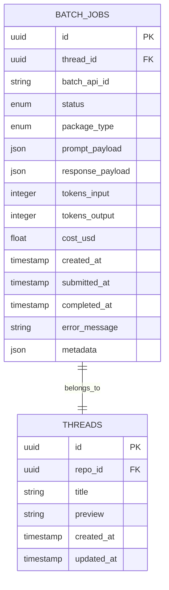

# Packages Management System

<cite>
**Referenced Files in This Document**
- [packageTypes.ts](file://src/webview/components/ai-chat/packageTypes.ts)
- [bundleManager.ts](file://src/core/bundles/bundleManager.ts)
- [bundleTypes.ts](file://src/core/bundles/types.ts)
- [PackagesTab.tsx](file://src/webview/components/ai-chat/PackagesTab.tsx)
- [PackageCard.tsx](file://src/webview/components/ai-chat/PackageCard.tsx)
- [PackagePreview.tsx](file://src/webview/components/ai-chat/PackagePreview.tsx)
- [ChatController.ts](file://src/webview/controllers/ChatController.ts)
- [batchManager.ts](file://src/chat/batch/batchManager.ts)
- [batchRepository.ts](file://src/chat/db/batchRepository.ts)
- [batchTypes.ts](file://src/chat/batch/types.ts)
- [packageAssembler.ts](file://src/chat/batch/packageAssembler.ts)
- [BatchStatusBadge.tsx](file://src/webview/components/ai-chat/BatchStatusBadge.tsx)
- [CostEstimator.tsx](file://src/webview/components/ai-chat/CostEstimator.tsx)
</cite>

## Table of Contents
1. [Introduction](#introduction)
2. [System Architecture](#system-architecture)
3. [Core Components](#core-components)
4. [Package Types and Data Models](#package-types-and-data-models)
5. [Package Lifecycle Management](#package-lifecycle-management)
6. [Webview Interface Components](#webview-interface-components)
7. [Batch Processing System](#batch-processing-system)
8. [Database Schema](#database-schema)
9. [Configuration and Settings](#configuration-and-settings)
10. [Integration Points](#integration-points)
11. [Performance Considerations](#performance-considerations)
12. [Troubleshooting Guide](#troubleshooting-guide)
13. [Conclusion](#conclusion)

## Introduction

The Packages Management System is a comprehensive framework within the Repomix Runner extension that handles the creation, management, and processing of AI-generated packages. These packages represent structured outputs from AI workflows, including plans, code changes, and code reviews. The system provides a complete lifecycle management solution with webview interfaces, batch processing capabilities, and persistent storage mechanisms.

The system integrates multiple components working together to provide users with a seamless experience for managing AI-generated content through an intuitive interface while maintaining robust backend processing and data persistence.

## System Architecture

The Packages Management System follows a layered architecture pattern with clear separation of concerns between presentation, business logic, and data persistence layers.

**Diagram sources**
- [ChatController.ts](file://src/webview/controllers/ChatController.ts#L56-L90)
- [batchManager.ts](file://src/chat/batch/batchManager.ts#L72-L80)
- [batchRepository.ts](file://src/chat/db/batchRepository.ts#L45-L46)

## Core Components

### Package Data Models

The system defines comprehensive data structures for representing packages and their associated metadata throughout the lifecycle.

**Diagram sources**
- [packageTypes.ts](file://src/webview/components/ai-chat/packageTypes.ts#L12-L48)
- [batchRepository.ts](file://src/chat/db/batchRepository.ts#L23-L39)

**Section sources**
- [packageTypes.ts](file://src/webview/components/ai-chat/packageTypes.ts#L1-L49)
- [batchRepository.ts](file://src/chat/db/batchRepository.ts#L1-L237)

### Batch Processing Engine

The BatchManager serves as the central orchestrator for package processing, handling submission to external APIs, polling for completion, and result parsing.

**Diagram sources**
- [ChatController.ts](file://src/webview/controllers/ChatController.ts#L271-L275)
- [batchManager.ts](file://src/chat/batch/batchManager.ts#L138-L186)
- [batchManager.ts](file://src/chat/batch/batchManager.ts#L351-L434)

**Section sources**
- [batchManager.ts](file://src/chat/batch/batchManager.ts#L72-L510)

## Package Types and Data Models

### Status Management

The system implements a comprehensive status tracking mechanism for packages through seven distinct states:

| Status | Description | Allowed Actions |
|--------|-------------|-----------------|
| draft | Initial state for new packages | Approve, Delete |
| pending | Approved packages ready for submission | Send, Unapprove |
| submitted | Package submitted to external API | View Status, Cancel |
| processing | Package being processed by external service | View Status, Cancel |
| completed | Package processing completed successfully | View Response |
| failed | Package processing failed | View Error, Delete |
| cancelled | Package cancelled by user | View Error, Delete |

### Package Type Classification

Packages are categorized into three distinct types based on their intended output:

- **plan**: AI-generated project plans and architectural designs
- **code_change**: Code modifications and refactoring suggestions
- **code_review**: Code review and quality assessment reports

**Section sources**
- [packageTypes.ts](file://src/webview/components/ai-chat/packageTypes.ts#L1-L10)
- [batchRepository.ts](file://src/chat/db/batchRepository.ts#L6-L18)

## Package Lifecycle Management

### Creation and Draft Management

The package creation process begins with assembling a comprehensive payload containing all necessary context and instructions.

**Diagram sources**
- [packageAssembler.ts](file://src/chat/batch/packageAssembler.ts#L27-L34)
- [batchManager.ts](file://src/chat/batch/batchManager.ts#L113-L131)

### Approval and Submission Workflow

The approval process provides users with the ability to review and approve packages before submission to external APIs.

**Diagram sources**
- [batchManager.ts](file://src/chat/batch/batchManager.ts#L209-L229)
- [batchManager.ts](file://src/chat/batch/batchManager.ts#L276-L287)

**Section sources**
- [batchManager.ts](file://src/chat/batch/batchManager.ts#L113-L335)

## Webview Interface Components

### Packages Management Interface

The webview provides a comprehensive interface for managing packages through multiple specialized components working together.

**Diagram sources**
- [PackagesTab.tsx](file://src/webview/components/ai-chat/PackagesTab.tsx#L21-L158)
- [PackageCard.tsx](file://src/webview/components/ai-chat/PackageCard.tsx#L18-L88)
- [PackagePreview.tsx](file://src/webview/components/ai-chat/PackagePreview.tsx#L14-L148)

### Interactive Features

The interface supports advanced interactive features including real-time filtering, bulk operations, and comprehensive preview capabilities.

**Section sources**
- [PackagesTab.tsx](file://src/webview/components/ai-chat/PackagesTab.tsx#L1-L158)
- [PackageCard.tsx](file://src/webview/components/ai-chat/PackageCard.tsx#L1-L88)
- [PackagePreview.tsx](file://src/webview/components/ai-chat/PackagePreview.tsx#L1-L148)

## Batch Processing System

### External API Integration

The system integrates with external AI services through a robust batch processing architecture that handles large-scale operations efficiently.

**Diagram sources**
- [batchManager.ts](file://src/chat/batch/batchManager.ts#L72-L80)
- [batchRepository.ts](file://src/chat/db/batchRepository.ts#L45-L236)

### Processing Pipeline

The batch processing pipeline handles complex workflows including result streaming, parsing, and error handling.

**Section sources**
- [batchManager.ts](file://src/chat/batch/batchManager.ts#L351-L490)

## Database Schema

### Batch Jobs Table Structure

The system maintains package information in a PostgreSQL database with comprehensive indexing and relationship support.

**Diagram sources**
- [batchRepository.ts](file://src/chat/db/batchRepository.ts#L23-L39)

**Section sources**
- [batchRepository.ts](file://src/chat/db/batchRepository.ts#L45-L236)

## Configuration and Settings

### Operational Parameters

The system provides extensive configuration options for batch processing operations including rate limits, retry policies, and cost estimation parameters.

| Configuration Key | Default Value | Description |
|-------------------|---------------|-------------|
| repomix.chat.batchModel | claude-opus-4-20250514 | AI model for batch processing |
| repomix.chat.batchMaxTokens | 16384 | Maximum tokens per request |
| repomix.chat.batchThinkingBudget | 10000 | Token budget for reasoning |
| repomix.chat.batchSendAllLimit | 100 | Maximum packages per bulk operation |
| repomix.chat.batchApiMaxRetries | 3 | Maximum API retry attempts |
| repomix.chat.batchApiRetryBaseMs | 1000 | Base retry delay in milliseconds |
| repomix.chat.batchApiRetryMaxMs | 8000 | Maximum retry delay in milliseconds |

### Cost Estimation Model

The system provides real-time cost estimation for batch operations based on token usage patterns.

**Section sources**
- [batchManager.ts](file://src/chat/batch/batchManager.ts#L29-L51)
- [CostEstimator.tsx](file://src/webview/components/ai-chat/CostEstimator.tsx#L11-L18)

## Integration Points

### VS Code Extension Integration

The packages management system integrates deeply with VS Code through multiple extension points including:

- **Command Registration**: Extensive command palette integration for package management operations
- **Webview Integration**: Rich webview-based user interface for package management
- **File System Operations**: Direct file system access for package content management
- **Workspace State Management**: Persistent state management across VS Code sessions

### External Service Integration

The system integrates with external AI services through secure API management and robust error handling mechanisms.

**Section sources**
- [ChatController.ts](file://src/webview/controllers/ChatController.ts#L256-L320)

## Performance Considerations

### Memory Management

The batch processing system implements several strategies to manage memory usage efficiently:

- **Streaming Results**: Large batch results are streamed directly to disk to prevent memory bloat
- **Lazy Loading**: Package data is loaded on-demand rather than pre-loading entire datasets
- **Resource Cleanup**: Proper cleanup of temporary files and resources after processing completion

### Scalability Features

The system includes built-in scalability features for handling large volumes of packages:

- **Rate Limiting**: Configurable limits on concurrent batch operations
- **Batch Size Management**: Adjustable batch sizes for optimal throughput
- **Error Recovery**: Robust retry mechanisms with exponential backoff

## Troubleshooting Guide

### Common Issues and Solutions

**API Key Configuration Errors**
- **Symptom**: Batch submission fails with authentication errors
- **Solution**: Verify Anthropic API key is properly configured in extension settings

**Package State Inconsistencies**
- **Symptom**: Packages show inconsistent status across UI and database
- **Solution**: Use the batch poller to synchronize package states with external API

**Memory Limit Exceeded Errors**
- **Symptom**: Batch processing fails with memory allocation errors
- **Solution**: Reduce batch size or increase available memory for the extension

### Diagnostic Tools

The system provides comprehensive logging and diagnostic capabilities for troubleshooting package management issues.

**Section sources**
- [batchManager.ts](file://src/chat/batch/batchManager.ts#L82-L95)
- [ChatController.ts](file://src/webview/controllers/ChatController.ts#L685-L697)

## Conclusion

The Packages Management System represents a sophisticated solution for handling AI-generated content within the Repomix Runner extension. Through its comprehensive architecture, the system provides users with powerful tools for creating, managing, and processing AI packages while maintaining robust backend operations and data persistence.

The system's modular design ensures maintainability and extensibility, while its comprehensive error handling and performance optimizations provide a reliable foundation for production use. The integration with VS Code and external AI services creates a seamless workflow for developers working with AI-assisted development tools.

Future enhancements could include expanded AI provider support, enhanced package templating systems, and advanced analytics for package performance tracking.