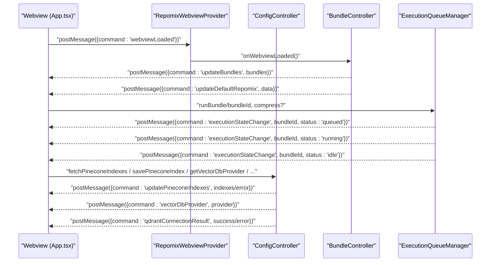
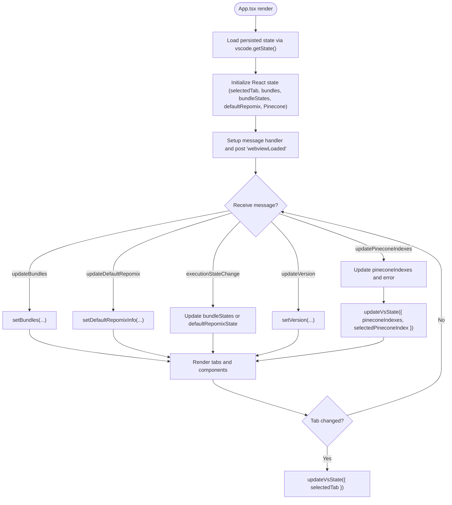
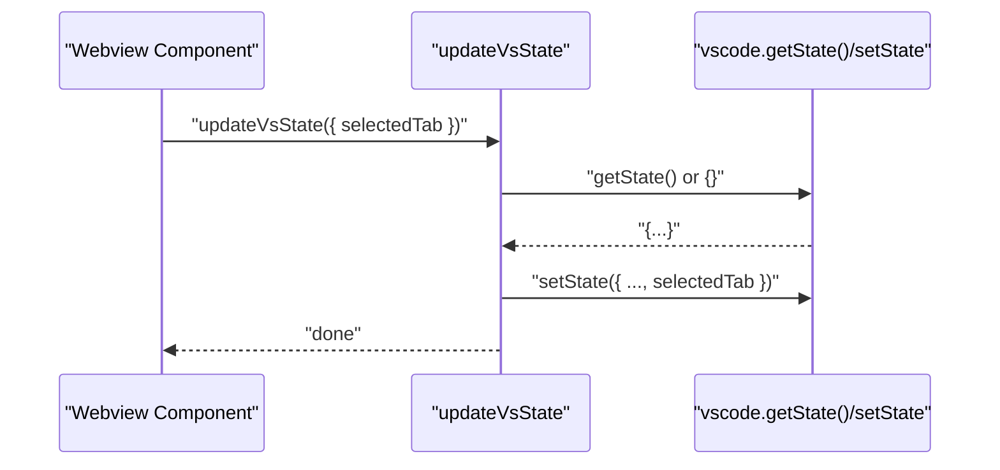
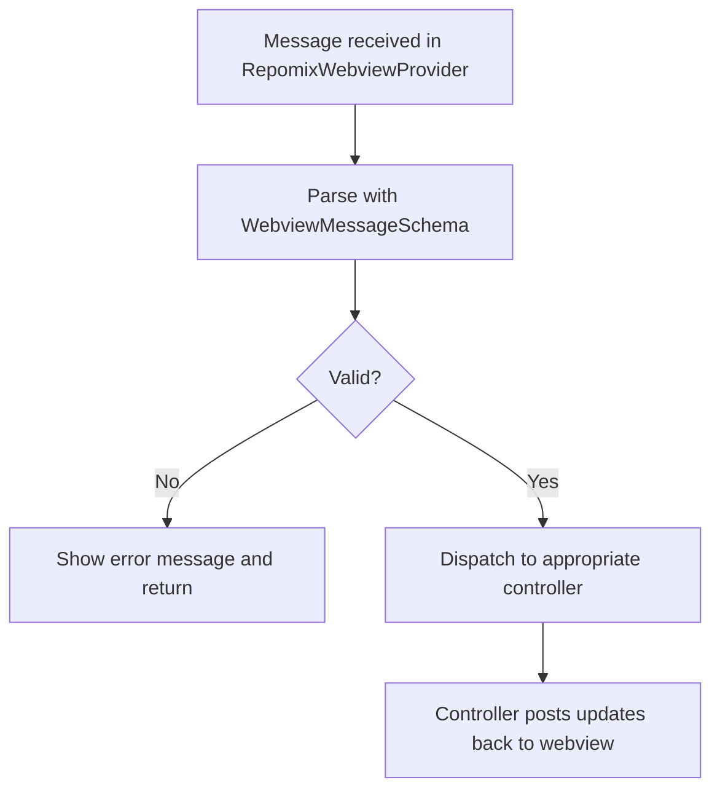
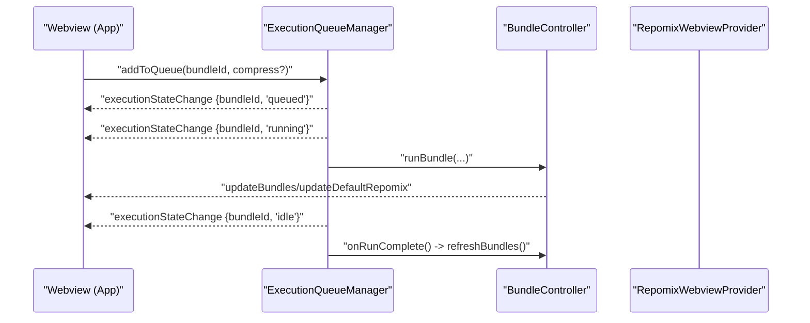
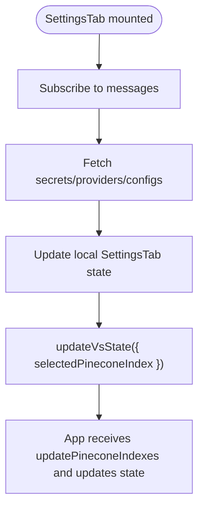
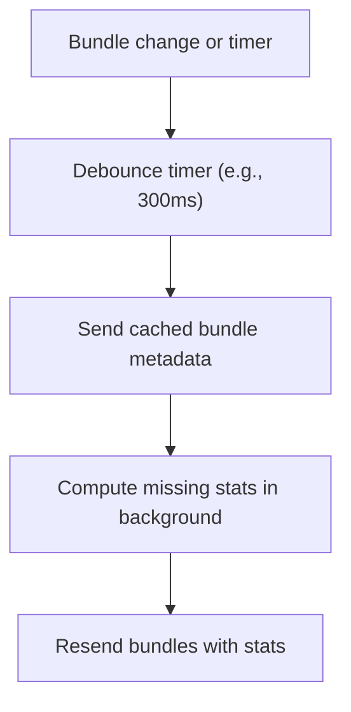
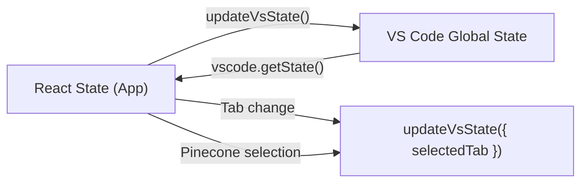
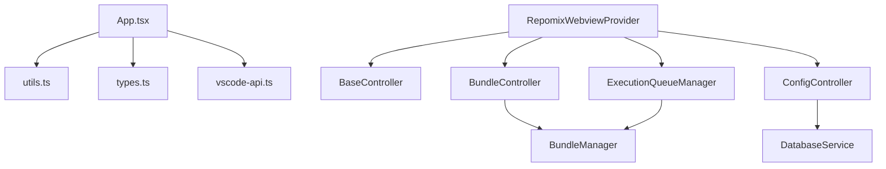

# State Management

<cite>
**Referenced Files in This Document**
- [App.tsx](file://src/webview/App.tsx)
- [index.tsx](file://src/webview/index.tsx)
- [utils.ts](file://src/webview/utils.ts)
- [types.ts](file://src/webview/types.ts)
- [messageSchemas.ts](file://src/webview/messageSchemas.ts)
- [vscode-api.ts](file://src/webview/vscode-api.ts)
- [BundleController.ts](file://src/webview/controllers/BundleController.ts)
- [ConfigController.ts](file://src/webview/controllers/ConfigController.ts)
- [ExecutionQueueManager.ts](file://src/webview/services/ExecutionQueueManager.ts)
- [BaseController.ts](file://src/webview/controllers/BaseController.ts)
- [RepomixWebviewProvider.ts](file://src/webview/RepomixWebviewProvider.ts)
- [BundleItem.tsx](file://src/webview/components/BundleItem.tsx)
- [SettingsTab.tsx](file://src/webview/components/SettingsTab.tsx)
</cite>

## Table of Contents
1. [Introduction](#introduction)
2. [Project Structure](#project-structure)
3. [Core Components](#core-components)
4. [Architecture Overview](#architecture-overview)
5. [Detailed Component Analysis](#detailed-component-analysis)
6. [Dependency Analysis](#dependency-analysis)
7. [Performance Considerations](#performance-considerations)
8. [Troubleshooting Guide](#troubleshooting-guide)
9. [Conclusion](#conclusion)

## Introduction
This document explains the state management approach used in the Webview Interface of the Repomix Runner extension. It focuses on how React state is structured and updated, how state is lifted to shared/global scope, how persistent VS Code state is synchronized, and how asynchronous updates from the extension host are integrated. It also covers patterns for complex scenarios such as bundle execution states, multi-tab navigation, and dynamic content loading, along with consistency, performance, and debugging strategies.

## Project Structure
The Webview is a React application embedded inside a VS Code webview. The entry point renders the App component, which orchestrates tabs, state, and user actions. Controllers and services in the extension host manage long-running tasks and emit updates back to the webview. A small utility synchronizes React state with VS Code’s persistent state.

```mermaid
graph TB
subgraph "VS Code Extension Host"
Provider["RepomixWebviewProvider"]
Controllers["Controllers<br/>BundleController, ConfigController, ..."]
QueueMgr["ExecutionQueueManager"]
BundleMgr["BundleManager"]
DB["DatabaseService"]
end
subgraph "Webview (React)"
Entry["index.tsx"]
App["App.tsx"]
Tabs["Tabs: Bundles, Search, Settings, Apply, Debug"]
Utils["utils.ts<br/>updateVsState"]
Types["types.ts<br/>WebViewState"]
end
Entry --> App
App --> Utils
App --> Types
App --> Tabs
Provider --> Controllers
Provider --> QueueMgr
QueueMgr --> BundleMgr
Controllers --> DB
Provider <- --> App : "postMessage/onDidReceiveMessage"
QueueMgr --> App : "executionStateChange"
Controllers --> App : "updateBundles, updateDefaultRepomix, updatePineconeIndexes, ..."
```

**Diagram sources**
- [RepomixWebviewProvider.ts](file://src/webview/RepomixWebviewProvider.ts#L43-L218)
- [index.tsx](file://src/webview/index.tsx#L1-L18)
- [App.tsx](file://src/webview/App.tsx#L47-L257)
- [ExecutionQueueManager.ts](file://src/webview/services/ExecutionQueueManager.ts#L15-L133)
- [BundleController.ts](file://src/webview/controllers/BundleController.ts#L17-L257)
- [utils.ts](file://src/webview/utils.ts#L4-L7)
- [types.ts](file://src/webview/types.ts#L105-L112)

**Section sources**
- [index.tsx](file://src/webview/index.tsx#L1-L18)
- [App.tsx](file://src/webview/App.tsx#L47-L257)
- [RepomixWebviewProvider.ts](file://src/webview/RepomixWebviewProvider.ts#L43-L218)

## Core Components
- App (React):
  - Manages local UI state: selected tab, bundles list, per-bundle execution states, default Repomix state, Pinecone configuration, and version.
  - Lifted state strategy: App holds global-like state (bundles, default Repomix info, Pinecone indexes and selection) and updates VS Code persistent state via updateVsState.
  - Receives updates from the extension host via message handlers and updates local state accordingly.
- updateVsState utility:
  - Merges partial state updates into VS Code’s persisted state to survive reloads and tab switches.
- VS Code API wrapper:
  - Ensures a singleton acquisition of the VS Code webview API and exposes postMessage, getState, and setState.
- Message schemas:
  - Strongly typed inbound/outbound messages validated with Zod to prevent runtime errors and enforce contracts.
- Controllers and services:
  - BundleController: emits bundle lists, default Repomix state, and file existence changes.
  - ConfigController: handles secrets, vector DB provider, Qdrant/Pinecone configuration, and compatibility checks.
  - ExecutionQueueManager: manages execution lifecycle and emits executionStateChange messages.

**Section sources**
- [App.tsx](file://src/webview/App.tsx#L47-L257)
- [utils.ts](file://src/webview/utils.ts#L4-L7)
- [vscode-api.ts](file://src/webview/vscode-api.ts#L12-L24)
- [messageSchemas.ts](file://src/webview/messageSchemas.ts#L443-L517)
- [BundleController.ts](file://src/webview/controllers/BundleController.ts#L62-L206)
- [ConfigController.ts](file://src/webview/controllers/ConfigController.ts#L26-L111)
- [ExecutionQueueManager.ts](file://src/webview/services/ExecutionQueueManager.ts#L26-L126)

## Architecture Overview
The Webview uses a unidirectional data flow:
- The extension host initializes controllers and services, listens for webview messages, and dispatches work.
- The webview renders UI and sends commands to the extension host.
- The extension host updates persistent state and emits updates back to the webview.
- The webview merges these updates into React state and persists user preferences to VS Code state.



**Diagram sources**
- [RepomixWebviewProvider.ts](file://src/webview/RepomixWebviewProvider.ts#L92-L195)
- [BundleController.ts](file://src/webview/controllers/BundleController.ts#L62-L134)
- [ExecutionQueueManager.ts](file://src/webview/services/ExecutionQueueManager.ts#L26-L126)
- [ConfigController.ts](file://src/webview/controllers/ConfigController.ts#L42-L184)
- [App.tsx](file://src/webview/App.tsx#L75-L145)

## Detailed Component Analysis

### App: React State Patterns and Lifting
- Local component state:
  - Selected tab, bundles list, per-bundle execution states, default Repomix state and info, Pinecone indexes and selection, and version.
- Persistence strategy:
  - Uses updateVsState to persist selectedTab and Pinecone selections to VS Code state.
- Message-driven updates:
  - Listens for messages to update bundles, default Repomix info, execution states, version, and Pinecone indexes.
- Multi-tab navigation:
  - Tab selection triggers updateVsState to persist the choice.
- Example complex scenario: bundle execution states
  - Per-bundle state is tracked in a dictionary keyed by bundleId, allowing independent UI updates for each bundle.



**Diagram sources**
- [App.tsx](file://src/webview/App.tsx#L47-L145)
- [utils.ts](file://src/webview/utils.ts#L4-L7)

**Section sources**
- [App.tsx](file://src/webview/App.tsx#L50-L114)
- [utils.ts](file://src/webview/utils.ts#L4-L7)

### updateVsState Utility
- Purpose: Merge partial state updates into VS Code’s persisted state to maintain continuity across reloads and tab switches.
- Usage: Called after user actions that should persist (e.g., tab selection, Pinecone index selection).



**Diagram sources**
- [utils.ts](file://src/webview/utils.ts#L4-L7)
- [vscode-api.ts](file://src/webview/vscode-api.ts#L12-L24)

**Section sources**
- [utils.ts](file://src/webview/utils.ts#L4-L7)
- [vscode-api.ts](file://src/webview/vscode-api.ts#L12-L24)

### Message Schemas and Type Safety
- All inbound messages are validated using Zod schemas to ensure correctness and prevent runtime exceptions.
- Outbound messages are sent via postMessage from controllers and services.



**Diagram sources**
- [RepomixWebviewProvider.ts](file://src/webview/RepomixWebviewProvider.ts#L92-L195)
- [messageSchemas.ts](file://src/webview/messageSchemas.ts#L443-L517)

**Section sources**
- [messageSchemas.ts](file://src/webview/messageSchemas.ts#L1-L517)
- [RepomixWebviewProvider.ts](file://src/webview/RepomixWebviewProvider.ts#L92-L195)

### Bundle Execution Lifecycle and State Updates
- Queue management:
  - ExecutionQueueManager adds items to a queue, marks them queued, then running, and finally idle upon completion or cancellation.
- UI feedback:
  - App listens for executionStateChange and updates either defaultRepomixState or bundleStates depending on bundleId.
- Completion refresh:
  - After runs complete, a callback triggers BundleController to refresh bundle metadata and default Repomix state.



**Diagram sources**
- [ExecutionQueueManager.ts](file://src/webview/services/ExecutionQueueManager.ts#L26-L126)
- [BundleController.ts](file://src/webview/controllers/BundleController.ts#L62-L134)
- [App.tsx](file://src/webview/App.tsx#L88-L97)

**Section sources**
- [ExecutionQueueManager.ts](file://src/webview/services/ExecutionQueueManager.ts#L26-L126)
- [BundleController.ts](file://src/webview/controllers/BundleController.ts#L62-L134)
- [App.tsx](file://src/webview/App.tsx#L88-L97)

### Settings and Pinecone State Lifting
- App lifts Pinecone state (indexes, selection, error) to React state and persists selections via updateVsState.
- SettingsTab component:
  - Manages local state for keys, provider, Qdrant URL/collection, and embedding configuration.
  - Subscribes to messages to keep UI in sync with extension-host state.
- Controller responsibilities:
  - ConfigController fetches and saves secrets, manages vector DB provider, tests connections, and emits compatibility status.



**Diagram sources**
- [SettingsTab.tsx](file://src/webview/components/SettingsTab.tsx#L166-L318)
- [ConfigController.ts](file://src/webview/controllers/ConfigController.ts#L150-L233)
- [App.tsx](file://src/webview/App.tsx#L66-L114)
- [utils.ts](file://src/webview/utils.ts#L4-L7)

**Section sources**
- [SettingsTab.tsx](file://src/webview/components/SettingsTab.tsx#L166-L318)
- [ConfigController.ts](file://src/webview/controllers/ConfigController.ts#L150-L233)
- [App.tsx](file://src/webview/App.tsx#L66-L114)

### Dynamic Content Loading and Debouncing
- BundleController debounces refreshes to avoid excessive updates and recalculations.
- It also sets up file system watchers for output files to trigger refreshes automatically.



**Diagram sources**
- [BundleController.ts](file://src/webview/controllers/BundleController.ts#L67-L134)

**Section sources**
- [BundleController.ts](file://src/webview/controllers/BundleController.ts#L67-L134)

### Relationship Between Local React State and Persistent VS Code State
- Local React state drives immediate UI behavior.
- updateVsState persists user choices (tab, Pinecone selection) to VS Code state.
- On mount, App reads persisted state to restore user context.



**Diagram sources**
- [App.tsx](file://src/webview/App.tsx#L50-L73)
- [utils.ts](file://src/webview/utils.ts#L4-L7)
- [vscode-api.ts](file://src/webview/vscode-api.ts#L12-L24)

**Section sources**
- [App.tsx](file://src/webview/App.tsx#L50-L73)
- [utils.ts](file://src/webview/utils.ts#L4-L7)

## Dependency Analysis
- App depends on:
  - VS Code API wrapper for messaging and state.
  - updateVsState for persistence.
  - Message schemas for validation.
- Controllers depend on:
  - BundleManager, DatabaseService, and extension context.
  - They emit messages back to the webview.
- ExecutionQueueManager depends on:
  - BundleManager and onRunComplete callback to refresh UI.



**Diagram sources**
- [App.tsx](file://src/webview/App.tsx#L1-L257)
- [utils.ts](file://src/webview/utils.ts#L1-L8)
- [types.ts](file://src/webview/types.ts#L105-L112)
- [vscode-api.ts](file://src/webview/vscode-api.ts#L12-L24)
- [RepomixWebviewProvider.ts](file://src/webview/RepomixWebviewProvider.ts#L19-L88)
- [BaseController.ts](file://src/webview/controllers/BaseController.ts#L3-L19)
- [BundleController.ts](file://src/webview/controllers/BundleController.ts#L1-L36)
- [ConfigController.ts](file://src/webview/controllers/ConfigController.ts#L1-L24)
- [ExecutionQueueManager.ts](file://src/webview/services/ExecutionQueueManager.ts#L1-L24)

**Section sources**
- [RepomixWebviewProvider.ts](file://src/webview/RepomixWebviewProvider.ts#L19-L88)
- [BaseController.ts](file://src/webview/controllers/BaseController.ts#L3-L19)
- [BundleController.ts](file://src/webview/controllers/BundleController.ts#L1-L36)
- [ConfigController.ts](file://src/webview/controllers/ConfigController.ts#L1-L24)
- [ExecutionQueueManager.ts](file://src/webview/services/ExecutionQueueManager.ts#L1-L24)

## Performance Considerations
- Debouncing:
  - BundleController uses timers to debounce expensive refreshes and stats computation.
- Watchers:
  - File system watchers are created per bundle output to minimize unnecessary polling.
- Minimal re-renders:
  - Prefer updating only affected parts of state (e.g., bundleStates dictionary keyed by id).
- Message validation:
  - Zod schemas reduce error handling overhead and prevent invalid state mutations.
- Avoid redundant updates:
  - App checks for saved tab and disables deprecated agent tab to avoid unnecessary renders.

[No sources needed since this section provides general guidance]

## Troubleshooting Guide
- Messages not received:
  - Verify message schemas and ensure the webview posts “webviewLoaded” to trigger controller initialization.
- State not persisting:
  - Confirm updateVsState is called after user actions and that vscode.getState()/setState are available.
- Execution state stuck:
  - Check executionStateChange messages and ensure ExecutionQueueManager transitions are emitted and App state is updated.
- Pinecone/Qdrant misconfiguration:
  - Use ConfigController handlers to fetch indexes/collections and test connections; inspect error messages posted back to the webview.

**Section sources**
- [RepomixWebviewProvider.ts](file://src/webview/RepomixWebviewProvider.ts#L92-L195)
- [utils.ts](file://src/webview/utils.ts#L4-L7)
- [ExecutionQueueManager.ts](file://src/webview/services/ExecutionQueueManager.ts#L26-L126)
- [ConfigController.ts](file://src/webview/controllers/ConfigController.ts#L150-L233)

## Conclusion
The Webview employs a clear separation of concerns: React manages local UI state, VS Code state persists user preferences, and controllers/services orchestrate long-running tasks and emit updates. The updateVsState utility ensures continuity across sessions. Strong typing via message schemas and debouncing strategies help maintain performance and reliability. Together, these patterns support complex scenarios like multi-bundle execution, dynamic content loading, and persistent configuration.