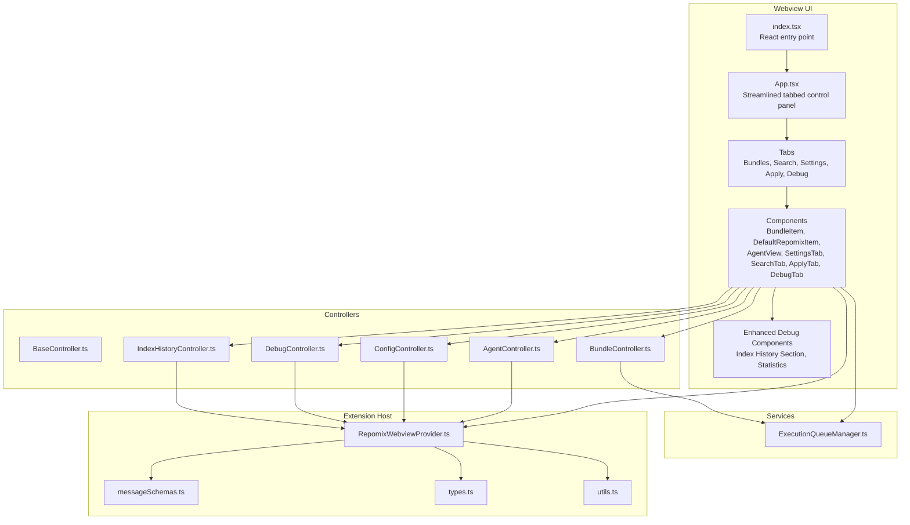
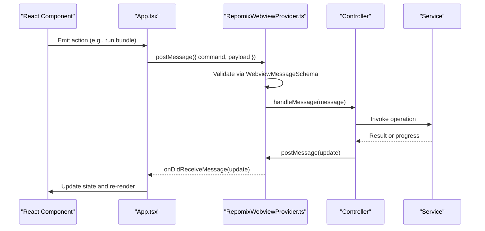
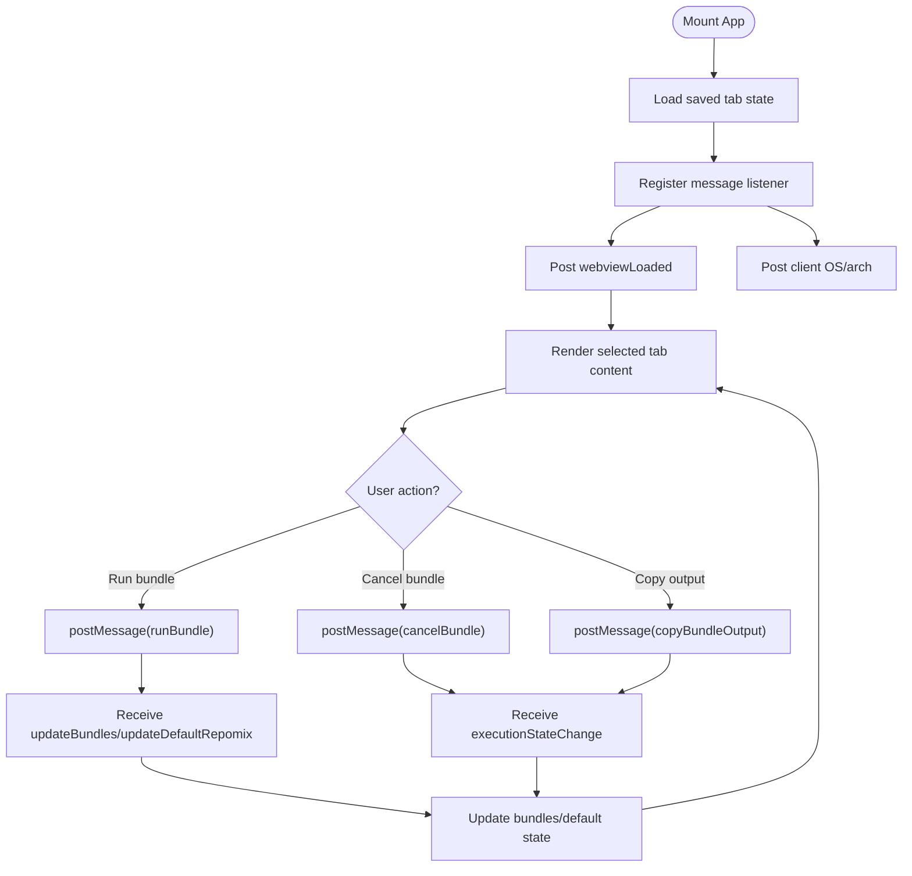
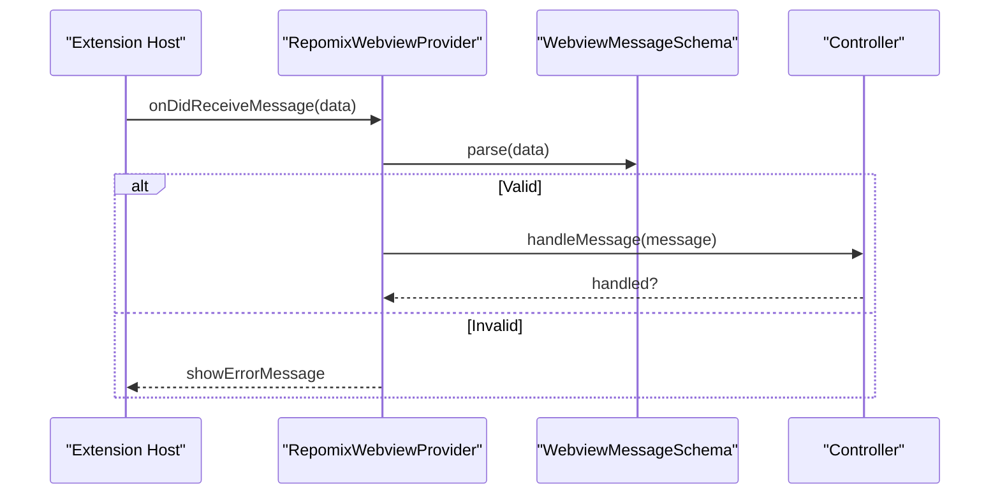
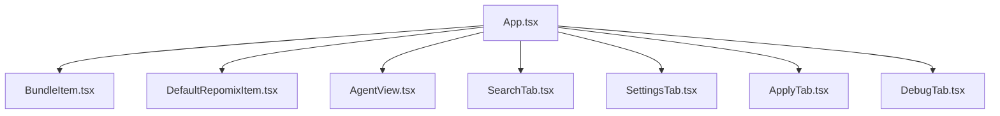
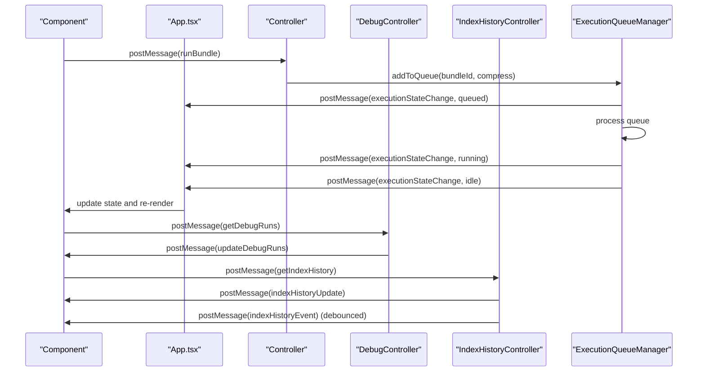
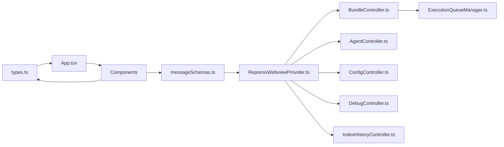

# Webview Interface

<cite>
**Referenced Files in This Document**
- [App.tsx](file://src/webview/App.tsx)
- [index.tsx](file://src/webview/index.tsx)
- [RepomixWebviewProvider.ts](file://src/webview/RepomixWebviewProvider.ts)
- [types.ts](file://src/webview/types.ts)
- [messageSchemas.ts](file://src/webview/messageSchemas.ts)
- [BaseController.ts](file://src/webview/controllers/BaseController.ts)
- [BundleController.ts](file://src/webview/controllers/BundleController.ts)
- [AgentController.ts](file://src/webview/controllers/AgentController.ts)
- [ConfigController.ts](file://src/webview/controllers/ConfigController.ts)
- [IndexHistoryController.ts](file://src/webview/controllers/IndexHistoryController.ts)
- [DebugController.ts](file://src/webview/controllers/DebugController.ts)
- [ExecutionQueueManager.ts](file://src/webview/services/ExecutionQueueManager.ts)
- [AgentView.tsx](file://src/webview/components/AgentView.tsx)
- [BundleItem.tsx](file://src/webview/components/BundleItem.tsx)
- [DefaultRepomixItem.tsx](file://src/webview/components/DefaultRepomixItem.tsx)
- [SettingsTab.tsx](file://src/webview/components/SettingsTab.tsx)
- [SearchTab.tsx](file://src/webview/components/SearchTab.tsx)
- [ApplyTab.tsx](file://src/webview/components/ApplyTab.tsx)
- [DebugTab.tsx](file://src/webview/components/DebugTab.tsx)
- [utils.ts](file://src/webview/utils.ts)
</cite>

## Update Summary
**Changes Made**
- Removed standalone Index History tab from the tabbed interface structure
- Consolidated Index History functionality into the Debug tab for streamlined user experience
- Updated Debug tab to include comprehensive index history tracking capabilities
- Enhanced Debug tab with real-time event streaming and statistics visualization
- Updated controller integration to support consolidated debugging and monitoring features

## Table of Contents
1. [Introduction](#introduction)
2. [Project Structure](#project-structure)
3. [Core Components](#core-components)
4. [Architecture Overview](#architecture-overview)
5. [Detailed Component Analysis](#detailed-component-analysis)
6. [Dependency Analysis](#dependency-analysis)
7. [Performance Considerations](#performance-considerations)
8. [Troubleshooting Guide](#troubleshooting-guide)
9. [Conclusion](#conclusion)

## Introduction
This document describes the Webview Interface system for the Repomix Runner Plus extension. It covers the React-based control panel architecture with a streamlined tabbed interface, the MVC pattern implementation using controllers and views, state management strategies, and the bidirectional message system between the webview and the extension context. The interface now features a consolidated Debug tab that includes comprehensive index history tracking capabilities, providing a more unified debugging and monitoring experience.

## Project Structure
The webview layer is organized around a React entry point that renders a streamlined tabbed control panel. The panel delegates actions to controllers that communicate with the extension host and underlying services. Messages are validated using Zod schemas to ensure type safety. The Debug tab now includes integrated index history tracking alongside traditional debugging features.

**Diagram sources**
- [index.tsx](file://src/webview/index.tsx#L1-L18)
- [App.tsx](file://src/webview/App.tsx#L1-L273)
- [RepomixWebviewProvider.ts](file://src/webview/RepomixWebviewProvider.ts#L1-L405)
- [messageSchemas.ts](file://src/webview/messageSchemas.ts#L1-L632)
- [types.ts](file://src/webview/types.ts#L1-L131)
- [BaseController.ts](file://src/webview/controllers/BaseController.ts#L1-L19)
- [BundleController.ts](file://src/webview/controllers/BundleController.ts#L1-L257)
- [AgentController.ts](file://src/webview/controllers/AgentController.ts#L1-L314)
- [ConfigController.ts](file://src/webview/controllers/ConfigController.ts#L1-L1017)
- [IndexHistoryController.ts](file://src/webview/controllers/IndexHistoryController.ts#L1-L115)
- [DebugController.ts](file://src/webview/controllers/DebugController.ts#L1-L230)
- [ExecutionQueueManager.ts](file://src/webview/services/ExecutionQueueManager.ts#L1-L133)

**Section sources**
- [index.tsx](file://src/webview/index.tsx#L1-L18)
- [App.tsx](file://src/webview/App.tsx#L1-L273)
- [RepomixWebviewProvider.ts](file://src/webview/RepomixWebviewProvider.ts#L1-L405)

## Core Components
- React entry point initializes the root and mounts App.
- App orchestrates tab navigation, state lifting, and message handling with the extension host.
- Controllers encapsulate domain logic and handle webview messages.
- Components render UI and delegate actions to controllers via message passing.
- ExecutionQueueManager coordinates bundle runs with cancellation and state transitions.
- Message schemas define strict contracts for bidirectional communication.
- **Updated**: Debug tab now includes integrated index history tracking with real-time event streaming and statistics visualization.

Key responsibilities:
- App.tsx: Streamlined tab management (bundles, search, settings, apply, debug), state lifting, message routing, client OS detection, and version display.
- RepomixWebviewProvider.ts: HTML generation, message dispatching, controller lifecycle, and extension-side state.
- BaseController.ts: Abstract contract for controllers.
- BundleController.ts: Bundle listing, default Repomix state, output copying, and execution queue integration.
- AgentController.ts: Smart Agent orchestration, history retrieval, reruns, and output copying.
- ConfigController.ts: Secrets management, vector DB provider switching, Qdrant connectivity testing, embedding configuration, and compatibility checks.
- **Updated**: DebugController.ts: Debug run management, environment information retrieval, and integration with index history functionality.
- IndexHistoryController.ts: Manages indexing history retrieval and real-time event streaming with debounced updates.
- ExecutionQueueManager.ts: Queue scheduling, cancellation, and execution state notifications.
- Components: Render UI and emit commands; they rely on App-level state and controller-provided data.

**Section sources**
- [App.tsx](file://src/webview/App.tsx#L47-L273)
- [RepomixWebviewProvider.ts](file://src/webview/RepomixWebviewProvider.ts#L19-L218)
- [BaseController.ts](file://src/webview/controllers/BaseController.ts#L8-L19)
- [BundleController.ts](file://src/webview/controllers/BundleController.ts#L17-L257)
- [AgentController.ts](file://src/webview/controllers/AgentController.ts#L11-L314)
- [ConfigController.ts](file://src/webview/controllers/ConfigController.ts#L14-L1017)
- [DebugController.ts](file://src/webview/controllers/DebugController.ts#L16-L230)
- [IndexHistoryController.ts](file://src/webview/controllers/IndexHistoryController.ts#L6-L115)
- [ExecutionQueueManager.ts](file://src/webview/services/ExecutionQueueManager.ts#L15-L133)

## Architecture Overview
The system follows an MVC-inspired pattern with a streamlined approach:
- Views: React components that render UI and collect user actions.
- Controllers: TypeScript classes that interpret messages, coordinate services, and update UI via messages.
- Model/State: Lifted in App.tsx and persisted via VS Code state; controllers also maintain internal state and push updates to the UI.

Communication flow:
- Webview-to-Extension: Components send typed commands; provider validates via Zod and dispatches to controllers.
- Extension-to-Webview: Controllers send structured updates; App and components update state and UI.

**Diagram sources**
- [App.tsx](file://src/webview/App.tsx#L75-L145)
- [RepomixWebviewProvider.ts](file://src/webview/RepomixWebviewProvider.ts#L92-L195)
- [messageSchemas.ts](file://src/webview/messageSchemas.ts#L543-L630)
- [BundleController.ts](file://src/webview/controllers/BundleController.ts#L38-L60)
- [ExecutionQueueManager.ts](file://src/webview/services/ExecutionQueueManager.ts#L26-L118)

## Detailed Component Analysis

### App.tsx: Streamlined Tabbed Control Panel and State Management
- Streamlined tabbed interface with Fluent UI TabList; selected tab state is lifted and persisted via VS Code state.
- Centralized message handler listens for updates from the extension (bundles, default Repomix state, version, Pinecone indexes).
- Action handlers translate UI actions into messages (run, cancel, copy) and vice versa.
- Client OS detection informs remote clipboard support.
- **Updated**: Simplified tab structure with consolidated Debug tab that includes index history functionality.

**Diagram sources**
- [App.tsx](file://src/webview/App.tsx#L47-L145)
- [utils.ts](file://src/webview/utils.ts#L4-L8)

**Section sources**
- [App.tsx](file://src/webview/App.tsx#L47-L273)
- [utils.ts](file://src/webview/utils.ts#L1-L8)

### Controllers: MVC Implementation with Consolidated Features
- BaseController.ts defines the contract for controllers: handleMessage, optional onWebviewLoaded, and dispose.
- BundleController.ts manages bundles, default Repomix state, output watching, and integrates with ExecutionQueueManager.
- AgentController.ts orchestrates the Smart Agent workflow, handles history, reruns, and copying outputs.
- ConfigController.ts manages secrets, vector DB provider switching, Qdrant connectivity, embedding configuration, and compatibility checks.
- **Updated**: DebugController.ts manages debug runs, environment information, and integrates with index history functionality.
- **Updated**: IndexHistoryController.ts manages indexing history retrieval and real-time event streaming with debounced updates.

**Diagram sources**
- [BaseController.ts](file://src/webview/controllers/BaseController.ts#L8-L19)
- [BundleController.ts](file://src/webview/controllers/BundleController.ts#L17-L60)
- [AgentController.ts](file://src/webview/controllers/AgentController.ts#L20-L42)
- [ConfigController.ts](file://src/webview/controllers/ConfigController.ts#L26-L111)
- [DebugController.ts](file://src/webview/controllers/DebugController.ts#L16-L43)
- [IndexHistoryController.ts](file://src/webview/controllers/IndexHistoryController.ts#L18-L50)

**Section sources**
- [BaseController.ts](file://src/webview/controllers/BaseController.ts#L1-L19)
- [BundleController.ts](file://src/webview/controllers/BundleController.ts#L1-L257)
- [AgentController.ts](file://src/webview/controllers/AgentController.ts#L1-L314)
- [ConfigController.ts](file://src/webview/controllers/ConfigController.ts#L1-L1017)
- [DebugController.ts](file://src/webview/controllers/DebugController.ts#L1-L230)
- [IndexHistoryController.ts](file://src/webview/controllers/IndexHistoryController.ts#L1-L115)

### Message Handling and Validation
- RepomixWebviewProvider.ts validates incoming messages using WebviewMessageSchema and routes them to controllers.
- App.tsx posts webviewLoaded and reports client OS to the extension host.
- Message schemas enumerate all supported commands with strict typing.
- **Updated**: Enhanced message schemas to support consolidated debugging and index history features.

**Diagram sources**
- [RepomixWebviewProvider.ts](file://src/webview/RepomixWebviewProvider.ts#L92-L116)
- [messageSchemas.ts](file://src/webview/messageSchemas.ts#L543-L630)

**Section sources**
- [RepomixWebviewProvider.ts](file://src/webview/RepomixWebviewProvider.ts#L92-L195)
- [messageSchemas.ts](file://src/webview/messageSchemas.ts#L1-L632)

### Component Hierarchy and Composition
- App.tsx renders the streamlined tabbed layout and passes props to specialized components.
- BundleItem.tsx and DefaultRepomixItem.tsx are reusable UI components that accept actions via props.
- AgentView.tsx composes AgentInput, AgentStatus, AgentConfiguration, and AgentHistory.
- SettingsTab.tsx aggregates configuration sections and reacts to controller updates.
- **Updated**: DebugTab.tsx now includes comprehensive index history visualization with real-time updates, statistics, and environment information.
- SearchTab.tsx manages search state, filters, and indexing controls with enhanced message handling.
- ApplyTab.tsx and DebugTab.tsx provide specialized workflows with their own state and message handling.

**Diagram sources**
- [App.tsx](file://src/webview/App.tsx#L204-L273)
- [BundleItem.tsx](file://src/webview/components/BundleItem.tsx#L7-L121)
- [DefaultRepomixItem.tsx](file://src/webview/components/DefaultRepomixItem.tsx#L7-L91)
- [AgentView.tsx](file://src/webview/components/AgentView.tsx#L16-L165)
- [SettingsTab.tsx](file://src/webview/components/SettingsTab.tsx#L120-L802)
- [SearchTab.tsx](file://src/webview/components/SearchTab.tsx#L169-L1197)
- [ApplyTab.tsx](file://src/webview/components/ApplyTab.tsx#L26-L150)
- [DebugTab.tsx](file://src/webview/components/DebugTab.tsx#L7-L472)

**Section sources**
- [App.tsx](file://src/webview/App.tsx#L204-L273)
- [BundleItem.tsx](file://src/webview/components/BundleItem.tsx#L1-L121)
- [DefaultRepomixItem.tsx](file://src/webview/components/DefaultRepomixItem.tsx#L1-L91)
- [AgentView.tsx](file://src/webview/components/AgentView.tsx#L1-L165)
- [SettingsTab.tsx](file://src/webview/components/SettingsTab.tsx#L1-L802)
- [SearchTab.tsx](file://src/webview/components/SearchTab.tsx#L1-L1197)
- [ApplyTab.tsx](file://src/webview/components/ApplyTab.tsx#L1-L150)
- [DebugTab.tsx](file://src/webview/components/DebugTab.tsx#L1-L472)

### State Synchronization and Event Propagation
- App.tsx maintains global state (selected tab, bundles, default Repomix state, Pinecone indexes) and persists it via VS Code state.
- Components subscribe to messages to update their local state and reflect changes.
- ExecutionQueueManager notifies UI of state changes (queued, running, idle) to keep the UI consistent with backend execution.
- **Updated**: Debug tab now manages both debug runs and index history state independently, with separate loading states and refresh mechanisms.

**Diagram sources**
- [ExecutionQueueManager.ts](file://src/webview/services/ExecutionQueueManager.ts#L26-L118)
- [BundleController.ts](file://src/webview/controllers/BundleController.ts#L38-L60)
- [App.tsx](file://src/webview/App.tsx#L88-L97)
- [DebugController.ts](file://src/webview/controllers/DebugController.ts#L45-L47)
- [IndexHistoryController.ts](file://src/webview/controllers/IndexHistoryController.ts#L65-L95)

**Section sources**
- [ExecutionQueueManager.ts](file://src/webview/services/ExecutionQueueManager.ts#L1-L133)
- [BundleController.ts](file://src/webview/controllers/BundleController.ts#L67-L134)
- [App.tsx](file://src/webview/App.tsx#L75-L145)
- [DebugController.ts](file://src/webview/controllers/DebugController.ts#L1-L230)
- [IndexHistoryController.ts](file://src/webview/controllers/IndexHistoryController.ts#L1-L115)

### Accessibility and Responsive Design
- Uses Fluent UI components that provide built-in accessibility attributes and keyboard navigation.
- Layout uses Flexbox with responsive spacing; tab content adapts to viewport height.
- Interactive elements include tooltips and clear visual states (running, queued, idle).
- Color contrast and semantic text sizes are applied consistently across components.
- **Updated**: Debug tab includes visual indicators for different event types with appropriate color coding and status badges, providing better accessibility for index history monitoring.

### Extending the Interface
- Add a new controller by extending BaseController and implementing handleMessage.
- Define a new command schema in messageSchemas.ts and add validation logic in RepomixWebviewProvider.ts.
- Create a new component under components/ and integrate it into App.tsx tabbed layout.
- If the feature requires persistent state, update WebViewState in types.ts and use updateVsState in utils.ts.
- For execution workflows, integrate with ExecutionQueueManager to ensure consistent state updates.
- **Updated**: For consolidated features like debugging and monitoring, consider integrating with existing controllers that already handle multiple responsibilities (e.g., DebugController now handles both debug runs and index history).

## Dependency Analysis
The webview depends on:
- VS Code Webview API for messaging and HTML generation.
- Fluent UI for UI primitives.
- Zod for message validation.
- Internal services for execution and configuration.

**Diagram sources**
- [types.ts](file://src/webview/types.ts#L1-L131)
- [messageSchemas.ts](file://src/webview/messageSchemas.ts#L1-L632)
- [RepomixWebviewProvider.ts](file://src/webview/RepomixWebviewProvider.ts#L1-L405)
- [BundleController.ts](file://src/webview/controllers/BundleController.ts#L1-L257)
- [AgentController.ts](file://src/webview/controllers/AgentController.ts#L1-L314)
- [ConfigController.ts](file://src/webview/controllers/ConfigController.ts#L1-L1017)
- [DebugController.ts](file://src/webview/controllers/DebugController.ts#L1-L230)
- [IndexHistoryController.ts](file://src/webview/controllers/IndexHistoryController.ts#L1-L115)
- [ExecutionQueueManager.ts](file://src/webview/services/ExecutionQueueManager.ts#L1-L133)
- [App.tsx](file://src/webview/App.tsx#L1-L273)

**Section sources**
- [types.ts](file://src/webview/types.ts#L1-L131)
- [messageSchemas.ts](file://src/webview/messageSchemas.ts#L1-L632)
- [RepomixWebviewProvider.ts](file://src/webview/RepomixWebviewProvider.ts#L1-L405)

## Performance Considerations
- Debouncing: BundleController debounces refresh operations to reduce redundant work.
- File watchers: Watchers are created per output file and cleaned up when bundles change.
- Queue processing: ExecutionQueueManager serializes runs and avoids overlapping executions.
- UI updates: Components update state only when receiving relevant messages to minimize re-renders.
- **Updated**: IndexHistoryController implements debounced event pushing (500ms) to prevent UI flooding during high-frequency indexing events.
- **Updated**: Debug tab uses separate loading states for debug runs and index history to prevent blocking UI updates.

## Troubleshooting Guide
Common issues and resolutions:
- Invalid message errors: The provider logs validation failures and displays an error message. Verify the command and payload match the schemas.
- Missing API keys: Controllers check for secrets and prompt users to configure settings; ensure keys are saved via saveSecret commands.
- Remote clipboard disabled: The webview logs a deprecation warning for remote clipboard processing; use local copy operations.
- Indexing blocked: Compatibility checks can block indexing when embedding dimensions mismatch; reset the vector index via resetVectorIndex.
- **Updated**: Index history not loading: Check that the database service is properly initialized and that the repository ID can be resolved from the current workspace. Verify that the Debug tab is properly requesting index history data.

**Section sources**
- [RepomixWebviewProvider.ts](file://src/webview/RepomixWebviewProvider.ts#L110-L116)
- [AgentController.ts](file://src/webview/controllers/AgentController.ts#L51-L55)
- [App.tsx](file://src/webview/App.tsx#L115-L124)
- [ConfigController.ts](file://src/webview/controllers/ConfigController.ts#L742-L800)
- [DebugController.ts](file://src/webview/controllers/DebugController.ts#L160-L230)
- [IndexHistoryController.ts](file://src/webview/controllers/IndexHistoryController.ts#L32-L50)

## Conclusion
The Webview Interface employs a clear separation of concerns: React components render the UI, controllers encapsulate business logic, and a robust message system ensures type-safe, bidirectional communication with the extension host. State is centralized in App.tsx and synchronized via messages, while controllers manage service interactions and UI updates. The architecture supports extensibility through new controllers, components, and message schemas, enabling incremental feature development while maintaining consistency and reliability. **Updated** with consolidated debugging and monitoring capabilities in the Debug tab, providing a more streamlined user experience with integrated index history tracking, real-time event streaming, and comprehensive environment information.