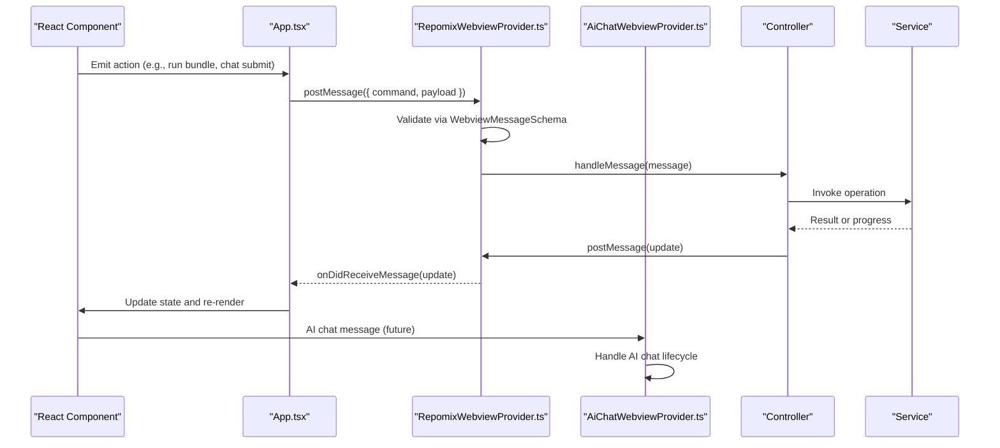
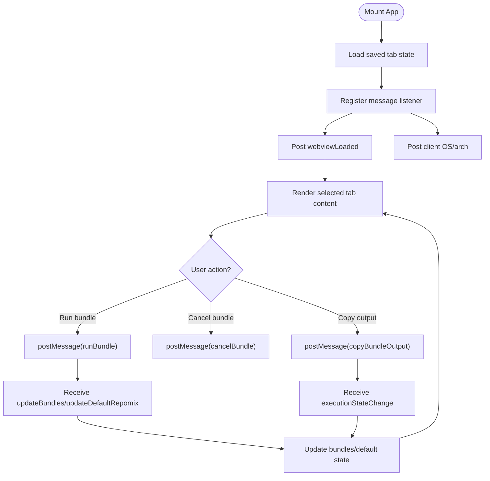
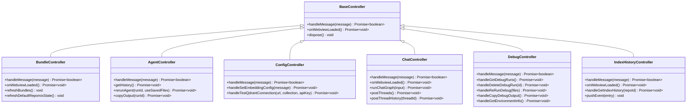
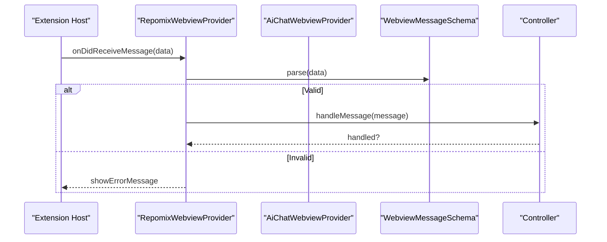
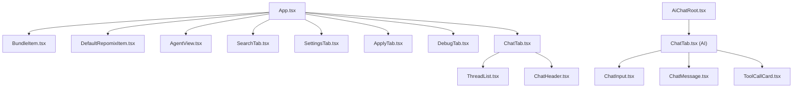
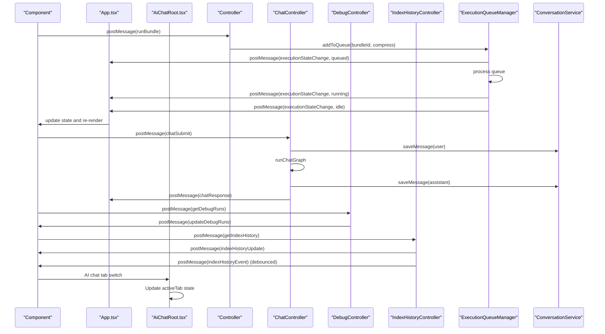
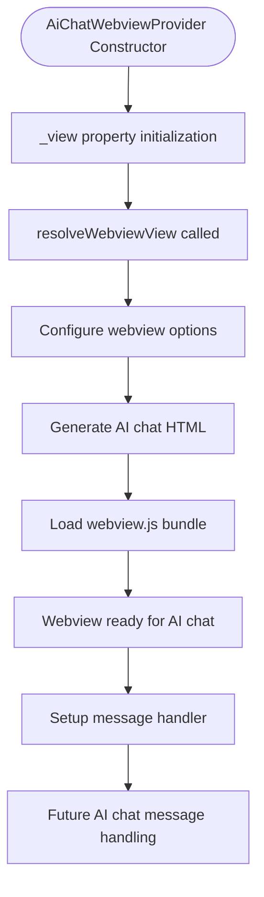
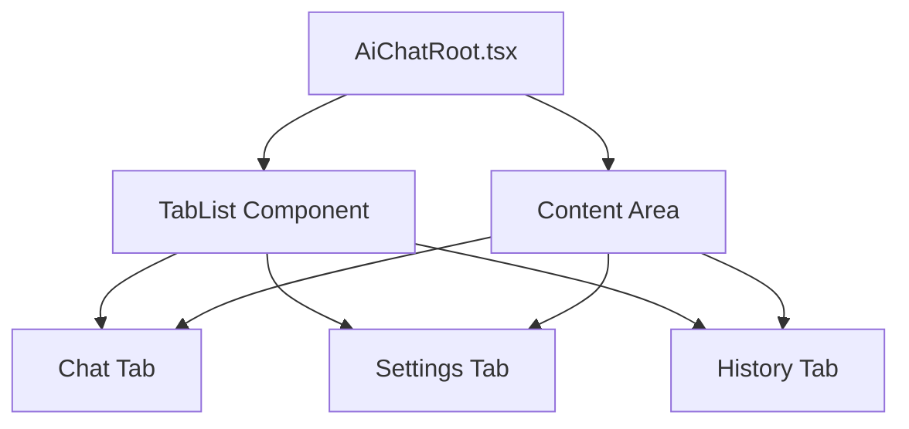
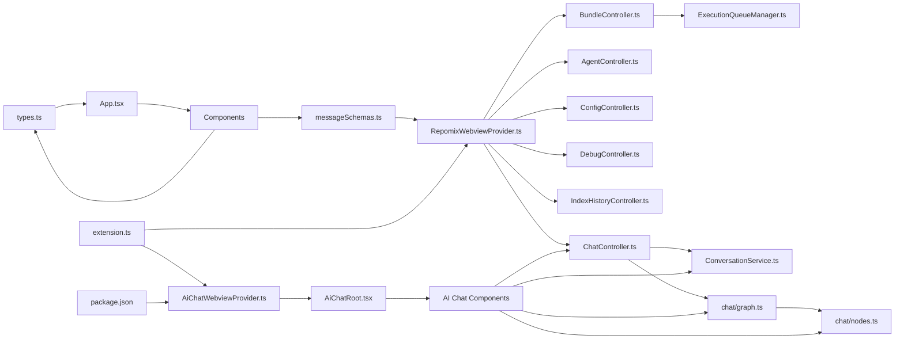

# Webview Interface

<cite>
**Referenced Files in This Document**
- [App.tsx](file://src/webview/App.tsx)
- [index.tsx](file://src/webview/index.tsx)
- [RepomixWebviewProvider.ts](file://src/webview/RepomixWebviewProvider.ts)
- [AiChatWebviewProvider.ts](file://src/webview/AiChatWebviewProvider.ts)
- [AiChatRoot.tsx](file://src/webview/AiChatRoot.tsx)
- [types.ts](file://src/webview/types.ts)
- [messageSchemas.ts](file://src/webview/messageSchemas.ts)
- [BaseController.ts](file://src/webview/controllers/BaseController.ts)
- [BundleController.ts](file://src/webview/controllers/BundleController.ts)
- [AgentController.ts](file://src/webview/controllers/AgentController.ts)
- [ConfigController.ts](file://src/webview/controllers/ConfigController.ts)
- [IndexHistoryController.ts](file://src/webview/controllers/IndexHistoryController.ts)
- [DebugController.ts](file://src/webview/controllers/DebugController.ts)
- [ChatController.ts](file://src/webview/controllers/ChatController.ts)
- [ExecutionQueueManager.ts](file://src/webview/services/ExecutionQueueManager.ts)
- [AgentView.tsx](file://src/webview/components/AgentView.tsx)
- [BundleItem.tsx](file://src/webview/components/BundleItem.tsx)
- [DefaultRepomixItem.tsx](file://src/webview/components/DefaultRepomixItem.tsx)
- [SettingsTab.tsx](file://src/webview/components/SettingsTab.tsx)
- [SearchTab.tsx](file://src/webview/components/SearchTab.tsx)
- [ApplyTab.tsx](file://src/webview/components/ApplyTab.tsx)
- [DebugTab.tsx](file://src/webview/components/DebugTab.tsx)
- [ChatTab.tsx](file://src/webview/components/ai-chat/ChatTab.tsx)
- [ThreadList.tsx](file://src/webview/components/ThreadList.tsx)
- [ChatHeader.tsx](file://src/webview/components/ChatHeader.tsx)
- [ChatInput.tsx](file://src/webview/components/ai-chat/ChatInput.tsx)
- [ChatMessage.tsx](file://src/webview/components/ai-chat/ChatMessage.tsx)
- [ToolCallCard.tsx](file://src/webview/components/ai-chat/ToolCallCard.tsx)
- [utils.ts](file://src/webview/utils.ts)
- [conversationService.ts](file://src/services/conversationService.ts)
- [graph.ts](file://src/chat/graph.ts)
- [nodes.ts](file://src/chat/nodes.ts)
- [chat.ts](file://src/types/chat.ts)
- [extension.ts](file://src/extension.ts)
- [package.json](file://package.json)
</cite>

## Update Summary
**Changes Made**
- Enhanced ChatInput component with inline SVG icon implementation for improved asset bundling and reduced external dependencies
- Updated Settings interface to include LM Studio configuration options with accordion sections for model fetching and dimension testing
- Maintained ChatTab.tsx component as part of the AI chat architecture
- Updated AI chat components to use inline SVG icons for better asset bundling
- Enhanced SettingsTab with comprehensive LM Studio integration including model discovery and dimension testing

## Table of Contents
1. [Introduction](#introduction)
2. [Project Structure](#project-structure)
3. [Core Components](#core-components)
4. [Architecture Overview](#architecture-overview)
5. [Detailed Component Analysis](#detailed-component-analysis)
6. [AI Developer Chat System](#ai-developer-chat-system)
7. [Dependency Analysis](#dependency-analysis)
8. [Performance Considerations](#performance-considerations)
9. [Troubleshooting Guide](#troubleshooting-guide)
10. [Conclusion](#conclusion)

## Introduction
This document describes the Webview Interface system for the Repomix Runner Plus extension. It covers the React-based control panel architecture with a comprehensive tabbed interface including the new AI Developer Chat feature, the MVC pattern implementation using controllers and views, state management strategies, and the bidirectional message system between the webview and the extension context. The interface now features integrated agentic chat capabilities with thread management, enhanced search functionality with branch-aware vector search, comprehensive token budgeting and cost tracking, and a dedicated AI Developer Chat workspace with three-tab interface.

## Project Structure
The webview layer is organized around dual React entry points that render comprehensive tabbed control panels. The system now includes both the traditional Repomix control panel and a dedicated AI Developer Chat workspace. The AI chat system features a three-tab interface (Chat, Settings, History) with specialized components for conversation management and tool call visualization. The new AI chat provider operates independently from the main control panel, providing focused AI assistance capabilities.

```mermaid
graph TB
subgraph "Main Control Panel"
IDX["index.tsx<br/>React entry point"]
APP["App.tsx<br/>Comprehensive tabbed control panel"]
TABS["Tabs<br/>Bundles, Search, Settings, Apply, Debug"]
COMP["Components<br/>BundleItem, DefaultRepomixItem,<br/>AgentView, SettingsTab, SearchTab, ApplyTab, DebugTab"]
ENDOFSUBGRAPH
subgraph "AI Developer Chat"
AICHPROV["AiChatWebviewProvider.ts<br/>AI Chat webview provider"]
AICHROOT["AiChatRoot.tsx<br/>Three-tab AI chat interface"]
AICHTABS["Tabs<br/>Chat, Settings, History"]
AICHCOMP["AI Chat Components<br/>ChatInput, ChatMessage, ToolCallCard, ChatTab"]
ENDOFSUBGRAPH
subgraph "Controllers"
BASE["BaseController.ts"]
BCTRL["BundleController.ts"]
ACTRL["AgentController.ts"]
CCTRL["ConfigController.ts"]
IHCTRL["IndexHistoryController.ts"]
DCTRL["DebugController.ts"]
CHCTRL["ChatController.ts"]
ENDOFSUBGRAPH
subgraph "Services"
EQM["ExecutionQueueManager.ts"]
CONV["ConversationService.ts"]
ENDOFSUBGRAPH
subgraph "Extension Host"
RPV["RepomixWebviewProvider.ts"]
EXT["extension.ts<br/>Dual webview provider registration"]
PKG["package.json<br/>View contributions"]
MS["messageSchemas.ts"]
TYPES["types.ts"]
UTILS["utils.ts"]
ENDOFSUBGRAPH
subgraph "Chat Engine"
CHATGRAPH["chat/graph.ts<br/>LangGraph workflow"]
CHATNODES["chat/nodes.ts<br/>Search, plan, response nodes"]
ENDOFSUBGRAPH
IDX --> APP
APP --> TABS
TABS --> COMP
COMP --> BCTRL
COMP --> ACTRL
COMP --> CCTRL
COMP --> DCTRL
COMP --> IHCTRL
COMP --> CHCTRL
COMP --> EQM
COMP --> RPV
RPV --> MS
RPV --> TYPES
RPV --> UTILS
AICHPROV --> AICHROOT
AICHROOT --> AICHTABS
AICHTABS --> AICHCOMP
AICHCOMP --> CHCTRL
AICHCOMP --> CONV
AICHCOMP --> CHATGRAPH
AICHCOMP --> CHATNODES
EXT --> RPV
EXT --> AICHPROV
PKG --> AICHPROV
CHCTRL --> CONV
CHCTRL --> CHATGRAPH
CHATGRAPH --> CHATNODES
BCTRL --> EQM
ACTRL --> RPV
CCTRL --> RPV
DCTRL --> RPV
IHCTRL --> RPV
```

**Diagram sources**
- [index.tsx](file://src/webview/index.tsx#L1-L18)
- [App.tsx](file://src/webview/App.tsx#L1-L276)
- [AiChatWebviewProvider.ts](file://src/webview/AiChatWebviewProvider.ts#L1-L67)
- [AiChatRoot.tsx](file://src/webview/AiChatRoot.tsx#L1-L78)
- [RepomixWebviewProvider.ts](file://src/webview/RepomixWebviewProvider.ts#L1-L405)
- [extension.ts](file://src/extension.ts#L501-L518)
- [package.json](file://package.json#L333-L337)

**Section sources**
- [index.tsx](file://src/webview/index.tsx#L1-L18)
- [App.tsx](file://src/webview/App.tsx#L1-L276)
- [AiChatWebviewProvider.ts](file://src/webview/AiChatWebviewProvider.ts#L1-L67)
- [AiChatRoot.tsx](file://src/webview/AiChatRoot.tsx#L1-L78)
- [RepomixWebviewProvider.ts](file://src/webview/RepomixWebviewProvider.ts#L1-L405)
- [extension.ts](file://src/extension.ts#L501-L518)

## Core Components
- React entry point initializes the main control panel root and mounts App.
- AiChatRoot.tsx provides the AI Developer Chat interface with three-tab navigation.
- App orchestrates tab navigation, state lifting, and message handling with the extension host.
- AiChatWebviewProvider.ts manages the AI chat webview lifecycle and HTML generation.
- Controllers encapsulate domain logic and handle webview messages.
- Components render UI and delegate actions to controllers via message passing.
- ExecutionQueueManager coordinates bundle runs with cancellation and state transitions.
- Message schemas define strict contracts for bidirectional communication.
- **New**: AiChatWebviewProvider.ts manages AI chat webview lifecycle with dedicated HTML generation.
- **New**: AiChatRoot.tsx provides three-tab AI chat interface with Chat, Settings, and History tabs.
- **New**: ChatInput.tsx, ChatMessage.tsx, and ToolCallCard.tsx form the foundation of the AI chat interface.
- **Enhanced**: ChatInput.tsx now uses inline SVG icons for improved asset bundling and reduced external dependencies.
- **Enhanced**: SettingsTab.tsx includes comprehensive LM Studio configuration with accordion sections for model fetching and dimension testing.
- **New**: Enhanced ChatController with LangGraph integration for AI-powered conversations.

Key responsibilities:
- index.tsx: React entry point for main control panel.
- App.tsx: Comprehensive tab management (bundles, search, settings, apply, debug), state lifting, message routing, client OS detection, and version display.
- AiChatWebviewProvider.ts: AI chat webview lifecycle management, HTML generation, and message handling.
- AiChatRoot.tsx: Three-tab AI chat interface with state management and component composition.
- RepomixWebviewProvider.ts: HTML generation, message dispatching, controller lifecycle, and extension-side state.
- BaseController.ts: Abstract contract for controllers.
- BundleController.ts: Bundle listing, default Repomix state, output copying, and execution queue integration.
- AgentController.ts: Smart Agent orchestration, history retrieval, reruns, and output copying.
- ConfigController.ts: Secrets management, vector DB provider switching, Qdrant connectivity testing, embedding configuration, and compatibility checks.
- **New**: ChatController.ts: Manages chat sessions, thread persistence, conversation flow, and integration with LangGraph chat engine.
- DebugController.ts: Debug run management, environment information retrieval, and integration with index history functionality.
- IndexHistoryController.ts: Manages indexing history retrieval and real-time event streaming with debounced updates.
- ExecutionQueueManager.ts: Queue scheduling, cancellation, and execution state notifications.
- Components: Render UI and emit commands; they rely on App-level state and controller-provided data.
- **New**: AI chat components: ChatInput for message composition, ChatMessage for conversation display, ToolCallCard for tool execution visualization.

**Section sources**
- [App.tsx](file://src/webview/App.tsx#L47-L276)
- [AiChatWebviewProvider.ts](file://src/webview/AiChatWebviewProvider.ts#L1-L67)
- [AiChatRoot.tsx](file://src/webview/AiChatRoot.tsx#L1-L78)
- [RepomixWebviewProvider.ts](file://src/webview/RepomixWebviewProvider.ts#L19-L218)
- [BaseController.ts](file://src/webview/controllers/BaseController.ts#L8-L19)
- [BundleController.ts](file://src/webview/controllers/BundleController.ts#L17-L257)
- [AgentController.ts](file://src/webview/controllers/AgentController.ts#L11-L314)
- [ConfigController.ts](file://src/webview/controllers/ConfigController.ts#L14-L1017)
- [ChatController.ts](file://src/webview/controllers/ChatController.ts#L14-L304)
- [DebugController.ts](file://src/webview/controllers/DebugController.ts#L16-L230)
- [IndexHistoryController.ts](file://src/webview/controllers/IndexHistoryController.ts#L6-L115)
- [ExecutionQueueManager.ts](file://src/webview/services/ExecutionQueueManager.ts#L15-L133)

## Architecture Overview
The system follows an MVC-inspired pattern with comprehensive coverage and dual webview providers:
- Views: React components that render UI and collect user actions.
- Controllers: TypeScript classes that interpret messages, coordinate services, and update UI via messages.
- Model/State: Lifted in App.tsx and persisted via VS Code state; controllers also maintain internal state and push updates to the UI.
- **New**: Dual webview provider architecture with RepomixWebviewProvider for main control panel and AiChatWebviewProvider for AI chat workspace.

Communication flow:
- Webview-to-Extension: Components send typed commands; provider validates via Zod and dispatches to controllers.
- Extension-to-Webview: Controllers send structured updates; App and components update state and UI.
- **New**: AI chat webview operates independently with its own provider and lifecycle management.



**Diagram sources**
- [App.tsx](file://src/webview/App.tsx#L75-L145)
- [RepomixWebviewProvider.ts](file://src/webview/RepomixWebviewProvider.ts#L92-L195)
- [AiChatWebviewProvider.ts](file://src/webview/AiChatWebviewProvider.ts#L28-L33)
- [messageSchemas.ts](file://src/webview/messageSchemas.ts#L624-L725)

## Detailed Component Analysis

### App.tsx: Comprehensive Tabbed Control Panel and State Management
- Comprehensive tabbed interface with Fluent UI TabList; selected tab state is lifted and persisted via VS Code state.
- Centralized message handler listens for updates from the extension (bundles, default Repomix state, version, Pinecone indexes).
- Action handlers translate UI actions into messages (run, cancel, copy) and vice versa.
- Client OS detection informs remote clipboard support.
- **Enhanced**: Simplified tab structure with consolidated Debug tab that includes index history functionality.



**Diagram sources**
- [App.tsx](file://src/webview/App.tsx#L47-L145)
- [utils.ts](file://src/webview/utils.ts#L4-L8)

**Section sources**
- [App.tsx](file://src/webview/App.tsx#L47-L276)
- [utils.ts](file://src/webview/utils.ts#L1-L8)

### Controllers: MVC Implementation with Enhanced Features
- BaseController.ts defines the contract for controllers: handleMessage, optional onWebviewLoaded, and dispose.
- BundleController.ts manages bundles, default Repomix state, output watching, and integrates with ExecutionQueueManager.
- AgentController.ts orchestrates the Smart Agent workflow, handles history, reruns, and copying outputs.
- ConfigController.ts manages secrets, vector DB provider switching, Qdrant connectivity, embedding configuration, and compatibility checks.
- **New**: ChatController.ts manages chat sessions, thread persistence, conversation flow, and integration with LangGraph chat engine.
- DebugController.ts manages debug runs, environment information, and integrates with index history functionality.
- IndexHistoryController.ts manages indexing history retrieval and real-time event streaming with debounced updates.



**Diagram sources**
- [BaseController.ts](file://src/webview/controllers/BaseController.ts#L8-L19)
- [BundleController.ts](file://src/webview/controllers/BundleController.ts#L17-L60)
- [AgentController.ts](file://src/webview/controllers/AgentController.ts#L20-L42)
- [ConfigController.ts](file://src/webview/controllers/ConfigController.ts#L26-L111)
- [ChatController.ts](file://src/webview/controllers/ChatController.ts#L14-L30)
- [DebugController.ts](file://src/webview/controllers/DebugController.ts#L16-L43)
- [IndexHistoryController.ts](file://src/webview/controllers/IndexHistoryController.ts#L18-L50)

**Section sources**
- [BaseController.ts](file://src/webview/controllers/BaseController.ts#L1-L19)
- [BundleController.ts](file://src/webview/controllers/BundleController.ts#L1-L257)
- [AgentController.ts](file://src/webview/controllers/AgentController.ts#L1-L314)
- [ConfigController.ts](file://src/webview/controllers/ConfigController.ts#L1-L1017)
- [ChatController.ts](file://src/webview/controllers/ChatController.ts#L1-L304)
- [DebugController.ts](file://src/webview/controllers/DebugController.ts#L1-L230)
- [IndexHistoryController.ts](file://src/webview/controllers/IndexHistoryController.ts#L1-L115)

### Message Handling and Validation
- RepomixWebviewProvider.ts validates incoming messages using WebviewMessageSchema and routes them to controllers.
- App.tsx posts webviewLoaded and reports client OS to the extension host.
- Message schemas enumerate all supported commands with strict typing.
- **New**: Enhanced message schemas to support chat commands and comprehensive thread management.
- **New**: AiChatWebviewProvider.ts provides independent message handling for AI chat functionality.



**Diagram sources**
- [RepomixWebviewProvider.ts](file://src/webview/RepomixWebviewProvider.ts#L92-L116)
- [AiChatWebviewProvider.ts](file://src/webview/AiChatWebviewProvider.ts#L28-L33)
- [messageSchemas.ts](file://src/webview/messageSchemas.ts#L624-L725)

**Section sources**
- [RepomixWebviewProvider.ts](file://src/webview/RepomixWebviewProvider.ts#L92-L195)
- [AiChatWebviewProvider.ts](file://src/webview/AiChatWebviewProvider.ts#L28-L33)
- [messageSchemas.ts](file://src/webview/messageSchemas.ts#L1-L728)

### Component Hierarchy and Composition
- App.tsx renders the comprehensive tabbed layout and passes props to specialized components.
- AiChatRoot.tsx provides three-tab AI chat interface with Chat, Settings, and History tabs.
- BundleItem.tsx and DefaultRepomixItem.tsx are reusable UI components that accept actions via props.
- AgentView.tsx composes AgentInput, AgentStatus, AgentConfiguration, and AgentHistory.
- SettingsTab.tsx aggregates configuration sections and reacts to controller updates.
- **Enhanced**: ChatTab.tsx provides comprehensive chat interface with thread management, message visualization, and tool call handling.
- **Enhanced**: ThreadList.tsx offers threaded conversation history with filtering, renaming, and export capabilities.
- **Enhanced**: ChatHeader.tsx manages chat interface controls including thread switching and plan access.
- **Enhanced**: ChatInput.tsx, ChatMessage.tsx, and ToolCallCard.tsx form the foundation of the AI chat interface with improved asset bundling.
- **Enhanced**: DebugTab.tsx now includes comprehensive index history visualization with real-time updates, statistics, and environment information.
- SearchTab.tsx manages search state, filters, and indexing controls with enhanced message handling.
- ApplyTab.tsx and DebugTab.tsx provide specialized workflows with their own state and message handling.



**Diagram sources**
- [App.tsx](file://src/webview/App.tsx#L204-L276)
- [AiChatRoot.tsx](file://src/webview/AiChatRoot.tsx#L35-L74)
- [BundleItem.tsx](file://src/webview/components/BundleItem.tsx#L7-L121)
- [DefaultRepomixItem.tsx](file://src/webview/components/DefaultRepomixItem.tsx#L7-L91)
- [AgentView.tsx](file://src/webview/components/AgentView.tsx#L16-L165)
- [SettingsTab.tsx](file://src/webview/components/SettingsTab.tsx#L120-L802)
- [SearchTab.tsx](file://src/webview/components/SearchTab.tsx#L169-L1197)
- [ApplyTab.tsx](file://src/webview/components/ApplyTab.tsx#L26-L150)
- [DebugTab.tsx](file://src/webview/components/DebugTab.tsx#L7-L472)
- [ChatTab.tsx](file://src/webview/components/ChatTab.tsx#L195-L486)
- [ThreadList.tsx](file://src/webview/components/ThreadList.tsx#L63-L306)
- [ChatHeader.tsx](file://src/webview/components/ChatHeader.tsx#L14-L98)
- [ChatTab.tsx](file://src/webview/components/ai-chat/ChatTab.tsx#L1-L93)
- [ChatInput.tsx](file://src/webview/components/ai-chat/ChatInput.tsx#L1-L121)
- [ChatMessage.tsx](file://src/webview/components/ai-chat/ChatMessage.tsx#L1-L50)
- [ToolCallCard.tsx](file://src/webview/components/ai-chat/ToolCallCard.tsx#L1-L84)

**Section sources**
- [App.tsx](file://src/webview/App.tsx#L204-L276)
- [AiChatRoot.tsx](file://src/webview/AiChatRoot.tsx#L35-L74)
- [BundleItem.tsx](file://src/webview/components/BundleItem.tsx#L1-L121)
- [DefaultRepomixItem.tsx](file://src/webview/components/DefaultRepomixItem.tsx#L1-L91)
- [AgentView.tsx](file://src/webview/components/AgentView.tsx#L1-L165)
- [SettingsTab.tsx](file://src/webview/components/SettingsTab.tsx#L1-L1247)
- [SearchTab.tsx](file://src/webview/components/SearchTab.tsx#L1-L1197)
- [ApplyTab.tsx](file://src/webview/components/ApplyTab.tsx#L1-L150)
- [DebugTab.tsx](file://src/webview/components/DebugTab.tsx#L1-L472)
- [ChatTab.tsx](file://src/webview/components/ChatTab.tsx#L1-L486)
- [ThreadList.tsx](file://src/webview/components/ThreadList.tsx#L1-L306)
- [ChatHeader.tsx](file://src/webview/components/ChatHeader.tsx#L1-L98)
- [ChatTab.tsx](file://src/webview/components/ai-chat/ChatTab.tsx#L1-L93)
- [ChatInput.tsx](file://src/webview/components/ai-chat/ChatInput.tsx#L1-L121)
- [ChatMessage.tsx](file://src/webview/components/ai-chat/ChatMessage.tsx#L1-L50)
- [ToolCallCard.tsx](file://src/webview/components/ai-chat/ToolCallCard.tsx#L1-L84)

### State Synchronization and Event Propagation
- App.tsx maintains global state (selected tab, bundles, default Repomix state, Pinecone indexes) and persists it via VS Code state.
- Components subscribe to messages to update their local state and reflect changes.
- ExecutionQueueManager notifies UI of state changes (queued, running, idle) to keep the UI consistent with backend execution.
- **New**: ChatController manages chat session state, thread persistence, and conversation flow with token budget tracking.
- **New**: ConversationService provides thread persistence and message storage with automatic preview generation.
- **New**: AiChatRoot.tsx manages AI chat tab state independently from the main control panel.
- **Enhanced**: Debug tab now manages both debug runs and index history state independently, with separate loading states and refresh mechanisms.



**Diagram sources**
- [ExecutionQueueManager.ts](file://src/webview/services/ExecutionQueueManager.ts#L26-L118)
- [BundleController.ts](file://src/webview/controllers/BundleController.ts#L38-L60)
- [App.tsx](file://src/webview/App.tsx#L88-L97)
- [AiChatRoot.tsx](file://src/webview/AiChatRoot.tsx#L35-L45)
- [ChatController.ts](file://src/webview/controllers/ChatController.ts#L38-L83)
- [conversationService.ts](file://src/services/conversationService.ts#L80-L85)
- [DebugController.ts](file://src/webview/controllers/DebugController.ts#L45-L47)
- [IndexHistoryController.ts](file://src/webview/controllers/IndexHistoryController.ts#L65-L95)

**Section sources**
- [ExecutionQueueManager.ts](file://src/webview/services/ExecutionQueueManager.ts#L1-L133)
- [BundleController.ts](file://src/webview/controllers/BundleController.ts#L67-L134)
- [App.tsx](file://src/webview/App.tsx#L75-L145)
- [AiChatRoot.tsx](file://src/webview/AiChatRoot.tsx#L14-L45)
- [ChatController.ts](file://src/webview/controllers/ChatController.ts#L1-L304)
- [conversationService.ts](file://src/services/conversationService.ts#L1-L158)
- [DebugController.ts](file://src/webview/controllers/DebugController.ts#L1-L230)
- [IndexHistoryController.ts](file://src/webview/controllers/IndexHistoryController.ts#L1-L115)

### Accessibility and Responsive Design
- Uses Fluent UI components that provide built-in accessibility attributes and keyboard navigation.
- Layout uses Flexbox with responsive spacing; tab content adapts to viewport height.
- Interactive elements include tooltips and clear visual states (running, queued, idle).
- Color contrast and semantic text sizes are applied consistently across components.
- **New**: AI chat interface includes proper ARIA labels, keyboard navigation support, and screen reader friendly message formatting.
- **New**: ChatInput provides accessible text area with proper labeling and keyboard shortcuts.
- **New**: ToolCallCard components include status indicators with appropriate color coding for accessibility.
- **New**: Three-tab AI chat interface provides clear visual hierarchy and tab navigation.
- **Enhanced**: Debug tab includes visual indicators for different event types with appropriate color coding and status badges, providing better accessibility for index history monitoring.
- **Enhanced**: Settings interface includes proper form validation, error states, and accessible controls for LM Studio configuration.

### Extending the Interface
- Add a new controller by extending BaseController and implementing handleMessage.
- Define a new command schema in messageSchemas.ts and add validation logic in RepomixWebviewProvider.ts.
- Create a new component under components/ and integrate it into App.tsx tabbed layout.
- If the feature requires persistent state, update WebViewState in types.ts and use updateVsState in utils.ts.
- For execution workflows, integrate with ExecutionQueueManager to ensure consistent state updates.
- **New**: For chat functionality, implement ChatController with LangGraph integration and ConversationService persistence.
- **New**: For AI chat features, create components under components/ai-chat/ and integrate with AiChatRoot.tsx.
- **Enhanced**: For consolidated features like debugging and monitoring, consider integrating with existing controllers that already handle multiple responsibilities (e.g., DebugController now handles both debug runs and index history).
- **New**: For webview lifecycle management, implement WebviewViewProvider with proper HTML generation and message handling.
- **Enhanced**: For enhanced asset bundling, use inline SVG components instead of external icon libraries to improve performance and reduce dependencies.

## AI Developer Chat System

### AiChatWebviewProvider: Dedicated AI Chat Webview Provider
The AiChatWebviewProvider manages a dedicated AI chat workspace that operates independently from the main control panel. It provides a focused environment for AI-powered development assistance with three-tab navigation.

Key features:
- Independent webview lifecycle management with dedicated HTML generation
- CSP-enabled HTML with nonce-based security
- Node integration enabled for enhanced functionality
- Window initial view configuration for AI chat interface
- Future message handling infrastructure for AI chat commands



**Diagram sources**
- [AiChatWebviewProvider.ts](file://src/webview/AiChatWebviewProvider.ts#L7-L33)

**Section sources**
- [AiChatWebviewProvider.ts](file://src/webview/AiChatWebviewProvider.ts#L1-L67)

### AiChatRoot: Three-Tab AI Chat Interface
AiChatRoot.tsx provides the main AI chat interface with a three-tab layout designed for focused AI assistance. The interface includes Chat, Settings, and History tabs with distinct purposes.

Tab functionality:
- **Chat Tab**: Primary conversation interface with message display and input area
- **Settings Tab**: Configuration interface (placeholder for future AI chat settings)
- **History Tab**: Conversation history management (placeholder for future history features)



**Diagram sources**
- [AiChatRoot.tsx](file://src/webview/AiChatRoot.tsx#L35-L74)

**Section sources**
- [AiChatRoot.tsx](file://src/webview/AiChatRoot.tsx#L1-L78)

### AI Chat Components: Foundation of the AI Interface
The AI chat system is built on four core components that work together to provide a comprehensive chat experience:

#### ChatInput: Enhanced Message Composition Component
Provides a rich text input area with auto-expanding functionality, keyboard shortcuts, and pricing information display. **Enhanced** with inline SVG icon implementation for improved asset bundling.

Key features:
- Auto-expanding textarea with min/max height constraints
- Shift+Enter for new lines, Enter for submission
- Disabled state when input is empty
- Pricing display with monospace font for token cost estimation
- **Enhanced**: Inline SVG paper plane icon for improved asset bundling and reduced external dependencies

#### ChatMessage: Conversation Display Component
Handles both user and assistant message rendering with distinct styling and metadata.

Key features:
- Role-based styling (blue for user, gray for assistant)
- Timestamp metadata with role-specific positioning
- Responsive message containers with rounded corners
- Proper text wrapping and whitespace handling

#### ToolCallCard: Tool Execution Visualization
Displays tool execution status with visual indicators and detailed information.

Key features:
- Status-based color coding (green for completed, blue for reading, red for error)
- Icon differentiation for different tool types
- Monospace details display for technical information
- Collapsible card layout with header and details sections

#### ChatTab: Main Chat Interface
Coordinates the chat experience with message history, tool call display, and input area.

Key features:
- Message history management with auto-scrolling
- Tool call visualization with status indicators
- Input area integration with ChatInput component
- State management for messages, tool calls, and scrolling

**Section sources**
- [ChatInput.tsx](file://src/webview/components/ai-chat/ChatInput.tsx#L1-L121)
- [ChatMessage.tsx](file://src/webview/components/ai-chat/ChatMessage.tsx#L1-L50)
- [ToolCallCard.tsx](file://src/webview/components/ai-chat/ToolCallCard.tsx#L1-L84)
- [ChatTab.tsx](file://src/webview/components/ai-chat/ChatTab.tsx#L1-L93)

## Dependency Analysis
The webview depends on:
- VS Code Webview API for messaging and HTML generation.
- Fluent UI for UI primitives.
- Zod for message validation.
- Internal services for execution, configuration, and conversation management.
- **New**: AiChatWebviewProvider depends on VS Code WebviewViewProvider interface for AI chat workspace.
- **New**: AiChatRoot depends on React state management and Fluent UI components for AI chat interface.
- **Enhanced**: AI chat components now use inline SVG components for improved asset bundling and reduced external dependencies.



**Diagram sources**
- [types.ts](file://src/webview/types.ts#L1-L131)
- [messageSchemas.ts](file://src/webview/messageSchemas.ts#L1-L728)
- [RepomixWebviewProvider.ts](file://src/webview/RepomixWebviewProvider.ts#L1-L405)
- [AiChatWebviewProvider.ts](file://src/webview/AiChatWebviewProvider.ts#L1-L67)
- [AiChatRoot.tsx](file://src/webview/AiChatRoot.tsx#L1-L78)
- [extension.ts](file://src/extension.ts#L501-L518)
- [package.json](file://package.json#L333-L337)

**Section sources**
- [types.ts](file://src/webview/types.ts#L1-L131)
- [messageSchemas.ts](file://src/webview/messageSchemas.ts#L1-L728)
- [RepomixWebviewProvider.ts](file://src/webview/RepomixWebviewProvider.ts#L1-L405)
- [AiChatWebviewProvider.ts](file://src/webview/AiChatWebviewProvider.ts#L1-L67)
- [AiChatRoot.tsx](file://src/webview/AiChatRoot.tsx#L1-L78)
- [extension.ts](file://src/extension.ts#L501-L518)

## Performance Considerations
- Debouncing: BundleController debounces refresh operations to reduce redundant work.
- File watchers: Watchers are created per output file and cleaned up when bundles change.
- Queue processing: ExecutionQueueManager serializes runs and avoids overlapping executions.
- UI updates: Components update state only when receiving relevant messages to minimize re-renders.
- **New**: ChatController implements efficient thread persistence with automatic preview generation and token tracking.
- **New**: ConversationService uses optimized JSON storage with minimal I/O operations for thread management.
- **New**: AiChatWebviewProvider enables Node integration for enhanced AI chat functionality.
- **New**: AI chat components use efficient state management with React hooks for optimal performance.
- **Enhanced**: AI chat components now use inline SVG icons for improved asset bundling and reduced external dependencies.
- **Enhanced**: Settings interface includes optimized LM Studio model fetching with debounced requests and efficient dimension testing.
- **Enhanced**: IndexHistoryController implements debounced event pushing (500ms) to prevent UI flooding during high-frequency indexing events.
- **Enhanced**: Debug tab uses separate loading states for debug runs and index history to prevent blocking UI updates.

## Troubleshooting Guide
Common issues and resolutions:
- Invalid message errors: The provider logs validation failures and displays an error message. Verify the command and payload match the schemas.
- Missing API keys: Controllers check for secrets and prompt users to configure settings; ensure keys are saved via saveSecret commands.
- Remote clipboard disabled: The webview logs a deprecation warning for remote clipboard processing; use local copy operations.
- Indexing blocked: Compatibility checks can block indexing when embedding dimensions mismatch; reset the vector index via resetVectorIndex.
- **New**: AI chat not loading: Verify AiChatWebviewProvider is properly registered in extension.ts and package.json contributions are present.
- **New**: AI chat HTML generation issues: Check CSP configuration and nonce generation in AiChatWebviewProvider.
- **New**: AI chat tab navigation problems: Ensure AiChatRoot.tsx TabList component is properly configured with three tabs.
- **New**: AI chat component rendering issues: Verify all AI chat components are properly exported and imported in AiChatRoot.tsx.
- **New**: Chat functionality not working: Verify Google Gemini API key is configured and accessible via extension secrets.
- **New**: Thread persistence issues: Check ConversationService initialization and global storage permissions in VS Code.
- **New**: Token budget exceeded: Review token usage metrics and adjust token budget settings in the application.
- **Enhanced**: LM Studio configuration issues: Verify base URL, API key, and model selection are properly configured in SettingsTab.
- **Enhanced**: Model fetching failures: Check network connectivity and ensure LM Studio server is accessible at the configured base URL.
- **Enhanced**: Dimension testing failures: Verify the selected model supports the expected embedding dimensions and the server responds correctly.
- **Enhanced**: Index history not loading: Check that the database service is properly initialized and that the repository ID can be resolved from the current workspace. Verify that the Debug tab is properly requesting index history data.

**Section sources**
- [RepomixWebviewProvider.ts](file://src/webview/RepomixWebviewProvider.ts#L110-L116)
- [AiChatWebviewProvider.ts](file://src/webview/AiChatWebviewProvider.ts#L15-L33)
- [AiChatRoot.tsx](file://src/webview/AiChatRoot.tsx#L35-L45)
- [AgentController.ts](file://src/webview/controllers/AgentController.ts#L51-L55)
- [App.tsx](file://src/webview/App.tsx#L115-L124)
- [ConfigController.ts](file://src/webview/controllers/ConfigController.ts#L742-L800)
- [ChatController.ts](file://src/webview/controllers/ChatController.ts#L1-L304)
- [conversationService.ts](file://src/services/conversationService.ts#L29-L37)
- [DebugController.ts](file://src/webview/controllers/DebugController.ts#L160-L230)
- [IndexHistoryController.ts](file://src/webview/controllers/IndexHistoryController.ts#L32-L50)

## Conclusion
The Webview Interface employs a clear separation of concerns: React components render the UI, controllers encapsulate business logic, and a robust message system ensures type-safe, bidirectional communication with the extension host. State is centralized in App.tsx and synchronized via messages, while controllers manage service interactions and UI updates. The architecture supports extensibility through new controllers, components, and message schemas, enabling incremental feature development while maintaining consistency and reliability. **Enhanced** with comprehensive chat capabilities including thread management, branch-aware search functionality, advanced token budgeting, and a dedicated AI Developer Chat workspace featuring three-tab interface, the system now provides a complete AI-powered development experience with integrated conversation persistence, sophisticated search capabilities, focused AI assistance tools, and improved asset bundling through inline SVG implementations. The addition of LM Studio configuration support expands local AI model integration options, while the enhanced ChatInput component demonstrates improved performance through optimized asset management.