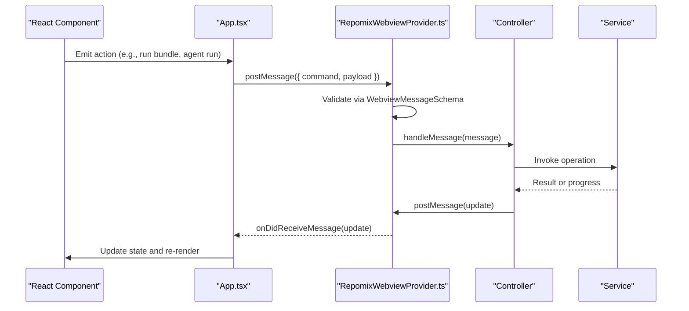
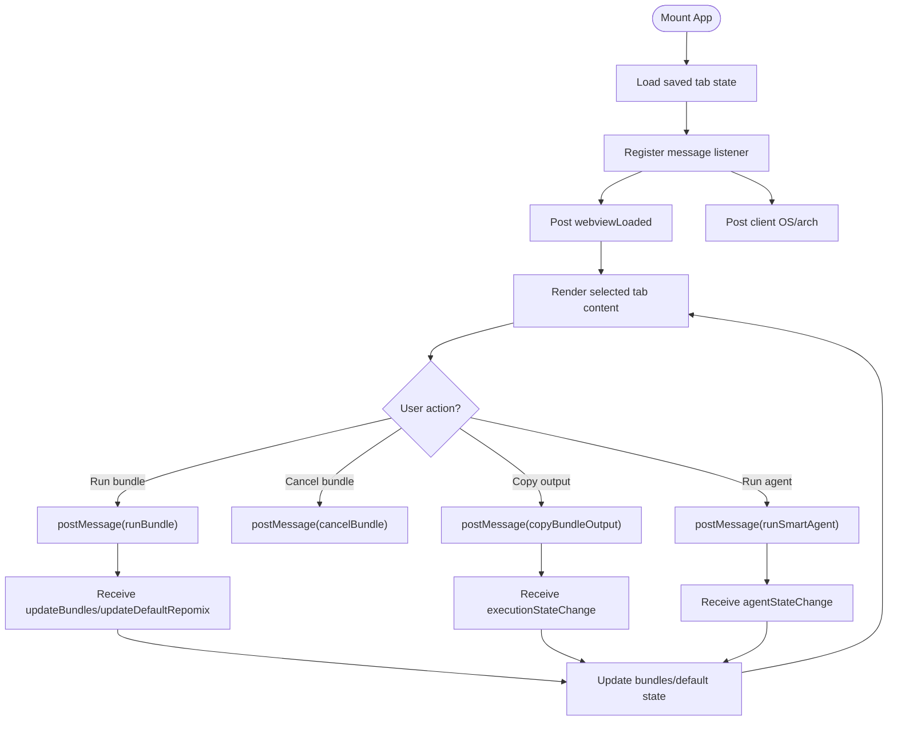
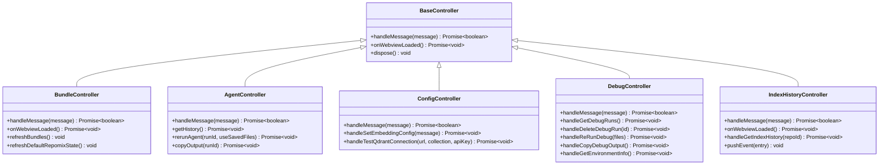
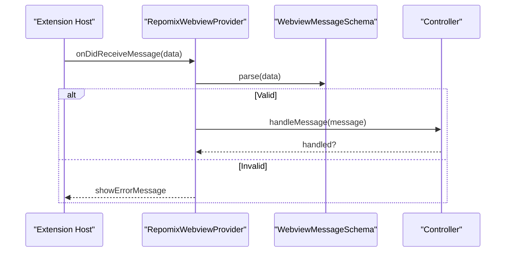
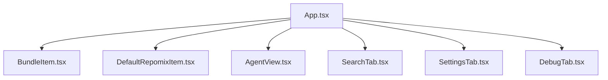
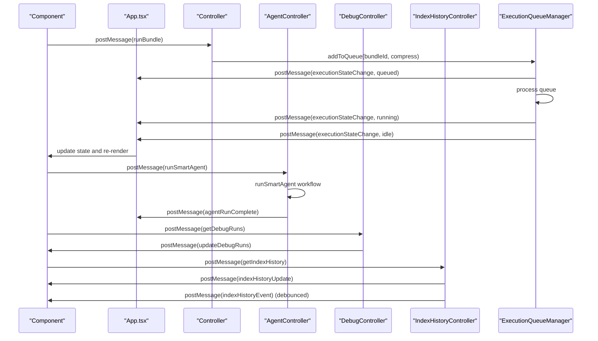
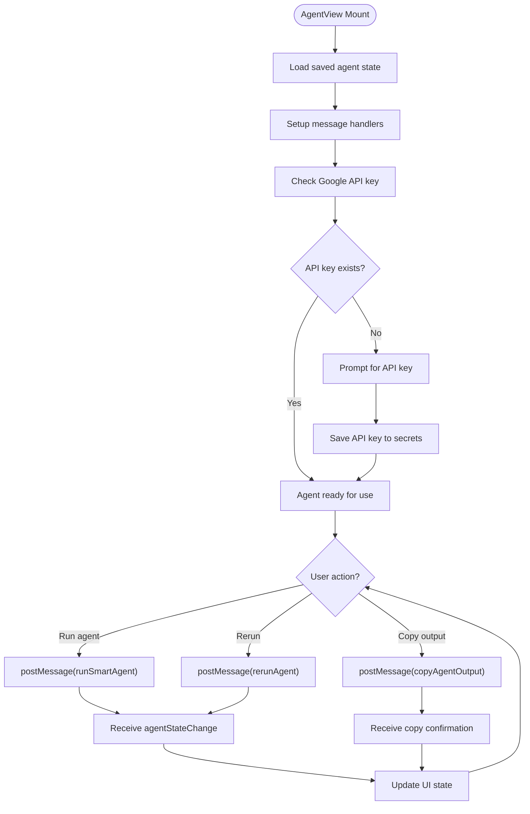
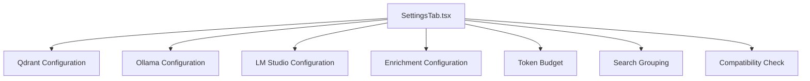
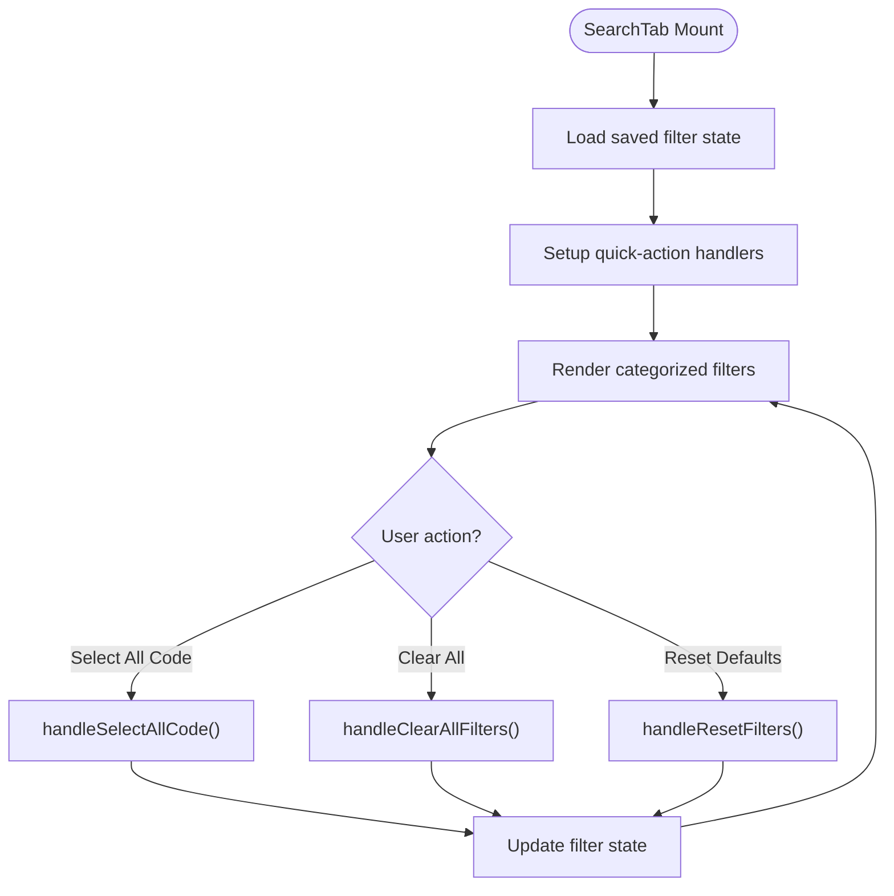
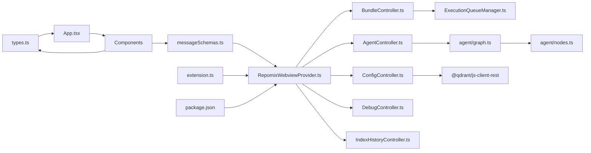

# Webview Interface

<cite>
**Referenced Files in This Document**
- [App.tsx](file://src/webview/App.tsx)
- [index.tsx](file://src/webview/index.tsx)
- [RepomixWebviewProvider.ts](file://src/webview/RepomixWebviewProvider.ts)
- [types.ts](file://src/webview/types.ts)
- [messageSchemas.ts](file://src/webview/messageSchemas.ts)
- [BaseController.ts](file://src/webview/controllers/BaseController.ts)
- [BundleController.ts](file://src/webview/controllers/BundleController.ts)
- [AgentController.ts](file://src/webview/controllers/AgentController.ts)
- [ConfigController.ts](file://src/webview/controllers/ConfigController.ts)
- [IndexHistoryController.ts](file://src/webview/controllers/IndexHistoryController.ts)
- [DebugController.ts](file://src/webview/controllers/DebugController.ts)
- [IndexingController.ts](file://src/webview/controllers/IndexingController.ts)
- [ExecutionQueueManager.ts](file://src/webview/services/ExecutionQueueManager.ts)
- [AgentView.tsx](file://src/webview/components/AgentView.tsx)
- [BundleItem.tsx](file://src/webview/components/BundleItem.tsx)
- [DefaultRepomixItem.tsx](file://src/webview/components/DefaultRepomixItem.tsx)
- [SettingsTab.tsx](file://src/webview/components/SettingsTab.tsx)
- [SearchTab.tsx](file://src/webview/components/SearchTab.tsx)
- [DebugTab.tsx](file://src/webview/components/DebugTab.tsx)
- [extension.ts](file://src/extension.ts)
- [package.json](file://package.json)
</cite>

## Update Summary
**Changes Made**
- Enhanced SearchTab with new quick-action buttons (Select All Code, Clear All, Reset Defaults) for improved filter management
- Improved categorized filter system with logical organization (Languages, Data & Documents, System & Configuration)
- Simplified SettingsTab by removing Qdrant collection name field, focusing on URL and API key configuration
- Enhanced file filter management with better user experience and accessibility

## Table of Contents
1. [Introduction](#introduction)
2. [Project Structure](#project-structure)
3. [Core Components](#core-components)
4. [Architecture Overview](#architecture-overview)
5. [Detailed Component Analysis](#detailed-component-analysis)
6. [Agent View System](#agent-view-system)
7. [Settings and Configuration](#settings-and-configuration)
8. [Search and Filter System](#search-and-filter-system)
9. [Dependency Analysis](#dependency-analysis)
10. [Performance Considerations](#performance-considerations)
11. [Troubleshooting Guide](#troubleshooting-guide)
12. [Conclusion](#conclusion)

## Introduction
This document describes the Webview Interface system for the Repomix Runner Plus extension. It covers the React-based control panel architecture with a comprehensive tabbed interface focused on agent view and settings functionality. The system implements an MVC pattern using controllers and views, state management strategies, and a bidirectional message system between the webview and the extension context. The interface provides integrated agentic capabilities with thread management, enhanced search functionality with branch-aware vector search, comprehensive token budgeting and cost tracking, and a streamlined control panel experience.

## Project Structure
The webview layer is organized around a single React entry point that renders a comprehensive tabbed control panel. The system focuses on the main control panel with integrated agent functionality and configuration management. The simplified architecture removes the separate AI chat workspace and consolidates all functionality into a unified interface.

```mermaid
graph TB
subgraph "Main Control Panel"
IDX["index.tsx<br/>React entry point"]
APP["App.tsx<br/>Comprehensive tabbed control panel"]
TABS["Tabs<br/>Bundles, Search, Settings, Debug"]
COMP["Components<br/>BundleItem, DefaultRepomixItem,<br/>AgentView, SettingsTab, SearchTab, DebugTab"]
ENDOFSUBGRAPH
subgraph "Controllers"
BASE["BaseController.ts"]
BCTRL["BundleController.ts"]
ACTRL["AgentController.ts"]
CCTRL["ConfigController.ts"]
IHCTRL["IndexHistoryController.ts"]
DCTRL["DebugController.ts"]
ENDOFSUBGRAPH
subgraph "Services"
EQM["ExecutionQueueManager.ts"]
ENDOFSUBGRAPH
subgraph "Extension Host"
RPV["RepomixWebviewProvider.ts"]
EXT["extension.ts<br/>Control panel provider registration"]
PKG["package.json<br/>View contributions"]
MS["messageSchemas.ts"]
TYPES["types.ts"]
UTILS["utils.ts"]
ENDOFSUBGRAPH
subgraph "Agent Engine"
AGENTGRAPH["agent/graph.ts<br/>Smart agent workflow"]
AGENTNODES["agent/nodes.ts<br/>Analysis, filtering, execution nodes"]
ENDOFSUBGRAPH
IDX --> APP
APP --> TABS
TABS --> COMP
COMP --> BCTRL
COMP --> ACTRL
COMP --> CCTRL
COMP --> DCTRL
COMP --> IHCTRL
COMP --> EQM
COMP --> RPV
RPV --> MS
RPV --> TYPES
RPV --> UTILS
EXT --> RPV
PKG --> RPV
ACTRL --> AGENTGRAPH
ACTRL --> AGENTNODES
BCTRL --> EQM
```

**Diagram sources**
- [index.tsx:1-18](file://src/webview/index.tsx#L1-L18)
- [App.tsx:1-250](file://src/webview/App.tsx#L1-L250)
- [RepomixWebviewProvider.ts:1-400](file://src/webview/RepomixWebviewProvider.ts#L1-L400)
- [extension.ts:501-518](file://src/extension.ts#L501-L518)
- [package.json:28-417](file://package.json#L28-L417)

**Section sources**
- [index.tsx:1-18](file://src/webview/index.tsx#L1-L18)
- [App.tsx:1-250](file://src/webview/App.tsx#L1-L250)
- [RepomixWebviewProvider.ts:1-400](file://src/webview/RepomixWebviewProvider.ts#L1-L400)
- [extension.ts:501-518](file://src/extension.ts#L501-L518)

## Core Components
- React entry point initializes the main control panel root and mounts App.
- App orchestrates tab navigation, state lifting, and message handling with the extension host.
- RepomixWebviewProvider manages the control panel webview lifecycle and HTML generation.
- Controllers encapsulate domain logic and handle webview messages.
- Components render UI and delegate actions to controllers via message passing.
- ExecutionQueueManager coordinates bundle runs with cancellation and state transitions.
- Message schemas define strict contracts for bidirectional communication.
- AgentController manages smart agent workflows with Google Gemini integration.
- SettingsTab provides comprehensive configuration management for vector databases, embedding providers, and token budgeting.

Key responsibilities:
- index.tsx: React entry point for main control panel.
- App.tsx: Comprehensive tab management (bundles, search, settings, debug), state lifting, message routing, client OS detection, and version display.
- RepomixWebviewProvider.ts: HTML generation, message dispatching, controller lifecycle, and extension-side state.
- BaseController.ts: Abstract contract for controllers.
- BundleController.ts: Bundle listing, default Repomix state, output copying, and execution queue integration.
- AgentController.ts: Smart Agent orchestration, history retrieval, reruns, and output copying.
- ConfigController.ts: Secrets management, vector DB provider switching, Qdrant connectivity testing, embedding configuration, and compatibility checks.
- DebugController.ts: Debug run management, environment information retrieval, and integration with index history functionality.
- IndexHistoryController.ts: Manages indexing history retrieval and real-time event streaming with debounced updates.
- ExecutionQueueManager.ts: Queue scheduling, cancellation, and execution state notifications.
- Components: Render UI and emit commands; they rely on App-level state and controller-provided data.

**Section sources**
- [App.tsx:47-250](file://src/webview/App.tsx#L47-L250)
- [RepomixWebviewProvider.ts:19-218](file://src/webview/RepomixWebviewProvider.ts#L19-L218)
- [BaseController.ts:8-19](file://src/webview/controllers/BaseController.ts#L8-L19)
- [BundleController.ts:17-257](file://src/webview/controllers/BundleController.ts#L17-L257)
- [AgentController.ts:11-334](file://src/webview/controllers/AgentController.ts#L11-L334)
- [ConfigController.ts:14-1017](file://src/webview/controllers/ConfigController.ts#L14-L1017)
- [DebugController.ts:16-230](file://src/webview/controllers/DebugController.ts#L16-L230)
- [IndexHistoryController.ts:6-115](file://src/webview/controllers/IndexHistoryController.ts#L6-L115)
- [ExecutionQueueManager.ts:15-133](file://src/webview/services/ExecutionQueueManager.ts#L15-L133)

## Architecture Overview
The system follows an MVC-inspired pattern with comprehensive coverage and a unified webview provider architecture:
- Views: React components that render UI and collect user actions.
- Controllers: TypeScript classes that interpret messages, coordinate services, and update UI via messages.
- Model/State: Lifted in App.tsx and persisted via VS Code state; controllers also maintain internal state and push updates to the UI.
- Unified webview provider architecture with RepomixWebviewProvider for the main control panel.

Communication flow:
- Webview-to-Extension: Components send typed commands; provider validates via Zod and dispatches to controllers.
- Extension-to-Webview: Controllers send structured updates; App and components update state and UI.
- Unified control panel with integrated agent functionality and configuration management.



**Diagram sources**
- [App.tsx:75-145](file://src/webview/App.tsx#L75-L145)
- [RepomixWebviewProvider.ts:92-195](file://src/webview/RepomixWebviewProvider.ts#L92-L195)
- [messageSchemas.ts:624-725](file://src/webview/messageSchemas.ts#L624-L725)

## Detailed Component Analysis

### App.tsx: Comprehensive Tabbed Control Panel and State Management
- Comprehensive tabbed interface with Fluent UI TabList; selected tab state is lifted and persisted via VS Code state.
- Centralized message handler listens for updates from the extension (bundles, default Repomix state, version, Pinecone indexes).
- Action handlers translate UI actions into messages (run, cancel, copy) and vice versa.
- Client OS detection informs remote clipboard support.
- Simplified tab structure with Smart Agent tab temporarily disabled and consolidated Debug tab functionality.



**Diagram sources**
- [App.tsx:47-145](file://src/webview/App.tsx#L47-L145)
- [utils.ts:4-8](file://src/webview/utils.ts#L4-L8)

**Section sources**
- [App.tsx:47-250](file://src/webview/App.tsx#L47-L250)
- [utils.ts:1-8](file://src/webview/utils.ts#L1-L8)

### Controllers: MVC Implementation with Enhanced Features
- BaseController.ts defines the contract for controllers: handleMessage, optional onWebviewLoaded, and dispose.
- BundleController.ts manages bundles, default Repomix state, output watching, and integrates with ExecutionQueueManager.
- AgentController.ts orchestrates the Smart Agent workflow, handles history, reruns, and copying outputs with Google Gemini integration.
- ConfigController.ts manages secrets, vector DB provider switching, Qdrant connectivity, embedding configuration, and compatibility checks.
- DebugController.ts manages debug runs, environment information, and integrates with index history functionality.
- IndexHistoryController.ts manages indexing history retrieval and real-time event streaming with debounced updates.



**Diagram sources**
- [BaseController.ts:8-19](file://src/webview/controllers/BaseController.ts#L8-L19)
- [BundleController.ts:17-60](file://src/webview/controllers/BundleController.ts#L17-L60)
- [AgentController.ts:20-42](file://src/webview/controllers/AgentController.ts#L20-L42)
- [ConfigController.ts:26-111](file://src/webview/controllers/ConfigController.ts#L26-L111)
- [DebugController.ts:16-43](file://src/webview/controllers/DebugController.ts#L16-L43)
- [IndexHistoryController.ts:18-50](file://src/webview/controllers/IndexHistoryController.ts#L18-L50)

**Section sources**
- [BaseController.ts:1-19](file://src/webview/controllers/BaseController.ts#L1-L19)
- [BundleController.ts:1-257](file://src/webview/controllers/BundleController.ts#L1-L257)
- [AgentController.ts:1-334](file://src/webview/controllers/AgentController.ts#L1-L334)
- [ConfigController.ts:1-1017](file://src/webview/controllers/ConfigController.ts#L1-L1017)
- [DebugController.ts:1-230](file://src/webview/controllers/DebugController.ts#L1-L230)
- [IndexHistoryController.ts:1-115](file://src/webview/controllers/IndexHistoryController.ts#L1-L115)

### Message Handling and Validation
- RepomixWebviewProvider.ts validates incoming messages using WebviewMessageSchema and routes them to controllers.
- App.tsx posts webviewLoaded and reports client OS to the extension host.
- Message schemas enumerate all supported commands with strict typing.
- Unified message handling for agent workflows, bundle operations, and configuration management.



**Diagram sources**
- [RepomixWebviewProvider.ts:92-116](file://src/webview/RepomixWebviewProvider.ts#L92-L116)
- [messageSchemas.ts:624-725](file://src/webview/messageSchemas.ts#L624-L725)

**Section sources**
- [RepomixWebviewProvider.ts:92-195](file://src/webview/RepomixWebviewProvider.ts#L92-L195)
- [messageSchemas.ts:1-728](file://src/webview/messageSchemas.ts#L1-L728)

### Component Hierarchy and Composition
- App.tsx renders the comprehensive tabbed layout and passes props to specialized components.
- BundleItem.tsx and DefaultRepomixItem.tsx are reusable UI components that accept actions via props.
- AgentView.tsx composes AgentInput, AgentStatus, AgentConfiguration, and AgentHistory.
- SettingsTab.tsx aggregates configuration sections and reacts to controller updates.
- SearchTab.tsx manages search state, filters, and indexing controls with enhanced message handling.
- DebugTab.tsx provides specialized workflows with its own state and message handling.



**Diagram sources**
- [App.tsx:204-250](file://src/webview/App.tsx#L204-L250)
- [BundleItem.tsx:7-121](file://src/webview/components/BundleItem.tsx#L7-L121)
- [DefaultRepomixItem.tsx:7-91](file://src/webview/components/DefaultRepomixItem.tsx#L7-L91)
- [AgentView.tsx:16-174](file://src/webview/components/AgentView.tsx#L16-L174)
- [SettingsTab.tsx:120-802](file://src/webview/components/SettingsTab.tsx#L120-L802)
- [SearchTab.tsx:169-1197](file://src/webview/components/SearchTab.tsx#L169-L1197)
- [DebugTab.tsx:7-472](file://src/webview/components/DebugTab.tsx#L7-L472)

**Section sources**
- [App.tsx:204-250](file://src/webview/App.tsx#L204-L250)
- [BundleItem.tsx:1-121](file://src/webview/components/BundleItem.tsx#L1-L121)
- [DefaultRepomixItem.tsx:1-91](file://src/webview/components/DefaultRepomixItem.tsx#L1-L91)
- [AgentView.tsx:1-174](file://src/webview/components/AgentView.tsx#L1-L174)
- [SettingsTab.tsx:1-1262](file://src/webview/components/SettingsTab.tsx#L1-L1262)
- [SearchTab.tsx:1-1481](file://src/webview/components/SearchTab.tsx#L1-L1481)
- [DebugTab.tsx:1-472](file://src/webview/components/DebugTab.tsx#L1-L472)

### State Synchronization and Event Propagation
- App.tsx maintains global state (selected tab, bundles, default Repomix state, Pinecone indexes) and persists it via VS Code state.
- Components subscribe to messages to update their local state and reflect changes.
- ExecutionQueueManager notifies UI of state changes (queued, running, idle) to keep the UI consistent with backend execution.
- AgentController manages agent session state, thread persistence, and conversation flow with token budget tracking.
- ConfigController provides comprehensive configuration state management for vector databases and embedding providers.



**Diagram sources**
- [ExecutionQueueManager.ts:26-118](file://src/webview/services/ExecutionQueueManager.ts#L26-L118)
- [BundleController.ts:38-60](file://src/webview/controllers/BundleController.ts#L38-L60)
- [App.tsx:88-97](file://src/webview/App.tsx#L88-L97)
- [AgentController.ts:38-83](file://src/webview/controllers/AgentController.ts#L38-L83)
- [DebugController.ts:45-47](file://src/webview/controllers/DebugController.ts#L45-L47)
- [IndexHistoryController.ts:65-95](file://src/webview/controllers/IndexHistoryController.ts#L65-L95)

**Section sources**
- [ExecutionQueueManager.ts:1-133](file://src/webview/services/ExecutionQueueManager.ts#L1-L133)
- [BundleController.ts:67-134](file://src/webview/controllers/BundleController.ts#L67-L134)
- [App.tsx:75-145](file://src/webview/App.tsx#L75-L145)
- [AgentController.ts:1-334](file://src/webview/controllers/AgentController.ts#L1-L334)
- [DebugController.ts:1-230](file://src/webview/controllers/DebugController.ts#L1-L230)
- [IndexHistoryController.ts:1-115](file://src/webview/controllers/IndexHistoryController.ts#L1-L115)

### Accessibility and Responsive Design
- Uses Fluent UI components that provide built-in accessibility attributes and keyboard navigation.
- Layout uses Flexbox with responsive spacing; tab content adapts to viewport height.
- Interactive elements include tooltips and clear visual states (running, queued, idle).
- Color contrast and semantic text sizes are applied consistently across components.
- AgentView provides proper ARIA labels, keyboard navigation support, and screen reader friendly message formatting.
- SettingsTab includes proper form validation, error states, and accessible controls for configuration management.
- Debug tab includes visual indicators for different event types with appropriate color coding and status badges.

### Extending the Interface
- Add a new controller by extending BaseController and implementing handleMessage.
- Define a new command schema in messageSchemas.ts and add validation logic in RepomixWebviewProvider.ts.
- Create a new component under components/ and integrate it into App.tsx tabbed layout.
- If the feature requires persistent state, update WebViewState in types.ts and use updateVsState in utils.ts.
- For execution workflows, integrate with ExecutionQueueManager to ensure consistent state updates.
- For agent workflows, implement AgentController with smart agent integration and database persistence.
- For configuration features, extend ConfigController with new settings and validation logic.
- For webview lifecycle management, implement WebviewViewProvider with proper HTML generation and message handling.

## Agent View System

### AgentView: Smart Agent Interface
The AgentView component provides a comprehensive interface for the Smart Agent workflow with integrated Google Gemini API support. The component is currently marked as deprecated but retains full functionality for future integration.

Key features:
- Query input with validation and state management
- API key configuration with secure storage
- Real-time agent status display with token usage tracking
- History management with rerun and regeneration capabilities
- Output copying with temporary file management
- Integration with AgentController for workflow orchestration



**Diagram sources**
- [AgentView.tsx:33-79](file://src/webview/components/AgentView.tsx#L33-L79)
- [AgentController.ts:20-42](file://src/webview/controllers/AgentController.ts#L20-L42)

**Section sources**
- [AgentView.tsx:1-174](file://src/webview/components/AgentView.tsx#L1-L174)
- [AgentController.ts:1-334](file://src/webview/controllers/AgentController.ts#L1-L334)

### AgentController: Smart Agent Orchestration
The AgentController manages the complete Smart Agent workflow with Google Gemini integration, token budgeting, and comprehensive error handling.

Key responsibilities:
- Orchestrating the smart agent graph execution with streaming updates
- Managing API key retrieval from VS Code secrets or configuration
- Tracking token usage and enforcing budget limits
- Handling agent history, reruns, and output copying
- Providing progress updates through VS Code notifications
- Managing temporary file operations for output copying

**Section sources**
- [AgentController.ts:1-334](file://src/webview/controllers/AgentController.ts#L1-L334)

## Settings and Configuration

### SettingsTab: Comprehensive Configuration Management
The SettingsTab component provides extensive configuration management for vector databases, embedding providers, and token budgeting. The component features a simplified interface with streamlined Qdrant configuration and comprehensive validation and error handling.

Key configuration sections:
- **Vector Database Configuration**: Qdrant connection management with URL and API key handling (collection name field removed)
- **Embedding Provider Configuration**: Support for Ollama and LM Studio with model discovery and dimension testing
- **Enrichment Configuration**: LLM provider selection with Gemini, Ollama, LM Studio, and OpenRouter support
- **Token Budget Management**: Adjustable token budget with validation and persistence
- **Search Result Grouping**: Toggle for enabling/disabling search result grouping
- **Compatibility Checking**: Real-time compatibility validation for embedding dimensions



**Diagram sources**
- [SettingsTab.tsx:127-200](file://src/webview/components/SettingsTab.tsx#L127-L200)

**Section sources**
- [SettingsTab.tsx:1-1163](file://src/webview/components/SettingsTab.tsx#L1-L1163)

### ConfigController: Configuration Management
The ConfigController provides comprehensive configuration management with validation, testing, and persistence capabilities.

Key responsibilities:
- Managing secrets storage for API keys and connection strings
- Testing Qdrant connections with comprehensive error handling
- Configuring embedding providers with model discovery
- Managing PostgreSQL connections for advanced features
- Handling compatibility checks for embedding dimensions
- Providing configuration validation and user feedback

**Section sources**
- [ConfigController.ts:1-1017](file://src/webview/controllers/ConfigController.ts#L1-L1017)

## Search and Filter System

### Enhanced SearchTab: Advanced Filtering and Quick Actions
The SearchTab component provides a sophisticated search interface with enhanced filter management and quick-action capabilities. The component features a categorized filter system organized into logical groups for improved usability.

**Updated** Enhanced with new quick-action buttons and improved categorization system

Key enhancements:
- **Quick Action Buttons**: Three new buttons in the file filters section:
  - Select All Code: Quickly enable all programming language filters
  - Clear All: Reset all filters to disabled state
  - Reset Defaults: Restore default filter configuration
- **Categorized Filter System**: Logical organization of file types:
  - Languages: TypeScript, JavaScript, Python, Rust, C#, Java, Dart
  - Data & Documents: YAML, JSON, XML, Markdown
  - System & Configuration: Config files, Mobile projects, Known extensionless files
- **Improved User Experience**: Better visual organization with grid layouts and clear categorization



**Diagram sources**
- [SearchTab.tsx:794-806](file://src/webview/components/SearchTab.tsx#L794-L806)
- [SearchTab.tsx:773-792](file://src/webview/components/SearchTab.tsx#L773-L792)
- [SearchTab.tsx:771](file://src/webview/components/SearchTab.tsx#L771)

**Section sources**
- [SearchTab.tsx:1073-1225](file://src/webview/components/SearchTab.tsx#L1073-L1225)
- [SearchTab.tsx:794-806](file://src/webview/components/SearchTab.tsx#L794-L806)
- [SearchTab.tsx:773-792](file://src/webview/components/SearchTab.tsx#L773-L792)

### File Type Filter Management
The SearchTab implements a comprehensive file type filtering system with support for:
- Individual language-specific filters
- Category-based filtering (languages, data formats, system files)
- Custom extension patterns with exclusion support
- Catch-all mode for bypassing filters
- Real-time filter validation and feedback

**Section sources**
- [SearchTab.tsx:35-61](file://src/webview/components/SearchTab.tsx#L35-L61)
- [SearchTab.tsx:230-236](file://src/webview/components/SearchTab.tsx#L230-L236)

## Dependency Analysis
The webview depends on:
- VS Code Webview API for messaging and HTML generation.
- Fluent UI for UI primitives.
- Zod for message validation.
- Internal services for execution, configuration, and agent management.
- Agent workflow integration with Google Gemini API.
- Database services for agent history and configuration persistence.



**Diagram sources**
- [types.ts:1-131](file://src/webview/types.ts#L1-L131)
- [messageSchemas.ts:1-728](file://src/webview/messageSchemas.ts#L1-L728)
- [RepomixWebviewProvider.ts:1-400](file://src/webview/RepomixWebviewProvider.ts#L1-L400)
- [extension.ts:501-518](file://src/extension.ts#L501-L518)
- [package.json:28-417](file://package.json#L28-L417)

**Section sources**
- [types.ts:1-131](file://src/webview/types.ts#L1-L131)
- [messageSchemas.ts:1-728](file://src/webview/messageSchemas.ts#L1-L728)
- [RepomixWebviewProvider.ts:1-400](file://src/webview/RepomixWebviewProvider.ts#L1-L400)
- [extension.ts:501-518](file://src/extension.ts#L501-L518)

## Performance Considerations
- Debouncing: BundleController debounces refresh operations to reduce redundant work.
- File watchers: Watchers are created per output file and cleaned up when bundles change.
- Queue processing: ExecutionQueueManager serializes runs and avoids overlapping executions.
- UI updates: Components update state only when receiving relevant messages to minimize re-renders.
- Agent workflow optimization: Smart Agent uses streaming execution with progress reporting.
- Configuration caching: SettingsTab caches model lists and embedding dimensions to reduce API calls.
- Database optimization: AgentController uses efficient database queries for history and run management.
- Message batching: RepomixWebviewProvider batches controller initialization and message handling.
- Filter optimization: SearchTab uses memoized filter calculations to improve performance with large result sets.

## Troubleshooting Guide
Common issues and resolutions:
- Invalid message errors: The provider logs validation failures and displays an error message. Verify the command and payload match the schemas.
- Missing API keys: Controllers check for secrets and prompt users to configure settings; ensure keys are saved via saveSecret commands.
- Remote clipboard disabled: The webview logs a deprecation warning for remote clipboard processing; use local copy operations.
- Indexing blocked: Compatibility checks can block indexing when embedding dimensions mismatch; reset the vector index via resetVectorIndex.
- Agent workflow failures: Check Google API key configuration and token budget limits; verify agent history database connectivity.
- Qdrant connection issues: Verify URL format, API key authentication, and server accessibility. Check the debug logs for specific error messages.
- Embedding provider configuration: Ensure Ollama/LM Studio servers are accessible and models are properly configured.
- Settings persistence: Verify VS Code secrets storage is available and configuration changes are properly saved.
- Filter performance: Large filter sets may impact search performance; use the quick-action buttons to optimize filter configurations.

**Section sources**
- [RepomixWebviewProvider.ts:110-116](file://src/webview/RepomixWebviewProvider.ts#L110-L116)
- [AgentController.ts:51-55](file://src/webview/controllers/AgentController.ts#L51-L55)
- [App.tsx:115-124](file://src/webview/App.tsx#L115-L124)
- [ConfigController.ts:742-800](file://src/webview/controllers/ConfigController.ts#L742-L800)
- [SettingsTab.tsx:480-501](file://src/webview/components/SettingsTab.tsx#L480-L501)

## Conclusion
The Webview Interface employs a clear separation of concerns: React components render the UI, controllers encapsulate business logic, and a robust message system ensures type-safe, bidirectional communication with the extension host. State is centralized in App.tsx and synchronized via messages, while controllers manage service interactions and UI updates. The architecture supports extensibility through new controllers, components, and message schemas, enabling incremental feature development while maintaining consistency and reliability. 

The recent enhancements to the SearchTab with quick-action buttons and improved categorization system, along with the simplified SettingsTab configuration, demonstrate the system's commitment to user experience and streamlined functionality. The removal of the Qdrant collection name field in favor of URL-based configuration reduces complexity while maintaining essential functionality. The enhanced filter management system provides developers with powerful tools for precise code exploration and analysis, supporting the core mission of the Repomix Runner Plus extension to provide intelligent code search and analysis capabilities.

The simplified interface now provides a focused developer experience with integrated agent functionality, comprehensive configuration management, and streamlined workflow processes. The enhanced SearchTab offers improved discoverability and control over file filtering, while the streamlined SettingsTab ensures that essential configuration options remain accessible without unnecessary complexity. These improvements contribute to better resource allocation and a more cohesive user experience centered around the core Repomix Runner Plus functionality.