# Webview Interface

<cite>
**Referenced Files in This Document**
- [App.tsx](file://src/webview/App.tsx)
- [index.tsx](file://src/webview/index.tsx)
- [RepomixWebviewProvider.ts](file://src/webview/RepomixWebviewProvider.ts)
- [AiChatWebviewProvider.ts](file://src/webview/AiChatWebviewProvider.ts)
- [AiChatRoot.tsx](file://src/webview/AiChatRoot.tsx)
- [types.ts](file://src/webview/types.ts)
- [messageSchemas.ts](file://src/webview/messageSchemas.ts)
- [BaseController.ts](file://src/webview/controllers/BaseController.ts)
- [BundleController.ts](file://src/webview/controllers/BundleController.ts)
- [AgentController.ts](file://src/webview/controllers/AgentController.ts)
- [ConfigController.ts](file://src/webview/controllers/ConfigController.ts)
- [IndexHistoryController.ts](file://src/webview/controllers/IndexHistoryController.ts)
- [DebugController.ts](file://src/webview/controllers/DebugController.ts)
- [ChatController.ts](file://src/webview/controllers/ChatController.ts)
- [ApplyController.ts](file://src/webview/controllers/ApplyController.ts)
- [ExecutionQueueManager.ts](file://src/webview/services/ExecutionQueueManager.ts)
- [AgentView.tsx](file://src/webview/components/AgentView.tsx)
- [BundleItem.tsx](file://src/webview/components/BundleItem.tsx)
- [DefaultRepomixItem.tsx](file://src/webview/components/DefaultRepomixItem.tsx)
- [SettingsTab.tsx](file://src/webview/components/SettingsTab.tsx)
- [SearchTab.tsx](file://src/webview/components/SearchTab.tsx)
- [ApplyTab.tsx](file://src/webview/components/ApplyTab.tsx)
- [DebugTab.tsx](file://src/webview/components/DebugTab.tsx)
- [ChatTab.tsx](file://src/webview/components/ChatTab.tsx)
- [ThreadList.tsx](file://src/webview/components/ThreadList.tsx)
- [ChatHeader.tsx](file://src/webview/components/ChatHeader.tsx)
- [ChatInput.tsx](file://src/webview/components/ai-chat/ChatInput.tsx)
- [MessageQueueIndicator.tsx](file://src/webview/components/ai-chat/MessageQueueIndicator.tsx)
- [QueuePanel.tsx](file://src/webview/components/ai-chat/QueuePanel.tsx)
- [ChatMessage.tsx](file://src/webview/components/ai-chat/ChatMessage.tsx)
- [ToolCallCard.tsx](file://src/webview/components/ai-chat/ToolCallCard.tsx)
- [ChatSettingsTab.tsx](file://src/webview/components/ai-chat/ChatSettingsTab.tsx)
- [ChatHistoryTab.tsx](file://src/webview/components/ai-chat/ChatHistoryTab.tsx)
- [EditReviewPanel.tsx](file://src/webview/components/ai-chat/EditReviewPanel.tsx)
- [ConnectionStatus.tsx](file://src/webview/components/ai-chat/ConnectionStatus.tsx)
- [utils.ts](file://src/webview/utils.ts)
- [conversationService.ts](file://src/services/conversationService.ts)
- [graph.ts](file://src/chat/graph.ts)
- [nodes.ts](file://src/chat/nodes.ts)
- [types.ts](file://src/chat/queue/types.ts)
- [extension.ts](file://src/extension.ts)
- [package.json](file://package.json)
- [architectureRepository.ts](file://src/chat/db/architectureRepository.ts)
- [postgresClient.ts](file://src/chat/db/postgresClient.ts)
</cite>

## Update Summary
**Changes Made**
- Enhanced offline handling capabilities with graceful degradation when PostgreSQL is unavailable
- Added new fallback message handler for chatDisabled command to notify users of database unavailability
- Implemented improved user feedback mechanisms with database initialization error handling
- Added database initialization timeout protection (10-second timeout) to prevent UI blocking
- Enhanced Settings tab responsiveness by separating database-dependent commands from database-independent commands
- Added comprehensive error reporting for database initialization failures with user guidance

## Table of Contents
1. [Introduction](#introduction)
2. [Project Structure](#project-structure)
3. [Core Components](#core-components)
4. [Architecture Overview](#architecture-overview)
5. [Detailed Component Analysis](#detailed-component-analysis)
6. [AI Developer Chat System](#ai-developer-chat-system)
7. [Chat Settings Management System](#chat-settings-management-system)
8. [Chat History Management System](#chat-history-management-system)
9. [Human-in-the-Loop Review System](#human-in-the-loop-review-system)
10. [Message Queue Management System](#message-queue-management-system)
11. [Offline Handling and Graceful Degradation](#offline-handling-and-graceful-degradation)
12. [Dependency Injection Architecture](#dependency-injection-architecture)
13. [PostgreSQL Database Integration](#postgresql-database-integration)
14. [Patch Application System](#patch-application-system)
15. [Dependency Analysis](#dependency-analysis)
16. [Performance Considerations](#performance-considerations)
17. [Troubleshooting Guide](#troubleshooting-guide)
18. [Conclusion](#conclusion)

## Introduction
This document describes the Webview Interface system for the Repomix Runner Plus extension. It covers the React-based control panel architecture with a comprehensive tabbed interface including the new AI Developer Chat feature, the MVC pattern implementation using controllers and views, state management strategies, and the bidirectional message system between the webview and the extension context. The interface now features integrated agentic chat capabilities with thread management, enhanced search functionality with branch-aware vector search, comprehensive token budgeting and cost tracking, a dedicated AI Developer Chat workspace with five-tab interface (Chat, Packages, Memory, Settings, History), comprehensive chat settings management, chat history browsing, human-in-the-loop review capabilities, sophisticated message queue management system for handling concurrent chat operations, robust PostgreSQL database integration with connection pooling and migration verification, **enhanced offline handling capabilities with graceful degradation**, **improved user feedback mechanisms for database unavailability**, and **comprehensive error reporting and recovery systems**.

## Project Structure
The webview layer is organized around dual React entry points that render comprehensive tabbed control panels. The system now includes both the traditional Repomix control panel and a dedicated AI Chat workspace. The AI chat system features a five-tab interface (Chat, Packages, Memory, Settings, History) with specialized components for conversation management, settings configuration, history browsing, and human-in-the-loop review processes. The new AI chat provider operates independently from the main control panel, providing focused AI assistance capabilities with comprehensive database connectivity and architecture management.

```mermaid
graph TB
subgraph "Main Control Panel"
IDX["index.tsx<br/>React entry point"]
APP["App.tsx<br/>Comprehensive tabbed control panel"]
TABS["Tabs<br/>Bundles, Search, Settings, Apply, Debug"]
COMP["Components<br/>BundleItem, DefaultRepomixItem,<br/>AgentView, SettingsTab, SearchTab, ApplyTab, DebugTab"]
ENDOFSUBGRAPH
subgraph "AI Developer Chat"
AICHPROV["AiChatWebviewProvider.ts<br/>AI Chat webview provider"]
AICHROOT["AiChatRoot.tsx<br/>Five-tab AI chat interface"]
AICHTABS["Tabs<br/>Chat, Packages, Memory, Settings, History"]
AICHCOMP["AI Chat Components<br/>ChatInput, ChatMessage, ToolCallCard, ChatTab"]
SETTINGS["ChatSettingsTab.tsx<br/>Comprehensive settings management"]
HISTORY["ChatHistoryTab.tsx<br/>Chat history browsing"]
REVIEW["EditReviewPanel.tsx<br/>Human-in-the-loop review"]
CONN["ConnectionStatus.tsx<br/>Database connectivity status"]
QUEUECOMP["Queue Management<br/>MessageQueueIndicator, QueuePanel"]
OFFLINE["Offline Handling<br/>chatDisabled fallback, graceful degradation"]
ENDOFSUBGRAPH
subgraph "Controllers"
BASE["BaseController.ts"]
BCTRL["BundleController.ts"]
ACTRL["AgentController.ts"]
CCTRL["ConfigController.ts"]
IHCTRL["IndexHistoryController.ts"]
DCTRL["DebugController.ts"]
CHCTRL["ChatController.ts<br/>Enhanced with DI & DB Integration<br/>Offline Handling"]
APCTRL["ApplyController.ts<br/>Async Patch Location"]
ENDOFSUBGRAPH
subgraph "Services"
EQM["ExecutionQueueManager.ts"]
CONV["ConversationService.ts"]
ENDOFSUBGRAPH
subgraph "Extension Host"
RPV["RepomixWebviewProvider.ts<br/>Enhanced DI Architecture"]
EXT["extension.ts<br/>Dual webview provider registration"]
PKG["package.json<br/>View contributions"]
MS["messageSchemas.ts<br/>Enhanced DB Commands"]
TYPES["types.ts"]
UTILS["utils.ts"]
ENDOFSUBGRAPH
subgraph "Chat Engine"
CHATGRAPH["chat/graph.ts<br/>LangGraph workflow"]
CHATNODES["chat/nodes.ts<br/>Search, plan, response nodes"]
QUEUETYPES["chat/queue/types.ts<br/>Queue system types"]
ENDOFSUBGRAPH
subgraph "Database Layer"
ARCHREP["ArchitectureRepository.ts<br/>getArchitectureByRepoId"]
PGCLIENT["postgresClient.ts<br/>Connection Pool & Migrations"]
ENDOFSUBGRAPH
IDX --> APP
APP --> TABS
TABS --> COMP
COMP --> BCTRL
COMP --> ACTRL
COMP --> CCTRL
COMP --> DCTRL
COMP --> IHCTRL
COMP --> CHCTRL
COMP --> APCTRL
COMP --> EQM
COMP --> RPV
RPV --> MS
RPV --> TYPES
RPV --> UTILS
AICHPROV --> AICHROOT
AICHROOT --> AICHTABS
AICHTABS --> AICHCOMP
AICHTABS --> SETTINGS
AICHTABS --> HISTORY
AICHTABS --> REVIEW
AICHTABS --> CONN
AICHCOMP --> QUEUECOMP
AICHCOMP --> OFFLINE
AICHCOMP --> CHCTRL
AICHCOMP --> CONV
AICHCOMP --> CHATGRAPH
AICHCOMP --> CHATNODES
AICHCOMP --> QUEUETYPES
EXT --> RPV
EXT --> AICHPROV
PKG --> AICHPROV
CHCTRL --> CONV
CHCTRL --> CHATGRAPH
CHCTRL --> CHATNODES
CHCTRL --> QUEUETYPES
CHCTRL --> ARCHREP
CHCTRL --> PGCLIENT
BCTRL --> EQM
ACTRL --> RPV
CCTRL --> RPV
DCTRL --> RPV
IHCTRL --> RPV
APCTRL --> RPV
```

**Diagram sources**
- [index.tsx](file://src/webview/index.tsx#L1-L18)
- [App.tsx](file://src/webview/App.tsx#L1-L276)
- [AiChatWebviewProvider.ts](file://src/webview/AiChatWebviewProvider.ts#L1-L108)
- [AiChatRoot.tsx](file://src/webview/AiChatRoot.tsx#L1-L107)
- [RepomixWebviewProvider.ts](file://src/webview/RepomixWebviewProvider.ts#L1-L410)
- [extension.ts](file://src/extension.ts#L501-L518)
- [package.json](file://package.json#L333-L337)
- [ChatSettingsTab.tsx](file://src/webview/components/ai-chat/ChatSettingsTab.tsx#L1-L443)
- [ChatHistoryTab.tsx](file://src/webview/components/ai-chat/ChatHistoryTab.tsx#L1-L301)
- [EditReviewPanel.tsx](file://src/webview/components/ai-chat/EditReviewPanel.tsx#L1-L233)
- [ConnectionStatus.tsx](file://src/webview/components/ai-chat/ConnectionStatus.tsx#L1-L102)
- [ChatInput.tsx](file://src/webview/components/ai-chat/ChatInput.tsx#L1-L232)
- [MessageQueueIndicator.tsx](file://src/webview/components/ai-chat/MessageQueueIndicator.tsx#L1-L38)
- [QueuePanel.tsx](file://src/webview/components/ai-chat/QueuePanel.tsx#L1-L92)
- [ChatController.ts](file://src/webview/controllers/ChatController.ts#L66-L103)
- [ApplyController.ts](file://src/webview/controllers/ApplyController.ts#L15-L31)
- [architectureRepository.ts](file://src/chat/db/architectureRepository.ts#L62-L94)
- [postgresClient.ts](file://src/chat/db/postgresClient.ts#L286-L317)

**Section sources**
- [index.tsx](file://src/webview/index.tsx#L1-L18)
- [App.tsx](file://src/webview/App.tsx#L1-L276)
- [AiChatWebviewProvider.ts](file://src/webview/AiChatWebviewProvider.ts#L1-L108)
- [AiChatRoot.tsx](file://src/webview/AiChatRoot.tsx#L1-L107)
- [RepomixWebviewProvider.ts](file://src/webview/RepomixWebviewProvider.ts#L1-L410)
- [extension.ts](file://src/extension.ts#L501-L518)

## Core Components
- React entry point initializes the main control panel root and mounts App.
- AiChatRoot.tsx provides the AI Developer Chat interface with five-tab navigation.
- App orchestrates tab navigation, state lifting, and message handling with the extension host.
- AiChatWebviewProvider.ts manages the AI chat webview lifecycle and HTML generation.
- Controllers encapsulate domain logic and handle webview messages with dependency injection.
- Components render UI and delegate actions to controllers via message passing.
- ExecutionQueueManager coordinates bundle runs with cancellation and state transitions.
- Message schemas define strict contracts for bidirectional communication including database commands.
- **Enhanced**: ChatController now uses dependency injection with PostgreSQL connection pooling, architecture document management, and comprehensive offline handling capabilities.
- **Enhanced**: ApplyController integrates asynchronous patch location functionality with AI file resolution fallback.
- **Enhanced**: RepomixWebviewProvider implements comprehensive dependency injection architecture for all controllers.
- **New**: AiChatWebviewProvider provides independent AI chat webview with dedicated controller instantiation.
- **New**: Enhanced ChatController with getArchitectureByRepoId method for improved architecture document management.
- **New**: Comprehensive PostgreSQL connection testing and migration verification workflows with timeout protection.
- **New**: Async patch location functionality with intelligent file resolution and indentation repair.
- **New**: Sophisticated message queue system with over 200 lines of enhanced functionality including queue persistence, restoration, and advanced error recovery.
- **New**: Offline handling system with graceful degradation when PostgreSQL is unavailable, including chatDisabled fallback mechanism and improved user feedback.

Key responsibilities:
- index.tsx: React entry point for main control panel.
- App.tsx: Comprehensive tab management (bundles, search, settings, apply, debug), state lifting, message routing, client OS detection, and version display.
- AiChatWebviewProvider.ts: AI chat webview lifecycle management, HTML generation, and controller instantiation with dependency injection.
- AiChatRoot.tsx: Five-tab AI chat interface with state management and component composition.
- RepomixWebviewProvider.ts: Enhanced HTML generation, message dispatching, controller lifecycle with dependency injection, and extension-side state.
- BaseController.ts: Abstract contract for controllers with dependency injection support.
- BundleController.ts: Bundle listing, default Repomix state, output copying, and execution queue integration.
- AgentController.ts: Smart Agent orchestration, history retrieval, reruns, and output copying.
- ConfigController.ts: Secrets management, vector DB provider switching, Qdrant connectivity testing, embedding configuration, and compatibility checks.
- **Enhanced**: ChatController.ts: Manages chat sessions, thread persistence, conversation flow, queue management, PostgreSQL connectivity, architecture document management, dependency injection with connection pooling, integration with LangGraph chat engine, sophisticated message queue handling with persistence and restoration, **offline handling with graceful degradation**, and comprehensive error reporting.
- DebugController.ts: Debug run management, environment information retrieval, and integration with index history functionality.
- IndexHistoryController.ts: Manages indexing history retrieval and real-time event streaming with debounced updates.
- ApplyController.ts: Asynchronous patch application with intelligent file location, content analysis, and indentation repair.
- ExecutionQueueManager.ts: Queue scheduling, cancellation, and execution state notifications.
- Components: Render UI and emit commands; they rely on App-level state and controller-provided data.
- **Enhanced**: AI chat components: ChatInput for message composition with force send and queue panel integration, ChatMessage for conversation display, ToolCallCard for tool execution visualization, ChatSettingsTab for comprehensive configuration, ChatHistoryTab for history management, EditReviewPanel for human-in-the-loop review, and ConnectionStatus for database connectivity.
- **Enhanced**: Queue management components: MessageQueueIndicator for visual queue status with loading indicators, QueuePanel for detailed queue visualization with cancel and clear queue functionality.
- **Enhanced**: Offline handling components: chatDisabled fallback mechanism for graceful degradation, improved user feedback for database unavailability, and database initialization timeout protection.

**Section sources**
- [App.tsx](file://src/webview/App.tsx#L47-L276)
- [AiChatWebviewProvider.ts](file://src/webview/AiChatWebviewProvider.ts#L1-L108)
- [AiChatRoot.tsx](file://src/webview/AiChatRoot.tsx#L1-L107)
- [RepomixWebviewProvider.ts](file://src/webview/RepomixWebviewProvider.ts#L63-L131)
- [BaseController.ts](file://src/webview/controllers/BaseController.ts#L8-L19)
- [BundleController.ts](file://src/webview/controllers/BundleController.ts#L17-L257)
- [AgentController.ts](file://src/webview/controllers/AgentController.ts#L11-L314)
- [ConfigController.ts](file://src/webview/controllers/ConfigController.ts#L14-L1017)
- [ChatController.ts](file://src/webview/controllers/ChatController.ts#L66-L103)
- [ApplyController.ts](file://src/webview/controllers/ApplyController.ts#L15-L31)
- [DebugController.ts](file://src/webview/controllers/DebugController.ts#L16-L230)
- [IndexHistoryController.ts](file://src/webview/controllers/IndexHistoryController.ts#L6-L115)
- [ExecutionQueueManager.ts](file://src/webview/services/ExecutionQueueManager.ts#L15-L133)

## Architecture Overview
The system follows an enhanced MVC pattern with comprehensive dependency injection and dual webview providers:
- Views: React components that render UI and collect user actions.
- Controllers: TypeScript classes with dependency injection that interpret messages, coordinate services, and update UI via messages.
- Model/State: Lifted in App.tsx and persisted via VS Code state; controllers also maintain internal state and push updates to the UI.
- **Enhanced**: Dual webview provider architecture with RepomixWebviewProvider for main control panel and AiChatWebviewProvider for AI chat workspace.
- **Enhanced**: Comprehensive dependency injection with PostgreSQL connection pooling, architecture repository management, and service coordination.
- **Enhanced**: Offline handling architecture with graceful degradation when database connectivity is unavailable.

Communication flow:
- Webview-to-Extension: Components send typed commands; provider validates via Zod and dispatches to controllers with dependency injection.
- Extension-to-Webview: Controllers send structured updates; App and components update state and UI.
- **Enhanced**: AI chat webview operates independently with its own provider and lifecycle management.
- **Enhanced**: Queue management system provides bidirectional communication between webview and extension for queue status updates and user interactions.
- **Enhanced**: Chat settings system provides comprehensive configuration management with database connectivity testing and architecture document controls.
- **Enhanced**: PostgreSQL integration with connection pooling, migration verification, architecture document management, and **offline handling with graceful degradation**.
- **Enhanced**: Offline handling system prevents UI blocking with database initialization timeout protection and provides user feedback through chatDisabled fallback mechanism.

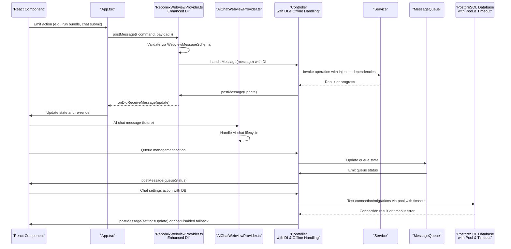

**Diagram sources**
- [App.tsx](file://src/webview/App.tsx#L75-L145)
- [RepomixWebviewProvider.ts](file://src/webview/RepomixWebviewProvider.ts#L134-L245)
- [AiChatWebviewProvider.ts](file://src/webview/AiChatWebviewProvider.ts#L47-L56)
- [messageSchemas.ts](file://src/webview/messageSchemas.ts#L1070-L1087)

## Detailed Component Analysis

### App.tsx: Comprehensive Tabbed Control Panel and State Management
- Comprehensive tabbed interface with Fluent UI TabList; selected tab state is lifted and persisted via VS Code state.
- Centralized message handler listens for updates from the extension (bundles, default Repomix state, version, Pinecone indexes).
- Action handlers translate UI actions into messages (run, cancel, copy) and vice versa.
- Client OS detection informs remote clipboard support.
- **Enhanced**: Simplified tab structure with consolidated Debug tab that includes index history functionality.


**Diagram sources**
- [App.tsx](file://src/webview/App.tsx#L47-L145)
- [utils.ts](file://src/webview/utils.ts#L4-L8)

**Section sources**
- [App.tsx](file://src/webview/App.tsx#L47-L276)
- [utils.ts](file://src/webview/utils.ts#L1-L8)

### Controllers: Enhanced MVC Implementation with Dependency Injection and Offline Handling
- BaseController.ts defines the contract for controllers: handleMessage, optional onWebviewLoaded, and dispose.
- BundleController.ts manages bundles, default Repomix state, output watching, and integrates with ExecutionQueueManager.
- AgentController.ts orchestrates the Smart Agent workflow, handles history, reruns, and copying outputs.
- ConfigController.ts manages secrets, vector DB provider switching, Qdrant connectivity, embedding configuration, and compatibility checks.
- **Enhanced**: ChatController.ts manages chat sessions, thread persistence, conversation flow, queue management, PostgreSQL connectivity, architecture document management, dependency injection with connection pooling, integration with LangGraph chat engine, sophisticated message queue handling with persistence and restoration, **offline handling with graceful degradation**, and comprehensive error reporting.
- DebugController.ts manages debug runs, environment information, and integrates with index history functionality.
- IndexHistoryController.ts manages indexing history retrieval and real-time event streaming with debounced updates.
- **Enhanced**: ApplyController.ts integrates asynchronous patch location functionality with AI file resolution fallback and intelligent content analysis.

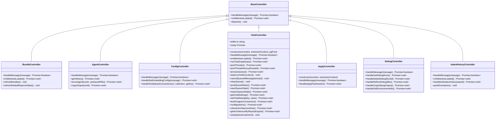

**Diagram sources**
- [BaseController.ts](file://src/webview/controllers/BaseController.ts#L8-L19)
- [BundleController.ts](file://src/webview/controllers/BundleController.ts#L17-L60)
- [AgentController.ts](file://src/webview/controllers/AgentController.ts#L20-L42)
- [ConfigController.ts](file://src/webview/controllers/ConfigController.ts#L26-L111)
- [ChatController.ts](file://src/webview/controllers/ChatController.ts#L66-L103)
- [ApplyController.ts](file://src/webview/controllers/ApplyController.ts#L15-L31)
- [DebugController.ts](file://src/webview/controllers/DebugController.ts#L16-L43)
- [IndexHistoryController.ts](file://src/webview/controllers/IndexHistoryController.ts#L18-L50)

**Section sources**
- [BaseController.ts](file://src/webview/controllers/BaseController.ts#L1-L19)
- [BundleController.ts](file://src/webview/controllers/BundleController.ts#L1-L257)
- [AgentController.ts](file://src/webview/controllers/AgentController.ts#L1-L314)
- [ConfigController.ts](file://src/webview/controllers/ConfigController.ts#L1-L1017)
- [ChatController.ts](file://src/webview/controllers/ChatController.ts#L1-L1945)
- [ApplyController.ts](file://src/webview/controllers/ApplyController.ts#L1-L149)
- [DebugController.ts](file://src/webview/controllers/DebugController.ts#L1-L230)
- [IndexHistoryController.ts](file://src/webview/controllers/IndexHistoryController.ts#L1-L115)

### Message Handling and Validation
- RepomixWebviewProvider.ts validates incoming messages using WebviewMessageSchema and routes them to controllers with dependency injection.
- App.tsx posts webviewLoaded and reports client OS to the extension host.
- Message schemas enumerate all supported commands with strict typing including enhanced database commands.
- **Enhanced**: Enhanced message schemas to support chat commands, comprehensive thread management, queue management operations, chat settings management with database connectivity, chat history browsing, and **offline handling commands**.
- **Enhanced**: AiChatWebviewProvider.ts provides independent message handling for AI chat functionality with controller instantiation.

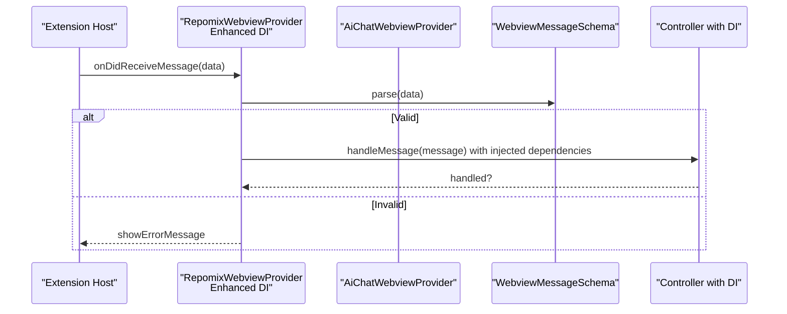

**Diagram sources**
- [RepomixWebviewProvider.ts](file://src/webview/RepomixWebviewProvider.ts#L134-L158)
- [AiChatWebviewProvider.ts](file://src/webview/AiChatWebviewProvider.ts#L47-L56)
- [messageSchemas.ts](file://src/webview/messageSchemas.ts#L1070-L1087)

**Section sources**
- [RepomixWebviewProvider.ts](file://src/webview/RepomixWebviewProvider.ts#L134-L245)
- [AiChatWebviewProvider.ts](file://src/webview/AiChatWebviewProvider.ts#L47-L73)
- [messageSchemas.ts](file://src/webview/messageSchemas.ts#L1-L1334)

### Component Hierarchy and Composition
- App.tsx renders the comprehensive tabbed layout and passes props to specialized components.
- AiChatRoot.tsx provides five-tab AI chat interface with Chat, Packages, Memory, Settings, and History tabs.
- BundleItem.tsx and DefaultRepomixItem.tsx are reusable UI components that accept actions via props.
- AgentView.tsx composes AgentInput, AgentStatus, AgentConfiguration, and AgentHistory.
- SettingsTab.tsx aggregates configuration sections and reacts to controller updates.
- **Enhanced**: ChatTab.tsx provides comprehensive chat interface with thread management, message visualization, tool call handling, and queue integration.
- **Enhanced**: ThreadList.tsx offers threaded conversation history with filtering, renaming, and export capabilities.
- **Enhanced**: ChatHeader.tsx manages chat interface controls including thread switching and plan access.
- **Enhanced**: ChatInput.tsx, ChatMessage.tsx, and ToolCallCard.tsx form the foundation of the AI chat interface with enhanced queue management.
- **Enhanced**: MessageQueueIndicator.tsx provides visual queue status with interactive queue panel toggle and loading indicators.
- **Enhanced**: QueuePanel.tsx displays detailed queue information with cancel and clear queue functionality.
- **Enhanced**: DebugTab.tsx now includes comprehensive index history visualization with real-time updates, statistics, and environment information.
- SearchTab.tsx manages search state, filters, and indexing controls with enhanced message handling.
- ApplyTab.tsx and DebugTab.tsx provide specialized workflows with their own state and message handling.
- **Enhanced**: ChatSettingsTab.tsx provides comprehensive chat settings management with database connectivity, LLM configuration, context management, and architecture document controls.
- **Enhanced**: ChatHistoryTab.tsx enables chat history browsing with search, filtering, pagination, and thread management.
- **Enhanced**: EditReviewPanel.tsx facilitates human-in-the-loop review of file edits with status tracking and selective application.
- **Enhanced**: ConnectionStatus.tsx provides visual database connectivity status with color-coded indicators.
- **Enhanced**: ApplyController integrates asynchronous patch location functionality with intelligent file resolution and content analysis.
- **Enhanced**: Offline handling components provide graceful degradation when PostgreSQL is unavailable, including chatDisabled fallback mechanism and improved user feedback.

```mermaid
graph TB
APP["App.tsx"]
AICHROOT["AiChatRoot.tsx"]
BUNDLE["BundleItem.tsx"]
DEFAULT["DefaultRepomixItem.tsx"]
AGENT["AgentView.tsx"]
SEARCH["SearchTab.tsx"]
SETTINGS["SettingsTab.tsx"]
APPLY["ApplyTab.tsx"]
DEBUG["DebugTab.tsx"]
CHAT["ChatTab.tsx"]
THREADLIST["ThreadList.tsx"]
CHATHEADER["ChatHeader.tsx"]
AICHCHAT["ChatTab.tsx (AI)"]
AICHINPUT["ChatInput.tsx"]
AICHQUEUE["MessageQueueIndicator.tsx"]
AICHQUEUEPANEL["QueuePanel.tsx"]
AICHMESSAGE["ChatMessage.tsx"]
AICHTOOL["ToolCallCard.tsx"]
SETTINGSCOMP["ChatSettingsTab.tsx"]
HISTORYCOMP["ChatHistoryTab.tsx"]
REVIEWCOMP["EditReviewPanel.tsx"]
CONNCOMP["ConnectionStatus.tsx"]
APPCONTROL["ApplyController.ts<br/>Async Patch Location"]
OFFLINECOMP["Offline Handling<br/>chatDisabled fallback"]
APP --> APPCONTROL
APP --> BUNDLE
APP --> DEFAULT
APP --> AGENT
APP --> SEARCH
APP --> SETTINGS
APP --> APPLY
APP --> DEBUG
APP --> CHAT
CHAT --> THREADLIST
CHAT --> CHATHEADER
CHAT --> AICHINPUT
CHAT --> AICHQUEUE
CHAT --> AICHQUEUEPANEL
AICHROOT --> AICHCHAT
AICHROOT --> SETTINGSCOMP
AICHROOT --> HISTORYCOMP
AICHROOT --> REVIEWCOMP
AICHROOT --> CONNCOMP
AICHROOT --> OFFLINECOMP
AICHCHAT --> AICHINPUT
AICHCHAT --> AICHMESSAGE
AICHCHAT --> AICHTOOL
```

**Diagram sources**
- [App.tsx](file://src/webview/App.tsx#L204-L276)
- [AiChatRoot.tsx](file://src/webview/AiChatRoot.tsx#L35-L107)
- [BundleItem.tsx](file://src/webview/components/BundleItem.tsx#L7-L121)
- [DefaultRepomixItem.tsx](file://src/webview/components/DefaultRepomixItem.tsx#L7-L91)
- [AgentView.tsx](file://src/webview/components/AgentView.tsx#L16-L165)
- [SettingsTab.tsx](file://src/webview/components/SettingsTab.tsx#L120-L802)
- [SearchTab.tsx](file://src/webview/components/SearchTab.tsx#L169-L1197)
- [ApplyTab.tsx](file://src/webview/components/ApplyTab.tsx#L26-L150)
- [DebugTab.tsx](file://src/webview/components/DebugTab.tsx#L7-L472)
- [ChatTab.tsx](file://src/webview/components/ChatTab.tsx#L195-L486)
- [ThreadList.tsx](file://src/webview/components/ThreadList.tsx#L63-L306)
- [ChatHeader.tsx](file://src/webview/components/ChatHeader.tsx#L14-L98)
- [ChatTab.tsx](file://src/webview/components/ai-chat/ChatTab.tsx#L1-L93)
- [ChatInput.tsx](file://src/webview/components/ai-chat/ChatInput.tsx#L1-L232)
- [MessageQueueIndicator.tsx](file://src/webview/components/ai-chat/MessageQueueIndicator.tsx#L1-L38)
- [QueuePanel.tsx](file://src/webview/components/ai-chat/QueuePanel.tsx#L1-L92)
- [ChatMessage.tsx](file://src/webview/components/ai-chat/ChatMessage.tsx#L1-L50)
- [ToolCallCard.tsx](file://src/webview/components/ai-chat/ToolCallCard.tsx#L1-L84)
- [ChatSettingsTab.tsx](file://src/webview/components/ai-chat/ChatSettingsTab.tsx#L1-L443)
- [ChatHistoryTab.tsx](file://src/webview/components/ai-chat/ChatHistoryTab.tsx#L1-L301)
- [EditReviewPanel.tsx](file://src/webview/components/ai-chat/EditReviewPanel.tsx#L1-L233)
- [ConnectionStatus.tsx](file://src/webview/components/ai-chat/ConnectionStatus.tsx#L1-L102)
- [ApplyController.ts](file://src/webview/controllers/ApplyController.ts#L15-L31)

**Section sources**
- [App.tsx](file://src/webview/App.tsx#L204-L276)
- [AiChatRoot.tsx](file://src/webview/AiChatRoot.tsx#L35-L107)
- [BundleItem.tsx](file://src/webview/components/BundleItem.tsx#L1-L121)
- [DefaultRepomixItem.tsx](file://src/webview/components/DefaultRepomixItem.tsx#L1-L91)
- [AgentView.tsx](file://src/webview/components/AgentView.tsx#L1-L165)
- [SettingsTab.tsx](file://src/webview/components/SettingsTab.tsx#L1-L1247)
- [SearchTab.tsx](file://src/webview/components/SearchTab.tsx#L1-L1197)
- [ApplyTab.tsx](file://src/webview/components/ApplyTab.tsx#L1-L150)
- [DebugTab.tsx](file://src/webview/components/DebugTab.tsx#L1-L472)
- [ChatTab.tsx](file://src/webview/components/ChatTab.tsx#L1-L486)
- [ThreadList.tsx](file://src/webview/components/ThreadList.tsx#L1-L306)
- [ChatHeader.tsx](file://src/webview/components/ChatHeader.tsx#L1-L98)
- [ChatTab.tsx](file://src/webview/components/ai-chat/ChatTab.tsx#L1-L93)
- [ChatInput.tsx](file://src/webview/components/ai-chat/ChatInput.tsx#L1-L232)
- [MessageQueueIndicator.tsx](file://src/webview/components/ai-chat/MessageQueueIndicator.tsx#L1-L38)
- [QueuePanel.tsx](file://src/webview/components/ai-chat/QueuePanel.tsx#L1-L92)
- [ChatMessage.tsx](file://src/webview/components/ai-chat/ChatMessage.tsx#L1-L50)
- [ToolCallCard.tsx](file://src/webview/components/ai-chat/ToolCallCard.tsx#L1-L84)
- [ChatSettingsTab.tsx](file://src/webview/components/ai-chat/ChatSettingsTab.tsx#L1-L443)
- [ChatHistoryTab.tsx](file://src/webview/components/ai-chat/ChatHistoryTab.tsx#L1-L301)
- [EditReviewPanel.tsx](file://src/webview/components/ai-chat/EditReviewPanel.tsx#L1-L233)
- [ConnectionStatus.tsx](file://src/webview/components/ai-chat/ConnectionStatus.tsx#L1-L102)
- [ApplyController.ts](file://src/webview/controllers/ApplyController.ts#L1-L149)

### State Synchronization and Event Propagation
- App.tsx maintains global state (selected tab, bundles, default Repomix state, Pinecone indexes) and persists it via VS Code state.
- Components subscribe to messages to update their local state and reflect changes.
- ExecutionQueueManager notifies UI of state changes (queued, running, idle) to keep the UI consistent with backend execution.
- **Enhanced**: ChatController manages chat session state, thread persistence, conversation flow with token budget tracking, comprehensive queue management with sophisticated persistence and restoration, PostgreSQL connectivity with connection pooling, architecture document management with getArchitectureByRepoId method, **offline handling with graceful degradation**, and comprehensive error reporting.
- **Enhanced**: ConversationService provides thread persistence and message storage with automatic preview generation.
- **Enhanced**: AiChatRoot.tsx manages AI chat tab state independently from the main control panel.
- **Enhanced**: Message queue system provides real-time queue status updates with debounced notifications and sophisticated error recovery.
- **Enhanced**: Queue persistence system maintains queue state across extension restarts using workspace state with comprehensive serialization/deserialization.
- **Enhanced**: Chat settings system manages comprehensive configuration state with database connectivity testing and architecture document status tracking.
- **Enhanced**: Chat history system provides paginated thread management with search, filtering, and archival capabilities.
- **Enhanced**: Human-in-the-loop review system tracks file edit status with selective application and error handling.
- **Enhanced**: ApplyController provides asynchronous patch application with intelligent file resolution and content analysis.
- **Enhanced**: Debug tab now manages both debug runs and index history state independently, with separate loading states and refresh mechanisms.
- **Enhanced**: Offline handling system prevents UI blocking with database initialization timeout protection and provides user feedback through chatDisabled fallback mechanism.

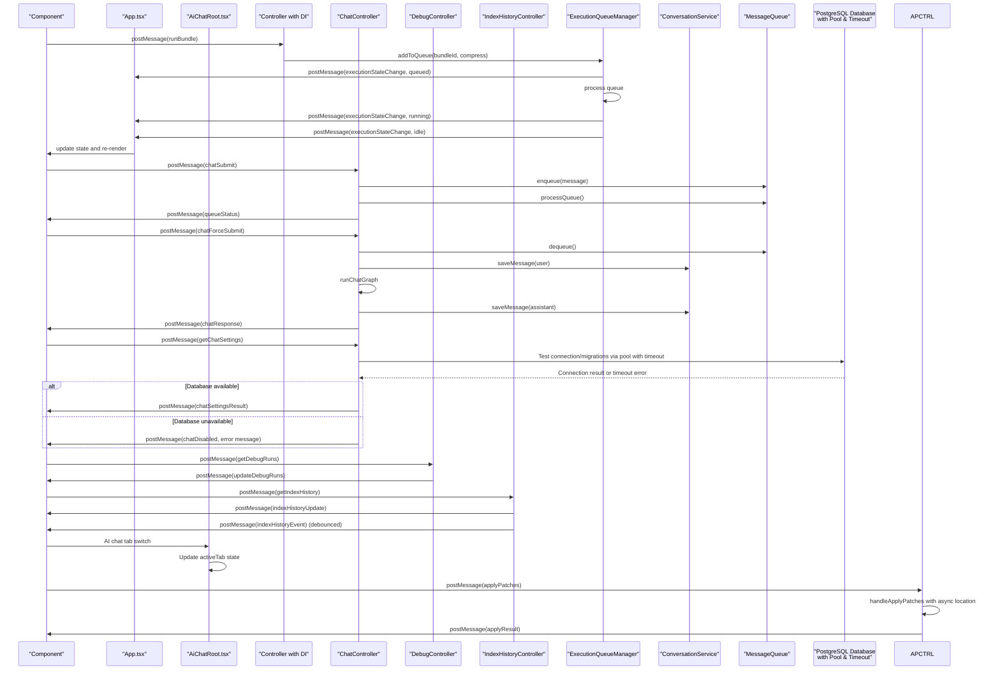

**Diagram sources**
- [ExecutionQueueManager.ts](file://src/webview/services/ExecutionQueueManager.ts#L26-L118)
- [BundleController.ts](file://src/webview/controllers/BundleController.ts#L38-L60)
- [App.tsx](file://src/webview/App.tsx#L88-L97)
- [AiChatRoot.tsx](file://src/webview/AiChatRoot.tsx#L35-L45)
- [ChatController.ts](file://src/webview/controllers/ChatController.ts#L1716-L1740)
- [ApplyController.ts](file://src/webview/controllers/ApplyController.ts#L33-L131)
- [conversationService.ts](file://src/services/conversationService.ts#L80-L85)
- [DebugController.ts](file://src/webview/controllers/DebugController.ts#L45-L47)
- [IndexHistoryController.ts](file://src/webview/controllers/IndexHistoryController.ts#L65-L95)

**Section sources**
- [ExecutionQueueManager.ts](file://src/webview/services/ExecutionQueueManager.ts#L1-L133)
- [BundleController.ts](file://src/webview/controllers/BundleController.ts#L67-L134)
- [App.tsx](file://src/webview/App.tsx#L75-L145)
- [AiChatRoot.tsx](file://src/webview/AiChatRoot.tsx#L14-L45)
- [ChatController.ts](file://src/webview/controllers/ChatController.ts#L1-L1945)
- [ApplyController.ts](file://src/webview/controllers/ApplyController.ts#L1-L149)
- [conversationService.ts](file://src/services/conversationService.ts#L1-L158)
- [DebugController.ts](file://src/webview/controllers/DebugController.ts#L1-L230)
- [IndexHistoryController.ts](file://src/webview/controllers/IndexHistoryController.ts#L1-L115)

### Accessibility and Responsive Design
- Uses Fluent UI components that provide built-in accessibility attributes and keyboard navigation.
- Layout uses Flexbox with responsive spacing; tab content adapts to viewport height.
- Interactive elements include tooltips and clear visual states (running, queued, idle).
- Color contrast and semantic text sizes are applied consistently across components.
- **Enhanced**: AI chat interface includes proper ARIA labels, keyboard navigation support, and screen reader friendly message formatting.
- **Enhanced**: ChatInput provides accessible text area with proper labeling and keyboard shortcuts including force send and stop functionality.
- **Enhanced**: ToolCallCard components include status indicators with appropriate color coding for accessibility.
- **Enhanced**: Five-tab AI chat interface provides clear visual hierarchy and tab navigation.
- **Enhanced**: MessageQueueIndicator provides visual queue status with accessible button semantics and loading indicators.
- **Enhanced**: QueuePanel includes accessible panel structure with proper heading hierarchy and cancel/clear functionality.
- **Enhanced**: Queue management components include keyboard navigation support and screen reader announcements.
- **Enhanced**: ChatSettingsTab provides accessible form controls with proper labeling and error states.
- **Enhanced**: ChatHistoryTab includes accessible thread list with proper heading hierarchy and keyboard navigation.
- **Enhanced**: EditReviewPanel provides accessible edit tracking with proper status indicators and keyboard navigation.
- **Enhanced**: ConnectionStatus provides accessible database connectivity status with proper color coding and screen reader announcements.
- **Enhanced**: ApplyController provides accessible patch application interface with error reporting and progress indication.
- **Enhanced**: Debug tab includes visual indicators for different event types with appropriate color coding and status badges, providing better accessibility for index history monitoring.
- **Enhanced**: Settings interface includes proper form validation, error states, and accessible controls for LM Studio configuration.
- **Enhanced**: Offline handling components provide accessible error states and user guidance for database unavailability.

### Extending the Interface
- Add a new controller by extending BaseController and implementing handleMessage with dependency injection support.
- Define a new command schema in messageSchemas.ts and add validation logic in RepomixWebviewProvider.ts.
- Create a new component under components/ and integrate it into App.tsx tabbed layout.
- If the feature requires persistent state, update WebViewState in types.ts and use updateVsState in utils.ts.
- For execution workflows, integrate with ExecutionQueueManager to ensure consistent state updates.
- **Enhanced**: For chat functionality, implement ChatController with LangGraph integration, PostgreSQL connection pooling, ConversationService persistence, and **offline handling capabilities**.
- **Enhanced**: For AI chat features, create components under components/ai-chat/ and integrate with AiChatRoot.tsx.
- **Enhanced**: For queue management features, implement queue components with MessageQueueIndicator and QueuePanel integration including sophisticated error recovery.
- **Enhanced**: For chat settings management, implement ChatSettingsTab with comprehensive configuration controls and database connectivity.
- **Enhanced**: For chat history management, implement ChatHistoryTab with search, filtering, pagination, and thread management capabilities.
- **Enhanced**: For human-in-the-loop review, implement EditReviewPanel with status tracking and selective application controls.
- **Enhanced**: For database connectivity, implement ConnectionStatus component with color-coded indicators and error handling.
- **Enhanced**: For patch application, implement ApplyController with asynchronous patch location functionality and intelligent content analysis.
- **Enhanced**: For dependency injection, use RepomixWebviewProvider constructor to instantiate controllers with injected dependencies.
- **Enhanced**: For enhanced asset bundling, use inline SVG components instead of external icon libraries to improve performance and reduce dependencies.
- **Enhanced**: For offline handling, implement graceful degradation mechanisms with timeout protection and user feedback through fallback commands like chatDisabled.

## AI Developer Chat System

### AiChatWebviewProvider: Enhanced AI Chat Webview Provider
The AiChatWebviewProvider manages a dedicated AI chat workspace that operates independently from the main control panel with comprehensive dependency injection support. It provides a focused environment for AI-powered development assistance with five-tab navigation and PostgreSQL integration.

Key features:
- Independent webview lifecycle management with dedicated HTML generation
- CSP-enabled HTML with nonce-based security
- Node integration enabled for enhanced functionality
- Window initial view configuration for AI chat interface
- **Enhanced**: Controller instantiation with dependency injection including PostgreSQL connection pooling
- **Enhanced**: Conditional controller creation based on database availability
- **Enhanced**: Error handling for database-unavailable scenarios

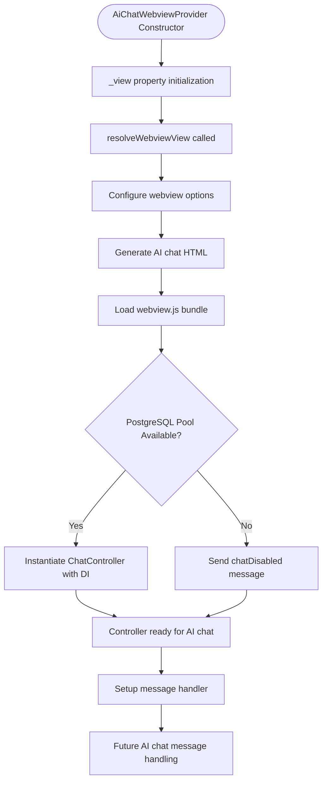

**Diagram sources**
- [AiChatWebviewProvider.ts](file://src/webview/AiChatWebviewProvider.ts#L18-L73)

**Section sources**
- [AiChatWebviewProvider.ts](file://src/webview/AiChatWebviewProvider.ts#L1-L108)

### AiChatRoot: Five-Tab AI Chat Interface
AiChatRoot.tsx provides the main AI chat interface with a five-tab layout designed for focused AI assistance. The interface includes Chat, Packages, Memory, Settings, and History tabs with distinct purposes and comprehensive state management.

Tab functionality:
- **Chat Tab**: Primary conversation interface with message display and input area
- **Packages Tab**: Package management and batch processing interface
- **Memory Tab**: Memory management and context injection interface
- **Settings Tab**: Comprehensive chat configuration interface with database connectivity
- **History Tab**: Chat history browsing and management interface

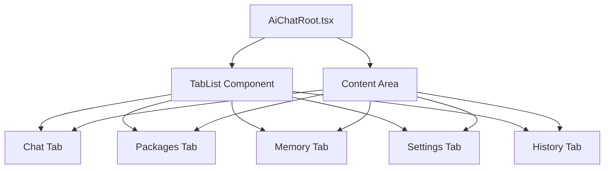

**Diagram sources**
- [AiChatRoot.tsx](file://src/webview/AiChatRoot.tsx#L71-L107)

**Section sources**
- [AiChatRoot.tsx](file://src/webview/AiChatRoot.tsx#L1-L107)

### AI Chat Components: Foundation of the AI Interface
The AI chat system is built on several core components that work together to provide a comprehensive chat experience:

#### ChatInput: Enhanced Message Composition Component
Provides a rich text input area with auto-expanding functionality, keyboard shortcuts, pricing information display, and comprehensive queue management integration. **Enhanced** with inline SVG icon implementation for improved asset bundling and new queue management capabilities including force send functionality and queue panel integration.

Key features:
- Auto-expanding textarea with min/max height constraints
- Shift+Enter for new lines, Enter for submission
- Disabled state when input is empty
- Pricing display with monospace font for token cost estimation
- **Enhanced**: Force send button for bypassing queue with skip queue functionality
- **Enhanced**: Stop button for cancelling current processing when available
- **Enhanced**: Queue indicator with visual status display and panel toggle
- **Enhanced**: Inline SVG paper plane icon for improved asset bundling and reduced external dependencies
- **Enhanced**: Queue panel integration with cancel and clear queue functionality

#### MessageQueueIndicator: Visual Queue Status Component
Provides visual indication of queue status with interactive queue panel toggle functionality and loading indicators.

Key features:
- Circular indicator showing processing status (● for processing, ○ for idle)
- Badge displaying queue length count
- Accessible button with title attribute
- Click handler for toggling queue panel visibility
- Color-coded badge (danger for processing, brand for idle)
- **Enhanced**: Loading indicators and visual feedback for queue status

#### QueuePanel: Detailed Queue Visualization Component
Displays comprehensive queue information with individual entry management and bulk operations.

Key features:
- Panel header with title and control buttons
- Currently processing message display
- List of queued messages with text truncation
- Individual entry cancel buttons
- Bulk clear queued messages functionality
- Close panel button
- Scrollable content area for long queues
- **Enhanced**: Comprehensive queue management with cancel and clear functionality

#### ChatMessage: Conversation Display Component
Handles both user and assistant message rendering with distinct styling and metadata.

Key features:
- Role-based styling (blue for user, gray for assistant)
- Timestamp metadata with role-specific positioning
- Responsive message containers with rounded corners
- Proper text wrapping and whitespace handling

#### ToolCallCard: Tool Execution Visualization
Displays tool execution status with visual indicators and detailed information.

Key features:
- Status-based color coding (green for completed, blue for reading, red for error)
- Icon differentiation for different tool types
- Monospace details display for technical information
- Collapsible card layout with header and details sections

#### ChatTab: Main Chat Interface
Coordinates the chat experience with message history, tool call display, input area, and queue integration.

Key features:
- Message history management with auto-scrolling
- Tool call visualization with status indicators
- Input area integration with ChatInput component
- State management for messages, tool calls, and scrolling
- **Enhanced**: Queue status integration for real-time queue updates

#### ChatSettingsTab: Comprehensive Settings Management
Provides extensive chat configuration with database connectivity, LLM settings, context management, and architecture controls.

Key features:
- Database connection management with testing and migration support
- Planning LLM configuration (Gemini Flash models)
- Batch LLM configuration (Claude Opus settings)
- Context management controls (thresholds, compression levels)
- File edit mode configuration (full, search/replace, hybrid)
- Architecture document management and refresh controls
- Real-time connection status indicators
- Form validation and error handling

#### ChatHistoryTab: Chat History Browsing
Enables comprehensive chat history management with search, filtering, pagination, and thread operations.

Key features:
- Thread list with search and filtering capabilities
- Pagination support for large history sets
- Archive/unarchive functionality
- Export and delete operations
- Time-based sorting and display
- Empty state handling and loading indicators

#### EditReviewPanel: Human-in-the-Loop Review
Facilitates manual review and approval of file edits with status tracking and selective application.

Key features:
- Edit status tracking (pending, applied, failed, skipped)
- Selective edit application and skipping
- Filter controls for different status types
- Summary statistics and counts
- Individual edit preview and diff viewing
- Apply all functionality for batch operations

#### ConnectionStatus: Database Connectivity
Provides visual database connectivity status with color-coded indicators and error handling.

Key features:
- Disconnected, connecting, connected, and error states
- Color-coded status indicators and messages
- Error message display for connection failures
- Accessible status descriptions for screen readers
- Consistent styling with Fluent UI design system

**Section sources**
- [ChatInput.tsx](file://src/webview/components/ai-chat/ChatInput.tsx#L1-L232)
- [MessageQueueIndicator.tsx](file://src/webview/components/ai-chat/MessageQueueIndicator.tsx#L1-L38)
- [QueuePanel.tsx](file://src/webview/components/ai-chat/QueuePanel.tsx#L1-L92)
- [ChatMessage.tsx](file://src/webview/components/ai-chat/ChatMessage.tsx#L1-L50)
- [ToolCallCard.tsx](file://src/webview/components/ai-chat/ToolCallCard.tsx#L1-L84)
- [ChatTab.tsx](file://src/webview/components/ai-chat/ChatTab.tsx#L1-L93)
- [ChatSettingsTab.tsx](file://src/webview/components/ai-chat/ChatSettingsTab.tsx#L1-L443)
- [ChatHistoryTab.tsx](file://src/webview/components/ai-chat/ChatHistoryTab.tsx#L1-L301)
- [EditReviewPanel.tsx](file://src/webview/components/ai-chat/EditReviewPanel.tsx#L1-L233)
- [ConnectionStatus.tsx](file://src/webview/components/ai-chat/ConnectionStatus.tsx#L1-L102)

## Chat Settings Management System

### Comprehensive Settings Architecture
The chat settings management system provides extensive configuration capabilities for the AI chat system with database connectivity, LLM configuration, context management, and architecture document controls.

#### Settings Structure and Data Flow
The system manages a comprehensive ChatSettings interface with multiple configuration categories:

- **Database Configuration**: PostgreSQL connection string with testing and migration support
- **LLM Configuration**: Planning model selection (Gemini Flash variants) and batch model settings
- **Context Management**: Threshold percentages, recent message limits, and file compression levels
- **Edit Modes**: File edit strategies (full, search/replace, hybrid) with threshold controls
- **Architecture Management**: Auto-refresh intervals and status tracking with getArchitectureByRepoId method

#### Settings Management Components
The system consists of several interconnected components working together:

- **ChatSettingsTab**: Main settings interface with form controls and validation
- **ConnectionStatus**: Visual database connectivity status with color-coded indicators
- **SecretInput**: Secure input handling for API keys and sensitive configuration
- **Form Controls**: Slider, select, input, and button components for settings management

#### Database Connectivity and Migration
The system provides comprehensive database management capabilities:

- **Connection Testing**: Real-time database connectivity validation with error reporting
- **Migration Support**: Automated schema migrations with progress tracking
- **Architecture Management**: Automatic and manual refresh of architecture documents using getArchitectureByRepoId
- **Status Tracking**: Real-time status updates for database and architecture states
- **Offline Handling**: Graceful degradation when database is unavailable with user feedback

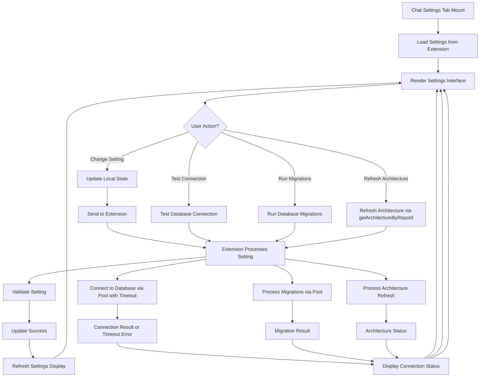

**Diagram sources**
- [ChatSettingsTab.tsx](file://src/webview/components/ai-chat/ChatSettingsTab.tsx#L190-L220)
- [ConnectionStatus.tsx](file://src/webview/components/ai-chat/ConnectionStatus.tsx#L45-L91)
- [ChatController.ts](file://src/webview/controllers/ChatController.ts#L1064-L1113)

**Section sources**
- [ChatSettingsTab.tsx](file://src/webview/components/ai-chat/ChatSettingsTab.tsx#L1-L443)
- [ConnectionStatus.tsx](file://src/webview/components/ai-chat/ConnectionStatus.tsx#L1-L102)

### Settings Integration and Validation
The chat settings system integrates seamlessly with the extension through comprehensive message handling:

#### Webview Communication
- **Settings Loading**: Initial settings retrieval via getChatSettings command
- **Setting Updates**: Real-time setting updates via setChatSetting commands
- **Connection Testing**: Database connectivity validation with testPostgresConnection
- **Migration Execution**: Schema migration processing with runMigrations
- **Architecture Management**: Manual and automatic architecture document refresh via getArchitectureByRepoId
- **Offline Handling**: Graceful degradation notification via chatDisabled fallback

#### Controller Responsibilities
- **Settings Persistence**: Maintains chat settings state and persistence with dependency injection
- **Database Management**: Handles PostgreSQL connectivity and migration operations with connection pooling and timeout protection
- **Architecture Control**: Manages architecture document generation and refresh with getArchitectureByRepoId method
- **Validation**: Performs comprehensive setting validation and error handling
- **Offline Handling**: Implements graceful degradation when database is unavailable

#### UI Integration
- **Form Controls**: Slider, select, input, and button components for settings management
- **Connection Status**: Real-time database connectivity status with visual indicators
- **Error Handling**: Comprehensive error reporting and user feedback
- **Loading States**: Progress indicators for long-running operations
- **Offline Feedback**: User-friendly error messages and guidance for database unavailability

**Section sources**
- [ChatSettingsTab.tsx](file://src/webview/components/ai-chat/ChatSettingsTab.tsx#L190-L220)
- [ChatController.ts](file://src/webview/controllers/ChatController.ts#L1115-L1130)
- [messageSchemas.ts](file://src/webview/messageSchemas.ts#L1300-L1316)

## Chat History Management System

### Comprehensive History Architecture
The chat history management system provides extensive chat thread browsing, searching, and management capabilities with pagination, filtering, and archival features.

#### History Data Structure and Management
The system manages ThreadSummary objects with comprehensive metadata:

- **Thread Identification**: Unique thread IDs with creation and update timestamps
- **Content Information**: Message counts, token usage, and preview content
- **Status Tracking**: Archival status, pending batch indicators, and last activity
- **Search Capabilities**: Full-text search across thread titles and content
- **Pagination Support**: Efficient loading of large history sets with cursor-based pagination

#### History Management Components
The system consists of several interconnected components:

- **ChatHistoryTab**: Main history interface with search, filtering, and thread management
- **ThreadCard**: Individual thread display with metadata, actions, and status indicators
- **Search Functionality**: Real-time search with debounced query processing
- **Pagination Controls**: Load more functionality with cursor-based navigation

#### Thread Operations and State Management
The system supports comprehensive thread operations:

- **Thread Browsing**: Initial loading and subsequent page loading with append mode
- **Search Operations**: Real-time search with instant results and empty state handling
- **Filtering**: Archive status filtering with toggle functionality
- **Thread Actions**: Resume, export, archive/unarchive, and delete operations
- **Optimistic Updates**: Immediate UI updates with eventual consistency

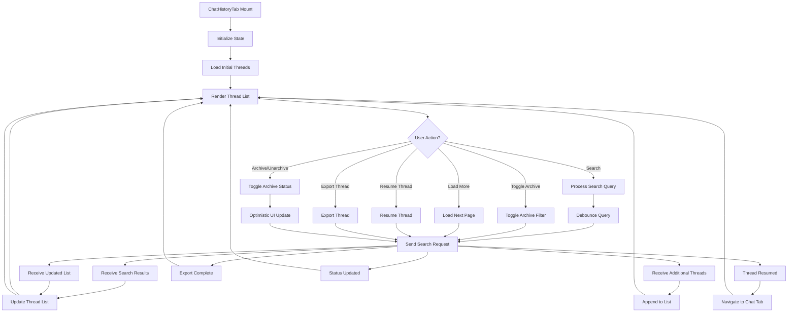

**Diagram sources**
- [ChatHistoryTab.tsx](file://src/webview/components/ai-chat/ChatHistoryTab.tsx#L89-L115)
- [ChatHistoryTab.tsx](file://src/webview/components/ai-chat/ChatHistoryTab.tsx#L117-L132)
- [ChatHistoryTab.tsx](file://src/webview/components/ai-chat/ChatHistoryTab.tsx#L154-L176)

**Section sources**
- [ChatHistoryTab.tsx](file://src/webview/components/ai-chat/ChatHistoryTab.tsx#L1-L301)

### History Integration and Performance
The chat history system integrates with the extension through optimized message handling:

#### Webview Communication
- **Initial Loading**: Thread list retrieval via getThreads command
- **Search Operations**: Real-time search via searchThreads with debounced queries
- **Pagination**: Cursor-based loading via getThreadHistoryPage
- **Filtering**: Archive status toggling via showArchivedThreads
- **Thread Actions**: Resume, export, archive, and delete operations

#### Controller Responsibilities
- **History Management**: Thread list retrieval, search, and pagination with dependency injection
- **Filtering Logic**: Archive status filtering and search result processing
- **Pagination**: Cursor-based navigation and append-mode loading
- **Optimistic Updates**: Immediate UI updates for archive operations

#### UI Integration
- **Search Interface**: Real-time search with instant results and loading states
- **Thread Cards**: Individual thread display with metadata and action buttons
- **Pagination**: Load more functionality with infinite scroll behavior
- **Filter Controls**: Archive toggle with immediate effect on thread list
- **Empty States**: Proper handling of empty search results and loading states

**Section sources**
- [ChatHistoryTab.tsx](file://src/webview/components/ai-chat/ChatHistoryTab.tsx#L117-L152)
- [ChatController.ts](file://src/webview/controllers/ChatController.ts#L1260-L1301)
- [messageSchemas.ts](file://src/webview/messageSchemas.ts#L1240-L1249)

## Human-in-the-Loop Review System

### Review System Architecture
The human-in-the-loop review system provides comprehensive file edit review capabilities with status tracking, selective application, and error handling.

#### Edit Review Data Structure and Management
The system manages FileEdit objects with comprehensive status tracking:

- **Edit Identification**: File path, action type (create, edit, delete), and preview content
- **Status Tracking**: Pending, applied, failed, and skipped status with error information
- **Metadata**: Line counts and action-specific details
- **Selection Management**: Multi-select functionality for batch operations
- **Filtering**: Status-based filtering with summary statistics

#### Review Components and Interactions
The system consists of several interconnected components:

- **EditReviewPanel**: Main review interface with filtering, selection, and action controls
- **FileEditCard**: Individual edit display with status indicators and action buttons
- **Filter Controls**: Dropdown filtering by edit status with summary counts
- **Action Buttons**: Apply all, apply selected, and selective edit operations

#### Review Workflows and State Management
The system supports comprehensive review workflows:

- **Edit Display**: Comprehensive preview of file changes with status indicators
- **Selection Management**: Multi-select functionality with individual and batch operations
- **Status Tracking**: Real-time status updates with color-coded indicators
- **Error Handling**: Detailed error reporting and recovery options
- **Summary Statistics**: Real-time counts and summaries for different status types

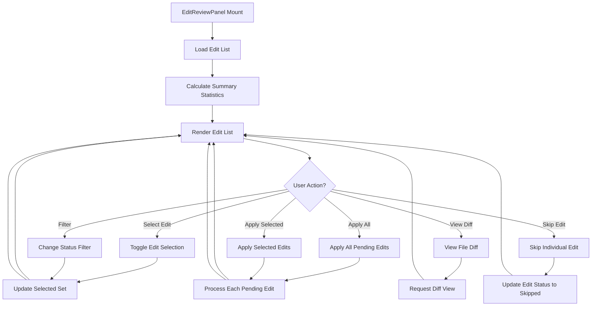

**Diagram sources**
- [EditReviewPanel.tsx](file://src/webview/components/ai-chat/EditReviewPanel.tsx#L82-L123)
- [EditReviewPanel.tsx](file://src/webview/components/ai-chat/EditReviewPanel.tsx#L112-L123)

**Section sources**
- [EditReviewPanel.tsx](file://src/webview/components/ai-chat/EditReviewPanel.tsx#L1-L233)

### Review Integration and User Experience
The human-in-the-loop review system integrates seamlessly with the chat workflow:

#### Webview Communication
- **Edit Review Requests**: Initial edit review data via editReview command
- **Individual Operations**: Apply edit, skip edit, and view diff via specific commands
- **Batch Operations**: Apply all edits via applyAllEdits command
- **Review Resumption**: Resume review process via resumeEditReview command

#### Controller Responsibilities
- **Edit Management**: Track and manage file edit status and operations
- **Review Coordination**: Coordinate between chat workflow and edit review process
- **Status Updates**: Real-time status updates for individual and batch operations
- **Error Handling**: Comprehensive error handling for edit application failures

#### UI Integration
- **Edit Display**: Comprehensive file edit previews with status indicators
- **Selection Interface**: Checkbox-based selection with multi-edit support
- **Filter Controls**: Dropdown filtering with real-time summary updates
- **Action Buttons**: Apply all, apply selected, and individual edit controls
- **Status Indicators**: Color-coded badges for different edit statuses
- **Empty State Handling**: Proper handling when no edits match current filter

**Section sources**
- [EditReviewPanel.tsx](file://src/webview/components/ai-chat/EditReviewPanel.tsx#L73-L123)
- [ChatController.ts](file://src/webview/controllers/ChatController.ts#L869-L901)
- [messageSchemas.ts](file://src/webview/messageSchemas.ts#L854-L891)

## Message Queue Management System

### Queue System Architecture
The message queue management system provides comprehensive queue handling for AI chat operations with visual feedback and user control capabilities. **Enhanced** with over 200 lines of sophisticated functionality including queue persistence, restoration, and advanced error recovery.

#### Queue Entry Types and Status
The queue system manages message entries with comprehensive status tracking and priority levels:

- **QueueStatus**: 'queued' | 'processing' | 'completed' | 'cancelled' | 'failed'
- **QueuePriority**: 'normal' | 'force'
- **QueueEntry**: Complete message entry with metadata and timing information
- **QueueConfig**: Configuration for queue behavior and history limits
- **QueueEvents**: Event types for queue state changes and processing updates

#### Queue Operations
The system supports comprehensive queue operations:

- **Enqueue**: Add messages to queue with priority handling
- **Dequeue**: Remove and process next message in queue
- **Cancel**: Cancel specific queued messages
- **CancelAll**: Clear entire queue
- **Complete**: Mark processing as completed or failed
- **Status Reporting**: Real-time queue status updates
- **Persistence**: Save and restore queue state across extension restarts
- **Error Recovery**: Graceful handling of aborted executions and queue continuation

#### Queue Persistence
The system includes robust persistence capabilities:

- **Workspace State Storage**: Queue state maintained across extension restarts
- **Serialization/Deserialization**: Complete queue state preservation
- **Automatic Restoration**: Queue processing resumes after restart if needed
- **Error Recovery**: Continued queue processing even after individual message failures

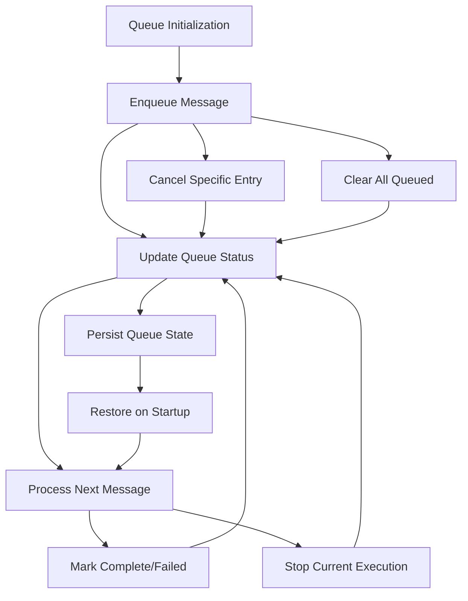

**Diagram sources**
- [ChatController.ts](file://src/webview/controllers/ChatController.ts#L1716-L1740)
- [types.ts](file://src/chat/queue/types.ts#L1-L85)

**Section sources**
- [ChatController.ts](file://src/webview/controllers/ChatController.ts#L1716-L1740)
- [types.ts](file://src/chat/queue/types.ts#L1-L85)

### Queue Management Integration
The queue management system integrates seamlessly with the AI chat interface:

#### Webview Communication
- **Queue Status Messages**: Real-time queue status updates from extension to webview
- **User Interaction Commands**: Force submit, stop, cancel queued, and clear queue operations
- **Queue Processing Events**: Start and completion notifications for queue operations
- **Queue Persistence**: Save and restore queue state across extension restarts

#### Controller Responsibilities
- **Queue Processing**: Sequential message processing with proper error handling and abort support
- **Status Reporting**: Regular queue status updates to webview interface
- **Cancellation Handling**: Graceful handling of user-initiated cancellations
- **Persistence Management**: Queue state serialization and restoration
- **Error Recovery**: Continued queue processing even after individual message failures

#### UI Integration
- **Visual Indicators**: MessageQueueIndicator provides immediate queue status feedback with loading indicators
- **Interactive Panels**: QueuePanel allows detailed queue management and inspection with cancel and clear functionality
- **Control Buttons**: Force send and stop buttons provide user control over queue operations
- **Real-time Updates**: Queue status updates trigger immediate UI refresh
- **Loading States**: Visual feedback for queue processing and completion

**Section sources**
- [ChatController.ts](file://src/webview/controllers/ChatController.ts#L1788-L1845)
- [ChatInput.tsx](file://src/webview/components/ai-chat/ChatInput.tsx#L1-L232)
- [MessageQueueIndicator.tsx](file://src/webview/components/ai-chat/MessageQueueIndicator.tsx#L1-L38)
- [QueuePanel.tsx](file://src/webview/components/ai-chat/QueuePanel.tsx#L1-L92)
- [messageSchemas.ts](file://src/webview/messageSchemas.ts#L1291-L1316)

## Offline Handling and Graceful Degradation

### Enhanced Offline Handling Architecture
The ChatController now implements comprehensive offline handling capabilities with graceful degradation when PostgreSQL is unavailable, preventing UI blocking and providing meaningful user feedback.

#### Database Initialization Timeout Protection
- **10-second Timeout**: Database initialization is wrapped in a timeout to prevent UI blocking
- **Graceful Failure**: Database initialization failures are captured and stored for user feedback
- **Timeout Error Handling**: Clear error messages are provided when database initialization takes too long
- **User Guidance**: Users are directed to the Settings tab to configure their PostgreSQL connection

#### Graceful Degradation Mechanisms
- **chatDisabled Command**: Special fallback command notifies users when database is unavailable
- **Separation of Concerns**: Database-dependent commands are separated from database-independent commands
- **Settings Tab Priority**: Settings tab remains fully functional even when database is unavailable
- **User-Friendly Error Messages**: Clear guidance is provided for resolving database connectivity issues

#### Offline Handling Implementation
The system implements several layers of offline handling:

- **Initialization Phase**: Database connection attempts are wrapped with timeout protection
- **Runtime Phase**: Database unavailability is detected and handled gracefully
- **User Feedback**: Users receive clear, actionable feedback about database status
- **Feature Degradation**: Non-critical features continue to work while database-dependent features are disabled

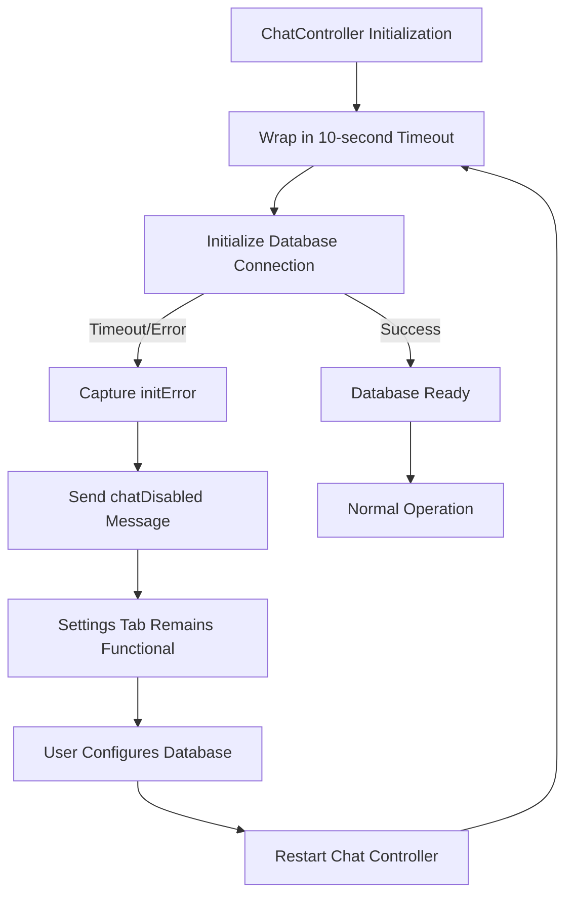

**Diagram sources**
- [ChatController.ts](file://src/webview/controllers/ChatController.ts#L521-L536)
- [ChatController.ts](file://src/webview/controllers/ChatController.ts#L130-L152)
- [ChatController.ts](file://src/webview/controllers/ChatController.ts#L154-L197)

**Section sources**
- [ChatController.ts](file://src/webview/controllers/ChatController.ts#L521-L536)
- [ChatController.ts](file://src/webview/controllers/ChatController.ts#L130-L152)
- [ChatController.ts](file://src/webview/controllers/ChatController.ts#L154-L197)

### Offline Handling Integration
The offline handling system integrates seamlessly with the AI chat interface:

#### Webview Communication
- **chatDisabled Messages**: Special fallback messages notify users of database unavailability
- **Settings Tab Priority**: Database-independent commands continue to function normally
- **Error State Management**: Clear error states are communicated to the UI
- **User Guidance**: Actionable guidance is provided for resolving database issues

#### Controller Responsibilities
- **Timeout Protection**: Database initialization is protected with timeout mechanisms
- **Error Capture**: Database initialization failures are captured and stored
- **Graceful Degradation**: Non-critical features continue to operate during offline periods
- **User Feedback**: Clear, user-friendly error messages are provided

#### UI Integration
- **Offline Indicators**: Visual indicators show when database is unavailable
- **Settings Priority**: Settings tab remains fully functional for database configuration
- **Error Messages**: Clear, actionable error messages guide users to solutions
- **Feature Degradation**: Users understand which features are temporarily disabled

**Section sources**
- [ChatController.ts](file://src/webview/controllers/ChatController.ts#L130-L152)
- [ChatController.ts](file://src/webview/controllers/ChatController.ts#L154-L197)
- [ChatSettingsTab.tsx](file://src/webview/components/ai-chat/ChatSettingsTab.tsx#L123-L168)

## Dependency Injection Architecture

### Enhanced Controller Instantiation
The RepomixWebviewProvider now implements comprehensive dependency injection architecture for all controllers, providing better modularity and testability.

#### Controller Dependencies
- **BundleController**: Injects BundleManager and ExecutionQueueManager
- **AgentController**: Injects DatabaseService and ExtensionContext
- **ConfigController**: Injects ExtensionContext, DatabaseService, and IndexingController
- **IndexingController**: Injects DatabaseService, ExtensionContext, and IndexingService
- **DebugController**: Injects DatabaseService and ExtensionContext
- **ApplyController**: Injects ExtensionContext for patch application functionality
- **IndexHistoryController**: Injects DatabaseService and ExtensionContext
- **ChatController**: Injects ExtensionContext and PostgreSQL Pool for database connectivity and **offline handling**

#### Dependency Injection Benefits
- **Modularity**: Controllers are decoupled from concrete implementations
- **Testability**: Dependencies can be easily mocked for unit testing
- **Flexibility**: Different implementations can be swapped without changing controller logic
- **Resource Management**: Shared resources like database pools are managed centrally
- **Offline Handling**: Database pools support graceful degradation and timeout protection

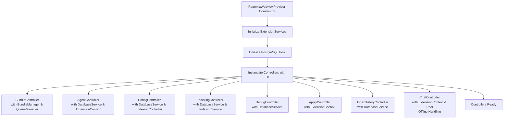

**Diagram sources**
- [RepomixWebviewProvider.ts](file://src/webview/RepomixWebviewProvider.ts#L63-L131)

**Section sources**
- [RepomixWebviewProvider.ts](file://src/webview/RepomixWebviewProvider.ts#L63-L131)

### Controller Lifecycle Management
The enhanced dependency injection architecture provides better lifecycle management for controllers:

#### Initialization
- Controllers are instantiated with their dependencies in the RepomixWebviewProvider constructor
- Each controller receives only the dependencies it needs
- Database connections and services are shared across controllers where appropriate
- **Enhanced**: ChatController receives PostgreSQL pool for database connectivity and offline handling

#### Message Handling
- Controllers receive messages through the unified message handling system
- Dependency injection ensures controllers have access to all required services
- Error handling is centralized in the RepomixWebviewProvider
- **Enhanced**: Offline handling is integrated into the dependency injection architecture

#### Disposal
- Controllers implement proper disposal methods for cleanup
- Resources like database connections are released when controllers are disposed
- Memory leaks are prevented through proper resource management

**Section sources**
- [RepomixWebviewProvider.ts](file://src/webview/RepomixWebviewProvider.ts#L134-L245)
- [BaseController.ts](file://src/webview/controllers/BaseController.ts#L8-L19)

## PostgreSQL Database Integration

### Enhanced Database Architecture
The ChatController now implements comprehensive PostgreSQL integration with connection pooling, migration verification, architecture document management, and **offline handling capabilities**.

#### Connection Pooling
- **PostgreSQL Pool**: Centralized connection pool management for all database operations
- **Connection Testing**: Real-time connection validation with detailed error reporting
- **Migration Verification**: Automated schema migration verification with rollback support
- **Resource Management**: Efficient connection reuse and automatic cleanup
- **Offline Handling**: Connection pooling supports graceful degradation and timeout protection

#### Architecture Document Management
- **getArchitectureByRepoId**: Enhanced method for retrieving architecture documents by repository ID
- **Status Tracking**: Real-time architecture document freshness and status monitoring
- **Auto-refresh**: Configurable architecture document refresh intervals
- **Manual Refresh**: On-demand architecture document regeneration

#### Database Operations
- **Thread Management**: Repository-based thread management with PostgreSQL storage
- **Message Storage**: Message persistence with pagination and search capabilities
- **Memory Management**: Memory injection and retrieval with scope-based organization
- **Batch Processing**: Package management with status tracking and progress monitoring

#### Offline Handling Integration
- **Timeout Protection**: Database operations are protected with timeout mechanisms
- **Graceful Degradation**: Non-critical database operations continue during offline periods
- **Error Reporting**: Clear error messages are provided for database connectivity issues
- **User Guidance**: Users are directed to configuration options for resolving connectivity issues

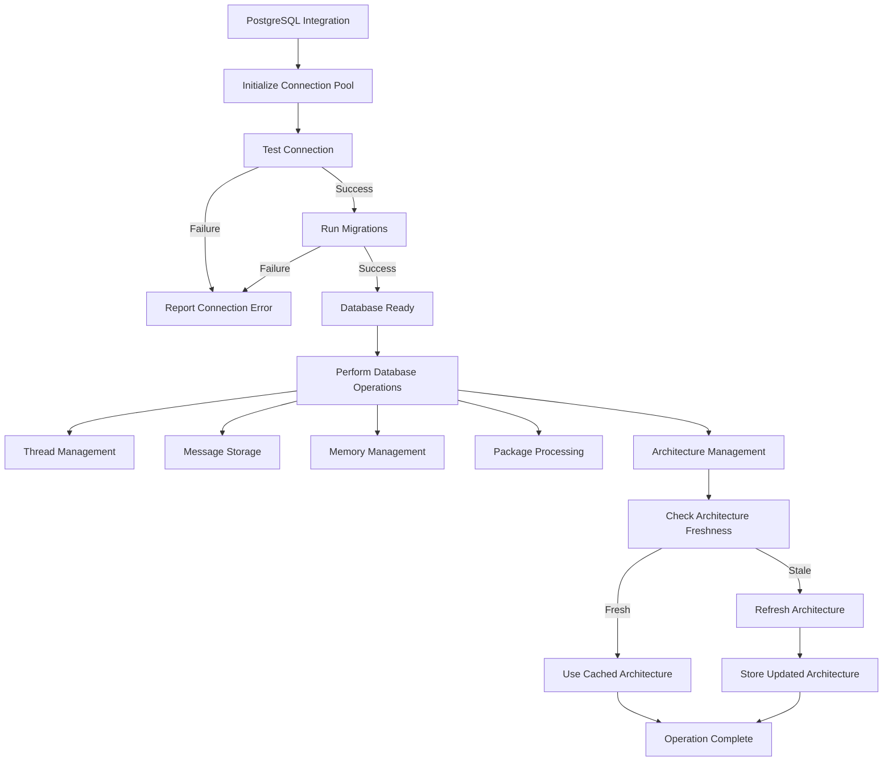

**Diagram sources**
- [ChatController.ts](file://src/webview/controllers/ChatController.ts#L1064-L1113)
- [architectureRepository.ts](file://src/chat/db/architectureRepository.ts#L62-L94)
- [postgresClient.ts](file://src/chat/db/postgresClient.ts#L286-L317)

**Section sources**
- [ChatController.ts](file://src/webview/controllers/ChatController.ts#L1064-L1113)
- [architectureRepository.ts](file://src/chat/db/architectureRepository.ts#L62-L94)
- [postgresClient.ts](file://src/chat/db/postgresClient.ts#L286-L317)

### Database Integration Patterns
The PostgreSQL integration follows established patterns for reliable database operations:

#### Connection Management
- **Pool Initialization**: Centralized pool creation with connection timeout and error handling
- **Connection Testing**: Direct connection string validation without pool overhead
- **Migration Verification**: Schema migration verification with transaction safety
- **Error Recovery**: Automatic pool recreation on connection failures
- **Offline Handling**: Connection pools support graceful degradation and timeout protection

#### Data Access Patterns
- **Repository Pattern**: Separate repositories for different entity types (threads, messages, architecture)
- **Connection Pooling**: Efficient reuse of database connections across operations
- **Transaction Safety**: Critical operations wrapped in transactions with rollback support
- **Async Operations**: Non-blocking database operations with proper error handling

#### Security Considerations
- **Secret Management**: Database connection strings stored securely in VS Code secrets
- **Connection String Validation**: Runtime validation of connection strings before use
- **Error Masking**: Sensitive information masked in error messages
- **Access Control**: Limited database access through repository interfaces

**Section sources**
- [ChatController.ts](file://src/webview/controllers/ChatController.ts#L1064-L1113)
- [postgresClient.ts](file://src/chat/db/postgresClient.ts#L286-L317)

## Patch Application System

### Asynchronous Patch Location Architecture
The ApplyController implements a sophisticated asynchronous patch application system with intelligent file resolution and content analysis.

#### Patch Processing Workflow
- **Patch Parsing**: Extract patches from AI-generated text with intelligent parsing
- **File Resolution**: Resolve file paths to actual workspace locations with AI fallback
- **Content Analysis**: Analyze existing content to find matching code blocks
- **Indentation Repair**: Automatically repair indentation to match existing code style
- **Patch Application**: Apply patches with VS Code workspace APIs

#### Intelligent File Resolution
- **Direct Path Matching**: Attempt direct file path resolution first
- **AI Fallback**: Use AI models to resolve ambiguous file paths when direct resolution fails
- **Search Content Analysis**: Analyze search content to improve file resolution accuracy
- **Error Context Generation**: Generate helpful error messages for troubleshooting

#### Content Analysis and Matching
- **Block Detection**: Identify exact code blocks to replace based on search content
- **Indentation Preservation**: Detect and preserve existing indentation patterns
- **Content Comparison**: Compare search content with actual file content for accuracy
- **Fallback Strategies**: Multiple strategies for finding matching content blocks

#### Patch Application Process
- **File Reading**: Read current file content for analysis
- **Content Modification**: Apply patch with proper indentation repair
- **Workspace Editing**: Use VS Code APIs for safe file modifications
- **Error Handling**: Comprehensive error handling with user-friendly messages

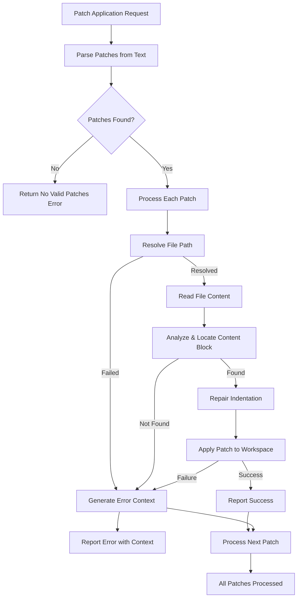

**Diagram sources**
- [ApplyController.ts](file://src/webview/controllers/ApplyController.ts#L33-L131)

**Section sources**
- [ApplyController.ts](file://src/webview/controllers/ApplyController.ts#L33-L131)

### Patch Application Integration
The patch application system integrates seamlessly with the AI chat interface:

#### Webview Communication
- **Patch Submission**: AI-generated patches submitted via applyPatches command
- **Progress Reporting**: Real-time progress updates with file-by-file reporting
- **Result Aggregation**: Comprehensive results reporting with success/failure details
- **Error Context**: Detailed error context generation for troubleshooting

#### Controller Responsibilities
- **Patch Parsing**: Extract and validate patches from AI-generated text
- **File Resolution**: Intelligent file path resolution with AI fallback support
- **Content Analysis**: Accurate content matching and indentation preservation
- **Patch Application**: Safe patch application through VS Code workspace APIs

#### UI Integration
- **Progress Indication**: Visual progress indication during patch application
- **Result Display**: Comprehensive results display with individual file status
- **Error Reporting**: User-friendly error messages with actionable context
- **Cancellation Support**: Ability to cancel long-running patch operations

**Section sources**
- [ApplyController.ts](file://src/webview/controllers/ApplyController.ts#L22-L31)
- [ApplyController.ts](file://src/webview/controllers/ApplyController.ts#L33-L131)
- [messageSchemas.ts](file://src/webview/messageSchemas.ts#L1-L1334)

## Dependency Analysis
The webview depends on:
- VS Code Webview API for messaging and HTML generation.
- Fluent UI for UI primitives.
- Zod for message validation.
- Internal services for execution, configuration, conversation management, queue operations, and database connectivity.
- **Enhanced**: RepomixWebviewProvider depends on ExtensionServices for comprehensive dependency injection.
- **Enhanced**: AiChatWebviewProvider depends on VS Code WebviewViewProvider interface for AI chat workspace.
- **Enhanced**: AiChatRoot depends on React state management and Fluent UI components for AI chat interface.
- **Enhanced**: ChatSettingsTab depends on ConnectionStatus and SecretInput components for comprehensive settings management.
- **Enhanced**: ChatHistoryTab depends on ThreadCard component for thread display and management.
- **Enhanced**: EditReviewPanel depends on FileEditCard component for individual edit display.
- **Enhanced**: Queue management components depend on chat/queue/types for queue entry definitions.
- **Enhanced**: ApplyController depends on patching utilities for asynchronous patch location functionality.
- **Enhanced**: ChatController depends on PostgreSQL connection pooling, architecture repository, and **offline handling capabilities** for database integration.
- **Enhanced**: AiChatWebviewProvider enables Node integration for enhanced AI chat functionality.
- **Enhanced**: AI chat components use efficient state management with React hooks for optimal performance.
- **Enhanced**: Message queue system implements efficient queue status updates with debounced notifications.
- **Enhanced**: Queue persistence system minimizes performance impact through selective state serialization.
- **Enhanced**: Chat settings system implements debounced search and efficient form validation.
- **Enhanced**: Chat history system uses cursor-based pagination to handle large datasets efficiently.
- **Enhanced**: Edit review system implements efficient status tracking with minimal re-rendering.
- **Enhanced**: ApplyController provides asynchronous patch application with intelligent file resolution.
- **Enhanced**: Enhanced asset bundling through inline SVG components for improved performance.
- **Enhanced**: Offline handling system prevents UI blocking with database initialization timeout protection and provides user feedback through chatDisabled fallback mechanism.

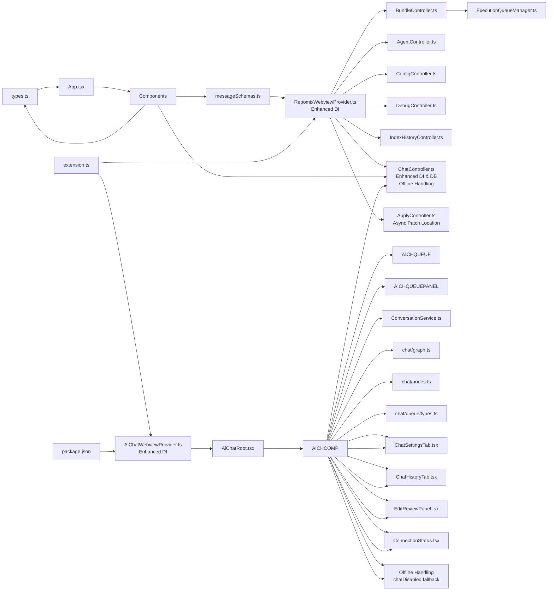

**Diagram sources**
- [types.ts](file://src/webview/types.ts#L1-L131)
- [messageSchemas.ts](file://src/webview/messageSchemas.ts#L1-L1334)
- [RepomixWebviewProvider.ts](file://src/webview/RepomixWebviewProvider.ts#L1-L410)
- [AiChatWebviewProvider.ts](file://src/webview/AiChatWebviewProvider.ts#L1-L108)
- [AiChatRoot.tsx](file://src/webview/AiChatRoot.tsx#L1-L107)
- [extension.ts](file://src/extension.ts#L501-L518)
- [package.json](file://package.json#L333-L337)
- [ChatSettingsTab.tsx](file://src/webview/components/ai-chat/ChatSettingsTab.tsx#L1-L443)
- [ChatHistoryTab.tsx](file://src/webview/components/ai-chat/ChatHistoryTab.tsx#L1-L301)
- [EditReviewPanel.tsx](file://src/webview/components/ai-chat/EditReviewPanel.tsx#L1-L233)
- [ConnectionStatus.tsx](file://src/webview/components/ai-chat/ConnectionStatus.tsx#L1-L102)
- [ChatInput.tsx](file://src/webview/components/ai-chat/ChatInput.tsx#L1-L232)
- [MessageQueueIndicator.tsx](file://src/webview/components/ai-chat/MessageQueueIndicator.tsx#L1-L38)
- [QueuePanel.tsx](file://src/webview/components/ai-chat/QueuePanel.tsx#L1-L92)
- [ChatController.ts](file://src/webview/controllers/ChatController.ts#L66-L103)
- [ApplyController.ts](file://src/webview/controllers/ApplyController.ts#L15-L31)
- [architectureRepository.ts](file://src/chat/db/architectureRepository.ts#L26-L94)
- [postgresClient.ts](file://src/chat/db/postgresClient.ts#L286-L317)

**Section sources**
- [types.ts](file://src/webview/types.ts#L1-L131)
- [messageSchemas.ts](file://src/webview/messageSchemas.ts#L1-L1334)
- [RepomixWebviewProvider.ts](file://src/webview/RepomixWebviewProvider.ts#L1-L410)
- [AiChatWebviewProvider.ts](file://src/webview/AiChatWebviewProvider.ts#L1-L108)
- [AiChatRoot.tsx](file://src/webview/AiChatRoot.tsx#L1-L107)
- [extension.ts](file://src/extension.ts#L501-L518)

## Performance Considerations
- Debouncing: BundleController debounces refresh operations to reduce redundant work.
- File watchers: Watchers are created per output file and cleaned up when bundles change.
- Queue processing: ExecutionQueueManager serializes runs and avoids overlapping executions.
- UI updates: Components update state only when receiving relevant messages to minimize re-renders.
- **Enhanced**: ChatController implements efficient thread persistence with automatic preview generation and token tracking using dependency injection.
- **Enhanced**: ConversationService uses optimized JSON storage with minimal I/O operations for thread management.
- **Enhanced**: AiChatWebviewProvider enables Node integration for enhanced AI chat functionality.
- **Enhanced**: AI chat components use efficient state management with React hooks for optimal performance.
- **Enhanced**: Message queue system implements efficient queue status updates with debounced notifications and sophisticated error recovery.
- **Enhanced**: Queue persistence system minimizes performance impact through selective state serialization and workspace state management.
- **Enhanced**: Chat settings system implements debounced search and efficient form validation.
- **Enhanced**: Chat history system uses cursor-based pagination to handle large datasets efficiently.
- **Enhanced**: Edit review system implements efficient status tracking with minimal re-rendering.
- **Enhanced**: ApplyController provides asynchronous patch application with intelligent file resolution and content analysis.
- **Enhanced**: PostgreSQL connection pooling reduces database connection overhead and improves performance.
- **Enhanced**: Architecture document caching reduces repeated computation and improves responsiveness.
- **Enhanced**: Dependency injection reduces coupling and improves testability while maintaining performance.
- **Enhanced**: AI chat components now use inline SVG icons for improved asset bundling and reduced external dependencies.
- **Enhanced**: Settings interface includes optimized LM Studio model fetching with debounced requests and efficient dimension testing.
- **Enhanced**: IndexHistoryController implements debounced event pushing (500ms) to prevent UI flooding during high-frequency indexing events.
- **Enhanced**: Debug tab uses separate loading states for debug runs and index history to prevent blocking UI updates.
- **Enhanced**: Message queue system provides sophisticated error recovery with graceful degradation and continued queue processing.
- **Enhanced**: Offline handling system prevents UI blocking with database initialization timeout protection and provides user feedback through chatDisabled fallback mechanism.

## Troubleshooting Guide
Common issues and resolutions:
- Invalid message errors: The provider logs validation failures and displays an error message. Verify the command and payload match the schemas.
- Missing API keys: Controllers check for secrets and prompt users to configure settings; ensure keys are saved via saveSecret commands.
- Remote clipboard disabled: The webview logs a deprecation warning for remote clipboard processing; use local copy operations.
- Indexing blocked: Compatibility checks can block indexing when embedding dimensions mismatch; reset the vector index via resetVectorIndex.
- **Enhanced**: AI chat not loading: Verify AiChatWebviewProvider is properly registered in extension.ts and package.json contributions are present.
- **Enhanced**: AI chat HTML generation issues: Check CSP configuration and nonce generation in AiChatWebviewProvider.
- **Enhanced**: AI chat tab navigation problems: Ensure AiChatRoot.tsx TabList component is properly configured with five tabs.
- **Enhanced**: AI chat component rendering issues: Verify all AI chat components are properly exported and imported in AiChatRoot.tsx.
- **Enhanced**: Chat functionality not working: Verify Google Gemini API key is configured and accessible via extension secrets.
- **Enhanced**: Thread persistence issues: Check ConversationService initialization and global storage permissions in VS Code.
- **Enhanced**: Token budget exceeded: Review token usage metrics and adjust token budget settings in the application.
- **Enhanced**: Queue management issues: Verify ChatController queue processing is functioning and queue status messages are being received.
- **Enhanced**: Queue status not updating: Check that queueStatus messages are being sent from ChatController and received by webview.
- **Enhanced**: Force send not working: Verify ChatForceSubmitSchema is properly defined and ChatController handles force submit operations.
- **Enhanced**: Stop button not visible: Ensure isProcessing flag is properly set in ChatInput component and queue status indicates active processing.
- **Enhanced**: Queue panel not opening: Check MessageQueueIndicator click handler and showQueuePanel state management.
- **Enhanced**: Queue persistence failing: Verify workspace state permissions and queue state serialization/deserialization in ChatController.
- **Enhanced**: Chat settings not loading: Verify getChatSettings command is properly handled and ChatController.getChatSettings returns settings data.
- **Enhanced**: Database connection testing failing: Check PostgreSQL connection string format and network connectivity to database server.
- **Enhanced**: Migration execution failing: Verify database schema compatibility and migration script permissions.
- **Enhanced**: Architecture refresh not working: Check architecture document generation permissions and repository access via getArchitectureByRepoId.
- **Enhanced**: Chat history not loading: Verify thread retrieval commands and database connectivity for conversation storage.
- **Enhanced**: Search functionality not working: Check search query processing and thread content indexing.
- **Enhanced**: Edit review not displaying: Verify edit review data format and FileEditCard component rendering.
- **Enhanced**: Review status not updating: Check edit status update commands and real-time status propagation.
- **Enhanced**: ApplyController patch application failing: Verify patch parsing, file resolution, and workspace editing permissions.
- **Enhanced**: Asynchronous patch location not working: Check AI file resolution fallback and content analysis accuracy.
- **Enhanced**: Dependency injection not working: Verify RepomixWebviewProvider constructor has proper dependency injection and controller instantiation.
- **Enhanced**: PostgreSQL connection pooling issues: Check pool configuration, connection timeouts, and migration verification.
- **Enhanced**: Architecture document caching problems: Verify getArchitectureByRepoId method and cache invalidation logic.
- **Enhanced**: LM Studio configuration issues: Verify base URL, API key, and model selection are properly configured in SettingsTab.
- **Enhanced**: Model fetching failures: Check network connectivity and ensure LM Studio server is accessible at the configured base URL.
- **Enhanced**: Dimension testing failures: Verify the selected model supports the expected embedding dimensions and the server responds correctly.
- **Enhanced**: Index history not loading: Check that the database service is properly initialized and that the repository ID can be resolved from the current workspace. Verify that the Debug tab is properly requesting index history data.
- **Enhanced**: Queue persistence restoration failing: Verify workspace state permissions and proper error handling in ChatController restoreQueueState method.
- **Enhanced**: Message queue error recovery not working: Check abort signal handling and queue continuation logic in ChatController processQueue method.
- **Enhanced**: Database initialization timeout: Check network connectivity and database server accessibility. Verify connection timeout settings and retry logic.
- **Enhanced**: Offline handling not working: Verify chatDisabled fallback mechanism and user feedback system for database unavailability.
- **Enhanced**: Settings tab not responding: Check that database-independent commands are properly separated from database-dependent commands in handleMessage method.

**Section sources**
- [RepomixWebviewProvider.ts](file://src/webview/RepomixWebviewProvider.ts#L152-L158)
- [AiChatWebviewProvider.ts](file://src/webview/AiChatWebviewProvider.ts#L62-L73)
- [AiChatRoot.tsx](file://src/webview/AiChatRoot.tsx#L71-L83)
- [AgentController.ts](file://src/webview/controllers/AgentController.ts#L51-L55)
- [App.tsx](file://src/webview/App.tsx#L115-L124)
- [ConfigController.ts](file://src/webview/controllers/ConfigController.ts#L742-L800)
- [ChatController.ts](file://src/webview/controllers/ChatController.ts#L1-L1945)
- [ApplyController.ts](file://src/webview/controllers/ApplyController.ts#L1-L149)
- [conversationService.ts](file://src/services/conversationService.ts#L29-L37)
- [DebugController.ts](file://src/webview/controllers/DebugController.ts#L160-L230)
- [IndexHistoryController.ts](file://src/webview/controllers/IndexHistoryController.ts#L32-L50)

## Conclusion
The Webview Interface employs a clear separation of concerns with enhanced dependency injection architecture: React components render the UI, controllers encapsulate business logic with dependency injection, and a robust message system ensures type-safe, bidirectional communication with the extension host. State is centralized in App.tsx and synchronized via messages, while controllers manage service interactions and UI updates with comprehensive database connectivity. The architecture supports extensibility through new controllers, components, and message schemas, enabling incremental feature development while maintaining consistency and reliability. **Enhanced** with comprehensive chat capabilities including thread management, branch-aware search functionality, advanced token budgeting, a dedicated AI Developer Chat workspace featuring five-tab interface (Chat, Packages, Memory, Settings, History), sophisticated message queue management with visual indicators and panel-based queue visualization, comprehensive chat settings management with database connectivity and LLM configuration, chat history browsing with search and filtering, human-in-the-loop review capabilities with status tracking, integrated queue persistence and restoration capabilities, enhanced PostgreSQL database integration with connection pooling and migration verification, improved asset bundling through inline SVG implementations, asynchronous patch application with intelligent file resolution, comprehensive dependency injection architecture for better modularity and testability, **offline handling capabilities with graceful degradation when PostgreSQL is unavailable**, **database initialization timeout protection to prevent UI blocking**, **improved user feedback mechanisms for database unavailability**, and **separation of database-dependent and database-independent commands for enhanced resilience**. The system now provides a complete AI-powered development experience with integrated conversation persistence, sophisticated search capabilities, focused AI assistance tools, comprehensive queue management with advanced error recovery, enhanced database connectivity with offline handling, improved user control through comprehensive settings and review interfaces, robust dependency injection for better maintainability and scalability, and comprehensive offline handling that ensures graceful degradation and meaningful user feedback when database connectivity is unavailable. The addition of LM Studio configuration support expands local AI model integration options, while the enhanced ChatInput component with force send functionality and stop buttons demonstrates improved user control and performance through optimized asset management and comprehensive queue integration. The over 200 lines of enhanced message queue functionality including sophisticated persistence, restoration, and error recovery capabilities represent a significant improvement in system reliability and user experience, while the comprehensive offline handling system ensures that users can continue to use non-critical features even when database connectivity is unavailable, with clear guidance on how to resolve connectivity issues.