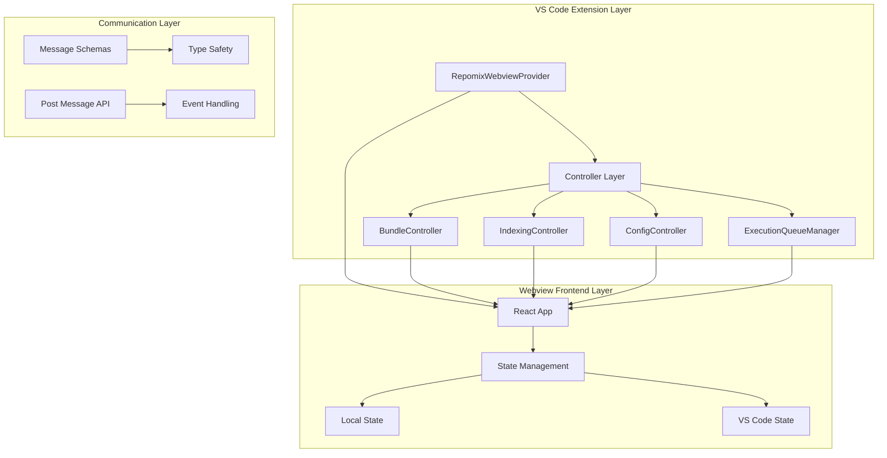
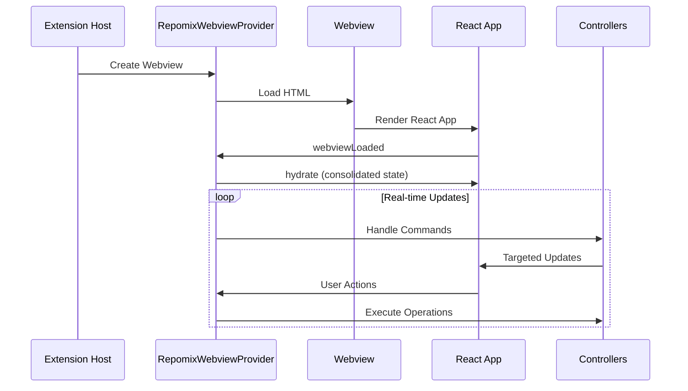
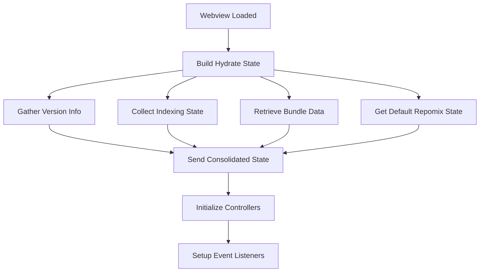
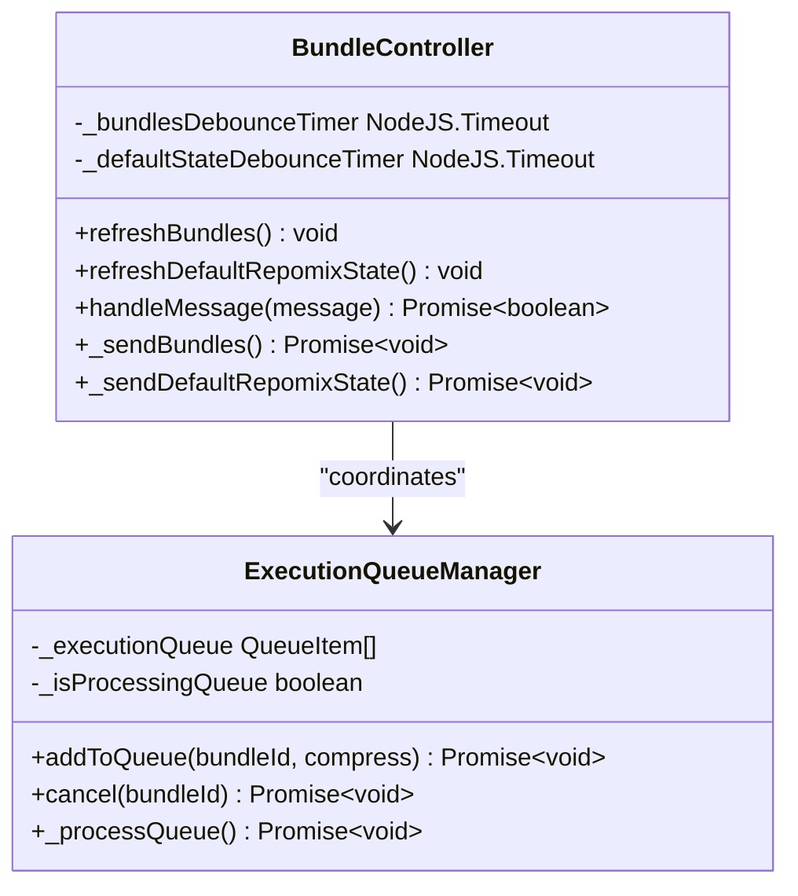
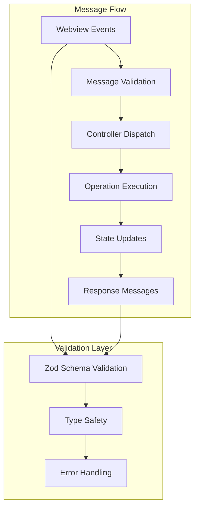

# Webview State Consolidation

<cite>
**Referenced Files in This Document**
- [index.tsx](file://src/webview/index.tsx)
- [App.tsx](file://src/webview/App.tsx)
- [RepomixWebviewProvider.ts](file://src/webview/RepomixWebviewProvider.ts)
- [types.ts](file://src/webview/types.ts)
- [messageSchemas.ts](file://src/webview/messageSchemas.ts)
- [utils.ts](file://src/webview/utils.ts)
- [BundleController.ts](file://src/webview/controllers/BundleController.ts)
- [ExecutionQueueManager.ts](file://src/webview/services/ExecutionQueueManager.ts)
- [SettingsTab.tsx](file://src/webview/components/SettingsTab.tsx)
- [BundleItem.tsx](file://src/webview/components/BundleItem.tsx)
</cite>

## Table of Contents
1. [Introduction](#introduction)
2. [Project Structure](#project-structure)
3. [Core Components](#core-components)
4. [Architecture Overview](#architecture-overview)
5. [Detailed Component Analysis](#detailed-component-analysis)
6. [State Consolidation Implementation](#state-consolidation-implementation)
7. [Message Flow and Communication](#message-flow-and-communication)
8. [Performance Considerations](#performance-considerations)
9. [Troubleshooting Guide](#troubleshooting-guide)
10. [Conclusion](#conclusion)

## Introduction

The Webview State Consolidation system represents a sophisticated approach to managing state synchronization between the VS Code extension's backend and the React-based webview frontend. This system addresses the challenge of maintaining consistent UI state across component boundaries while preventing race conditions and UI flickering that commonly occur in webview applications.

The consolidation mechanism centralizes all initial state into a single "hydrate" message that is transmitted to the webview upon loading. This approach eliminates the traditional pattern of multiple asynchronous state updates that could arrive out of order, resulting in a jarring user experience with partially loaded interfaces.

## Project Structure

The webview state consolidation system is organized around several key architectural layers:

**Diagram sources**
- [RepomixWebviewProvider.ts](file://src/webview/RepomixWebviewProvider.ts#L51-L125)
- [App.tsx](file://src/webview/App.tsx#L47-L158)

**Section sources**
- [RepomixWebviewProvider.ts](file://src/webview/RepomixWebviewProvider.ts#L1-L405)
- [App.tsx](file://src/webview/App.tsx#L1-L271)

## Core Components

The state consolidation system comprises several interconnected components that work together to maintain UI consistency:

### State Consolidation Architecture

The system implements a multi-layered state management approach:

1. **Initial State Consolidation**: All initial state is gathered and transmitted as a single message
2. **Real-time State Updates**: Incremental state changes are handled through targeted messages
3. **Persistent State Storage**: User preferences and selections are persisted through VS Code's state API
4. **Type-Safe Communication**: Strict message schemas ensure reliable inter-component communication

### Key State Types

The system manages several categories of state:

- **UI State**: Tab selection, component visibility, and user preferences
- **Execution State**: Bundle execution status, queue management, and progress tracking
- **Configuration State**: Vector database settings, embedding provider configurations, and API keys
- **Indexing State**: Repository indexing progress, statistics, and health indicators

**Section sources**
- [types.ts](file://src/webview/types.ts#L106-L113)
- [App.tsx](file://src/webview/App.tsx#L50-L74)

## Architecture Overview

The state consolidation architecture follows a unidirectional data flow pattern designed to prevent state inconsistencies:

**Diagram sources**
- [RepomixWebviewProvider.ts](file://src/webview/RepomixWebviewProvider.ts#L157-L179)
- [App.tsx](file://src/webview/App.tsx#L75-L158)

## Detailed Component Analysis

### RepomixWebviewProvider - State Consolidation Hub

The `RepomixWebviewProvider` serves as the central coordinator for state consolidation, implementing the `_buildHydrateState()` method that gathers all initial state from various subsystems.

#### Consolidation Strategy

The provider employs a comprehensive state gathering strategy that ensures no race conditions occur during webview initialization:

**Diagram sources**
- [RepomixWebviewProvider.ts](file://src/webview/RepomixWebviewProvider.ts#L290-L354)

#### State Composition

The consolidated state includes multiple domains:

- **Version Information**: Extension version for UI display and compatibility checks
- **Indexing State**: Current indexing progress, completion status, and repository statistics
- **Bundle Information**: Complete bundle metadata with file existence and statistics
- **Default Repomix State**: Output file path and existence status for default operations

**Section sources**
- [RepomixWebviewProvider.ts](file://src/webview/RepomixWebviewProvider.ts#L28-L48)
- [RepomixWebviewProvider.ts](file://src/webview/RepomixWebviewProvider.ts#L290-L354)

### React App - State Management Layer

The React application implements a hybrid state management approach combining local component state with VS Code persistent state:

#### Local State Management

The application maintains several categories of local state:

- **UI Navigation State**: Selected tab with automatic persistence
- **Bundle Execution State**: Per-bundle execution status tracking
- **Configuration State**: Vector database and embedding provider settings
- **Indexing State**: Repository statistics and progress indicators

#### State Persistence Mechanism

The application integrates with VS Code's state API through the `updateVsState` utility function, ensuring that user preferences persist across webview reloads and extension restarts.

**Section sources**
- [App.tsx](file://src/webview/App.tsx#L47-L158)
- [utils.ts](file://src/webview/utils.ts#L4-L7)

### Controller Layer - State Update Coordination

The controller system handles real-time state updates through a message-driven architecture:

#### Bundle Controller State Updates

The `BundleController` manages bundle-specific state updates with debouncing mechanisms to prevent excessive updates:

**Diagram sources**
- [BundleController.ts](file://src/webview/controllers/BundleController.ts#L67-L134)
- [ExecutionQueueManager.ts](file://src/webview/services/ExecutionQueueManager.ts#L26-L118)

**Section sources**
- [BundleController.ts](file://src/webview/controllers/BundleController.ts#L67-L134)
- [ExecutionQueueManager.ts](file://src/webview/services/ExecutionQueueManager.ts#L15-L133)

### Message Schema System - Type Safety

The message schema system provides compile-time type safety for all inter-component communications:

#### Schema Categories

The system defines distinct schema categories for different functional areas:

- **Execution Commands**: Bundle run, cancel, and copy operations
- **Configuration Management**: Vector DB settings, embedding providers, and API keys
- **Indexing Operations**: Repository indexing, search, and statistics
- **Utility Messages**: Version updates, notifications, and client information

**Section sources**
- [messageSchemas.ts](file://src/webview/messageSchemas.ts#L543-L630)

## State Consolidation Implementation

### Consolidation Process Flow

The state consolidation process follows a carefully orchestrated sequence to ensure optimal user experience:

**Diagram sources**
- [RepomixWebviewProvider.ts](file://src/webview/RepomixWebviewProvider.ts#L157-L179)
- [App.tsx](file://src/webview/App.tsx#L75-L158)

### State Update Strategies

The system employs different strategies for handling state updates based on their nature and frequency:

#### Immediate Updates
- Execution state changes (queued, running, idle)
- Real-time progress notifications
- User interaction feedback

#### Debounced Updates
- Bundle metadata refresh (300ms debounce)
- Default repomix state refresh (500ms debounce)
- Statistics calculations

#### One-time Consolidated Updates
- Initial state hydration
- Configuration state synchronization
- Indexing progress reporting

**Section sources**
- [BundleController.ts](file://src/webview/controllers/BundleController.ts#L67-L75)
- [App.tsx](file://src/webview/App.tsx#L101-L110)

## Message Flow and Communication

### Communication Architecture

The communication system implements a robust message-driven architecture with strict validation and error handling:

**Diagram sources**
- [RepomixWebviewProvider.ts](file://src/webview/RepomixWebviewProvider.ts#L137-L154)
- [messageSchemas.ts](file://src/webview/messageSchemas.ts#L543-L630)

### Message Lifecycle

Each message follows a standardized lifecycle:

1. **Message Reception**: Webview sends message to extension
2. **Schema Validation**: Message validated against appropriate schema
3. **Controller Dispatch**: Validated message dispatched to appropriate controller
4. **Operation Execution**: Controller executes requested operation
5. **State Update**: System state updated and reflected in UI
6. **Response Generation**: Controller generates appropriate response message

**Section sources**
- [RepomixWebviewProvider.ts](file://src/webview/RepomixWebviewProvider.ts#L225-L241)
- [messageSchemas.ts](file://src/webview/messageSchemas.ts#L1-L632)

## Performance Considerations

### Optimization Strategies

The state consolidation system implements several performance optimization strategies:

#### Debouncing Mechanisms
- Bundle refresh operations debounced by 300ms
- Default repomix state refresh debounced by 500ms
- Prevents excessive filesystem operations and UI re-renders

#### Lazy Loading Patterns
- Bundle statistics calculated only when needed
- File existence checks optimized with caching
- Watcher cleanup prevents memory leaks

#### Memory Management
- Automatic cleanup of file system watchers
- Proper disposal of event listeners
- Controlled state updates prevent memory accumulation

### Scalability Features

The system scales effectively with increasing numbers of bundles and files:

- **Batch Operations**: Multiple bundle updates processed in single transactions
- **Incremental Updates**: Only changed state is transmitted to webview
- **Efficient Watchers**: File system watchers optimized for large repositories

**Section sources**
- [BundleController.ts](file://src/webview/controllers/BundleController.ts#L17-L36)
- [BundleController.ts](file://src/webview/controllers/BundleController.ts#L251-L256)

## Troubleshooting Guide

### Common Issues and Solutions

#### State Synchronization Problems
- **Symptom**: UI shows inconsistent state after webview reload
- **Solution**: Verify that hydrate state is properly implemented and all state is included
- **Prevention**: Ensure all state sources are included in `_buildHydrateState()`

#### Message Validation Failures
- **Symptom**: Extension logs validation errors for webview messages
- **Solution**: Check message schema definitions and ensure proper message formatting
- **Prevention**: Use TypeScript interfaces and Zod schemas consistently

#### Performance Degradation
- **Symptom**: Slow UI updates or frequent re-renders
- **Solution**: Implement appropriate debouncing and optimize state update frequency
- **Prevention**: Monitor update frequencies and adjust debounce timers as needed

### Debugging Tools

The system includes comprehensive logging and debugging capabilities:

- **Console Logging**: Extensive logging throughout the state consolidation process
- **Message Tracing**: Detailed message flow tracking for debugging
- **State Inspection**: Tools for inspecting current state values and transitions

**Section sources**
- [RepomixWebviewProvider.ts](file://src/webview/RepomixWebviewProvider.ts#L130-L154)
- [App.tsx](file://src/webview/App.tsx#L78-L84)

## Conclusion

The Webview State Consolidation system represents a mature and robust approach to managing state in VS Code extensions. By centralizing initial state delivery and implementing careful state update strategies, the system achieves several key benefits:

### Key Achievements

1. **Elimination of Race Conditions**: Single consolidated state prevents UI flickering and inconsistent displays
2. **Improved User Experience**: Smooth loading and responsive interactions
3. **Maintainable Architecture**: Clear separation of concerns and type-safe communication
4. **Scalable Design**: Optimized for large repositories and numerous bundles

### Architectural Benefits

The consolidation approach provides a solid foundation for future enhancements while maintaining backward compatibility. The hybrid state management system (local + persistent) ensures both immediate responsiveness and long-term persistence of user preferences.

### Future Considerations

The system is well-positioned for future enhancements including:
- Enhanced real-time collaboration features
- Advanced caching strategies for improved performance
- Expanded state management for additional extension features
- Integration with VS Code's native state persistence mechanisms

This implementation demonstrates best practices for webview state management in complex VS Code extensions, providing a template for similar systems in other extension development scenarios.