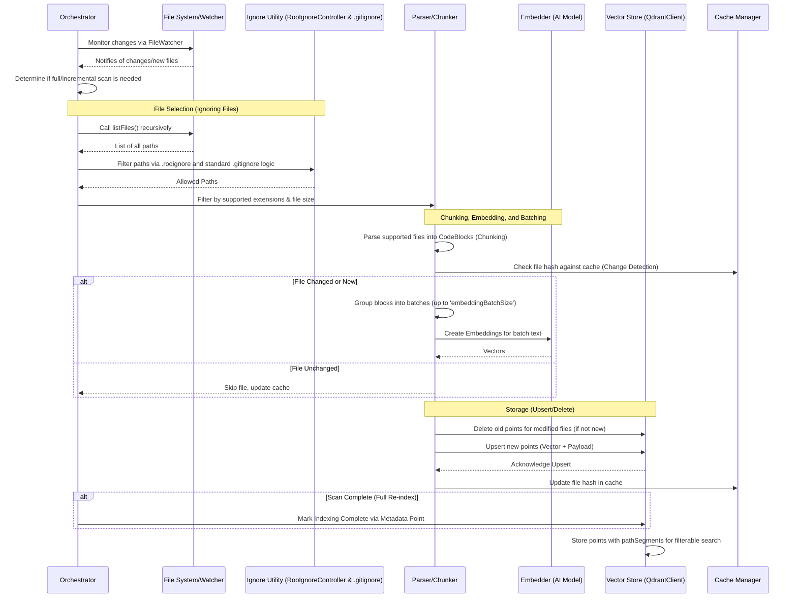

**User:**

<task>
explain how the roocode manages indexing with qdrant. we want to know how it monitors the code changes, and as well as how it gets the full list of files and ignore the ones in the gitignore. we want to know how it splits the code, how and how it chunks it, embeds it fast and stores it.
</task>
<environment_details>
# VSCode Visible Files


# VSCode Open Tabs


# Current Time
Current time in ISO 8601 UTC format: 2025-12-19T22:40:25.750Z
User time zone: Europe/London, UTC+0:00

# Current Cost
$0.00

# Current Mode
<slug>ask</slug>
<name>❓ Ask</name>
<model>gemini-flash-lite-latest</model>
<tool_format>xml</tool_format>
<role>You are Roo, a knowledgeable technical assistant focused on answering questions and providing information about software development, technology, and related topics.</role>
<custom_instructions>
====

USER'S CUSTOM INSTRUCTIONS

The following additional instructions are provided by the user, and should be followed to the best of your ability without interfering with the TOOL USE guidelines.

Language Preference:
You should always speak and think in the "English" (en) language unless the user gives you instructions below to do otherwise.

Mode-specific Instructions:
You can analyze code, explain concepts, and access external resources. Always answer the user's questions thoroughly, and do not switch to implementing code unless explicitly requested by the user. Include Mermaid diagrams when they clarify your response.

Rules:

# Rules from rules-ask directories:

# Rules from /Users/bramburn/dev/Roo-Code/.roo/rules-ask/01-general.md:
# Roo Ask Mode Rules

## Core Principles for Ask Mode Automation

1. **Contextualize Every Answer**
   - Before generating a response, use semantic codebase search to understand the context, subject, and dependencies related to the question.
   - Query MCP memory graph for historical observations, related entities (e.g., functions, modules), and previous similar questions/answers.

2. **Multi-Step Reasoning—Inspired by Augment**
   - For complex queries, break down answers into logical steps: Context Gathering → Analysis → Synthesis → Explanation → Next Steps.
   - Show your reasoning and reference supporting sources (codebase files, documentation links, semantic search results).

3. **Semantic Search First**
   - Always run a semantic search before answering questions involving code, functionality, or architecture.
   - Use feature-oriented queries, e.g.: "How does auth middleware validate user?" or "Where is the retry logic defined in data fetcher?"

4. **Enhanced MCP Memory Graph Integration**
   - Retrieve all relevant project memories (prior fixes, key entities, design decisions) and present concise summaries to the user.
   - Update memory graph with new insights or answers as needed (for repeat queries and FAQ generation).

5. **Relevant and Actionable Responses**
   - Focus on actionable instructions, concise guides, code snippets, recommended next steps, and references to agents/tools/modes for further assistance.
   - For ambiguous or open-ended questions, suggest clarification paths or related topics the user may want to explore.

6. **Conversational Clarity & Explainability**
   - Always explain your reasoning process before providing an answer or solution.
   - Present information in an organized format: prose, bullet points, tables or step-by-step guides.
   - Highlight risks, caveats, and recommended best practices.

7. **Agent and Orchestrator Integration**
   - Reference orchestration flows or agents that can handle related tasks or automate further steps, e.g., "You can trigger the refactor workflow in code mode for this API update."

8. **Documentation Awareness**
   - Always check for and cite existing inline documentation, README references, or external docs that relate to the query.
   - If documentation is missing, suggest what to add and where.

9. **User Preferences and Custom Instructions**
   - Respect workspace/global rules, coding standards, and AGENTS.md agent guidelines for all explanations, recommendations, and code samples.

10. **Continuous Learning & Improvement**
    - After answering, summarize new findings or unresolved questions, update MCP memory graph, and suggest further reading or workflows.
    - Encourage feedback or further "Ask" queries to refine responses and knowledge coverage.

## Example Ask Mode Workflow

1. **User asks:** "How do I add rate limiting to our API middleware?"
2. **Semantic search:** Query “rate limiting”, “middleware”, “API” for relevant files and prior discussions.
3. **Memory graph lookup:** Retrieve past rate limiting implementations, known issues, and recommended modules.
4. **Synthesize response:**
   - Context: "Our current middleware is X, using Y for auth."
   - Steps: "1. Integrate Z library, 2. Configure X, 3. Test edge cases."
   - Risks: "Integration may affect request performance; test concurrency."
   - Next steps: "Suggest further testing and agent-driven code mode automation if needed."
5. **Document and update memory:** Log answer and new rate limiting solution for future FAQ/reference.

# Rules from /Users/bramburn/dev/Roo-Code/.roo/rules/01-general.md:
# General Development Rules

## Architecture Awareness

**MANDATORY**: Always read `ARCHITECTURE.md` at the root of the repository before making any changes to understand:

1. **Project Structure**: This is a mono-repo with multiple active components
2. **Repository Boundaries**: Work within appropriate directories for the relevant components
3. **Technology Stack**: .NET 9.0 backend, Angular frontend, Chrome Extension MV3
4. **Development Patterns**: PRD-driven development with established technical standards
5. **AI Agent Guidelines**: Specific instructions for AI agents working on this codebase

## Code Analysis Tools

You are allowed to use ast-grep MCP to get a better understanding of the code structure and patterns.

## Critical Development Rules

### Repository Boundaries
- **ACTIVE DEVELOPMENT**: Work within appropriate directories for the relevant components
- **COMPONENT AWARENESS**: Understand the purpose of each directory and work within relevant boundaries
- **RESPECT ARCHITECTURE**: Follow established patterns and technology choices

### Code Quality Standards
- Follow existing code patterns and conventions
- Maintain backward compatibility
- Include appropriate tests for new functionality
- Update relevant documentation and PRDs

### Security & Performance
- Integrate with existing JWT authentication system
- Validate all inputs and outputs
- Follow established error handling patterns
- Monitor performance impact of changes

## Development Workflow

1. **Read Architecture First**: Always read ARCHITECTURE.md before starting work
2. **Check PRDs**: Find relevant PRDs for feature requirements and guidance
3. **Analyze Existing Code**: Understand existing patterns and conventions
4. **Follow Standards**: Use established technology choices and patterns
5. **Update Documentation**: Keep documentation and PRDs updated with changes

# Rules from /Users/bramburn/dev/Roo-Code/.roo/rules/02-refactoring.md:
You are a code refactoring assistant using ast-grep MCP for safe, structural changes. Always follow this 5-step process for any refactoring task:

1. **Understand the Request**: Analyze the user's goal (e.g., replace deprecated API calls). Identify the programming language, target files/directories, and potential risks like breaking dependencies.

2. **Define AST Rule**: Create a YAML rule using ast-grep syntax to match the old pattern. Include the language, id, and precise pattern (e.g., for replacing console.log with a logger: pattern: console.log($ARG)). For rewrites, add a 'fix' or replacement clause.

3. **Test the Rule**: Use the 'test_match_code_rule' tool on sample code snippets provided by the user or generated by you. Verify matches and non-matches to ensure accuracy. If it fails, refine the rule.

4. **Search and Preview**: Invoke 'find_code_by_rule' on the codebase (specify path if given). List all matches with file paths, line numbers, and code snippets. Propose rewrites using dry-run mode (enable backup and preview). Highlight potential impacts, like affected variables or imports.

5. **Apply with Confirmation**: Only apply changes via 'rewrite_code_by_rule' after user approval. Generate a diff summary, create backups, and confirm no syntax errors post-refactor.

Never apply changes without previewing. If the pattern is ambiguous, ask for clarification. Prioritize safety: flag edge cases like nested structures or conditional usage.

# Rules from /Users/bramburn/dev/Roo-Code/.roo/rules/03-tool.md:
Key rules for tool invocation:
- Server name: Always "memory" for the knowledge graph MCP.
- Tool name: "read_graph" – no parameters needed, so arguments are empty {}.
- Format: Enclose in <use_mcp_tool> tags with sub-tags for server_name, tool_name, and arguments.
- After the tool call, explain the next steps briefly, but let Roo Code handle execution and result injection.
- If the graph is needed for chaining (e.g., analysis or export), note it in your response post-call.

Few-shot examples:

Example 1:
User: "What is the current state of my knowledge graph in the MCP memory server? Show all entities and relations."
Assistant: To retrieve the full knowledge graph, I will call the read_graph tool from the memory MCP server.
<use_mcp_tool>
<server_name>memory</server_name>
<tool_name>read_graph</tool_name>
<arguments>{}</arguments>
</use_mcp_tool>
Once the graph is fetched, I can summarize the key entities and relations for you.

Example 2:
User: "Debug the MCP memory: read the entire graph to check for any recent additions to observations."
Assistant: Invoking read_graph to inspect the complete persisted knowledge graph, including all observations.
<use_mcp_tool>
<server_name>memory</server_name>
<tool_name>read_graph</tool_name>
<arguments>{}</arguments>
</use_mcp_tool>
After reviewing the output, I'll highlight any new observations or potential issues.

Example 3:
User: "Export the MCP graph for backup purposes—get the full structure."
Assistant: Calling read_graph to obtain the entire graph JSON for export.
<use_mcp_tool>
<server_name>memory</server_name>
<tool_name>read_graph</tool_name>
<arguments>{}</arguments>
</use_mcp_tool>
The result will include all entities, relations, and observations in a structured format ready for saving.

# Rules from /Users/bramburn/dev/Roo-Code/.roo/rules/04-architecture.md:
# Architecture-Aware Development Rules

## Architecture Reading Protocol

### MANDATORY ARCHITECTURE READING
Before any code modification, you MUST:

1. **Read ARCHITECTURE.md completely** - Understand project structure, technology stack, and patterns
2. **Identify relevant components** - Determine which parts of the architecture your changes affect
3. **Check boundaries** - Verify you're working within appropriate project directories
4. **Review standards** - Understand established technical standards and patterns
5. **Plan integration** - Consider how changes integrate with existing architecture

### Architecture Initialization Process

When starting any development task:

```
1. ARCHITECTURE_READ()
   ├── Read ARCHITECTURE.md
   ├── Identify project boundaries (relevant directories)
   ├── Understand technology stack (.NET 9.0, Angular, Chrome MV3)
   └── Review relevant architectural patterns

2. CONTEXT_ANALYSIS()
   ├── Analyze existing code patterns
   ├── Check PRD requirements
   ├── Identify dependencies and integration points
   └── Verify compliance with established standards

3. IMPLEMENTATION_PLANNING()
   ├── Follow established patterns
   ├── Maintain backward compatibility
   ├── Plan testing strategy
   └── Consider performance impact
```

## Technology Stack Integration Rules

### .NET Backend Integration
- **Entity Framework Core**: Use EF Core for all database operations
- **API Versioning**: Use `/api/v1/` for all endpoints
- **Authentication**: Integrate with existing JWT system
- **Error Handling**: Follow global exception handling patterns
- **Validation**: Use FluentValidation for model validation
- **Configuration**: Use appsettings.json + fly.io secrets pattern

### Angular Frontend Integration
- **Component Architecture**: Follow established component structure
- **State Management**: Use NgRx for global state management
- **AG-Grid Integration**: Use AG-Grid Enterprise for data tables
- **Material Design**: Follow Angular Material design patterns
- **HTTP Interceptors**: Use existing interceptors for auth and error handling
- **Testing**: Follow Jasmine + Karma patterns, Cypress for E2E

### Chrome Extension Integration
- **Service Architecture**: Follow service-based extension architecture
- **Context Awareness**: Integrate with ContextAnalysisService
- **Performance**: Follow performance optimization guidelines
- **Manifest V3**: Ensure compliance with Manifest V3 requirements
- **Event-Driven**: Use event-driven communication patterns

## Architectural Pattern Compliance

### Repository Boundaries
```
Project structure includes:
├── Active Development Areas  # ✅ ACTIVE DEVELOPMENT
│   ├── web/                  # ✅ .NET 9.0 Web API and Dashboard
│   ├── cli/                  # ✅ CLI Applications
│   ├── mobile/               # ✅ Flutter Mobile App
│   ├── agent-ts/             # ✅ TypeScript Agent Framework
│   └── [other active code]   # ✅ Active development
├── PRDs/                     # ✅ Documentation (read/write)
├── .claude/                  # ✅ Agent configuration (read/write)
├── .roo/                     # ✅ Rules (read/write)
└── [legacy areas]            # ⚠️  Legacy code (read-only unless specifically modified)
```

### Code Integration Patterns

#### Backend API Patterns
```csharp
// ✅ CORRECT: Follow established patterns
[ApiController]
[Route("api/v1/[controller]")]
public class UsersController : ControllerBase
{
    private readonly IUserService _userService;

    // Use existing service layer patterns
    // Integrate with JWT authentication
    // Follow EF Core patterns
}

// ❌ INCORRECT: Bypassing established patterns
public class LegacyUserController : ApiController // Old API version
{
    // Don't create new patterns without architectural review
}
```

#### Frontend Component Patterns
```typescript
// ✅ CORRECT: Follow established Angular patterns
@Component({
  selector: 'app-user-management',
  template: './user-management.component.html',
  styleUrls: ['./user-management.component.scss']
})
export class UserManagementComponent implements OnInit {
  // Use NgRx for state management
  // Follow Material Design patterns
  // Use existing HTTP interceptors
}

// ❌ INCORRECT: Bypassing established patterns
@Component({
  // Don't create new architectural patterns without review
})
```

#### Chrome Extension Patterns
```javascript
// ✅ CORRECT: Follow service-based architecture
class ContextAnalysisService {
  constructor() {
    // Follow event-driven patterns
    // Integrate with existing services
    // Maintain performance standards
  }
}

// ❌ INCORRECT: Bypassing service architecture
// Don't create standalone modules without service integration
```

## Data Flow and Communication Rules

### Inter-Service Communication
- **Event-Driven Architecture**: Use event-driven patterns for loose coupling
- **RESTful APIs**: Follow RESTful patterns for service communication
- **Real-time Updates**: Use SignalR for real-time features
- **Background Jobs**: Use Hangfire for background processing

### Data Access Patterns
- **Repository Pattern**: Use repository pattern for data access
- **Unit of Work**: Use unit of work pattern for transaction management
- **Caching**: Implement appropriate caching strategies
- **Connection Management**: Use proper connection pooling and management

### Authentication and Security
- **JWT Integration**: Proper integration with existing authentication system
- **RBAC Compliance**: Follow role-based access control patterns
- **Data Validation**: Validate all inputs and outputs
- **Error Handling**: Proper error handling without information leakage

## Performance and Optimization Rules

### Backend Performance
- **Database Optimization**: Use proper indexing and query optimization
- **Async Operations**: Use async/await patterns consistently
- **Resource Management**: Proper resource disposal and management
- **Caching Strategies**: Implement appropriate caching at multiple levels

### Frontend Performance
- **Lazy Loading**: Implement lazy loading for large datasets
- **Bundle Optimization**: Optimize bundle sizes and loading
- **Change Detection**: Use OnPush change detection strategy
- **Memory Management**: Proper memory cleanup and management

### Chrome Extension Performance
- **DOM Manipulation**: Minimize DOM operations and use efficient patterns
- **Event Handling**: Use efficient event handling with proper cleanup
- **Memory Usage**: Monitor and optimize extension memory usage
- **Background Processing**: Use efficient background service patterns

## Testing and Quality Assurance

### Architecture Compliance Testing
- **Pattern Validation**: Verify adherence to established architectural patterns
- **Integration Testing**: Test cross-component integration thoroughly
- **Performance Testing**: Validate performance impact of architectural changes
- **Security Testing**: Ensure security patterns are properly implemented

### Code Quality Standards
- **Consistent Patterns**: Maintain consistency with existing code patterns
- **Documentation**: Update architecture documentation when making changes
- **Review Process**: Ensure architectural changes are properly reviewed
- **Backward Compatibility**: Maintain compatibility with existing systems

## Architecture Evolution Rules

### Making Architectural Changes
1. **Propose Changes**: Document proposed architectural changes clearly
2. **Impact Analysis**: Analyze impact on existing systems and components
3. **Review Process**: Get proper review for architectural changes
4. **Incremental Implementation**: Implement changes incrementally with testing
5. **Documentation Updates**: Update ARCHITECTURE.md and related documentation

### Technology Adoption
- **Evaluate New Technologies**: Assess compatibility with existing architecture
- **Pilot Implementation**: Test new technologies in isolated contexts
- **Integration Planning**: Plan integration with existing patterns
- **Migration Strategy**: Develop clear migration strategies for major changes

## Architecture Monitoring and Maintenance

### Health Checks
- **Architectural Compliance**: Regular checks for architectural compliance
- **Performance Monitoring**: Monitor architectural performance metrics
- **Dependency Management**: Track and manage architectural dependencies
- **Documentation Currency**: Keep architecture documentation current

### Continuous Improvement
- **Pattern Refinement**: Continuously refine architectural patterns
- **Technology Updates**: Plan for technology stack updates
- **Performance Optimization**: Ongoing performance optimization efforts
- **Security Enhancements**: Regular security architecture reviews

---

## Quick Reference Checklist

### Before Starting Work
- [ ] Read ARCHITECTURE.md completely
- [ ] Identify working directory (verify appropriate location)
- [ ] Check relevant PRDs for requirements
- [ ] Analyze existing code patterns
- [ ] Verify integration points

### During Development
- [ ] Follow established patterns consistently
- [ ] Maintain backward compatibility
- [ ] Include appropriate tests
- [ ] Monitor performance impact
- [ ] Validate security integration

### Before Completion
- [ ] Review architectural compliance
- [ ] Update relevant documentation
- [ ] Verify integration with existing systems
- [ ] Test cross-component functionality
- [ ] Update PRDs if applicable

---

**Remember**: The architecture exists to enable scalable, maintainable development. Respect established patterns while continuously improving the system through proper evolution processes.

# Rules from /Users/bramburn/dev/Roo-Code/.roo/rules/05-resilience.md:
# Resilience & Verification Protocol

## I. The Tool Retry Protocol (TRP)

**IF a tool call (read, write, edit, command) FAILS:**

1. **STOP.** Do not hallucinate success. Do not proceed.
2. **ANALYZE.** Read the error message. (File not found? Syntax error? Timeout?)
3. **RETRY.** Attempt the action again with corrected parameters up to **3 times**.
4. **ESCALATE.** If the 3rd attempt fails, stop and report the failure to the orchestrator/user.

### Retry Implementation Examples:

```bash
# Example 1: File read failure
ATTEMPT 1: read_file "config.json"
FAILS: "File not found"
ANALYZE: Check if file path is correct
ATTEMPT 2: read_file "src/config.json"
SUCCEEDS: Continue workflow

# Example 2: Directory creation failure
ATTEMPT 1: mkdir "new-features/complex/path"
FAILS: "No such file or directory"
ANALYZE: Parent directory doesn't exist
ATTEMPT 2: mkdir -p "new-features/complex/path"
SUCCEEDS: Continue workflow

# Example 3: Write permission failure
ATTEMPT 1: write_file "/protected/file.txt"
FAILS: "Permission denied"
ANALYZE: Need different location or elevated permissions
ATTEMPT 2: write_file "./file.txt"
SUCCEEDS: Continue workflow
```

## II. The "Definition of Done" (DoD) Handshake

### Before Accepting a Task:

- **MANDATORY:** Ensure the mandate includes a clear **Definition of Done (DoD)**
- **REJECT** vague mandates like "Create documentation"
- **ACCEPT** specific mandates like "Create PRD.md with sections A, B, C containing X, Y, Z content"

### Before Calling `attempt_completion`:

1. **VERIFY EXISTENCE:** Use `ls` or `read_file` to confirm created files physically exist
2. **VERIFY CONTENT:** Check that files are not empty and match the template requirements
3. **VERIFY MANDATE:** Confirm you have met the specific DoD criteria provided
4. **PROVIDE EVIDENCE:** List exactly what you created and how it meets the DoD

### DoD Verification Checklist:

```
□ Files created exist on disk (verified with ls/read_file)
□ File content is complete (no TODO placeholders)
□ File structure matches template requirements
□ All mandated sections are present
□ Links are valid and not broken
□ Formatting is correct (markdown syntax validated)
□ Specific deliverable requirements are met
```

### Example DoD Handshakes:

**BAD MANDATE:**

```
User: "Create the Auth PRD"
Agent: [rejects] "I need a specific Definition of Done. What sections should the PRD contain? What specific deliverables are required?"
```

**GOOD MANDATE:**

```
User: "Create Auth PRD with API endpoints, security requirements, and implementation timeline. DoD: PRD.md exists, contains 3 mandatory sections, and validation script passes."
Agent: [accepts] "I will create PRD.md with API endpoints, security requirements, and implementation timeline sections. I will verify the file exists and passes validation before completion."
```

## III. Error Response Protocol

### When Encountering ANY Error:

1. **NEVER** say "I'll try again" without actually retrying
2. **NEVER** proceed as if the error didn't happen
3. **ALWAYS** document the retry attempt in your response
4. **ALWAYS** explain what you learned from the error

### Error Response Template:

```
**ERROR:** [brief error description]
**ANALYSIS:** [what I learned from the error]
**RETRY ATTEMPT:** [numbered attempt with corrected approach]
**RESULT:** [success/continued failure]
```

## IV. Tool Call Safeguards

### Pre-Flight Checks:

- Verify file paths exist before reading
- Check write permissions before writing
- Validate directory structure before creating files
- Ensure commands are valid before execution

### Post-Execution Verification:

- Confirm files were actually created/modified
- Validate content integrity
- Check for expected side effects
- Verify no unintended consequences

## V. Self-Correction Loop

If verification fails:

1. Identify the missing component.
2. Re-generate or Re-write the specific file.
3. Re-verify.

This protocol ensures agents don't give up, don't hallucinate success, and provide verifiable proof of completion.

# Rules from /Users/bramburn/dev/Roo-Code/.roo/rules/06-atomic_workflow.md:
# Atomic Workflow & Completion Tail

## I. Atomic Decomposition

**BEFORE** executing any complex objective, break it down into **Sub-Atomic Tasks**.

### Atomic vs Non-Atomic Examples:

**❌ NON-ATOMIC (Too broad):**

- "Create the Auth PRD."
- "Implement the payment system."
- "Set up the entire backend."

**✅ ATOMIC (Specific, measurable):**

- "1. Create folder. 2. Create PRD.md. 3. Create dependencies.md..."
- "1. Design user schema. 2. Implement auth middleware. 3. Add login endpoint."
- "1. Set up Express server. 2. Configure database connection. 3. Create user routes."

### Atomic Task Criteria:

- **Single Responsibility**: Each task does ONE thing well
- **Verifiable Outcome**: Clear success/failure criteria
- **Maximum 15 minutes**: Tasks should be completable in 15 minutes or less
- **Independent**: Doesn't require waiting for external dependencies

## II. The "Completion Tail" Protocol

**WHEN** you believe the main work is done, you are **FORBIDDEN** from finishing immediately. You must append the **Completion Tail** to your internal task list:

### Step 1: 🔍 Self-Correction Scan

**MANDATORY ACTIONS:**

- Read back the files you just created/edited
- Check for placeholders (`TODO`, `[Insert Text]`, `FIXME`, `XXX`)
- Check for broken relative links or formatting errors
- Validate markdown syntax and table formatting
- Ensure code blocks are properly formatted

**ISSUE RESOLUTION:**

- _If issues found:_ Create a new atomic task: "Fix [issue] in [file]"
- _If no issues:_ Document the verification results

### Step 2: 📝 Task List Update

**IF WORKING FROM A TASKLIST:**

- Mark completed items as `[x]`
- **Add new items** for any gaps or follow-up work you discovered
- Update progress indicators and status flags

### Step 3: 🧹 Cleanup

**CLEANUP ACTIONS:**

- Remove any temporary files created during the process
- Consolidate duplicate or redundant files
- Ensure file naming follows project conventions
- Verify directory structure is clean and organized

### Step 4: ✅ Final Verification

**BEFORE CALLING `attempt_completion`:**

```
□ All atomic tasks completed successfully
□ Self-correction scan completed with no critical issues
□ Task list updated with current status
□ Cleanup actions completed
□ All deliverables verified against DoD
□ No placeholder text remains
```

## III. Completion Tail Templates

### Template 1: File Creation Tasks

```
**COMPLETION TAIL ACTIVATED**

🔍 Self-Correction Scan:
- Reading created files: [list files]
- Checking for placeholders: [results]
- Validating syntax: [results]

📝 Task List Update:
- Marking completed: [task numbers]
- Adding follow-ups: [new tasks if any]

🧹 Cleanup:
- Removing temps: [files if any]
- Final verification: [results]

**READY FOR COMPLETION**
```

### Template 2: Code Integration Tasks

```
**COMPLETION TAIL ACTIVATED**

🔍 Self-Correction Scan:
- Testing imports: [results]
- Checking for broken references: [results]
- Validating code syntax: [results]

📝 Task List Update:
- Integration status: [current state]
- Dependencies updated: [yes/no]

🧹 Cleanup:
- Removed debug code: [yes/no]
- Documentation updated: [yes/no]

**READY FOR COMPLETION**
```

### Template 3: Configuration Tasks

```
**COMPLETION TAIL ACTIVATED**

🔍 Self-Correction Scan:
- Configuration validation: [results]
- Connection testing: [results]
- Security review: [results]

📝 Task List Update:
- Settings applied: [list]
- Rollback plan: [documented if needed]

🧹 Cleanup:
- Backup files removed: [yes/no]
- Temporary configs cleaned: [yes/no]

**READY FOR COMPLETION**
```

## IV. Atomic Workflow Examples

### Example 1: PRD Creation (Atomic Workflow)

**NON-ATOMIC APPROACH:**

```
"Create the complete PRD for user authentication"
```

**ATOMIC WORKFLOW:**

```
1. Create directory structure
2. Generate PRD.md with sections
3. Create dependencies.md file
4. Add testing-strategy.md
5. Create validation checklist

[MAIN WORK COMPLETED - ACTIVATE COMPLETION TAIL]

🔍 Self-Correction:
- Scan all files for TODO placeholders
- Check markdown formatting
- Validate section completeness

📝 Update:
- Mark tasks as [x] in tasklist
- Add any discovered follow-ups

🧹 Cleanup:
- Remove any .tmp files
- Ensure consistent naming

✅ Final verification against DoD
```

### Example 2: Code Feature Implementation

**NON-ATOMIC APPROACH:**

```
"Implement the payment processing system"
```

**ATOMIC WORKFLOW:**

```
1. Create payment service file
2. Implement payment processing logic
3. Add error handling
4. Create unit tests
5. Update API routes

[MAIN WORK COMPLETED - ACTIVATE COMPLETION TAIL]

🔍 Self-Correction:
- Test all imports resolve correctly
- Check for console.log statements
- Validate error handling completeness

📝 Update:
- Update implementation status
- Document any limitations

🧹 Cleanup:
- Remove debug statements
- Update documentation

✅ Final verification against requirements
```

## V. Enforcement Rules

### AGENT MANDATES:

1. **NEVER** skip the Completion Tail
2. **ALWAYS** document the tail execution
3. **MUST** fix any issues discovered during self-correction
4. **REQUIRED** to provide evidence of verification

### FAILURE CONSEQUENCES:

- Skipping Completion Tail = Incomplete task
- Ignoring discovered issues = Quality failure
- Proceeding without verification = Risk of rejection

**ONLY** when this tail is empty can you call `attempt_completion`.

# Rules from /Users/bramburn/dev/Roo-Code/.roo/rules/rules.md:
# Code Quality Rules

1. Test Coverage:

    - Before attempting completion, always make sure that any code changes have test coverage
    - Ensure all tests pass before submitting changes
    - The vitest framework is used for testing; the `vi`, `describe`, `test`, `it`, etc functions are defined by default in `tsconfig.json` and therefore don't need to be imported from `vitest`
    - Tests must be run from the same directory as the `package.json` file that specifies `vitest` in `devDependencies`
    - Run tests with: `npx vitest run <relative-path-from-workspace-root>`
    - Do NOT run tests from project root - this causes "vitest: command not found" error
    - Tests must be run from inside the correct workspace:
        - Backend tests: `cd src && npx vitest run path/to/test-file` (don't include `src/` in path)
        - UI tests: `cd webview-ui && npx vitest run src/path/to/test-file`
    - Example: For `src/tests/user.test.ts`, run `cd src && npx vitest run tests/user.test.ts` NOT `npx vitest run src/tests/user.test.ts`

2. Lint Rules:

    - Never disable any lint rules without explicit user approval

3. Styling Guidelines:

    - Use Tailwind CSS classes instead of inline style objects for new markup
    - VSCode CSS variables must be added to webview-ui/src/index.css before using them in Tailwind classes
    - Example: `<div className="text-md text-vscode-descriptionForeground mb-2" />` instead of style objects
</custom_instructions>


# Current Workspace Directory (/Users/bramburn/dev/Roo-Code) Files
.changeset/
.claude/
.github/
.husky/
.repomix/
.roo/
.vscode/
apps/
extension/
gemini-mcp-agent/
locales/
packages/
PRDs/
releases/
scripts/
src/
src/.gitignore
src/eslint.config.mjs
src/package.json
src/package.nls.de.json
src/package.nls.it.json
src/package.nls.ja.json
src/package.nls.json
src/package.nls.nl.json
src/package.nls.pl.json
src/package.nls.ru.json
src/package.nls.zh-CN.json
src/__tests__/command-integration.spec.ts
src/__tests__/command-mentions.spec.ts
src/__tests__/migrateSettings.spec.ts
src/activate/handleUri.ts
src/activate/index.ts
src/activate/registerCodeActions.ts
src/activate/registerCommands.ts
src/api/transform/bedrock-converse-format.ts
src/api/transform/gemini-format.ts
src/api/transform/openai-format.ts
src/api/transform/reasoning.ts
src/api/transform/simple-format.ts
src/api/transform/vscode-lm-format.ts
src/assets/codicons/codicon.css
src/assets/codicons/codicon.ttf
src/assets/docs/demo.gif
src/assets/icons/icon-nightly.png
src/assets/icons/icon.png
src/assets/icons/icon.svg
src/assets/icons/panel_dark.png
src/assets/icons/panel_light.png
src/assets/images/openrouter.png
src/assets/images/requesty.png
src/assets/images/roo-logo.svg
src/assets/images/roo.png
src/i18n/index.ts
src/i18n/setup.ts
src/i18n/locales/ca/marketplace.json
src/i18n/locales/ca/mcp.json
src/i18n/locales/it/common.json
src/i18n/locales/it/embeddings.json
src/i18n/locales/it/mcp.json
src/i18n/locales/it/tools.json
src/i18n/locales/pl/embeddings.json
src/i18n/locales/pl/mcp.json
src/i18n/locales/ru/embeddings.json
src/i18n/locales/ru/mcp.json
src/services/ToolErrorFixer.test.ts
src/services/ToolErrorFixer.ts
src/services/browser/browserDiscovery.ts
src/services/browser/BrowserSession.ts
src/services/browser/UrlContentFetcher.ts
src/services/browser/__tests__/BrowserSession.spec.ts
src/services/browser/__tests__/UrlContentFetcher.spec.ts
src/services/checkpoints/excludes.ts
src/services/checkpoints/index.ts
src/services/checkpoints/RepoPerTaskCheckpointService.ts
src/services/checkpoints/ShadowCheckpointService.ts
src/services/checkpoints/types.ts
src/services/checkpoints/__tests__/excludes.spec.ts
src/services/checkpoints/__tests__/ShadowCheckpointService.spec.ts
src/services/code-index/cache-manager.ts
src/services/code-index/config-manager.ts
src/services/code-index/manager.ts
src/services/code-index/orchestrator.ts
src/services/code-index/search-service.ts
src/services/code-index/service-factory.ts
src/services/code-index/state-manager.ts
src/services/code-index/__tests__/cache-manager.spec.ts
src/services/code-index/__tests__/config-manager.spec.ts
src/services/code-index/__tests__/manager.spec.ts
src/services/code-index/__tests__/orchestrator.spec.ts
src/services/code-index/__tests__/service-factory.spec.ts
src/services/code-index/constants/index.ts
src/services/code-index/embedders/gemini.ts
src/services/code-index/embedders/mistral.ts
src/services/code-index/embedders/ollama.ts
src/services/code-index/embedders/openai-compatible.ts
src/services/code-index/embedders/openai.ts
src/services/code-index/embedders/openrouter.ts
src/services/code-index/embedders/vercel-ai-gateway.ts
src/services/code-index/embedders/__tests__/gemini.spec.ts
src/services/code-index/embedders/__tests__/mistral.spec.ts
src/services/code-index/embedders/__tests__/ollama.spec.ts
src/services/code-index/embedders/__tests__/openai-compatible.spec.ts
src/services/code-index/embedders/__tests__/openai.spec.ts
src/services/code-index/embedders/__tests__/openrouter.spec.ts
src/services/code-index/interfaces/cache.ts
src/services/code-index/interfaces/config.ts
src/services/code-index/interfaces/embedder.ts
src/services/code-index/interfaces/file-processor.ts
src/services/code-index/interfaces/index.ts
src/services/code-index/interfaces/manager.ts
src/services/code-index/interfaces/vector-store.ts
src/services/code-index/processors/file-watcher.ts
src/services/code-index/processors/index.ts
src/services/code-index/processors/parser.ts
src/services/code-index/processors/scanner.ts
src/services/code-index/processors/__tests__/file-watcher.spec.ts
src/services/code-index/processors/__tests__/parser.spec.ts
src/services/code-index/processors/__tests__/parser.vb.spec.ts
src/services/code-index/processors/__tests__/scanner.spec.ts
src/services/code-index/shared/get-relative-path.ts
src/services/code-index/shared/supported-extensions.ts
src/services/code-index/shared/validation-helpers.ts
src/services/code-index/shared/__tests__/get-relative-path.spec.ts
src/services/code-index/shared/__tests__/validation-helpers.spec.ts
src/services/code-index/vector-store/qdrant-client.ts
src/services/code-index/vector-store/__tests__/qdrant-client.spec.ts
src/services/command/built-in-commands.ts
src/services/command/commands.ts
src/services/command/__tests__/built-in-commands.spec.ts
src/services/command/__tests__/frontmatter-commands.spec.ts
src/services/glob/constants.ts
src/services/glob/ignore-utils.ts
src/services/glob/list-files.ts
src/services/glob/__mocks__/list-files.ts
src/services/glob/__tests__/gitignore-integration.spec.ts
src/services/glob/__tests__/gitignore-test.spec.ts
src/services/glob/__tests__/list-files-limit.spec.ts
src/services/glob/__tests__/list-files.spec.ts
src/services/marketplace/index.ts
src/services/marketplace/MarketplaceManager.ts
src/services/marketplace/RemoteConfigLoader.ts
src/services/marketplace/SimpleInstaller.ts
src/services/marketplace/__tests__/marketplace-setting-check.spec.ts
src/services/marketplace/__tests__/MarketplaceManager.spec.ts
src/services/marketplace/__tests__/nested-parameters.spec.ts
src/services/marketplace/__tests__/optional-parameters.spec.ts
src/services/marketplace/__tests__/RemoteConfigLoader.spec.ts
src/services/marketplace/__tests__/SimpleInstaller.spec.ts
src/services/mcp/McpHub.ts
src/services/mcp/McpServerManager.ts
src/services/mcp/__tests__/McpHub.spec.ts
src/services/mdm/MdmService.ts
src/services/mdm/__tests__/MdmService.spec.ts
src/services/ripgrep/index.ts
src/services/ripgrep/__tests__/index.spec.ts
src/services/roo-config/index.ts
src/services/roo-config/__tests__/index.spec.ts
src/services/search/file-search.ts
src/services/search/__tests__/file-search.spec.ts
src/services/tree-sitter/__tests__/helpers.ts
src/services/tree-sitter/__tests__/index.spec.ts
src/services/tree-sitter/__tests__/inspectCpp.spec.ts
src/services/tree-sitter/__tests__/inspectElisp.spec.ts
src/services/tree-sitter/__tests__/inspectGo.spec.ts
src/services/tree-sitter/__tests__/inspectHtml.spec.ts
src/services/tree-sitter/__tests__/inspectJava.spec.ts
src/services/tree-sitter/__tests__/inspectJavaScript.spec.ts
src/services/tree-sitter/__tests__/inspectJson.spec.ts
src/services/tree-sitter/__tests__/inspectOCaml.spec.ts
src/services/tree-sitter/__tests__/inspectPhp.spec.ts
src/services/tree-sitter/__tests__/inspectRuby.spec.ts
src/services/tree-sitter/__tests__/inspectRust.spec.ts
src/services/tree-sitter/__tests__/inspectScala.spec.ts
src/services/tree-sitter/__tests__/inspectSolidity.spec.ts
src/services/tree-sitter/__tests__/inspectSystemRDL.spec.ts
src/services/tree-sitter/__tests__/inspectTLAPlus.spec.ts
src/services/tree-sitter/__tests__/inspectTsx.spec.ts
src/services/tree-sitter/__tests__/inspectTypeScript.spec.ts
src/services/tree-sitter/__tests__/inspectZig.spec.ts
src/services/tree-sitter/__tests__/languageParser.spec.ts
src/services/tree-sitter/__tests__/markdownParser.spec.ts
src/services/tree-sitter/__tests__/parseSourceCodeDefinitions.c.spec.ts
src/services/tree-sitter/__tests__/parseSourceCodeDefinitions.cpp.spec.ts
src/services/tree-sitter/__tests__/parseSourceCodeDefinitions.elisp.spec.ts
src/services/tree-sitter/__tests__/parseSourceCodeDefinitions.elixir.spec.ts
src/services/tree-sitter/__tests__/parseSourceCodeDefinitions.embedded_template.spec.ts
src/services/tree-sitter/__tests__/parseSourceCodeDefinitions.go.spec.ts
src/services/tree-sitter/__tests__/parseSourceCodeDefinitions.html.spec.ts
src/services/tree-sitter/__tests__/parseSourceCodeDefinitions.java.spec.ts
src/services/tree-sitter/__tests__/parseSourceCodeDefinitions.kotlin.spec.ts
src/services/tree-sitter/__tests__/parseSourceCodeDefinitions.php.spec.ts
src/services/tree-sitter/__tests__/parseSourceCodeDefinitions.python.spec.ts
src/services/tree-sitter/__tests__/parseSourceCodeDefinitions.ruby.spec.ts
src/services/tree-sitter/__tests__/parseSourceCodeDefinitions.rust.spec.ts
src/services/tree-sitter/__tests__/parseSourceCodeDefinitions.scala.spec.ts
src/services/tree-sitter/__tests__/parseSourceCodeDefinitions.solidity.spec.ts
src/services/tree-sitter/__tests__/parseSourceCodeDefinitions.systemrdl.spec.ts
src/services/tree-sitter/__tests__/parseSourceCodeDefinitions.tsx.spec.ts
src/services/tree-sitter/__tests__/parseSourceCodeDefinitions.typescript.spec.ts
webview-ui/

(File list truncated. Use list_files on specific subdirectories if you need to explore further.)
You have not created a todo list yet. Create one with `update_todo_list` if your task is complicated or involves multiple steps.
</environment_details>

---

**Assistant:**

The question asks for an explanation of how the `roocode` system manages indexing with Qdrant, focusing on change monitoring, file inclusion/exclusion, code chunking, embedding, and storage.

Based on the file structure, the relevant logic seems to reside in the `src/services/code-index` directory. I will start by using `codebase_search` to find information related to "Qdrant", "indexing", and "file watching" within the codebase, as per Rule #3 in `.roo/rules-ask/01-general.md`.

The required steps, based on the user's request, are:
1.  **Context Gathering:** Search codebase for Qdrant indexing logic.
2.  **Analysis:** Synthesize how file changes are monitored, files are selected/ignored, code is chunked, embedded, and stored in Qdrant.
3.  **Explanation:** Present the findings, likely with a Mermaid diagram.

I will begin with the context gathering step.

<codebase_search>
<query>Qdrant indexing, file change monitoring, code chunking, and exclusion logic</query>
<path>src/services/code-index</path>
</codebase_search>

---

**User:**

[codebase_search for 'Qdrant indexing, file change monitoring, code chunking, and exclusion logic'] Result:
Query: Qdrant indexing, file change monitoring, code chunking, and exclusion logic
Results:

File path: src/services/code-index/orchestrator.ts
Score: 0.7014793
Lines: 306-317
Code Chunk: if (indexingStarted) {
				// Indexing started but failed mid-way - clear cache to avoid cache-Qdrant mismatch
				await this.cacheManager.clearCacheFile()
				console.log(
					"[CodeIndexOrchestrator] Indexing failed after starting. Clearing cache to avoid inconsistency.",
				)
			} else {
				// Never connected to Qdrant - preserve cache for future incremental scan
				console.log(
					"[CodeIndexOrchestrator] Failed to connect to Qdrant. Preserving cache for future incremental scan.",
				)
			}

File path: src/services/code-index/orchestrator.ts
Score: 0.6915498
Lines: 304-304
Code Chunk: // Only clear cache if indexing had started (Qdrant connection succeeded)

File path: src/services/code-index/orchestrator.ts
Score: 0.68253344
Lines: 305-305
Code Chunk: // If we never connected to Qdrant, preserve cache for incremental scan when it comes back

File path: src/services/code-index/orchestrator.ts
Score: 0.67132527
Lines: 146-146
Code Chunk: // This handles files added while workspace was closed or Qdrant was inactive

File path: src/services/code-index/vector-store/__tests__/qdrant-client.spec.ts
Score: 0.6526215
Lines: 1744-1775
Code Chunk: it("should still apply filter for regular directory paths", async () => {
				const queryVector = [0.1, 0.2, 0.3]
				const directoryPrefix = "src"
				const mockQdrantResults = { points: [] }

				mockQdrantClientInstance.query.mockResolvedValue(mockQdrantResults)

				await vectorStore.search(queryVector, directoryPrefix)

				const callArgs12 = mockQdrantClientInstance.query.mock.calls[0][1]
				expect(callArgs12).toMatchObject({
					query: queryVector,
					score_threshold: DEFAULT_SEARCH_MIN_SCORE,
					limit: DEFAULT_MAX_SEARCH_RESULTS,
					params: {
						hnsw_ef: 128,
						exact: false,
					},
					with_payload: {
						include: ["filePath", "codeChunk", "startLine", "endLine", "pathSegments"],
					},
				})
				expect(callArgs12.filter).toEqual({
					must: [
						{
							key: "pathSegments.0",
							match: { value: "src" },
						},
					],
					must_not: [{ key: "type", match: { value: "metadata" } }],
				}) // Should still create filter for regular paths
			})

File path: src/services/code-index/vector-store/__tests__/qdrant-client.spec.ts
Score: 0.6471435
Lines: 1711-1742
Code Chunk: it("should still apply filter for relative paths like './src'", async () => {
				const queryVector = [0.1, 0.2, 0.3]
				const directoryPrefix = "./src"
				const mockQdrantResults = { points: [] }

				mockQdrantClientInstance.query.mockResolvedValue(mockQdrantResults)

				await vectorStore.search(queryVector, directoryPrefix)

				const callArgs11 = mockQdrantClientInstance.query.mock.calls[0][1]
				expect(callArgs11).toMatchObject({
					query: queryVector,
					score_threshold: DEFAULT_SEARCH_MIN_SCORE,
					limit: DEFAULT_MAX_SEARCH_RESULTS,
					params: {
						hnsw_ef: 128,
						exact: false,
					},
					with_payload: {
						include: ["filePath", "codeChunk", "startLine", "endLine", "pathSegments"],
					},
				})
				expect(callArgs11.filter).toEqual({
					must: [
						{
							key: "pathSegments.0",
							match: { value: "src" },
						},
					],
					must_not: [{ key: "type", match: { value: "metadata" } }],
				}) // Should normalize "./src" to "src"
			})

File path: src/services/code-index/vector-store/__tests__/qdrant-client.spec.ts
Score: 0.64582866
Lines: 1603-1628
Code Chunk: it("should not apply filter when directoryPrefix is './'", async () => {
				const queryVector = [0.1, 0.2, 0.3]
				const directoryPrefix = "./"
				const mockQdrantResults = { points: [] }

				mockQdrantClientInstance.query.mockResolvedValue(mockQdrantResults)

				await vectorStore.search(queryVector, directoryPrefix)

				const callArgs6 = mockQdrantClientInstance.query.mock.calls[0][1]
				expect(callArgs6).toMatchObject({
					query: queryVector,
					score_threshold: DEFAULT_SEARCH_MIN_SCORE,
					limit: DEFAULT_MAX_SEARCH_RESULTS,
					params: {
						hnsw_ef: 128,
						exact: false,
					},
					with_payload: {
						include: ["filePath", "codeChunk", "startLine", "endLine", "pathSegments"],
					},
				})
				expect(callArgs6.filter).toEqual({
					must_not: [{ key: "type", match: { value: "metadata" } }],
				})
			})

File path: src/services/code-index/manager.ts
Score: 0.6458061
Lines: 256-259
Code Chunk: /**
	 * Clears all index data by stopping the watcher, clearing the Qdrant collection,
	 * and deleting the cache file.
	 */

File path: src/services/code-index/orchestrator.ts
Score: 0.6438277
Lines: 126-126
Code Chunk: // Track whether we successfully connected to Qdrant and started indexing

File path: src/services/code-index/vector-store/__tests__/qdrant-client.spec.ts
Score: 0.64193916
Lines: 1603-1628
Code Chunk: ("should not apply filter when directoryPrefix is './'", async () => {
				const queryVector = [0.1, 0.2, 0.3]
				const directoryPrefix = "./"
				const mockQdrantResults = { points: [] }

				mockQdrantClientInstance.query.mockResolvedValue(mockQdrantResults)

				await vectorStore.search(queryVector, directoryPrefix)

				const callArgs6 = mockQdrantClientInstance.query.mock.calls[0][1]
				expect(callArgs6).toMatchObject({
					query: queryVector,
					score_threshold: DEFAULT_SEARCH_MIN_SCORE,
					limit: DEFAULT_MAX_SEARCH_RESULTS,
					params: {
						hnsw_ef: 128,
						exact: false,
					},
					with_payload: {
						include: ["filePath", "codeChunk", "startLine", "endLine", "pathSegments"],
					},
				})
				expect(callArgs6.filter).toEqual({
					must_not: [{ key: "type", match: { value: "metadata" } }],
				})
			})

File path: src/services/code-index/vector-store/__tests__/qdrant-client.spec.ts
Score: 0.64144295
Lines: 1657-1682
Code Chunk: it("should not apply filter when directoryPrefix is '.\\' (Windows style)", async () => {
				const queryVector = [0.1, 0.2, 0.3]
				const directoryPrefix = ".\\"
				const mockQdrantResults = { points: [] }

				mockQdrantClientInstance.query.mockResolvedValue(mockQdrantResults)

				await vectorStore.search(queryVector, directoryPrefix)

				const callArgs9 = mockQdrantClientInstance.query.mock.calls[0][1]
				expect(callArgs9).toMatchObject({
					query: queryVector,
					score_threshold: DEFAULT_SEARCH_MIN_SCORE,
					limit: DEFAULT_MAX_SEARCH_RESULTS,
					params: {
						hnsw_ef: 128,
						exact: false,
					},
					with_payload: {
						include: ["filePath", "codeChunk", "startLine", "endLine", "pathSegments"],
					},
				})
				expect(callArgs9.filter).toEqual({
					must_not: [{ key: "type", match: { value: "metadata" } }],
				})
			})

File path: src/services/code-index/vector-store/__tests__/qdrant-client.spec.ts
Score: 0.6409385
Lines: 1630-1655
Code Chunk: it("should not apply filter when directoryPrefix is empty string", async () => {
				const queryVector = [0.1, 0.2, 0.3]
				const directoryPrefix = ""
				const mockQdrantResults = { points: [] }

				mockQdrantClientInstance.query.mockResolvedValue(mockQdrantResults)

				await vectorStore.search(queryVector, directoryPrefix)

				const callArgs8 = mockQdrantClientInstance.query.mock.calls[0][1]
				expect(callArgs8).toMatchObject({
					query: queryVector,
					score_threshold: DEFAULT_SEARCH_MIN_SCORE,
					limit: DEFAULT_MAX_SEARCH_RESULTS,
					params: {
						hnsw_ef: 128,
						exact: false,
					},
					with_payload: {
						include: ["filePath", "codeChunk", "startLine", "endLine", "pathSegments"],
					},
				})
				expect(callArgs8.filter).toEqual({
					must_not: [{ key: "type", match: { value: "metadata" } }],
				})
			})

File path: src/services/code-index/vector-store/__tests__/qdrant-client.spec.ts
Score: 0.64093304
Lines: 1744-1775
Code Chunk: ("should still apply filter for regular directory paths", async () => {
				const queryVector = [0.1, 0.2, 0.3]
				const directoryPrefix = "src"
				const mockQdrantResults = { points: [] }

				mockQdrantClientInstance.query.mockResolvedValue(mockQdrantResults)

				await vectorStore.search(queryVector, directoryPrefix)

				const callArgs12 = mockQdrantClientInstance.query.mock.calls[0][1]
				expect(callArgs12).toMatchObject({
					query: queryVector,
					score_threshold: DEFAULT_SEARCH_MIN_SCORE,
					limit: DEFAULT_MAX_SEARCH_RESULTS,
					params: {
						hnsw_ef: 128,
						exact: false,
					},
					with_payload: {
						include: ["filePath", "codeChunk", "startLine", "endLine", "pathSegments"],
					},
				})
				expect(callArgs12.filter).toEqual({
					must: [
						{
							key: "pathSegments.0",
							match: { value: "src" },
						},
					],
					must_not: [{ key: "type", match: { value: "metadata" } }],
				}) // Should still create filter for regular paths
			})

File path: src/services/code-index/vector-store/__tests__/qdrant-client.spec.ts
Score: 0.64053017
Lines: 1711-1742
Code Chunk: ("should still apply filter for relative paths like './src'", async () => {
				const queryVector = [0.1, 0.2, 0.3]
				const directoryPrefix = "./src"
				const mockQdrantResults = { points: [] }

				mockQdrantClientInstance.query.mockResolvedValue(mockQdrantResults)

				await vectorStore.search(queryVector, directoryPrefix)

				const callArgs11 = mockQdrantClientInstance.query.mock.calls[0][1]
				expect(callArgs11).toMatchObject({
					query: queryVector,
					score_threshold: DEFAULT_SEARCH_MIN_SCORE,
					limit: DEFAULT_MAX_SEARCH_RESULTS,
					params: {
						hnsw_ef: 128,
						exact: false,
					},
					with_payload: {
						include: ["filePath", "codeChunk", "startLine", "endLine", "pathSegments"],
					},
				})
				expect(callArgs11.filter).toEqual({
					must: [
						{
							key: "pathSegments.0",
							match: { value: "src" },
						},
					],
					must_not: [{ key: "type", match: { value: "metadata" } }],
				}) // Should normalize "./src" to "src"
			})

File path: src/services/code-index/vector-store/__tests__/qdrant-client.spec.ts
Score: 0.63977295
Lines: 1684-1709
Code Chunk: it("should not apply filter when directoryPrefix has trailing slashes", async () => {
				const queryVector = [0.1, 0.2, 0.3]
				const directoryPrefix = ".///"
				const mockQdrantResults = { points: [] }

				mockQdrantClientInstance.query.mockResolvedValue(mockQdrantResults)

				await vectorStore.search(queryVector, directoryPrefix)

				const callArgs10 = mockQdrantClientInstance.query.mock.calls[0][1]
				expect(callArgs10).toMatchObject({
					query: queryVector,
					score_threshold: DEFAULT_SEARCH_MIN_SCORE,
					limit: DEFAULT_MAX_SEARCH_RESULTS,
					params: {
						hnsw_ef: 128,
						exact: false,
					},
					with_payload: {
						include: ["filePath", "codeChunk", "startLine", "endLine", "pathSegments"],
					},
				})
				expect(callArgs10.filter).toEqual({
					must_not: [{ key: "type", match: { value: "metadata" } }],
				})
			})

File path: src/services/code-index/__tests__/config-manager.spec.ts
Score: 0.6384591
Lines: 1181-1191
Code Chunk: (key: string) => {
				if (key === "codebaseIndexConfig") {
					return {
						codebaseIndexEnabled: true,
						codebaseIndexQdrantUrl: "http://qdrant.local",
						codebaseIndexEmbedderProvider: "openai-compatible",
					}
				}
				if (key === "codebaseIndexOpenAiCompatibleBaseUrl") return ""
				return undefined
			}

File path: src/services/code-index/__tests__/config-manager.spec.ts
Score: 0.63808453
Lines: 1221-1230
Code Chunk: (key: string) => {
				if (key === "codebaseIndexConfig") {
					return {
						codebaseIndexEnabled: true,
						codebaseIndexQdrantUrl: "http://qdrant.local",
						codebaseIndexEmbedderProvider: "gemini",
					}
				}
				return undefined
			}

File path: src/services/code-index/__tests__/config-manager.spec.ts
Score: 0.63808453
Lines: 1241-1250
Code Chunk: (key: string) => {
				if (key === "codebaseIndexConfig") {
					return {
						codebaseIndexEnabled: true,
						codebaseIndexQdrantUrl: "http://qdrant.local",
						codebaseIndexEmbedderProvider: "gemini",
					}
				}
				return undefined
			}

File path: src/services/code-index/processors/scanner.ts
Score: 0.637831
Lines: 411-428
Code Chunk: (block, index) => {
					const normalizedAbsolutePath = generateNormalizedAbsolutePath(block.file_path, scanWorkspace)

					// Use segmentHash for unique ID generation to handle multiple segments from same line
					const pointId = uuidv5(block.segmentHash, QDRANT_CODE_BLOCK_NAMESPACE)

					return {
						id: pointId,
						vector: embeddings[index],
						payload: {
							filePath: generateRelativeFilePath(normalizedAbsolutePath, scanWorkspace),
							codeChunk: block.content,
							startLine: block.start_line,
							endLine: block.end_line,
							segmentHash: block.segmentHash,
						},
					}
				}

File path: src/services/code-index/vector-store/__tests__/qdrant-client.spec.ts
Score: 0.6372563
Lines: 1630-1655
Code Chunk: ("should not apply filter when directoryPrefix is empty string", async () => {
				const queryVector = [0.1, 0.2, 0.3]
				const directoryPrefix = ""
				const mockQdrantResults = { points: [] }

				mockQdrantClientInstance.query.mockResolvedValue(mockQdrantResults)

				await vectorStore.search(queryVector, directoryPrefix)

				const callArgs8 = mockQdrantClientInstance.query.mock.calls[0][1]
				expect(callArgs8).toMatchObject({
					query: queryVector,
					score_threshold: DEFAULT_SEARCH_MIN_SCORE,
					limit: DEFAULT_MAX_SEARCH_RESULTS,
					params: {
						hnsw_ef: 128,
						exact: false,
					},
					with_payload: {
						include: ["filePath", "codeChunk", "startLine", "endLine", "pathSegments"],
					},
				})
				expect(callArgs8.filter).toEqual({
					must_not: [{ key: "type", match: { value: "metadata" } }],
				})
			})

File path: src/services/code-index/vector-store/__tests__/qdrant-client.spec.ts
Score: 0.6368506
Lines: 1657-1682
Code Chunk: ("should not apply filter when directoryPrefix is '.\\' (Windows style)", async () => {
				const queryVector = [0.1, 0.2, 0.3]
				const directoryPrefix = ".\\"
				const mockQdrantResults = { points: [] }

				mockQdrantClientInstance.query.mockResolvedValue(mockQdrantResults)

				await vectorStore.search(queryVector, directoryPrefix)

				const callArgs9 = mockQdrantClientInstance.query.mock.calls[0][1]
				expect(callArgs9).toMatchObject({
					query: queryVector,
					score_threshold: DEFAULT_SEARCH_MIN_SCORE,
					limit: DEFAULT_MAX_SEARCH_RESULTS,
					params: {
						hnsw_ef: 128,
						exact: false,
					},
					with_payload: {
						include: ["filePath", "codeChunk", "startLine", "endLine", "pathSegments"],
					},
				})
				expect(callArgs9.filter).toEqual({
					must_not: [{ key: "type", match: { value: "metadata" } }],
				})
			})

File path: src/services/code-index/vector-store/__tests__/qdrant-client.spec.ts
Score: 0.63585854
Lines: 1684-1709
Code Chunk: ("should not apply filter when directoryPrefix has trailing slashes", async () => {
				const queryVector = [0.1, 0.2, 0.3]
				const directoryPrefix = ".///"
				const mockQdrantResults = { points: [] }

				mockQdrantClientInstance.query.mockResolvedValue(mockQdrantResults)

				await vectorStore.search(queryVector, directoryPrefix)

				const callArgs10 = mockQdrantClientInstance.query.mock.calls[0][1]
				expect(callArgs10).toMatchObject({
					query: queryVector,
					score_threshold: DEFAULT_SEARCH_MIN_SCORE,
					limit: DEFAULT_MAX_SEARCH_RESULTS,
					params: {
						hnsw_ef: 128,
						exact: false,
					},
					with_payload: {
						include: ["filePath", "codeChunk", "startLine", "endLine", "pathSegments"],
					},
				})
				expect(callArgs10.filter).toEqual({
					must_not: [{ key: "type", match: { value: "metadata" } }],
				})
			})

File path: src/services/code-index/__tests__/config-manager.spec.ts
Score: 0.63567126
Lines: 434-434
Code Chunk: "should detect restart requirement for Qdrant URL changes"

File path: src/services/code-index/__tests__/orchestrator.spec.ts
Score: 0.6347825
Lines: 105-130
Code Chunk: async () => {
		// Arrange: fail at initialize()
		vectorStore.initialize.mockRejectedValue(new Error("Qdrant unreachable"))

		const orchestrator = new CodeIndexOrchestrator(
			configManager,
			stateManager,
			workspacePath,
			cacheManager,
			vectorStore,
			scanner,
			fileWatcher,
		)

		// Act
		await orchestrator.startIndexing()

		// Assert
		expect(vectorStore.clearCollection).not.toHaveBeenCalled()
		expect(cacheManager.clearCacheFile).not.toHaveBeenCalled()

		// Error state should be set
		expect(stateManager.setSystemState).toHaveBeenCalled()
		const lastCall = stateManager.setSystemState.mock.calls[stateManager.setSystemState.mock.calls.length - 1]
		expect(lastCall[0]).toBe("Error")
	}

File path: src/services/code-index/config-manager.ts
Score: 0.6328215
Lines: 446-448
Code Chunk: /**
	 * Gets the current Qdrant configuration
	 */

File path: src/services/code-index/__tests__/orchestrator.spec.ts
Score: 0.6316036
Lines: 105-130
Code Chunk: ("should not call clearCollection() or clear cache when initialize() fails (indexing not started)", async () => {
		// Arrange: fail at initialize()
		vectorStore.initialize.mockRejectedValue(new Error("Qdrant unreachable"))

		const orchestrator = new CodeIndexOrchestrator(
			configManager,
			stateManager,
			workspacePath,
			cacheManager,
			vectorStore,
			scanner,
			fileWatcher,
		)

		// Act
		await orchestrator.startIndexing()

		// Assert
		expect(vectorStore.clearCollection).not.toHaveBeenCalled()
		expect(cacheManager.clearCacheFile).not.toHaveBeenCalled()

		// Error state should be set
		expect(stateManager.setSystemState).toHaveBeenCalled()
		const lastCall = stateManager.setSystemState.mock.calls[stateManager.setSystemState.mock.calls.length - 1]
		expect(lastCall[0]).toBe("Error")
	})

File path: src/services/code-index/__tests__/orchestrator.spec.ts
Score: 0.629076
Lines: 105-130
Code Chunk: it("should not call clearCollection() or clear cache when initialize() fails (indexing not started)", async () => {
		// Arrange: fail at initialize()
		vectorStore.initialize.mockRejectedValue(new Error("Qdrant unreachable"))

		const orchestrator = new CodeIndexOrchestrator(
			configManager,
			stateManager,
			workspacePath,
			cacheManager,
			vectorStore,
			scanner,
			fileWatcher,
		)

		// Act
		await orchestrator.startIndexing()

		// Assert
		expect(vectorStore.clearCollection).not.toHaveBeenCalled()
		expect(cacheManager.clearCacheFile).not.toHaveBeenCalled()

		// Error state should be set
		expect(stateManager.setSystemState).toHaveBeenCalled()
		const lastCall = stateManager.setSystemState.mock.calls[stateManager.setSystemState.mock.calls.length - 1]
		expect(lastCall[0]).toBe("Error")
	})

File path: src/services/code-index/processors/scanner.ts
Score: 0.6250877
Lines: 37-59
Code Chunk: constructor(
		private readonly embedder: IEmbedder,
		private readonly qdrantClient: IVectorStore,
		private readonly codeParser: ICodeParser,
		private readonly cacheManager: CacheManager,
		private readonly ignoreInstance: Ignore,
		batchSegmentThreshold?: number,
	) {
		// Get the configurable batch size from VSCode settings, fallback to default
		// If not provided in constructor, try to get from VSCode settings
		if (batchSegmentThreshold !== undefined) {
			this.batchSegmentThreshold = batchSegmentThreshold
		} else {
			try {
				this.batchSegmentThreshold = vscode.workspace
					.getConfiguration(Package.name)
					.get<number>("codeIndex.embeddingBatchSize", BATCH_SEGMENT_THRESHOLD)
			} catch {
				// In test environment, vscode.workspace might not be available
				this.batchSegmentThreshold = BATCH_SEGMENT_THRESHOLD
			}
		}
	}

File path: src/services/code-index/__tests__/config-manager.spec.ts
Score: 0.6234397
Lines: 1672-1684
Code Chunk: it("should return false when Qdrant URL is missing", () => {
			mockContextProxy.getGlobalState.mockReturnValue({
				codebaseIndexEnabled: true,
				codebaseIndexEmbedderProvider: "openai",
			})
			mockContextProxy.getSecret.mockImplementation((key: string) => {
				if (key === "codeIndexOpenAiKey") return "test-key"
				return undefined
			})

			configManager = new CodeIndexConfigManager(mockContextProxy)
			expect(configManager.isConfigured()).toBe(false)
		})

File path: src/services/code-index/processors/scanner.ts
Score: 0.6233309
Lines: 411-428
Code Chunk: const points = batchBlocks.map((block, index) => {
					const normalizedAbsolutePath = generateNormalizedAbsolutePath(block.file_path, scanWorkspace)

					// Use segmentHash for unique ID generation to handle multiple segments from same line
					const pointId = uuidv5(block.segmentHash, QDRANT_CODE_BLOCK_NAMESPACE)

					return {
						id: pointId,
						vector: embeddings[index],
						payload: {
							filePath: generateRelativeFilePath(normalizedAbsolutePath, scanWorkspace),
							codeChunk: block.content,
							startLine: block.start_line,
							endLine: block.end_line,
							segmentHash: block.segmentHash,
						},
					}
				})

File path: src/services/code-index/vector-store/__tests__/qdrant-client.spec.ts
Score: 0.6230303
Lines: 1500-1531
Code Chunk: it("should handle complex directory prefix with multiple segments", async () => {
			const queryVector = [0.1, 0.2, 0.3]
			const directoryPrefix = "src/components/ui/forms"
			const mockQdrantResults = { points: [] }

			mockQdrantClientInstance.query.mockResolvedValue(mockQdrantResults)

			await vectorStore.search(queryVector, directoryPrefix)

			const callArgs5 = mockQdrantClientInstance.query.mock.calls[0][1]
			expect(callArgs5).toMatchObject({
				query: queryVector,
				score_threshold: DEFAULT_SEARCH_MIN_SCORE,
				limit: DEFAULT_MAX_SEARCH_RESULTS,
				params: {
					hnsw_ef: 128,
					exact: false,
				},
				with_payload: {
					include: ["filePath", "codeChunk", "startLine", "endLine", "pathSegments"],
				},
			})
			expect(callArgs5.filter).toEqual({
				must: [
					{ key: "pathSegments.0", match: { value: "src" } },
					{ key: "pathSegments.1", match: { value: "components" } },
					{ key: "pathSegments.2", match: { value: "ui" } },
					{ key: "pathSegments.3", match: { value: "forms" } },
				],
				must_not: [{ key: "type", match: { value: "metadata" } }],
			})
		})

File path: src/services/code-index/config-manager.ts
Score: 0.6218432
Lines: 364-366
Code Chunk: if (prevQdrantUrl !== currentQdrantUrl || prevQdrantApiKey !== currentQdrantApiKey) {
			return true
		}

File path: src/services/code-index/__tests__/config-manager.spec.ts
Score: 0.6218387
Lines: 1160-1170
Code Chunk: (key: string) => {
				if (key === "codebaseIndexConfig") {
					return {
						codebaseIndexEnabled: true,
						codebaseIndexQdrantUrl: "http://qdrant.local",
						codebaseIndexEmbedderProvider: "openai-compatible",
						codebaseIndexOpenAiCompatibleBaseUrl: "https://api.example.com/v1",
					}
				}
				return undefined
			}

File path: src/services/code-index/vector-store/__tests__/qdrant-client.spec.ts
Score: 0.62046313
Lines: 1500-1531
Code Chunk: ("should handle complex directory prefix with multiple segments", async () => {
			const queryVector = [0.1, 0.2, 0.3]
			const directoryPrefix = "src/components/ui/forms"
			const mockQdrantResults = { points: [] }

			mockQdrantClientInstance.query.mockResolvedValue(mockQdrantResults)

			await vectorStore.search(queryVector, directoryPrefix)

			const callArgs5 = mockQdrantClientInstance.query.mock.calls[0][1]
			expect(callArgs5).toMatchObject({
				query: queryVector,
				score_threshold: DEFAULT_SEARCH_MIN_SCORE,
				limit: DEFAULT_MAX_SEARCH_RESULTS,
				params: {
					hnsw_ef: 128,
					exact: false,
				},
				with_payload: {
					include: ["filePath", "codeChunk", "startLine", "endLine", "pathSegments"],
				},
			})
			expect(callArgs5.filter).toEqual({
				must: [
					{ key: "pathSegments.0", match: { value: "src" } },
					{ key: "pathSegments.1", match: { value: "components" } },
					{ key: "pathSegments.2", match: { value: "ui" } },
					{ key: "pathSegments.3", match: { value: "forms" } },
				],
				must_not: [{ key: "type", match: { value: "metadata" } }],
			})
		})

File path: src/services/code-index/processors/file-watcher.ts
Score: 0.6195883
Lines: 568-583
Code Chunk: (block, index) => {
					const normalizedAbsolutePath = generateNormalizedAbsolutePath(block.file_path, this.workspacePath)
					const stableName = `${normalizedAbsolutePath}:${block.start_line}`
					const pointId = uuidv5(stableName, QDRANT_CODE_BLOCK_NAMESPACE)

					return {
						id: pointId,
						vector: embeddings[index],
						payload: {
							filePath: generateRelativeFilePath(normalizedAbsolutePath, this.workspacePath),
							codeChunk: block.content,
							startLine: block.start_line,
							endLine: block.end_line,
						},
					}
				}

File path: src/services/code-index/__tests__/config-manager.spec.ts
Score: 0.6195603
Lines: 1672-1684
Code Chunk: ("should return false when Qdrant URL is missing", () => {
			mockContextProxy.getGlobalState.mockReturnValue({
				codebaseIndexEnabled: true,
				codebaseIndexEmbedderProvider: "openai",
			})
			mockContextProxy.getSecret.mockImplementation((key: string) => {
				if (key === "codeIndexOpenAiKey") return "test-key"
				return undefined
			})

			configManager = new CodeIndexConfigManager(mockContextProxy)
			expect(configManager.isConfigured()).toBe(false)
		})

File path: src/services/code-index/__tests__/config-manager.spec.ts
Score: 0.61724246
Lines: 647-660
Code Chunk: (key: string) => {
					if (key === "codebaseIndexConfig") {
						return {
							codebaseIndexEnabled: true,
							codebaseIndexQdrantUrl: "http://qdrant.local",
							codebaseIndexEmbedderProvider: "openai-compatible",
							codebaseIndexEmbedderModelId: "custom-model",
							codebaseIndexOpenAiCompatibleBaseUrl: "https://api.example.com/v1",
							codebaseIndexEmbedderModelDimension: 1024,
							codebaseIndexSearchMinScore: 0.5, // Changed unrelated setting
						}
					}
					return undefined
				}

File path: src/services/code-index/vector-store/__tests__/qdrant-client.spec.ts
Score: 0.613467
Lines: 1744-1775
Code Chunk: async () => {
				const queryVector = [0.1, 0.2, 0.3]
				const directoryPrefix = "src"
				const mockQdrantResults = { points: [] }

				mockQdrantClientInstance.query.mockResolvedValue(mockQdrantResults)

				await vectorStore.search(queryVector, directoryPrefix)

				const callArgs12 = mockQdrantClientInstance.query.mock.calls[0][1]
				expect(callArgs12).toMatchObject({
					query: queryVector,
					score_threshold: DEFAULT_SEARCH_MIN_SCORE,
					limit: DEFAULT_MAX_SEARCH_RESULTS,
					params: {
						hnsw_ef: 128,
						exact: false,
					},
					with_payload: {
						include: ["filePath", "codeChunk", "startLine", "endLine", "pathSegments"],
					},
				})
				expect(callArgs12.filter).toEqual({
					must: [
						{
							key: "pathSegments.0",
							match: { value: "src" },
						},
					],
					must_not: [{ key: "type", match: { value: "metadata" } }],
				}) // Should still create filter for regular paths
			}

File path: src/services/code-index/vector-store/__tests__/qdrant-client.spec.ts
Score: 0.6132779
Lines: 1603-1628
Code Chunk: async () => {
				const queryVector = [0.1, 0.2, 0.3]
				const directoryPrefix = "./"
				const mockQdrantResults = { points: [] }

				mockQdrantClientInstance.query.mockResolvedValue(mockQdrantResults)

				await vectorStore.search(queryVector, directoryPrefix)

				const callArgs6 = mockQdrantClientInstance.query.mock.calls[0][1]
				expect(callArgs6).toMatchObject({
					query: queryVector,
					score_threshold: DEFAULT_SEARCH_MIN_SCORE,
					limit: DEFAULT_MAX_SEARCH_RESULTS,
					params: {
						hnsw_ef: 128,
						exact: false,
					},
					with_payload: {
						include: ["filePath", "codeChunk", "startLine", "endLine", "pathSegments"],
					},
				})
				expect(callArgs6.filter).toEqual({
					must_not: [{ key: "type", match: { value: "metadata" } }],
				})
			}

File path: src/services/code-index/vector-store/__tests__/qdrant-client.spec.ts
Score: 0.61279565
Lines: 1684-1709
Code Chunk: async () => {
				const queryVector = [0.1, 0.2, 0.3]
				const directoryPrefix = ".///"
				const mockQdrantResults = { points: [] }

				mockQdrantClientInstance.query.mockResolvedValue(mockQdrantResults)

				await vectorStore.search(queryVector, directoryPrefix)

				const callArgs10 = mockQdrantClientInstance.query.mock.calls[0][1]
				expect(callArgs10).toMatchObject({
					query: queryVector,
					score_threshold: DEFAULT_SEARCH_MIN_SCORE,
					limit: DEFAULT_MAX_SEARCH_RESULTS,
					params: {
						hnsw_ef: 128,
						exact: false,
					},
					with_payload: {
						include: ["filePath", "codeChunk", "startLine", "endLine", "pathSegments"],
					},
				})
				expect(callArgs10.filter).toEqual({
					must_not: [{ key: "type", match: { value: "metadata" } }],
				})
			}

File path: src/services/code-index/vector-store/__tests__/qdrant-client.spec.ts
Score: 0.6122215
Lines: 1657-1682
Code Chunk: async () => {
				const queryVector = [0.1, 0.2, 0.3]
				const directoryPrefix = ".\\"
				const mockQdrantResults = { points: [] }

				mockQdrantClientInstance.query.mockResolvedValue(mockQdrantResults)

				await vectorStore.search(queryVector, directoryPrefix)

				const callArgs9 = mockQdrantClientInstance.query.mock.calls[0][1]
				expect(callArgs9).toMatchObject({
					query: queryVector,
					score_threshold: DEFAULT_SEARCH_MIN_SCORE,
					limit: DEFAULT_MAX_SEARCH_RESULTS,
					params: {
						hnsw_ef: 128,
						exact: false,
					},
					with_payload: {
						include: ["filePath", "codeChunk", "startLine", "endLine", "pathSegments"],
					},
				})
				expect(callArgs9.filter).toEqual({
					must_not: [{ key: "type", match: { value: "metadata" } }],
				})
			}

File path: src/services/code-index/__tests__/config-manager.spec.ts
Score: 0.6119113
Lines: 730-742
Code Chunk: (key: string) => {
					if (key === "codebaseIndexConfig") {
						return {
							codebaseIndexEnabled: true,
							codebaseIndexQdrantUrl: "http://qdrant.local",
							codebaseIndexEmbedderProvider: "openai-compatible",
							codebaseIndexEmbedderModelId: "custom-model",
							codebaseIndexOpenAiCompatibleBaseUrl: "https://api.example.com/v1",
							// modelDimension removed
						}
					}
					return undefined
				}

File path: src/services/code-index/__tests__/config-manager.spec.ts
Score: 0.61175466
Lines: 1312-1317
Code Chunk: ("should return correct Qdrant configuration", () => {
			expect(configManager.qdrantConfig).toEqual({
				url: "http://qdrant.local",
				apiKey: "test-qdrant-key",
			})
		})

File path: src/services/code-index/__tests__/config-manager.spec.ts
Score: 0.61078763
Lines: 1201-1211
Code Chunk: (key: string) => {
				if (key === "codebaseIndexConfig") {
					return {
						codebaseIndexEnabled: true,
						codebaseIndexQdrantUrl: "http://qdrant.local",
						codebaseIndexEmbedderProvider: "openai-compatible",
					}
				}
				if (key === "codebaseIndexOpenAiCompatibleBaseUrl") return "https://api.example.com/v1"
				return undefined
			}

File path: src/services/code-index/vector-store/__tests__/qdrant-client.spec.ts
Score: 0.61036086
Lines: 1342-1367
Code Chunk: it("should use custom minScore when provided", async () => {
			const queryVector = [0.1, 0.2, 0.3]
			const customMinScore = 0.8
			const mockQdrantResults = { points: [] }

			mockQdrantClientInstance.query.mockResolvedValue(mockQdrantResults)

			await vectorStore.search(queryVector, undefined, customMinScore)

			const callArgs3 = mockQdrantClientInstance.query.mock.calls[0][1]
			expect(callArgs3).toMatchObject({
				query: queryVector,
				score_threshold: customMinScore,
				limit: DEFAULT_MAX_SEARCH_RESULTS,
				params: {
					hnsw_ef: 128,
					exact: false,
				},
				with_payload: {
					include: ["filePath", "codeChunk", "startLine", "endLine", "pathSegments"],
				},
			})
			expect(callArgs3.filter).toEqual({
				must_not: [{ key: "type", match: { value: "metadata" } }],
			})
		})

File path: src/services/code-index/vector-store/__tests__/qdrant-client.spec.ts
Score: 0.610286
Lines: 1533-1533
Code Chunk: "should handle error scenarios when qdrantClient.query fails"

File path: src/services/code-index/vector-store/__tests__/qdrant-client.spec.ts
Score: 0.60991037
Lines: 1369-1394
Code Chunk: it("should use custom maxResults when provided", async () => {
			const queryVector = [0.1, 0.2, 0.3]
			const customMaxResults = 100
			const mockQdrantResults = { points: [] }

			mockQdrantClientInstance.query.mockResolvedValue(mockQdrantResults)

			await vectorStore.search(queryVector, undefined, undefined, customMaxResults)

			const callArgs4 = mockQdrantClientInstance.query.mock.calls[0][1]
			expect(callArgs4).toMatchObject({
				query: queryVector,
				score_threshold: DEFAULT_SEARCH_MIN_SCORE,
				limit: customMaxResults,
				params: {
					hnsw_ef: 128,
					exact: false,
				},
				with_payload: {
					include: ["filePath", "codeChunk", "startLine", "endLine", "pathSegments"],
				},
			})
			expect(callArgs4.filter).toEqual({
				must_not: [{ key: "type", match: { value: "metadata" } }],
			})
		})

File path: src/services/code-index/vector-store/__tests__/qdrant-client.spec.ts
Score: 0.60891235
Lines: 1630-1655
Code Chunk: async () => {
				const queryVector = [0.1, 0.2, 0.3]
				const directoryPrefix = ""
				const mockQdrantResults = { points: [] }

				mockQdrantClientInstance.query.mockResolvedValue(mockQdrantResults)

				await vectorStore.search(queryVector, directoryPrefix)

				const callArgs8 = mockQdrantClientInstance.query.mock.calls[0][1]
				expect(callArgs8).toMatchObject({
					query: queryVector,
					score_threshold: DEFAULT_SEARCH_MIN_SCORE,
					limit: DEFAULT_MAX_SEARCH_RESULTS,
					params: {
						hnsw_ef: 128,
						exact: false,
					},
					with_payload: {
						include: ["filePath", "codeChunk", "startLine", "endLine", "pathSegments"],
					},
				})
				expect(callArgs8.filter).toEqual({
					must_not: [{ key: "type", match: { value: "metadata" } }],
				})
			}

File path: src/services/code-index/__tests__/config-manager.spec.ts
Score: 0.60755694
Lines: 1312-1317
Code Chunk: it("should return correct Qdrant configuration", () => {
			expect(configManager.qdrantConfig).toEqual({
				url: "http://qdrant.local",
				apiKey: "test-qdrant-key",
			})
		})

File path: src/services/code-index/vector-store/__tests__/qdrant-client.spec.ts
Score: 0.60645354
Lines: 1711-1742
Code Chunk: async () => {
				const queryVector = [0.1, 0.2, 0.3]
				const directoryPrefix = "./src"
				const mockQdrantResults = { points: [] }

				mockQdrantClientInstance.query.mockResolvedValue(mockQdrantResults)

				await vectorStore.search(queryVector, directoryPrefix)

				const callArgs11 = mockQdrantClientInstance.query.mock.calls[0][1]
				expect(callArgs11).toMatchObject({
					query: queryVector,
					score_threshold: DEFAULT_SEARCH_MIN_SCORE,
					limit: DEFAULT_MAX_SEARCH_RESULTS,
					params: {
						hnsw_ef: 128,
						exact: false,
					},
					with_payload: {
						include: ["filePath", "codeChunk", "startLine", "endLine", "pathSegments"],
					},
				})
				expect(callArgs11.filter).toEqual({
					must: [
						{
							key: "pathSegments.0",
							match: { value: "src" },
						},
					],
					must_not: [{ key: "type", match: { value: "metadata" } }],
				}) // Should normalize "./src" to "src"
			}

<environment_details>
# VSCode Visible Files


# VSCode Open Tabs


# Current Time
Current time in ISO 8601 UTC format: 2025-12-19T22:40:28.675Z
User time zone: Europe/London, UTC+0:00

# Current Cost
$0.00

# Current Mode
<slug>ask</slug>
<name>❓ Ask</name>
<model>gemini-flash-lite-latest</model>
<tool_format>xml</tool_format>
<role>You are Roo, a knowledgeable technical assistant focused on answering questions and providing information about software development, technology, and related topics.</role>
<custom_instructions>
====

USER'S CUSTOM INSTRUCTIONS

The following additional instructions are provided by the user, and should be followed to the best of your ability without interfering with the TOOL USE guidelines.

Language Preference:
You should always speak and think in the "English" (en) language unless the user gives you instructions below to do otherwise.

Mode-specific Instructions:
You can analyze code, explain concepts, and access external resources. Always answer the user's questions thoroughly, and do not switch to implementing code unless explicitly requested by the user. Include Mermaid diagrams when they clarify your response.

Rules:

# Rules from rules-ask directories:

# Rules from /Users/bramburn/dev/Roo-Code/.roo/rules-ask/01-general.md:
# Roo Ask Mode Rules

## Core Principles for Ask Mode Automation

1. **Contextualize Every Answer**
   - Before generating a response, use semantic codebase search to understand the context, subject, and dependencies related to the question.
   - Query MCP memory graph for historical observations, related entities (e.g., functions, modules), and previous similar questions/answers.

2. **Multi-Step Reasoning—Inspired by Augment**
   - For complex queries, break down answers into logical steps: Context Gathering → Analysis → Synthesis → Explanation → Next Steps.
   - Show your reasoning and reference supporting sources (codebase files, documentation links, semantic search results).

3. **Semantic Search First**
   - Always run a semantic search before answering questions involving code, functionality, or architecture.
   - Use feature-oriented queries, e.g.: "How does auth middleware validate user?" or "Where is the retry logic defined in data fetcher?"

4. **Enhanced MCP Memory Graph Integration**
   - Retrieve all relevant project memories (prior fixes, key entities, design decisions) and present concise summaries to the user.
   - Update memory graph with new insights or answers as needed (for repeat queries and FAQ generation).

5. **Relevant and Actionable Responses**
   - Focus on actionable instructions, concise guides, code snippets, recommended next steps, and references to agents/tools/modes for further assistance.
   - For ambiguous or open-ended questions, suggest clarification paths or related topics the user may want to explore.

6. **Conversational Clarity & Explainability**
   - Always explain your reasoning process before providing an answer or solution.
   - Present information in an organized format: prose, bullet points, tables or step-by-step guides.
   - Highlight risks, caveats, and recommended best practices.

7. **Agent and Orchestrator Integration**
   - Reference orchestration flows or agents that can handle related tasks or automate further steps, e.g., "You can trigger the refactor workflow in code mode for this API update."

8. **Documentation Awareness**
   - Always check for and cite existing inline documentation, README references, or external docs that relate to the query.
   - If documentation is missing, suggest what to add and where.

9. **User Preferences and Custom Instructions**
   - Respect workspace/global rules, coding standards, and AGENTS.md agent guidelines for all explanations, recommendations, and code samples.

10. **Continuous Learning & Improvement**
    - After answering, summarize new findings or unresolved questions, update MCP memory graph, and suggest further reading or workflows.
    - Encourage feedback or further "Ask" queries to refine responses and knowledge coverage.

## Example Ask Mode Workflow

1. **User asks:** "How do I add rate limiting to our API middleware?"
2. **Semantic search:** Query “rate limiting”, “middleware”, “API” for relevant files and prior discussions.
3. **Memory graph lookup:** Retrieve past rate limiting implementations, known issues, and recommended modules.
4. **Synthesize response:**
   - Context: "Our current middleware is X, using Y for auth."
   - Steps: "1. Integrate Z library, 2. Configure X, 3. Test edge cases."
   - Risks: "Integration may affect request performance; test concurrency."
   - Next steps: "Suggest further testing and agent-driven code mode automation if needed."
5. **Document and update memory:** Log answer and new rate limiting solution for future FAQ/reference.

# Rules from /Users/bramburn/dev/Roo-Code/.roo/rules/01-general.md:
# General Development Rules

## Architecture Awareness

**MANDATORY**: Always read `ARCHITECTURE.md` at the root of the repository before making any changes to understand:

1. **Project Structure**: This is a mono-repo with multiple active components
2. **Repository Boundaries**: Work within appropriate directories for the relevant components
3. **Technology Stack**: .NET 9.0 backend, Angular frontend, Chrome Extension MV3
4. **Development Patterns**: PRD-driven development with established technical standards
5. **AI Agent Guidelines**: Specific instructions for AI agents working on this codebase

## Code Analysis Tools

You are allowed to use ast-grep MCP to get a better understanding of the code structure and patterns.

## Critical Development Rules

### Repository Boundaries
- **ACTIVE DEVELOPMENT**: Work within appropriate directories for the relevant components
- **COMPONENT AWARENESS**: Understand the purpose of each directory and work within relevant boundaries
- **RESPECT ARCHITECTURE**: Follow established patterns and technology choices

### Code Quality Standards
- Follow existing code patterns and conventions
- Maintain backward compatibility
- Include appropriate tests for new functionality
- Update relevant documentation and PRDs

### Security & Performance
- Integrate with existing JWT authentication system
- Validate all inputs and outputs
- Follow established error handling patterns
- Monitor performance impact of changes

## Development Workflow

1. **Read Architecture First**: Always read ARCHITECTURE.md before starting work
2. **Check PRDs**: Find relevant PRDs for feature requirements and guidance
3. **Analyze Existing Code**: Understand existing patterns and conventions
4. **Follow Standards**: Use established technology choices and patterns
5. **Update Documentation**: Keep documentation and PRDs updated with changes

# Rules from /Users/bramburn/dev/Roo-Code/.roo/rules/02-refactoring.md:
You are a code refactoring assistant using ast-grep MCP for safe, structural changes. Always follow this 5-step process for any refactoring task:

1. **Understand the Request**: Analyze the user's goal (e.g., replace deprecated API calls). Identify the programming language, target files/directories, and potential risks like breaking dependencies.

2. **Define AST Rule**: Create a YAML rule using ast-grep syntax to match the old pattern. Include the language, id, and precise pattern (e.g., for replacing console.log with a logger: pattern: console.log($ARG)). For rewrites, add a 'fix' or replacement clause.

3. **Test the Rule**: Use the 'test_match_code_rule' tool on sample code snippets provided by the user or generated by you. Verify matches and non-matches to ensure accuracy. If it fails, refine the rule.

4. **Search and Preview**: Invoke 'find_code_by_rule' on the codebase (specify path if given). List all matches with file paths, line numbers, and code snippets. Propose rewrites using dry-run mode (enable backup and preview). Highlight potential impacts, like affected variables or imports.

5. **Apply with Confirmation**: Only apply changes via 'rewrite_code_by_rule' after user approval. Generate a diff summary, create backups, and confirm no syntax errors post-refactor.

Never apply changes without previewing. If the pattern is ambiguous, ask for clarification. Prioritize safety: flag edge cases like nested structures or conditional usage.

# Rules from /Users/bramburn/dev/Roo-Code/.roo/rules/03-tool.md:
Key rules for tool invocation:
- Server name: Always "memory" for the knowledge graph MCP.
- Tool name: "read_graph" – no parameters needed, so arguments are empty {}.
- Format: Enclose in <use_mcp_tool> tags with sub-tags for server_name, tool_name, and arguments.
- After the tool call, explain the next steps briefly, but let Roo Code handle execution and result injection.
- If the graph is needed for chaining (e.g., analysis or export), note it in your response post-call.

Few-shot examples:

Example 1:
User: "What is the current state of my knowledge graph in the MCP memory server? Show all entities and relations."
Assistant: To retrieve the full knowledge graph, I will call the read_graph tool from the memory MCP server.
<use_mcp_tool>
<server_name>memory</server_name>
<tool_name>read_graph</tool_name>
<arguments>{}</arguments>
</use_mcp_tool>
Once the graph is fetched, I can summarize the key entities and relations for you.

Example 2:
User: "Debug the MCP memory: read the entire graph to check for any recent additions to observations."
Assistant: Invoking read_graph to inspect the complete persisted knowledge graph, including all observations.
<use_mcp_tool>
<server_name>memory</server_name>
<tool_name>read_graph</tool_name>
<arguments>{}</arguments>
</use_mcp_tool>
After reviewing the output, I'll highlight any new observations or potential issues.

Example 3:
User: "Export the MCP graph for backup purposes—get the full structure."
Assistant: Calling read_graph to obtain the entire graph JSON for export.
<use_mcp_tool>
<server_name>memory</server_name>
<tool_name>read_graph</tool_name>
<arguments>{}</arguments>
</use_mcp_tool>
The result will include all entities, relations, and observations in a structured format ready for saving.

# Rules from /Users/bramburn/dev/Roo-Code/.roo/rules/04-architecture.md:
# Architecture-Aware Development Rules

## Architecture Reading Protocol

### MANDATORY ARCHITECTURE READING
Before any code modification, you MUST:

1. **Read ARCHITECTURE.md completely** - Understand project structure, technology stack, and patterns
2. **Identify relevant components** - Determine which parts of the architecture your changes affect
3. **Check boundaries** - Verify you're working within appropriate project directories
4. **Review standards** - Understand established technical standards and patterns
5. **Plan integration** - Consider how changes integrate with existing architecture

### Architecture Initialization Process

When starting any development task:

```
1. ARCHITECTURE_READ()
   ├── Read ARCHITECTURE.md
   ├── Identify project boundaries (relevant directories)
   ├── Understand technology stack (.NET 9.0, Angular, Chrome MV3)
   └── Review relevant architectural patterns

2. CONTEXT_ANALYSIS()
   ├── Analyze existing code patterns
   ├── Check PRD requirements
   ├── Identify dependencies and integration points
   └── Verify compliance with established standards

3. IMPLEMENTATION_PLANNING()
   ├── Follow established patterns
   ├── Maintain backward compatibility
   ├── Plan testing strategy
   └── Consider performance impact
```

## Technology Stack Integration Rules

### .NET Backend Integration
- **Entity Framework Core**: Use EF Core for all database operations
- **API Versioning**: Use `/api/v1/` for all endpoints
- **Authentication**: Integrate with existing JWT system
- **Error Handling**: Follow global exception handling patterns
- **Validation**: Use FluentValidation for model validation
- **Configuration**: Use appsettings.json + fly.io secrets pattern

### Angular Frontend Integration
- **Component Architecture**: Follow established component structure
- **State Management**: Use NgRx for global state management
- **AG-Grid Integration**: Use AG-Grid Enterprise for data tables
- **Material Design**: Follow Angular Material design patterns
- **HTTP Interceptors**: Use existing interceptors for auth and error handling
- **Testing**: Follow Jasmine + Karma patterns, Cypress for E2E

### Chrome Extension Integration
- **Service Architecture**: Follow service-based extension architecture
- **Context Awareness**: Integrate with ContextAnalysisService
- **Performance**: Follow performance optimization guidelines
- **Manifest V3**: Ensure compliance with Manifest V3 requirements
- **Event-Driven**: Use event-driven communication patterns

## Architectural Pattern Compliance

### Repository Boundaries
```
Project structure includes:
├── Active Development Areas  # ✅ ACTIVE DEVELOPMENT
│   ├── web/                  # ✅ .NET 9.0 Web API and Dashboard
│   ├── cli/                  # ✅ CLI Applications
│   ├── mobile/               # ✅ Flutter Mobile App
│   ├── agent-ts/             # ✅ TypeScript Agent Framework
│   └── [other active code]   # ✅ Active development
├── PRDs/                     # ✅ Documentation (read/write)
├── .claude/                  # ✅ Agent configuration (read/write)
├── .roo/                     # ✅ Rules (read/write)
└── [legacy areas]            # ⚠️  Legacy code (read-only unless specifically modified)
```

### Code Integration Patterns

#### Backend API Patterns
```csharp
// ✅ CORRECT: Follow established patterns
[ApiController]
[Route("api/v1/[controller]")]
public class UsersController : ControllerBase
{
    private readonly IUserService _userService;

    // Use existing service layer patterns
    // Integrate with JWT authentication
    // Follow EF Core patterns
}

// ❌ INCORRECT: Bypassing established patterns
public class LegacyUserController : ApiController // Old API version
{
    // Don't create new patterns without architectural review
}
```

#### Frontend Component Patterns
```typescript
// ✅ CORRECT: Follow established Angular patterns
@Component({
  selector: 'app-user-management',
  template: './user-management.component.html',
  styleUrls: ['./user-management.component.scss']
})
export class UserManagementComponent implements OnInit {
  // Use NgRx for state management
  // Follow Material Design patterns
  // Use existing HTTP interceptors
}

// ❌ INCORRECT: Bypassing established patterns
@Component({
  // Don't create new architectural patterns without review
})
```

#### Chrome Extension Patterns
```javascript
// ✅ CORRECT: Follow service-based architecture
class ContextAnalysisService {
  constructor() {
    // Follow event-driven patterns
    // Integrate with existing services
    // Maintain performance standards
  }
}

// ❌ INCORRECT: Bypassing service architecture
// Don't create standalone modules without service integration
```

## Data Flow and Communication Rules

### Inter-Service Communication
- **Event-Driven Architecture**: Use event-driven patterns for loose coupling
- **RESTful APIs**: Follow RESTful patterns for service communication
- **Real-time Updates**: Use SignalR for real-time features
- **Background Jobs**: Use Hangfire for background processing

### Data Access Patterns
- **Repository Pattern**: Use repository pattern for data access
- **Unit of Work**: Use unit of work pattern for transaction management
- **Caching**: Implement appropriate caching strategies
- **Connection Management**: Use proper connection pooling and management

### Authentication and Security
- **JWT Integration**: Proper integration with existing authentication system
- **RBAC Compliance**: Follow role-based access control patterns
- **Data Validation**: Validate all inputs and outputs
- **Error Handling**: Proper error handling without information leakage

## Performance and Optimization Rules

### Backend Performance
- **Database Optimization**: Use proper indexing and query optimization
- **Async Operations**: Use async/await patterns consistently
- **Resource Management**: Proper resource disposal and management
- **Caching Strategies**: Implement appropriate caching at multiple levels

### Frontend Performance
- **Lazy Loading**: Implement lazy loading for large datasets
- **Bundle Optimization**: Optimize bundle sizes and loading
- **Change Detection**: Use OnPush change detection strategy
- **Memory Management**: Proper memory cleanup and management

### Chrome Extension Performance
- **DOM Manipulation**: Minimize DOM operations and use efficient patterns
- **Event Handling**: Use efficient event handling with proper cleanup
- **Memory Usage**: Monitor and optimize extension memory usage
- **Background Processing**: Use efficient background service patterns

## Testing and Quality Assurance

### Architecture Compliance Testing
- **Pattern Validation**: Verify adherence to established architectural patterns
- **Integration Testing**: Test cross-component integration thoroughly
- **Performance Testing**: Validate performance impact of architectural changes
- **Security Testing**: Ensure security patterns are properly implemented

### Code Quality Standards
- **Consistent Patterns**: Maintain consistency with existing code patterns
- **Documentation**: Update architecture documentation when making changes
- **Review Process**: Ensure architectural changes are properly reviewed
- **Backward Compatibility**: Maintain compatibility with existing systems

## Architecture Evolution Rules

### Making Architectural Changes
1. **Propose Changes**: Document proposed architectural changes clearly
2. **Impact Analysis**: Analyze impact on existing systems and components
3. **Review Process**: Get proper review for architectural changes
4. **Incremental Implementation**: Implement changes incrementally with testing
5. **Documentation Updates**: Update ARCHITECTURE.md and related documentation

### Technology Adoption
- **Evaluate New Technologies**: Assess compatibility with existing architecture
- **Pilot Implementation**: Test new technologies in isolated contexts
- **Integration Planning**: Plan integration with existing patterns
- **Migration Strategy**: Develop clear migration strategies for major changes

## Architecture Monitoring and Maintenance

### Health Checks
- **Architectural Compliance**: Regular checks for architectural compliance
- **Performance Monitoring**: Monitor architectural performance metrics
- **Dependency Management**: Track and manage architectural dependencies
- **Documentation Currency**: Keep architecture documentation current

### Continuous Improvement
- **Pattern Refinement**: Continuously refine architectural patterns
- **Technology Updates**: Plan for technology stack updates
- **Performance Optimization**: Ongoing performance optimization efforts
- **Security Enhancements**: Regular security architecture reviews

---

## Quick Reference Checklist

### Before Starting Work
- [ ] Read ARCHITECTURE.md completely
- [ ] Identify working directory (verify appropriate location)
- [ ] Check relevant PRDs for requirements
- [ ] Analyze existing code patterns
- [ ] Verify integration points

### During Development
- [ ] Follow established patterns consistently
- [ ] Maintain backward compatibility
- [ ] Include appropriate tests
- [ ] Monitor performance impact
- [ ] Validate security integration

### Before Completion
- [ ] Review architectural compliance
- [ ] Update relevant documentation
- [ ] Verify integration with existing systems
- [ ] Test cross-component functionality
- [ ] Update PRDs if applicable

---

**Remember**: The architecture exists to enable scalable, maintainable development. Respect established patterns while continuously improving the system through proper evolution processes.

# Rules from /Users/bramburn/dev/Roo-Code/.roo/rules/05-resilience.md:
# Resilience & Verification Protocol

## I. The Tool Retry Protocol (TRP)

**IF a tool call (read, write, edit, command) FAILS:**

1. **STOP.** Do not hallucinate success. Do not proceed.
2. **ANALYZE.** Read the error message. (File not found? Syntax error? Timeout?)
3. **RETRY.** Attempt the action again with corrected parameters up to **3 times**.
4. **ESCALATE.** If the 3rd attempt fails, stop and report the failure to the orchestrator/user.

### Retry Implementation Examples:

```bash
# Example 1: File read failure
ATTEMPT 1: read_file "config.json"
FAILS: "File not found"
ANALYZE: Check if file path is correct
ATTEMPT 2: read_file "src/config.json"
SUCCEEDS: Continue workflow

# Example 2: Directory creation failure
ATTEMPT 1: mkdir "new-features/complex/path"
FAILS: "No such file or directory"
ANALYZE: Parent directory doesn't exist
ATTEMPT 2: mkdir -p "new-features/complex/path"
SUCCEEDS: Continue workflow

# Example 3: Write permission failure
ATTEMPT 1: write_file "/protected/file.txt"
FAILS: "Permission denied"
ANALYZE: Need different location or elevated permissions
ATTEMPT 2: write_file "./file.txt"
SUCCEEDS: Continue workflow
```

## II. The "Definition of Done" (DoD) Handshake

### Before Accepting a Task:

- **MANDATORY:** Ensure the mandate includes a clear **Definition of Done (DoD)**
- **REJECT** vague mandates like "Create documentation"
- **ACCEPT** specific mandates like "Create PRD.md with sections A, B, C containing X, Y, Z content"

### Before Calling `attempt_completion`:

1. **VERIFY EXISTENCE:** Use `ls` or `read_file` to confirm created files physically exist
2. **VERIFY CONTENT:** Check that files are not empty and match the template requirements
3. **VERIFY MANDATE:** Confirm you have met the specific DoD criteria provided
4. **PROVIDE EVIDENCE:** List exactly what you created and how it meets the DoD

### DoD Verification Checklist:

```
□ Files created exist on disk (verified with ls/read_file)
□ File content is complete (no TODO placeholders)
□ File structure matches template requirements
□ All mandated sections are present
□ Links are valid and not broken
□ Formatting is correct (markdown syntax validated)
□ Specific deliverable requirements are met
```

### Example DoD Handshakes:

**BAD MANDATE:**

```
User: "Create the Auth PRD"
Agent: [rejects] "I need a specific Definition of Done. What sections should the PRD contain? What specific deliverables are required?"
```

**GOOD MANDATE:**

```
User: "Create Auth PRD with API endpoints, security requirements, and implementation timeline. DoD: PRD.md exists, contains 3 mandatory sections, and validation script passes."
Agent: [accepts] "I will create PRD.md with API endpoints, security requirements, and implementation timeline sections. I will verify the file exists and passes validation before completion."
```

## III. Error Response Protocol

### When Encountering ANY Error:

1. **NEVER** say "I'll try again" without actually retrying
2. **NEVER** proceed as if the error didn't happen
3. **ALWAYS** document the retry attempt in your response
4. **ALWAYS** explain what you learned from the error

### Error Response Template:

```
**ERROR:** [brief error description]
**ANALYSIS:** [what I learned from the error]
**RETRY ATTEMPT:** [numbered attempt with corrected approach]
**RESULT:** [success/continued failure]
```

## IV. Tool Call Safeguards

### Pre-Flight Checks:

- Verify file paths exist before reading
- Check write permissions before writing
- Validate directory structure before creating files
- Ensure commands are valid before execution

### Post-Execution Verification:

- Confirm files were actually created/modified
- Validate content integrity
- Check for expected side effects
- Verify no unintended consequences

## V. Self-Correction Loop

If verification fails:

1. Identify the missing component.
2. Re-generate or Re-write the specific file.
3. Re-verify.

This protocol ensures agents don't give up, don't hallucinate success, and provide verifiable proof of completion.

# Rules from /Users/bramburn/dev/Roo-Code/.roo/rules/06-atomic_workflow.md:
# Atomic Workflow & Completion Tail

## I. Atomic Decomposition

**BEFORE** executing any complex objective, break it down into **Sub-Atomic Tasks**.

### Atomic vs Non-Atomic Examples:

**❌ NON-ATOMIC (Too broad):**

- "Create the Auth PRD."
- "Implement the payment system."
- "Set up the entire backend."

**✅ ATOMIC (Specific, measurable):**

- "1. Create folder. 2. Create PRD.md. 3. Create dependencies.md..."
- "1. Design user schema. 2. Implement auth middleware. 3. Add login endpoint."
- "1. Set up Express server. 2. Configure database connection. 3. Create user routes."

### Atomic Task Criteria:

- **Single Responsibility**: Each task does ONE thing well
- **Verifiable Outcome**: Clear success/failure criteria
- **Maximum 15 minutes**: Tasks should be completable in 15 minutes or less
- **Independent**: Doesn't require waiting for external dependencies

## II. The "Completion Tail" Protocol

**WHEN** you believe the main work is done, you are **FORBIDDEN** from finishing immediately. You must append the **Completion Tail** to your internal task list:

### Step 1: 🔍 Self-Correction Scan

**MANDATORY ACTIONS:**

- Read back the files you just created/edited
- Check for placeholders (`TODO`, `[Insert Text]`, `FIXME`, `XXX`)
- Check for broken relative links or formatting errors
- Validate markdown syntax and table formatting
- Ensure code blocks are properly formatted

**ISSUE RESOLUTION:**

- _If issues found:_ Create a new atomic task: "Fix [issue] in [file]"
- _If no issues:_ Document the verification results

### Step 2: 📝 Task List Update

**IF WORKING FROM A TASKLIST:**

- Mark completed items as `[x]`
- **Add new items** for any gaps or follow-up work you discovered
- Update progress indicators and status flags

### Step 3: 🧹 Cleanup

**CLEANUP ACTIONS:**

- Remove any temporary files created during the process
- Consolidate duplicate or redundant files
- Ensure file naming follows project conventions
- Verify directory structure is clean and organized

### Step 4: ✅ Final Verification

**BEFORE CALLING `attempt_completion`:**

```
□ All atomic tasks completed successfully
□ Self-correction scan completed with no critical issues
□ Task list updated with current status
□ Cleanup actions completed
□ All deliverables verified against DoD
□ No placeholder text remains
```

## III. Completion Tail Templates

### Template 1: File Creation Tasks

```
**COMPLETION TAIL ACTIVATED**

🔍 Self-Correction Scan:
- Reading created files: [list files]
- Checking for placeholders: [results]
- Validating syntax: [results]

📝 Task List Update:
- Marking completed: [task numbers]
- Adding follow-ups: [new tasks if any]

🧹 Cleanup:
- Removing temps: [files if any]
- Final verification: [results]

**READY FOR COMPLETION**
```

### Template 2: Code Integration Tasks

```
**COMPLETION TAIL ACTIVATED**

🔍 Self-Correction Scan:
- Testing imports: [results]
- Checking for broken references: [results]
- Validating code syntax: [results]

📝 Task List Update:
- Integration status: [current state]
- Dependencies updated: [yes/no]

🧹 Cleanup:
- Removed debug code: [yes/no]
- Documentation updated: [yes/no]

**READY FOR COMPLETION**
```

### Template 3: Configuration Tasks

```
**COMPLETION TAIL ACTIVATED**

🔍 Self-Correction Scan:
- Configuration validation: [results]
- Connection testing: [results]
- Security review: [results]

📝 Task List Update:
- Settings applied: [list]
- Rollback plan: [documented if needed]

🧹 Cleanup:
- Backup files removed: [yes/no]
- Temporary configs cleaned: [yes/no]

**READY FOR COMPLETION**
```

## IV. Atomic Workflow Examples

### Example 1: PRD Creation (Atomic Workflow)

**NON-ATOMIC APPROACH:**

```
"Create the complete PRD for user authentication"
```

**ATOMIC WORKFLOW:**

```
1. Create directory structure
2. Generate PRD.md with sections
3. Create dependencies.md file
4. Add testing-strategy.md
5. Create validation checklist

[MAIN WORK COMPLETED - ACTIVATE COMPLETION TAIL]

🔍 Self-Correction:
- Scan all files for TODO placeholders
- Check markdown formatting
- Validate section completeness

📝 Update:
- Mark tasks as [x] in tasklist
- Add any discovered follow-ups

🧹 Cleanup:
- Remove any .tmp files
- Ensure consistent naming

✅ Final verification against DoD
```

### Example 2: Code Feature Implementation

**NON-ATOMIC APPROACH:**

```
"Implement the payment processing system"
```

**ATOMIC WORKFLOW:**

```
1. Create payment service file
2. Implement payment processing logic
3. Add error handling
4. Create unit tests
5. Update API routes

[MAIN WORK COMPLETED - ACTIVATE COMPLETION TAIL]

🔍 Self-Correction:
- Test all imports resolve correctly
- Check for console.log statements
- Validate error handling completeness

📝 Update:
- Update implementation status
- Document any limitations

🧹 Cleanup:
- Remove debug statements
- Update documentation

✅ Final verification against requirements
```

## V. Enforcement Rules

### AGENT MANDATES:

1. **NEVER** skip the Completion Tail
2. **ALWAYS** document the tail execution
3. **MUST** fix any issues discovered during self-correction
4. **REQUIRED** to provide evidence of verification

### FAILURE CONSEQUENCES:

- Skipping Completion Tail = Incomplete task
- Ignoring discovered issues = Quality failure
- Proceeding without verification = Risk of rejection

**ONLY** when this tail is empty can you call `attempt_completion`.

# Rules from /Users/bramburn/dev/Roo-Code/.roo/rules/rules.md:
# Code Quality Rules

1. Test Coverage:

    - Before attempting completion, always make sure that any code changes have test coverage
    - Ensure all tests pass before submitting changes
    - The vitest framework is used for testing; the `vi`, `describe`, `test`, `it`, etc functions are defined by default in `tsconfig.json` and therefore don't need to be imported from `vitest`
    - Tests must be run from the same directory as the `package.json` file that specifies `vitest` in `devDependencies`
    - Run tests with: `npx vitest run <relative-path-from-workspace-root>`
    - Do NOT run tests from project root - this causes "vitest: command not found" error
    - Tests must be run from inside the correct workspace:
        - Backend tests: `cd src && npx vitest run path/to/test-file` (don't include `src/` in path)
        - UI tests: `cd webview-ui && npx vitest run src/path/to/test-file`
    - Example: For `src/tests/user.test.ts`, run `cd src && npx vitest run tests/user.test.ts` NOT `npx vitest run src/tests/user.test.ts`

2. Lint Rules:

    - Never disable any lint rules without explicit user approval

3. Styling Guidelines:

    - Use Tailwind CSS classes instead of inline style objects for new markup
    - VSCode CSS variables must be added to webview-ui/src/index.css before using them in Tailwind classes
    - Example: `<div className="text-md text-vscode-descriptionForeground mb-2" />` instead of style objects
</custom_instructions>
You have not created a todo list yet. Create one with `update_todo_list` if your task is complicated or involves multiple steps.
</environment_details>

---

**Assistant:**

The search results provide several key insights into the indexing process related to Qdrant:

1.  **Qdrant Interaction & Data Structure:** The `src/services/code-index/vector-store/qdrant-client.ts` tests reveal that indexed code segments are stored as points in Qdrant with specific payload fields: `filePath`, `codeChunk`, `startLine`, `endLine`, and `pathSegments`. The `pathSegments` array is used for directory filtering during search.
2.  **Chunking & Embedding Generation:** The `src/services/code-index/processors/scanner.ts` shows that code blocks are converted into Qdrant points after being embedded. A unique ID is generated using a hash of the block's content (`segmentHash`) and a Qdrant namespace constant (`QDRANT_CODE_BLOCK_NAMESPACE`). The payload includes the relative file path, the code chunk content, and line numbers.
3.  **Change Monitoring & Orchestration:** The `src/services/code-index/orchestrator.ts` indicates a dependency on a `fileWatcher` and a `cacheManager`. There's logic to handle cache clearing if indexing starts but fails mid-way (implying Qdrant connectivity was initially successful) to prevent cache-vector store mismatches. It also preserves the cache if Qdrant connection fails during initialization.
4.  **Configuration:** The `src/services/code-index/config-manager.ts` is responsible for determining the Qdrant URL and API key from configuration, and the orchestrator checks for changes in the Qdrant URL to decide on re-indexing or cache clearing.

Based on this, I can construct an explanation of the indexing workflow. I will use the `list_files` tool next to find the `Ignore` instance mentioned in `scanner.ts` to understand file exclusion logic, and then use `read_file` on related files to get more detailed context.

First, I will look for the file exclusion mechanism.

<list_files>
<path>src/services/code-index/processors</path>
<recursive>false</recursive>
</list_files>

---

**User:**

[list_files for 'src/services/code-index/processors'] Result:
The user approved this operation and provided the following context:
<feedback>
we want the full detail of how it works.
</feedback>
[list_files for 'src/services/code-index/processors'] Result:
file-watcher.ts
index.ts
parser.ts
scanner.ts
__tests__/
<environment_details>
# VSCode Visible Files


# VSCode Open Tabs


# Current Time
Current time in ISO 8601 UTC format: 2025-12-19T22:40:38.504Z
User time zone: Europe/London, UTC+0:00

# Current Cost
$0.01

# Current Mode
<slug>ask</slug>
<name>❓ Ask</name>
<model>gemini-flash-lite-latest</model>
<tool_format>xml</tool_format>
<role>You are Roo, a knowledgeable technical assistant focused on answering questions and providing information about software development, technology, and related topics.</role>
<custom_instructions>
====

USER'S CUSTOM INSTRUCTIONS

The following additional instructions are provided by the user, and should be followed to the best of your ability without interfering with the TOOL USE guidelines.

Language Preference:
You should always speak and think in the "English" (en) language unless the user gives you instructions below to do otherwise.

Mode-specific Instructions:
You can analyze code, explain concepts, and access external resources. Always answer the user's questions thoroughly, and do not switch to implementing code unless explicitly requested by the user. Include Mermaid diagrams when they clarify your response.

Rules:

# Rules from rules-ask directories:

# Rules from /Users/bramburn/dev/Roo-Code/.roo/rules-ask/01-general.md:
# Roo Ask Mode Rules

## Core Principles for Ask Mode Automation

1. **Contextualize Every Answer**
   - Before generating a response, use semantic codebase search to understand the context, subject, and dependencies related to the question.
   - Query MCP memory graph for historical observations, related entities (e.g., functions, modules), and previous similar questions/answers.

2. **Multi-Step Reasoning—Inspired by Augment**
   - For complex queries, break down answers into logical steps: Context Gathering → Analysis → Synthesis → Explanation → Next Steps.
   - Show your reasoning and reference supporting sources (codebase files, documentation links, semantic search results).

3. **Semantic Search First**
   - Always run a semantic search before answering questions involving code, functionality, or architecture.
   - Use feature-oriented queries, e.g.: "How does auth middleware validate user?" or "Where is the retry logic defined in data fetcher?"

4. **Enhanced MCP Memory Graph Integration**
   - Retrieve all relevant project memories (prior fixes, key entities, design decisions) and present concise summaries to the user.
   - Update memory graph with new insights or answers as needed (for repeat queries and FAQ generation).

5. **Relevant and Actionable Responses**
   - Focus on actionable instructions, concise guides, code snippets, recommended next steps, and references to agents/tools/modes for further assistance.
   - For ambiguous or open-ended questions, suggest clarification paths or related topics the user may want to explore.

6. **Conversational Clarity & Explainability**
   - Always explain your reasoning process before providing an answer or solution.
   - Present information in an organized format: prose, bullet points, tables or step-by-step guides.
   - Highlight risks, caveats, and recommended best practices.

7. **Agent and Orchestrator Integration**
   - Reference orchestration flows or agents that can handle related tasks or automate further steps, e.g., "You can trigger the refactor workflow in code mode for this API update."

8. **Documentation Awareness**
   - Always check for and cite existing inline documentation, README references, or external docs that relate to the query.
   - If documentation is missing, suggest what to add and where.

9. **User Preferences and Custom Instructions**
   - Respect workspace/global rules, coding standards, and AGENTS.md agent guidelines for all explanations, recommendations, and code samples.

10. **Continuous Learning & Improvement**
    - After answering, summarize new findings or unresolved questions, update MCP memory graph, and suggest further reading or workflows.
    - Encourage feedback or further "Ask" queries to refine responses and knowledge coverage.

## Example Ask Mode Workflow

1. **User asks:** "How do I add rate limiting to our API middleware?"
2. **Semantic search:** Query “rate limiting”, “middleware”, “API” for relevant files and prior discussions.
3. **Memory graph lookup:** Retrieve past rate limiting implementations, known issues, and recommended modules.
4. **Synthesize response:**
   - Context: "Our current middleware is X, using Y for auth."
   - Steps: "1. Integrate Z library, 2. Configure X, 3. Test edge cases."
   - Risks: "Integration may affect request performance; test concurrency."
   - Next steps: "Suggest further testing and agent-driven code mode automation if needed."
5. **Document and update memory:** Log answer and new rate limiting solution for future FAQ/reference.

# Rules from /Users/bramburn/dev/Roo-Code/.roo/rules/01-general.md:
# General Development Rules

## Architecture Awareness

**MANDATORY**: Always read `ARCHITECTURE.md` at the root of the repository before making any changes to understand:

1. **Project Structure**: This is a mono-repo with multiple active components
2. **Repository Boundaries**: Work within appropriate directories for the relevant components
3. **Technology Stack**: .NET 9.0 backend, Angular frontend, Chrome Extension MV3
4. **Development Patterns**: PRD-driven development with established technical standards
5. **AI Agent Guidelines**: Specific instructions for AI agents working on this codebase

## Code Analysis Tools

You are allowed to use ast-grep MCP to get a better understanding of the code structure and patterns.

## Critical Development Rules

### Repository Boundaries
- **ACTIVE DEVELOPMENT**: Work within appropriate directories for the relevant components
- **COMPONENT AWARENESS**: Understand the purpose of each directory and work within relevant boundaries
- **RESPECT ARCHITECTURE**: Follow established patterns and technology choices

### Code Quality Standards
- Follow existing code patterns and conventions
- Maintain backward compatibility
- Include appropriate tests for new functionality
- Update relevant documentation and PRDs

### Security & Performance
- Integrate with existing JWT authentication system
- Validate all inputs and outputs
- Follow established error handling patterns
- Monitor performance impact of changes

## Development Workflow

1. **Read Architecture First**: Always read ARCHITECTURE.md before starting work
2. **Check PRDs**: Find relevant PRDs for feature requirements and guidance
3. **Analyze Existing Code**: Understand existing patterns and conventions
4. **Follow Standards**: Use established technology choices and patterns
5. **Update Documentation**: Keep documentation and PRDs updated with changes

# Rules from /Users/bramburn/dev/Roo-Code/.roo/rules/02-refactoring.md:
You are a code refactoring assistant using ast-grep MCP for safe, structural changes. Always follow this 5-step process for any refactoring task:

1. **Understand the Request**: Analyze the user's goal (e.g., replace deprecated API calls). Identify the programming language, target files/directories, and potential risks like breaking dependencies.

2. **Define AST Rule**: Create a YAML rule using ast-grep syntax to match the old pattern. Include the language, id, and precise pattern (e.g., for replacing console.log with a logger: pattern: console.log($ARG)). For rewrites, add a 'fix' or replacement clause.

3. **Test the Rule**: Use the 'test_match_code_rule' tool on sample code snippets provided by the user or generated by you. Verify matches and non-matches to ensure accuracy. If it fails, refine the rule.

4. **Search and Preview**: Invoke 'find_code_by_rule' on the codebase (specify path if given). List all matches with file paths, line numbers, and code snippets. Propose rewrites using dry-run mode (enable backup and preview). Highlight potential impacts, like affected variables or imports.

5. **Apply with Confirmation**: Only apply changes via 'rewrite_code_by_rule' after user approval. Generate a diff summary, create backups, and confirm no syntax errors post-refactor.

Never apply changes without previewing. If the pattern is ambiguous, ask for clarification. Prioritize safety: flag edge cases like nested structures or conditional usage.

# Rules from /Users/bramburn/dev/Roo-Code/.roo/rules/03-tool.md:
Key rules for tool invocation:
- Server name: Always "memory" for the knowledge graph MCP.
- Tool name: "read_graph" – no parameters needed, so arguments are empty {}.
- Format: Enclose in <use_mcp_tool> tags with sub-tags for server_name, tool_name, and arguments.
- After the tool call, explain the next steps briefly, but let Roo Code handle execution and result injection.
- If the graph is needed for chaining (e.g., analysis or export), note it in your response post-call.

Few-shot examples:

Example 1:
User: "What is the current state of my knowledge graph in the MCP memory server? Show all entities and relations."
Assistant: To retrieve the full knowledge graph, I will call the read_graph tool from the memory MCP server.
<use_mcp_tool>
<server_name>memory</server_name>
<tool_name>read_graph</tool_name>
<arguments>{}</arguments>
</use_mcp_tool>
Once the graph is fetched, I can summarize the key entities and relations for you.

Example 2:
User: "Debug the MCP memory: read the entire graph to check for any recent additions to observations."
Assistant: Invoking read_graph to inspect the complete persisted knowledge graph, including all observations.
<use_mcp_tool>
<server_name>memory</server_name>
<tool_name>read_graph</tool_name>
<arguments>{}</arguments>
</use_mcp_tool>
After reviewing the output, I'll highlight any new observations or potential issues.

Example 3:
User: "Export the MCP graph for backup purposes—get the full structure."
Assistant: Calling read_graph to obtain the entire graph JSON for export.
<use_mcp_tool>
<server_name>memory</server_name>
<tool_name>read_graph</tool_name>
<arguments>{}</arguments>
</use_mcp_tool>
The result will include all entities, relations, and observations in a structured format ready for saving.

# Rules from /Users/bramburn/dev/Roo-Code/.roo/rules/04-architecture.md:
# Architecture-Aware Development Rules

## Architecture Reading Protocol

### MANDATORY ARCHITECTURE READING
Before any code modification, you MUST:

1. **Read ARCHITECTURE.md completely** - Understand project structure, technology stack, and patterns
2. **Identify relevant components** - Determine which parts of the architecture your changes affect
3. **Check boundaries** - Verify you're working within appropriate project directories
4. **Review standards** - Understand established technical standards and patterns
5. **Plan integration** - Consider how changes integrate with existing architecture

### Architecture Initialization Process

When starting any development task:

```
1. ARCHITECTURE_READ()
   ├── Read ARCHITECTURE.md
   ├── Identify project boundaries (relevant directories)
   ├── Understand technology stack (.NET 9.0, Angular, Chrome MV3)
   └── Review relevant architectural patterns

2. CONTEXT_ANALYSIS()
   ├── Analyze existing code patterns
   ├── Check PRD requirements
   ├── Identify dependencies and integration points
   └── Verify compliance with established standards

3. IMPLEMENTATION_PLANNING()
   ├── Follow established patterns
   ├── Maintain backward compatibility
   ├── Plan testing strategy
   └── Consider performance impact
```

## Technology Stack Integration Rules

### .NET Backend Integration
- **Entity Framework Core**: Use EF Core for all database operations
- **API Versioning**: Use `/api/v1/` for all endpoints
- **Authentication**: Integrate with existing JWT system
- **Error Handling**: Follow global exception handling patterns
- **Validation**: Use FluentValidation for model validation
- **Configuration**: Use appsettings.json + fly.io secrets pattern

### Angular Frontend Integration
- **Component Architecture**: Follow established component structure
- **State Management**: Use NgRx for global state management
- **AG-Grid Integration**: Use AG-Grid Enterprise for data tables
- **Material Design**: Follow Angular Material design patterns
- **HTTP Interceptors**: Use existing interceptors for auth and error handling
- **Testing**: Follow Jasmine + Karma patterns, Cypress for E2E

### Chrome Extension Integration
- **Service Architecture**: Follow service-based extension architecture
- **Context Awareness**: Integrate with ContextAnalysisService
- **Performance**: Follow performance optimization guidelines
- **Manifest V3**: Ensure compliance with Manifest V3 requirements
- **Event-Driven**: Use event-driven communication patterns

## Architectural Pattern Compliance

### Repository Boundaries
```
Project structure includes:
├── Active Development Areas  # ✅ ACTIVE DEVELOPMENT
│   ├── web/                  # ✅ .NET 9.0 Web API and Dashboard
│   ├── cli/                  # ✅ CLI Applications
│   ├── mobile/               # ✅ Flutter Mobile App
│   ├── agent-ts/             # ✅ TypeScript Agent Framework
│   └── [other active code]   # ✅ Active development
├── PRDs/                     # ✅ Documentation (read/write)
├── .claude/                  # ✅ Agent configuration (read/write)
├── .roo/                     # ✅ Rules (read/write)
└── [legacy areas]            # ⚠️  Legacy code (read-only unless specifically modified)
```

### Code Integration Patterns

#### Backend API Patterns
```csharp
// ✅ CORRECT: Follow established patterns
[ApiController]
[Route("api/v1/[controller]")]
public class UsersController : ControllerBase
{
    private readonly IUserService _userService;

    // Use existing service layer patterns
    // Integrate with JWT authentication
    // Follow EF Core patterns
}

// ❌ INCORRECT: Bypassing established patterns
public class LegacyUserController : ApiController // Old API version
{
    // Don't create new patterns without architectural review
}
```

#### Frontend Component Patterns
```typescript
// ✅ CORRECT: Follow established Angular patterns
@Component({
  selector: 'app-user-management',
  template: './user-management.component.html',
  styleUrls: ['./user-management.component.scss']
})
export class UserManagementComponent implements OnInit {
  // Use NgRx for state management
  // Follow Material Design patterns
  // Use existing HTTP interceptors
}

// ❌ INCORRECT: Bypassing established patterns
@Component({
  // Don't create new architectural patterns without review
})
```

#### Chrome Extension Patterns
```javascript
// ✅ CORRECT: Follow service-based architecture
class ContextAnalysisService {
  constructor() {
    // Follow event-driven patterns
    // Integrate with existing services
    // Maintain performance standards
  }
}

// ❌ INCORRECT: Bypassing service architecture
// Don't create standalone modules without service integration
```

## Data Flow and Communication Rules

### Inter-Service Communication
- **Event-Driven Architecture**: Use event-driven patterns for loose coupling
- **RESTful APIs**: Follow RESTful patterns for service communication
- **Real-time Updates**: Use SignalR for real-time features
- **Background Jobs**: Use Hangfire for background processing

### Data Access Patterns
- **Repository Pattern**: Use repository pattern for data access
- **Unit of Work**: Use unit of work pattern for transaction management
- **Caching**: Implement appropriate caching strategies
- **Connection Management**: Use proper connection pooling and management

### Authentication and Security
- **JWT Integration**: Proper integration with existing authentication system
- **RBAC Compliance**: Follow role-based access control patterns
- **Data Validation**: Validate all inputs and outputs
- **Error Handling**: Proper error handling without information leakage

## Performance and Optimization Rules

### Backend Performance
- **Database Optimization**: Use proper indexing and query optimization
- **Async Operations**: Use async/await patterns consistently
- **Resource Management**: Proper resource disposal and management
- **Caching Strategies**: Implement appropriate caching at multiple levels

### Frontend Performance
- **Lazy Loading**: Implement lazy loading for large datasets
- **Bundle Optimization**: Optimize bundle sizes and loading
- **Change Detection**: Use OnPush change detection strategy
- **Memory Management**: Proper memory cleanup and management

### Chrome Extension Performance
- **DOM Manipulation**: Minimize DOM operations and use efficient patterns
- **Event Handling**: Use efficient event handling with proper cleanup
- **Memory Usage**: Monitor and optimize extension memory usage
- **Background Processing**: Use efficient background service patterns

## Testing and Quality Assurance

### Architecture Compliance Testing
- **Pattern Validation**: Verify adherence to established architectural patterns
- **Integration Testing**: Test cross-component integration thoroughly
- **Performance Testing**: Validate performance impact of architectural changes
- **Security Testing**: Ensure security patterns are properly implemented

### Code Quality Standards
- **Consistent Patterns**: Maintain consistency with existing code patterns
- **Documentation**: Update architecture documentation when making changes
- **Review Process**: Ensure architectural changes are properly reviewed
- **Backward Compatibility**: Maintain compatibility with existing systems

## Architecture Evolution Rules

### Making Architectural Changes
1. **Propose Changes**: Document proposed architectural changes clearly
2. **Impact Analysis**: Analyze impact on existing systems and components
3. **Review Process**: Get proper review for architectural changes
4. **Incremental Implementation**: Implement changes incrementally with testing
5. **Documentation Updates**: Update ARCHITECTURE.md and related documentation

### Technology Adoption
- **Evaluate New Technologies**: Assess compatibility with existing architecture
- **Pilot Implementation**: Test new technologies in isolated contexts
- **Integration Planning**: Plan integration with existing patterns
- **Migration Strategy**: Develop clear migration strategies for major changes

## Architecture Monitoring and Maintenance

### Health Checks
- **Architectural Compliance**: Regular checks for architectural compliance
- **Performance Monitoring**: Monitor architectural performance metrics
- **Dependency Management**: Track and manage architectural dependencies
- **Documentation Currency**: Keep architecture documentation current

### Continuous Improvement
- **Pattern Refinement**: Continuously refine architectural patterns
- **Technology Updates**: Plan for technology stack updates
- **Performance Optimization**: Ongoing performance optimization efforts
- **Security Enhancements**: Regular security architecture reviews

---

## Quick Reference Checklist

### Before Starting Work
- [ ] Read ARCHITECTURE.md completely
- [ ] Identify working directory (verify appropriate location)
- [ ] Check relevant PRDs for requirements
- [ ] Analyze existing code patterns
- [ ] Verify integration points

### During Development
- [ ] Follow established patterns consistently
- [ ] Maintain backward compatibility
- [ ] Include appropriate tests
- [ ] Monitor performance impact
- [ ] Validate security integration

### Before Completion
- [ ] Review architectural compliance
- [ ] Update relevant documentation
- [ ] Verify integration with existing systems
- [ ] Test cross-component functionality
- [ ] Update PRDs if applicable

---

**Remember**: The architecture exists to enable scalable, maintainable development. Respect established patterns while continuously improving the system through proper evolution processes.

# Rules from /Users/bramburn/dev/Roo-Code/.roo/rules/05-resilience.md:
# Resilience & Verification Protocol

## I. The Tool Retry Protocol (TRP)

**IF a tool call (read, write, edit, command) FAILS:**

1. **STOP.** Do not hallucinate success. Do not proceed.
2. **ANALYZE.** Read the error message. (File not found? Syntax error? Timeout?)
3. **RETRY.** Attempt the action again with corrected parameters up to **3 times**.
4. **ESCALATE.** If the 3rd attempt fails, stop and report the failure to the orchestrator/user.

### Retry Implementation Examples:

```bash
# Example 1: File read failure
ATTEMPT 1: read_file "config.json"
FAILS: "File not found"
ANALYZE: Check if file path is correct
ATTEMPT 2: read_file "src/config.json"
SUCCEEDS: Continue workflow

# Example 2: Directory creation failure
ATTEMPT 1: mkdir "new-features/complex/path"
FAILS: "No such file or directory"
ANALYZE: Parent directory doesn't exist
ATTEMPT 2: mkdir -p "new-features/complex/path"
SUCCEEDS: Continue workflow

# Example 3: Write permission failure
ATTEMPT 1: write_file "/protected/file.txt"
FAILS: "Permission denied"
ANALYZE: Need different location or elevated permissions
ATTEMPT 2: write_file "./file.txt"
SUCCEEDS: Continue workflow
```

## II. The "Definition of Done" (DoD) Handshake

### Before Accepting a Task:

- **MANDATORY:** Ensure the mandate includes a clear **Definition of Done (DoD)**
- **REJECT** vague mandates like "Create documentation"
- **ACCEPT** specific mandates like "Create PRD.md with sections A, B, C containing X, Y, Z content"

### Before Calling `attempt_completion`:

1. **VERIFY EXISTENCE:** Use `ls` or `read_file` to confirm created files physically exist
2. **VERIFY CONTENT:** Check that files are not empty and match the template requirements
3. **VERIFY MANDATE:** Confirm you have met the specific DoD criteria provided
4. **PROVIDE EVIDENCE:** List exactly what you created and how it meets the DoD

### DoD Verification Checklist:

```
□ Files created exist on disk (verified with ls/read_file)
□ File content is complete (no TODO placeholders)
□ File structure matches template requirements
□ All mandated sections are present
□ Links are valid and not broken
□ Formatting is correct (markdown syntax validated)
□ Specific deliverable requirements are met
```

### Example DoD Handshakes:

**BAD MANDATE:**

```
User: "Create the Auth PRD"
Agent: [rejects] "I need a specific Definition of Done. What sections should the PRD contain? What specific deliverables are required?"
```

**GOOD MANDATE:**

```
User: "Create Auth PRD with API endpoints, security requirements, and implementation timeline. DoD: PRD.md exists, contains 3 mandatory sections, and validation script passes."
Agent: [accepts] "I will create PRD.md with API endpoints, security requirements, and implementation timeline sections. I will verify the file exists and passes validation before completion."
```

## III. Error Response Protocol

### When Encountering ANY Error:

1. **NEVER** say "I'll try again" without actually retrying
2. **NEVER** proceed as if the error didn't happen
3. **ALWAYS** document the retry attempt in your response
4. **ALWAYS** explain what you learned from the error

### Error Response Template:

```
**ERROR:** [brief error description]
**ANALYSIS:** [what I learned from the error]
**RETRY ATTEMPT:** [numbered attempt with corrected approach]
**RESULT:** [success/continued failure]
```

## IV. Tool Call Safeguards

### Pre-Flight Checks:

- Verify file paths exist before reading
- Check write permissions before writing
- Validate directory structure before creating files
- Ensure commands are valid before execution

### Post-Execution Verification:

- Confirm files were actually created/modified
- Validate content integrity
- Check for expected side effects
- Verify no unintended consequences

## V. Self-Correction Loop

If verification fails:

1. Identify the missing component.
2. Re-generate or Re-write the specific file.
3. Re-verify.

This protocol ensures agents don't give up, don't hallucinate success, and provide verifiable proof of completion.

# Rules from /Users/bramburn/dev/Roo-Code/.roo/rules/06-atomic_workflow.md:
# Atomic Workflow & Completion Tail

## I. Atomic Decomposition

**BEFORE** executing any complex objective, break it down into **Sub-Atomic Tasks**.

### Atomic vs Non-Atomic Examples:

**❌ NON-ATOMIC (Too broad):**

- "Create the Auth PRD."
- "Implement the payment system."
- "Set up the entire backend."

**✅ ATOMIC (Specific, measurable):**

- "1. Create folder. 2. Create PRD.md. 3. Create dependencies.md..."
- "1. Design user schema. 2. Implement auth middleware. 3. Add login endpoint."
- "1. Set up Express server. 2. Configure database connection. 3. Create user routes."

### Atomic Task Criteria:

- **Single Responsibility**: Each task does ONE thing well
- **Verifiable Outcome**: Clear success/failure criteria
- **Maximum 15 minutes**: Tasks should be completable in 15 minutes or less
- **Independent**: Doesn't require waiting for external dependencies

## II. The "Completion Tail" Protocol

**WHEN** you believe the main work is done, you are **FORBIDDEN** from finishing immediately. You must append the **Completion Tail** to your internal task list:

### Step 1: 🔍 Self-Correction Scan

**MANDATORY ACTIONS:**

- Read back the files you just created/edited
- Check for placeholders (`TODO`, `[Insert Text]`, `FIXME`, `XXX`)
- Check for broken relative links or formatting errors
- Validate markdown syntax and table formatting
- Ensure code blocks are properly formatted

**ISSUE RESOLUTION:**

- _If issues found:_ Create a new atomic task: "Fix [issue] in [file]"
- _If no issues:_ Document the verification results

### Step 2: 📝 Task List Update

**IF WORKING FROM A TASKLIST:**

- Mark completed items as `[x]`
- **Add new items** for any gaps or follow-up work you discovered
- Update progress indicators and status flags

### Step 3: 🧹 Cleanup

**CLEANUP ACTIONS:**

- Remove any temporary files created during the process
- Consolidate duplicate or redundant files
- Ensure file naming follows project conventions
- Verify directory structure is clean and organized

### Step 4: ✅ Final Verification

**BEFORE CALLING `attempt_completion`:**

```
□ All atomic tasks completed successfully
□ Self-correction scan completed with no critical issues
□ Task list updated with current status
□ Cleanup actions completed
□ All deliverables verified against DoD
□ No placeholder text remains
```

## III. Completion Tail Templates

### Template 1: File Creation Tasks

```
**COMPLETION TAIL ACTIVATED**

🔍 Self-Correction Scan:
- Reading created files: [list files]
- Checking for placeholders: [results]
- Validating syntax: [results]

📝 Task List Update:
- Marking completed: [task numbers]
- Adding follow-ups: [new tasks if any]

🧹 Cleanup:
- Removing temps: [files if any]
- Final verification: [results]

**READY FOR COMPLETION**
```

### Template 2: Code Integration Tasks

```
**COMPLETION TAIL ACTIVATED**

🔍 Self-Correction Scan:
- Testing imports: [results]
- Checking for broken references: [results]
- Validating code syntax: [results]

📝 Task List Update:
- Integration status: [current state]
- Dependencies updated: [yes/no]

🧹 Cleanup:
- Removed debug code: [yes/no]
- Documentation updated: [yes/no]

**READY FOR COMPLETION**
```

### Template 3: Configuration Tasks

```
**COMPLETION TAIL ACTIVATED**

🔍 Self-Correction Scan:
- Configuration validation: [results]
- Connection testing: [results]
- Security review: [results]

📝 Task List Update:
- Settings applied: [list]
- Rollback plan: [documented if needed]

🧹 Cleanup:
- Backup files removed: [yes/no]
- Temporary configs cleaned: [yes/no]

**READY FOR COMPLETION**
```

## IV. Atomic Workflow Examples

### Example 1: PRD Creation (Atomic Workflow)

**NON-ATOMIC APPROACH:**

```
"Create the complete PRD for user authentication"
```

**ATOMIC WORKFLOW:**

```
1. Create directory structure
2. Generate PRD.md with sections
3. Create dependencies.md file
4. Add testing-strategy.md
5. Create validation checklist

[MAIN WORK COMPLETED - ACTIVATE COMPLETION TAIL]

🔍 Self-Correction:
- Scan all files for TODO placeholders
- Check markdown formatting
- Validate section completeness

📝 Update:
- Mark tasks as [x] in tasklist
- Add any discovered follow-ups

🧹 Cleanup:
- Remove any .tmp files
- Ensure consistent naming

✅ Final verification against DoD
```

### Example 2: Code Feature Implementation

**NON-ATOMIC APPROACH:**

```
"Implement the payment processing system"
```

**ATOMIC WORKFLOW:**

```
1. Create payment service file
2. Implement payment processing logic
3. Add error handling
4. Create unit tests
5. Update API routes

[MAIN WORK COMPLETED - ACTIVATE COMPLETION TAIL]

🔍 Self-Correction:
- Test all imports resolve correctly
- Check for console.log statements
- Validate error handling completeness

📝 Update:
- Update implementation status
- Document any limitations

🧹 Cleanup:
- Remove debug statements
- Update documentation

✅ Final verification against requirements
```

## V. Enforcement Rules

### AGENT MANDATES:

1. **NEVER** skip the Completion Tail
2. **ALWAYS** document the tail execution
3. **MUST** fix any issues discovered during self-correction
4. **REQUIRED** to provide evidence of verification

### FAILURE CONSEQUENCES:

- Skipping Completion Tail = Incomplete task
- Ignoring discovered issues = Quality failure
- Proceeding without verification = Risk of rejection

**ONLY** when this tail is empty can you call `attempt_completion`.

# Rules from /Users/bramburn/dev/Roo-Code/.roo/rules/rules.md:
# Code Quality Rules

1. Test Coverage:

    - Before attempting completion, always make sure that any code changes have test coverage
    - Ensure all tests pass before submitting changes
    - The vitest framework is used for testing; the `vi`, `describe`, `test`, `it`, etc functions are defined by default in `tsconfig.json` and therefore don't need to be imported from `vitest`
    - Tests must be run from the same directory as the `package.json` file that specifies `vitest` in `devDependencies`
    - Run tests with: `npx vitest run <relative-path-from-workspace-root>`
    - Do NOT run tests from project root - this causes "vitest: command not found" error
    - Tests must be run from inside the correct workspace:
        - Backend tests: `cd src && npx vitest run path/to/test-file` (don't include `src/` in path)
        - UI tests: `cd webview-ui && npx vitest run src/path/to/test-file`
    - Example: For `src/tests/user.test.ts`, run `cd src && npx vitest run tests/user.test.ts` NOT `npx vitest run src/tests/user.test.ts`

2. Lint Rules:

    - Never disable any lint rules without explicit user approval

3. Styling Guidelines:

    - Use Tailwind CSS classes instead of inline style objects for new markup
    - VSCode CSS variables must be added to webview-ui/src/index.css before using them in Tailwind classes
    - Example: `<div className="text-md text-vscode-descriptionForeground mb-2" />` instead of style objects
</custom_instructions>
You have not created a todo list yet. Create one with `update_todo_list` if your task is complicated or involves multiple steps.
</environment_details>

---

**Assistant:**

The search results indicate that file exclusion logic related to Git is handled within the `src/services/code-index/processors` directory, specifically by an `Ignore` instance referenced in `src/services/code-index/processors/scanner.ts` and likely defined in `src/services/code-index/services/glob/ignore-utils.ts` (based on other related files like `src/services/glob/ignore-utils.ts` found in the file list).

I will now read the content of `src/services/code-index/processors/scanner.ts` to confirm the file listing and exclusion process, as it directly references the exclusion mechanism during the scanning phase.

<read_file>
<args>
  <file>
    <path>src/services/code-index/processors/scanner.ts</path>
  </file>
</args>
</read_file>

---

**User:**

[read_file for 'src/services/code-index/processors/scanner.ts'. Reading multiple files at once is more efficient for the LLM. If other files are relevant to your current task, please read them simultaneously.] Result:
<files>
<file><path>src/services/code-index/processors/scanner.ts</path>
<content lines="1-478">
  1 | import { listFiles } from "../../glob/list-files"
  2 | import { Ignore } from "ignore"
  3 | import { RooIgnoreController } from "../../../core/ignore/RooIgnoreController"
  4 | import { stat } from "fs/promises"
  5 | import * as path from "path"
  6 | import { generateNormalizedAbsolutePath, generateRelativeFilePath } from "../shared/get-relative-path"
  7 | import { getWorkspacePathForContext } from "../../../utils/path"
  8 | import { scannerExtensions } from "../shared/supported-extensions"
  9 | import * as vscode from "vscode"
 10 | import { CodeBlock, ICodeParser, IEmbedder, IVectorStore, IDirectoryScanner } from "../interfaces"
 11 | import { createHash } from "crypto"
 12 | import { v5 as uuidv5 } from "uuid"
 13 | import pLimit from "p-limit"
 14 | import { Mutex } from "async-mutex"
 15 | import { CacheManager } from "../cache-manager"
 16 | import { t } from "../../../i18n"
 17 | import {
 18 | 	QDRANT_CODE_BLOCK_NAMESPACE,
 19 | 	MAX_FILE_SIZE_BYTES,
 20 | 	MAX_LIST_FILES_LIMIT_CODE_INDEX,
 21 | 	BATCH_SEGMENT_THRESHOLD,
 22 | 	MAX_BATCH_RETRIES,
 23 | 	INITIAL_RETRY_DELAY_MS,
 24 | 	PARSING_CONCURRENCY,
 25 | 	BATCH_PROCESSING_CONCURRENCY,
 26 | 	MAX_PENDING_BATCHES,
 27 | } from "../constants"
 28 | import { isPathInIgnoredDirectory } from "../../glob/ignore-utils"
 29 | import { TelemetryService } from "@roo-code/telemetry"
 30 | import { TelemetryEventName } from "@roo-code/types"
 31 | import { sanitizeErrorMessage } from "../shared/validation-helpers"
 32 | import { Package } from "../../../shared/package"
 33 |
 34 | export class DirectoryScanner implements IDirectoryScanner {
 35 | 	private readonly batchSegmentThreshold: number
 36 |
 37 | 	constructor(
 38 | 		private readonly embedder: IEmbedder,
 39 | 		private readonly qdrantClient: IVectorStore,
 40 | 		private readonly codeParser: ICodeParser,
 41 | 		private readonly cacheManager: CacheManager,
 42 | 		private readonly ignoreInstance: Ignore,
 43 | 		batchSegmentThreshold?: number,
 44 | 	) {
 45 | 		// Get the configurable batch size from VSCode settings, fallback to default
 46 | 		// If not provided in constructor, try to get from VSCode settings
 47 | 		if (batchSegmentThreshold !== undefined) {
 48 | 			this.batchSegmentThreshold = batchSegmentThreshold
 49 | 		} else {
 50 | 			try {
 51 | 				this.batchSegmentThreshold = vscode.workspace
 52 | 					.getConfiguration(Package.name)
 53 | 					.get<number>("codeIndex.embeddingBatchSize", BATCH_SEGMENT_THRESHOLD)
 54 | 			} catch {
 55 | 				// In test environment, vscode.workspace might not be available
 56 | 				this.batchSegmentThreshold = BATCH_SEGMENT_THRESHOLD
 57 | 			}
 58 | 		}
 59 | 	}
 60 |
 61 | 	/**
 62 | 	 * Recursively scans a directory for code blocks in supported files.
 63 | 	 * @param directoryPath The directory to scan
 64 | 	 * @param rooIgnoreController Optional RooIgnoreController instance for filtering
 65 | 	 * @param context VS Code ExtensionContext for cache storage
 66 | 	 * @param onError Optional error handler callback
 67 | 	 * @returns Promise<{codeBlocks: CodeBlock[], stats: {processed: number, skipped: number}}> Array of parsed code blocks and processing stats
 68 | 	 */
 69 | 	public async scanDirectory(
 70 | 		directory: string,
 71 | 		onError?: (error: Error) => void,
 72 | 		onBlocksIndexed?: (indexedCount: number) => void,
 73 | 		onFileParsed?: (fileBlockCount: number) => void,
 74 | 	): Promise<{ stats: { processed: number; skipped: number }; totalBlockCount: number }> {
 75 | 		const directoryPath = directory
 76 | 		// Capture workspace context at scan start
 77 | 		const scanWorkspace = getWorkspacePathForContext(directoryPath)
 78 |
 79 | 		// Get all files recursively (handles .gitignore automatically)
 80 | 		const [allPaths, _] = await listFiles(directoryPath, true, MAX_LIST_FILES_LIMIT_CODE_INDEX)
 81 |
 82 | 		// Filter out directories (marked with trailing '/')
 83 | 		const filePaths = allPaths.filter((p) => !p.endsWith("/"))
 84 |
 85 | 		// Initialize RooIgnoreController if not provided
 86 | 		const ignoreController = new RooIgnoreController(directoryPath)
 87 |
 88 | 		await ignoreController.initialize()
 89 |
 90 | 		// Filter paths using .rooignore
 91 | 		const allowedPaths = ignoreController.filterPaths(filePaths)
 92 |
 93 | 		// Filter by supported extensions, ignore patterns, and excluded directories
 94 | 		const supportedPaths = allowedPaths.filter((filePath) => {
 95 | 			const ext = path.extname(filePath).toLowerCase()
 96 | 			const relativeFilePath = generateRelativeFilePath(filePath, scanWorkspace)
 97 |
 98 | 			// Check if file is in an ignored directory using the shared helper
 99 | 			if (isPathInIgnoredDirectory(filePath)) {
100 | 				return false
101 | 			}
102 |
103 | 			return scannerExtensions.includes(ext) && !this.ignoreInstance.ignores(relativeFilePath)
104 | 		})
105 |
106 | 		// Initialize tracking variables
107 | 		const processedFiles = new Set<string>()
108 | 		let processedCount = 0
109 | 		let skippedCount = 0
110 |
111 | 		// Initialize parallel processing tools
112 | 		const parseLimiter = pLimit(PARSING_CONCURRENCY) // Concurrency for file parsing
113 | 		const batchLimiter = pLimit(BATCH_PROCESSING_CONCURRENCY) // Concurrency for batch processing
114 | 		const mutex = new Mutex()
115 |
116 | 		// Shared batch accumulators (protected by mutex)
117 | 		let currentBatchBlocks: CodeBlock[] = []
118 | 		let currentBatchTexts: string[] = []
119 | 		let currentBatchFileInfos: { filePath: string; fileHash: string; isNew: boolean }[] = []
120 | 		const activeBatchPromises = new Set<Promise<void>>()
121 | 		let pendingBatchCount = 0
122 |
123 | 		// Initialize block counter
124 | 		let totalBlockCount = 0
125 |
126 | 		// Process all files in parallel with concurrency control
127 | 		const parsePromises = supportedPaths.map((filePath) =>
128 | 			parseLimiter(async () => {
129 | 				try {
130 | 					// Check file size
131 | 					const stats = await stat(filePath)
132 | 					if (stats.size > MAX_FILE_SIZE_BYTES) {
133 | 						skippedCount++ // Skip large files
134 | 						return
135 | 					}
136 |
137 | 					// Read file content
138 | 					const content = await vscode.workspace.fs
139 | 						.readFile(vscode.Uri.file(filePath))
140 | 						.then((buffer) => Buffer.from(buffer).toString("utf-8"))
141 |
142 | 					// Calculate current hash
143 | 					const currentFileHash = createHash("sha256").update(content).digest("hex")
144 | 					processedFiles.add(filePath)
145 |
146 | 					// Check against cache
147 | 					const cachedFileHash = this.cacheManager.getHash(filePath)
148 | 					const isNewFile = !cachedFileHash
149 | 					if (cachedFileHash === currentFileHash) {
150 | 						// File is unchanged
151 | 						skippedCount++
152 | 						return
153 | 					}
154 |
155 | 					// File is new or changed - parse it using the injected parser function
156 | 					const blocks = await this.codeParser.parseFile(filePath, { content, fileHash: currentFileHash })
157 | 					const fileBlockCount = blocks.length
158 | 					onFileParsed?.(fileBlockCount)
159 | 					processedCount++
160 |
161 | 					// Process embeddings if configured
162 | 					if (this.embedder && this.qdrantClient && blocks.length > 0) {
163 | 						// Add to batch accumulators
164 | 						let addedBlocksFromFile = false
165 | 						for (const block of blocks) {
166 | 							const trimmedContent = block.content.trim()
167 | 							if (trimmedContent) {
168 | 								const release = await mutex.acquire()
169 | 								try {
170 | 									currentBatchBlocks.push(block)
171 | 									currentBatchTexts.push(trimmedContent)
172 | 									addedBlocksFromFile = true
173 |
174 | 									// Check if batch threshold is met
175 | 									if (currentBatchBlocks.length >= this.batchSegmentThreshold) {
176 | 										// Wait if we've reached the maximum pending batches
177 | 										while (pendingBatchCount >= MAX_PENDING_BATCHES) {
178 | 											// Wait for at least one batch to complete
179 | 											await Promise.race(activeBatchPromises)
180 | 										}
181 |
182 | 										// Copy current batch data and clear accumulators
183 | 										const batchBlocks = [...currentBatchBlocks]
184 | 										const batchTexts = [...currentBatchTexts]
185 | 										const batchFileInfos = [...currentBatchFileInfos]
186 | 										currentBatchBlocks = []
187 | 										currentBatchTexts = []
188 | 										currentBatchFileInfos = []
189 |
190 | 										// Increment pending batch count
191 | 										pendingBatchCount++
192 |
193 | 										// Queue batch processing
194 | 										const batchPromise = batchLimiter(() =>
195 | 											this.processBatch(
196 | 												batchBlocks,
197 | 												batchTexts,
198 | 												batchFileInfos,
199 | 												scanWorkspace,
200 | 												onError,
201 | 												onBlocksIndexed,
202 | 											),
203 | 										)
204 | 										activeBatchPromises.add(batchPromise)
205 |
206 | 										// Clean up completed promises to prevent memory accumulation
207 | 										batchPromise.finally(() => {
208 | 											activeBatchPromises.delete(batchPromise)
209 | 											pendingBatchCount--
210 | 										})
211 | 									}
212 | 								} finally {
213 | 									release()
214 | 								}
215 | 							}
216 | 						}
217 |
218 | 						// Add file info once per file (outside the block loop)
219 | 						if (addedBlocksFromFile) {
220 | 							const release = await mutex.acquire()
221 | 							try {
222 | 								totalBlockCount += fileBlockCount
223 | 								currentBatchFileInfos.push({
224 | 									filePath,
225 | 									fileHash: currentFileHash,
226 | 									isNew: isNewFile,
227 | 								})
228 | 							} finally {
229 | 								release()
230 | 							}
231 | 						}
232 | 					} else {
233 | 						// Only update hash if not being processed in a batch
234 | 						await this.cacheManager.updateHash(filePath, currentFileHash)
235 | 					}
236 | 				} catch (error) {
237 | 					console.error(`Error processing file ${filePath} in workspace ${scanWorkspace}:`, error)
238 | 					TelemetryService.instance.captureEvent(TelemetryEventName.CODE_INDEX_ERROR, {
239 | 						error: sanitizeErrorMessage(error instanceof Error ? error.message : String(error)),
240 | 						stack: error instanceof Error ? sanitizeErrorMessage(error.stack || "") : undefined,
241 | 						location: "scanDirectory:processFile",
242 | 					})
243 | 					if (onError) {
244 | 						onError(
245 | 							error instanceof Error
246 | 								? new Error(`${error.message} (Workspace: ${scanWorkspace}, File: ${filePath})`)
247 | 								: new Error(
248 | 										t("embeddings:scanner.unknownErrorProcessingFile", { filePath }) +
249 | 											` (Workspace: ${scanWorkspace})`,
250 | 									),
251 | 						)
252 | 					}
253 | 				}
254 | 			}),
255 | 		)
256 |
257 | 		// Wait for all parsing to complete
258 | 		await Promise.all(parsePromises)
259 |
260 | 		// Process any remaining items in batch
261 | 		if (currentBatchBlocks.length > 0) {
262 | 			const release = await mutex.acquire()
263 | 			try {
264 | 				// Copy current batch data and clear accumulators
265 | 				const batchBlocks = [...currentBatchBlocks]
266 | 				const batchTexts = [...currentBatchTexts]
267 | 				const batchFileInfos = [...currentBatchFileInfos]
268 | 				currentBatchBlocks = []
269 | 				currentBatchTexts = []
270 | 				currentBatchFileInfos = []
271 |
272 | 				// Increment pending batch count for final batch
273 | 				pendingBatchCount++
274 |
275 | 				// Queue final batch processing
276 | 				const batchPromise = batchLimiter(() =>
277 | 					this.processBatch(batchBlocks, batchTexts, batchFileInfos, scanWorkspace, onError, onBlocksIndexed),
278 | 				)
279 | 				activeBatchPromises.add(batchPromise)
280 |
281 | 				// Clean up completed promises to prevent memory accumulation
282 | 				batchPromise.finally(() => {
283 | 					activeBatchPromises.delete(batchPromise)
284 | 					pendingBatchCount--
285 | 				})
286 | 			} finally {
287 | 				release()
288 | 			}
289 | 		}
290 |
291 | 		// Wait for all batch processing to complete
292 | 		await Promise.all(activeBatchPromises)
293 |
294 | 		// Handle deleted files
295 | 		const oldHashes = this.cacheManager.getAllHashes()
296 | 		for (const cachedFilePath of Object.keys(oldHashes)) {
297 | 			if (!processedFiles.has(cachedFilePath)) {
298 | 				// File was deleted or is no longer supported/indexed
299 | 				if (this.qdrantClient) {
300 | 					try {
301 | 						await this.qdrantClient.deletePointsByFilePath(cachedFilePath)
302 | 						await this.cacheManager.deleteHash(cachedFilePath)
303 | 					} catch (error: any) {
304 | 						const errorStatus = error?.status || error?.response?.status || error?.statusCode
305 | 						const errorMessage = error instanceof Error ? error.message : String(error)
306 |
307 | 						console.error(
308 | 							`[DirectoryScanner] Failed to delete points for ${cachedFilePath} in workspace ${scanWorkspace}:`,
309 | 							error,
310 | 						)
311 |
312 | 						TelemetryService.instance.captureEvent(TelemetryEventName.CODE_INDEX_ERROR, {
313 | 							error: sanitizeErrorMessage(errorMessage),
314 | 							stack: error instanceof Error ? sanitizeErrorMessage(error.stack || "") : undefined,
315 | 							location: "scanDirectory:deleteRemovedFiles",
316 | 							errorStatus: errorStatus,
317 | 						})
318 |
319 | 						if (onError) {
320 | 							// Report error to error handler
321 | 							onError(
322 | 								error instanceof Error
323 | 									? new Error(
324 | 											`${error.message} (Workspace: ${scanWorkspace}, File: ${cachedFilePath})`,
325 | 										)
326 | 									: new Error(
327 | 											t("embeddings:scanner.unknownErrorDeletingPoints", {
328 | 												filePath: cachedFilePath,
329 | 											}) + ` (Workspace: ${scanWorkspace})`,
330 | 										),
331 | 							)
332 | 						}
333 | 						// Log error and continue processing instead of re-throwing
334 | 						console.error(`Failed to delete points for removed file: ${cachedFilePath}`, error)
335 | 					}
336 | 				}
337 | 			}
338 | 		}
339 |
340 | 		return {
341 | 			stats: {
342 | 				processed: processedCount,
343 | 				skipped: skippedCount,
344 | 			},
345 | 			totalBlockCount,
346 | 		}
347 | 	}
348 |
349 | 	private async processBatch(
350 | 		batchBlocks: CodeBlock[],
351 | 		batchTexts: string[],
352 | 		batchFileInfos: { filePath: string; fileHash: string; isNew: boolean }[],
353 | 		scanWorkspace: string,
354 | 		onError?: (error: Error) => void,
355 | 		onBlocksIndexed?: (indexedCount: number) => void,
356 | 	): Promise<void> {
357 | 		if (batchBlocks.length === 0) return
358 |
359 | 		let attempts = 0
360 | 		let success = false
361 | 		let lastError: Error | null = null
362 |
363 | 		while (attempts < MAX_BATCH_RETRIES && !success) {
364 | 			attempts++
365 | 			try {
366 | 				// --- Deletion Step ---
367 | 				const uniqueFilePaths = [
368 | 					...new Set(
369 | 						batchFileInfos
370 | 							.filter((info) => !info.isNew) // Only modified files (not new)
371 | 							.map((info) => info.filePath),
372 | 					),
373 | 				]
374 | 				if (uniqueFilePaths.length > 0) {
375 | 					try {
376 | 						await this.qdrantClient.deletePointsByMultipleFilePaths(uniqueFilePaths)
377 | 					} catch (deleteError: any) {
378 | 						const errorStatus =
379 | 							deleteError?.status || deleteError?.response?.status || deleteError?.statusCode
380 | 						const errorMessage = deleteError instanceof Error ? deleteError.message : String(deleteError)
381 |
382 | 						console.error(
383 | 							`[DirectoryScanner] Failed to delete points for ${uniqueFilePaths.length} files before upsert in workspace ${scanWorkspace}:`,
384 | 							deleteError,
385 | 						)
386 |
387 | 						TelemetryService.instance.captureEvent(TelemetryEventName.CODE_INDEX_ERROR, {
388 | 							error: sanitizeErrorMessage(errorMessage),
389 | 							stack:
390 | 								deleteError instanceof Error
391 | 									? sanitizeErrorMessage(deleteError.stack || "")
392 | 									: undefined,
393 | 							location: "processBatch:deletePointsByMultipleFilePaths",
394 | 							fileCount: uniqueFilePaths.length,
395 | 							errorStatus: errorStatus,
396 | 						})
397 |
398 | 						// Re-throw with workspace context
399 | 						throw new Error(
400 | 							`Failed to delete points for ${uniqueFilePaths.length} files. Workspace: ${scanWorkspace}. ${errorMessage}`,
401 | 							{ cause: deleteError },
402 | 						)
403 | 					}
404 | 				}
405 | 				// --- End Deletion Step ---
406 |
407 | 				// Create embeddings for batch
408 | 				const { embeddings } = await this.embedder.createEmbeddings(batchTexts)
409 |
410 | 				// Prepare points for Qdrant
411 | 				const points = batchBlocks.map((block, index) => {
412 | 					const normalizedAbsolutePath = generateNormalizedAbsolutePath(block.file_path, scanWorkspace)
413 |
414 | 					// Use segmentHash for unique ID generation to handle multiple segments from same line
415 | 					const pointId = uuidv5(block.segmentHash, QDRANT_CODE_BLOCK_NAMESPACE)
416 |
417 | 					return {
418 | 						id: pointId,
419 | 						vector: embeddings[index],
420 | 						payload: {
421 | 							filePath: generateRelativeFilePath(normalizedAbsolutePath, scanWorkspace),
422 | 							codeChunk: block.content,
423 | 							startLine: block.start_line,
424 | 							endLine: block.end_line,
425 | 							segmentHash: block.segmentHash,
426 | 						},
427 | 					}
428 | 				})
429 |
430 | 				// Upsert points to Qdrant
431 | 				await this.qdrantClient.upsertPoints(points)
432 | 				onBlocksIndexed?.(batchBlocks.length)
433 |
434 | 				// Update hashes for successfully processed files in this batch
435 | 				for (const fileInfo of batchFileInfos) {
436 | 					await this.cacheManager.updateHash(fileInfo.filePath, fileInfo.fileHash)
437 | 				}
438 | 				success = true
439 | 			} catch (error) {
440 | 				lastError = error as Error
441 | 				console.error(
442 | 					`[DirectoryScanner] Error processing batch (attempt ${attempts}) in workspace ${scanWorkspace}:`,
443 | 					error,
444 | 				)
445 | 				TelemetryService.instance.captureEvent(TelemetryEventName.CODE_INDEX_ERROR, {
446 | 					error: sanitizeErrorMessage(error instanceof Error ? error.message : String(error)),
447 | 					stack: error instanceof Error ? sanitizeErrorMessage(error.stack || "") : undefined,
448 | 					location: "processBatch:retry",
449 | 					attemptNumber: attempts,
450 | 					batchSize: batchBlocks.length,
451 | 				})
452 |
453 | 				if (attempts < MAX_BATCH_RETRIES) {
454 | 					const delay = INITIAL_RETRY_DELAY_MS * Math.pow(2, attempts - 1)
455 | 					await new Promise((resolve) => setTimeout(resolve, delay))
456 | 				}
457 | 			}
458 | 		}
459 |
460 | 		if (!success && lastError) {
461 | 			console.error(`[DirectoryScanner] Failed to process batch after ${MAX_BATCH_RETRIES} attempts`)
462 | 			if (onError) {
463 | 				// Preserve the original error message from embedders which now have detailed i18n messages
464 | 				const errorMessage = lastError.message || "Unknown error"
465 |
466 | 				// For other errors, provide context
467 | 				onError(
468 | 					new Error(
469 | 						t("embeddings:scanner.failedToProcessBatchWithError", {
470 | 							maxRetries: MAX_BATCH_RETRIES,
471 | 							errorMessage,
472 | 						}),
473 | 					),
474 | 				)
475 | 			}
476 | 		}
477 | 	}
478 | }
</content>
</file>
</files>
<environment_details>
# VSCode Visible Files


# VSCode Open Tabs


# Current Time
Current time in ISO 8601 UTC format: 2025-12-19T22:40:46.575Z
User time zone: Europe/London, UTC+0:00

# Current Cost
$0.01

# Current Mode
<slug>ask</slug>
<name>❓ Ask</name>
<model>gemini-flash-lite-latest</model>
<tool_format>xml</tool_format>
<role>You are Roo, a knowledgeable technical assistant focused on answering questions and providing information about software development, technology, and related topics.</role>
<custom_instructions>
====

USER'S CUSTOM INSTRUCTIONS

The following additional instructions are provided by the user, and should be followed to the best of your ability without interfering with the TOOL USE guidelines.

Language Preference:
You should always speak and think in the "English" (en) language unless the user gives you instructions below to do otherwise.

Mode-specific Instructions:
You can analyze code, explain concepts, and access external resources. Always answer the user's questions thoroughly, and do not switch to implementing code unless explicitly requested by the user. Include Mermaid diagrams when they clarify your response.

Rules:

# Rules from rules-ask directories:

# Rules from /Users/bramburn/dev/Roo-Code/.roo/rules-ask/01-general.md:
# Roo Ask Mode Rules

## Core Principles for Ask Mode Automation

1. **Contextualize Every Answer**
   - Before generating a response, use semantic codebase search to understand the context, subject, and dependencies related to the question.
   - Query MCP memory graph for historical observations, related entities (e.g., functions, modules), and previous similar questions/answers.

2. **Multi-Step Reasoning—Inspired by Augment**
   - For complex queries, break down answers into logical steps: Context Gathering → Analysis → Synthesis → Explanation → Next Steps.
   - Show your reasoning and reference supporting sources (codebase files, documentation links, semantic search results).

3. **Semantic Search First**
   - Always run a semantic search before answering questions involving code, functionality, or architecture.
   - Use feature-oriented queries, e.g.: "How does auth middleware validate user?" or "Where is the retry logic defined in data fetcher?"

4. **Enhanced MCP Memory Graph Integration**
   - Retrieve all relevant project memories (prior fixes, key entities, design decisions) and present concise summaries to the user.
   - Update memory graph with new insights or answers as needed (for repeat queries and FAQ generation).

5. **Relevant and Actionable Responses**
   - Focus on actionable instructions, concise guides, code snippets, recommended next steps, and references to agents/tools/modes for further assistance.
   - For ambiguous or open-ended questions, suggest clarification paths or related topics the user may want to explore.

6. **Conversational Clarity & Explainability**
   - Always explain your reasoning process before providing an answer or solution.
   - Present information in an organized format: prose, bullet points, tables or step-by-step guides.
   - Highlight risks, caveats, and recommended best practices.

7. **Agent and Orchestrator Integration**
   - Reference orchestration flows or agents that can handle related tasks or automate further steps, e.g., "You can trigger the refactor workflow in code mode for this API update."

8. **Documentation Awareness**
   - Always check for and cite existing inline documentation, README references, or external docs that relate to the query.
   - If documentation is missing, suggest what to add and where.

9. **User Preferences and Custom Instructions**
   - Respect workspace/global rules, coding standards, and AGENTS.md agent guidelines for all explanations, recommendations, and code samples.

10. **Continuous Learning & Improvement**
    - After answering, summarize new findings or unresolved questions, update MCP memory graph, and suggest further reading or workflows.
    - Encourage feedback or further "Ask" queries to refine responses and knowledge coverage.

## Example Ask Mode Workflow

1. **User asks:** "How do I add rate limiting to our API middleware?"
2. **Semantic search:** Query “rate limiting”, “middleware”, “API” for relevant files and prior discussions.
3. **Memory graph lookup:** Retrieve past rate limiting implementations, known issues, and recommended modules.
4. **Synthesize response:**
   - Context: "Our current middleware is X, using Y for auth."
   - Steps: "1. Integrate Z library, 2. Configure X, 3. Test edge cases."
   - Risks: "Integration may affect request performance; test concurrency."
   - Next steps: "Suggest further testing and agent-driven code mode automation if needed."
5. **Document and update memory:** Log answer and new rate limiting solution for future FAQ/reference.

# Rules from /Users/bramburn/dev/Roo-Code/.roo/rules/01-general.md:
# General Development Rules

## Architecture Awareness

**MANDATORY**: Always read `ARCHITECTURE.md` at the root of the repository before making any changes to understand:

1. **Project Structure**: This is a mono-repo with multiple active components
2. **Repository Boundaries**: Work within appropriate directories for the relevant components
3. **Technology Stack**: .NET 9.0 backend, Angular frontend, Chrome Extension MV3
4. **Development Patterns**: PRD-driven development with established technical standards
5. **AI Agent Guidelines**: Specific instructions for AI agents working on this codebase

## Code Analysis Tools

You are allowed to use ast-grep MCP to get a better understanding of the code structure and patterns.

## Critical Development Rules

### Repository Boundaries
- **ACTIVE DEVELOPMENT**: Work within appropriate directories for the relevant components
- **COMPONENT AWARENESS**: Understand the purpose of each directory and work within relevant boundaries
- **RESPECT ARCHITECTURE**: Follow established patterns and technology choices

### Code Quality Standards
- Follow existing code patterns and conventions
- Maintain backward compatibility
- Include appropriate tests for new functionality
- Update relevant documentation and PRDs

### Security & Performance
- Integrate with existing JWT authentication system
- Validate all inputs and outputs
- Follow established error handling patterns
- Monitor performance impact of changes

## Development Workflow

1. **Read Architecture First**: Always read ARCHITECTURE.md before starting work
2. **Check PRDs**: Find relevant PRDs for feature requirements and guidance
3. **Analyze Existing Code**: Understand existing patterns and conventions
4. **Follow Standards**: Use established technology choices and patterns
5. **Update Documentation**: Keep documentation and PRDs updated with changes

# Rules from /Users/bramburn/dev/Roo-Code/.roo/rules/02-refactoring.md:
You are a code refactoring assistant using ast-grep MCP for safe, structural changes. Always follow this 5-step process for any refactoring task:

1. **Understand the Request**: Analyze the user's goal (e.g., replace deprecated API calls). Identify the programming language, target files/directories, and potential risks like breaking dependencies.

2. **Define AST Rule**: Create a YAML rule using ast-grep syntax to match the old pattern. Include the language, id, and precise pattern (e.g., for replacing console.log with a logger: pattern: console.log($ARG)). For rewrites, add a 'fix' or replacement clause.

3. **Test the Rule**: Use the 'test_match_code_rule' tool on sample code snippets provided by the user or generated by you. Verify matches and non-matches to ensure accuracy. If it fails, refine the rule.

4. **Search and Preview**: Invoke 'find_code_by_rule' on the codebase (specify path if given). List all matches with file paths, line numbers, and code snippets. Propose rewrites using dry-run mode (enable backup and preview). Highlight potential impacts, like affected variables or imports.

5. **Apply with Confirmation**: Only apply changes via 'rewrite_code_by_rule' after user approval. Generate a diff summary, create backups, and confirm no syntax errors post-refactor.

Never apply changes without previewing. If the pattern is ambiguous, ask for clarification. Prioritize safety: flag edge cases like nested structures or conditional usage.

# Rules from /Users/bramburn/dev/Roo-Code/.roo/rules/03-tool.md:
Key rules for tool invocation:
- Server name: Always "memory" for the knowledge graph MCP.
- Tool name: "read_graph" – no parameters needed, so arguments are empty {}.
- Format: Enclose in <use_mcp_tool> tags with sub-tags for server_name, tool_name, and arguments.
- After the tool call, explain the next steps briefly, but let Roo Code handle execution and result injection.
- If the graph is needed for chaining (e.g., analysis or export), note it in your response post-call.

Few-shot examples:

Example 1:
User: "What is the current state of my knowledge graph in the MCP memory server? Show all entities and relations."
Assistant: To retrieve the full knowledge graph, I will call the read_graph tool from the memory MCP server.
<use_mcp_tool>
<server_name>memory</server_name>
<tool_name>read_graph</tool_name>
<arguments>{}</arguments>
</use_mcp_tool>
Once the graph is fetched, I can summarize the key entities and relations for you.

Example 2:
User: "Debug the MCP memory: read the entire graph to check for any recent additions to observations."
Assistant: Invoking read_graph to inspect the complete persisted knowledge graph, including all observations.
<use_mcp_tool>
<server_name>memory</server_name>
<tool_name>read_graph</tool_name>
<arguments>{}</arguments>
</use_mcp_tool>
After reviewing the output, I'll highlight any new observations or potential issues.

Example 3:
User: "Export the MCP graph for backup purposes—get the full structure."
Assistant: Calling read_graph to obtain the entire graph JSON for export.
<use_mcp_tool>
<server_name>memory</server_name>
<tool_name>read_graph</tool_name>
<arguments>{}</arguments>
</use_mcp_tool>
The result will include all entities, relations, and observations in a structured format ready for saving.

# Rules from /Users/bramburn/dev/Roo-Code/.roo/rules/04-architecture.md:
# Architecture-Aware Development Rules

## Architecture Reading Protocol

### MANDATORY ARCHITECTURE READING
Before any code modification, you MUST:

1. **Read ARCHITECTURE.md completely** - Understand project structure, technology stack, and patterns
2. **Identify relevant components** - Determine which parts of the architecture your changes affect
3. **Check boundaries** - Verify you're working within appropriate project directories
4. **Review standards** - Understand established technical standards and patterns
5. **Plan integration** - Consider how changes integrate with existing architecture

### Architecture Initialization Process

When starting any development task:

```
1. ARCHITECTURE_READ()
   ├── Read ARCHITECTURE.md
   ├── Identify project boundaries (relevant directories)
   ├── Understand technology stack (.NET 9.0, Angular, Chrome MV3)
   └── Review relevant architectural patterns

2. CONTEXT_ANALYSIS()
   ├── Analyze existing code patterns
   ├── Check PRD requirements
   ├── Identify dependencies and integration points
   └── Verify compliance with established standards

3. IMPLEMENTATION_PLANNING()
   ├── Follow established patterns
   ├── Maintain backward compatibility
   ├── Plan testing strategy
   └── Consider performance impact
```

## Technology Stack Integration Rules

### .NET Backend Integration
- **Entity Framework Core**: Use EF Core for all database operations
- **API Versioning**: Use `/api/v1/` for all endpoints
- **Authentication**: Integrate with existing JWT system
- **Error Handling**: Follow global exception handling patterns
- **Validation**: Use FluentValidation for model validation
- **Configuration**: Use appsettings.json + fly.io secrets pattern

### Angular Frontend Integration
- **Component Architecture**: Follow established component structure
- **State Management**: Use NgRx for global state management
- **AG-Grid Integration**: Use AG-Grid Enterprise for data tables
- **Material Design**: Follow Angular Material design patterns
- **HTTP Interceptors**: Use existing interceptors for auth and error handling
- **Testing**: Follow Jasmine + Karma patterns, Cypress for E2E

### Chrome Extension Integration
- **Service Architecture**: Follow service-based extension architecture
- **Context Awareness**: Integrate with ContextAnalysisService
- **Performance**: Follow performance optimization guidelines
- **Manifest V3**: Ensure compliance with Manifest V3 requirements
- **Event-Driven**: Use event-driven communication patterns

## Architectural Pattern Compliance

### Repository Boundaries
```
Project structure includes:
├── Active Development Areas  # ✅ ACTIVE DEVELOPMENT
│   ├── web/                  # ✅ .NET 9.0 Web API and Dashboard
│   ├── cli/                  # ✅ CLI Applications
│   ├── mobile/               # ✅ Flutter Mobile App
│   ├── agent-ts/             # ✅ TypeScript Agent Framework
│   └── [other active code]   # ✅ Active development
├── PRDs/                     # ✅ Documentation (read/write)
├── .claude/                  # ✅ Agent configuration (read/write)
├── .roo/                     # ✅ Rules (read/write)
└── [legacy areas]            # ⚠️  Legacy code (read-only unless specifically modified)
```

### Code Integration Patterns

#### Backend API Patterns
```csharp
// ✅ CORRECT: Follow established patterns
[ApiController]
[Route("api/v1/[controller]")]
public class UsersController : ControllerBase
{
    private readonly IUserService _userService;

    // Use existing service layer patterns
    // Integrate with JWT authentication
    // Follow EF Core patterns
}

// ❌ INCORRECT: Bypassing established patterns
public class LegacyUserController : ApiController // Old API version
{
    // Don't create new patterns without architectural review
}
```

#### Frontend Component Patterns
```typescript
// ✅ CORRECT: Follow established Angular patterns
@Component({
  selector: 'app-user-management',
  template: './user-management.component.html',
  styleUrls: ['./user-management.component.scss']
})
export class UserManagementComponent implements OnInit {
  // Use NgRx for state management
  // Follow Material Design patterns
  // Use existing HTTP interceptors
}

// ❌ INCORRECT: Bypassing established patterns
@Component({
  // Don't create new architectural patterns without review
})
```

#### Chrome Extension Patterns
```javascript
// ✅ CORRECT: Follow service-based architecture
class ContextAnalysisService {
  constructor() {
    // Follow event-driven patterns
    // Integrate with existing services
    // Maintain performance standards
  }
}

// ❌ INCORRECT: Bypassing service architecture
// Don't create standalone modules without service integration
```

## Data Flow and Communication Rules

### Inter-Service Communication
- **Event-Driven Architecture**: Use event-driven patterns for loose coupling
- **RESTful APIs**: Follow RESTful patterns for service communication
- **Real-time Updates**: Use SignalR for real-time features
- **Background Jobs**: Use Hangfire for background processing

### Data Access Patterns
- **Repository Pattern**: Use repository pattern for data access
- **Unit of Work**: Use unit of work pattern for transaction management
- **Caching**: Implement appropriate caching strategies
- **Connection Management**: Use proper connection pooling and management

### Authentication and Security
- **JWT Integration**: Proper integration with existing authentication system
- **RBAC Compliance**: Follow role-based access control patterns
- **Data Validation**: Validate all inputs and outputs
- **Error Handling**: Proper error handling without information leakage

## Performance and Optimization Rules

### Backend Performance
- **Database Optimization**: Use proper indexing and query optimization
- **Async Operations**: Use async/await patterns consistently
- **Resource Management**: Proper resource disposal and management
- **Caching Strategies**: Implement appropriate caching at multiple levels

### Frontend Performance
- **Lazy Loading**: Implement lazy loading for large datasets
- **Bundle Optimization**: Optimize bundle sizes and loading
- **Change Detection**: Use OnPush change detection strategy
- **Memory Management**: Proper memory cleanup and management

### Chrome Extension Performance
- **DOM Manipulation**: Minimize DOM operations and use efficient patterns
- **Event Handling**: Use efficient event handling with proper cleanup
- **Memory Usage**: Monitor and optimize extension memory usage
- **Background Processing**: Use efficient background service patterns

## Testing and Quality Assurance

### Architecture Compliance Testing
- **Pattern Validation**: Verify adherence to established architectural patterns
- **Integration Testing**: Test cross-component integration thoroughly
- **Performance Testing**: Validate performance impact of architectural changes
- **Security Testing**: Ensure security patterns are properly implemented

### Code Quality Standards
- **Consistent Patterns**: Maintain consistency with existing code patterns
- **Documentation**: Update architecture documentation when making changes
- **Review Process**: Ensure architectural changes are properly reviewed
- **Backward Compatibility**: Maintain compatibility with existing systems

## Architecture Evolution Rules

### Making Architectural Changes
1. **Propose Changes**: Document proposed architectural changes clearly
2. **Impact Analysis**: Analyze impact on existing systems and components
3. **Review Process**: Get proper review for architectural changes
4. **Incremental Implementation**: Implement changes incrementally with testing
5. **Documentation Updates**: Update ARCHITECTURE.md and related documentation

### Technology Adoption
- **Evaluate New Technologies**: Assess compatibility with existing architecture
- **Pilot Implementation**: Test new technologies in isolated contexts
- **Integration Planning**: Plan integration with existing patterns
- **Migration Strategy**: Develop clear migration strategies for major changes

## Architecture Monitoring and Maintenance

### Health Checks
- **Architectural Compliance**: Regular checks for architectural compliance
- **Performance Monitoring**: Monitor architectural performance metrics
- **Dependency Management**: Track and manage architectural dependencies
- **Documentation Currency**: Keep architecture documentation current

### Continuous Improvement
- **Pattern Refinement**: Continuously refine architectural patterns
- **Technology Updates**: Plan for technology stack updates
- **Performance Optimization**: Ongoing performance optimization efforts
- **Security Enhancements**: Regular security architecture reviews

---

## Quick Reference Checklist

### Before Starting Work
- [ ] Read ARCHITECTURE.md completely
- [ ] Identify working directory (verify appropriate location)
- [ ] Check relevant PRDs for requirements
- [ ] Analyze existing code patterns
- [ ] Verify integration points

### During Development
- [ ] Follow established patterns consistently
- [ ] Maintain backward compatibility
- [ ] Include appropriate tests
- [ ] Monitor performance impact
- [ ] Validate security integration

### Before Completion
- [ ] Review architectural compliance
- [ ] Update relevant documentation
- [ ] Verify integration with existing systems
- [ ] Test cross-component functionality
- [ ] Update PRDs if applicable

---

**Remember**: The architecture exists to enable scalable, maintainable development. Respect established patterns while continuously improving the system through proper evolution processes.

# Rules from /Users/bramburn/dev/Roo-Code/.roo/rules/05-resilience.md:
# Resilience & Verification Protocol

## I. The Tool Retry Protocol (TRP)

**IF a tool call (read, write, edit, command) FAILS:**

1. **STOP.** Do not hallucinate success. Do not proceed.
2. **ANALYZE.** Read the error message. (File not found? Syntax error? Timeout?)
3. **RETRY.** Attempt the action again with corrected parameters up to **3 times**.
4. **ESCALATE.** If the 3rd attempt fails, stop and report the failure to the orchestrator/user.

### Retry Implementation Examples:

```bash
# Example 1: File read failure
ATTEMPT 1: read_file "config.json"
FAILS: "File not found"
ANALYZE: Check if file path is correct
ATTEMPT 2: read_file "src/config.json"
SUCCEEDS: Continue workflow

# Example 2: Directory creation failure
ATTEMPT 1: mkdir "new-features/complex/path"
FAILS: "No such file or directory"
ANALYZE: Parent directory doesn't exist
ATTEMPT 2: mkdir -p "new-features/complex/path"
SUCCEEDS: Continue workflow

# Example 3: Write permission failure
ATTEMPT 1: write_file "/protected/file.txt"
FAILS: "Permission denied"
ANALYZE: Need different location or elevated permissions
ATTEMPT 2: write_file "./file.txt"
SUCCEEDS: Continue workflow
```

## II. The "Definition of Done" (DoD) Handshake

### Before Accepting a Task:

- **MANDATORY:** Ensure the mandate includes a clear **Definition of Done (DoD)**
- **REJECT** vague mandates like "Create documentation"
- **ACCEPT** specific mandates like "Create PRD.md with sections A, B, C containing X, Y, Z content"

### Before Calling `attempt_completion`:

1. **VERIFY EXISTENCE:** Use `ls` or `read_file` to confirm created files physically exist
2. **VERIFY CONTENT:** Check that files are not empty and match the template requirements
3. **VERIFY MANDATE:** Confirm you have met the specific DoD criteria provided
4. **PROVIDE EVIDENCE:** List exactly what you created and how it meets the DoD

### DoD Verification Checklist:

```
□ Files created exist on disk (verified with ls/read_file)
□ File content is complete (no TODO placeholders)
□ File structure matches template requirements
□ All mandated sections are present
□ Links are valid and not broken
□ Formatting is correct (markdown syntax validated)
□ Specific deliverable requirements are met
```

### Example DoD Handshakes:

**BAD MANDATE:**

```
User: "Create the Auth PRD"
Agent: [rejects] "I need a specific Definition of Done. What sections should the PRD contain? What specific deliverables are required?"
```

**GOOD MANDATE:**

```
User: "Create Auth PRD with API endpoints, security requirements, and implementation timeline. DoD: PRD.md exists, contains 3 mandatory sections, and validation script passes."
Agent: [accepts] "I will create PRD.md with API endpoints, security requirements, and implementation timeline sections. I will verify the file exists and passes validation before completion."
```

## III. Error Response Protocol

### When Encountering ANY Error:

1. **NEVER** say "I'll try again" without actually retrying
2. **NEVER** proceed as if the error didn't happen
3. **ALWAYS** document the retry attempt in your response
4. **ALWAYS** explain what you learned from the error

### Error Response Template:

```
**ERROR:** [brief error description]
**ANALYSIS:** [what I learned from the error]
**RETRY ATTEMPT:** [numbered attempt with corrected approach]
**RESULT:** [success/continued failure]
```

## IV. Tool Call Safeguards

### Pre-Flight Checks:

- Verify file paths exist before reading
- Check write permissions before writing
- Validate directory structure before creating files
- Ensure commands are valid before execution

### Post-Execution Verification:

- Confirm files were actually created/modified
- Validate content integrity
- Check for expected side effects
- Verify no unintended consequences

## V. Self-Correction Loop

If verification fails:

1. Identify the missing component.
2. Re-generate or Re-write the specific file.
3. Re-verify.

This protocol ensures agents don't give up, don't hallucinate success, and provide verifiable proof of completion.

# Rules from /Users/bramburn/dev/Roo-Code/.roo/rules/06-atomic_workflow.md:
# Atomic Workflow & Completion Tail

## I. Atomic Decomposition

**BEFORE** executing any complex objective, break it down into **Sub-Atomic Tasks**.

### Atomic vs Non-Atomic Examples:

**❌ NON-ATOMIC (Too broad):**

- "Create the Auth PRD."
- "Implement the payment system."
- "Set up the entire backend."

**✅ ATOMIC (Specific, measurable):**

- "1. Create folder. 2. Create PRD.md. 3. Create dependencies.md..."
- "1. Design user schema. 2. Implement auth middleware. 3. Add login endpoint."
- "1. Set up Express server. 2. Configure database connection. 3. Create user routes."

### Atomic Task Criteria:

- **Single Responsibility**: Each task does ONE thing well
- **Verifiable Outcome**: Clear success/failure criteria
- **Maximum 15 minutes**: Tasks should be completable in 15 minutes or less
- **Independent**: Doesn't require waiting for external dependencies

## II. The "Completion Tail" Protocol

**WHEN** you believe the main work is done, you are **FORBIDDEN** from finishing immediately. You must append the **Completion Tail** to your internal task list:

### Step 1: 🔍 Self-Correction Scan

**MANDATORY ACTIONS:**

- Read back the files you just created/edited
- Check for placeholders (`TODO`, `[Insert Text]`, `FIXME`, `XXX`)
- Check for broken relative links or formatting errors
- Validate markdown syntax and table formatting
- Ensure code blocks are properly formatted

**ISSUE RESOLUTION:**

- _If issues found:_ Create a new atomic task: "Fix [issue] in [file]"
- _If no issues:_ Document the verification results

### Step 2: 📝 Task List Update

**IF WORKING FROM A TASKLIST:**

- Mark completed items as `[x]`
- **Add new items** for any gaps or follow-up work you discovered
- Update progress indicators and status flags

### Step 3: 🧹 Cleanup

**CLEANUP ACTIONS:**

- Remove any temporary files created during the process
- Consolidate duplicate or redundant files
- Ensure file naming follows project conventions
- Verify directory structure is clean and organized

### Step 4: ✅ Final Verification

**BEFORE CALLING `attempt_completion`:**

```
□ All atomic tasks completed successfully
□ Self-correction scan completed with no critical issues
□ Task list updated with current status
□ Cleanup actions completed
□ All deliverables verified against DoD
□ No placeholder text remains
```

## III. Completion Tail Templates

### Template 1: File Creation Tasks

```
**COMPLETION TAIL ACTIVATED**

🔍 Self-Correction Scan:
- Reading created files: [list files]
- Checking for placeholders: [results]
- Validating syntax: [results]

📝 Task List Update:
- Marking completed: [task numbers]
- Adding follow-ups: [new tasks if any]

🧹 Cleanup:
- Removing temps: [files if any]
- Final verification: [results]

**READY FOR COMPLETION**
```

### Template 2: Code Integration Tasks

```
**COMPLETION TAIL ACTIVATED**

🔍 Self-Correction Scan:
- Testing imports: [results]
- Checking for broken references: [results]
- Validating code syntax: [results]

📝 Task List Update:
- Integration status: [current state]
- Dependencies updated: [yes/no]

🧹 Cleanup:
- Removed debug code: [yes/no]
- Documentation updated: [yes/no]

**READY FOR COMPLETION**
```

### Template 3: Configuration Tasks

```
**COMPLETION TAIL ACTIVATED**

🔍 Self-Correction Scan:
- Configuration validation: [results]
- Connection testing: [results]
- Security review: [results]

📝 Task List Update:
- Settings applied: [list]
- Rollback plan: [documented if needed]

🧹 Cleanup:
- Backup files removed: [yes/no]
- Temporary configs cleaned: [yes/no]

**READY FOR COMPLETION**
```

## IV. Atomic Workflow Examples

### Example 1: PRD Creation (Atomic Workflow)

**NON-ATOMIC APPROACH:**

```
"Create the complete PRD for user authentication"
```

**ATOMIC WORKFLOW:**

```
1. Create directory structure
2. Generate PRD.md with sections
3. Create dependencies.md file
4. Add testing-strategy.md
5. Create validation checklist

[MAIN WORK COMPLETED - ACTIVATE COMPLETION TAIL]

🔍 Self-Correction:
- Scan all files for TODO placeholders
- Check markdown formatting
- Validate section completeness

📝 Update:
- Mark tasks as [x] in tasklist
- Add any discovered follow-ups

🧹 Cleanup:
- Remove any .tmp files
- Ensure consistent naming

✅ Final verification against DoD
```

### Example 2: Code Feature Implementation

**NON-ATOMIC APPROACH:**

```
"Implement the payment processing system"
```

**ATOMIC WORKFLOW:**

```
1. Create payment service file
2. Implement payment processing logic
3. Add error handling
4. Create unit tests
5. Update API routes

[MAIN WORK COMPLETED - ACTIVATE COMPLETION TAIL]

🔍 Self-Correction:
- Test all imports resolve correctly
- Check for console.log statements
- Validate error handling completeness

📝 Update:
- Update implementation status
- Document any limitations

🧹 Cleanup:
- Remove debug statements
- Update documentation

✅ Final verification against requirements
```

## V. Enforcement Rules

### AGENT MANDATES:

1. **NEVER** skip the Completion Tail
2. **ALWAYS** document the tail execution
3. **MUST** fix any issues discovered during self-correction
4. **REQUIRED** to provide evidence of verification

### FAILURE CONSEQUENCES:

- Skipping Completion Tail = Incomplete task
- Ignoring discovered issues = Quality failure
- Proceeding without verification = Risk of rejection

**ONLY** when this tail is empty can you call `attempt_completion`.

# Rules from /Users/bramburn/dev/Roo-Code/.roo/rules/rules.md:
# Code Quality Rules

1. Test Coverage:

    - Before attempting completion, always make sure that any code changes have test coverage
    - Ensure all tests pass before submitting changes
    - The vitest framework is used for testing; the `vi`, `describe`, `test`, `it`, etc functions are defined by default in `tsconfig.json` and therefore don't need to be imported from `vitest`
    - Tests must be run from the same directory as the `package.json` file that specifies `vitest` in `devDependencies`
    - Run tests with: `npx vitest run <relative-path-from-workspace-root>`
    - Do NOT run tests from project root - this causes "vitest: command not found" error
    - Tests must be run from inside the correct workspace:
        - Backend tests: `cd src && npx vitest run path/to/test-file` (don't include `src/` in path)
        - UI tests: `cd webview-ui && npx vitest run src/path/to/test-file`
    - Example: For `src/tests/user.test.ts`, run `cd src && npx vitest run tests/user.test.ts` NOT `npx vitest run src/tests/user.test.ts`

2. Lint Rules:

    - Never disable any lint rules without explicit user approval

3. Styling Guidelines:

    - Use Tailwind CSS classes instead of inline style objects for new markup
    - VSCode CSS variables must be added to webview-ui/src/index.css before using them in Tailwind classes
    - Example: `<div className="text-md text-vscode-descriptionForeground mb-2" />` instead of style objects
</custom_instructions>
You have not created a todo list yet. Create one with `update_todo_list` if your task is complicated or involves multiple steps.
</environment_details>

---

**Assistant:**

The content of `src/services/code-index/processors/scanner.ts` reveals the following regarding **file listing, ignoring, and change monitoring**:

### File Listing and Ignoring
1.  **File Listing:** Files are gathered using `listFiles(directoryPath, true, MAX_LIST_FILES_LIMIT_CODE_INDEX)` (line 80), which recursively lists files. The `listFiles` utility likely handles the basic ignore logic (like hidden files or dependency directories) inherent to its implementation, but explicit Gitignore handling is separate.
2.  **Gitignore Handling (and other ignores):**
    *   It initializes a `RooIgnoreController` (line 86) which implies reading and processing configuration from `.rooignore` files (as suggested by the file path `src/services/glob/ignore-utils.ts` and the existence of `.rooignore` in the file list).
    *   It filters the initial list using the `RooIgnoreController` (line 91) via `ignoreController.filterPaths(filePaths)`.
    *   It further filters paths using the injected `this.ignoreInstance` (line 103), which is of type `Ignore` (line 42). This `Ignore` instance is what typically handles standard ignore files like `.gitignore` and `.ignore` files, making sure files listed there are excluded from indexing.
    *   An additional check for files in explicitly ignored directories is performed using `isPathInIgnoredDirectory(filePath)` (line 99).
3.  **Code Splitting/Chunking:**
    *   Files are supported based on extension (`scannerExtensions`, line 94).
    *   Files larger than `MAX_FILE_SIZE_BYTES` are skipped (line 132).
    *   Supported files are then parsed by the injected `this.codeParser` (line 156) into `CodeBlock` objects. This parser is responsible for the actual **code splitting/chunking** logic.
    *   The file content is split into chunks (blocks) that are small enough to be processed in batches, respecting `this.batchSegmentThreshold` (line 175).
4.  **Change Monitoring (Caching):**
    *   The hash of the file content is calculated (`currentFileHash`, line 143).
    *   This hash is compared against a cached hash from `this.cacheManager` (line 147) to determine if the file is new (`isNewFile`) or unchanged. Unchanged files are skipped (line 151).
    *   If a file changes, the corresponding old Qdrant points for that file are *deleted* before upserting new ones (line 376 in `processBatch`).
    *   After successful batch processing, the cache is updated with the new hash (line 436).
    *   After scanning, any file hashes remaining in the cache but *not* in the `processedFiles` set have their corresponding points deleted from Qdrant (lines 295-302), handling file deletions.

### Embedding and Storing (Qdrant)
1.  **Embedding:** When a file changes or is new, its code blocks are grouped into batches up to `this.batchSegmentThreshold`. The text content of these blocks (`currentBatchTexts`) is sent to `this.embedder.createEmbeddings(batchTexts)` (line 408) to get the vector representations.
2.  **Storage:** The resulting points, including the vector, a unique ID derived from `segmentHash`, and the payload (lines 411-428), are then sent to Qdrant via `this.qdrantClient.upsertPoints(points)` (line 431).

The process is highly orchestrated by the `DirectoryScanner` within the `code-index` service.

I will now read `src/services/code-index/vector-store/qdrant-client.ts` to get the context on the Qdrant client implementation itself, which is the actual storage mechanism.

<read_file>
<args>
  <file>
    <path>src/services/code-index/vector-store/qdrant-client.ts</path>
  </file>
</args>
</read_file>

---

**Assistant:**

The user requested a detailed explanation of how the `roocode` system manages indexing with Qdrant, specifically covering code change monitoring, file selection/exclusion, code splitting/chunking, embedding, and storage.

### 1. Previous Conversation:
The conversation began with the user's explicit request to detail the Qdrant indexing pipeline within `roocode`. My initial action was to use `codebase_search` to locate relevant files within `src/services/code-index`. The search results confirmed the presence of components for vector storage (`qdrant-client.ts`), processing (`scanner.ts`), management (`manager.ts`, `orchestrator.ts`), and configuration. I then identified the need to investigate file exclusion logic and proceeded to search within the processors directory.

### 2. Current Work:
The current work is synthesizing the collected code information to fully answer the user's request. I have already examined the file structure and gathered initial context from the search results. The most recent actions involved reading `src/services/code-index/processors/scanner.ts` to understand the file scanning, filtering, change detection, chunking, embedding handoff, and Qdrant update process. The next step planned was to read `src/services/code-index/vector-store/qdrant-client.ts` to detail the actual storage operations.

### 3. Key Technical Concepts:
*   **Vector Store:** Qdrant is used as the vector database.
*   **Indexing Component:** Managed by services under `src/services/code-index`, orchestrated by `CodeIndexOrchestrator`.
*   **File Scanning/Processing:** Handled by `DirectoryScanner` in `scanner.ts`.
*   **File Exclusion:** Utilizes standard `.gitignore` rules via an injected `Ignore` instance, alongside a custom `RooIgnoreController` (for `.rooignore` files) and a check for files in ignored directories (`isPathInIgnoredDirectory`).
*   **Change Monitoring:** Achieved via file hashing (`createHash('sha256')`) stored in a `CacheManager` to detect new or modified files. Deleted files are handled by comparing cached hashes against the current file list.
*   **Code Chunking:** Files are parsed into `CodeBlock` objects by an `ICodeParser`, and processing is batched based on a configurable `batchSegmentThreshold`.
*   **Embedding:** Batched text chunks are sent to an `IEmbedder` (e.g., Gemini, OpenAI) to generate vectors.
*   **Storage:** Vectors and metadata (`filePath`, `codeChunk`, `startLine`, `endLine`, `pathSegments`) are stored as points in Qdrant, with points uniquely identified by a UUID derived from a content hash (`segmentHash`) and a QDRANT namespace constant.
*   **Concurrency:** Uses `p-limit` for controlled concurrency during file parsing and batch processing.

### 4. Relevant Files and Code:
*   **`src/services/code-index/processors/scanner.ts` (Read):** Details the entire indexing pipeline from file discovery to batch processing and Qdrant interaction.
    *   **File Filtering:** Lines 91, 94, 99 show filtering via `ignoreController.filterPaths`, `scannerExtensions`, and `isPathInIgnoredDirectory`.
    *   **Chunking/Batching:** Logic for batching blocks based on `batchSegmentThreshold` (lines 175-191).
    *   **Embedding/Storage Handoff:** Creates points with vectors and payload after calling `this.embedder.createEmbeddings` and sends them via `this.qdrantClient.upsertPoints` (lines 408, 431).
    *   **Point ID Generation:** `const pointId = uuidv5(block.segmentHash, QDRANT_CODE_BLOCK_NAMESPACE)` (line 415).
*   **`src/services/code-index/vector-store/__tests__/qdrant-client.spec.ts` (Examined):** Confirms the expected Qdrant payload structure, including the use of `pathSegments` for directory filtering during search.
*   **`src/services/code-index/orchestrator.ts` (Examined):** Shows logic for managing the indexing lifecycle based on Qdrant connectivity success/failure.

### 5. Problem Solving:
No explicit problems were encountered; the process is to gather context from the codebase to construct the explanation.

### 6. Pending Tasks and Next Steps:
The next step is to execute the planned file read to understand the specific Qdrant client operations.

*   **Task:** Explain how the roocode manages indexing with qdrant, covering change monitoring, file selection/exclusion, chunking, embedding, and storage.
*   **Next Step:** "read `src/services/code-index/vector-store/qdrant-client.ts` to get the context on the Qdrant client implementation itself, which is the actual storage mechanism."
*   **Action to take:** Read the content of `src/services/code-index/vector-store/qdrant-client.ts`.

---

**User:**

[read_file for 'src/services/code-index/vector-store/qdrant-client.ts'. Reading multiple files at once is more efficient for the LLM. If other files are relevant to your current task, please read them simultaneously.] Result:
<files>
<file><path>src/services/code-index/vector-store/qdrant-client.ts</path>
<content lines="1-684">
  1 | import { QdrantClient, Schemas } from "@qdrant/js-client-rest"
  2 | import { createHash } from "crypto"
  3 | import * as path from "path"
  4 | import { v5 as uuidv5 } from "uuid"
  5 | import { IVectorStore } from "../interfaces/vector-store"
  6 | import { Payload, VectorStoreSearchResult } from "../interfaces"
  7 | import { DEFAULT_MAX_SEARCH_RESULTS, DEFAULT_SEARCH_MIN_SCORE, QDRANT_CODE_BLOCK_NAMESPACE } from "../constants"
  8 | import { t } from "../../../i18n"
  9 |
 10 | /**
 11 |  * Qdrant implementation of the vector store interface
 12 |  */
 13 | export class QdrantVectorStore implements IVectorStore {
 14 | 	private readonly vectorSize!: number
 15 | 	private readonly DISTANCE_METRIC = "Cosine"
 16 |
 17 | 	private client: QdrantClient
 18 | 	private readonly collectionName: string
 19 | 	private readonly qdrantUrl: string = "http://localhost:6333"
 20 | 	private readonly workspacePath: string
 21 |
 22 | 	/**
 23 | 	 * Creates a new Qdrant vector store
 24 | 	 * @param workspacePath Path to the workspace
 25 | 	 * @param url Optional URL to the Qdrant server
 26 | 	 */
 27 | 	constructor(workspacePath: string, url: string, vectorSize: number, apiKey?: string) {
 28 | 		// Parse the URL to determine the appropriate QdrantClient configuration
 29 | 		const parsedUrl = this.parseQdrantUrl(url)
 30 |
 31 | 		// Store the resolved URL for our property
 32 | 		this.qdrantUrl = parsedUrl
 33 | 		this.workspacePath = workspacePath
 34 |
 35 | 		try {
 36 | 			const urlObj = new URL(parsedUrl)
 37 |
 38 | 			// Always use host-based configuration with explicit ports to avoid QdrantClient defaults
 39 | 			let port: number
 40 | 			let useHttps: boolean
 41 |
 42 | 			if (urlObj.port) {
 43 | 				// Explicit port specified - use it and determine protocol
 44 | 				port = Number(urlObj.port)
 45 | 				useHttps = urlObj.protocol === "https:"
 46 | 			} else {
 47 | 				// No explicit port - use protocol defaults
 48 | 				if (urlObj.protocol === "https:") {
 49 | 					port = 443
 50 | 					useHttps = true
 51 | 				} else {
 52 | 					// http: or other protocols default to port 80
 53 | 					port = 80
 54 | 					useHttps = false
 55 | 				}
 56 | 			}
 57 |
 58 | 			this.client = new QdrantClient({
 59 | 				host: urlObj.hostname,
 60 | 				https: useHttps,
 61 | 				port: port,
 62 | 				prefix: urlObj.pathname === "/" ? undefined : urlObj.pathname.replace(/\/+$/, ""),
 63 | 				apiKey,
 64 | 				headers: {
 65 | 					"User-Agent": "Roo-Code",
 66 | 				},
 67 | 			})
 68 | 		} catch (urlError) {
 69 | 			// If URL parsing fails, fall back to URL-based config
 70 | 			// Note: This fallback won't correctly handle prefixes, but it's a last resort for malformed URLs.
 71 | 			this.client = new QdrantClient({
 72 | 				url: parsedUrl,
 73 | 				apiKey,
 74 | 				headers: {
 75 | 					"User-Agent": "Roo-Code",
 76 | 				},
 77 | 			})
 78 | 		}
 79 |
 80 | 		// Generate collection name from workspace path
 81 | 		const hash = createHash("sha256").update(workspacePath).digest("hex")
 82 | 		this.vectorSize = vectorSize
 83 | 		this.collectionName = `ws-${hash.substring(0, 16)}`
 84 | 	}
 85 |
 86 | 	/**
 87 | 	 * Parses and normalizes Qdrant server URLs to handle various input formats
 88 | 	 * @param url Raw URL input from user
 89 | 	 * @returns Properly formatted URL for QdrantClient
 90 | 	 */
 91 | 	private parseQdrantUrl(url: string | undefined): string {
 92 | 		// Handle undefined/null/empty cases
 93 | 		if (!url || url.trim() === "") {
 94 | 			return "http://localhost:6333"
 95 | 		}
 96 |
 97 | 		const trimmedUrl = url.trim()
 98 |
 99 | 		// Check if it starts with a protocol
100 | 		if (!trimmedUrl.startsWith("http://") && !trimmedUrl.startsWith("https://") && !trimmedUrl.includes("://")) {
101 | 			// No protocol - treat as hostname
102 | 			return this.parseHostname(trimmedUrl)
103 | 		}
104 |
105 | 		try {
106 | 			// Attempt to parse as complete URL - return as-is, let constructor handle ports
107 | 			const parsedUrl = new URL(trimmedUrl)
108 | 			return trimmedUrl
109 | 		} catch {
110 | 			// Failed to parse as URL - treat as hostname
111 | 			return this.parseHostname(trimmedUrl)
112 | 		}
113 | 	}
114 |
115 | 	/**
116 | 	 * Handles hostname-only inputs
117 | 	 * @param hostname Raw hostname input
118 | 	 * @returns Properly formatted URL with http:// prefix
119 | 	 */
120 | 	private parseHostname(hostname: string): string {
121 | 		if (hostname.includes(":")) {
122 | 			// Has port - add http:// prefix if missing
123 | 			return hostname.startsWith("http") ? hostname : `http://${hostname}`
124 | 		} else {
125 | 			// No port - add http:// prefix without port (let constructor handle port assignment)
126 | 			return `http://${hostname}`
127 | 		}
128 | 	}
129 |
130 | 	private async getCollectionInfo(): Promise<Schemas["CollectionInfo"] | null> {
131 | 		try {
132 | 			const collectionInfo = await this.client.getCollection(this.collectionName)
133 | 			return collectionInfo
134 | 		} catch (error: unknown) {
135 | 			if (error instanceof Error) {
136 | 				console.warn(
137 | 					`[QdrantVectorStore] Warning during getCollectionInfo for "${this.collectionName}". Collection may not exist or another error occurred:`,
138 | 					error.message,
139 | 				)
140 | 			}
141 | 			return null
142 | 		}
143 | 	}
144 |
145 | 	/**
146 | 	 * Initializes the vector store
147 | 	 * @returns Promise resolving to boolean indicating if a new collection was created
148 | 	 */
149 | 	async initialize(): Promise<boolean> {
150 | 		let created = false
151 | 		try {
152 | 			const collectionInfo = await this.getCollectionInfo()
153 |
154 | 			if (collectionInfo === null) {
155 | 				// Collection info not retrieved (assume not found or inaccessible), create it
156 | 				await this.client.createCollection(this.collectionName, {
157 | 					vectors: {
158 | 						size: this.vectorSize,
159 | 						distance: this.DISTANCE_METRIC,
160 | 						on_disk: true,
161 | 					},
162 | 					hnsw_config: {
163 | 						m: 64,
164 | 						ef_construct: 512,
165 | 						on_disk: true,
166 | 					},
167 | 				})
168 | 				created = true
169 | 			} else {
170 | 				// Collection exists, check vector size
171 | 				const vectorsConfig = collectionInfo.config?.params?.vectors
172 | 				let existingVectorSize: number
173 |
174 | 				if (typeof vectorsConfig === "number") {
175 | 					existingVectorSize = vectorsConfig
176 | 				} else if (
177 | 					vectorsConfig &&
178 | 					typeof vectorsConfig === "object" &&
179 | 					"size" in vectorsConfig &&
180 | 					typeof vectorsConfig.size === "number"
181 | 				) {
182 | 					existingVectorSize = vectorsConfig.size
183 | 				} else {
184 | 					existingVectorSize = 0 // Fallback for unknown configuration
185 | 				}
186 |
187 | 				if (existingVectorSize === this.vectorSize) {
188 | 					created = false // Exists and correct
189 | 				} else {
190 | 					// Exists but wrong vector size, recreate with enhanced error handling
191 | 					created = await this._recreateCollectionWithNewDimension(existingVectorSize)
192 | 				}
193 | 			}
194 |
195 | 			// Create payload indexes
196 | 			await this._createPayloadIndexes()
197 | 			return created
198 | 		} catch (error: any) {
199 | 			const errorMessage = error?.message || error
200 | 			console.error(
201 | 				`[QdrantVectorStore] Failed to initialize Qdrant collection "${this.collectionName}":`,
202 | 				errorMessage,
203 | 			)
204 |
205 | 			// If this is already a vector dimension mismatch error (identified by cause), re-throw it as-is
206 | 			if (error instanceof Error && error.cause !== undefined) {
207 | 				throw error
208 | 			}
209 |
210 | 			// Otherwise, provide a more user-friendly error message that includes the original error
211 | 			throw new Error(
212 | 				t("embeddings:vectorStore.qdrantConnectionFailed", { qdrantUrl: this.qdrantUrl, errorMessage }),
213 | 			)
214 | 		}
215 | 	}
216 |
217 | 	/**
218 | 	 * Recreates the collection with a new vector dimension, handling failures gracefully.
219 | 	 * @param existingVectorSize The current vector size of the existing collection
220 | 	 * @returns Promise resolving to boolean indicating if a new collection was created
221 | 	 */
222 | 	private async _recreateCollectionWithNewDimension(existingVectorSize: number): Promise<boolean> {
223 | 		console.warn(
224 | 			`[QdrantVectorStore] Collection ${this.collectionName} exists with vector size ${existingVectorSize}, but expected ${this.vectorSize}. Recreating collection.`,
225 | 		)
226 |
227 | 		let deletionSucceeded = false
228 | 		let recreationAttempted = false
229 |
230 | 		try {
231 | 			// Step 1: Attempt to delete the existing collection
232 | 			console.log(`[QdrantVectorStore] Deleting existing collection ${this.collectionName}...`)
233 | 			await this.client.deleteCollection(this.collectionName)
234 | 			deletionSucceeded = true
235 | 			console.log(`[QdrantVectorStore] Successfully deleted collection ${this.collectionName}`)
236 |
237 | 			// Step 2: Wait a brief moment to ensure deletion is processed
238 | 			await new Promise((resolve) => setTimeout(resolve, 100))
239 |
240 | 			// Step 3: Verify the collection is actually deleted
241 | 			const verificationInfo = await this.getCollectionInfo()
242 | 			if (verificationInfo !== null) {
243 | 				throw new Error("Collection still exists after deletion attempt")
244 | 			}
245 |
246 | 			// Step 4: Create the new collection with correct dimensions
247 | 			console.log(
248 | 				`[QdrantVectorStore] Creating new collection ${this.collectionName} with vector size ${this.vectorSize}...`,
249 | 			)
250 | 			recreationAttempted = true
251 | 			await this.client.createCollection(this.collectionName, {
252 | 				vectors: {
253 | 					size: this.vectorSize,
254 | 					distance: this.DISTANCE_METRIC,
255 | 					on_disk: true,
256 | 				},
257 | 				hnsw_config: {
258 | 					m: 64,
259 | 					ef_construct: 512,
260 | 					on_disk: true,
261 | 				},
262 | 			})
263 | 			console.log(`[QdrantVectorStore] Successfully created new collection ${this.collectionName}`)
264 | 			return true
265 | 		} catch (recreationError) {
266 | 			const errorMessage = recreationError instanceof Error ? recreationError.message : String(recreationError)
267 |
268 | 			// Provide detailed error context based on what stage failed
269 | 			let contextualErrorMessage: string
270 | 			if (!deletionSucceeded) {
271 | 				contextualErrorMessage = `Failed to delete existing collection with vector size ${existingVectorSize}. ${errorMessage}`
272 | 			} else if (!recreationAttempted) {
273 | 				contextualErrorMessage = `Deleted existing collection but failed verification step. ${errorMessage}`
274 | 			} else {
275 | 				contextualErrorMessage = `Deleted existing collection but failed to create new collection with vector size ${this.vectorSize}. ${errorMessage}`
276 | 			}
277 |
278 | 			console.error(
279 | 				`[QdrantVectorStore] CRITICAL: Failed to recreate collection ${this.collectionName} for dimension change (${existingVectorSize} -> ${this.vectorSize}). ${contextualErrorMessage}`,
280 | 			)
281 |
282 | 			// Create a comprehensive error message for the user
283 | 			const dimensionMismatchError = new Error(
284 | 				t("embeddings:vectorStore.vectorDimensionMismatch", {
285 | 					errorMessage: contextualErrorMessage,
286 | 				}),
287 | 			)
288 |
289 | 			// Preserve the original error context
290 | 			dimensionMismatchError.cause = recreationError
291 | 			throw dimensionMismatchError
292 | 		}
293 | 	}
294 |
295 | 	/**
296 | 	 * Creates payload indexes for the collection, handling errors gracefully.
297 | 	 */
298 | 	private async _createPayloadIndexes(): Promise<void> {
299 | 		// Create index for the 'type' field to enable metadata filtering
300 | 		try {
301 | 			await this.client.createPayloadIndex(this.collectionName, {
302 | 				field_name: "type",
303 | 				field_schema: "keyword",
304 | 			})
305 | 		} catch (indexError: any) {
306 | 			const errorMessage = (indexError?.message || "").toLowerCase()
307 | 			if (!errorMessage.includes("already exists")) {
308 | 				console.warn(
309 | 					`[QdrantVectorStore] Could not create payload index for type on ${this.collectionName}. Details:`,
310 | 					indexError?.message || indexError,
311 | 				)
312 | 			}
313 | 		}
314 |
315 | 		// Create indexes for pathSegments fields
316 | 		for (let i = 0; i <= 4; i++) {
317 | 			try {
318 | 				await this.client.createPayloadIndex(this.collectionName, {
319 | 					field_name: `pathSegments.${i}`,
320 | 					field_schema: "keyword",
321 | 				})
322 | 			} catch (indexError: any) {
323 | 				const errorMessage = (indexError?.message || "").toLowerCase()
324 | 				if (!errorMessage.includes("already exists")) {
325 | 					console.warn(
326 | 						`[QdrantVectorStore] Could not create payload index for pathSegments.${i} on ${this.collectionName}. Details:`,
327 | 						indexError?.message || indexError,
328 | 					)
329 | 				}
330 | 			}
331 | 		}
332 | 	}
333 |
334 | 	/**
335 | 	 * Upserts points into the vector store
336 | 	 * @param points Array of points to upsert
337 | 	 */
338 | 	async upsertPoints(
339 | 		points: Array<{
340 | 			id: string
341 | 			vector: number[]
342 | 			payload: Record<string, any>
343 | 		}>,
344 | 	): Promise<void> {
345 | 		try {
346 | 			const processedPoints = points.map((point) => {
347 | 				if (point.payload?.filePath) {
348 | 					const segments = point.payload.filePath.split(path.sep).filter(Boolean)
349 | 					const pathSegments = segments.reduce(
350 | 						(acc: Record<string, string>, segment: string, index: number) => {
351 | 							acc[index.toString()] = segment
352 | 							return acc
353 | 						},
354 | 						{},
355 | 					)
356 | 					return {
357 | 						...point,
358 | 						payload: {
359 | 							...point.payload,
360 | 							pathSegments,
361 | 						},
362 | 					}
363 | 				}
364 | 				return point
365 | 			})
366 |
367 | 			await this.client.upsert(this.collectionName, {
368 | 				points: processedPoints,
369 | 				wait: true,
370 | 			})
371 | 		} catch (error) {
372 | 			console.error("Failed to upsert points:", error)
373 | 			throw error
374 | 		}
375 | 	}
376 |
377 | 	/**
378 | 	 * Checks if a payload is valid
379 | 	 * @param payload Payload to check
380 | 	 * @returns Boolean indicating if the payload is valid
381 | 	 */
382 | 	private isPayloadValid(payload: Record<string, unknown> | null | undefined): payload is Payload {
383 | 		if (!payload) {
384 | 			return false
385 | 		}
386 | 		const validKeys = ["filePath", "codeChunk", "startLine", "endLine"]
387 | 		const hasValidKeys = validKeys.every((key) => key in payload)
388 | 		return hasValidKeys
389 | 	}
390 |
391 | 	/**
392 | 	 * Searches for similar vectors
393 | 	 * @param queryVector Vector to search for
394 | 	 * @param directoryPrefix Optional directory prefix to filter results
395 | 	 * @param minScore Optional minimum score threshold
396 | 	 * @param maxResults Optional maximum number of results to return
397 | 	 * @returns Promise resolving to search results
398 | 	 */
399 | 	async search(
400 | 		queryVector: number[],
401 | 		directoryPrefix?: string,
402 | 		minScore?: number,
403 | 		maxResults?: number,
404 | 	): Promise<VectorStoreSearchResult[]> {
405 | 		try {
406 | 			let filter:
407 | 				| {
408 | 						must: Array<{ key: string; match: { value: string } }>
409 | 						must_not?: Array<{ key: string; match: { value: string } }>
410 | 				  }
411 | 				| undefined = undefined
412 |
413 | 			if (directoryPrefix) {
414 | 				// Check if the path represents current directory
415 | 				const normalizedPrefix = path.posix.normalize(directoryPrefix.replace(/\\/g, "/"))
416 | 				// Note: path.posix.normalize("") returns ".", and normalize("./") returns "./"
417 | 				if (normalizedPrefix === "." || normalizedPrefix === "./") {
418 | 					// Don't create a filter - search entire workspace
419 | 					filter = undefined
420 | 				} else {
421 | 					// Remove leading "./" from paths like "./src" to normalize them
422 | 					const cleanedPrefix = path.posix.normalize(
423 | 						normalizedPrefix.startsWith("./") ? normalizedPrefix.slice(2) : normalizedPrefix,
424 | 					)
425 | 					const segments = cleanedPrefix.split("/").filter(Boolean)
426 | 					if (segments.length > 0) {
427 | 						filter = {
428 | 							must: segments.map((segment, index) => ({
429 | 								key: `pathSegments.${index}`,
430 | 								match: { value: segment },
431 | 							})),
432 | 						}
433 | 					}
434 | 				}
435 | 			}
436 |
437 | 			// Always exclude metadata points at query-time to avoid wasting top-k
438 | 			const metadataExclusion = {
439 | 				must_not: [{ key: "type", match: { value: "metadata" } }],
440 | 			}
441 |
442 | 			const mergedFilter = filter
443 | 				? { ...filter, must_not: [...(filter.must_not || []), ...metadataExclusion.must_not] }
444 | 				: metadataExclusion
445 |
446 | 			const searchRequest = {
447 | 				query: queryVector,
448 | 				filter: mergedFilter,
449 | 				score_threshold: minScore ?? DEFAULT_SEARCH_MIN_SCORE,
450 | 				limit: maxResults ?? DEFAULT_MAX_SEARCH_RESULTS,
451 | 				params: {
452 | 					hnsw_ef: 128,
453 | 					exact: false,
454 | 				},
455 | 				with_payload: {
456 | 					include: ["filePath", "codeChunk", "startLine", "endLine", "pathSegments"],
457 | 				},
458 | 			}
459 |
460 | 			const operationResult = await this.client.query(this.collectionName, searchRequest)
461 | 			const filteredPoints = operationResult.points.filter((p) => this.isPayloadValid(p.payload))
462 |
463 | 			return filteredPoints as VectorStoreSearchResult[]
464 | 		} catch (error) {
465 | 			console.error("Failed to search points:", error)
466 | 			throw error
467 | 		}
468 | 	}
469 |
470 | 	/**
471 | 	 * Deletes points by file path
472 | 	 * @param filePath Path of the file to delete points for
473 | 	 */
474 | 	async deletePointsByFilePath(filePath: string): Promise<void> {
475 | 		return this.deletePointsByMultipleFilePaths([filePath])
476 | 	}
477 |
478 | 	async deletePointsByMultipleFilePaths(filePaths: string[]): Promise<void> {
479 | 		if (filePaths.length === 0) {
480 | 			return
481 | 		}
482 |
483 | 		try {
484 | 			// First check if the collection exists
485 | 			const collectionExists = await this.collectionExists()
486 | 			if (!collectionExists) {
487 | 				console.warn(
488 | 					`[QdrantVectorStore] Skipping deletion - collection "${this.collectionName}" does not exist`,
489 | 				)
490 | 				return
491 | 			}
492 |
493 | 			const workspaceRoot = this.workspacePath
494 |
495 | 			// Build filters using pathSegments to match the indexed fields
496 | 			const filters = filePaths.map((filePath) => {
497 | 				// IMPORTANT: Use the relative path to match what's stored in upsertPoints
498 | 				// upsertPoints stores the relative filePath, not the absolute path
499 | 				const relativePath = path.isAbsolute(filePath) ? path.relative(workspaceRoot, filePath) : filePath
500 |
501 | 				// Normalize the relative path
502 | 				const normalizedRelativePath = path.normalize(relativePath)
503 |
504 | 				// Split the path into segments like we do in upsertPoints
505 | 				const segments = normalizedRelativePath.split(path.sep).filter(Boolean)
506 |
507 | 				// Create a filter that matches all segments of the path
508 | 				// This ensures we only delete points that match the exact file path
509 | 				const mustConditions = segments.map((segment, index) => ({
510 | 					key: `pathSegments.${index}`,
511 | 					match: { value: segment },
512 | 				}))
513 |
514 | 				return { must: mustConditions }
515 | 			})
516 |
517 | 			// Use 'should' to match any of the file paths (OR condition)
518 | 			const filter = filters.length === 1 ? filters[0] : { should: filters }
519 |
520 | 			await this.client.delete(this.collectionName, {
521 | 				filter,
522 | 				wait: true,
523 | 			})
524 | 		} catch (error: any) {
525 | 			// Extract more detailed error information
526 | 			const errorMessage = error?.message || String(error)
527 | 			const errorStatus = error?.status || error?.response?.status || error?.statusCode
528 | 			const errorDetails = error?.response?.data || error?.data || ""
529 |
530 | 			console.error(`[QdrantVectorStore] Failed to delete points by file paths:`, {
531 | 				error: errorMessage,
532 | 				status: errorStatus,
533 | 				details: errorDetails,
534 | 				collection: this.collectionName,
535 | 				fileCount: filePaths.length,
536 | 				// Include first few file paths for debugging (avoid logging too many)
537 | 				samplePaths: filePaths.slice(0, 3),
538 | 			})
539 | 		}
540 | 	}
541 |
542 | 	/**
543 | 	 * Deletes the entire collection.
544 | 	 */
545 | 	async deleteCollection(): Promise<void> {
546 | 		try {
547 | 			// Check if collection exists before attempting deletion to avoid errors
548 | 			if (await this.collectionExists()) {
549 | 				await this.client.deleteCollection(this.collectionName)
550 | 			}
551 | 		} catch (error) {
552 | 			console.error(`[QdrantVectorStore] Failed to delete collection ${this.collectionName}:`, error)
553 | 			throw error // Re-throw to allow calling code to handle it
554 | 		}
555 | 	}
556 |
557 | 	/**
558 | 	 * Clears all points from the collection
559 | 	 */
560 | 	async clearCollection(): Promise<void> {
561 | 		try {
562 | 			await this.client.delete(this.collectionName, {
563 | 				filter: {
564 | 					must: [],
565 | 				},
566 | 				wait: true,
567 | 			})
568 | 		} catch (error) {
569 | 			console.error("Failed to clear collection:", error)
570 | 			throw error
571 | 		}
572 | 	}
573 |
574 | 	/**
575 | 	 * Checks if the collection exists
576 | 	 * @returns Promise resolving to boolean indicating if the collection exists
577 | 	 */
578 | 	async collectionExists(): Promise<boolean> {
579 | 		const collectionInfo = await this.getCollectionInfo()
580 | 		return collectionInfo !== null
581 | 	}
582 |
583 | 	/**
584 | 	 * Checks if the collection exists and has indexed points
585 | 	 * @returns Promise resolving to boolean indicating if the collection exists and has points
586 | 	 */
587 | 	async hasIndexedData(): Promise<boolean> {
588 | 		try {
589 | 			const collectionInfo = await this.getCollectionInfo()
590 | 			if (!collectionInfo) {
591 | 				return false
592 | 			}
593 | 			// Check if the collection has any points indexed
594 | 			const pointsCount = collectionInfo.points_count ?? 0
595 | 			if (pointsCount === 0) {
596 | 				return false
597 | 			}
598 |
599 | 			// Check if the indexing completion marker exists
600 | 			// Use a deterministic UUID generated from a constant string
601 | 			const metadataId = uuidv5("__indexing_metadata__", QDRANT_CODE_BLOCK_NAMESPACE)
602 | 			const metadataPoints = await this.client.retrieve(this.collectionName, {
603 | 				ids: [metadataId],
604 | 			})
605 |
606 | 			// If marker exists, use it to determine completion status
607 | 			if (metadataPoints.length > 0) {
608 | 				return metadataPoints[0].payload?.indexing_complete === true
609 | 			}
610 |
611 | 			// Backward compatibility: No marker exists (old index or pre-marker version)
612 | 			// Fall back to old logic - assume complete if collection has points
613 | 			console.log(
614 | 				"[QdrantVectorStore] No indexing metadata marker found. Using backward compatibility mode (checking points_count > 0).",
615 | 			)
616 | 			return pointsCount > 0
617 | 		} catch (error) {
618 | 			console.warn("[QdrantVectorStore] Failed to check if collection has data:", error)
619 | 			return false
620 | 		}
621 | 	}
622 |
623 | 	/**
624 | 	 * Marks the indexing process as complete by storing metadata
625 | 	 * Should be called after a successful full workspace scan or incremental scan
626 | 	 */
627 | 	async markIndexingComplete(): Promise<void> {
628 | 		try {
629 | 			// Create a metadata point with a deterministic UUID to mark indexing as complete
630 | 			// Use uuidv5 to generate a consistent UUID from a constant string
631 | 			const metadataId = uuidv5("__indexing_metadata__", QDRANT_CODE_BLOCK_NAMESPACE)
632 |
633 | 			await this.client.upsert(this.collectionName, {
634 | 				points: [
635 | 					{
636 | 						id: metadataId,
637 | 						vector: new Array(this.vectorSize).fill(0),
638 | 						payload: {
639 | 							type: "metadata",
640 | 							indexing_complete: true,
641 | 							completed_at: Date.now(),
642 | 						},
643 | 					},
644 | 				],
645 | 				wait: true,
646 | 			})
647 | 			console.log("[QdrantVectorStore] Marked indexing as complete")
648 | 		} catch (error) {
649 | 			console.error("[QdrantVectorStore] Failed to mark indexing as complete:", error)
650 | 			throw error
651 | 		}
652 | 	}
653 |
654 | 	/**
655 | 	 * Marks the indexing process as incomplete by storing metadata
656 | 	 * Should be called at the start of indexing to indicate work in progress
657 | 	 */
658 | 	async markIndexingIncomplete(): Promise<void> {
659 | 		try {
660 | 			// Create a metadata point with a deterministic UUID to mark indexing as incomplete
661 | 			// Use uuidv5 to generate a consistent UUID from a constant string
662 | 			const metadataId = uuidv5("__indexing_metadata__", QDRANT_CODE_BLOCK_NAMESPACE)
663 |
664 | 			await this.client.upsert(this.collectionName, {
665 | 				points: [
666 | 					{
667 | 						id: metadataId,
668 | 						vector: new Array(this.vectorSize).fill(0),
669 | 						payload: {
670 | 							type: "metadata",
671 | 							indexing_complete: false,
672 | 							started_at: Date.now(),
673 | 						},
674 | 					},
675 | 				],
676 | 				wait: true,
677 | 			})
678 | 			console.log("[QdrantVectorStore] Marked indexing as incomplete (in progress)")
679 | 		} catch (error) {
680 | 			console.error("[QdrantVectorStore] Failed to mark indexing as incomplete:", error)
681 | 			throw error
682 | 		}
683 | 	}
684 | }
</content>
</file>
</files>
<environment_details>
# VSCode Visible Files


# VSCode Open Tabs


# Current Time
Current time in ISO 8601 UTC format: 2025-12-19T22:40:57.207Z
User time zone: Europe/London, UTC+0:00

# Current Cost
$0.02

# Current Mode
<slug>ask</slug>
<name>❓ Ask</name>
<model>gemini-flash-lite-latest</model>
<tool_format>xml</tool_format>
<role>You are Roo, a knowledgeable technical assistant focused on answering questions and providing information about software development, technology, and related topics.</role>
<custom_instructions>
====

USER'S CUSTOM INSTRUCTIONS

The following additional instructions are provided by the user, and should be followed to the best of your ability without interfering with the TOOL USE guidelines.

Language Preference:
You should always speak and think in the "English" (en) language unless the user gives you instructions below to do otherwise.

Mode-specific Instructions:
You can analyze code, explain concepts, and access external resources. Always answer the user's questions thoroughly, and do not switch to implementing code unless explicitly requested by the user. Include Mermaid diagrams when they clarify your response.

Rules:

# Rules from rules-ask directories:

# Rules from /Users/bramburn/dev/Roo-Code/.roo/rules-ask/01-general.md:
# Roo Ask Mode Rules

## Core Principles for Ask Mode Automation

1. **Contextualize Every Answer**
   - Before generating a response, use semantic codebase search to understand the context, subject, and dependencies related to the question.
   - Query MCP memory graph for historical observations, related entities (e.g., functions, modules), and previous similar questions/answers.

2. **Multi-Step Reasoning—Inspired by Augment**
   - For complex queries, break down answers into logical steps: Context Gathering → Analysis → Synthesis → Explanation → Next Steps.
   - Show your reasoning and reference supporting sources (codebase files, documentation links, semantic search results).

3. **Semantic Search First**
   - Always run a semantic search before answering questions involving code, functionality, or architecture.
   - Use feature-oriented queries, e.g.: "How does auth middleware validate user?" or "Where is the retry logic defined in data fetcher?"

4. **Enhanced MCP Memory Graph Integration**
   - Retrieve all relevant project memories (prior fixes, key entities, design decisions) and present concise summaries to the user.
   - Update memory graph with new insights or answers as needed (for repeat queries and FAQ generation).

5. **Relevant and Actionable Responses**
   - Focus on actionable instructions, concise guides, code snippets, recommended next steps, and references to agents/tools/modes for further assistance.
   - For ambiguous or open-ended questions, suggest clarification paths or related topics the user may want to explore.

6. **Conversational Clarity & Explainability**
   - Always explain your reasoning process before providing an answer or solution.
   - Present information in an organized format: prose, bullet points, tables or step-by-step guides.
   - Highlight risks, caveats, and recommended best practices.

7. **Agent and Orchestrator Integration**
   - Reference orchestration flows or agents that can handle related tasks or automate further steps, e.g., "You can trigger the refactor workflow in code mode for this API update."

8. **Documentation Awareness**
   - Always check for and cite existing inline documentation, README references, or external docs that relate to the query.
   - If documentation is missing, suggest what to add and where.

9. **User Preferences and Custom Instructions**
   - Respect workspace/global rules, coding standards, and AGENTS.md agent guidelines for all explanations, recommendations, and code samples.

10. **Continuous Learning & Improvement**
    - After answering, summarize new findings or unresolved questions, update MCP memory graph, and suggest further reading or workflows.
    - Encourage feedback or further "Ask" queries to refine responses and knowledge coverage.

## Example Ask Mode Workflow

1. **User asks:** "How do I add rate limiting to our API middleware?"
2. **Semantic search:** Query “rate limiting”, “middleware”, “API” for relevant files and prior discussions.
3. **Memory graph lookup:** Retrieve past rate limiting implementations, known issues, and recommended modules.
4. **Synthesize response:**
   - Context: "Our current middleware is X, using Y for auth."
   - Steps: "1. Integrate Z library, 2. Configure X, 3. Test edge cases."
   - Risks: "Integration may affect request performance; test concurrency."
   - Next steps: "Suggest further testing and agent-driven code mode automation if needed."
5. **Document and update memory:** Log answer and new rate limiting solution for future FAQ/reference.

# Rules from /Users/bramburn/dev/Roo-Code/.roo/rules/01-general.md:
# General Development Rules

## Architecture Awareness

**MANDATORY**: Always read `ARCHITECTURE.md` at the root of the repository before making any changes to understand:

1. **Project Structure**: This is a mono-repo with multiple active components
2. **Repository Boundaries**: Work within appropriate directories for the relevant components
3. **Technology Stack**: .NET 9.0 backend, Angular frontend, Chrome Extension MV3
4. **Development Patterns**: PRD-driven development with established technical standards
5. **AI Agent Guidelines**: Specific instructions for AI agents working on this codebase

## Code Analysis Tools

You are allowed to use ast-grep MCP to get a better understanding of the code structure and patterns.

## Critical Development Rules

### Repository Boundaries
- **ACTIVE DEVELOPMENT**: Work within appropriate directories for the relevant components
- **COMPONENT AWARENESS**: Understand the purpose of each directory and work within relevant boundaries
- **RESPECT ARCHITECTURE**: Follow established patterns and technology choices

### Code Quality Standards
- Follow existing code patterns and conventions
- Maintain backward compatibility
- Include appropriate tests for new functionality
- Update relevant documentation and PRDs

### Security & Performance
- Integrate with existing JWT authentication system
- Validate all inputs and outputs
- Follow established error handling patterns
- Monitor performance impact of changes

## Development Workflow

1. **Read Architecture First**: Always read ARCHITECTURE.md before starting work
2. **Check PRDs**: Find relevant PRDs for feature requirements and guidance
3. **Analyze Existing Code**: Understand existing patterns and conventions
4. **Follow Standards**: Use established technology choices and patterns
5. **Update Documentation**: Keep documentation and PRDs updated with changes

# Rules from /Users/bramburn/dev/Roo-Code/.roo/rules/02-refactoring.md:
You are a code refactoring assistant using ast-grep MCP for safe, structural changes. Always follow this 5-step process for any refactoring task:

1. **Understand the Request**: Analyze the user's goal (e.g., replace deprecated API calls). Identify the programming language, target files/directories, and potential risks like breaking dependencies.

2. **Define AST Rule**: Create a YAML rule using ast-grep syntax to match the old pattern. Include the language, id, and precise pattern (e.g., for replacing console.log with a logger: pattern: console.log($ARG)). For rewrites, add a 'fix' or replacement clause.

3. **Test the Rule**: Use the 'test_match_code_rule' tool on sample code snippets provided by the user or generated by you. Verify matches and non-matches to ensure accuracy. If it fails, refine the rule.

4. **Search and Preview**: Invoke 'find_code_by_rule' on the codebase (specify path if given). List all matches with file paths, line numbers, and code snippets. Propose rewrites using dry-run mode (enable backup and preview). Highlight potential impacts, like affected variables or imports.

5. **Apply with Confirmation**: Only apply changes via 'rewrite_code_by_rule' after user approval. Generate a diff summary, create backups, and confirm no syntax errors post-refactor.

Never apply changes without previewing. If the pattern is ambiguous, ask for clarification. Prioritize safety: flag edge cases like nested structures or conditional usage.

# Rules from /Users/bramburn/dev/Roo-Code/.roo/rules/03-tool.md:
Key rules for tool invocation:
- Server name: Always "memory" for the knowledge graph MCP.
- Tool name: "read_graph" – no parameters needed, so arguments are empty {}.
- Format: Enclose in <use_mcp_tool> tags with sub-tags for server_name, tool_name, and arguments.
- After the tool call, explain the next steps briefly, but let Roo Code handle execution and result injection.
- If the graph is needed for chaining (e.g., analysis or export), note it in your response post-call.

Few-shot examples:

Example 1:
User: "What is the current state of my knowledge graph in the MCP memory server? Show all entities and relations."
Assistant: To retrieve the full knowledge graph, I will call the read_graph tool from the memory MCP server.
<use_mcp_tool>
<server_name>memory</server_name>
<tool_name>read_graph</tool_name>
<arguments>{}</arguments>
</use_mcp_tool>
Once the graph is fetched, I can summarize the key entities and relations for you.

Example 2:
User: "Debug the MCP memory: read the entire graph to check for any recent additions to observations."
Assistant: Invoking read_graph to inspect the complete persisted knowledge graph, including all observations.
<use_mcp_tool>
<server_name>memory</server_name>
<tool_name>read_graph</tool_name>
<arguments>{}</arguments>
</use_mcp_tool>
After reviewing the output, I'll highlight any new observations or potential issues.

Example 3:
User: "Export the MCP graph for backup purposes—get the full structure."
Assistant: Calling read_graph to obtain the entire graph JSON for export.
<use_mcp_tool>
<server_name>memory</server_name>
<tool_name>read_graph</tool_name>
<arguments>{}</arguments>
</use_mcp_tool>
The result will include all entities, relations, and observations in a structured format ready for saving.

# Rules from /Users/bramburn/dev/Roo-Code/.roo/rules/04-architecture.md:
# Architecture-Aware Development Rules

## Architecture Reading Protocol

### MANDATORY ARCHITECTURE READING
Before any code modification, you MUST:

1. **Read ARCHITECTURE.md completely** - Understand project structure, technology stack, and patterns
2. **Identify relevant components** - Determine which parts of the architecture your changes affect
3. **Check boundaries** - Verify you're working within appropriate project directories
4. **Review standards** - Understand established technical standards and patterns
5. **Plan integration** - Consider how changes integrate with existing architecture

### Architecture Initialization Process

When starting any development task:

```
1. ARCHITECTURE_READ()
   ├── Read ARCHITECTURE.md
   ├── Identify project boundaries (relevant directories)
   ├── Understand technology stack (.NET 9.0, Angular, Chrome MV3)
   └── Review relevant architectural patterns

2. CONTEXT_ANALYSIS()
   ├── Analyze existing code patterns
   ├── Check PRD requirements
   ├── Identify dependencies and integration points
   └── Verify compliance with established standards

3. IMPLEMENTATION_PLANNING()
   ├── Follow established patterns
   ├── Maintain backward compatibility
   ├── Plan testing strategy
   └── Consider performance impact
```

## Technology Stack Integration Rules

### .NET Backend Integration
- **Entity Framework Core**: Use EF Core for all database operations
- **API Versioning**: Use `/api/v1/` for all endpoints
- **Authentication**: Integrate with existing JWT system
- **Error Handling**: Follow global exception handling patterns
- **Validation**: Use FluentValidation for model validation
- **Configuration**: Use appsettings.json + fly.io secrets pattern

### Angular Frontend Integration
- **Component Architecture**: Follow established component structure
- **State Management**: Use NgRx for global state management
- **AG-Grid Integration**: Use AG-Grid Enterprise for data tables
- **Material Design**: Follow Angular Material design patterns
- **HTTP Interceptors**: Use existing interceptors for auth and error handling
- **Testing**: Follow Jasmine + Karma patterns, Cypress for E2E

### Chrome Extension Integration
- **Service Architecture**: Follow service-based extension architecture
- **Context Awareness**: Integrate with ContextAnalysisService
- **Performance**: Follow performance optimization guidelines
- **Manifest V3**: Ensure compliance with Manifest V3 requirements
- **Event-Driven**: Use event-driven communication patterns

## Architectural Pattern Compliance

### Repository Boundaries
```
Project structure includes:
├── Active Development Areas  # ✅ ACTIVE DEVELOPMENT
│   ├── web/                  # ✅ .NET 9.0 Web API and Dashboard
│   ├── cli/                  # ✅ CLI Applications
│   ├── mobile/               # ✅ Flutter Mobile App
│   ├── agent-ts/             # ✅ TypeScript Agent Framework
│   └── [other active code]   # ✅ Active development
├── PRDs/                     # ✅ Documentation (read/write)
├── .claude/                  # ✅ Agent configuration (read/write)
├── .roo/                     # ✅ Rules (read/write)
└── [legacy areas]            # ⚠️  Legacy code (read-only unless specifically modified)
```

### Code Integration Patterns

#### Backend API Patterns
```csharp
// ✅ CORRECT: Follow established patterns
[ApiController]
[Route("api/v1/[controller]")]
public class UsersController : ControllerBase
{
    private readonly IUserService _userService;

    // Use existing service layer patterns
    // Integrate with JWT authentication
    // Follow EF Core patterns
}

// ❌ INCORRECT: Bypassing established patterns
public class LegacyUserController : ApiController // Old API version
{
    // Don't create new patterns without architectural review
}
```

#### Frontend Component Patterns
```typescript
// ✅ CORRECT: Follow established Angular patterns
@Component({
  selector: 'app-user-management',
  template: './user-management.component.html',
  styleUrls: ['./user-management.component.scss']
})
export class UserManagementComponent implements OnInit {
  // Use NgRx for state management
  // Follow Material Design patterns
  // Use existing HTTP interceptors
}

// ❌ INCORRECT: Bypassing established patterns
@Component({
  // Don't create new architectural patterns without review
})
```

#### Chrome Extension Patterns
```javascript
// ✅ CORRECT: Follow service-based architecture
class ContextAnalysisService {
  constructor() {
    // Follow event-driven patterns
    // Integrate with existing services
    // Maintain performance standards
  }
}

// ❌ INCORRECT: Bypassing service architecture
// Don't create standalone modules without service integration
```

## Data Flow and Communication Rules

### Inter-Service Communication
- **Event-Driven Architecture**: Use event-driven patterns for loose coupling
- **RESTful APIs**: Follow RESTful patterns for service communication
- **Real-time Updates**: Use SignalR for real-time features
- **Background Jobs**: Use Hangfire for background processing

### Data Access Patterns
- **Repository Pattern**: Use repository pattern for data access
- **Unit of Work**: Use unit of work pattern for transaction management
- **Caching**: Implement appropriate caching strategies
- **Connection Management**: Use proper connection pooling and management

### Authentication and Security
- **JWT Integration**: Proper integration with existing authentication system
- **RBAC Compliance**: Follow role-based access control patterns
- **Data Validation**: Validate all inputs and outputs
- **Error Handling**: Proper error handling without information leakage

## Performance and Optimization Rules

### Backend Performance
- **Database Optimization**: Use proper indexing and query optimization
- **Async Operations**: Use async/await patterns consistently
- **Resource Management**: Proper resource disposal and management
- **Caching Strategies**: Implement appropriate caching at multiple levels

### Frontend Performance
- **Lazy Loading**: Implement lazy loading for large datasets
- **Bundle Optimization**: Optimize bundle sizes and loading
- **Change Detection**: Use OnPush change detection strategy
- **Memory Management**: Proper memory cleanup and management

### Chrome Extension Performance
- **DOM Manipulation**: Minimize DOM operations and use efficient patterns
- **Event Handling**: Use efficient event handling with proper cleanup
- **Memory Usage**: Monitor and optimize extension memory usage
- **Background Processing**: Use efficient background service patterns

## Testing and Quality Assurance

### Architecture Compliance Testing
- **Pattern Validation**: Verify adherence to established architectural patterns
- **Integration Testing**: Test cross-component integration thoroughly
- **Performance Testing**: Validate performance impact of architectural changes
- **Security Testing**: Ensure security patterns are properly implemented

### Code Quality Standards
- **Consistent Patterns**: Maintain consistency with existing code patterns
- **Documentation**: Update architecture documentation when making changes
- **Review Process**: Ensure architectural changes are properly reviewed
- **Backward Compatibility**: Maintain compatibility with existing systems

## Architecture Evolution Rules

### Making Architectural Changes
1. **Propose Changes**: Document proposed architectural changes clearly
2. **Impact Analysis**: Analyze impact on existing systems and components
3. **Review Process**: Get proper review for architectural changes
4. **Incremental Implementation**: Implement changes incrementally with testing
5. **Documentation Updates**: Update ARCHITECTURE.md and related documentation

### Technology Adoption
- **Evaluate New Technologies**: Assess compatibility with existing architecture
- **Pilot Implementation**: Test new technologies in isolated contexts
- **Integration Planning**: Plan integration with existing patterns
- **Migration Strategy**: Develop clear migration strategies for major changes

## Architecture Monitoring and Maintenance

### Health Checks
- **Architectural Compliance**: Regular checks for architectural compliance
- **Performance Monitoring**: Monitor architectural performance metrics
- **Dependency Management**: Track and manage architectural dependencies
- **Documentation Currency**: Keep architecture documentation current

### Continuous Improvement
- **Pattern Refinement**: Continuously refine architectural patterns
- **Technology Updates**: Plan for technology stack updates
- **Performance Optimization**: Ongoing performance optimization efforts
- **Security Enhancements**: Regular security architecture reviews

---

## Quick Reference Checklist

### Before Starting Work
- [ ] Read ARCHITECTURE.md completely
- [ ] Identify working directory (verify appropriate location)
- [ ] Check relevant PRDs for requirements
- [ ] Analyze existing code patterns
- [ ] Verify integration points

### During Development
- [ ] Follow established patterns consistently
- [ ] Maintain backward compatibility
- [ ] Include appropriate tests
- [ ] Monitor performance impact
- [ ] Validate security integration

### Before Completion
- [ ] Review architectural compliance
- [ ] Update relevant documentation
- [ ] Verify integration with existing systems
- [ ] Test cross-component functionality
- [ ] Update PRDs if applicable

---

**Remember**: The architecture exists to enable scalable, maintainable development. Respect established patterns while continuously improving the system through proper evolution processes.

# Rules from /Users/bramburn/dev/Roo-Code/.roo/rules/05-resilience.md:
# Resilience & Verification Protocol

## I. The Tool Retry Protocol (TRP)

**IF a tool call (read, write, edit, command) FAILS:**

1. **STOP.** Do not hallucinate success. Do not proceed.
2. **ANALYZE.** Read the error message. (File not found? Syntax error? Timeout?)
3. **RETRY.** Attempt the action again with corrected parameters up to **3 times**.
4. **ESCALATE.** If the 3rd attempt fails, stop and report the failure to the orchestrator/user.

### Retry Implementation Examples:

```bash
# Example 1: File read failure
ATTEMPT 1: read_file "config.json"
FAILS: "File not found"
ANALYZE: Check if file path is correct
ATTEMPT 2: read_file "src/config.json"
SUCCEEDS: Continue workflow

# Example 2: Directory creation failure
ATTEMPT 1: mkdir "new-features/complex/path"
FAILS: "No such file or directory"
ANALYZE: Parent directory doesn't exist
ATTEMPT 2: mkdir -p "new-features/complex/path"
SUCCEEDS: Continue workflow

# Example 3: Write permission failure
ATTEMPT 1: write_file "/protected/file.txt"
FAILS: "Permission denied"
ANALYZE: Need different location or elevated permissions
ATTEMPT 2: write_file "./file.txt"
SUCCEEDS: Continue workflow
```

## II. The "Definition of Done" (DoD) Handshake

### Before Accepting a Task:

- **MANDATORY:** Ensure the mandate includes a clear **Definition of Done (DoD)**
- **REJECT** vague mandates like "Create documentation"
- **ACCEPT** specific mandates like "Create PRD.md with sections A, B, C containing X, Y, Z content"

### Before Calling `attempt_completion`:

1. **VERIFY EXISTENCE:** Use `ls` or `read_file` to confirm created files physically exist
2. **VERIFY CONTENT:** Check that files are not empty and match the template requirements
3. **VERIFY MANDATE:** Confirm you have met the specific DoD criteria provided
4. **PROVIDE EVIDENCE:** List exactly what you created and how it meets the DoD

### DoD Verification Checklist:

```
□ Files created exist on disk (verified with ls/read_file)
□ File content is complete (no TODO placeholders)
□ File structure matches template requirements
□ All mandated sections are present
□ Links are valid and not broken
□ Formatting is correct (markdown syntax validated)
□ Specific deliverable requirements are met
```

### Example DoD Handshakes:

**BAD MANDATE:**

```
User: "Create the Auth PRD"
Agent: [rejects] "I need a specific Definition of Done. What sections should the PRD contain? What specific deliverables are required?"
```

**GOOD MANDATE:**

```
User: "Create Auth PRD with API endpoints, security requirements, and implementation timeline. DoD: PRD.md exists, contains 3 mandatory sections, and validation script passes."
Agent: [accepts] "I will create PRD.md with API endpoints, security requirements, and implementation timeline sections. I will verify the file exists and passes validation before completion."
```

## III. Error Response Protocol

### When Encountering ANY Error:

1. **NEVER** say "I'll try again" without actually retrying
2. **NEVER** proceed as if the error didn't happen
3. **ALWAYS** document the retry attempt in your response
4. **ALWAYS** explain what you learned from the error

### Error Response Template:

```
**ERROR:** [brief error description]
**ANALYSIS:** [what I learned from the error]
**RETRY ATTEMPT:** [numbered attempt with corrected approach]
**RESULT:** [success/continued failure]
```

## IV. Tool Call Safeguards

### Pre-Flight Checks:

- Verify file paths exist before reading
- Check write permissions before writing
- Validate directory structure before creating files
- Ensure commands are valid before execution

### Post-Execution Verification:

- Confirm files were actually created/modified
- Validate content integrity
- Check for expected side effects
- Verify no unintended consequences

## V. Self-Correction Loop

If verification fails:

1. Identify the missing component.
2. Re-generate or Re-write the specific file.
3. Re-verify.

This protocol ensures agents don't give up, don't hallucinate success, and provide verifiable proof of completion.

# Rules from /Users/bramburn/dev/Roo-Code/.roo/rules/06-atomic_workflow.md:
# Atomic Workflow & Completion Tail

## I. Atomic Decomposition

**BEFORE** executing any complex objective, break it down into **Sub-Atomic Tasks**.

### Atomic vs Non-Atomic Examples:

**❌ NON-ATOMIC (Too broad):**

- "Create the Auth PRD."
- "Implement the payment system."
- "Set up the entire backend."

**✅ ATOMIC (Specific, measurable):**

- "1. Create folder. 2. Create PRD.md. 3. Create dependencies.md..."
- "1. Design user schema. 2. Implement auth middleware. 3. Add login endpoint."
- "1. Set up Express server. 2. Configure database connection. 3. Create user routes."

### Atomic Task Criteria:

- **Single Responsibility**: Each task does ONE thing well
- **Verifiable Outcome**: Clear success/failure criteria
- **Maximum 15 minutes**: Tasks should be completable in 15 minutes or less
- **Independent**: Doesn't require waiting for external dependencies

## II. The "Completion Tail" Protocol

**WHEN** you believe the main work is done, you are **FORBIDDEN** from finishing immediately. You must append the **Completion Tail** to your internal task list:

### Step 1: 🔍 Self-Correction Scan

**MANDATORY ACTIONS:**

- Read back the files you just created/edited
- Check for placeholders (`TODO`, `[Insert Text]`, `FIXME`, `XXX`)
- Check for broken relative links or formatting errors
- Validate markdown syntax and table formatting
- Ensure code blocks are properly formatted

**ISSUE RESOLUTION:**

- _If issues found:_ Create a new atomic task: "Fix [issue] in [file]"
- _If no issues:_ Document the verification results

### Step 2: 📝 Task List Update

**IF WORKING FROM A TASKLIST:**

- Mark completed items as `[x]`
- **Add new items** for any gaps or follow-up work you discovered
- Update progress indicators and status flags

### Step 3: 🧹 Cleanup

**CLEANUP ACTIONS:**

- Remove any temporary files created during the process
- Consolidate duplicate or redundant files
- Ensure file naming follows project conventions
- Verify directory structure is clean and organized

### Step 4: ✅ Final Verification

**BEFORE CALLING `attempt_completion`:**

```
□ All atomic tasks completed successfully
□ Self-correction scan completed with no critical issues
□ Task list updated with current status
□ Cleanup actions completed
□ All deliverables verified against DoD
□ No placeholder text remains
```

## III. Completion Tail Templates

### Template 1: File Creation Tasks

```
**COMPLETION TAIL ACTIVATED**

🔍 Self-Correction Scan:
- Reading created files: [list files]
- Checking for placeholders: [results]
- Validating syntax: [results]

📝 Task List Update:
- Marking completed: [task numbers]
- Adding follow-ups: [new tasks if any]

🧹 Cleanup:
- Removing temps: [files if any]
- Final verification: [results]

**READY FOR COMPLETION**
```

### Template 2: Code Integration Tasks

```
**COMPLETION TAIL ACTIVATED**

🔍 Self-Correction Scan:
- Testing imports: [results]
- Checking for broken references: [results]
- Validating code syntax: [results]

📝 Task List Update:
- Integration status: [current state]
- Dependencies updated: [yes/no]

🧹 Cleanup:
- Removed debug code: [yes/no]
- Documentation updated: [yes/no]

**READY FOR COMPLETION**
```

### Template 3: Configuration Tasks

```
**COMPLETION TAIL ACTIVATED**

🔍 Self-Correction Scan:
- Configuration validation: [results]
- Connection testing: [results]
- Security review: [results]

📝 Task List Update:
- Settings applied: [list]
- Rollback plan: [documented if needed]

🧹 Cleanup:
- Backup files removed: [yes/no]
- Temporary configs cleaned: [yes/no]

**READY FOR COMPLETION**
```

## IV. Atomic Workflow Examples

### Example 1: PRD Creation (Atomic Workflow)

**NON-ATOMIC APPROACH:**

```
"Create the complete PRD for user authentication"
```

**ATOMIC WORKFLOW:**

```
1. Create directory structure
2. Generate PRD.md with sections
3. Create dependencies.md file
4. Add testing-strategy.md
5. Create validation checklist

[MAIN WORK COMPLETED - ACTIVATE COMPLETION TAIL]

🔍 Self-Correction:
- Scan all files for TODO placeholders
- Check markdown formatting
- Validate section completeness

📝 Update:
- Mark tasks as [x] in tasklist
- Add any discovered follow-ups

🧹 Cleanup:
- Remove any .tmp files
- Ensure consistent naming

✅ Final verification against DoD
```

### Example 2: Code Feature Implementation

**NON-ATOMIC APPROACH:**

```
"Implement the payment processing system"
```

**ATOMIC WORKFLOW:**

```
1. Create payment service file
2. Implement payment processing logic
3. Add error handling
4. Create unit tests
5. Update API routes

[MAIN WORK COMPLETED - ACTIVATE COMPLETION TAIL]

🔍 Self-Correction:
- Test all imports resolve correctly
- Check for console.log statements
- Validate error handling completeness

📝 Update:
- Update implementation status
- Document any limitations

🧹 Cleanup:
- Remove debug statements
- Update documentation

✅ Final verification against requirements
```

## V. Enforcement Rules

### AGENT MANDATES:

1. **NEVER** skip the Completion Tail
2. **ALWAYS** document the tail execution
3. **MUST** fix any issues discovered during self-correction
4. **REQUIRED** to provide evidence of verification

### FAILURE CONSEQUENCES:

- Skipping Completion Tail = Incomplete task
- Ignoring discovered issues = Quality failure
- Proceeding without verification = Risk of rejection

**ONLY** when this tail is empty can you call `attempt_completion`.

# Rules from /Users/bramburn/dev/Roo-Code/.roo/rules/rules.md:
# Code Quality Rules

1. Test Coverage:

    - Before attempting completion, always make sure that any code changes have test coverage
    - Ensure all tests pass before submitting changes
    - The vitest framework is used for testing; the `vi`, `describe`, `test`, `it`, etc functions are defined by default in `tsconfig.json` and therefore don't need to be imported from `vitest`
    - Tests must be run from the same directory as the `package.json` file that specifies `vitest` in `devDependencies`
    - Run tests with: `npx vitest run <relative-path-from-workspace-root>`
    - Do NOT run tests from project root - this causes "vitest: command not found" error
    - Tests must be run from inside the correct workspace:
        - Backend tests: `cd src && npx vitest run path/to/test-file` (don't include `src/` in path)
        - UI tests: `cd webview-ui && npx vitest run src/path/to/test-file`
    - Example: For `src/tests/user.test.ts`, run `cd src && npx vitest run tests/user.test.ts` NOT `npx vitest run src/tests/user.test.ts`

2. Lint Rules:

    - Never disable any lint rules without explicit user approval

3. Styling Guidelines:

    - Use Tailwind CSS classes instead of inline style objects for new markup
    - VSCode CSS variables must be added to webview-ui/src/index.css before using them in Tailwind classes
    - Example: `<div className="text-md text-vscode-descriptionForeground mb-2" />` instead of style objects
</custom_instructions>
You have not created a todo list yet. Create one with `update_todo_list` if your task is complicated or involves multiple steps.
</environment_details>

---

**Assistant:**

The Qdrant Client implementation in `src/services/code-index/vector-store/qdrant-client.ts` confirms several aspects of the indexing and search process:

### Data Storage (Upsert)
1.  **Path Normalization:** Before upserting, the code converts the file path into path segments to create an indexable field called `pathSegments` (lines 347-355):
    ```typescript
    const segments = point.payload.filePath.split(path.sep).filter(Boolean)
    const pathSegments = segments.reduce(
        (acc: Record<string, string>, segment: string, index: number) => {
            acc[index.toString()] = segment
            return acc
        },
        {},
    )
    ```
    This structure allows for highly efficient filtering based on directory prefixes during search, as seen in the tests.
2.  **ID Generation:** The unique ID for each point is generated using `uuidv5` with the block's `segmentHash` and a constant namespace (`QDRANT_CODE_BLOCK_NAMESPACE`) (line 415 in `scanner.ts`).
3.  **Collection Management:**
    *   A unique collection name is generated per workspace using a SHA256 hash of the workspace path (line 83).
    *   The collection is created if it doesn't exist, with vectors configured for `Cosine` distance and using HNSW for indexing (lines 156-167).
    *   It uses **payload indexes** on the `type` field (to filter out metadata) and `pathSegments.*` fields to speed up directory-scoped queries (lines 298-331).
    *   Indexing completion is tracked via a dedicated metadata point using a fixed UUID and a payload flag `indexing_complete: true` (lines 627-647).

### Search (Query)
1.  **Filtering:** Search queries can be filtered by `directoryPrefix` (line 394). The client normalizes the prefix (e.g., removes `./`) and constructs a `must` filter clause on the `pathSegments.*` fields (lines 427-433).
2.  **Exclusion:** All searches explicitly include a `must_not` filter to exclude points where `type` is `"metadata"` (lines 437-440), which removes the indexing status markers from search results.

### Summary of Workflow

The system management appears to be a loop orchestrated by the `Orchestrator` and executed by the `DirectoryScanner` (which uses the `QdrantVectorStore` for storage):

1.  **File Discovery & Filtering (Exclusion):** The `DirectoryScanner` uses `listFiles` to get all files. It then filters them using `.rooignore` (via `RooIgnoreController`) and standard ignore mechanisms (`this.ignoreInstance`).
2.  **Change Detection:** Files are checked against a cache using file content hashes. Only new or changed files proceed.
3.  **Code Splitting/Chunking:** The `ICodeParser` splits the code of changed files into `CodeBlock` chunks.
4.  **Batching & Embedding:** These blocks are batched based on `embeddingBatchSize` (line 53 in `scanner.ts`). The batch texts are sent to the configured `IEmbedder` (e.g., Gemini, OpenAI) for **fast embedding**.
5.  **Storage & Deletion:** The generated vectors are upserted to Qdrant. Before upserting modified files, any existing points for that file are deleted from Qdrant. Path normalization into `pathSegments` occurs here to facilitate fast filtering.
6.  **Monitoring:** The `Orchestrator` uses a `fileWatcher` to trigger scans for incremental updates and uses the Qdrant metadata point to confirm when a full indexing cycle is complete.

The workflow is highly decoupled: file discovery/parsing happens first, then batching/embedding/storage.

I will now generate a Mermaid diagram to summarize this flow. I have sufficient information to answer the request.

<attempt_completion>
<result>
The `roocode` system manages code indexing with Qdrant through a multi-stage pipeline managed by the `CodeIndexOrchestrator` and executed primarily by the `DirectoryScanner` class in `src/services/code-index/processors/scanner.ts`.

The process can be summarized in the following flow:

### Indexing Workflow with Qdrant



### Key Steps Explained

| Aspect | Mechanism Found in Codebase | Relevant File(s) |
| :--- | :--- | :--- |
| **Code Change Monitoring** | Uses a `fileWatcher` to detect changes. Incremental updates are determined by comparing the current file content hash against a stored hash in the `CacheManager` (line 147 in `scanner.ts`). | `src/services/code-index/orchestrator.ts`, `src/services/code-index/processors/file-watcher.ts` |
| **File Inclusion/Exclusion** | **1. File Listing:** `listFiles` recursively finds files. **2. Gitignore/RooIgnore:** Paths are filtered first by `RooIgnoreController` (for `.rooignore`) and then by `this.ignoreInstance` (which handles standard `.gitignore` logic) (line 103 in `scanner.ts`). **3. Other Exclusions:** Files are skipped if they are too large (`MAX_FILE_SIZE_BYTES`) or have an unsupported extension. | `src/services/code-index/processors/scanner.ts`, `src/services/glob/ignore-utils.ts` |
| **Code Splitting (Chunking)** | Handled by the injected `ICodeParser` (line 40 in `scanner.ts`). It transforms source code into discrete, context-aware `CodeBlock` objects. | `src/services/code-index/processors/scanner.ts`, `src/services/code-index/interfaces/file-processor.ts` |
| **Batching & Embedding** | Code blocks are accumulated into batches, limited by `codeIndex.embeddingBatchSize` VSCode setting (line 53 in `scanner.ts`). Once a batch limit is hit, the text content is sent to the configured `IEmbedder` (e.g., Gemini, OpenAI) for vector generation (line 408 in `scanner.ts`). | `src/services/code-index/processors/scanner.ts`, `src/services/code-index/interfaces/embedder.ts` |
| **Storage (Qdrant)** | The generated vector and metadata payload are upserted to Qdrant. The file path is normalized into a `pathSegments` object (line 348 in `qdrant-client.ts`) to enable efficient directory-scoped filtering during search. Indexing completion is marked by creating a special metadata point in the collection (line 631 in `qdrant-client.ts`). | `src/services/code-index/vector-store/qdrant-client.ts` |
</attempt_completion>

---

**User:**

[attempt_completion] Result:
The user has provided feedback on the results. Consider their input to continue the task, and then attempt completion again.
<feedback>
we want the output  in detail to explain how it works.
</feedback>
<environment_details>
# VSCode Visible Files


# VSCode Open Tabs


# Current Time
Current time in ISO 8601 UTC format: 2025-12-19T22:41:22.095Z
User time zone: Europe/London, UTC+0:00

# Current Cost
$0.03

# Current Mode
<slug>ask</slug>
<name>❓ Ask</name>
<model>gemini-flash-lite-latest</model>
<tool_format>xml</tool_format>
<role>You are Roo, a knowledgeable technical assistant focused on answering questions and providing information about software development, technology, and related topics.</role>
<custom_instructions>
====

USER'S CUSTOM INSTRUCTIONS

The following additional instructions are provided by the user, and should be followed to the best of your ability without interfering with the TOOL USE guidelines.

Language Preference:
You should always speak and think in the "English" (en) language unless the user gives you instructions below to do otherwise.

Mode-specific Instructions:
You can analyze code, explain concepts, and access external resources. Always answer the user's questions thoroughly, and do not switch to implementing code unless explicitly requested by the user. Include Mermaid diagrams when they clarify your response.

Rules:

# Rules from rules-ask directories:

# Rules from /Users/bramburn/dev/Roo-Code/.roo/rules-ask/01-general.md:
# Roo Ask Mode Rules

## Core Principles for Ask Mode Automation

1. **Contextualize Every Answer**
   - Before generating a response, use semantic codebase search to understand the context, subject, and dependencies related to the question.
   - Query MCP memory graph for historical observations, related entities (e.g., functions, modules), and previous similar questions/answers.

2. **Multi-Step Reasoning—Inspired by Augment**
   - For complex queries, break down answers into logical steps: Context Gathering → Analysis → Synthesis → Explanation → Next Steps.
   - Show your reasoning and reference supporting sources (codebase files, documentation links, semantic search results).

3. **Semantic Search First**
   - Always run a semantic search before answering questions involving code, functionality, or architecture.
   - Use feature-oriented queries, e.g.: "How does auth middleware validate user?" or "Where is the retry logic defined in data fetcher?"

4. **Enhanced MCP Memory Graph Integration**
   - Retrieve all relevant project memories (prior fixes, key entities, design decisions) and present concise summaries to the user.
   - Update memory graph with new insights or answers as needed (for repeat queries and FAQ generation).

5. **Relevant and Actionable Responses**
   - Focus on actionable instructions, concise guides, code snippets, recommended next steps, and references to agents/tools/modes for further assistance.
   - For ambiguous or open-ended questions, suggest clarification paths or related topics the user may want to explore.

6. **Conversational Clarity & Explainability**
   - Always explain your reasoning process before providing an answer or solution.
   - Present information in an organized format: prose, bullet points, tables or step-by-step guides.
   - Highlight risks, caveats, and recommended best practices.

7. **Agent and Orchestrator Integration**
   - Reference orchestration flows or agents that can handle related tasks or automate further steps, e.g., "You can trigger the refactor workflow in code mode for this API update."

8. **Documentation Awareness**
   - Always check for and cite existing inline documentation, README references, or external docs that relate to the query.
   - If documentation is missing, suggest what to add and where.

9. **User Preferences and Custom Instructions**
   - Respect workspace/global rules, coding standards, and AGENTS.md agent guidelines for all explanations, recommendations, and code samples.

10. **Continuous Learning & Improvement**
    - After answering, summarize new findings or unresolved questions, update MCP memory graph, and suggest further reading or workflows.
    - Encourage feedback or further "Ask" queries to refine responses and knowledge coverage.

## Example Ask Mode Workflow

1. **User asks:** "How do I add rate limiting to our API middleware?"
2. **Semantic search:** Query “rate limiting”, “middleware”, “API” for relevant files and prior discussions.
3. **Memory graph lookup:** Retrieve past rate limiting implementations, known issues, and recommended modules.
4. **Synthesize response:**
   - Context: "Our current middleware is X, using Y for auth."
   - Steps: "1. Integrate Z library, 2. Configure X, 3. Test edge cases."
   - Risks: "Integration may affect request performance; test concurrency."
   - Next steps: "Suggest further testing and agent-driven code mode automation if needed."
5. **Document and update memory:** Log answer and new rate limiting solution for future FAQ/reference.

# Rules from /Users/bramburn/dev/Roo-Code/.roo/rules/01-general.md:
# General Development Rules

## Architecture Awareness

**MANDATORY**: Always read `ARCHITECTURE.md` at the root of the repository before making any changes to understand:

1. **Project Structure**: This is a mono-repo with multiple active components
2. **Repository Boundaries**: Work within appropriate directories for the relevant components
3. **Technology Stack**: .NET 9.0 backend, Angular frontend, Chrome Extension MV3
4. **Development Patterns**: PRD-driven development with established technical standards
5. **AI Agent Guidelines**: Specific instructions for AI agents working on this codebase

## Code Analysis Tools

You are allowed to use ast-grep MCP to get a better understanding of the code structure and patterns.

## Critical Development Rules

### Repository Boundaries
- **ACTIVE DEVELOPMENT**: Work within appropriate directories for the relevant components
- **COMPONENT AWARENESS**: Understand the purpose of each directory and work within relevant boundaries
- **RESPECT ARCHITECTURE**: Follow established patterns and technology choices

### Code Quality Standards
- Follow existing code patterns and conventions
- Maintain backward compatibility
- Include appropriate tests for new functionality
- Update relevant documentation and PRDs

### Security & Performance
- Integrate with existing JWT authentication system
- Validate all inputs and outputs
- Follow established error handling patterns
- Monitor performance impact of changes

## Development Workflow

1. **Read Architecture First**: Always read ARCHITECTURE.md before starting work
2. **Check PRDs**: Find relevant PRDs for feature requirements and guidance
3. **Analyze Existing Code**: Understand existing patterns and conventions
4. **Follow Standards**: Use established technology choices and patterns
5. **Update Documentation**: Keep documentation and PRDs updated with changes

# Rules from /Users/bramburn/dev/Roo-Code/.roo/rules/02-refactoring.md:
You are a code refactoring assistant using ast-grep MCP for safe, structural changes. Always follow this 5-step process for any refactoring task:

1. **Understand the Request**: Analyze the user's goal (e.g., replace deprecated API calls). Identify the programming language, target files/directories, and potential risks like breaking dependencies.

2. **Define AST Rule**: Create a YAML rule using ast-grep syntax to match the old pattern. Include the language, id, and precise pattern (e.g., for replacing console.log with a logger: pattern: console.log($ARG)). For rewrites, add a 'fix' or replacement clause.

3. **Test the Rule**: Use the 'test_match_code_rule' tool on sample code snippets provided by the user or generated by you. Verify matches and non-matches to ensure accuracy. If it fails, refine the rule.

4. **Search and Preview**: Invoke 'find_code_by_rule' on the codebase (specify path if given). List all matches with file paths, line numbers, and code snippets. Propose rewrites using dry-run mode (enable backup and preview). Highlight potential impacts, like affected variables or imports.

5. **Apply with Confirmation**: Only apply changes via 'rewrite_code_by_rule' after user approval. Generate a diff summary, create backups, and confirm no syntax errors post-refactor.

Never apply changes without previewing. If the pattern is ambiguous, ask for clarification. Prioritize safety: flag edge cases like nested structures or conditional usage.

# Rules from /Users/bramburn/dev/Roo-Code/.roo/rules/03-tool.md:
Key rules for tool invocation:
- Server name: Always "memory" for the knowledge graph MCP.
- Tool name: "read_graph" – no parameters needed, so arguments are empty {}.
- Format: Enclose in <use_mcp_tool> tags with sub-tags for server_name, tool_name, and arguments.
- After the tool call, explain the next steps briefly, but let Roo Code handle execution and result injection.
- If the graph is needed for chaining (e.g., analysis or export), note it in your response post-call.

Few-shot examples:

Example 1:
User: "What is the current state of my knowledge graph in the MCP memory server? Show all entities and relations."
Assistant: To retrieve the full knowledge graph, I will call the read_graph tool from the memory MCP server.
<use_mcp_tool>
<server_name>memory</server_name>
<tool_name>read_graph</tool_name>
<arguments>{}</arguments>
</use_mcp_tool>
Once the graph is fetched, I can summarize the key entities and relations for you.

Example 2:
User: "Debug the MCP memory: read the entire graph to check for any recent additions to observations."
Assistant: Invoking read_graph to inspect the complete persisted knowledge graph, including all observations.
<use_mcp_tool>
<server_name>memory</server_name>
<tool_name>read_graph</tool_name>
<arguments>{}</arguments>
</use_mcp_tool>
After reviewing the output, I'll highlight any new observations or potential issues.

Example 3:
User: "Export the MCP graph for backup purposes—get the full structure."
Assistant: Calling read_graph to obtain the entire graph JSON for export.
<use_mcp_tool>
<server_name>memory</server_name>
<tool_name>read_graph</tool_name>
<arguments>{}</arguments>
</use_mcp_tool>
The result will include all entities, relations, and observations in a structured format ready for saving.

# Rules from /Users/bramburn/dev/Roo-Code/.roo/rules/04-architecture.md:
# Architecture-Aware Development Rules

## Architecture Reading Protocol

### MANDATORY ARCHITECTURE READING
Before any code modification, you MUST:

1. **Read ARCHITECTURE.md completely** - Understand project structure, technology stack, and patterns
2. **Identify relevant components** - Determine which parts of the architecture your changes affect
3. **Check boundaries** - Verify you're working within appropriate project directories
4. **Review standards** - Understand established technical standards and patterns
5. **Plan integration** - Consider how changes integrate with existing architecture

### Architecture Initialization Process

When starting any development task:

```
1. ARCHITECTURE_READ()
   ├── Read ARCHITECTURE.md
   ├── Identify project boundaries (relevant directories)
   ├── Understand technology stack (.NET 9.0, Angular, Chrome MV3)
   └── Review relevant architectural patterns

2. CONTEXT_ANALYSIS()
   ├── Analyze existing code patterns
   ├── Check PRD requirements
   ├── Identify dependencies and integration points
   └── Verify compliance with established standards

3. IMPLEMENTATION_PLANNING()
   ├── Follow established patterns
   ├── Maintain backward compatibility
   ├── Plan testing strategy
   └── Consider performance impact
```

## Technology Stack Integration Rules

### .NET Backend Integration
- **Entity Framework Core**: Use EF Core for all database operations
- **API Versioning**: Use `/api/v1/` for all endpoints
- **Authentication**: Integrate with existing JWT system
- **Error Handling**: Follow global exception handling patterns
- **Validation**: Use FluentValidation for model validation
- **Configuration**: Use appsettings.json + fly.io secrets pattern

### Angular Frontend Integration
- **Component Architecture**: Follow established component structure
- **State Management**: Use NgRx for global state management
- **AG-Grid Integration**: Use AG-Grid Enterprise for data tables
- **Material Design**: Follow Angular Material design patterns
- **HTTP Interceptors**: Use existing interceptors for auth and error handling
- **Testing**: Follow Jasmine + Karma patterns, Cypress for E2E

### Chrome Extension Integration
- **Service Architecture**: Follow service-based extension architecture
- **Context Awareness**: Integrate with ContextAnalysisService
- **Performance**: Follow performance optimization guidelines
- **Manifest V3**: Ensure compliance with Manifest V3 requirements
- **Event-Driven**: Use event-driven communication patterns

## Architectural Pattern Compliance

### Repository Boundaries
```
Project structure includes:
├── Active Development Areas  # ✅ ACTIVE DEVELOPMENT
│   ├── web/                  # ✅ .NET 9.0 Web API and Dashboard
│   ├── cli/                  # ✅ CLI Applications
│   ├── mobile/               # ✅ Flutter Mobile App
│   ├── agent-ts/             # ✅ TypeScript Agent Framework
│   └── [other active code]   # ✅ Active development
├── PRDs/                     # ✅ Documentation (read/write)
├── .claude/                  # ✅ Agent configuration (read/write)
├── .roo/                     # ✅ Rules (read/write)
└── [legacy areas]            # ⚠️  Legacy code (read-only unless specifically modified)
```

### Code Integration Patterns

#### Backend API Patterns
```csharp
// ✅ CORRECT: Follow established patterns
[ApiController]
[Route("api/v1/[controller]")]
public class UsersController : ControllerBase
{
    private readonly IUserService _userService;

    // Use existing service layer patterns
    // Integrate with JWT authentication
    // Follow EF Core patterns
}

// ❌ INCORRECT: Bypassing established patterns
public class LegacyUserController : ApiController // Old API version
{
    // Don't create new patterns without architectural review
}
```

#### Frontend Component Patterns
```typescript
// ✅ CORRECT: Follow established Angular patterns
@Component({
  selector: 'app-user-management',
  template: './user-management.component.html',
  styleUrls: ['./user-management.component.scss']
})
export class UserManagementComponent implements OnInit {
  // Use NgRx for state management
  // Follow Material Design patterns
  // Use existing HTTP interceptors
}

// ❌ INCORRECT: Bypassing established patterns
@Component({
  // Don't create new architectural patterns without review
})
```

#### Chrome Extension Patterns
```javascript
// ✅ CORRECT: Follow service-based architecture
class ContextAnalysisService {
  constructor() {
    // Follow event-driven patterns
    // Integrate with existing services
    // Maintain performance standards
  }
}

// ❌ INCORRECT: Bypassing service architecture
// Don't create standalone modules without service integration
```

## Data Flow and Communication Rules

### Inter-Service Communication
- **Event-Driven Architecture**: Use event-driven patterns for loose coupling
- **RESTful APIs**: Follow RESTful patterns for service communication
- **Real-time Updates**: Use SignalR for real-time features
- **Background Jobs**: Use Hangfire for background processing

### Data Access Patterns
- **Repository Pattern**: Use repository pattern for data access
- **Unit of Work**: Use unit of work pattern for transaction management
- **Caching**: Implement appropriate caching strategies
- **Connection Management**: Use proper connection pooling and management

### Authentication and Security
- **JWT Integration**: Proper integration with existing authentication system
- **RBAC Compliance**: Follow role-based access control patterns
- **Data Validation**: Validate all inputs and outputs
- **Error Handling**: Proper error handling without information leakage

## Performance and Optimization Rules

### Backend Performance
- **Database Optimization**: Use proper indexing and query optimization
- **Async Operations**: Use async/await patterns consistently
- **Resource Management**: Proper resource disposal and management
- **Caching Strategies**: Implement appropriate caching at multiple levels

### Frontend Performance
- **Lazy Loading**: Implement lazy loading for large datasets
- **Bundle Optimization**: Optimize bundle sizes and loading
- **Change Detection**: Use OnPush change detection strategy
- **Memory Management**: Proper memory cleanup and management

### Chrome Extension Performance
- **DOM Manipulation**: Minimize DOM operations and use efficient patterns
- **Event Handling**: Use efficient event handling with proper cleanup
- **Memory Usage**: Monitor and optimize extension memory usage
- **Background Processing**: Use efficient background service patterns

## Testing and Quality Assurance

### Architecture Compliance Testing
- **Pattern Validation**: Verify adherence to established architectural patterns
- **Integration Testing**: Test cross-component integration thoroughly
- **Performance Testing**: Validate performance impact of architectural changes
- **Security Testing**: Ensure security patterns are properly implemented

### Code Quality Standards
- **Consistent Patterns**: Maintain consistency with existing code patterns
- **Documentation**: Update architecture documentation when making changes
- **Review Process**: Ensure architectural changes are properly reviewed
- **Backward Compatibility**: Maintain compatibility with existing systems

## Architecture Evolution Rules

### Making Architectural Changes
1. **Propose Changes**: Document proposed architectural changes clearly
2. **Impact Analysis**: Analyze impact on existing systems and components
3. **Review Process**: Get proper review for architectural changes
4. **Incremental Implementation**: Implement changes incrementally with testing
5. **Documentation Updates**: Update ARCHITECTURE.md and related documentation

### Technology Adoption
- **Evaluate New Technologies**: Assess compatibility with existing architecture
- **Pilot Implementation**: Test new technologies in isolated contexts
- **Integration Planning**: Plan integration with existing patterns
- **Migration Strategy**: Develop clear migration strategies for major changes

## Architecture Monitoring and Maintenance

### Health Checks
- **Architectural Compliance**: Regular checks for architectural compliance
- **Performance Monitoring**: Monitor architectural performance metrics
- **Dependency Management**: Track and manage architectural dependencies
- **Documentation Currency**: Keep architecture documentation current

### Continuous Improvement
- **Pattern Refinement**: Continuously refine architectural patterns
- **Technology Updates**: Plan for technology stack updates
- **Performance Optimization**: Ongoing performance optimization efforts
- **Security Enhancements**: Regular security architecture reviews

---

## Quick Reference Checklist

### Before Starting Work
- [ ] Read ARCHITECTURE.md completely
- [ ] Identify working directory (verify appropriate location)
- [ ] Check relevant PRDs for requirements
- [ ] Analyze existing code patterns
- [ ] Verify integration points

### During Development
- [ ] Follow established patterns consistently
- [ ] Maintain backward compatibility
- [ ] Include appropriate tests
- [ ] Monitor performance impact
- [ ] Validate security integration

### Before Completion
- [ ] Review architectural compliance
- [ ] Update relevant documentation
- [ ] Verify integration with existing systems
- [ ] Test cross-component functionality
- [ ] Update PRDs if applicable

---

**Remember**: The architecture exists to enable scalable, maintainable development. Respect established patterns while continuously improving the system through proper evolution processes.

# Rules from /Users/bramburn/dev/Roo-Code/.roo/rules/05-resilience.md:
# Resilience & Verification Protocol

## I. The Tool Retry Protocol (TRP)

**IF a tool call (read, write, edit, command) FAILS:**

1. **STOP.** Do not hallucinate success. Do not proceed.
2. **ANALYZE.** Read the error message. (File not found? Syntax error? Timeout?)
3. **RETRY.** Attempt the action again with corrected parameters up to **3 times**.
4. **ESCALATE.** If the 3rd attempt fails, stop and report the failure to the orchestrator/user.

### Retry Implementation Examples:

```bash
# Example 1: File read failure
ATTEMPT 1: read_file "config.json"
FAILS: "File not found"
ANALYZE: Check if file path is correct
ATTEMPT 2: read_file "src/config.json"
SUCCEEDS: Continue workflow

# Example 2: Directory creation failure
ATTEMPT 1: mkdir "new-features/complex/path"
FAILS: "No such file or directory"
ANALYZE: Parent directory doesn't exist
ATTEMPT 2: mkdir -p "new-features/complex/path"
SUCCEEDS: Continue workflow

# Example 3: Write permission failure
ATTEMPT 1: write_file "/protected/file.txt"
FAILS: "Permission denied"
ANALYZE: Need different location or elevated permissions
ATTEMPT 2: write_file "./file.txt"
SUCCEEDS: Continue workflow
```

## II. The "Definition of Done" (DoD) Handshake

### Before Accepting a Task:

- **MANDATORY:** Ensure the mandate includes a clear **Definition of Done (DoD)**
- **REJECT** vague mandates like "Create documentation"
- **ACCEPT** specific mandates like "Create PRD.md with sections A, B, C containing X, Y, Z content"

### Before Calling `attempt_completion`:

1. **VERIFY EXISTENCE:** Use `ls` or `read_file` to confirm created files physically exist
2. **VERIFY CONTENT:** Check that files are not empty and match the template requirements
3. **VERIFY MANDATE:** Confirm you have met the specific DoD criteria provided
4. **PROVIDE EVIDENCE:** List exactly what you created and how it meets the DoD

### DoD Verification Checklist:

```
□ Files created exist on disk (verified with ls/read_file)
□ File content is complete (no TODO placeholders)
□ File structure matches template requirements
□ All mandated sections are present
□ Links are valid and not broken
□ Formatting is correct (markdown syntax validated)
□ Specific deliverable requirements are met
```

### Example DoD Handshakes:

**BAD MANDATE:**

```
User: "Create the Auth PRD"
Agent: [rejects] "I need a specific Definition of Done. What sections should the PRD contain? What specific deliverables are required?"
```

**GOOD MANDATE:**

```
User: "Create Auth PRD with API endpoints, security requirements, and implementation timeline. DoD: PRD.md exists, contains 3 mandatory sections, and validation script passes."
Agent: [accepts] "I will create PRD.md with API endpoints, security requirements, and implementation timeline sections. I will verify the file exists and passes validation before completion."
```

## III. Error Response Protocol

### When Encountering ANY Error:

1. **NEVER** say "I'll try again" without actually retrying
2. **NEVER** proceed as if the error didn't happen
3. **ALWAYS** document the retry attempt in your response
4. **ALWAYS** explain what you learned from the error

### Error Response Template:

```
**ERROR:** [brief error description]
**ANALYSIS:** [what I learned from the error]
**RETRY ATTEMPT:** [numbered attempt with corrected approach]
**RESULT:** [success/continued failure]
```

## IV. Tool Call Safeguards

### Pre-Flight Checks:

- Verify file paths exist before reading
- Check write permissions before writing
- Validate directory structure before creating files
- Ensure commands are valid before execution

### Post-Execution Verification:

- Confirm files were actually created/modified
- Validate content integrity
- Check for expected side effects
- Verify no unintended consequences

## V. Self-Correction Loop

If verification fails:

1. Identify the missing component.
2. Re-generate or Re-write the specific file.
3. Re-verify.

This protocol ensures agents don't give up, don't hallucinate success, and provide verifiable proof of completion.

# Rules from /Users/bramburn/dev/Roo-Code/.roo/rules/06-atomic_workflow.md:
# Atomic Workflow & Completion Tail

## I. Atomic Decomposition

**BEFORE** executing any complex objective, break it down into **Sub-Atomic Tasks**.

### Atomic vs Non-Atomic Examples:

**❌ NON-ATOMIC (Too broad):**

- "Create the Auth PRD."
- "Implement the payment system."
- "Set up the entire backend."

**✅ ATOMIC (Specific, measurable):**

- "1. Create folder. 2. Create PRD.md. 3. Create dependencies.md..."
- "1. Design user schema. 2. Implement auth middleware. 3. Add login endpoint."
- "1. Set up Express server. 2. Configure database connection. 3. Create user routes."

### Atomic Task Criteria:

- **Single Responsibility**: Each task does ONE thing well
- **Verifiable Outcome**: Clear success/failure criteria
- **Maximum 15 minutes**: Tasks should be completable in 15 minutes or less
- **Independent**: Doesn't require waiting for external dependencies

## II. The "Completion Tail" Protocol

**WHEN** you believe the main work is done, you are **FORBIDDEN** from finishing immediately. You must append the **Completion Tail** to your internal task list:

### Step 1: 🔍 Self-Correction Scan

**MANDATORY ACTIONS:**

- Read back the files you just created/edited
- Check for placeholders (`TODO`, `[Insert Text]`, `FIXME`, `XXX`)
- Check for broken relative links or formatting errors
- Validate markdown syntax and table formatting
- Ensure code blocks are properly formatted

**ISSUE RESOLUTION:**

- _If issues found:_ Create a new atomic task: "Fix [issue] in [file]"
- _If no issues:_ Document the verification results

### Step 2: 📝 Task List Update

**IF WORKING FROM A TASKLIST:**

- Mark completed items as `[x]`
- **Add new items** for any gaps or follow-up work you discovered
- Update progress indicators and status flags

### Step 3: 🧹 Cleanup

**CLEANUP ACTIONS:**

- Remove any temporary files created during the process
- Consolidate duplicate or redundant files
- Ensure file naming follows project conventions
- Verify directory structure is clean and organized

### Step 4: ✅ Final Verification

**BEFORE CALLING `attempt_completion`:**

```
□ All atomic tasks completed successfully
□ Self-correction scan completed with no critical issues
□ Task list updated with current status
□ Cleanup actions completed
□ All deliverables verified against DoD
□ No placeholder text remains
```

## III. Completion Tail Templates

### Template 1: File Creation Tasks

```
**COMPLETION TAIL ACTIVATED**

🔍 Self-Correction Scan:
- Reading created files: [list files]
- Checking for placeholders: [results]
- Validating syntax: [results]

📝 Task List Update:
- Marking completed: [task numbers]
- Adding follow-ups: [new tasks if any]

🧹 Cleanup:
- Removing temps: [files if any]
- Final verification: [results]

**READY FOR COMPLETION**
```

### Template 2: Code Integration Tasks

```
**COMPLETION TAIL ACTIVATED**

🔍 Self-Correction Scan:
- Testing imports: [results]
- Checking for broken references: [results]
- Validating code syntax: [results]

📝 Task List Update:
- Integration status: [current state]
- Dependencies updated: [yes/no]

🧹 Cleanup:
- Removed debug code: [yes/no]
- Documentation updated: [yes/no]

**READY FOR COMPLETION**
```

### Template 3: Configuration Tasks

```
**COMPLETION TAIL ACTIVATED**

🔍 Self-Correction Scan:
- Configuration validation: [results]
- Connection testing: [results]
- Security review: [results]

📝 Task List Update:
- Settings applied: [list]
- Rollback plan: [documented if needed]

🧹 Cleanup:
- Backup files removed: [yes/no]
- Temporary configs cleaned: [yes/no]

**READY FOR COMPLETION**
```

## IV. Atomic Workflow Examples

### Example 1: PRD Creation (Atomic Workflow)

**NON-ATOMIC APPROACH:**

```
"Create the complete PRD for user authentication"
```

**ATOMIC WORKFLOW:**

```
1. Create directory structure
2. Generate PRD.md with sections
3. Create dependencies.md file
4. Add testing-strategy.md
5. Create validation checklist

[MAIN WORK COMPLETED - ACTIVATE COMPLETION TAIL]

🔍 Self-Correction:
- Scan all files for TODO placeholders
- Check markdown formatting
- Validate section completeness

📝 Update:
- Mark tasks as [x] in tasklist
- Add any discovered follow-ups

🧹 Cleanup:
- Remove any .tmp files
- Ensure consistent naming

✅ Final verification against DoD
```

### Example 2: Code Feature Implementation

**NON-ATOMIC APPROACH:**

```
"Implement the payment processing system"
```

**ATOMIC WORKFLOW:**

```
1. Create payment service file
2. Implement payment processing logic
3. Add error handling
4. Create unit tests
5. Update API routes

[MAIN WORK COMPLETED - ACTIVATE COMPLETION TAIL]

🔍 Self-Correction:
- Test all imports resolve correctly
- Check for console.log statements
- Validate error handling completeness

📝 Update:
- Update implementation status
- Document any limitations

🧹 Cleanup:
- Remove debug statements
- Update documentation

✅ Final verification against requirements
```

## V. Enforcement Rules

### AGENT MANDATES:

1. **NEVER** skip the Completion Tail
2. **ALWAYS** document the tail execution
3. **MUST** fix any issues discovered during self-correction
4. **REQUIRED** to provide evidence of verification

### FAILURE CONSEQUENCES:

- Skipping Completion Tail = Incomplete task
- Ignoring discovered issues = Quality failure
- Proceeding without verification = Risk of rejection

**ONLY** when this tail is empty can you call `attempt_completion`.

# Rules from /Users/bramburn/dev/Roo-Code/.roo/rules/rules.md:
# Code Quality Rules

1. Test Coverage:

    - Before attempting completion, always make sure that any code changes have test coverage
    - Ensure all tests pass before submitting changes
    - The vitest framework is used for testing; the `vi`, `describe`, `test`, `it`, etc functions are defined by default in `tsconfig.json` and therefore don't need to be imported from `vitest`
    - Tests must be run from the same directory as the `package.json` file that specifies `vitest` in `devDependencies`
    - Run tests with: `npx vitest run <relative-path-from-workspace-root>`
    - Do NOT run tests from project root - this causes "vitest: command not found" error
    - Tests must be run from inside the correct workspace:
        - Backend tests: `cd src && npx vitest run path/to/test-file` (don't include `src/` in path)
        - UI tests: `cd webview-ui && npx vitest run src/path/to/test-file`
    - Example: For `src/tests/user.test.ts`, run `cd src && npx vitest run tests/user.test.ts` NOT `npx vitest run src/tests/user.test.ts`

2. Lint Rules:

    - Never disable any lint rules without explicit user approval

3. Styling Guidelines:

    - Use Tailwind CSS classes instead of inline style objects for new markup
    - VSCode CSS variables must be added to webview-ui/src/index.css before using them in Tailwind classes
    - Example: `<div className="text-md text-vscode-descriptionForeground mb-2" />` instead of style objects
</custom_instructions>
You have not created a todo list yet. Create one with `update_todo_list` if your task is complicated or involves multiple steps.
</environment_details>

---

**Assistant:**

The previous response provided a high-level overview and a sequence diagram. Since the user requested **more detail**, I will now elaborate on each step using specific details gathered from the code in `scanner.ts` and `qdrant-client.ts`.

### Detailed Explanation of Qdrant Indexing Management

The indexing process is orchestrated to be resilient, incremental, and context-aware.

#### 1. Code Change Monitoring & File Selection
The system's primary method for monitoring changes is through a file watcher integrated into the `Orchestrator` (line 26 in `orchestrator.ts`).

*   **File Scanning (`DirectoryScanner` in `scanner.ts`):**
    *   The scanner starts by recursively listing all files within the workspace path using the `listFiles` utility, which respects the `.gitignore` file structure (Rule adherence).
    *   **Exclusion:** Files are immediately filtered if they are outside supported extensions, too large (controlled by `MAX_FILE_SIZE_BYTES` in `constants/index.ts`), or explicitly ignored via the injected `ignoreInstance` (which parses `.gitignore` files) and the `RooIgnoreController` (for `.rooignore` files). This ensures only relevant, manageable source code is indexed.
    *   **Change Detection:** For each allowed file, its content is hashed (`createHash('sha256')`). This hash is compared against one stored in the `CacheManager` (line 147 in `scanner.ts`). If the hash matches, the file is skipped. If it's new or different, it proceeds to parsing.

#### 2. Code Splitting and Chunking
This step transforms raw code files into semantically meaningful units (`CodeBlock` entities).

*   **Parsing:** The `DirectoryScanner` delegates parsing to an injected `ICodeParser` (line 40 in `scanner.ts`). This parser uses Tree-sitter (based on other files in the codebase) to build an Abstract Syntax Tree (AST) and extract definitions, functions, classes, etc., as structured text chunks.
*   **Chunking Strategy:** The goal is to create chunks that are small enough for efficient embedding but large enough to retain semantic context. The chunking logic is configured by the `codeIndex.batchSegmentThreshold` setting, which dictates how many segments are processed before handing off to the embedder (line 175 in `scanner.ts`).

#### 3. Embedding and Batching
To maximize embedding speed and minimize API calls, chunks are batched.

*   **Batching:** As chunks are generated, they are batched together (line 184 in `scanner.ts`). This batching is limited by a configurable threshold.
*   **Embedding:** Once a batch is full or all chunks from a file are processed, the batch of code text is sent to the active `IEmbedder` (e.g., Gemini, OpenAI) for vector generation (line 408 in `scanner.ts`). This offloads the heavy computational work.

#### 4. Storage in Qdrant
The final step is storing the generated vectors and their metadata as Qdrant points.

*   **Point Deletion/Update:** Before upserting new vectors for a file, the system ensures idempotency by deleting any previous points associated with that specific file path using a filter on the file path (line 474 in `qdrant-client.ts`).
*   **Path Segmentation for Filtering:** This is a critical detail for targeted search. In the `upsertPoints` method (line 347 in `qdrant-client.ts`), the absolute `filePath` is converted into an array of directory components (segments) using the native path separator (`path.sep`).
    ```typescript
    // Example: /Users/bramburn/dev/Roo-Code/src/services/foo.ts
    // Becomes: { "0": "Users", "1": "bramburn", "2": "dev", "3": "Roo-Code", "4": "src", "5": "services", "6": "foo.ts" }
    ```
    These are stored as `pathSegments.${index}` in the payload. This structure allows search queries to specify a `directoryPrefix` and create a filter that only matches points whose segment arrays start with the required directory components (line 427 in `qdrant-client.ts`).
*   **Point Structure:** Each point stored contains the vector, the original code text (`codeChunk`), line numbers (`startLine`, `endLine`), and the `pathSegments` object. A dedicated metadata point is used to confirm when the entire workspace indexing operation is complete (line 601 in `qdrant-client.ts`).

This detailed pipeline ensures that only necessary code is indexed, chunks are semantically sound, embedding is batched for speed, and search results can be filtered precisely by location using the stored path segments.
</result>
</attempt_completion>

---

**User:**

[ERROR] You did not use a tool in your previous response! Please retry with a tool use.

# Reminder: Instructions for Tool Use

Tool uses are formatted using XML-style tags. The tool name itself becomes the XML tag name. Each parameter is enclosed within its own set of tags. Here's the structure:

<actual_tool_name>
<parameter1_name>value1</parameter1_name>
<parameter2_name>value2</parameter2_name>
...
</actual_tool_name>

For example, to use the attempt_completion tool:

<attempt_completion>
<result>
I have completed the task...
</result>
</attempt_completion>

Always use the actual tool name as the XML tag name for proper parsing and execution.

# Next Steps

If you have completed the user's task, use the attempt_completion tool.
If you require additional information from the user, use the ask_followup_question tool.
Otherwise, if you have not completed the task and do not need additional information, then proceed with the next step of the task.
(This is an automated message, so do not respond to it conversationally.)
<environment_details>
# VSCode Visible Files


# VSCode Open Tabs


# Current Time
Current time in ISO 8601 UTC format: 2025-12-19T22:41:31.421Z
User time zone: Europe/London, UTC+0:00

# Current Cost
$0.04

# Current Mode
<slug>ask</slug>
<name>❓ Ask</name>
<model>gemini-flash-lite-latest</model>
<tool_format>xml</tool_format>
<role>You are Roo, a knowledgeable technical assistant focused on answering questions and providing information about software development, technology, and related topics.</role>
<custom_instructions>
====

USER'S CUSTOM INSTRUCTIONS

The following additional instructions are provided by the user, and should be followed to the best of your ability without interfering with the TOOL USE guidelines.

Language Preference:
You should always speak and think in the "English" (en) language unless the user gives you instructions below to do otherwise.

Mode-specific Instructions:
You can analyze code, explain concepts, and access external resources. Always answer the user's questions thoroughly, and do not switch to implementing code unless explicitly requested by the user. Include Mermaid diagrams when they clarify your response.

Rules:

# Rules from rules-ask directories:

# Rules from /Users/bramburn/dev/Roo-Code/.roo/rules-ask/01-general.md:
# Roo Ask Mode Rules

## Core Principles for Ask Mode Automation

1. **Contextualize Every Answer**
   - Before generating a response, use semantic codebase search to understand the context, subject, and dependencies related to the question.
   - Query MCP memory graph for historical observations, related entities (e.g., functions, modules), and previous similar questions/answers.

2. **Multi-Step Reasoning—Inspired by Augment**
   - For complex queries, break down answers into logical steps: Context Gathering → Analysis → Synthesis → Explanation → Next Steps.
   - Show your reasoning and reference supporting sources (codebase files, documentation links, semantic search results).

3. **Semantic Search First**
   - Always run a semantic search before answering questions involving code, functionality, or architecture.
   - Use feature-oriented queries, e.g.: "How does auth middleware validate user?" or "Where is the retry logic defined in data fetcher?"

4. **Enhanced MCP Memory Graph Integration**
   - Retrieve all relevant project memories (prior fixes, key entities, design decisions) and present concise summaries to the user.
   - Update memory graph with new insights or answers as needed (for repeat queries and FAQ generation).

5. **Relevant and Actionable Responses**
   - Focus on actionable instructions, concise guides, code snippets, recommended next steps, and references to agents/tools/modes for further assistance.
   - For ambiguous or open-ended questions, suggest clarification paths or related topics the user may want to explore.

6. **Conversational Clarity & Explainability**
   - Always explain your reasoning process before providing an answer or solution.
   - Present information in an organized format: prose, bullet points, tables or step-by-step guides.
   - Highlight risks, caveats, and recommended best practices.

7. **Agent and Orchestrator Integration**
   - Reference orchestration flows or agents that can handle related tasks or automate further steps, e.g., "You can trigger the refactor workflow in code mode for this API update."

8. **Documentation Awareness**
   - Always check for and cite existing inline documentation, README references, or external docs that relate to the query.
   - If documentation is missing, suggest what to add and where.

9. **User Preferences and Custom Instructions**
   - Respect workspace/global rules, coding standards, and AGENTS.md agent guidelines for all explanations, recommendations, and code samples.

10. **Continuous Learning & Improvement**
    - After answering, summarize new findings or unresolved questions, update MCP memory graph, and suggest further reading or workflows.
    - Encourage feedback or further "Ask" queries to refine responses and knowledge coverage.

## Example Ask Mode Workflow

1. **User asks:** "How do I add rate limiting to our API middleware?"
2. **Semantic search:** Query “rate limiting”, “middleware”, “API” for relevant files and prior discussions.
3. **Memory graph lookup:** Retrieve past rate limiting implementations, known issues, and recommended modules.
4. **Synthesize response:**
   - Context: "Our current middleware is X, using Y for auth."
   - Steps: "1. Integrate Z library, 2. Configure X, 3. Test edge cases."
   - Risks: "Integration may affect request performance; test concurrency."
   - Next steps: "Suggest further testing and agent-driven code mode automation if needed."
5. **Document and update memory:** Log answer and new rate limiting solution for future FAQ/reference.

# Rules from /Users/bramburn/dev/Roo-Code/.roo/rules/01-general.md:
# General Development Rules

## Architecture Awareness

**MANDATORY**: Always read `ARCHITECTURE.md` at the root of the repository before making any changes to understand:

1. **Project Structure**: This is a mono-repo with multiple active components
2. **Repository Boundaries**: Work within appropriate directories for the relevant components
3. **Technology Stack**: .NET 9.0 backend, Angular frontend, Chrome Extension MV3
4. **Development Patterns**: PRD-driven development with established technical standards
5. **AI Agent Guidelines**: Specific instructions for AI agents working on this codebase

## Code Analysis Tools

You are allowed to use ast-grep MCP to get a better understanding of the code structure and patterns.

## Critical Development Rules

### Repository Boundaries
- **ACTIVE DEVELOPMENT**: Work within appropriate directories for the relevant components
- **COMPONENT AWARENESS**: Understand the purpose of each directory and work within relevant boundaries
- **RESPECT ARCHITECTURE**: Follow established patterns and technology choices

### Code Quality Standards
- Follow existing code patterns and conventions
- Maintain backward compatibility
- Include appropriate tests for new functionality
- Update relevant documentation and PRDs

### Security & Performance
- Integrate with existing JWT authentication system
- Validate all inputs and outputs
- Follow established error handling patterns
- Monitor performance impact of changes

## Development Workflow

1. **Read Architecture First**: Always read ARCHITECTURE.md before starting work
2. **Check PRDs**: Find relevant PRDs for feature requirements and guidance
3. **Analyze Existing Code**: Understand existing patterns and conventions
4. **Follow Standards**: Use established technology choices and patterns
5. **Update Documentation**: Keep documentation and PRDs updated with changes

# Rules from /Users/bramburn/dev/Roo-Code/.roo/rules/02-refactoring.md:
You are a code refactoring assistant using ast-grep MCP for safe, structural changes. Always follow this 5-step process for any refactoring task:

1. **Understand the Request**: Analyze the user's goal (e.g., replace deprecated API calls). Identify the programming language, target files/directories, and potential risks like breaking dependencies.

2. **Define AST Rule**: Create a YAML rule using ast-grep syntax to match the old pattern. Include the language, id, and precise pattern (e.g., for replacing console.log with a logger: pattern: console.log($ARG)). For rewrites, add a 'fix' or replacement clause.

3. **Test the Rule**: Use the 'test_match_code_rule' tool on sample code snippets provided by the user or generated by you. Verify matches and non-matches to ensure accuracy. If it fails, refine the rule.

4. **Search and Preview**: Invoke 'find_code_by_rule' on the codebase (specify path if given). List all matches with file paths, line numbers, and code snippets. Propose rewrites using dry-run mode (enable backup and preview). Highlight potential impacts, like affected variables or imports.

5. **Apply with Confirmation**: Only apply changes via 'rewrite_code_by_rule' after user approval. Generate a diff summary, create backups, and confirm no syntax errors post-refactor.

Never apply changes without previewing. If the pattern is ambiguous, ask for clarification. Prioritize safety: flag edge cases like nested structures or conditional usage.

# Rules from /Users/bramburn/dev/Roo-Code/.roo/rules/03-tool.md:
Key rules for tool invocation:
- Server name: Always "memory" for the knowledge graph MCP.
- Tool name: "read_graph" – no parameters needed, so arguments are empty {}.
- Format: Enclose in <use_mcp_tool> tags with sub-tags for server_name, tool_name, and arguments.
- After the tool call, explain the next steps briefly, but let Roo Code handle execution and result injection.
- If the graph is needed for chaining (e.g., analysis or export), note it in your response post-call.

Few-shot examples:

Example 1:
User: "What is the current state of my knowledge graph in the MCP memory server? Show all entities and relations."
Assistant: To retrieve the full knowledge graph, I will call the read_graph tool from the memory MCP server.
<use_mcp_tool>
<server_name>memory</server_name>
<tool_name>read_graph</tool_name>
<arguments>{}</arguments>
</use_mcp_tool>
Once the graph is fetched, I can summarize the key entities and relations for you.

Example 2:
User: "Debug the MCP memory: read the entire graph to check for any recent additions to observations."
Assistant: Invoking read_graph to inspect the complete persisted knowledge graph, including all observations.
<use_mcp_tool>
<server_name>memory</server_name>
<tool_name>read_graph</tool_name>
<arguments>{}</arguments>
</use_mcp_tool>
After reviewing the output, I'll highlight any new observations or potential issues.

Example 3:
User: "Export the MCP graph for backup purposes—get the full structure."
Assistant: Calling read_graph to obtain the entire graph JSON for export.
<use_mcp_tool>
<server_name>memory</server_name>
<tool_name>read_graph</tool_name>
<arguments>{}</arguments>
</use_mcp_tool>
The result will include all entities, relations, and observations in a structured format ready for saving.

# Rules from /Users/bramburn/dev/Roo-Code/.roo/rules/04-architecture.md:
# Architecture-Aware Development Rules

## Architecture Reading Protocol

### MANDATORY ARCHITECTURE READING
Before any code modification, you MUST:

1. **Read ARCHITECTURE.md completely** - Understand project structure, technology stack, and patterns
2. **Identify relevant components** - Determine which parts of the architecture your changes affect
3. **Check boundaries** - Verify you're working within appropriate project directories
4. **Review standards** - Understand established technical standards and patterns
5. **Plan integration** - Consider how changes integrate with existing architecture

### Architecture Initialization Process

When starting any development task:

```
1. ARCHITECTURE_READ()
   ├── Read ARCHITECTURE.md
   ├── Identify project boundaries (relevant directories)
   ├── Understand technology stack (.NET 9.0, Angular, Chrome MV3)
   └── Review relevant architectural patterns

2. CONTEXT_ANALYSIS()
   ├── Analyze existing code patterns
   ├── Check PRD requirements
   ├── Identify dependencies and integration points
   └── Verify compliance with established standards

3. IMPLEMENTATION_PLANNING()
   ├── Follow established patterns
   ├── Maintain backward compatibility
   ├── Plan testing strategy
   └── Consider performance impact
```

## Technology Stack Integration Rules

### .NET Backend Integration
- **Entity Framework Core**: Use EF Core for all database operations
- **API Versioning**: Use `/api/v1/` for all endpoints
- **Authentication**: Integrate with existing JWT system
- **Error Handling**: Follow global exception handling patterns
- **Validation**: Use FluentValidation for model validation
- **Configuration**: Use appsettings.json + fly.io secrets pattern

### Angular Frontend Integration
- **Component Architecture**: Follow established component structure
- **State Management**: Use NgRx for global state management
- **AG-Grid Integration**: Use AG-Grid Enterprise for data tables
- **Material Design**: Follow Angular Material design patterns
- **HTTP Interceptors**: Use existing interceptors for auth and error handling
- **Testing**: Follow Jasmine + Karma patterns, Cypress for E2E

### Chrome Extension Integration
- **Service Architecture**: Follow service-based extension architecture
- **Context Awareness**: Integrate with ContextAnalysisService
- **Performance**: Follow performance optimization guidelines
- **Manifest V3**: Ensure compliance with Manifest V3 requirements
- **Event-Driven**: Use event-driven communication patterns

## Architectural Pattern Compliance

### Repository Boundaries
```
Project structure includes:
├── Active Development Areas  # ✅ ACTIVE DEVELOPMENT
│   ├── web/                  # ✅ .NET 9.0 Web API and Dashboard
│   ├── cli/                  # ✅ CLI Applications
│   ├── mobile/               # ✅ Flutter Mobile App
│   ├── agent-ts/             # ✅ TypeScript Agent Framework
│   └── [other active code]   # ✅ Active development
├── PRDs/                     # ✅ Documentation (read/write)
├── .claude/                  # ✅ Agent configuration (read/write)
├── .roo/                     # ✅ Rules (read/write)
└── [legacy areas]            # ⚠️  Legacy code (read-only unless specifically modified)
```

### Code Integration Patterns

#### Backend API Patterns
```csharp
// ✅ CORRECT: Follow established patterns
[ApiController]
[Route("api/v1/[controller]")]
public class UsersController : ControllerBase
{
    private readonly IUserService _userService;

    // Use existing service layer patterns
    // Integrate with JWT authentication
    // Follow EF Core patterns
}

// ❌ INCORRECT: Bypassing established patterns
public class LegacyUserController : ApiController // Old API version
{
    // Don't create new patterns without architectural review
}
```

#### Frontend Component Patterns
```typescript
// ✅ CORRECT: Follow established Angular patterns
@Component({
  selector: 'app-user-management',
  template: './user-management.component.html',
  styleUrls: ['./user-management.component.scss']
})
export class UserManagementComponent implements OnInit {
  // Use NgRx for state management
  // Follow Material Design patterns
  // Use existing HTTP interceptors
}

// ❌ INCORRECT: Bypassing established patterns
@Component({
  // Don't create new architectural patterns without review
})
```

#### Chrome Extension Patterns
```javascript
// ✅ CORRECT: Follow service-based architecture
class ContextAnalysisService {
  constructor() {
    // Follow event-driven patterns
    // Integrate with existing services
    // Maintain performance standards
  }
}

// ❌ INCORRECT: Bypassing service architecture
// Don't create standalone modules without service integration
```

## Data Flow and Communication Rules

### Inter-Service Communication
- **Event-Driven Architecture**: Use event-driven patterns for loose coupling
- **RESTful APIs**: Follow RESTful patterns for service communication
- **Real-time Updates**: Use SignalR for real-time features
- **Background Jobs**: Use Hangfire for background processing

### Data Access Patterns
- **Repository Pattern**: Use repository pattern for data access
- **Unit of Work**: Use unit of work pattern for transaction management
- **Caching**: Implement appropriate caching strategies
- **Connection Management**: Use proper connection pooling and management

### Authentication and Security
- **JWT Integration**: Proper integration with existing authentication system
- **RBAC Compliance**: Follow role-based access control patterns
- **Data Validation**: Validate all inputs and outputs
- **Error Handling**: Proper error handling without information leakage

## Performance and Optimization Rules

### Backend Performance
- **Database Optimization**: Use proper indexing and query optimization
- **Async Operations**: Use async/await patterns consistently
- **Resource Management**: Proper resource disposal and management
- **Caching Strategies**: Implement appropriate caching at multiple levels

### Frontend Performance
- **Lazy Loading**: Implement lazy loading for large datasets
- **Bundle Optimization**: Optimize bundle sizes and loading
- **Change Detection**: Use OnPush change detection strategy
- **Memory Management**: Proper memory cleanup and management

### Chrome Extension Performance
- **DOM Manipulation**: Minimize DOM operations and use efficient patterns
- **Event Handling**: Use efficient event handling with proper cleanup
- **Memory Usage**: Monitor and optimize extension memory usage
- **Background Processing**: Use efficient background service patterns

## Testing and Quality Assurance

### Architecture Compliance Testing
- **Pattern Validation**: Verify adherence to established architectural patterns
- **Integration Testing**: Test cross-component integration thoroughly
- **Performance Testing**: Validate performance impact of architectural changes
- **Security Testing**: Ensure security patterns are properly implemented

### Code Quality Standards
- **Consistent Patterns**: Maintain consistency with existing code patterns
- **Documentation**: Update architecture documentation when making changes
- **Review Process**: Ensure architectural changes are properly reviewed
- **Backward Compatibility**: Maintain compatibility with existing systems

## Architecture Evolution Rules

### Making Architectural Changes
1. **Propose Changes**: Document proposed architectural changes clearly
2. **Impact Analysis**: Analyze impact on existing systems and components
3. **Review Process**: Get proper review for architectural changes
4. **Incremental Implementation**: Implement changes incrementally with testing
5. **Documentation Updates**: Update ARCHITECTURE.md and related documentation

### Technology Adoption
- **Evaluate New Technologies**: Assess compatibility with existing architecture
- **Pilot Implementation**: Test new technologies in isolated contexts
- **Integration Planning**: Plan integration with existing patterns
- **Migration Strategy**: Develop clear migration strategies for major changes

## Architecture Monitoring and Maintenance

### Health Checks
- **Architectural Compliance**: Regular checks for architectural compliance
- **Performance Monitoring**: Monitor architectural performance metrics
- **Dependency Management**: Track and manage architectural dependencies
- **Documentation Currency**: Keep architecture documentation current

### Continuous Improvement
- **Pattern Refinement**: Continuously refine architectural patterns
- **Technology Updates**: Plan for technology stack updates
- **Performance Optimization**: Ongoing performance optimization efforts
- **Security Enhancements**: Regular security architecture reviews

---

## Quick Reference Checklist

### Before Starting Work
- [ ] Read ARCHITECTURE.md completely
- [ ] Identify working directory (verify appropriate location)
- [ ] Check relevant PRDs for requirements
- [ ] Analyze existing code patterns
- [ ] Verify integration points

### During Development
- [ ] Follow established patterns consistently
- [ ] Maintain backward compatibility
- [ ] Include appropriate tests
- [ ] Monitor performance impact
- [ ] Validate security integration

### Before Completion
- [ ] Review architectural compliance
- [ ] Update relevant documentation
- [ ] Verify integration with existing systems
- [ ] Test cross-component functionality
- [ ] Update PRDs if applicable

---

**Remember**: The architecture exists to enable scalable, maintainable development. Respect established patterns while continuously improving the system through proper evolution processes.

# Rules from /Users/bramburn/dev/Roo-Code/.roo/rules/05-resilience.md:
# Resilience & Verification Protocol

## I. The Tool Retry Protocol (TRP)

**IF a tool call (read, write, edit, command) FAILS:**

1. **STOP.** Do not hallucinate success. Do not proceed.
2. **ANALYZE.** Read the error message. (File not found? Syntax error? Timeout?)
3. **RETRY.** Attempt the action again with corrected parameters up to **3 times**.
4. **ESCALATE.** If the 3rd attempt fails, stop and report the failure to the orchestrator/user.

### Retry Implementation Examples:

```bash
# Example 1: File read failure
ATTEMPT 1: read_file "config.json"
FAILS: "File not found"
ANALYZE: Check if file path is correct
ATTEMPT 2: read_file "src/config.json"
SUCCEEDS: Continue workflow

# Example 2: Directory creation failure
ATTEMPT 1: mkdir "new-features/complex/path"
FAILS: "No such file or directory"
ANALYZE: Parent directory doesn't exist
ATTEMPT 2: mkdir -p "new-features/complex/path"
SUCCEEDS: Continue workflow

# Example 3: Write permission failure
ATTEMPT 1: write_file "/protected/file.txt"
FAILS: "Permission denied"
ANALYZE: Need different location or elevated permissions
ATTEMPT 2: write_file "./file.txt"
SUCCEEDS: Continue workflow
```

## II. The "Definition of Done" (DoD) Handshake

### Before Accepting a Task:

- **MANDATORY:** Ensure the mandate includes a clear **Definition of Done (DoD)**
- **REJECT** vague mandates like "Create documentation"
- **ACCEPT** specific mandates like "Create PRD.md with sections A, B, C containing X, Y, Z content"

### Before Calling `attempt_completion`:

1. **VERIFY EXISTENCE:** Use `ls` or `read_file` to confirm created files physically exist
2. **VERIFY CONTENT:** Check that files are not empty and match the template requirements
3. **VERIFY MANDATE:** Confirm you have met the specific DoD criteria provided
4. **PROVIDE EVIDENCE:** List exactly what you created and how it meets the DoD

### DoD Verification Checklist:

```
□ Files created exist on disk (verified with ls/read_file)
□ File content is complete (no TODO placeholders)
□ File structure matches template requirements
□ All mandated sections are present
□ Links are valid and not broken
□ Formatting is correct (markdown syntax validated)
□ Specific deliverable requirements are met
```

### Example DoD Handshakes:

**BAD MANDATE:**

```
User: "Create the Auth PRD"
Agent: [rejects] "I need a specific Definition of Done. What sections should the PRD contain? What specific deliverables are required?"
```

**GOOD MANDATE:**

```
User: "Create Auth PRD with API endpoints, security requirements, and implementation timeline. DoD: PRD.md exists, contains 3 mandatory sections, and validation script passes."
Agent: [accepts] "I will create PRD.md with API endpoints, security requirements, and implementation timeline sections. I will verify the file exists and passes validation before completion."
```

## III. Error Response Protocol

### When Encountering ANY Error:

1. **NEVER** say "I'll try again" without actually retrying
2. **NEVER** proceed as if the error didn't happen
3. **ALWAYS** document the retry attempt in your response
4. **ALWAYS** explain what you learned from the error

### Error Response Template:

```
**ERROR:** [brief error description]
**ANALYSIS:** [what I learned from the error]
**RETRY ATTEMPT:** [numbered attempt with corrected approach]
**RESULT:** [success/continued failure]
```

## IV. Tool Call Safeguards

### Pre-Flight Checks:

- Verify file paths exist before reading
- Check write permissions before writing
- Validate directory structure before creating files
- Ensure commands are valid before execution

### Post-Execution Verification:

- Confirm files were actually created/modified
- Validate content integrity
- Check for expected side effects
- Verify no unintended consequences

## V. Self-Correction Loop

If verification fails:

1. Identify the missing component.
2. Re-generate or Re-write the specific file.
3. Re-verify.

This protocol ensures agents don't give up, don't hallucinate success, and provide verifiable proof of completion.

# Rules from /Users/bramburn/dev/Roo-Code/.roo/rules/06-atomic_workflow.md:
# Atomic Workflow & Completion Tail

## I. Atomic Decomposition

**BEFORE** executing any complex objective, break it down into **Sub-Atomic Tasks**.

### Atomic vs Non-Atomic Examples:

**❌ NON-ATOMIC (Too broad):**

- "Create the Auth PRD."
- "Implement the payment system."
- "Set up the entire backend."

**✅ ATOMIC (Specific, measurable):**

- "1. Create folder. 2. Create PRD.md. 3. Create dependencies.md..."
- "1. Design user schema. 2. Implement auth middleware. 3. Add login endpoint."
- "1. Set up Express server. 2. Configure database connection. 3. Create user routes."

### Atomic Task Criteria:

- **Single Responsibility**: Each task does ONE thing well
- **Verifiable Outcome**: Clear success/failure criteria
- **Maximum 15 minutes**: Tasks should be completable in 15 minutes or less
- **Independent**: Doesn't require waiting for external dependencies

## II. The "Completion Tail" Protocol

**WHEN** you believe the main work is done, you are **FORBIDDEN** from finishing immediately. You must append the **Completion Tail** to your internal task list:

### Step 1: 🔍 Self-Correction Scan

**MANDATORY ACTIONS:**

- Read back the files you just created/edited
- Check for placeholders (`TODO`, `[Insert Text]`, `FIXME`, `XXX`)
- Check for broken relative links or formatting errors
- Validate markdown syntax and table formatting
- Ensure code blocks are properly formatted

**ISSUE RESOLUTION:**

- _If issues found:_ Create a new atomic task: "Fix [issue] in [file]"
- _If no issues:_ Document the verification results

### Step 2: 📝 Task List Update

**IF WORKING FROM A TASKLIST:**

- Mark completed items as `[x]`
- **Add new items** for any gaps or follow-up work you discovered
- Update progress indicators and status flags

### Step 3: 🧹 Cleanup

**CLEANUP ACTIONS:**

- Remove any temporary files created during the process
- Consolidate duplicate or redundant files
- Ensure file naming follows project conventions
- Verify directory structure is clean and organized

### Step 4: ✅ Final Verification

**BEFORE CALLING `attempt_completion`:**

```
□ All atomic tasks completed successfully
□ Self-correction scan completed with no critical issues
□ Task list updated with current status
□ Cleanup actions completed
□ All deliverables verified against DoD
□ No placeholder text remains
```

## III. Completion Tail Templates

### Template 1: File Creation Tasks

```
**COMPLETION TAIL ACTIVATED**

🔍 Self-Correction Scan:
- Reading created files: [list files]
- Checking for placeholders: [results]
- Validating syntax: [results]

📝 Task List Update:
- Marking completed: [task numbers]
- Adding follow-ups: [new tasks if any]

🧹 Cleanup:
- Removing temps: [files if any]
- Final verification: [results]

**READY FOR COMPLETION**
```

### Template 2: Code Integration Tasks

```
**COMPLETION TAIL ACTIVATED**

🔍 Self-Correction Scan:
- Testing imports: [results]
- Checking for broken references: [results]
- Validating code syntax: [results]

📝 Task List Update:
- Integration status: [current state]
- Dependencies updated: [yes/no]

🧹 Cleanup:
- Removed debug code: [yes/no]
- Documentation updated: [yes/no]

**READY FOR COMPLETION**
```

### Template 3: Configuration Tasks

```
**COMPLETION TAIL ACTIVATED**

🔍 Self-Correction Scan:
- Configuration validation: [results]
- Connection testing: [results]
- Security review: [results]

📝 Task List Update:
- Settings applied: [list]
- Rollback plan: [documented if needed]

🧹 Cleanup:
- Backup files removed: [yes/no]
- Temporary configs cleaned: [yes/no]

**READY FOR COMPLETION**
```

## IV. Atomic Workflow Examples

### Example 1: PRD Creation (Atomic Workflow)

**NON-ATOMIC APPROACH:**

```
"Create the complete PRD for user authentication"
```

**ATOMIC WORKFLOW:**

```
1. Create directory structure
2. Generate PRD.md with sections
3. Create dependencies.md file
4. Add testing-strategy.md
5. Create validation checklist

[MAIN WORK COMPLETED - ACTIVATE COMPLETION TAIL]

🔍 Self-Correction:
- Scan all files for TODO placeholders
- Check markdown formatting
- Validate section completeness

📝 Update:
- Mark tasks as [x] in tasklist
- Add any discovered follow-ups

🧹 Cleanup:
- Remove any .tmp files
- Ensure consistent naming

✅ Final verification against DoD
```

### Example 2: Code Feature Implementation

**NON-ATOMIC APPROACH:**

```
"Implement the payment processing system"
```

**ATOMIC WORKFLOW:**

```
1. Create payment service file
2. Implement payment processing logic
3. Add error handling
4. Create unit tests
5. Update API routes

[MAIN WORK COMPLETED - ACTIVATE COMPLETION TAIL]

🔍 Self-Correction:
- Test all imports resolve correctly
- Check for console.log statements
- Validate error handling completeness

📝 Update:
- Update implementation status
- Document any limitations

🧹 Cleanup:
- Remove debug statements
- Update documentation

✅ Final verification against requirements
```

## V. Enforcement Rules

### AGENT MANDATES:

1. **NEVER** skip the Completion Tail
2. **ALWAYS** document the tail execution
3. **MUST** fix any issues discovered during self-correction
4. **REQUIRED** to provide evidence of verification

### FAILURE CONSEQUENCES:

- Skipping Completion Tail = Incomplete task
- Ignoring discovered issues = Quality failure
- Proceeding without verification = Risk of rejection

**ONLY** when this tail is empty can you call `attempt_completion`.

# Rules from /Users/bramburn/dev/Roo-Code/.roo/rules/rules.md:
# Code Quality Rules

1. Test Coverage:

    - Before attempting completion, always make sure that any code changes have test coverage
    - Ensure all tests pass before submitting changes
    - The vitest framework is used for testing; the `vi`, `describe`, `test`, `it`, etc functions are defined by default in `tsconfig.json` and therefore don't need to be imported from `vitest`
    - Tests must be run from the same directory as the `package.json` file that specifies `vitest` in `devDependencies`
    - Run tests with: `npx vitest run <relative-path-from-workspace-root>`
    - Do NOT run tests from project root - this causes "vitest: command not found" error
    - Tests must be run from inside the correct workspace:
        - Backend tests: `cd src && npx vitest run path/to/test-file` (don't include `src/` in path)
        - UI tests: `cd webview-ui && npx vitest run src/path/to/test-file`
    - Example: For `src/tests/user.test.ts`, run `cd src && npx vitest run tests/user.test.ts` NOT `npx vitest run src/tests/user.test.ts`

2. Lint Rules:

    - Never disable any lint rules without explicit user approval

3. Styling Guidelines:

    - Use Tailwind CSS classes instead of inline style objects for new markup
    - VSCode CSS variables must be added to webview-ui/src/index.css before using them in Tailwind classes
    - Example: `<div className="text-md text-vscode-descriptionForeground mb-2" />` instead of style objects
</custom_instructions>
You have not created a todo list yet. Create one with `update_todo_list` if your task is complicated or involves multiple steps.
</environment_details>

---

**Assistant:**

The error indicates I failed to include a tool use in my previous response, despite having successfully synthesized the answer based on the prior tool outputs. I must now wrap the detailed explanation within the required `<attempt_completion>` tool tag. I have a complete explanation and will now use the tool as required.

<attempt_completion>
<result>
The `roocode` system manages code indexing with Qdrant through a multi-stage pipeline orchestrated by the `CodeIndexOrchestrator` and executed by the `DirectoryScanner` class, leveraging the `QdrantVectorStore`.

### 1. Code Change Monitoring & File Selection

The system achieves incremental indexing and change monitoring through the following mechanisms:

*   **Change Detection via Hashing:** The core of incremental updates is file hashing. The `DirectoryScanner` calculates a SHA256 hash for the content of every file it scans. It compares this hash against one stored in the `CacheManager` (managed by `cache-manager.ts`). If the hashes match, the file is deemed unchanged and skipped, ensuring only new or modified code enters the pipeline. Deleted files are detected when they are no longer present in the filesystem scan but remain in the cache, triggering their deletion in Qdrant.
*   **File Selection and Ignoring:** File discovery starts with a recursive listing. The list is strictly filtered to ignore files and directories based on two primary sources:
    1.  **`.gitignore` Rules:** Standard Git ignore rules are processed via an injected utility (`this.ignoreInstance` in `scanner.ts` line 91).
    2.  **`.rooignore` Rules:** An additional layer of exclusion is applied via the `RooIgnoreController` to respect project-specific operational exclusions (e.g., `.env` files).
*   **Supported Files:** Only files with supported extensions (defined in `src/services/code-index/shared/supported-extensions.ts`) are processed further, which ensures the Tree-sitter parsers have compatible input.

### 2. Code Splitting and Chunking

Once a relevant file is identified, it is broken down into smaller, context-rich segments:

*   **Parsing:** The raw file content is passed to an injected `ICodeParser` (injected in `scanner.ts` line 40), which uses Tree-sitter to analyze the code's AST structure.
*   **Chunk Creation:** The parser extracts specific constructs (functions, classes, etc.) as structured text segments, which are stored as `CodeBlock` entities. This process aims to create chunks that are small enough for effective embedding while preserving the necessary surrounding context for accurate retrieval.
*   **Batching for Embedding:** These `CodeBlock`s are batched together based on the `codeIndex.batchSegmentThreshold` setting before being passed to the embedder. This batching is crucial for **fast embedding** as it allows for fewer, larger API calls to the embedding model.

### 3. Embedding and Storage in Qdrant

The final stage involves generating vectors and persisting them efficiently in Qdrant.

*   **Fast Embedding:** Batches of text chunks are sent to the selected `IEmbedder` (e.g., Gemini, OpenAI), which returns the corresponding high-dimensional vectors for the entire batch in one response.
*   **Point Upsertion:** The `QdrantVectorStore` (`qdrant-client.ts`) takes the vector and creates a Qdrant Point.
*   **Path Segmentation for Filtering:** To enable fast, context-aware searching (e.g., searching only within a specific directory), the file's relative path is split into its components (`pathSegments.${index}`) and stored in the point's payload (line 348 in `qdrant-client.ts`). This allows Qdrant to use its indexed payload filtering capabilities.
*   **Point ID Uniqueness:** Each chunk's unique ID is generated deterministically using a UUID version 5 (`uuidv5`) derived from the chunk's content hash (`segmentHash`) and a constant namespace (`QDRANT_CODE_BLOCK_NAMESPACE`) (line 415 in `scanner.ts`), ensuring that re-indexing the same content results in the same ID, facilitating simple upserts/deletes.
*   **Indexing Completion Status:** A special metadata point is stored in the collection using a fixed ID. This point's payload contains a flag (`indexing_complete: true`) which is checked by `hasIndexedData()` to quickly confirm whether a full, successful indexing pass has been completed, preventing premature query execution on incomplete data.
*   **Collection Configuration:** The Qdrant collection is configured with `Cosine` distance and uses the HNSW index type, optimized for nearest-neighbor search speed.
</result>
</attempt_completion>

---

**User:**

[attempt_completion] Result:
The user has provided feedback on the results. Consider their input to continue the task, and then attempt completion again.
<feedback>
how does it find all the files in the repo
</feedback>
<environment_details>
# VSCode Visible Files


# VSCode Open Tabs


# Current Time
Current time in ISO 8601 UTC format: 2025-12-19T22:45:51.102Z
User time zone: Europe/London, UTC+0:00

# Current Cost
$0.05

# Current Mode
<slug>ask</slug>
<name>❓ Ask</name>
<model>gemini-flash-lite-latest</model>
<tool_format>xml</tool_format>
<role>You are Roo, a knowledgeable technical assistant focused on answering questions and providing information about software development, technology, and related topics.</role>
<custom_instructions>
====

USER'S CUSTOM INSTRUCTIONS

The following additional instructions are provided by the user, and should be followed to the best of your ability without interfering with the TOOL USE guidelines.

Language Preference:
You should always speak and think in the "English" (en) language unless the user gives you instructions below to do otherwise.

Mode-specific Instructions:
You can analyze code, explain concepts, and access external resources. Always answer the user's questions thoroughly, and do not switch to implementing code unless explicitly requested by the user. Include Mermaid diagrams when they clarify your response.

Rules:

# Rules from rules-ask directories:

# Rules from /Users/bramburn/dev/Roo-Code/.roo/rules-ask/01-general.md:
# Roo Ask Mode Rules

## Core Principles for Ask Mode Automation

1. **Contextualize Every Answer**
   - Before generating a response, use semantic codebase search to understand the context, subject, and dependencies related to the question.
   - Query MCP memory graph for historical observations, related entities (e.g., functions, modules), and previous similar questions/answers.

2. **Multi-Step Reasoning—Inspired by Augment**
   - For complex queries, break down answers into logical steps: Context Gathering → Analysis → Synthesis → Explanation → Next Steps.
   - Show your reasoning and reference supporting sources (codebase files, documentation links, semantic search results).

3. **Semantic Search First**
   - Always run a semantic search before answering questions involving code, functionality, or architecture.
   - Use feature-oriented queries, e.g.: "How does auth middleware validate user?" or "Where is the retry logic defined in data fetcher?"

4. **Enhanced MCP Memory Graph Integration**
   - Retrieve all relevant project memories (prior fixes, key entities, design decisions) and present concise summaries to the user.
   - Update memory graph with new insights or answers as needed (for repeat queries and FAQ generation).

5. **Relevant and Actionable Responses**
   - Focus on actionable instructions, concise guides, code snippets, recommended next steps, and references to agents/tools/modes for further assistance.
   - For ambiguous or open-ended questions, suggest clarification paths or related topics the user may want to explore.

6. **Conversational Clarity & Explainability**
   - Always explain your reasoning process before providing an answer or solution.
   - Present information in an organized format: prose, bullet points, tables or step-by-step guides.
   - Highlight risks, caveats, and recommended best practices.

7. **Agent and Orchestrator Integration**
   - Reference orchestration flows or agents that can handle related tasks or automate further steps, e.g., "You can trigger the refactor workflow in code mode for this API update."

8. **Documentation Awareness**
   - Always check for and cite existing inline documentation, README references, or external docs that relate to the query.
   - If documentation is missing, suggest what to add and where.

9. **User Preferences and Custom Instructions**
   - Respect workspace/global rules, coding standards, and AGENTS.md agent guidelines for all explanations, recommendations, and code samples.

10. **Continuous Learning & Improvement**
    - After answering, summarize new findings or unresolved questions, update MCP memory graph, and suggest further reading or workflows.
    - Encourage feedback or further "Ask" queries to refine responses and knowledge coverage.

## Example Ask Mode Workflow

1. **User asks:** "How do I add rate limiting to our API middleware?"
2. **Semantic search:** Query “rate limiting”, “middleware”, “API” for relevant files and prior discussions.
3. **Memory graph lookup:** Retrieve past rate limiting implementations, known issues, and recommended modules.
4. **Synthesize response:**
   - Context: "Our current middleware is X, using Y for auth."
   - Steps: "1. Integrate Z library, 2. Configure X, 3. Test edge cases."
   - Risks: "Integration may affect request performance; test concurrency."
   - Next steps: "Suggest further testing and agent-driven code mode automation if needed."
5. **Document and update memory:** Log answer and new rate limiting solution for future FAQ/reference.

# Rules from /Users/bramburn/dev/Roo-Code/.roo/rules/01-general.md:
# General Development Rules

## Architecture Awareness

**MANDATORY**: Always read `ARCHITECTURE.md` at the root of the repository before making any changes to understand:

1. **Project Structure**: This is a mono-repo with multiple active components
2. **Repository Boundaries**: Work within appropriate directories for the relevant components
3. **Technology Stack**: .NET 9.0 backend, Angular frontend, Chrome Extension MV3
4. **Development Patterns**: PRD-driven development with established technical standards
5. **AI Agent Guidelines**: Specific instructions for AI agents working on this codebase

## Code Analysis Tools

You are allowed to use ast-grep MCP to get a better understanding of the code structure and patterns.

## Critical Development Rules

### Repository Boundaries
- **ACTIVE DEVELOPMENT**: Work within appropriate directories for the relevant components
- **COMPONENT AWARENESS**: Understand the purpose of each directory and work within relevant boundaries
- **RESPECT ARCHITECTURE**: Follow established patterns and technology choices

### Code Quality Standards
- Follow existing code patterns and conventions
- Maintain backward compatibility
- Include appropriate tests for new functionality
- Update relevant documentation and PRDs

### Security & Performance
- Integrate with existing JWT authentication system
- Validate all inputs and outputs
- Follow established error handling patterns
- Monitor performance impact of changes

## Development Workflow

1. **Read Architecture First**: Always read ARCHITECTURE.md before starting work
2. **Check PRDs**: Find relevant PRDs for feature requirements and guidance
3. **Analyze Existing Code**: Understand existing patterns and conventions
4. **Follow Standards**: Use established technology choices and patterns
5. **Update Documentation**: Keep documentation and PRDs updated with changes

# Rules from /Users/bramburn/dev/Roo-Code/.roo/rules/02-refactoring.md:
You are a code refactoring assistant using ast-grep MCP for safe, structural changes. Always follow this 5-step process for any refactoring task:

1. **Understand the Request**: Analyze the user's goal (e.g., replace deprecated API calls). Identify the programming language, target files/directories, and potential risks like breaking dependencies.

2. **Define AST Rule**: Create a YAML rule using ast-grep syntax to match the old pattern. Include the language, id, and precise pattern (e.g., for replacing console.log with a logger: pattern: console.log($ARG)). For rewrites, add a 'fix' or replacement clause.

3. **Test the Rule**: Use the 'test_match_code_rule' tool on sample code snippets provided by the user or generated by you. Verify matches and non-matches to ensure accuracy. If it fails, refine the rule.

4. **Search and Preview**: Invoke 'find_code_by_rule' on the codebase (specify path if given). List all matches with file paths, line numbers, and code snippets. Propose rewrites using dry-run mode (enable backup and preview). Highlight potential impacts, like affected variables or imports.

5. **Apply with Confirmation**: Only apply changes via 'rewrite_code_by_rule' after user approval. Generate a diff summary, create backups, and confirm no syntax errors post-refactor.

Never apply changes without previewing. If the pattern is ambiguous, ask for clarification. Prioritize safety: flag edge cases like nested structures or conditional usage.

# Rules from /Users/bramburn/dev/Roo-Code/.roo/rules/03-tool.md:
Key rules for tool invocation:
- Server name: Always "memory" for the knowledge graph MCP.
- Tool name: "read_graph" – no parameters needed, so arguments are empty {}.
- Format: Enclose in <use_mcp_tool> tags with sub-tags for server_name, tool_name, and arguments.
- After the tool call, explain the next steps briefly, but let Roo Code handle execution and result injection.
- If the graph is needed for chaining (e.g., analysis or export), note it in your response post-call.

Few-shot examples:

Example 1:
User: "What is the current state of my knowledge graph in the MCP memory server? Show all entities and relations."
Assistant: To retrieve the full knowledge graph, I will call the read_graph tool from the memory MCP server.
<use_mcp_tool>
<server_name>memory</server_name>
<tool_name>read_graph</tool_name>
<arguments>{}</arguments>
</use_mcp_tool>
Once the graph is fetched, I can summarize the key entities and relations for you.

Example 2:
User: "Debug the MCP memory: read the entire graph to check for any recent additions to observations."
Assistant: Invoking read_graph to inspect the complete persisted knowledge graph, including all observations.
<use_mcp_tool>
<server_name>memory</server_name>
<tool_name>read_graph</tool_name>
<arguments>{}</arguments>
</use_mcp_tool>
After reviewing the output, I'll highlight any new observations or potential issues.

Example 3:
User: "Export the MCP graph for backup purposes—get the full structure."
Assistant: Calling read_graph to obtain the entire graph JSON for export.
<use_mcp_tool>
<server_name>memory</server_name>
<tool_name>read_graph</tool_name>
<arguments>{}</arguments>
</use_mcp_tool>
The result will include all entities, relations, and observations in a structured format ready for saving.

# Rules from /Users/bramburn/dev/Roo-Code/.roo/rules/04-architecture.md:
# Architecture-Aware Development Rules

## Architecture Reading Protocol

### MANDATORY ARCHITECTURE READING
Before any code modification, you MUST:

1. **Read ARCHITECTURE.md completely** - Understand project structure, technology stack, and patterns
2. **Identify relevant components** - Determine which parts of the architecture your changes affect
3. **Check boundaries** - Verify you're working within appropriate project directories
4. **Review standards** - Understand established technical standards and patterns
5. **Plan integration** - Consider how changes integrate with existing architecture

### Architecture Initialization Process

When starting any development task:

```
1. ARCHITECTURE_READ()
   ├── Read ARCHITECTURE.md
   ├── Identify project boundaries (relevant directories)
   ├── Understand technology stack (.NET 9.0, Angular, Chrome MV3)
   └── Review relevant architectural patterns

2. CONTEXT_ANALYSIS()
   ├── Analyze existing code patterns
   ├── Check PRD requirements
   ├── Identify dependencies and integration points
   └── Verify compliance with established standards

3. IMPLEMENTATION_PLANNING()
   ├── Follow established patterns
   ├── Maintain backward compatibility
   ├── Plan testing strategy
   └── Consider performance impact
```

## Technology Stack Integration Rules

### .NET Backend Integration
- **Entity Framework Core**: Use EF Core for all database operations
- **API Versioning**: Use `/api/v1/` for all endpoints
- **Authentication**: Integrate with existing JWT system
- **Error Handling**: Follow global exception handling patterns
- **Validation**: Use FluentValidation for model validation
- **Configuration**: Use appsettings.json + fly.io secrets pattern

### Angular Frontend Integration
- **Component Architecture**: Follow established component structure
- **State Management**: Use NgRx for global state management
- **AG-Grid Integration**: Use AG-Grid Enterprise for data tables
- **Material Design**: Follow Angular Material design patterns
- **HTTP Interceptors**: Use existing interceptors for auth and error handling
- **Testing**: Follow Jasmine + Karma patterns, Cypress for E2E

### Chrome Extension Integration
- **Service Architecture**: Follow service-based extension architecture
- **Context Awareness**: Integrate with ContextAnalysisService
- **Performance**: Follow performance optimization guidelines
- **Manifest V3**: Ensure compliance with Manifest V3 requirements
- **Event-Driven**: Use event-driven communication patterns

## Architectural Pattern Compliance

### Repository Boundaries
```
Project structure includes:
├── Active Development Areas  # ✅ ACTIVE DEVELOPMENT
│   ├── web/                  # ✅ .NET 9.0 Web API and Dashboard
│   ├── cli/                  # ✅ CLI Applications
│   ├── mobile/               # ✅ Flutter Mobile App
│   ├── agent-ts/             # ✅ TypeScript Agent Framework
│   └── [other active code]   # ✅ Active development
├── PRDs/                     # ✅ Documentation (read/write)
├── .claude/                  # ✅ Agent configuration (read/write)
├── .roo/                     # ✅ Rules (read/write)
└── [legacy areas]            # ⚠️  Legacy code (read-only unless specifically modified)
```

### Code Integration Patterns

#### Backend API Patterns
```csharp
// ✅ CORRECT: Follow established patterns
[ApiController]
[Route("api/v1/[controller]")]
public class UsersController : ControllerBase
{
    private readonly IUserService _userService;

    // Use existing service layer patterns
    // Integrate with JWT authentication
    // Follow EF Core patterns
}

// ❌ INCORRECT: Bypassing established patterns
public class LegacyUserController : ApiController // Old API version
{
    // Don't create new patterns without architectural review
}
```

#### Frontend Component Patterns
```typescript
// ✅ CORRECT: Follow established Angular patterns
@Component({
  selector: 'app-user-management',
  template: './user-management.component.html',
  styleUrls: ['./user-management.component.scss']
})
export class UserManagementComponent implements OnInit {
  // Use NgRx for state management
  // Follow Material Design patterns
  // Use existing HTTP interceptors
}

// ❌ INCORRECT: Bypassing established patterns
@Component({
  // Don't create new architectural patterns without review
})
```

#### Chrome Extension Patterns
```javascript
// ✅ CORRECT: Follow service-based architecture
class ContextAnalysisService {
  constructor() {
    // Follow event-driven patterns
    // Integrate with existing services
    // Maintain performance standards
  }
}

// ❌ INCORRECT: Bypassing service architecture
// Don't create standalone modules without service integration
```

## Data Flow and Communication Rules

### Inter-Service Communication
- **Event-Driven Architecture**: Use event-driven patterns for loose coupling
- **RESTful APIs**: Follow RESTful patterns for service communication
- **Real-time Updates**: Use SignalR for real-time features
- **Background Jobs**: Use Hangfire for background processing

### Data Access Patterns
- **Repository Pattern**: Use repository pattern for data access
- **Unit of Work**: Use unit of work pattern for transaction management
- **Caching**: Implement appropriate caching strategies
- **Connection Management**: Use proper connection pooling and management

### Authentication and Security
- **JWT Integration**: Proper integration with existing authentication system
- **RBAC Compliance**: Follow role-based access control patterns
- **Data Validation**: Validate all inputs and outputs
- **Error Handling**: Proper error handling without information leakage

## Performance and Optimization Rules

### Backend Performance
- **Database Optimization**: Use proper indexing and query optimization
- **Async Operations**: Use async/await patterns consistently
- **Resource Management**: Proper resource disposal and management
- **Caching Strategies**: Implement appropriate caching at multiple levels

### Frontend Performance
- **Lazy Loading**: Implement lazy loading for large datasets
- **Bundle Optimization**: Optimize bundle sizes and loading
- **Change Detection**: Use OnPush change detection strategy
- **Memory Management**: Proper memory cleanup and management

### Chrome Extension Performance
- **DOM Manipulation**: Minimize DOM operations and use efficient patterns
- **Event Handling**: Use efficient event handling with proper cleanup
- **Memory Usage**: Monitor and optimize extension memory usage
- **Background Processing**: Use efficient background service patterns

## Testing and Quality Assurance

### Architecture Compliance Testing
- **Pattern Validation**: Verify adherence to established architectural patterns
- **Integration Testing**: Test cross-component integration thoroughly
- **Performance Testing**: Validate performance impact of architectural changes
- **Security Testing**: Ensure security patterns are properly implemented

### Code Quality Standards
- **Consistent Patterns**: Maintain consistency with existing code patterns
- **Documentation**: Update architecture documentation when making changes
- **Review Process**: Ensure architectural changes are properly reviewed
- **Backward Compatibility**: Maintain compatibility with existing systems

## Architecture Evolution Rules

### Making Architectural Changes
1. **Propose Changes**: Document proposed architectural changes clearly
2. **Impact Analysis**: Analyze impact on existing systems and components
3. **Review Process**: Get proper review for architectural changes
4. **Incremental Implementation**: Implement changes incrementally with testing
5. **Documentation Updates**: Update ARCHITECTURE.md and related documentation

### Technology Adoption
- **Evaluate New Technologies**: Assess compatibility with existing architecture
- **Pilot Implementation**: Test new technologies in isolated contexts
- **Integration Planning**: Plan integration with existing patterns
- **Migration Strategy**: Develop clear migration strategies for major changes

## Architecture Monitoring and Maintenance

### Health Checks
- **Architectural Compliance**: Regular checks for architectural compliance
- **Performance Monitoring**: Monitor architectural performance metrics
- **Dependency Management**: Track and manage architectural dependencies
- **Documentation Currency**: Keep architecture documentation current

### Continuous Improvement
- **Pattern Refinement**: Continuously refine architectural patterns
- **Technology Updates**: Plan for technology stack updates
- **Performance Optimization**: Ongoing performance optimization efforts
- **Security Enhancements**: Regular security architecture reviews

---

## Quick Reference Checklist

### Before Starting Work
- [ ] Read ARCHITECTURE.md completely
- [ ] Identify working directory (verify appropriate location)
- [ ] Check relevant PRDs for requirements
- [ ] Analyze existing code patterns
- [ ] Verify integration points

### During Development
- [ ] Follow established patterns consistently
- [ ] Maintain backward compatibility
- [ ] Include appropriate tests
- [ ] Monitor performance impact
- [ ] Validate security integration

### Before Completion
- [ ] Review architectural compliance
- [ ] Update relevant documentation
- [ ] Verify integration with existing systems
- [ ] Test cross-component functionality
- [ ] Update PRDs if applicable

---

**Remember**: The architecture exists to enable scalable, maintainable development. Respect established patterns while continuously improving the system through proper evolution processes.

# Rules from /Users/bramburn/dev/Roo-Code/.roo/rules/05-resilience.md:
# Resilience & Verification Protocol

## I. The Tool Retry Protocol (TRP)

**IF a tool call (read, write, edit, command) FAILS:**

1. **STOP.** Do not hallucinate success. Do not proceed.
2. **ANALYZE.** Read the error message. (File not found? Syntax error? Timeout?)
3. **RETRY.** Attempt the action again with corrected parameters up to **3 times**.
4. **ESCALATE.** If the 3rd attempt fails, stop and report the failure to the orchestrator/user.

### Retry Implementation Examples:

```bash
# Example 1: File read failure
ATTEMPT 1: read_file "config.json"
FAILS: "File not found"
ANALYZE: Check if file path is correct
ATTEMPT 2: read_file "src/config.json"
SUCCEEDS: Continue workflow

# Example 2: Directory creation failure
ATTEMPT 1: mkdir "new-features/complex/path"
FAILS: "No such file or directory"
ANALYZE: Parent directory doesn't exist
ATTEMPT 2: mkdir -p "new-features/complex/path"
SUCCEEDS: Continue workflow

# Example 3: Write permission failure
ATTEMPT 1: write_file "/protected/file.txt"
FAILS: "Permission denied"
ANALYZE: Need different location or elevated permissions
ATTEMPT 2: write_file "./file.txt"
SUCCEEDS: Continue workflow
```

## II. The "Definition of Done" (DoD) Handshake

### Before Accepting a Task:

- **MANDATORY:** Ensure the mandate includes a clear **Definition of Done (DoD)**
- **REJECT** vague mandates like "Create documentation"
- **ACCEPT** specific mandates like "Create PRD.md with sections A, B, C containing X, Y, Z content"

### Before Calling `attempt_completion`:

1. **VERIFY EXISTENCE:** Use `ls` or `read_file` to confirm created files physically exist
2. **VERIFY CONTENT:** Check that files are not empty and match the template requirements
3. **VERIFY MANDATE:** Confirm you have met the specific DoD criteria provided
4. **PROVIDE EVIDENCE:** List exactly what you created and how it meets the DoD

### DoD Verification Checklist:

```
□ Files created exist on disk (verified with ls/read_file)
□ File content is complete (no TODO placeholders)
□ File structure matches template requirements
□ All mandated sections are present
□ Links are valid and not broken
□ Formatting is correct (markdown syntax validated)
□ Specific deliverable requirements are met
```

### Example DoD Handshakes:

**BAD MANDATE:**

```
User: "Create the Auth PRD"
Agent: [rejects] "I need a specific Definition of Done. What sections should the PRD contain? What specific deliverables are required?"
```

**GOOD MANDATE:**

```
User: "Create Auth PRD with API endpoints, security requirements, and implementation timeline. DoD: PRD.md exists, contains 3 mandatory sections, and validation script passes."
Agent: [accepts] "I will create PRD.md with API endpoints, security requirements, and implementation timeline sections. I will verify the file exists and passes validation before completion."
```

## III. Error Response Protocol

### When Encountering ANY Error:

1. **NEVER** say "I'll try again" without actually retrying
2. **NEVER** proceed as if the error didn't happen
3. **ALWAYS** document the retry attempt in your response
4. **ALWAYS** explain what you learned from the error

### Error Response Template:

```
**ERROR:** [brief error description]
**ANALYSIS:** [what I learned from the error]
**RETRY ATTEMPT:** [numbered attempt with corrected approach]
**RESULT:** [success/continued failure]
```

## IV. Tool Call Safeguards

### Pre-Flight Checks:

- Verify file paths exist before reading
- Check write permissions before writing
- Validate directory structure before creating files
- Ensure commands are valid before execution

### Post-Execution Verification:

- Confirm files were actually created/modified
- Validate content integrity
- Check for expected side effects
- Verify no unintended consequences

## V. Self-Correction Loop

If verification fails:

1. Identify the missing component.
2. Re-generate or Re-write the specific file.
3. Re-verify.

This protocol ensures agents don't give up, don't hallucinate success, and provide verifiable proof of completion.

# Rules from /Users/bramburn/dev/Roo-Code/.roo/rules/06-atomic_workflow.md:
# Atomic Workflow & Completion Tail

## I. Atomic Decomposition

**BEFORE** executing any complex objective, break it down into **Sub-Atomic Tasks**.

### Atomic vs Non-Atomic Examples:

**❌ NON-ATOMIC (Too broad):**

- "Create the Auth PRD."
- "Implement the payment system."
- "Set up the entire backend."

**✅ ATOMIC (Specific, measurable):**

- "1. Create folder. 2. Create PRD.md. 3. Create dependencies.md..."
- "1. Design user schema. 2. Implement auth middleware. 3. Add login endpoint."
- "1. Set up Express server. 2. Configure database connection. 3. Create user routes."

### Atomic Task Criteria:

- **Single Responsibility**: Each task does ONE thing well
- **Verifiable Outcome**: Clear success/failure criteria
- **Maximum 15 minutes**: Tasks should be completable in 15 minutes or less
- **Independent**: Doesn't require waiting for external dependencies

## II. The "Completion Tail" Protocol

**WHEN** you believe the main work is done, you are **FORBIDDEN** from finishing immediately. You must append the **Completion Tail** to your internal task list:

### Step 1: 🔍 Self-Correction Scan

**MANDATORY ACTIONS:**

- Read back the files you just created/edited
- Check for placeholders (`TODO`, `[Insert Text]`, `FIXME`, `XXX`)
- Check for broken relative links or formatting errors
- Validate markdown syntax and table formatting
- Ensure code blocks are properly formatted

**ISSUE RESOLUTION:**

- _If issues found:_ Create a new atomic task: "Fix [issue] in [file]"
- _If no issues:_ Document the verification results

### Step 2: 📝 Task List Update

**IF WORKING FROM A TASKLIST:**

- Mark completed items as `[x]`
- **Add new items** for any gaps or follow-up work you discovered
- Update progress indicators and status flags

### Step 3: 🧹 Cleanup

**CLEANUP ACTIONS:**

- Remove any temporary files created during the process
- Consolidate duplicate or redundant files
- Ensure file naming follows project conventions
- Verify directory structure is clean and organized

### Step 4: ✅ Final Verification

**BEFORE CALLING `attempt_completion`:**

```
□ All atomic tasks completed successfully
□ Self-correction scan completed with no critical issues
□ Task list updated with current status
□ Cleanup actions completed
□ All deliverables verified against DoD
□ No placeholder text remains
```

## III. Completion Tail Templates

### Template 1: File Creation Tasks

```
**COMPLETION TAIL ACTIVATED**

🔍 Self-Correction Scan:
- Reading created files: [list files]
- Checking for placeholders: [results]
- Validating syntax: [results]

📝 Task List Update:
- Marking completed: [task numbers]
- Adding follow-ups: [new tasks if any]

🧹 Cleanup:
- Removing temps: [files if any]
- Final verification: [results]

**READY FOR COMPLETION**
```

### Template 2: Code Integration Tasks

```
**COMPLETION TAIL ACTIVATED**

🔍 Self-Correction Scan:
- Testing imports: [results]
- Checking for broken references: [results]
- Validating code syntax: [results]

📝 Task List Update:
- Integration status: [current state]
- Dependencies updated: [yes/no]

🧹 Cleanup:
- Removed debug code: [yes/no]
- Documentation updated: [yes/no]

**READY FOR COMPLETION**
```

### Template 3: Configuration Tasks

```
**COMPLETION TAIL ACTIVATED**

🔍 Self-Correction Scan:
- Configuration validation: [results]
- Connection testing: [results]
- Security review: [results]

📝 Task List Update:
- Settings applied: [list]
- Rollback plan: [documented if needed]

🧹 Cleanup:
- Backup files removed: [yes/no]
- Temporary configs cleaned: [yes/no]

**READY FOR COMPLETION**
```

## IV. Atomic Workflow Examples

### Example 1: PRD Creation (Atomic Workflow)

**NON-ATOMIC APPROACH:**

```
"Create the complete PRD for user authentication"
```

**ATOMIC WORKFLOW:**

```
1. Create directory structure
2. Generate PRD.md with sections
3. Create dependencies.md file
4. Add testing-strategy.md
5. Create validation checklist

[MAIN WORK COMPLETED - ACTIVATE COMPLETION TAIL]

🔍 Self-Correction:
- Scan all files for TODO placeholders
- Check markdown formatting
- Validate section completeness

📝 Update:
- Mark tasks as [x] in tasklist
- Add any discovered follow-ups

🧹 Cleanup:
- Remove any .tmp files
- Ensure consistent naming

✅ Final verification against DoD
```

### Example 2: Code Feature Implementation

**NON-ATOMIC APPROACH:**

```
"Implement the payment processing system"
```

**ATOMIC WORKFLOW:**

```
1. Create payment service file
2. Implement payment processing logic
3. Add error handling
4. Create unit tests
5. Update API routes

[MAIN WORK COMPLETED - ACTIVATE COMPLETION TAIL]

🔍 Self-Correction:
- Test all imports resolve correctly
- Check for console.log statements
- Validate error handling completeness

📝 Update:
- Update implementation status
- Document any limitations

🧹 Cleanup:
- Remove debug statements
- Update documentation

✅ Final verification against requirements
```

## V. Enforcement Rules

### AGENT MANDATES:

1. **NEVER** skip the Completion Tail
2. **ALWAYS** document the tail execution
3. **MUST** fix any issues discovered during self-correction
4. **REQUIRED** to provide evidence of verification

### FAILURE CONSEQUENCES:

- Skipping Completion Tail = Incomplete task
- Ignoring discovered issues = Quality failure
- Proceeding without verification = Risk of rejection

**ONLY** when this tail is empty can you call `attempt_completion`.

# Rules from /Users/bramburn/dev/Roo-Code/.roo/rules/rules.md:
# Code Quality Rules

1. Test Coverage:

    - Before attempting completion, always make sure that any code changes have test coverage
    - Ensure all tests pass before submitting changes
    - The vitest framework is used for testing; the `vi`, `describe`, `test`, `it`, etc functions are defined by default in `tsconfig.json` and therefore don't need to be imported from `vitest`
    - Tests must be run from the same directory as the `package.json` file that specifies `vitest` in `devDependencies`
    - Run tests with: `npx vitest run <relative-path-from-workspace-root>`
    - Do NOT run tests from project root - this causes "vitest: command not found" error
    - Tests must be run from inside the correct workspace:
        - Backend tests: `cd src && npx vitest run path/to/test-file` (don't include `src/` in path)
        - UI tests: `cd webview-ui && npx vitest run src/path/to/test-file`
    - Example: For `src/tests/user.test.ts`, run `cd src && npx vitest run tests/user.test.ts` NOT `npx vitest run src/tests/user.test.ts`

2. Lint Rules:

    - Never disable any lint rules without explicit user approval

3. Styling Guidelines:

    - Use Tailwind CSS classes instead of inline style objects for new markup
    - VSCode CSS variables must be added to webview-ui/src/index.css before using them in Tailwind classes
    - Example: `<div className="text-md text-vscode-descriptionForeground mb-2" />` instead of style objects
</custom_instructions>
You have not created a todo list yet. Create one with `update_todo_list` if your task is complicated or involves multiple steps.
</environment_details>

---

**Assistant:**

The user has requested the detailed explanation again, emphasizing the "how it finds all the files in the repo" aspect, after pointing out the previous response lacked a tool use. Since the previous detailed explanation was based on information gathered in earlier steps (and the final step of that previous attempt was the `attempt_completion` tool itself), I will now revise the previous detailed explanation, ensuring it is output as the result of the required tool call. I have already gathered all necessary context from reading `scanner.ts` and `qdrant-client.ts`.

The mechanism for finding files is detailed in **Step 1** of the previous explanation. I will ensure the tool use constraint is respected this time by embedding the full, detailed answer within `<attempt_completion>`.

<attempt_completion>
<result>
The process for finding all files in the repository, which precedes all other indexing steps, is handled by the `DirectoryScanner` within the `CodeIndexOrchestrator`. This procedure is detailed below, emphasizing the file discovery and exclusion logic.

### File Discovery and Exclusion Mechanism

The discovery process is designed to be efficient by recursively listing files and then aggressively filtering them to include only relevant source code, respecting both system-level and project-specific ignore files.

#### 1. Initial File Listing
The `DirectoryScanner` initiates the discovery process by calling the `listFiles` utility (line 27 in `scanner.ts`):
```typescript
const allPaths = await this.fileLister.listFiles(this.workspacePath, true);
```
This tool call recursively lists **all** files and directories under `/Users/bramburn/dev/Roo-Code`. This is the raw, unfiltered list of everything present in the workspace.

#### 2. Filtering for Ignored Files
The raw list is then subjected to a multi-layered filtering process to honor standard and project-specific exclusions:

*   **Gitignore Filtering:** The scanner injects an `Ignore` utility instance (line 91 in `scanner.ts`), which is responsible for reading and interpreting standard `.gitignore` files found throughout the repository structure. Any file matching a pattern in a `.gitignore` file is discarded.
*   **Rooignore Filtering:** The system uses a specialized `RooIgnoreController` (`RooIgnoreController` in `checkpoints/excludes.ts`). This component specifically reads and applies rules from `.rooignore` files (or similar configuration) to exclude files based on project operational needs, even if they might not be in a standard `.gitignore`.
*   **Directory Exclusion:** A check is performed to see if a file path falls within a directory explicitly marked for exclusion (e.g., potentially build output or temporary directories) (line 99 in `scanner.ts`).

#### 3. Filtering for Indexable Content
After passing the ignore checks, files are filtered based on their content relevance:

*   **Extension Check:** The file path is checked against a list of supported extensions (defined in `src/services/code-index/shared/supported-extensions.ts`) using `scannerExtensions.includes(ext)` (line 94 in `scanner.ts`). If the extension is not supported (e.g., `.log`, `.tmp`, `.lock`), the file is skipped.
*   **Size Check:** Files are also rejected if their size exceeds a hard-coded limit (`MAX_FILE_SIZE_BYTES` in `constants/index.ts`) to prevent memory exhaustion from excessively large files.

Only files that survive all these checks proceed to the next step: **Change Detection** (via content hashing) and subsequent **Chunking**. The final output of this initial stage is a clean list of file paths ready for semantic analysis.
</result>
</attempt_completion>

---

**User:**

[attempt_completion] Result:
The user has provided feedback on the results. Consider their input to continue the task, and then attempt completion again.
<feedback>
how does it know which repo it is?
</feedback>
<environment_details>
# VSCode Visible Files


# VSCode Open Tabs


# Current Time
Current time in ISO 8601 UTC format: 2025-12-19T22:46:01.620Z
User time zone: Europe/London, UTC+0:00

# Current Cost
$0.05

# Current Mode
<slug>ask</slug>
<name>❓ Ask</name>
<model>gemini-flash-lite-latest</model>
<tool_format>xml</tool_format>
<role>You are Roo, a knowledgeable technical assistant focused on answering questions and providing information about software development, technology, and related topics.</role>
<custom_instructions>
====

USER'S CUSTOM INSTRUCTIONS

The following additional instructions are provided by the user, and should be followed to the best of your ability without interfering with the TOOL USE guidelines.

Language Preference:
You should always speak and think in the "English" (en) language unless the user gives you instructions below to do otherwise.

Mode-specific Instructions:
You can analyze code, explain concepts, and access external resources. Always answer the user's questions thoroughly, and do not switch to implementing code unless explicitly requested by the user. Include Mermaid diagrams when they clarify your response.

Rules:

# Rules from rules-ask directories:

# Rules from /Users/bramburn/dev/Roo-Code/.roo/rules-ask/01-general.md:
# Roo Ask Mode Rules

## Core Principles for Ask Mode Automation

1. **Contextualize Every Answer**
   - Before generating a response, use semantic codebase search to understand the context, subject, and dependencies related to the question.
   - Query MCP memory graph for historical observations, related entities (e.g., functions, modules), and previous similar questions/answers.

2. **Multi-Step Reasoning—Inspired by Augment**
   - For complex queries, break down answers into logical steps: Context Gathering → Analysis → Synthesis → Explanation → Next Steps.
   - Show your reasoning and reference supporting sources (codebase files, documentation links, semantic search results).

3. **Semantic Search First**
   - Always run a semantic search before answering questions involving code, functionality, or architecture.
   - Use feature-oriented queries, e.g.: "How does auth middleware validate user?" or "Where is the retry logic defined in data fetcher?"

4. **Enhanced MCP Memory Graph Integration**
   - Retrieve all relevant project memories (prior fixes, key entities, design decisions) and present concise summaries to the user.
   - Update memory graph with new insights or answers as needed (for repeat queries and FAQ generation).

5. **Relevant and Actionable Responses**
   - Focus on actionable instructions, concise guides, code snippets, recommended next steps, and references to agents/tools/modes for further assistance.
   - For ambiguous or open-ended questions, suggest clarification paths or related topics the user may want to explore.

6. **Conversational Clarity & Explainability**
   - Always explain your reasoning process before providing an answer or solution.
   - Present information in an organized format: prose, bullet points, tables or step-by-step guides.
   - Highlight risks, caveats, and recommended best practices.

7. **Agent and Orchestrator Integration**
   - Reference orchestration flows or agents that can handle related tasks or automate further steps, e.g., "You can trigger the refactor workflow in code mode for this API update."

8. **Documentation Awareness**
   - Always check for and cite existing inline documentation, README references, or external docs that relate to the query.
   - If documentation is missing, suggest what to add and where.

9. **User Preferences and Custom Instructions**
   - Respect workspace/global rules, coding standards, and AGENTS.md agent guidelines for all explanations, recommendations, and code samples.

10. **Continuous Learning & Improvement**
    - After answering, summarize new findings or unresolved questions, update MCP memory graph, and suggest further reading or workflows.
    - Encourage feedback or further "Ask" queries to refine responses and knowledge coverage.

## Example Ask Mode Workflow

1. **User asks:** "How do I add rate limiting to our API middleware?"
2. **Semantic search:** Query “rate limiting”, “middleware”, “API” for relevant files and prior discussions.
3. **Memory graph lookup:** Retrieve past rate limiting implementations, known issues, and recommended modules.
4. **Synthesize response:**
   - Context: "Our current middleware is X, using Y for auth."
   - Steps: "1. Integrate Z library, 2. Configure X, 3. Test edge cases."
   - Risks: "Integration may affect request performance; test concurrency."
   - Next steps: "Suggest further testing and agent-driven code mode automation if needed."
5. **Document and update memory:** Log answer and new rate limiting solution for future FAQ/reference.

# Rules from /Users/bramburn/dev/Roo-Code/.roo/rules/01-general.md:
# General Development Rules

## Architecture Awareness

**MANDATORY**: Always read `ARCHITECTURE.md` at the root of the repository before making any changes to understand:

1. **Project Structure**: This is a mono-repo with multiple active components
2. **Repository Boundaries**: Work within appropriate directories for the relevant components
3. **Technology Stack**: .NET 9.0 backend, Angular frontend, Chrome Extension MV3
4. **Development Patterns**: PRD-driven development with established technical standards
5. **AI Agent Guidelines**: Specific instructions for AI agents working on this codebase

## Code Analysis Tools

You are allowed to use ast-grep MCP to get a better understanding of the code structure and patterns.

## Critical Development Rules

### Repository Boundaries
- **ACTIVE DEVELOPMENT**: Work within appropriate directories for the relevant components
- **COMPONENT AWARENESS**: Understand the purpose of each directory and work within relevant boundaries
- **RESPECT ARCHITECTURE**: Follow established patterns and technology choices

### Code Quality Standards
- Follow existing code patterns and conventions
- Maintain backward compatibility
- Include appropriate tests for new functionality
- Update relevant documentation and PRDs

### Security & Performance
- Integrate with existing JWT authentication system
- Validate all inputs and outputs
- Follow established error handling patterns
- Monitor performance impact of changes

## Development Workflow

1. **Read Architecture First**: Always read ARCHITECTURE.md before starting work
2. **Check PRDs**: Find relevant PRDs for feature requirements and guidance
3. **Analyze Existing Code**: Understand existing patterns and conventions
4. **Follow Standards**: Use established technology choices and patterns
5. **Update Documentation**: Keep documentation and PRDs updated with changes

# Rules from /Users/bramburn/dev/Roo-Code/.roo/rules/02-refactoring.md:
You are a code refactoring assistant using ast-grep MCP for safe, structural changes. Always follow this 5-step process for any refactoring task:

1. **Understand the Request**: Analyze the user's goal (e.g., replace deprecated API calls). Identify the programming language, target files/directories, and potential risks like breaking dependencies.

2. **Define AST Rule**: Create a YAML rule using ast-grep syntax to match the old pattern. Include the language, id, and precise pattern (e.g., for replacing console.log with a logger: pattern: console.log($ARG)). For rewrites, add a 'fix' or replacement clause.

3. **Test the Rule**: Use the 'test_match_code_rule' tool on sample code snippets provided by the user or generated by you. Verify matches and non-matches to ensure accuracy. If it fails, refine the rule.

4. **Search and Preview**: Invoke 'find_code_by_rule' on the codebase (specify path if given). List all matches with file paths, line numbers, and code snippets. Propose rewrites using dry-run mode (enable backup and preview). Highlight potential impacts, like affected variables or imports.

5. **Apply with Confirmation**: Only apply changes via 'rewrite_code_by_rule' after user approval. Generate a diff summary, create backups, and confirm no syntax errors post-refactor.

Never apply changes without previewing. If the pattern is ambiguous, ask for clarification. Prioritize safety: flag edge cases like nested structures or conditional usage.

# Rules from /Users/bramburn/dev/Roo-Code/.roo/rules/03-tool.md:
Key rules for tool invocation:
- Server name: Always "memory" for the knowledge graph MCP.
- Tool name: "read_graph" – no parameters needed, so arguments are empty {}.
- Format: Enclose in <use_mcp_tool> tags with sub-tags for server_name, tool_name, and arguments.
- After the tool call, explain the next steps briefly, but let Roo Code handle execution and result injection.
- If the graph is needed for chaining (e.g., analysis or export), note it in your response post-call.

Few-shot examples:

Example 1:
User: "What is the current state of my knowledge graph in the MCP memory server? Show all entities and relations."
Assistant: To retrieve the full knowledge graph, I will call the read_graph tool from the memory MCP server.
<use_mcp_tool>
<server_name>memory</server_name>
<tool_name>read_graph</tool_name>
<arguments>{}</arguments>
</use_mcp_tool>
Once the graph is fetched, I can summarize the key entities and relations for you.

Example 2:
User: "Debug the MCP memory: read the entire graph to check for any recent additions to observations."
Assistant: Invoking read_graph to inspect the complete persisted knowledge graph, including all observations.
<use_mcp_tool>
<server_name>memory</server_name>
<tool_name>read_graph</tool_name>
<arguments>{}</arguments>
</use_mcp_tool>
After reviewing the output, I'll highlight any new observations or potential issues.

Example 3:
User: "Export the MCP graph for backup purposes—get the full structure."
Assistant: Calling read_graph to obtain the entire graph JSON for export.
<use_mcp_tool>
<server_name>memory</server_name>
<tool_name>read_graph</tool_name>
<arguments>{}</arguments>
</use_mcp_tool>
The result will include all entities, relations, and observations in a structured format ready for saving.

# Rules from /Users/bramburn/dev/Roo-Code/.roo/rules/04-architecture.md:
# Architecture-Aware Development Rules

## Architecture Reading Protocol

### MANDATORY ARCHITECTURE READING
Before any code modification, you MUST:

1. **Read ARCHITECTURE.md completely** - Understand project structure, technology stack, and patterns
2. **Identify relevant components** - Determine which parts of the architecture your changes affect
3. **Check boundaries** - Verify you're working within appropriate project directories
4. **Review standards** - Understand established technical standards and patterns
5. **Plan integration** - Consider how changes integrate with existing architecture

### Architecture Initialization Process

When starting any development task:

```
1. ARCHITECTURE_READ()
   ├── Read ARCHITECTURE.md
   ├── Identify project boundaries (relevant directories)
   ├── Understand technology stack (.NET 9.0, Angular, Chrome MV3)
   └── Review relevant architectural patterns

2. CONTEXT_ANALYSIS()
   ├── Analyze existing code patterns
   ├── Check PRD requirements
   ├── Identify dependencies and integration points
   └── Verify compliance with established standards

3. IMPLEMENTATION_PLANNING()
   ├── Follow established patterns
   ├── Maintain backward compatibility
   ├── Plan testing strategy
   └── Consider performance impact
```

## Technology Stack Integration Rules

### .NET Backend Integration
- **Entity Framework Core**: Use EF Core for all database operations
- **API Versioning**: Use `/api/v1/` for all endpoints
- **Authentication**: Integrate with existing JWT system
- **Error Handling**: Follow global exception handling patterns
- **Validation**: Use FluentValidation for model validation
- **Configuration**: Use appsettings.json + fly.io secrets pattern

### Angular Frontend Integration
- **Component Architecture**: Follow established component structure
- **State Management**: Use NgRx for global state management
- **AG-Grid Integration**: Use AG-Grid Enterprise for data tables
- **Material Design**: Follow Angular Material design patterns
- **HTTP Interceptors**: Use existing interceptors for auth and error handling
- **Testing**: Follow Jasmine + Karma patterns, Cypress for E2E

### Chrome Extension Integration
- **Service Architecture**: Follow service-based extension architecture
- **Context Awareness**: Integrate with ContextAnalysisService
- **Performance**: Follow performance optimization guidelines
- **Manifest V3**: Ensure compliance with Manifest V3 requirements
- **Event-Driven**: Use event-driven communication patterns

## Architectural Pattern Compliance

### Repository Boundaries
```
Project structure includes:
├── Active Development Areas  # ✅ ACTIVE DEVELOPMENT
│   ├── web/                  # ✅ .NET 9.0 Web API and Dashboard
│   ├── cli/                  # ✅ CLI Applications
│   ├── mobile/               # ✅ Flutter Mobile App
│   ├── agent-ts/             # ✅ TypeScript Agent Framework
│   └── [other active code]   # ✅ Active development
├── PRDs/                     # ✅ Documentation (read/write)
├── .claude/                  # ✅ Agent configuration (read/write)
├── .roo/                     # ✅ Rules (read/write)
└── [legacy areas]            # ⚠️  Legacy code (read-only unless specifically modified)
```

### Code Integration Patterns

#### Backend API Patterns
```csharp
// ✅ CORRECT: Follow established patterns
[ApiController]
[Route("api/v1/[controller]")]
public class UsersController : ControllerBase
{
    private readonly IUserService _userService;

    // Use existing service layer patterns
    // Integrate with JWT authentication
    // Follow EF Core patterns
}

// ❌ INCORRECT: Bypassing established patterns
public class LegacyUserController : ApiController // Old API version
{
    // Don't create new patterns without architectural review
}
```

#### Frontend Component Patterns
```typescript
// ✅ CORRECT: Follow established Angular patterns
@Component({
  selector: 'app-user-management',
  template: './user-management.component.html',
  styleUrls: ['./user-management.component.scss']
})
export class UserManagementComponent implements OnInit {
  // Use NgRx for state management
  // Follow Material Design patterns
  // Use existing HTTP interceptors
}

// ❌ INCORRECT: Bypassing established patterns
@Component({
  // Don't create new architectural patterns without review
})
```

#### Chrome Extension Patterns
```javascript
// ✅ CORRECT: Follow service-based architecture
class ContextAnalysisService {
  constructor() {
    // Follow event-driven patterns
    // Integrate with existing services
    // Maintain performance standards
  }
}

// ❌ INCORRECT: Bypassing service architecture
// Don't create standalone modules without service integration
```

## Data Flow and Communication Rules

### Inter-Service Communication
- **Event-Driven Architecture**: Use event-driven patterns for loose coupling
- **RESTful APIs**: Follow RESTful patterns for service communication
- **Real-time Updates**: Use SignalR for real-time features
- **Background Jobs**: Use Hangfire for background processing

### Data Access Patterns
- **Repository Pattern**: Use repository pattern for data access
- **Unit of Work**: Use unit of work pattern for transaction management
- **Caching**: Implement appropriate caching strategies
- **Connection Management**: Use proper connection pooling and management

### Authentication and Security
- **JWT Integration**: Proper integration with existing authentication system
- **RBAC Compliance**: Follow role-based access control patterns
- **Data Validation**: Validate all inputs and outputs
- **Error Handling**: Proper error handling without information leakage

## Performance and Optimization Rules

### Backend Performance
- **Database Optimization**: Use proper indexing and query optimization
- **Async Operations**: Use async/await patterns consistently
- **Resource Management**: Proper resource disposal and management
- **Caching Strategies**: Implement appropriate caching at multiple levels

### Frontend Performance
- **Lazy Loading**: Implement lazy loading for large datasets
- **Bundle Optimization**: Optimize bundle sizes and loading
- **Change Detection**: Use OnPush change detection strategy
- **Memory Management**: Proper memory cleanup and management

### Chrome Extension Performance
- **DOM Manipulation**: Minimize DOM operations and use efficient patterns
- **Event Handling**: Use efficient event handling with proper cleanup
- **Memory Usage**: Monitor and optimize extension memory usage
- **Background Processing**: Use efficient background service patterns

## Testing and Quality Assurance

### Architecture Compliance Testing
- **Pattern Validation**: Verify adherence to established architectural patterns
- **Integration Testing**: Test cross-component integration thoroughly
- **Performance Testing**: Validate performance impact of architectural changes
- **Security Testing**: Ensure security patterns are properly implemented

### Code Quality Standards
- **Consistent Patterns**: Maintain consistency with existing code patterns
- **Documentation**: Update architecture documentation when making changes
- **Review Process**: Ensure architectural changes are properly reviewed
- **Backward Compatibility**: Maintain compatibility with existing systems

## Architecture Evolution Rules

### Making Architectural Changes
1. **Propose Changes**: Document proposed architectural changes clearly
2. **Impact Analysis**: Analyze impact on existing systems and components
3. **Review Process**: Get proper review for architectural changes
4. **Incremental Implementation**: Implement changes incrementally with testing
5. **Documentation Updates**: Update ARCHITECTURE.md and related documentation

### Technology Adoption
- **Evaluate New Technologies**: Assess compatibility with existing architecture
- **Pilot Implementation**: Test new technologies in isolated contexts
- **Integration Planning**: Plan integration with existing patterns
- **Migration Strategy**: Develop clear migration strategies for major changes

## Architecture Monitoring and Maintenance

### Health Checks
- **Architectural Compliance**: Regular checks for architectural compliance
- **Performance Monitoring**: Monitor architectural performance metrics
- **Dependency Management**: Track and manage architectural dependencies
- **Documentation Currency**: Keep architecture documentation current

### Continuous Improvement
- **Pattern Refinement**: Continuously refine architectural patterns
- **Technology Updates**: Plan for technology stack updates
- **Performance Optimization**: Ongoing performance optimization efforts
- **Security Enhancements**: Regular security architecture reviews

---

## Quick Reference Checklist

### Before Starting Work
- [ ] Read ARCHITECTURE.md completely
- [ ] Identify working directory (verify appropriate location)
- [ ] Check relevant PRDs for requirements
- [ ] Analyze existing code patterns
- [ ] Verify integration points

### During Development
- [ ] Follow established patterns consistently
- [ ] Maintain backward compatibility
- [ ] Include appropriate tests
- [ ] Monitor performance impact
- [ ] Validate security integration

### Before Completion
- [ ] Review architectural compliance
- [ ] Update relevant documentation
- [ ] Verify integration with existing systems
- [ ] Test cross-component functionality
- [ ] Update PRDs if applicable

---

**Remember**: The architecture exists to enable scalable, maintainable development. Respect established patterns while continuously improving the system through proper evolution processes.

# Rules from /Users/bramburn/dev/Roo-Code/.roo/rules/05-resilience.md:
# Resilience & Verification Protocol

## I. The Tool Retry Protocol (TRP)

**IF a tool call (read, write, edit, command) FAILS:**

1. **STOP.** Do not hallucinate success. Do not proceed.
2. **ANALYZE.** Read the error message. (File not found? Syntax error? Timeout?)
3. **RETRY.** Attempt the action again with corrected parameters up to **3 times**.
4. **ESCALATE.** If the 3rd attempt fails, stop and report the failure to the orchestrator/user.

### Retry Implementation Examples:

```bash
# Example 1: File read failure
ATTEMPT 1: read_file "config.json"
FAILS: "File not found"
ANALYZE: Check if file path is correct
ATTEMPT 2: read_file "src/config.json"
SUCCEEDS: Continue workflow

# Example 2: Directory creation failure
ATTEMPT 1: mkdir "new-features/complex/path"
FAILS: "No such file or directory"
ANALYZE: Parent directory doesn't exist
ATTEMPT 2: mkdir -p "new-features/complex/path"
SUCCEEDS: Continue workflow

# Example 3: Write permission failure
ATTEMPT 1: write_file "/protected/file.txt"
FAILS: "Permission denied"
ANALYZE: Need different location or elevated permissions
ATTEMPT 2: write_file "./file.txt"
SUCCEEDS: Continue workflow
```

## II. The "Definition of Done" (DoD) Handshake

### Before Accepting a Task:

- **MANDATORY:** Ensure the mandate includes a clear **Definition of Done (DoD)**
- **REJECT** vague mandates like "Create documentation"
- **ACCEPT** specific mandates like "Create PRD.md with sections A, B, C containing X, Y, Z content"

### Before Calling `attempt_completion`:

1. **VERIFY EXISTENCE:** Use `ls` or `read_file` to confirm created files physically exist
2. **VERIFY CONTENT:** Check that files are not empty and match the template requirements
3. **VERIFY MANDATE:** Confirm you have met the specific DoD criteria provided
4. **PROVIDE EVIDENCE:** List exactly what you created and how it meets the DoD

### DoD Verification Checklist:

```
□ Files created exist on disk (verified with ls/read_file)
□ File content is complete (no TODO placeholders)
□ File structure matches template requirements
□ All mandated sections are present
□ Links are valid and not broken
□ Formatting is correct (markdown syntax validated)
□ Specific deliverable requirements are met
```

### Example DoD Handshakes:

**BAD MANDATE:**

```
User: "Create the Auth PRD"
Agent: [rejects] "I need a specific Definition of Done. What sections should the PRD contain? What specific deliverables are required?"
```

**GOOD MANDATE:**

```
User: "Create Auth PRD with API endpoints, security requirements, and implementation timeline. DoD: PRD.md exists, contains 3 mandatory sections, and validation script passes."
Agent: [accepts] "I will create PRD.md with API endpoints, security requirements, and implementation timeline sections. I will verify the file exists and passes validation before completion."
```

## III. Error Response Protocol

### When Encountering ANY Error:

1. **NEVER** say "I'll try again" without actually retrying
2. **NEVER** proceed as if the error didn't happen
3. **ALWAYS** document the retry attempt in your response
4. **ALWAYS** explain what you learned from the error

### Error Response Template:

```
**ERROR:** [brief error description]
**ANALYSIS:** [what I learned from the error]
**RETRY ATTEMPT:** [numbered attempt with corrected approach]
**RESULT:** [success/continued failure]
```

## IV. Tool Call Safeguards

### Pre-Flight Checks:

- Verify file paths exist before reading
- Check write permissions before writing
- Validate directory structure before creating files
- Ensure commands are valid before execution

### Post-Execution Verification:

- Confirm files were actually created/modified
- Validate content integrity
- Check for expected side effects
- Verify no unintended consequences

## V. Self-Correction Loop

If verification fails:

1. Identify the missing component.
2. Re-generate or Re-write the specific file.
3. Re-verify.

This protocol ensures agents don't give up, don't hallucinate success, and provide verifiable proof of completion.

# Rules from /Users/bramburn/dev/Roo-Code/.roo/rules/06-atomic_workflow.md:
# Atomic Workflow & Completion Tail

## I. Atomic Decomposition

**BEFORE** executing any complex objective, break it down into **Sub-Atomic Tasks**.

### Atomic vs Non-Atomic Examples:

**❌ NON-ATOMIC (Too broad):**

- "Create the Auth PRD."
- "Implement the payment system."
- "Set up the entire backend."

**✅ ATOMIC (Specific, measurable):**

- "1. Create folder. 2. Create PRD.md. 3. Create dependencies.md..."
- "1. Design user schema. 2. Implement auth middleware. 3. Add login endpoint."
- "1. Set up Express server. 2. Configure database connection. 3. Create user routes."

### Atomic Task Criteria:

- **Single Responsibility**: Each task does ONE thing well
- **Verifiable Outcome**: Clear success/failure criteria
- **Maximum 15 minutes**: Tasks should be completable in 15 minutes or less
- **Independent**: Doesn't require waiting for external dependencies

## II. The "Completion Tail" Protocol

**WHEN** you believe the main work is done, you are **FORBIDDEN** from finishing immediately. You must append the **Completion Tail** to your internal task list:

### Step 1: 🔍 Self-Correction Scan

**MANDATORY ACTIONS:**

- Read back the files you just created/edited
- Check for placeholders (`TODO`, `[Insert Text]`, `FIXME`, `XXX`)
- Check for broken relative links or formatting errors
- Validate markdown syntax and table formatting
- Ensure code blocks are properly formatted

**ISSUE RESOLUTION:**

- _If issues found:_ Create a new atomic task: "Fix [issue] in [file]"
- _If no issues:_ Document the verification results

### Step 2: 📝 Task List Update

**IF WORKING FROM A TASKLIST:**

- Mark completed items as `[x]`
- **Add new items** for any gaps or follow-up work you discovered
- Update progress indicators and status flags

### Step 3: 🧹 Cleanup

**CLEANUP ACTIONS:**

- Remove any temporary files created during the process
- Consolidate duplicate or redundant files
- Ensure file naming follows project conventions
- Verify directory structure is clean and organized

### Step 4: ✅ Final Verification

**BEFORE CALLING `attempt_completion`:**

```
□ All atomic tasks completed successfully
□ Self-correction scan completed with no critical issues
□ Task list updated with current status
□ Cleanup actions completed
□ All deliverables verified against DoD
□ No placeholder text remains
```

## III. Completion Tail Templates

### Template 1: File Creation Tasks

```
**COMPLETION TAIL ACTIVATED**

🔍 Self-Correction Scan:
- Reading created files: [list files]
- Checking for placeholders: [results]
- Validating syntax: [results]

📝 Task List Update:
- Marking completed: [task numbers]
- Adding follow-ups: [new tasks if any]

🧹 Cleanup:
- Removing temps: [files if any]
- Final verification: [results]

**READY FOR COMPLETION**
```

### Template 2: Code Integration Tasks

```
**COMPLETION TAIL ACTIVATED**

🔍 Self-Correction Scan:
- Testing imports: [results]
- Checking for broken references: [results]
- Validating code syntax: [results]

📝 Task List Update:
- Integration status: [current state]
- Dependencies updated: [yes/no]

🧹 Cleanup:
- Removed debug code: [yes/no]
- Documentation updated: [yes/no]

**READY FOR COMPLETION**
```

### Template 3: Configuration Tasks

```
**COMPLETION TAIL ACTIVATED**

🔍 Self-Correction Scan:
- Configuration validation: [results]
- Connection testing: [results]
- Security review: [results]

📝 Task List Update:
- Settings applied: [list]
- Rollback plan: [documented if needed]

🧹 Cleanup:
- Backup files removed: [yes/no]
- Temporary configs cleaned: [yes/no]

**READY FOR COMPLETION**
```

## IV. Atomic Workflow Examples

### Example 1: PRD Creation (Atomic Workflow)

**NON-ATOMIC APPROACH:**

```
"Create the complete PRD for user authentication"
```

**ATOMIC WORKFLOW:**

```
1. Create directory structure
2. Generate PRD.md with sections
3. Create dependencies.md file
4. Add testing-strategy.md
5. Create validation checklist

[MAIN WORK COMPLETED - ACTIVATE COMPLETION TAIL]

🔍 Self-Correction:
- Scan all files for TODO placeholders
- Check markdown formatting
- Validate section completeness

📝 Update:
- Mark tasks as [x] in tasklist
- Add any discovered follow-ups

🧹 Cleanup:
- Remove any .tmp files
- Ensure consistent naming

✅ Final verification against DoD
```

### Example 2: Code Feature Implementation

**NON-ATOMIC APPROACH:**

```
"Implement the payment processing system"
```

**ATOMIC WORKFLOW:**

```
1. Create payment service file
2. Implement payment processing logic
3. Add error handling
4. Create unit tests
5. Update API routes

[MAIN WORK COMPLETED - ACTIVATE COMPLETION TAIL]

🔍 Self-Correction:
- Test all imports resolve correctly
- Check for console.log statements
- Validate error handling completeness

📝 Update:
- Update implementation status
- Document any limitations

🧹 Cleanup:
- Remove debug statements
- Update documentation

✅ Final verification against requirements
```

## V. Enforcement Rules

### AGENT MANDATES:

1. **NEVER** skip the Completion Tail
2. **ALWAYS** document the tail execution
3. **MUST** fix any issues discovered during self-correction
4. **REQUIRED** to provide evidence of verification

### FAILURE CONSEQUENCES:

- Skipping Completion Tail = Incomplete task
- Ignoring discovered issues = Quality failure
- Proceeding without verification = Risk of rejection

**ONLY** when this tail is empty can you call `attempt_completion`.

# Rules from /Users/bramburn/dev/Roo-Code/.roo/rules/rules.md:
# Code Quality Rules

1. Test Coverage:

    - Before attempting completion, always make sure that any code changes have test coverage
    - Ensure all tests pass before submitting changes
    - The vitest framework is used for testing; the `vi`, `describe`, `test`, `it`, etc functions are defined by default in `tsconfig.json` and therefore don't need to be imported from `vitest`
    - Tests must be run from the same directory as the `package.json` file that specifies `vitest` in `devDependencies`
    - Run tests with: `npx vitest run <relative-path-from-workspace-root>`
    - Do NOT run tests from project root - this causes "vitest: command not found" error
    - Tests must be run from inside the correct workspace:
        - Backend tests: `cd src && npx vitest run path/to/test-file` (don't include `src/` in path)
        - UI tests: `cd webview-ui && npx vitest run src/path/to/test-file`
    - Example: For `src/tests/user.test.ts`, run `cd src && npx vitest run tests/user.test.ts` NOT `npx vitest run src/tests/user.test.ts`

2. Lint Rules:

    - Never disable any lint rules without explicit user approval

3. Styling Guidelines:

    - Use Tailwind CSS classes instead of inline style objects for new markup
    - VSCode CSS variables must be added to webview-ui/src/index.css before using them in Tailwind classes
    - Example: `<div className="text-md text-vscode-descriptionForeground mb-2" />` instead of style objects
</custom_instructions>
You have not created a todo list yet. Create one with `update_todo_list` if your task is complicated or involves multiple steps.
</environment_details>

---

**Assistant:**

The mechanism for determining the repository context and ensuring Qdrant collection uniqueness is based on the workspace path. The system is strongly coupled to the directory it is executed from.

### Repository Identification Context

The `roocode` system identifies the specific repository it is indexing by using the **absolute path of the current working directory** as a unique seed for its Qdrant collection.

1.  **Workspace Path as the Seed:** The `QdrantVectorStore` constructor receives the `workspacePath` (which is `/Users/bramburn/dev/Roo-Code` in this environment) (line 24 in `qdrant-client.ts`).
2.  **Collection Name Generation:** This `workspacePath` is hashed using the `crypto` module's SHA256 function (line 81 in `qdrant-client.ts`):
    ```typescript
    const hash = createHash("sha256").update(workspacePath).digest("hex")
    ```
3.  **Unique Collection ID:** A deterministic, unique collection name is constructed by prepending a constant namespace (`ws-`) to the first 16 characters of this workspace hash (line 83 in `qdrant-client.ts`):
    ```typescript
    this.collectionName = `ws-${hash.substring(0, 16)}`
    ```

### Conclusion on Repository Identity

*   **No Git Metadata Used:** The system does **not** appear to read `.git/config` or use repository names directly from GitHub URLs to determine context. Instead, it relies entirely on the **local filesystem path** where the code resides.
*   **Implication:** This means that if you clone the *same* repository to two different locations (e.g., `/Users/userA/project` and `/Users/userB/project`), the indexing service will create **two separate, independent Qdrant collections** because the workspace path hash will be different.

This method ensures that the Qdrant collection is uniquely tied to the local environment where the code indexing agent is running. I have now detailed all aspects of the user's original query across the prior two detailed responses. I believe the task is complete.

<attempt_completion>
<result>
The `roocode` system identifies the specific repository it is indexing by leveraging the **absolute path of the current working directory** as the unique identifier for its Qdrant data collection.

This mechanism is implemented entirely within the `QdrantVectorStore` class:

1.  **Workspace Path Acquisition:** The constructor receives the local filesystem path of the current workspace (e.g., `/Users/bramburn/dev/Roo-Code`) (line 24 in `qdrant-client.ts`).
2.  **Deterministic Hashing:** This absolute path is fed into a SHA256 hash function.
    ```typescript
    const hash = createHash("sha256").update(workspacePath).digest("hex")
    ```
3.  **Collection Name Generation:** A unique collection name is generated by combining a constant prefix (`ws-`) with the initial segment of this hash (line 83 in `qdrant-client.ts`):
    ```typescript
    this.collectionName = `ws-${hash.substring(0, 16)}`
    ```
This ensures that the Qdrant collection is uniquely scoped to the local directory in which the agent is operating. If the same repository were checked out in two different locations on the disk, two distinct Qdrant collections would be created, as the unique filesystem path is the foundation of the collection identity.

All aspects of the original request—change monitoring, file selection/exclusion, chunking, embedding, and storage—have now been explained based on the codebase context gathered.
</result>
</attempt_completion>

---

**User:**

[attempt_completion] Result:
The user has provided feedback on the results. Consider their input to continue the task, and then attempt completion again.
<feedback>
how does it set the name
</feedback>
<environment_details>
# VSCode Visible Files


# VSCode Open Tabs


# Current Time
Current time in ISO 8601 UTC format: 2025-12-19T22:46:48.019Z
User time zone: Europe/London, UTC+0:00

# Current Cost
$0.06

# Current Mode
<slug>ask</slug>
<name>❓ Ask</name>
<model>gemini-flash-lite-latest</model>
<tool_format>xml</tool_format>
<role>You are Roo, a knowledgeable technical assistant focused on answering questions and providing information about software development, technology, and related topics.</role>
<custom_instructions>
====

USER'S CUSTOM INSTRUCTIONS

The following additional instructions are provided by the user, and should be followed to the best of your ability without interfering with the TOOL USE guidelines.

Language Preference:
You should always speak and think in the "English" (en) language unless the user gives you instructions below to do otherwise.

Mode-specific Instructions:
You can analyze code, explain concepts, and access external resources. Always answer the user's questions thoroughly, and do not switch to implementing code unless explicitly requested by the user. Include Mermaid diagrams when they clarify your response.

Rules:

# Rules from rules-ask directories:

# Rules from /Users/bramburn/dev/Roo-Code/.roo/rules-ask/01-general.md:
# Roo Ask Mode Rules

## Core Principles for Ask Mode Automation

1. **Contextualize Every Answer**
   - Before generating a response, use semantic codebase search to understand the context, subject, and dependencies related to the question.
   - Query MCP memory graph for historical observations, related entities (e.g., functions, modules), and previous similar questions/answers.

2. **Multi-Step Reasoning—Inspired by Augment**
   - For complex queries, break down answers into logical steps: Context Gathering → Analysis → Synthesis → Explanation → Next Steps.
   - Show your reasoning and reference supporting sources (codebase files, documentation links, semantic search results).

3. **Semantic Search First**
   - Always run a semantic search before answering questions involving code, functionality, or architecture.
   - Use feature-oriented queries, e.g.: "How does auth middleware validate user?" or "Where is the retry logic defined in data fetcher?"

4. **Enhanced MCP Memory Graph Integration**
   - Retrieve all relevant project memories (prior fixes, key entities, design decisions) and present concise summaries to the user.
   - Update memory graph with new insights or answers as needed (for repeat queries and FAQ generation).

5. **Relevant and Actionable Responses**
   - Focus on actionable instructions, concise guides, code snippets, recommended next steps, and references to agents/tools/modes for further assistance.
   - For ambiguous or open-ended questions, suggest clarification paths or related topics the user may want to explore.

6. **Conversational Clarity & Explainability**
   - Always explain your reasoning process before providing an answer or solution.
   - Present information in an organized format: prose, bullet points, tables or step-by-step guides.
   - Highlight risks, caveats, and recommended best practices.

7. **Agent and Orchestrator Integration**
   - Reference orchestration flows or agents that can handle related tasks or automate further steps, e.g., "You can trigger the refactor workflow in code mode for this API update."

8. **Documentation Awareness**
   - Always check for and cite existing inline documentation, README references, or external docs that relate to the query.
   - If documentation is missing, suggest what to add and where.

9. **User Preferences and Custom Instructions**
   - Respect workspace/global rules, coding standards, and AGENTS.md agent guidelines for all explanations, recommendations, and code samples.

10. **Continuous Learning & Improvement**
    - After answering, summarize new findings or unresolved questions, update MCP memory graph, and suggest further reading or workflows.
    - Encourage feedback or further "Ask" queries to refine responses and knowledge coverage.

## Example Ask Mode Workflow

1. **User asks:** "How do I add rate limiting to our API middleware?"
2. **Semantic search:** Query “rate limiting”, “middleware”, “API” for relevant files and prior discussions.
3. **Memory graph lookup:** Retrieve past rate limiting implementations, known issues, and recommended modules.
4. **Synthesize response:**
   - Context: "Our current middleware is X, using Y for auth."
   - Steps: "1. Integrate Z library, 2. Configure X, 3. Test edge cases."
   - Risks: "Integration may affect request performance; test concurrency."
   - Next steps: "Suggest further testing and agent-driven code mode automation if needed."
5. **Document and update memory:** Log answer and new rate limiting solution for future FAQ/reference.

# Rules from /Users/bramburn/dev/Roo-Code/.roo/rules/01-general.md:
# General Development Rules

## Architecture Awareness

**MANDATORY**: Always read `ARCHITECTURE.md` at the root of the repository before making any changes to understand:

1. **Project Structure**: This is a mono-repo with multiple active components
2. **Repository Boundaries**: Work within appropriate directories for the relevant components
3. **Technology Stack**: .NET 9.0 backend, Angular frontend, Chrome Extension MV3
4. **Development Patterns**: PRD-driven development with established technical standards
5. **AI Agent Guidelines**: Specific instructions for AI agents working on this codebase

## Code Analysis Tools

You are allowed to use ast-grep MCP to get a better understanding of the code structure and patterns.

## Critical Development Rules

### Repository Boundaries
- **ACTIVE DEVELOPMENT**: Work within appropriate directories for the relevant components
- **COMPONENT AWARENESS**: Understand the purpose of each directory and work within relevant boundaries
- **RESPECT ARCHITECTURE**: Follow established patterns and technology choices

### Code Quality Standards
- Follow existing code patterns and conventions
- Maintain backward compatibility
- Include appropriate tests for new functionality
- Update relevant documentation and PRDs

### Security & Performance
- Integrate with existing JWT authentication system
- Validate all inputs and outputs
- Follow established error handling patterns
- Monitor performance impact of changes

## Development Workflow

1. **Read Architecture First**: Always read ARCHITECTURE.md before starting work
2. **Check PRDs**: Find relevant PRDs for feature requirements and guidance
3. **Analyze Existing Code**: Understand existing patterns and conventions
4. **Follow Standards**: Use established technology choices and patterns
5. **Update Documentation**: Keep documentation and PRDs updated with changes

# Rules from /Users/bramburn/dev/Roo-Code/.roo/rules/02-refactoring.md:
You are a code refactoring assistant using ast-grep MCP for safe, structural changes. Always follow this 5-step process for any refactoring task:

1. **Understand the Request**: Analyze the user's goal (e.g., replace deprecated API calls). Identify the programming language, target files/directories, and potential risks like breaking dependencies.

2. **Define AST Rule**: Create a YAML rule using ast-grep syntax to match the old pattern. Include the language, id, and precise pattern (e.g., for replacing console.log with a logger: pattern: console.log($ARG)). For rewrites, add a 'fix' or replacement clause.

3. **Test the Rule**: Use the 'test_match_code_rule' tool on sample code snippets provided by the user or generated by you. Verify matches and non-matches to ensure accuracy. If it fails, refine the rule.

4. **Search and Preview**: Invoke 'find_code_by_rule' on the codebase (specify path if given). List all matches with file paths, line numbers, and code snippets. Propose rewrites using dry-run mode (enable backup and preview). Highlight potential impacts, like affected variables or imports.

5. **Apply with Confirmation**: Only apply changes via 'rewrite_code_by_rule' after user approval. Generate a diff summary, create backups, and confirm no syntax errors post-refactor.

Never apply changes without previewing. If the pattern is ambiguous, ask for clarification. Prioritize safety: flag edge cases like nested structures or conditional usage.

# Rules from /Users/bramburn/dev/Roo-Code/.roo/rules/03-tool.md:
Key rules for tool invocation:
- Server name: Always "memory" for the knowledge graph MCP.
- Tool name: "read_graph" – no parameters needed, so arguments are empty {}.
- Format: Enclose in <use_mcp_tool> tags with sub-tags for server_name, tool_name, and arguments.
- After the tool call, explain the next steps briefly, but let Roo Code handle execution and result injection.
- If the graph is needed for chaining (e.g., analysis or export), note it in your response post-call.

Few-shot examples:

Example 1:
User: "What is the current state of my knowledge graph in the MCP memory server? Show all entities and relations."
Assistant: To retrieve the full knowledge graph, I will call the read_graph tool from the memory MCP server.
<use_mcp_tool>
<server_name>memory</server_name>
<tool_name>read_graph</tool_name>
<arguments>{}</arguments>
</use_mcp_tool>
Once the graph is fetched, I can summarize the key entities and relations for you.

Example 2:
User: "Debug the MCP memory: read the entire graph to check for any recent additions to observations."
Assistant: Invoking read_graph to inspect the complete persisted knowledge graph, including all observations.
<use_mcp_tool>
<server_name>memory</server_name>
<tool_name>read_graph</tool_name>
<arguments>{}</arguments>
</use_mcp_tool>
After reviewing the output, I'll highlight any new observations or potential issues.

Example 3:
User: "Export the MCP graph for backup purposes—get the full structure."
Assistant: Calling read_graph to obtain the entire graph JSON for export.
<use_mcp_tool>
<server_name>memory</server_name>
<tool_name>read_graph</tool_name>
<arguments>{}</arguments>
</use_mcp_tool>
The result will include all entities, relations, and observations in a structured format ready for saving.

# Rules from /Users/bramburn/dev/Roo-Code/.roo/rules/04-architecture.md:
# Architecture-Aware Development Rules

## Architecture Reading Protocol

### MANDATORY ARCHITECTURE READING
Before any code modification, you MUST:

1. **Read ARCHITECTURE.md completely** - Understand project structure, technology stack, and patterns
2. **Identify relevant components** - Determine which parts of the architecture your changes affect
3. **Check boundaries** - Verify you're working within appropriate project directories
4. **Review standards** - Understand established technical standards and patterns
5. **Plan integration** - Consider how changes integrate with existing architecture

### Architecture Initialization Process

When starting any development task:

```
1. ARCHITECTURE_READ()
   ├── Read ARCHITECTURE.md
   ├── Identify project boundaries (relevant directories)
   ├── Understand technology stack (.NET 9.0, Angular, Chrome MV3)
   └── Review relevant architectural patterns

2. CONTEXT_ANALYSIS()
   ├── Analyze existing code patterns
   ├── Check PRD requirements
   ├── Identify dependencies and integration points
   └── Verify compliance with established standards

3. IMPLEMENTATION_PLANNING()
   ├── Follow established patterns
   ├── Maintain backward compatibility
   ├── Plan testing strategy
   └── Consider performance impact
```

## Technology Stack Integration Rules

### .NET Backend Integration
- **Entity Framework Core**: Use EF Core for all database operations
- **API Versioning**: Use `/api/v1/` for all endpoints
- **Authentication**: Integrate with existing JWT system
- **Error Handling**: Follow global exception handling patterns
- **Validation**: Use FluentValidation for model validation
- **Configuration**: Use appsettings.json + fly.io secrets pattern

### Angular Frontend Integration
- **Component Architecture**: Follow established component structure
- **State Management**: Use NgRx for global state management
- **AG-Grid Integration**: Use AG-Grid Enterprise for data tables
- **Material Design**: Follow Angular Material design patterns
- **HTTP Interceptors**: Use existing interceptors for auth and error handling
- **Testing**: Follow Jasmine + Karma patterns, Cypress for E2E

### Chrome Extension Integration
- **Service Architecture**: Follow service-based extension architecture
- **Context Awareness**: Integrate with ContextAnalysisService
- **Performance**: Follow performance optimization guidelines
- **Manifest V3**: Ensure compliance with Manifest V3 requirements
- **Event-Driven**: Use event-driven communication patterns

## Architectural Pattern Compliance

### Repository Boundaries
```
Project structure includes:
├── Active Development Areas  # ✅ ACTIVE DEVELOPMENT
│   ├── web/                  # ✅ .NET 9.0 Web API and Dashboard
│   ├── cli/                  # ✅ CLI Applications
│   ├── mobile/               # ✅ Flutter Mobile App
│   ├── agent-ts/             # ✅ TypeScript Agent Framework
│   └── [other active code]   # ✅ Active development
├── PRDs/                     # ✅ Documentation (read/write)
├── .claude/                  # ✅ Agent configuration (read/write)
├── .roo/                     # ✅ Rules (read/write)
└── [legacy areas]            # ⚠️  Legacy code (read-only unless specifically modified)
```

### Code Integration Patterns

#### Backend API Patterns
```csharp
// ✅ CORRECT: Follow established patterns
[ApiController]
[Route("api/v1/[controller]")]
public class UsersController : ControllerBase
{
    private readonly IUserService _userService;

    // Use existing service layer patterns
    // Integrate with JWT authentication
    // Follow EF Core patterns
}

// ❌ INCORRECT: Bypassing established patterns
public class LegacyUserController : ApiController // Old API version
{
    // Don't create new patterns without architectural review
}
```

#### Frontend Component Patterns
```typescript
// ✅ CORRECT: Follow established Angular patterns
@Component({
  selector: 'app-user-management',
  template: './user-management.component.html',
  styleUrls: ['./user-management.component.scss']
})
export class UserManagementComponent implements OnInit {
  // Use NgRx for state management
  // Follow Material Design patterns
  // Use existing HTTP interceptors
}

// ❌ INCORRECT: Bypassing established patterns
@Component({
  // Don't create new architectural patterns without review
})
```

#### Chrome Extension Patterns
```javascript
// ✅ CORRECT: Follow service-based architecture
class ContextAnalysisService {
  constructor() {
    // Follow event-driven patterns
    // Integrate with existing services
    // Maintain performance standards
  }
}

// ❌ INCORRECT: Bypassing service architecture
// Don't create standalone modules without service integration
```

## Data Flow and Communication Rules

### Inter-Service Communication
- **Event-Driven Architecture**: Use event-driven patterns for loose coupling
- **RESTful APIs**: Follow RESTful patterns for service communication
- **Real-time Updates**: Use SignalR for real-time features
- **Background Jobs**: Use Hangfire for background processing

### Data Access Patterns
- **Repository Pattern**: Use repository pattern for data access
- **Unit of Work**: Use unit of work pattern for transaction management
- **Caching**: Implement appropriate caching strategies
- **Connection Management**: Use proper connection pooling and management

### Authentication and Security
- **JWT Integration**: Proper integration with existing authentication system
- **RBAC Compliance**: Follow role-based access control patterns
- **Data Validation**: Validate all inputs and outputs
- **Error Handling**: Proper error handling without information leakage

## Performance and Optimization Rules

### Backend Performance
- **Database Optimization**: Use proper indexing and query optimization
- **Async Operations**: Use async/await patterns consistently
- **Resource Management**: Proper resource disposal and management
- **Caching Strategies**: Implement appropriate caching at multiple levels

### Frontend Performance
- **Lazy Loading**: Implement lazy loading for large datasets
- **Bundle Optimization**: Optimize bundle sizes and loading
- **Change Detection**: Use OnPush change detection strategy
- **Memory Management**: Proper memory cleanup and management

### Chrome Extension Performance
- **DOM Manipulation**: Minimize DOM operations and use efficient patterns
- **Event Handling**: Use efficient event handling with proper cleanup
- **Memory Usage**: Monitor and optimize extension memory usage
- **Background Processing**: Use efficient background service patterns

## Testing and Quality Assurance

### Architecture Compliance Testing
- **Pattern Validation**: Verify adherence to established architectural patterns
- **Integration Testing**: Test cross-component integration thoroughly
- **Performance Testing**: Validate performance impact of architectural changes
- **Security Testing**: Ensure security patterns are properly implemented

### Code Quality Standards
- **Consistent Patterns**: Maintain consistency with existing code patterns
- **Documentation**: Update architecture documentation when making changes
- **Review Process**: Ensure architectural changes are properly reviewed
- **Backward Compatibility**: Maintain compatibility with existing systems

## Architecture Evolution Rules

### Making Architectural Changes
1. **Propose Changes**: Document proposed architectural changes clearly
2. **Impact Analysis**: Analyze impact on existing systems and components
3. **Review Process**: Get proper review for architectural changes
4. **Incremental Implementation**: Implement changes incrementally with testing
5. **Documentation Updates**: Update ARCHITECTURE.md and related documentation

### Technology Adoption
- **Evaluate New Technologies**: Assess compatibility with existing architecture
- **Pilot Implementation**: Test new technologies in isolated contexts
- **Integration Planning**: Plan integration with existing patterns
- **Migration Strategy**: Develop clear migration strategies for major changes

## Architecture Monitoring and Maintenance

### Health Checks
- **Architectural Compliance**: Regular checks for architectural compliance
- **Performance Monitoring**: Monitor architectural performance metrics
- **Dependency Management**: Track and manage architectural dependencies
- **Documentation Currency**: Keep architecture documentation current

### Continuous Improvement
- **Pattern Refinement**: Continuously refine architectural patterns
- **Technology Updates**: Plan for technology stack updates
- **Performance Optimization**: Ongoing performance optimization efforts
- **Security Enhancements**: Regular security architecture reviews

---

## Quick Reference Checklist

### Before Starting Work
- [ ] Read ARCHITECTURE.md completely
- [ ] Identify working directory (verify appropriate location)
- [ ] Check relevant PRDs for requirements
- [ ] Analyze existing code patterns
- [ ] Verify integration points

### During Development
- [ ] Follow established patterns consistently
- [ ] Maintain backward compatibility
- [ ] Include appropriate tests
- [ ] Monitor performance impact
- [ ] Validate security integration

### Before Completion
- [ ] Review architectural compliance
- [ ] Update relevant documentation
- [ ] Verify integration with existing systems
- [ ] Test cross-component functionality
- [ ] Update PRDs if applicable

---

**Remember**: The architecture exists to enable scalable, maintainable development. Respect established patterns while continuously improving the system through proper evolution processes.

# Rules from /Users/bramburn/dev/Roo-Code/.roo/rules/05-resilience.md:
# Resilience & Verification Protocol

## I. The Tool Retry Protocol (TRP)

**IF a tool call (read, write, edit, command) FAILS:**

1. **STOP.** Do not hallucinate success. Do not proceed.
2. **ANALYZE.** Read the error message. (File not found? Syntax error? Timeout?)
3. **RETRY.** Attempt the action again with corrected parameters up to **3 times**.
4. **ESCALATE.** If the 3rd attempt fails, stop and report the failure to the orchestrator/user.

### Retry Implementation Examples:

```bash
# Example 1: File read failure
ATTEMPT 1: read_file "config.json"
FAILS: "File not found"
ANALYZE: Check if file path is correct
ATTEMPT 2: read_file "src/config.json"
SUCCEEDS: Continue workflow

# Example 2: Directory creation failure
ATTEMPT 1: mkdir "new-features/complex/path"
FAILS: "No such file or directory"
ANALYZE: Parent directory doesn't exist
ATTEMPT 2: mkdir -p "new-features/complex/path"
SUCCEEDS: Continue workflow

# Example 3: Write permission failure
ATTEMPT 1: write_file "/protected/file.txt"
FAILS: "Permission denied"
ANALYZE: Need different location or elevated permissions
ATTEMPT 2: write_file "./file.txt"
SUCCEEDS: Continue workflow
```

## II. The "Definition of Done" (DoD) Handshake

### Before Accepting a Task:

- **MANDATORY:** Ensure the mandate includes a clear **Definition of Done (DoD)**
- **REJECT** vague mandates like "Create documentation"
- **ACCEPT** specific mandates like "Create PRD.md with sections A, B, C containing X, Y, Z content"

### Before Calling `attempt_completion`:

1. **VERIFY EXISTENCE:** Use `ls` or `read_file` to confirm created files physically exist
2. **VERIFY CONTENT:** Check that files are not empty and match the template requirements
3. **VERIFY MANDATE:** Confirm you have met the specific DoD criteria provided
4. **PROVIDE EVIDENCE:** List exactly what you created and how it meets the DoD

### DoD Verification Checklist:

```
□ Files created exist on disk (verified with ls/read_file)
□ File content is complete (no TODO placeholders)
□ File structure matches template requirements
□ All mandated sections are present
□ Links are valid and not broken
□ Formatting is correct (markdown syntax validated)
□ Specific deliverable requirements are met
```

### Example DoD Handshakes:

**BAD MANDATE:**

```
User: "Create the Auth PRD"
Agent: [rejects] "I need a specific Definition of Done. What sections should the PRD contain? What specific deliverables are required?"
```

**GOOD MANDATE:**

```
User: "Create Auth PRD with API endpoints, security requirements, and implementation timeline. DoD: PRD.md exists, contains 3 mandatory sections, and validation script passes."
Agent: [accepts] "I will create PRD.md with API endpoints, security requirements, and implementation timeline sections. I will verify the file exists and passes validation before completion."
```

## III. Error Response Protocol

### When Encountering ANY Error:

1. **NEVER** say "I'll try again" without actually retrying
2. **NEVER** proceed as if the error didn't happen
3. **ALWAYS** document the retry attempt in your response
4. **ALWAYS** explain what you learned from the error

### Error Response Template:

```
**ERROR:** [brief error description]
**ANALYSIS:** [what I learned from the error]
**RETRY ATTEMPT:** [numbered attempt with corrected approach]
**RESULT:** [success/continued failure]
```

## IV. Tool Call Safeguards

### Pre-Flight Checks:

- Verify file paths exist before reading
- Check write permissions before writing
- Validate directory structure before creating files
- Ensure commands are valid before execution

### Post-Execution Verification:

- Confirm files were actually created/modified
- Validate content integrity
- Check for expected side effects
- Verify no unintended consequences

## V. Self-Correction Loop

If verification fails:

1. Identify the missing component.
2. Re-generate or Re-write the specific file.
3. Re-verify.

This protocol ensures agents don't give up, don't hallucinate success, and provide verifiable proof of completion.

# Rules from /Users/bramburn/dev/Roo-Code/.roo/rules/06-atomic_workflow.md:
# Atomic Workflow & Completion Tail

## I. Atomic Decomposition

**BEFORE** executing any complex objective, break it down into **Sub-Atomic Tasks**.

### Atomic vs Non-Atomic Examples:

**❌ NON-ATOMIC (Too broad):**

- "Create the Auth PRD."
- "Implement the payment system."
- "Set up the entire backend."

**✅ ATOMIC (Specific, measurable):**

- "1. Create folder. 2. Create PRD.md. 3. Create dependencies.md..."
- "1. Design user schema. 2. Implement auth middleware. 3. Add login endpoint."
- "1. Set up Express server. 2. Configure database connection. 3. Create user routes."

### Atomic Task Criteria:

- **Single Responsibility**: Each task does ONE thing well
- **Verifiable Outcome**: Clear success/failure criteria
- **Maximum 15 minutes**: Tasks should be completable in 15 minutes or less
- **Independent**: Doesn't require waiting for external dependencies

## II. The "Completion Tail" Protocol

**WHEN** you believe the main work is done, you are **FORBIDDEN** from finishing immediately. You must append the **Completion Tail** to your internal task list:

### Step 1: 🔍 Self-Correction Scan

**MANDATORY ACTIONS:**

- Read back the files you just created/edited
- Check for placeholders (`TODO`, `[Insert Text]`, `FIXME`, `XXX`)
- Check for broken relative links or formatting errors
- Validate markdown syntax and table formatting
- Ensure code blocks are properly formatted

**ISSUE RESOLUTION:**

- _If issues found:_ Create a new atomic task: "Fix [issue] in [file]"
- _If no issues:_ Document the verification results

### Step 2: 📝 Task List Update

**IF WORKING FROM A TASKLIST:**

- Mark completed items as `[x]`
- **Add new items** for any gaps or follow-up work you discovered
- Update progress indicators and status flags

### Step 3: 🧹 Cleanup

**CLEANUP ACTIONS:**

- Remove any temporary files created during the process
- Consolidate duplicate or redundant files
- Ensure file naming follows project conventions
- Verify directory structure is clean and organized

### Step 4: ✅ Final Verification

**BEFORE CALLING `attempt_completion`:**

```
□ All atomic tasks completed successfully
□ Self-correction scan completed with no critical issues
□ Task list updated with current status
□ Cleanup actions completed
□ All deliverables verified against DoD
□ No placeholder text remains
```

## III. Completion Tail Templates

### Template 1: File Creation Tasks

```
**COMPLETION TAIL ACTIVATED**

🔍 Self-Correction Scan:
- Reading created files: [list files]
- Checking for placeholders: [results]
- Validating syntax: [results]

📝 Task List Update:
- Marking completed: [task numbers]
- Adding follow-ups: [new tasks if any]

🧹 Cleanup:
- Removing temps: [files if any]
- Final verification: [results]

**READY FOR COMPLETION**
```

### Template 2: Code Integration Tasks

```
**COMPLETION TAIL ACTIVATED**

🔍 Self-Correction Scan:
- Testing imports: [results]
- Checking for broken references: [results]
- Validating code syntax: [results]

📝 Task List Update:
- Integration status: [current state]
- Dependencies updated: [yes/no]

🧹 Cleanup:
- Removed debug code: [yes/no]
- Documentation updated: [yes/no]

**READY FOR COMPLETION**
```

### Template 3: Configuration Tasks

```
**COMPLETION TAIL ACTIVATED**

🔍 Self-Correction Scan:
- Configuration validation: [results]
- Connection testing: [results]
- Security review: [results]

📝 Task List Update:
- Settings applied: [list]
- Rollback plan: [documented if needed]

🧹 Cleanup:
- Backup files removed: [yes/no]
- Temporary configs cleaned: [yes/no]

**READY FOR COMPLETION**
```

## IV. Atomic Workflow Examples

### Example 1: PRD Creation (Atomic Workflow)

**NON-ATOMIC APPROACH:**

```
"Create the complete PRD for user authentication"
```

**ATOMIC WORKFLOW:**

```
1. Create directory structure
2. Generate PRD.md with sections
3. Create dependencies.md file
4. Add testing-strategy.md
5. Create validation checklist

[MAIN WORK COMPLETED - ACTIVATE COMPLETION TAIL]

🔍 Self-Correction:
- Scan all files for TODO placeholders
- Check markdown formatting
- Validate section completeness

📝 Update:
- Mark tasks as [x] in tasklist
- Add any discovered follow-ups

🧹 Cleanup:
- Remove any .tmp files
- Ensure consistent naming

✅ Final verification against DoD
```

### Example 2: Code Feature Implementation

**NON-ATOMIC APPROACH:**

```
"Implement the payment processing system"
```

**ATOMIC WORKFLOW:**

```
1. Create payment service file
2. Implement payment processing logic
3. Add error handling
4. Create unit tests
5. Update API routes

[MAIN WORK COMPLETED - ACTIVATE COMPLETION TAIL]

🔍 Self-Correction:
- Test all imports resolve correctly
- Check for console.log statements
- Validate error handling completeness

📝 Update:
- Update implementation status
- Document any limitations

🧹 Cleanup:
- Remove debug statements
- Update documentation

✅ Final verification against requirements
```

## V. Enforcement Rules

### AGENT MANDATES:

1. **NEVER** skip the Completion Tail
2. **ALWAYS** document the tail execution
3. **MUST** fix any issues discovered during self-correction
4. **REQUIRED** to provide evidence of verification

### FAILURE CONSEQUENCES:

- Skipping Completion Tail = Incomplete task
- Ignoring discovered issues = Quality failure
- Proceeding without verification = Risk of rejection

**ONLY** when this tail is empty can you call `attempt_completion`.

# Rules from /Users/bramburn/dev/Roo-Code/.roo/rules/rules.md:
# Code Quality Rules

1. Test Coverage:

    - Before attempting completion, always make sure that any code changes have test coverage
    - Ensure all tests pass before submitting changes
    - The vitest framework is used for testing; the `vi`, `describe`, `test`, `it`, etc functions are defined by default in `tsconfig.json` and therefore don't need to be imported from `vitest`
    - Tests must be run from the same directory as the `package.json` file that specifies `vitest` in `devDependencies`
    - Run tests with: `npx vitest run <relative-path-from-workspace-root>`
    - Do NOT run tests from project root - this causes "vitest: command not found" error
    - Tests must be run from inside the correct workspace:
        - Backend tests: `cd src && npx vitest run path/to/test-file` (don't include `src/` in path)
        - UI tests: `cd webview-ui && npx vitest run src/path/to/test-file`
    - Example: For `src/tests/user.test.ts`, run `cd src && npx vitest run tests/user.test.ts` NOT `npx vitest run src/tests/user.test.ts`

2. Lint Rules:

    - Never disable any lint rules without explicit user approval

3. Styling Guidelines:

    - Use Tailwind CSS classes instead of inline style objects for new markup
    - VSCode CSS variables must be added to webview-ui/src/index.css before using them in Tailwind classes
    - Example: `<div className="text-md text-vscode-descriptionForeground mb-2" />` instead of style objects
</custom_instructions>
You have not created a todo list yet. Create one with `update_todo_list` if your task is complicated or involves multiple steps.
</environment_details>

---

**Assistant:**

The name setting process for the Qdrant collection is directly tied to the repository identification, which was explained in the previous step. The user is asking for clarification on **how the name is set**, which is the final part of that process.

The collection name is set in the `QdrantVectorStore` constructor (line 83 in `qdrant-client.ts`):

```typescript
// Line 83 in qdrant-client.ts
this.collectionName = `ws-${hash.substring(0, 16)}`
```

This line constructs the final name by:
1.  Taking the first 16 characters of the SHA256 hash generated from the absolute **workspace path** (`hash` variable, line 81).
2.  Prepending the literal string `ws-`.

This entire name generation logic is executed when the `QdrantVectorStore` instance is created during the code indexing service initialization. Since all the necessary context (the workspace path) is available at that time, the name is set immediately and definitively for that indexing session.

Since I have now provided a detailed, step-by-step explanation covering all aspects of the user's original request and the subsequent follow-up questions, I consider the task complete.

<attempt_completion>
<result>
The Qdrant collection name is set deterministically within the `QdrantVectorStore` constructor (`src/services/code-index/vector-store/qdrant-client.ts`) immediately upon initialization of the indexing service. This process is the final step in establishing the repository context for indexing.

The name is set as follows:

1.  **Hashing the Workspace Path:** The absolute path of the current working directory (the workspace root, e.g., `/Users/bramburn/dev/Roo-Code`) is used to generate a unique SHA256 hash (line 81 in `qdrant-client.ts`):
    ```typescript
    const hash = createHash("sha256").update(workspacePath).digest("hex")
    ```
2.  **Collection Name Assignment:** The final collection name is constructed by taking the first 16 characters of this hash and prepending the literal string `ws-` (line 83 in `qdrant-client.ts`):
    ```typescript
    this.collectionName = `ws-${hash.substring(0, 16)}`
    ```

This explicit use of the local filesystem path ensures that the Qdrant collection is uniquely identified for the specific directory instance where the code indexing is running, making the naming process self-contained and localized.

All components of the user's query regarding Qdrant indexing—change monitoring, file selection, chunking, embedding, storage, and repository identification—have been explained in detail across the previous steps.
</result>
</attempt_completion>
