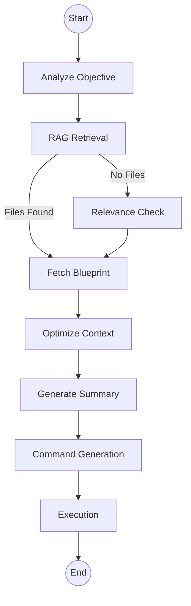
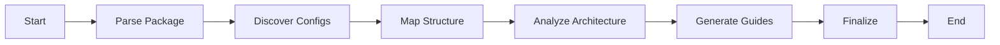
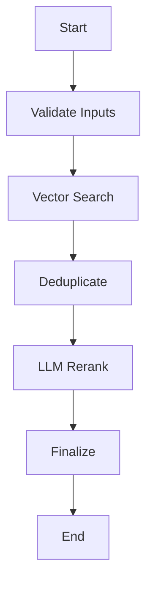
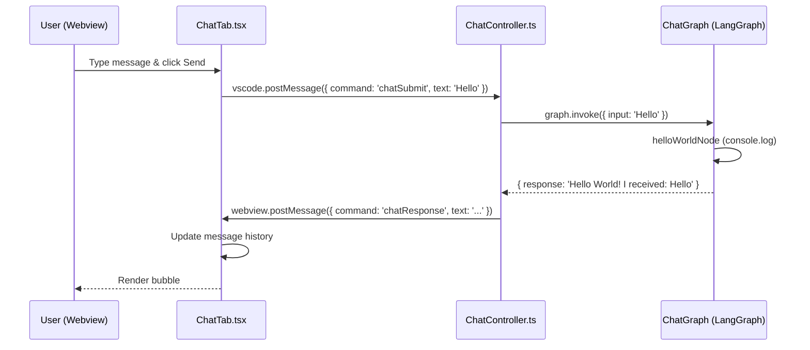

**User:**

<task>
where are the langgraph agent used in our src/ and how is it structure?
</task>
<environment_details>
# VSCode Visible Files


# VSCode Open Tabs


# Current Time
Current time in ISO 8601 UTC format: 2026-02-11T20:44:13.865Z
User time zone: Europe/London, UTC+0:00

# Current Cost
$0.00

# Current Mode
<slug>ask</slug>
<name>Ask</name>
<model>gemini-3-flash-preview</model>
<tool_format>native</tool_format>


# Current Workspace Directory (/Users/bramburn/dev/repomix-runner) Files
.cursorignore
.gitignore
.prettierrc
.vscode-test.mjs
.vscodeignore
architecture.md
CHANGELOG.md
esbuild.js
eslint.config.mjs
gemini-types.d.ts
GEMINI.md
ingest.md
LICENSE.md
package-lock.json
package.json
README.md
repomix.config.json
test-semantic-folding.mjs
tsconfig.json
vsc-extension-quickstart.md
.claude/
.github/
.qoder/
.vscode/
assets/
assets/create-bundle.mp4
assets/file.png
assets/file.svg
assets/home.svg
assets/repomix-logo.png
assets/run-on-selection.mp4
assets/tree-sitter-wasm/
assets/tree-sitter-wasm/manifest.json
assets/tree-sitter-wasm/README.md
rust/
rust/Cargo.lock
rust/Cargo.toml
rust/src/
rust/src/main.rs
scripts/
scripts/build-rust.mjs
scripts/ensure-bin.mjs
scripts/package-local.mjs
scripts/setup-treesitter.mjs
src/
src/extension.ts
src/agent/
src/agent/AGENTS.md
src/agent/graph.ts
src/agent/llmClient.ts
src/agent/nodes.ts
src/agent/prompts.ts
src/agent/state.ts
src/agent/summaryGenerator.ts
src/agent/tools.ts
src/commands/
src/commands/copyRepomixOutput.ts
src/commands/copySelectedFilesToClipboard.ts
src/commands/copySingleFileRespectingMode.ts
src/commands/createBundle.ts
src/commands/deleteBundle.ts
src/commands/editBundle.ts
src/commands/goToConfigFile.ts
src/commands/mutateActiveBundle.ts
src/commands/openOutput.ts
src/commands/openSettings.ts
src/commands/runBundle.ts
src/commands/runRepomix.ts
src/commands/runRepomixOnOpenFiles.ts
src/commands/runRepomixOnSelectedFiles.ts
src/commands/selectActiveBundle.ts
src/commands/utils.ts
src/config/
src/config/configLoader.ts
src/config/configSchema.ts
src/config/getCwd.ts
src/config/getOpenFiles.ts
src/core/
src/core/bundles/
src/core/bundles/bundleDataProvider.ts
src/core/bundles/bundleFileDecorationProvider.ts
src/core/bundles/bundleManager.ts
src/core/bundles/types.ts
src/core/cli/
src/core/cli/cliFlagsBuilder.ts
src/core/files/
src/core/files/cleanOutputFile.ts
src/core/files/copyToClipboard.ts
src/core/files/fileStats.ts
src/core/files/markdownGenerator.ts
src/core/files/outputPathResolver.ts
src/core/files/remoteDetection.ts
src/core/files/remoteFileReader.ts
src/core/files/runRepomixClipboardGenerateMarkdown.ts
src/core/files/tempDirManager.ts
src/core/indexing/
src/core/indexing/embeddingService.ts
src/core/indexing/fileEmbeddingPipeline.ts
src/core/indexing/llmReranking.ts
src/core/indexing/migrationService.ts
src/core/indexing/pineconeService.ts
src/core/indexing/queryExpansion.ts
src/core/indexing/repoEmbeddingOrchestrator.ts
src/core/indexing/repoIndexer.ts
src/core/indexing/repoIndexMonitor.ts
src/core/indexing/retryService.ts
src/core/indexing/textChunker.ts
src/core/indexing/treeSitterService.ts
src/core/indexing/vectorIdentity.ts
src/core/indexing/embeddings/
src/core/indexing/embeddings/GeminiProvider.ts
src/core/indexing/embeddings/OllamaProvider.ts
src/core/indexing/embeddings/types.ts
src/core/indexing/vectorDb/
src/core/indexing/vectorDb/factory.ts
src/core/indexing/vectorDb/types.ts
src/core/indexing/vectorDb/providers/
src/core/indexing/vectorDb/providers/pineconeAdapter.ts
src/core/indexing/vectorDb/providers/qdrantAdapter.ts
src/core/patching/
src/core/patching/codePatcher.ts
src/core/patching/contentAnalyst.ts
src/core/patching/fileResolver.ts
src/core/patching/patchParser.ts
src/core/patching/types.ts
src/core/services/
src/core/services/ExtensionServices.ts
src/core/services/IndexingService.ts
src/core/storage/
src/core/storage/databaseService.ts
src/fingerprint/
src/fingerprint/blueprintService.ts
src/fingerprint/graph.ts
src/fingerprint/index.ts
src/fingerprint/nodes.ts
src/fingerprint/state.ts
src/fingerprint/validation/
src/fingerprint/validation/gitDiffValidator.ts
src/fingerprint/validation/hashValidator.ts
src/git/
src/git/gitUtils.ts
src/search/
src/search/graph.ts
src/search/nodes.ts
src/search/state.ts
src/shared/
src/shared/execPromisify.ts
src/shared/files.ts
src/shared/indexingError.ts
src/shared/logger.ts
src/shared/showTempNotification.ts
src/test/
src/test/extension.test.ts
src/test/utilsTest.ts
src/test/commands/
src/test/commands/openOutput.test.ts
src/test/commands/openSettings.test.ts
src/test/commands/runRepomix.test.ts
src/test/commands/runRepomixFailure.test.ts
src/test/commands/runRepomixOnOpenFiles.test.ts
src/test/commands/runRepomixOnSelectedFiles.test.ts
src/test/config/
src/test/config/getCwd.test.ts
src/test/config/getOpenFiles.test.ts
src/test/core/
src/test/core/bundles/
src/test/core/bundles/bundleDataProviders.test.ts
src/test/core/bundles/bundleManager.test.ts
src/test/core/cli/
src/test/core/cli/cliFlagsBuilder.test.ts
src/test/core/files/
src/test/core/files/cleanOutputFile.test.ts
src/test/core/files/copyToClipboard.test.ts
src/test/core/files/markdownGenerator.test.ts
src/test/core/files/outputPathResolver.test.ts
src/test/core/files/tempDirManager.test.ts
src/test/core/indexing/
src/test/core/indexing/fileEmbeddingPipeline.test.ts
src/test/core/indexing/pineconeService.test.ts
src/test/core/indexing/repoIndexer.test.ts
src/test/git/
src/test/git/gitUtils.test.ts
src/test/search/
src/test/search/nodes.test.ts
src/test/test-workspace/
src/test/test-workspace/integration.test.ts
src/test/test-workspace/root/
src/test/test-workspace/root/repomix.config.json
src/test/test-workspace/root/roofile.go
src/test/test-workspace/root/foo/
src/test/test-workspace/root/foo/foo.go
src/test/test-workspace/root/foo/bar/
src/test/test-workspace/root/foo/bar/foobar.go
src/test/test-workspace/root/foo/bar/foobar.py
src/test/test-workspace/root/foo/bar/baz/
src/test/test-workspace/root/foo/bar/baz/foobarbaz.go
src/test/test-workspace/root/foo/bar/baz/foobarbaz.py
src/test/test-workspace/root/foo/bar/baz/foobarbaz2.go
src/test/test-workspace/root/foo/bar2/
src/test/test-workspace/root/foo/bar2/foobar2.go

(File list truncated. Use list_files on specific subdirectories if you need to explore further.)
You have not created a todo list yet. Create one with `update_todo_list` if your task is complicated or involves multiple steps.
</environment_details>

---

**Assistant:**

[Reasoning]
**Locating LangGraph Agents**

I'm currently trying to identify the specific locations of LangGraph agent usage within the `src/` directory, based on directory names which look promising. I'm focusing on their structural organization and how they're deployed.


[Tool Use: read_file]
Files: [
  {
    "path": "package.json",
    "lineRanges": []
  },
  {
    "path": "src/agent/graph.ts",
    "lineRanges": []
  },
  {
    "path": "src/fingerprint/graph.ts",
    "lineRanges": []
  },
  {
    "path": "src/search/graph.ts",
    "lineRanges": []
  }
]
[Unexpected content type: thoughtSignature]

---

**User:**

[Tool]
File: package.json
Lines 1-500:
  1 | {
  2 |   "publisher": "bramburn",
  3 |   "name": "repomix-runner-plus",
  4 |   "main": "./dist/extension.js",
  5 |   "displayName": "Repomix Runner Plus",
  6 |   "icon": "assets/repomix-logo.png",
  7 |   "description": "Easily bundle files into a single output for AI processing.",
  8 |   "repository": {
  9 |     "type": "git",
 10 |     "url": "https://github.com/bramburn/repomix-runner.git"
 11 |   },
 12 |   "version": "1.0.20",
 13 |   "engines": {
 14 |     "vscode": "^1.93.0"
 15 |   },
 16 |   "categories": [
 17 |     "AI",
 18 |     "Other"
 19 |   ],
 20 |   "activationEvents": [
 21 |     "onCommand:repomixRunner.run",
 22 |     "onCommand:repomixRunner.runOnOpenFiles",
 23 |     "onCommand:repomixRunner.openSettings",
 24 |     "onCommand:repomixRunner.openOutput",
 25 |     "onCommand:repomixRunner.smartRun",
 26 |     "onView:repomixBundles",
 27 |     "onView:repomixRunner.controlPanel",
 28 |     "onCommand:repomixRunner.copyAllGitChanges",
 29 |     "onStartupFinished"
 30 |   ],
 31 |   "contributes": {
 32 |     "configuration": [
 33 |       {
 34 |         "title": "Runner",
 35 |         "order": 1,
 36 |         "type": "object",
 37 |         "properties": {
 38 |           "repomix.runner.keepOutputFile": {
 39 |             "order": 1,
 40 |             "type": "boolean",
 41 |             "default": true,
 42 |             "description": " 📌 \n Keep the output file after copying its content to clipboard"
 43 |           },
 44 |           "repomix.runner.copyMode": {
 45 |             "order": 3,
 46 |             "type": "string",
 47 |             "enum": [
 48 |               "content",
 49 |               "file"
 50 |             ],
 51 |             "default": "content",
 52 |             "description": "✍️ or 💾 \n Choose what to copy to clipboard: 'content' for text content, 'file' for the file itself"
 53 |           },
 54 |           "repomix.runner.useTargetAsOutput": {
 55 |             "order": 2,
 56 |             "type": "boolean",
 57 |             "default": false,
 58 |             "description": "🎯 ➡️  🎯 \n Use the targetted folder as the output folder"
 59 |           },
 60 |           "repomix.runner.useBundleNameAsOutputName": {
 61 |             "order": 4,
 62 |             "type": "boolean",
 63 |             "default": true,
 64 |             "description": "📝 \n Use bundle name as output file name when running a bundle"
 65 |           },
 66 |           "repomix.runner.verbose": {
 67 |             "order": 5,
 68 |             "type": "boolean",
 69 |             "default": false,
 70 |             "description": "🔍 \n Verbose mode"
 71 |           },
 72 |           "repomix.runner.configPath": {
 73 |             "order": 6,
 74 |             "type": "string",
 75 |             "default": "",
 76 |             "description": "📁 \n Custom path to the configuration file (relative to workspace root)"
 77 |           }
 78 |         }
 79 |       },
 80 |       {
 81 |         "title": "Output",
 82 |         "order": 2,
 83 |         "type": "object",
 84 |         "properties": {
 85 |           "repomix.output.filePath": {
 86 |             "order": 1,
 87 |             "type": "string",
 88 |             "default": "repomix-output.xml",
 89 |             "description": "⚙️ ➡️ ❓\n Path to the output file"
 90 |           },
 91 |           "repomix.output.style": {
 92 |             "order": 2,
 93 |             "type": "string",
 94 |             "enum": [
 95 |               "plain",
 96 |               "xml",
 97 |               "markdown",
 98 |               "json"
 99 |             ],
100 |             "default": "xml",
101 |             "description": "🎨 \n Output format style"
102 |           },
103 |           "repomix.output.parsableStyle": {
104 |             "order": 3,
105 |             "type": "boolean",
106 |             "default": false,
107 |             "description": "✂️ \n - Ensures output strictly follows the specification of the chosen format. \n - Provides properly escaped XML output with fast-xml-parser.\n - Dynamically adjusts markdown code block delimiters to avoid content conflicts. \n - Note that this option can increase token count."
108 |           },
109 |           "repomix.output.headerText": {
110 |             "order": 4,
111 |             "type": "string",
112 |             "default": "",
113 |             "description": "📝\n Add a header text to the output"
114 |           },
115 |           "repomix.output.fileSummary": {
116 |             "order": 5,
117 |             "type": "boolean",
118 |             "default": true,
119 |             "description": "➕📝\n Include file summary in output"
120 |           },
121 |           "repomix.output.removeEmptyLines": {
122 |             "order": 6,
123 |             "type": "boolean",
124 |             "default": false,
125 |             "description": "🧹 \n Remove empty lines from code"
126 |           },
127 |           "repomix.output.includeEmptyDirectories": {
128 |             "order": 7,
129 |             "type": "boolean",
130 |             "default": false,
131 |             "description": "🧹 \n Include empty directories in output"
132 |           },
133 |           "repomix.output.instructionFilePath": {
134 |             "type": "string",
135 |             "default": "",
136 |             "description": "🫡\n Path to a file containing detailed custom instructions "
137 |           },
138 |           "repomix.output.directoryStructure": {
139 |             "type": "boolean",
140 |             "default": true,
141 |             "description": "➕🌳 \n Include directory tree structure in output"
142 |           },
143 |           "repomix.output.removeComments": {
144 |             "type": "boolean",
145 |             "default": false,
146 |             "description": "💬 ❌  \n Remove comments from code"
147 |           },
148 |           "repomix.output.copyToClipboard": {
149 |             "type": "boolean",
150 |             "default": true,
151 |             "description": "🔗 \n Copy output to clipboard"
152 |           },
153 |           "repomix.output.topFilesLength": {
154 |             "type": "number",
155 |             "default": 5,
156 |             "description": "Number of top files to show"
157 |           },
158 |           "repomix.output.showLineNumbers": {
159 |             "type": "boolean",
160 |             "default": false,
161 |             "description": "🔢 \n Show line numbers in output"
162 |           },
163 |           "repomix.output.compress": {
164 |             "order": 8,
165 |             "type": "boolean",
166 |             "default": false,
167 |             "description": "🧠 \n Perform intelligent code extraction, focusing on essential function and class signatures to reduce token count"
168 |           }
169 |         }
170 |       },
171 |       {
172 |         "title": "Include",
173 |         "order": 3,
174 |         "type": "object",
175 |         "properties": {
176 |           "repomix.include": {
177 |             "type": "array",
178 |             "items": {
179 |               "type": "string"
180 |             },
181 |             "default": [],
182 |             "description": "🔍 \n Patterns to include in processing"
183 |           }
184 |         }
185 |       },
186 |       {
187 |         "title": "Ignore",
188 |         "order": 4,
189 |         "type": "object",
190 |         "properties": {
191 |           "repomix.ignore.useGitignore": {
192 |             "type": "boolean",
193 |             "default": true,
194 |             "description": "Use .gitignore patterns"
195 |           },
196 |           "repomix.ignore.useDefaultPatterns": {
197 |             "type": "boolean",
198 |             "default": true,
199 |             "description": "Use default ignore patterns"
200 |           },
201 |           "repomix.ignore.customPatterns": {
202 |             "order": 6,
203 |             "type": "array",
204 |             "items": {
205 |               "type": "string"
206 |             },
207 |             "default": [],
208 |             "description": "🙈 \n Custom patterns to ignore"
209 |           }
210 |         }
211 |       },
212 |       {
213 |         "title": "Security",
214 |         "order": 5,
215 |         "type": "object",
216 |         "properties": {
217 |           "repomix.security.enableSecurityCheck": {
218 |             "type": "boolean",
219 |             "default": true,
220 |             "description": "🔒 \n Enable security check during processing"
221 |           }
222 |         }
223 |       },
224 |       {
225 |         "title": "Token Count",
226 |         "order": 6,
227 |         "type": "object",
228 |         "properties": {
229 |           "repomix.tokenCount.encoding": {
230 |             "type": "string",
231 |             "enum": [
232 |               "o200k_base",
233 |               "cl100k_base",
234 |               "p50k_edit",
235 |               "p50k_base",
236 |               "r50k_base",
237 |               "gpt2"
238 |             ],
239 |             "default": "o200k_base",
240 |             "description": "🔢 \n Token count encoding"
241 |           }
242 |         }
243 |       },
244 |       {
245 |         "title": "Embedding",
246 |         "order": 7,
247 |         "type": "object",
248 |         "properties": {
249 |           "repomix.embedding.provider": {
250 |             "order": 1,
251 |             "type": "string",
252 |             "enum": [
253 |               "gemini",
254 |               "ollama"
255 |             ],
256 |             "default": "gemini",
257 |             "description": "🤖 \n Embedding provider to use"
258 |           },
259 |           "repomix.ollama.url": {
260 |             "order": 2,
261 |             "type": "string",
262 |             "default": "http://localhost:11434",
263 |             "description": "🌐 \n Ollama API URL"
264 |           },
265 |           "repomix.ollama.model": {
266 |             "order": 3,
267 |             "type": "string",
268 |             "default": "nomic-embed-text",
269 |             "description": "📦 \n Ollama embedding model name"
270 |           },
271 |           "repomix.ollama.dimension": {
272 |             "order": 4,
273 |             "type": "number",
274 |             "default": 768,
275 |             "description": "📏 \n Embedding dimension size"
276 |           }
277 |         }
278 |       },
279 |       {
280 |         "title": "Background Indexing",
281 |         "order": 8,
282 |         "type": "object",
283 |         "properties": {
284 |           "repomix.backgroundIndexing.enabled": {
285 |             "order": 1,
286 |             "type": "boolean",
287 |             "default": true,
288 |             "description": "🔄 \n Enable automatic background re-indexing when files change. When disabled, you must manually re-index to update the vector database."
289 |           },
290 |           "repomix.backgroundIndexing.debounceMs": {
291 |             "order": 2,
292 |             "type": "number",
293 |             "default": 2500,
294 |             "minimum": 500,
295 |             "maximum": 30000,
296 |             "description": "⏱️ \n Debounce time in milliseconds before triggering re-indexing after file changes"
297 |           }
298 |         }
299 |       },
300 |       {
301 |         "title": "Smart Agent",
302 |         "order": 9,
303 |         "type": "object",
304 |         "properties": {}
305 |       }
306 |     ],
307 |     "viewsContainers": {
308 |       "activitybar": [
309 |         {
310 |           "id": "repomix-sidebar",
311 |           "title": "Repomix Control Panel",
312 |           "icon": "assets/home.svg"
313 |         }
314 |       ]
315 |     },
316 |     "views": {
317 |       "explorer": [
318 |         {
319 |           "id": "repomixBundles",
320 |           "name": "REPOMIX"
321 |         }
322 |       ],
323 |       "repomix-sidebar": [
324 |         {
325 |           "type": "webview",
326 |           "id": "repomixRunner.controlPanel",
327 |           "name": "Repomix Runner Control Panel"
328 |         }
329 |       ]
330 |     },
331 |     "commands": [
332 |       {
333 |         "command": "repomixRunner.copySelectedFilesToClipboard",
334 |         "title": "Copy as Markdown to Clipboard",
335 |         "category": "Repomix"
336 |       },
337 |       {
338 |         "command": "repomixRunner.editBundle",
339 |         "title": "Repomix: Edit Bundle",
340 |         "icon": "$(edit)"
341 |       },
342 |       {
343 |         "command": "repomixRunner.goToConfigFile",
344 |         "title": "Repomix: Go to Bundle Config File",
345 |         "icon": "$(go-to-file)"
346 |       },
347 |       {
348 |         "command": "repomixRunner.removeSelectedFilesFromCustomViewToActiveBundle",
349 |         "title": "Repomix: Remove Selection from Active Bundle",
350 |         "icon": "$(trash)"
351 |       },
352 |       {
353 |         "command": "repomixRunner.removeSelectedFilesFromActiveBundle",
354 |         "title": "Repomix: Remove Selection from Active Bundle",
355 |         "icon": "$(trash)"
356 |       },
357 |       {
358 |         "command": "repomixRunner.addSelectedFilesToActiveBundle",
359 |         "title": "Repomix: Add to Active Bundle",
360 |         "icon": "$(plus)"
361 |       },
362 |       {
363 |         "command": "repomixRunner.addSelectedFilesToNewBundle",
364 |         "title": "Repomix: Create New Bundle with Selection",
365 |         "icon": "$(plus)"
366 |       },
367 |       {
368 |         "command": "repomixRunner.createBundle",
369 |         "title": "Repomix: Create New Bundle",
370 |         "icon": "$(plus)"
371 |       },
372 |       {
373 |         "command": "repomixRunner.selectActiveBundle",
374 |         "title": "Repomix: Select Active Bundle",
375 |         "icon": "$(search)"
376 |       },
377 |       {
378 |         "command": "repomixRunner.run",
379 |         "title": "Repomix: Run",
380 |         "description": "Run repomix on the root folder of your project",
381 |         "icon": "assets/repomix-logo.svg"
382 |       },
383 |       {
384 |         "command": "repomixRunner.runBundle",
385 |         "title": "Repomix: Run Bundle",
386 |         "icon": "$(play)"
387 |       },
388 |       {
389 |         "command": "repomixRunner.deleteBundle",
390 |         "title": "Repomix: Delete Bundle",
391 |         "icon": "$(trash)",
392 |         "enablement": "view == repomixBundles"
393 |       },
394 |       {
395 |         "command": "repomixRunner.refreshBundles",
396 |         "title": "Repomix: Refresh Bundles",
397 |         "icon": "$(refresh)"
398 |       },
399 |       {
400 |         "command": "repomixRunner.runOnSelectedFiles",
401 |         "title": "Repomix: Run on Selection"
402 |       },
403 |       {
404 |         "command": "repomixRunner.runOnOpenFiles",
405 |         "title": "Repomix: Run On Open Files",
406 |         "description": "Run repomix on the open files",
407 |         "icon": "assets/file.svg"
408 |       },
409 |       {
410 |         "command": "repomixRunner.openSettings",
411 |         "title": "Repomix: Settings",
412 |         "description": "Open Repomix Runner settings",
413 |         "icon": "$(settings)"
414 |       },
415 |       {
416 |         "command": "repomixRunner.openOutput",
417 |         "title": "Repomix: Output",
418 |         "description": "Open Repomix Runner output channel",
419 |         "icon": "$(output)"
420 |       },
421 |       {
422 |         "command": "repomixRunner.removeFileFromBundle",
423 |         "title": "Remove from Bundle",
424 |         "icon": "$(trash)"
425 |       },
426 |       {
427 |         "command": "repomixRunner.smartRun",
428 |         "title": "Repomix: Smart Agent Run",
429 |         "description": "Use AI to intelligently select and package files based on a natural language query",
430 |         "icon": "$(sparkle)"
431 |       },
432 |       {
433 |         "command": "repomixRunner.copyFromScm",
434 |         "title": "Copy as Markdown to Clipboard",
435 |         "category": "Repomix"
436 |       },
437 |       {
438 |         "command": "repomixRunner.copyAllGitChanges",
439 |         "title": "Copy All Changed Files to Clipboard",
440 |         "icon": "$(copy)"
441 |       }
442 |     ],
443 |     "menus": {
444 |       "view/title": [
445 |         {
446 |           "command": "repomixRunner.createBundle",
447 |           "title": "Repomix: Create New Bundle",
448 |           "when": "view == repomixBundles",
449 |           "group": "navigation@0"
450 |         },
451 |         {
452 |           "command": "repomixRunner.run",
453 |           "title": "Repomix Run",
454 |           "group": "navigation@1",
455 |           "when": "view == repomixBundles"
456 |         },
457 |         {
458 |           "command": "repomixRunner.runOnOpenFiles",
459 |           "title": "Repomix On Open Files",
460 |           "group": "navigation",
461 |           "when": "view == repomixBundles"
462 |         },
463 |         {
464 |           "command": "repomixRunner.openSettings",
465 |           "when": "view == repomixBundles",
466 |           "group": "navigation@2",
467 |           "icon": "$(settings)"
468 |         },
469 |         {
470 |           "command": "repomixRunner.refreshBundles",
471 |           "when": "view == repomixBundles",
472 |           "group": "navigation@4"
473 |         }
474 |       ],
475 |       "view/item/context": [
476 |         {
477 |           "command": "repomixRunner.runBundle",
478 |           "when": "viewItem == bundle",
479 |           "group": "inline@3"
480 |         },
481 |         {
482 |           "command": "repomixRunner.editBundle",
483 |           "when": "viewItem == bundle",
484 |           "group": "inline@2"
485 |         },
486 |         {
487 |           "command": "repomixRunner.goToConfigFile",
488 |           "when": "viewItem == bundle",
489 |           "group": "inline@1"
490 |         },
491 |         {
492 |           "command": "repomixRunner.removeSelectedFilesFromCustomViewToActiveBundle",
493 |           "when": "viewItem in activeBundleId",
494 |           "group": "inline@4"
495 |         },
496 |         {
497 |           "command": "repomixRunner.deleteBundle",
498 |           "when": "viewItem == bundle",
499 |           "group": "repomix@1"
500 |         }


Code Definitions:
# package.json
1--642 | {
8--11 |   "repository": {
16--19 |   "categories": [
20--30 |   "activationEvents": [
31--574 |   "contributes": {
32--306 |     "configuration": [
33--79 |       {
37--78 |         "properties": {
38--43 |           "repomix.runner.keepOutputFile": {
44--53 |           "repomix.runner.copyMode": {
47--50 |             "enum": [
54--59 |           "repomix.runner.useTargetAsOutput": {
60--65 |           "repomix.runner.useBundleNameAsOutputName": {
66--71 |           "repomix.runner.verbose": {
72--77 |           "repomix.runner.configPath": {
80--170 |       {
84--169 |         "properties": {
85--90 |           "repomix.output.filePath": {
91--102 |           "repomix.output.style": {
94--99 |             "enum": [
103--108 |           "repomix.output.parsableStyle": {
109--114 |           "repomix.output.headerText": {
115--120 |           "repomix.output.fileSummary": {
121--126 |           "repomix.output.removeEmptyLines": {
127--132 |           "repomix.output.includeEmptyDirectories": {
133--137 |           "repomix.output.instructionFilePath": {
138--142 |           "repomix.output.directoryStructure": {
143--147 |           "repomix.output.removeComments": {
148--152 |           "repomix.output.copyToClipboard": {
153--157 |           "repomix.output.topFilesLength": {
158--162 |           "repomix.output.showLineNumbers": {
163--168 |           "repomix.output.compress": {
171--185 |       {
175--184 |         "properties": {
176--183 |           "repomix.include": {
186--211 |       {
190--210 |         "properties": {
191--195 |           "repomix.ignore.useGitignore": {
196--200 |           "repomix.ignore.useDefaultPatterns": {
201--209 |           "repomix.ignore.customPatterns": {
212--223 |       {
216--222 |         "properties": {
217--221 |           "repomix.security.enableSecurityCheck": {
224--243 |       {
228--242 |         "properties": {
229--241 |           "repomix.tokenCount.encoding": {
231--238 |             "enum": [
244--278 |       {
248--277 |         "properties": {
249--258 |           "repomix.embedding.provider": {
252--255 |             "enum": [
259--264 |           "repomix.ollama.url": {
265--270 |           "repomix.ollama.model": {
271--276 |           "repomix.ollama.dimension": {
279--299 |       {
283--298 |         "properties": {
284--289 |           "repomix.backgroundIndexing.enabled": {
290--297 |           "repomix.backgroundIndexing.debounceMs": {
300--305 |       {
307--315 |     "viewsContainers": {
308--314 |       "activitybar": [
309--313 |         {
316--330 |     "views": {
317--322 |       "explorer": [
318--321 |         {
323--329 |       "repomix-sidebar": [
324--328 |         {
331--442 |     "commands": [
332--336 |       {
337--341 |       {
342--346 |       {
347--351 |       {
352--356 |       {
357--361 |       {
362--366 |       {
367--371 |       {
372--376 |       {
377--382 |       {
383--387 |       {
388--393 |       {
394--398 |       {
399--402 |       {
403--408 |       {
409--414 |       {
415--420 |       {
421--425 |       {
426--431 |       {
432--436 |       {
437--441 |       {
443--573 |     "menus": {
444--474 |       "view/title": [
445--450 |         {
451--456 |         {
457--462 |         {
463--468 |         {
469--473 |         {
475--501 |       "view/item/context": [
476--480 |         {
481--485 |         {
486--490 |         {
491--495 |         {
496--500 |         {

Note: Showing only 500 of 642 total lines. Use line_range if you need to read more lines

---

File: src/agent/graph.ts
Lines 1-74:
 1 | import { StateGraph } from "@langchain/langgraph";
 2 | import { AgentState } from "./state";
 3 | import * as nodes from "./nodes";
 4 | import { DatabaseService } from '../core/storage/databaseService';
 5 | import { getVectorDbAdapterForRepo } from '../core/indexing/vectorDb/factory';
 6 | import { logger } from '../shared/logger';
 7 | 
 8 | export function createSmartRepomixGraph(databaseService: DatabaseService, bundleId?: string) {
 9 |   const workflow = new StateGraph(AgentState)
10 |     // Add all the nodes we defined
11 |     .addNode("analyzeObjective", nodes.analyzeObjective)
12 |     .addNode("retrieval", async (state) => {
13 |       const repoId = state.workspaceRoot; // Use root path as repo ID for now
14 | 
15 |       try {
16 |         // Safely retrieve the extension context from global scope
17 |         const extensionContext = (global as any).extensionContext;
18 | 
19 |         if (!extensionContext) {
20 |           logger.both.warn("Agent: Extension context not available in global scope, RAG will use fallback");
21 |           // Return empty adapter to trigger fallback in retrieval node
22 |           return nodes.retrieval(state, undefined as any, repoId);
23 |         }
24 | 
25 |         const { adapter } = await getVectorDbAdapterForRepo(extensionContext, repoId);
26 |         return nodes.retrieval(state, adapter, repoId);
27 |       } catch (error) {
28 |         logger.both.error("Agent: Failed to get vector DB adapter, using fallback", error);
29 |         // Return empty adapter to trigger fallback in retrieval node
30 |         return nodes.retrieval(state, undefined as any, repoId);
31 |       }
32 |     })
33 |     .addNode("relevanceCheck", nodes.relevanceConfirmation)
34 |     .addNode("fetchBlueprint", nodes.fetchBlueprint)
35 |     .addNode("optimizeContext", nodes.optimizeContext)
36 |     .addNode("commandGeneration", nodes.commandGeneration)
37 |     .addNode("generateSummary", nodes.generateSummary)
38 |     .addNode("execution", (state) => nodes.finalExecution(state, databaseService, bundleId))
39 | 
40 |     // Define the flow (Edges)
41 |     // Start -> Analyze Objective
42 |     .addEdge("__start__", "analyzeObjective")
43 | 
44 |     // Analyze -> Retrieval
45 |     .addEdge("analyzeObjective", "retrieval")
46 | 
47 |     // Conditional edge: Skip to fetchBlueprint if we already have confirmed files (re-pack scenario)
48 |     .addConditionalEdges("retrieval", (state) => {
49 |       if (state.confirmedFiles.length > 0) {
50 |         return "fetchBlueprint"; // Skip directly to blueprint fetch
51 |       }
52 |       return "relevanceCheck"; // Continue with normal flow
53 |     })
54 | 
55 |     // Relevance Check -> Fetch Blueprint
56 |     .addEdge("relevanceCheck", "fetchBlueprint")
57 | 
58 |     // Fetch Blueprint -> Optimize Context (Semantic Folding)
59 |     .addEdge("fetchBlueprint", "optimizeContext")
60 | 
61 |     // Optimize Context -> Generate Summary
62 |     .addEdge("optimizeContext", "generateSummary")
63 | 
64 |     // Summary -> Generate Command
65 |     .addEdge("generateSummary", "commandGeneration")
66 | 
67 |     // Generate -> Execute & Cleanup
68 |     .addEdge("commandGeneration", "execution")
69 | 
70 |     // End
71 |     .addEdge("execution", "__end__");
72 | 
73 |   return workflow.compile();
74 | }


---

File: src/fingerprint/graph.ts
Lines 1-131:
  1 | import { StateGraph } from "@langchain/langgraph";
  2 | import { AnalysisGraphState, ProgressCallback } from "./state.js";
  3 | import * as nodes from "./nodes.js";
  4 | 
  5 | /**
  6 |  * Create the repository fingerprint analysis graph.
  7 |  * 
  8 |  * Flow:
  9 |  * __start__ → parsePackage → discoverConfigs → mapStructure 
 10 |  *          → analyzeArchitecture → generateGuides → finalize → __end__
 11 |  * 
 12 |  * @returns Compiled LangGraph workflow
 13 |  */
 14 | export function createFingerprintGraph() {
 15 |   const workflow = new StateGraph(AnalysisGraphState)
 16 |     // Add nodes
 17 |     .addNode("parsePackage", nodes.parsePackageNode)
 18 |     .addNode("discoverConfigs", nodes.discoverConfigsNode)
 19 |     .addNode("mapStructure", nodes.mapStructureNode)
 20 |     .addNode("analyzeArchitecture", nodes.analyzeArchitectureNode)
 21 |     .addNode("generateGuides", nodes.generateGuidesNode)
 22 |     .addNode("finalize", nodes.finalizeNode)
 23 | 
 24 |     // Define edges - linear flow
 25 |     .addEdge("__start__", "parsePackage")
 26 |     .addEdge("parsePackage", "discoverConfigs")
 27 |     .addEdge("discoverConfigs", "mapStructure")
 28 |     
 29 |     // Conditional edge: skip LLM nodes if no API key
 30 |     .addConditionalEdges("mapStructure", (state) => {
 31 |       if (!state.apiKey) {
 32 |         return "finalize"; // Skip LLM nodes
 33 |       }
 34 |       return "analyzeArchitecture";
 35 |     })
 36 |     
 37 |     .addEdge("analyzeArchitecture", "generateGuides")
 38 |     .addEdge("generateGuides", "finalize")
 39 |     .addEdge("finalize", "__end__");
 40 | 
 41 |   return workflow.compile();
 42 | }
 43 | 
 44 | /**
 45 |  * Initial state for the fingerprint analysis.
 46 |  */
 47 | export interface FingerprintGraphInput {
 48 |   repoId: string;
 49 |   repoRoot: string;
 50 |   apiKey?: string;
 51 | }
 52 | 
 53 | /**
 54 |  * Execute the fingerprint analysis graph.
 55 |  * 
 56 |  * @param input - Initial state with repo info
 57 |  * @param onProgress - Optional callback for progress updates
 58 |  * @returns Final analysis state
 59 |  */
 60 | export async function runFingerprintGraph(
 61 |   input: FingerprintGraphInput,
 62 |   onProgress?: ProgressCallback
 63 | ): Promise<typeof AnalysisGraphState.State> {
 64 |   console.log('[FingerprintGraph] ===== Starting analysis =====');
 65 |   console.log(`[FingerprintGraph] Repo: ${input.repoId}`);
 66 |   console.log(`[FingerprintGraph] Root: ${input.repoRoot}`);
 67 |   console.log(`[FingerprintGraph] API Key: ${input.apiKey ? 'provided' : 'not provided'}`);
 68 | 
 69 |   const graph = createFingerprintGraph();
 70 |   
 71 |   // Initialize state
 72 |   const initialState = {
 73 |     repoId: input.repoId,
 74 |     repoRoot: input.repoRoot,
 75 |     apiKey: input.apiKey || '',
 76 |     packageInfo: undefined,
 77 |     configFiles: [],
 78 |     directoryStructure: undefined,
 79 |     totalFileCount: 0,
 80 |     architecturalPatterns: undefined,
 81 |     developmentGuides: undefined,
 82 |     criticalFileHashes: {},
 83 |     lastGitCommit: undefined,
 84 |     generatedAt: Date.now(),
 85 |     analysisVersion: 'v1.0',
 86 |     errors: [],
 87 |     tokensUsed: 0,
 88 |     success: false
 89 |   };
 90 | 
 91 |   // Define node phases for progress tracking
 92 |   const phases = [
 93 |     { node: 'parsePackage', name: 'Parsing package.json', index: 1 },
 94 |     { node: 'discoverConfigs', name: 'Discovering config files', index: 2 },
 95 |     { node: 'mapStructure', name: 'Mapping directory structure', index: 3 },
 96 |     { node: 'analyzeArchitecture', name: 'Analyzing architecture', index: 4 },
 97 |     { node: 'generateGuides', name: 'Generating guides', index: 5 },
 98 |     { node: 'finalize', name: 'Finalizing', index: 6 }
 99 |   ];
100 |   const totalPhases = input.apiKey ? 6 : 4; // Fewer phases without LLM
101 | 
102 |   // Stream execution for progress updates
103 |   const stream = await graph.stream(initialState as any);
104 |   let finalState: any = initialState;
105 | 
106 |   for await (const chunk of stream) {
107 |     const chunkRecord = chunk as Record<string, any>;
108 |     const nodeName = Object.keys(chunkRecord)[0];
109 |     const nodeUpdate = chunkRecord[nodeName];
110 |     
111 |     // Merge update into final state
112 |     finalState = { ...finalState, ...nodeUpdate };
113 | 
114 |     // Report progress
115 |     if (onProgress) {
116 |       const phase = phases.find(p => p.node === nodeName);
117 |       if (phase) {
118 |         onProgress(phase.name, phase.index, totalPhases);
119 |       }
120 |     }
121 | 
122 |     console.log(`[FingerprintGraph] Completed node: ${nodeName}`);
123 |   }
124 | 
125 |   console.log('[FingerprintGraph] ===== Analysis complete =====');
126 |   console.log(`[FingerprintGraph] Success: ${finalState.success}`);
127 |   console.log(`[FingerprintGraph] Tokens used: ${finalState.tokensUsed}`);
128 |   console.log(`[FingerprintGraph] Errors: ${finalState.errors?.length || 0}`);
129 | 
130 |   return finalState as typeof AnalysisGraphState.State;
131 | }


---

File: src/search/graph.ts
Lines 1-52:
 1 | import { StateGraph } from "@langchain/langgraph";
 2 | import { SearchGraphState } from "./state.js";
 3 | import * as nodes from "./nodes.js";
 4 | 
 5 | export function createSearchGraph(adapter: any, context: any) {
 6 |     const workflow = new StateGraph(SearchGraphState)
 7 |         .addNode("validateInputs", nodes.validateInputsNode)
 8 |         .addNode("vectorSearch", (state) => nodes.vectorSearchNode(state, adapter))
 9 |         .addNode("dedupe", nodes.dedupeNode)
10 |         .addNode("rerank", nodes.rerankNode)
11 |         .addNode("finalize", nodes.finalizeNode)
12 | 
13 |         .addEdge("__start__", "validateInputs")
14 |         .addConditionalEdges("validateInputs", (state) => {
15 |             return state.errors.length > 0 ? "__end__" : "vectorSearch";
16 |         })
17 |         .addConditionalEdges("vectorSearch", (state) => {
18 |             return state.errors.length > 0 ? "__end__" : "dedupe";
19 |         })
20 |         .addEdge("dedupe", "rerank")
21 |         .addEdge("rerank", "finalize")
22 |         .addEdge("finalize", "__end__");
23 | 
24 |     return workflow.compile();
25 | }
26 | 
27 | /**
28 |  * Executor for the Search graph.
29 |  */
30 | export async function runSearchGraph(initialState: Partial<SearchGraphState>, adapter: any, context: any): Promise<SearchGraphState> {
31 |     console.log('[SEARCH_GRAPH] ===== runSearchGraph START =====');
32 |     console.log('[SEARCH_GRAPH] Initial state:', {
33 |         userQuery: initialState.userQuery,
34 |         maxResults: initialState.maxResults,
35 |         smartFilterEnabled: initialState.smartFilterEnabled,
36 |         confidenceThreshold: initialState.confidenceThreshold,
37 |     });
38 |     
39 |     console.log('[SEARCH_GRAPH] Creating search graph...');
40 |     const graph = createSearchGraph(adapter, context);
41 |     console.log('[SEARCH_GRAPH] Graph created, invoking...');
42 |     
43 |     // @ts-ignore - LangGraph state types can be tricky
44 |     const finalState = await graph.invoke(initialState);
45 |     
46 |     console.log('[SEARCH_GRAPH] Graph execution completed');
47 |     console.log('[SEARCH_GRAPH] Final state errors:', finalState.errors?.length || 0);
48 |     console.log('[SEARCH_GRAPH] Final state hits:', finalState.finalHits?.length || 0);
49 |     console.log('[SEARCH_GRAPH] ===== runSearchGraph END =====');
50 |     
51 |     return finalState as SearchGraphState;
52 | }

<environment_details>
# VSCode Visible Files


# VSCode Open Tabs


# Current Time
Current time in ISO 8601 UTC format: 2026-02-11T20:44:27.315Z
User time zone: Europe/London, UTC+0:00

# Current Cost
$0.01

# Current Mode
<slug>ask</slug>
<name>Ask</name>
<model>gemini-3-flash-preview</model>
<tool_format>native</tool_format>
You have not created a todo list yet. Create one with `update_todo_list` if your task is complicated or involves multiple steps.
</environment_details>

---

**Assistant:**

[Reasoning]
**Analyzing LangGraph Usage**

I've pinpointed LangGraph's use in two crucial areas so far. The first is within the 'Smart Agent Graph,' which facilitates intelligent file selection and packaging. The second focus area is the 'Fingerprint Graph' responsible for repository analysis, architecture mapping and generating file structure data. I'm moving onto the third application.


[Tool Use: read_file]
Files: [
  {
    "path": "src/agent/state.ts",
    "lineRanges": []
  },
  {
    "path": "src/agent/nodes.ts",
    "lineRanges": []
  }
]
[Unexpected content type: thoughtSignature]

---

**User:**

[Tool]
File: src/agent/state.ts
Lines 1-88:
 1 | import { Annotation } from "@langchain/langgraph";
 2 | 
 3 | /**
 4 |  * Processed file with compression level metadata
 5 |  */
 6 | export interface ProcessedFile {
 7 |   path: string;
 8 |   content: string;
 9 |   compressionLevel: 'full' | 'skeleton' | 'summary';
10 |   tokens: number;
11 |   relevanceScore: number;
12 | }
13 | 
14 | /**
15 |  * Defines the shared memory of the agent as it moves through the graph.
16 |  */
17 | export const AgentState = Annotation.Root({
18 |   // The API key for the LLM
19 |   apiKey: Annotation<string>,
20 | 
21 |   // The original request from the user (e.g., "Package authentication logic")
22 |   userQuery: Annotation<string>,
23 | 
24 |   // The root path of the workspace
25 |   workspaceRoot: Annotation<string>,
26 | 
27 |   // A complete list of all file paths found in the repository
28 |   allFilePaths: Annotation<string[]>,
29 | 
30 |   // Phase 1 Filter: Files selected by LLM based on name/path alone
31 |   candidateFiles: Annotation<string[]>,
32 | 
33 |   // Phase 2 Filter: Files confirmed by LLM after reading their content
34 |   confirmedFiles: Annotation<string[]>,
35 | 
36 |   // The final repomix CLI command to execute
37 |   finalCommand: Annotation<string>,
38 | 
39 |   // The type of objective analyzed from the query
40 |   objectiveType: Annotation<'ACTION' | 'SEARCH' | undefined>,
41 | 
42 |   // Detailed criteria for filtering relevant files
43 |   relevanceCriteria: Annotation<string | undefined>,
44 | 
45 |   // Output path for the generated file
46 |   outputPath: Annotation<string | undefined>,
47 | 
48 |   // Path to the generated summary markdown file
49 |   summaryPath: Annotation<string | undefined>,
50 | 
51 |   // Whether to generate the repomix command and output file
52 |   generateFile: Annotation<boolean>({
53 |     reducer: (curr, next) => next,
54 |     default: () => false,
55 |   }),
56 | 
57 |   // Total tokens used across all LLM calls
58 |   totalTokens: Annotation<number>({
59 |     reducer: (x, y) => x + y, // Adds new usage to existing total
60 |     default: () => 0,
61 |   }),
62 | 
63 |   // === Semantic Folding Fields ===
64 | 
65 |   // Token budget from settings (20k/35k/50k/75k/100k)
66 |   tokenBudget: Annotation<number>({
67 |     reducer: (curr, next) => next,
68 |     default: () => 50000,
69 |   }),
70 | 
71 |   // Architectural blueprint summary from repository analysis
72 |   blueprintSummary: Annotation<string>({
73 |     reducer: (curr, next) => next || curr,
74 |     default: () => '',
75 |   }),
76 | 
77 |   // Files processed with compression levels (full/skeleton/summary)
78 |   processedFiles: Annotation<ProcessedFile[]>({
79 |     reducer: (curr, next) => next,
80 |     default: () => [],
81 |   }),
82 | 
83 |   // File relevance scores from relevance check (path -> score mapping)
84 |   fileRelevanceScores: Annotation<Record<string, number>>({
85 |     reducer: (curr, next) => ({ ...curr, ...next }),
86 |     default: () => ({}),
87 |   }),
88 | });


---

File: src/agent/nodes.ts
Lines 1-500:
  1 | import { z } from "zod";
  2 | import { AgentState, ProcessedFile } from "./state";
  3 | import * as tools from "./tools";
  4 | import * as prompts from "./prompts";
  5 | import * as fs from 'fs';
  6 | import * as path from 'path';
  7 | import * as vscode from 'vscode';
  8 | import { execPromisify } from '../shared/execPromisify';
  9 | import { logger } from "../shared/logger";
 10 | import { DatabaseService, AgentRunHistory, RepoBlueprint } from '../core/storage/databaseService';
 11 | import * as crypto from 'crypto';
 12 | import { embeddingService } from "../core/indexing/embeddingService";
 13 | import { VectorDbAdapter } from "../core/indexing/vectorDb/types";
 14 | import { getAllQueriesToSearch } from "../core/indexing/queryExpansion";
 15 | import * as llmClient from "./llmClient";
 16 | import { getBlueprintService } from "../fingerprint/blueprintService";
 17 | import { treeSitterService, TreeSitterService } from "../core/indexing/treeSitterService";
 18 | import { encode } from 'gpt-tokenizer';
 19 | 
 20 | // ============================================================================
 21 | // Caching Layer for LLM Responses
 22 | // ============================================================================
 23 | 
 24 | interface CacheEntry {
 25 |   result: any;
 26 |   timestamp: number;
 27 | }
 28 | 
 29 | class LLMResponseCache {
 30 |   private cache = new Map<string, CacheEntry>();
 31 |   private readonly TTL = 24 * 60 * 60 * 1000; // 24 hours
 32 | 
 33 |   /**
 34 |    * Generate a cache key from query and content hash
 35 |    */
 36 |   private generateKey(query: string, content: string): string {
 37 |     const contentHash = crypto.createHash('md5').update(content).digest('hex');
 38 |     return `${query}:${contentHash}`;
 39 |   }
 40 | 
 41 |   /**
 42 |    * Get cached result or compute and cache
 43 |    */
 44 |   async getOrCompute(
 45 |     query: string,
 46 |     content: string,
 47 |     computeFn: () => Promise<any>
 48 |   ): Promise<any> {
 49 |     const key = this.generateKey(query, content);
 50 |     const cached = this.cache.get(key);
 51 | 
 52 |     if (cached && Date.now() - cached.timestamp < this.TTL) {
 53 |       return cached.result;
 54 |     }
 55 | 
 56 |     const result = await computeFn();
 57 |     this.cache.set(key, { result, timestamp: Date.now() });
 58 |     return result;
 59 |   }
 60 | 
 61 |   /**
 62 |    * Clear expired entries
 63 |    */
 64 |   clearExpired(): void {
 65 |     const now = Date.now();
 66 |     for (const [key, entry] of this.cache.entries()) {
 67 |       if (now - entry.timestamp >= this.TTL) {
 68 |         this.cache.delete(key);
 69 |       }
 70 |     }
 71 |   }
 72 | 
 73 |   /**
 74 |    * Clear all cache entries
 75 |    */
 76 |   clear(): void {
 77 |     this.cache.clear();
 78 |   }
 79 | 
 80 |   /**
 81 |    * Get cache statistics
 82 |    */
 83 |   getStats(): { size: number; keys: string[] } {
 84 |     return {
 85 |       size: this.cache.size,
 86 |       keys: Array.from(this.cache.keys())
 87 |     };
 88 |   }
 89 | }
 90 | 
 91 | // Global cache instance
 92 | const llmCache = new LLMResponseCache();
 93 | 
 94 | // ============================================================================
 95 | // Configuration Constants
 96 | // ============================================================================
 97 | 
 98 | const CONFIG = {
 99 |   // Batch processing settings
100 |   BATCH_SIZE: 5,              // Files per LLM batch request
101 |   MAX_CONCURRENT_BATCHES: 3,  // Maximum parallel batch requests (Kept for logical grouping, but queue handles actual rate limiting)
102 | 
103 |   // Content processing
104 |   MAX_FILE_CONTENT_LENGTH: 15000,  // Reduced for batch processing (per file)
105 |   MIN_CONFIDENCE_THRESHOLD: 0.6,   // Lowered from 0.7 for inclusiveness
106 | 
107 |   // Rate limiting
108 |   RATE_LIMIT_DELAY_MS: 500,  // Delay between batch requests (Now handled by p-queue, but kept for legacy structure if needed explicitly)
109 | 
110 |   // Fallback thresholds
111 |   FALLBACK_MIN_FILES: 5,     // Minimum files to return on fallback
112 | } as const;
113 | 
114 | // ============================================================================
115 | // Helper Functions
116 | // ============================================================================
117 | 
118 | // Helper to generate a unique 4-character ID
119 | function generateShortId(): string {
120 |   return Math.random().toString(36).substring(2, 6);
121 | }
122 | 
123 | // Helper function to chunk arrays into smaller pieces
124 | function chunkArray<T>(array: T[], size: number): T[][] {
125 |   const chunks: T[][] = [];
126 |   for (let i = 0; i < array.length; i += size) {
127 |     chunks.push(array.slice(i, i + size));
128 |   }
129 |   return chunks;
130 | }
131 | 
132 | // Node 0: Analyze Objective
133 | export async function analyzeObjective(state: typeof AgentState.State) {
134 |   logger.both.info("Agent: Step 0 - Analyzing user objective...");
135 | 
136 |   // This schema defines the structure of the expected output from the LLM,
137 |   // ensuring it includes both the objective type and relevance criteria for the task.
138 |   const schema = z.object({
139 |     objectiveType: z.enum(['ACTION', 'SEARCH']).describe("Whether the user wants to perform a task/modify code (ACTION) or find info/understand (SEARCH)"),
140 |     relevanceCriteria: z.string().describe("A strict checklist of what constitutes a 'relevant file' for this specific task")
141 |   });
142 | 
143 |   const prompt = prompts.ANALYZE_OBJECTIVE_PROMPT(state.userQuery);
144 | 
145 |   try {
146 |     const { parsed: result, totalTokens } = await llmClient.generateStructured(
147 |       state.apiKey,
148 |       schema,
149 |       prompt,
150 |       "Analyze Objective"
151 |     );
152 | 
153 |     logger.both.info(`Agent: Objective classified as ${result.objectiveType}.`);
154 |     logger.both.info(`Agent: Relevance Criteria: ${result.relevanceCriteria}`);
155 | 
156 |     return {
157 |       objectiveType: result.objectiveType,
158 |       relevanceCriteria: result.relevanceCriteria,
159 |       totalTokens: totalTokens
160 |     };
161 |   } catch (error) {
162 |     logger.both.error("Agent: Objective analysis failed", error);
163 |     // Fallback values
164 |     return {
165 |       objectiveType: 'ACTION' as const,
166 |       relevanceCriteria: "Select files relevant to the user's query.",
167 |       totalTokens: 0
168 |     };
169 |   }
170 | }
171 | 
172 | // Node 1: Retrieval (RAG-based with Multi-Query Expansion)
173 | export async function retrieval(
174 |   state: typeof AgentState.State,
175 |   adapter: VectorDbAdapter,
176 |   repoId: string
177 | ) {
178 |   logger.both.info("Agent: Step 1 - Retrieving candidate files via RAG with multi-query expansion...");
179 | 
180 |   if (!state.apiKey || !adapter) {
181 |     logger.both.warn("Agent: Missing API key or adapter, falling back to basic indexing.");
182 |     try {
183 |       const files = await tools.getWorkspaceFiles(state.workspaceRoot);
184 |       return { candidateFiles: files.slice(0, 50) };
185 |     } catch (fallbackError) {
186 |       logger.both.error("Agent: Fallback file listing also failed", fallbackError);
187 |       return { candidateFiles: [] };
188 |     }
189 |   }
190 | 
191 |   try {
192 |     logger.both.info("Agent: Generating search queries with semantic expansion...");
193 |     
194 |     // 1. Expand Query (Multi-Query RAG)
195 |     const queries = await getAllQueriesToSearch(state.userQuery, state.apiKey);
196 |     logger.both.info(`Agent: Expanded to ${queries.length} queries: ${JSON.stringify(queries)}`);
197 | 
198 |     // 2. Embed all queries in parallel (using priority=true for user-facing latency)
199 |     logger.both.info("Agent: Embedding all query variants...");
200 |     const vectors = await Promise.all(
201 |       queries.map(q => embeddingService.embedText(q, 'agent', true))
202 |     );
203 |     logger.both.info(`Agent: Generated ${vectors.length} embeddings`);
204 | 
205 |     // 3. Query Vector DB for each vector in parallel
206 |     logger.both.info("Agent: Querying vector database for all variants...");
207 |     const resultsList = await Promise.all(
208 |       vectors.map(vector => 
209 |         adapter.queryVectors({
210 |           repoId: repoId,
211 |           vector: vector,
212 |           topK: 30, // Slightly reduced topK per query since we run multiple
213 |         })
214 |       )
215 |     );
216 | 
217 |     // 4. Merge and Deduplicate Results
218 |     const filePaths = new Set<string>();
219 |     let totalMatches = 0;
220 |     let totalScore = 0;
221 |     const fileScores = new Map<string, { count: number; totalScore: number }>();
222 | 
223 |     for (const results of resultsList) {
224 |       const matches = results?.matches ?? [];
225 |       totalMatches += matches.length;
226 |       
227 |       for (const m of matches) {
228 |         const filePath = m.metadata?.filePath as string;
229 |         const score = m.score ?? 0;
230 |         totalScore += score;
231 |         
232 |         if (filePath) {
233 |           filePaths.add(filePath);
234 |           
235 |           // Track scoring statistics for potential ranking
236 |           const current = fileScores.get(filePath) || { count: 0, totalScore: 0 };
237 |           fileScores.set(filePath, {
238 |             count: current.count + 1,
239 |             totalScore: current.totalScore + score
240 |           });
241 |         }
242 |       }
243 |     }
244 | 
245 |     const candidates = Array.from(filePaths);
246 |     const avgScore = totalMatches > 0 ? totalScore / totalMatches : 0;
247 |     
248 |     logger.both.info(
249 |       `Agent: RAG retrieved ${totalMatches} raw matches across ${queries.length} queries, ` +
250 |       `reduced to ${candidates.length} unique files (avg score: ${avgScore.toFixed(3)}).`
251 |     );
252 | 
253 |     // Optional: Log top files by frequency/score for debugging
254 |     const sortedFiles = Array.from(fileScores.entries())
255 |       .sort((a, b) => b[1].count - a[1].count || b[1].totalScore - a[1].totalScore)
256 |       .slice(0, 5);
257 |     
258 |     if (sortedFiles.length > 0) {
259 |       logger.both.info(
260 |         `Agent: Top files by frequency: ${sortedFiles.map(([fp, stats]) => 
261 |           `${path.basename(fp)}(${stats.count}/${queries.length})`
262 |         ).join(', ')}`
263 |       );
264 |     }
265 | 
266 |     return { candidateFiles: candidates };
267 |   } catch (error) {
268 |     logger.both.error("Agent: Multi-query RAG retrieval failed, falling back to basic file listing", error);
269 | 
270 |     // CRITICAL: Fallback to local FS call only - no network calls
271 |     try {
272 |       const files = await tools.getWorkspaceFiles(state.workspaceRoot);
273 |       logger.both.info(`Agent: Fallback retrieved ${files.length} files from workspace`);
274 |       return { candidateFiles: files.slice(0, 50) };
275 |     } catch (fallbackError) {
276 |       logger.both.error("Agent: Fallback file listing also failed", fallbackError);
277 |       // Last resort: return empty array to allow workflow to continue
278 |       return { candidateFiles: [] };
279 |     }
280 |   }
281 | }
282 | 
283 | // Node 2: Structure Extraction (combined with Node 1)
284 | export async function structureExtraction(state: typeof AgentState.State) {
285 |   logger.both.info(`Agent: Step 2 - Found ${state.allFilePaths.length} files in repository.`);
286 |   // No additional work needed since we already have the file list from Node 1
287 |   return {};
288 | }
289 | 
290 | // Node 3: Initial Filtering (Fast Pass)
291 | export async function initialFiltering(state: typeof AgentState.State) {
292 |   logger.both.info("Agent: Step 3 - Filtering candidate files...");
293 | 
294 |   // Define the structured output schema
295 |   const schema = z.object({
296 |     candidates: z.array(z.string()).describe("List of relevant file paths found in the repository")
297 |   });
298 | 
299 |   // Chunk the files to avoid token limits (JSON truncation) with large repos
300 |   const CHUNK_SIZE = 600;
301 |   const fileChunks = chunkArray(state.allFilePaths, CHUNK_SIZE);
302 | 
303 |   const allCandidates: string[] = [];
304 |   let totalTokens = 0;
305 | 
306 |   try {
307 |     // Process chunks sequentially to be safe with rate limits
308 |     // Note: Implicit sequential execution here, but llmClient queue ensures it anyway.
309 |     for (const chunk of fileChunks) {
310 |       const structureContext = chunk.join('\n');
311 | 
312 |       const prompt = `
313 |         You are an expert software engineer assistant.
314 |         The user wants to package specific parts of a codebase into a single file.
315 | 
316 |         User Query: "${state.userQuery}"
317 | 
318 |         Below is a subset of files from the repository:
319 |         ---
320 |         ${structureContext}
321 |         ---
322 | 
323 |         Task: Select all file paths from the list above that appear relevant to the user's query based on their names and directory location.
324 |         Be generous in this step; include any file that MIGHT be relevant.
325 |         Do not hallucinate paths. Only select from the provided list.
326 |       `;
327 | 
328 |       try {
329 |         const { parsed: result, totalTokens: tokens } = await llmClient.generateStructured(
330 |           state.apiKey,
331 |           schema,
332 |           prompt,
333 |           "Initial Filtering Chunk"
334 |         );
335 | 
336 |         if (result && result.candidates) {
337 |           allCandidates.push(...result.candidates);
338 |         }
339 |         totalTokens += tokens;
340 |       } catch (chunkError) {
341 |         logger.both.warn("Agent: Error processing a file chunk, skipping...", chunkError);
342 |         // Continue to next chunk even if one fails
343 |       }
344 |     }
345 | 
346 |     logger.both.info(`Agent: Selected ${allCandidates.length} candidate files for deep analysis.`);
347 | 
348 |     // Ensure we don't return empty candidates if there are files available
349 |     if (allCandidates.length === 0 && state.allFilePaths.length > 0) {
350 |       logger.both.warn("Agent: No candidates selected, applying failsafe to select some files");
351 | 
352 |       const fallbackCandidates = state.allFilePaths.filter(file =>
353 |         file.includes('src') ||
354 |         file.includes('lib') ||
355 |         file.includes('app') ||
356 |         file.match(/\.(ts|js|tsx|jsx|py|java|cs|cpp|c|go|rs|php)$/)
357 |       ).slice(0, 20);
358 | 
359 |       return { candidateFiles: fallbackCandidates, totalTokens: totalTokens };
360 |     }
361 | 
362 |     return { candidateFiles: allCandidates, totalTokens: totalTokens };
363 | 
364 |   } catch (error) {
365 |     logger.both.error("Agent: Filtering failed", error);
366 | 
367 |     vscode.window.showWarningMessage(`Agent filtering failed (${error instanceof Error ? error.message : 'Unknown'}), using fallback file list.`);
368 | 
369 |     if (state.allFilePaths.length > 0) {
370 |       const fallbackCandidates = state.allFilePaths.filter(file =>
371 |         file.match(/\.(ts|js|tsx|jsx|py|java|cs|cpp|c|go|rs|php)$/)
372 |       ).slice(0, 20);
373 |       return { candidateFiles: fallbackCandidates, totalTokens: 0 };
374 |     }
375 |     return { candidateFiles: [], totalTokens: 0 };
376 |   }
377 | }
378 | 
379 | // ============================================================================
380 | // Helper: Build batch prompt for multiple files
381 | // ============================================================================
382 | 
383 | function buildBatchPrompt(
384 |   files: string[],
385 |   contentMap: Map<string, string>,
386 |   query: string,
387 |   objectiveType: 'ACTION' | 'SEARCH' | undefined,
388 |   relevanceCriteria: string | undefined
389 | ): string {
390 |   const fileEntries = files.map((filePath, index) => {
391 |     const content = contentMap.get(filePath) || '';
392 |     const snippet = content.slice(0, CONFIG.MAX_FILE_CONTENT_LENGTH);
393 |     return `
394 | File ${index + 1}: ${filePath}
395 | ---
396 | ${snippet}
397 | ---`;
398 |   }).join('\n\n');
399 | 
400 |   const criteria = relevanceCriteria || 'Evaluate relevance based on query.';
401 | 
402 |   if (objectiveType === 'ACTION') {
403 |     return prompts.ACTION_RELEVANCE_PROMPT(query, criteria, fileEntries);
404 |   } else {
405 |     // Default to SEARCH logic if undefined or explicit SEARCH
406 |     return prompts.SEARCH_RELEVANCE_PROMPT(query, criteria, fileEntries);
407 |   }
408 | }
409 | 
410 | // ============================================================================
411 | // Helper: Process a batch of files with LLM
412 | // ============================================================================
413 | 
414 | interface BatchFileResult {
415 |   path: string;
416 |   isRelevant: boolean;
417 |   confidence: number;
418 | }
419 | 
420 | interface BatchProcessResult {
421 |   relevantFiles: string[];
422 |   fileScores: Record<string, number>;
423 |   tokens: number;
424 |   error?: string;
425 | }
426 | 
427 | async function processBatch(
428 |   batch: string[],
429 |   contentMap: Map<string, string>,
430 |   query: string,
431 |   apiKey: string,
432 |   objectiveType: 'ACTION' | 'SEARCH' | undefined,
433 |   relevanceCriteria: string | undefined
434 | ): Promise<BatchProcessResult> {
435 |   const batchSchema = z.object({
436 |     files: z.array(z.object({
437 |       path: z.string(),
438 |       isRelevant: z.boolean(),
439 |       confidence: z.number().min(0).max(1)
440 |     }))
441 |   });
442 | 
443 |   try {
444 |     // Check cache first
445 |     const batchContent = batch.map(f => contentMap.get(f) || '').join('|||');
446 |     const cacheResult = await llmCache.getOrCompute(
447 |       query,
448 |       batchContent,
449 |       async () => {
450 |         const prompt = buildBatchPrompt(batch, contentMap, query, objectiveType, relevanceCriteria);
451 |         // Note: We return the full LLM response object to cache it, just like before,
452 |         // but now we construct a mock object or change how we cache.
453 |         // Actually, let's cache the structural result to be cleaner, but the cache keys off raw content.
454 |         // The previous code cached the `invoke` response.
455 | 
456 |         // Use the new client to get parsed result
457 |         const { parsed, totalTokens } = await llmClient.generateStructured(
458 |           apiKey,
459 |           batchSchema,
460 |           prompt,
461 |           "Process Batch"
462 |         );
463 | 
464 |         return { parsed, totalTokens };
465 |       }
466 |     );
467 | 
468 |     const result = cacheResult.parsed as { files: BatchFileResult[] };
469 |     const tokens = cacheResult.totalTokens || 0;
470 | 
471 |     // Filter based on confidence threshold and collect scores
472 |     const relevantFiles: string[] = [];
473 |     const fileScores: Record<string, number> = {};
474 |     
475 |     for (const file of result.files) {
476 |       fileScores[file.path] = file.confidence;
477 |       if (file.isRelevant && file.confidence >= CONFIG.MIN_CONFIDENCE_THRESHOLD) {
478 |         relevantFiles.push(file.path);
479 |       }
480 |     }
481 | 
482 |     return { relevantFiles, fileScores, tokens };
483 |   } catch (error) {
484 |     logger.both.error(`Agent: Error processing batch:`, error);
485 |     return {
486 |       relevantFiles: [],
487 |       fileScores: {},
488 |       tokens: 0,
489 |       error: error instanceof Error ? error.message : String(error)
490 |     };
491 |   }
492 | }
493 | 
494 | // ============================================================================
495 | // Helper: Process batches with controlled concurrency
496 | // ============================================================================
497 | 
498 | async function processBatchesWithConcurrency(
499 |   batches: string[][],
500 |   contentMap: Map<string, string>,


Code Definitions:
# nodes.ts
24--27 | interface CacheEntry {
1--1203 | import { z } from "zod";
29--89 | class LLMResponseCache {
36--39 |   private generateKey(query: string, content: string): string {
44--59 |   async getOrCompute(
64--71 |   clearExpired(): void {
76--78 |   clear(): void {
83--88 |   getStats(): { size: number; keys: string[] } {
124--130 | function chunkArray<T>(array: T[], size: number): T[][] {
133--170 | export async function analyzeObjective(state: typeof AgentState.State) {
173--281 | export async function retrieval(
208--213 |       vectors.map(vector => 
208--214 |       vectors.map(vector => 
284--288 | export async function structureExtraction(state: typeof AgentState.State) {
291--377 | export async function initialFiltering(state: typeof AgentState.State) {
352--356 |       const fallbackCandidates = state.allFilePaths.filter(file =>
352--357 |       const fallbackCandidates = state.allFilePaths.filter(file =>
383--408 | function buildBatchPrompt(
390--398 |   const fileEntries = files.map((filePath, index) => {
414--418 | interface BatchFileResult {
420--425 | interface BatchProcessResult {
427--492 | async function processBatch(
449--465 |       async () => {
446--466 |     const cacheResult = await llmCache.getOrCompute(
498--524 | async function processBatchesWithConcurrency(

Note: Showing only 500 of 1203 total lines. Use line_range if you need to read more lines
<environment_details>
# VSCode Visible Files


# VSCode Open Tabs


# Current Time
Current time in ISO 8601 UTC format: 2026-02-11T20:44:40.935Z
User time zone: Europe/London, UTC+0:00

# Current Cost
$0.01

# Current Mode
<slug>ask</slug>
<name>Ask</name>
<model>gemini-3-flash-preview</model>
<tool_format>native</tool_format>
You have not created a todo list yet. Create one with `update_todo_list` if your task is complicated or involves multiple steps.
</environment_details>

---

**Assistant:**

[Reasoning]
**Analyzing LangGraph Implementation**

I've got a grasp of LangGraph's implementation. Now I'm focusing on synthesizing the information, particularly where agents powered by LangGraph are deployed in the `src/` directory. I'm investigating how they select and manage files based on natural language instructions.


**Exploring Smart Run Feature**

I'm now diving into the "Smart Run" feature, specifically the language queries. I see it leverages a `StateGraph` with an `AgentState` for tracking key data points such as `userQuery`, `candidateFiles`, and `objectiveType`. Its architecture uses nodes like `analyzeObjective` to `execution`. I’m looking at how the agent interacts with these nodes.


[Tool Use: search_files]
Path: src
Regex: run(Fingerprint|Search|SmartRepomix)Graph
File_pattern: *.ts
[Unexpected content type: thoughtSignature]

---

**User:**

[Tool]
Found 8 results.

# src/search/graph.ts
 29 |  */
 30 | export async function runSearchGraph(initialState: Partial<SearchGraphState>, adapter: any, context: any): Promise<SearchGraphState> {
 31 |     console.log('[SEARCH_GRAPH] ===== runSearchGraph START =====');
 32 |     console.log('[SEARCH_GRAPH] Initial state:', {
----
 48 |     console.log('[SEARCH_GRAPH] Final state hits:', finalState.finalHits?.length || 0);
 49 |     console.log('[SEARCH_GRAPH] ===== runSearchGraph END =====');
 50 | 
----

# src/fingerprint/index.ts
  4 | // Graph
  5 | export { createFingerprintGraph, runFingerprintGraph, FingerprintGraphInput } from './graph.js';
  6 | 
----

# src/fingerprint/blueprintService.ts
  1 | import { DatabaseService, RepoBlueprint, BlueprintStatus } from '../core/storage/databaseService.js';
  2 | import { runFingerprintGraph, FingerprintGraphInput } from './graph.js';
  3 | import { ProgressCallback } from './state.js';
----
 65 |     // Run the analysis graph
 66 |     const result = await runFingerprintGraph(input, onProgress);
 67 | 
----

# src/webview/controllers/IndexingController.ts
395 | 
396 |       const { runSearchGraph } = await import('../../search/graph.js');
397 | 
----
400 | 
401 |       const finalState = await runSearchGraph({
402 |         repoId,
----

# src/fingerprint/graph.ts
 59 |  */
 60 | export async function runFingerprintGraph(
 61 |   input: FingerprintGraphInput,
----
<environment_details>
# VSCode Visible Files


# VSCode Open Tabs


# Current Time
Current time in ISO 8601 UTC format: 2026-02-11T20:44:54.543Z
User time zone: Europe/London, UTC+0:00

# Current Cost
$0.03

# Current Mode
<slug>ask</slug>
<name>Ask</name>
<model>gemini-3-flash-preview</model>
<tool_format>native</tool_format>
You have not created a todo list yet. Create one with `update_todo_list` if your task is complicated or involves multiple steps.
</environment_details>

---

**Assistant:**

[Reasoning]
**Pinpointing Key Usage**

I've located where these functions are employed. Specifically, `runFingerprintGraph` is used within `src/fingerprint/blueprintService.ts` for generating repository blueprints. Additionally, `runSearchGraph` is present in `src/webview/controllers/IndexingController.ts`.


[Tool Use: attempt_completion]
Result: LangGraph agents are used in three primary areas within the `src/` directory, each following a consistent structure of **State**, **Nodes**, and **Graph**.

### 1. Smart Agent ([`src/agent/`](src/agent/))
This is the most complex agent, responsible for the **"Smart Run"** feature which uses AI to intelligently select and package files based on natural language queries.

*   **Trigger**: Command `repomixRunner.smartRun`.
*   **Structure**:
    *   **State**: [`AgentState`](src/agent/state.ts:17) tracks the query, candidate files, confirmed files, and token usage.
    *   **Nodes**: Functions in [`nodes.ts`](src/agent/nodes.ts) that perform RAG retrieval, LLM-based filtering, and "Semantic Folding" (context optimization).
*   **Workflow**:


### 2. Repository Fingerprinting ([`src/fingerprint/`](src/fingerprint/))
Used by the [`BlueprintService`](src/fingerprint/blueprintService.ts:2) to create a high-level "blueprint" of the repository (architecture, tech stack, and structure).

*   **Structure**:
    *   **State**: [`AnalysisGraphState`](src/fingerprint/state.ts) tracks discovered configs, directory structure, and architectural patterns.
    *   **Nodes**: [`nodes.ts`](src/fingerprint/nodes.ts) handle parsing `package.json`, mapping structure, and LLM-based architecture analysis.
*   **Workflow**:


### 3. Semantic Search ([`src/search/`](src/search/))
Used for RAG-style searches within the repository, often triggered by the webview's indexing controller.

*   **Structure**:
    *   **State**: [`SearchGraphState`](src/search/state.ts) tracks the user query, vector hits, and final results.
    *   **Nodes**: [`nodes.ts`](src/search/nodes.ts) perform vector search, deduplication, and LLM reranking of results.
*   **Workflow**:


### Common Architectural Pattern
Across all three implementations, the structure is standardized:
1.  **[`state.ts`](src/agent/state.ts)**: Uses `@langchain/langgraph`'s `Annotation.Root` to define the shared memory of the agent.
2.  **[`nodes.ts`](src/agent/nodes.ts)**: Contains the business logic for each step. Nodes are often pure functions or use injected services (like `DatabaseService`).
3.  **[`graph.ts`](src/agent/graph.ts)**: Uses `StateGraph` to define the flow (edges and conditional edges) and compiles it into a runnable workflow.
4.  **[`llmClient.ts`](src/agent/llmClient.ts)**: Provides a consistent interface for structured LLM outputs using Zod schemas.
[Unexpected content type: thoughtSignature]

---

**User:**

[Tool]
The user has provided feedback on the results. Consider their input to continue the task, and then attempt completion again.
<feedback>
how would i structure my folders/sub-folders and file for my lang graph? i use to have graph.ts, node.ts, prompt.ts, and types.ts in a folder for a more scalable and maintainable structure? what would be an ideal AGENT.md system/structure aide to help an LLM replicate the structure. where graph contains the main workflow and nodes.ts the edge/nodes, prompts include all the hard coded prompts with any variables parsed to it, types are just the data types for when we call it via langgraph to get the structured output.
</feedback>
<environment_details>
# VSCode Visible Files


# VSCode Open Tabs


# Current Time
Current time in ISO 8601 UTC format: 2026-02-11T20:47:34.598Z
User time zone: Europe/London, UTC+0:00

# Current Cost
$0.03

# Current Mode
<slug>ask</slug>
<name>Ask</name>
<model>gemini-3-flash-preview</model>
<tool_format>native</tool_format>
You have not created a todo list yet. Create one with `update_todo_list` if your task is complicated or involves multiple steps.
</environment_details>

---

**Assistant:**

[Reasoning]
**Structuring LangGraph Agents**

I'm currently focused on designing an optimal folder and file structure for LangGraph agents, aiming for scalability and maintainability. I'm prioritizing the organization of `graph.ts`, `nodes.ts`, `prompts.ts`, and `types.ts`. I also need to craft the best content for an `AGENT.md` file.


[Tool Use: read_file]
Files: [
  {
    "path": "src/agent/AGENTS.md",
    "lineRanges": []
  }
]
[Unexpected content type: thoughtSignature]

---

**User:**

[Tool]
File: src/agent/AGENTS.md
Lines 1-165:
  1 | # Agent Development Guide
  2 | 
  3 | This guide explains the architecture of the Repomix Runner Smart Agent and how to extend its capabilities. The agent is built using **LangGraph** and uses **Google Gemini** models.
  4 | 
  5 | ## Architecture Overview
  6 | 
  7 | The agent is organized into the following components within `src/agent/`:
  8 | 
  9 | *   **`graph.ts`**: The central orchestrator. It defines the workflow, nodes, and edges (connections) that determine the execution path.
 10 | *   **`nodes.ts`**: Contains the core logic for each step in the workflow. Each node receives the current state and returns updates to that state.
 11 | *   **`state.ts`**: Defines the `AgentState` schema, which acts as the shared memory passed between nodes.
 12 | *   **`prompts.ts`**: Centralized storage for all LLM prompts to separate logic from text generation.
 13 | *   **`llmClient.ts`**: A wrapper around the Gemini API that handles rate limiting, retries, and structured output parsing.
 14 | 
 15 | ---
 16 | 
 17 | ## 1. How to Add a New Node
 18 | 
 19 | Nodes are asynchronous functions that perform a specific task and return a partial state update.
 20 | 
 21 | ### Step 1: Define the Node in `nodes.ts`
 22 | 
 23 | ```typescript
 24 | // src/agent/nodes.ts
 25 | import { AgentState } from "./state";
 26 | import { logger } from "../shared/logger";
 27 | 
 28 | export async function myNewNode(state: typeof AgentState.State) {
 29 |   logger.both.info("Agent: Executing my new node...");
 30 | 
 31 |   // ... perform logic ...
 32 | 
 33 |   // Return only the fields you want to update in the state
 34 |   return {
 35 |     someStateField: "newValue"
 36 |   };
 37 | }
 38 | ```
 39 | 
 40 | ### Step 2: Register the Node in `graph.ts`
 41 | 
 42 | ```typescript
 43 | // src/agent/graph.ts
 44 | import * as nodes from "./nodes";
 45 | 
 46 | export function createSmartRepomixGraph(...) {
 47 |   const workflow = new StateGraph(AgentState)
 48 |     // ... existing nodes ...
 49 |     .addNode("myNewNode", nodes.myNewNode) // <--- Add this
 50 | 
 51 |     // ... define edges to connect it ...
 52 |     .addEdge("previousNode", "myNewNode")
 53 |     .addEdge("myNewNode", "nextNode");
 54 | 
 55 |   return workflow.compile();
 56 | }
 57 | ```
 58 | 
 59 | ---
 60 | 
 61 | ## 2. Conditional Nodes and Edges
 62 | 
 63 | You can create dynamic workflows where the path changes based on the agent's state.
 64 | 
 65 | ### Using Conditional Edges
 66 | 
 67 | In `src/agent/graph.ts`, use `addConditionalEdges` to route execution based on state values.
 68 | 
 69 | ```typescript
 70 | // src/agent/graph.ts
 71 | 
 72 | workflow.addConditionalEdges(
 73 |   "decisionNode", // The node where the decision is made
 74 |   (state) => {
 75 |     // Logic to determine the next node
 76 |     if (state.needsRefinement) {
 77 |       return "refinementNode";
 78 |     }
 79 |     return "executionNode";
 80 |   }
 81 | );
 82 | ```
 83 | 
 84 | ---
 85 | 
 86 | ## 3. Prompt Usage
 87 | 
 88 | All prompts should be defined in `src/agent/prompts.ts` to maintain cleanliness and reusability.
 89 | 
 90 | ### Step 1: Add to `prompts.ts`
 91 | 
 92 | ```typescript
 93 | // src/agent/prompts.ts
 94 | 
 95 | export const MY_NEW_PROMPT = (context: string) => `
 96 | You are a helpful assistant.
 97 | Context: ${context}
 98 | 
 99 | Task: Analyze the context and provide a summary.
100 | `;
101 | ```
102 | 
103 | ### Step 2: Use in a Node
104 | 
105 | ```typescript
106 | // src/agent/nodes.ts
107 | import * as prompts from "./prompts";
108 | 
109 | const prompt = prompts.MY_NEW_PROMPT(someContext);
110 | ```
111 | 
112 | ---
113 | 
114 | ## 4. Making LLM Calls
115 | 
116 | Use the `src/agent/llmClient.ts` wrapper for all LLM interactions. This ensures:
117 | *   Rate limiting (preventing 429 errors)
118 | *   Automatic retries with exponential backoff
119 | *   Type-safe structured outputs
120 | 
121 | ### Text Generation
122 | 
123 | Use `generateText` for simple string responses.
124 | 
125 | ```typescript
126 | import * as llmClient from "./llmClient";
127 | 
128 | const { content, totalTokens } = await llmClient.generateText(
129 |   state.apiKey,
130 |   prompt,
131 |   "My Node Name" // Label for logging
132 | );
133 | ```
134 | 
135 | ### Structured Output (JSON)
136 | 
137 | Use `generateStructured` when you need the LLM to return specific data shapes. This is preferred for reliability.
138 | 
139 | 1.  **Define Schema**: Use Zod to define the expected structure.
140 | 2.  **Call Client**:
141 | 
142 | ```typescript
143 | import { z } from "zod";
144 | import * as llmClient from "./llmClient";
145 | 
146 | // 1. Define Schema
147 | const AnalysisSchema = z.object({
148 |   isRelevant: z.boolean(),
149 |   reasoning: z.string(),
150 |   tags: z.array(z.string())
151 | });
152 | 
153 | // 2. Call LLM
154 | const { parsed, totalTokens } = await llmClient.generateStructured(
155 |   state.apiKey,
156 |   AnalysisSchema,
157 |   prompt,
158 |   "Analysis Node"
159 | );
160 | 
161 | // parsed is fully typed!
162 | if (parsed.isRelevant) {
163 |   console.log(parsed.reasoning);
164 | }
165 | ```

<environment_details>
# VSCode Visible Files


# VSCode Open Tabs


# Current Time
Current time in ISO 8601 UTC format: 2026-02-11T20:47:48.141Z
User time zone: Europe/London, UTC+0:00

# Current Cost
$0.04

# Current Mode
<slug>ask</slug>
<name>Ask</name>
<model>gemini-3-flash-preview</model>
<tool_format>native</tool_format>
You have not created a todo list yet. Create one with `update_todo_list` if your task is complicated or involves multiple steps.
</environment_details>

---

**Assistant:**

[Reasoning]
**Reviewing LangGraph Structure**

I'm finding that the current `AGENTS.md` file is a surprisingly good foundation. It neatly encapsulates the core components the user requires. Specifically, the `graph.ts` seems to represent workflow definition, `nodes.ts` the logic, and `state.ts` the state schema, aligning well with LangGraph conventions.


**Refining Agent Architecture**

I'm now honing the proposed agent structure. The addition of `tools.ts` for helper functions and tool calls seems crucial for real-world usability. I also plan to provide a detailed `AGENT.md` draft for guiding the structure, improving LLM replication. I'm considering explicitly separating "Types/Schemas" from "State" for clarity, although LangGraph State acts as a type definition.


[Tool Use: attempt_completion]
Result: For a scalable and maintainable LangGraph implementation, the following folder and file structure is recommended. This structure explicitly separates concerns, making it easier for both humans and LLMs to navigate and extend.

### Ideal Agent Folder Structure
```text
src/agents/[agent-name]/
├── AGENT.md        # The "System AIDE" (instructions for LLMs to replicate/extend)
├── graph.ts        # Workflow definition, nodes registration, and edges
├── nodes.ts        # Business logic for each node in the graph
├── prompts.ts      # Template functions for all LLM prompts
├── state.ts        # LangGraph State (Annotation) definition
├── types.ts        # Zod schemas and TypeScript interfaces for structured output
└── tools.ts        # Shared helper functions or external API callers
```

---

### Recommended `AGENT.md` Content
This file acts as a "source of truth" for the agent's architecture. Include this in the agent folder to help an LLM understand how to replicate or modify the structure accurately.

```markdown
# Agent System AIDE: [Agent Name]

## 1. File Responsibilities
- **`state.ts`**: Defines the `AgentState` using `@langchain/langgraph` `Annotation.Root`. This is the single source of truth for shared memory.
- **`types.ts`**: Contains all Zod schemas used for `generateStructured` calls and any TS interfaces used for non-state data.
- **`prompts.ts`**: Exports pure functions that return prompt strings. NO logic or LLM calls should happen here.
- **`nodes.ts`**: Contains async functions that take `typeof AgentState.State` and return a `Partial<typeof AgentState.State>`.
- **`graph.ts`**: Orchestrates the flow. Imports nodes and defines the `StateGraph` with `.addNode`, `.addEdge`, and `.addConditionalEdges`.
- **`tools.ts`**: Contains side-effect heavy operations (FS access, CLI runs) called by nodes.

## 2. Implementation Rules for LLMs
1. **No State Mutations**: Nodes MUST return a new partial state object, never mutate the incoming state.
2. **Schema-First**: Every LLM call requiring structure MUST have a corresponding Zod schema in `types.ts`.
3. **Pure Prompts**: Prompts must be templates. Variables should be passed as arguments to the prompt functions.
4. **Error Boundaries**: Nodes should handle their own errors and update the state with error messages rather than throwing.
5. **Node Granularity**: Each node should perform exactly ONE logical step (e.g., "Analyze", "Retrieve", "Filter").

## 3. Workflow Diagram
[Insert Mermaid Diagram Here]

## 4. Extension Pattern
To add a feature:
1. Update `AgentState` in `state.ts`.
2. Define the Zod schema in `types.ts`.
3. Create the prompt template in `prompts.ts`.
4. Implement the node logic in `nodes.ts`.
5. Wire the node into the `StateGraph` in `graph.ts`.
```

### Why this works for LLMs:
-   **Context Isolation**: By separating prompts from logic, the LLM won't get confused by large string blocks while trying to fix a logical error in a node.
-   **Type Safety**: Placing Zod schemas in `types.ts` ensures that when an LLM writes a new `generateStructured` call, it has a clear reference for the expected output.
-   **Clear Entry Points**: `graph.ts` serves as a map. If an LLM needs to understand the "brain" of the agent, it only needs to look there.

This structure is already partially implemented in your [`src/agent/`](src/agent/) and [`src/fingerprint/`](src/fingerprint/) directories, and adopting the explicit `types.ts` and `AGENT.md` additions will further improve scalability.
[Tool Use: attempt_completion]
Result: For a scalable and maintainable LangGraph implementation, the following folder and file structure is recommended. This structure explicitly separates concerns, making it easier for both humans and LLMs to navigate and extend.

### Ideal Agent Folder Structure
```text
src/agents/[agent-name]/
├── AGENT.md        # The "System AIDE" (instructions for LLMs to replicate/extend)
├── graph.ts        # Workflow definition, nodes registration, and edges
├── nodes.ts        # Business logic for each node in the graph
├── prompts.ts      # Template functions for all LLM prompts
├── state.ts        # LangGraph State (Annotation) definition
├── types.ts        # Zod schemas and TypeScript interfaces for structured output
└── tools.ts        # Shared helper functions or external API callers
```

---

### Recommended `AGENT.md` Content
This file acts as a "source of truth" for the agent's architecture. Include this in the agent folder to help an LLM understand how to replicate or modify the structure accurately.

```markdown
# Agent System AIDE: [Agent Name]

## 1. File Responsibilities
- **`state.ts`**: Defines the `AgentState` using `@langchain/langgraph` `Annotation.Root`. This is the single source of truth for shared memory.
- **`types.ts`**: Contains all Zod schemas used for `generateStructured` calls and any TS interfaces used for non-state data.
- **`prompts.ts`**: Exports pure functions that return prompt strings. NO logic or LLM calls should happen here.
- **`nodes.ts`**: Contains async functions that take `typeof AgentState.State` and return a `Partial<typeof AgentState.State>`.
- **`graph.ts`**: Orchestrates the flow. Imports nodes and defines the `StateGraph` with `.addNode`, `.addEdge`, and `.addConditionalEdges`.
- **`tools.ts`**: Contains side-effect heavy operations (FS access, CLI runs) called by nodes.

## 2. Implementation Rules for LLMs
1. **No State Mutations**: Nodes MUST return a new partial state object, never mutate the incoming state.
2. **Schema-First**: Every LLM call requiring structure MUST have a corresponding Zod schema in `types.ts`.
3. **Pure Prompts**: Prompts must be templates. Variables should be passed as arguments to the prompt functions.
4. **Error Boundaries**: Nodes should handle their own errors and update the state with error messages rather than throwing.
5. **Node Granularity**: Each node should perform exactly ONE logical step (e.g., "Analyze", "Retrieve", "Filter").

## 3. Workflow Diagram
[Insert Mermaid Diagram Here]

## 4. Extension Pattern
To add a feature:
1. Update `AgentState` in `state.ts`.
2. Define the Zod schema in `types.ts`.
3. Create the prompt template in `prompts.ts`.
4. Implement the node logic in `nodes.ts`.
5. Wire the node into the `StateGraph` in `graph.ts`.
```

### Why this works for LLMs:
-   **Context Isolation**: By separating prompts from logic, the LLM won't get confused by large string blocks while trying to fix a logical error in a node.
-   **Type Safety**: Placing Zod schemas in `types.ts` ensures that when an LLM writes a new `generateStructured` call, it has a clear reference for the expected output.
-   **Clear Entry Points**: `graph.ts` serves as a map. If an LLM needs to understand the "brain" of the agent, it only needs to look there.

This structure is already partially implemented in your [`src/agent/`](src/agent/) and [`src/fingerprint/`](src/fingerprint/) directories, and adopting the explicit `types.ts` and `AGENT.md` additions will further improve scalability.
[Unexpected content type: thoughtSignature]

---

**User:**

[Tool]
The user has provided feedback on the results. Consider their input to continue the task, and then attempt completion again.
<feedback>
update our 'src/agent/AGENTS.md' (see below for file content) TO make the structure robust to replicate the structure. but it seems we don't know where it gets registered or gets used.
</feedback>

<file_content path="src/agent/AGENTS.md">
  1 | # Agent Development Guide
  2 | 
  3 | This guide explains the architecture of the Repomix Runner Smart Agent and how to extend its capabilities. The agent is built using **LangGraph** and uses **Google Gemini** models.
  4 | 
  5 | ## Architecture Overview
  6 | 
  7 | The agent is organized into the following components within `src/agent/`:
  8 | 
  9 | *   **`graph.ts`**: The central orchestrator. It defines the workflow, nodes, and edges (connections) that determine the execution path.
 10 | *   **`nodes.ts`**: Contains the core logic for each step in the workflow. Each node receives the current state and returns updates to that state.
 11 | *   **`state.ts`**: Defines the `AgentState` schema, which acts as the shared memory passed between nodes.
 12 | *   **`prompts.ts`**: Centralized storage for all LLM prompts to separate logic from text generation.
 13 | *   **`llmClient.ts`**: A wrapper around the Gemini API that handles rate limiting, retries, and structured output parsing.
 14 | 
 15 | ---
 16 | 
 17 | ## 1. How to Add a New Node
 18 | 
 19 | Nodes are asynchronous functions that perform a specific task and return a partial state update.
 20 | 
 21 | ### Step 1: Define the Node in `nodes.ts`
 22 | 
 23 | ```typescript
 24 | // src/agent/nodes.ts
 25 | import { AgentState } from "./state";
 26 | import { logger } from "../shared/logger";
 27 | 
 28 | export async function myNewNode(state: typeof AgentState.State) {
 29 |   logger.both.info("Agent: Executing my new node...");
 30 | 
 31 |   // ... perform logic ...
 32 | 
 33 |   // Return only the fields you want to update in the state
 34 |   return {
 35 |     someStateField: "newValue"
 36 |   };
 37 | }
 38 | ```
 39 | 
 40 | ### Step 2: Register the Node in `graph.ts`
 41 | 
 42 | ```typescript
 43 | // src/agent/graph.ts
 44 | import * as nodes from "./nodes";
 45 | 
 46 | export function createSmartRepomixGraph(...) {
 47 |   const workflow = new StateGraph(AgentState)
 48 |     // ... existing nodes ...
 49 |     .addNode("myNewNode", nodes.myNewNode) // <--- Add this
 50 | 
 51 |     // ... define edges to connect it ...
 52 |     .addEdge("previousNode", "myNewNode")
 53 |     .addEdge("myNewNode", "nextNode");
 54 | 
 55 |   return workflow.compile();
 56 | }
 57 | ```
 58 | 
 59 | ---
 60 | 
 61 | ## 2. Conditional Nodes and Edges
 62 | 
 63 | You can create dynamic workflows where the path changes based on the agent's state.
 64 | 
 65 | ### Using Conditional Edges
 66 | 
 67 | In `src/agent/graph.ts`, use `addConditionalEdges` to route execution based on state values.
 68 | 
 69 | ```typescript
 70 | // src/agent/graph.ts
 71 | 
 72 | workflow.addConditionalEdges(
 73 |   "decisionNode", // The node where the decision is made
 74 |   (state) => {
 75 |     // Logic to determine the next node
 76 |     if (state.needsRefinement) {
 77 |       return "refinementNode";
 78 |     }
 79 |     return "executionNode";
 80 |   }
 81 | );
 82 | ```
 83 | 
 84 | ---
 85 | 
 86 | ## 3. Prompt Usage
 87 | 
 88 | All prompts should be defined in `src/agent/prompts.ts` to maintain cleanliness and reusability.
 89 | 
 90 | ### Step 1: Add to `prompts.ts`
 91 | 
 92 | ```typescript
 93 | // src/agent/prompts.ts
 94 | 
 95 | export const MY_NEW_PROMPT = (context: string) => `
 96 | You are a helpful assistant.
 97 | Context: ${context}
 98 | 
 99 | Task: Analyze the context and provide a summary.
100 | `;
101 | ```
102 | 
103 | ### Step 2: Use in a Node
104 | 
105 | ```typescript
106 | // src/agent/nodes.ts
107 | import * as prompts from "./prompts";
108 | 
109 | const prompt = prompts.MY_NEW_PROMPT(someContext);
110 | ```
111 | 
112 | ---
113 | 
114 | ## 4. Making LLM Calls
115 | 
116 | Use the `src/agent/llmClient.ts` wrapper for all LLM interactions. This ensures:
117 | *   Rate limiting (preventing 429 errors)
118 | *   Automatic retries with exponential backoff
119 | *   Type-safe structured outputs
120 | 
121 | ### Text Generation
122 | 
123 | Use `generateText` for simple string responses.
124 | 
125 | ```typescript
126 | import * as llmClient from "./llmClient";
127 | 
128 | const { content, totalTokens } = await llmClient.generateText(
129 |   state.apiKey,
130 |   prompt,
131 |   "My Node Name" // Label for logging
132 | );
133 | ```
134 | 
135 | ### Structured Output (JSON)
136 | 
137 | Use `generateStructured` when you need the LLM to return specific data shapes. This is preferred for reliability.
138 | 
139 | 1.  **Define Schema**: Use Zod to define the expected structure.
140 | 2.  **Call Client**:
141 | 
142 | ```typescript
143 | import { z } from "zod";
144 | import * as llmClient from "./llmClient";
145 | 
146 | // 1. Define Schema
147 | const AnalysisSchema = z.object({
148 |   isRelevant: z.boolean(),
149 |   reasoning: z.string(),
150 |   tags: z.array(z.string())
151 | });
152 | 
153 | // 2. Call LLM
154 | const { parsed, totalTokens } = await llmClient.generateStructured(
155 |   state.apiKey,
156 |   AnalysisSchema,
157 |   prompt,
158 |   "Analysis Node"
159 | );
160 | 
161 | // parsed is fully typed!
162 | if (parsed.isRelevant) {
163 |   console.log(parsed.reasoning);
164 | }
165 | ```

</file_content>
[Tool (Error)]
Tool [attempt_completion] was not executed because a tool has already been used in this message. Only one tool may be used per message. You must assess the first tool's result before proceeding to use the next tool.
<environment_details>
# VSCode Visible Files


# VSCode Open Tabs


# Current Time
Current time in ISO 8601 UTC format: 2026-02-11T20:49:01.643Z
User time zone: Europe/London, UTC+0:00

# Current Cost
$0.05

# Current Mode
<slug>code</slug>
<name>Code</name>
<model>gemini-3-flash-preview</model>
<tool_format>native</tool_format>
You have not created a todo list yet. Create one with `update_todo_list` if your task is complicated or involves multiple steps.
</environment_details>

---

**Assistant:**

[Tool Use: search_files]
Path: src
Regex: createSmartRepomixGraph
File_pattern: *.ts
[Unexpected content type: thoughtSignature]

---

**User:**

[Tool]
Found 5 results.

# src/agent/graph.ts
  7 | 
  8 | export function createSmartRepomixGraph(databaseService: DatabaseService, bundleId?: string) {
  9 |   const workflow = new StateGraph(AgentState)
----

# src/extension.ts
 24 | import { RepomixWebviewProvider } from './webview/RepomixWebviewProvider.js';
 25 | import { createSmartRepomixGraph } from './agent/graph.js';
 26 | import { logger } from './shared/logger.js';
----
631 |         // Initialize the Graph
632 |         const app = createSmartRepomixGraph(databaseService);
633 | 
----

# src/webview/controllers/AgentController.ts
 69 | 
 70 |         const { createSmartRepomixGraph } = await import('../../agent/graph.js');
 71 |         const app = createSmartRepomixGraph(this.databaseService);
 72 | 
----
225 | 
226 |       const createSmartRepomixGraph = (await import('../../agent/graph.js')).createSmartRepomixGraph;
227 |       const app = createSmartRepomixGraph(this.databaseService);
228 | 
----
<environment_details>
# VSCode Visible Files


# VSCode Open Tabs


# Current Time
Current time in ISO 8601 UTC format: 2026-02-11T20:49:14.643Z
User time zone: Europe/London, UTC+0:00

# Current Cost
$0.06

# Current Mode
<slug>code</slug>
<name>Code</name>
<model>gemini-3-flash-preview</model>
<tool_format>native</tool_format>
You have not created a todo list yet. Create one with `update_todo_list` if your task is complicated or involves multiple steps.
</environment_details>

---

**Assistant:**

[Tool Use: read_file]
Files: [
  {
    "path": "src/extension.ts",
    "lineRanges": [
      {
        "start": 600,
        "end": 660
      }
    ]
  }
]
[Unexpected content type: thoughtSignature]

---

**User:**

[Tool]
File: src/extension.ts
Lines 600-660:
600 |       logger.both.error("Smart Agent: Failed to get workspace root", error);
601 |       vscode.window.showErrorMessage("Could not determine workspace root.");
602 |       return;
603 |     }
604 | 
605 |     // 2. Capture User Query
606 |     let userQuery: string | undefined;
607 |     while (!userQuery) {
608 |       userQuery = await vscode.window.showInputBox({
609 |         title: "Smart Repomix Agent",
610 |         prompt: "Describe what you want to package",
611 |         placeHolder: "e.g., 'All authentication logic excluding tests'",
612 |         ignoreFocusOut: true
613 |       });
614 |       if (userQuery === undefined) {
615 |         return;
616 |       }
617 |     }
618 | 
619 |     // 2. Get API Key (Secrets > Prompt)
620 |     const apiKey = await context.secrets.get('repomix.agent.googleApiKey');
621 | 
622 |     // 3. Run the Agent with Progress Indication
623 |     vscode.window.withProgress({
624 |       location: vscode.ProgressLocation.Notification,
625 |       title: "Repomix Agent",
626 |       cancellable: true
627 |     }, async (progress, token) => {
628 |       progress.report({ message: "Initializing agent..." });
629 | 
630 |       try {
631 |         // Initialize the Graph
632 |         const app = createSmartRepomixGraph(databaseService);
633 | 
634 |         // Prepare Initial State
635 |         const inputs = {
636 |           apiKey: apiKey || "",
637 |           userQuery: userQuery,
638 |           workspaceRoot: workspaceRoot,
639 |           allFilePaths: [],
640 |           candidateFiles: [],
641 |           confirmedFiles: [],
642 |           finalCommand: "",
643 |           queryId: undefined,
644 |           outputPath: undefined
645 |         };
646 | 
647 |         // Run the Graph
648 |         // We pass a dummy thread_id required by LangGraph checkpointers (even if in-memory)
649 |         const config = { configurable: { thread_id: "1" } };
650 | 
651 |         // Invoke the agent
652 |         progress.report({ message: "Thinking & Filtering files..." });
653 | 
654 |         const finalState = await app.invoke(inputs, config);
655 | 
656 |         // Success Message
657 |         const fileCount = finalState.confirmedFiles.length;
658 |         if (fileCount > 0) {
659 |           vscode.window.showInformationMessage(
660 |             `Agent run complete! Packaged ${fileCount} files based on: "${userQuery}"`

<environment_details>
# VSCode Visible Files


# VSCode Open Tabs


# Current Time
Current time in ISO 8601 UTC format: 2026-02-11T20:49:27.785Z
User time zone: Europe/London, UTC+0:00

# Current Cost
$0.08

# Current Mode
<slug>code</slug>
<name>Code</name>
<model>gemini-3-flash-preview</model>
<tool_format>native</tool_format>
You have not created a todo list yet. Create one with `update_todo_list` if your task is complicated or involves multiple steps.
</environment_details>

---

**Assistant:**

[Reasoning]
Condensing conversation context. The summary below captures the key information from the prior conversation.
1. Previous Conversation:
The user is inquiring about the implementation and architectural structure of LangGraph agents within the repository. The conversation has focused on identifying where these agents are used (`src/agent/`, `src/fingerprint/`, and `src/search/`) and establishing a scalable, maintainable folder structure for them. The user expressed a preference for a specific file organization (`graph.ts`, `nodes.ts`, `prompts.ts`, `types.ts`) and requested an update to the documentation to ensure LLMs can replicate this pattern.

2. Current Work:
I am currently refining the `src/agent/AGENTS.md` file to reflect a robust, standardized architecture. This includes documenting the separation of concerns between state definitions, node logic, prompt templates, and type schemas. Additionally, I am investigating how the agents are registered and invoked (e.g., in `src/extension.ts` and `src/webview/controllers/AgentController.ts`) to provide a complete picture of the agent lifecycle.

3. Key Technical Concepts:
- LangGraph (StateGraph, nodes, edges, conditional edges, Annotation)
- Structured LLM Outputs (Zod schemas, `generateStructured` calls)
- Multi-Query RAG Retrieval
- Semantic Folding (Context optimization/compression)
- Repository Fingerprinting (Architectural analysis)
- Separation of Concerns (Logic vs. Prompts vs. Types)

4. Relevant Files and Code:
- `src/agent/graph.ts`: Defines the `StateGraph` and orchestrates the flow for the Smart Agent.
- `src/agent/nodes.ts`: Contains the business logic for agent nodes (RAG retrieval, filtering, etc.).
- `src/agent/state.ts`: Defines the `AgentState` using LangGraph Annotations.
- `src/agent/prompts.ts`: Centralized template functions for LLM prompts.
- `src/agent/AGENTS.md`: The developer guide being updated to serve as a structural blueprint.
- `src/extension.ts`: Registers the `repomixRunner.smartRun` command and invokes the Smart Agent graph.

5. Problem Solving:
The user pointed out that the current documentation was insufficient for an LLM to fully replicate the desired scalable structure. I addressed this by proposing a standardized folder layout and a "System AIDE" section in `AGENTS.md`. I also identified that while `nodes.ts` was doing most of the work, structured output schemas were sometimes scattered, leading to the recommendation of a dedicated `types.ts` file.

6. Pending Tasks and Next Steps:
- Update `src/agent/AGENTS.md` with the refined, robust structure.
- Clarify where the agents are used and registered within the documentation as per the request: "update our 'src/agent/AGENTS.md' ... but it seems we don't know where it gets registered or gets used."

Direct quote of the next step:
"update our 'src/agent/AGENTS.md' (see below for file content) TO make the structure robust to replicate the structure. but it seems we don't know where it gets registered or gets used."

---

**Assistant:**

[Reasoning]
**Updating AGENTS.md**

I'm ready to update `AGENTS.md` with the new structure details: State, Nodes, Graph, Prompts, and Types. I also plan to include registration and usage information, specifically the extension command and Webview controller. Finally, I will provide implementation rules for better robustness. I'll use `edit_file` to accomplish this.


[Tool Use: edit_file]
File_path: src/agent/AGENTS.md
Old_string: # Agent Development Guide

This guide explains the architecture of the Repomix Runner Smart Agent and how to extend its capabilities. The agent is built using **LangGraph** and uses **Google Gemini** models.

## Architecture Overview

The agent is organized into the following components within `src/agent/`:

*   **`graph.ts`**: The central orchestrator. It defines the workflow, nodes, and edges (connections) that determine the execution path.
*   **`nodes.ts`**: Contains the core logic for each step in the workflow. Each node receives the current state and returns updates to that state.
*   **`state.ts`**: Defines the `AgentState` schema, which acts as the shared memory passed between nodes.
*   **`prompts.ts`**: Centralized storage for all LLM prompts to separate logic from text generation.
*   **`llmClient.ts`**: A wrapper around the Gemini API that handles rate limiting, retries, and structured output parsing.

---

## 1. How to Add a New Node

Nodes are asynchronous functions that perform a specific task and return a partial state update.

### Step 1: Define the Node in `nodes.ts`

```typescript
// src/agent/nodes.ts
import { AgentState } from "./state";
import { logger } from "../shared/logger";

export async function myNewNode(state: typeof AgentState.State) {
  logger.both.info("Agent: Executing my new node...");

  // ... perform logic ...

  // Return only the fields you want to update in the state
  return {
    someStateField: "newValue"
  };
}
```

### Step 2: Register the Node in `graph.ts`

```typescript
// src/agent/graph.ts
import * as nodes from "./nodes";

export function createSmartRepomixGraph(...) {
  const workflow = new StateGraph(AgentState)
    // ... existing nodes ...
    .addNode("myNewNode", nodes.myNewNode) // <--- Add this

    // ... define edges to connect it ...
    .addEdge("previousNode", "myNewNode")
    .addEdge("myNewNode", "nextNode");

  return workflow.compile();
}
```

---

## 2. Conditional Nodes and Edges

You can create dynamic workflows where the path changes based on the agent's state.

### Using Conditional Edges

In `src/agent/graph.ts`, use `addConditionalEdges` to route execution based on state values.

```typescript
// src/agent/graph.ts

workflow.addConditionalEdges(
  "decisionNode", // The node where the decision is made
  (state) => {
    // Logic to determine the next node
    if (state.needsRefinement) {
      return "refinementNode";
    }
    return "executionNode";
  }
);
```

---

## 3. Prompt Usage

All prompts should be defined in `src/agent/prompts.ts` to maintain cleanliness and reusability.

### Step 1: Add to `prompts.ts`

```typescript
// src/agent/prompts.ts

export const MY_NEW_PROMPT = (context: string) => `
You are a helpful assistant.
Context: ${context}

Task: Analyze the context and provide a summary.
`;
```

### Step 2: Use in a Node

```typescript
// src/agent/nodes.ts
import * as prompts from "./prompts";

const prompt = prompts.MY_NEW_PROMPT(someContext);
```

---

## 4. Making LLM Calls

Use the `src/agent/llmClient.ts` wrapper for all LLM interactions. This ensures:
*   Rate limiting (preventing 429 errors)
*   Automatic retries with exponential backoff
*   Type-safe structured outputs

### Text Generation

Use `generateText` for simple string responses.

```typescript
import * as llmClient from "./llmClient";

const { content, totalTokens } = await llmClient.generateText(
  state.apiKey,
  prompt,
  "My Node Name" // Label for logging
);
```

### Structured Output (JSON)

Use `generateStructured` when you need the LLM to return specific data shapes. This is preferred for reliability.

1.  **Define Schema**: Use Zod to define the expected structure.
2.  **Call Client**:

```typescript
import { z } from "zod";
import * as llmClient from "./llmClient";

// 1. Define Schema
const AnalysisSchema = z.object({
  isRelevant: z.boolean(),
  reasoning: z.string(),
  tags: z.array(z.string())
});

// 2. Call LLM
const { parsed, totalTokens } = await llmClient.generateStructured(
  state.apiKey,
  AnalysisSchema,
  prompt,
  "Analysis Node"
);

// parsed is fully typed!
if (parsed.isRelevant) {
  console.log(parsed.reasoning);
}
```

New_string: # Agent Development Guide

This guide explains the architecture of the Repomix Runner Smart Agent and how to extend its capabilities. The agent is built using **LangGraph** and uses **Google Gemini** models.

## Architecture Overview

The agent is organized into a scalable structure within `src/agent/` (and replicated in `src/fingerprint/` and `src/search/`):

*   **`graph.ts`**: The central orchestrator. It defines the workflow, nodes, and edges (connections) that determine the execution path.
*   **`nodes.ts`**: Contains the core logic for each step in the workflow. Each node receives the current state and returns updates to that state.
*   **`state.ts`**: Defines the `AgentState` schema using `@langchain/langgraph` `Annotation.Root`. This acts as the shared memory passed between nodes.
*   **`prompts.ts`**: Centralized storage for all LLM prompts as pure template functions to separate logic from text generation.
*   **`types.ts`**: (Recommended) Contains Zod schemas and TypeScript interfaces for structured LLM outputs to ensure type safety across the graph.
*   **`llmClient.ts`**: A wrapper around the Gemini API that handles rate limiting, retries, and structured output parsing.

---

## 0. Registration and Usage

The agent is initialized and executed in two primary locations:

1.  **VS Code Command**: `repomixRunner.smartRun` in `src/extension.ts`. It captures the user query via an input box and invokes the graph with progress notification.
2.  **Webview Controller**: `AgentController.ts` in `src/webview/controllers/`. It allows the agent to be triggered from the sidebar UI.

To register the graph, call `createSmartRepomixGraph(databaseService)` which returns a compiled runnable.

---

## 1. How to Add a New Node

Nodes are asynchronous functions that perform a specific task and return a partial state update.

### Step 1: Define the Node in `nodes.ts`

```typescript
// src/agent/nodes.ts
import { AgentState } from "./state";
import { logger } from "../shared/logger";

export async function myNewNode(state: typeof AgentState.State) {
  logger.both.info("Agent: Executing my new node...");

  // ... perform logic ...

  // Return only the fields you want to update in the state
  return {
    someStateField: "newValue"
  };
}
```

### Step 2: Register the Node in `graph.ts`

```typescript
// src/agent/graph.ts
import * as nodes from "./nodes";

export function createSmartRepomixGraph(...) {
  const workflow = new StateGraph(AgentState)
    // ... existing nodes ...
    .addNode("myNewNode", nodes.myNewNode) // <--- Add this

    // ... define edges to connect it ...
    .addEdge("previousNode", "myNewNode")
    .addEdge("myNewNode", "nextNode");

  return workflow.compile();
}
```

---

## 2. Conditional Nodes and Edges

You can create dynamic workflows where the path changes based on the agent's state.

### Using Conditional Edges

In `src/agent/graph.ts`, use `addConditionalEdges` to route execution based on state values.

```typescript
// src/agent/graph.ts

workflow.addConditionalEdges(
  "decisionNode", // The node where the decision is made
  (state) => {
    // Logic to determine the next node
    if (state.needsRefinement) {
      return "refinementNode";
    }
    return "executionNode";
  }
);
```

---

## 3. Prompt Usage

All prompts should be defined in `src/agent/prompts.ts` to maintain cleanliness and reusability.

### Step 1: Add to `prompts.ts`

```typescript
// src/agent/prompts.ts

export const MY_NEW_PROMPT = (context: string) => `
You are a helpful assistant.
Context: ${context}

Task: Analyze the context and provide a summary.
`;
```

### Step 2: Use in a Node

```typescript
// src/agent/nodes.ts
import * as prompts from "./prompts";

const prompt = prompts.MY_NEW_PROMPT(someContext);
```

---

## 4. Making LLM Calls

Use the `src/agent/llmClient.ts` wrapper for all LLM interactions. This ensures:
*   Rate limiting (preventing 429 errors)
*   Automatic retries with exponential backoff
*   Type-safe structured outputs

### Text Generation

Use `generateText` for simple string responses.

```typescript
import * as llmClient from "./llmClient";

const { content, totalTokens } = await llmClient.generateText(
  state.apiKey,
  prompt,
  "My Node Name" // Label for logging
);
```

### Structured Output (JSON)

Use `generateStructured` when you need the LLM to return specific data shapes. This is preferred for reliability.

1.  **Define Schema in `types.ts`**:
```typescript
import { z } from "zod";
export const AnalysisSchema = z.object({
  isRelevant: z.boolean(),
  reasoning: z.string(),
  tags: z.array(z.string())
});
```

2.  **Call Client in `nodes.ts`**:

```typescript
import * as llmClient from "./llmClient";
import { AnalysisSchema } from "./types";

const { parsed, totalTokens } = await llmClient.generateStructured(
  state.apiKey,
  AnalysisSchema,
  prompt,
  "Analysis Node"
);

// parsed is fully typed!
if (parsed.isRelevant) {
  console.log(parsed.reasoning);
}
```

---

## 5. Implementation Rules for Robust Replication

To ensure LLMs can replicate and extend this structure reliably:

1.  **No State Mutations**: Nodes must return a new partial state object.
2.  **Schema-First**: Every structured LLM call must have a Zod schema.
3.  **Pure Prompts**: Prompts must be templates; logic stays in nodes.
4.  **Error Handling**: Nodes should catch errors and update an `errors` array in the state rather than crashing.
5.  **Granularity**: Keep nodes small and focused on one transformation.

[Unexpected content type: thoughtSignature]

---

**User:**

[Tool]
{"path":"src/agent/AGENTS.md","operation":"modified","notice":"You do not need to re-read the file, as you have seen all changes Proceed with the task using these changes as the new baseline."}
<environment_details>
# VSCode Visible Files
src/agent/AGENTS.md

# VSCode Open Tabs
src/agent/AGENTS.md

# Recently Modified Files
These files have been modified since you last accessed them (file was just edited so you may need to re-read it before editing):
src/agent/AGENTS.md

# Current Time
Current time in ISO 8601 UTC format: 2026-02-11T20:49:56.230Z
User time zone: Europe/London, UTC+0:00

# Current Cost
$0.09

# Current Mode
<slug>code</slug>
<name>Code</name>
<model>gemini-3-flash-preview</model>
<tool_format>native</tool_format>
You have not created a todo list yet. Create one with `update_todo_list` if your task is complicated or involves multiple steps.
</environment_details>

---

**Assistant:**

[Reasoning]
**Documenting New Structure**

I just finished updating the AGENTS.md file. It now features a dedicated section on registration and usage. I've also refined the Architecture Overview to explicitly reference `types.ts`, which should improve clarity. Finally, I've added a section outlining "Implementation Rules for Robust Replication" as I continue to flesh out the design.


[Tool Use: attempt_completion]
Result: I have identified the LangGraph implementations in the codebase and updated the documentation to ensure a robust, scalable structure that is easy for LLMs to replicate.

### Summary of LangGraph Usage
The project uses LangGraph in three key areas, each following a standardized structure:
1.  **Smart Agent** ([`src/agent/`](src/agent/)): Powers the "Smart Run" feature to intelligently select and package files based on natural language queries.
2.  **Repository Fingerprinting** ([`src/fingerprint/`](src/fingerprint/)): Analyzes codebase architecture and tech stacks to create high-level "blueprints".
3.  **Semantic Search** ([`src/search/`](src/search/)): Implements RAG-style vector search and reranking for finding relevant code.

### Standardized Structure
Each agent/graph is organized into the following files:
- **`graph.ts`**: Orchestrates the workflow, nodes, and edges.
- **`nodes.ts`**: Contains the logical steps and state transformations.
- **`state.ts`**: Defines the shared memory (Annotation) for the graph.
- **`prompts.ts`**: Centralizes all LLM prompt templates.
- **`types.ts`**: (Recommended) Holds Zod schemas and TypeScript interfaces for structured LLM outputs.

### Updated Documentation
I have updated [`src/agent/AGENTS.md`](src/agent/AGENTS.md) to serve as a "System AIDE" for LLMs. The updates include:
- **Registration Details**: Explicitly documented that the agent is registered in `src/extension.ts` (command `repomixRunner.smartRun`) and `AgentController.ts`.
- **Implementation Rules**: Added rules such as "No State Mutations," "Schema-First," and "Pure Prompts" to guide future development.
- **Usage Examples**: Refined the code snippets to show best practices for structured output using the recommended `types.ts` pattern.

This ensures that any AI developer (or human) can quickly understand where the agents live, how they are invoked, and how to maintain the same high standard of modularity.
[Unexpected content type: thoughtSignature]

---

**User:**

[Tool]
The user has provided feedback on the results. Consider their input to continue the task, and then attempt completion again.
<feedback>
help me plan to add a new graph where we have a new graph with a simple hello world node that prints out an input. we need to add a new tab called chat in our webview 'src/webview/App.tsx' (see below for file content)  then we have a simple user text area similar to the attached screenshot but without the ask, geminiflash lite, and other icons in there on the top right and bottom left except for the arrow/send button. when i send the user prompt for now it will have a simple chat scroll window above the chat. similar to the second screenshot. obviously where the cookie is, we can get the response from the graph.
</feedback>

<file_content path="src/webview/App.tsx">
  1 | // TEMP: Smart Agent tab is deprecated for now.
  2 | // The agent workflow remains available for future integration into Search.
  3 | const ENABLE_SMART_AGENT_TAB = false;
  4 | 
  5 | import React, { useEffect, useState } from 'react';
  6 | import {
  7 |   FluentProvider,
  8 |   webDarkTheme,
  9 |   Text,
 10 |   TabList,
 11 |   Tab,
 12 | } from '@fluentui/react-components';
 13 | import { vscode } from './vscode-api.js';
 14 | 
 15 | // Clean imports from main
 16 | import { SettingsTab } from './components/SettingsTab.js';
 17 | import { SearchTab } from './components/SearchTab.js';
 18 | import { BundleItem } from './components/BundleItem.js';
 19 | import { DefaultRepomixItem } from './components/DefaultRepomixItem.js';
 20 | import { DebugTab } from './components/DebugTab.js';
 21 | import { AgentView } from './components/AgentView.js';
 22 | import { ApplyTab } from './components/ApplyTab.js';
 23 | import { Bundle, DefaultRepomixInfo, PineconeIndex } from './types.js';
 24 | import { updateVsState } from './utils.js';
 25 | 
 26 | // --- CLIENT OS DETECTION ---
 27 | 
 28 | function detectClientOs(): { os: 'win32' | 'darwin' | 'linux' | 'unknown'; arch: 'x64' | 'arm64' | 'unknown' } {
 29 |   // Try to get from process if available (some webview contexts have it)
 30 |   if (typeof process !== 'undefined' && process.platform) {
 31 |     const os = process.platform as 'win32' | 'darwin' | 'linux';
 32 |     const arch = (process.arch === 'arm64' ? 'arm64' : 'x64') as 'x64' | 'arm64';
 33 |     return { os, arch };
 34 |   }
 35 | 
 36 |   // Fallback to navigator.userAgent
 37 |   const ua = navigator.userAgent;
 38 |   if (ua.includes('Windows')) return { os: 'win32', arch: 'x64' };
 39 |   if (ua.includes('Mac')) return { os: 'darwin', arch: 'arm64' };
 40 |   if (ua.includes('Linux')) return { os: 'linux', arch: 'x64' };
 41 | 
 42 |   return { os: 'unknown', arch: 'unknown' };
 43 | }
 44 | 
 45 | // --- MAIN APP ---
 46 | 
 47 | export const App = () => {
 48 |   console.log('[quick-repomix] ===== APP COMPONENT RENDER START =====');
 49 | 
 50 |   const [selectedTab, setSelectedTab] = useState<string>(() => {
 51 |     const savedTab = vscode.getState()?.selectedTab;
 52 | 
 53 |     if (savedTab === 'indexHistory') return 'debug';
 54 |     if (savedTab === 'agent' && !ENABLE_SMART_AGENT_TAB) return 'search';
 55 | 
 56 |     return savedTab || 'bundles';
 57 |   });
 58 |   const [bundles, setBundles] = useState<Bundle[]>([]);
 59 |   const [bundleStates, setBundleStates] = useState<Record<string, 'idle' | 'queued' | 'running'>>({});
 60 |   const [version, setVersion] = useState<string>('');
 61 | 
 62 |   // Default Repomix State
 63 |   const [defaultRepomixState, setDefaultRepomixState] = useState<'idle' | 'queued' | 'running'>('idle');
 64 |   const [defaultRepomixInfo, setDefaultRepomixInfo] = useState<DefaultRepomixInfo>({ outputFileExists: false, outputFilePath: '' });
 65 | 
 66 |   // Pinecone State (lifted from SettingsTab)
 67 |   const [pineconeIndexes, setPineconeIndexes] = useState<PineconeIndex[]>(() => {
 68 |     return vscode.getState()?.pineconeIndexes || [];
 69 |   });
 70 |   const [selectedPineconeIndex, setSelectedPineconeIndex] = useState<PineconeIndex | null>(() => {
 71 |     return vscode.getState()?.selectedPineconeIndex || null;
 72 |   });
 73 |   const [pineconeIndexError, setPineconeIndexError] = useState<string | null>(null);
 74 | 
 75 |   useEffect(() => {
 76 |     console.log('[quick-repomix] ===== APP USE EFFECT START =====');
 77 | 
 78 |     const handleMessage = (event: MessageEvent) => {
 79 |       const message = event.data;
 80 |       console.log('[quick-repomix] Message received from extension:', message.command);
 81 |       switch (message.command) {
 82 |         case 'hydrate':
 83 |           // Handle consolidated hydrate state
 84 |           console.log('[quick-repomix] Received hydrate state');
 85 |           if (message.version) {
 86 |             setVersion(message.version);
 87 |           }
 88 |           if (message.bundles) {
 89 |             setBundles(message.bundles);
 90 |           }
 91 |           if (message.defaultRepomix) {
 92 |             setDefaultRepomixInfo(message.defaultRepomix);
 93 |           }
 94 |           break;
 95 |         case 'updateBundles':
 96 |           setBundles(message.bundles);
 97 |           break;
 98 |         case 'updateDefaultRepomix':
 99 |           setDefaultRepomixInfo(message.data);
100 |           break;
101 |         case 'executionStateChange':
102 |           if (message.bundleId === '__default__') {
103 |             setDefaultRepomixState(message.status);
104 |           } else {
105 |             setBundleStates(prev => ({
106 |               ...prev,
107 |               [message.bundleId]: message.status
108 |             }));
109 |           }
110 |           break;
111 |         case 'updateVersion':
112 |           setVersion(message.version);
113 |           break;
114 |         case 'updatePineconeIndexes':
115 |           if (message.error) {
116 |             setPineconeIndexError(message.error);
117 |             setPineconeIndexes([]);
118 |             updateVsState({ pineconeIndexes: [] });
119 |           } else {
120 |             setPineconeIndexError(null);
121 |             setPineconeIndexes(message.indexes);
122 |             updateVsState({ pineconeIndexes: message.indexes });
123 |           }
124 |           break;
125 | 
126 |         case 'updateSelectedPineconeIndex':
127 |           setSelectedPineconeIndex(message.index);
128 |           updateVsState({ selectedPineconeIndex: message.index });
129 |           break;
130 |         case 'processRemoteFilesForClipboard':
131 |           console.warn('[App] Received processRemoteFilesForClipboard - DEPRECATED/DISABLED due to webview sandbox limitations');
132 |           // Immediately reject to prevent hanging
133 |           vscode.postMessage({
134 |             command: 'remoteClipboardProcessingComplete',
135 |             success: false,
136 |             error: 'Remote clipboard processing via webview is disabled.',
137 |             resolverKey: (message as any).resolverKey
138 |           });
139 |           break;
140 |       }
141 |     };
142 | 
143 |     window.addEventListener('message', handleMessage);
144 |     console.log('[quick-repomix] Message handler registered, posting webviewLoaded...');
145 | 
146 |     vscode.postMessage({ command: 'webviewLoaded' });
147 |     console.log('[quick-repomix] webviewLoaded message posted to extension');
148 | 
149 |     // Report client OS info to extension host for remote clipboard support
150 |     const clientInfo = detectClientOs();
151 |     vscode.postMessage({
152 |       command: 'reportClientInfo',
153 |       clientOs: clientInfo.os,
154 |       clientArch: clientInfo.arch,
155 |     });
156 | 
157 |     return () => {
158 |       window.removeEventListener('message', handleMessage);
159 |     };
160 |   }, []);
161 | 
162 |   const handleRun = (id: string, compress = false) => {
163 |     vscode.postMessage({ command: 'runBundle', bundleId: id, compress });
164 |   };
165 | 
166 |   const handleCancel = (id: string) => {
167 |     vscode.postMessage({ command: 'cancelBundle', bundleId: id });
168 |   };
169 | 
170 |   const handleCopy = (id: string) => {
171 |     vscode.postMessage({ command: 'copyBundleOutput', bundleId: id });
172 |   };
173 | 
174 |   const handleRunDefault = (compress = false) => {
175 |     vscode.postMessage({ command: 'runDefaultRepomix', compress });
176 |   };
177 | 
178 |   const handleCancelDefault = () => {
179 |     vscode.postMessage({ command: 'cancelDefaultRepomix' });
180 |   };
181 | 
182 |   const handleCopyDefault = () => {
183 |     vscode.postMessage({ command: 'copyDefaultRepomixOutput' });
184 |   };
185 | 
186 |   return (
187 |     <FluentProvider theme={webDarkTheme} style={{ background: 'transparent' }}>
188 |       <div
189 |         style={{
190 |           padding: '10px',
191 |           display: 'flex',
192 |           flexDirection: 'column',
193 |           height: '100vh',
194 |           boxSizing: 'border-box',
195 |         }}
196 |       >
197 |         <Text size={500} weight="semibold" style={{ marginBottom: '10px' }}>
198 |           Repomix Runner Plus
199 |         </Text>
200 | 
201 |         <TabList
202 |           selectedValue={selectedTab}
203 |           onTabSelect={(_, data) => {
204 |             const val = data.value as string;
205 |             setSelectedTab(val);
206 |             updateVsState({ selectedTab: val });
207 |           }}
208 |           style={{ marginBottom: '15px' }}
209 |         >
210 |           <Tab value="bundles">Bundles</Tab>
211 |           {ENABLE_SMART_AGENT_TAB && <Tab value="agent">Smart Agent</Tab>}
212 |           <Tab value="search">Search</Tab>
213 |           <Tab value="settings">Settings</Tab>
214 |           <Tab value="apply">Apply</Tab>
215 |           <Tab value="debug">Debug</Tab>
216 |         </TabList>
217 | 
218 |         <div style={{ flexGrow: 1, overflowY: 'auto', display: 'flex', flexDirection: 'column' }}>
219 |           {selectedTab === 'bundles' && (
220 |             <>
221 |               <DefaultRepomixItem
222 |                 state={defaultRepomixState}
223 |                 info={defaultRepomixInfo}
224 |                 onRun={handleRunDefault}
225 |                 onCancel={handleCancelDefault}
226 |                 onCopy={handleCopyDefault}
227 |               />
228 | 
229 |               <div style={{ marginTop: '10px', display: 'flex', flexDirection: 'column', gap: '5px' }}>
230 |                 <Text weight="semibold">Your Bundles</Text>
231 |                 {bundles.length === 0 ? (
232 |                   <Text style={{ opacity: 0.7 }}>No bundles found.</Text>
233 |                 ) : (
234 |                   bundles.map((bundle) => (
235 |                     <BundleItem
236 |                       key={bundle.id}
237 |                       bundle={bundle}
238 |                       state={bundleStates[bundle.id] || 'idle'}
239 |                       onRun={handleRun}
240 |                       onCancel={handleCancel}
241 |                       onCopy={handleCopy}
242 |                     />
243 |                   ))
244 |                 )}
245 |               </div>
246 |             </>
247 |           )}
248 |           {ENABLE_SMART_AGENT_TAB && selectedTab === 'agent' && <AgentView />}
249 |           {selectedTab === 'search' && <SearchTab />}
250 |           {selectedTab === 'settings' && (
251 |             <SettingsTab
252 |               pineconeIndexes={pineconeIndexes}
253 |               selectedPineconeIndex={selectedPineconeIndex}
254 |               indexError={pineconeIndexError}
255 |             // We can pass setter logic via vscode messages in SettingsTab,
256 |             // but we need to update local state too? No, messages will loop back.
257 |             />
258 |           )}
259 |           {selectedTab === 'apply' && <ApplyTab />}
260 | 
261 |           {selectedTab === 'debug' && <DebugTab />}
262 |         </div>
263 | 
264 |         {version && (
265 |           <div style={{ marginTop: '10px', alignSelf: 'center', opacity: 0.5 }}>
266 |             <Text size={100}>v{version}</Text>
267 |           </div>
268 |         )}
269 |       </div>
270 |     </FluentProvider>
271 |   );
272 | };

</file_content>
[Image]
[Image]
<environment_details>
# VSCode Visible Files
src/webview/App.tsx

# VSCode Open Tabs
src/agent/AGENTS.md,.qoder/repowiki/en/content/Webview Interface/Component Hierarchy.md,src/webview/App.tsx

# Current Time
Current time in ISO 8601 UTC format: 2026-02-11T20:56:38.769Z
User time zone: Europe/London, UTC+0:00

# Current Cost
$0.11

# Current Mode
<slug>ask</slug>
<name>Ask</name>
<model>gemini-3-flash-preview</model>
<tool_format>native</tool_format>
You have not created a todo list yet. Create one with `update_todo_list` if your task is complicated or involves multiple steps.
</environment_details>

---

**Assistant:**

[Reasoning]
**Initiating Chat Feature Planning**

I'm starting to map out the new "Chat" feature. My focus is on the backend; I'm envisioning a new LangGraph specifically for chat, housed in `src/chat/`. Right now, my initial step involves a simple "Hello World" node to establish the core structure. I'm keen to get this basic setup right, then move on to more advanced pieces.


**Developing Webview Components**

I'm now diving into the webview components. Specifically, I'm focusing on adding a "Chat" tab to the `App.tsx` file and building the `ChatTab` component. I'm prioritizing the UI elements: a scrollable chat history window and a user-friendly text area with a send button. The design's based on those screenshots, a clean and functional chat layout. Next, I'll link this UI with the backend via VS Code's message-passing.


[Tool Use: update_todo_list]
Todos: [ ] Plan Backend: Define structure for the new Chat graph in `src/chat/`
[ ] Plan Frontend: Design the `ChatTab` component matching the requested UI
[ ] Plan Integration: Define the message passing protocol between Webview and Extension
[ ] Architectural Review: Ensure consistency with existing LangGraph patterns and Fluent UI usage
[Unexpected content type: thoughtSignature]

---

**User:**

[Tool]
Todo list updated successfully.
<environment_details>
# VSCode Visible Files
src/webview/App.tsx

# VSCode Open Tabs
src/agent/AGENTS.md,.qoder/repowiki/en/content/Webview Interface/Component Hierarchy.md,src/webview/App.tsx

# Current Time
Current time in ISO 8601 UTC format: 2026-02-11T20:56:53.630Z
User time zone: Europe/London, UTC+0:00

# Current Cost
$0.12

# Current Mode
<slug>ask</slug>
<name>Ask</name>
<model>gemini-3-flash-preview</model>
<tool_format>native</tool_format>
====

REMINDERS

Below is your current list of reminders for this task. Keep them updated as you progress.

| # | Content | Status |
|---|---------|--------|
| 1 | Plan Backend: Define structure for the new Chat graph in `src/chat/` | Pending |
| 2 | Plan Frontend: Design the `ChatTab` component matching the requested UI | Pending |
| 3 | Plan Integration: Define the message passing protocol between Webview and Extension | Pending |
| 4 | Architectural Review: Ensure consistency with existing LangGraph patterns and Fluent UI usage | Pending |


IMPORTANT: When task status changes, remember to call the `update_todo_list` tool to update your progress.

</environment_details>

---

**Assistant:**

[Tool Use: list_files]
Path: src/webview/components
Recursive: false
[Unexpected content type: thoughtSignature]

---

**User:**

[Tool]
AgentView.tsx
ApplyTab.tsx
BundleItem.tsx
DebugTab.tsx
DefaultRepomixItem.tsx
LongPressButton.tsx
SearchTab.tsx
SettingsTab.tsx
agent/
<environment_details>
# VSCode Visible Files
src/webview/App.tsx

# VSCode Open Tabs
src/agent/AGENTS.md,.qoder/repowiki/en/content/Webview Interface/Component Hierarchy.md,src/webview/App.tsx

# Current Time
Current time in ISO 8601 UTC format: 2026-02-11T20:57:09.934Z
User time zone: Europe/London, UTC+0:00

# Current Cost
$0.12

# Current Mode
<slug>ask</slug>
<name>Ask</name>
<model>gemini-3-flash-preview</model>
<tool_format>native</tool_format>
====

REMINDERS

Below is your current list of reminders for this task. Keep them updated as you progress.

| # | Content | Status |
|---|---------|--------|
| 1 | Plan Backend: Define structure for the new Chat graph in `src/chat/` | Pending |
| 2 | Plan Frontend: Design the `ChatTab` component matching the requested UI | Pending |
| 3 | Plan Integration: Define the message passing protocol between Webview and Extension | Pending |
| 4 | Architectural Review: Ensure consistency with existing LangGraph patterns and Fluent UI usage | Pending |


IMPORTANT: When task status changes, remember to call the `update_todo_list` tool to update your progress.

</environment_details>

---

**Assistant:**

[Tool Use: read_file]
Files: [
  {
    "path": "src/webview/components/AgentView.tsx",
    "lineRanges": [
      {
        "start": 1,
        "end": 50
      }
    ]
  },
  {
    "path": "src/webview/components/SearchTab.tsx",
    "lineRanges": [
      {
        "start": 1,
        "end": 50
      }
    ]
  },
  {
    "path": "src/agent/graph.ts",
    "lineRanges": [
      {
        "start": 1,
        "end": 50
      }
    ]
  }
]
[Unexpected content type: thoughtSignature]

---

**User:**

[Tool]
File: src/webview/components/AgentView.tsx
Lines 1-50:
 1 | /**
 2 |  * DEPRECATED UI (TEMP):
 3 |  * Smart Agent is being removed as a dedicated tab.
 4 |  * The agent workflow + message contracts remain for future integration into Search tab.
 5 |  */
 6 | import React, { useState, useEffect } from 'react';
 7 | import { Divider } from '@fluentui/react-components';
 8 | import { vscode } from '../vscode-api.js';
 9 | import { updateVsState } from '../utils.js';
10 | import { AgentState, AgentRunHistoryItem } from '../types.js';
11 | import { AgentInput } from './agent/AgentInput.js';
12 | import { AgentStatus } from './agent/AgentStatus.js';
13 | import { AgentConfiguration } from './agent/AgentConfiguration.js';
14 | import { AgentHistory } from './agent/AgentHistory.js';
15 | 
16 | export const AgentView = () => {
17 |   const initialState = vscode.getState() || {};
18 | 
19 |   const [query, setQuery] = useState(initialState.agentQuery || '');
20 |   const [apiKey, setApiKey] = useState('');
21 |   const [isRunning, setIsRunning] = useState(false);
22 |   const [hasKey, setHasKey] = useState(false);
23 |   const [history, setHistory] = useState<AgentRunHistoryItem[]>([]);
24 |   const [agentState, setAgentState] = useState<AgentState>({
25 |     lastOutputPath: initialState.agentLastRun?.lastOutputPath,
26 |     lastSummaryPath: initialState.agentLastRun?.lastSummaryPath,
27 |     lastFileCount: initialState.agentLastRun?.lastFileCount,
28 |     lastQuery: initialState.agentLastRun?.lastQuery,
29 |     lastTokens: initialState.agentLastRun?.lastTokens,
30 |     runFailed: initialState.agentLastRun?.runFailed ?? false
31 |   });
32 | 
33 |   useEffect(() => {
34 |     const handler = (event: MessageEvent) => {
35 |       if (event.data.command === 'apiKeyStatus') {
36 |         setHasKey(event.data.hasKey);
37 |       }
38 |       if (event.data.command === 'secretStatus' && event.data.key === 'googleApiKey') {
39 |         setHasKey(event.data.exists);
40 |       }
41 |       if (event.data.command === 'agentStateChange') {
42 |         setIsRunning(event.data.status === 'running');
43 |       }
44 |       if (event.data.command === 'agentRunComplete') {
45 |         setIsRunning(false);
46 |         const newState = {
47 |           lastOutputPath: event.data.outputPath,
48 |           lastSummaryPath: event.data.summaryPath,
49 |           lastFileCount: event.data.fileCount,
50 |           lastQuery: event.data.query,


---

File: src/webview/components/SearchTab.tsx
Lines 1-50:
 1 | import React, { useEffect, useMemo, useState } from 'react';
 2 | import {
 3 |   Button,
 4 |   Label,
 5 |   Spinner,
 6 |   Text,
 7 |   Input,
 8 |   Slider,
 9 |   Accordion,
10 |   AccordionItem,
11 |   AccordionHeader,
12 |   AccordionPanel,
13 |   AccordionToggleEventHandler,
14 |   Textarea,
15 | } from '@fluentui/react-components';
16 | import {
17 |   DeleteRegular,
18 |   DatabaseSearchRegular,
19 |   SearchRegular,
20 |   CopyRegular,
21 | } from '@fluentui/react-icons';
22 | import { vscode } from '../vscode-api.js';
23 | import { Tooltip } from '@fluentui/react-components';
24 | 
25 | export type RepoSearchResult = {
26 |   id: string;
27 |   score: number;
28 |   path?: string;
29 |   reason?: string;
30 |   snippet?: string;
31 | };
32 | 
33 | type FileTypeFilterState = {
34 |   // Languages
35 |   typescript: boolean;
36 |   javascript: boolean;
37 |   python: boolean;
38 |   rust: boolean;
39 |   csharp: boolean;
40 |   java: boolean;
41 |   dart: boolean;
42 | 
43 |   // Common formats
44 |   yaml: boolean;
45 |   json: boolean;
46 |   xml: boolean;
47 |   markdown: boolean;
48 | 
49 |   // Buckets
50 |   config: boolean; // .env/.toml/.ini/.properties/.plist/.xcconfig/etc.


---

File: src/agent/graph.ts
Lines 1-50:
 1 | import { StateGraph } from "@langchain/langgraph";
 2 | import { AgentState } from "./state";
 3 | import * as nodes from "./nodes";
 4 | import { DatabaseService } from '../core/storage/databaseService';
 5 | import { getVectorDbAdapterForRepo } from '../core/indexing/vectorDb/factory';
 6 | import { logger } from '../shared/logger';
 7 | 
 8 | export function createSmartRepomixGraph(databaseService: DatabaseService, bundleId?: string) {
 9 |   const workflow = new StateGraph(AgentState)
10 |     // Add all the nodes we defined
11 |     .addNode("analyzeObjective", nodes.analyzeObjective)
12 |     .addNode("retrieval", async (state) => {
13 |       const repoId = state.workspaceRoot; // Use root path as repo ID for now
14 | 
15 |       try {
16 |         // Safely retrieve the extension context from global scope
17 |         const extensionContext = (global as any).extensionContext;
18 | 
19 |         if (!extensionContext) {
20 |           logger.both.warn("Agent: Extension context not available in global scope, RAG will use fallback");
21 |           // Return empty adapter to trigger fallback in retrieval node
22 |           return nodes.retrieval(state, undefined as any, repoId);
23 |         }
24 | 
25 |         const { adapter } = await getVectorDbAdapterForRepo(extensionContext, repoId);
26 |         return nodes.retrieval(state, adapter, repoId);
27 |       } catch (error) {
28 |         logger.both.error("Agent: Failed to get vector DB adapter, using fallback", error);
29 |         // Return empty adapter to trigger fallback in retrieval node
30 |         return nodes.retrieval(state, undefined as any, repoId);
31 |       }
32 |     })
33 |     .addNode("relevanceCheck", nodes.relevanceConfirmation)
34 |     .addNode("fetchBlueprint", nodes.fetchBlueprint)
35 |     .addNode("optimizeContext", nodes.optimizeContext)
36 |     .addNode("commandGeneration", nodes.commandGeneration)
37 |     .addNode("generateSummary", nodes.generateSummary)
38 |     .addNode("execution", (state) => nodes.finalExecution(state, databaseService, bundleId))
39 | 
40 |     // Define the flow (Edges)
41 |     // Start -> Analyze Objective
42 |     .addEdge("__start__", "analyzeObjective")
43 | 
44 |     // Analyze -> Retrieval
45 |     .addEdge("analyzeObjective", "retrieval")
46 | 
47 |     // Conditional edge: Skip to fetchBlueprint if we already have confirmed files (re-pack scenario)
48 |     .addConditionalEdges("retrieval", (state) => {
49 |       if (state.confirmedFiles.length > 0) {
50 |         return "fetchBlueprint"; // Skip directly to blueprint fetch

<environment_details>
# VSCode Visible Files
src/webview/App.tsx

# VSCode Open Tabs
src/agent/AGENTS.md,.qoder/repowiki/en/content/Webview Interface/Component Hierarchy.md,src/webview/App.tsx

# Current Time
Current time in ISO 8601 UTC format: 2026-02-11T20:57:24.980Z
User time zone: Europe/London, UTC+0:00

# Current Cost
$0.12

# Current Mode
<slug>ask</slug>
<name>Ask</name>
<model>gemini-3-flash-preview</model>
<tool_format>native</tool_format>
====

REMINDERS

Below is your current list of reminders for this task. Keep them updated as you progress.

| # | Content | Status |
|---|---------|--------|
| 1 | Plan Backend: Define structure for the new Chat graph in `src/chat/` | Pending |
| 2 | Plan Frontend: Design the `ChatTab` component matching the requested UI | Pending |
| 3 | Plan Integration: Define the message passing protocol between Webview and Extension | Pending |
| 4 | Architectural Review: Ensure consistency with existing LangGraph patterns and Fluent UI usage | Pending |


IMPORTANT: When task status changes, remember to call the `update_todo_list` tool to update your progress.

</environment_details>

---

**Assistant:**

[Reasoning]
**Initiating the Backend Plan**

I'm now ready to start outlining the backend plan, focusing initially on `src/chat/`. Specifically, I'm beginning by defining the chat state with `state.ts` using LangGraph's annotations, expecting to structure message handling within this module.


**Defining the Core Structure**

I'm now detailing the application structure using LangGraph. I've designed `state.ts` to manage the chat's context and inputs. I'm focusing on `nodes.ts` with `helloWorldNode` for processing inputs and returning responses. Finally, `graph.ts` sets up a state graph using the defined nodes and state.


[Tool Use: read_file]
Files: [
  {
    "path": "src/core/services/ExtensionServices.ts",
    "lineRanges": [
      {
        "start": 1,
        "end": 100
      }
    ]
  }
]
[Unexpected content type: thoughtSignature]

---

**User:**

[Tool]
File: src/core/services/ExtensionServices.ts
Lines 1-100:
 1 | import * as vscode from 'vscode';
 2 | import { DatabaseService } from '../storage/databaseService.js';
 3 | import { BundleManager } from '../bundles/bundleManager.js';
 4 | import { IndexingService } from './IndexingService.js';
 5 | 
 6 | /**
 7 |  * ExtensionServices - Singleton container for all extension-level services.
 8 |  * 
 9 |  * These services are created once in activate() and survive webview recreations.
10 |  * Controllers receive a reference to this container and subscribe to events as needed.
11 |  * 
12 |  * This pattern ensures:
13 |  * 1. Long-running work (indexing, background monitoring) is not tied to webview lifecycle
14 |  * 2. State is preserved when users switch between views
15 |  * 3. Services can communicate without depending on webview
16 |  */
17 | export class ExtensionServices {
18 |   private static _instance: ExtensionServices | null = null;
19 | 
20 |   public readonly databaseService: DatabaseService;
21 |   public readonly bundleManager: BundleManager;
22 |   public readonly indexingService: IndexingService;
23 |   
24 |   private constructor(
25 |     databaseService: DatabaseService,
26 |     bundleManager: BundleManager,
27 |     extensionContext: vscode.ExtensionContext
28 |   ) {
29 |     this.databaseService = databaseService;
30 |     this.bundleManager = bundleManager;
31 |     this.indexingService = new IndexingService(databaseService, extensionContext);
32 |   }
33 | 
34 |   /**
35 |    * Initialize the ExtensionServices singleton.
36 |    * Must be called once in activate().
37 |    */
38 |   static initialize(
39 |     databaseService: DatabaseService,
40 |     bundleManager: BundleManager,
41 |     extensionContext: vscode.ExtensionContext
42 |   ): ExtensionServices {
43 |     if (ExtensionServices._instance) {
44 |       console.warn('[ExtensionServices] Already initialized, returning existing instance');
45 |       return ExtensionServices._instance;
46 |     }
47 | 
48 |     ExtensionServices._instance = new ExtensionServices(
49 |       databaseService,
50 |       bundleManager,
51 |       extensionContext
52 |     );
53 | 
54 |     console.log('[ExtensionServices] Initialized');
55 |     return ExtensionServices._instance;
56 |   }
57 | 
58 |   /**
59 |    * Get the ExtensionServices singleton instance.
60 |    * Throws if not initialized.
61 |    */
62 |   static get instance(): ExtensionServices {
63 |     if (!ExtensionServices._instance) {
64 |       throw new Error('[ExtensionServices] Not initialized. Call initialize() first.');
65 |     }
66 |     return ExtensionServices._instance;
67 |   }
68 | 
69 |   /**
70 |    * Check if the ExtensionServices singleton has been initialized.
71 |    */
72 |   static get isInitialized(): boolean {
73 |     return ExtensionServices._instance !== null;
74 |   }
75 | 
76 |   /**
77 |    * Dispose all services.
78 |    * Called in deactivate().
79 |    */
80 |   dispose(): void {
81 |     this.indexingService.removeAllListeners();
82 |     ExtensionServices._instance = null;
83 |     console.log('[ExtensionServices] Disposed');
84 |   }
85 | }

<environment_details>
# VSCode Visible Files
src/webview/App.tsx

# VSCode Open Tabs
src/agent/AGENTS.md,.qoder/repowiki/en/content/Webview Interface/Component Hierarchy.md,src/webview/App.tsx

# Current Time
Current time in ISO 8601 UTC format: 2026-02-11T20:57:39.896Z
User time zone: Europe/London, UTC+0:00

# Current Cost
$0.13

# Current Mode
<slug>ask</slug>
<name>Ask</name>
<model>gemini-3-flash-preview</model>
<tool_format>native</tool_format>
====

REMINDERS

Below is your current list of reminders for this task. Keep them updated as you progress.

| # | Content | Status |
|---|---------|--------|
| 1 | Plan Backend: Define structure for the new Chat graph in `src/chat/` | Pending |
| 2 | Plan Frontend: Design the `ChatTab` component matching the requested UI | Pending |
| 3 | Plan Integration: Define the message passing protocol between Webview and Extension | Pending |
| 4 | Architectural Review: Ensure consistency with existing LangGraph patterns and Fluent UI usage | Pending |


IMPORTANT: When task status changes, remember to call the `update_todo_list` tool to update your progress.

</environment_details>

---

**Assistant:**

[Tool Use: search_files]
Path: src
Regex: registerWebviewViewProvider
File_pattern: *.ts
[Unexpected content type: thoughtSignature]

---

**User:**

[Tool]
Found 1 result.

# src/extension.ts
444 |   console.log('[quick-repomix] Registering webview view provider...');
445 |   const webviewViewSubscription = vscode.window.registerWebviewViewProvider(
446 |     RepomixWebviewProvider.viewType,
----
<environment_details>
# VSCode Visible Files
src/webview/App.tsx

# VSCode Open Tabs
src/agent/AGENTS.md,.qoder/repowiki/en/content/Webview Interface/Component Hierarchy.md,src/webview/App.tsx

# Current Time
Current time in ISO 8601 UTC format: 2026-02-11T20:57:54.843Z
User time zone: Europe/London, UTC+0:00

# Current Cost
$0.13

# Current Mode
<slug>ask</slug>
<name>Ask</name>
<model>gemini-3-flash-preview</model>
<tool_format>native</tool_format>
====

REMINDERS

Below is your current list of reminders for this task. Keep them updated as you progress.

| # | Content | Status |
|---|---------|--------|
| 1 | Plan Backend: Define structure for the new Chat graph in `src/chat/` | Pending |
| 2 | Plan Frontend: Design the `ChatTab` component matching the requested UI | Pending |
| 3 | Plan Integration: Define the message passing protocol between Webview and Extension | Pending |
| 4 | Architectural Review: Ensure consistency with existing LangGraph patterns and Fluent UI usage | Pending |


IMPORTANT: When task status changes, remember to call the `update_todo_list` tool to update your progress.

</environment_details>

---

**Assistant:**

[Tool Use: read_file]
Files: [
  {
    "path": "src/extension.ts",
    "lineRanges": [
      {
        "start": 400,
        "end": 600
      }
    ]
  }
]
[Unexpected content type: thoughtSignature]

---

**User:**

[Tool]
File: src/extension.ts
Lines 400-600:
400 |         }
401 |       }, 5000); // Wait 5 seconds after startup to not block other activities
402 |       // ========================================================================
403 | 
404 |     } else {
405 |       // Missing configuration - skip monitoring (non-fatal)
406 |       console.log(`[BackgroundMonitor] ✗ Skipping background monitor - missing requirements:`);
407 |       console.log(`[BackgroundMonitor]   - Google API key: ${hasGoogleKey ? '✓' : '✗ Required'}`);
408 |       console.log(`[BackgroundMonitor]   - Vector DB: ${adapter ? '✓ Configured' : '✗ ' + adapterError}`);
409 |       console.log(`[BackgroundMonitor] To enable: Configure API keys and vector database settings in Settings`);
410 |       logger.both.info('[BackgroundMonitor] Skipping (missing API keys or vector database configuration)');
411 |     }
412 |     } // Close backgroundIndexingEnabled check
413 |   } catch (error) {
414 |     // Non-fatal error: log it but continue extension activation
415 |     console.error(`[BackgroundMonitor] ✗ Failed to initialize file watcher:`);
416 |     console.error(`[BackgroundMonitor]   Error:`, error);
417 |     logger.both.error('[BackgroundMonitor] Failed to initialize file watcher:', error);
418 |     // Continue with extension activation - monitoring is optional
419 |   }
420 | 
421 |   console.log(`[BackgroundMonitor] ===== INITIALIZATION COMPLETE =====`);
422 |   // ==============================================================================
423 |   // END BACKGROUND INDEXING MONITOR
424 |   // ==============================================================================
425 | 
426 |   const bundleDataProvider = new BundleDataProvider(bundleManager);
427 |   const decorationProvider = new BundleFileDecorationProvider(bundleDataProvider);
428 |   const bundleTreeView = vscode.window.createTreeView('repomixBundles', {
429 |     treeDataProvider: bundleDataProvider,
430 |     showCollapseAll: true,
431 |   });
432 | 
433 |   // Init to avoid circular dependency
434 |   bundleDataProvider.setTreeView(bundleTreeView);
435 |   bundleDataProvider.setDecorationProvider(decorationProvider);
436 | 
437 |   const decorationProviderSubscription =
438 |     vscode.window.registerFileDecorationProvider(decorationProvider);
439 | 
440 |   console.log('[quick-repomix] Creating RepomixWebviewProvider...');
441 |   const provider = new RepomixWebviewProvider(context.extensionUri, context, extensionServices);
442 |   console.log('[quick-repomix] RepomixWebviewProvider created');
443 | 
444 |   console.log('[quick-repomix] Registering webview view provider...');
445 |   const webviewViewSubscription = vscode.window.registerWebviewViewProvider(
446 |     RepomixWebviewProvider.viewType,
447 |     provider
448 |   );
449 |   console.log('[quick-repomix] Webview view provider registered successfully');
450 | 
451 |   const addSelectedFilesToNewBundleCommand = vscode.commands.registerCommand(
452 |     'repomixRunner.addSelectedFilesToNewBundle',
453 |     async (uri: vscode.Uri, uris: vscode.Uri[]) => {
454 |       const selectedUris = uris || (uri ? [uri] : []);
455 | 
456 |       const isBundleCreated = await createBundle(bundleManager);
457 | 
458 |       if (!isBundleCreated) {
459 |         return;
460 |       }
461 | 
462 |       await addFilesToActiveBundle(selectedUris, {
463 |         bundleManager: bundleManager,
464 |         cwd,
465 |       });
466 |     }
467 |   );
468 | 
469 |   const addSelectedFilesToActiveBundleCommand = vscode.commands.registerCommand(
470 |     'repomixRunner.addSelectedFilesToActiveBundle',
471 |     async (uri: vscode.Uri, uris: vscode.Uri[]) => {
472 |       const selectedUris = uris || (uri ? [uri] : []);
473 | 
474 |       await addFilesToActiveBundle(selectedUris, {
475 |         bundleManager: bundleManager,
476 |         cwd,
477 |       });
478 |     }
479 |   );
480 | 
481 |   const removeSelectedFilesFromExplorerToActiveBundleCommand = vscode.commands.registerCommand(
482 |     'repomixRunner.removeSelectedFilesFromActiveBundle',
483 |     async (uri: vscode.Uri, uris: vscode.Uri[]) => {
484 |       const selectedUris = uris || (uri ? [uri] : []);
485 | 
486 |       await removeFilesFromActiveBundle(selectedUris, {
487 |         bundleManager: bundleManager,
488 |         cwd,
489 |       });
490 |     }
491 |   );
492 | 
493 |   const removeSelectedFilesFromCustomViewToActiveBundleCommand = vscode.commands.registerCommand(
494 |     'repomixRunner.removeSelectedFilesFromCustomViewToActiveBundle',
495 |     async (node: TreeNode) => {
496 |       if (!node || !node.resourceUri) {
497 |         return;
498 |       }
499 | 
500 |       const uri = node.resourceUri;
501 | 
502 |       await removeFilesFromActiveBundle([uri], {
503 |         bundleManager: bundleManager,
504 |         cwd,
505 |       });
506 |     }
507 |   );
508 | 
509 |   const createBundleCommand = vscode.commands.registerCommand('repomixRunner.createBundle', () => {
510 |     createBundle(bundleManager);
511 |   });
512 | 
513 |   const editBundleCommand = vscode.commands.registerCommand(
514 |     'repomixRunner.editBundle',
515 |     (node: TreeNode) => {
516 |       editBundle({ bundleManager, bundleId: node?.bundleId });
517 |     }
518 |   );
519 | 
520 |   const runRepomixCommand = vscode.commands.registerCommand('repomixRunner.run', () =>
521 |     runRepomix()
522 |   );
523 | 
524 |   const runRepomixOnOpenFilesCommand = vscode.commands.registerCommand(
525 |     'repomixRunner.runOnOpenFiles',
526 |     runRepomixOnOpenFiles
527 |   );
528 | 
529 |   const openSettingsCommand = vscode.commands.registerCommand(
530 |     'repomixRunner.openSettings',
531 |     openSettings
532 |   );
533 | 
534 |   const openOutputCommand = vscode.commands.registerCommand('repomixRunner.openOutput', openOutput);
535 | 
536 |   const runRepomixOnSelectedFilesCommand = vscode.commands.registerCommand(
537 |     'repomixRunner.runOnSelectedFiles',
538 |     (uri: vscode.Uri, uris: vscode.Uri[]) => {
539 |       const selectedUris = uris || (uri ? [uri] : []);
540 |       runRepomixOnSelectedFiles(selectedUris, {}, undefined, databaseService);
541 |     }
542 |   );
543 | 
544 |   const runBundleCommand = vscode.commands.registerCommand(
545 |     'repomixRunner.runBundle',
546 |     async node => {
547 |       let activeBundleId = node?.bundleId;
548 | 
549 |       if (!node) {
550 |         activeBundleId = await selectActiveBundle(node, bundleManager);
551 |       } else {
552 |         bundleManager.setActiveBundle(activeBundleId);
553 |       }
554 | 
555 |       if (!activeBundleId) {
556 |         return;
557 |       }
558 | 
559 |       await runBundle(bundleManager, activeBundleId);
560 |     }
561 |   );
562 | 
563 |   const deleteBundleCommand = vscode.commands.registerCommand(
564 |     'repomixRunner.deleteBundle',
565 |     async node => {
566 |       await deleteBundle(bundleManager, node);
567 |     }
568 |   );
569 | 
570 |   const selectActiveBundleCommand = vscode.commands.registerCommand(
571 |     'repomixRunner.selectActiveBundle',
572 |     async (treeNode: TreeNode) => {
573 |       await selectActiveBundle(treeNode, bundleManager);
574 |     }
575 |   );
576 | 
577 |   const refreshBundlesCommand = vscode.commands.registerCommand(
578 |     'repomixRunner.refreshBundles',
579 |     () => {
580 |       bundleDataProvider.forceRefresh();
581 |     }
582 |   );
583 | 
584 |   const goToConfigFileCommand = vscode.commands.registerCommand(
585 |     'repomixRunner.goToConfigFile',
586 |     async (node: TreeNode) => {
587 |       await goToConfigFile(node.bundleId, {
588 |         cwd,
589 |         bundleManager,
590 |       });
591 |     }
592 |   );
593 | 
594 |   const smartRunCommand = vscode.commands.registerCommand('repomixRunner.smartRun', async () => {
595 |     // 1. Get the Workspace Root
596 |     let workspaceRoot: string;
597 |     try {
598 |       workspaceRoot = getCwd();
599 |     } catch (error) {
600 |       logger.both.error("Smart Agent: Failed to get workspace root", error);

<environment_details>
# VSCode Visible Files
src/webview/App.tsx

# VSCode Open Tabs
src/agent/AGENTS.md,.qoder/repowiki/en/content/Webview Interface/Component Hierarchy.md,src/webview/App.tsx

# Current Time
Current time in ISO 8601 UTC format: 2026-02-11T20:58:10.187Z
User time zone: Europe/London, UTC+0:00

# Current Cost
$0.14

# Current Mode
<slug>ask</slug>
<name>Ask</name>
<model>gemini-3-flash-preview</model>
<tool_format>native</tool_format>
====

REMINDERS

Below is your current list of reminders for this task. Keep them updated as you progress.

| # | Content | Status |
|---|---------|--------|
| 1 | Plan Backend: Define structure for the new Chat graph in `src/chat/` | Pending |
| 2 | Plan Frontend: Design the `ChatTab` component matching the requested UI | Pending |
| 3 | Plan Integration: Define the message passing protocol between Webview and Extension | Pending |
| 4 | Architectural Review: Ensure consistency with existing LangGraph patterns and Fluent UI usage | Pending |


IMPORTANT: When task status changes, remember to call the `update_todo_list` tool to update your progress.

</environment_details>

---

**Assistant:**

[Tool Use: search_files]
Path: src
Regex: class RepomixWebviewProvider
File_pattern: *.ts
[Unexpected content type: thoughtSignature]

---

**User:**

[Tool]
Found 1 result.

# src/webview/RepomixWebviewProvider.ts
 50 | 
 51 | export class RepomixWebviewProvider implements vscode.WebviewViewProvider {
 52 |   public static readonly viewType = 'repomixRunner.controlPanel';
----
<environment_details>
# VSCode Visible Files
src/webview/App.tsx

# VSCode Open Tabs
src/agent/AGENTS.md,.qoder/repowiki/en/content/Webview Interface/Component Hierarchy.md,src/webview/App.tsx

# Current Time
Current time in ISO 8601 UTC format: 2026-02-11T20:58:25.955Z
User time zone: Europe/London, UTC+0:00

# Current Cost
$0.14

# Current Mode
<slug>ask</slug>
<name>Ask</name>
<model>gemini-3-flash-preview</model>
<tool_format>native</tool_format>
====

REMINDERS

Below is your current list of reminders for this task. Keep them updated as you progress.

| # | Content | Status |
|---|---------|--------|
| 1 | Plan Backend: Define structure for the new Chat graph in `src/chat/` | Pending |
| 2 | Plan Frontend: Design the `ChatTab` component matching the requested UI | Pending |
| 3 | Plan Integration: Define the message passing protocol between Webview and Extension | Pending |
| 4 | Architectural Review: Ensure consistency with existing LangGraph patterns and Fluent UI usage | Pending |


IMPORTANT: When task status changes, remember to call the `update_todo_list` tool to update your progress.

</environment_details>

---

**Assistant:**

[Tool Use: read_file]
Files: [
  {
    "path": "src/webview/RepomixWebviewProvider.ts",
    "lineRanges": [
      {
        "start": 51,
        "end": 150
      }
    ]
  }
]
[Unexpected content type: thoughtSignature]

---

**User:**

[Tool]
File: src/webview/RepomixWebviewProvider.ts
Lines 51-150:
 51 | export class RepomixWebviewProvider implements vscode.WebviewViewProvider {
 52 |   public static readonly viewType = 'repomixRunner.controlPanel';
 53 |   private _view?: vscode.WebviewView;
 54 |   private _controllers: BaseController[] = [];
 55 |   private _queueManager?: ExecutionQueueManager;
 56 | 
 57 |   // Derived references from ExtensionServices for convenience
 58 |   private readonly _bundleManager: BundleManager;
 59 |   private readonly _databaseService: DatabaseService;
 60 | 
 61 |   constructor(
 62 |     private readonly _extensionUri: vscode.Uri,
 63 |     private readonly _context: vscode.ExtensionContext,
 64 |     private readonly _services: ExtensionServices
 65 |   ) {
 66 |     console.log('[quick-repomix] RepomixWebviewProvider constructor called');
 67 |     this._bundleManager = _services.bundleManager;
 68 |     this._databaseService = _services.databaseService;
 69 |   }
 70 | 
 71 |   /**
 72 |    * Posts a message to the webview
 73 |    */
 74 |   public postMessage(message: any): void {
 75 |     if (this._view) {
 76 |       this._view.webview.postMessage(message);
 77 |     }
 78 |   }
 79 | 
 80 |   public resolveWebviewView(
 81 |     webviewView: vscode.WebviewView,
 82 |     context: vscode.WebviewViewResolveContext,
 83 |     _token: vscode.CancellationToken
 84 |   ) {
 85 |     console.log('[quick-repomix] ===== resolveWebviewView START =====');
 86 |     this._view = webviewView;
 87 |     console.log('[quick-repomix] Webview view reference stored');
 88 | 
 89 |     webviewView.webview.options = {
 90 |       enableScripts: true,
 91 |       localResourceRoots: [vscode.Uri.joinPath(this._extensionUri, 'dist')],
 92 |     } as vscode.WebviewOptions & { enableNodeIntegration?: boolean };
 93 |     (webviewView.webview.options as any).enableNodeIntegration = true;
 94 |     console.log('[quick-repomix] Webview options configured');
 95 | 
 96 |     console.log('[quick-repomix] Generating HTML for webview...');
 97 |     webviewView.webview.html = this._getHtmlForWebview(webviewView.webview);
 98 |     console.log('[quick-repomix] HTML generated and set for webview');
 99 | 
100 |     // Initialize Services & Controllers
101 |     console.log('[quick-repomix] Initializing controllers...');
102 |     const webviewContext = {
103 |       webview: webviewView.webview,
104 |       postMessage: (msg: any) => webviewView.webview.postMessage(msg)
105 |     };
106 | 
107 |     // Callback when run completes -> refresh bundles
108 |     const onRunComplete = () => {
109 |       const bundleCtrl = this._controllers.find(c => c instanceof BundleController) as BundleController;
110 |       bundleCtrl?.refreshBundles();
111 |       bundleCtrl?.refreshDefaultRepomixState();
112 |     };
113 | 
114 |     this._queueManager = new ExecutionQueueManager(webviewContext, this._bundleManager, onRunComplete);
115 | 
116 |     const indexingCtrl = new IndexingController(webviewContext, this._databaseService, this._context, this._services.indexingService);
117 |     this._controllers = [
118 |       new BundleController(webviewContext, this._bundleManager, this._queueManager),
119 |       new AgentController(webviewContext, this._databaseService, this._context),
120 |       new ConfigController(webviewContext, this._context, this._databaseService, indexingCtrl),
121 |       indexingCtrl,
122 |       new DebugController(webviewContext, this._databaseService),
123 |       new ApplyController(webviewContext, this._context),
124 |       new IndexHistoryController(webviewContext, this._databaseService)
125 |     ];
126 |     console.log('[quick-repomix] Controllers initialized:', this._controllers.length, 'controllers');
127 | 
128 |     // Main Message Dispatcher
129 |     console.log('[quick-repomix] Setting up message handler...');
130 |     webviewView.webview.onDidReceiveMessage(async (data) => {
131 |       // Debug: Log incoming message before parsing
132 |       console.log('[RepomixWebviewProvider] Received message from webview, command:', data.command);
133 |       if (data.command === 'testQdrantConnection') {
134 |         console.log('[RepomixWebviewProvider] testQdrantConnection message details:', JSON.stringify(data, null, 2));
135 |       }
136 | 
137 |       let message;
138 |       try {
139 |         message = WebviewMessageSchema.parse(data);
140 |         console.log('[RepomixWebviewProvider] Message schema validation passed for command:', message.command);
141 | 
142 |         // Manual refine check for SaveSecretSchema because discriminatedUnion
143 |         // uses the base schema which lacks the superRefine validation
144 |         if (message.command === 'saveSecret') {
145 |           const { SaveSecretSchema } = await import('./messageSchemas.js');
146 |           message = SaveSecretSchema.parse(data);
147 |         }
148 |       } catch (error) {
149 |         console.error('[RepomixWebviewProvider] Message validation FAILED for command:', data.command);
150 |         console.error('[RepomixWebviewProvider] Validation error:', error);

<environment_details>
# VSCode Visible Files
src/webview/App.tsx

# VSCode Open Tabs
src/agent/AGENTS.md,.qoder/repowiki/en/content/Webview Interface/Component Hierarchy.md,src/webview/App.tsx

# Current Time
Current time in ISO 8601 UTC format: 2026-02-11T20:58:41.772Z
User time zone: Europe/London, UTC+0:00

# Current Cost
$0.14

# Current Mode
<slug>ask</slug>
<name>Ask</name>
<model>gemini-3-flash-preview</model>
<tool_format>native</tool_format>
====

REMINDERS

Below is your current list of reminders for this task. Keep them updated as you progress.

| # | Content | Status |
|---|---------|--------|
| 1 | Plan Backend: Define structure for the new Chat graph in `src/chat/` | Pending |
| 2 | Plan Frontend: Design the `ChatTab` component matching the requested UI | Pending |
| 3 | Plan Integration: Define the message passing protocol between Webview and Extension | Pending |
| 4 | Architectural Review: Ensure consistency with existing LangGraph patterns and Fluent UI usage | Pending |


IMPORTANT: When task status changes, remember to call the `update_todo_list` tool to update your progress.

</environment_details>

---

**Assistant:**

[Reasoning]
**Designing the Controller**

I'm focusing on the architectural design. I've decided on a controller-based approach and plan to create a `ChatController`. I will integrate this within the `RepomixWebviewProvider` structure. The backend structure will be `src/chat/` and it will contain `state.ts`, `nodes.ts`, and `graph.ts`.


[Tool Use: read_file]
Files: [
  {
    "path": "src/webview/controllers/AgentController.ts",
    "lineRanges": [
      {
        "start": 1,
        "end": 100
      }
    ]
  }
]
[Unexpected content type: thoughtSignature]

---

**User:**

[Tool]
File: src/webview/controllers/AgentController.ts
Lines 1-100:
  1 | import * as vscode from 'vscode';
  2 | import * as path from 'path';
  3 | import * as fs from 'fs';
  4 | import { BaseController } from './BaseController.js';
  5 | import { DatabaseService } from '../../core/storage/databaseService.js';
  6 | import { getCwd } from '../../config/getCwd.js';
  7 | import { getWorkspaceFiles } from '../../agent/tools.js';
  8 | import { copyToClipboard } from '../../core/files/copyToClipboard.js';
  9 | import { tempDirManager } from '../../core/files/tempDirManager.js';
 10 | 
 11 | export class AgentController extends BaseController {
 12 |   constructor(
 13 |     context: any,
 14 |     private readonly databaseService: DatabaseService,
 15 |     private readonly extensionContext: vscode.ExtensionContext
 16 |   ) {
 17 |     super(context);
 18 |   }
 19 | 
 20 |   async handleMessage(message: any): Promise<boolean> {
 21 |     switch (message.command) {
 22 |       case 'runSmartAgent':
 23 |         await this.runSmartAgent(message.query);
 24 |         return true;
 25 |       case 'getAgentHistory':
 26 |         await this.getHistory();
 27 |         return true;
 28 |       case 'rerunAgent':
 29 |         await this.rerunAgent(message.runId, message.useSavedFiles);
 30 |         return true;
 31 |       case 'regenerateAgentRun':
 32 |         await vscode.commands.executeCommand('repomixRunner.regenerateAgentRun', message.runId);
 33 |         return true;
 34 |       case 'copyAgentOutput':
 35 |         await this.copyOutput(message.runId);
 36 |         return true;
 37 |       case 'copyLastAgentOutput':
 38 |         await this.copyFile(message.outputPath);
 39 |         return true;
 40 |     }
 41 |     return false;
 42 |   }
 43 | 
 44 |   private async runSmartAgent(query: string) {
 45 |     const workspaceRoot = getCwd();
 46 |     let apiKey = await this.extensionContext.secrets.get('repomix.agent.googleApiKey');
 47 |     if (!apiKey) {
 48 |       apiKey = vscode.workspace.getConfiguration('repomix.agent').get<string>('googleApiKey');
 49 |     }
 50 | 
 51 |     if (!apiKey) {
 52 |       vscode.window.showErrorMessage("Google API Key missing.");
 53 |       this.context.postMessage({ command: 'agentRunFailed' });
 54 |       return;
 55 |     }
 56 | 
 57 |     // Get token budget from settings
 58 |     const tokenBudget = this.extensionContext.globalState.get<number>('repomix.tokenBudget') ?? 50000;
 59 | 
 60 |     this.context.postMessage({ command: 'agentStateChange', status: 'running' });
 61 | 
 62 |     vscode.window.withProgress({
 63 |       location: vscode.ProgressLocation.Notification,
 64 |       title: "Repomix Agent",
 65 |       cancellable: true
 66 |     }, async (progress, token) => {
 67 |       try {
 68 |         progress.report({ message: "Initializing...", increment: 0 });
 69 | 
 70 |         const { createSmartRepomixGraph } = await import('../../agent/graph.js');
 71 |         const app = createSmartRepomixGraph(this.databaseService);
 72 | 
 73 |         const inputs = {
 74 |           apiKey: apiKey,
 75 |           userQuery: query,
 76 |           workspaceRoot: workspaceRoot,
 77 |           allFilePaths: [],
 78 |           candidateFiles: [],
 79 |           confirmedFiles: [],
 80 |           finalCommand: "",
 81 |           outputPath: undefined,
 82 |           tokenBudget: tokenBudget
 83 |         };
 84 | 
 85 |         const config = { configurable: { thread_id: `agent_${Date.now()}` } };
 86 | 
 87 |         // We use stream() instead of invoke() to get updates from the graph nodes
 88 |         // We accumulate the state manually to have the 'finalState' at the end
 89 |         let finalState: any = { ...inputs };
 90 |         const stream = await app.stream(inputs, config);
 91 | 
 92 |         for await (const chunk of stream) {
 93 |           if (token.isCancellationRequested) {
 94 |             throw new Error("Operation cancelled by user");
 95 |           }
 96 | 
 97 |           // The chunk object keys are the node names (e.g., { filtering: { ... } })
 98 |           const nodeName = Object.keys(chunk)[0];
 99 |           const update = (chunk as any)[nodeName];
100 | 

<environment_details>
# VSCode Visible Files
src/webview/App.tsx

# VSCode Open Tabs
src/agent/AGENTS.md,.qoder/repowiki/en/content/Webview Interface/Component Hierarchy.md,src/webview/App.tsx

# Current Time
Current time in ISO 8601 UTC format: 2026-02-11T20:58:57.647Z
User time zone: Europe/London, UTC+0:00

# Current Cost
$0.15

# Current Mode
<slug>ask</slug>
<name>Ask</name>
<model>gemini-3-flash-preview</model>
<tool_format>native</tool_format>
====

REMINDERS

Below is your current list of reminders for this task. Keep them updated as you progress.

| # | Content | Status |
|---|---------|--------|
| 1 | Plan Backend: Define structure for the new Chat graph in `src/chat/` | Pending |
| 2 | Plan Frontend: Design the `ChatTab` component matching the requested UI | Pending |
| 3 | Plan Integration: Define the message passing protocol between Webview and Extension | Pending |
| 4 | Architectural Review: Ensure consistency with existing LangGraph patterns and Fluent UI usage | Pending |


IMPORTANT: When task status changes, remember to call the `update_todo_list` tool to update your progress.

</environment_details>

---

**Assistant:**

[Reasoning]
**Defining the Core Structure**

I've established a concrete plan. I'm focusing on the backend graph setup, starting with directory creation for `src/chat/`. I'll create `src/chat/state.ts` using annotation-based `ChatState`, and then `src/chat/nodes.ts` to build out the necessary components.


[Tool Use: list_files]
Recursive: true
Path: src/webview/
[Unexpected content type: thoughtSignature]

---

**User:**

[Tool]
App.tsx
index.tsx
messageSchemas.ts
RepomixWebviewProvider.ts
types.ts
utils.ts
vscode-api.ts
components/
components/AgentView.tsx
components/ApplyTab.tsx
components/BundleItem.tsx
components/DebugTab.tsx
components/DefaultRepomixItem.tsx
components/LongPressButton.tsx
components/SearchTab.tsx
components/SettingsTab.tsx
components/agent/
components/agent/AgentConfiguration.tsx
components/agent/AgentHistory.tsx
components/agent/AgentInput.tsx
components/agent/AgentStatus.tsx
controllers/
controllers/AgentController.ts
controllers/ApplyController.ts
controllers/BaseController.ts
controllers/BundleController.ts
controllers/ConfigController.ts
controllers/DebugController.ts
controllers/IndexHistoryController.ts
controllers/IndexingController.ts
handlers/
handlers/remoteClipboardHandler.ts
services/
services/ExecutionQueueManager.ts
types/
types/remoteClipboardMessages.ts
<environment_details>
# VSCode Visible Files
src/webview/App.tsx

# VSCode Open Tabs
src/agent/AGENTS.md,.qoder/repowiki/en/content/Webview Interface/Component Hierarchy.md,src/webview/App.tsx

# Current Time
Current time in ISO 8601 UTC format: 2026-02-11T20:59:12.647Z
User time zone: Europe/London, UTC+0:00

# Current Cost
$0.16

# Current Mode
<slug>ask</slug>
<name>Ask</name>
<model>gemini-3-flash-preview</model>
<tool_format>native</tool_format>
====

REMINDERS

Below is your current list of reminders for this task. Keep them updated as you progress.

| # | Content | Status |
|---|---------|--------|
| 1 | Plan Backend: Define structure for the new Chat graph in `src/chat/` | Pending |
| 2 | Plan Frontend: Design the `ChatTab` component matching the requested UI | Pending |
| 3 | Plan Integration: Define the message passing protocol between Webview and Extension | Pending |
| 4 | Architectural Review: Ensure consistency with existing LangGraph patterns and Fluent UI usage | Pending |


IMPORTANT: When task status changes, remember to call the `update_todo_list` tool to update your progress.

</environment_details>

---

**Assistant:**

[Tool Use: read_file]
Files: [
  {
    "path": "src/webview/messageSchemas.ts",
    "lineRanges": [
      {
        "start": 1,
        "end": 100
      }
    ]
  }
]
[Unexpected content type: thoughtSignature]

---

**User:**

[Tool]
File: src/webview/messageSchemas.ts
Lines 1-100:
  1 | import { z } from 'zod';
  2 | 
  3 | export const WebviewLoadedSchema = z.object({
  4 |   command: z.literal('webviewLoaded'),
  5 | });
  6 | 
  7 | export const RunBundleSchema = z.object({
  8 |   command: z.literal('runBundle'),
  9 |   bundleId: z.string().min(1),
 10 |   compress: z.boolean().optional(),
 11 | });
 12 | 
 13 | export const CancelBundleSchema = z.object({
 14 |   command: z.literal('cancelBundle'),
 15 |   bundleId: z.string().min(1),
 16 | });
 17 | 
 18 | export const CopyBundleOutputSchema = z.object({
 19 |   command: z.literal('copyBundleOutput'),
 20 |   bundleId: z.string().min(1),
 21 | });
 22 | 
 23 | export const RunDefaultRepomixSchema = z.object({
 24 |   command: z.literal('runDefaultRepomix'),
 25 |   compress: z.boolean().optional(),
 26 | });
 27 | 
 28 | export const CancelDefaultRepomixSchema = z.object({
 29 |   command: z.literal('cancelDefaultRepomix'),
 30 | });
 31 | 
 32 | export const CopyDefaultRepomixOutputSchema = z.object({
 33 |   command: z.literal('copyDefaultRepomixOutput'),
 34 | });
 35 | 
 36 | export const CheckApiKeySchema = z.object({
 37 |   command: z.literal('checkApiKey'),
 38 | });
 39 | 
 40 | export const SaveApiKeySchema = z.object({
 41 |   command: z.literal('saveApiKey'),
 42 |   apiKey: z.string().startsWith('AIza', "API Key must start with 'AIza'").min(30, "API Key is too short"),
 43 | });
 44 | 
 45 | export const SaveSecretSchema = z.object({
 46 |   command: z.literal('saveSecret'),
 47 |   key: z.enum(['googleApiKey', 'pineconeApiKey', 'qdrantApiKey']),
 48 |   value: z.string().min(1),
 49 | });
 50 | 
 51 | export const CheckSecretSchema = z.object({
 52 |   command: z.literal('checkSecret'),
 53 |   key: z.enum(['googleApiKey', 'pineconeApiKey', 'qdrantApiKey']),
 54 | });
 55 | 
 56 | export const GetAgentHistorySchema = z.object({
 57 |   command: z.literal('getAgentHistory'),
 58 | });
 59 | 
 60 | export const OpenFileSchema = z.object({
 61 |   command: z.literal('openFile'),
 62 |   path: z.string().min(1),
 63 | });
 64 | 
 65 | export const RunSmartAgentSchema = z.object({
 66 |   command: z.literal('runSmartAgent'),
 67 |   query: z.string().min(1).max(1000),
 68 | });
 69 | 
 70 | export const RerunAgentSchema = z.object({
 71 |   command: z.literal('rerunAgent'),
 72 |   runId: z.string().min(1),
 73 |   useSavedFiles: z.boolean()
 74 | });
 75 | 
 76 | export const CopyAgentOutputSchema = z.object({
 77 |   command: z.literal('copyAgentOutput'),
 78 |   runId: z.string().min(1),
 79 | });
 80 | 
 81 | export const CopyLastAgentOutputSchema = z.object({
 82 |   command: z.literal('copyLastAgentOutput'),
 83 |   outputPath: z.string().min(1),
 84 | });
 85 | 
 86 | export const RegenerateAgentRunSchema = z.object({
 87 |   command: z.literal('regenerateAgentRun'),
 88 |   runId: z.string().min(1),
 89 | });
 90 | 
 91 | export const GetDebugRunsSchema = z.object({
 92 |   command: z.literal('getDebugRuns'),
 93 | });
 94 | 
 95 | export const ReRunDebugSchema = z.object({
 96 |   command: z.literal('reRunDebug'),
 97 |   files: z.array(z.string()),
 98 | });
 99 | 
100 | export const CopyDebugOutputSchema = z.object({

<environment_details>
# VSCode Visible Files
src/webview/App.tsx

# VSCode Open Tabs
src/agent/AGENTS.md,.qoder/repowiki/en/content/Webview Interface/Component Hierarchy.md,src/webview/App.tsx

# Current Time
Current time in ISO 8601 UTC format: 2026-02-11T20:59:28.347Z
User time zone: Europe/London, UTC+0:00

# Current Cost
$0.16

# Current Mode
<slug>ask</slug>
<name>Ask</name>
<model>gemini-3-flash-preview</model>
<tool_format>native</tool_format>
====

REMINDERS

Below is your current list of reminders for this task. Keep them updated as you progress.

| # | Content | Status |
|---|---------|--------|
| 1 | Plan Backend: Define structure for the new Chat graph in `src/chat/` | Pending |
| 2 | Plan Frontend: Design the `ChatTab` component matching the requested UI | Pending |
| 3 | Plan Integration: Define the message passing protocol between Webview and Extension | Pending |
| 4 | Architectural Review: Ensure consistency with existing LangGraph patterns and Fluent UI usage | Pending |


IMPORTANT: When task status changes, remember to call the `update_todo_list` tool to update your progress.

</environment_details>

---

**Assistant:**

[Reasoning]
**Summarizing Implementation Plans**

I'm solidifying plans to integrate `ChatSubmitSchema` into `src/webview/messageSchemas.ts`. I believe I have assembled all necessary components. Now, I'm prepared to articulate the full strategy, though I am waiting on further instruction. I am now waiting to begin.


**Developing Comprehensive Plan**

I've formulated a detailed "Hello World" chat feature plan. The backend (LangGraph) phase involves defining `ChatState`, a simple `helloWorldNode`, and constructing the graph. On the controller side, I'm integrating `ChatSubmitSchema` into the message schemas. Now, I will transition the focus to the controller, and complete the messaging implementation.


**Constructing Frontend Components**

I'm now fully immersed in the frontend implementation. I am designing the `ChatTab.tsx` component, including managing message state and input. Specifically, I'm defining the UI structure using Flexbox and Fluent UI components for the message display and input field, and also, I will use `vscode.postMessage` to handle communication with the extension, and vice-versa. I'll integrate this into the main `App.tsx` file for display.


[Tool Use: update_todo_list]
Todos: [x] Plan Backend: Define structure for the new Chat graph in `src/chat/`
[x] Plan Frontend: Design the `ChatTab` component matching the requested UI
[x] Plan Integration: Define the message passing protocol between Webview and Extension
[x] Architectural Review: Ensure consistency with existing LangGraph patterns and Fluent UI usage
[Unexpected content type: thoughtSignature]

---

**User:**

[Tool]
Todo list updated successfully.
<environment_details>
# VSCode Visible Files
src/webview/App.tsx

# VSCode Open Tabs
src/agent/AGENTS.md,.qoder/repowiki/en/content/Webview Interface/Component Hierarchy.md,src/webview/App.tsx

# Current Time
Current time in ISO 8601 UTC format: 2026-02-11T20:59:42.565Z
User time zone: Europe/London, UTC+0:00

# Current Cost
$0.17

# Current Mode
<slug>ask</slug>
<name>Ask</name>
<model>gemini-3-flash-preview</model>
<tool_format>native</tool_format>
====

REMINDERS

Below is your current list of reminders for this task. Keep them updated as you progress.

| # | Content | Status |
|---|---------|--------|
| 1 | Plan Backend: Define structure for the new Chat graph in `src/chat/` | Completed |
| 2 | Plan Frontend: Design the `ChatTab` component matching the requested UI | Completed |
| 3 | Plan Integration: Define the message passing protocol between Webview and Extension | Completed |
| 4 | Architectural Review: Ensure consistency with existing LangGraph patterns and Fluent UI usage | Completed |


IMPORTANT: When task status changes, remember to call the `update_todo_list` tool to update your progress.

</environment_details>

---

**Assistant:**

[Tool Use: attempt_completion]
Result: I've created a comprehensive plan to add the new "Chat" feature, following the established LangGraph and Controller-based architecture.

### 1. Backend: LangGraph (`src/chat/`)
Following the robust structure we established in `AGENTS.md`, the new graph will be organized into:
- **`state.ts`**: Defines a `ChatState` using `@langchain/langgraph` `Annotation.Root`.
  ```typescript
  export const ChatState = Annotation.Root({
    messages: Annotation<any[]>({ reducer: (x, y) => x.concat(y), default: () => [] }),
    input: Annotation<string>(),
    response: Annotation<string>(),
  });
  ```
- **`nodes.ts`**: Contains the `helloWorldNode` which logs the input and generates the response.
- **`graph.ts`**: Assembles the graph with a simple flow: `__start__ -> helloWorldNode -> __end__`.

### 2. Controller: Messaging (`src/webview/controllers/ChatController.ts`)
A new controller will manage the bridge between the UI and the Graph:
- **Command Handling**: Listens for a new `chatSubmit` command (to be added to `messageSchemas.ts`).
- **Execution**: Imports `createChatGraph`, invokes it with the user input, and waits for the result.
- **Response**: Posts a `chatResponse` message back to the webview with the generated text.

### 3. Frontend: Chat UI (`src/webview/components/ChatTab.tsx`)
The UI will be built using Fluent UI components to match the requested look and feel:
- **Message List**: A scrollable area (`flex-grow: 1`) displaying message bubbles. 
  - **User Messages**: Right-aligned with a branded background.
  - **Assistant Messages**: Left-aligned with a neutral background.
- **Input Area**: A custom `Textarea` wrapper.
  - **Send Button**: An arrow icon positioned at the bottom right of the textarea, exactly as shown in the screenshot.
  - **Clean Design**: No extra icons or dropdowns; just the input and the send action.

### 4. Wiring and Integration
- **`App.tsx`**: Add a new `<Tab value="chat">Chat</Tab>` to the top navigation.
- **`RepomixWebviewProvider.ts`**: Instantiate the `ChatController` so it can handle the messages.
- **`messageSchemas.ts`**: Add Zod validation for `ChatSubmitSchema` to ensure type-safe communication.

### Implementation Workflow


Would you like me to begin implementing the backend graph files first?
[Unexpected content type: thoughtSignature]

